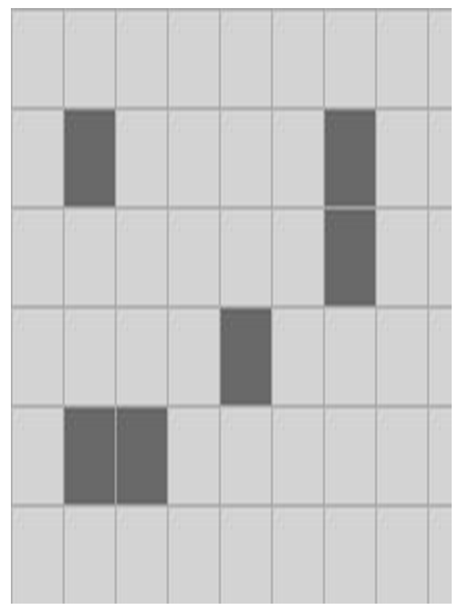
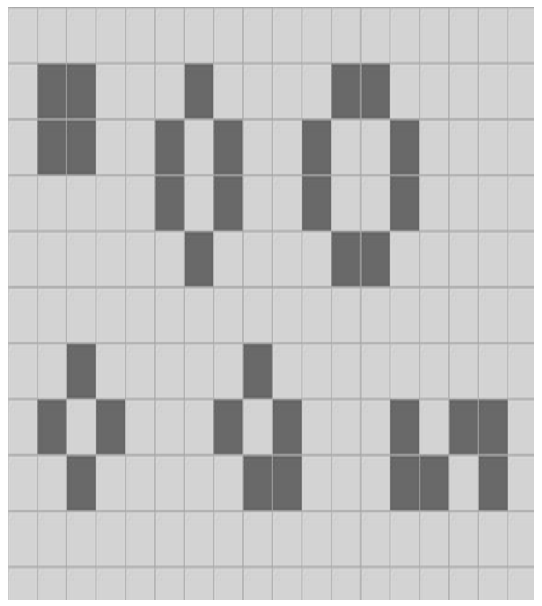
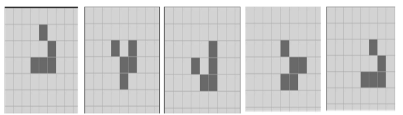
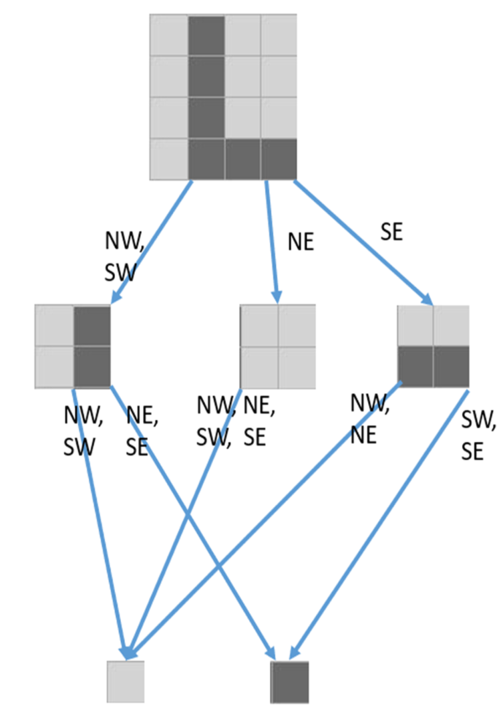
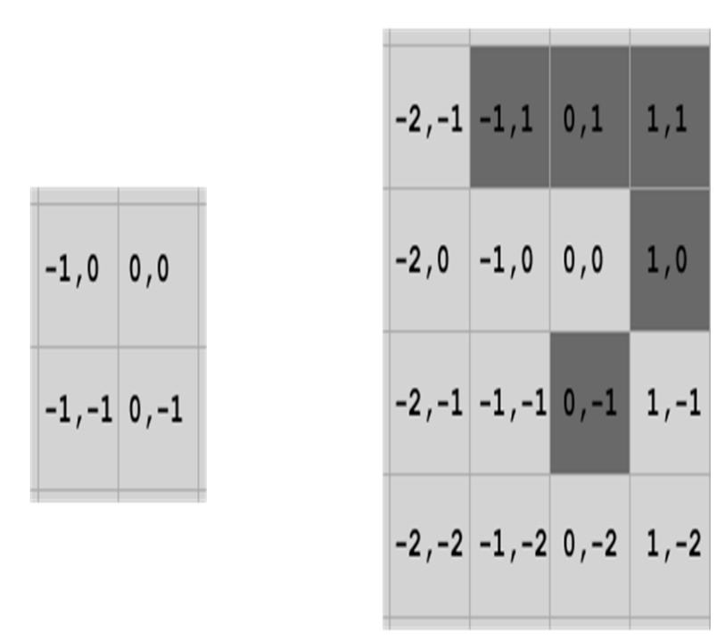
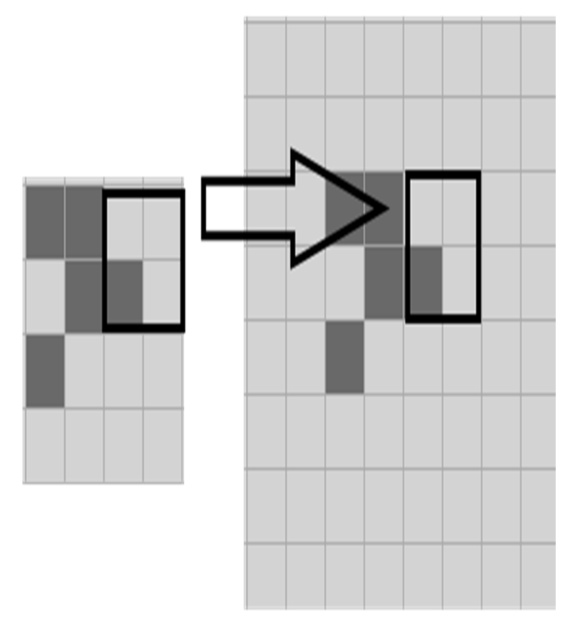
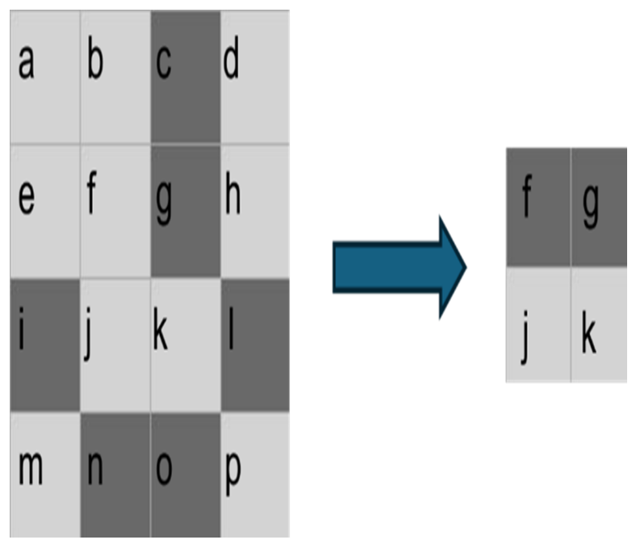
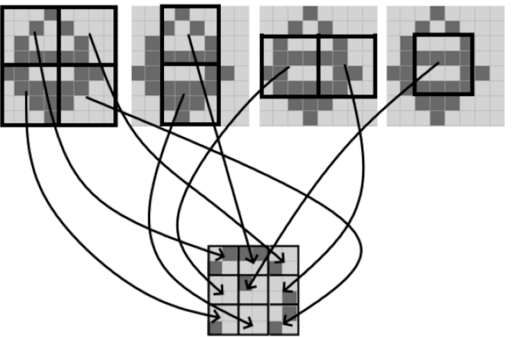
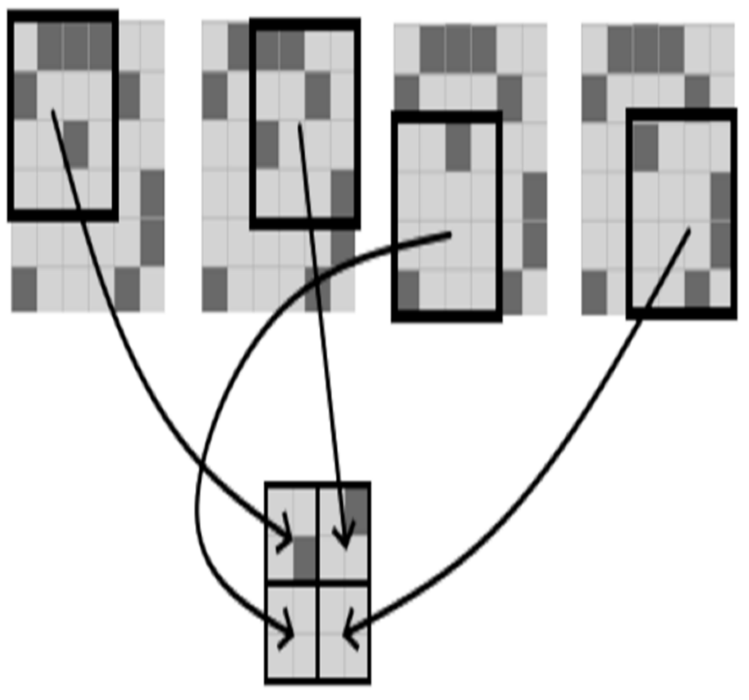
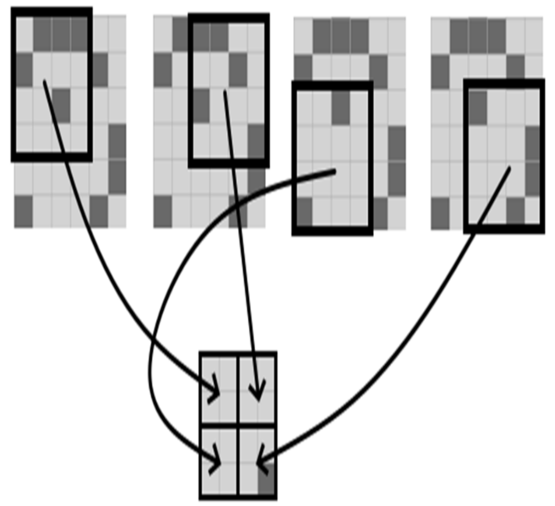

# 记忆化处理不可变-四叉树以构建更高效的生命游戏

**本章内容包括**

- 生命游戏（The Game of Life）是一个著名的、极其简单的二维网格自动机
- 四叉树(Quadtrees)能够表示细胞网格
- `HashLife` 算法将不可变性、递归与记忆化强力结合
- 通过利用特定的特性可以获得惊人的性能提升

“生命游戏”（The Game of Life，简称 “Life”）是数学家 John Conway 创建的一种细胞自动机。什么是细胞自动机（cellular automaton）？想象一个由“细胞”组成的网格，每个细胞都有某个离散的取值。网格一次一步地“演化”，每一步仅取决于前一步中取值的排列方式。它并不是传统意义上的“游戏”：虽然有规则，但没有“玩家”。相反，你可以创建某个特定的细胞排列，然后观察它们在演化过程中是否会呈现有趣的行为。

构建自己的生命游戏实现，是许多程序员在学习早期常见的练手项目，我当然也不例外。我在青少年时期就为我的 Commodore 64 和 Amiga 500 写过生命游戏的实现，之后也为了好玩多次重写过。

虽然细胞自动机最初是为了模拟流体流动、信号传播以及其他实践问题而发明的，但我在工作中从未真正需要构建任何细胞自动机；生命游戏是休闲编程的巅峰。不过，在工作中我确实需要为海量数据寻找紧凑的表示，需要在递归数据结构上执行复杂计算，并且需要使用记忆化来解决性能问题。

此外，提高算法性能基本有两种方式：你可以保持算法大体不变，但寻找方法提升“热点”部分；或者，你可以寻找待解决问题本身的特性，并加以利用。我把这两类分别称为“增量式”改进与“挑战框架式”改进。

我所知没有任何算法能比 Bill Gosper 在 1980 年代创建的 HashLife 算法更强烈地展示所有这些主题。理解这个算法改变了我对以不可变、函数式风格编程的真正力量的看法。更重要的是，当增量式改进不足以满足性能目标时，它促使我养成寻找“挑战框架”式解决方案的习惯。而且，摆弄细胞自动机真的非常有趣。

如果你碰巧从未接触过所有细胞自动机中最著名的这一款，我们将从介绍规则并构建一个典型实现开始。然后，我们会展示如何使用不可变四叉树、记忆化，以及 HashLife 算法，使你的生命游戏实现获得远超预期的速度提升。

## 生命游戏的规则

想象一张无限的平坦方形网格，就像一大张方格纸。每个细胞只有两种状态：“活”与“死”（我们将用深色表示活细胞，用浅色表示死细胞。）世界以离散的“嘀嗒”（tick）或“步”演化；在每一个嘀嗒中，一些死细胞可能诞生，一些活细胞可能死亡，还有一些保持不变，这一切依据的是每个细胞的八个邻居的状态：

- 如果某细胞恰有三个活邻居，则下一步为活。
- 如果某细胞恰有两个活邻居，则保持原状。
- 否则，该细胞在下一步为死。

让我们看一些网格片段的例子。

在这里展示的网格片段中，每个活细胞都有零个或一个活邻居，因此所有活细胞在下一步都会死亡；只有一个死细胞恰好有三个活邻居，因此会有一个细胞复活，但它会在下一步死亡，而整个网格自此将永远全部死亡（图 4.1）。

图 4.1 孤独致死：每个细胞都会在两步之内死亡。深色为活细胞，浅色为死细胞。



“静物（Still lifes）”是指这样一些细胞排列：在每一次跳变（tick）中都完全不会发生变化，因为每个活细胞都恰好有两个或三个活邻居，同时没有任何一个死细胞恰好拥有三个活邻居。静物的种类有无限多，但这里展示了一些常见的小型静物。（图 4.2）

图 4.2 方块、蜂巢、水塘、浴缸、小船以及蛇形都是不会变化的“静物”。



闪烁子（blinker）是生命游戏中最简单的振荡模式，它会在这两种状态之间来回切换，永不停止。（图 4.3）

图 4.3 闪烁子是最简单的振荡器。


滑翔机（glider）是生命游戏中发现的第一个“飞船（spaceship）”；每经过四次跳变，它会演化为与原图案相同的形状，但在其指向的方向上对角线移动了一格。如果给予它足够的空白空间，它就会沿同一方向不断对角线前进。（图 4.4）

图 4.4 第一个飞船。



当然，还有数量多得多、复杂得多的模式。有能持续发射飞船的“枪（gun）”、能像数字电路一样解决数学问题的结构，等等。生命游戏是图灵完备的；任何你可以让计算机执行的计算，都可以通过某种生命游戏的配置来模拟。这一切都十分迷人，但我们会尽量专注主题，在这里给出 HashLife 算法的解释，不做过多偏离。

## 一次典型的初次尝试

在本书中，我只想专注于算法的细节，而不是创建一个用于探索生命游戏（Life）的图形用户界面；我已经做了一个你可以试玩的 WinForms 应用，放在 `github.com/EricLippert/FabulousAdventures`，但这里不会展示它的源代码。

按照前几章的做法，我会先设计一个抽象数据类型，描述我们希望在数据上执行的操作。这一次我们用这个接口来表示一个（可变的）Life 计算引擎：

**代码清单 4.1：可变 Life 引擎的接口**

```c#
interface ILife
{
    void Clear();                               #A
    bool this[long x, long y] { get; set; }     #B
    void Step(int speed = 0);                   #C
}
```

> **注意**
> 用两个 long 索引的方形网格可以寻址 2¹²⁸ 个单元，它虽然不是无限的，但应该已经足够用了。如果你需要更多，我们可以为本章的任何算法制作使用 `BigInteger` 而不是 long 的版本，但为了简单起见，我会坚持使用 long。

这个 ADT 只有三个操作：

- `Clear` 将棋盘重置为所有细胞死亡。
- 索引器用于获取或设置某个特定细胞的状态；我们用 `true` 表示存活，`false` 表示死亡。
- `Step(speed)` 将网格向前推进 $2^{speed}$ 个 tick，所以 `Step(0)` 前进一个 tick，`Step(3)` 前进 8 个 tick，依此类推。当我们实现 HashLife 算法的最终版本时，你会看到为什么这个奇怪的选择是合理的！

当几乎所有人实现自己的第一个 Life 程序时，所采用的技术都是用一个较小的矩形数组来近似无限网格。数组之外的任何区域都是永久死亡的。这在代码简洁性与未能真正实现无限网格的 Life 规则之间进行了权衡，但这似乎是合理的权衡。

在这第一次尝试中，让我们把网格的“活跃”部分设为 x 和 y 坐标从 1 到 256 的区域：

**代码清单 4.2：朴素的双数组实现**

```c#
class BoolArrayLife : ILife
{
    private int height = 258;                       #A
    private int width = 258;
    private byte[,] cells = new byte[width, height]; #B
    private byte[,] temp = new byte[width, height];  #C
    public BoolArrayLife() {}
    public void Clear()
    {
        cells = new byte[width, height];
    }
    public bool this[long x, long y]
    {
        get
        {
            if (0 < x && x < cells.GetLength(0) - 1 &&
                0 < y && y < cells.GetLength(1) - 1)
                return cells[x, y] != 0;
            return false;                           #D
        }
        set
        {
            if (0 < x && x < cells.GetLength(0) - 1 &&
                0 < y && y < cells.GetLength(1) - 1)
                cells[x, y] = value ? (byte)1 : (byte)0;   #E
        }
    }
    public void Step(int speed = 0)                  #F
    {
        long steps = 1L << speed;                    #G
        for (long i = 0; i < steps; i += 1)
        {
            for (int y = 1; y < cells.GetLength(1) - 1; y += 1)
            {
                for (int x = 1; x < cells.GetLength(0) - 1; x += 1)
                {
                    int count = cells[x - 1, y - 1] + cells[x - 1, y]     #H
                        + cells[x - 1, y + 1] + cells[x, y - 1]
                        + cells[x, y + 1] + cells[x + 1, y - 1]
                        + cells[x + 1, y] + cells[x + 1, y + 1];          #I
                    temp[x, y] = count == 3 ||                            #J
                        (cells[x, y] != 0 && count == 2) ?
                        (byte)1 : (byte)0;                                #K
                }
            }
            var t = temp;
            temp = cells;
            cells = t;                                                    #L
        }
    }
}
```

关于这段代码有几点说明：

- 我们的策略是保留两个数组。`cells` 数组表示当前网格的状态。我们通过填充 `temp` 来计算下一状态，完成后再交换它们。你无法轻易只用一个数组，因为当某个细胞诞生或死亡时，这会改变邻居的存活计数。而把当前数组当作只读，修改临时数组来计算新网格会简单得多，即使这需要双倍的内存。
- 我们本可以在每个 `tick` 分配一个新的临时数组，但那样会增加分配器的开销，并对垃圾回收器施加额外压力；通过在当前数组和工作临时数组之间交换，我们避免了这些成本。
- 在我的性能测试中，使用 `byte` 数组而不是 `bool` 数组有一个小但可测量的优势。我真不知道为什么！在底层，`bool` 实际上也是用一个 `byte` 来实现的，因此按理说不应该有区别。但这说明在处理性能相关的选择时，没有任何方法可以替代实际测量。
- 这个朴素实现一次只能计算一步，所以最外层循环按需要的 `tick` 数重复执行算法。
- 内部循环检查所有不在数组“边缘”的细胞，并统计其活着的邻居数，以决定在下一个 `tick` 中它是存活还是死亡。
- 我们把数组的尺寸比需要的多分配了 2，在数组外边形成了一个矩形的“死亡细胞环”。这样我们就不必做任何检查以确保所检查细胞的每个邻居也在数组范围内。这用少量额外空间换来了更小、更快的代码。

### 朴素实现的性能

对这个实现你可能首先提出批评：我们有一个包含 65,536 个细胞的网格，每个细胞不是活就是死；这 65,536 比特的信息可以被压缩进 8,192 字节。而我们分配了两个数组，总共 133,128 字节，是所需容量的 16 倍以上。不过这种权衡是合理的：如果我们尝试把每 8 个细胞打包进 1 个字节、但算法保持不变，那么程序的大部分时间都会花在位运算操作上。内存是便宜的；我们用更多的内存换取更少的时间，这是一次不错的取舍。

当我们扩大规模时，这个算法的性能如何？显然，如果数组中有 n 个细胞，那么这个实现总体上消耗 O(n) 内存，并且每个 tick 要做 O(n) 的工作。

### 相同算法，更好的常数因子

通常提升性能的第一种技术是使用 `profiler` 来找出热点在哪里。然后重写热点代码，再做一次性能分析，观察是否有改进。也就是说，我们可以尝试在不根本改变算法或数据结构的前提下增量地改进程序。

代码清单 4.2 并不是我的初次尝试版本。对第一次尝试做了快速 profiler 分析后发现它在最内层循环里做了太多范围检查，于是我在数组外面加了一个两单元宽的“死亡区域”。经过几轮性能分析和调整，在我的中端桌面 PC 上，我获得了大约每秒 1200 个 tick 的性能，而且看不出还能进一步提升的明显方向。

第二种无需改变算法本质便可提升性能的技术，是把更好的硬件投入问题中。与我 1980 年代在 Commodore 64 上的实现相比，在一个 64K 单元的网格上每秒 1200 个 tick 已经快得离谱，但当然硬件在我童年之后已经进步了很长一段距离。那有没有其它方法可以“向硬件要性能”？

关键洞察是：我们本质上是在对数组中的每个元素重复相同的计算。现代处理器通常有专门用于此的指令，叫做“单指令多数据”（SIMD）指令。我们可以重写这个算法，让它在支持 SIMD 的硬件上操作位向量并进行大量并行运算。这样可以比朴素算法快大约 10 倍，并且更高效地使用内存。

更进一步，我们可以把问题交给 GPU，它是专门为“对数组中每个元素做相同计算”而优化的硬件，且数组规模可以达到数百万字节。GPU 实现通常比我的朴素数组实现要快大约 200 倍。

无论是分析和优化热点代码，还是使用更好的硬件，都无法改变一个事实：这个算法在每个 tick 上对要模拟的细胞数量是 O(n) 的。算法会查看网格中的每一个细胞；因此必然是 O(n) 每 tick。我们可以在“常数因子”上获得增量改进——200 倍的提升当然非常棒——但我们无法绕过它线性依赖于细胞总数的事实。

### 变更追踪改进算法

另一种提升性能的技术，是确定问题是否具有某些特性使其适合更好的算法。朴素算法的缺点是，它在每个 tick 上都检查数组中的每一个细胞。

我们可以挑战一下这个假设：有没有办法不在每个 tick 都检查每个细胞？例如，我们可能注意到，如果网格中的某个矩形区域满足以下两个条件，那么下一 tick 时它必定保持不变：

- 该区域完全为空或仅由静物组成，并且
- 该区域外紧挨着的矩形边界上的所有细胞都是死亡的

第一个条件可以通过在网格的一部分上运行朴素算法，并追踪新旧状态是否有变化来检测。这对该矩形区域中的细胞数需要 O(n) 的成本。

第二个条件则更容易检测，只要检查该矩形周边的所有细胞即可，如果区域大致呈方形，那成本是 O(√n)。如果我们检测到某个区域在下一 tick 必然不变，那么下一 tick 就没有必要检查其内部的任意细胞！

这种技术有很多变体，但它们都归结为：以某种方式追踪网格中可能发生变化以及肯定不会变化的区域，并避免在不变化的区域做任何工作。这样算法的复杂度就变成了每 tick 相对于发生变化的细胞数量的 O(n)，而不是相对于网格总细胞数的 O(n)。典型的生命游戏模式中，不变化的细胞远比变化的细胞多，因此这能带来巨大的性能提升。

这些算法很巧妙，但也有些繁琐，所以我不会在这里深入细节。相反，现在我们已经概述了几种传统技术，让我们来看看优雅（并且令人难以置信地快）的 HashLife 算法。它为什么叫这个名字，很快就会明白！

## 一个不可变四叉树

让我们递归地定义一种不可变四叉树（immutable quadtree，简称 quad）。这是一种用于表示任意大方形细胞数组的数据结构，其中每个细胞不是存活就是死亡。一个 n-quad 是边长为 2ⁿ 的正方形：

-  一个 0-quad 是单个细胞，要么“存活”，要么“死亡”
-  一个 n-quad（n>0）由四个 (n-1)-quad 组成，分别称为 NE、NW、SE 和 SW。

这个递归定义给了我们一棵“完全四叉树”（complete quaternary tree），其中每个非叶节点都有四个子节点，并且一个 n-quad 的根到每个叶子细胞的距离恰好是 n。

### IQuad 接口

 像之前做过的一样，我们可以先从一个抽象数据类型的接口开始：

```
interface IQuad
{
    IQuad NW { get; }
    IQuad NE { get; }
    IQuad SE { get; }
    IQuad SW { get; }
    int Level { get; }       #A
    bool IsEmpty { get; }    #B
}
```

你会注意到，这是一个非常精简的接口；我们需要在 quad 上执行的其它操作都可以通过扩展方法来实现。

### 实现 0-quad 叶子细胞

四叉树的叶子就是单个细胞。正如我们在第 2 章中，把空列表的实现做成一个嵌套类型的单例实例一样，这里我们也可以为两种叶子细胞创建“双例”（doubleton）实例。就像每个空列表其实都是同一个对象一样，每个叶子细胞其实也都可以是两个对象之一：

```
sealed class Quad : IQuad
{
    private sealed class Leaf : IQuad
    {
        public IQuad NW => throw new
            InvalidOperationException();
        public IQuad NE => throw new
            InvalidOperationException();
        public IQuad SE => throw new
            InvalidOperationException();
        public IQuad SW => throw new
            InvalidOperationException();
        public int Level => 0;
        public bool IsEmpty => this == Dead;
    }
    public static IQuad Dead { get; } = new Leaf();
    public static IQuad Alive { get; } = new Leaf();
}
```

我知道你现在大概在想什么：这也太离谱了吧！在朴素实现里，我提到过我们用 16 位存储一个细胞的 1 位信息。而到目前为止，这里做得要糟糕得多。所有东西都是引用类型，所以在现代硬件上，仅仅是引用一个对象就要占 64 位，而且在 .NET 中，即便引用类型实例没有任何字段，它本身也不可能是“零大小”的。我们要怎么才能以空间高效的方式实现非叶子的四叉树呢？

### 压缩空间的策略

要理解这一方案，我们需要意识到：叶子细胞对象总共只有两个，仅此而已。一个 2-quad 有 16 个细胞（回想一下，一个 n-quad 是边长为 2ⁿ 的正方形），但这 16 个细胞实际上都只是两个对象中的某一个，也就是两个 0-quad 之一。我们来看一个 2-quad 的例子（图 4.5）。

图 4.5 一个 2-quad 由四个 1-quad 组成，但只有两个 0-quad。


从内存使用的角度来看，这看起来更糟了！我们用 16 位——两个字节的信息，存储在七个对象中，而其中有六个对象在现代硬件上都会占用 32 字节以上的空间。但先等一等——就像我们可以重用 0-quad 一样，我们也可以重用 1-quad。通过构造下面这个等价图，我们可以节省一点空间：（图 4.6）。

图 4.6 我们可以重用其中一个 1-quad，从而稍微减轻内存负担。



这看起来也许不算什么大胜利，但想想它在规模上如何扩展：

- 有 2 个 0-quad；我们总是重用它们。
- 有 16 个 1-quad。我们可以把这 16 个对象都构造出来，并且总是重用它们。
- 可能存在 65,536 个 2-quad，而在某个给定的 Life 网格演化过程中，我们绝大多数根本不会构造出来！而即便是那些我们真的会遇到的，我们也很可能一遍又一遍地看到，特别是在某个 quad 要么是空的，要么只由静物构成的时候。

我们需要的是一个 **memoizer**。

### 通用的记忆器（memoizer）

**纯函数**是指输出只依赖其输入的函数；纯函数既不读取也不修改全局状态。任何纯函数都可以被**记忆化（memoized）**：在第一次用某个输入调用被记忆化的函数时，我们只管调用原始纯函数，并把结果记录下来——做一条备忘录（memo）——放进字典里；在之后每一次用同样参数调用时，我们就从字典里查结果，而不是重新计算：

代码清单 4.3 通用的一元函数记忆器

```csharp
sealed class Memoizer<A, R> where A : notnull
{
    private Dictionary<A, R> dict;
    private readonly Func<A, R> f;
    public Memoizer(Func<A, R> f)
    {
        this.dict = new Dictionary<A, R>();
        this.f = f;
    }
    public R MemoizedFunc(A a)
    {
        if (!dict.TryGetValue(a, out R? r))
        {
            r = f(a);
            dict.Add(a, r);
        }
        return r;
    }
    public void Clear(Dictionary<A, R>? newDict = null)
    {
        dict = newDict ?? new Dictionary<A, R>();
    }
    public int Count => dict.Count;
}
```

这是一个用于生成“记忆化函数”的工厂。构造函数接收一个一元函数作为参数，而 memoizer 对象上的 `MemoizedFunc` 方法就是该函数的记忆化版本。

在实现 HashLife 时，我们几乎立刻就会遇到一个关于记忆器的严重问题，而这正是微软性能专家 Rico Mariani 在我刚进入微软时经常提醒我的：

> 一个具有糟糕策略的缓存，换个名字就叫**内存泄漏**。

我并不想泄漏内存，因此我为记忆器增加了两个能力：一个是可以询问它目前已经做了多少条“备忘录”，一个是可以重新开始，要么使用一个空字典，要么使用调用者提供的字典。当我们实现 HashLife 时，这些缓存会变得很大，而这本身也会带来性能成本，我们稍后会看到。

你可能会疑惑：如果它只能处理一元函数，为什么叫“通用”记忆器？在下一节我们会看到为何这已经足够了。

### 记忆化的四叉树实现

我现在的主要目标，是通过使用记忆器自动去重 quads 来节省内存；我们永远不应该有两个不同的对象却表示同一个网格。采用记忆化策略还有一个很好的副作用：我们可以像之前在不可变栈、队列和双端队列那样，只通过引用比较就能回答“这个 quad 是否为空？”这一问题。

因此我们会做两个记忆化工厂：一个用于一般用途的四叉树，另一个只用于空四叉树：

代码清单 4.4 通用的一元函数记忆器

```csharp
sealed class Quad : IQuad
{
    // [ Leaf code from previous listing omitted ]
    public const int MaxLevel = 60;               #A
    public IQuad NW { get; }
    public IQuad NE { get; }
    public IQuad SE { get; }
    public IQuad SW { get; }
    public int Level { get; }
    private Quad(IQuad nw, IQuad ne, IQuad se, IQuad sw)  #B
    {
        NW = nw;
        NE = ne;
        SE = se;
        SW = sw;
        Level = nw.Level + 1;
    }
    public bool IsEmpty => this == Empty(Level);
    public
        static Memoizer<(IQuad, IQuad, IQuad, IQuad), IQuad>   #C
        MakeQuadMemoizer { get; } =                           #D
            new Memoizer<(IQuad, IQuad, IQuad, IQuad), IQuad>
                (UnmemoizedMake);
    private static IQuad UnmemoizedMake(
        (IQuad nw, IQuad ne, IQuad se, IQuad sw) args)
    {
        if (args.nw.Level != args.ne.Level ||
            args.ne.Level != args.se.Level ||
            args.se.Level != args.sw.Level ||
            args.nw.Level >= MaxLevel)                       #E
            throw new InvalidOperationException();
        return new Quad(args.nw, args.ne, args.se, args.sw);
    }
    public static IQuad Make(IQuad nw, IQuad ne, IQuad se, IQuad
        sw) =>
        MakeQuadMemoizer.MemoizedFunc((nw, ne, se, sw));
    public static Memoizer<int, IQuad> EmptyMemoizer { get; } =
        new Memoizer<int, IQuad>(UnmemoizedEmpty);
    private static IQuad UnmemoizedEmpty(int level)
    {
        if (level == 0)
            return Dead;
        var e = Empty(level - 1);
        return Make(e, e, e, e);
    }
    public static IQuad Empty(int level) =>
        EmptyMemoizer.MemoizedFunc(level);
}
```

我这里强加了一个最大尺寸限制：最大是 60-quad，也就是说一条边上有 2⁶⁰ 个单元的方形网格。如果你真要做一个显示器，用合适的像素大小把整个网格显示出来，它的尺寸会大到塞不进冥王星轨道，而且质量会超过太阳，所以希望这对你来说已经够大了。但如果你想要更大的网格，你可以把我写成 `long` 的地方都改成 `BigInteger`，这样你的 Life 网格在尺寸上就真的是无限制了。

一个空的 60-quad 的内存大小是多少？它表示的是一个含有 2¹²⁰ 个细胞的网格，但在内存里它只有 61 个对象，每个对象的字段大小不超过 36 字节！我们能够把任意数量的全零比特压缩成一个小数据结构，这并不令人意外。但我们真正实现的是：一个大网格的内存负担与网格的**尺寸**本身几乎没有关系，而是与“活细胞和死细胞模式中有多少不规则性（irregularity）”有关。

我之前提到过：当你已经用尽各种“常数级别”的性能优化手段之后，进一步提升性能的最佳方法，就是找到问题中某个可以用“重新构思框架”的方式来改进的特定方面。Gosper 的 Life 算法有一个核心洞察：**对于较小的 quads 来说，这种数据结构远不如位数组高效，但对于极其庞大、而又几乎完全为空的 quads 来说，它的效率却高得惊人。**

### 像数组一样索引不可变四叉树

我已经把一个 n-quad 描述为一个方形的细胞数组，其中每个细胞要么存活要么死亡；既然如此，我们当然也应该能够像访问数组一样访问这个数据结构。我们需要约定一种索引方式，而下面这种约定已经足够合理：

- 对于一个 0-quad，默认情况下唯一有效的索引是 (0,0)。
- 对于一个 n-quad（n>0），除非另有说明，它的左下角（即西南角）坐标是 (-2ⁿ⁻¹, -2ⁿ⁻¹)。

下面的图（图 4.7）展示了 1-quad 和 2-quad 在默认情况下的索引范围，这应该能让概念更直观：

图 4.7 一个 1-quad 的索引范围是从西南角的 -1,-1 到东北角的 0,0。一个 2-quad 的索引范围是从西南角的 -2,-2 到东北角的 1,1。



为了方便起见，我们会使用元组来表示索引，因此我会定义一个别名，让代码更具有自说明性。在此过程中我们会写两个很有用的辅助方法：一个计算 n-quad 的宽度，一个判断一个点是否位于某个 n-quad 内。代码清单 4.5 展示了用来读取 quad 中单个细胞的“getter”逻辑：

代码清单 4.5 在某一点读取四叉树的扩展方法

```csharp
using QuadPoint = (long X, long Y);

static class Extensions
{
    public static long Width(this IQuad quad) =>
        1L << quad.Level;                               #A

    public static bool Contains(this IQuad quad, QuadPoint p)
    {
        if (quad.Level == 0)
            return p == (0, 0);
        long w = quad.Width() / 2;
        return -w <= p.X && p.X < w && -w <= p.Y && p.Y < w;
    }

    public static IQuad Get(this IQuad quad, QuadPoint p)
    {
        if (!quad.Contains(p))
            throw new InvalidOperationException();
        if (quad.Level == 0)
            return quad;
        if (quad.IsEmpty)                                #B
            return Quad.Dead;

        long w = quad.Width() / 4;

        QuadPoint newp = (                               #C
            quad.Level == 1 ? 0 : 0 <= p.X ? p.X - w : p.X + w,
            quad.Level == 1 ? 0 : 0 <= p.Y ? p.Y - w : p.Y + w);

        if (0 <= p.X)
            if (0 <= p.Y)
                return quad.NE.Get(newp);
            else
                return quad.SE.Get(newp);
        else if (0 <= p.Y)
            return quad.NW.Get(newp);
        else
            return quad.SW.Get(newp);
    }
}
```

这里 tricky 的部分在于理解：在一个 2-quad 中的点 (0,0)，其实对应的是它东北方向 1-quad 中的 (-1,-1)，而不是 (0,0)。幸运的是，数学关系很简单：如果递归将进入 0-quad，那么新坐标就是 (0,0)；否则就可以通过适当的加减来计算新的坐标。

想必你已经推断出，相应的“setter”逻辑会在请求设置某点的细胞状态时返回一个新的四叉树；毕竟四叉树是不可变的。得益于 Make 方法的记忆化，如果我们试图把一个细胞设置为它已经有的值，那么返回的 quad 就会完全不变；如果一个细胞被更新为不同的值，那么新版本中绝大多数对象都将被重用。四叉树数据结构的持久性非常好。

代码清单 4.6 展示了在四叉树中修改某个细胞的 “setter” 逻辑。毫不意外，setter 逻辑与 getter 的逻辑高度对应：

代码清单 4.6 在某一点写入四叉树的扩展方法

```csharp
static class Extensions
{
    public static IQuad Set(this IQuad quad, QuadPoint p, IQuad q)
    {
        Debug.Assert(q != null && q.Level == 0);
        if (!quad.Contains(p))
            throw new InvalidOperationException();

        if (quad.Level == 0)                              #A
            return q;

        if (q == Quad.Dead && quad.IsEmpty)              #B
            return quad;

        long w = quad.Width() / 4;

        QuadPoint newp = (                               #C
            quad.Level == 1 ? 0 : 0 <= p.X ? p.X - w : p.X + w,
            quad.Level == 1 ? 0 : 0 <= p.Y ? p.Y - w : p.Y + w);

        var nw = quad.NW;
        var ne = quad.NE;
        var se = quad.SE;
        var sw = quad.SW;

        if (0 <= p.X)
            if (0 <= p.Y)
                ne = quad.NE.Set(newp, q);
            else
                se = quad.SE.Set(newp, q);
        else if (0 <= p.Y)
            nw = quad.NW.Set(newp, q);
        else
            sw = quad.SW.Set(newp, q);

        return Quad.Make(nw, ne, se, sw);                 #D
    }
}
```

再一次，最费脑筋的部分是在递归时算出目标点的新坐标，而我们用的正是与 getter 完全相同的数学逻辑。

### 一些更多有用的扩展方法

在进入 HashLife 的实际生命（Life）部分之前，我们需要一些辅助方法来扩大一个 quad 的尺寸、提取子 quad，并检查 quad 的边缘。

举例来说，假设我们有一个 2-quad，并且希望它位于一个其它部分为空的 3-quad 的中心。那在构造新的 3-quad 时，被我标出的那个 1-quad 应该如何处理呢？（图 4.8）。

图 4.8 一个 2-quad 被“放大”（embiggened），使得我们得到一个 3-quad，并且 2-quad 的细胞位于其中心。注意当我们把它放入 3-quad 时，2-quad 的东北部分发生了什么变化。



原始 2-quad 的那个东北 1-quad 成为了 3-quad 的东北 2-quad 的西南 1-quad。类似地，原始 2-quad 的另外三个 1-quad 被移动到构成该 3-quad 的新 2-quad 的角落里。让我们写一个执行此操作的小辅助方法：

```csharp
public static IQuad Embiggen(this IQuad quad)
{
    if (quad.Level == 0)
        throw new InvalidOperationException();
    if (quad.Level >= Quad.MaxLevel)
        return quad;
    var e = Quad.Empty(quad.Level - 1);
    return Quad.Make(
        Quad.Make(e, e, quad.NW, e),
        Quad.Make(e, e, e, quad.NE),
        Quad.Make(quad.SE, e, e, e),
        Quad.Make(e, quad.SW, e, e));
}
```

再次强调，即使在我们的示例中我们总共添加了十二个新的 1-quad，它们实际上都是同一个空的 1-quad。由于它是不可变的，我们可以只分配一次该对象并根据需要多次重用。

我们刚刚看到，把 2-quad 放大成 3-quad 会在新的 3-quad 外围形成一个由 12 个空 1-quad 构成的“环”。稍后我需要一个辅助方法来判断某个 quad 是否已经拥有这样一个空环；我们现在就可以实现它。方法只是对 IsEmpty 的十二次调用：

```csharp
public static bool HasAllEmptyEdges(this IQuad quad) =>
    quad.NW.NW.IsEmpty &&
    quad.NW.NE.IsEmpty &&
    quad.NE.NW.IsEmpty && quad.NE.NE.IsEmpty &&
    quad.NE.SE.IsEmpty && quad.SE.NE.IsEmpty &&
    quad.SE.SE.IsEmpty && quad.SE.SW.IsEmpty &&
    quad.SW.SE.IsEmpty && quad.SW.SW.IsEmpty &&
    quad.SW.NW.IsEmpty && quad.NW.SW.IsEmpty;
```

最后，我需要提取的不仅仅是某个 quad 的西北、东北、西南和东南子 quad。我需要做 embiggening 的反操作，提取某个 n-quad 的中心 (n−1)-quad，以及类似地提取其北、南、东和西的 (n−1)-quad：

```csharp
public static IQuad Center(this IQuad quad) =>
    Quad.Make(quad.NW.SE, quad.NE.SW, quad.SE.NW, quad.SW.NE);

public static IQuad North(this IQuad quad) =>
    Quad.Make(quad.NW.NE, quad.NE.NW, quad.NE.SW, quad.NW.SE);

public static IQuad East(this IQuad quad) =>
    Quad.Make(quad.NE.SW, quad.NE.SE, quad.SE.NE, quad.SE.NW);

public static IQuad South(this IQuad quad) =>
    Quad.Make(quad.SW.NE, quad.SE.NW, quad.SE.SW, quad.SW.SE);

public static IQuad West(this IQuad quad) =>
    Quad.Make(quad.NW.SW, quad.NW.SE, quad.SW.NE, quad.SW.NW);
```

现在我们已经有了这些有用的扩展方法，可以进入 HashLife 的核心部分了：如何计算包含某个 Life 模式的 quad 的下一帧（next tick）？

## Gosper 的 HashLife 算法

HashLife 的基本思想是：对于任意 n-quad（当 n>1 时），其自身包含足够的信息来计算其中心的 (n-1)-quad 在若干 tick 之后的状态。我们将巧妙地利用这一事实，将常见模式的未来状态进行记忆化（memoize），从而让大型 quad 一次性前进许多代。到达这一点的过程将会是一次奇妙的旅程，而我们将从最基础的地方开始。

在本章最开始，我们定义了一个可变 Life 网格 ADT 的接口。现在让我们用 quad 作为数据结构来实现它：

**代码清单 4.7 Gosper 的 HashLife 算法的类**

```csharp
using static Quad;
sealed class HashLife : ILife
{
    private IQuad cells = Empty(9);
    private int stepCallCount = 0;
    public HashLife(){}
    public void Clear() => cells = Empty(9);
    public bool this[long x, long y]
    {
        get => cells.Contains((x, y)) && cells.Get((x, y)) !=
               Dead;
        set
        {
            while (!cells.Contains((x, y)))
                cells = cells.Embiggen();
            cells = cells.Set((x, y), value ? Alive : Dead);
        }
    }
}
```

我们从一个空的 9-quad 开始，一个边长为 512 个单元的方形网格；对于理性的人来说，这似乎是一个合理的大小。但无论 quad 树本身多小，如果我们的实现能模拟任意大的网格，那就更好了；如果查询 quad 树之外的单元状态，我们就说它是死亡的。如果我们试图设置 quad 树之外的单元状态，我们可以不断扩大（embiggen）quad 树直到足够大。

quad 树是一种递归数据结构，因此 HashLife 是递归的并不奇怪。那么它的基例是什么呢？

### 基例：对一个 2-quad 进行 step 产生一个 1-quad

激发 quad 树数据结构的重大洞见在于：我们可以通过消除重复的 n-quad 来压缩空间。但这与 Life 的规则本身无关；所有不可变 quad 树都成立。与 Life 相关的 Gosper 的重大洞见是：网格中的任意一个 2-quad——也就是一个边长为四个单元的方形——恰好包含足够的信息来计算其中心 1-quad 在下一 tick 的状态。

让我们看一个例子来说明这一点。当包含这里所示 2-quad 的任意网格前进一步时，该 2-quad 中心区域的单元将成为 1-quad 中的单元。（图 4.9）。我已经用代码清单 4.8 中变量的名称标记了每个单元：

图 4.9 如果我们只给定一个 2-quad 并希望将它前进一个 tick，我们只能知道其中心 1-quad 的未来状态。图中单元被标注为下面代码中代表它们的变量名。



相比之下，单独的 1-quad 或 0-quad 都不包含足够的信息来计算任何单元的未来状态。因此，基例接受一个 2-quad 并返回对应的、前进一 tick 后的 1-quad：

**代码清单 4.8 Gosper 算法的基例**

```csharp
private static IQuad Rule(IQuad q, int count) => #A
    count switch { 2 => q, 3 => Alive, _ => Dead };

private static IQuad StepBaseCase(IQuad q) #B
{
    Debug.Assert(q.Level == 2);
    int a = (q.NW.NW == Dead) ? 0 : 1;
    int b = (q.NW.NE == Dead) ? 0 : 1;
    int c = (q.NE.NW == Dead) ? 0 : 1;
    int d = (q.NE.NE == Dead) ? 0 : 1;
    int e = (q.NW.SW == Dead) ? 0 : 1;
    int f = (q.NW.SE == Dead) ? 0 : 1;
    int g = (q.NE.SW == Dead) ? 0 : 1;
    int h = (q.NE.SE == Dead) ? 0 : 1;
    int i = (q.SW.NW == Dead) ? 0 : 1;
    int j = (q.SW.NE == Dead) ? 0 : 1;
    int k = (q.SE.NW == Dead) ? 0 : 1;
    int l = (q.SE.NE == Dead) ? 0 : 1;
    int m = (q.SW.SW == Dead) ? 0 : 1;
    int n = (q.SW.SE == Dead) ? 0 : 1;
    int o = (q.SE.SW == Dead) ? 0 : 1;
    int p = (q.SE.SE == Dead) ? 0 : 1;
    int nf = a + b + c + e + g + i + j + k;
    int ng = b + c + d + f + h + j + k + l;
    int nj = f + g + h + j + l + n + o + p;
    int nk = e + f + g + i + k + m + n + o;
    return Make(
        Rule(q.NW.SE, nf), Rule(q.NE.SW, ng),
        Rule(q.SE.NW, nj), Rule(q.SW.NE, n22));
}
```

变量 a 到 p 各自代表原始 2-quad 中 16 个单元的值。nf、ng、nj 和 nk 则分别是标记为 f、g、j 和 k 的单元的活邻居数量。这些信息足以让我们创建一个 1-quad，表示中心单元在前进一 tick 后的状态。

###  第一次尝试递归算法

图 4.10 给定一个 3-quad，我们可以从中提取出九个 2-quad，并将它们各自前进一步，得到九个位于未来一个 tick 的 1-quad。



我们已经看到，可以把一个 2-quad 前进一步，得到其中心的 1-quad。那么，如果我们有一个想要前进的 3-quad 呢？我们可以把基例逻辑应用九次：一次应用在四个子 2-quad 上，另外五次应用在之前通过 North、South、East、West 和 Center 这些辅助扩展得到的五个 2-quad 上。这样我们就得到了九个 1-quad，它们都位于未来一个 tick。（图 4.10）

九个 1-quad 并不完全是我们想要的东西，但我们想要的信息都包含在里面。如果我们把这九个 1-quad 重新组合成四个 2-quad，就可以从每个 2-quad 中取出中心部分，得到四个 1-quad。而这四个 1-quad 又可以组成一个 2-quad。（图 4.11）。

图 4.11 给定九个都位于未来一个 tick 的 1-quad，我们可以把它们组合成四个 2-quad。再从这四个 2-quad 中各自取出中心的 1-quad，用这四个中心 1-quad 构造出一个 2-quad，它就是原始 3-quad 在未来一个 tick 时刻的中心。



总之，我们可以从一个 3-quad 推导出它在未来一个 tick 的中心 2-quad。这个思路可以推广成一个递归算法：给定任意 n-quad，我们都可以推导出其中心 (n-1)-quad 在未来一个 tick 的状态。现在让我们来写代码！

代码清单 4.9 第一次尝试递归 step 算法

```csharp
class Gosper : ILife { [...]
public void Step(int speed = 0) #A
{
	cells = Step(cells); #B
}
private static IQuad Step(IQuad q)
{
	Debug.Assert(q.Level >= 2);
	IQuad r;
	if (q.IsEmpty) #C
		r = Quad.Empty(q.Level - 1);
	else if (q.Level == 2)
		r = StepBaseCase(q);
    else
    {
        IQuad q9nw = Step(q.NW);
        IQuad q9n = Step(q.North());
        IQuad q9ne = Step(q.NE);
        IQuad q9w = Step(q.West());
        IQuad q9c = Step(q.Center());
        IQuad q9e = Step(q.East());
        IQuad q9sw = Step(q.SW);
        IQuad q9s = Step(q.South());
        IQuad q9se = Step(q.SE);
        IQuad q4nw = Make(q9nw, q9n, q9c, q9w);
        IQuad q4ne = Make(q9n, q9ne, q9e, q9c);
        IQuad q4se = Make(q9c, q9e, q9se, q9s);
        IQuad q4sw = Make(q9w, q9c, q9s, q9sw);
        IQuad rnw = q4nw.Center();
        IQuad rne = q4ne.Center();
        IQuad rse = q4se.Center();
        IQuad rsw = q4sw.Center();
        r = Make(rnw, rne, rse, rsw);
    }
    Debug.Assert(q.Level == r.Level + 1);
    return r;
}

```

这里有一个很好的优化：如果一个 quad 完全是空的，那么在下一个 tick，它的中心也一定是空的。在这种情况下我们可以完全跳过任何计算；对于包含大量空白区域的网格来说，这是一个巨大的性能提升。我们再次利用了自己对 Life 规则所掌握的一个特殊事实，来获得性能上的收益。

尽管这对空 quad 来说是个不错的优化，但你对非空 quad 可能还有几个疑虑！第一，看起来网格在每次 step 时都在缩小。第二，对于每一次非基例的递归调用，我们都要做九次递归 step；即使是像 8-quad 这样规模并不算大的网格，这样做怎么可能高效？下面我们就逐个来看这些问题。

### 网格总是在收缩

每当我们将一个 n 阶四叉格向前推进一个 tick，我们最终都会得到一个 (n-1) 阶四叉格，它的细胞数量只有原来的四分之一。难道我们不会在几步之内把网格缩得非常小吗？更糟的是，如果有一艘飞船正朝着四叉树当前的边缘移动怎么办？如果我们在模拟一个无限网格，那么在某个时刻我们理应让网格变大，但现在它在每一步中都变得更小。

第一个问题可以通过修复 Step 方法中的 bug 来解决。我们要建立的约束是不论何时调用 Step(IQuad) 之前，中心的任何活细胞周围都必须有大量的空白空间：

```csharp
public
void Step(int speed = 0) #A
{
    IQuad current = cells;
    if (!current.HasAllEmptyEdges())
        current = current.Embiggen().Embiggen();
    else if (!current.Center().HasAllEmptyEdges())
        current = current.Embiggen();                                   #B
    IQuad next = Step(current);                                         #C
    cells = next.Embiggen();                                            #D
}
```

通过按需扩张（embiggen）网格，我们可以确保永远不会有活细胞靠近边界。通过在推进之后再扩张一次，网格就不会再变小了。网格不再收缩。事实上，如果活细胞接近边缘，它会按需扩张。让任意多的死空间基本不占成本，这是该算法的一大胜利。

### 这个算法效率低吗？

修复 Step 的 bug 并不困难，但这让我们面临一个更棘手的问题。如果我们有一个 8 阶四叉格，那么我们会在 7 阶四叉格上做 9 次递归，而这会在 6 阶四叉格上做 81 次递归，而这又会在 5 阶四叉格上做 729 次递归，依此类推。显然，这个算法在推进一个 n 阶四叉格时，时间复杂度至多是恐怖的 O(9ⁿ⁻²)，对吧？一个 n 阶四叉格有 4ⁿ 个细胞，但即便我们按每个细胞来计算渐进复杂度，它仍然是指数级地糟糕。

我们已经有一个优化：推进一个空四叉格不会发生递归，并且网格中通常有大量空四叉格。这有所帮助。更重要的洞见是：Step 是一个纯函数，因此可以被记忆化（memoize）！就像 Make 方法的记忆化压缩了空间，因为某些四叉格会重复出现一样，对 Step 方法进行记忆化可以用更多空间（缓存）换更少时间，因为不会重复对这些重复的四叉格调用 Step。

记忆化策略对性能的影响很难准确预测；你必须进行真实世界的实验。我把记忆化加入到本文介绍的 HashLife 版本中，并对一些典型的小型 Life 配置进行了 5000 tick 的统计，结果如下：

- 本版本的性能大致与朴素数组算法相当。
- 用于记忆化 Step 和 Make 方法的两个缓存共有数百万条目，每条对应一组不同的参数。
- 在这数百万条缓存中，只有区区 20 条占了 40% 的调用量，只有几百条占了 50%。这些条目非常“热”。
- 97% 的缓存条目命中次数不到 20 次。50% 再也没有命中；这些调用是独一无二的。大多数缓存条目非常“冷”。

这种“幂律”分布的冷热条目既令人鼓舞又令人担忧。鼓舞的是，如果只有几百条缓存条目代表了 50% 的调用，那么记忆化几乎在一半的时间里都是巨大的胜利。担忧的是，那长尾的 97% 的数百万条独特缓存条目通常计算昂贵，却在缓存中浪费了大量内存，而回报甚微甚至为零。

一个更复杂的记忆器应当保留命中频率最高的缓存条目，丢弃那些不太可能再次命中的条目，从而在增加内存负担与提升速度之间找到一个可接受的平衡。我们或许应该改进记忆器。

我们稍后再回到这个点，但首先：我们漏掉了一个技巧！到目前为止我展示的并不是 HashLife 的完整实现。再仔细看看图 4.11，看看你能否发现我们漏掉了什么。

### 向前迈出更大的步伐

在我们第一次尝试构建递归 step 算法（图 4.11）时，我们从一个 3 阶四叉格开始：一个 8×8 的细胞网格。在此基础上，我们对九个 2 阶四叉格做了递归，得到一个向前推进了一个 tick 的 6×6 网格，然后构建四个 2 阶四叉格并取它们的中心构成一个新的 2 阶四叉格。结果就是原始 3 阶四叉格的中心，只不过向前推进了一个 tick。

回忆一下，我们有两个方法可以返回 2 阶四叉格的中心 1 阶四叉格。`Center` 辅助方法只是提取那些细胞。`Step` 方法则会提取那些细胞在未来一个 tick 时的样子。如果我们不调用 `Center`，而是调用 `Step`，那么我们将得到一个 2 阶四叉格，它是原始 3 阶四叉格在未来两个 tick 的中心。（图 4.12）

图 4.12 给定九个 1 阶四叉格，它们都是原始 3 阶四叉格向前推进一个 tick 的结果，我们可以把它们组成四个 2 阶四叉格。我们不是简单地取它们的中心，而是对每个 2 阶四叉格再向前推进一个 tick。这样我们从每个得到一个 1 阶四叉格，并用它们构造一个 2 阶四叉格——它是原始 3 阶四叉格向前推进两个 tick 的中心，而不是一个。



让我们把目前为止的内容总结一下：

- 如果我们有一个 2 阶四叉格，我们可以得到一个在未来一个 tick 的 1 阶四叉格；这就是递归的基例。
- 我们刚刚看到，如果我们有一个 3 阶四叉格，我们可以得到一个在未来两个 tick 的 2 阶四叉格。
- 现在假设我们有一个 4 阶四叉格。我们能对此做些什么？

我们可以提取它的西北、北、东北、西、中心、东、西南、南和东南这九个 3 阶四叉格。

- 我们可以把这九个“当前”的 3 阶四叉格各自向前推进两个 tick，得到九个在未来两个 tick 的 2 阶四叉格。
- 我们可以将这九个 2 阶四叉格组合成四个在未来两个 tick 的 3 阶四叉格。
- 我们可以把这四个 3 阶四叉格再向前推进两个 tick，得到四个在未来四个 tick 的 2 阶四叉格。
- 我们可以将这四个 2 阶四叉格组合成一个在未来四个 tick 的 3 阶四叉格。

也就是说，如果我们有一个 4 阶四叉格，我们可以得到一个在未来四个 tick 的 3 阶四叉格。继续下去！如果我们有一个 5 阶四叉格，我们可以用同样的技术得到它的中心 4 阶四叉格在未来八个 tick 时的状态，依此类推。

一般的递归情形是：如果我们有一个 n 阶四叉格并希望尽可能向前推进，我们可以对 (n−1) 阶四叉格递归调用总共 13 次。当“硝烟散去”时，我们会得到一个 (n−1) 阶四叉格，它是原始 n 阶四叉格的中心，并且它在未来 2ⁿ⁻² 个 tick。

例如，如果你有一个网格并且想知道它在 1024 个 tick 后的样子，你不必推进它 1024 次；你可以把它扩张（embiggen）到至少为 12 阶四叉格，这个递归算法就会告诉你它的中心 11 阶四叉格在未来 2¹⁰ 个 tick 后的状态！

现在应该更清楚为什么 Step 方法有一个 speed 参数，以及为什么它表示“向前推进 2^speed 个 tick”。如我们将在下一节的最终 Step 函数版本中看到的，我们可以将这两个 step 算法结合成一个更灵活的实现，从而以任何从 0 到 n−2 的速度推进一个 n 阶四叉格。

### 综合起来

让我们把关于 Gosper 算法的所有内容组合起来。我们要做两件事：对 Step 方法进行记忆化，并实现“快速推进”版本的算法。由于我们看到缓存很可能会快速膨胀且大多数条目再也不会被使用，我们还将为记忆器加入一个简单的自动调节的缓存过期策略。

**代码清单 4.10：Gosper 算法的一种实现**

```csharp
sealed class HashLife : ILife
{
    private IQuad cells = Empty(9);
    private int stepCallCount = 0;
    public HashLife(){}
    public void Clear() => cells = Empty(9);
    [...The indexer and StepBaseCase are as above...]

    private static IQuad UnmemoizedStep((IQuad q, int speed) args) #A
    {
        IQuad q = args.q;
        int speed = args.speed;
        IQuad r;

        if (q.IsEmpty)
            r = Quad.Empty(q.Level - 1);
        else if (speed == 0 && q.Level == 2)
            r = StepBaseCase(q);
        else
        {
            int nineSpeed = (speed == q.Level - 2) ? speed - 1 : speed;    #B

            IQuad q9nw = Step(q.NW, nineSpeed);
            IQuad q9n  = Step(q.North(), nineSpeed);
            IQuad q9ne = Step(q.NE, nineSpeed);
            IQuad q9w  = Step(q.West(), nineSpeed);
            IQuad q9c  = Step(q.Center(), nineSpeed);
            IQuad q9e  = Step(q.East(), nineSpeed);
            IQuad q9sw = Step(q.SW, nineSpeed);
            IQuad q9s  = Step(q.South(), nineSpeed);
            IQuad q9se = Step(q.SE, nineSpeed);

            IQuad q4nw = Make(q9nw, q9n,  q9c,  q9w);
            IQuad q4ne = Make(q9n,  q9ne, q9e,  q9c);
            IQuad q4se = Make(q9c,  q9e,  q9se, q9s);
            IQuad q4sw = Make(q9w,  q9c,  q9s,  q9sw);

            if (speed == q.Level - 2)                                      #C
            {
                IQuad rnw = Step(q4nw, speed - 1);
                IQuad rne = Step(q4ne, speed - 1);
                IQuad rse = Step(q4se, speed - 1);
                IQuad rsw = Step(q4sw, speed - 1);
                r = Make(rnw, rne, rse, rsw);
            }
            else                                                           #C
            {
                IQuad rnw = q4nw.Center();
                IQuad rne = q4ne.Center();
                IQuad rse = q4se.Center();
                IQuad rsw = q4sw.Center();
                r = Make(rnw, rne, rse, rsw);
            }
        }

        Debug.Assert(q.Level == r.Level + 1);
        return r;
    }

    private int maxCache = 200000;

    static Memoizer<(IQuad, int), IQuad> StepSpeedMemoizer { get; }
        = new Memoizer<(IQuad, int), IQuad>(UnmemoizedStep);

    private static IQuad Step(IQuad q, int speed) =>
        StepSpeedMemoizer.MemoizedFunc((q, speed));

    public void Step(int speed = 0)
    {
        if (speed < 0 || speed > MaxLevel - 2)
            throw new InvalidOperationException();

        bool resetMaxCache = false;
        stepCallCount += 1;

        if ((stepCallCount & 0x1ff) == 0)
        {
            int cacheSize =
                Quad.MakeQuadMemoizer.Count +
                StepSpeedMemoizer.Count;

            if (cacheSize > maxCache)
            {
                resetMaxCache = true;
                ResetCaches();
            }
        }

        IQuad current = cells;

        if (!current.HasAllEmptyEdges())
            current = current.Embiggen().Embiggen();
        else if (!current.Center().HasAllEmptyEdges())
            current = current.Embiggen();

        while (current.Level < speed + 2)
            current = current.Embiggen();

        IQuad next = Step(current, speed);
        cells = next.Embiggen();

        if (resetMaxCache)
        {
            int cacheSize =
                Quad.MakeQuadMemoizer.Count +
                StepSpeedMemoizer.Count;

            maxCache = Max(maxCache, cacheSize * 2);
        }
    }

    private static void ResetCaches()
    {
        [...Do whatever work is necessary to throw away cached
        state...]
    }
}
```

我实现了一个简单的自动调节缓存淘汰策略：每隔几百次对公共 `Step` 方法的调用，我们检查 `Make` 和私有 `Step` 方法的缓存条目的总数是否超过了先前的最大值。如果超过了，我们就丢弃一些缓存状态，并记录新的最大值。在实践中，这使得内存与速度得到了很好的平衡。通过回收那 97% 的仅被命中很少次数的条目，我们减少了内存占用，但缓存重建期间的性能损失也被控制在合理范围内。一个更复杂的解决方案应该构建一个 LRU（最近最少使用）缓存，只逐出那些几乎不会再次命中的条目。

管理记忆器巨大的内存消耗是实现 `HashLife` 时的一项重要实际挑战，但如果我们忽略这些，它的渐进性能特性如何呢？我们之前已经论证，记忆化 `Make` 函数使我们能够将巨大的网格压缩到内存消耗为 O（变化量）而不是 O（细胞数量）；通过去重大量相同区域，我们在处理大型网格时节省了大量内存。时间方面也是如此！如果我们已经计算过一个 20 阶四叉格在未来 2¹⁸ 个 tick 时的状态，并且这个 20 阶四叉格很常见，那么复用这一事实完全不需要额外工作。

在生命游戏中非常常见的是，初始阶段会有数百甚至数千 tick 的混乱变化，然后一切会趋于静止结构、振荡器和飞船。HashLife 在初始阶段表现不佳，但一旦它记忆化了大片稳定区域的演化，它就会变成 O(1)，不论网格大小如何！

## 小结

本章我们讨论的具体问题是娱乐性的，而不是实用性的；我从未需要为了工作而把一个元胞自动机演化到万亿代。而“好玩”就是做任何事情的充分理由。

然而，本章使用的技术对我的工作产生了深远影响。我多次使用记忆化（memoization）作为一种去重复杂数据结构、以缓存空间换取性能提升的技术。我也不得不考虑如何调优这些缓存的性能，以确保它们不会变成内存泄漏。

更重要的是，学习 Gosper 的算法让我养成了一个习惯：在设计算法时，总会思考是否有问题本身的某些特性可以被利用。这提醒我，当现有算法的渐进式改进已经达到极限时，应当寻找那些能够改变问题框架的解法。

在下一章，我们将看到如何将复杂数据结构的去重应用到一个完全不同的问题上：**表示一个 Scrabble（拼字游戏）字典**。