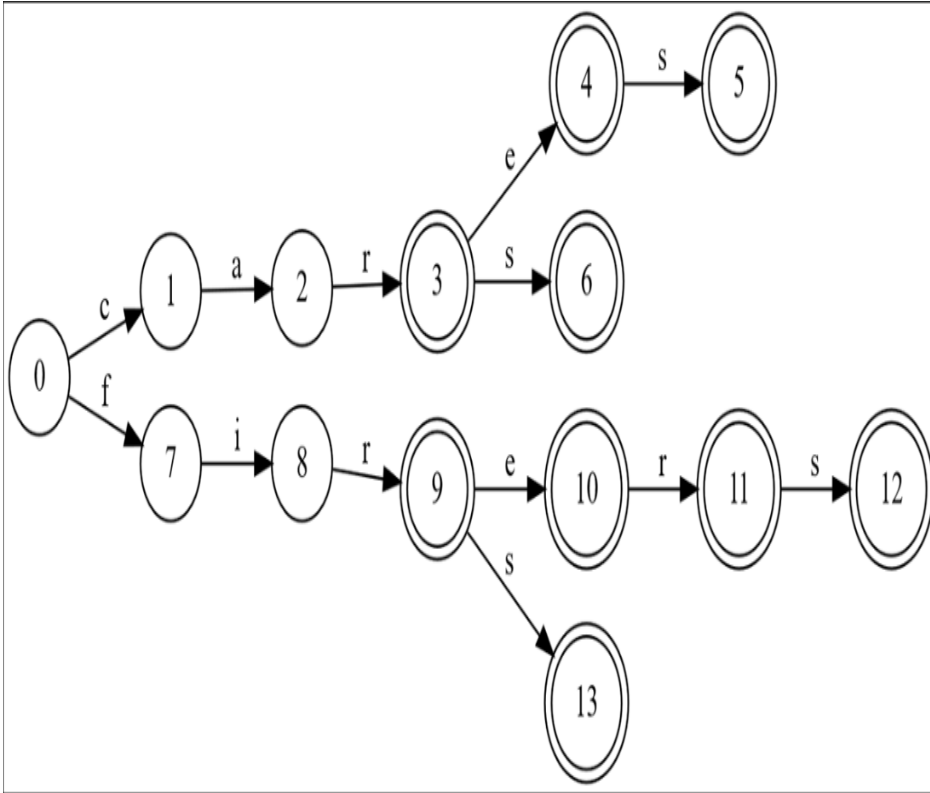
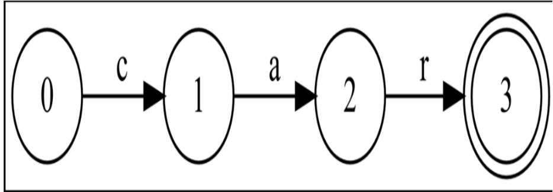
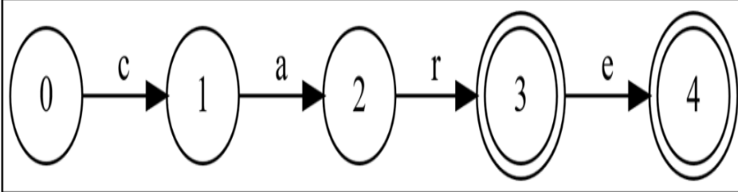
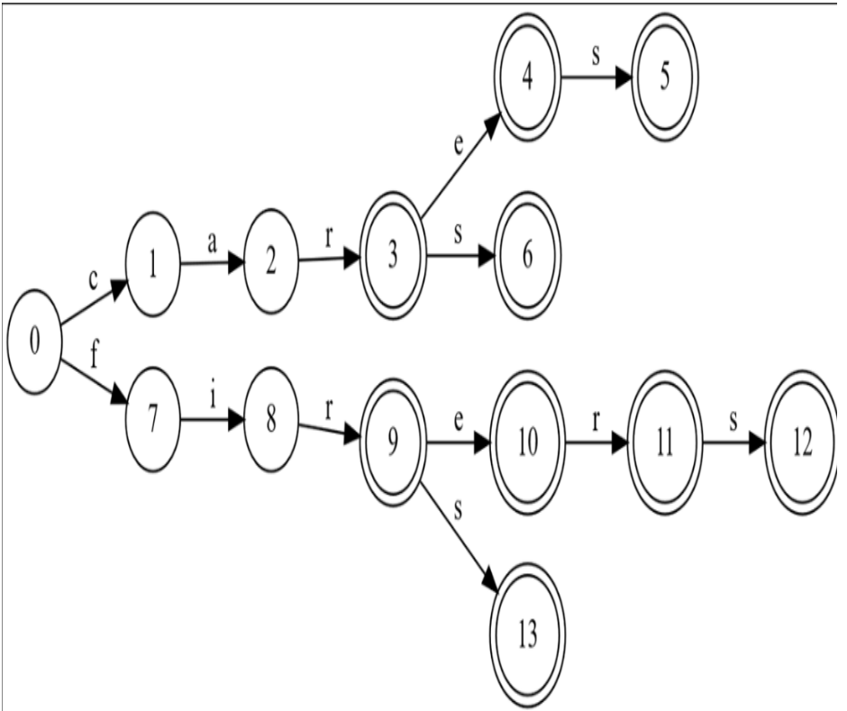
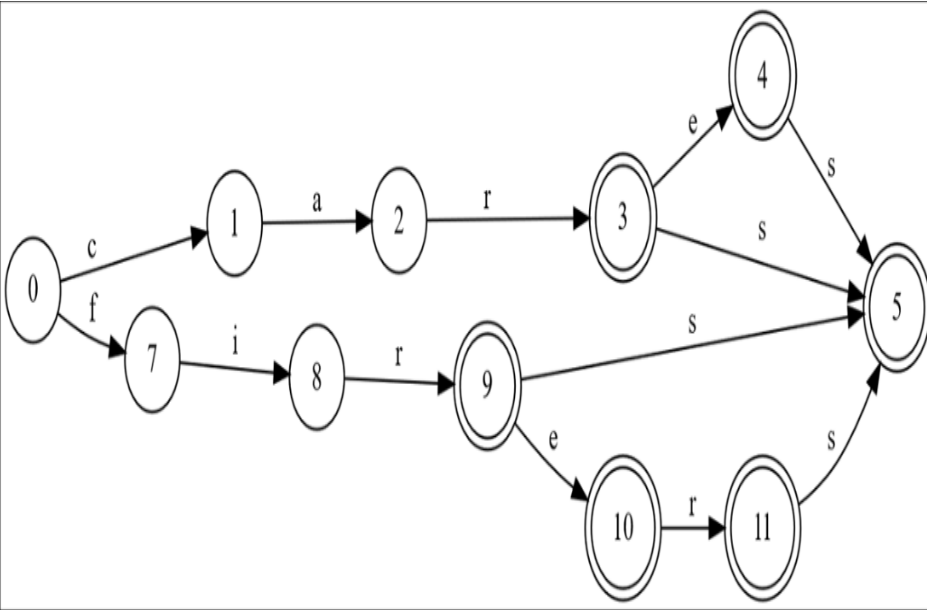
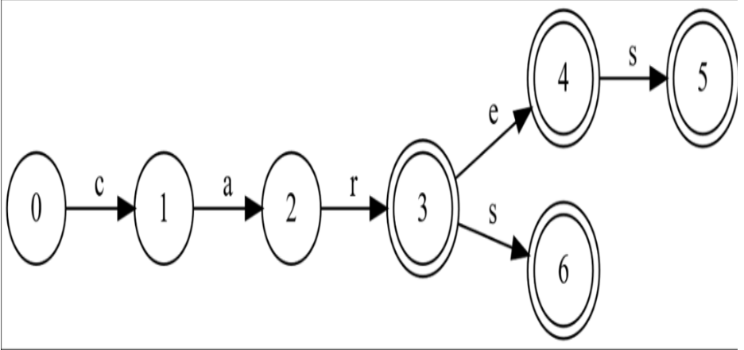

# 你怎么了，有向无环词图？

 **本章涵盖**

- 用于存储大规模词表并按前缀搜索的多种技术
- 哈希集、排序列表、前缀树（trie）和词图（DAWG）的成本与收益
- 在给定已排序词表的情况下构建 tries 和 DAWGs 的算法
- DAWG 与自动机理论之间的联系

在序言中我提到过那场灾难性的第一次面试，而当天我的状况在第二次面试里只略微有所好转。第二位面试官问了我一个更好的问题：给定 Scrabble（拼字游戏）中你手上那七个字母，应该用什么算法找出所有的 “bingos”？也就是说，如何列出由这些字母恰好组成的所有合法七字母单词？这个函数应当以诸如 “NISATEV” 的字符串作为输入，并生成 “NAIVEST”、 “NATIVES” 和 “VAINEST” 这三个输出。

这不是个特别难的问题，我对自己的解答也挺满意，但随后的更难的词表搜索问题把我难住了。我知道前缀树 —— “trie” —— 是适用于词表的数据结构，但对细节不太清楚。当面试官问我是否知道什么是 “dog” 的时候，我直言不知；结果他指的是 Directed Acyclic Word Graph，也就是 DAWG。这是我那天的第二个 “不录用”。

一个好的面试题应该是务实的；涉及词表且对性能敏感的问题极其常见，现在更是比我 1996 年面试时常见得多。打字自动补全就是一个很好的例子。生成并检查文字游戏中的可能走法也是另一个例子。用什么数据结构来存储一个庞大的词表，使其可以被快速搜索，又不占用太多内存？

我们首先从一种简单直接的方案开始：保留一个排序好的词列表。然后我们再考虑对这些单词的前缀去重的成本与收益，最后也对后缀去重；节省可以非常可观。在此过程中，我们还会看看词表问题与有限状态机之间的联系。

## 两个问题，两种弱解法

两个常见的词表问题是：“给定单词是否在列表中？”以及“列表中所有以某给定前缀开头的单词有哪些？”后者对自动补全尤为重要。自动补全问题要求非常快速地产生候选列表，因为用户打字很快！在我那个年代，微软的 C# IDE 团队有 30 毫秒的预算——大约是刷新屏幕所需的时间——来生成 IntelliSense 的补全列表。

照例，让我们先构思一个抽象数据类型，通过接口的形式来表达我们需要的操作。然后我们再思考哪些数据结构适合作为这个 ADT 的实现：

```csharp
interface IWords : IEnumerable<string>
{
    bool Contains(string word);
    IEnumerable<string> StartsWith(string prefix);
}
```

这里包含了三个特性。第一，词表应当是一个可枚举的字符串序列。第二，我们需要能够判断某个给定单词是否在列表中。最后，我们需要能够枚举所有以某个前缀开头的单词。

> **注意**
> 我这里只讨论如何表示一个已有的词表以便高效搜索。关于如何在内存中动态添加或移除词条并维持某种搜索性能标准的问题，则不在这里讨论。

在我们进入 tries 之前，让我们快速考虑两种可能的词表存储方案，它们都可以实现这些操作。在本章所有的性能分析中，我将使用 n 表示列表中的单词数量，m 表示单词长度；我意指最大长度还是平均长度，将由上下文明确。

### 哈希集并不是解法

我们可以立即排除将词表存储在 `HashSet<string>` 中的做法。为什么？

哈希集在 `Contains` 操作上表现极佳。哈希集的工作方式是首先计算字符串的整数“哈希码”，通常通过对其每个字符按顺序执行一些简单的数学操作实现。然后它会将词表划分到若干“桶”中，使得所有哈希码相似的单词落在同一个桶内。例如，可能会有八个桶，每个桶中所有字符串的哈希码的最低三位相同。通过在 n 增加时巧妙地调整桶的数量，哈希集可以实现令人印象深刻的 O(m) 的 `Contains` 性能。也就是说，哈希集的渐进性能不依赖于所存储列表的大小，而只依赖于哈希函数的性能。由于哈希函数会处理字符串中的每个字符，因此该操作是 O(m)。

不幸的是，哈希集几乎无法用于实现 `StartsWith` 操作。一个设计良好的哈希算法会将不相似的单词放入同一个桶中。（我曾经用一个把相似单词放入相似桶的糟糕哈希算法毁掉过 Microsoft.com 的早期版本的性能，但那是另外一个故事！）没有任何高效的方法可以用哈希集实现这个操作。我们不会再进一步考虑这个选项，不过我们将在本章后面回到一个关于安全使用哈希集的重要规则。

如果不能使用哈希集，那我们能做什么呢？

### 排序列表算是……还能接受？

要让词表在常用操作中获得不错的性能，最简单的存储方式毫不意外，就是用 `List<string>`。只要我们提前把列表排好序 —— 这通常不是什么难事 —— 就能利用二分搜索，让性能变得相当可观。我们直接实现一下；代码很短：

代码清单 5.1 排序词表实现

```csharp
class SortedWordList : IWords
{
    private List<string> words;
    public SortedWordList(List<string> words) #A
    {
        this.words = words;
    }
    public bool Contains(string word) =>
        words.BinarySearch(word) >= 0; #B
    public IEnumerable<string> StartsWith(string prefix)
    {
        int i = words.BinarySearch(prefix);
        if (i < 0)
            i = ~i; #C
        for (; i < words.Count; i++)
        {
            string w = words[i];
            if (!w.StartsWith(prefix)) #D
                yield break;
            yield return w;
        }
    }
    public IEnumerator<string> GetEnumerator() =>
        words.GetEnumerator();
    IEnumerator IEnumerable.GetEnumerator() => GetEnumerator();
}
```

`Contains` 的逻辑很直接：对目标单词做二分查找。如果查不到，`BinarySearch` 会返回负数，因此只要看符号就行了。

`StartsWith` 则稍微曲折一点。如果没有与 `prefix` 完全一致的项，`BinarySearch` 会返回排序表中“下一个更大元素”的按位取反值。找到起点后，我们就一路往后检查，直到遇到不再符合前缀的单词，或到达列表末尾。

> `BinarySearch` 在找不到目标时，**绝不仅仅是告诉你“没找到”（返回 -1）这么简单**，它实际上还附赠了一条非常有用的信息：**“虽然没找到，但我知道它如果存在，应该排在哪里。”**
>
> 设计思路：既然二分查找的过程中已经确定了它应该在的位置，不如直接把这个位置通过返回值告诉你。
>
> #### 例如：
>
> 假设列表是：`list = ["A", "C", "E"]` （注意没有 "B" 和 "D"） 索引分别是：`0, 1, 2`。需要找 "B"
>
> 1. 二分查找在列表中找 "B"。
> 2. 没找到。
> 3. 但是它发现 "B" 比 "A" 大，比 "C" 小。
> 4. 如果要把 "B" 插进去，应该插在 "C" 的位置，也就是索引 **1**。
> 5. 为了表示“没找到”且“应该在1”，它会对 1 进行按位取反。
>    - 在计算机补码表示中，`~1` 等于 `-2`。
> 6. **结果：** `BinarySearch` 返回 **-2**。

分析性能时，可以合理假设参数 `word` 和 `prefix` 长度大约为 m，也就是词表的典型单词长度。二分搜索要做 O(log n) 次比较，而字符串比较本身要 O(m)，因此两个方法的搜索阶段都是 O(m log n)。但 `StartsWith` 除此之外，还要对每一个返回值调用一次 `StartsWith`，这也要 O(m)，而匹配数量不确定 —— 最坏可能是整个列表。

到目前为止，我们多半关注渐进意义上的性能：随着问题规模增大，算法如何扩展，而非其实际耗时和内存。

我们习惯认为现代硬件几乎有无限内存，物理内存不足 OS 会自动用页面文件，GC 也替我们处理垃圾。但我学编程的时代就不同了，PC 的可用内存被 640K 生生卡死，上磁盘意味着换软盘。如果我们真得把词表尽可能压缩，会怎样？到底占多少字节？

本章中我将使用 ENABLE（增强北美基准词典）作为参考词表。这是一份为现代英文文字游戏设计的高质量开源词表。我使用的版本共有 172,820 个单词，字符总数 1,570,508 个。平均长度略超 9，最长的单词有 28 个字母。

> 旁注：
> `ethylenediaminetetraacetates` 虽然工业用途广泛，但在 Scrabble 里根本放不下。

把 ENABLE 放进 `List<string>` 中，内存消耗大约如下：

- C# 字符串使用双字节字符，光字符部分就约 3MB。
- 列表中有 172,820 个字符串引用，每个引用在 64 位机器上 8 字节，共约 1.3MB。
- 每个字符串还有 4 字节长度字段，以及每个 .NET 对象额外 16 字节对象头，加起来又是 3.5MB。

存这些字符串就快 8MB 了。我们当然可以做得更好。例如 ENABLE 的字母只用到 26 个字符，完全可以用 UTF-8 这种一字节编码。光是这一步就能省 1.5MB。

此外，GC 还要处理这 172,820 个字符串。每次回收都要判断这些对象是否存活，非常耗时。

我们可以把所有字符塞进一个巨大的字节数组，用一组 4 字节整数来表示每个字符串的位置和长度，彻底避免几十万对象的引用。这样可能把总占用压到大约 2.5MB。

字符串列表虽然简单易用，空间开销却不算低。我们已经看到：如果真的需要省内存，实现一个自定义 UTF-8 字节数组结构完全可行，只是写起来比较麻烦。本章后面会继续探讨这类技巧。

现在让我们回到渐进性能：对于词表的常见操作，我们能否把时间复杂度做到比 O(m log n) 更低？前缀树可以做到，但它是否意味着要用更多内存换更快的搜索呢？

## 前缀树

当你有大量单词但字母表很小的时候，难免会有很多单词有相同的开头。举例来说，在 ENABLE 中，带有前缀“anti”的单词就有 750 多个。在我们的 List 基准测试里，仅仅是“anti”这几个字符的重复拷贝就占了 6 KB 以上！正是想要去重所有这些公共前缀，才促使我们使用前缀树——也就是后来人们常说的 tries。

**名字从何而来？**

之所以叫 tries，是因为它们用来检索（retrieve）单词，懂了吗？这是个有点冷的玩笑。

我们可以构建一棵树，让每一条边代表一个字符，每一个节点代表单词中的一个分割点，把单词分成前缀和后缀；节点就是字符之间的“空隙”。用一张图会更好地说明这一点。我们先列出九个单词：

```csharp
List words = ["car", "care", "cares", "cars", "fir", "fire", "firer", "firers", "firs"];
```

图 5.1 展示了表示这份单词列表的 trie：



图 5.1 这个 trie 对应一个包含九个单词的列表，这里从左到右展开，并且从上到下按字母顺序排列。节点编号并不是树中的数据；它们只是为了方便我们在后面的讨论中引用。双圆节点表示单词的结尾。

通常我们画树的时候，会有点反讽地把根画在最上面；我们会认为遍历一棵树是从上到下进行的。由于 trie 表示的是一组单词，在本章的图示中，我会把根放在左边，我们则从左到右遍历这棵 trie。

在我们的单词列表中，前缀“car”出现了四次。在 trie 中，所有带有前缀“car”的单词都由节点 3 表示，因为从根到节点 3 的边拼出了“car”。“car”的所有后缀则由节点 3 右边的所有边表示。

由于“car”本身就是列表中的一个合法单词，我们把节点 3 画成双圆以标记这一事实。节点 2 代表所有以前缀“ca”开头的单词，只画单圆，因为“ca”本身并不是列表中的单词。

接下来我们来看一下如何表示这棵 trie 的节点和边，然后用这份单词列表构建出一棵 trie，之后就可以实现我们的单词列表接口了。

### 节点和边

对于每个节点，我们只需要知道三件事：

- 这个节点是不是某个单词的结尾？
- 从这个节点出发的边上的字符标签是什么？
- 这些边指向哪些节点？

我们只会从左到右遍历这棵树，因此没有必要再保留指向“父”节点的引用。单词结尾的标记可以是一个 `bool` 属性。出边可以是一个`Dictionary<char, Node>`，其中每条边的标签由那个 `char` 表示。

在前几章中，我大力称赞过不可变数据类型的优点，但我并不在这件事上教条。构造一棵 trie 时，是从左到右、从根到叶进行的，而不可变树最适合自底向上（从叶到根）构造，所以使用可变数据结构会更方便。本章稍后在构建 DAWG 时，我们还会对节点做更复杂的修改。所有这些因素促使我把节点设计为可变的。我们先写点代码：

Listing 5.2 A trie node

```csharp
sealed class Node
{
    private readonly Dictionary<char, Node> edges = [];
    public bool IsEnd { get; set; }
    public IEnumerable EdgeLabels => edges.Keys;
    public Node FollowEdge(char c) => edges[c]; #A
    public Node? TryFollowEdge(char c) => #B
    	HasEdge(c) ? FollowEdge(c) : null;
    public bool HasEdge(char c) => edges.ContainsKey(c);
    public Node AddNewNode(char c) => edges[c] = new();
    public Node TryAddNewNode(char c) =>
    	HasEdge(c) ? FollowEdge(c) : AddNewNode(c);
}
```

我本可以把 `edges` 做成 public，但我更倾向于把它设为 private，并提供一些简单的访问方法，理由有两点：

- 最重要的是，这样能让使用这个类的代码更加自描述。这个类型的公共接口应该用“节点”和“边”的专业术语来描述在 trie 节点上可以执行的逻辑操作，而不是用字典的术语。如果我们把字典公开，并要求这个类型的使用者直接与字典打交道，那就是在凸显实现机制，而模糊代码的含义。
- 隐藏实现机制是良好的面向对象设计；我们希望能够自由尝试不同的实现方式，而不用修改所有使用这个类型的代码。我们可能会发现字典的性能特征不能满足我们的需求，然后去寻找别的解决方案。如果那时所有调用方都不得不修改，那就太糟糕了。

我们快速过一遍这个小类的成员：

- `IsEnd` 属性顾名思义：它说明这个节点是否表示列表中某个单词的结尾。
- `EdgeLabels` 列出了从该节点出发的每条边上的标签。
- `FollowEdge` 接收一个边标签，并返回那条边所指向的节点。比如，再回到图 5.1。节点 9 表示所有以前缀“fir”开头的单词，而从它出发的边则表示所有以该边标签开头的后缀。如果我们在它上面调用 FollowEdge('e')，就会得到节点 10，它表示所有以前缀“fire”开头的单词。如果不存在这样的边，这段代码会抛出异常。
- `TryFollowEdge` 与 `FollowEdge` 基本相同，但如果没有这样的边，就返回 null 而不是抛异常。
- `HasEdge` 报告给定的边是否存在。
- `AddNewNode` 创建一个新节点，并强制创建一条到该节点的边。
- `TryAddNewNode` 会检查是否已经存在给定标签的边，如果有就返回那条边所指向的节点；否则，它的行为就和 `AddNewNode` 一样。

在继续构建 trie 之前，我们先简单想一想这些成员的性能特征。这个类型只是一个由单个字符作键的字典的轻封装而已。所有这些操作在时间和空间上都是 O(1) 的。至于这些节点占用了多少字节，我们会在本章稍后再讨论。

### 构建 trie 的算法

从一个单词列表构建一棵 trie 的算法出乎意料地直接：

- 如果要加入的新单词与 trie 中已有的任何单词都没有公共前缀，那么我们只需要从根节点开始，为该单词新建一条由边和节点组成的路径即可。
- 如果要加入的新单词与 trie 中已有的某个单词有公共前缀，那么就找到在该处“切开”已有单词的那个节点，并从那个点开始把新单词剩下的部分接上去；这样就保证了公共前缀被去重。
- 最后，把最后添加的那个节点标记为单词的结尾。

来看一下代码：

Listing 5.3 A trie builder

```csharp
sealed class TrieBuilder
{
    private Node root = new(); #A
    private TrieBuilder() { } #B
    static public Node MakeTrie(IEnumerable words)
    {
        var tb = new TrieBuilder();
        foreach (var word in words)
        	tb.Add(word);
        return tb.root;
    }
    private void Add(string word)
    {
        Node n = root;
        foreach (char c in word)
        	n = n.TryAddNewNode(c);
        n.IsEnd = true;
    }
}
```

我们从一个根节点开始，它没有任何出边，也没有被标记为单词结尾；它表示一个空的单词列表。当我们添加第一个单词（比如“car”）时，每一次调用 `TryAddNewNode` 都会生成一个新节点，从而得到图 5.2 中展示的那棵只含一个单词的 trie：

图 5.2 单词列表 “car” 的 trie



如果列表中的下一个单词是 “care”，那么在尝试添加 “c”、“a” 和 “r” 时，`TryAddNewNode` 会返回已经存在的节点，而在尝试添加 “e” 时才会创建一个新节点：

图 5.3 单词列表 “car”、“care” 的 trie。



我就不继续赘述了；我相信你已经能看出，随着更多单词被添加，这棵 trie 是如何一步步演化的。

我们稍后会再来看 trie 的内存性能；现在先看看这个 trie 构建算法的时间性能。我们有一个循环，对列表中所有 n 个单词调用 `Add`，而每次调用 `Add` 又会遍历该单词中所有 m 个字符。总共会有 O(mn) 次对 `TryAddNewNode` 的调用，而我们已经说过，每次调用的时间复杂度是 O(1)。既然在构建 trie 时必须查看单词列表中的每一个字符，那我们也不可能做得比这更好了。

我们最初要解决的动机问题——在单词列表上实现 `Contains` 和 `StartsWith` ——还没有解决；接下来就来看看这一点。

### 把 trie 当作单词列表来用

既然我们已经可以把任意字符串序列变成一棵 trie，那么如何用这棵 trie 来解决最初实现 `Contains` 和 `StartsWith` 的问题呢？我们需要先解决两个更小的问题：

- 给定一个前缀，在 trie 中找到与之关联的节点——如果存在的话。也就是说，如果给定前缀字符串 “car”，就从根开始依次沿着边 ‘c’、‘a’ 和 ‘r’ 往下走。
-  给定一个节点，列出该节点“右侧”的所有单词后缀。在我们之前的那个 9 个单词的 trie 例子中，“car” 的后缀是 “”（空）、“e”、“es” 和 “s”，从而得到单词 “car”、“care”、“cares” 和 “cars”。

此外：由于天真的字符串拼接很容易“意外地变成平方级复杂度”，我们还希望聪明地使用 `StringBuilder`，避免不必要的重复字符串拷贝。我们先看代码，再详细拆解其中的关键之处。

Listing 5.4 基于 trie（或图）的单词列表

```csharp
using System.Text;
sealed class WordGraph : IWords #A
{
	private Node root;
    public WordGraph(Node root)
    {
    	this.root = root;
    }
    private Node? Find(string prefix)
    {
    	Node? n = root;
        foreach (char c in prefix)
        {
            n = n.TryFollowEdge(c);
            if (n == null)
            	break;
        }
    	return n;
    }
    public bool Contains(string word) => Find(word)?.IsEnd ?? false;
    public IEnumerable StartsWith(string prefix)
    {
        Node? n = Find(prefix);
        return n == null ?
            Enumerable.Empty() :
        	Words(n, new StringBuilder(prefix));
    }
    private IEnumerable Words(Node n, StringBuilder prefix)
    {
        if (n.IsEnd)
        	yield return prefix.ToString();
        foreach (char c in n.EdgeLabels)
        {
            prefix.Append(c);
            foreach (var word in Words(n.FollowEdge(c), prefix))
            	yield return word;
            prefix.Remove(prefix.Length - 1, 1); #B
        }
    }
    public IEnumerator GetEnumerator() => StartsWith("").GetEnumerator(); #C
    IEnumerator IEnumerable.GetEnumerator() => GetEnumerator();
}
```

我们来分解一下：

- 我把这个类命名为 `WordGraph`，是因为正如我们很快会看到的，这些算法对任何无环单词图都适用，而不只是对 tries。
- `Find` 会尝试从根节点开始，沿着给定前缀的每一个字符对应的边往下走；如果途中缺少某条边，就说明图中没有以该前缀开头的单词。
- `Contains` 使用 `Find` 来查找整个单词。如果 `Find` 返回 null，则该单词不在列表中；否则，当且仅当该节点被标记为单词结尾时，这个单词才算在列表里。
- `StartsWith` 稍微复杂一点。如果 `Find` 返回 null，则列表中没有任何以该前缀开头的单词，我们可以直接返回一个空序列。否则，我们把这个前缀放入一个 `StringBuilder` 中，并用 `Words` 这个辅助方法枚举所有以该前缀开头的单词。
- `Words` 会先检查给定的前缀本身是否就是列表中的一个单词；例如，当我们被要求枚举以 “car” 开头的单词时，“car” 本身也应该被产出（yield）。然后我们依次沿着当前节点的每一条出边向外扩展并递归调用。这个算法要求在 `Words` 返回之前把 `StringBuilder` 恢复到调用 `Words` 之初的状态。

`Contains` 的性能如何？我们的 `SortedWordList` 实现达到了 O(m log n)，但在这里我们已经赢了！如果给定的单词长度为 m，那么 `TryFollowEdge` 最多被调用 m 次。由于 `TryFollowEdge` 是 O(1) 的，总时间代价就是 O(m)。

那 `StartsWith` 呢？同样的道理。`SortedWordList` 在找到第一个匹配项时需要 O(m log n) 的时间，然后对每个后续匹配项再花 O(m) 时间来检查前缀。而这个实现能在 O(m) 时间内找到图中所有后缀汇聚的那个点，然后为每个被产出的字符串再花 O(m) 的代价构造出来。

对数级性能通常已经可以接受，因为它增长得很慢，但显然 O(m) 的代价要优于 O(m log n)；trie 似乎明显优于有序列表。

不幸的是，在分析 trie 构建器时，我略过了一个重要问题：通过前缀去重，我们到底节省了多少内存？

### 使用 trie 我们到底省了多少内存？

trie 的空间性能如何？这完全取决于单词列表中有多少公共前缀！我把图 5.1 抄成了这里的图 5.4，它展示了在加入九个单词之后的那棵 trie：
图 5.4 一个包含九个单词的 trie：car、care、cares、cars、fir、fire、firer、firers、firs



原始的单词列表有九个单词，共 38 个字符；构建出的 trie 上带字符的边只有 13 条，所以存储的字符数量只有原始列表字符总数的大约三分之一！这确实是一个相当惊人的缩减，但你或许也能看到这里有两个问题。

- 每条边的开销都非常巨大：每条边都指向一个节点，而每个节点本身又包含一个字典，这些加起来肯定不小。我们会在本章末尾回到这个问题。
- 看起来似乎有机会减少节点的数量。叶节点 5、6、12 和 13 都没有出边，而且都是“单词结尾”节点。显然，节点 3、4、9 和 11 的出边 “s” 完全可以都指向节点 5，这样我们就可以删掉节点 6、12 和 13，把节点数从 14 个减少到 11 个，这是一个相当可观的缩减。

也就是说，我们似乎应该能把那棵九单词的 trie 重写成这个在逻辑上等价的“单词图”（图 5.5）：
图 5.5 对 trie 的所有叶子进行去重后得到一个等价的单词图。



前缀树会对前缀进行去重，但任何一个足够大的英文单词列表中都会存在数量巨大的公共后缀；难道我们不能同时对后缀也做去重，从而获得更大的收益吗？我们可以从两头入手攻击这个问题！

在本章后面我们会真的这么做，但在那之前，先更深入地挖一挖 trie 存在的问题。刚才的例子太小了，无法看出问题到底有多严重。如果我们用 ENABLE 单词列表来构建一棵 trie 又会怎样呢？

```csharp
List words = File.ReadAllLines("enable.txt").ToList();
Node n = TrieBuilder.MakeTrie(words);
```

我写了一些代码（这里略去不表）来收集这棵 trie 的统计数据；结果非常惊人。ENABLE 列表中有 172,820 个单词和 1,570,508 个字符，而生成的 trie 有 387,881 个节点。一方面，节点数量不到字符数量的四分之一，这很棒；看起来在大型单词列表上做前缀去重确实很划算。另一方面，其中有 111,507 个节点是完全相同的叶子节点——也就是说，它们是“单词结尾”节点，有入边但没有出边。我们为在逻辑上是同一个叶子节点的东西分配了数以百万计的字节！

尽管我们在搜索性能上挤出了一点小优势，但在实践中，相比于仅仅使用一个排序列表并忍受前缀重复的代价，我们几乎没有真正节省任何内存。

我们可以在解决这个问题的路上走得很远，但在那之前，让我们先稍作岔开，谈谈 trie 与理论计算机科学之间的联系。

## Trie 其实就是有限状态自动机

有限状态自动机（FSA）是一种用来形式化描述简单机器行为的方式。一个 FSA 有有限个内部状态和有限个输入；每当收到一个输入时，机器就会根据当前状态和这个输入转移到一个（可能不同的）状态。

自动售货机就是一个很好的例子。它有有限个内部状态，用来记录投入了哪些硬币，以及每种零食还剩多少。当你按下选择按钮时，它的行为取决于输入——也就是你按下的是哪个按钮——以及机器当前的内部状态。也就是说，你付的钱够不够，你选的那种零食还有没有？零食被吐出来之后，机器的状态也会随之更新。

我们可以把 trie 看成是一种 FSA。每个节点就是一个状态，从该节点发出的每条边上的标签就是一个输入，这个输入会导致状态转移到下一个状态。根节点是“起始状态”，双圆节点是“成功状态”（接受状态）。我们可以把 `Contains` 操作理解为在问：“这串输入能不能让机器从起始状态走到某个成功状态？”以这种方式被机器“接受”的所有字符串——也就是我们的单词列表——就叫做这台机器的“语言”（language）。

我们可以用这套新术语重新表述上一节中的观察。我们那棵有 14 个状态的 trie，是一个状态数多于必要值的 FSA。通过合并叶子节点，我们可以在保持其接受的语言不变的前提下，减少 FSA 中的状态数量。于是一个很自然的问题就出现了：给定一个 FSA，如何找到一个拥有尽可能少状态、但接受同样语言的 FSA？如果能做到这一点，我们就能对 trie 做优化。

自至少 20 世纪 50 年代以来，这个问题就被计算机科学家大量研究，已经有许多解决这一问题的算法。其中很多算法使用了一种“划分”（partitioning）策略：也就是说，它们把所有状态划分成若干互不相交的集合，使得一个集合中的状态不可能在其他集合中有任何功能上等价的状态。常见的第一步划分就是先把状态分成“成功状态”和“非成功状态”；任何一个成功状态都不可能被某个非成功状态替代，反之亦然。算法随后会不断细化划分，直到找出那些在任何方面都无法彼此区分、且含有多个状态的集合；这些状态就可以被去重合并。

听起来我们也许可以先为单词列表构建一棵 trie，然后再对它运行一个 FSA 最小化算法。这样就能得到在逻辑上仍然表示我们单词列表的、状态最少的图。虽然听起来挺直接，但这些划分算法的细节却并不简单。这些算法本身既不太容易实现，也可能产生不小的性能开销。

而且，如果我们面对的问题是：某棵给定的 trie 实在太大，以至于装不进一台内存受限的机器，那么“先建一棵 trie 再最小化它”的办法就根本行不通。

我们真正需要的是一种算法：它接收一个单词列表，并直接生成一个最小的 FSA，而不是先膨胀成一棵庞大的 trie 再去压缩。幸运的是，确实存在一个不错的算法，而且并不难说明和实现。

## 构建 DAWG

DAWG 指的是 Directed Acyclic Word Graph（有向无环单词图）。通过不仅对前缀，还对后缀做去重，我们不再得到一棵树；而是得到了一张不含环的图。你也会看到它被称为 Deterministic Acyclic Finite State Automata（确定性有向无环有限状态自动机，DAFSA），但我更喜欢 DAWG 这个说法，因为我是这么学的，因为它强调了我们是在存储“单词”，而且这个词说起来也更有趣。

这里要介绍的构建 DAWG 的算法是 Jan Dacuik、Bruce Watson 和 Richard Watson 在 1998 年发明的。这个算法的核心思想是：一次一个单词地构建一个“几乎最小”的 DAWG。随着算法的执行，对于除了最后加入的那个单词的节点以外的所有单词，DAWG 始终都保持尽可能小。每当一个新单词被加入时，算法就会对“前一个被加入的单词”的节点做优化，从而维持这样一个不变式：除了最后一个单词的节点之外，图对所有单词都是最小的。在列表中最后一个单词加入之后，我们再把它也修整到位，这样就得到了一个真正最小的 DAWG。

我在这里要介绍的这个版本要求按字母顺序加入单词；还有一个更复杂的版本允许以任意顺序加入单词，不过我不会再展开讨论。

> **注意：**
> 这个算法假定单词列表是按照“逐字符”的方式排序的，也就是所谓的“序数排序”（ordinal sorting）。如果你的单词列表中包含拉丁字母以外的字符，就要小心一些情况，比如德语字符 “ß” 和两个字符的组合 “ss”；在非序数排序中，它们会被认为相等，而在序数排序中则不相等。类似的情况还有很多！

我们通过一个例子来把握这个思路，然后再写代码。还是用刚才那个排序好的单词列表：

```csharp
List words = ["car", "care", "cares", "cars", "fir", "fire", "firer", "firers", "firs"];
```

我们跳过前面几步；在加入前四个单词之后，我们得到的图其实就是用“构建 trie 的算法”所能得到的那棵 trie。注意，此时图中表示前三个单词的那一部分已经是最小化的，但在添加完 “cars” 之后，我们又多出一个冗余节点；在图 5.6 中，节点 5 和节点 6 是等价的。这没有问题；算法保证图对除了“最后加入的单词 cars”之外的所有单词都是最小的，而节点 6 正好是这个单词的结尾节点，所以我们还暂时没有修理它。

图 5.6 我们已经添加了 car、care、cares 和 cars。除了 “cars” 之外，图的其他部分都是优化过的。节点 6 与节点 5 完全相同，但因为节点 6 属于 “cars”，所以我们还没处理它。

