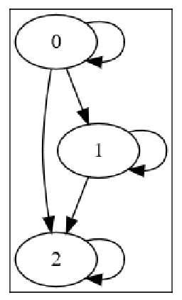
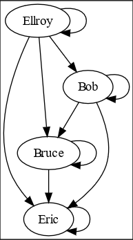
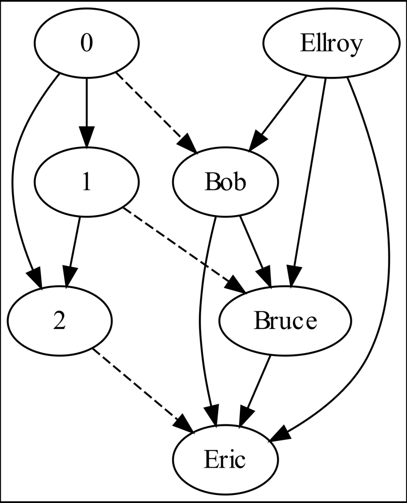
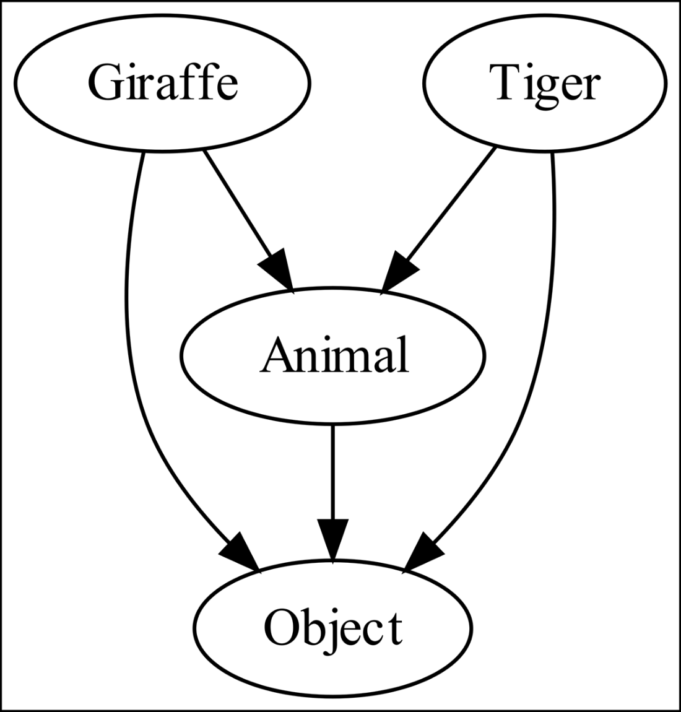
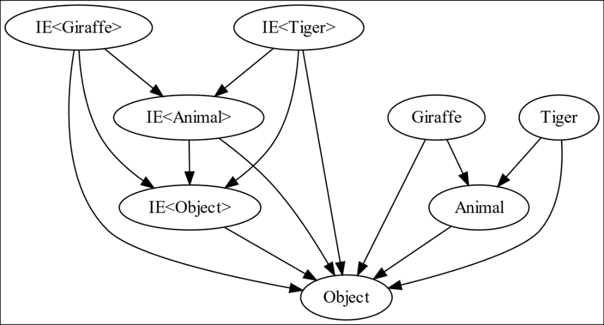
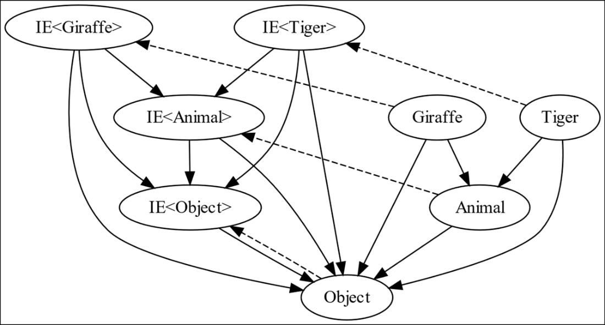
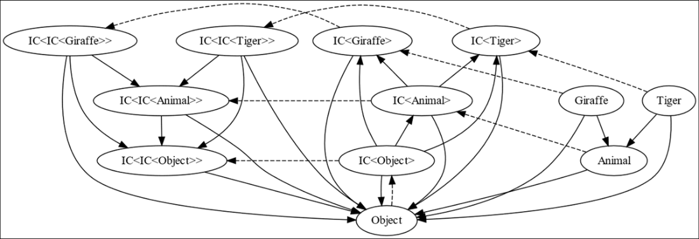

# 面向程序员的基础范畴论

**本章涵盖**

- 什么是范畴论，为什么它被称为“广义抽象胡说”？
- 什么是范畴、对象、态射与函子？
- 什么是协变与逆变？为什么语言设计者要用这些行话？
- 这些概念与现代编程语言的类型系统有什么关系？

从根本上说，编写计算机程序就是在创造并使用抽象。在“物理”层面，计算机是人类尺度的盒子，里面包含数十亿个微小的“笼子”，我们在其中控制少量电子的进出。芯片设计者让我们不必再去思考这些电子；在“芯片”层面，我们思考的是比特与字节、指令、缓存、中断等等。编译器开发者又加入了更多层次的抽象，比如变量、对象、函数、循环。当我们用高级语言编写程序时，我们在构建算法与数据结构，它们在语言提供的基础抽象之上，又提供了更多抽象。

我们能不能在思考计算机编程时变得更抽象？当然可以！在本书的多个地方，我们会从具体的数据结构与算法中稍作停顿，看看范畴论中的一些数学结构——它们是现代编程语言的底层基础。追求这段精彩“支线任务”有很多理由：

- 它很实用。软件开发的基本策略是“分而治之”：把问题拆成更小、可解决的问题，并把这些解组合起来以解决更大的问题。范畴论研究的正是可组合的操作，它的概念作为设计模式具有很强的实践价值。这些模式正在实用的面向对象编程中变得越来越普遍。
- 它很理论。理解范畴论的基础改变了我对日常编程以及编程语言设计的看法，因为我开始看到更深层的抽象。
- 它很有趣！还有什么比折腾“广义抽象胡说”更妙的呢？

这是一个很深的主题，本书只会浅尝辄止，但我希望这点“范畴论的味道”能激励你自己进一步深入。我们将先定义一些术语，然后看看它们如何关联到一个真实世界的语言设计问题：一串长颈鹿，是否也是一串动物？

> 范畴论就是“广义抽象胡说”

范畴论是数学中相对较新的一个分支；它诞生于 20 世纪中期。我们通常把数学看作是对数字的研究——自然数、整数、分数、实数、复数、矩阵、张量等等——但范畴论研究的是“东西之间的关系”。什么东西？无所谓！如果这听起来荒谬得过于抽象，那正是因为它确实很抽象，于是范畴论学者也乐呵呵地开玩笑说，他们的领域就是“广义抽象胡说”。

在范畴论中，对象（object）就是一个范畴里的“东西”。任何东西都可以是对象：数字、序列、集合、函数；甚至范畴本身也可以作为某个范畴的对象。我们可以构造“人的范畴”，也可以构造“编程语言中类型的范畴”；只要你能想到，它就能成为范畴中的对象。

> 注意：在本章讨论范畴论时，我会用“对象”来指范畴中的对象，而不是面向对象编程意义上“由数据及其方法组成的对象”。在本章后面，我们还需要清楚地区分“范畴中的对象”和 Object 类型；很遗憾，“object”这个词被我们过度复用了。

如何表示对象之间的关系？我们都熟悉函数；函数接受某个值并产生与之相关的另一个值。“平方根”函数接受正方形的边长并产生其对角线的长度；它表示的是两个长度之间的关系；加法函数接受一对数字并产生它们的和；这是一种“数字对”与“数字”之间的关系。

范畴论定义了一种特殊的函数，叫作函子（functor），并加入了第二种关系，叫作态射（morphism）。这些名字也许有点吓人，但概念出奇地直接。话虽如此，用这些简单概念可以构造出极其复杂的东西！我们稍后再回到函子；先从定义范畴与态射开始。

一个范畴由两类东西组成：一堆可以是任何东西的“对象”，以及一堆“态射”，你可以把它们看作箭头，每个箭头连接两个对象。态射有两条规则：

- 态射是自反的：每个对象总有一条指向自身的“恒等箭头”。如果 X 是某个范畴中的对象，那么 XàX 总是该范畴中的一个态射。
- 态射是传递的：如果 A、B、C 是某个范畴中的对象，并且该范畴有态射 AàB 与 BàC，那么 AàC 也总是该范畴中的一个态射。

我把态射理解为表达“你可以从这里到那里”这一概念。如果你从任意对象出发，你当然能到达该对象本身，因此每个对象都有指向自身的态射。如果你能从 A 到 B，又能从 B 到 C，那么你就能从 A 到 C，因此态射是传递的。只要你遵守自反与传递这两条规则，范畴中的态射就可以是你选择的、对象之间的任何关系。

来看一个小例子。假设我们选取对象为数字 0、1、2，并选择构造态射——也就是箭头——从每个对象指向每个大于或等于它的对象。图 7.1 展示了这个范畴：



图 7.1 一个包含三个对象的小范畴：节点表示对象，箭头表示六个态射。

这满足范畴的要求：我们有一堆对象和态射，每个对象都有一个恒等态射，而且态射是传递的。那些态射基于某种“大于或等于”关系的范畴非常常见，以至于它们有一个名字：这就是一个偏序范畴（posetal category）的例子。“posetal”是 “partially-ordered set”（偏序集合）的简称。

下面是另一个偏序范畴的例子。我们可以把对象取为我自己、我的父亲 Bruce、他的父亲 Bob，以及他的父亲 Ellroy。图上的一条箭头表示“是……的祖先，或者与……是同一人”。图 7.2 以图的形式展示了这个范畴：



图 7.2 一个奇怪地熟悉的小范畴，包含四个对象和十个态射。

我们遵循了态射的两条规则，所以这是一个范畴。

> 注意：因为范畴中的每个对象都有一条指向自身的恒等态射，为了清晰起见，在绘制范畴的图时，恒等态射经常会被省略。在本章剩余部分，我将略去恒等态射。只要记住它们一直都在那里！

第二个范畴的下方四分之三看起来和第一个范畴非常相似；事实上，似乎第一个范畴在某种意义上与第二个范畴的大部分是“同一张图”，尽管对象不同，而且态射“⩾（大于或等于）”也完全不是态射“是祖先，或者是同一人”。那么，这两个范畴之间具体是什么关系呢？我们可以写出一个小函数，把第一个范畴的所有对象映射到第二个范畴中的某个对象上：

```c#
string[] family = ["Bob", "Bruce", "Eric"];
string F(int i) => family[i];
```

我们会用虚线箭头从第一个范畴的对象指向第二个范畴中对应的对象；也就是说，如果 x 是第一个范畴的成员，那么我会画一条从 x 指向 F(x) 的虚线箭头。图 7.3 展示了两个范畴之间的映射 F：



图 7.3 函数 F 用虚线箭头表示，把一个范畴映射到另一个范畴

> 注意：虚线箭头表示该函数把一个对象映射到另一个对象所形成的对应关系；这些虚线箭头不是态射，因此不必遵循态射的自反与传递规则。态射回答的问题是：“沿着该范畴中的箭头走，能否从对象 A 到达对象 B？”；而函数回答的问题是：“在第二个范畴里，函数 F 把第一个范畴中的对象 X 映射到哪个对象 F(X)？”

注意到 F 会保持态射。第一个范畴里有一条箭头 `0à1`；那么从 `F(0)àF(1)` 也有一条箭头吗？确实有：存在箭头 `BobàBruce`。同样，箭头 `0à2` 也被该函数保持：`F(0)àF(2)`，也就是 `BobàEric`。像 F 这样，把一个范畴的所有对象映射到另一个范畴的部分或全部对象，并且总是保持态射的函数，称为协变函子（covariant functor）。

总结一下到目前为止的故事，我们有三种方式来表示对象之间的关系。第一种是大家都熟悉的普通函数：它接受一个对象并产生一个相关的对象。第二种是态射：它像对象图中的箭头。最后，任何把一个范畴的所有成员映射到另一个范畴，并保持态射的函数，都称为协变函子。

在这个例子里，两个范畴是不同的，但函子也可以把对象从一个范畴映射到同一个范畴中的对象，同时仍然保持态射；这种情况下，它被称为自函子（endofunctor）。我们会在下一节看到一个自函子的例子。

这一切当然都挺有意思，但它与编程有什么关系呢？因为通过范畴论的视角来思考，我们可以对现代语言类型系统的设计获得洞见。

## 7.1 类型范畴中的协变自函子

在第 2 章中，我们讨论了为什么 C# 4 及以上版本允许在需要 `IEnumerable<Animal>` 的地方使用 `IEnumerable<Giraffe>`，但却不允许在需要 `IList<Animal>` 的地方使用 `IList<Giraffe>`。我给出的论证基于安全性与能力。`IList<T>` 拥有 `IEnumerable<T>` 所没有的一种能力：你可以把一只老虎插入到一个动物列表里，而如果那个列表“实际上”是一个长颈鹿列表，这就会出问题。序列缺少任何“插入”特性，因此把一串长颈鹿当作一串动物是安全的。

我们说 `IEnumerable<T>` 是“协变的”（covariant），而 `IList<T>` 不是；你也许想过，这个完全不直观的行话词“covariant”到底从哪来的。关键洞见在于：任何“一堆东西”都可以成为一个范畴的对象，而这其中也包括类型。

让我们构造一个简化世界，其中只有四种类型，并把它们作为一个范畴的对象。我们的类型将是 `Object`、`Animal`、`Giraffe` 和 `Tiger`。不幸的是，`Object` 将会成为“类型范畴”中的一个“对象”，为了避免混淆，当我指代这个类型时，我会始终把 `Object` 首字母大写。

```csharp
abstract class Animal : Object {}
class Giraffe : Animal {}
class Tiger : Animal {}
```

只要遵守规则，我们可以任意选择态射。在这个类型范畴中，如果类型为 X 的表达式可以赋值给类型为 Y 的变量，我们就从 X 到 Y 画一个态射；这称为赋值兼容关系（assignment compatibility relation）。图 7.4 展示了这个范畴；记住，我省略了恒等态射的绘制：



图 7.4 由四个类型构成的范畴，以及“赋值兼容”这一态射；为清晰起见省略了恒等态射。注意 `Giraffe` 与 `Tiger` 都有指向 `Animal` 的态射，但它们彼此之间没有态射。`Giraffe` 不能赋值给 `Tiger` 类型的变量，`Tiger` 也不能赋值给 `Giraffe` 类型的变量，但二者都能赋值给 `Animal` 或 `Object` 类型的变量。

`Giraffe` 与 `Tiger` 之间没有态射，因为类型为 `Giraffe` 的表达式无法赋值给类型为 `Tiger` 的变量，反之亦然。

> 注意：这又是一个偏序范畴！因为所有长颈鹿都是动物，所有老虎也是动物，`Animal` 是一个“更大”的类型，比 `Giraffe` 或 `Tiger` 都大，而 `Object` 是最大的类型。我们在 `Giraffe` 与 `Tiger` 类型之间没有任何排序关系；这种排序关系只是偏序的。

现在让我们把一个泛型接口加入进来，看看会发生什么。我将创建一个简化版的 `IEnumerable<T>`，叫作 `IE<T>`。

```c#
interface IE<T>
{
    T Current { get; }
    bool MoveNext();
}
```

如果我们尝试把一个 `IE<Giraffe>` 赋值给一个 `IE<Animal>`，编译器会禁止：

```c#
public static void M(IE<Giraffe> ieg)
{
	IE<Animal> iea = ieg; // "Cannot implicitly convert" error
}
```

由于 T 只出现在输出位置，我们可以使用修饰符 `out` 将该接口标记为协变：

```c#
interface IE<out T>
{
    T Current { get; }
    bool MoveNext();
}
```

错误消失了；类型为 `IE<Giraffe>` 的值现在可以赋值给类型为 `IE<Animal>` 的变量；它们是赋值兼容的。让我们再向这个范畴加入四个类型，并画出赋值兼容态射，如图 7.5 所示：



图 7.5 向我们的范畴添加四个构造出的泛型类型。注意接口类型的态射结构看起来与最初那四个类型的态射结构非常相似。

范畴的一半看起来与另一半拥有非常相似的结构。考虑这样一个函数：它把任意类型 T 映射到类型 `IE<T>`。我会用虚线箭头来表示这个映射，如图 7.6 所示：



图 7.6 一个从类型到类型的函数映射，用虚线箭头表示。

我之前说过，一个从某个范畴的对象映射到同一范畴对象的函子，叫作自函子（endofunctor）。那么，虚线所示的这个函数是一个协变自函子吗？

还不完全是！自函子必须作用于该范畴的所有成员。我们只从 `Giraffe`、`Tiger`、`Animal` 和 `Object` 画出了虚线箭头，而不是从范畴里的每一种类型都画出。为了让它成为一个自函子，我们还应该再加四个类型：`IE<IE<Giraffe>>`、`IE<IE<Tiger>>`、`IE<IE<Animal>>` 和 `IE<IE<Object>>`。但那样我们仍然还缺四条虚线箭头；我们还需要加入 `IE<IE<IE<Giraffe>>>`，依此类推。

可能的泛型类型构造有无限多个，因为它们可以任意深度地嵌套。我们需要一个包含无限多类型的范畴。这完全不是问题；我们就把它们全都作为范畴的对象加进来！当我们把所有可能的泛型构造都加入类型范畴之后，这个把每个 T 映射到 `IE<T>` 的函数，就成为类型范畴中的一个协变自函子。这就是我们称 `IE<T>` 为协变泛型类型的原因！语言设计者直接从范畴论中借用了这个术语。

> 注意：如果这些术语仍然让你困惑，可以想象有两个点沿着态射从对象移动到对象。如果其中一个点从 `Giraffe` 出发移动到 `Animal`，另一个点可以从 `IE<Giraffe>` 出发做类似的移动到 `IE<Animal>`。它们可以沿着同一方向改变位置：因此它们是共同变化（co-variant）的。

在我们继续讨论逆变自函子（contravariant endofunctors）之前，先说两个小趣闻。第一：这里勾勒出的无限类型范畴是一种特殊的偏序结构，叫作半格（semilattice）。半格允许我们回答这样的问题：“如果我有两个不同类型的表达式，我能把它们都赋值给的、最具体的变量类型是什么？”也就是说，如果我们有一只 `Giraffe` 和一只 `Tiger`，从它们发出的箭头我们可以看出，我们可以把它们都赋值给 `Object` 类型的变量，或者赋值给 `Animal` 类型的变量。由于存在从 `Animal` 到 `Object` 的箭头，但不存在从 `Object` 到 `Animal` 的箭头，我们知道 `Animal` 是更具体的类型。语义分析器经常使用格论（lattice theory）来做优化、安全检查等等，但本书不会深入更多细节。

第二：我把本章前面讨论的前两个范畴称为“小范畴”，我想我们都同意只有三个或四个对象的确算小范畴。令人惊讶的是，范畴论学者也会把这个包含无限多个构造泛型类型的范畴称为“小范畴”，因为它“只不过”是无限而已！范畴论确实是广义抽象胡说：范畴中的那“一堆东西”甚至都不需要有良好定义的“大小”。幸运的是，在本书中我们只需要考虑“小”范畴。

## 7.2 类型范畴中的逆变自函子

从 C# 4 开始，这门语言也支持逆变接口（contravariant interfaces），它们比协变接口要令人困惑得多。想象我们有一个设备，它能比较任意两只动物，并告诉你哪一只更老。显然，这东西也可以用来比较两只长颈鹿，因为它能比较任意两只动物。

说“长颈鹿是一种动物，因此一串长颈鹿是一串动物”，感觉非常自然。说“长颈鹿是一种动物，因此一个动物比较器也是一个长颈鹿比较器”，就没那么自然了。它感觉是反过来的。

让我们定义一个逆变接口 `IC<T>`，它可以比较任意两个类型为 T 的表达式。由于 T 只用在“输入”位置，我们用 `in` 修饰符告诉编译器，这个接口旨在允许逆变转换：

```c#
abstract class Animal : Object {}
class Giraffe : Animal {}
class Tiger : Animal {}
interface IC<in T>
{
	int CompareTo(T item1, T item2);
}
```

逆变接口允许一种新的赋值兼容性：

```c#
public void M(IC<Animal> ica)
{
	IC<Giraffe> icg = ica; // legal!
}
```

现在考虑由这些部件构造出来的无限类型范畴。把整个无限范畴画出来很不方便，因此我只画出其中一部分：包含我们最初的四个类型，以及 `IC<T>` 和 `IC<IC<T>>` 的构造。再次强调，这里的态射表示：如果 X 指向 Y，那么类型为 X 的表达式可以赋值给类型为 Y 的变量。

我还会再用虚线画出另一个函数；正如你可能已经猜到的，我会画出把任意 T 映射到 `IC<T>` 的函数。图 7.7 展示了这个范畴的局部，并且同样用虚线箭头表示函数映射：



图 7.7 另一个无限类型范畴的一部分，这次包含一个逆变接口。

到目前为止，本章中我画的态射都是向下指的，但现在有些态射开始向上指了！一个 `IC<Animal>` 可以赋值给类型为 `IC<Giraffe>` 的变量，而一个 `Giraffe` 可以赋值给类型为 `Animal` 的变量，所以 `IC<Giraffe>` 与 `IC<Animal>` 之间的态射方向，与 `Giraffe` 到 `Animal` 的态射方向正好相反。更一般地说，从 T 映射到 `IC<T>` 的映射保留了所有态射的存在性，但它会把箭头方向反转。也就是说，如果 X 指向 Y，那么 `IC<Y>` 指向 `IC<X>`。范畴论学者把这样的函数称为逆变函子（contravariant functor）；也就是一种在保留态射存在性的同时，每次应用都会把箭头方向反转的函数。这就是为什么在 `IC<IC<T>>` 这些对象中，箭头会以“正常”的方式朝页面下方指——因为它们被反转了两次。

注意：再次想象有两个点沿着态射从对象移动到对象。如果其中一个点从 `Giraffe` 出发移动到 `Animal`，另一个点可以从 `IC<Animal>` 出发做类似的移动到 `IC<Giraffe>`。它们可以沿着相反方向改变位置：因此它们是逆向共同变化（contra-variant）的。

现在你知道为什么那些“赋值兼容规则基于其类型实参的赋值兼容性”的构造泛型接口，会被称为“协变”与“逆变”接口：这些术语直接取自其背后的范畴论。知道了这一点，你大概也能推导出为什么“协变返回类型”（covariant return types）会被叫作这个名字，不过我们也快速看一眼。

在后续章节里，我们还会回到“如何用广义抽象胡说的视角看待编程概念”这个主题。现在，让我们回到一些实用的数据结构与算法上。在本书接下来的三分之一里，我们将看看我在构建开发者工具时遇到的一些古怪算法。

## 7.3 总结

- 范畴论是一门现代数学学科，它研究任意对象之间的关系。它被调侃式地称为“广义抽象胡说”。
- 范畴是一组对象的集合，这些对象之间存在自反、传递的态射；我们可以把态射看作从一个对象指向另一个对象的箭头。
- 把一个范畴的对象映射到另一个范畴的对象，并保持态射的函数，是协变函子；保持但反转态射方向的，是逆变函子。如果两个范畴是同一个，那么它就是自函子。
- 赋值兼容关系——“类型为 X 的表达式可以赋值给类型为 Y 的变量”——是在“以类型为对象”的范畴中常见的一种态射。
- 协变与逆变接口之所以这样命名，是因为泛型接口可以被看作协变或逆变函子：从类型到类型的函数，它们保持赋值兼容态射。
- 偏序范畴（posetal categories）很常见，它们在一组对象上定义了偏序；当对象是编程语言中的类型时，它们尤其有用。半格（semilattice）是具有额外良好性质的偏序：你总能找到一个最具体的类型，使其与任意两个类型都赋值兼容。
- 范畴论与编程语言分析之间的关系非常深；我们只是触及了表面。在后续的插叙中，我们会再深入一点。

> ### 重新定义“箭头”：指向“可以当作...来用”
>
> 在普通面向对象思维里，我们会画一棵继承树，`Animal` 在上面，`Giraffe` 在下面，这叫“继承关系”。 但在范畴论的视角里，我们只画**箭头（态射 Morphism）**。
>
> 这个箭头的物理意义叫**赋值兼容性**，简单来说就是：**“谁能安全地伪装成谁”**。
>
> - `Giraffe` → `Animal` （长颈鹿**可以当作**动物来用。代码：`Animal a = new Giraffe();` 完全合法）。
> - 但是 `Animal` ↛ `Giraffe`（动物不能当作长颈鹿用。代码：`Giraffe g = new Animal();` 报错）。
>
> **记住这个基准方向：箭头总是从“具体”指向“抽象”。**
>
> ### 什么是“函子（Functor）”？它就是个“包装盒”
>
> 在编程里，泛型接口（比如 `IEnumerable<T>` 或 `IComparer<T>`）就是一个个“包装盒”。 数学家管这种把一个类型 T 变成另一个类型 `Box<T>` 的操作叫做**函子（Functor）**。
>
> 现在，最刺激的问题来了：**当我们把类型装进盒子里之后，原来的“箭头方向”会发生什么变化？**
>
> ### 协变 (Covariance)：箭头方向“保持一致” (Co- = 共同)
>
> 现在我们用 `IEnumerable<T>`（一个只往外吐数据的盒子）把动物们包装起来。
>
> - 基准事实：`Giraffe` → `Animal`
> - 包装后：`IEnumerable<Giraffe>` **可以当作** `IEnumerable<Animal>` 来用吗？
> - 逻辑推演：我需要一筐动物（随便什么动物），你递给我一筐长颈鹿，安全吗？绝对安全！
> - 结果：`IEnumerable<Giraffe>` → `IEnumerable<Animal>`
>
> **结论：** 包装后的箭头方向，和包装前的箭头方向**一模一样**！ 这种“**你往哪指，我也往哪指，步调一致**”的物理现象，在数学上就叫**协变（Co-variant）**。 在 C# 里，我们用 `out` 关键字来标记这种盒子。
>
> ### 逆变 (Contravariance)：箭头方向“反转了” (Contra- = 相反)
>
> 现在我们换一个盒子：`IComparer<T>`（一个吃进数据进行比较的机器）。
>
> - 基准事实：`Giraffe` → `Animal`
> - 包装后：`IComparer<Giraffe>` **可以当作** `IComparer<Animal>` 来用吗？
> - 逻辑推演：
>   - 我需要一个能比较**任意动物**的机器（比如要比较老虎和狮子）。
>   - 你递给我一个**只能比较长颈鹿**的机器。
>   - 结果：机器炸了！因为把老虎塞进长颈鹿比较器是不安全的。
>   - 所以：`IComparer<Giraffe>` $↛ $`IComparer<Animal>`
> - **反向推演：**
>   - 我需要一个能比较**长颈鹿**的比较器。
>   - 你递给我一个世界上最顶级的、能比较**任意动物**的机器（`IComparer<Animal>`）。
>   - 我把它当成长颈鹿比较器来用，安全吗？绝对安全！它杀鸡用牛刀，绰绰有余。
>   - 结果：`IComparer<Animal>` → `IComparer<Giraffe>`
>
> **震惊的结论：** 包装前：`Giraffe` → `Animal` 包装后：`IComparer<Animal>` → `IComparer<Giraffe>`
>
> 箭头**完全反过来了**！这种“**你往右指，我偏要往左指，方向颠倒**”的物理现象，在数学上就叫**逆变（Contra-variant）**。 在 C# 里，我们用 `in` 关键字来标记这种盒子。
>
> ### 终极推论：为什么 `IList<T>` 什么变都不是？(不变 Invariance)
>
> 如果我们把 `Giraffe` 和 `Animal` 装进 `IList<T>`（既能读取又能写入的盒子）里呢？
>
> - 它能是协变吗（方向不变）？不能。如果 `IList<Giraffe>` → `IList<Animal>`，那我拿到这个 `IList<Animal>` 后，往里面塞进一只老虎，原来的长颈鹿列表就毁了。
> - 它能是逆变吗（方向反转）？不能。如果 `IList<Animal>` → `IList<Giraffe>`，那我从这个“长颈鹿列表”里读数据，结果读出来一只老虎，程序又崩了。
>
> 在范畴论里，**一个箭头不可能同时既向前指又向后指**。 因此，`IList<T>` 斩断了所有态射关系。`IList<Giraffe>` 和 `IList<Animal>` 之间**没有任何箭头**，它们是完全平行的两个类型。这叫**不变（Invariant）**。