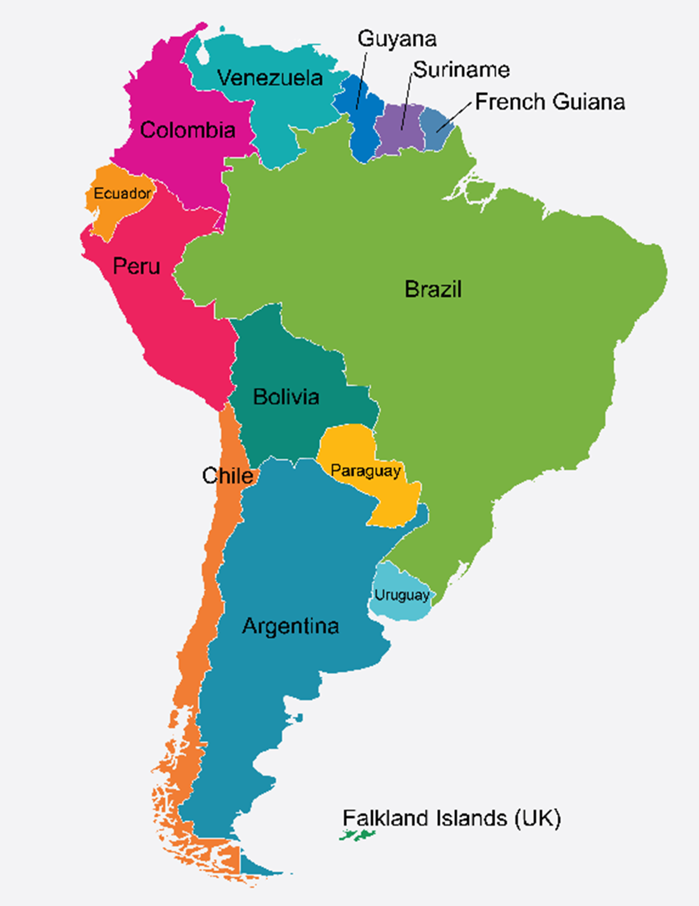
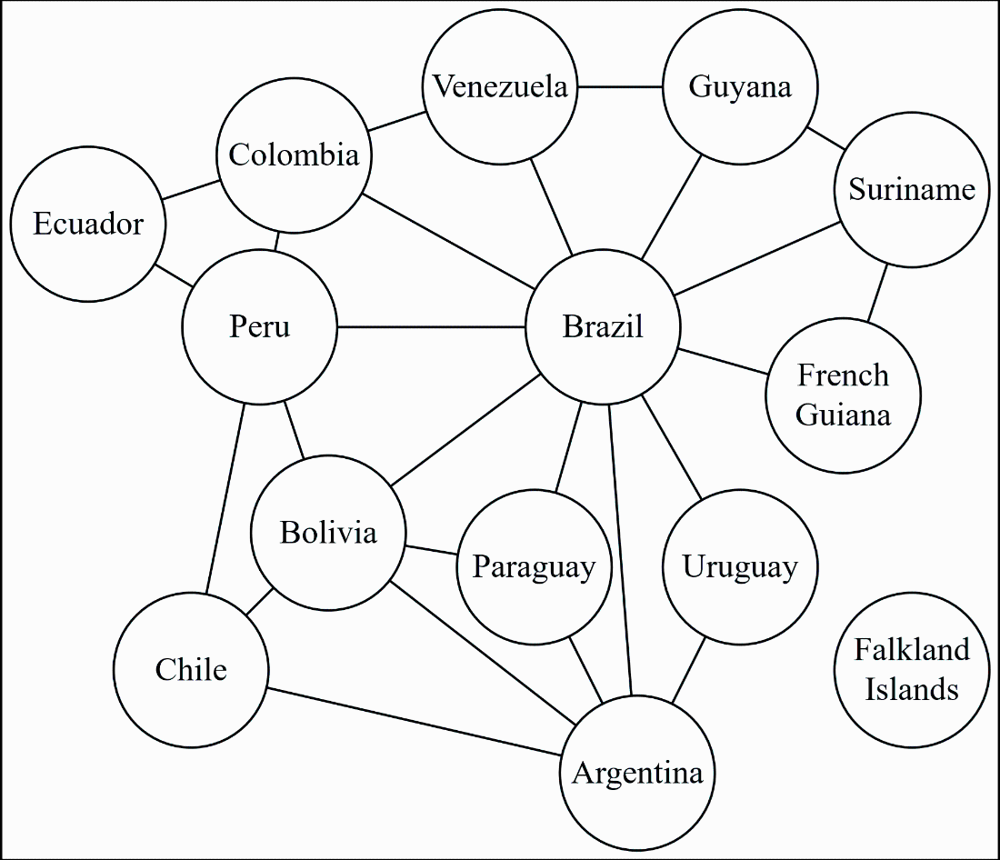
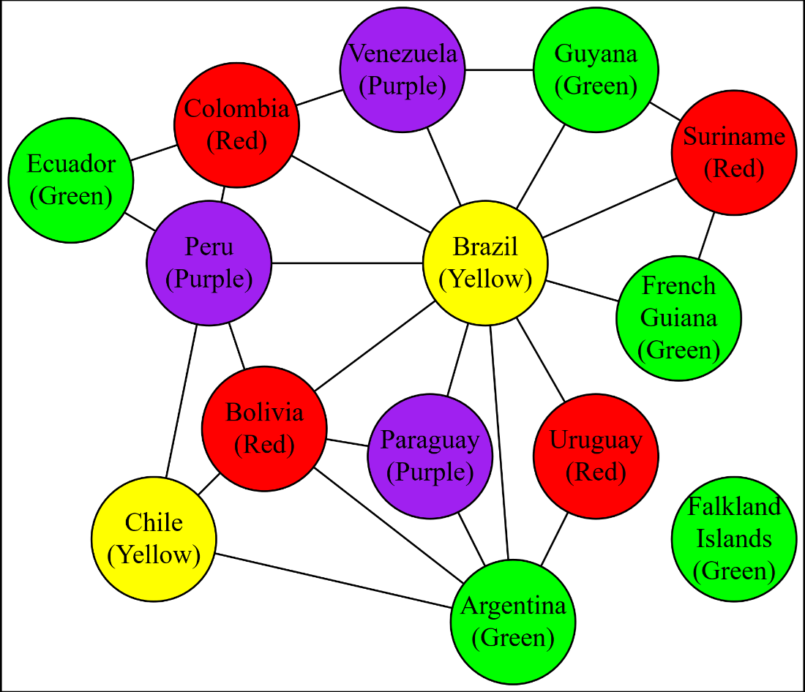
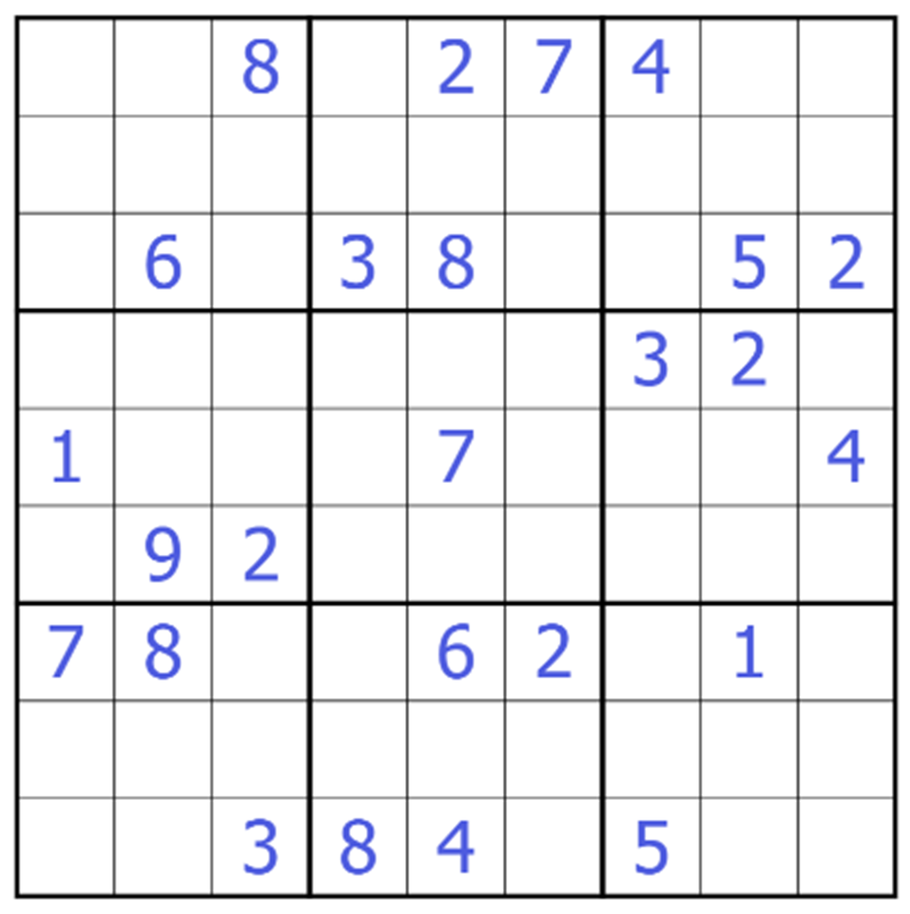

# 用回溯搜索给图着色

**本章内容**

- 彩色地图的一些令人惊讶的应用
- 简洁性的好处
- 回溯搜索
- 一种多重字典数据结构

图论（Graph theory）——当你有一堆“节点”并用一堆“边”把它们连接起来时会发生什么的数学研究——是组合数学中极其重要的一部分，并且对计算机编程产生了巨大影响。在本章中，我们将探讨一个经典的图论问题：给定若干种颜色和一张图，我们能否为每个节点分配一种颜色，使得任意两个相邻节点——也就是被一条边直接连接的两个节点——永远不会是同一种颜色？如果可以，怎么做？节点着色与许多现实世界的问题直接相关，例如给地图上的区域上色、解数独谜题以及避免寄存器溢出。

回溯搜索算法是一种基础的问题求解策略。你先对解做一个猜测，然后检查这个猜测是否正确。如果猜错了，就回到上一步并做出不同的猜测。重复这一过程，直到你要么把所有猜测用尽，要么找到解为止。我们将应用回溯搜索算法来解决图着色问题，并创建一个通用引擎，用于用回溯来解决其他问题。

同样，我们将充分利用不可变数据结构的威力，因为它们特别适合回溯搜索。

> **术语说明**
>
> 图论学者常用“vertex”而不是“node”，但它们指的是同一回事。本章中我将一直使用“node”。

## 8.1 给南美洲着色

看一张南美洲地图，尤其是阿根廷、玻利维亚、巴西和巴拉圭。如果你想给这张地图上的国家涂色，使得任何共享边界的国家也不共享同一种颜色，那么你至少需要四种颜色，因为这些国家彼此都接壤；见图 8.1：



图 8.1 在南美洲地图上，有四个国家彼此都接壤。

对于平面或球面上的任意一张区域地图，为了避免相邻区域被涂成同一种颜色，你可能需要的最小颜色数是多少？我们已经看到，在南美洲至少是四种。是否存在只能用五种（或更多）颜色才能着色的地图？这是一个著名的问题，数学家们研究了几十年，直到 20 世纪后期才最终证明：四种颜色就足够了。

在实践中，我们绘制政治地图时会使用超过四种颜色，原因有二。第一，如果我们把海洋通常使用的蓝色也算作四种颜色之一，那么只用四种颜色给南美洲着色就意味着玻利维亚或巴拉圭必须是蓝色，这看起来很奇怪。第二，我们还有许多由政治关系造成的着色约束。法属圭亚那是法国的一部分；在法律意义上，法国与巴西相邻！我们可能希望在世界地图上，法国和法属圭亚那是同一种颜色。由于不相连的政治区域带来的额外着色约束，地图可能需要超过四种颜色。

为了编写程序来解决这个问题，我们需要一种更清晰、更数学化的视角，把政治和地理方面的顾虑抽象掉。我们将使用的抽象数据类型是不可变的无向图，其中节点代表区域，边连接那些相邻、因此不能使用同一种颜色的区域。

> 注释
>
> 如果边是“箭头”，你可以区分哪个是“from”节点、哪个是“to”节点，那么你得到的是有向图。在无向图中，我们只关心两个节点是否被一条边连接。

接下来，我们将尝试为每个节点关联一种颜色，从而解决这个问题。但在解决图着色问题之前，我们需要一种数据结构来表示不可变图。

## 8.2 一个不可变多重字典

我们需要在图上执行的操作很直接：添加和删除节点与边，检查给定的节点或边是否在图中，以及列出与给定节点相邻的节点。我们应该用什么数据结构来实现这个抽象数据类型？假设一个图有 n 个节点和 e 条边。有三种经典选择：

- 关联矩阵：给每个节点分配一个从 0 到 n-1 的索引，并给每条边分配一个从 0 到 e-1 的索引。创建一个 n×e 的比特数组。如果编号为 x 的节点是编号为 y 的边所连接的节点之一，就将 [x, y] 处的比特设置为 1。
- 邻接矩阵：创建一个 n×n 的比特数组。如果编号为 x 和 y 的两个节点共享一条边，就将 [x, y] 处的比特设置为 1。
- 邻接字典：创建一个字典，其中每个键是一个节点，对应的值是与之相邻的节点集合。这类字典常被称为多重字典（multi-dictionaries），因为它们从一个键映射到一个包含零个或多个值的集合，而不是把一个键精确映射到一个值。

在构建不可变数据结构时，每种选择都有利有弊。我们在第 4 章看到，可以用带备忘（memoized）的四叉树（quadtree）构造出非常大的持久化不可变比特数组，所以前两种方案看起来可行。话虽如此，我在本章后面还会因为另一个目的需要用到多重字典，因此无论如何我们都得创建一个。于是我们将选择用字典的方式来表示不可变图。

在这里从零开始实现一个不可变字典会把注意力从图的数据结构和算法上带偏，所以我会使用 .NET 运行时中 `System.Collections.Immutable` 命名空间里的 `ImmutableDictionary` 类。不幸的是，运行时里并没有现成免费的不可变多重字典。我一直相信应该编写恰好具备解决问题所需特性的类型，因此让我们构建一个包装类型：通过把“键”关联到“值的不可变集合”，为标准不可变字典增加多值支持。代码不多：

清单 8.1 通过包装普通字典来实现多重字典

```csharp
readonly struct ImMulti<K, V> 
    where K : notnull 
    where V : notnull
{
	private readonly ImmutableDictionary<K, ImmutableHashSet<V>> dict;
	public static ImMulti<K, V> Empty =
		new(ImmutableDictionary<K, ImmutableHashSet<V>>.Empty);
	private ImMulti(ImmutableDictionary<K, ImmutableHashSet<V>> dict) =>
    this.dict = dict;
    public bool IsEmpty => dict.IsEmpty;
    public bool ContainsKey(K k) => dict.ContainsKey(k);
    public bool HasValue(K k, V v) => dict.ContainsKey(k) && dict[k].Contains(v);
    public IEnumerable<K> Keys => dict.Keys;
    public ImmutableHashSet<V> this[K k] => dict[k];
    public ImMulti<K, V> SetItem(K k, ImmutableHashSet<V> vs) => 
        new(dict.SetItem(k, vs));
    public ImMulti<K, V> SetSingle(K k, V v) =>
    	dict.SetItem(k, ImmutableHashSet<V>.Empty.Add(v));
    public ImMulti<K, V> SetEmpty(K k) =>
    	dict.SetItem(k, ImmutableHashSet<V>.Empty);
    public ImMulti<K, V> Add(K k, V v) => ContainsKey(k) ? 
        new(dict.SetItem(k, dict[k].Add(v))) :
    	SetSingle(k, v);
    public ImMulti<K, V> Remove(K k) => new(dict.Remove(k));
    public ImMulti<K, V> Remove(K k, V v) => 
        new(dict.SetItem(k, dict[k].Remove(v)));
}
```

- `IsEmpty`、`ContainsKey`、`Keys`、索引器、`SetItem` 以及 `Remove(K)` 这些成员什么也不做，只是把调用转发到底层字典。
- `HasValue(K, V)` 会检查键是否在字典中；如果在，则再检查该值是否在与该键关联的值集合中。
- `Add(K, V)` 和 `Remove(K, V)` 这两个成员实现了多重字典的逻辑，确保值集合被正确更新。
- 我还实现了 `SetSingle` 和 `SetEmpty` 方法，因为这些操作足够常见，值得提供辅助方法。

在不可变字典和不可变哈希集合中，所有添加、删除和查找操作都是 O(1)，因此这里几乎没有什么性能分析可做。字典和集合不管变得多大都很廉价。

现在我们有了一个恰好具备本项目所需特性的实用类型，那么我们要如何把它变成一张图呢？

## 8.3 一个不可变无向图

我们现在已经有了一个不可变多重字典类型，因此我们似乎可以直接用它来表示图。我们可以规定：字典的每个键都是一个节点，对应的值就是它的相邻节点。那我们还需要另一个类型吗？

是的，需要，原因有三点。第一，因为好的数据类型会强制不变式（invariants）。你很容易构造出一个违反无向图规则的多重字典：

```csharp
var badGraph = ImMulti<string, string>.Empty
    .Add("Paraguay", "Brazil")
    .Add("Brazil", "Bolivia");
```

如果把键当作节点，那么 Paraguay 和 Brazil 是唯一的节点。Bolivia 不是字典的键，所以它不是一个节点，但它却莫名其妙地与 Brazil 相邻。如果你查询 Paraguay 的邻居，会得到 Brazil，但 Brazil 的邻居却不包含 Paraguay，因此这个图不是无向的。一团糟。图类型可以强制规则，确保只会构造出合法的图。

第二，字典在概念上是一个键值存储系统，而图在概念上是一组通过边连接起来的节点。类型的成员命名应当让代码读者清楚该类型的“业务”是什么。当你试图处理节点和边时，却使用键值存储的行话，会造成不必要的困惑。

第三，实现图这种抽象数据类型时，我们希望隐藏实现选择。如果我们之后决定用邻接矩阵重新实现图，调用方就不需要被重写。

就像我们让 `ImMulti<K,V>` 成为字典的一个轻量包装一样，我们也会让 `ImGraph<N>` 成为 `ImMulti<N, N>` 的一个轻量包装。通过把它做成泛型，我们可以为节点选择任何想要的类型。我们需要提供用于添加节点与边、删除节点与边、检查节点或边是否在图中，以及枚举节点与边的成员。我还要现在就加一个便利特性（本章后面会用到）：用于添加团（clique）。

团（clique）是一群人，其中每个人都和其他所有人是朋友。在图论中，团是一组节点，其中每个节点都与其他所有节点相邻。我们很快就会看到，当把地图转换成图时，阿根廷、玻利维亚、巴西和巴拉圭这些彼此相邻的国家构成了一个团。

让我们做一个不可变无向图，它只是一个围绕“节点的多重字典”的轻量包装：

清单 8.2 用多重字典包装的不可变无向图

```csharp
readonly struct ImGraph<N> where N : notnull
{
    public static ImGraph<N> Empty = new(ImMulti<N, N>.Empty);
    private readonly ImMulti<N, N> nodes;
    private ImGraph(ImMulti<N, N> ns) => this.nodes = ns;
    public bool IsEmpty => nodes.IsEmpty;
    public bool HasNode(N n) => nodes.ContainsKey(n);
    public bool HasEdge(N n1, N n2) => nodes.HasValue(n1, n2);
    public IEnumerable<N> Nodes => nodes.Keys;
    public ImmutableHashSet<N> Edges(N n) => nodes[n];
    public ImGraph<N> AddNode(N n) =>
    	HasNode(n) ?
    		this :
    		new(nodes.SetItem(n, ImmutableHashSet<N>.Empty));
    public ImGraph<N> AddEdge(N n1, N n2) =>
    	new(nodes.Add(n1, n2).Add(n2, n1));
    public ImGraph<N> RemoveEdge(N n1, N n2) =>
    	new(nodes.Remove(n1, n2).Remove(n2, n1));
    public ImGraph<N> RemoveNode(N n)
    {
        var result = this;
        foreach (var n2 in Edges(n))
        	result = result.RemoveEdge(n, n2);
        return new(result.nodes.Remove(n));
    }
    public ImGraph<N> AddEdges(N n1, IEnumerable<N> ns)
    {
        var result = this;
        foreach (var n2 in ns)
        	result = result.AddEdge(n1, n2);
        return result;
    }
    public ImGraph<N> AddClique(IList<N> ns)
    {
        var result = this;
        for(int i = 0; i < ns.Count; i += 1)
        	for(int j = i + 1 ; j < ns.Count; j += 1)
        		result = result.AddEdge(ns[i], ns[j]);
        return result;
    }
}
```

你可以看到，这个围绕多重字典的轻量包装如何维护图的不变式，并且它的成员使用的是图、节点与边的行话来命名，而不是字典、键与值。下面是几个值得注意的要点：

- `AddNode` 会检查该节点是否已经是字典的一个键；如果是，我们就完成了。如果不是，我们就添加一个带空值集合的新键，因为新节点没有任何边。
- `AddEdge` 会把两个节点互相加入对方的邻接集合，从而维护图的不变式：如果存在从 n1 到 n2 的边，那么也必须存在从 n2 到 n1 的边。如果这些节点还不在图中，它们会成为字典的键，从而成为图的节点。
- `RemoveNode` 通过在删除节点前先删除该节点的所有边来维护图的不变式，因此其时间复杂度在“被删除的边数”上是 O(e)。
- `AddEdges` 是一个辅助方法，用来一次性添加许多边，而且这些边都涉及同一个节点。下一节我们会看到这为什么有用。
- `AddClique` 会在列表中的每一对节点之间添加边，这在列表规模上是一个 O(n^2) 的操作。按索引遍历这些节点最方便，因此我要求团必须放在一个可按索引访问的列表里。本章后面我们会研究包含许多团的图。

我们终于有了一个可以用来表示图的数据结构。让我们构建一个南美洲的图，并提出一个简单的递归算法来尝试为它着色。

## 8.4 为简单图着色

图着色是组合数学中研究最为深入的问题之一，因此关于这个问题有大量文献。幸运的是，对于我们在实践中遇到的许多图着色问题，一个非常简单的递归算法就能胜任。用四种颜色为南美洲地图着色就是一个很有代表性的例子。我们先构建一张图，其中每个节点都是一个国家，相邻国家就是相邻节点。我们还会创建一个包含四种颜色的集合：

清单 8.3 南美洲的图

```csharp
var southAmerica = ImGraph<string>.Empty
    .AddNode("Falkland Islands")
    .AddEdges("French Guiana", ["Brazil", "Suriname"])
    .AddEdges("Suriname", ["Brazil", "Guyana"])
    .AddEdges("Guyana", ["Brazil", "Venezuela"])
    .AddEdges("Venezuela", ["Brazil", "Colombia"])
    .AddEdges("Colombia", ["Brazil", "Peru", "Ecuador"])
    .AddEdges("Peru", ["Brazil", "Ecuador", "Bolivia", "Chile"])
    .AddEdges("Chile", ["Bolivia", "Argentina"])
    .AddEdges("Bolivia", ["Brazil", "Paraguay", "Argentina"])
    .AddEdges("Paraguay", ["Brazil", "Argentina"])
    .AddEdges("Argentina", ["Brazil", "Uruguay"])
    .AddEdge("Uruguay", "Brazil");
var colors = ImmutableHashSet<Color>.Empty
    .Add(Color.Red).Add(Color.Yellow)
    .Add(Color.Green).Add(Color.Purple);
```

图 8.2 展示了南美洲的图：



图 8.2 南美洲的图，其中相邻国家是相邻节点。

如果我给你四支不同颜色的记号笔，让你给这张图着色，使得任意相邻节点不共享同一种颜色，你会怎么做？你首先很可能会注意到，你为福克兰群岛选择什么颜色完全无关紧要。一个节点的度（degree）是从它引出的边的数量；由于福克兰群岛是一个度为零的节点，你可以随便为它挑一种颜色，而不用担心产生任何冲突。

你也可能会注意到，度较低的节点——智利、厄瓜多尔、福克兰群岛、法属圭亚那、圭亚那、巴拉圭、苏里南、乌拉圭和委内瑞拉——都有一个非常有用的性质：它们可以最后再着色。如果其中任何一个是最后被分配颜色的，那也没问题，因为一定还存在一种颜色没有被它的邻居使用过。哥伦比亚是一个度为四的节点，想让它最后着色就困难得多，因为巴西、厄瓜多尔、秘鲁和委内瑞拉可能已经把四种颜色全都用上了。

我们还可以把这个论证推进得更远。假设我们决定最后给厄瓜多尔着色。我们可以暂时把厄瓜多尔从图中移除，在没有厄瓜多尔的情况下先把图着色，然后再给厄瓜多尔分配一种不同于 Columbia 和 Peru 的颜色。但在移除了厄瓜多尔的图中，哥伦比亚的度是三；哥伦比亚就成了倒数第二个着色的候选。

此时你的脑海里大概已经浮现出这个递归算法的轮廓了。假设我们有一张图，想用 c 种可能的颜色来给它着色：

- 基本情况是空图。一个没有节点的图显然不存在相邻节点使用相同颜色的情况。完成。
- 否则，找一个度小于 c 的节点，把它留到最后着色。如果找不到这样的节点，那么该算法无法找到一种着色方案。
- 递归地给“移除了最后节点”的图着色。
- 为最后节点从剩余可用颜色中任意挑选一种。

来实现它吧！我们可以返回一个从节点到颜色的不可变字典；如果算法失败，则返回 null。该方法可以作为图的扩展方法，并对节点类型和颜色类型使用泛型类型参数：

清单 8.4 简单的递归着色算法

```c#
static class SimpleGraphColoring
{
    public static ImmutableDictionary<N, C>? ColorGraph<N, C>(
        this ImGraph<N> graph,
        ImmutableHashSet<C> colors)
        where N : notnull where C : notnull
    {
        if (graph.IsEmpty)
        	return ImmutableDictionary<N, C>.Empty;
        N? last = graph.Nodes
            .Where(n => graph.Edges(n).Count < colors.Count)
            .FirstOrDefault(); #A
        if (last is null)
        	return null;
        var coloring = graph.RemoveNode(last).ColorGraph(colors);
        if (coloring is null)
        	return null;
        var usedColors = graph.Edges(last).Select(n => coloring[n]); #B
        var lastColor = colors.Except(usedColors).First(); #C
        return coloring.Add(last, lastColor);
    }
}
```

\#A `FirstOrDefault` 返回第一个找到的、边数足够少的节点；如果一个都找不到则返回 null
\#B 这些是我们不能分配给最后节点的颜色
\#C 选择第一个我们可以使用的可用颜色

让我们试试它：

```csharp
var simple = southAmerica.ColorGraph(colors);
foreach (var n in simple!.Keys)
	Console.WriteLine($"{n} -> {simple[n].Name}");
```

这会生成一个有效的着色方案：

Colombia -> Red
Suriname -> Red
Paraguay -> Purple
Peru -> Purple
Chile -> Yellow
French Guiana -> Green
Venezuela -> Purple
Guyana -> Green
Brazil -> Yellow
Bolivia -> Red
Uruguay -> Red
Ecuador -> Green
Falkland Islands -> Green

图 8.3 展示了着色后的图：



图 8.3 南美洲的一个有效四色着色

如果该算法成功，那么它在一个包含 n 个节点、e 条边的图上的性能如何？这个算法里只有两类昂贵操作：进行 n 次“寻找要移除的节点”的搜索，以及进行 n 次节点移除。对于搜索而言，最佳情况是每次都能立刻找到一个低度节点，总成本为 O(n)。最坏情况是为了找到一个节点需要检查 O(n) 个节点，总成本为 O(n^2)。对于移除而言，我们总是会移除全部 n 个节点和全部 e 条边，成本为 O(n+e)。综合起来，渐近时间复杂度介于 O(n+e) 与 O(n^2+e) 之间。正如我们在南美洲的例子中看到的，这个算法通常适用于包含大量低度边的简单图；对这类图而言，该算法是线性的。

我们得到了一种容易实现、在典型图上性能合理、并且能为“多数节点度较低”的图找到解的算法。不幸的是，如果图中每个节点的度都大于可用颜色的数量，那么这个算法就完全派不上用场了。接下来我们就来看一个这样的图的例子。

## 8.5 用回溯搜索求解数独

数独是一种很流行的谜题形式：你必须在一个 9×9 的网格中，让每一行、每一列以及每个 3×3 宫格都恰好各包含一次数字 1 到 9；其中有些数字已经由出题者预先填好。图 8.4 给出了一个例子；你可以试一试：



图 8.4 一道典型的报纸数独题

乍一看这似乎不是图着色问题，但其实它就是。数字 1 到 9 就是可用的“颜色”。我们可以构造一个有 81 个节点的图，每个节点对应网格中的一个格子；对于任意两个格子，只要它们不能填入相同的数字，就在对应的两个节点之间连一条边。每一行、每一列和每一个宫格里的九个节点都是团（clique）。让我们来构建这个图；我们从左上角开始，把格子编号为 0 到 80：

清单 8.5 数独谜题的图及其颜色

```csharp
var sudoku = ImGraph<int>.Empty;
for (int i = 0; i < 9; i += 1)
    sudoku = sudoku.AddClique([.. Enumerable.Range(i * 9, 9)]);
for (int i = 0; i < 9; i += 1)
    sudoku = sudoku.AddClique([.. Enumerable.Range(0,9).Select(x => x * 9 + i)]);
sudoku = sudoku
    .AddClique([00, 01, 02, 09, 10, 11, 18, 19, 20])
    .AddClique([03, 04, 05, 12, 13, 14, 21, 22, 23])
    .AddClique([06, 07, 08, 15, 16, 17, 24, 25, 26])
    .AddClique([27, 28, 29, 36, 37, 38, 45, 46, 47])
    .AddClique([30, 31, 32, 39, 40, 41, 48, 49, 50])
    .AddClique([33, 34, 35, 42, 43, 44, 51, 52, 53])
    .AddClique([54, 55, 56, 63, 64, 65, 72, 73, 74])
    .AddClique([57, 58, 59, 66, 67, 68, 75, 76, 77])
    .AddClique([60, 61, 62, 69, 70, 71, 78, 79, 80]);
 
var digits = ImmutableHashSet<char>.Empty
    .Add('1').Add('2').Add('3').Add('4').Add('5')
    .Add('6').Add('7').Add('8').Add('9');
```

\#A 九个行团（row cliques）
\#B 九个列团（column cliques）
\#C 九个宫团（box cliques）

这个图中的每个节点的度都是 20，但可用颜色只有 9 种，因此上一节的简单着色算法连开始都做不到。我们需要更强的方法，所以来看看回溯算法。它的高层描述是这样的：

- 我们得到一张图，其中任意数量的节点可能已经有颜色。其余节点还剩下一些可能的颜色可选。
- 是否存在某个节点没有任何可能颜色？算法失败。
- 整张图是否已经被合法着色？算法成功。
- 否则，必然至少存在一个节点有两种或以上的可能颜色。选取其中一个；我们将要确定这个节点的颜色。
- 猜测这个节点的颜色，并递归运行算法。如果成功，那就很好，我们猜对了，因此完成。
- 如果不成功，就对这个节点做不同的猜测，直到找到一个解，或者把所有可能颜色都试过并承认失败为止。

这是一种“回溯（backtracking）”算法，因为我们先做一个猜测，探索该猜测带来的后果；如果猜错了，就“回溯”到做出猜测的地方，然后尝试另一个猜测。

如果存在解，这个算法最终一定会找到它。但是，“把所有可能猜测都做一遍并逐个检查”会有良好性能吗？通过递归猜测，我们可能会做出数量极其庞大的总猜测次数。在实现算法之前，让我们先稍微岔开一下，简短地思考这个问题。

### 8.5.1 图着色是 NP-完全的

要回答这个问题，我们需要稍微更深入一点复杂度理论。到目前为止，本书一直在分析算法的渐近时间性能，并把它们刻画为 O(1)、O(log n)、O(n)、O(n^2)、O(2^n) 等等。如果一个算法的最坏情况时间复杂度是 O(n^c)，其中 c 是某个常数，那么就称它具有“多项式（polynomial）”性能。注意指数级的 O(c^n) 算法不是多项式时间。

有一类问题被称为 NP-完全问题，它们具有以下特征：

- 它们都可以表述为是或否的问题。
- 一个用于证明答案为“是”的候选解，可以在多项式时间内被验证。
- 目前还没有发现一种总能回答该问题的多项式时间算法。
- 也同样还没有证明不存在这样的多项式算法。
- 如果我们为任何一个 NP-完全问题找到了多项式时间算法，那么所有 NP-完全问题都将存在多项式时间算法。（这也是它们被称为“完全（complete）”的原因。）

NP-完全问题是那些困难问题：它们也许存在多项式解法，但迄今为止还没有找到。我个人相信不存在这样的算法，但也可能我错了！

图着色可以表述为一个是或否的问题：“南美洲的图是否存在只用四种颜色的着色？”如果我们认为答案是“是”，因为我们给出了一个可能的解，那么我们可以通过检查每一条边，确认边两端的节点是否颜色不同来验证它。由于一张图的边数最多不会超过 O(n^2)，其中 n 是节点数，所以验证显然是多项式时间。证明图着色与其他每一个 NP-完全问题等价会把话题扯得太远，但事实是：它确实和其他所有 NP-完全问题一样难。我们提出的图着色算法要么具有指数级的最坏情况时间，要么像之前的简单算法那样，并不适用于所有图。

我们对回溯搜索算法的概述能够为任意图着色问题寻找解；如果不存在解，则报告失败。图着色是 NP-完全的，因此不存在已知的多项式时间算法来寻找解。所以，回溯搜索必然不是多项式时间！不出所料，“不停猜直到找到解”为最坏情况指数级。

不过还是有希望：许多实际的图着色问题并不是最坏情形。如果我们要把回溯作为策略，坚持下去，那么帮助算法性能的最佳方式就是减少需要猜测的可能性数量。

让我们继续往前，开始写一些代码来实现一个通用的回溯求解方案。

### 8.5.2 实现一个通用回溯器

我们先前对回溯算法的描述，并没有说明如何更积极地减少需要探索的可能性数量。我们可以通过把回溯解法的代码分成三部分来做到这一点：

- 一次尝试（attempt）是一个多重字典，其中键是需要着色的节点，值是仍然可能的颜色集合。如果一次尝试对每个节点都恰好只剩一个值，那么它就是一个解。如果对任何节点剩余值为零，那么它就坏掉了（broken）。
- 一个约简器（reducer）接收一次尝试，并尝试在不进行猜测的情况下，生成一个“每个节点剩余可能颜色更少”的新尝试。它返回这个新尝试。
- 一个回溯器（backtracker）接收一次尝试，对其进行约简，并检查约简后的尝试是坏掉了还是已经是解。如果都不是，那么它就进行猜测并递归查找解。它会产生一个解的序列；空序列表示没有解。

幸运的是，我们已经实现了多重字典；无需再做一遍。我们将定义一个只有一个成员的接口来表示约简器，并实现一个类，用于从一次尝试的取值中移除不可能的颜色：

清单 8.6 一个在尝试中移除不可能节点颜色的约简器

```c#
interface IReducer<K, V> where K : notnull where V : notnull
{
    ImMulti<K, V> Reduce(ImMulti<K, V> solver);
}
 
sealed class GraphColorReducer<N, C> :
IReducer<N, C> 
    where N : notnull where C : notnull
{
    private readonly ImGraph<N> graph;
    public GraphColorReducer(ImGraph<N> graph) => this.graph = graph;
    private (ImMulti<N, C>, bool) ReduceOnce(ImMulti<N, C> attempt)
    {
        bool progress = false;
        var result = attempt; 
        foreach (N n1 in attempt.Keys.Where(k => attempt[k].Count == 1)) #A
        {
            C c = attempt[n1].Single(); #B
            var elim = graph.Edges(n1).Where(n => attempt.HasValue(n, c)); 
            foreach (N n2 in elim) 
            {
                result = result.Remove(n2, c); #C
                progress = true;
            }
        }
        return (result, progress);
    }
    public ImMulti<N, C> Reduce(ImMulti<N, C> attempt)
    {
        bool progress;
        do
            (attempt, progress) = ReduceOnce(attempt); #D
        while (progress);
        return attempt;
    }
}
```

\#A 遍历已被分配了颜色的节点
\#B n1 的颜色
\#C 节点 n2 与 n1 相邻，因此不能使用 n1 的颜色
\#D 我们也许可以立刻再做一次约简

关于这段代码，有几点值得注意：

- 一次尝试是“从节点到颜色”的多重字典，而图的实现是“从节点到节点”的多重字典。想象一下，如果我们当初没有决定为图写一个包装类型，这段代码会有多么令人困惑。同一段代码里会同时出现两个“以节点为键”的多重字典，但它们的值却有完全不同的含义！早先花二十来行写一点包装代码的决定，现在开始回本了。
- `ReduceOnce` 的策略是：找出那些已经被约简到只剩一种可能颜色的节点，并确保把该颜色从它们所有邻居的“可能颜色集合”中移除。这可能会产生一个坏掉的尝试——这很好，因为回溯器就不会在这个尝试上继续递归下去；也可能会产生一个解——这同样很好，因为回溯器会把它返回。无论哪种情况，它都减少了需要猜测的可能性数量。
- `ReduceOnce` 也可能产生一个新的“被约简到只剩单一颜色”的节点；在这种情况下，我们就可以继续做更多约简。`Reduce` 会不断调用 `ReduceOnce`，直到它不再取得进展为止。

现在，让我们实现回溯算法，然后把所有东西组合起来求解一个数独：

清单 8.7 一个通用的回溯算法

```c#
sealed class Backtracker<N, C> where N : notnull where C : notnull
{
    private readonly IReducer<N, C> reducer;
    public Backtracker(IReducer<N, C> reducer) => this.reducer = reducer;
    public IEnumerable<ImMulti<N, C>> Solve(ImMulti<N,C> attempt)
    {
        attempt = reducer.Reduce(attempt);
        if (attempt.Keys.Any(k => attempt[k].IsEmpty))
            return [];
        if (attempt.Keys.All(k => attempt[k].Count == 1))
            return [attempt];
        N guessKey = attempt.Keys.Where(k => attempt[k].Count > 1).First();
       
return attempt[guessKey]
            .SelectMany(v =>
Solve(attempt.SetSingle(guessKey, v)));
    }
}
```

由于我们把所有与图相关的逻辑都放进了约简器里，回溯逻辑本身短得惊人！事实上，这段代码里完全没有任何与图着色相关的内容；它是一个通用回溯器，可用于解决任何“需要在满足某些条件的前提下，找到从键到值的映射”的问题。如果你愿意，也可以为一个完全不同的问题编写自己的约简器。

当我们拿到一次尝试时，首先做的事情就是对它进行约简；我们也许能立刻把它判定为坏掉，或者立刻解出它。如果立刻坏掉了，我们就返回一个空序列。如果立刻解出了，我们就返回一个只包含一个元素的序列。否则，我们从尝试中挑选一个仍然拥有多个可能值的键，为每一种可能性构造一个新的尝试，并递归求解该尝试。`SelectMany` 会把这些递归返回的解序列拼接（concatenate）成一个单一的解序列。

> 题外话：这种通过返回“零或一元素序列”来过滤掉坏尝试，并使用 `SelectMany` 把所有序列连接起来的技巧，会在后面一个即将到来的“抽象泛化胡扯(abstract generalized nonsense)”插曲里进一步展开，所以先记在心里，之后还会用到。

让我们使用清单 8.5 的图来求解图 8.4 的数独。我们会用题目给定的数字来设置一次尝试，然后求解它。

清单 8.8 通过回溯求解数独

```c#
string puzzle =
    "  8 274  " +
    "         " +
    " 6 38  52" +
    "      32 " +
    "1   7   4" +
    " 92      " +
    "78  62 1 " +
    "         " +
    "  384 5  ";
var initial = ImMulti<int, char>.Empty;
foreach (var cell in sudoku.Nodes)
    initial = initial.SetItem(cell, digits);
for (int i = 0; i < puzzle.Length; i += 1)
    if (puzzle[i] != ' ')
        sudokuInitial = sudokuInitial.SetSingle(i, puzzle[i]);
var reducer = new GraphColorReducer<int, char>(sudoku);
var backtracker = new Backtracker<int, char>(reducer);
var solution = backtracker.Solve(initial).First();
for (int i = 0; i < 81; i += 1)
{
    Console.Write(solution[i].Single());
    if (i % 9 == 8)
        Console.WriteLine();
}
```

我们先创建一个初始尝试：让每个格子都把全部九个数字作为可能性，然后再把其中一些格子限制为题目给定的数字。报纸数独被设计为恰好只有一个解，因此我们取求解器返回的第一个解并把它打印出来：

```
358127469
279654831
461389752
847916325
135278694
692435187
784562913
516793248
923841576
```

果然，你可以（在多项式时间内！）验证：这个解在与原题相同的位置包含相同的数字，并且每一行、每一列以及每一个 3×3 宫格都恰好各包含一次 1 到 9 的数字。

