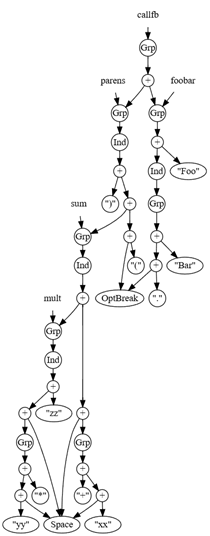

# 贪婪迭代式代码格式化

**本章涵盖**

- 定义“代码美化”问题
- 使用贪婪算法快速找到非最优解
- 通过显式栈避免深度递归
- 用访问者模式分离关注点

现代面向软件开发者的编辑器通常为多种语言提供自动代码格式化功能。对于那些对空格和换行使用规则较弱的语言，这一点尤其有用。例如，像 C、Java 或 C# 这样的语言根本不在意你是写如下简洁的代码：

```c
double Frob(int x){int y = Qux(x); return Rezrov(y+1);}
```

还是写一些古怪的东西：

```c#
double Frob(int x)
{ 
    int y = Qux( x);
    return Rezrov(y +1 ); 
}
```

在许多语言中，程序员在格式化代码时有很大的自由度以便使其对自己可读。但我们大多数人并不是为娱乐而编写全新的代码；我们职业生涯中在行业里与同事一起维护现有的大型代码库。防止混乱的规则在我参加过的每个团队中都是相同的：

- 每个人都应使用相同的自动代码格式化器在提交前格式化所有新文件。
- 除非仅仅是为了使格式符合标准，否则不要更改现有文件的格式。

这些规则是合理的，但你是否曾想过那些自动代码格式化工具——通常称为“代码格式化器”——是如何工作的？我们将回顾现代代码编辑器必须考虑的一些棘手情况，然后提出该问题的一个简化版本，利用一个优雅、快速且非递归的贪婪算法来解决。我们还将看看编译器开发者如何使用访问者模式将代码格式化逻辑与解析树代码分离。

## 9.1 代码格式化问题

如果我们有一些源代码希望美化，首先需要做的是理解代码的逻辑结构。这是词法分析器的工作，它把原始字符串拆分成一系列“标记”，以及解析器的工作，它从标记序列推导出解析树。解析树标识代码中哪些部分是语句、表达式、字面量，等等。解析是一个庞大的主题，在别处已有详尽论述，所以我不会在本书中讨论它。

一旦我们有了解析树，漂亮打印问题就是“令人愉快地”把那棵树变回文本。是什么让源代码看起来“赏心悦目”？我们希望在三个目标之间找到一个合理的平衡：

- 防止换行或水平滚动；除非必要，否则不应有任何行宽超过给定限制（通常为 80 或 100 字符）。
- 通过缩进帮助读者理解代码结构。
- 减少垂直滚动；插入尽可能少的换行。

这些目标常常互相冲突；通常我们按上述顺序对它们进行优先级排序。例如，许多开发者会觉得下面这种格式有问题，因为它在帮助读者理解结构方面不如减少换行重要：

```c
if (outdated) Update(); CreateReport();
```

下面这两种选项都要好一些，尽管对于哪一种最好意见不一：

```c#
if (outdated) Update();		or	if (outdated)
CreateReport();             		Update();
								CreateReport();
```

你可以为任一选项辩护，这取决于你如何在缩进和垂直紧凑性之间进行权衡。当我们观察具体语言的怪癖时，问题只会变得更难。代码格式化器应如何处理位于表达式中间的行尾注释？

```c
if (outdated) Update // TODO Rename this
(); CreateReport();
```

希望没有明智的开发者会这样写，但代码格式化器需要能够处理任何代码。可能最好的选择类似于：

```c
if (outdated)
Update // TODO Rename this
();
CreateReport();
```

代码格式化器在许多语言中面临的一个相关问题是分块注释（delimited comments）应“粘”到左侧还是右侧标记。考虑代码格式化器如何处理：

```c
Foo(); /* ABC */ Bar(); /* DEF */ Frob();
```

如果代码格式化器决定将其拆成多行，ABC 应该跟随左侧的分号还是跟随 Bar？DEF 应该跟随左侧的分号还是跟随 Frob？考虑这两种可能性；你更喜欢哪一种？

```c
Foo(); /* ABC */ Foo();		or		Foo();/* ABC */ 
Bar(); /* DEF */					/* ABC */ Bar();
Frob();								/* DEF */ Frob();
```

这是一个我们在构建 C# 编译器和 IDE 时必须解决的真实且实际的问题，但在本章中为了呈现算法，搞清楚针对特定语言格式化每个部分的所有这些混乱细节会太分散注意力。因此，为了本书的目的我将简化问题：

- 我们将假设格式化器的输出中没有注释
- 唯一有效的空白是空格和换行，不使用制表符
- 缩进固定为每级四个空格
- 我们将假设没有强制的换行

也就是说，我们将为无注释的表达式开发一个代码格式化器，而不是那些我们总是期望在语句之间有换行的语句块。在阅读本章代码时，思考一下你可能如何扩展它以将“必须换行”和“行尾注释”加入漂亮打印逻辑。

现在我们已经明确说明了问题，让我们看一个能解决它的算法。在此之前，我想快速说明我们所说的“贪婪”算法是什么意思。

##  9.2 贪心算法与找零问题

贪心算法将一个大的问题分解为较小的子问题，为每个子问题找到最优解，然后将这些解组合起来解决大问题。我们称之为"贪心"，是因为解决子问题的算法只关心自私地为自己的问题找到最优解，而不关心整体问题。贪心算法的好处在于它们通常实现起来简单直接；缺点在于小问题的最优解组合起来可能不是大问题的最优解！找零问题就是说明这一事实的经典例子。

在美国，收银机中常见的硬币是25美分的quarter（四分之一美元）、10美分的dime、5美分的nickel和1美分的penny。给定需要找零的金额，我们希望找到一个算法来最小化找回的硬币数量。

假设你需要找回73美分。贪心算法首先最大化高面值硬币的数量：找回两个quarter后还剩23美分。两个dime后还剩3美分。现在你无法找回一个nickel，但可以找回三个penny。解决方案是找回两个quarter、两个dime、零个nickel和三个penny，总共七枚硬币。对于美国硬币体系，贪心算法总是最优的，除非你的收银机里没有nickel。在没有nickel的情况下用贪心算法找41美分，会找回一个quarter、一个dime和六个penny，总共八枚硬币，但四个dime和一个penny才是没有nickel时的最优解。

你可以使用上一章描述的回溯算法来找到使用各种硬币找零的一般问题的最优解，但正如我们所见，如果回溯算法无法快速舍弃可能性，它的代价可能会非常高。一个能快速得到可接受答案的贪心算法，可能比一个缓慢的最优算法更可取。

我们通常希望代码美化器能够快速重新格式化在IDE中编辑的大文件。用次优的贪心算法立即得到一个美观的文件，比等待一个明显更好的最优布局要好。

## 9.3 一个贪心的代码美化算法

几乎从有编程语言开始就有了代码美化器；我在这里要介绍的算法有着悠久的历史。本书中的版本是Christian Lindig 2000年论文"Strictly Pretty"中算法的简化版本，但Lindig是从Philip Wadler 1998年的论文"A Prettier Printer"中得到这个算法的，而Wadler则是从Derek Oppen那里得到的，后者在1980年发明了它。

> **注意**
>
> Wadler还受到John Hughes（第2章中Hughes List的作者）1995年论文"The Design of a Pretty-printing Library"的启发，该论文描述了一个更复杂的回溯算法。我强烈推荐阅读这篇论文，它既是关于问题求解和原则性库设计的教程，也是关于代码美化的；它改变了我对函数式设计的思考方式。

贪心代码美化算法分为两个阶段：

- 在第一阶段，解析树被转换为一个新的数据结构，我们称之为doc，即"document"的缩写。doc通过编码连接、缩进、分组、间距和换行的规则来描述我们对源代码布局的期望，同时包含我们要格式化的程序文本；这些概念中的每一个都由有向图中的一个节点表示。我们将在下一节定义这个数据结构。


- 在第二阶段，doc通过一个算法转换为文本，该算法在转换过程中贪心地尽可能多地将内容放入当前行。


在尚未牢固掌握分组、缩进和可选换行的规则之前，很难解释如何将解析树转换为文档。因此，我们现在先看第二阶段，即将doc转换为文本，稍后在本章中再回头讨论从解析树到doc的转换，届时doc的语义将被清楚理解。

让我们从实现doc数据结构开始。

### 9.3.1 文档数据结构

我们首先为文档（doc）定义一个抽象基类，以及五个不可变的派生类型：

**代码清单 9.1 文档数据结构**

```csharp
using System.Text;

abstract record class Doc
{
    public static readonly int IndentSpaces = 4; // #A 为简化，我们将缩进固定为四个空格
    public static readonly Doc Empty = new TextDoc("");
    public static readonly Doc Space = new OptBreakDoc(" ");
    public static readonly Doc OptBreak = new OptBreakDoc("");

    public static TextDoc Text(string text) => new TextDoc(text); // #B 这些静态工厂方法将使后续代码更简洁
    public static GroupDoc Group(Doc doc) => new GroupDoc(doc);
    public static IndentDoc Indent(Doc doc) => new IndentDoc(doc);
    public static ConcatDoc Concat(Doc left, Doc right) =>
        new ConcatDoc(left, right);
    public static ConcatDoc operator +(Doc left, Doc right) =>
        Concat(left, right); // #C 文档可以使用 + 连接，就像字符串一样

    private bool Fits(int width) { ... }
    public string Pretty(int width) { ... }
}

sealed record class TextDoc(string text) : Doc;
sealed record class OptBreakDoc(string text) : Doc;
sealed record class GroupDoc(Doc doc) : Doc;
sealed record class IndentDoc(Doc doc) : Doc;
sealed record class ConcatDoc(Doc left, Doc right) : Doc;
```
让我们快速过一遍每个派生类型的含义：

*   **TextDoc**：只包含文本，仅此而已。我们假定字符串不包含换行符。
*   **OptBreakDoc**：表示一个位置，在该位置其文本可以被可选地替换为换行符。为了方便，我预置了两个可重用的文档。一个表示“空格中断”：即要么是一个空格，要么是一个换行符。另一个表示不带空格的可选中断。
*   **GroupDoc**：表示一个文档组，其中要么所有直接包含在内的可选中断都变成换行符，要么都不变。例如，如果你有一个组内逗号分隔的项列表，你会尝试将它们全部放在一行。如果放不下，则会在每个逗号后插入一个换行符，而不仅仅是在其中一个逗号后。
*   **IndentDoc**：导致其子文档中的所有换行符之后都跟着缩进。为简化，在此实现中我选择将缩进固定为四个空格。
*   **ConcatDoc**：连接两个文档。

为了让创建文档更容易，我还在基类中添加了方便的静态字段和工厂方法，以及一个重载的加法运算符作为连接的同义词。我尽量避免“花哨”的运算符重载，但由于加法已经用于字符串连接，将其用于文档连接似乎也完全合理。

我们还有两个方法：`Fits`，它告诉你一个文档在不添加换行符的情况下是否能适应特定的宽度；以及 `Pretty`，它将文档转换为字符串。我们稍后将实现它们；现在，让我们看一个小型文档的例子。

假设我们想要格式化表达式 `Foo.Bar(xx + yy * zz)`。我们如何表达我们想要格式化这种表达式的愿望？我们可以制定任何我们想要的规则；一些合理的想法是：

*   可以在 `Foo` 和点号之间插入换行符，但不能在点号和 `Bar` 之间插入。如果在点号前有换行符，则将 `.Bar` 缩进到下一行。
*   可以在左括号后插入换行符。如果有换行符，则将括号内的内容缩进到下一行。永远不要在右括号前插入换行符；只需将其附加在参数列表的末尾即可。
*   `+` 和 `*` 运算符应该被空格包围，这些空格可以被换行符替换；如果有换行符，则缩进其余部分。如果其中一个空格需要变成换行符，尝试将运算符与左操作数保持在同一行。

也许你喜欢这些规则，也许你更喜欢其他的；关于什么是最漂亮的布局规则，意见不一。或者你可能还没有强烈的意见；不管怎样，我们现在有了一个可以简洁地表述格式化规则的系统，这样我们就可以尝试它们，看看它们在实践中是什么样子：

**代码清单 9.2 创建文档以描述格式化偏好**
```csharp
using static Doc;

TextDoc foo = new("Foo"), bar = new("Bar"), xx = new("xx"),
         yy = new("yy"), zz = new("zz"), dot = new("."), plus = new("+"),
         star = new("*"), lparen = new("("), rparen = new(")");

var mult = Group(Indent(Group(yy + Space + star) + Space + zz));
var sum = Group(Indent(Group(xx + Space + plus) + Space + mult));
var parens = Group(Indent(lparen + OptBreak + sum + rparen));
var foobar = Group(foo + Indent(Group(OptBreak + dot + bar)));
var callfb = Group(foobar + parens);

int width = 20; // #A 我设置了一个非常小的宽度，以便更清楚地说明示例
Console.WriteLine(callfb.Pretty(width));
```
> **注意** 
>
> 关于软件设计，我知道的最重要的一点是，你可以创建一个库，使得能够用简洁的程序来编码特定领域的概念。我们从一些想法开始：可以在哪里插入换行符，空格应该在哪里，如果需要缩进哪些代码，以及文本的哪些部分在逻辑上是组合在一起的。这个小型库支持创建程序，以一种简短、自然、可读的方式来表示这些想法，从而鼓励实验。

由于示例代码只有 21 个字符，如果最大宽度大于该值，它总能放得下。出于示例目的，让我们将宽度设置为 20 个字符；然后我们希望能得到类似这样的输出，第二行宽度仅为 17 个字符：
```
Foo.Bar(
    xx + yy * zz)
```
这是你期望插入换行符的地方吗？让我们非正式地推理一下：

*   最外层的组（存储在 `callfb` 中）无法放入 20 个字符的行中，但最外层组中没有直接的可选中断，所以我们不能立即知道在哪里插入换行符。它的子节点是两个组的连接，分别存储在 `foobar` 和 `parens` 中；试着看看它们。
*   `foobar` 中的组可以没有换行符地放在一行上，因为 `"Foo.Bar"` 只有七个字符。贪心地打印它，此行剩余 13 个字符。
*   `parens` 中的组宽度为 14 个字符，如果不添加换行符，则无法放入剩余的 13 个字符中。它在左括号后包含一个 `OptBreak`，所以先打印左括号，然后打印换行符。
*   那个可选中断位于一个 `IndentDoc` 内部，所以在换行符后跟着四个空格以缩进括号内的内容。
*   `parens` 组内部没有更多直接的 `OptBreak` 了——如果有的话，我们会将它们全部变成换行符，但这里没有。
*   当前行现在剩下 16 个字符；其中四个刚刚被缩进用掉了。文档未打印的部分占用 13 个字符，所以不需要再创建换行符。文档的剩余部分被打印，我们就完成了。

我们的规则使我们得出结论：在这种情况下，放置换行符的最佳位置是在左括号之后。这看起来相当不错！

让我们尝试可视化此示例的数据结构是什么样子。

### 9.3.2 可视化文档；它的深度会达到多少？

文档数据结构呈现为不可变的有向图形式，其中每个节点有零个、一个或两个子文档。在图9.1中，我绘制了代码清单9.2中示例的图，其中 `+` 表示连接，`Ind` 和 `Grp` 表示缩进和组，`OptBreak` 和 `Space` 表示中断，带引号的字符串表示文本：



**图9.1 代码清单9.2中的文档可视化为图。`+`、`Grp` 和 `Ind` 节点分别是连接、组和缩进；带引号的字符串是文本。我还指出了示例代码中变量引用的部分。为了简化绘图，连接的左右子节点有时会以“错误”的顺序显示。请注意，对于仅21个字符的原始源代码，该图深度达到了17层。**

我们从21个字符的源代码开始，却用一个17层深的图来表示它！组和缩进非常常见，而且它们总是只有一个子节点，因此图倾向于纵深，而非横向。我们可以预期，随着待格式化的源代码量增长，文档的深度可能会变得非常大。

稍后我们将回到这个示例；首先让我们完善算法并完成实现。我们如何实现 `Fits(width)` 和 `Pretty(width)`？在提出策略时，我们应当考虑到文档可能非常深这一事实。

### 9.3.3 第二阶段：不使用递归实现 Fits()

在每个派生类中重写虚方法来实现 `Fits` 和 `Pretty` 似乎很有吸引力。然后它们可以根据需要在子文档上递归调用自身。尽管我喜欢递归，但我要反其道而行之！为什么呢？

许多流行的编程语言和操作系统为进程中的每个线程分配了固定数量的“调用栈”。每次递归调用都会消耗一些调用栈，直到返回。不幸的是，递归过多的程序可能会因栈溢出异常而灾难性地失败。尽管我非常喜欢递归算法的优雅和强大，但有时你无法利用手头的工具使其正常工作。

幸运的是，还有另一种方法。我们可以创建一个可以根据需要增长的 `Stack` 数据结构，并用它来跟踪剩余的工作，而不是使用递归调用来解决子问题并消耗有限的调用栈。

`Fits` 方法回答的问题是：“如果其所有的后代可选中断都不转换为换行符，此文档是否能放入 `width` 个字符内？”只有五种文档，我们可以很容易地为每种情况回答这个问题：

*   **TextDoc**：如果其文本长度小于或等于 `width`，则适合。
*   **GroupDoc** 或 **IndentDoc**：如果其子文档适合，则适合。
*   **OptBreakDoc**——记住，我们假设它不会成为换行符——如果其文本长度小于或等于 `width`，则适合。零宽度的可选中断总是适合，但空格可能不适合。
*   **ConcatDoc**：如果其左子文档适合，并且其右子文档适合左子文档打印后剩余的空间，则适合。

我们必须为文档栈中的元素实现该逻辑。让我们看看代码：

**代码清单 9.3 非递归的 Fits 方法**
```csharp
abstract record class Doc
{
    // […]
    private bool Fits(int width)
    {
        var docs = new Stack<Doc>(); // #A 将此栈设为可变的很合理
        docs.Push(this); // #B 将“this”放入工作栈
        int used = 0; // #C 目前为止已使用了多少水平空间？
        while (true)
        {
            if (used > width) // #D 是否已使用超过可用空间？那么“this”不适合
                return false;
            if (docs.Count == 0) // #E 是否没有剩余工作项？那么“this”适合
                return true;
            Doc doc = docs.Pop();
            switch (doc)
            {
                case TextDoc td:
                    used += td.text.Length;
                    break;
                case GroupDoc gd:
                    docs.Push(gd.doc);
                    break;
                case IndentDoc id:
                    docs.Push(id.doc); // #F 组和缩进仅推入其子节点
                    break;
                case OptBreakDoc bd:
                    used += bd.text.Length; // #G 假设可选中断不是换行符
                    break;
                case ConcatDoc cd:
                    docs.Push(cd.right); // #H 左子节点先处理，所以后推入
                    docs.Push(cd.left);
                    break;
            }
        }
    }
    // […]
}
```
就调用栈使用而言，该算法的性能如何？通过使用工作栈 `docs` 来记住下一步要做什么，而不是递归调用，我们只使用了固定数量的调用栈空间。我们使用了多少工作栈空间？考虑：

*   每次循环我们弹出一个文档。
*   `TextDoc` 和 `OptBreakDoc` 情况不推入任何内容，因此如果刚刚弹出的是这两种之一，净效果是 `docs` 的大小减少一。
*   `GroupDoc` 和 `IndentDoc` 情况推入其子节点，因此净效果是保持 `docs` 大小不变。
*   `ConcatDoc` 情况推入两个文档，因此净效果是 `docs` 大小增加一。

我们得出的结论是：`docs` 栈不可能变得比 `ConcatDoc` 的总数更大。即使总数达到数万，拥有一个包含数千项的 `Stack<Doc>` 也是完全合理的。

这是空间性能；那么 `Fits()` 的时间性能呢？最坏情况是当它返回 `true` 时；我们必须处理 `this` 的每一个后代。但如果最坏情况是整个给定文档适合放在一行，那么该文档很可能非常小！要么我们有一个小文档，算法快速成功；要么我们有一个大文档，在发现它首次超过 `width` 字符的位置后失败。`width` 参数通常很小；你通常是在80或100个字符宽的屏幕上进行美观打印，而不是数千或数百万字符宽。无论如何，我们可以假设该算法在典型情况下能快速完成。

我们可以通过使用此技术的变体来实现 `Pretty()` 函数，从而完成算法的第二阶段。之后，我们将研究第一阶段，学习如何将解析树转换为文档。

### 9.3.4 第二阶段续：不使用递归实现 Pretty()

由于在代码格式化大型文档时我们可能会连接大量的小字符串，因此应该使用 `StringBuilder`，这样连接成本与结果字符串的大小成线性关系。让我们首先勾勒出如何将每种文档追加到字符串构建器，然后我们可以使用与实现迭代式 `Fits()` 时效果显著的相同显式栈技术：

*   要打印 **TextDoc**，将其文本追加到构建器。
*   要打印 **GroupDoc**，首先判断整个组是否能放入当前行剩余的空间。以某种方式记住这个事实，因为在打印任何后代 `OptBreakDoc` 时，我们需要知道是否要添加换行符。打印该组的子文档。
*   要打印 **IndentDoc**，再次以某种方式记住这样一个事实：任何被转换为换行符的可选中断后代，都需要在换行符后添加缩进。打印该缩进的子文档。
*   **OptBreakDoc** 的打印行为取决于它所在的组是否能放入当前行的剩余字符。如果能放入，则追加可选中断的文本。如果不能放入，则追加一个换行符，并将下一行缩进适当的量。
*   要打印 **ConcatDoc**，先打印左子文档，然后打印右子文档。

有几个点说得有点模糊。我说“以某种方式”我们需要知道三件事：当前行剩余多少空间，可选中断是否应该变成换行符，以及在换行符后添加多少缩进。当前行已使用的空间可以通过更新局部变量来跟踪，但如果我们再次使用 `Stack<Doc>` 作为“工作栈”，如何跟踪换行符状态和缩进级别就不太容易看出来了。

我们可以通过创建一个由 `(bool, int, Doc)` 元组组成的工作栈，而不是仅仅一个文档栈来解决这个问题。布尔值告诉我们可选中断应该打印其文本（true）还是变成换行符（false）。整数给出在换行符后要追加的空格数。文档则是我们当前试图美观打印的那个。

当我将打印 `OptBreakDoc` 的行为描述为取决于“它所在的组”是否能适应当前行时，我也说得比较模糊，但我们无法保证一个可选中断是某个组的后代。只需简单地将我们被要求打印的文档放入一个组中，然后打印那个组，就很容易解决这个问题！这样，每个可选中断都至少是一个组的后代。代码清单 9.4 展示了代码：

**代码清单 9.4 非递归的 Pretty 方法**
```csharp
using System.Text;

abstract record class Doc
{
    // […]
    public string Pretty(int width)
    {
        var sb = new StringBuilder();
        int used = 0; // #A 这一行已使用的字符计数
        var docs = new Stack<(bool, int, Doc)>(); // #B 在工作栈中存储所需的中断行为和缩进级别
        docs.Push((true, 0, new GroupDoc(this))); // #C 创建一个外部组，并尝试在不换行、缩进零空格的情况下打印它

        while (docs.Count > 0) // #D 当没有剩余工作项时，就完成了
        {
            (bool fits, int indent, Doc doc) = docs.Pop(); // #E 将需要的三部分信息弹出到局部变量

            switch (doc)
            {
                case TextDoc td:
                    sb.Append(td.text); // #F 追加文本并记录已使用的空间
                    used += td.text.Length;
                    break;
                case GroupDoc gd: // #G 必要时将后代可选中断转换为换行符
                    docs.Push((gd.doc.Fits(width - used), indent, gd.doc));
                    break;
                case IndentDoc id: // #H 在后代中任何换行符后增加缩进级别
                    docs.Push((fits, indent + IndentSpaces, id.doc));
                    break;
                case OptBreakDoc bd:
                    if (fits) // #I 可选中断不转换为换行符
                    {
                        sb.Append(bd.text);
                        used += bd.text.Length;
                    }
                    else // #J 追加换行符和缩进；重置已用字符计数
                    {
                        sb.AppendLine();
                        sb.Append(' ', indent);
                        used = indent;
                    }
                    break;
                case ConcatDoc cd: // #K 左侧先打印，所以最后推入
                    docs.Push((fits, indent, cd.right));
                    docs.Push((fits, indent, cd.left));
                    break;
            }
        }
        return sb.ToString();
    }
}
```
我们现在可以用几个不同的宽度运行代码清单 9.2 中的示例代码：
```csharp
Console.WriteLine(callfb.Pretty(30));
Console.WriteLine(callfb.Pretty(20));
Console.WriteLine(callfb.Pretty(15));
```
并在这些不合理的窄宽度下得到一些合理的结果：
```
Foo.Bar(xx + yy * zz)

Foo.Bar(
    xx + yy * zz)
    
Foo.Bar(
    xx +
        yy * zz)
```

> **注意**
>
> 敏锐的读者可能已经注意到，输出的最后一行宽度为 16 个字符——八个前导空格和 `yy * zz)` 的八个字符，但我们要求的是一行 15 个字符。这是 bug 吗？不是！这是我们早期选择的结果。在提出规则时，我们说过不要在右括号前插入换行符。果然，那里没有换行符！组 `yy * zz` 适合放入该行剩余的八个字符，因此贪婪算法利用了这个机会使用那个空间，留下右括号稍后打印，使得溢出不可避免。该算法在我们相互冲突的目标之间取得了平衡：限制行宽、使用缩进、最小化换行符以及良好的性能。它并不完美，但“足够好”——顾名思义——就是足够好了。

> 这里关于 `callfb.Pretty(15)` 的打印结果需要说明一下：
>
> 也许有人疑问，为什么是选择到 `Foo.Bar(` 这里换行？
>
> 根本原因在于这个算法是**“贪心算法（Greedy）”**。它总是**尽可能多地把内容塞进当前行**。
>
> ### 第一步：检查 `foobar` 分组
>
> 当前行是空的，剩余空间为 **15**。 算法看到 `foobar` 这个 Group，它开始用 `Fits()` 探路：
>
> - “如果我不换行，`Foo.Bar` 这个词有多长？” 答案是 **7 个字符**。
> - “7 <= 15 吗？” 答案是 **Yes**。
> - **贪心决策：** 既然塞得下，那 `foobar` 这个组内部的 `OptBreak` 就统统不准换行（保持空字符串）。
> - **打印输出：** `Foo.Bar`
> - **当前行状态：** 已用 7 个字符，**剩余 8 个字符**。
>
> ### 第二步：检查 `parens` 分组
>
> 算法接着往下走，遇到了紧挨着的 `parens` 分组。 这时候当前行只剩下 **8 个字符**的空间了。算法再次用 `Fits()` 探路：
>
> - “如果我不换行，`parens` 这个组（也就是 `(xx + yy * zz)`）有多长？” 答案是 **14 个字符**。
> - “14 <= 8 吗？” 答案是 **No！装不下了！**
> - **贪心决策：** 既然装不下，那 `parens` 这个组就被“打破”了，**它内部暴露出来的 `OptBreak` 必须变成回车换行。**
>
> ### 第三步：执行 `parens` 的打印
>
> 既然 `parens` 组被打破了，我们来看看 `parens` 的内部结构是怎么写的： `var parens = Group(Indent( lparen + OptBreak + sum + rparen ));`
>
> 1. 先打印 `lparen`（左括号 `(` ）。此时这一行变成了 `Foo.Bar(`。
> 2. 接着遇到了 `OptBreak`。因为上面刚判定了组被打破（fits=false），所以这个 `OptBreak` 立刻变成了一个**回车换行**！
> 3. 因为有 `Indent` 罩着，换行后自动加上 4 个空格的缩进。
>
> 所以其结果就如上面所述。

这个算法的时间性能如何？我们可以从三个方面来看：

*   我们循环直到每个文档都被处理，因此时间成本至少是文档总数的 O(n)。
*   对于每个组，我们调用 `Fits(width-used)`。我们已经论证过，这可能是一个廉价的函数，尤其是在剩余空间很小的时候。这些调用的总时间应该在组数的 O(n) 左右。
*   当我们遇到 `TextDoc` 或 `OptBreakDoc` 时，我们可能正在向 `StringBuilder` 追加文本。如果每个文本都很小，并且缩进不会变得非常深，那么字符串构建成本应该在 `TextDoc` 数量的 O(n) 左右。

简而言之，时间性能通常是文档大小的 O(n)。它足够快，可以扩展到包含数千个字符的源代码文件。

现在我们已经详细研究了算法的第二阶段——将文档转换为格式化文本——我们可以将注意力转向第一阶段。给定一个程序的解析树，我们如何将其转换为文档？

## 9.4 阶段一：使用访问者模式转换解析树

回顾一下，我们可以把源代码的格式化（pretty-printing）问题分成三个阶段：

- 阶段零：使用解析器将原始源代码转换为解析树。关于解析有许多书籍，这里我不打算覆盖那个庞大的主题。
- 阶段一：将解析树转换为描述我们希望施加的分组和缩进规则的 `doc`。
- 阶段二：将 `doc` 转换为字符串。

我们已经编写了实现阶段二的代码；那我们如何实现阶段一呢？先快速定义一个不可变的数据结构来表示一些常见表达式的解析树：

Listing 9.5 A first attempt at a parse tree hierarchy

```csharp
abstract record class Expr;
sealed record class Id(string name) : Expr;
sealed record class Paren(Expr expr) : Expr;
sealed record class Add(Expr left, Expr right) : Expr;
sealed record class Mult(Expr left, Expr right) : Expr;
sealed record class Member(Expr obj, string name) : Expr;
sealed record class Call(Expr receiver, params IList<Expr> arguments)
: Expr;
```

这些定义足以表示诸如以下的表达式：

```
Foo.Bar((x + y.z) * q, A.B.C)
```

这会给我们很多机会来想出有趣的格式化规则。在提出规则之前，先问一个简短的问题：格式化规则的代码应该放在哪里？我们可以通过向解析树代码中添加一个抽象方法把它放进去：

```csharp
abstract record class Expr
{
    public abstract Doc ToDoc();
}
```

那么每个派生类就必须有自己的实现。要格式化任何表达式，你只需调用 `myexpr.ToDoc().Pretty()`，就完成了。这个办法是可行的，但在实践中有三个问题：

- “康威定律”（Conway’s Law）指出系统的结构会匹配产生它的组织结构；这是一个很好的例子。如果编写格式化器的代码编辑器开发人员属于不同的组织，而编写解析器的编译器开发人员在另一个组织，该怎么办？“虚方法”方法要求编辑器团队的开发者能够对编译器团队的代码进行任意修改。那可能不是高效的工作流，甚至不可能。良好的面向对象设计应该是清晰地分离职责，从而可以在团队之间分配这些职责。
- 如果有两个（或更多！）格式化器怎么办？人们对什么样的代码漂亮有不同看法。我们就不断为 `AliceToDoc`、`BobToDoc` 和 `CarolToDoc` 添加虚方法吗……？
- 格式化既有趣又有用，但它只是语言团队对解析树所做工作的很小一部分。还有语法高亮、lint 检查、常量折叠、类型检查、优化、代码生成以及许多其他任务。所有这些事情很可能都涉及解析树的分析；那么这些任务的代码都应该通过在解析树基类中为每一项创建新的抽象方法而放在解析树中吗？很快整个编译器和 IDE 代码库就会变成某个类层次结构里的虚方法，这显然不是最优的。

我们真正需要的是一个用于格式化的类、一个用于类型检查的类、一个用于代码生成的类，等等。每个这样的类都可以负责一项关注点，包含那些本来会放到虚方法重写里的代码。理想情况下，它们都不应该要求在解析树上追加新的代码。所谓“访问者模式”正是做这件事的。

### 9.4.1 实现访问者模式

访问者模式是一种技术，它模拟在基类型及其所有派生类型上添加虚方法，但把所有新代码放到一个单独的类中——称为访问者（visitor）——该类不属于原来的类层次结构。让我们先考虑需要创建哪些方法。

如果我们要在基类 `Expr` 上添加一个返回某种类型（称为 `T`）的抽象虚方法 `Visit()`，那么在派生类中会实现哪些方法？我们需要在 `Id` 中实现，并且在该方法体内 `this` 的类型为 `Id`。我们还需要在 `Paren`、`Plus` 等中实现，而 `this` 将分别是这些类型。我们可以用一个泛型接口来表示所有这些方法：

Listing 9.6 The visitor interface

```csharp
interface IExprVisitor<T>
{
    T Visit(Id id);
    T Visit(Paren paren);
    T Visit(Add add);
    T Visit(Mult mult);
    T Visit(Member member);
    T Visit(Call call);
}
```

不幸的是，我们并不总是有足够的信息让重载解析选择该接口上的一个方法。如果我们按最初的直觉，在 `Expr` 上创建一个抽象方法 `int Visit()` 并在每个派生类中重写它，那么当我们在一个被静态类型标记为基类的变量上调用该方法时：

```csharp
Expr expr = new Id("foo");
expr.Visit();
```

运行时会自动把虚调用分派到 `Id.Visit()`。如果我们改成有一个实现了 `IExprVisitor<int>` 的类 `MyExprVisitor`，那就不行了：

```csharp
Expr expr = new Id("foo");
IExprVisitor<int> visitor = new MyExprVisitor();
int x = visitor.Visit(expr); // ERROR
```

这段程序编译失败，因为 `IExprVisitor<int>` 上没有 `Visit(Expr)` 方法。我们可以通过在 `Expr` 上添加一个虚方法来解决这个问题，该方法唯一的目的是把调用分派到访问者上的正确方法！该方法传统上称为 `Accept`：

```csharp
abstract record class Expr
{
    public abstract T Accept<T>(IExprVisitor<T> visitor);
}
sealed record class Id(string name) : Expr
{
    public override T Accept<T>(IExprVisitor<T> visitor) =>
        visitor.Visit(this);
}
```

现在我们可以实现目标了：

```csharp
Expr expr = new Id("foo");
IExprVisitor<int> visitor = new MyExprVisitor();
int x = expr.Accept(visitor);
```

在调用 `Accept()` 时，心里跟踪发生了什么：我们在编译器的重载解析规则与运行时的虚与接口派发规则之间有一个小舞蹈：
由于 `Accept` 在 `Expr` 上是虚的，运行时会把调用分派到 `Id.Accept`。
在 `Id.Accept` 的方法体中，`this` 的类型是 `Id`。因此，编译器生成对接口方法 `IExprVisitor<int>.Visit(Id)` 的调用。
运行时会把该调用派发到接口方法的实现：它会调用 `MyExprVisitor.Visit(Id)`。

> 注意（NOTE）：当我第一次学到这个模式时，它的名字曾让我困惑。之所以称为“访问者模式”，是因为它经常被用来“访问”树的某些或所有节点，并根据节点的运行时类型对每个节点做些事情，就像我们在本章所做的那样。我更喜欢把这个模式当作“**双重虚拟派发**”（double-virtual dispatch）模式来理解。当我们调用 `expr.Accept(visitor)` 时，最终被调用的方法依赖于 `expr` 和 `visitor` 的运行时类型。我们通过做两个“普通”的虚拟派发来实现这一点。双重虚拟派发有许多不涉及遍历树节点的应用，所以这个模式最终被赋予了一个有些令人困惑的名字，这有点可惜。

把这些都考虑清楚之后，我们可以通过向解析树代码添加访问者模式的样板代码，得到最终的表达式解析树实现：

Listing 9.7 A parse tree that supports the visitor pattern

```csharp
abstract record class Expr
{
    public abstract T Accept<T>(IExprVisitor<T> visitor);
}
sealed record class Id(string name) : Expr
{
    public override T Accept<T>(IExprVisitor<T> visitor) =>
        visitor.Visit(this);
}
sealed record class Paren(Expr expr) : Expr
{
    public override T Accept<T>(IExprVisitor<T> visitor) =>
        visitor.Visit(this);
}
sealed record class Add(Expr left, Expr right) : Expr
{
    public override T Accept<T>(IExprVisitor<T> visitor) =>
        visitor.Visit(this);
}
sealed record class Mult(Expr left, Expr right) : Expr
{
    public override T Accept<T>(IExprVisitor<T> visitor) =>
        visitor.Visit(this);
}
sealed record class Member(Expr obj, string name) : Expr
{
    public override T Accept<T>(IExprVisitor<T> visitor) =>
        visitor.Visit(this);
}
sealed record class Call(Expr receiver, params IList<Expr> args) : Expr
{
    public override T Accept<T>(IExprVisitor<T> visitor) =>
        visitor.Visit(this);
}
```

对于解析树团队来说，在每个类型上实现一个方法且方法体对所有类型都相同并没有难度；唯一的风险是太过乏味。（当我需要为 C# 编译器的语法树写 `Accept` 代码时，太过乏味以至于我写了一个脚本来自动生成这些代码！）做出这个改变是值得的，因为它使任何其他团队都能创建与在基类上实现抽象方法逻辑上等价的类，而无需在解析树中做额外的代码更改。
现在我们有了支持访问者模式的解析树，就可以创建一个把解析树转换为 `doc` 的访问者。

### 9.4.2 从解析树到文档

我们来创建一个访问器，将解析树转换为文档。首先为可能出现的每个标点符号预分配文本文档，最后添加扩展方法来美化打印解析树。之后我们再填充方法体。

**代码清单 9.8 尚未实现任何方法体的访问器**
```csharp
using static Doc; // #A 使用 Doc 中的静态辅助方法，无需键入 "Doc."

sealed class ExprToDoc : IExprVisitor<Doc>
{
    public ExprToDoc() { }

    private static readonly Doc comma = Text(","); // #B 为每个标点符号创建可重用的文档
    private static readonly Doc lparen = Text("(");
    private static readonly Doc rparen = Text(")");
    private static readonly Doc star = Text("*");
    private static readonly Doc plus = Text("+");
    private static readonly Doc dot = Text(".");

    public Doc Visit(Id id) => TODO; // #C 接下来我们会弄清楚这些
    public Doc Visit(Paren paren) => TODO;
    public Doc Visit(Add add) => TODO;
    public Doc Visit(Mult mult) => TODO;
    public Doc Visit(Member member) => TODO;
    public Doc Visit(Call call) => TODO;
}

static class Extensions
{
    public static Doc ToDoc(this Expr expr) =>
        expr.Accept(new ExprToDoc());
    public static string Pretty(this Expr expr, int width) =>
        expr.ToDoc().Pretty(width);
}
```
我们必须为每个表达式的各个部分制定规则：它们之间如何用空格分隔，允许在何处插入换行符，各部分应如何逻辑分组，以及缩进的规则是什么。让我们逐一处理每种表达式并为其创建文档：

*   标识符的文档就是标识符的名称本身：
    ```csharp
    public Doc Visit(Id id) => Text(id.name);
    ```

*   对于带括号的表达式，我们尝试在左括号之后和右括号之前放置可选中断，并将它们放在一个组中，这样要么两者都变成换行符，要么都不变。如有必要，我们对括号表达式的内部进行缩进，但右括号不缩进。回想一下，`Indent` 的意思是“在我内部的每个换行符后添加缩进”，因此一个 `OptBreak` 将位于 `Indent` 内部，另一个位于外部：
    ```csharp
    public Doc Visit(Paren paren) =>
        Group(Indent(lparen + OptBreak + paren.expr.Accept(this)) +
              OptBreak + rparen);
    ```

*   加法表达式和乘法表达式的唯一区别在于中间的运算符，因此我们创建一个接受运算符的辅助方法。我们可以使用与之前相同的规则：让运算符与左操作数组合在一起，在运算符两侧放置空格中断，并在每个换行符后进行缩进：
    ```csharp
    private Doc BinOp(Expr left, Doc op, Expr right) =>
        Group(Indent(Group(left.Accept(this) + Space + op) +
              Space + right.Accept(this)));
    
    public Doc Visit(Add add) => BinOp(add.left, plus, add.right);
    public Doc Visit(Mult mult) => BinOp(mult.left, star, mult.right);
    ```

*   成员访问（“点”）运算符也可以使用我们本章前面勾勒的规则：在点的左侧可选地换行，并在该换行符后进行缩进：
    ```csharp
    public Doc Visit(Member member) =>
        Group(member.obj.Accept(this) +
              Indent(Group(OptBreak + dot + Text(member.name))));
    ```

*   最后，带有逗号分隔的括号参数列表的函数调用是最难的问题。我们规定：如果参数列表为空，则直接追加 `()`。否则，在左括号后放置一个可选中断，在每个逗号后放置一个空格中断，在右括号前不放置中断。同时，在换行后对列表项进行缩进。我们可以创建两个辅助方法来实现此逻辑，第一个用于处理逗号逻辑：
    ```csharp
    public Doc CommaList(IList<Expr> items)
    {
        Doc result = Empty;
        for (int i = 0; i < items.Count; i += 1)
        {
            result += items[i].Accept(this);
            if (i != items.Count - 1)
                result += comma + Space;
        }
        return result;
    }
    ```
    然后一个用于处理括号逻辑：
    ```csharp
    private Doc ParenList(IList<Expr> items) =>
        items.Count == 0 ?
        lparen + rparen :
        Group(Indent(lparen + OptBreak + CommaList(items) + rparen));
    ```
    最后，将它们组合在一起：
    ```csharp
    public Doc Visit(Call call) =>
        call.receiver.Accept(this) + ParenList(call.args);
    ```

完成了！让我们来试试看它是否美观。我们将构建一个解析树，并尝试将其打印到 80 个字符宽的屏幕上：
```csharp
var f = new Member(new Member(new Id("Frobozz"), "Frobulator"), "Frobulate");
var b = new Member(new Id("Blob"), "Width");
var c = new Member(new Id("Cob"), "Width");
var g = new Member(new Id("Glob"), "Length");
var q = new Member(new Member(new Id("Qbert"), "Quux"), "Qix");
var m = new Mult(new Paren(new Add(b, c)), g);
var call = new Call(f, m, q);
Console.WriteLine(call.Pretty(80));
```
该表达式如果放在一行将有 84 个字符宽，但我们要求限制为 80。我们创建的规则规定，如果需要在参数列表内创建任何换行符，那么所有可选中断都将变成换行符，因此最终会得到两个换行符：
```
Frobozz.Frobulator.Frobulate(
    (Blob.Width + Cob.Width) * Glob.Length,
    Qbert.Quux.Qix)
```
第二行宽为 43 个字符。如果我们尝试打印到 40 个字符宽的屏幕，会得到：
```
Frobozz.Frobulator.Frobulate(
    (Blob.Width + Cob.Width) *
    Glob.Length,
    Qbert.Quux.Qix)
```
现在第二行宽为 30 个字符。如果我们尝试 29 个字符宽的屏幕：
```
Frobozz.Frobulator.Frobulate(
    (Blob.Width + Cob.Width)
    *
    Glob.Length,
    Qbert.Quux.Qix)
```
看起来有点奇怪，但考虑到（字面意义上的！）狭窄的限制，也不算太糟。足够好就是足够好。

我希望你喜欢这次对美观打印的简要探索。如果你想继续这个冒险，可以尝试在文档层次结构中添加必需的中断，看看能否为语句制定出好的规则。调整规则以匹配你对最美观格式的直觉，这有点让人上瘾。

> 为什么要引入**访问者模式（Visitor Pattern）**？直接在 `Expr` 基类中加一个 `ToDoc` 的方法，然后每个子类自己实现是否可以？
>
> 首先我们来回答第二个问题：假设我们有一棵代表代码结构的“语法树（AST）”，里面有各种节点，比如：
>
> - `Id`：代表一个变量名（如 `x`）
> - `Add`：代表加法（如 `x + y`）
> - `Call`：代表函数调用（如 `Foo()`）
>
> **最直观的写法：** 直接在基类 `Expr` 里加一个 `ToDoc()` 方法，然后每个子类自己实现。
>
> ```c#
> // 直观但糟糕的设计
> class Add : Expr {
>     public override Doc ToDoc() { return ... }
> }
> ```
>
> 这么实现虽然能解决问题，但是请设想一下，如果我要给这个模块加功能（函数）的时候该怎么办？——是不是只能在基类添加方法，然后要去每个子类去添加相应的实现。往往一个核心模块需要多人协作参与。如果你要修改基类模块的代码，总容易出现各种协作问题。
>
> 这里存在三个痛点：
>
> 1. **职责不单一：** 语法树（AST）是编译器的核心数据结构。如果我们要给代码加“排版”功能，就去改语法树代码；明天要加“语法高亮”功能，再去改语法树；后天要加“代码检查(Lint)”，再改…… 最后语法树类会变成一个包含几万行代码的怪物。
> 2. **团队协作冲突：** 开发编译器的底层大神，和开发编辑器插件（排版工具）的前端人员，往往不在一个部门。排版人员不应该有权限、也没必要去修改核心的语法树代码。
> 3. **多重标准：** 如果有人喜欢 Google 风格的代码，有人喜欢微软风格的，难道要在语法树里写十几个不同的 `ToDoc_Google()`、`ToDoc_MS()` 吗？
>
> 访问者模式就能很好的解决这个问题。
>
> **访问者模式 (Visitor Pattern)** 这是一种“把数据结构和处理逻辑分离”的绝妙设计。 你可以把“语法树节点”想象成**医院里的病人**，把“排版工具”想象成**医生**。
>
> - 病人（语法树）不需要自己学会治病（排版、高亮）。
> - 病人只需要提供一个对外接口：`Accept(医生)`（接受医生的访问）。
> - 医生（Visitor类）带着自己的工具箱，来看看病人是什么病（什么节点），然后对症下药。
>
> 代码实现中的那个 `expr.Accept(visitor)` 最终调用 `visitor.Visit(this)`，本质上就是因为在 C# 这种强类型语言里，程序在运行时需要**同时确定两件事**才能干活：
>
> 1. 这是个什么具体的语法节点？（是 `Add` 还是 `Call`？）
> 2. 这是个什么具体的访问者？（是 `排版器` 还是 `语法高亮器`？）
>
> 现在我们回到访问者模式本身。
>
> ### 一、 什么时候该用访问者模式？
>
> 要使用访问者模式，项目必须满足一个极其严苛的条件： **元素种类（数据结构）非常稳定，但施加在它们身上的操作经常变化或增加。**
>
> - **稳定的是什么？** 是你要处理的对象类型。比如加减乘除、if/else 循环，几十年来都没变过。
> - **多变的是什么？** 是你要对这些对象做的事。今天要做代码格式化，明天要做语法高亮，后天要做代码压缩。
>
> 满足了这个条件，访问者模式就是神兵利器；如果不满足，它就是一场灾难。
>
> ### 二、 访问者模式的三大经典使用场景
>
> #### 场景 1：编译器与语法树（AST）处理（即本章的场景）
>
> 这是访问者模式最老牌、最经典的舞台。
>
> - **数据结构（病人）：** 语法树的节点（`IfNode`, `ForNode`, `AddNode`, `VarNode`）。这些语法一旦设计好，几乎不会再增加新节点。
> - 操作（医生）：
>   - `TypeCheckVisitor`（类型检查医生）：负责检查有没有把字符串加到数字上。
>   - `PrettyPrintVisitor`（排版医生）：负责把树重新变成带缩进的代码字符串（就是你刚才学的）。
>   - `CodeGeneratorVisitor`（代码生成医生）：负责把树翻译成机器码或中间代码。
> - **优势：** 开发排版工具的人，完全不需要去读懂或修改底层的 `IfNode` 类的源码，只需自己写一个 `PrettyPrintVisitor` 即可。
>
> #### 场景 2：文档对象（DOM）与多格式导出
>
> 假设你正在开发一个类似 Microsoft Word 的富文本编辑器。
>
> - **数据结构（稳定）：** 一篇文档由 `Paragraph`（段落）、`Image`（图片）、`Table`（表格）组成。
> - 操作（多变）：
>   - 你需要把文档渲染到屏幕上（`ScreenRenderVisitor`）。
>   - 用户想导出为 PDF（`PdfExportVisitor`）。
>   - 用户想导出为 HTML 网页（`HtmlExportVisitor`）。
>   - 系统想提取纯文本做字数统计（`TextExtractVisitor`）。
> - **优势：** 每次你想增加一种新的导出格式，只需要新建一个类（比如 `MarkdownExportVisitor`），根本不需要去修改原本的 `Image` 或 `Table` 类。完美符合“开闭原则”（对扩展开放，对修改封闭）。
>
> #### 场景 3：企业组织架构与跨部门审批（业务场景）
>
> 假设你在做一套公司内部的 ERP 系统。
>
> - **数据结构（相对稳定）：** 公司的员工类型（`Manager` 经理、`Engineer` 工程师、`Sales` 销售）。
> - 操作（极其多变）：
>   - **年底算奖金（财务部 Visitor）：** 遇到销售，按提成算；遇到工程师，按绩效算；遇到经理，按部门利润算。
>   - **年底考核（HR部 Visitor）：** 遇到销售，看业绩指标；遇到工程师，看代码提交量。
>   - **发放电脑（IT部 Visitor）：** 给工程师发高配 Mac，给销售发轻薄本。
> - **优势：** 财务部、HR部、IT部的逻辑被完美隔离在各自的 Visitor 类中。员工类（`Engineer`）里面非常干净，只有名字、工号等纯数据，没有掺杂任何算工资或发电脑的脏逻辑。
>
> 乍一看，这个与策略模式很像啊。的确，**策略模式（Strategy）**确实也是用来分离“行为”的，但**访问者模式和策略模式解决的核心痛点完全不同**。它们最大的区别在于面对**“处理对象的复杂度”**：
>
> ### 1. 策略模式：针对“同一种对象”的“不同算法”
>
> 策略模式的应用场景是：**针对同一个类（或同一个接口），我随时想换一种方式干活。**
>
> - **例子：** 一个 `支付服务` 类。你可以给它塞入 `微信支付策略`、`支付宝支付策略` 或 `信用卡支付策略`。
> - **特点：** 主体通常只有一个。不管你用什么策略，你都是在对一个“订单”进行支付。
>
> ### 2. 访问者模式：针对“一堆不同种类的对象”的“同一套操作”
>
> 访问者模式的应用场景是：我有一个大集合（比如一棵树），里面装了各种各样完全不同的类，我想把某一项复杂任务，分别应用到这些不同的类上。
>
> #### 如果用“策略模式”去硬解刚才的“文档导出（Word导出PDF/HTML）”场景，会发生什么？
>
> 假设你写了一个 `IExportStrategy`（导出策略）。你要导出一篇文档，文档里有：`Paragraph`（文字段落）、`Image`（图片）、`Table`（表格）。它们长得完全不一样。
>
> 如果用策略模式，你的策略接口里只能写一个通用的方法：
>
> ```c#
> interface IExportStrategy {
>     void Export(Element obj); // 只能接收一个通用的 Element 基类
> }
> ```
>
> 然后在具体的 `PdfExportStrategy` 里，灾难就来了，你不得不写一堆 **`if-else` 和类型强转**：
>
> ```c#
> class PdfExportStrategy : IExportStrategy {
>     public void Export(Element obj) {
>         if (obj is Paragraph p) { ... 处理段落 ... }
>         else if (obj is Image img) { ... 处理图片 ... }
>         else if (obj is Table t) { ... 处理表格 ... }
>     }
> }
> ```
>
> 因为到处写 `if (obj is XXX)` 违背了面向对象的初衷（这叫类型判断，性能差且容易漏写）。
>
> #### 访问者模式是怎么解决这个痛点的？
>
> 访问者模式利用了刚才讲到的**“双重派发（Double Dispatch）”**技巧，彻底消灭了那堆丑陋的 `if-else`。
>
> 它的接口是为你量身定制的：
>
> ```c#
> interface IVisitor {
>     void Visit(Paragraph p); // 强类型，不用猜
>     void Visit(Image img);   // 强类型，不用猜
>     void Visit(Table t);     // 强类型，不用猜
> }
> ```
>
> 当系统遍历文档时，每个元素会主动呼叫自己对应的那个方法：
>
> - 图片类会说：“我是图片，请调用 `Visit(Image)`！”
> - 表格类会说：“我是表格，请调用 `Visit(Table)`！”
>
> **策略模式 (Strategy)：** 是“多对一”。多种算法，服务于**一种**对象。（比如多种打折方式，服务于同一个购物车）。
>
> **访问者模式 (Visitor)：** 是**“矩阵问题”**。你有 **M 种不同的类**，你需要对它们执行 **N 种不同的操作**。为了不把 M 种类里面塞满 N 种操作的方法，你把每一种操作抽出来做成一个 Visitor，里面清晰地写好了针对这 M 种类的处理逻辑。

## 9.5 小结

*   代码格式化是一个长期存在的问题，即以令人愉悦的方式格式化源代码，在充分利用水平空间、垂直空间和缩进之间取得平衡。
*   代码格式化器首先对源代码进行词法分析和语法分析，生成解析树，但本书不涉及这部分内容。一旦有了解析树，第一阶段是将解析树转换为描述所需分组、缩进和换行行为的“文档”。第二阶段将文档转换回源代码。
*   贪心算法将大问题分解为子问题，找到子问题的最优解，然后将它们组合成大问题的解。贪心算法往往找到的是大问题的次优解，但性能可能优于寻找最优解的算法。
*   文档数据结构是一个可能非常深的图，通常比相应的解析树深得多。在那些容易遭受调用栈溢出的语言中，明智的做法是使用显式的 `Stack` 数据结构实现非递归版本。
*   访问者模式允许我们通过对树源代码进行一次性的繁琐修改，模拟向树数据结构的基类添加任意数量的虚方法。
*   拥有一个用于快速尝试格式化策略的 API 是进行实验的强大工具。更一般地说，良好的库设计使得能够用代码简洁地表达特定领域的概念。