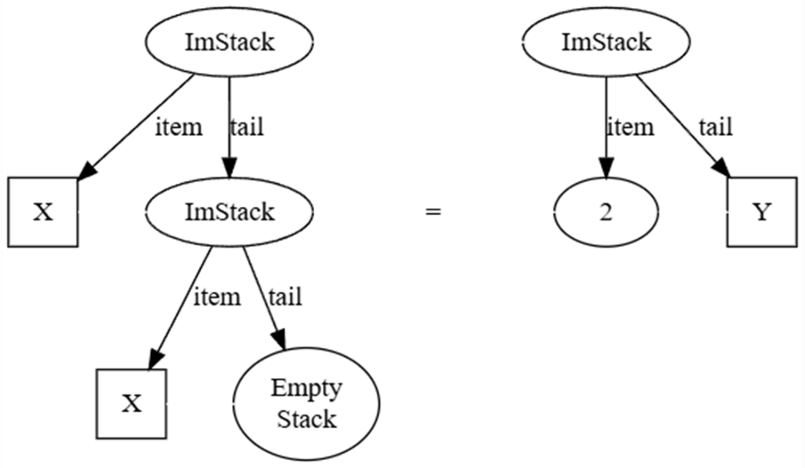
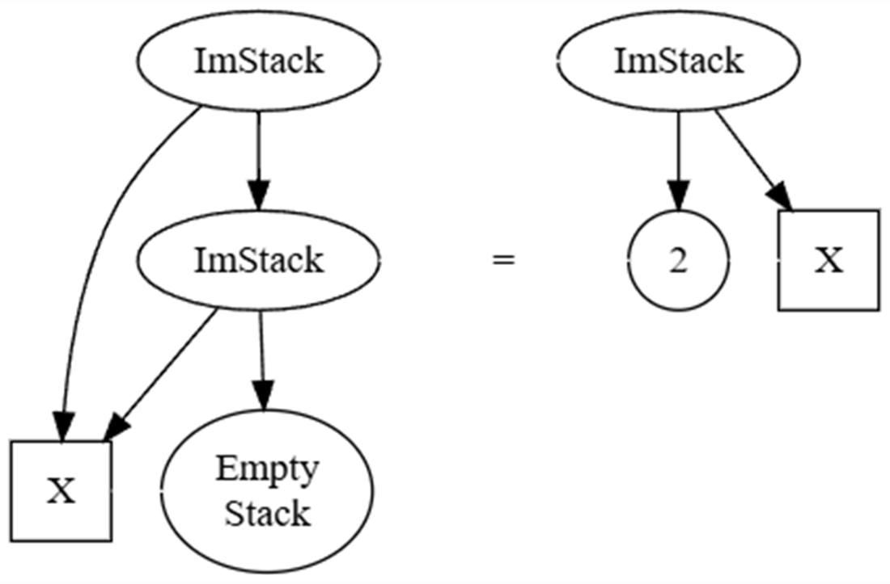
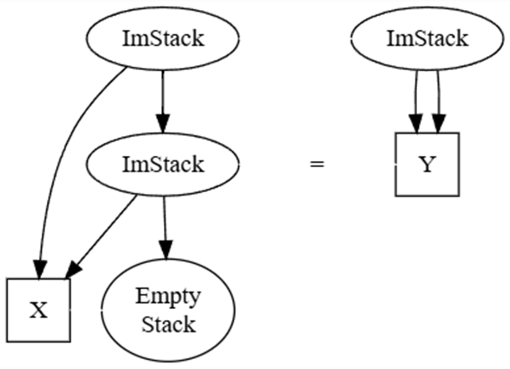
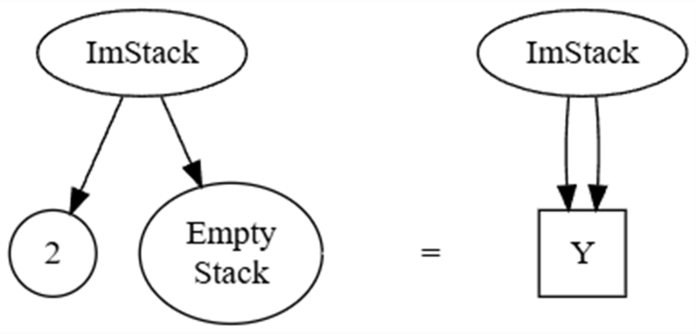
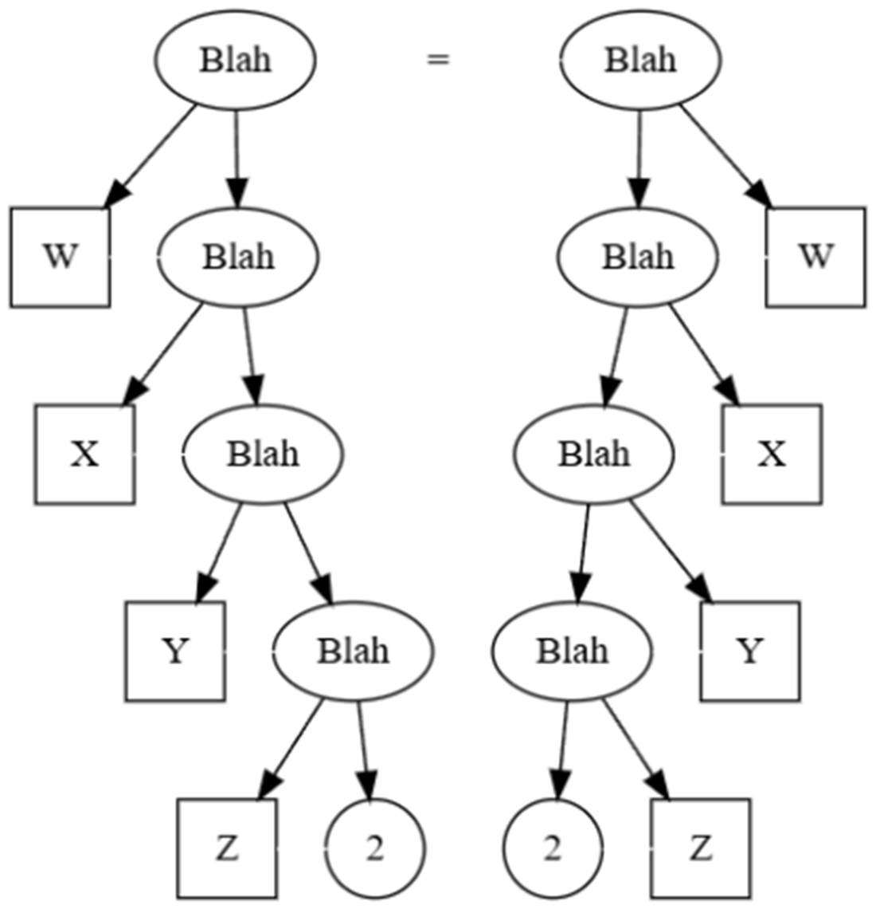
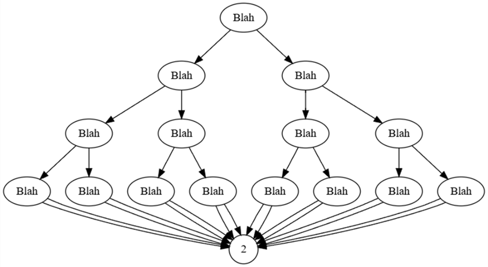
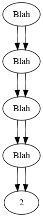
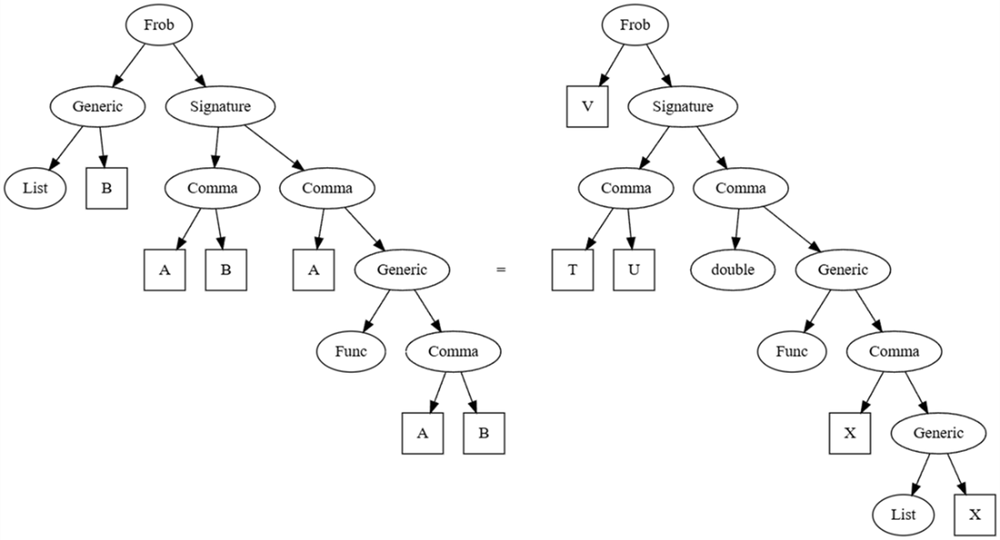

# 二元项的统一

本章包括
- 使用“统一”来找到使方程成立的解
- 用Robinson算法求解一阶问题
- 将算法应用于类型推断和逻辑问题

“统一”是一个听起来吓人的术语，但概念其实很直接：给定两个带有**占位符(holes)**的结构，找出应填入这些占位符的内容，使二者一致。。就像高中数学那样：
$$X^2 - 5X + 6 = 0$$
我们有两个东西——一边是一个表达式，另一边是0——我们希望它们相等。我们可以用什么来替换标记为X的“占位符”，使方程成立？我们可以把2或3填入那个占位符，这样两边就“统一”了。

本章我们不会研究数学方程上的统一问题，而是关注数据结构上的统一。为什么我们要关心数据结构上的方程求解？因为如果你能解决像栈或二叉树这样的数据结构上的统一问题，那么你也能解决任意的逻辑问题！它在编译器中的类型推断以及许多其他领域都有应用。

我们将从统一两个栈开始，以获得一些见解；这将引导我们进入二元项的统一。在此过程中，我们将说明如果忽略一些棘手的案例，这个算法是多么容易出错。

## 10.1 二元项的统一

在图10.1中，我画出了第2章中的两个不可变栈，但将它们的一部分替换成了“占位符”X和Y。在等式左边，两个条目由X表示；在右边，其中一个尾部由Y表示；在本章中，我将使用单个大写字母作为占位符的名称，并在图中将它们放在方框中。我们可以用什么东西来替换X和Y，使两边看起来一样呢？



图10.1 我将两个不可变栈的一部分替换成了方形的“占位符”X和Y。洞里填入什么才能使两个栈完全相同？

你可能已经推断出，等式左边显示这是一个双条目栈，两个条目相同，而右边显示栈顶条目必须是2。因此，X是2，Y是一个包含X的单条目栈，而我们刚说过X是2。对人类来说很简单！但这个推理依赖于我们知道的关于栈的事实。我们如何自动化这个推理？我们会从下面的观察中得到启发：如果我们眯着眼睛看上面的图，它看起来就像我们试图统一的是二叉树。

为了进一步探索这个想法，我将创建一个修改后的不可变二叉树数据结构来表示统一问题，我称之为**二元项**，或简称为**项**。一个二元项可以是以下三种之一：占位符、常量或符号：

- **占位符**有一个名称。我们用单个大写字母表示。
- **常量**有一个值。
- **符号**有一个名称、一个左子项和一个右子项。我们用 `name(left, right)` 表示。

> 注意：**常量**、**项**和**符号**这些术语来自数理逻辑，这也是统一概念的起源。逻辑学家将占位符称为**变量**，但在关于编程的书籍中，我尽量只用“变量”来指代存储位置！

统一就是找到一种使两个东西相等的方法，所以为了完整起见，我们应该正式定义项之间的相等性：

- 一个常量与另一个具有相同值的常量相等。
- 一个占位符与另一个同名的占位符相等。
- 一个符号s与另一个符号t相等，如果它们有相同的名称，且s.Left等于t.Left，且s.Right等于t.Right。
- 否则，项不相等。

> 注意：如果需要，我们可以扩展相等性的概念。例如，我们可能有一个符号plus，我们希望对于任意项x和y，`plus(x, y)` 等于 `plus(y, x)`。以这种方式扩展相等性来帮助解决数学问题被称为**模理论统一**，本书不涉及。

在继续之前，再快速给出几个定义：

- **置换**是一个可变字典，键是占位符，值是项。它回答了“这个占位符里放什么项？”的问题。
- 如果一个占位符是置换中的键，则它是**绑定的**；如果不是，则它是**自由的**。
- **一阶二元项统一问题**是：给定两个二元项，找到一个置换，使得当所有绑定的占位符被替换为对应的项后，这两个项相等。

> 注意：如果有一阶，那二阶是什么？在二阶统一中，我们寻找的是**函数体**。也就是说，给定一个函数F和一个涉及调用该函数的等式，例如 `F(1) = plus(2, 1)`，推断出一个合理的函数体；我们可能会推断出 `F(x)` 返回 `plus(2, x)`。二阶统一比一阶统一难得多，我们也不会涉及。

让我们为数据结构和置换逻辑实现代码：

**清单10.1 带有置换逻辑的二元项数据结构**

```csharp
using Substitution = System.Collections.Generic.Dictionary<Hole, BinTerm>;

abstract record class BinTerm
{
    public bool IsBoundHole(Substitution subst) =>
        this is Hole h && subst.ContainsKey(h);

    public BinTerm Substitute(Substitution subst)
    {
        if (this.IsBoundHole(subst))
            return subst[(Hole)this].Substitute(subst); // #A 注意这里的递归
        if (this is Symbol s)
        {
            var left = s.Left.Substitute(subst);
            var right = s.Right.Substitute(subst);
            if (!ReferenceEquals(left, s.Left) ||
                !ReferenceEquals(right, s.Right))
                return new Symbol(s.Name, left, right);
        }
        return this;
    }
}

sealed record class Constant(object Value) : BinTerm
{
    public override string ToString() => $"{Value}";
}

sealed record class Hole(string Name) : BinTerm
{
    public override string ToString() => Name;
}

sealed record class Symbol(string Name, BinTerm Left, BinTerm Right) : BinTerm
{
    public override string ToString() => $"{Name}({Left},{Right})";
}
```

关于这个实现，有几点需要注意：

- 我们使用记录类，“免费”获得了相等性的实现。幸运的是，提供的实现正好符合我们想要的规则。
- 记录类也提供了免费的 `ToString` 实现，但非常冗长。我已经用更简洁的摘要替换了它。
- 在本章的多个地方，我们需要知道一个项是否为绑定的占位符，所以我创建了一个便捷的辅助方法`IsBoundHole`来实现。
- 这个版本的`Substitute`会消除项中所有绑定的占位符。如果对一个绑定的占位符X调用`Substitute`，则会在置换中查找它对应的项。那个项可能还包含绑定的占位符，所以我们必须递归地调用`Substitute`来消除所有绑定的占位符。
- 如果对占位符、常量或不包含绑定占位符的符号调用`Substitute`，我们会避免分配新内存。只有当新的左子项或右子项与当前子项不同时，我们才分配新的符号。
- 我们会检查`Substitute`返回的项中的每个子项，寻找要替换的绑定占位符，因此它的时间性能是结果大小的O(n)。

让我们将栈的例子重新表述为一个使用二元项的等价问题，并尝试推导出一个统一算法。值2和空栈可以是常量；为方便起见，我直接用字符串表示空栈。一个不可变栈变成一个符号，左边是条目，右边是尾部。我会创建一个小的辅助方法来构造符号：

```csharp
Symbol ImStack(BinTerm left, BinTerm right) =>
    new("ImStack", left, right);
```

现在我们可以为这个统一问题创建项。项 `X` 和 `Y` 是占位符，项 `two` 和 `emptyStack` 是常量。表示单条目栈（该条目是占位符 `X`）的项是 `stackOne`，表示双条目栈（两个条目都是占位符 `X`）的项是 `term1`。表示未知大小栈（顶部条目是 `two`，尾部是占位符 `Y`）的项是 `term2`：

```csharp
Hole X = new("X"), Y = new("Y");
Constant two = new(2), emptyStack = new("EmptyStack");
var stackOne = ImStack(X, emptyStack);
var term1 = ImStack(X, stackOne);
var term2 = ImStack(two, Y);
Console.WriteLine(term1);
Console.WriteLine(term2);
```

这会打印出两个树的简洁表示，方便地类似于我们用来创建它们的程序语法：

```
ImStack(X,ImStack(X,EmptyStack))
ImStack(2,Y)
```

图10.2将统一问题可视化为一个图；同样，占位符是包含单个字母的方框，常量显示它们的值且没有子节点，符号是包含名称的椭圆并指向它们的子节点：


图10.2 当我们把不可变栈统一问题绘制成二元项时，它看起来几乎完全相同。同样，占位符是方框，符号是椭圆，常量是圆圈。

让我们想出一个统一算法的初稿，看看它是否与我们之前的结论一致：占位符X映射到项two，占位符Y映射到项stackOne。

### 10.1.1 统一二元项，尝试一

第一次尝试：给定 term1 和 term2。我们从空的置换开始。目标是确定这两个项无法统一（失败），或者提供一个能统一它们的置换（成功）。

- 如果 term1 和 term2 相等，则统一成功。
- 如果 term1 是一个占位符，则添加从该占位符到 term2 的映射。统一成功。
- 如果 term2 是一个占位符，则添加从该占位符到 term1 的映射。统一成功。
- 如果 term1 和 term2 是具有相同名称的符号，则使用当前置换统一 term1 和 term2 的左子项。同样地统一右子项。如果两次递归都成功，则统一成功。
- 否则，统一失败。

这看起来似乎合理，实现起来也很直接，对于这个例子它给出了正确的答案。让我们在心里对我们的例子运行一下这个算法：

- term1 和 term2 是具有相同名称的不相等符号。递归。
- 当我们在左侧递归时，我们统一占位符 X 和项 two，将该映射添加到置换中，并成功返回。
- 当我们在右侧递归时，我们统一占位符 Y 和项 stackOne，将该映射添加到置换中，并成功返回。

我们会得到这样的置换：
```csharp
var subst = new Dictionary<Hole, BinTerm>{{X, two}, {Y, stackOne}};
```
我们可以证明这个置换使两棵树相等。这段代码：
```csharp
Console.WriteLine(term1.Substitute(subst));
Console.WriteLine(term2.Substitute(subst));
```
打印出完全相同的项：
```
ImStack(2,ImStack(2,EmptyStack))
ImStack(2,ImStack(2,EmptyStack))
```

> 注意：之前我说过，`Substitute` 必须递归以确保所有绑定的占位符都被消除。这个例子说明了原因：对 term2 调用 `Substitute` 会将 Y 替换为 stackOne，但 stackOne 中包含绑定的占位符 X。

不幸的是，这个算法是错误的。你能看出为什么吗？

> 提示：重新阅读上面的注释，想想当 `Substitute` 调用自身时，可能会出什么可怕的问题。

让我们对问题做一个微小的改动；我将 term2 中的占位符 Y 替换为 X。其他所有内容保持不变：
```csharp
var term2 = new Symbol("ImStack", two, X);
```
新的统一问题如图 10.3 所示：



图 10.3 这个将 Y 替换为 X 的问题版本应该是无法求解的，因为它对填入占位符 X 的内容给出了矛盾的要求：既要是数字 2，又要是自身包含对 X 引用的单条目栈。

在这种情况下，term1 和 term2 的统一应该干净利落地失败，因为 X 不能同时是数字 2 和一个单条目栈。但我们的算法不会这样；让我们再次在心里运行一下：

- term1 和 term2 是具有相同名称的不相等符号。递归。
- 当我们在左侧递归时，我们统一占位符 X 和符号 two，将该映射添加到置换中，并返回。
- 当我们在右侧递归时，我们尝试统一占位符 X 和符号 stackOne，将该映射添加到置换中，并返回。根据我们实现的具体方式，要么它会因“字典中已存在该键”的异常而崩溃，要么它会丢弃 X 到 two 的映射，并用一个到 stackOne（其中包含 X）的映射替换它。

如果我们避免在添加到置换时崩溃，那么第一次调用 `Substitute` 就会进入无限递归，最终因堆栈溢出异常而崩溃。无论哪种方式，算法的行为都很糟糕。我们需要一个“出现检查”。

### 10.1.2 统一二元项，这次加上出现检查

让我们第二次尝试统一算法。再次，从空置换开始：

- 如果 term1 和 term2 相等，则统一成功。
- 如果 term1 是一个占位符，并且它**没有出现在** term2 中，则添加从该占位符到 term2 的映射。统一成功。
- 如果 term2 是一个占位符，并且它**没有出现在** term1 中，则添加从该占位符到 term1 的映射。统一成功。
- 如果 term1 和 term2 是具有相同名称的符号，则在左子项和右子项上递归。如果两次递归都成功，则统一成功。
- 否则，统一失败。

我们的第二次尝试仍然能解决原始问题，现在如果 X 出现在 term2 中，它会正确失败。不幸的是，这个算法仍然有 bug。你能看出为什么吗？

> 提示：占位符可以“别名”其他占位符。

为了演示这个 bug，我将再次稍微修改 term2：
```csharp
var term2 = new Symbol("ImStack", Y, Y);
```
其他所有内容保持不变；这个版本的统一问题如图 10.4 所示：



图 10.4 根节点的左侧暗示 X 是 Y 的别名。右侧暗示 Y 是一个包含 X 的单条目栈。我们需要一个能够检测到这种循环并导致统一失败，而不是稍后进入无限递归的算法。

问题不在于 `term2` 描述了一个 `tail` 和 `item` 相同的栈：

```c#
ImStack<object>.Empty.Push(ImStack<object>.Empty)
```

这是完全合法的。相反，我们再次创建了一个置换问题。让我们按照这个版本的算法走一遍：

- `term1` 和 `term2` 是具有相同名称的不相等符号。递归。
- 当我们在左侧递归时，我们统一占位符 X 和占位符 Y。由于 X 没有出现在 Y 中，我们添加从 X 到 Y 的映射到置换中，并成功返回。
- 当我们在右侧递归时，我们尝试统一占位符 Y 和符号 `stackOne`。Y 没有出现在 `stackOne` 中；只有 X 出现在 stackOne 中。将该映射添加到置换中，并成功返回。

构建置换没有出现问题，但 `Substitute` 将再次进入无限递归：X 被替换为 Y，Y 被替换为一个包含 X 的符号，X 又被替换为 Y，如此循环往复。

这个例子揭示了该算法的另一个问题。假设我们尝试进行如图 10.5 所示的统一：



图 10.5 一个更简单的统一问题，我们当前朴素的算法无法正确处理。如果 Y 既是 2 又是空栈，我们应该干净利落地失败，而不是破坏置换或抛出异常。

当我们进行左递归时，我们将 Y 绑定到常量；当我们进行右递归时，我们从未注意到 Y 刚刚变成了一个绑定的占位符！正确的行为是在右递归期间统一 Y 的两种可能含义，并查看是否失败——在这种情况下，它会失败，因为常量 2 与常量空栈无法统一。

希望第三次能成功。我们将从一个改进的“出现在”算法开始。这个算法接受一个占位符 X、一个项 t 和一个置换，并判断 X 是否出现在 t 中：

- 如果 t 中使用的任何占位符等于 X，返回真。
- 对于 t 中使用的每个绑定占位符 Y，在置换中查找 Y 得到项 u。递归检查 X 是否出现在 u 中。如果出现在其中任何一个，返回真。
- 否则，返回假。

现在我们可以最终陈述一个正确的二元项统一算法。从一个空置换开始，然后：

- 如果 `term1` 和/或 `term2` 是绑定的占位符，则在置换中查找它们的项。重新开始这个算法以统一那些项。
- 如果 `term1` 和 `term2` 相等，则统一成功。
- 如果 `term1` 是一个自由占位符，检查它是否出现在 `term2` 中。如果出现，统一失败。否则，添加从该占位符到 `term2` 的映射。统一成功。
- 如果 `term2` 是一个自由占位符，检查它是否出现在 `term1` 中。如果出现，统一失败。否则，添加从该占位符到 `term1` 的映射。统一成功。
- 如果 term1 和 term2 是具有相同名称的符号，则在左侧和右侧递归（使用相同的置换）。如果两者都成功，则统一成功。
- 否则，统一失败。

这是计算机科学家 John Robinson 在 1965 年发明的算法的一个略微简化版本，该算法对自动逻辑研究产生了巨大影响。让我们实现它！我将从“出现检查”开始，将其拆分为 `BinTerm` 基类和 `Hole` 类：

**清单 10.2 “出现检查”算法**

```csharp
abstract record class BinTerm
{
    // [...]
    public IEnumerable<Hole> AllHoles()
    {
        var stack = new Stack<BinTerm>(); // #A 前一章讨论过这种技术
        stack.Push(this);
        var seen = new HashSet<Hole>(); // #B 不要枚举同一个占位符两次
        while (stack.Count > 0)
        {
            var current = stack.Pop();
            if (current is Hole h && !seen.Contains(h))
            {
                seen.Add(h);
                yield return h;
            }
            else if (current is Symbol s)
            {
                stack.Push(s.Right);
                stack.Push(s.Left);
            }
        }
    }
}

sealed record class Hole(string Name) : BinTerm
{
    public bool OccursIn(BinTerm term, Substitution subst)
    {
        foreach (Hole hole in term.AllHoles()) // #C 枚举项中使用的每一个占位符
        {
            if (this == hole) // #D “this”是否直接用在项中？
                return true;
            if (hole.IsBoundHole(subst) &&
                this.OccursIn(subst[hole], subst)) // #E “this”是否用在了稍后将被替换到项中的任何东西里？
                return true;
        }
        return false;
    }

    public override string ToString() => Name;
}
```

同一个占位符可以在一个项中出现多次；为了避免重复执行相同的“出现检查”，我们在枚举占位符时对其去重。我们检查给定项中的每个占位符，并递归检查所有绑定占位符关联的值。

现在我们完成了“出现检查”，可以实现统一算法了：

**清单 10.3 Robinson 的一阶二元项统一算法**

```csharp
abstract record class BinTerm
{
    // [...]
    public BinTerm LookUpBoundHole(Substitution subst)
    {
        var newTerm = this;
        while (newTerm.IsBoundHole(subst))
            newTerm = subst[(Hole)newTerm];
        return newTerm; // #A 这里永远不会返回绑定的占位符
    }

    public Substitution? Unify(BinTerm t2) // #B 返回置换，如果失败则返回 null
    {
        var subst = new Substitution();
        return Unify(this, t2, subst) ? subst : null;
    }

    private static bool Unify(BinTerm t1, BinTerm t2, Substitution subst) // #C 失败时返回 false
    {
        t1 = t1.LookUpBoundHole(subst);
        t2 = t2.LookUpBoundHole(subst);
        if (t1 == t2)
            return true;

        if (t1 is Hole h1 && !h1.OccursIn(t2, subst)) // #D 到这里 t1 和 t2 都不是绑定的占位符
        {
            subst.Add(h1, t2);
            return true;
        }

        if (t2 is Hole h2 && !h2.OccursIn(t1, subst))
        {
            subst.Add(h2, t1);
            return true;
        }

        if (t1 is Symbol s1 && t2 is Symbol s2 && s1.Name == s2.Name)
            return Unify(s1.Left, s2.Left, subst) &&
                   Unify(s1.Right, s2.Right, subst);

        return false;
    }
}

var subst = term1.Unify(term2);
foreach (var hole in subst.Keys)
    Console.WriteLine($"{hole.Name} -> {subst[hole]}");
Console.WriteLine(term1.Substitute(subst));
Console.WriteLine(term2.Substitute(subst));
```

> 注意：我们可以将这个算法扩展到非二元项：要统一两个具有相同名称且带有任意数量子项的符号，只需检查它们是否有相同数量的子项，然后将子项配对，递归地统一所有对。我们可以在栈的小例子上演示其有效性：
> 我们得到了期望的输出：
>
> ```
> X -> 2
> Y -> ImStack(X,EmptyStack)
> ImStack(2,ImStack(2,EmptyStack))
> ImStack(2,ImStack(2,EmptyStack))
> ```

到目前为止，我几乎没有提到性能问题。让我们深入探讨一下。

## 10.2 二元项统一的性能

到目前为止，我们只看到了统一算法快速为占位符找到一致值使两项相等的情况。这个算法总是能快速找到解吗？不幸的是，不能；虽然性能通常相当不错，但最坏情况非常糟糕！我将创建一个新符号 Blah 和一个小的辅助方法来构造它们。然后我们可以制作两个各包含四个占位符的项，试图为统一构造一个最坏性能场景：

```csharp
Symbol Blah(BinTerm left, BinTerm right) =>
    new("Blah", left, right);
Hole W = new("W"), X = new("X"), Y = new("Y"), Z = new("Z");
var two = new Constant(2);
var term1 = Blah(W, Blah(X, Blah(Y, Blah(Z, two))));
var term2 = Blah(Blah(Blah(Blah(two, Z), Y), X), W);
var subst = term1.Unify(term2);
foreach (var hole in subst.Keys)
    Console.WriteLine($"{hole.Name} -> {subst[hole]}");
Console.WriteLine(term1.Substitute(subst));
```

这个统一问题如图 10.6 所示：



图 10.6 这个统一问题看起来很简单，但结果有点令人惊讶。同样，占位符和常量在等号两边是相同的对象，但我把它们画成了副本以使图更易读。显然，我们可以通过添加更多变量使两边更高，从而将这个问题扩展到任意大小。

乍一看，问题似乎不太难。在第一次左递归中，W 成为一个绑定的占位符。在相应的右递归中，我们立即查找 W 的值并将其与 term1 的右子项统一。那是一个三占位符版本的原始问题，然后以同样的方式解决。置换正是你从图中期望得到的：

```
W -> Blah(Blah(Blah(2,Z),Y),X)
X -> Blah(Blah(2,Z),Y)
Y -> Blah(2,Z)
Z -> 2
```

当我们调用 Substitute 时，得到的结果是：

```
Blah(Blah(Blah(Blah(2,2),Blah(2,2)),Blah(Blah(2,2),Blah(2,2))),
     Blah(Blah(Blah(2,2),Blah(2,2)),Blah(Blah(2,2),Blah(2,2))))
```

如果你觉得这看起来像 blah blah blah，我不怪你。图 10.7 清楚地说明了这一点：



图 10.7 当有四个占位符时，统一结果总共有 16 个节点。如果问题中有五个、六个、七个占位符呢？结果中会有 32、64 或 128 个节点！

这个问题的四占位符版本结果是一个完整的二叉树，有 16 个对象。我们完全可以制作一个五占位符版本的问题，结果将是一棵有 32 个对象的树，依此类推。如果有 n 个占位符像这样排列成“塔”，那么生成它们统一的 Substitute 调用会分配 O(2ⁿ) 个对象。它消耗指数级空间，因此也消耗指数级时间。

> 注意：渐近时间性能永远不会好于渐近空间性能，因为分配和写入内存需要时间！

显然，即使对于项数较少的统一问题，我们的置换实现也可能非常昂贵，但情况更糟：

- 我们预先检查项的相等性，因为相等的项已经统一。结构相等性检查可能需要查看每个子项，这可能很昂贵。
- “出现”检查并不廉价。找出所有占位符需要搜索整个二元项。然后我们递归处理可能大量的绑定占位符项，这些项本身可能有许多子项。
- “出现”检查也不够智能。我们可能会多次搜索相同的项以查找相同的占位符，但由于项是不可变的，“这个占位符是否出现在这个项中”的答案不会改变。

我们如何解决这些问题？

- 你可以跳过出现检查！该算法的一些实现只是希望没有占位符引用自身，或者对置换进行后处理检查以查看是否存在循环。
- 第 4 章的 HashLife 算法及其节省空间的不可变四叉树暗示，你可以为符号、常量和项创建记忆化的工厂函数，并始终如一地使用它们。这有两个好处：所有相等比较都可以使用快速的引用相等，并且符号变得去重。通过符号去重，图 10.7 中的符号可以简化为图 10.8 中完全等价的符号：

图 10.8 通过以与第 4 章中四叉树去重相同的方式对项进行去重，我们可以将图 10.7 中的指数级大小的图转换为这个线性大小的图。



- 类似地，如果性能分析确定我们可以通过记忆化某些接受置换的方法来获得优势，目前我们还不能这样做，因为记忆化仅适用于具有不可变参数的纯函数。如果需要启用这种优化，我们可以使用不可变字典。

通过巧妙运用这些优化及其他优化，最坏情况可以降低到 O(n³)，虽然不算很好，但比指数级好多了。还有更复杂的统一算法，它们对问题进行大量预处理，并在线性时间内运行。

不过，我不会在本书中介绍这些算法，因为实践中尽管 Robinson 算法的最坏情况很糟糕，但我们几乎总是使用它。实际中我们倾向于交给统一算法的问题，用 Robinson 算法已经足够快地解决了。

> 注意：在上一章中，我认为运行快速的简单贪心算法优于缓慢得到最优解的复杂算法。在这里，我认为如果最坏情况不太可能发生，那么具有糟糕最坏情况的简单算法优于具有线性最好情况的复杂算法。使用能产生可接受结果且性能可接受的最简单算法。

我们现在有了一个算法，如果存在统一的置换，它总能找到，否则返回 null，这很好，但我们为什么关心这个？这个算法之所以影响巨大，是因为它提供了一个必要的工具，使类型推断和逻辑编程变得可行。

## 10.3 类型推断与逻辑编程

作为开发工具的设计者，我对涉及类型系统的问题非常感兴趣；统一算法在解决这类问题上表现出色。例如，假设我们在某种语言中有一个泛型方法的声明，该方法有两个泛型类型参数。（我将使用类似 C# 的语法，但描述的语言类型规则与 C# 略有不同。）

```csharp
List<B> Frob<A, B>(A a, Func<A, B> f)
```

泛型类型参数本质上是自由占位符，当填入类型后就被绑定。下面是一个局部变量声明，它需要推断多个类型：

```csharp
var v = Frob(1.5, x => [x]);
```

假设在我们的语言中，`1.5` 的类型是 `double`，而 lambda 表达式 `x => [x]` 的类型是 `Func<X, List<X>>`，其中 `X` 是未绑定的类型。我们应该用什么类型来替换 `A` 和 `B`？`v` 的类型是什么？这是一个统一问题！让我们分解这个问题，使其看起来像二元项的统一。我们需要：

- 常量 `List`、`Func` 和 `double`。
- 符号 `Frob`，其左子项是返回类型，右子项是其签名。
- 符号 `Signature`，其左子项是方法的泛型类型参数，右子项是其参数列表。
- 符号 `Generic`，其左子项是类型名称，右子项是泛型类型参数。
- 符号 `Comma` 表示用逗号分隔的两个东西。
- 占位符 `A` 和 `B` 是方法签名的泛型类型参数，占位符 `T` 和 `U` 是调用 `Frob` 时省略的泛型类型参数，占位符 `V` 是调用的返回类型，占位符 `X` 是 lambda 表达式的参数类型。

有了所有这些项，我们可以将其表示为一个统一问题，其中我们要求解 `V`。图 10.9 展示了这个问题：



图 10.9 类型推断问题可以表示为统一问题，其中泛型参数和省略的类型是占位符。为了使图更易读，我避免了对所有占位符和常量的重复使用进行去重。

让我们编写代码，然后求解 `T`、`U`、`V` 和 `X`：

**清单 10.4 使用统一求解类型推断问题**

```csharp
var list = new Constant("list");
var dble = new Constant("double");
var func = new Constant("Func");

Symbol Frob(BinTerm ret, BinTerm sig) => new Symbol("Frob", ret, sig);
Symbol Generic(BinTerm name, BinTerm args) =>
    new Symbol("Generic", name, args);
Symbol Signature(BinTerm generics, BinTerm parameters) =>
    new Symbol("Signature", generics, parameters);
Symbol Comma(BinTerm c1, BinTerm c2) => new Symbol("Comma", c1, c2);

Hole A = new("A"), B = new("B"), T = new("T"), U = new("U"),
     V = new("V"), X = new("X");

var term1 = Frob(Generic(list, B), Signature(Comma(A, B),
    Comma(A, Generic(func, Comma(A, B)))));

var term2 = Frob(V, Signature(Comma(T, U),
    Comma(dble, Generic(func, Comma(X, Generic(list, X))))));

var subst = term1.Unify(term2);

Console.WriteLine($"T -> {T.Substitute(subst)}");
Console.WriteLine($"U -> {U.Substitute(subst)}");
Console.WriteLine($"V -> {V.Substitute(subst)}");
Console.WriteLine($"X -> {X.Substitute(subst)}");
```

输出结果为：

```
T -> double
U -> Generic(list,double)
V -> Generic(list,Generic(list,double))
X -> double
```

如果我们将推断出的类型显式写出，就会看到调用实际上是：

```csharp
List<List<double>> v = Frob<double, List<double>>(
    1.5, (double x) => [x]);
```

> 注意：虽然 C# 在进行这种方法和局部变量类型推断时确实使用了一种统一形式，但这里展示的场景在 C# 中不会完全这样工作；这个示例更类似于 F# 或 OCAML 等语言中使用的类型推断。具体细节并不重要；关键是统一算法可用于解决类型推断中各种复杂问题。

类型推断是统一算法优势的一个很好的例子，但统一真正闪耀的地方在于将其与回溯搜索结合起来解决逻辑问题。让我们看一个与编译器中推断类型无关的问题示例：社交网络如何向用户推荐新朋友？

为了将其表示为一个统一问题，我们可以从一些表示人物和兴趣的常量开始。例如，`Alice`、`Bob`、`Carol`、`David`、`birdwatching`、`sailing` 和 `scuba`。我们将创建一个符号 `likes(person, activity)`，以及一个符号 `compatible(person1, person2)`。假设我们有一个数据库，其中包含一系列表示已知事实的符号：

```
likes(Alice, scuba)
likes(Bob, scuba)
likes(Bob, birdwatching)
likes(Carol, birdwatching)
likes(David, sailing)
```

假设如果两个人至少有一个共同兴趣，那么他们是兼容的。我们将在数据库中添加一条规则，其中包含三个项和三个自由占位符，组织为条件和结论：

```
if likes(X, Y) and likes(Z, Y) then compatible(X, Z)
```

如果我们想找出 Bob 与谁兼容，我们创建一个“目标”符号 `compatible(Bob, Q)`，并开始统一以发现未绑定的占位符 `Q` 的可能绑定。这个符号不会与数据库中的任何项统一，但它会与规则的结果项统一。将 `compatible(Bob, Q)` 与 `compatible(X, Z)` 统一，我们得到一个置换，表明 `X` 是 Bob，`Z` 是 Q，现在我们可以将该置换应用于规则中的每个项，推导出特化规则：

```
if likes(Bob, Y) and likes(Q, Y) then compatible(Bob, Q)
```

现在我们创建了一个要解决的子问题：找到 `Y` 和 `Q` 的值，使得 `likes(Bob, Y)` 和 `likes(Q, Y)` 都为真。通过将 `likes(Bob, Y)` 与数据库中的每个项统一，我们发现 `Y` 可能是 `scuba` 或 `birdwatching`。尝试其中一个，看看会得到什么结果；求解 `likes(Q, scuba)`。然后回溯尝试另一个：求解 `likes(Q, birdwatching)`。通过进一步统一求解这些子问题，我们发现 `Q` 可能是 Alice、Bob 或 Carol，但不是 David。Bob 与自己、Alice 或 Carol 兼容。

我在这里描述的是统一与回溯搜索的结合。这是 Prolog 逻辑编程语言的基础，该语言于 1972 年首次开发。在 Prolog 中，你创建一个符号和规则的数据库，然后构造查询项。Prolog 随后使用统一和回溯来找出查询中占位符的可能值。

这是一个简单的例子；规则可以非常复杂！例如，我们可以添加一个 `friends` 符号，然后要求兼容的人既有共同的朋友又有共同的兴趣，等等。

> 注意：一阶统一算法之所以被称为一阶，是因为它可以解决一阶逻辑中的问题；这是一个包含符号、占位符、常量以及“对于所有”、“非”、“与”、“或”、“如果-那么”等关系的逻辑系统。

统一算法非常强大，因为许多实际问题都可以简化为可以用统一解决的逻辑问题。自动化清晰推理以解决逻辑问题的能力是早期人工智能研究的重点，那时我们要求人工智能使用严格的逻辑来推导事实，而不是使用统计概率来产生似是而非的“幻觉”。

统一从两个不相等的项开始，逐步填充它们的占位符，直到它们在置换下变得相等。我们也可以从两个不相等的项开始，然后创建更多的占位符，直到它们在置换下变得相等。这有什么用？我们将在下一章探讨反统一时找到答案。

## 10.4 小结

- 统一通过逐步构建填充占位符的置换来解决二元项上的方程，或通过推导矛盾来证明方程不可解。
- 我们使用“出现检查”避免无限递归，确保没有占位符被替换为包含自身的项。记住，占位符可以别名为其他占位符！
- Robinson 算法在最坏情况下性能很差，但对于我们通常要解决的问题，其性能是可接受的；它比其他具有更好渐近性能的更复杂算法使用得更频繁。
- 统一常用于编译器中的类型推断和类似的逻辑推导。
- 通过将统一与回溯搜索相结合，我们可以解决一阶逻辑中的一般问题；Prolog 等语言就使用了这种技术。