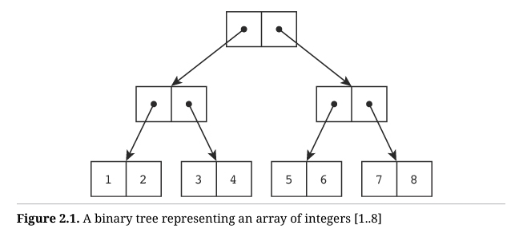
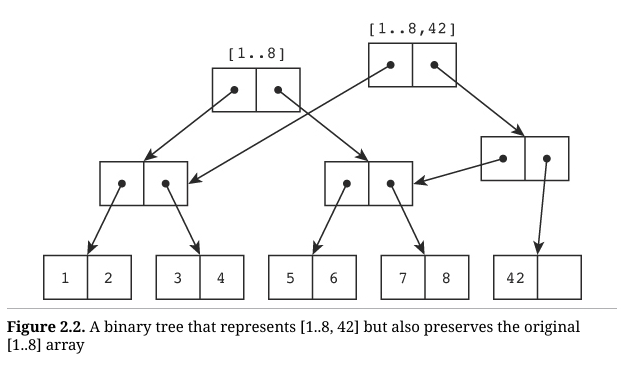

# 不可变性

## 什么是函数式编程？

如果你问一个普通的程序员什么是函数式编程，可能会得到以下各种回答：

- 用函数进行编程。
- 函数是“一等公民”。
- 使用具有引用透明性的编程。
- 一种基于λ演算的编程风格。

尽管这些说法可能都正确，但它们并不是特别有帮助。我认为更好的答案是：**不使用赋值语句的编程**。

也许你认为这个定义并没有好多少，甚至可能让你感到害怕。毕竟，赋值语句和函数有什么关系？如果没有赋值语句，你怎么可能进行编程呢？

这是很好的问题，而这些问题正是我打算在本章中解答的。

请考虑以下简单的C程序：

```c
int main(int ac, char** av) {
    while(!done())
    	doSomething();
}
```

这个程序几乎是有史以来编写的每个程序的核心循环。它从字面上讲就是：“做一些事情，直到完成为止。”更重要的是，这个程序没有明显的赋值语句。它是函数式的吗？如果是的话，是否意味着每个程序都是函数式的？

让我们实际上让这个函数做一些事情。让它计算前十个整数 [1..10] 的平方和：

```c
int n=1;
int sum=0;
int done() {
	return n>10;
}
void doSomething() {
    sum+=n*n;
    ++n;
}
void sumFirstTenSquares() {
    while(!done())
    	doSomething();
}
```

这个程序不是函数式的，因为它在 `doSomething` 函数中使用了两个赋值语句。此外，使用这两个全局变量让代码显得相当难看。让我们改进一下：

```c
int sumFirstTenSquares() {
    int sum=0;
    int i=1;
loop:
	if (i>10)
		return sum;
	sum+=i*i;
	i++;
	goto loop;
}
```

这样已经好多了，两个全局变量变成了局部变量。但它仍然不是函数式的。也许你会对那个 `goto` 感到担忧，但它的存在有其合理性。请跟我继续，看看这个小小的修改——使用一个工作函数将局部变量转换为函数参数：

```c
int sumFirstTenSquaresHelper(int sum, int i) {
loop:
	if (i>10)
		return sum;
	sum+=i*i;
	i++;
	goto loop;
}

int sumFirstTenSquares() {
	return sumFirstTenSquaresHelper(0, 1);
}
```

这个程序仍然不是函数式的，但它是一个重要的里程碑，我们稍后会参考它。不过现在，通过最后一个修改，神奇的事情发生了：

```
int sumFirstTenSquaresHelper(int sum, int i) {
	if (i>10)
		return sum;
	return sumFirstTenSquaresHelper(sum+i*i, i+1);
}
int sumFirstTenSquares() {
	return sumFirstTenSquaresHelper(0, 1);
}
```

所有的赋值语句都消失了，这个程序现在是函数式的。它也是递归的，这并非偶然。如果你想去掉赋值语句，你就必须使用递归。递归允许你用函数参数的初始化来替代局部变量的赋值。

然而，这会占用大量的栈空间。不过，有一个小技巧可以解决这个问题。

注意，最后一次调用 `sumFirstTenSquaresHelper` 时，也是最后一次在函数中使用 `sum` 和 `i`。在递归调用时初始化这两个参数后，继续在栈上保存它们是没有意义的，因为它们将不会再被使用。那么，如果我们不为递归调用创建一个新的栈帧，而是通过 `goto` 跳回函数的顶部，重用当前栈帧，就像我们在之前的里程碑程序中那样，会发生什么呢？

这个有趣的小技巧称为**尾调用优化（TCO）**，所有的函数式语言都会利用它[^1]。

注意，TCO 实际上将前面的程序转换成了里程碑程序。里程碑程序中 `sumFirstTenSquaresHelper` 的最后三行实际上是递归函数调用。这是否意味着里程碑程序也是函数式的呢？答案是否定的，它只是行为上相同。在源代码层面，这个程序并不是函数式的，因为它有赋值语句。但如果我们退一步，不去关心局部变量的改变，而只是看作是新的栈帧的重新实例化，那么这个程序的行为就像是一个函数式程序。

正如我们将在下一节中发现的那样，这并不是一个无关紧要的区别。与此同时，只要记住，当你使用递归来消除赋值语句时，并不一定会浪费大量的栈空间。你所使用的编程语言几乎肯定会使用 TCO。

### 赋值问题

首先，让我们定义一下什么是赋值。给一个变量赋值是指将该变量的原始值更改为新分配的值。正是这种“更改”使得它称为赋值。

在 C 语言中，我们这样初始化一个变量：

```
int x=0;
```

然后赋值变量：

```
x=1;
```

在第一个例子中，变量 `x` 以值 `0` 初始化；在初始化之前，变量 `x` 并不存在。在第二个例子中，`x` 的值被更改为 `1`。这看起来似乎微不足道，但其意义深远。

在第一个例子中，我们无法确定 `x` 是否真的是一个变量，它可能是一个常量。而在第二个例子中，毫无疑问我们正在通过赋值改变 `x`。因此，我们可以说函数式编程是一种**没有变量的编程**。在函数式程序中，值是不会变化的。

为什么这是可取的？请考虑以下几点：

```
.
//Block A
.
x=1;
.
//Block B
.
```

在执行`A代码块`期间，系统的状态与执行`B代码块`时的状态不同。这意味着`A代码块`必须在`B代码块`之前执行。如果交换了这两个代码块的位置，系统很可能无法正确执行。

这被称为**顺序或时间耦合**——一种时间上的耦合，而这可能是你非常熟悉的概念。比如：

- 必须先调用 `open` 才能调用 `close`。
- 必须先调用 `new` 才能调用 `delete`。
- 必须先调用 `malloc` 才能调用 `free`。

这样的成对规则[^2]几乎是无穷无尽的。它们在许多方面都是我们编程生涯中的祸根。

有多少次你忘记了关闭文件、释放内存块、关闭图形上下文或释放信号量？又有多少次你调试一个棘手的问题，最后发现只需要交换两个函数调用的位置就能解决？

然后，还有**垃圾回收**。

垃圾回收是我们接受的一种糟糕的黑客手段[^3]，因为我们在管理时间耦合方面表现得太差了。如果我们擅长跟踪已分配的内存，就不需要依赖某个不受欢迎的后台进程来替我们清理。但令人遗憾的事实是，我们在管理时间耦合方面实在太糟糕了，以至于对这些辅助工具的依赖成了习以为常，仿佛它们是在保护我们不因时间耦合问题而出错一样。

这还没有考虑到多线程的情况。当两个或更多线程争夺处理器时，保持时间耦合的正确顺序变得更加具有挑战性。这些线程可能在 99.99% 的时间里按正确的顺序执行，但偶尔它们可能会以错误的顺序执行，从而引发各种混乱。我们称这种情况为**竞争条件**。

时间耦合和竞争条件是使用变量进行编程——即使用赋值操作的自然结果。如果没有赋值操作，就不会有时间耦合，也不会有竞争条件[^4]。如果从未更新任何内容，就不可能发生并发更新问题。如果系统状态在函数中从未变化，函数内部就不会有顺序问题。

不过，或许现在是时候来一个简单的例子了。下面是我们之前的非函数式算法；这次去掉了 `goto`：

```c
1: int sumFirstTenSquaresHelper(int sum, int i) {
2: 	 while (i<=10) {
3: 		sum+=i*i;
4: 		i++;
5: 	 }
6:   return sum;
7: }
```

现在假设你想用这样的语句记录算法的进展：

```
log("i=%d, sum=%d", i, sum);
```

你会把这行代码放在哪里？有三种可能。如果你在第2行或第4行之后添加日志语句，那么记录的数据将是正确的，区别仅在于你是在计算之前还是之后记录。如果你在第3行之后插入日志语句，那么记录的数据将是错误的。这就是所谓的**时间耦合**——一个顺序问题

现在考虑函数式解决方案，有一个有趣的变化：

```c
int sumFirstTenSquaresHelper(int sum, int i) {
	return (i>10) ? sum : sumFirstTenSquaresHelper(sum+i*i, i+1);
}
```

这里只有一处地方我们可以放置 `log` 语句，并且它会正确的记录正确的数据。

### 为什么称为函数式

一个函数是一个数学对象，它将输入映射到输出。给定 $y=f(x)y = f(x)y=f(x)$，对于每个 $x$ 都有一个对应的 $y$。对于函数 $f$ 来说，除了输入和输出之外，其他的都不重要。每次给 $f$ 输入 $x$，你都会得到 $y$。函数执行时系统的状态对 $f$ 来说是无关紧要的。

换句话说，函数没有**时间耦合**。调用 $f$ 时不需要特殊的顺序。如果你用 $x$ 调用 $f$，无论其他任何东西发生了变化，你都会得到 $y$。

在这种数学意义上，函数式程序中的函数是真正的函数。如果你将一个函数式程序拆解成多个小的函数，这些函数在数学上同样具备严格的函数属性。这种属性被称为**引用透明性**。

一个函数如果是引用透明的，你就可以随时用它的计算结果来替代它的调用。让我们用这个概念来检验一下我们用于计算前十个整数平方和的函数式算法：

```c#
int sumFirstTenSquaresHelper(int sum, int i) {
	return (i>10) ? sum : sumFirstTenSquaresHelper(sum+i*i, i+1);
}
int sumFirstTenSquares() {
	return sumFirstTenSquaresHelper(0, 1);
}
```

当我们将第一次调用 `sumFirstTenSquaresHelper` 替换为其实现时，代码变为：

```c
int sumFirstTenSquares() {
	return (1>10) ? 0 : sumFirstTenSquaresHelper(0+1*1, 1+1);
}
```

当我们替换下个函数调用，代码变为：

```c
int sumFirstTenSquares() {
	return
		(1>10) ? 0 :
			(2>10) ? 0+1*1
				: sumFirstTenSquaresHelper((0+1*1)+(1+1)+1);
}
```

我想你已经明白了这一过程。每次调用 `sumFirstTenSquaresHelper` 都可以简单地替换为它的实现，并将参数适当地替换。

注意，你无法在非函数式版本的程序中进行这种简单的替换。虽然你可以展开循环，但这与直接用函数实现替换每次函数调用并不相同。

因此，函数式程序是由真正的数学上引用透明的函数组成的。这也是为什么这种编程方式被称为**函数式编程**的原因。

### 不改变状态？

如果函数式程序中没有变量，那么函数式程序就无法改变状态。如果不能改变状态，我们怎么能期望一个程序有实际用途呢？

答案是：**函数式程序通过从旧状态计算出一个新状态，而不修改旧状态**。如果这听起来让人困惑，那么下面的例子应该能够解释清楚：

```c
State system(State s) {
	return isFinal(s) ? s : system(s);
}
```

你可以让`system`从某个初始`state`开始，并依次将`system`从一个`state`转移到下一个`state`，直到最终`state`到达。`system`不会改变某个 `state` 变量，而是在每次迭代时从旧 `state` 创建一个新 `state`。

如果我们关闭尾调用优化（TCO），并允许栈在每次递归调用时增长，那么栈中将包含所有以前的状态，且这些状态保持不变。此外，`system` 函数在数学意义上作为一个真正的函数运行。每次你调用 `system` 并传入 `state1`，它都会返回 `state2`，而且每次都是如此。

如果你仔细观察我们函数式版本的 `sumFirstTenSquares`，你会发现它正是使用了这种状态变化的方法。没有变量，也没有内部状态。相反，算法从初始状态到最终状态，一步步进行状态转换。

当然，我们的 `system` 函数看起来似乎无法对任何输入作出响应。它只是从某个初始 `state` 开始，然后一直运行到完成。但通过一个简单的修改，我们可以创建一个能够很好响应输入事件的“函数式”程序：

```c
State system(State state, Event event) {
	return done(state) ? state : system(state, getEvent);
}
```

现在，`system` 函数计算出的下一个 `state` 是当前 `state` 和传入 `event` 的函数。瞧！我们创建了一个非常传统的有限状态机，它能够实时响应事件。

注意我之前在“函数式”这个词上加了引号。这是因为 `getEvent` 不是引用透明的。每次你调用它时都会得到不同的结果，因此你不能用它的返回值替换这个调用。那么，这是否意味着我们的程序实际上不是函数式的呢？

严格来说，任何以这种方式接受输入的程序都不能算作纯粹的函数式程序。但这本书并不是关于纯函数式编程的书，它讲的是**函数式编程**。尽管输入不是纯粹的，但上面的程序风格是“函数式”的，而我们感兴趣的正是这种编程风格。

所以，为了你的娱乐，这里有一个用C语言编写的简单实时有限状态机例子，它是“函数式”的。这是经典的地铁闸机（turnstile）示例，希望你能享受其中的乐趣。

```c
#include <stdio.h>
typedef enum {locked, unlocked, done} State;
typedef enum {coin, pass, quit} Event;

void lock() {
	printf("Locking.\n");
}
void unlock() {
	printf("Unlocking.\n");
}
void thankyou() {
	printf("Thanking.\n");
}
void alarm() {
	printf("Alarming.\n");
}
Event getEvent() {
	while (1) {
		int c = getchar();
		switch (c) {
			case 'c': return coin;
			case 'p': return pass;
			case 'q': return quit;
		}
	}
}

State turnstileFSM(State s, Event e) {
	switch (s) {
		case locked:
		switch (e) {
			case coin:
			unlock();
			return unlocked;
			case pass:
			alarm();
			return locked;
			case quit:
			return done;
		}
		case unlocked:
		switch (e) {
			case coin:
			thankyou();
			return unlocked;
			case pass:
			lock();
			return locked;
        	case quit:
			return done;
		}
		case done:
		return done;
	}
}

State turnstileSystem(State s) {
	return (s==done)? 0
					: turnstileSystem(
						turnstileFSM(s, getEvent());
}
int main(int ac, char** av) {
	turnstileSystem(locked);
	return 0;
}
```

请记住，C 语言并不支持尾调用优化（TCO），因此栈会随着递归调用的增加而增长，直到耗尽——不过在这种情况下，可能需要相当多的操作才能达到这种程度。

### 不变性

这一切意味着函数式程序中没有变量。函数式程序中的任何东西都不会改变状态。状态变化通过递归函数的一次次调用传递，而不会改变之前的任何状态。如果这些先前的状态不再需要，TCO（尾调用优化）可以将它们优化掉，但从本质上讲，它们依然存在于过去的某个栈帧中，保持不变。

如果函数式程序中没有变量，那么我们赋予名称的所有值都是常量。一旦初始化，这些常量就不会消失或改变。本质上，每个常量的完整历史都保持不变、不可修改，永远存在于系统中。

# 持久化数据

到目前为止，这看起来相对简单。以“函数式”风格编写的程序实际上就是没有变量的程序。与其为变量重新赋值，我们通过递归将新的值初始化为新的函数参数。这很简单。

但是，数据元素往往不像我们想象的那么简单。现在让我们来看看一个稍微复杂一点的问题：**埃拉托色尼筛法**（The Sieve of Eratosthenes）：

```java
package sieve;
import java.util.ArrayList;
import java.util.Arrays;
import java.util.List;

public class Sieve {
	boolean[] isComposite;
	static List<Integer> primesUpTo(int upTo) {
		return (new Sieve(upTo).getPrimes());
	}
	
	private Sieve(int upTo) {
		if (upTo<1)
			upTo=1;
		isComposite = new boolean[upTo+1];
		Arrays.fill(isComposite, false);
		isComposite[0]=isComposite[1] = true;
		for (int i=0; i<isComposite.length; i++)
			if (!isComposite[i])
				for (int c=i+i; c<isComposite.length; c+=
					isComposite[c] = true;
		}

		public List<Integer> getPrimes() {
			ArrayList<Integer> primes = new ArrayList<>()
			for (int i=0; i<isComposite.length; i++)
				if (!isComposite[i])
					primes.add(i);
				return primes;
			}
	}
```

这个简单的 Java 程序计算出小于某个上限的质数。注意到所有的赋值语句了吗？到处都是变量，所以这个程序肯定不是函数式的。

但是，再看看程序顶部的静态函数 `Sieve.primesUpTo`。它是一个真正的数学函数。每次用参数 `n` 调用它时，它都会返回小于 `n` 的所有质数。因此，我们可以“投机取巧”地说，尽管底层算法使用了变量，但算法的结果是函数式的。

## 关于“投机取巧”

从某种意义上说，我们的计算机是有限的图灵机；它们不是基于λ演算的。丘奇–图灵论题告诉我们，图灵机和λ演算是等价的形式，但这并不意味着你可以轻松地在两者之间进行转换。函数式程序看起来像λ演算，但实际上是在有限的图灵机上实现的。而这种实现需要我们“投机取巧”。

第一个“取巧”是尾调用优化（TCO）。我们通过实用性来解释它：毕竟，既然我们永远不会需要所有那些历史栈帧，为什么还要保留它们呢？但这依然是取巧。从图灵机的角度来看，我们所有假设的常量实际上都是变量。

我们可以继续将这种“取巧”推向更高层。这个美妙的 `Sieve` 算法完全运行在构造函数中，因此它本质上都是初始化！正如我们所学到的，初始化不是赋值。因此，这个程序在底层使用变量的事实与TCO没有什么不同。最终，结果仍然是函数式的。

这很有趣！我们可以继续将这种“取巧”推向更高层，直到它超越我们计算机这个有限的图灵机。然后我们可以对自己说：“每个在这台计算机上运行的程序都是函数式的，因为它在相同输入下总是产生相同的输出。别在意这些输入和输出包括了计算机内存中的每一位。别在意这些。是的，这就是答案。”

当然，如果我们采取这种观点，那么研究函数式编程就没什么意义了，对吧？因此，让我们从这种最高层的“取巧”退下来，继续将这些“取巧”压低，直到我们实际上无法合理地逃避它们。

对TCO来说，几乎没有合理的逃避方式。我们没有无限的栈空间，我们也不希望我们的函数式程序无谓地消耗大量的栈空间，直到崩溃。因此，TCO 是一个在实践中不可避免的“取巧”策略。

## 复制数据

那么关于那个 `Seive` 算法：我们能不能把“取巧”压得更低？我们能否编写出一个不使用任何赋值语句的算法？

问题当然出在那些 `for` 循环上。我们需要将它们转换为递归函数，以去掉赋值语句。还有两个数组，我们也需要处理。我们不能更改现有数组中的元素，对吧？那样会让这些数组变成变量。因此，每当我们需要修改某个元素时，就必须创建数组的副本：

```java
package sieve;

import java.util.ArrayList;
import java.util.Arrays;
import java.util.List;

public class Sieve {
	static List<Integer> primesUpTo(int upTo) {
		return getPrimes(
			computeSieve(
				makeSieve(Math.max(upTo, 1)),
				0),
			new ArrayList<>(), 0);
		}

	private static boolean[] makeSieve(int upTo) {
		boolean[] sieve = new boolean[upTo+1];
		Arrays.fill(sieve, false);
		sieve[0] = sieve[1] = true;
		return sieve;
	}
	
	private static boolean[] computeSieve(boolean[] sieve, int n) {
		if (n>=sieve.length)
			return sieve;
		else if (!sieve[n])
			return computeSieve(markMultiples(sieve, n, 2), n+1);
		else return computeSieve(sieve, n+1);
	}
	
	private static boolean[] markMultiples(boolean sieve,
											int prime,
											int m) {
		int multiple = prime * m;
		if (multiple>=sieve.length)
			return sieve;
		else {
			var markedSieve = Arrays.copyOf(sieve, siev
			markedSieve[multiple] = true;
			return markMultiples(markedSieve, prime, m+
		}
	}
	
	public static List<Integer> getPrimes(boolean[] sieve,
										List<Integer> primes,
										int n) {
		if (n>=sieve.length)
			return primes;
		else if (!sieve[n]) {
			var newPrimes = new ArrayList<>(primes);
			newPrimes.add(n);
			return getPrimes(sieve, newPrimes, n+1);
		} else {
			return getPrimes(sieve, primes, n+1);
		}
	}
}
```

这看起来并不太美观，是吧？不过，它确实非常符合函数式编程的风格。你可能会对 `makeSieve` 中的赋值操作提出异议，我也承认这有点“取巧”，但它看起来足够接近初始化，这让我感到满意。

所以，是的，所有关键的赋值操作都已经被消除了。所有命名的实体都是常量，栈（如果没有被 TCO 优化掉）会保存每次递归函数调用的历史记录。

但是，这样的代价是什么？每次修改两个数组中的任意一个，都会创建一个新的数组，以防止修改之前的数组。这种算法使用的内存量可能会非常庞大。试想一下，要找到所有小于 100,000 的质数，需要创建多少个筛数组？又要创建多少个质数数组？

再考虑一下执行时间。一次又一次地复制这些数组，必然会耗费大量的计算周期。

那么，这是否就是函数式编程的代价？我们是否必须忍受如此巨大的内存和时间消耗？

## 结构共享

幸运的是，不是的。事实证明，有一些数据结构可以像数组一样工作，但同时又能够高效地维护它们过去状态的历史。这些数据结构就是**n叉树**。n 越大，它们就越高效。但为了简化，我将在接下来的例子中选择 **n = 2**——即使用二叉树。

假设我们想表示一个包含从 1 到 8 的简单整数数组。实现这一点的二叉树如图 2.1 所示。



如果你只看二叉树的叶子节点，而忽略分支，你会发现这些叶子节点实际上形成了一个数组。分支只是提供了一种有序访问每个叶子节点的方式，而这种顺序就是数组的索引！

要访问数组中索引为 0 的元素，只需从每个节点选择最左边的分支。要访问索引为 1 的元素，沿每个节点向左走，但在最后一个节点时转向右边。

我不打算详细展开这个问题，我相信大家都理解二叉树的基本原理。

现在，假设我们想在这个数组的末尾追加一个值 42，同时保留之前数组的存在。实现这一点的二叉树如图 2.2 所示。



现在，这棵树有了两个根节点。左上方的根节点仍然表示数组 `1..8`，而右上方的根节点则表示在 `8` 之后追加了 `42` 的新数组。

停下来仔细想想，这应该很清楚：将线性数组表示为如图所示的树结构，可以让我们在进行添加、插入和删除操作时保留所有先前的数组排列，而不需要对整个数组进行大量的复制。

当然，某些复制操作还是会发生。根据具体操作，我们可能需要复制一个叶子节点，或者一些分支节点。但与直接复制整个数组的所有历史版本相比，所消耗的内存和计算周期要少得多。

最终，每一个过去的数组版本都将由一个新的根节点表示，该根节点连接到少量的额外分支节点上，这样大部分数组元素都可以在所有版本之间共享。

现在，想象一下如果我们使用 32 叉树而不是二叉树会发生什么。对于包含一百万个元素的数组，树的深度大约只有四到五层。复制五个每层包含 32 个元素的节点，显然比复制一百万个元素要快得多，所需的内存也少得多。实际上，虽然这个代价并非为零，但对于大多数应用来说，其成本小到几乎可以忽略不计。

因此，我们有了一种可以表示可索引的线性数组的方法，它能够随着时间的推移进行版本管理，并且保留所有过去的版本。我们称之为**持久性**[^5]。持久性数据结构具有在发生变化的同时记住自己所有过去版本的能力。

但是，更高级的数据结构如哈希映射（hash maps）、集合（sets）、栈（stacks）和队列（queues）呢？我们如何让所有这些数据结构像线性索引数组一样具有持久性？当然，所有这些数据结构都可以使用索引数组来实现。实际上，由于计算机的内存本质上只是一个巨大的线性索引数组，因此每个可以在计算机中表示的数据结构也可以表示为持久性数组。

因此，我们在本章开始时面临的复制问题可以暂时放在一边。函数式编程在内存和计算周期上的开销不应阻止我们进一步研究和追求其带来的好处。

随着这个问题的解决，接下来所有的示例将使用 Clojure 编写，这是一种本质上支持持久性数据结构的语言。

# 递归和迭代

在第 1 章“不可变性”中，我提到函数式编程使用递归来消除赋值操作。在本章中，我们将探讨两种不同类型的递归：一种我们称为迭代（iteration），另一种保留其原名：递归（recursion）。

## 迭代

TCO（尾调用优化）是解决无限递归循环所带来的无限栈深度问题的补救措施。然而，TCO 只有在递归调用是函数中最后执行的操作时才适用。这样的函数通常被称为**尾调用函数**。

下面是一个非常传统的用于生成斐波那契数列的函数实现：

```clojure
(defn fibs-work [n i fs]
	(if (= i n)
		fs
		(fibs-work n (inc i) (conj fs (apply + (take-(take-last 2 fs)))))

(defn fibs [n]
	(cond
		(< n 1) []
		(= n 1) [1]
		:else (fibs-work n 2 [1 1])))
```

程序是用 Clojure 写的，它是 Lisp 的变种语言。你调用这个函数，代码如下：

```clojure
(fibs 15)
```

它会返回一个前15个斐波那契数：

```
[1 1 2 3 5 8 13 21 34 55 89 144 233 377 610]
```

许多程序员在第一次接触 Lisp 时会感到眼疲劳甚至头痛，主要是因为括号让人难以理解。所以让我给你一个非常简短的括号教程。

### 非常简短的 Clojure 教程

1. 这是 C、C++、C# 和 Java 中的典型函数调用：`f(x);`
2. 这是 Lisp 中的同样函数调用：`(f x)`
3. 现在你已经了解了 Lisp 的语法了。教程到此结束。

这其实并不是夸张的说法。Lisp 的语法真的就是这么简单。

Clojure 的语法稍微复杂一点。所以让我们逐句拆解上面的程序。

首先有 `defn`，看起来像是一个被调用的函数。暂时把它当作函数来看，实际上也差不多。`defn` 这个“函数”用来定义一个新函数[^6]。所定义的函数名分别是 `fibs-work` 和 `fibs`。函数名后面的方括号中包含了函数的参数名。所以 `fibs` 函数接收一个名为 `n` 的参数，而 `fibs-work` 函数接收三个参数，分别是 `n`、`i` 和 `fs`。

函数参数列表后面是函数的主体。`fibs` 函数的主体是对 `cond` 函数的调用。你可以把 `cond` 想象成一个返回值的 `switch` 语句。`fibs` 函数的返回值就是 `cond` 函数的返回值。

`cond` 的参数是一组成对的元素。每对元素的第一个是谓词（predicate），第二个是当谓词为真时 `cond` 会返回的值。`cond` 会依次检查这些对，直到遇到一个为真的谓词，然后返回对应的值。

这些谓词实际上是函数调用。`(< n 1)` 谓词简单地调用了 `<` 函数，检查 `n` 是否小于 1。如果 `n` 小于 1，则返回 `true`。`(= n 1)` 谓词调用 `=` 函数，返回 `true` 表示两个参数相等。`:else` 谓词总是为 `true`。

如果 `(< n 1)` 为真，`cond` 返回一个空向量 `[]`。如果 `(= n 1)` 为真，`cond` 返回一个包含 `1` 的向量 `[1]`。否则，`cond` 返回 `fibs-work` 函数生成的值。

因此，`fibs` 函数在 `n` 小于 1 时返回 `[]`，当 `n` 等于 1 时返回 `[1]`，在其他情况下返回 `(fibs-work n 2 [1 1])`。

明白了吗？确保你理解了这个过程。如果不明白，建议重新过一遍。

至于 `fibs` 函数末尾的 `)))` 只是 `defn`、`cond` 和 `fibs-work` 函数调用的关闭括号。我也可以把 `fibs` 函数写成这样：

```clojure
(defn fibs [n]
	(cond
		(< n 1) []
		(= n 1) [1]
		:else (fibs-work n 2 [1 1])
	)
)
```

也许那样的写法让你感觉好一些，也许缓解了你因为括号带来的眼疲劳。确实，许多刚接触 Lisp 的程序员使用这种技巧来减轻对括号的焦虑感。我十多年前刚开始学习 Clojure 时也是这么做的。

不过，几年之后，你会发现没必要把末尾的括号单独放在一行，这种技巧反而变得烦人。相信我，你会明白的。

无论如何，现在让我们进入核心部分，来看看 `fibs-work` 函数。如果你已经对 `fibs` 函数感到熟悉，你可能已经推测出了 `fibs-work` 函数的大部分细节。但让我们逐步解析，以确保一切都清楚。

首先，来看函数的参数：`[n i fs]`。`n` 参数表示我们要返回多少个斐波那契数，`i` 参数是下一个要计算的斐波那契数的索引，`fs` 参数是当前的斐波那契数列表。

`if` 函数与 `cond` 函数非常相似。你可以把 `(if p a b)` 看作 `(cond p a :else b)`。`if` 函数接收三个参数。它将第一个参数作为谓词进行求值。如果谓词为真，返回第二个参数；否则返回第三个。

因此，如果 `(= i n)` 为真，则我们返回 `fs`。否则……好吧，让我们仔细看看接下来的步骤。

```clojure
(fibs-work n (inc i) (conj fs (apply + (take-last 2 fs))))
```

这是对 `fibs-work` 函数的递归调用，传入的 `n` 不变，`i` 增加 1，`fs` 则追加了一个新的斐波那契数。

在这里，使用的是 `conj` 函数来进行追加操作。它接收两个参数：一个向量和要追加的值。向量是一种列表结构，我们稍后会详细讨论它们。

`take-last` 函数接收两个参数：一个数字 `n` 和一个列表。它返回列表中最后的 `n` 个元素。

`apply` 函数接收两个参数：一个函数和一个列表。它用列表中的元素作为函数的参数进行调用。所以，`(apply + [3 4])` 等价于 `(+ 3 4)`。

现在，你应该对 Clojure 有了基本的理解。虽然还有更多语言特性我们将在后面逐步遇到，但目前我们可以回到迭代和递归的话题了。

**迭代**

请注意，`fibs-work` 中的递归调用是一个**尾调用**。`fibs-work` 函数所执行的最后一件事就是调用它自己。因此，编程语言可以利用**尾调用优化（TCO）**，消除之前的栈帧，将递归调用转化为 `goto`，从而有效地将递归转换为纯粹的迭代。

因此，使用尾调用的函数实际上在各个方面都可以视为**迭代式**的。

**TCO, Clojure, and the JVM**

Java 虚拟机（JVM）并不容易让编程语言实现**尾调用优化（TCO）**。实际上，我刚刚展示的代码并没有使用 TCO，因此在迭代过程中，栈会不断增长。因此，在 Clojure 中，我们需要显式地使用 `recur` 函数来实现 TCO，如下所示：

```clojure
(defn fibs-work [n i fs]
	(if (= i n)
	fs
	(recur n (inc i) (conj fs (apply + (take-last 2 fs))))
```

`recur` 函数只能在**尾部位置**调用，它的作用是重新调用包含它的函数，而不会导致栈的增长。通过 `recur`，我们可以实现递归调用的优化，避免因递归深度增加导致栈溢出问题。

## 递归

有一种更加自然且优雅的方式，可以使用真正的递归来编写斐波那契算法，如下所示：

```clojure
(defn fib [n]
	(cond
		(< n 1) nil
		(<= n 2) 1
		:else (+ (fib (dec n)) (fib (- n 2)))))

(defn fibs [n]
	(map fib (range 1 (inc n))))
```

现在，`fib` 函数应该已经很好理解了。毕竟，`fib(n)` 就是 `fib(n−1) + fib(n−2)`。然而，请注意，`fib` 函数的调用并不是在函数的尾部完成的。`else` 子句中的最后一个执行操作是 `+` 函数，这意味着我们不能使用 `recur` 函数，也无法应用 TCO（尾调用优化）。这也意味着随着算法的执行，栈会不断增长。

`range` 函数接收两个参数 `a` 和 `b`，并返回从 `a` 到 `b−1` 的所有整数列表。`map` 函数接收两个参数 `f` 和 `l`，其中 `f` 是一个函数，`l` 是一个列表。`map` 会对列表中的每个元素调用 `f`，并返回一个包含这些调用结果的列表。

这种版本的 `fib` 非常低效。考虑以下的执行情况：

```
fib 20 = 6765
"Elapsed time: 1.459277 msecs"
fib 25 = 75025
"Elapsed time: 11.735279 msecs"
fib 30 = 832040
"Elapsed time: 106.490355 msecs"
fib 34 = 5702887
"Elapsed time: 735.689834 msecs"
```

我没有详细分析这个算法，但通过快速拟合曲线推测，该算法的复杂度是 $O(n^3)$。因此，尽管这个实现看起来很优雅，但它的性能是无法接受的。

我们可以通过以下迭代方式显著提高性能：

```clojure
(defn ifib
	([n a b]
	(if (= 0 n)
		b
		(recur (dec n) b (+ a b))))
	
	([n]
	(cond
		(< n 1) nil
		(<= n 2) 1
		:else (ifib (- n 2) 1 1)))
	)
```

`ifib` 函数有两个重载版本：`[n a b]` 和 `[n]`。由于它是迭代式的，因此不会导致栈的增长，而且它比之前的递归版本快得多。实际上，我相信大部分时间都花在了打印上，而不是实际的计算上。

这种通过迭代实现的斐波那契算法避免了递归带来的性能瓶颈，大大提高了计算效率。

```
ifib 20 = 6765
"Elapsed time: 0.185508 msecs"
ifib 25 = 75025
"Elapsed time: 0.177111 msecs"
ifib 30 = 832040
"Elapsed time: 0.14596 msecs"
ifib 34 = 5702887
"Elapsed time: 0.148221 msecs"
```

当然，通过迭代实现，我们失去了递归算法的很多表达能力。我们可以通过回归到**引用透明性**来弥补这一点：在函数式语言中，给定相同的输入，函数总是返回相同的值。因此，永远不需要重新计算函数。一旦我们计算了 `(fib 20)` 的值，我们可以记住它，而不是重新计算。

我们可以通过使用 `memoize` 函数来实现这一点，如下所示：

```clojure
(def memoized-fib (memoize fib))
```

`memoize` 函数会缓存每个函数调用的结果，这样当你再次调用同样的函数时，它会直接返回之前缓存的结果，而无需重新计算。这样不仅能保留递归算法的表达能力，还能显著提升性能。

```clojure
(declare fib)

(defn fib-w [n]
	(cond
	(< n 1) nil
	(<= n 2) 1
	:else (+ (fib (dec n)) (fib (- n 2)))))

(def fib (memoize fib-w))
```

`declare` 函数用于创建一个未绑定的符号，只要在使用之前进行绑定，其他函数就可以使用该符号。在这种情况下，我使用了 `declare`，因为 `fib` 的定义在 `fib-w` 之后，而 Clojure 需要在使用之前声明或定义所有名称。

`memoize` 函数接收一个函数 $f$ 作为参数，并返回一个新的函数 $g$。当 $g$ 被调用时，如果它之前没有使用过参数 `x`，则会调用 $f(x)$，然后记住这些参数及其返回值。之后对 $g$ 的任何相同参数调用都会直接返回缓存的值。

这个版本的算法和迭代版本一样快，因为我们通过缓存大多数递归调用结果，大大减少了计算量，而不牺牲算法的优雅性。我们为此付出的代价是额外的内存消耗，但这代价很小，值得付出。

```
fib 20 = 6765
"Elapsed time: 0.168678 msecs"
fib 25 = 75025
"Elapsed time: 0.16232 msecs"
fib 30 = 832040
"Elapsed time: 0.151619 msecs"
fib 34 = 5702887
"Elapsed time: 0.15134 msecs"
```

在这里我们学到了迭代和递归是非常不同的两种方法。迭代函数必须使用尾调用来驱动迭代，并且应该通过尾调用优化（TCO）来防止栈的增长。递归函数则不使用尾调用，因此会导致栈的增长。真正的递归函数可以非常优雅，而通过使用**记忆化（memoization）**可以防止这种优雅性显著影响性能。

虽然我们在本章中使用了 Clojure 作为编程语言，但这些概念在几乎所有其他函数式语言中都是相同的，甚至可以在非函数式语言中实现，尽管会失去一些优雅性。

# 惰性计算

让我们看看对计算斐波那契数列程序的加粗修改：

```clojure
(declare fib)

(defn fib-w [n]
	
	(cond
	(< n 1) nil
	(<= n 2) 1
	:else (+ (fib (dec n)) (fib (- n 2)))))

(def fib (memoize fib-w))

// 加粗指这部分
(defn lazy-fibs [] 
	(map fib (rest (range)))
	)
```

`lazy-fibs` 函数可能看起来有点奇怪。让我们逐步解析。你已经了解了 `map` 函数。`rest` 函数用于接收一个列表并返回去掉第一个元素后的列表。而这就引出了 `range` 函数。

在这里调用的 `range` 函数返回一个从零开始的整数列表。你可能会问，有多少个整数？答案是：根据需要的数量。`range` 函数是**惰性的**。更确切地说，`range` 函数返回的是一个**惰性列表**。

什么是惰性列表？惰性列表是一个知道如何计算其下一个值的对象。在 Java、C++ 和 C# 中，我们将这样的对象称为**迭代器**。惰性列表实际上就是一个伪装成列表的**迭代器**。惰性列表不会立即计算所有的值，而是根据需要逐步计算，只有在需要时才生成新的元素。这使得惰性列表可以处理无限的数据序列或避免不必要的计算，直到数据实际被使用为止。

Clojure 与惰性列表关系密切。大多数库函数在可能的情况下都会返回惰性列表。因此，在上述程序中，`rest` 和 `map` 都返回惰性列表，这意味着 `lazy-fibs` 也返回了一个惰性列表。

你会如何使用 `lazy-fibs` 呢？就像这样：

```clojure
(take 10 lazy-fibs)
returns: (1 1 2 3 5 8 13 21 34 55)
```

`take` 函数接收两个参数：一个数字 `n` 和一个列表。它返回一个包含前 `n` 个元素的列表。其实，这并不完全准确，但我稍后会解释。

现在，让我们再次解析 `lazy-fibs`。`range` 函数返回一个从零开始的惰性整数列表。`rest` 函数接收该列表，去掉第一个元素，然后返回一个从 1 开始的剩余整数的惰性列表。`map` 函数将这些整数应用到 `fib` 函数中，返回一个从 `fib(1)` 开始的斐波那契数列的惰性列表。

你可以得到任意数量的斐波那契数，只要没有溢出或其他机器限制。例如：

```
(nth (lazy-fibs) 50)
returns: 20365011074
```

`nth` 函数接收一个列表和一个整数 `n`，并返回列表中的第 `n` 个元素。因此，以下代码将返回第 50 个斐波那契数。

现在，考虑这个：

```clojure
(def list-of-fibs (lazy-fibs))
```

`def` 函数（其实它不是真正的函数，但假装它是）创建一个新的符号并将其与一个值关联起来。因此，`list-of-fibs` 符号指向的是一个斐波那契数列的惰性列表，正如你可以从以下代码中看到的那样：

```clojure
(take 5 list-of-fibs)
returns: (1 1 2 3 5)
```

注意：当我们执行创建 `list-of-fibs` 的 `def` 时，实际上并没有计算任何斐波那契数，也没有为斐波那契数分配内存。只有在访问列表的元素时，计算才会发生，内存也才会被分配。请记住，在幕后，惰性列表实际上只是知道如何计算其下一个元素的迭代器。一旦计算发生，内存就会分配，并且值将被放入一个真正的列表中[^7]。

人们往往会认为惰性列表是无限的。当然，它们不是。它们只是无界的。你可以遍历任意多的元素，但这个数量始终是有限的。

## 惰性累积

显然，如果你不断通过 `map`、`rest` 和 `take`（是的，`take` 实际上也返回一个惰性列表）等函数传递惰性列表，你会在幕后积累一长串的迭代器。每个迭代器必须保留负责计算其下一个值的函数，同时也要保存所有计算所需的数据。

我写过一些程序，这些程序中包含成千上万个元素的列表，每个元素又包含成千上万其他元素的列表，而且所有这些列表都是惰性的。请记住，计算是被推迟的，直到最终结果被访问时才进行。因此，一大堆推迟的迭代器可以通过所有这些列表进行链接。

这一切都运行得很好，直到你为这些推迟的迭代器分配的内存耗尽。所以，有时将惰性列表转换为真实列表可能是个好主意。在 Clojure 中，我们可以使用 `doall` 函数来完成这项操作：

```clojure
(def real-list-of-fibs (doall (take 50 (lazy-fibs))))
```

`doall` 函数将 `real-list-of-fibs` 转换为一个占用内存的真实列表，列表中不再包含推迟的迭代器，所有计算都已经完成。

## 为什么？

好问题！**惰性计算并不是免费的**。它需要内存和计算周期来推迟计算。此外，累积推迟迭代器还可能导致内存耗尽的问题。

尽管有这些代价，惰性计算仍然是函数式语言中的常见特性，甚至可以说是普遍的特性。有些语言，比如 Haskell，本质上就是惰性计算的。Clojure 本质上并不是惰性的，但其许多库函数都是惰性的，以至于你很难完全避免惰性计算。F# 和 Scala 支持惰性计算，但需要你明确声明惰性。

**为什么呢？** 为什么这些语言都接受惰性计算带来的成本？

原因是惰性计算**解耦了你需要做什么与需要做多少之间的关系**。你可以编写一个生成惰性序列的程序，而无需知道用户最终会需要多大的序列。用户可以自行决定他们需要从这个序列中获取多少内容。

例如：

```clojure
(nth (lazy-fibs) 500)
```

返回

```
225591516161936330872512695036072072046011324913758190588638866418474627738686883405015987052796968498626N
```

由于 `lazy-fibs` 没有限制它生成的斐波那契数的数量，你可以随意请求任意多的斐波那契数。

或者，考虑这个例子。我可以像这样创建一个包含 51 个整数的列表：

```
(range 51)
```

或者像这样：

```
(take 51 (range))
```

注意，在第一个例子中，`51` 与代码的耦合度远比在第二个例子中高得多。在第一个例子中，我必须以某种方式将 `51` 传递给 `range` 函数。我可能可以把它作为参数传递，但这种耦合度非常高。在第二个例子中，`range` 函数完全不关心这个 `51`。这个 `51` 可能在代码的其他地方，远离对 `range` 的调用。

顺便说一句，你可能会感兴趣的是，在上面的 `lazy-fibs` 例子中，`(fib 1)` 到 `(fib 499)` 可能已经被垃圾回收了。由于我没有保留列表本身，运行时系统可以自由处理之前计算的元素。因此，理论上可以创建并遍历一个拥有数万亿个元素的惰性列表，但一次只在内存中保存其中的一个[^8]元素。

（或者至少保存某个小数 `n`，该 `n` 是惰性引擎的“块”大小。）

## 尾声

关于惰性计算，还有很多内容值得学习。我的目的是让你意识到这一点，因为它在函数式语言中非常常见。在接下来的内容中，我们会更频繁地看到它，尽管它几乎总是存在于幕后。

# 有状态性

归根结底，所有编写过的程序都可以归结为一种形式：$y = f(x)$，其中 $x$ 是你给程序的所有输入，而 $y$ 是程序根据这些输入生成的所有输出。

这个定义适用于所有批处理任务。例如，在一个工资系统中，输入 $x$ 包括所有员工记录和工时卡，输出 $y$ 是所有工资单和报告。

但也许这个批处理的定义过于简单。毕竟，在交互式应用程序中，你输入给程序的内容往往基于它刚刚给你的输出。所以我们可能应该把交互式软件系统看作是：

```
void p(Input x) {
	while (x != DONE)
		x = (getInput(f(x))
}
```

换句话说，我们的程序是一个循环，它计算 $y = f(x)$，然后将 $y$ 传递给某个输入源，再将其传回 $f$，直到 $f$ 最终返回 `DONE`。

从某种实际意义上讲，这个程序在每次迭代期间的状态就是 $x$。如果你在调试某个故障，你会想知道 $x$ 的值，并可能将其称为系统的状态。

事实上，在上面的程序中，有一个名为 $x$ 的变量，它保存了系统的状态，并在每次迭代时更新。

然而，我们可以通过“函数式”地编写程序来消除这个变量，如下所示：

```
void p(Input x) {
	if (x!=DONE)
		p(getInput(f(x)));
}
```

现在这个程序中没有任何用于更新系统状态的变量。取而代之的是，系统状态作为参数从一次 `p` 调用传递到下一次调用。

几年前，我用 Clojure 编写了一个类似这样的函数式程序，它是旧计算机游戏 Spacewar! 的一个版本。你可以在 [https://github.com/unclebob/spacewar](https://github.com/unclebob/spacewar) 上查看并玩这个程序。这个游戏是可视化和交互式的，并且是以“函数式”风格编写的。

`spacewar` 程序的内部状态非常复杂。它包括企业号（Enterprise）、数十艘克林贡战舰、数百颗星星、许多枚鱼雷、相位炮射击、动能弹药、基地、运输工具，以及大量其他实体和属性。所有这些复杂性都维护在一个我称为 `world` 的对象中。`spacewar` 的流程大致如下：

```clojure
(defn spacewar [world]
	(when (:done? world)
		(System/exit 0))
	(recur (update-world world (get-input world))))
```

换句话说，`spacewar` 程序是一个循环，如果 `world` 对象的 `:done?`[^9] 属性为 `true`，循环就退出；否则，它会将 `world` 展示给用户，并获取用户输入来更新 `world`。

以下是当前 `spacewar` 程序中 `update-world` 函数的实际实现：

```clojure
(defn update-world [ms world]
	;{:pre [(valid-world? world)]
	; :post [(valid-world? %)]}
	(->> world
        (game-won ms)
        (game-over ms)
        (ship/update-ship ms)
        (shots/update-shots ms)
        (explosions/update-explosions ms)
        (clouds/update-clouds ms)
        (klingons/update-klingons ms)
        (bases/update-bases ms)
        (romulans/update-romulans ms)
        (view-frame/update-messages ms)
        (add-messages)
		))
```

线程宏 `->>` 只是将参数 `world` 传递给 `game-won`，其输出再传递给 `game-over`，然后再传递给 `ship/update-ship`，依此类推。这些函数中的每一个都会返回 `world` 的更新版本。

注意 `ms` 参数。它包含自上次更新以来经过的毫秒数，并且是整个游戏的主要输入。随着对象在屏幕上移动，它的位置会根据其速度向量以及自上次更新以来经过的毫秒数进行更新。

我向你展示这个是为了让你一瞥这个程序所管理的复杂性。请记住，`world` 不是一个可变变量。每个被传递给 `world` 的线程函数都会返回 `world` 的新版本，并将其传递给下一个函数。它并没有存储在一个变量中然后被改变。

让我再给你一个关于这种复杂性的示例：

```clojure
(s/def ::ship (s/keys :req-un
                    [::x ::y ::warp ::warp-charge
                    ::impulse ::heading ::velocity
                    ::selected-view ::selected-weapon
                    ::selected-engine ::target-bearing
                    ::engine-power-setting
                    ::weapon-number-setting
                    ::weapon-spread-setting
                    ::heading-setting
                    ::antimatter ::core-temp
                    ::dilithium ::shields
                    ::kinetics ::torpedos
                    ::life-support-damage ::hull-damage
                    ::sensor-damage ::impulse-damage
                    ::warp-damage ::weapons-damage
                    ::strat-scale
                    ::destroyed
                    ::corbomite-device-installed]))
```

你现在看到的是关于玩家飞船“企业号”类型规范的一小部分。Clojure 提供了一种称为 `clojure.spec` 的机制，它使我们能够非常精确地设计数据结构，甚至比大多数静态类型语言具有更高的精确性和控制力。

所有这些复杂的状态在 `spacewar` 程序中都是通过将 `world` 从一个函数传递到另一个函数进行管理的，最后再递归地将其传回 `spacewar`。`world` 从未存储在一个变量中。

此外，游戏在大屏幕上以每秒 30 帧的速度运行。

这里的核心结论是：**没有任何复杂性要求我们放弃不可变性并偏离函数式编程风格**。然而，有时确实存在其他因素迫使我们这么做。

## 当我们必须变更状态时

`spacewar` 程序使用了一个名为 Quil[^10] 的图形用户界面（GUI）框架。这个框架允许程序以“函数式”风格编写。它的内部可能并非真正的函数式，但从外部来看，不需要有任何可见的可变状态。

另一方面，我目前正在用 Clojure 编写一个名为 more-speech[^11] 的应用程序，它使用了 Java 的 Swing 框架。Swing 并非函数式，它的每个部分都充满了可变状态。它是一个典型的可变对象框架。

这使得在 Clojure 中使用 Swing 并保持“函数式”风格变得非常具有挑战性。更糟糕的是，Swing 采用了模型-视图（model-view）方法，而模型是由 Swing 定义和控制的。因此，构建不可变的模型几乎是不可能的。

Swing 并不是唯一一个迫使你进入可变世界的框架，还有很多类似的框架。因此，即使你决心使用“函数式”风格，你也必须面对大量现有软件框架迫使你脱离这种风格的事实。

更糟糕的是，许多此类框架还将你强行带入多线程世界。例如，Swing 在其自己的专用线程中运行。程序员不应该在该线程中进行常规处理，但在修改 Swing 数据结构时必须特意进入该线程。

这使得使用这些框架的程序员陷入了双重风险，即在多个线程中变更状态。由此带来的可怕结果当然就是竞争条件和并发更新异常。

幸运的是，有一些函数式语言提供了机制，能够减少变更状态的问题，并允许函数式风格与多线程、非函数式风格进行良好的接口对接。

## 软件事务性内存 (STM)

STM 是一组机制，它将内部内存视为一个具有事务提交/回滚特性的数据库。事务是通过**比较并交换协议（compare-and-swap protocol）**保护的函数，防止并发更新。

如果这段话有点复杂，或许一个例子可以更清楚地说明问题。

假设我们有一个对象 $o$ 和一个变更 $o$ 的函数 $f$，因此 $o = f(o)$，其中 $o$ 是由 $f$ 修改后的原始对象 $o$。

问题在于，$f$ 需要时间完成它的工作，而此时有可能另一个线程会中断 $f$ 并应用它自己的操作 $g$ 于 $o$：即 $o{_g} = g(o)$。当 $f$ 最终完成时，$o$ 的状态是什么？是 $O{_f}$，还是 $O{_g}$ ？或者两个变更都应用了，生成了另一个 $O{_f}{_g}$？

典型的并发更新问题通常会产生 $O{_f}$，导致 $g$ 的操作丢失。程序员通常通过锁定 $o$ 来解决此类问题，确保 $g$ 不能中断 $f$ 的操作，反之亦然。锁的作用是强制中断的线程等待，直到 $o$ 解锁。然而，这可能导致可怕的**死锁问题**。

假设我们有两个对象 $o$ 和 $p$，以及两个函数 $f(o, p)$ 和 $g(p, o)$。这些函数在操作之前会锁定它们的参数。假设 $f$ 和 $g$ 在不同的线程中执行，并且在 $f$ 锁定 $o$ 后不久，$g$ 中断了 $f$ 的操作。此时，$g$ 锁定了 $p$，但无法锁定 $o$，因为 $o$ 已被 $f$ 锁定，所以 $g$ 进入等待状态。接着，$f$ 重新运行并尝试锁定 $p$，但也无法锁定，因为 $p$ 已被 $g$ 锁定——结果什么也无法继续执行。此时，$f$ 和 $g$ 陷入了**死锁**状态。

死锁问题可以通过每次以相同顺序锁定对象来避免。如果 $f$ 和 $g$ 同意先锁定 $o$，再锁定 $p$，那么死锁就不会发生。然而，这种约定很难强制执行，随着系统变得越来越复杂，确定正确的锁定顺序也会变得非常困难。

STM 通过不使用锁，而是采用提交/回滚技术来解决这个问题。我们可以称这种技术为 **swap**。可以通过 `swap(o, f)` 来实现，它会保存当前的 `o` 值在 $o{_h}$ 中，计算 $o{_f} = f(o)$，然后以原子[^12]操作的方式，将当前的 `o` 与 $o{_h}$ 进行比较，如果它们相同，则将 $o$ 与 $o{_f}$ 进行交换。如果比较失败，则从头开始重新操作，并继续重复，直到比较成功。

在 Clojure 中使用 STM 有几种方式，最简单的是使用 `atom`。`atom` 是一个可以使用 `swap!` 函数修改的原子值。下面是一个例子：

```clojure
(def counter (atom 0))

(defn add-one [x]
	(let [y (inc x)]
		(print (str "(" x ")"))
		y))

(defn increment [n id]
	(dotimes [_ n]
    (print id)
	(swap! counter add-one)))

(defn -main []
	(let [ta (future (increment 10 "a"))
		tx (future (increment 10 "x"))
        _ @ta
        _ @tx]
	(println "\nCounter is: " @counter)))
```

第一行创建了一个名为 `counter` 的原子值。`-main` 程序启动了两个线程，使用 `future`，两个线程都会调用 `increment` 函数。`@ta` 和 `@tx` 表达式会等待各自线程的完成。

`add-one` 函数将其参数加一，但在打印过程中，另一个线程可能会插入执行，而这正是实际发生的情况。下面是输出的一个例子：

```
a(0)a(1)a(2)a(3)a(4)xa(5)x(5)(6)(6)x(7)(7)a(8)(8)
x(9)(9)a(10)(10)x(11)a(11)(12)(12)a(13)x(13)(14)
x(15)(15)(16)x(17)x(18)x(19)
Counter is: 20
```

一开始，线程 `a` 连续运行了一段时间没有中断。但在第五次递增时，线程 `x` 插入进来，两个线程开始相互“竞争”。你会注意到一些重复的值，这是因为 `swap!` 检测到了冲突并重新执行。最终，线程 `a` 完成了运行，线程 `x` 之后没有进一步的中断。最后的计数结果是正确的 20。

## 生活很难，软件更难

在一个完全函数式的世界中生活会非常美好。函数式世界中的多线程通常不会有竞争条件问题[^13]。毕竟，如果你从不更新数据，就不会有并发更新问题。但我们往往被框架或遗留代码迫回多线程的非函数式世界。而当这种情况发生时，STM 的机制可以帮助我们避免原本可怕的情况带来的最糟糕后果。

[^1]: 在某种程度上，Java 虚拟机（JVM）使得尾调用优化（TCO）的实现变得有些复杂。而 C 语言，当然，并不支持 TCO，因此我在 C 语言中的所有递归示例都会导致栈的增长。
[^2]: 它们就像西斯武士，总是成双成对地出现。
[^3]: 不，引用计数也好不了多少。
[^4]: 我们稍后会看到，这并不完全正确。正如斯波克喜欢说的那样：“总有无限的可能。”
[^5]: 这里的“持久性”不要与描述离线存储数据的同名术语混淆。
[^6]: 确实，方括号在 Clojure 中的语法表示“向量”（即数组）。在这个例子中，方括号内的向量包含了代表函数参数的符号。所以，虽然它们是参数列表，但它们也是 Clojure 语法中的向量结构。
[^7]: 这样想目前是很方便的。实际上，正如我们即将看到的，内存只有在程序需要保存这些值时才会分配，列表也只会在需要时增长。
[^8]: 或者至少保存某个小数 `n`，该 `n` 是惰性引擎的“块”大小。
[^9]: 在 Clojure 中，关键字以冒号（`:`）作为前缀。因此，`:done?` 是一个关键字，它只是一个常量，可以用作标识符。通常，关键字被用作哈希映射（hash map）的键。当关键字用作函数时，它表现得像是对哈希映射的访问器。因此，`(:done? world)` 只是返回 `world` 哈希映射中的 `:done?` 元素。
[^10]: 详见 [www.quil.info](http://www.quil.info)。Quil 在幕后使用了 Processing，而 Processing 是一个 Java 框架，显然不是函数式的。Quil 通过隐藏可变变量，或者至少不强迫你修改这些变量，来表现得像是函数式的。
[^11]: https://github.com/unclebob/more-speech

[^12]: **原子操作**是不可被中断的。
[^13]: 详见第15章，并发，何时做