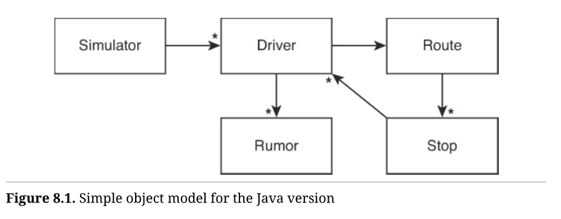
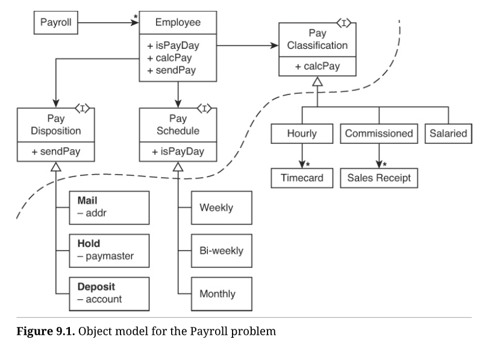
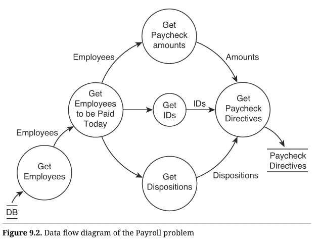
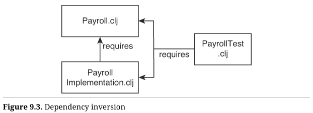
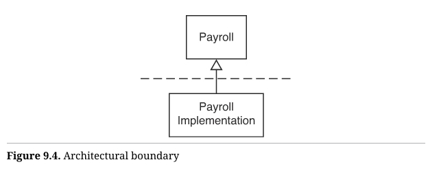

接下来是一系列练习的比较分析，这些练习分别采用了传统的面向对象（OO）风格和“函数式”风格编写。前两个练习你可能已经很熟悉；OO 部分来自我在《Clean Craftsmanship》[^1]一书中发表的示例。

每个例子的两个版本都遵循测试驱动开发（TDD）的原则进行创建。测试与代码一同逐步展示。你会看到如何通过第一个测试，然后是第二个、第三个，依此类推。

本书这一部分的目的是探讨和审视面向对象实现与函数式实现之间的差异。

这些练习的复杂性逐步递增。**质因数分解**相对简单。**保龄球游戏**稍微复杂一些，而**消息的八卦传递**则更为复杂。最后一个练习，**工资系统**，是例子中最复杂的。我在《Agile Software Development: Principles, Patterns, and Practices》[^2]一书的第三部分中详细探讨了它。为了节省篇幅，这里只展示函数式版本。

随着复杂性的增加，不同编程方法之间的差异将变得更加明显。你会发现这很有教育意义。但也要做好准备迎接一些意外结论；结果可能不会如你所预期的那样。

# 质因数分解

函数式编程是否优于使用可变变量的编程？让我们对一些熟悉的练习进行比较分析。例如，以下是传统的 Java 版本，通过测试驱动开发（TDD）进行的质因数分解练习（Prime Factors kata）的推导，基本上与《Clean Craftsmanship》第2章[^3]中展示的内容一致。相关视频“Prime Factors”也可以观看。你可以通过访问 [https://informit.com/functionaldesign](https://informit.com/functionaldesign) 并注册来获取该视频。

## Java 版本

我们从一个简单的测试开始：

```java
public class PrimeFactorsTest {
	@Test
	public void factors() throws Exception {
		assertThat(factorsOf(1), is(empty()));
	}
}
```

我们以简单的方式传递给它：

```java
private List<Integer> factorsOf(int n) {
	return new ArrayList<>();
}
```

当然，这个测试通过了。所以下一个最简单的测试是 2：

```java
assertThat(factorsOf(2), contains(2));
```

我们通过一些简单且显而易见的代码让它通过：

```java
private List<Integer> factorsOf(int n) {
	ArrayList<Integer> factors = new ArrayList<>();
	if (n>1)
		factors.add(2);
	return factors;
}
```

接下来是 3：

```java
assertThat(factorsOf(3), contains(3));
```

然后通过一个小技巧，将 `2` 替换为 `n` 使其通过：

```java
private List<Integer> factorsOf(int n) {
	ArrayList<Integer> factors = new ArrayList<>();
	if (n>1)
		factors.add(n);
	return factors;
}
```

接下来是 4，这是我们第一次在列表中有不止一个质因数的情况：

```java
assertThat(factorsOf(4), contains(2, 2));
```

我们通过一个看起来相当糟糕的 hack 使其通过：

```java
private List<Integer> factorsOf(int n) {
	ArrayList<Integer> factors = new ArrayList<>();
	if (n>1) {
		if (n % 2 == 0) {
			factors.add(2);
			n /= 2;
		}
	}
	if (n>1)
		factors.add(n);
	return factors;
}
```

不出所料，下面三个测试都通过：

```java
assertThat(factorsOf(5), contains(5));
assertThat(factorsOf(6), contains(2,3));
assertThat(factorsOf(7), contains(7));
```

8 这个测试案例是我们第一次在质因数列表中看到超过两个元素的情况：

```
assertThat(factorsOf(8), contains(2, 2, 2));
```

我们通过将其中一个 `if` 语句优雅地转换为 `while` 来使其通过：

```java
private List<Integer> factorsOf(int n) {
	ArrayList<Integer> factors = new ArrayList<>();
	if (n>1) {
		while (n % 2 == 0) {
			factors.add(2);
			n /= 2;
		}
	}
	if (n>1)
		factors.add(n);
	return factors;
}
```

接下来的测试是 9，由于我们的解决方案目前没有处理 3 的因数，因此它也必须失败：

```
assertThat(factorsOf(9), contains(3, 3));
```

为了解决这个问题，我们需要提取 3 的因数。我们可以这样做：

```
private List<Integer> factorsOf(int n) {
	ArrayList<Integer> factors = new ArrayList<>();
	if (n>1) {
		while (n % 2 == 0) {
			factors.add(2);
			n /= 2;
		}
		while (n % 3 == 0) {
            factors.add(3);
            n /= 3;
        }
	}
	if (n>1)
		factors.add(n);
	return factors;
}
```

但这太糟糕了，因为这意味着无穷无尽的重复。我们可以通过将另一个 `if` 改为 `while` 来解决这个问题：

```java
private List<Integer> factorsOf(int n) {
	ArrayList<Integer> factors = new ArrayList<>();
	int divisor = 2;
    while (n>1) {
        while (n % divisor == 0) {
            factors.add(divisor);
            n /= divisor;
        }
        divisor++;
    }
	if (n>1)
		factors.add(n);
	return factors;
}
```

稍微重构一下，我们得到了这个：

```java
private List<Integer> factorsOf(int n) {
	ArrayList<Integer> factors = new ArrayList<>();
	for (int divisor = 2; n > 1; divisor++)
        for (; n % divisor == 0; n /= divisor)
        	factors.add(divisor);
	return factors;
}
```

这个算法足以计算任何[^4]整数的质因数。

## Clojure 版本

好的，那么用 Clojure 实现会是什么样子呢？

和之前一样，我们从一个简单的测试[^5]开始：

```
(should= [] (prime-factors-of 1))
```

我们通过返回一个空列表使其通过，正如预期的那样：

```
(defn prime-factors-of [n] [])
```

接下来的测试与 Java 版本非常相似：

```
(should= [2] (prime-factors-of 2))
```

解决方案也是一样的：

```
(defn prime-factors-of [n]
	(if (> n 1) [2] []))
```

对第三个测试的解决方法也采用了相同的小技巧，即将 `2` 替换为 `n`：

```
(should= [3] (prime-factors-of 3))

(defn prime-factors-of [n]
	(if (> n 1) [n] []))
```

但到了测试 4 时，Clojure 和 Java 的解决方案开始分化：

```
(should= [2 2] (prime-factors-of 4))

(defn prime-factors-of [n]
	(if (> n 1)
		(if (zero? (rem n 2))
		(cons 2 (prime-factors-of (quot n 2)))
		[n])
	[]))
```

这个解决方案是递归的。`cons` 函数将 `2` 添加到 `prime-factors-of` 返回的列表的开头。仔细想一想，你会理解为什么这样做是合理的！`rem` 和 `quot` 函数分别是整数取余和取商操作。

在 Java 程序中，此时还没有出现迭代。两个 `if(n>1)` 片段虽然暗示了即将到来的迭代，但解决方案依然是线性的逻辑。

然而，在函数式版本中，我们看到了完整的递归实现，甚至没有使用尾调用优化。

接下来的四个测试直接通过，甚至包括测试 `8` 的情况：

```
(should= [5] (prime-factors-of 5))
(should= [2 3] (prime-factors-of 6))
(should= [7] (prime-factors-of 7))
(should= [2 2 2] (prime-factors-of 8))
```

在某种程度上，这有点遗憾，因为在 Java 解决方案中，正是 `8` 这个测试促使我们将 `if` 转换为 `while`。在 Clojure 解决方案中，没有发生这样的优雅转换；不过我不得不说，到目前为止，递归是更好的解决方案。

接下来是 `9` 的测试。此时，Java 和 Clojure 版本都面临着相似的重复代码问题：

```
(should= [3 3] (prime-factors-of 9))

(defn prime-factors-of [n]
	(if (> n 1)
		(if (zero? (rem n 2))
			(cons 2 (prime-factors-of (quot n 2)))
			(if (zero? (rem n 3))

				(cons 3 (prime-factors-of (quot n 3)))
				[n]))
		[]))
```

这个解决方案并不具有可持续性。它会迫使我们为 5、7、11、13……等质数一直添加到语言能够处理的最大质数。但这个解决方案暗示了一个有趣的迭代/递归解决方案：

```
(defn prime-factors-of [n]
	(loop [n n
		divisor 2
		factors []]
	(if (> n 1)
		(if (zero? (rem n divisor))
			(recur (quot n divisor) divisor (conj factors divisor))
			(recur n (inc divisor) factors))
		factors)))
```

`loop` 函数在原地创建了一个新的匿名函数。当 `recur` 嵌套在 `loop` 表达式中时，它会在尾调用优化（TCO）的情况下重新调用这个匿名函数。匿名函数的参数是 `n`、`divisor` 和 `factors`，每个参数都有其初始值。因此，`loop` 内的 `n` 被初始化为 `loop` 外部的 `n` 的值（两个 `n` 标识符是不同的），`divisor` 被初始化为 2，`factors` 被初始化为空列表 `[]`。

这个解决方案中的递归实际上是迭代式的，因为递归调用在尾部。注意，`cons` 被替换为了 `conj`，因为列表构建的顺序发生了变化。`conj` 函数将元素追加[^6]到 `factors` 中。确保你理解为什么顺序发生了变化！

## 总结

有几个值得注意的地方。首先，Java 和 Clojure 版本的测试顺序是相同的。这很重要，因为它暗示着转向函数式编程对我们表达测试的方式几乎没有影响。测试似乎更加基础、抽象，或者说比编程风格更本质。

其次，两个版本的解决策略在迭代需求出现之前就已经发生了偏离。在 Java 中，测试 `4` 并不需要迭代；但在 Clojure 中，它促使我们使用递归。这暗示了递归在某种程度上比使用 `while` 语句的标准循环更具语义上的本质性。

第三，Java 中的推导相对直截了当，从一个测试到下一个测试几乎没有出现意外。然而，Clojure 的推导在进行到 `9` 的测试时出现了一个急转弯，这是因为我们选择使用非尾递归而不是迭代循环结构来解决 `4` 的测试问题。这表明，当我们有选择时，应该优先使用尾递归结构而不是非尾递归。

最终的结果是，一个与 Java 解决方案相似的算法，但有一个令人惊讶的不同：它不是一个双重嵌套循环。Java 解决方案有一个循环递增除数，另一个循环不断将当前除数作为因数添加。而 Clojure 解决方案用两个独立的递归替代了双重嵌套循环。

哪个解决方案更好呢？Java 解决方案速度更快，因为 Java 本身比 Clojure 快得多。但除此之外，我没有看到哪种解决方案有特别明显的优点。对于同时熟悉两种语言的人来说，两者在阅读或理解上都没有更容易的表现。两者在结构上或风险性上也没有优劣之分。从我的角度来看，这两者难分伯仲。除了 Java 固有的速度优势之外，两种风格并没有哪一种明显优于另一种。

然而，这是最后一个结果不明确的例子。从一个例子到下一个例子，差异将变得越来越显著。

# 保龄球游戏

现在让我们看看另一个传统的 TDD 练习：保龄球游戏（Bowling Game kata）。以下是这个练习的简短版本，完整内容曾出现在《Clean Craftsmanship》[^7]一书中。相关视频“Bowling Game”也可以观看。你可以通过访问 https://informit.com/functionaldesign 并注册来获取该视频。

## Java 版本

和往常一样，我们做一个什么都没做的测试，仅让它编译和运行：

```java
public class BowlingTest {
    @Test
    public void nothing() throws Exception {
    }
}
```

下一步，断言我们创建的一个 `Game` 类：

```java
@Test
public void canCreateGame() throws Exception {
	Game g = new Game();
}
```

接着，我们通过让集成开发环境（IDE）创建缺失的类，使代码能够编译并通过测试：

```java
public class Game {
}
```

接下来，看看我们是否可以投出一球：

```java
@Test
public void canRoll() throws Exception {
    Game g = new Game();
    g.roll(0);
}
```

然后通过让 IDE 创建 `roll` 函数并给参数一个合理的名称，使代码编译并通过：

```java
public class Game {
    public void roll(int pins) {
    }
}
```

测试中已经出现了一些重复。我们应该去掉这些重复。因此，我们将创建游戏的代码提取到 `setup` 函数中：

```java
public class BowlingTest {
    private Game g;
    
    @Before
    public void setUp() throws Exception {
    	g = new Game();
    }
}
```

这使得第一个测试变得完全无用，所以我们将其删除。第二个测试也没有实际作用，因为它没有断言任何内容，所以我们也将其删除。

接下来，我们希望断言能为一局比赛计分，但要做到这一点，我们需要先模拟完整的一局比赛：

```java
@Test
public void gutterGame() throws Exception {
    for (int i=0; i<20; i++)
    	g.roll(0);
    assertEquals(0, g.score());
}

public int score() {
	return 0;
}
```

接着我们来进行所有都是一次得分的情况：

```java
@Test
public void allOnes() throws Exception {
	for (int i=0; i<20; i++)
		g.roll(1);
	assertEquals(20, g.score());
}

public class Game {
	private int score;

	public void roll(int pins) {
		score += pins;
	}

	public int score() {
		return score;
	}
}
```

测试中的重复代码可以通过提取一个名为 `rollMany` 的函数来消除：

```java
public class BowlingTest {
    private Game g;
    
    @Before
    public void setUp() throws Exception {
    	g = new Game();
    }
    
    private void rollMany(int n, int pins) {
        for (int i=0; i<n; i++) {
        	g.roll(pins);
        }
    }
    
    @Test
    public void gutterGame() throws Exception {
    	rollMany(20, 0);
    	assertEquals(0, g.score());
    }
    
    @Test
    public void allOnes() throws Exception {
    	rollMany(20, 1);
    	assertEquals(20, g.score());
    }
}
```

好的，下一个测试：一次补中（spare），有一个额外的加分球，其他都是没击中的球（gutter balls）：

```java
@Test
public void oneSpare() throws Exception {
    rollMany(2, 5);
    g.roll(7);
    rollMany(17, 0);
    assertEquals(24, g.score());
}
```

这个测试肯定会失败。为了让它通过，我们需要重构算法。我们将分数计算从 `roll` 方法中移出，并放入 `score` 方法中，然后每次按两球（即一局）的方式遍历 `rolls` 数组：

```java
public int score() {
    int score = 0;
    int frameIndex = 0;
    for (int frame = 0; frame < 10; frame++) {
		if (isSpare(frameIndex)) {
            score += 10 + rolls[frameIndex + 2];
            frameIndex += 2;
        } else {
            score += rolls[frameIndex] + rolls[frameInd
            frameIndex += 2;
        }
	}
	return score;
}

private boolean isSpare(int frameIndex) {
	return rolls[frameIndex] + rolls[frameIndex + 1
}
```

接下来是一次全中（strike）：

```java
@Test
public void oneStrike() throws Exception {
    g.roll(10);
    g.roll(2);
    g.roll(3);
    rollMany(16, 0);
    assertEquals(20, g.score());
}
```

让它通过只需添加全中的条件，然后进行一些重构：

```java
public int score() {
    int score = 0;
    int frameIndex = 0;
    for (int frame = 0; frame < 10; frame++) {
        if (isStrike(frameIndex)) {
        score += 10 + strikeBonus(frameIndex);
        frameIndex++;
    } else if (isSpare(frameIndex)) {
        score += 10 + spareBonus(frameIndex);
        frameIndex += 2;
    } else {
        score += twoBallsInFrame(frameIndex);
        frameIndex += 2;
    }
    }
    return score;
}
```

最后，我们测试一场完美比赛：

```java
@Test
public void perfectGame() throws Exception {
    rollMany(12, 10);
    assertEquals(300, g.score());
}
```

这个测试通过了，没有做任何修改。

## Clojure 版本

在 Clojure 中，事情开始的方式非常不同。我们没有需要创建的类，也不需要 `roll` 方法。因此，我们的第一个测试是全没击中的局（gutter game）：

```clojure
(should= 0 (score (repeat 20 0)))

(defn score [rolls] 0)
```

> `repeat` 函数返回一个重复值的序列。在这里，它生成的是一个包含 20 个 0 的序列。

紧接着是所有都是一次得分的测试：

```clojure
(should= 20 (score (repeat 20 1)))

(defn score [rolls]
	(reduce + rolls))
```

没有任何意外。`reduce` 函数将 `+` 函数应用于整个列表。接下来我们测试一次补中的情况：

```clojure
(should= 24 (score (concat [5 5 7] (repeat 17 0))
```

> 你可能需要查阅一下这个 reduce 函数的详细信息。它的功能远比这一段描述的要多。不过你很快就会看到它的其他用法了。

要让这个测试通过，我们需要进行几个步骤。首先是将 `rolls` 数组分解为每局两球并求和：

```clojure
(defn to-frames [rolls]
	(partition 2 rolls))

(defn add-frame [score frame]
	(+ score (reduce + frame)))

(defn score [rolls]
	(reduce add-frame 0 (to-frames rolls)))
```

> `partition` 函数将 `rolls` 列表分解为一组两球的列表。例如，`[1 2 3 4 5 6]` 变为 `[[1 2][3 4][5 6]]`。

现在，`reduce` 函数开始发挥作用。它遍历每组两球的得分并将它们累加到总分中。

这些更改保持了之前所有测试的通过，但仍然未能通过补中测试。为了让它通过，我们需要在 `to-frames` 和 `add-frame` 函数中添加特殊处理。我们的目标是将计算一局所需的所有投球数据存入局数据中。

```clojure
(defn to-frames [rolls]
    (let [frames (partition 2 rolls)
        possible-bonuses (map #(take 1 %) (rest frames))
        possible-bonuses (concat possible-bonuses [[0]])]
    (map concat frames possible-bonuses)))

(defn add-frame [score frame-and-bonus]
    (let [frame (take 2 frame-and-bonus)]
        (if (= 10 (reduce + frame))
            (+ score (reduce + frame-and-bonus))
            (+ score (reduce + frame)))))
            
(defn score [rolls]
	(reduce add-frame 0 (to-frames rolls)))
```

> `#(...)` 表达式创建了一个匿名函数，`%` 符号代表该函数的参数。你也可以使用 `%n`，其中 `n` 是一个整数，表示第 `n` 个参数。因此，`#(take 1 %)` 是一个返回其参数的第一个元素组成的列表的函数。
>
> `possible-bonuses (concat possible-bonuses [[0]])]` 这并不是重新赋值，甚至也不是重新初始化。第二个 `possible-bonuses` 的值与第一个是不同的。可以把它想象成 Java 中的局部变量隐藏了一个同名的函数参数或成员变量。
>
> `concat` 函数用于将列表连接在一起。例如，`(concat [1 2] [3 4])` 返回 `[1 2 3 4]`。

仔细看这段代码，里面充满了很多小技巧和解决方法。为什么？因为 Clojure 中有许多吸引人的小工具，可以用来把数据变成你想要的形式，然后用一些小技巧将数据调整为完全符合要求的形式。如果不小心，这些小技巧可能会主导你的代码。

例如，看看为什么我在 `to-frames` 中将 `[[0]]` 传递给 `concat` 函数。再比如，问问自己为什么我用了 `#(take 1 %)` 而不是直接使用 `first`。

> 由于奖励是基于下一局的，所以 `possible-bonuses` 少了一个元素。这会导致最后一次 `map` 调用提前终止一个元素。
>
> `(take 1 x)` 返回一个包含 `x` 的第一个元素的列表，而 `first` 直接返回第一个元素。

由于代码中的小技巧较多，如果你在理解上遇到困难，不必过于担心。我回头看这段代码时也遇到了困惑。因此……

当这些小技巧泛滥时，是时候重新考虑解决方案了。所以我将其重构为一个简单的循环：

```clojure
(defn to-frames [rolls]
	(loop [remaining-rolls rolls frames []]
		(cond
			(empty? remaining-rolls)
			frames
			
			(= 10 (reduce + (take 2 remaining-rolls)))
			(recur (drop 2 remaining-rolls)
				(conj frames (take 3 remaining-rolls
			:else
			(recur (drop 2 remaining-rolls)
            	(conj frames (take 2 remaining-rolls

(defn add-frames [score frame]
	(+ score (reduce + frame)))

(defn score [rolls]
	(reduce add-frames 0 (to-frames rolls)))
```

现在看起来好多了，而且它开始有点像 Java 版本的解决方案了。接下来的测试是一次全中（strike）：

```clojure
(should= 20 (score (concat [10 2 3] (repeat 16 0)))
```

我们通过在 `cond` 中添加一个新条件来让它通过：

```clojure
(defn to-frames [rolls]
	(loop [remaining-rolls rolls frames []]
		(cond
			(empty? remaining-rolls)
			frames
			
			(= 10 (first remaining-rolls))
            (recur (rest remaining-rolls)
            	(conj frames (take 3 remaining-rolls)))
			
			(= 10 (reduce + (take 2 remaining-rolls)))
			(recur (drop 2 remaining-rolls)
				(conj frames (take 3 remaining-rolls
			:else
			(recur (drop 2 remaining-rolls)
            	(conj frames (take 2 remaining-rolls

(defn add-frames [score frame]
	(+ score (reduce + frame)))

(defn score [rolls]
	(reduce add-frames 0 (to-frames rolls)))
```

简单吧？剩下的就是完美比赛的测试了。如果和 Java 版本一样，这个测试应该可以直接通过，无需修改：

```
(should= 300 (score (repeat 12 10))))
```

但它没有通过！你能看出为什么吗？也许下面的修复可以为你解答这个问题：

```
(defn score [rolls]
	(reduce add-frames 0 (take 10 (to-frames rolls)))
```

`to-frames` 函数会不加区分地创建超过十局。它一直处理到 `rolls` 列表的末尾，尽可能多地生成局。然而，保龄球比赛只有十局。

## 总结

Java 版本和 Clojure 版本在解决这个问题时有一些有趣的差异。首先，Clojure 版本没有 `Game` 类。所以在 Java 版本中我们用来创建 `Game` 类的那些机制在 Clojure 版本中根本不存在。

你可能认为没有 `Game` 类是 Clojure 版本的一个缺陷。毕竟，能够创建一个 `Game` 对象，给它一堆投球数据，然后获取得分，这样的方式确实很方便。然而，Clojure 版本将投球数据的积累与得分计算解耦了。这两个概念在 Clojure 版本中没有绑定在一起。这让我觉得，Java 版本可能在某种程度上违反了**单一职责原则**。

其次，在我们尝试解决“补中”情况时，Clojure 版本中充斥了各种不太优雅的小技巧。这是 Clojure 程序（或者说 Clojure 程序员）的一个真实问题。用一些小技巧来解决问题实在是太容易了。

第三，Clojure 解决方案与 Java 解决方案显著不同。当然，确实有一些相似之处。Clojure 版本中的 `cond` 结构非常类似于 Java 版本中的 `if/else` 结构。然而，这两个类似的结构产生了截然不同的结果。Java 版本直接计算出了得分，而 Clojure 版本生成了一个包含补中和全中加分球的局数据。这是一个有趣的关注点分离（Separation of Concerns）。虽然计算得分的过程中两个版本都需要识别出影响每局得分的所有投球，但 Java 版本是在代码中直接处理这些，而 Clojure 版本则很好地分离了这些关注点。

哪个版本更好呢？Java 版本最终稍微简单一些，但它的耦合度也更高。而 Clojure 版本的关注点分离让我觉得它在两者之间会更灵活、更有用。

当然，我们讨论的代码量不过是十几行而已。

# 公交司机消息传递问题

到目前为止，在这场比较分析中，我们还没有找到一个强有力的理由来偏好函数式编程而非面向对象编程。那么让我们来研究一个稍微有趣一点的问题。

面向对象编程诞生于1966年，当时 Ole-Johan Dahl 和 Kristen Nygaard 对 ALGOL-60 语言进行了一些修改，以使该语言更适合离散事件模拟[^8]。这个新语言被称为 SIMULA-67，被认为是第一个真正的面向对象编程语言。

所以让我们对一个简单的离散事件模拟器进行比较分析。这个问题完美契合了面向对象编程的范围。一个不错的选择是**公交司机消息传递问题（Gossiping Bus Drivers Kata）**[^9]。

在这个问题中，给定n个司机，每个司机都有自己的循环路线，要求确定需要多少步，才能让所有司机共享彼此的所有消息。司机只有在同时到达同一站点时才会分享消息。

比如，假设 Bob 知道传闻 X，并驾驶路线 [p, q, r]，而 Jim 知道传闻 Y，并驾驶路线 [s, t, u, p]。那么，Bob 和 Jim 什么时候能够交换他们的消息呢？如果他们从时间 0 开始，那么在第 3 步时，他们都会到达站点 p。记住，路线是循环的。

这个过程的限制是最多运行 480 步。

当有多个司机和更复杂的路线时，这个问题就会变得更加有趣。

## Java 版本

我用 Java 写了这个问题的解决方案。我从一种非常传统的面向对象分析和设计入手（见图 8.1）。  



模拟器（Simulator）包含多个司机（Drivers），每个司机有一个路线（Route），每条路线包含多个站点（Stops）。每个站点有多个司机，而每个司机掌握多个传闻（Rumors）。

这是一个相当简单的对象模型。这里甚至没有涉及到继承或多态。所以实现起来应该是比较直接的。

当然，我是通过测试驱动开发（TDD）编写 Java 代码的。以下是测试。正如你所见，它们相当冗长，但至少所有测试都可以放入一个测试类中[^10]。

```java
package gossipingBusDrivers;
import org.junit.Before;
import org.junit.Test;
import static org.hamcrest.MatcherAssert.assertThat;
import static org.hamcrest.collection.IsEmptyCollection.empty;
import static org.hamcrest.collection.IsIterableContainingInAnyOrder.containsInAnyOrder;
import static org.junit.Assert.assertEquals;

public class GossipTest {
	private Stop stop1;
    private Stop stop2;
    private Stop stop3;
    private Route route1;
    private Route route2;
    private Rumor rumor1;
    private Rumor rumor2;
    private Rumor rumor3;
    private Driver driver1;
    private Driver driver2;
    
    @Before
    public void setUp() {
        stop1 = new Stop("stop1");
        stop2 = new Stop("stop2");
        stop3 = new Stop("stop3");
        route1 = new Route(stop1, stop2);
        route2 = new Route(stop1, stop2, stop3);
        rumor1 = new Rumor("Rumor1");
        rumor2 = new Rumor("Rumor2");
        rumor3 = new Rumor("Rumor3");
        driver1 = new Driver("Driver1", route1, rumor1);
        driver2 = new Driver("Driver2", route2, rumor2, rumor3);
    }
    
    @Test
    public void driverStartsAtFirstStopInRoute() th
    	assertEquals(stop1, driver1.getStop());
    }
    
    @Test
    public void driverDrivesToNextStop() throws Exception {
        driver1.drive();
        assertEquals(stop2, driver1.getStop());
    }
    
    @Test
    public void driverReturnsToStartAfterLastStop()
    throws Exception {
        driver1.drive();
        driver1.drive();
        assertEquals(stop1, driver1.getStop());
    }
    
    @Test
    public void firstStopHasDriversAtStart() throws Exception {
        assertThat(stop1.getDrivers(), containsInAnyOrder(driver1, driver2));
        assertThat(stop2.getDrivers(), empty());
    }
    
    @Test
    public void multipleDriversEnterAndLeaveStops() throws Exception {
        assertThat(stop1.getDrivers(), containsInAnyOrder(driver1, driver2));
        assertThat(stop2.getDrivers(), empty());
        assertThat(stop3.getDrivers(), empty());
        driver1.drive();
        driver2.drive();
        assertThat(stop1.getDrivers(), empty());
        assertThat(stop2.getDrivers(), containsInAnyOrder(driver1, driver2));
        assertThat(stop3.getDrivers(), empty());
        driver1.drive();
        driver2.drive();
        assertThat(stop1.getDrivers(), containsInAnyOrder(driver1));
        assertThat(stop2.getDrivers(), empty());
        assertThat(stop3.getDrivers(), containsInAnyOrder(driver2));
        driver1.drive();
        driver2.drive();
        assertThat(stop1.getDrivers(), containsInAnyOrder(driver2));
        assertThat(stop2.getDrivers(), containsInAnyOrder(driver1));
        assertThat(stop3.getDrivers(), empty());
    }
    
    @Test
    public void driversHaveRumorsAtStart() throws Exception {
        assertThat(driver1.getRumors(), containsInAnyOrder(rumor1));
        assertThat(driver2.getRumors(), containsInAnyOrder(rumor2, rumor3));
    }
    
    @Test
    public void noDriversGossipAtEmptyStop() throws
        stop2.gossip();
        assertThat(driver1.getRumors(), containsInAnyOrder(rumor1, rumor2, rumor3));
        assertThat(driver2.getRumors(), containsInAnyOrder(rumor1, rumor2, rumor3));
    }
    
    @Test
    public void driversGossipAtStop() throws Exception {
        stop1.gossip();
        assertThat(driver1.getRumors(), containsInAnyOrder(rumor1, rumor2, rumor3));
        assertThat(driver2.getRumors(), containsInAnyOrder(rumor1, rumor2, rumor3));
    }
    
    @Test
    public void gossipIsNotDuplicated() throws Exception {
        stop1.gossip();
        stop1.gossip();
        assertThat(driver1.getRumors(), containsInAnyOrder(rumor1, rumor2, rumor3));
        assertThat(driver2.getRumors(), containsInAnyOrder(rumor1, rumor2, rumor3));
    }
    
    @Test
    public void driveTillEqualTest() throws Exception {
        assertEquals(1, Simulation.driveTillEqual(driver1, driver2));
    }
    
    @Test
    public void acceptanceTest1() throws Exception {
        Stop s1 = new Stop("s1");
        Stop s2 = new Stop("s2");
        Stop s3 = new Stop("s3");
        Stop s4 = new Stop("s4");
        Stop s5 = new Stop("s5");
        Route r1 = new Route(s3, s1, s2, s3);
        Route r2 = new Route(s3, s2, s3, s1);
        Route r3 = new Route(s4, s2, s3, s4, s5);
        Driver d1 = new Driver("d1", r1, new Rumor("1"));
        Driver d2 = new Driver("d2", r2, new Rumor("2"));
        Driver d3 = new Driver("d3", r3, new Rumor("3"));
        assertEquals(6, Simulation.driveTillEqual(d1, d2, d3));
    }
    
    @Test
    public void acceptanceTest2() throws Exception
        Stop s1 = new Stop("s1");
        Stop s2 = new Stop("s2");
        Stop s5 = new Stop("s5");
        Stop s8 = new Stop("s8");
        Route r1 = new Route(s2, s1, s2);
        Route r2 = new Route(s5, s2, s8);
        Driver d1 = new Driver("d1", r1, new Rumor("1"));
        Driver d2 = new Driver("d2", r2, new Rumor("2"));
        assertEquals(480, Simulation.driveTillEqual(d1, d2));
    }
}
```

解决方案的代码被拆分为几个小文件。

**司机**

```java
package gossipingBusDrivers;
import java.util.Arrays;
import java.util.HashSet;
import java.util.Set;

public class Driver {
    private String name;
    private Route route;
    private int stopNumber = 0;
    private int stopNumber = 0;
    private Set<Rumor> rumors;
    public Driver(String name, Route theRoute,
    Rumor... theRumors) {
        this.name = name;
        route = theRoute;
        rumors = new HashSet<>(Arrays.asList(theRumor
        route.stopAt(this, stopNumber);
    }
    
    public Stop getStop() {
    	return route.get(stopNumber);
    }
    
    public void drive() {
        route.leave(this, stopNumber);
        stopNumber = route.getNextStop(stopNumber);
        route.stopAt(this, stopNumber);
    }
    
    public Set<Rumor> getRumors() {
    	return rumors;
    }
    
    public void addRumors(Set<Rumor> newRumors) {
    	rumors.addAll(newRumors);
    }
}
```

**线路**

```java
package gossipingBusDrivers;
public class Route {
    private Stop[] stops;
    public Route(Stop... stops) {
    	this.stops = stops;
    }
    
    public Stop get(int stopNumber) {
    	return stops[stopNumber];
    }
    
    public int getNextStop(int stopNumber) {
    	return (stopNumber + 1) % stops.length;
    }
    
    public void stopAt(Driver driver, int stopNumbe
    	stops[stopNumber].addDriver(driver);
    }
    
    public void leave(Driver driver int stopNumber) {
    	stops[stopNumber].removeDriver(driver);
    }
}
```

**站点**

```java
package gossipingBusDrivers;
import java.util.ArrayList;
import java.util.HashSet;
import java.util.List;
import java.util.Set;

public class Stop {
    private String name;
    private List<Driver> drivers = new ArrayList<>
    public Stop(String name) {
    	this.name = name;
    }
    
    public String toString() {
    	return name;
    }
    
    public List<Driver> getDrivers() {
    	return drivers;
    }
    
    public void addDriver(Driver driver) {
    	drivers.add(driver);
    }
    
    public void removeDriver(Driver driver) {
    	drivers.remove(driver);
    }
    
    public void gossip() {
        Set<Rumor> rumorsAtStop = new HashSet<>();
        for (Driver d : drivers)
        	rumorsAtStop.addAll(d.getRumors());
        for (Driver d : drivers)
        	d.addRumors(rumorsAtStop);
    }
}
```

**传闻**

```java
package gossipingBusDrivers;
public class Rumor {
    private String name;
    
    public Rumor(String name) {
    	this.name = name;
    }
    
    public String toString() {
    	return name;
    }
}
```

**模拟**

```java
package gossipingBusDrivers;
import java.util.HashSet;
import java.util.Set;

public class Simulation {
    public static int driveTillEqual(Driver... drivers) {
    int time;
    for (time = 0; notAllRumors(drivers) && time < 480; time++)
    	driveAndGossip(drivers);
    return time;
    }

    private static void driveAndGossip(Driver[] drivers) {
        Set<Stop> stops = new HashSet<>();
        for (Driver d : drivers) {
            d.drive();
            stops.add(d.getStop());
        }
        for (Stop stop : stops)
            stop.gossip();
    }
    
    private static boolean notAllRumors(Driver[] drvers) {
        Set<Rumor> rumors = new HashSet<>();
        for (Driver d : drivers)
        	rumors.addAll(d.getRumors());
        for (Driver d : drivers) {
            if (!d.getRumors().equals(rumors))
            	return true;
        }
    	return false;
    }
}
```

快速浏览这段代码后，你会发现它采用了非常传统的面向对象风格编写，并且各个对象很好地封装了它们自己的状态。

## Clojure 版本

在编写 Clojure 版本时，我并没有从设计草图开始，而是依靠我的 TDD 测试来帮助设计。测试如下：

```clojure
(ns gossiping-bus-drivers-clojure.core-spec
	(:require [speclj.core :refer :all]
			[gossiping-bus-drivers-clojure.core

(describe "gossiping bus drivers"
	(it "drives one bus at one stop"
		(let [driver (make-driver "d1" [:s1] #{:r1} )
            world [driver]
            new-world (drive world)]
        (should= 1 (count new-world))
        (should= :s1 (-> new-world first :route first))))

	(it "drives one bus at two stops"
		(let [driver (make-driver "d1" [:s1 :s2] #{:r
        	world [driver]
        	new-world (drive world)]
        (should= 1 (count new-world))
        (should= :s2 (-> new-world first :route first))))

(it "drives two buses at some stops"
	(let [d1 (make-driver "d1" [:s1 :s2] #{:r1})
		d2 (make-driver "d2" [:s1 :s3 :s2] #{:r2})
        world [d1 d2]
        new-1 (drive world)
        new-2 (drive new-1)]
    (should= 2 (count new-1))
    (should= :s2 (-> new-1 first :route first))
    (should= :s3 (-> new-1 second :route first))
    (should= 2 (count new-2))
    (should= :s1 (-> new-2 first :route first))
    (should= :s2 (-> new-2 second :route first))))

(it "gets stops"
	(let [drivers #{{:name "d1" :route [:s1]}
                    {:name "d2" :route [:s1]}
                    {:name "d3" :route [:s2]}}]
	(should= {:s1 [{:name "d1" :route [:s1]}
					{:name "d2" :route [:s1]}]
			  :s2 [{:name "d3", :route [:s2]}]}
			  (get-stops drivers)))
)

(it "merges rumors"
	(should= [{:name "d1" :rumors #{:r2 :r1}}
			  {:name "d2" :rumors #{:r2 :r1}}]
			  (merge-rumors [{:name "d1" :rumors #{:r1}}
							{:name "d2" :rumors #{:r2}}])))

(it "shares gossip when drivers are at same stop"
	(let [d1 (make-driver "d1" [:s1 :s2] #{:r1})
		d2 (make-driver "d2" [:s1 :s2] #{:r2})
		world [d1 d2]
		new-world (drive world)]
    (should= 2 (count new-world))
    (should= #{:r1 :r2} (-> new-world first :rumors))
    (should= #{:r1 :r2} (-> new-world second :rumors))))

(it "passes acceptance test 1"
	(let [world [(make-driver "d1" [3 1 2 3] #{1}
				(make-driver "d2" [3 2 3 1] #{2}
				(make-driver "d3" [4 2 3 4 5] #{
	(should= 6 (drive-till-all-rumors-spread wo

(it "passes acceptance test 2"
	(let [world [(make-driver "d1" [2 1 2] #{1})
				(make-driver "d2" [5 2 8] #{2})]
		(should= :never (drive-till-all-rumors-
)
```

> `#{...}` 在 Clojure 中表示一个集合。集合是一种没有重复项的列表。

Java 测试与 Clojure 测试之间有一些有趣的相似之处。它们都相当冗长，尽管 Clojure 测试的行数仅为 Java 的一半。Java 版本有 12 个测试，而 Clojure 版本只有 8 个。这一差异很大程度上与两种解决方案的分割方式有关。Clojure 测试在处理数据时也相对自由灵活。

例如，`"merges rumors"` 测试中，`merge-rumors` 函数期望传入一个司机列表；然而，测试并没有创建完整的司机对象，而是创建了在 `merge-rumors` 函数看来像司机的简化结构。

解决方案全部包含在一个非常简短的文件中：

```clojure
(ns gossiping-bus-drivers-clojure.core
	(:require [clojure.set :as set]))

(defn make-driver [name route rumors]
	(assoc {} :name name :route (cycle route) :rumors rumors))

(defn move-driver [driver]
	(update driver :route rest))

(defn move-drivers [world]
	(map move-driver world))

(defn get-stops [world]
	(loop [world world
		stops {}]
	(if (empty? world)
		stops
		(let [driver (first world)
			stop (first (:route driver))
			stops (update stops stop conj driver)
		(recur (rest world) stops)))))

(defn merge-rumors [drivers]
	(let [rumors (map :rumors drivers)
		all-rumors (apply set/union rumors)]
	(map #(assoc % :rumors all-rumors) drivers)

(defn spread-rumors [world]
	(let [stops-with-drivers (get-stops world)
		drivers-by-stop (vals stops-with-drivers
	(flatten (map merge-rumors drivers-by-stop)

(defn drive [world]
	(-> world move-drivers spread-rumors))

(defn drive-till-all-rumors-spread [world]
	(loop [world (drive world)
		time 1]
(cond
	(> time 480) :never
	(apply = (map :rumors world)) time
	:else (recur (drive world) (inc time)))))
```

> `assoc` 函数向映射中添加元素。例如，`(assoc {} :a 1)` 返回 `{:a 1}`。
>
> `cycle` 函数返回一个惰性（且“无限”）的列表，该列表会无限重复输入的列表。因此，`(cycle [1 2 3])` 返回 `[1 2 3 1 2 3 1 2 3 …]`。
>
> `update` 函数返回一个具有一个元素被更改的新映射。`(update m k f a)` 会通过将函数 `(f e a)` 应用于 `m` 的 `k` 元素来更改该元素，其中 `e` 是元素 `k` 的旧值。因此，`(update {:x 1} :x inc)` 返回 `{:x 2}`。
>
> `union` 函数来自 `set` 命名空间。注意顶部的 `ns` 将 `clojure.set` 命名空间别名为 `set`。
>
> `vals` 函数返回映射中所有值的列表。`keys` 返回映射中所有键的列表。
>
> `flatten` 函数将列表的列表转换为单个列表。例如，`(flatten [[1 2] [3 4]])` 返回 `[1 2 3 4]`。

这个解决方案只有42行，而Java版本则有145行，分散在五个文件中。

两个版本的解决方案都有“司机”的概念，但我没有尝试将“路线”、“站点”和“传闻”等概念封装成独立的对象。它们都简单地存在于司机（Driver）中。

更糟的是，Clojure中的司机“对象”并不是传统 OO 意义上的对象。它没有方法。系统中只有一个方法 `move-driver` 操作单个司机，但它只是一个辅助函数，主要用于更重要的 `move-drivers` 函数。

在Clojure中，八个函数中有六个只接受“世界”（world）作为参数。因此，我们可以说系统中唯一真正的“对象”是“世界”，它拥有五个方法。但即使这样说也有些牵强。

即使我们认为“司机”是一种对象，它也是不可变的。模拟的 `world` 不过是一个由不可变的司机组成的列表。`drive` 函数接受世界并产生一个新的 `world`，在这个新 `world` 中，所有司机都移动了一步，并且在有多个司机到达同一站点时，传闻会在该站点传播。

`drive` 函数是一个重要概念的例子。注意 `world` 如何经过函数管道传递。在这个例子中，只有两个函数：`move-drivers` 和 `spread-rumors`，但在更大的系统中，管道可以很长。每个阶段，世界都被修改为一个稍微不同的新状态。

这告诉我们，该系统的划分并不是基于对象，而是基于函数。相对没有分割的数据从一个独立的函数传递到下一个函数。

你可能会认为，Java 代码相对直观，而 Clojure 代码过于紧凑和晦涩。相信我，习惯了这种紧凑之后，你会发现这种晦涩只是一种由于不熟悉而产生的错觉。

Clojure 版本中缺乏划分是个问题吗？在目前的规模下还不是问题；但如果这个程序像大多数系统一样不断扩展，那么这个问题可能会变得非常明显。OO 程序的划分比函数式程序的划分更自然，因为划分的边界更加明显和突出。

另一方面，Java 版本中我们选择的划分方式并不保证是有效的划分。在 Clojure 程序的 `drive` 函数中有一个警示。似乎更好的划分方式可能是基于操作 `world` 的不同操作，而不是像“路线”、“站点”和“传闻”这样的事物。

## 总结

我们在质因数和保龄球游戏的练习中看到了些许差异，但这些差异相对较小。而在公交司机消息传递问题中，差异则更加显著。这可能是因为这个练习比前两个稍大一些（我认为大约是它们的两倍），并且它是一个真正的有限状态机。

有限状态机从一个状态转移到另一个状态，执行的操作依赖于输入事件和当前状态。当这样的系统以面向对象风格编写时，状态往往存储在可变对象中，并通过专门的方法处理。而在函数式风格中，状态则保持在不可变的数据结构中，这些数据结构通过函数管道进行传递。

我们或许可以得出这样的结论：像质因数分解这样的简单计算程序，不太受面向对象风格或函数式风格的影响。毕竟，它们是没有状态变化的简单函数。那些状态变化仅限于小问题（如数组索引）的程序，受风格差异的影响也较小。但那些由状态变化驱动的程序，如公交司机消息传递问题，在两种风格之间将会有显著的不同。

面向对象的风格倾向于根据数据的内聚性进行划分，而函数式风格则倾向于根据行为的内聚性进行划分。至于这两者中哪种更好，这个问题我会留给后续的章节来探讨。

# 面向对象编程

在前一章中，我们看到面向对象编程风格与数据类型和数据的内聚性密切相关。但面向对象不仅仅是关于数据内聚性的。事实上，数据内聚性可能只是面向对象的次要属性，面向对象的另一个关键特性是**多态**。

在《Clean Architecture》一书中，我指出面向对象编程风格有三个属性：封装、继承和多态。接着我解释了为什么在这三者中，多态是最有益的，而其他两个属性至多是辅助性的。

前几章中的例子不太适合讨论多态性。我们将通过研究如何解决《Agile Software Development: Principles, Patterns, and Practices》第3部分中的**工资发放问题**来纠正这一点。

需求如下：

- 有一个包含员工记录的数据库。
- 工资发放程序每天运行，生成当天应支付给员工的工资。
- **固定工资员工**在每月的最后一个工作日发放工资。其月薪是员工记录中的一个字段。
- **提成工资员工**每隔一个周五发工资。他们的工资包括基本工资和提成。基本工资和提成比例是员工记录中的字段。提成通过将提成比例乘以该员工的销售收据总额计算。
- **时薪员工**每周五发工资。其时薪率是员工记录中的一个字段。他们的工资通过将时薪率乘以本周工作时间卡上的工时总和计算。如果总工时超过40小时，剩余的工时按时薪的1.5倍支付。
- 员工可以选择将工资单邮寄到家中，保存在工资管理员的办公室，或直接存入银行账户。地址、工资管理员信息和银行信息是员工记录中的字段。

该问题的典型面向对象解决方案在统一建模语言（UML）图中展示，如图9.1所示。



也许最好的开始方式是从 **Payroll** 类入手。在 Java 中，它有一个 `run` 方法，如下所示：

```java
void run() {
    for (Employee e : db.getEmployees()) {
        if (e.isPayDay()) {
        	Pay pay = e.calcPay();
        	e.sendPay(pay);
        }
    }
}
```

我在很多场合多次提到过，包括前述的书籍，这段小代码是最纯粹的真理。对于每个员工，如果今天是他们应发工资的日子，那么就计算他们的工资并将其发送给他们。

从这段代码可以很清楚地看出，剩下的实现应该也相当明确。这里有三次使用了**策略模式**（Strategy Pattern）[^11]：一次用于实现 `calcPay`，一次用于实现 `isPayDay`，还有一次用于实现 `sendPay`。

同样也很清楚的是，`getEmployees` 函数必须构建这个对象结构，它从数据库读取员工数据并正确地安排它们。数据库中的数据很可能并不像这里看到的对象结构那样。

此外，还可以清楚地看到有一个非常明显的架构边界（虚线），它横跨所有这些继承关系，将高级抽象与低级细节分隔开来。

## 函数式 Payroll

图9.2展示了函数式程序可能的样子。



有趣的是，我选择了一个数据流图（DFD）来表示函数式解决方案。DFD 在描述流程与数据元素之间的关系时非常有帮助，但在描绘架构决策时远不如 UML 类图那么有用。尽管如此，DFD 帮助我们提出了函数式版本的“纯粹真理”：

```clojure
(defn payroll [today db]
	(let [employees (get-employees db)
		employees-to-pay (get-employees-to-be-paid-today
							today employees)
		amounts (get-paycheck-amounts employees-to-pay)
		ids (get-ids employees-to-pay)
		dispositions (get-dispositions employees-to-pay)]
	(send-paychecks ids amounts dispositions)))
```

注意，与 Java 版本不同的是，函数式程序并不是迭代的方式。相反，员工列表通过程序流动，并在每个阶段根据数据流图进行修改。这种方式是典型的函数式程序编写风格。函数式程序更像是管道，而不是一步一步的程序。它们调节和修改数据的流动，而不是逐步遍历数据。

那么架构在哪里呢？在面向对象版本的 UML 图中有一个漂亮的架构边界。函数式版本中的架构边界在哪里呢？我们深入探讨一下，测试可能会给我们一些线索：

```clojure
(it "pays one salaried employee at end of month by mail"
	(let [employees [{:id "emp1"
					:schedule :monthly
                    :pay-class [:salaried 5000]
                    :disposition [:mail "name" "home"]}]
		db {:employees employees}
		today (parse-date "Nov 30 2021")]
	(should= [{:type :mail
            :id "emp1"
            :name "name"
            :address "home"
            :amount 5000}]
		(payroll today db))))
```

在这个测试中，数据库包含一个员工列表，每个员工是一个带有特定字段的哈希映射。这和对象并没有太大的不同，对吧？`payroll` 函数返回一个工资指令列表，每个指令也是一个哈希映射——另一个对象。很有趣。

```clojure
(it "pays one hourly employee on Friday by Direct Deposit"
	(let [employees [{:id "empid"
                        :schedule :weekly
                        :pay-class [:hourly 15]
                        :disposition [:deposit "routing" "acount"]}]
            time-cards {"empid" [["Nov 12 2022" 80/10]]}
            db {:employees employees :time-cards time
            friday (parse-date "Nov 18 2022")]
        (should= [{:type :deposit
                    :id "empid"
                    :routing "routing"
                    :account "account"
                    :amount 120}]
    			(payroll friday db))))
```

这个测试展示了员工和工资指令对象是如何根据 `:schedule`、`:pay-class` 和 `:disposition` 的不同而变化的。它还显示了数据库中包含与员工 ID 关联的时间卡（time-cards）。由此，我们可以预测第三个测试的结果：

```clojure
(it "pays one commissioned employee on an even Friday by Paymaster"
	(let [employees [{:id "empid"
                    :schedule :biweekly
                    :pay-class [:commissioned 100
                    :disposition [:paymaster "paymaster"]}]
			sales-receipts {"empid" [["Nov 12 2022" 15000]]}
			db {:employees employees :sales-receipts}
			friday (parse-date "Nov 18 2022")]
		(should= [{:type :paymaster
                    :id "empid"
                    :paymaster "paymaster"
                    :amount 850}]
                (payroll friday db))))
```

注意，工资被正确地计算，工资发放方式被正确地解读，并且——就我们所知——发薪的时间表也得到了遵循。那么，这一切是如何实现的呢？

关键就在这里：

```clojure
(defn get-pay-class [employee]
	(first (:pay-class employee)))

(defn get-disposition [paycheck-directive]
	(first (:disposition paycheck-directive)))

(defmulti is-today-payday :schedule)
(defmulti calc-pay get-pay-class)
(defmulti dispose get-disposition)

(defn get-employees-to-be-paid-today [today emplo
	(filter #(is-today-payday % today) employees))

(defn- build-employee [db employee]
	(assoc employee :db db))

(defn get-employees [db]
	(map (partial build-employee db) (:employees d

(defn create-paycheck-directives [ids payments di
	(map #(assoc {} :id %1 :amount %2 :disposition
		ids payments dispositions))

(defn send-paychecks [ids payments dispositions]
	(for [paycheck-directive
		(create-paycheck-directives ids payments
	(dispose paycheck-directive)))

(defn get-paycheck-amounts [employees]
	(map calc-pay employees))

(defn get-dispositions [employees]
	(map :disposition employees))

(defn get-ids [employees]
	(map :id employees))
```

> `(filter predicate list)` 对 `list` 中的每个元素调用 `predicate` 函数，并返回一个包含所有使 `predicate` 不为假值的元素的序列。
>
> `partial` 函数接受一个函数和一些参数，并返回一个新的函数，其中所有这些参数都已初始化。因此，`((partial f 1) 2)` 等价于 `(f 1 2)`。
>
> 在这个例子中，`for` 函数对 `create-paycheck-directives` 返回的列表中的每个工资指令调用 `dispose` 函数。

你看到这些加粗的 `defmulti` 语句了吗？它们类似于（但不完全等同于）Java 接口。每个 `defmulti` 定义了一个多态函数。不过，这些函数的分派并不是基于像 Java、C#，甚至 Ruby 和 Python 那样的内在类型，而是基于紧随名称之后的函数的返回结果进行分派。

例如，`get-pay-class` 函数返回的是 `calc-pay` 函数进行多态分派所依据的值。那么 `get-pay-class` 返回的是什么呢？它返回的是员工 `pay-class` 字段的第一个元素。根据我们的测试，这些值分别是 `:salaried`（固定工资）、`:hourly`（时薪）和 `:commissioned`（提成）。

那么 `calc-pay` 函数的具体实现在哪里呢？它们在程序的后面部分：

```clojure
(defn- get-salary [employee]
	(second (:pay-class employee)))

(defmethod calc-pay :salaried [employee]
	(get-salary employee))

(defmethod calc-pay :hourly [employee]
	(let [db (:db employee)
            time-cards (:time-cards db)
            my-time-cards (get time-cards (:id employee))
            [_ hourly-rate] (:pay-class employee)
            hours (map second my-time-cards)
            total-hours (reduce + hours)]
        (* total-hours hourly-rate)))
	
(defmethod calc-pay :commissioned [employee]
	(let [db (:db employee)
            sales-receipts (:sales-receipts db)
            my-sales-receipts (get sales-receipts (:id employee))
            [_ base-pay commission-rate] (:pay-class
            sales (map second my-sales-receipts)
            total-sales (reduce + sales)]
		(+ (* total-sales commission-rate) base-pay))
```

> `defn-`末尾的 `-` 表示这是一个私有函数，所以只有在这个文件中的函数才能访问它。
>
> `(get m k)` 返回映射 `m` 中键 `k` 对应的值。
>
> 这个函数对员工的 `pay-class` 进行解构，并忽略第一个元素。

我将 *further down* 斜体处理是因为在 Clojure 程序中这非常重要。Clojure 程序无法调用声明在调用点之后的函数。然而，这些函数却声明在调用点之后。这意味着存在**源码依赖倒置**。`calc-pay` 的实现由 `payroll` 函数调用，但 `payroll` 函数位于 `calc-pay` 实现之上。

事实上，我可以将所有 `defmulti` 函数的实现移动到一个不同的源文件中，而 `payroll` 源文件并不需要依赖它。

如果我们绘制这些源文件之间的关系图，就会得到图9.3。



箭头表示源文件之间的依赖关系。`payroll-implementation.clj` 文件中 `requires` 的源代码看起来像这样：

```clojure
(ns payroll-implementation
(:require [payroll :refer [is-today-payday calc-pay dispose]]))
```

源码中的依赖倒置应该很明显。`payroll.clj` 文件中的 `payroll` 函数调用了 `payroll-implementation.clj` 文件中的 `is-today-payday`、`calc-pay` 和 `dispose` 的实现，但 `payroll.clj` 文件并不依赖于 `payroll-implementation.clj` 文件。依赖方向正好相反。

这一切的倒置意味着什么呢？它意味着 `payroll-implementation.clj` 中的低层细节依赖于 `payroll.clj` 中的高层策略。而每当低层细节依赖高层策略时，我们就有潜在的架构边界。我们甚至可以将其画成图9.4所示。




[^1]: Robert C. Martin, *Clean Craftsmanship* (Addison-Wesley, 2021)。
[^2]: Robert C. Martin, *Agile Software Development: Principles, Patterns, and Practices* (Pearson, 2002)。
[^3]: Martin, Clean Craftsmanship, p. 52.
[^4]: 只要给足够的时间和空间
[^5]: 使用 speclj 测试框架
[^6]: 在这个例子是因为 `factors` 是矢量
[^7]: Robert C. Martin, Clean Craftsmanship (Addison-Wesley, 2021)
[^8]: 传说他们当时在模拟挪威的海洋运输。
[^9]: https://kata-log.rocks/gossiping-bus-drivers-kata
[^10]: 如果你读过我的著作《Clean Craftmanship》，你就会明白为什么这是好的习惯
[^11]: Erich Gamma, Richard Helm, Ralph Johnson 和 John Vlissides, *Design Patterns: Elements of Reusable Object-Oriented Software* (Addison-Wesley, 1995), 315页。