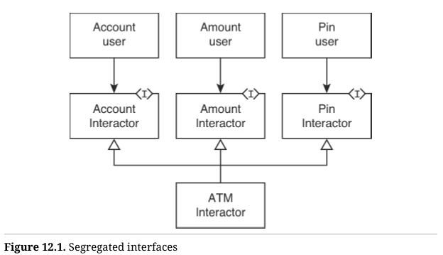
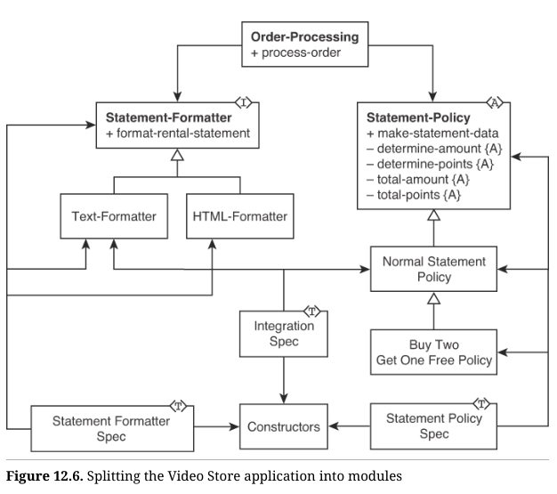

# 数据流

在[第9章面向对象编程](02-Comparative Analysis.md#面向对象编程)中，我提到函数式程序的设计更像是管道而非过程式的。其设计具有明显的数据流倾向。这是因为我们倾向于使用 `map`、`filter` 和 `reduce` 来将列表的内容转换成其他列表，而不是一次处理一个元素来生成结果。

我们可以在之前的许多例子中看到这种倾向，包括[第II部分](02-Comparative Analysis.md)中比较分析的**保龄球游戏**、**八卦的公交车司机**和**工资发放**应用程序。

再举一个例子，考虑 2022 年 Advent of Code 第十天[^1]的这个有趣问题。目标是在一个 6x40 的屏幕上渲染像素。像素从左到右逐个绘制，基于时钟电路。时钟周期从 0 开始计数。如果某个寄存器 `x` 与时钟周期数字匹配，那么适当屏幕位置的像素将被点亮，否则将关闭。

这种方式实际上与老式 CRT[^2] 显示器的工作方式非常类似。你必须在光束扫描屏幕的过程中在正确的时刻激活电子束。因此，你需要将位图中的位与驱动电子束的时钟匹配。如果根据时钟，光束处于第 934 个位置，而位图中的第 934 位被设置，那么你会瞬间激活光束以显示该像素。

Advent of Code 的这个问题更有趣一些。它要求我们模拟一个只有两个指令的简单处理器。第一个指令是 `noop`，它消耗一个时钟周期，但没有其他效果。另一个指令是 `addx`，它接受一个整数参数 `n`，并将其加到处理器的 `x` 寄存器中。这个指令需要两个时钟周期，且仅在这两个周期结束后才会更改 `x` 寄存器。屏幕上的像素会在某个时钟周期内可见，但仅当在该周期开始时，`x` 寄存器与时钟周期号匹配时才会如此。

因此，如果根据时钟，光束位于屏幕位置 23，而在周期 23 的开始时 `x` 寄存器为23，那么该时钟周期将激活光束。

为了稍微增加复杂性，`x` 寄存器与时钟周期的匹配范围被扩展为 22、23 和 24 都会匹配时钟周期 23。换句话说，`x` 寄存器指定了一个三像素宽的窗口。只要时钟周期落在这个窗口内，光束就会被激活。

由于屏幕宽 40 像素、高 6 像素，因此时钟周期与 `x` 的匹配是以 40 为模的。

任务是执行一组指令，并生成六个字符串的列表，每个字符串有 40 个字符，用 `"#"` 表示可见的像素，用 `"."` 表示不可见的像素。

如果你用 Java、C、Go、C++、C# 或其他过程式/面向对象的语言编写这个程序，你可能会创建一个循环，一次迭代一个时钟周期，同时为每个周期积累相应的像素。循环将消费指令并按照指示修改 `x` 寄存器。

以下是一个典型的 Java 示例：

```java
package crt;

public class Crt {
    private int x;
    private String pixels = "";
    private int extraCycles = 0;
    private int cycle = 0;
    private int ic;
    private String[] instructions;
    
    public Crt(int x) {
    	this.x = x;
    }
    
    public void doCycles(int n, String instructions) {
        instructions = instructionsLines.split("\n");
        ic = 0;
        for (cycle = 0; cycle < n; cycle++) {
            setPixel();
            execute();
        }
    }
    
    private void execute() {
        if (instructions[ic].equals("noop"))
        	ic++;
        else if (instructions[ic].startsWith("addx ") && extraCycles == 0) {
        	extraCycles = 1;
    	}
        else if (instructions[ic].startsWith("addx ")
        && extraCycles == 1) {
        	extraCycles = 0;
        	x += Integer.parseInt(instructions[ic].substring(5)^;
        	ic++;
        } else
        	System.out.println("TILT");
    }
    
    private void setPixel() {
        int pos = cycle % 40;
        int offset = pos - x;
        if (offset >= -1 && 1 >= offset)
        	pixels += "#";
        else
        	pixels += ".";
    }
    
    public String getPixels() {
    	return pixels;
    }
    
    public int getX() {
    	return x;
    }
}
```

注意所有被修改的状态。注意它是如何通过逐个时钟周期迭代来填充像素的。还要注意为了考虑 `addx` 需要两个周期来执行，代码中使用了 `extraCycles` 这一机制。

最后，虽然这个程序被很好地分成了几个小的函数，但这些函数都通过可变状态变量相互耦合在一起。这当然是可变类方法的常见情况。

今天我用 Clojure 解决了这个问题，得出的解决方案与上面的 Java 代码非常不同。在阅读时请记得从最后开始，因为 Clojure 程序通常是从底层向上构建的。

```clojure
(ns day10-cathode-ray-tube.core
	(:require [clojure.string :as string]))

(defn noop [state]
	(update state :cycles conj (:x state)))

(defn addx [n state]
	(let [{:keys [x cycles]} state]
		(assoc state :x (+ x n)
					:cycles (vec (concat cycles [x x

(defn execute [state lines]
	(if (empty? lines)
		state
		(let [line (first lines)
			state (if (re-matches #"noop" line)
				(noop state)
				(if-let [[_ n] (re-matches
								#"addx (-?\d+)" line)]
					(addx (Integer/parseInt n) st
					"TILT"))]
		(recur state (rest lines)))))
		
(defn execute-file [file-name]
	(let [lines (string/split-lines (slurp file-name))
		starting-state {:x 1 :cycles []}
		ending-state (execute starting-state lines)]
	(:cycles ending-state)))

(defn render-cycles [cycles]
	(loop [cycles cycles
			screen ""
			t 0]
		(if (empty? cycles)
            (map #(apply str %) (partition 40 40 "" screen))
            (let [x (first cycles)
                    offset (- t x)
                    pixel? (<= -1 offset 1)
                    screen (str screen (if pixel? "#" "."))
                    t (mod (inc t) 40)]
				(recur (rest cycles) screen t)))))

(defn print-screen [lines]
	(doseq [line lines]
		(println line))
	true)

(defn -main []
	(-> "input"
        execute-file
        render-cycles
        print-screen))
```

> TILT 是我最喜欢的错误信息。很久以前，如果你通过物理倾斜弹球机来操纵球，机器就会显示这个信息并取消你的游戏。
>

`execute-file` 函数将文件中的指令列表转换为结果 `x` 值的列表。接着，`render-cycles` 函数将 `x` 值列表转换为像素列表，最后将这些像素分割成 40 字符长度的字符串。

注意，这里没有可变变量。相反，状态值通过各个函数，如同流经管道一样。状态值从 `execute-file` 开始，然后流向 `execute`，接着反复流向 `noop` 或 `addx`，再返回到 `execute`，最后又回到 `execute-file`。在这个流动过程中，每个阶段都从旧的状态值创建出新的状态值，而不改变旧的值。

如果这让你感到熟悉，那就对了。这与我们在命令行 shell 中习惯的管道与过滤器非常相似。数据通过管道进入一个命令，经过该命令转换，然后通过管道流向下一个命令。

下面是我最近在 shell 中使用的一个命令：

```shell
ls -lh private/messages | cut -c 32-37,57-64
```

它列出了 `private/messages` 目录的内容，然后使用 `cut` 命令截取了某些字段。数据从 `ls` 命令流出，通过管道进入 `cut` 命令。这种数据流动的方式与状态值在 `execute`、`addx` 和 `noop` 函数之间流动非常相似。

由于这种流水线处理方式，你应该注意到我的阴极射线管程序被划分为一组小函数，这些函数并没有通过可变状态相互耦合。现存的耦合只是数据格式的耦合，即数据从一个函数流向另一个函数的格式耦合。

最后，注意到在 Java 程序中围绕 `addx` 指令两个周期的那种奇怪处理在这里是不存在的。相反，通过简单地将两个 `x` 值添加到状态的 `:cycles` 元素中，两个周期问题被巧妙地解决了。

当然，我并不一定非要采用数据流风格。我本可以写出一个更接近 Java 算法的 Clojure 算法。但当我在函数式语言中编程时，我不会这样去思考问题。我倾向于数据流解决方案。

Java 和 C# 的一些新功能也适用于数据流风格。但它们显得繁琐，在我看来是生硬地添加到这些语言中的。你的体验可能会有所不同；但当我使用过程式/面向对象语言时，我往往更倾向于迭代而不是使用数据流风格。

换句话说：
***在可变语言中，行为在对象之间流动；在函数式语言中，对象在行为之间流动。***

# 职责

二十多年前，我在面向对象设计的背景下写了关于SOLID原则的文章。由于这一背景，许多人开始将这些原则与面向对象编程联系在一起，并认为这些原则与函数式编程格格不入。这是一个不幸的误解，因为SOLID原则实际上是通用的软件设计原则，它们并不局限于某种特定的编程风格。在本章中，我将努力解释SOLID原则如何应用于函数式编程。

接下来的章节是原则的总结，而不是完整的描述。如果你对更多细节感兴趣，我推荐以下资源：

1. **《敏捷软件开发：原则、模式与实践》**，作者：Robert C. Martin (Pearson, 2002)。
2. **《整洁架构》**，作者：Robert C. Martin (Pearson, 2017)。
3. [Cleancoder.com](http://cleancoder.com/)，这里有很多博客文章和文章可以学习到关于原则和更多内容。
4. [Cleancoders.com](http://cleancoder.com/)，该网站提供了视频，详细解释了每个原则，并通过引人入胜的示例进行讲解。

## 单一职责原则

SRP（单一职责原则）是一个关于关注模块的变更来源的简单声明。而这些变更来源，当然是人。是人提出了软件的变更请求，因此模块需要对这些人负责。

这些人可以被分为称作角色或行为者的群体。一个行为者可以是一个人，或是一群有着相同需求的人。他们提出的变更通常彼此一致。另一方面，不同的行为者有着不同的需求。一位行为者请求的变更会以非常不同的方式影响系统，与其他行为者提出的变更产生的影响大相径庭。这些不同的变更甚至可能互相冲突。

当一个模块需要对多个行为者负责时，来自这些竞争行为者的变更请求可能相互干扰。这种干扰通常导致设计上脆弱性的问题：当进行简单的修改时，系统可能会以意想不到的方式崩溃。

没有什么比系统在做简单功能修改后突然出现惊人的错误更令管理者和客户恐惧的了。如果这种情况反复发生，他们最终的结论只能是开发人员失去了对系统的控制，不知道自己在做什么。

违反 SRP 的情况可以很简单，比如在同一个模块中混合了 GUI 格式化和业务规则代码。也可以很复杂，比如在数据库中使用存储过程来实现业务规则。

以下是一个用 Clojure 编写的违反 SRP 的糟糕示例。我们首先来看测试代码，因为它们能说明问题：

```clojure
(describe "Order Entry System"
	(context "Parsing Customers"
		(it "parses a valid customer"
			(should=
				{:id "1234567"
                :name "customer name"
                :address "customer address"
                :credit-limit 50000}
				(parse-customer
				["Customer-id: 1234567"
                "Name: customer name"
                "Address: customer address"
                "Credit Limit: 50000"])))
                
(it "parses invalid customer"
	(should= :invalid
		(parse-customer
			["Customer-id: X"
            "Name: customer name"
            "Address: customer address"
            "Credit Limit: 50000"]))
	(should= :invalid
		(parse-customer
			["Customer-id: 1234567"
            "Name: "
            "Address: customer address"
            "Credit Limit: 50000"]))
	(should= :invalid
		(parse-customer
			["Customer-id: 1234567"
            "Name: customer name"
            "Address: "
            "Credit Limit: 50000"]))
	(should= :invalid
		(parse-customer
			["Customer-id: 1234567"
            "Name: customer name"
            "Address: customer address"
            "Credit Limit: invalid"])))
(it "makes sure credit limit is <= 50000"
	(should= :invalid
		(parse-customer
            ["Customer-id: 1234567"
            "Name: customer name"
            "Address: customer address"
            "Credit Limit: 50001"])))))
```

第一个测试告诉我们，我们正在将一些文本输入解析为客户记录。该记录包含四个字段：`id`、`name`、`address` 和 `credit-limit`。接下来的四个测试告诉我们有关语法错误的信息，例如输入缺失或格式错误。

最后一个测试是有趣的。它测试了一条业务规则。将业务规则作为解析输入的一部分进行测试，显然违反了**单一职责原则**（SRP）。解析代码可以安全地验证语法错误，但应避免所有语义检查，因为这些检查属于另一个角色的职责。定义输入格式的角色与指定最大允许信用额度[^3]的角色并不相同。

通过这些测试的代码进一步加剧了问题：

```clojure
(defn validate-customer
    [{:keys [id name address credit-limit] :as customer|]
    (if (or (nil? id)
            (nil? name)
            (nil? address)
            (nil? credit-limit))
		:invalid
        (let [credit-limit (Integer/parseInt credit-limit)]
            (if (> credit-limit 50000)
                :invalid
                (assoc customer :credit-limit credit-limit))))
                
(defn parse-customer [lines]

	(let [[_ id] (re-matches #"^Customer-id: (\d{7})$"
							(nth lines 0))
        [_ name] (re-matches #"^Name: (.+)$" (nth lines 1))
        [_ address] (re-matches #"^Address: (.+)$" (nth lines 2))
        [_ credit-limit] (re-matches #"^Credit Limit: (\n+)$
"
									(nth lines 3
(validate-customer
    {:id id
        :name name
        :address address
        :credit-limit credit-limit})))
```

看看 `validate-customer` 函数是如何将语法检查与限制信用额度为 50,000 的语义业务规则混在一起的。这个语义检查应该属于一个完全不同的模块，而不应该与所有那些语法检查纠缠在一起。

更糟的是，设想一个程序员认真地使用 `clojure/spec` 来动态定义 `customer` 类型：

```clojure
(s/def ::id (s/and
				string?
				#(re-matches #"\d+" %)))

(s/def ::name string?)
(s/def ::address string?)
(s/def ::credit-limit (s/and int? #(<= % 50000)))
(s/def ::customer (s/keys :req-un [::id ::name
									::address ::credit-limit]))
```

这个规范适当地限制了客户数据结构，使其在语法上正确；但它同时也强加了一个语义业务规则，即信用额度不得超过 50,000。

为什么我对将信用额度限制与数据结构的语法混在一起感到担忧？原因是我认为数据结构的语法和信用额度的限制可能由不同的角色来指定。而且我预期这些不同的角色会在不同的时间出于不同的原因请求变更。我不希望语法的变更意外地破坏了业务规则。

当然，这引出了一个问题：语义验证应该放在哪里？答案是，语义验证应该放在负责这些验证的角色可能会更改的模块中。例如，如果有一条业务规则规定信用额度不得超过 50,000，那么验证代码应该放在处理其他所有信用额度相关业务的模块中。

**将那些因相同原因、在相同时间发生变化的内容聚集在一起。  
将那些因不同原因或在不同时间发生变化的内容分离开来。**

## 开闭原则

OCP（**开放封闭原则**）最早由 Bertrand Meyer 在他 1988 年的经典著作《面向对象软件构造》中提出。简单来说，它的意思是，软件模块应该**对扩展开放**，但**对修改封闭**。这意味着，你应该设计你的模块，使得在扩展或改变它们的行为时，不需要修改它们的代码。

这听起来可能有点自相矛盾，但实际上这是我们经常做的事情。以 C 语言中的复制程序为例：

```c
void copy() {
    int c;
    while ((c = getchar()) != EOF)
    	putchar(c);
}
```

这个程序从标准输入（stdin）复制字符到标准输出（stdout）。我可以随时向操作系统添加新设备。例如，我可以添加光学字符识别（OCR）和文本转语音合成器。这段程序仍然能够正常运行，并且能够毫无问题地将字符从 OCR 复制到语音合成器，而无需对程序进行修改，甚至不需要重新编译。

这是一个非常强大的理念，它允许我们将高层次的策略与低层次的细节分离，并使得高层次的策略免受低层次细节变更的影响。然而，这要求高层策略通过抽象层来访问低层细节。

在面向对象（OO）程序中，我们通常通过多态接口来创建这个抽象层。在像 Java、C# 和 C++ 这样的静态类型语言中，这些接口是带有抽象方法的类[^4]。高层策略通过这些接口访问实现这些接口或继承这些接口的低层细节。

在像 Python 和 Ruby 这样的动态类型面向对象语言中，这些接口是鸭子类型（duck types）。鸭子类型在语言中没有特定的语法，它们只是高层策略调用、低层细节实现的一组函数签名。动态类型系统通过匹配这些签名在运行时确定多态分派。

一些函数式语言，比如 F# 和 Scala，基于面向对象的基础，因此可以利用该基础的多态接口。但函数式语言长期以来拥有另一种创建 OCP 抽象层的机制：**函数**。

### 函数

考虑一个简单的 Clojure 程序：

```clojure
(defn copy [read write]
    (let [c (read)]
    	(if (= c :eof)
			nil
			(recur read (write c)))))
```

这本质上与用 C 语言编写的复制程序是一样的，只不过读取和写入的函数是作为参数传入的[^5]。然而，开放封闭原则（OCP）的抽象层依然保持完整。

顺便说一下，我使用了以下测试来测试这个程序。我想你会觉得有趣。

```
(def str-in (atom nil))
(def str-out (atom nil))

(defn str-read []
    (let [c (first @str-in)]
        (if (nil? c)
            :eof
            (do
            	(swap! str-in rest)
            c))))
            
(defn str-write [c]
    (swap! str-out str c)
    str-write)
    
(describe "copy"
    (it "can read and write using str-read and str-write"
        (reset! str-in "abcedf")
        (reset! str-out "")
        (copy str-read str-write)
        (should= "abcdef" @str-out)))
```

我使用了 `atom`，因为 I/O 是一个副作用，因此它并不是纯函数式的。毕竟，当你从输入读取或向输出写入时，你实际上是在改变它们的状态。因此，底层的 I/O 函数并非纯函数式，并使用软件事务内存（Software Transactional Memory）来管理状态的变化。

### 带有虚表(Vtables)的对象

对于那些渴望面向对象（OO）的人，你可以使用以下技术将“对象”传递给 `copy`：

```clojure
(defn copy [device]
    (let [c ((:getchar device))]
        (if (= c :eof)
            nil
            (do
                ((:putchar device) c)
                (recur device)))))
```

测试只是用函数加载了设备映射：

```clojure
(it "can read and write using str-read and str-writer"
    (reset! str-in "abcedf")
    (reset! str-out "")
    (copy {:getchar str-read :putchar str-write})
    (should= "abcdef" @str-out))
```

C++ 程序员会认出，`device` 参数实际上就是一个虚表（vtable）——这就是 C++ 中的多态机制。无论如何，显然你可以为 `copy` 程序定义许多不同的设备。你可以扩展 `copy` 的行为，而不需要修改它。

### 多方法

关于这个主题的另一种变体是使用多方法（multi-methods）。许多语言，无论是函数式的还是其他类型的，都以某种方式支持多方法。多方法是另一种形式的鸭子类型，因为它们创建了一组松散的、根据函数签名和参数的“类型”[^6]动态调度的方法。

在 Clojure 中，我们采用了久经考验的调度函数（dispatching function）来指定这种“类型”：

```clojure
(defmulti getchar (fn [device] (:device-type device)))
(defmulti putchar (fn [device c] (:device-type device)))
```

> Clojure 中的**多方法**（multimethods）是一种强大的多态机制，允许根据任意的条件（而不仅仅是对象类型或数量）来选择不同的函数实现。这比传统的面向对象语言中的**方法重载**更加灵活。
>
> ### 多方法的核心概念
>
> 1. **判定函数**（dispatch function）：多方法的判定是基于一个判定函数的结果。这个函数会根据传入的参数，返回一个值，Clojure 根据该值选择合适的具体方法。
> 2. **方法定义**：根据不同的判定函数结果（称为 **dispatch 值**），我们可以定义多个不同的函数实现。每个实现对应一个特定的判定结果。
>
> 可以使用 `defmulti` 定义一个多方法，指定一个判定函数。如：
>
> ```clojure
> (defmulti area 
>   (fn [shape] (:type shape)))  ;; 这是判定函数，根据 shape 的 :type 属性决定具体调用哪个实现
> ```
>
> 这里的 `area` 是一个多方法，判定函数 `(fn [shape] (:type shape))` 将根据 `shape` 的 `:type` 属性决定调用哪个具体的 `area` 实现。
>
> 具体实现如下：
>
> ```clojure
> (defmethod area :circle
>   [shape]
>   (* Math/PI (:radius shape) (:radius shape)))  ;; 针对圆形定义面积计算公式
> 
> (defmethod area :rectangle
>   [shape]
>   (* (:width shape) (:height shape)))  ;; 针对矩形定义面积计算公式
> ```
>
> 调用：
>
> ```clojure
> (area {:type :circle :radius 10})  ;; 返回圆形的面积
> (area {:type :rectangle :width 5 :height 7})  ;; 返回矩形的面积
> ```
>
> 在这里，多方法会根据传入数据的 `:type` 属性值来选择具体的 `area` 实现。

在这里，我们看到 `getchar` 和 `putchar` 被声明为多方法（multi-methods）。每个多方法都有一个调度函数，该函数接受与 `getchar` 和 `putchar` 相同的参数。我们可以修改 `copy` 程序，使其调用这些多方法：

```clojure
(defn copy [device]
    (let [c (getchar device)]
        (if (= c :eof)
        nil
        (do
            (putchar device c)
            (recur device)))))
```

下面是新 `copy` 函数的测试。注意，测试设备不再是包含函数指针的虚表（vtable）。相反，它现在包含输入和输出的 `atom`，以及一个 `:device-type`。多方法将根据这个 `:device-type` 进行调度。

```clojure
(it "can read and write using multi-method"
    (let [device {:device-type :test-device
                    :input (atom "abcdef")
                    :output (atom nil)}]
        (copy device)
        (should= "abcdef" @(:output device))))
```

剩下的就是多方法的实现了，这不应该令人感到惊讶。

```clojure
(defmethod getchar :test-device [device]
    (let [input (:input device)
        	c (first @input)]
        (if (nil? c)
            :eof
            (do
                (swap! input rest)
                c))))
                
(defmethod putchar :test-device [device c]
  (let [output (:output device)]
    (swap! output str c)))
```

这些是当 `:device-type` 为 `:test-device` 时将被调度的实现方法。显然，可以为各种不同的设备创建许多类似的实现方法。这些新设备将扩展 `copy` 程序，而无需进行任何修改。

### 独立部署

我们期望从开放封闭原则（OCP）中获得的一个好处是能够将高层策略和低层细节编译到单独的模块中，并独立部署。在 Java 和 C# 中，这意味着将它们编译为单独的 `jar` 或 `dll` 文件，并能够动态加载。在 C++ 中，我们会编译这些模块并将其二进制文件放入动态加载的共享库中。

上面展示的 Clojure 解决方案未能实现这个目标。高层策略和低层细节无法从两个独立的 `jar` 文件中动态加载。

这在 Java 或 C# 中可能是个大问题，但在 Clojure 中却不是那么严重，因为“加载” Clojure 程序几乎总是涉及到编译[^7]。因此，虽然高层策略和低层细节可能无法从 `jar` 文件中动态加载，但它们是从源文件中动态编译和加载的。因此，大部分独立部署 `jar` 文件的好处仍然得以保留。

然而，如果你绝对必须拥有完全独立的部署能力，还有另一个选择。你可以使用 Clojure 的协议（protocols）和记录（records）：

```clojure
(defprotocol device
    (getchar [_])
    (putchar [_ c]))
```

协议（protocol）将成为一个 Java 接口，可以独立编译为 `jar` 文件以供动态加载。协议的实现（如下所示）同样可以独立编译和加载：

```clojure
(defrecord str-device [in-atom out-atom]
    device
    (getchar [_]
        (let [c (first @in-atom)]
            (if (nil? c)
                :eof
                (do
                    (swap! in-atom rest)
                	c))))
    (putchar [_ c]
    	(swap! out-atom str c)))
    	
(describe "copy"
	(it "can read and write using str-read and str-write"
		(let [device (->str-device (atom "abcdef") (atom nil))]
            (copy device)
            (should= "abcdef" @(:out-atom device)))))
```

> 在 Clojure 中，**协议**（protocols）和**记录**（records）是用于处理多态和数据结构的概念。它们提供了一种简洁且高效的方式来实现类似面向对象语言中的接口和类的功能，但更加灵活且具函数式编程的风格。
>
> ### 1. **协议（Protocols）**
>
> Clojure 中的协议类似于面向对象编程中的接口。它定义了一组行为（方法），不同的数据类型可以实现这些行为。这为多态提供了一种高效的实现方式。
>
> #### 定义协议
>
> 你可以用 `defprotocol` 定义一个协议，协议中包含一个或多个方法签名（但不包含具体实现）。
>
> ```clojure
> (defprotocol Shape
>   (area [this])  ;; 计算面积
>   (perimeter [this]))  ;; 计算周长
> ```
>
> **`Shape`** 是一个协议，定义了两个方法：`area` 和 `perimeter`。
>
> 每个方法的第一个参数通常是 `this`，表示调用方法的对象（类似于面向对象编程中的 `this` 或 `self`）。
>
> #### 实现协议
>
> 可以用 `extend-protocol` 或 `extend-type` 来为不同的数据类型实现该协议的方法。
>
> ```clojure
> (defrecord Circle [radius])
> 
> (extend-type Circle
>   Shape
>   (area [this]
>     (* Math/PI (* (:radius this) (:radius this))))  ;; 计算圆的面积
>   (perimeter [this]
>     (* 2 Math/PI (:radius this))))  ;; 计算圆的周长
> ```
>
> - `Circle` 是一个记录（稍后会解释）。
> - 使用 `extend-type` 实现了 `Shape` 协议中的 `area` 和 `perimeter` 方法。对于 `Circle` 类型的数据，`area` 会计算圆的面积，而 `perimeter` 会计算周长。
>
> #### 使用协议
>
> 定义并实现协议后，可以像这样使用协议的方法：
>
> ```clojure
> (def my-circle (Circle. 5))  ;; 创建一个半径为5的圆
> (area my-circle)  ;; 计算面积，返回 78.53981633974483
> (perimeter my-circle)  ;; 计算周长，返回 31.41592653589793
> ```
>
> Clojure 会根据 `my-circle` 的类型自动调用对应的 `Shape` 实现。
>
> ### 2. **记录（Records）**
>
> **记录** 是 Clojure 中的一种数据结构，用于定义带有固定字段的高效数据类型。记录是基于 Java 对象实现的，具有比普通 Clojure 的 `map` 更高的性能，并且可以与协议配合使用来提供类似于面向对象编程中的类和接口的行为。
>
> #### 定义记录
>
> 使用 `defrecord` 来定义一个记录。记录类似于 Clojure 的 `map`，但字段是固定的，并且性能更高。
>
> ```clojure
> (defrecord Circle [radius])
> ```
>
> 这里定义了一个名为 `Circle` 的记录，包含一个字段 `radius`，表示圆的半径。
>
> #### 创建记录实例
>
> 你可以通过调用记录的构造函数来创建记录实例：
>
> ```clojure
> (def my-circle (Circle. 10))  ;; 创建一个半径为10的圆
> ```
>
> 记录实例可以像 `map` 一样通过字段名来访问字段值：
>
> ```clojure
> (:radius my-circle)  ;; 返回 10
> ```
>
> - 记录是不可变的，类似于 `map`，但它的字段是固定的。
> - 记录的字段访问效率比 `map` 高。
> - 记录可以实现协议（正如前面所展示的），为特定的数据类型提供行为（类似于面向对象语言中的类实现接口）。
>
> ### 总结
>
> - **协议** 提供了一种类似于面向对象编程中接口的机制，允许定义一组行为，不同类型的数据结构可以实现这些行为。
> - **记录** 是一种高效的数据结构，类似于 `map`，但字段固定，并且可以通过协议赋予行为。记录通常与协议结合使用，形成类似于面向对象编程中的“类+接口”模式。
>
> 通过协议和记录，Clojure 提供了一种既有函数式编程风格，又支持灵活多态的编程模型，适合处理复杂的数据和行为抽象。

请注意测试中的 `->str-device` 函数。这实际上是实现了 `device` 协议的 `str-device` 类的 Java 构造函数。还请注意，我像之前的示例一样将 `atom` 加载到设备中。

事实上，我并没有更改 `copy` 程序来使该示例正常运行。`copy` 程序与多方法示例中的代码完全相同。现在，这就是开放封闭原则（OCP）的作用！

如果 Clojure 的协议/记录机制让你觉得像面向对象（OO），那是因为它确实是面向对象的。JVM 是面向对象的基础，而 Clojure 很好地构建在这个基础之上。

## 里氏替换原则

任何支持开放封闭原则 (OCP) 的语言也必须支持里氏替换原则 (LSP)。这两个原则是相互关联的，因为每次违反 LSP 都会隐含着违反 OCP 的可能性。

LSP 首次由 Barbara Liskov 于 1988[^8] 年提出，她对子类型给出了一个或多或少的形式定义。本质上，她的定义指出，子类型在任何使用其基类型的程序中必须可以被替换为基类型。

为了进一步说明这一点，假设我们有一个使用类型 `employee` 的程序 `pay`：

```clojure
(defn pay [employee pay-date]
    (let [is-payday? (:is-payday employee)
        calc-pay (:calc-pay employee)
        send-paycheck (:send-paycheck employee)]
    (when (is-payday? pay-date)
        (let [paycheck (calc-pay)]
        	(send-paycheck paycheck)))))
```

请注意，我在这里使用了虚函数表（vtable）的方法来创建类型。还要注意，`pay` 函数无法看到类型中的任何数据。`pay` 函数唯一能看到的就是 `employee` 类型中的方法。这难道还不够面向对象吗？

下面是使用该类型的测试代码。注意 `make-test-employee` 函数是如何创建一个对象的，该对象使用鸭子类型来符合 `employee` 类型的要求：

```clojure
(defn test-is-payday [employee-data pay-date]
	true)
	
(defn test-calc-pay [employee-data]
	(:pay employee-data))
	
(defn test-send-paycheck [employee-data paycheck]
	(format "Send %d to: %s at: %s"
            paycheck
            (:name employee-data)
            (:address employee-data)))
(defn make-test-employee [name address pay]
	(let [employee-data {:name name
                        :address address
                        :pay pay}
                        
		employee {:employee-data employee-data
                :is-payday (partial test-is-payday
                					employee-data
                :calc-pay (partial test-calc-pay employee-data)
                :send-paycheck (partial test-send-paycheck
										employee-data)}]
	employee))

(describe "Payroll"
	(it "pays a salaried employee"
		(should= "Send 100 to: name at: address"
				(pay (make-test-employee "name" "address" 100)
					:now))))
```

请注意，`make-test-employee` 函数使用了实现指针（PIMPL）[^9]模式将数据隐藏在 `:employee-data` 字段中，并只公开方法。最后，注意所有多态方法的第一个参数都是 `employee-data`。哦，这太面向对象了！但同时也是完全函数式的。

显然，我可以创建许多不同种类的员工对象，并将它们传递给 `pay` 函数，而无需修改 `pay` 函数。这就是**开放/封闭原则**（OCP）。

然而，为了实现这一点，我必须非常小心，确保我创建的每一个员工对象都符合 `pay` 函数的期望。如果其中一个方法做了 `pay` 函数不期望的事情，`pay` 函数将会出现故障。例如，下面这个测试就失败了：

```clojure
(it "does not pay an employee whose payday is not today"
    (should-be-nil
    	(pay (make-later-employee "name" "address" 100)
			:now)))
```

它失败的原因是 `make-later-employee` 不符合 `pay` 函数对 `:is-payday` 方法的期望。如下面所示，它返回了 `:tomorrow`，而不是像应该的那样返回 `false`：

```clojure
(defn make-later-employee [name address pay]
	(let [employee (make-test-employee name address pay)
			is-payday? (partial (fn [_ _] :tomorrow)
								(:employee-data employee))]
		(assoc employee :is-payday is-payday?)))
```

这就是一个 Liskov 替换原则（LSP）违反的例子。

现在，假设你是 `pay` 函数的作者，你的任务是调试为什么某些员工在错误的时间收到了工资。你发现许多员工对象使用了 `:tomorrow` 这个约定，而它们应该返回布尔值。你会怎么做？[^10]

你可以修复所有这些员工对象，或者你可以在 `pay` 函数中添加一个额外的条件：

```clojure
(defn pay [employee pay-date]
    (let [is-payday? (:is-payday employee)
            calc-pay (:calc-pay employee)
            
            send-paycheck (:send-paycheck employee)]
    	(when (= true (is-payday? pay-date))
    		(let [paycheck (calc-pay)]
    			(send-paycheck paycheck)))))
```

是的，这确实很糟糕[^11]。它也是对OCP（开闭原则）的违反，因为我们由于低层细节的误行为而修改了高层策略。

**ISA规则**

在面向对象的文献中，通常使用"ISA"（发音并意为“is a”）来描述子类型。用这种术语来描述上面的情况时，我们会说 `test-employee` 是一个 `employee`，而 `later-employee` 也是一个 `employee`。这种用法可能会让人困惑。

首先，`later-employee` 并不是一个 `employee`，因为它不符合 `pay` 函数的期望；而是 `pay` 函数和所有其他操作 `employee` 的函数定义了什么是 `employee` 类型。

其次，或许更重要的是，"ISA" 这个术语可能会产生深刻的误导性。古老且备受推崇的"正方形/矩形悖论"经常被用来说明这一点。

假设我们有一个描述矩形的对象。在 Clojure 中，它可能看起来像这样：

```clojure
(defn make-rect [h w]
	{:h h :w w})
```

对这个矩形对象的一个简单测试可能看起来像这样：

```clojure
(it "calculates proper area after change in size"
	(should= 12 (-> (make-rect 1 1) (set-h 3) (set-w 4) area)))
```

为了让它工作，我们需要 `set-h`、`set-w` 和 `area` 函数，如下所示：

```clojure
(defn set-h [rect h]
	(assoc rect :h h))

(defn set-w [rect w]
	(assoc rect :w w))

(defn area [rect]
	(* (:h rect) (:w rect)))
```

这里没有什么令人惊讶的。矩形对象是不可变的。`set-h` 和 `set-w` 函数只是创建了带有更改后的参数的新矩形。

那么，让我们稍微扩展一下，创建一个使用矩形的小系统。以下是测试：

```clojure
(describe "Rectangle"
	(it "calculates proper area and perimeter"
		(should= 25 (area (make-rect 5 5)))
		(should= 18 (perimeter (make-rect 4 5)))
		(should= 12 (-> (make-rect 1 1) (set-h 3) (set-w 4) area)))
	
	(it "minimally increases area"
		(should= 15 (-> (make-rect 3 4) minimally-increase-area area))
        (should= 24 (-> (make-rect 5 4) minimally-increase-area area))
        (should= 20 (-> (make-rect 4 4) minimally-increase-area area))
```

以及通过这些测试的函数：

```clojure
(defn perimeter [rect]
	(let [{:keys [h w]} rect]
		(* 2 (+ h w))))

(defn minimally-increase-area [rect]
	(let [{:keys [h w]} rect]
		(cond
			(>= h w) (make-rect (inc h) w)
            (> w h) (make-rect h (inc w))
            :else :tilt)))
```

> 这段代码对 map 进行了解构成命名的组件。在这种情况下，它相当于 `(let [h (:h rect) w (:w rect)] …`

同样，这里没有什么特别让人意外的。也许你对 `minimally-increase-area` 函数感到困惑。这个函数只是通过最小的整数量增加矩形的面积[^12]。

现在让我们假设这个系统已经运行了多年，并且非常成功。但最近，这个系统的客户开始要求使用正方形。我们如何将正方形添加到系统中？

如果我们应用 ISA 规则，我们可能会认为正方形是一个矩形，因此，我们应该让接受矩形的函数也接受正方形。在 Java 中，我们可能通过从 `Rectangle` 类派生 `Square` 类来实现这一点。在 Clojure 中，我们可以通过简单地创建边长相等的矩形来实现这一点：

```clojure
(defn make-square [side]
	(make-rect side side))
```

这应该让我们感到有点不安，因为正方形对象的大小与矩形对象的大小相同。正方形类型的对象本应该更小一些，因为它们不需要同时存储高度和宽度。但是，内存便宜，而且我们希望保持简单，对吧？

问题是，我们所有的测试还会通过吗？当然，它们应该通过，因为我们的正方形实际上只是矩形（啊，这就是 ISA 规则！）。

这些测试都顺利通过：

```clojure
(should= 36 (area (make-square 6)))
(should= 20 (perimeter (make-square 5)))
```

这个测试也通过了，但它让人有点困扰，因为某种程度上，“正方形”的特性丢失了：

```clojure
(should= 12 (-> (make-square 1) (set-h 3) (set-w 4) area))
```

> `->` 是 Clojure 中的 **线程宏**，也称为 **单向线程宏**，它用于简化函数调用的嵌套。在这里，`->` 会将第一个表达式的结果作为第二个表达式的第一个参数，然后将第二个表达式的结果作为第三个表达式的第一个参数，依次类推。
>
> 具体来说，`->` 的工作方式是：
>
> ```
> (-> x f g h)
> ```
>
> 展开等效于：
>
> ```
> (h (g (f x)))
> ```
>
> 它把前一个函数的结果传递给下一个函数。

当 `set-h` 和 `set-w` 函数被传入一个正方形时，它们并不会返回一个正方形。这有点奇怪，但从某种离奇的方式来看，这其实有道理。我是说，如果你仅仅改变正方形的高度而不改变宽度，它就不再是一个正方形了，对吧？

如果你现在感到有些疑惑或隐约的不安，那你应该仔细思考一下这个感觉。

不管怎样，关于我们 `minimally-increase-area` 的测试呢？它通过了吗？

```
(should= 30 (-> (make-square 5) minimally-increase-area area))
```

是的，它也通过了。当然，这也应该通过，因为函数只是在需要时增加高度或宽度。

所以看起来我们完成了，这一切运行得很好！

### 不对！

几天后，客户打电话给我们，他非常不满。他一直在尝试最小化增加他的正方形面积，但就是不管用。

“当我试图增加一个5×5的正方形面积时，”他抱怨道，“我得到的是一个面积为30的矩形。我需要的是一个面积为36的正方形！”

糟糕，看起来我们猜错了。这就是一个LSP（里氏替换原则）违反的例子。我们创建了一个不符合使用基类的函数预期的子类。**minimally-increase-area**函数的预期是高度和宽度可以独立修改。但根据我们的客户的说法，这对正方形来说是不成立的。

那么，我们该怎么办呢？

我们可以给对象添加一个`:type`字段，并让构造函数分别为正方形和矩形对象赋值为`:square`或`:rectangle`。当然，我们还需要在**minimally-increase-area**函数中加入一个if语句。此外，还得修改**set-h**和**set-w**，使它们在改变高度或宽度时，将类型更改为`:rectangle`。但这些修改会违反OCP（开闭原则），因为每次违反LSP，都会潜在地违反OCP。

我把其他解决方案留给你作为练习。你可以尝试使用多方法（multi-methods），也可以尝试使用协议和记录（protocols and records），还可以试试虚函数表（vtables）。或者，你也可以将这两种类型完全分开，永远不要把正方形传递给接受矩形的函数。

### 代表原则

我更喜欢最后一个选项。因为我不太赞同“ISA”规则。你看，虽然在几何学上正方形确实是矩形，但我的代码中的对象并不是实际的矩形或正方形。我的代码中有代表正方形和矩形的对象，但它们并不是几何意义上的正方形或矩形。这里有个关于“代表”的关键点：

**事物的代表并不共享其所代表事物的关系。**

仅仅因为在几何学中正方形是矩形，并不意味着代码中的正方形对象就是矩形对象。这种关系不再共享，因为正方形类型的对象并不像矩形类型的对象那样表现。

当你在现实世界中看到两个明显通过“is a”连接的对象时，你可能会倾向于在代码中创建一个子类型关系。对此你需要小心。你可能会因此违反“代表原则”，进而违反 LSP。

## 接口隔离原则

该原则的名称源自静态类型的面向对象语言。在描述接口隔离原则（ISP）时，我通常使用的例子非常适合像 Java、C# 和 C++ 这样的语言，因为这些语言依赖于声明的接口。而在像 Ruby、Python、JavaScript 和 Clojure 这样的动态类型语言中，这些例子并不特别适用，因为在这些语言中，接口是未声明的，已经通过“鸭子类型”（duck typing）进行了隔离。

例如，考虑下面这个Java接口：

```java
interface AtmInteractor {
    void requestAccount();
    void requestAmount();
    void requestPin();
}
```

在这个例子中，三个方法绑定在了 `AtmInteractor` 接口中。任何使用该接口的用户因此都依赖于所有这三个方法，即便用户只调用其中的一个方法。因此，用户依赖了超出其实际需要的部分。如果其中一个方法的签名发生变化，或者该接口中添加了其他方法，那么该用户将不得不重新编译和重新部署，这使得设计变得不必要地脆弱。

我们在静态类型的面向对象语言中通过将接口进行隔离来解决这个问题，如下所示：

```java
interface AccountInteractor {
	void requestAccount();
}

interface AmountInteractor {
	void requestAmount();
}

interface PinInteractor {
	void requestPin();
}
```

然后，每个用户只需依赖它们需要调用的方法，而实现类则可以多重实现这些接口：

```java
public class AtmInteractor implements AccountInte,
                                    AmountInter,
                                    PinInteract
    void requestAccount() {…};
    void requestAmount() {…};
    void requestPin() {…};
}
```

也许 Figure 12.1 中的 UML 图能够让这一点更清晰。通过隔离接口，三个用户只依赖它们需要的方法，而这些方法可以由一个类实现。



在 Clojure 中，我们可以使用鸭子类型技术来解决这个问题：

```clojure
(defmulti request-account :interactor)
(defmulti request-amount :interactor)
(defmulti request-pin :interactor)
```

这三个多方法并没有绑定在一个声明下。实际上，它们甚至不需要放在同一个源文件中。它们可以在与其功能相关的模块中单独声明。因此，如果其中一个方法的签名发生了变化，或者新增了一个多方法，那么未改变的多方法的用户将不会受到影响。如果它们是预编译的，也不需要重新编译[^13]。

这意味着在像 Clojure 这样的动态类型语言中，避免依赖不需要的内容更容易。但这并不意味着该原则不适用。

### 不要依赖你不需要的东西

回到这个原则的名称。接口隔离原则（ISP）中的“接口”一词不仅仅指 Java、C# 和 C++ 中的接口类，而是更广泛意义上的接口。模块的“接口”指的是该模块中所有访问点的列表。

Java 和 C#（以及通过强约定的 C++）是基于类的语言，其中类和源文件之间存在强耦合。尤其是 Java，要求每个源文件必须以该源文件中声明的唯一公共类命名。这种设置自然会导致 ISP 试图避免的情况：方法组被耦合在一个单一模块中，而用户会依赖于这些模块中的所有方法，即使他们实际上只需要其中的一部分。除非设计师非常小心，否则这些用户将会依赖于不必要的部分。

像 Ruby、Python 和 Clojure 这样的动态类型语言没有这种类到模块的约束。你可以在任意源文件中声明任何你想要的内容。如果你愿意[^14]，甚至可以将整个应用程序写在一个源文件中！因此，在这些语言中，更容易导致用户依赖不必要模块的情况。

这不仅是函数式语言特有的情况，也不是函数式语言所能避免的问题。设计师们很容易将各种不必要的访问点混入模块的接口中，而这些访问点大多数用户并不需要。

### 为什么？

为什么我们要关心依赖包含我们不需要的模块？为什么当我们只使用了模块中的某个函数时，还要在意这个模块是否包含我们不需要的其他部分？

在静态类型语言中，这样的代价可能非常高昂。因为即便我们不使用某个函数，但一旦它的签名发生改变，我们的模块也可能不得不重新编译和重新部署。如果我们的模块属于一个更大的二进制组件（例如一个 jar 文件），那么整个组件都可能需要重新部署。对于这种不必要的耦合，严谨的设计师应该格外小心。

在动态类型语言中，代价虽较小，但仍然存在。在 Clojure 等语言中，模块之间的源代码依赖必须保持无环。一个模块的函数越多，模块之间的依赖关系就越复杂，从而增加了模块之间形成循环依赖的可能性[^15]。

但或许最好的理由是，限制不必要依赖的模块结构更加清晰简洁。这表明设计者仔细考虑过如何将关注点进行适当分离并降低模块间的耦合。读你代码的人会因为你这种细心的设计而感到欣慰。

### 总结

ISP（接口隔离原则）的真正含义是：

*将那些一起使用的东西放在一起。*

*将那些分开使用的东西分开。*

*不要依赖你不需要的东西。*

## 依赖倒置原则

在 SOLID 原则中，OCP（开放封闭原则）可以说是核心道德准则，SRP（单一职责原则）则是组织结构的关键，而 LSP（里氏替换原则）和 ISP（接口隔离原则）就像是提醒我们避免错误的警示标志。而 DIP（依赖倒置原则）则是所有这些原则背后的基础机制。在几乎每个违反原则的情况下，解决方案通常涉及倒置一个或多个关键依赖关系。

在早期，软件的构建方式是完全受限的，并且依赖关系是平行的。源代码依赖和运行时依赖是并行存在的。其结构如图12.2所示。


虚线箭头代表的是运行时依赖，显示高层模块依赖于中层模块，而中层模块则依赖低层模块。实线箭头代表源代码依赖，显示每个源代码模块依赖它所调用的模块。这些源代码依赖通过 `#include`、`import`、`require` 和 `using` 等语句显式地声明了下游的源文件。

在那些过去的年代，这两种依赖关系总是[^16]平行的。如果某个模块在运行时依赖另一个模块，那么它在源代码中也依赖那个模块。

这意味着，高层策略总是不可避免地依赖于低层细节。仔细想一想这个问题的深远影响。

到了 60 年代末，Ole-Johan Dahl 和 Kristen Nygaard 在 ALGOL 编译器中将一个数据结构[^17]从栈移到堆中，结果发现了面向对象编程（OO）[^18]。正是这个发现让程序员们能够更轻松且安全地倒置依赖关系。

又过了25年，面向对象语言才逐渐进入主流。但自那时起，几乎所有程序员都能够轻松地打破这种依赖关系的平行结构，正如图12.3所示。


HL1 依赖于 ML1 中的函数 F() 在运行时执行；但是，HL1 并没有对 ML1 的源代码依赖关系，无论是直接的还是传递的。相反，它们都依赖于接口 I。

在动态类型语言中，接口 I 并不会以源代码模块的形式存在。相反，它会作为一个鸭子类型，HL1 和 ML1 都会符合这个类型。

这种能够将任何源代码依赖关系倒置的能力，为我们提供了巨大的灵活性。我们可以轻松且安全地重新安排软件的源代码依赖关系，从而确保高层模块不依赖于低层模块。

这使我们能够构建出如图 12.4 所示的结构。


在这里，我们看到高层的业务规则在运行时依赖于用户界面（UI）和数据库，但在源代码上没有对这些模块的依赖。这种 DIP（依赖倒置原则）的应用意味着 UI 和数据库只是业务规则的插件，可以轻松替换为不同的实现，而不会影响业务规则，从而符合 OCP（开放封闭原则）。

实际上，UI 和数据库都在实现业务规则中定义的接口。业务规则依赖这些接口进行操作，使得控制流可以向外扩展到 UI 和数据库，同时保持源代码依赖倒置，即指向业务规则（见图12.5）。


请注意，所有的依赖关系都指向抽象。这引导我们得出描述 DIP 的一种方式：
尽可能使所有的源代码依赖指向抽象。

### 旧时光的回顾 

但理论讲得够多了，让我们看看它是如何在实践中发挥作用的。我将借用我朋友兼导师 Martin Fowler 的一个怀旧例子。他在他那本精彩的书《重构》的第一版中介绍了这个视频租赁店的例子[^19]。当然，我会用 Clojure 而不是 Java 来实现。 

以下是测试内容：

```clojure
(describe "Video Store"
	(with customer (make-customer "Fred"))
	(it "makes statement for a single new release"
		(should= (str "Rental Record for Fred\n"
                        "\tThe Cell\t9.0\n"
                        "You owed 9.0\n"
                        "You earned 2 frequent renter points\n")
                (make-statement
                	(make-rental-order
                		@customer
                		[(make-rental
                			(make-movie "The Cell" :new-release)
                			3)]))))
                			
(it "makes statement for two new releases"
	(should= (str "Rental Record for Fred\n"
                "\tThe Cell\t9.0\n"
                "\tThe Tigger Movie\t9.0\n"
                "You owed 18.0\n"
                "You earned 4 frequent renter points\n")
            (make-statement
            	(make-rental-order
					@customer
                    [(make-rental
                    	(make-movie "The Cell" :new-release)
                    	3)
					(make-rental
						(make-movie "The Tigger Movie" :new-release)
						3)]))))
						
(it "makes statement for one childrens movie"
	(should= (str "Rental Record for Fred\n"
                    "\tThe Tigger Movie\t1.5\n"
                    "You owed 1.5\n"
                    "You earned 1 frequent renter points\n")
                (make-statement
                	(make-rental-order
                        @customer
                        [(make-rental
                            (make-movie "The Tigger Movie" :childrens)
                            3)]))))
                            
(it "makes statement for several regular movies"
    (should= (str "Rental Record for Fred\n"
                    "\tPlan 9 from Outer Space\t2.0\n"
                    "\t8 1/2\t2.0\n"
                    "\tEraserhead\t3.5\n"
                    "You owed 7.5\n"
                    "You earned 3 frequent renter points\n")
                (make-statement
                    (make-rental-order
                        @customer
                        [(make-rental
                            (make-movie "Plan 9 from Outer Space" :regular)
                            1)
                        (make-rental
                            (make-movie "8 1/2", :regular)
                            2)
                        (make-rental
                            (make-movie "Eraserhead" :regular)
                            3)])))))
```

如果你读过《重构》第一版，这段代码看起来应该相当熟悉。本质上，我们有一个简单的报表生成器，用于计算并格式化租赁订单的报表。 

你最先注意到的一点应该是测试中令人恐怖的单一职责原则（SRP）违背。那些测试将业务规则与报表的构建和格式化耦合在一起。如果市场部决定对报表格式做出哪怕是微小的修改，所有测试都将失败。

举个例子，假设我们将报表的开头从“Rental Record for”改为“Rental Statement for”，其影响如何？  

这种单一职责原则的违背让测试变得非常脆弱。为了解决这个问题，我们需要将报表格式化测试与业务规则测试分开。

为此，我将测试分为三个不同的模块：一个用于测试计算，另一个用于测试格式化，最后一个用于集成测试。  

以下是 statement-calculator（报表计算器）测试。从现在开始，我会包含所有的 `ns`[^20] 声明，这样你可以看到模块名称及其源码依赖。  

```clojure
(ns video-store.statement-calculator-spec
    (:require [speclj.core :refer :all]
    			[video-store.statement-calculator :refer :all]))
    (declare customer)
    
(describe "Rental Statement Calculation"
    (with customer (make-customer "Fred"))
    
    (it "makes statement for a single new release"
		(should= {:customer-name "Fred"
                    :movies [{:title "The Cell"
                    			:price 9.0}]
                    :owed 9.0
                    :points 2}
                    (make-statement-data
                    	(make-rental-order
                    		@customer
                            [(make-rental
                                (make-movie "The Cell" :new-release)
                                3)]))))
                             
(it "makes statement for two new releases"
    (should= {:customer-name "Fred",
                :movies [{:title "The Cell", :price
                		{:title "The Tigger Movie"
                :owed 18.0,
                :points 4}
                (make-statement-data
                	(make-rental-order
                        @customer
                        [(make-rental
                            (make-movie "The Cell" :new-release)
                            3)
                        (make-rental
                            (make-movie "The Tigger Movie" :new-release)
                            3)]))))
                          
(it "makes statement for one childrens movie"
    (should= {:customer-name "Fred",
                :movies [{:title "The Tigger Movie", :price 1.5}],
                :owed 1.5,
                :points 1}
                (make-statement-data
                    (make-rental-order
                        @customer
                        [(make-rental
                            (make-movie "The Tigger Movie" :childrens)
                            3)]))))
                          
(it "makes statement for several regular movies"
    (should= {:customer-name "Fred",
                :movies [{:title "Plan 9 from Outer Space",
                			:price 2.0}
                {:title "8 1/2", :price 2.0}
                {:title "Eraserhead", :price 3.5}],
                :owed 7.5,
                :points 3}
                (make-statement-data
                    (make-rental-order
                        @customer
                        [(make-rental
                            (make-movie "Plan 9 from Outer Space" :regular)
                            1)
                          (make-rental
                            (make-movie "8 1/2", :regular)
                            2)
                           (make-rental
                            (make-movie "Eraserhead" :regular)
                            3)])))))
```

这里我们所做的是用一个包含报表所有数据的数据结构来替换格式化的租赁报表。这使我们能够将格式化与计算分离，如 statement-calculator 实现中所示：

```clojure
(ns video-store.statement-calculator)

(defn make-customer [name]
	{:name name})
    	
(defn make-movie [title type]
	{:title title
	:type type})
	
(defn make-rental [movie days]
    {:movie movie
    :days days})
    
(defn make-rental-order [customer rentals]
    {:customer customer
    :rentals rentals})
    
(defn determine-amount [rental]
    (let [{:keys [movie days]} rental
    		type (:type movie)]
    	(condp = type
    		:regular
    		(if (> days 2)
                (+ 2.0 (* (- days 2) 1.5))
                2.0)
                
            :new-release
            (* 3 0 days)
            
            :childrens
            (if (> days 3)
            	(+ 1.5 (* (- days 3) 1.5))
            	1.5))))
            	
(defn determine-points [rental]
	(let [{:keys [movie days]} rental
            type (:type movie)]
    	(if (and (= type :new-release)
            		(> days 1))
          2
          1)))
          
(defn make-statement-data [rental-order]
    (let [{:keys [name]} (:customer rental-order)
    		{:keys [rentals]} rental-order]
    	{:customer-name name
    	:movies (for [rental rentals]
                {:title (:title (:movie rental))
                :price (determine-amount rental)}
        :owed (reduce + (map determine-amount rentals))
        :points (reduce + (map determine-points rentals))}))
```

这个实现比之前更简单，并且很好地进行了封装。注意 `ns` 声明显示该模块没有任何源代码依赖。模块中的所有内容都与报表数据的计算相关，但这里没有任何涉及报表格式化的提示。

格式化测试非常简单：

```clojure
(ns video-store.statement-formatter-spec
	(:require [speclj.core :refer :all]
				[video-store.statement-formatter :ref

(describe "Rental Statement Format"
    (it "Formats a rental statement"
        (should= (str "Rental Record for CUSTOMER\n"
                        "\tMOVIE\t9.9\n"
                        "You owed 100.0\n"
                        "You earned 99 frequent renter points\n")
                (format-rental-statement
                    {:customer-name "CUSTOMER"
                    :movies [{:title "MOVIE"
                    			:price 9.9}]
                    :owed 100.0
                    :points 99}))))
```

这段代码应该不言自明。我们只是确保能够格式化由 `statement-calculator` 模块生成的数据。实现也非常简单：

```clojure
(ns video-store.statement-formatter)

(defn format-rental-statement [statement-data]
    (let [customer-name (:customer-name statement-data)
            movies (:movies statement-data)
            owed (:owed statement-data)
            points (:points statement-data)]
        (str
            (format "Rental Record for %s\n" customer-name)
            (apply str
                    (for [movie movies]
                        (format "\t%s\t%.1f\n"
                                (:title movie)
                                (:price movie))))
            (format "You owed %.1f\n" owed)
            (format "You earned %d frequent renter points"))))
```

再次，我们拥有一个很好封装的模块，没有任何源代码依赖。

为了确保这两个模块能够如预期那样协同工作，我添加了一个简单的集成测试：

```clojure
(ns video-store.integration-specs
	(:require [speclj.core :refer :all]
                [video-store.statement-formatter :refer :all]
                [video-store.statement-calculator :refer :all]))
                
(describe "Integration Tests"
	(it "formats a statement for several regular movies"
		(should= (str "Rental Record for Fred\n"
                        "\tPlan 9 from Outer Space\t2.0\n"
                        "\t8 1/2\t2.0\n"
                        "\tEraserhead\t3.5\n"
                        "You owed 7.5\n"
                        "You earned 3 frequent renter points\n")
                (format-rental-statement
                    (make-statement-data
                        (make-rental-order
                            (make-customer "Fred")
                            [(make-rental
                                (make-movie
                                	"Plan 9 from Outer Space" :regular)
                                1)
                        	(make-rental
                                (make-movie "8 1/2", :regul
                                2)
                            (make-rental
                                (make-movie "Eraserhead" :regular)
                                3)]))))))
```

从单一职责原则（SRP）的角度来看，这已经好多了。如果市场部想对报表格式进行一些小改动，只有格式化和集成测试会失败，计算部分的测试不会受到影响。在像这个这样的示例中，这似乎并不是一个多大的胜利。但是在一个真实的应用程序中，测试数量可能达到数千，这样的设计会是非常大的优势。

我们也保护了业务规则的更改。如果财务部门决定需要修改价格的计算方式，格式化测试将不会受到影响，只有计算和集成测试会受到影响。

### 依赖倒置原则（DIP）违规

在整个优化过程中，你是否注意到有违反依赖倒置原则（DIP）的地方？可能你没发现，因为问题不在生产代码中，而是在集成测试中。

看看 `ns` 声明部分。你是否看到那两行代码引用了 `statement-formatter` 和 `statement-calculator`？这些引用让测试模块对这两个具体实现产生了源代码依赖。这意味着测试模块——作为一个高层策略——依赖了低层的具体实现，而这是典型的依赖倒置原则（DIP）违规。

也许你会感到疑惑：测试不是应该是最底层的内容吗？它怎么会是高层策略？测试不就是直接操作底层代码吗？

虽然测试确实是最底层的技术细节，但集成测试有些特殊，它实际上起到了高层策略的作用。再看看集成测试的内容，它做的事情正是应用程序高层策略应该做的。它调用了 `make-statement-data` 函数，然后将结果传递给了 `format-rental-statement` 函数。由于这两个函数是具体的实现，因此集成测试的这种结构意味着我们生产代码的高层策略同样存在对低层实现的依赖，这就违反了 DIP。

我们在测试中是否总是需要考虑 DIP？通常来说，意识到这个问题是有帮助的，但并不总是需要严格遵守。有时候，让测试直接依赖具体实现可能是合理的选择。然而，如果你希望测试套件更加灵活稳健，避免小的生产代码改动导致大范围的测试失败，那么在测试设计中控制测试与生产代码的依赖关系是很有必要的。

或许你还是没有完全信服，那么让我们来添加一个新功能。有时候我们希望将账单显示在文本终端上，而有时候则需要在浏览器中展示，因此我们需要 `format-rental-statement` 方法的文本版本和 HTML 版本。再添加一个新功能：我们的一些门店正在推出“买二赠一”政策，即如果你租了三部影片，只需支付其中最贵的两部费用。

如果我们是在面向对象的语言中实现这些功能，可能会很自然地想到创建两个新的抽象类或接口。`StatementFormatter` 抽象类会有一个 `format-rental-statement` 方法，该方法会分别在 `TextFormatter` 和 `HTMLFormatter` 中实现。同样，`StatementPolicy` 抽象类会实现 `make-statement-data` 方法，这个方法会在 `NormalPolicy` 和 `BuyTwoGetOneFreePolicy` 中有不同的实现。

我们可以通过三种方法模仿这种设计，正如在 OCP（开放-封闭原则）部分讨论的那样。我们可以为这两个抽象类构建虚表（vtables），或者我们可以使用 `defprotocol` 和 `defrecord` 来构建实际的 Java 接口和实现。最后，我们也可以使用多方法（multi-methods）。让我们来看看使用多方法的解决方案是什么样的。请记住，这只是一个规模较小的问题，但我会展示如何设计和划分更大的问题。

最后，如图 12.6 所示，我将整个系统划分为 11 个模块，其中 3 个是测试模块。



图 12.6 看起来像是面向对象（OO）解决方案的 UML 图。依赖倒置应该很明显。`order-processing` 模块是最高层次的策略，它依赖于两个抽象层次。`statement-formatter` 是一个接口，而 `statement-policy` 是一个包含一个已实现方法的抽象类。

如果你对我使用 OO 术语来描述 Clojure 中的函数式程序感到困惑，实际上你不必如此。这里使用的面向对象的词汇在函数式世界中有非常直接的对应关系。`statement-formatter` 接口由 `text-formatter` 和 `HTML-formatter` 实现，`statement-policy` 抽象类由 `normal-statement-policy` 实现，`buy-two-get-one-free-policy` 继承自 `normal-statement-policy`，但重写了其中的一个方法。接下来我们会更清楚这些“继承”机制是如何运作的。

测试用例位于图表底部，标有 `<T>`。这些测试使用一个名为 `constructors` 的实用模块，它负责构建基础数据结构。每个测试使用它所需的生产代码部分来进行测试。

现在让我们来看看源代码。特别注意 `ns` 语句，并注意它们与 UML 图中的箭头对应。

首先是 `constructors`，它们相对简单明了：

```clojure
(ns video-store.constructors)

(defn make-customer [name]
	{:name name})

(defn make-movie [title type]
    {:title title
    :type type})

(defn make-rental [movie days]
    {:movie movie
    :days days})
    
(defn make-rental-order [customer rentals]
    {:customer customer
    :rentals rentals})
```

`constructors` 模块在 `ns` 语句中没有任何外部依赖，它仅仅负责构建普通的 Clojure 数据结构。集成测试位于 `integration-specs` 模块中：

```clojure
(ns video-store.integration-specs
    (:require [speclj.core :refer :all]
                [video-store.constructors :refer :all]
                [video-store.text-statement-formatter :refer :all]
                [video-store.normal-statement-policy :refer :all
                [video-store.order-processing :refer :all]))

(declare rental-order)

(describe "Integration Tests"
    (with rental-order (make-rental-order
                        (make-customer "Fred")
                        [(make-rental
                            (make-movie
                                "Plan 9 from Outer Space"
                                :regular)
                            1)
                        (make-rental
                            (make-movie "8 1/2", :regular)
                            2)
                        (make-rental
                            (make-movie "Eraserhead" :regular)
                            3)]))
	(it "formats a text statement"
        (should= (str "Rental Record for Fred\n"
                        "\tPlan 9 from Outer Space\t2.0\n"
                        "\t8 1/2\t2.0\n"
                        "\tEraserhead\t3.5\n"
                        "You owed 7.5\n"
                        "You earned 3 frequent renter points\n")
                    (process-order
                        (make-normal-policy)
                        (make-text-formatter)
                        @rental-order))))
```

这几乎与之前相同，不同之处在于 `ns` 语句中包含了所有显式的源代码依赖。这个测试仍然违反了 DIP（依赖倒置原则），但仅仅是因为它必须调用 `make-normal-policy` 和 `make-text-formatter` 构造函数来引用相应的模块。我本可以使用一个抽象工厂来消除这些最后的依赖，但对于测试集成的测试来说，这样做似乎不值得。

其他两个测试更加具体。特别要注意它们的源代码依赖仅仅引入了它们所需要的部分：

```clojure
(ns video-store.statement-formatter-spec
	(:require [speclj.core :refer :all]
                [video-store.statement-formatter :refer :all]
                [video-store.text-statement-formatter :refer :all]
                [video-store.html-statement-formatter :refer :all]))

(declare statement-data)
(describe "Rental Statement Format"
	(with statement-data {:customer-name "CUSTOMER"
                            :movies [{:title "MOVIE"
                            :price 9.9}]
                            :owed 100.0
                            :points 99})

	(it "Formats a text rental statement"
        (should= (str "Rental Record for CUSTOMER\n"
                        "\tMOVIE\t9.9\n"
                        "You owed 100.0\n"
                        "You earned 99 frequent renter points\n")
                    (format-rental-statement
                        (make-text-formatter)
                        @statement-data
                        )))
                        
	(it "Formats an html rental statement"
        (should= (str
                    "<h1>Rental Record for CUSTOMER<h1>"
                    "<table>"
                    "<tr><td>MOVIE</td><td>9.9</td><tr>"
                    "</table>"
                    "You owed 100.0<br>"
                    "You earned <b>99</b> frequent renter points")
                  (format-rental-statement
                    (make-html-formatter)
                    @statement-data))))
```

`statement-formatter-spec` 测试了两种不同的格式。格式是由 `format-rental-statement` 函数的第一个参数指定的。这个参数是通过 `make-text-formatter` 和 `make-html-formatter` 函数创建的，它们分别在适当的模块中实现，稍后你将看到。

最后一个测试是 `statement-policy-spec`： 

```clojure
(ns video-store.statement-policy-spec
    (:require
        [speclj.core :refer :all]
        [video-store.constructors :refer :all]
        [video-store.statement-policy :refer :all]
        [video-store.normal-statement-policy :refer :all]
        [video-store.buy-two-get-one-free-policy :refer :all]))
        
(declare customer normal-policy formatter)
(declare new-release-1 new-release-2 childrens)
(declare regular-1 regular-2 regular-3)

(describe "Rental Statement Calculation"
    (with customer (make-customer "CUSTOMER"))
    (with normal-policy (make-normal-policy))
    (with new-release-1 (make-movie "new release 1" :new-release))
    (with new-release-2 (make-movie "new release 2" :new-release))
    (with childrens (make-movie "childrens" :childrens))
    (with regular-1 (make-movie "regular 1" :regular))
    (with regular-2 (make-movie "regular 2" :regular))
    (with regular-3 (make-movie "regular 3" :regular))
    (context "normal policy"
        (it "makes statement for a single new release"
        	(should= {:customer-name "CUSTOMER"
                        :movies [{:title "new release 1"
                        			:price 9.0}]
                        :owed 9.0
                        :points 2}
                        (make-statement-data
                        	@normal-policy
                        	(make-rental-order
                        		@customer
                                [(make-rental @new-release-1 3)]))))
                                
        (it "makes statement for two new releases"
        	(should= {:customer-name "CUSTOMER",
                      :movies [{:title "new release 1", :price 9.0}
        						{:title "new release 2", :price 9.0}],
                      :owed 18.0,
                      :points 4}
                    (make-statement-data
                        @normal-policy
                        (make-rental-order
                            @customer
                            [(make-rental @new-release-1 3)
                             (make-rental @new-release-2 3)]))))

	(it "makes statement for one childrens movie"
        (should= {:customer-name "CUSTOMER",
                    :movies [{:title "childrens", :price 1.5}],
                    :owed 1.5,
                    :points 1}
                    (make-statement-data
                    	@normal-policy
                    	(make-rental-order
                            @customer
                            [(make-rental @childrens 3)]))
        
    (it "makes statement for several regular movie"
        (should= {:customer-name "CUSTOMER",
                    :movies [{:title "regular 1", :price 2.0}
                                {:title "regular 2", :price 2.0}
                                {:title "regular 3", :price 3.5}],
                    :owed 7.5,
                    :points 3}
                    (make-statement-data
                        @normal-policy
                        (make-rental-order
                            @customer
                            [(make-rental @regular-1 1)
                            (make-rental @regular-2 2)
                            (make-rental @regular-3 3)])))))
                            
	(context "Buy two get one free policy"
        (it "makes statement for several regular movies"
            (should= {:customer-name "CUSTOMER",
                        :movies [{:title "regular 1", :price 2.0}
                                    {:title "regular 2", :price 2.0}
                                    {:title "new release 1", :price 3.0}],
                        :owed 5.0,
                        :points 3}
                        (make-statement-data
                            (make-buy-two-get-one-free-policy)
                            (make-rental-order
                                @customer
                                [(make-rental @regular-1 1)
                                (make-rental @regular-2 1)
                                (make-rental @new-release-1 1)]))))))
```

`statement-policy-spec` 测试了各种定价规则。你已经看到了第一批规则。最后一个测试检查了某些商店使用的 "买二送一" 策略。请注意，策略是作为参数传递给 `make-statement-data` 函数的，它是由 `make-normal-policy` 和 `make-buy-two-get-one-free-policy` 函数创建的。

现在进入生产代码。我们从订单处理模块开始： 

```clojure
(ns video-store.order-processing
	(:require [video-store.statement-formatter :refer :all]
				[video-store.statement-policy :refer :all])

(defn process-order [policy formatter order]
	(->> order
        (make-statement-data policy)
        (format-rental-statement formatter)))
```

这个模块没什么复杂的。请注意，源代码依赖关系只引用了 `statement-formatter` 接口和 `statement-policy` 抽象。 `statement-formatter` 接口非常简单： 

```clojure
(ns video-store.statement-formatter)

(defmulti format-rental-statement
            (fn [formatter statement-data]
            	(:type formatter)))
```

`defmulti` 声明大致相当于在 Java 或 C# 中创建一个抽象方法。由于该模块只有一个抽象方法，它大致相当于一个接口。调度函数很简单，它仅返回格式器的 `:type`。

`statement-policy` 抽象则稍微复杂一些：

```clojure
(ns video-store.statement-policy)

(defn- policy-movie-dispatch [policy rental]
	[(:type policy) (-> rental :movie :type)])

(defmulti determine-amount policy-movie-dispatch)
(defmulti determine-points policy-movie-dispatch)
(defmulti total-amount (fn [policy _rentals] (:type policy)))
(defmulti total-points (fn [policy _rentals] (:type policy)))

(defn make-statement-data [policy rental-order]
	(let [{:keys [name]} (:customer rental-order)
			{:keys [rentals]} rental-order]
		{:customer-name name
		:movies (for [rental rentals]
					{:title (:title (:movie rental))
					:price (determine-amount policy rental)})
        :owed (total-amount policy rentals)
        :points (total-points policy rentals)}))
```

`statement-policy` 模块包含四个抽象方法和一个已实现的方法。请注意它如何使用模板方法模式。还要注意，`determine-amount` 和 `determine-points` 函数使用的是一个元组作为调度码。这相当有趣，它意味着我们可以根据两个维度（自由度）来调度这些函数，而不仅仅是一个。这是大多数面向对象语言中很难做到的。我们很快就会看到它的实际使用。

首先，让我们看看 `text-statement-formatter` 的实现：

```clojure
(ns video-store.text-statement-formatter
	(:require [video-store.statement-formatter :refer :all])
(defn make-text-formatter [] {:type ::text})

(defmethod format-rental-statement
			::text
			[_formatter statement-data]
    (let [customer-name (:customer-name statement-data)
            movies (:movies statement-data)
            owed (:owed statement-data)
            points (:points statement-data)]
    	(str
            (format "Rental Record for %s\n" customer-name)
            (apply str
                (for [movie movies]
                	(format "\t%s\t%.1f\n"
                        (:title movie)
                        (:price movie))))
            (format "You owed %.1f\n" owed)
            (format "You earned %d frequent renter points\n"))))
```

这应该没有太大惊喜。我只是把代码搬到了这里，没有做太多更改。注意顶部的 `make-text-formatter` 函数。

`html-statement-formatter` 也不应该有什么意外：

```clojure
(ns video-store.html-statement-formatter
	(:require [video-store.statement-formatter :refer :all]))

(defn make-html-formatter [] {:type ::html})

(defmethod format-rental-statement ::html
	[formatter statement-data]
	(let [customer-name (:customer-name statement-data)
            movies (:movies statement-data)
            owed (:owed statement-data)
            points (:points statement-data)]
		(str
            (format "<h1>Rental Record for %s</h1>" customer-name)
            "<table>"
            (apply str
                (for [movie movies]
                	(format "<tr><td>%s</td><td>%.1f</td></tr>"
                			(:title movie) (:price movie))))
            "</table>"
            (format "You owed %.1f<br>" owed)
            (format "You earned <b>%d</b> frequent rent
            points))))
```

更有趣的模块是两个策略模块。我们从 `normal-statement-policy` 开始：

```clojure
(ns video-store.normal-statement-policy
	(:require [video-store.statement-policy :refer :all]))

(defn make-normal-policy [] {:type ::normal})

(defmethod determine-amount [::normal :regular] [_policy rental]
    (let [days (:days rental)]
        (if (> days 2)
            (+ 2.0 (* (- days 2) 1.5))
            2.0)))
        
(defmethod determine-amount
    		[::normal :childrens]
			[_policy rental]
    (let [days (:days rental)]
        (if (> days 3)
            (+ 1.5 (* (- days 3) 1.5))
            1.5)))

(defmethod determine-amount
            [::normal :new-release]
            [_policy rental]
	(* 3.0 (:days rental)))
	
(defmethod determine-points [::normal :regular] [_policy _rental]
1)

(defmethod determine-points
            [::normal :new-release]
            [ policy rental]
	(if (> (:days rental) 1) 2 1))

(defmethod determine-points
            [::normal :childrens]
            [_policy _rental]
1)

(defmethod total-amount ::normal [policy rentals]
	(reduce + (map #(determine-amount policy %) rentals)))

(defmethod total-points ::normal [policy rentals]
(reduce + (map #(determine-points policy %) rentals)))
```

这有些不同，不是吗？仔细看看那些 `defmethod` 语句。我们同时根据策略类型和电影类型进行了分派。这很好地隔离了业务规则。

你可能担心这两个自由度会产生 N*M 的问题，导致“determine”函数的泛滥。稍后你会看到我是如何处理这个问题的。注意测试中使用的 `make-normal-policy` 构造函数在顶部。

现在让我们看看 `buy-two-get-one-free-policy` 模块：

```clojure
(ns video-store.buy-two-get-one-free-policy
	(:require [video-store.statement-policy :refer :all
			  [video-store.normal-statement-policy :refer :all]))
			  
(derive ::buy-two-get-one-free ::normal/normal)

(defn make-buy-two-get-one-free-policy []
	{:type ::buy-two-get-one-free})

(defmethod total-amount
            ::buy-two-get-one-free
            [policy rentals]
	(let [amounts (map #(determine-amount policy %) rentals)]
		(if (> (count amounts) 2)
            (reduce + (drop 1 (sort amounts)))
            (reduce + amounts))))
```

惊不惊喜？看看那个 `derive` 语句。这是 Clojure 用来创建 ISA[^21] 层次结构的方式。这个语句表明 `::buy-two-get-one-free`[^22] 策略是 `:normal` 策略。多方法分派机制使用这样的层次结构来决定调用哪个 `defmethod`。

这告诉编译器，除非有特定的 `::buy-two-get-one-free` 实现覆盖，否则应该使用 `:normal` 实现。

因此，我们的模块只需要覆盖 `total-amount` 函数，以便在租赁三部或更多电影时扣除最便宜的一部。

### 总结

好了，到此为止。我们将这个系统拆分成了11个模块。每个模块都很好地封装了。同时，我们对最重要的源码依赖进行了反转，确保高层策略不依赖于底层细节。

整个结构看起来很像一个面向对象的程序，然而它完全是函数式的。

很不错。

[^1]: https://adventofcode.com/2022/day/10
[^2]: 阴极射线管（CRT）。阴极射线指的是电子束。CRT有电子枪，可以产生窄的电子束，并通过定期变化的磁场在屏幕上进行光栅扫描。电子束撞击屏幕上的磷光体，使它们发光，从而形成光栅图像。

[^3]: 即使这两者是同一个人也是如此。在这种情况下，该人只是扮演了两个不同的角色。
[^4]: Java和C#中的关键字`interface`定义了每个方法都是抽象的类。
[^5]: 作为参数传递或从函数中返回的函数有时被称为高阶函数（higher-order functions）。
[^6]: 我这里用了引号，因为参数的“类型”并不一定与它们的具体数据类型相关。事实上，这个“类型”可以是一个完全不同的概念。
[^7]: 在某些情况下，Clojure 允许预编译。
[^8]: 巧合的是，这也是 Bertrand Meyer 提出 OCP 的同一年。
[^9]: 将所有数据隐藏在单一字段后面，以帮助保持其私有性。参见 https://cpppatterns.com/patterns/pimpl.html。
[^10]: 当然，静态类型语言可以解决这个问题。给定适当的规范，及时调用 `s/valid?` 也能解决问题。但这不是我们目前正在讨论的情况。
[^11]: 仔细思考为什么这很丑陋，以及为什么许多程序员会忍不住想删除 `= true`，从而重新暴露这个bug。
[^12]: 假设所有的长和宽都是整数。
[^13]: Clojure允许模块预编译，以便加快加载速度。
[^14]: 当然这不推荐 ;-)
[^15]: 我们将在第17章“Wa-Tor”中遇到这一点。
[^17]: 他们处理的数据结构是函数调用的栈帧，而他们创造的语言就是Simula 67。
[^16]: 不过，这并不总是绝对的。在 50 年代末和 60 年代初，操作系统工程师们付出了巨大努力，成功地在某些关键依赖关系上实现了倒置，以创造出设备独立性的抽象。但当时唯一可用的工具是显式的函数指针，所以他们必须非常小心。
[^18]: Simula 的发明历史非常有趣，在 1972 年由 Edsger W. Dijkstra、Ole-Johan Dahl 和 C. A. R. Hoare 共同撰写的《结构化编程》一书中有简短的描述，而在 Dahl 和 Nygaard 撰写的论文《Simula 语言的发展》则详细记录了这个过程。
[^19]: 视频曾击败广播商店，而互联网则击败了视频商店。是的，孩子们，曾经有一段时间，我们会去视频租赁店租录像带和DVD。
[^20]: `ns` 代表命名空间。这些声明通常出现在每个 Clojure 模块的开头，用于定义模块的名称及其依赖关系。
[^21]: 请小心避免违反 LSP（里氏替换原则）！
[^22]: 再次提醒，别担心双冒号。这只是将关键字限定到命名空间的方式。

