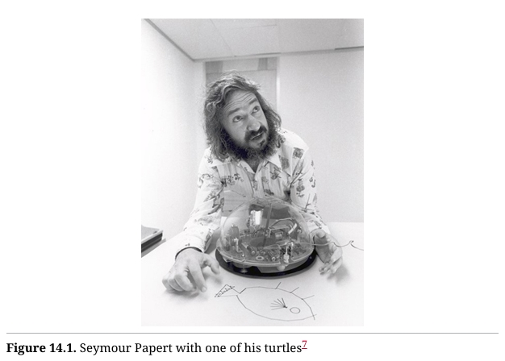

# 测试

在本书中，你已经看到我编写的许多单元测试。在几乎每个案例中，我都遵循TDD（测试驱动开发）[^1]原则，在一个紧密的循环中编写测试和代码，通常测试会比代码快几秒钟。

大多数情况下，这些测试是使用名为 speclj[^2]（发音为“speckle”）的框架编写的，该框架由 Micah Martin 等人编写。它与 Ruby 中流行的 RSpec 框架非常相似。

我已经实践 TDD 超过20年了，并且在 Java、C#、C、C++、Ruby、Python、Lua、Clojure 以及其他各种语言中使用过它。在这些年里，我学到的一点是，语言对这门纪律并不重要。无论使用何种语言，这种纪律始终是一样的。

Clojure 是一门函数式编程语言这一事实，并不会改变我的测试策略，也不会影响我使用 TDD 的方式。我编写 Clojure 程序时，仍然像编写 Java 程序那样先写测试。编程范式并不重要，这种开发纪律是通用的。

## 什么是 REPL？  

许多函数式编程的程序员认为他们不需要 TDD，因为他们在 REPL（交互式编程环境）中测试所有东西。我也经常在 REPL 中做很多实验；但大多数情况下，我会将我在 REPL 中学到的内容编码到测试中。测试，就像钻石一样，是永恒的，而 REPL 中的实验却不会在第二天早晨保留下来。

## 什么是模拟（Mocks）？ 

模拟是 TDD 实践者用来将测试与系统大部分隔离开的一种技术。实际上，他们创建了一些对象，称为模拟对象（mocks）[^3]，这些对象代表了那些大部分的系统，并使用 LSP（里氏替换原则）将这些模拟对象代替系统的真实部分。

由于 LSP 被视为面向对象（OO）原则的一部分，而面向对象语言中的模拟对象通常基于多态接口，这就形成了一种都市传说，认为函数式语言不支持模拟对象。

但正如我们所看到的，LSP 在函数式语言中与在面向对象语言中一样有效，而且多态接口通常非常容易创建。因此，编写各种形式的模拟对象的能力在函数式语言中并不会受到阻碍。

例如，下面是我在一个名为 `more-speech`[^4] 应用中的测试，该测试使用了几个模拟对象：

```clojure
(it "adds an unrooted article id to a tab"
	(let [message-id 1
            messages {message-id {:tags []}}
            event-context (atom {:text-event-map messages})]
        (reset! ui-context {:event-context event-context})
        (with-redefs [swing-util/add-id-to-tab (stub :add-id-to-tab)
                        swing-util/relaunch (stub :relaunch)]
            (add-article-to-tab 1 "tab" nil)
            (should-have-invoked :relaunch)
            (should-have-invoked :add-id-to-tab
								{:with ["tab" :selected 1]}))))
```

别太在意这个测试具体做了什么。只需看一下 `with-redefs` 语句。这个测试模拟了 `swing-util/add-id-to-tab` 和 `swing-util/relaunch` 函数，使它们使用命名的存根（stubs）。这些存根是完美的空操作（no-ops），它们可以接受任意数量的参数，并且不返回任何内容[^5]。但它们会记录发生在它们身上的操作[^6]。因此，在底部我们看到，`:relaunch` 存根应该被调用，`:add-id-to-tab` 存根应该被传入三个参数：`"tab"`、`:selected` 和 `1`。

> **`with-redefs`**：
>
> - `with-redefs` 是一个 Clojure 的宏，它允许你**临时重定义**全局绑定或函数。这个宏会在当前代码块内（作用域中）修改某些符号的定义，**一旦执行完毕，这些修改会自动恢复**。
> - 它通常用于测试环境，特别是在不想影响全局状态的情况下，临时重写某些函数的实现。
>
> 在这个例子中：
>
> - `stub :add-id-to-tab` 模拟了 `add-id-to-tab` 函数，使其不会执行原始逻辑。
> - `stub :relaunch` 模拟了 `relaunch` 函数，同样不会执行实际的重新启动操作。

## 基于性质的测试

函数式编程的开发者中，几乎无法不听到有关 QuickCheck 和基于性质的测试（Property-Based Testing）的讨论。不幸的是，这个话题通常被当作 TDD（测试驱动开发）的反例来提起。我不会去支持或反驳这个论点。相反，我想向你展示基于性质的测试在 TDD 中是多么强大。

首先，什么是基于性质的测试？基于性质的测试是一种验证和诊断技术，它通过随机生成输入并使用一种非常有效的缺陷隔离策略来工作。

假设我刚刚编写了一个函数，用于计算给定整数的质因数：

```clojure
(defn factors-of [n]
    (loop [factors [] n n divisor 2]
        (if (> n 1)
            (cond
            (> divisor (Math/sqrt n))
            (conj factors n)
            (= 0 (mod n divisor))
            (recur (conj factors divisor)
                    (quot n divisor)
                    divisor)
            :else
        	(recur factors n (inc divisor)))
        factors)))
```

也假设我是使用 TDD 编写的这个函数。以下是我的测试：

```clojure
(defn power2 [n]
	(apply * (repeat n 2N)))
	
(describe "factor primes"
	(it "factors 1 -> []"
		(should= [] (factors-of 1)))
	(it "factors 2 -> [2]"
		(should= [2] (factors-of 2)))
	(it "factors 3 -> [3]"
		(should= [3] (factors-of 3)))
    (it "factors 4 -> [2 2]"
    	(should= [2 2] (factors-of 4)))
    (it "factors 5 -> [5]"
    	(should= [5] (factors-of 5)))
    (it "factors 6 -> [2 3]"
    	(should= [2 3] (factors-of 6)))
    (it "factors 7 -> [7]"
    	(should= [7] (factors-of 7)))
    (it "factors 8 -> [2 2 2]"
    	(should= [2 2 2] (factors-of 8)))
    (it "factors 9 -> [3 3]"
    	(should= [3 3] (factors-of 9)))
    (it "factors lots"
    	(should= [2 2 3 3 5 7 11 11 13]
				(factors-of (* 2 2 3 3 5 7 11 11 13)

	(it "factors Euler 3"
		(should= [71 839 1471 6857] (factors-of 600851475143)))
	(it "factors mersenne 2^31-1"
		(should= [2147483647] (factors-of (dec (power2 31))))))
```

看起来很不错，对吧？但是我怎么能确定这个函数实际上是正确的呢？我的意思是，我怎么知道它在某些意外的边界条件下不会失败呢？

当然，我可能永远无法完全确定这一点，但有一些方法可以让我更加放心。一个输出的性质是，所有因数的乘积应该等于输入。那么，为什么我不生成一千个随机整数，并确保它们的质因数的乘积等于这些整数呢？

我可以像下面代码这样做：

```clojure
(def gen-inputs (gen/large-integer* {:min 1 :max 1E9}))

(declare n)

(describe "properties"
    (it "multiplies out properly"
    	(should-be
		:result
		(tc/quick-check
			1000
			(prop/for-all
				[n gen-inputs]
				(let [factors (factors-of n)]
					(= n (reduce * factors))))))))
```

> `declare n`: n 的前置声明。 

这里我使用了 `test.check`[^8]，这是 Clojure 中的基于性质的测试框架，模仿了 QuickCheck 的行为。这个思路相当简单。我定义了一个名为 `gen-inputs` 的生成器，它将生成 1 到 10 亿之间的随机整数。这个范围应该够用了。 

测试告诉 QuickCheck 运行 1000 次。对于每个整数，它计算质因数，将它们全部相乘，并确保乘积等于输入。很棒。 

`tc/quick-check` 函数返回一个包含结果的 map。如果 map 中的 `:result` 元素为 `true`，则表示所有检查都通过了；这就是 `should-be :result` 断言的内容。 

质因数还有另一个性质：它们都应该是质数。所以我们来编写一个测试质数的函数：  

```clojure
(defn is-prime? [n]
	(if (= 2 n)
		true
		(loop [candidates (range 2 (inc (Math/sqrt n)))])
			(if (empty? candidates)
			true
			(if (zero? (rem n (first candidates)))
				false
				(recur (rest candidates)))))))
```

这是一个相当传统的算法，尽管效率极低。不管效率如何，我们可以用它来编写质数性质测试，来检查所有因数是否为质数：

```clojure
(describe "factors"
	(it "they are all prime"
		(should-be
            :result
            (tc/quick-check
				1000
				(prop/for-all
                    [n gen-inputs]
                    (let [factors (factors-of n)]
                    	(every? is-prime? factors)))))))
```

> `(every? is-prime? factors)` 这一行是函数pipline，涉及到多个函数的组合执行：
>
> 首先先明白 `every?` 函数，它接收两个参数：一个谓词函数和一个序列。
>
> every? 函数会将序列 factors 中的每个元素拿出来传递给谓词函数 is-prime，将结果返回给 every。

好了，现在我们知道这个函数返回的是一个整数列表，且列表中的每个整数都是质数，并且它们相乘的结果等于输入。这基本上就是质因数的定义。

所以，这很不错。我可以随机生成一堆输入，然后对输出应用性质检查。

## 一种诊断技术

我称基于性质的测试为一种诊断技术，对吧？让我们看一个更有趣的例子，我将向你展示我的意思。 

还记得上一章中的光碟租赁店的例子吗？让我们对它进行一些基于性质的测试。 

首先，回想一下我们写了一个名为  `make-statement-data` 的函数，它接收一个策略和一个租赁订单，并生成我们用于格式化器的 `statement-data`。下面是使用 `clojure.spec` 描述的 `rental-order` 类型规范：

```clojure
(s/def ::name string?)
(s/def ::customer (s/keys :req-un [name]))
(s/def ::title string?)
(s/def ::type #{:regular :childrens :new-release}

(s/def ::movie (s/keys :req-un [::title ::type]))
(s/def ::days pos-int?)
(s/def ::rental (s/keys :req-un [::days ::movie]))
(s/def ::rentals (s/coll-of ::rental))
(s/def ::rental-order (s/keys :req-un [::customer ::rentals]))
```

这并不难理解。从底部往上看：
- 一个 `:rental-order` 是一个包含两个元素的映射：`:customer` 和 `:rentals`。
- `:rentals` 元素是一个 `:rental` 项的集合。
- 一个 `:rental` 是一个包含 `:days` 和 `:movie` 元素的映射。
- `:days` 元素是一个正整数。
- `:movie` 元素是一个包含 `:title` 和 `:type` 的映射。
- `:type` 是以下之一：`:regular`、`:childrens` 或 `:new-release`。
- `:title` 是一个字符串。
- `:customer` 是一个包含单个 `:name` 元素的映射。
- `:name` 是一个字符串。

有了这个类型规范，我们可以编写一个生成器，生成符合该类型的租赁订单。所以首先，以下是生成器：

```clojure
(def gen-customer-name
	(gen/such-that not-empty gen/string-alphanumeric))

(def gen-customer
	(gen/fmap (fn [name] {:name name}) gen-customer-name))

(def gen-days (gen/elements (range 1 100)))

(def gen-movie-type
	(gen/elements [:regular :childrens :new-release]))

(def gen-movie
	(gen/fmap (fn [[title type]] {:title title :type type})
				(gen/tuple gen/string-alphanumeric gen-movie-type)))

(def gen-rental
	(gen/fmap (fn [[movie days]] {:movie movie :days days})
				(gen/tuple gen-movie gen-days)))

(def gen-rentals
	(gen/such-that not-empty (gen/vector gen-rental)))

(def gen-rental-order
	(gen/fmap (fn [[customer rentals]]
				{:customer customer :rentals rental)))
			(gen/tuple gen-customer gen-rentals)))

(def gen-policy (gen/elements
                [(make-normal-policy)
                (make-buy-two-get-one-free-policy)]))
```

我不会在这里解释 `clojure.check` 的详细用法，但我会逐步说明这些生成器的功能。  

- `gen-policy` 随机选择两种策略中的一种。
- `gen-rental-order` 从 `gen-customer` 和 `gen-rentals` 创建一个映射。  
- `gen-rentals` 从 `gen-rental` 创建一个向量，并确保它不为空。  
- `gen-rental` 从 `gen-movie` 和 `gen-days` 创建一个映射。
- `gen-movie` 从 `gen/string-alphanumeric` 和 `gen-movie-type` 创建一个映射。
- `gen-movie-type` 从三种类型中选择一种。
- `gen-days` 选择 1 到 100 之间的整数。 
- `gen-customer` 使用 `gen-customer-name` 创建一个带有名字的映射。
- `gen-customer-name` 生成一个非空的字母数字字符串。  

你是否注意到类型规范和生成器之间的惊人相似之处？我也注意到了。以下是生成器的一些示例输出：

```clojure
[
    {:customer {:name "5Q"},
    :rentals [{:movie {:title "", :type :new-release}, :days 52}]}
    
    {:customer {:name "3"},
    :rentals [{:movie {:title "", :type :new-release}, :days 51}]}
    
    {:customer {:name "XA"},
    :rentals [{:movie {:title "r", :type :regular}, :days 82}
				{:movie {:title "", :type :childrens}, :days 60}]}
    
    {:customer {:name "4v"},
    :rentals [{:movie {:title "3", :type :childrens}, :days 19}]}
    
    {:customer {:name "0rT"},
    :rentals [{:movie {:title "", :type :regular}, :days 42}
                {:movie {:title "94Y", :type :regular}, :days 34}
                {:movie {:title "D5", :type :new-release},
                :days 58}]}
                
    {:customer {:name "ZFAK"},
    :rentals [{:movie {:title "H8", :type :regular}, :days 92}
                {:movie {:title "d6WS8", :type :regular}, :days 59}
                {:movie {:title "d", :type :regular}, :days 53}
                {:movie {:title "Yj8b7", :type :regular}, :days 58}
                {:movie {:title "Z2q70", :type :childrens},
                :days 9}]}
                
    {:customer {:name "njGB0h"},
    :rentals [{:movie {:title "zk3UaE", :type :regular},
    			:days 53}]}
    			
    {:customer {:name "wD"},
    :rentals [{:movie {:title "51L", :type :childrens},
    			:days 17}]}
    			
    {:customer {:name "2J5nzN"},
    :rentals [{:movie {:title "", :type :regular},
                {:movie {:title "sA17jv", :type :regular}, :days 85}
                {:movie {:title "27E41n", :type :new-release}, :days 85}
                		:days 85}
                {:movie {:title "Z20", :type :new-release}, :days 68}
                {:movie {:title "8j5B7h6S", :type :regular}, 
                		:days 76}
                {:movie {:title "vg", :type :childrens}, :days 30}]}
                
    {:customer {:name "wk"},
    :rentals [{:movie {:title "Kq6wbGG", :type :childrens},
    					:days 43}
            {:movie {:title "3S2DvUwv", :type :childrens},
            		:days 76}
            {:movie {:title "fdGW", :type :childrens}, :days 42}
            {:movie {:title "aS28X3P", :type :childrens},
            		:days 18}
            {:movie {:title "p", :type :childrens}, :days 83}
            {:movie {:title "xgC", :type :regular}, :days 84}
            {:movie {:title "CQoY", :type :childrens}, :days 23}
            {:movie {:title "38jWmKlhq", :type :regular},
            		:days 96}
            {:movie {:title "Liz8T", :type :regular}, :days 56}]}
]
```

这是一堆符合 `rental-order` 类型的随机数据。但我们来检查一下：

```clojure
(describe "Quick check statement policy"
    (it "generates valid rental orders"
        (should-be
            :result
            (tc/quick-check
                100
                (prop/for-all
                    [rental-order gen-rental-order]
                    (nil?
            			(s/explain-data
                            ::constructors/rental-order
                            rental-order))))))
```

这是一个不错的小型 `quick-check`，它生成 100 个随机的 `rental-order` 对象，并通过 `clojure.spec/explain-data` 函数处理。该函数确保每个租赁订单符合我们之前看到的 `::constructors/rental-order` 规范。如果符合，返回 `nil`，这就通过了 `quick-check`。  

现在，`make-statement-data` 是否创建了一个有效的 `statement-data` 对象呢？我们用与上面相同的策略来检查：

```clojure
(s/def ::customer-name string?)
(s/def ::title string?)
(s/def ::price pos?)
(s/def ::movie (s/keys :req-un [::title ::price])
(s/def ::movies (s/coll-of ::movie))
(s/def ::owed pos?)
(s/def ::points pos-int?)
(s/def ::statement-data (s/keys :req-un [::custom
                                        ::movies
                                        ::owed
                                        ::points
(it "produces valid statement data"
	(should-be
        :result
        (tc/quick-check
            100
            (prop/for-all
                [rental-order gen-rental-order
                policy gen-policy]
			(nil?
                (s/explain-data
                    ::policy/statement-data
                    (make-statement-data policy rental-order)))))))
```

在这里，我们看到 `statement-data` 的 `clojure.spec`，以及确保 `make-statement-data` 输出符合它的 `quick-check`。很好。

通过这些测试，我们可以相当确定生成器生成的租赁订单是有效的。那么现在让我们进行性质检查。  

我们可以检查的一个性质是，确保当 `make-statement-data` 将一个 `rental-order` 转换为 `statement-data` 时，`statement-data` 对象的 `:owed` 成员是该对象中列出的所有电影的总和。

`quick-check` 代码如下：

```clojure
(it "statement data totals are consistent under all policies"
	(should-be
        :result
        (tc/quick-check
			100
			(prop/for-all
            [rental-order gen-rental-order
            policy gen-policy]
            (let [statement-data (make-statement-data
            						policy rental-order)
                    prices (map :price (:movies statement-data))
                    owed (:owed statement-data)]
            (= owed (reduce + prices)))))))
```

`quick-check` 有什么问题呢？你能找到它吗？

下面是当我运行的代码：

```clojure
{:shrunk
	{:total-nodes-visited 45,
    :depth 14,
    :pass? false,
    :result false,
    :result-data nil,
    :time-shrinking-ms 3,
    :smallest
		[{:customer {:name "0"},
		:rentals [{:movie {:title "", :type :regular}, :days 1}
                    {:movie {:title "", :type :regular}, :days 1}
                    {:movie {:title "", :type :regular}, :days 1}]}
		{:type
		:video-store.
			buy-two-get-one-free-policy/buy-two-get-one-free}]},
    :failed-after-ms 0,
    :num-tests 7,
    :seed 1672092997135,
    :fail
		[{:customer {:name "4s7u"},
		:rentals
        [{:movie {:title "i7jiVAd", :type :childrens}, :days 85}
        {:movie {:title "7MQM" :type :new-release}, :days 29}
        {:movie {:title "qlS4S", :type :new-release}, :days 99}
        {:movie {:title "X", :type :regular}, :days 87}
        {:movie {:title "w1cRbM", :type :regular}, :days 11}
        {:movie {:title "7Hb41O5", :type :regular}, :days 63}
        {:movie {:title "xWc", :type :childrens}, :days 41}
				{:type
				:video-store.
					buy-two-get-one-free-policy/buy-two-get-one-free}],
    :result false,
    :result-data nil,
    :failing-size 6,
    :pass? false}
```

是的，我知道这看起来有点复杂，但这正是 `quick-check` 展现真正威力的地方，所以请继续跟我一起看下去。

首先，你注意到顶层的 `:shrunk` 元素了吗？这给我们提供了一个关键线索。当 `quick-check` 发现一个错误时，它会开始寻找一个能够继续重现这个错误的最小输入。

看看 `:fail` 元素，它记录了最初导致错误的 `rental-order`。然后再看看 `:shrunk` 元素中的 `:smallest`，`quick-check` 成功地缩小了 `rental-order` 的规模，并且仍然保持了错误。这是它找到的最小的、依然能导致失败的输入。

那么，为什么会出错呢？注意到有三部电影，再注意策略是“买二赠一”。哦，原来是这样——在这种策略下，电影的总价不等于 `:owed` 字段的值。

正是这种“缩减”功能让基于性质的测试成为一种强大的诊断工具。

## 函数式  
为什么像 `quick-check` 这样的工具在面向对象语言中不太流行呢？可能是因为它们更适合用于纯函数的环境。我想在一个可变的系统中也可以使用生成器和性质测试，但那可能比在不可变的系统中复杂得多。

# GUI

多年来，我在函数式编程中使用过两种不同的 GUI 框架。第一个名为 Quil[^9]，它基于流行的 Java 框架 Processing[^10]。第二个是 SeeSaw[^11]，它基于老旧的Java Swing[^12] 框架。

Quil 是“函数式”的，这使得它在“函数式”程序中非常有趣且易于使用。而 SeeSaw 则完全不是函数式的。事实上，它极度依赖可变状态，必须不断地更新。这让它在函数式程序中使用时变得非常麻烦。两者的差异非常显著。

我用 Quil 写的第一个程序之一是 `spacewar`。在本书中我多次提到过它。如果你想看看这个程序的运行效果，你可以访问 [https://github.com/unclebob/spacewar](https://github.com/unclebob/spacewar)，那里有一个 ClojureScript 版本，可以在浏览器中运行。虽然我最初并没有为 ClojureScript 编写 `spacewar`，但Mike Fikes 在一天左右的时间里将它移植了过来。实际上，它在我的浏览器中运行得比在我笔记本上的原生 Clojure 程序还要好。

### Quil中的乌龟绘图  
详细讲解 `spacewar` 的源码超出了本书的范围。不过，我之前写了一个更简单的 Quil 程序，大小刚好合适，它是 `turtle-graphics`[^13]。

乌龟绘图[^14]是一组简单的命令，最初是在 20 世纪 60 年代末为 Logo 语言发明的。这些命令控制一个叫做“乌龟”的机器人。这个机器人坐在一张大纸上，带着一支可以升降的笔。你可以命令机器人向前或向后移动一定距离，或左转或右转一定角度。

图14.1展示了发明者 Seymour Papert 和他的“乌龟”之一的照片。




[^1]: 我在《清洁工艺》（Addison-Wesley，2021）、《代码整洁之道》（Pearson，2008）以及《敏捷软件开发：原则、模式与实践》（Pearson，2002）中详细论述了这种方法。网络上也有大量相关信息。关于这个主题，最好的书之一是 Steve Freeman 和 Nat Pryce 的《测试引导的面向对象软件开发》（Addison-Wesley，2010）。
[^2]: https://github.com/slagyr/speclj
[^3]: 这些对象更正式的称呼是“测试替身”（test-doubles），但在这个语境中，我将继续使用通俗的说法"mocks"。
[^4]: https://github.com/unclebob/more-speech
[^5]: 有一些方法可以让它们返回值，但这里就不多做讨论了。如果你感兴趣，可以查看 [speclj 文档](https://github.com/slagyr/speclj)。
[^6]: 严格来说，这些存根实际上是间谍（spies）。
[^8]: https://clojure.org/guides/test_check_beginner
[^9]: www.quil.info
[^10]: https://processing.org
[^11]: https://github.com/clj-commons/seesaw
[^12]: https://en.wikipedia.org/wiki/Swing_(Java)
[^13]: https://github.com/unclebob/turtle-graphics
[^14]: https://en.wikipedia.org/wiki/Turtle_graphics