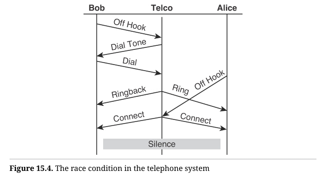

# 测试

在本书中，你已经看到我编写的许多单元测试。在几乎每个案例中，我都遵循TDD（测试驱动开发）[^1]原则，在一个紧密的循环中编写测试和代码，通常测试会比代码快几秒钟。

大多数情况下，这些测试是使用名为 speclj[^2]（发音为“speckle”）的框架编写的，该框架由 Micah Martin 等人编写。它与 Ruby 中流行的 RSpec 框架非常相似。

我已经实践 TDD 超过20年了，并且在 Java、C#、C、C++、Ruby、Python、Lua、Clojure 以及其他各种语言中使用过它。在这些年里，我学到的一点是，语言对这门纪律并不重要。无论使用何种语言，这种纪律始终是一样的。

Clojure 是一门函数式编程语言这一事实，并不会改变我的测试策略，也不会影响我使用 TDD 的方式。我编写 Clojure 程序时，仍然像编写 Java 程序那样先写测试。编程范式并不重要，这种开发纪律是通用的。

## 什么是 REPL？  

许多函数式编程的程序员认为他们不需要 TDD，因为他们在 REPL（交互式编程环境）中测试所有东西。我也经常在 REPL 中做很多实验；但大多数情况下，我会将我在 REPL 中学到的内容编码到测试中。测试，就像钻石一样，是永恒的，而 REPL 中的实验却不会在第二天早晨保留下来。

## 什么是模拟（Mocks）？ 

模拟是 TDD 实践者用来将测试与系统大部分隔离开的一种技术。实际上，他们创建了一些对象，称为模拟对象（mocks）[^3]，这些对象代表了那些大部分的系统，并使用 LSP（里氏替换原则）将这些模拟对象代替系统的真实部分。

由于 LSP 被视为面向对象（OO）原则的一部分，而面向对象语言中的模拟对象通常基于多态接口，这就形成了一种都市传说，认为函数式语言不支持模拟对象。

但正如我们所看到的，LSP 在函数式语言中与在面向对象语言中一样有效，而且多态接口通常非常容易创建。因此，编写各种形式的模拟对象的能力在函数式语言中并不会受到阻碍。

例如，下面是我在一个名为 `more-speech`[^4] 应用中的测试，该测试使用了几个模拟对象：

```clojure
(it "adds an unrooted article id to a tab"
	(let [message-id 1
            messages {message-id {:tags []}}
            event-context (atom {:text-event-map messages})]
        (reset! ui-context {:event-context event-context})
        (with-redefs [swing-util/add-id-to-tab (stub :add-id-to-tab)
                        swing-util/relaunch (stub :relaunch)]
            (add-article-to-tab 1 "tab" nil)
            (should-have-invoked :relaunch)
            (should-have-invoked :add-id-to-tab
								{:with ["tab" :selected 1]}))))
```

别太在意这个测试具体做了什么。只需看一下 `with-redefs` 语句。这个测试模拟了 `swing-util/add-id-to-tab` 和 `swing-util/relaunch` 函数，使它们使用命名的存根（stubs）。这些存根是完美的空操作（no-ops），它们可以接受任意数量的参数，并且不返回任何内容[^5]。但它们会记录发生在它们身上的操作[^6]。因此，在底部我们看到，`:relaunch` 存根应该被调用，`:add-id-to-tab` 存根应该被传入三个参数：`"tab"`、`:selected` 和 `1`。

> **`with-redefs`**：
>
> - `with-redefs` 是一个 Clojure 的宏，它允许你**临时重定义**全局绑定或函数。这个宏会在当前代码块内（作用域中）修改某些符号的定义，**一旦执行完毕，这些修改会自动恢复**。
> - 它通常用于测试环境，特别是在不想影响全局状态的情况下，临时重写某些函数的实现。
>
> 在这个例子中：
>
> - `stub :add-id-to-tab` 模拟了 `add-id-to-tab` 函数，使其不会执行原始逻辑。
> - `stub :relaunch` 模拟了 `relaunch` 函数，同样不会执行实际的重新启动操作。

## 基于性质的测试

函数式编程的开发者中，几乎无法不听到有关 QuickCheck 和基于性质的测试（Property-Based Testing）的讨论。不幸的是，这个话题通常被当作 TDD（测试驱动开发）的反例来提起。我不会去支持或反驳这个论点。相反，我想向你展示基于性质的测试在 TDD 中是多么强大。

首先，什么是基于性质的测试？基于性质的测试是一种验证和诊断技术，它通过随机生成输入并使用一种非常有效的缺陷隔离策略来工作。

假设我刚刚编写了一个函数，用于计算给定整数的质因数：

```clojure
(defn factors-of [n]
    (loop [factors [] n n divisor 2]
        (if (> n 1)
            (cond
            (> divisor (Math/sqrt n))
            (conj factors n)
            (= 0 (mod n divisor))
            (recur (conj factors divisor)
                    (quot n divisor)
                    divisor)
            :else
        	(recur factors n (inc divisor)))
        factors)))
```

也假设我是使用 TDD 编写的这个函数。以下是我的测试：

```clojure
(defn power2 [n]
	(apply * (repeat n 2N)))
	
(describe "factor primes"
	(it "factors 1 -> []"
		(should= [] (factors-of 1)))
	(it "factors 2 -> [2]"
		(should= [2] (factors-of 2)))
	(it "factors 3 -> [3]"
		(should= [3] (factors-of 3)))
    (it "factors 4 -> [2 2]"
    	(should= [2 2] (factors-of 4)))
    (it "factors 5 -> [5]"
    	(should= [5] (factors-of 5)))
    (it "factors 6 -> [2 3]"
    	(should= [2 3] (factors-of 6)))
    (it "factors 7 -> [7]"
    	(should= [7] (factors-of 7)))
    (it "factors 8 -> [2 2 2]"
    	(should= [2 2 2] (factors-of 8)))
    (it "factors 9 -> [3 3]"
    	(should= [3 3] (factors-of 9)))
    (it "factors lots"
    	(should= [2 2 3 3 5 7 11 11 13]
				(factors-of (* 2 2 3 3 5 7 11 11 13)

	(it "factors Euler 3"
		(should= [71 839 1471 6857] (factors-of 600851475143)))
	(it "factors mersenne 2^31-1"
		(should= [2147483647] (factors-of (dec (power2 31))))))
```

看起来很不错，对吧？但是我怎么能确定这个函数实际上是正确的呢？我的意思是，我怎么知道它在某些意外的边界条件下不会失败呢？

当然，我可能永远无法完全确定这一点，但有一些方法可以让我更加放心。一个输出的性质是，所有因数的乘积应该等于输入。那么，为什么我不生成一千个随机整数，并确保它们的质因数的乘积等于这些整数呢？

我可以像下面代码这样做：

```clojure
(def gen-inputs (gen/large-integer* {:min 1 :max 1E9}))

(declare n)

(describe "properties"
    (it "multiplies out properly"
    	(should-be
		:result
		(tc/quick-check
			1000
			(prop/for-all
				[n gen-inputs]
				(let [factors (factors-of n)]
					(= n (reduce * factors))))))))
```

> `declare n`: n 的前置声明。 

这里我使用了 `test.check`[^8]，这是 Clojure 中的基于性质的测试框架，模仿了 QuickCheck 的行为。这个思路相当简单。我定义了一个名为 `gen-inputs` 的生成器，它将生成 1 到 10 亿之间的随机整数。这个范围应该够用了。 

测试告诉 QuickCheck 运行 1000 次。对于每个整数，它计算质因数，将它们全部相乘，并确保乘积等于输入。很棒。 

`tc/quick-check` 函数返回一个包含结果的 map。如果 map 中的 `:result` 元素为 `true`，则表示所有检查都通过了；这就是 `should-be :result` 断言的内容。 

质因数还有另一个性质：它们都应该是质数。所以我们来编写一个测试质数的函数：  

```clojure
(defn is-prime? [n]
	(if (= 2 n)
		true
		(loop [candidates (range 2 (inc (Math/sqrt n)))])
			(if (empty? candidates)
			true
			(if (zero? (rem n (first candidates)))
				false
				(recur (rest candidates)))))))
```

这是一个相当传统的算法，尽管效率极低。不管效率如何，我们可以用它来编写质数性质测试，来检查所有因数是否为质数：

```clojure
(describe "factors"
	(it "they are all prime"
		(should-be
            :result
            (tc/quick-check
				1000
				(prop/for-all
                    [n gen-inputs]
                    (let [factors (factors-of n)]
                    	(every? is-prime? factors)))))))
```

> `(every? is-prime? factors)` 这一行是函数pipline，涉及到多个函数的组合执行：
>
> 首先先明白 `every?` 函数，它接收两个参数：一个谓词函数和一个序列。
>
> every? 函数会将序列 factors 中的每个元素拿出来传递给谓词函数 is-prime，将结果返回给 every。

好了，现在我们知道这个函数返回的是一个整数列表，且列表中的每个整数都是质数，并且它们相乘的结果等于输入。这基本上就是质因数的定义。

所以，这很不错。我可以随机生成一堆输入，然后对输出应用性质检查。

## 一种诊断技术

我称基于性质的测试为一种诊断技术，对吧？让我们看一个更有趣的例子，我将向你展示我的意思。 

还记得上一章中的光碟租赁店的例子吗？让我们对它进行一些基于性质的测试。 

首先，回想一下我们写了一个名为  `make-statement-data` 的函数，它接收一个策略和一个租赁订单，并生成我们用于格式化器的 `statement-data`。下面是使用 `clojure.spec` 描述的 `rental-order` 类型规范：

```clojure
(s/def ::name string?)
(s/def ::customer (s/keys :req-un [name]))
(s/def ::title string?)
(s/def ::type #{:regular :childrens :new-release}

(s/def ::movie (s/keys :req-un [::title ::type]))
(s/def ::days pos-int?)
(s/def ::rental (s/keys :req-un [::days ::movie]))
(s/def ::rentals (s/coll-of ::rental))
(s/def ::rental-order (s/keys :req-un [::customer ::rentals]))
```

这并不难理解。从底部往上看：
- 一个 `:rental-order` 是一个包含两个元素的映射：`:customer` 和 `:rentals`。
- `:rentals` 元素是一个 `:rental` 项的集合。
- 一个 `:rental` 是一个包含 `:days` 和 `:movie` 元素的映射。
- `:days` 元素是一个正整数。
- `:movie` 元素是一个包含 `:title` 和 `:type` 的映射。
- `:type` 是以下之一：`:regular`、`:childrens` 或 `:new-release`。
- `:title` 是一个字符串。
- `:customer` 是一个包含单个 `:name` 元素的映射。
- `:name` 是一个字符串。

有了这个类型规范，我们可以编写一个生成器，生成符合该类型的租赁订单。所以首先，以下是生成器：

```clojure
(def gen-customer-name
	(gen/such-that not-empty gen/string-alphanumeric))

(def gen-customer
	(gen/fmap (fn [name] {:name name}) gen-customer-name))

(def gen-days (gen/elements (range 1 100)))

(def gen-movie-type
	(gen/elements [:regular :childrens :new-release]))

(def gen-movie
	(gen/fmap (fn [[title type]] {:title title :type type})
				(gen/tuple gen/string-alphanumeric gen-movie-type)))

(def gen-rental
	(gen/fmap (fn [[movie days]] {:movie movie :days days})
				(gen/tuple gen-movie gen-days)))

(def gen-rentals
	(gen/such-that not-empty (gen/vector gen-rental)))

(def gen-rental-order
	(gen/fmap (fn [[customer rentals]]
				{:customer customer :rentals rental)))
			(gen/tuple gen-customer gen-rentals)))

(def gen-policy (gen/elements
                [(make-normal-policy)
                (make-buy-two-get-one-free-policy)]))
```

我不会在这里解释 `clojure.check` 的详细用法，但我会逐步说明这些生成器的功能。  

- `gen-policy` 随机选择两种策略中的一种。
- `gen-rental-order` 从 `gen-customer` 和 `gen-rentals` 创建一个映射。  
- `gen-rentals` 从 `gen-rental` 创建一个向量，并确保它不为空。  
- `gen-rental` 从 `gen-movie` 和 `gen-days` 创建一个映射。
- `gen-movie` 从 `gen/string-alphanumeric` 和 `gen-movie-type` 创建一个映射。
- `gen-movie-type` 从三种类型中选择一种。
- `gen-days` 选择 1 到 100 之间的整数。 
- `gen-customer` 使用 `gen-customer-name` 创建一个带有名字的映射。
- `gen-customer-name` 生成一个非空的字母数字字符串。  

你是否注意到类型规范和生成器之间的惊人相似之处？我也注意到了。以下是生成器的一些示例输出：

```clojure
[
    {:customer {:name "5Q"},
    :rentals [{:movie {:title "", :type :new-release}, :days 52}]}
    
    {:customer {:name "3"},
    :rentals [{:movie {:title "", :type :new-release}, :days 51}]}
    
    {:customer {:name "XA"},
    :rentals [{:movie {:title "r", :type :regular}, :days 82}
				{:movie {:title "", :type :childrens}, :days 60}]}
    
    {:customer {:name "4v"},
    :rentals [{:movie {:title "3", :type :childrens}, :days 19}]}
    
    {:customer {:name "0rT"},
    :rentals [{:movie {:title "", :type :regular}, :days 42}
                {:movie {:title "94Y", :type :regular}, :days 34}
                {:movie {:title "D5", :type :new-release},
                :days 58}]}
                
    {:customer {:name "ZFAK"},
    :rentals [{:movie {:title "H8", :type :regular}, :days 92}
                {:movie {:title "d6WS8", :type :regular}, :days 59}
                {:movie {:title "d", :type :regular}, :days 53}
                {:movie {:title "Yj8b7", :type :regular}, :days 58}
                {:movie {:title "Z2q70", :type :childrens},
                :days 9}]}
                
    {:customer {:name "njGB0h"},
    :rentals [{:movie {:title "zk3UaE", :type :regular},
    			:days 53}]}
    			
    {:customer {:name "wD"},
    :rentals [{:movie {:title "51L", :type :childrens},
    			:days 17}]}
    			
    {:customer {:name "2J5nzN"},
    :rentals [{:movie {:title "", :type :regular},
                {:movie {:title "sA17jv", :type :regular}, :days 85}
                {:movie {:title "27E41n", :type :new-release}, :days 85}
                		:days 85}
                {:movie {:title "Z20", :type :new-release}, :days 68}
                {:movie {:title "8j5B7h6S", :type :regular}, 
                		:days 76}
                {:movie {:title "vg", :type :childrens}, :days 30}]}
                
    {:customer {:name "wk"},
    :rentals [{:movie {:title "Kq6wbGG", :type :childrens},
    					:days 43}
            {:movie {:title "3S2DvUwv", :type :childrens},
            		:days 76}
            {:movie {:title "fdGW", :type :childrens}, :days 42}
            {:movie {:title "aS28X3P", :type :childrens},
            		:days 18}
            {:movie {:title "p", :type :childrens}, :days 83}
            {:movie {:title "xgC", :type :regular}, :days 84}
            {:movie {:title "CQoY", :type :childrens}, :days 23}
            {:movie {:title "38jWmKlhq", :type :regular},
            		:days 96}
            {:movie {:title "Liz8T", :type :regular}, :days 56}]}
]
```

这是一堆符合 `rental-order` 类型的随机数据。但我们来检查一下：

```clojure
(describe "Quick check statement policy"
    (it "generates valid rental orders"
        (should-be
            :result
            (tc/quick-check
                100
                (prop/for-all
                    [rental-order gen-rental-order]
                    (nil?
            			(s/explain-data
                            ::constructors/rental-order
                            rental-order))))))
```

这是一个不错的小型 `quick-check`，它生成 100 个随机的 `rental-order` 对象，并通过 `clojure.spec/explain-data` 函数处理。该函数确保每个租赁订单符合我们之前看到的 `::constructors/rental-order` 规范。如果符合，返回 `nil`，这就通过了 `quick-check`。  

现在，`make-statement-data` 是否创建了一个有效的 `statement-data` 对象呢？我们用与上面相同的策略来检查：

```clojure
(s/def ::customer-name string?)
(s/def ::title string?)
(s/def ::price pos?)
(s/def ::movie (s/keys :req-un [::title ::price])
(s/def ::movies (s/coll-of ::movie))
(s/def ::owed pos?)
(s/def ::points pos-int?)
(s/def ::statement-data (s/keys :req-un [::custom
                                        ::movies
                                        ::owed
                                        ::points
(it "produces valid statement data"
	(should-be
        :result
        (tc/quick-check
            100
            (prop/for-all
                [rental-order gen-rental-order
                policy gen-policy]
			(nil?
                (s/explain-data
                    ::policy/statement-data
                    (make-statement-data policy rental-order)))))))
```

在这里，我们看到 `statement-data` 的 `clojure.spec`，以及确保 `make-statement-data` 输出符合它的 `quick-check`。很好。

通过这些测试，我们可以相当确定生成器生成的租赁订单是有效的。那么现在让我们进行性质检查。  

我们可以检查的一个性质是，确保当 `make-statement-data` 将一个 `rental-order` 转换为 `statement-data` 时，`statement-data` 对象的 `:owed` 成员是该对象中列出的所有电影的总和。

`quick-check` 代码如下：

```clojure
(it "statement data totals are consistent under all policies"
	(should-be
        :result
        (tc/quick-check
			100
			(prop/for-all
            [rental-order gen-rental-order
            policy gen-policy]
            (let [statement-data (make-statement-data
            						policy rental-order)
                    prices (map :price (:movies statement-data))
                    owed (:owed statement-data)]
            (= owed (reduce + prices)))))))
```

`quick-check` 有什么问题呢？你能找到它吗？

下面是当我运行的代码：

```clojure
{:shrunk
	{:total-nodes-visited 45,
    :depth 14,
    :pass? false,
    :result false,
    :result-data nil,
    :time-shrinking-ms 3,
    :smallest
		[{:customer {:name "0"},
		:rentals [{:movie {:title "", :type :regular}, :days 1}
                    {:movie {:title "", :type :regular}, :days 1}
                    {:movie {:title "", :type :regular}, :days 1}]}
		{:type
		:video-store.
			buy-two-get-one-free-policy/buy-two-get-one-free}]},
    :failed-after-ms 0,
    :num-tests 7,
    :seed 1672092997135,
    :fail
		[{:customer {:name "4s7u"},
		:rentals
        [{:movie {:title "i7jiVAd", :type :childrens}, :days 85}
        {:movie {:title "7MQM" :type :new-release}, :days 29}
        {:movie {:title "qlS4S", :type :new-release}, :days 99}
        {:movie {:title "X", :type :regular}, :days 87}
        {:movie {:title "w1cRbM", :type :regular}, :days 11}
        {:movie {:title "7Hb41O5", :type :regular}, :days 63}
        {:movie {:title "xWc", :type :childrens}, :days 41}
				{:type
				:video-store.
					buy-two-get-one-free-policy/buy-two-get-one-free}],
    :result false,
    :result-data nil,
    :failing-size 6,
    :pass? false}
```

是的，我知道这看起来有点复杂，但这正是 `quick-check` 展现真正威力的地方，所以请继续跟我一起看下去。

首先，你注意到顶层的 `:shrunk` 元素了吗？这给我们提供了一个关键线索。当 `quick-check` 发现一个错误时，它会开始寻找一个能够继续重现这个错误的最小输入。

看看 `:fail` 元素，它记录了最初导致错误的 `rental-order`。然后再看看 `:shrunk` 元素中的 `:smallest`，`quick-check` 成功地缩小了 `rental-order` 的规模，并且仍然保持了错误。这是它找到的最小的、依然能导致失败的输入。

那么，为什么会出错呢？注意到有三部电影，再注意策略是“买二赠一”。哦，原来是这样——在这种策略下，电影的总价不等于 `:owed` 字段的值。

正是这种“缩减”功能让基于性质的测试成为一种强大的诊断工具。

## 函数式  
为什么像 `quick-check` 这样的工具在面向对象语言中不太流行呢？可能是因为它们更适合用于纯函数的环境。我想在一个可变的系统中也可以使用生成器和性质测试，但那可能比在不可变的系统中复杂得多。

# GUI

多年来，我在函数式编程中使用过两种不同的 GUI 框架。第一个名为 Quil[^9]，它基于流行的 Java 框架 Processing[^10]。第二个是 SeeSaw[^11]，它基于老旧的Java Swing[^12] 框架。

Quil 是“函数式”的，这使得它在“函数式”程序中非常有趣且易于使用。而 SeeSaw 则完全不是函数式的。事实上，它极度依赖可变状态，必须不断地更新。这让它在函数式程序中使用时变得非常麻烦。两者的差异非常显著。

我用 Quil 写的第一个程序之一是 `spacewar`。在本书中我多次提到过它。如果你想看看这个程序的运行效果，你可以访问 [https://github.com/unclebob/spacewar](https://github.com/unclebob/spacewar)，那里有一个 ClojureScript 版本，可以在浏览器中运行。虽然我最初并没有为 ClojureScript 编写 `spacewar`，但Mike Fikes 在一天左右的时间里将它移植了过来。实际上，它在我的浏览器中运行得比在我笔记本上的原生 Clojure 程序还要好。

### Quil中的乌龟绘图  
详细讲解 `spacewar` 的源码超出了本书的范围。不过，我之前写了一个更简单的 Quil 程序，大小刚好合适，它是 `turtle-graphics`[^13]。

乌龟绘图[^14]是一组简单的命令，最初是在 20 世纪 60 年代末为 Logo 语言发明的。这些命令控制一个叫做“乌龟”的机器人。这个机器人坐在一张大纸上，带着一支可以升降的笔。你可以命令机器人向前或向后移动一定距离，或左转或右转一定角度。

图14.1展示了发明者 Seymour Papert 和他的“乌龟”之一的照片。


例如，如果你想画一个正方形，你可能会发出以下命令：

```
Pen down
Forward 10
Right 90
Forward 10
Right 90
Forward 10
Right 90
Forward 10
Pen up.
```

最初的想法是通过让孩子们控制“乌龟”来画出有趣的形状，从而引导他们学习编程。我不确定这个方法对孩子们的效果如何，但对于想在屏幕上绘制复杂设计的程序员来说，它却非常有用。我曾经使用带有乌龟绘图的 Logo 系统，在Commodore 64 上编写了一个相当复杂的“月球着陆器”游戏。

无论如何，前段时间我觉得在 Clojure 中实现一个乌龟绘图系统会很有趣，这样我就可以轻松地探索一些有趣的数学和几何谜题。

我的目标不是创建一个可以输入命令的乌龟绘图控制台，而是设计一个可以在 Clojure 中调用的乌龟绘图 API，以编写图形函数。

例如，我希望编写一个像这样的程序：

```clojure
(defn polygon [theta, len, n]
	(pen-down)
    (speed 1000)
    (dotimes [_ n]
        (forward len)
        (right theta)))
        
(defn turtle-script []
	(polygon 144 400 5))
```

这个程序会绘制图 14.2 中的图形。（注意坐在星形左侧顶点的小乌龟。）


`turtle-script` 函数是乌龟绘图系统的入口点。你可以在其中放入绘图命令。在这个例子中，我在其中调用了 `polygon` 函数。

你可能注意到，`polygon` 函数看起来并不是“函数式”的，因为它并不根据输入返回值。相反，它的副作用是在屏幕上绘制内容。此外，每个命令都会改变乌龟的状态。因此，乌龟绘图程序本身并不是“函数式”的。

然而，乌龟绘图框架本身是“函数式”的。或者更准确地说，它和 GUI 程序一样“函数式”了[^15]。毕竟，GUI 程序的目的就是要改变屏幕的状态。

乌龟绘图框架的起点是配置并调用Quil：

```clojure
(defn ^:export -main [& args]
    (q/defsketch turtle-graphics
                :title "Turtle Graphics"
                :size [1000 1000]
                :setup setup
                :update update-state
                :draw draw-state
                :features [:keep-on-top]
                :middleware [m/fun-mode])
	args)
```

这里我不会详细讲解 Quil 的用法，但有几个关键点需要注意。留意一下 `:setup`、`:update` 和 `:draw`，它们分别指向一个函数：

- `setup` 函数在程序启动时执行一次。  
- `draw-state` 函数每秒调用 60 次，用来刷新屏幕。屏幕上的内容都由 `draw` 函数实时绘制，屏幕本身不存储任何状态。  
- `update-state` 函数则在 `draw-state` 之前执行，负责更新绘制对象的状态。可以把它看成每秒将屏幕元素推进 1/60 秒的时间步。

可以把这个过程想象成一个简单的循环：

```clojure
(loop [state (setup)]
	(draw-state state)
	(recur (update-state state)))
```

如果视为尾递归循环，那么屏幕上的内容就是尾递归的结果值。所以即使我们在屏幕上进行状态修改，实际是在递归的尾部操作，影响很小[^16]。尽管不是完全的纯函数式，但它和任何支持尾调用优化（TCO）[^17]的系统一样具有“函数式”特性。 

这是我的 `setup` 函数：

```clojure
(defn setup []
    (q/frame-rate 60)
    (q/color-mode :rgb)
    (let [state {:turtle (turtle/make)
    			:channel channel}]
        (async/go
            (turtle-script)
            (prn "Turtle script complete"))
        state))
```

一开始设置相对简单：它将帧率设为 60fps、颜色模式设为 RGB，并创建一个状态对象，该对象会传递给 `update-state` 和 `draw-state`。

`async/go` 函数启动了一个新的轻量级线程，用于执行我们的 `turtle-script`。

状态对象由一个 `channel` 和 `turtle` 组成。稍后我们会讨论通道。现在，让我们集中看看 `turtle`：

```clojure
(s/def ::position (s/tuple number? number?))
(s/def ::heading (s/and number? #(<= 0 % 360)))
(s/def ::velocity number?)
(s/def ::distance number?)
(s/def ::omega number?)
(s/def ::angle number?)
(s/def ::weight (s/and pos? number?))
(s/def ::state #{:idle :busy})
(s/def ::pen #{:up :down})
(s/def ::pen-start (s/or :nil nil?
						:pos (s/tuple number? number?)))
						
(s/def ::line-start (s/tuple number? number?))
(s/def ::line-end (s/tuple number? number?))
(s/def ::line (s/keys :req-un [::line-start ::line-end]))
(s/def ::lines (s/coll-of ::line))
(s/def ::visible boolean?)
(s/def ::speed (s/and int? pos?))
(s/def ::turtle (s/keys :req-un [::position
                                ::heading
                                ::velocity
                                ::distance
                                ::omega
                                ::angle
                                ::pen
                                ::weight
                                ::speed
                                ::lines
                                ::visible
                                ::state]
                                :opt-un [::pen-start]))
(defn make []
	{:post [(s/assert ::turtle %)]}
	{:position [0.0 0.0]
    :heading 0.0
    :velocity 0.0
    :distance 0.0
    :omega 0.0
    :angle 0.0
    :pen :up
    :weight 1
    :speed 5
    :visible true
    :lines []
    :state :idle})
```

这里展示了 `turtle` 的类型规范以及构造函数。注意构造函数在 `:post` 条件中进行了类型检查。`turtle` 的元素大多一目了然，有 XY 位置、角度方向、速度、画笔的抬起/放下状态、画笔的粗细、可见性状态等。其他元素很快也会介绍。

那么，我们如何绘制 `turtle`？

```clojure
(defn draw-state [state]
    (q/background 240)
    (q/with-translation
        [500 500]
        (let [{:keys [turtle]} state]
        
			(turtle/draw turtle))))

——Turtle module——

(defn draw [turtle]
	(when (= :down (:pen turtle))
        (q/stroke 0)
        (q/stroke-weight (:weight turtle))
        (q/line (:pen-start turtle) (:position turtle)))

	(doseq [line (:lines turtle)]
        (q/stroke-weight (:line-weight line))
        (q/line (:line-start line) (:line-end line)))
        
    (when (:visible turtle)
		(q/stroke-weight 1)
		(let [[x y] (:position turtle)
                heading (q/radians (:heading turtle))
                base-left (- (/ WIDTH 2))
                base-right (/ WIDTH 2)
                tip HEIGHT]
            (q/stroke 0)
            (q/with-translation
                [x y]
                (q/with-rotation
                    [heading]
                    (q/line 0 base-left 0 base-right)
                    
                    (q/line 0 base-left tip 0)
                    (q/line 0 base-right tip 0))))))
```

`draw-state` 函数由 Quil 每秒调用 60 次，它将屏幕背景色设置为浅灰色，将绘图中心设为(500, 500)，然后调用 `turtle/draw`，绘制当前进行中的线条以及之前画好的所有线条，最后再绘制乌龟本身。注意 Quil 在平移和旋转上的支持。

那么，我们如何更新乌龟的状态呢？

```clojure
(defn update-state [{:keys [channel] :as state}]
    (let [turtle (:turtle state)
    		turtle (turtle/update-turtle turtle)]
    (assoc state :turtle (handle-commands channel turtle))))
```

`update-state` 函数调用了 `turtle/update-turtle`。接着，它调用了 `handle-commands`，其中又涉及到通道。我们先看看 `update-turtle`：

```clojure
(defn update-position
    [{:keys [position velocity heading distance] :as turtle}]
    (let [step (min (q/abs velocity) distance)
            distance (- distance step)
            step (if (neg? velocity) (- step) step)
            radians (q/radians heading)
            [x y] position
            vx (* step (Math/cos radians))
            vy (* step (Math/sin radians))
			position [(+ x vx) (+ y vy)]]
		(assoc turtle :position position
                        :distance distance
                        :velocity (if (zero? distance) 0.0 velocity))))
                        
(defn update-heading [{:keys [heading omega angle] :as turtle}]
	(let [angle-step (min (q/abs omega) angle)
            angle (- angle angle-step)
            angle-step (if (neg? omega) (- angle-step) angle-step
            heading (mod (+ heading angle-step) 360)]
		(assoc turtle :heading heading
                        :angle angle
                        :omega (if (zero? angle) 0.0 omega))))
                        
(defn make-line [{:keys [pen-start position weigh]}]
    {:line-start pen-start
    :line-end position
    :line-weight weight})
    
(defn update-turtle [turtle]
    {:post [(s/assert ::turtle %)]}
    (if (= :idle (:state turtle))
        turtle
        (let [{:keys [distance
                state
                angle
                lines
                position
                pen
                pen-start] :as turtle}
        	(-> turtle
                (update-position)
                (update-heading))
        	done? (and (zero? distance)
           				 (zero? angle))
            state (if done? :idle state)
        	lines (if (and done? (= pen :down))
        			(conj lines (make-line turtle))
        			lines)
        	pen-start (if (and done? (= pen :down))
        			position
        			pen-start)]
        (assoc turtle
                :state state
                :lines lines
                :pen-start pen-start))))
```

注意 `update-turtle` 设置了一个 `:post` 条件，用于在更新后检查 `turtle` 的类型。这种方式确保我们在更新大型结构时不会误改其中的小部分。

如果乌龟的 `:state` 是 `:idle`（即既没有移动也没有旋转），那么不会进行任何更改。否则，我们会更新乌龟的位置和方向，接着解构它的内部状态。当前动画运动中的剩余距离和角度都为零时，才算完成。而一旦完成，我们将 `:state` 设置为 `:idle`。

如果完成了且画笔在下方，我们就会将当前的绘制线条添加到已绘制线条列表中，并将 `pen-start` 更新到当前位置，为下一条线做好准备。

更新位置和方向是一些简单的函数，它们执行必要的三角运算来将乌龟置于正确的位置和方向。这些函数都利用了乌龟的 `:velocity` 来调整每次更新时的步长。

接下来处理命令：

```clojure
(defn handle-commands [channel turtle]
    (loop [turtle turtle]
    	(let [command (if (= :idle (:state turtle))
                        (async/poll! channel)
                        nil)]
			(if (nil? command)
                turtle
                (recur (turtle/handle-command turtle command))))))
```

如果乌龟的状态是 `:idle`，那么它就准备好接收命令了。因此，我们从通道中轮询命令。如果通道上有命令，就通过调用 `turtle/handle-command` 进行处理，并重复此过程，直到通道中没有命令为止。

处理每个命令相当直接：  

```clojure
(defn pen-down [{:keys [pen position pen-start]
	(assoc turtle :pen :down
					:pen-start (if (= :up pen) position pen-start)))
					
(defn pen-up [{:keys [pen lines] :as turtle}]
	(if (= :up pen)
		turtle
		(let [new-line (make-line turtle)
				lines (conj lines new-line)]
			(assoc turtle :pen :up
                            :pen-start nil
                            :lines lines))))

(defn forward [turtle [distance]]
	(assoc turtle :velocity (:speed turtle)
                    :distance distance
                    :state :busy))

(defn back [turtle [distance]]
	(assoc turtle :velocity (- (:speed turtle))
                    :distance distance
                    :state :busy))
                    
(defn right [turtle [angle]]
	(assoc turtle :omega (* 2 (:speed turtle))
                    :angle angle
                    :state :busy))
                    
(defn left [turtle [angle]]
	(assoc turtle :omega (* -2 (:speed turtle))
                    :angle angle
                    :state :busy))

(defn hide [turtle]
	(assoc turtle :visible false))

(defn show [turtle]
	(assoc turtle :visible true))

(defn weight [turtle [weight]]
	(assoc turtle :weight weight))

(defn speed [turtle [speed]]
	(assoc turtle :speed speed))

(defn handle-command [turtle [cmd & args]]
	(condp = cmd
        :forward (forward turtle args)
        :back (back turtle args)
        :right (right turtle args)
        :left (left turtle args)
        :pen-down (pen-down turtle)
        :pen-up (pen-up turtle)
        :hide (hide turtle)
        :show (show turtle)
        :weight (weight turtle args)
        :speed (speed turtle args)
        :else turtle))
```

我们只是将命令标记翻译成相应的函数调用。这并不复杂。命令函数会管理乌龟的状态。以 `forward` 命令为例，它将乌龟的 `:state` 设置为 `:busy`，同时设置乌龟的 `:velocity` 和它需要移动的 `:distance`，在达到 `:idle` 状态之前需要完成这些设置。

好了，我们快完成了。现在只需看看 `turtle-script` 函数如何将命令发送到通道即可：

```clojure
(def channel (async/chan))
(defn forward [distance] (async/>!! channel [:forward distance]))
(defn back [distance] (async/>!! channel [:back distance]))
(defn right [angle] (async/>!! channel [:right angle]))
(defn left [angle] (async/>!! channel [:left angle]))
(defn pen-up [] (async/>!! channel [:pen-up]))
(defn pen-down [] (async/>!! channel [:pen-down])
(defn hide [] (async/>!! channel [:hide]))
(defn show [] (async/>!! channel [:show]))
(defn weight [weight] (async/>!! channel [:weight weight]))
(defn speed [speed] (async/>!! channel [:speed speed]))
```

`async/>!!` 函数将参数发送到通道。如果通道已满，它会等待。这并不出人意料，不是吗？

有了这些，我们就可以把所有的乌龟绘图命令放到 `turtle-script` 函数中，然后看着乌龟在屏幕上舞动，绘制出美丽的图案。

你可以在 [www.youtube.com/@Cleancoders](https://www.youtube.com/@Cleancoders) 上观看该框架的实际效果，特别是在欧拉项目的第2.3、2.2、5和9集。

# 并发

在函数式程序中并发性要比支持可变状态的程序简单得多。正如我在第一章所说，如果不进行状态更新，就不会出现并发更新问题。我还提到，这意味着不会出现竞争条件。

这些“事实”减少了处理多线程时的大部分复杂性。如果线程是由纯函数组成的，那么它们之间就不会相互干扰。

真的不会吗？

虽然这些“事实”听起来很令人安心，但并不完全准确。本章的目的是展示多线程“函数式”程序仍然可能出现竞争条件。

为此，我们设置了一些交互的有限状态机。我最喜欢的一个例子是 1960 年代的电话呼叫过程。事件序列大致如图 15.1 所示。


这是一个消息序列图，时间在纵轴上，所有消息都是斜线，因为发送它们需要时间。你可能不熟悉我在这里使用的电话术语。如果你出生在 2000 年以后，可能对电话的概念都不太熟悉。那么，为了历史和怀旧的缘故，我来简单说明一下这个过程。

Bob 想给 Alice 打电话。他拿起[^18]电话听筒并贴近耳边。电话公司（telco）向听筒发送拨号音(dial tone)[^19]。听到拨号音后，Bob 拨打(dial)[^20] Alice 的号码。电话公司随后向 Alice 的电话发送振铃电压(ringing voltage)[^21]，并向 Bob 的听筒发送回(ringback)[^22]铃音。Alice 听到电话铃声后拿起听筒。电话公司接通了 Bob 和 Alice 的通话，Alice 对 Bob 说：“你好”。

在这个场景中有三个有限状态机：Bob、电话公司（telco）和Alice。Bob 和 Alice 分别运行如图 15.2 所示的用户状态机[^23]的独立实例。


电话公司的状态机如图 15.3 所示。


在这些图中，`->` 符号表示向另一个状态机发送相应的事件。例如，当 Bob 决定打电话（从 `Idle` 状态发出的 `call` 事件）时，用户状态机会将 `off-hook` 事件发送给电话公司。当电话公司处于 `Waiting for Dial` 状态并接收到用户的 `Dial` 事件时，它会向相应的用户状态机发送 `Ring` 和 `Ringback` 事件。

如果你仔细研究这些图表，应该能理解这些状态机和消息如何相互作用，使得 Bob 能够呼叫 Alice。

我们可以用 Clojure 非常简单地编写这些状态机：

```clojure
(def user-sm
	{:idle {:call [:calling caller-off-hook]
            :ring [:waiting-for-connection callee-off-hook]
            :disconnect [:idle nil]}
    :calling {:dialtone [:dialing dial]}
    :dialing {:ringback [:waiting-for-connection nil]}
    :waiting-for-connection {:connected [:talking talk]}
    :talking {:disconnect [:idle nil]}})

(def telco-sm
	{:idle {:caller-off-hook [:waiting-for-dial dialtone]
			:hangup [:idle nil]}
    :waiting-for-dial {:dial [:waiting-for-answer ring]}
    :waiting-for-answer {:callee-off-hook
						[:waiting-for-hangup connect]}
	:waiting-for-hangup {:hangup [:idle disconnect]}})
```

每个状态机只是一个状态的哈希映射，每个状态包含一个事件的哈希映射，指定新的状态以及需要执行的动作。

例如，当 `user-sm` 处于 `:idle` 状态并收到 `:call` 事件时，它会转换到 `:calling` 状态并调用 `caller-off-hook` 函数。

以下的 `transition` 函数可以执行这些状态机：

```clojure
(defn transition [machine-agent event event-data]
	(swap! log conj (str (:name machine-agent) "<-" event))
	(let [state (:state machine-agent)
            sm (:machine machine-agent)
            result (get-in sm [state event])]
		(if (nil? result)
			(do
                (swap! log conj "TILT!")
                machine-agent)
			(do
				(when (second result)
					((second result) machine-agent event-data))
				(assoc machine-agent :state (first result))))))
```

> `get-in` 函数用于从嵌套的映射中返回元素。例如，`(get-in {:a {:b 2}} [:a :b])` 返回 2。

`log` 变量是一个原子 `atom`，用于积累一组日志记录，以便观察状态机的运行。注意，这个函数接收 `machine-agent` 并返回带有新状态的 `machine-agent`，这样我们可以将它与 Clojure 的代理 STM 设施一起使用。

一个 `agent` 通过数据结构初始化，并将所有对该数据结构的更新串行化，从而消除所有并发更新问题。以下是创建两个不同 `agent` 的函数：

```clojure
(defn make-user-agent [name]
	(agent {:state :idle :name name :machine user-sm}))

(defn make-telco-agent [name]
	(agent {:state :idle :name name :machine telco-sm}))
```

我们通过使用 `agent` 的 `send` 函数向代理发送事件：

```clojure
(send caller transition :call [telco caller callee])
```

在此示例中，我们将 `transition` 函数发送给 `caller` 代理。`send` 函数立即返回，并将 `transition` 函数排入代理线程的队列中等待执行。传递给 `transition` 函数的参数是事件（`:call`）以及需要传递给动作函数的数据。在这个例子中，数据是一个包含系统中三个状态机代理的列表。

动作函数如下：

```clojure
(defn caller-off-hook
    [sm-agent [telco caller callee :as call-data]]
    (swap! log conj (str (:name @caller) " goes off hook."))
    (send telco transition :caller-off-hook call-data))

(defn dial [sm-agent [telco caller callee :as call-data]]
    (swap! log conj (str (:name @caller) " dials"))
    (send telco transition :dial call-data))
    
(defn callee-off-hook
	[sm-agent [telco caller callee :as call-data]]
	(swap! log conj (str (:name @callee) " goes off hook"))
	(send telco transition :callee-off-hook call-data))

(defn talk [sm-agent [telco caller callee :as cal
    (swap! log conj (str (:name sm-agent) " talks."))
    (Thread/sleep 10)
    (swap! log conj (str (:name sm-agent) " hangs up."))
    (send telco transition :hangup call-data))

(defn dialtone [sm-agent [telco caller callee :as call-data]]
    (swap! log conj (str "dialtone to " (:name @caller)))
    (send caller transition :dialtone call-data))

(defn ring [sm-agent [telco caller callee :as call-data]]
    (swap! log conj (str "telco rings " (:name @callee)))
    (send callee transition :ring call-data)
    (send caller transition :ringback call-data))

(defn connect [sm-agent [telco caller callee :as call-data]]
    (swap! log conj "telco connects")
    (send caller transition :connected call-data)
    (send callee transition :connected call-data))

(defn disconnect [sm-agent [telco caller callee :as call-data]]
    (swap! log conj "disconnect")
    (send callee transition :disconnect call-data)
    (send caller transition :disconnect call-data))
```

每个动作函数的第二个参数都进行了解构[^24]。例如，传递给 `caller-off-hook` 的 `call-data` 是一个列表，其中第一个元素会被放置在 `telco`，第二个元素在 `caller`，第三个元素在 `callee`，整个列表则在 `call-data`。

根据这个实现，我们应该能够通过执行以下代码，在 Bob 和 Alice 之间建立一次呼叫。我将其写成了一个测试的形式：

```clojure
(it "should make and receive call"
	(let [caller (make-user "Bob")
            callee (make-user "Alice")
            telco (make-telco "telco")]
		(reset! log [])
		(send caller transition :call [telco caller callee])
        (Thread/sleep 100)
        (prn @log)
        (should= :idle (:state @caller))
        (should= :idle (:state @callee))
        (should= :idle (:state @telco))))
```

该测试通过了，这意味着在 100 毫秒内所有状态机都返回了空闲状态。日志输出如下：

```
"Bob<-:call" "Bob goes off hook"
"telco<-:caller-off-hook" "dialtone to Bob"
"Bob<-:dialtone" "Bob dials"
"telco<-:dial" "telco rings Alice"
"Alice<-:ring" "Alice goes off hook"
"Bob<-:ringback"
"telco<-:callee-off-hook" "telco connects"
"Bob<-:connected" "Bob talks"
"Alice<-:connected" "Alice talks"
"Bob hangs up"
"Alice hangs up"
"telco<-:hangup" "disconnect"
"Alice<-:disconnect"
"Bob<-:disconnect"
"telco<-:hangup"
```

可以看到线程如何彼此交错工作，三个有限状态机协同工作，将呼叫成功完成。

三个代理具有可变状态，但不会有并发更新问题，因为代理会串行化它们的操作。所以没有竞态条件，对吧？

别急，年轻人，让我们再看看另一种情境。我将向你展示的（如图 15.4 所示）是一个竞态条件，该条件在 60 年代[^25]的电话系统中存在。再一次，情境是 Bob 呼叫 Alice，但这次 Alice 正准备呼叫 Bob。



你能看出哪里出问题了吗？那些“线路交错”就是根源。这就是典型的竞态条件。电信公司尝试让 Alice 的电话响起铃声；然而铃响之前，Alice 就拿起听筒准备拨打 Bob。从电信公司的角度来看，一切似乎是正常的：电话响了，Alice 接了。因此，电信公司很自然地把 Bob 和 Alice 连接在一起。然而，Alice 此时却在等待拨号音，而 Bob 也一头雾水，回铃音已经消失却没人应答。

最终结果很可能是双方都挂断了电话，没有真正通话。或者两人开始聊天，互相搞不清谁先打的电话，还可能开个玩笑。

我们是否可以让状态机来模拟这个故障呢？以下是设置：

```clojure
(it "should race"
    (let [caller (make-user "Bob")
            callee (make-user "Alice")
            telco1 (make-telco "telco1")
            telco2 (make-telco "telco2")]
        (reset! log [])
        (send caller transition :call [telco1 caller callee])
        (send callee transition :call [telco2 callee caller])
        (Thread/sleep 100)
        (prn @log)
        (should= :idle (:state @caller))
        (should= :idle (:state @callee))
        (should= :idle (:state @telco1))
        (should= :idle (:state @telco2))))
```

现在我们有四个状态机：分别为 Bob 和 Alice 各一个，还为每个电话的电信公司各设置了一个状态机。测试未能通过。在 100 毫秒后，状态机没有回到空闲状态。

那么，日志信息告诉了我们什么呢？

```
"Bob<-:call" "Bob goes off hook"
"telco1<-:caller-off-hook"
"Alice<-:call" "Alice goes off hook"
"telco2<-:caller-off-hook"
"dialtone to Bob"
"Bob<-:dialtone" "Bob dials"
"telco1<-:dial" "telco rings Alice"
"Bob<-:ringback"
"Alice<-:ring" "TILT!" …
```

这个问题捕捉起来花了我几次尝试，因为这种竞态条件的发生时间窗口极窄。但问题确实存在。看到 **TILT!** 吗？那是当转换函数收到无效请求时写入的日志。此时 Alice 还在 `:calling` 状态，等待 `:dialtone` 事件，却收到了 `:ring` 事件，这让她无法继续。

归根结底，即便没有并发更新，竞态条件仍然会发生。因为状态机在交互过程中，总有可能出现不同步的情况，从而引发错误。

## 总结

在世纪之交左右，摩尔定律失效了。时钟频率达到了约 3GHz 的峰值后就停止增长了。为了提高吞吐量，硬件工程师们开始在芯片上集成更多的处理器。我们经历了双核、四核阶段，甚至认为每隔几年核心数将会翻倍。我们开始担忧如何应对 32 核、64 核甚至 128 核的机器。

也正是在这个时期，函数式语言开始流行起来。人们认为，既然函数式编程不修改数据状态，多核操作会变得简单得多。理论上，如果使用纯函数，分散到多个核心上运行就容易实现。

但摩尔定律的终结并未就此结束。它在时钟速度上“死去”后不久，组件密度的增长也逐渐放缓。因此，过去十多年里我们的处理器基本停留在四核（超线程并不是真正的多核），并且这种情况不太可能改变。这降低了人们对 128 核处理器的恐惧，也削弱了函数式编程的紧迫性。

这或许是件好事，因为正如本章所展示的，最初的推理存在一些误区。竞争条件在有可变变量的线程中更常见，但在任何有并发有限状态机的系统中，都存在竞争条件使它们失去同步的可能性。


[^1]: 我在《清洁工艺》（Addison-Wesley，2021）、《代码整洁之道》（Pearson，2008）以及《敏捷软件开发：原则、模式与实践》（Pearson，2002）中详细论述了这种方法。网络上也有大量相关信息。关于这个主题，最好的书之一是 Steve Freeman 和 Nat Pryce 的《测试引导的面向对象软件开发》（Addison-Wesley，2010）。
[^2]: https://github.com/slagyr/speclj
[^3]: 这些对象更正式的称呼是“测试替身”（test-doubles），但在这个语境中，我将继续使用通俗的说法"mocks"。
[^4]: https://github.com/unclebob/more-speech
[^5]: 有一些方法可以让它们返回值，但这里就不多做讨论了。如果你感兴趣，可以查看 [speclj 文档](https://github.com/slagyr/speclj)。
[^6]: 严格来说，这些存根实际上是间谍（spies）。
[^8]: https://clojure.org/guides/test_check_beginner
[^9]: www.quil.info
[^10]: https://processing.org
[^11]: https://github.com/clj-commons/seesaw
[^12]: https://en.wikipedia.org/wiki/Swing_(Java)
[^13]: https://github.com/unclebob/turtle-graphics
[^14]: https://en.wikipedia.org/wiki/Turtle_graphics
[^15]: 也许你会对这个链接感兴趣：[https://fsharpforfunandprofit.com/posts/13-ways-of-looking-at-a-turtle/](https://fsharpforfunandprofit.com/posts/13-ways-of-looking-at-a-turtle/)。
[^16]: 大多数情况下是无害的。
[^17]: 回想我们在第一章关于尾调用优化的讨论。
[^18]: 20世纪早期的电话有一个挂钩来挂听筒。到了20世纪60年代，挂钩被改为托架，但仍然称之为挂钩
[^19]: 这是一个非常有辨识度的声音，表示电话系统已准备好让你拨打所需的号码。
[^20]: “拨号”指的是输入电话号码。在20世纪60年代初，这通过电话上的旋转拨盘完成。
[^21]: 在美国，振铃电压为90伏。
[^22]: 回铃音是一种非常独特的声音，用于在等待电话接通时让拨打方安心等待。
[^23]: 这些状态机经过简化以保持简单。实际上，所有状态都会有返回到 `Idle` 的转换。
[^24]: 简而言之，解构是一种方便的方法，可以将一个复杂的数据元素分解为命名的组件。更多细节请参阅 Clojure 文档。
[^25]: 这种情况可能至今仍存在，尤其是在使用固定电话时。