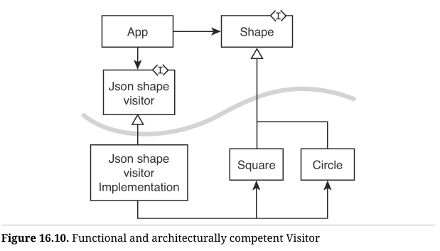

设计模式[^1]的概念是软件行业最深刻的思想之一，与结构化编程、面向对象编程和函数式编程齐名。它指出应用程序的某些部分由可重复使用的元素组成，这些元素可以解决许多应用中常见的问题。

然而，和很多优秀的软件理念一样，设计模式也曾被误解、滥用，甚至被视为过时或仅适用于特定场景而被弃用。实属可惜，因为设计模式本质上非常实用。

## 设计模式回顾

设计模式是在特定环境下解决常见问题的命名方案。是的，我知道，这又是一个词语堆砌。让我给你讲个故事吧。

很久以前，在一个遥远的年代，我是一个活跃的作者，经常在一个名为 `comp.object`[^2] 的社交网络上发文。在这个小组中，我们讨论面向对象设计的各种问题。

有一天，有人提出了一个简单的问题，建议我们每个人用自己的方式来解决它，然后讨论结果。问题是：

*给定一个开关和一盏灯，让开关可以控制灯的开关。*

这个讨论持续了数月。

最简单的解决方案当然就是图 16.1 中的方案。


`Switch` 类调用 `Light` 类[^3]的 `TurnOn` 方法。

反对意见是：`Switch` 类还可以用于打开其他设备，如风扇或电视。因此，`Switch` 类不应直接依赖于 `Light` 类。两者之间应该有一个抽象层，如图 16.2 所示。


现在，`Switch` 类使用了一个名为 `Switchable` 的接口，而 `Light` 类实现了 `Switchable` 接口。

这样一来，我们就可以通过 `Switch` 控制任意数量的设备了。这个方案是 DIP（依赖倒置原则）、OCP（开放封闭原则）和 LSP（里氏替换原则）的最简单表达之一。它也有一个名字，叫做“抽象服务端”（Abstract Server）[^4]。

假如我们团队正在讨论如何避免 `Switch` 类直接耦合到 `Light` 类，那么团队中的某个人可能会提议：“我们可以使用抽象服务端模式。”如果团队所有成员都了解这个名称及其含义，他们就能迅速决定该方案是否合适。

这就是设计模式：在特定情境下解决某个问题的命名方案。设计模式的价值在于名称和方案具有权威性，因此熟悉这一体系的人可以通过使用名称快速理解彼此。你说“抽象服务端”，我立刻明白你的意思是“在客户端和服务端之间引入一个接口”。

那么设计模式中的“特定情境”部分是什么呢？我们再回到团队中。有人刚刚建议使用抽象服务端模式。另一位团队成员说：“不，你没理解，我们无法控制 `Light` 类，它是第三方库的一部分，无法修改它以实现接口。”

因此，问题的情境是我们希望将 `Switch` 和 `Light` 解耦，但无法修改 `Light` 类。于是团队中的另一个人说：“那我们可以使用适配器模式（Adapter）。”

如果你在团队中，但不知道适配器模式是什么，你可能就无法理解他们的建议。但是如果你熟悉设计模式的经典形式，就可以迅速评估这个建议。设计模式的好处就是让你了解这些名称和标准形式，以便能够快速应用它们。

适配器模式如图 16.3 所示。


`LightAdapter` 实现了 `Switchable` 接口，并将 `TurnOn` 调用转发给 `Light`。还没在白板上画出来，团队的每个人都已经在脑海中看到它的样子，因为他们熟悉设计模式的经典形式。因此，他们都对这个想法表示认同。

就在他们准备讨论下一个问题时，团队中的一人说：“等等，我们该使用哪种适配器形式？”

事实证明，设计模式的标准名称并不一定描述单一的解决方案。有些模式有多个形式，适配器就是其中之一。它可以如图 16.3 所示，也可以如图 16.4 所示。


前者称为对象形式的适配器，因为 `LightAdapter` 是一个独立的对象；后者则是类形式的适配器，因为 `LightAdapter` 是 `Light` 的子类。

团队成员讨论了一下这两种形式，并决定目前类形式的适配器足够，且能免去创建单独 `LightAdapter` 对象的麻烦。

### 函数式编程中的设计模式

多年来，我们听到过一些奇怪的传言，比如设计模式是为了解决面向对象语言带来的问题，而在函数式语言中则不需要设计模式。

在接下来的内容中，你会看到，确实有些设计模式的某些方面看起来像是为了解决面向对象语言的一些不足而存在的“变通方法”；但这并不适用于所有设计模式。而且，即使是这些特定的设计模式，也有更普遍的形式，使其在函数式语言中也可以适用。

### 抽象服务

那么，抽象服务在函数式语言中是什么样子呢？

让我们再次考虑 `Switch/Light` 的问题。在 Clojure 中可以这样表达：

```clojure
(defn turn-on-light []
  ;turn on the bloody light!
  )

(defn engage-switch []
  ;Some other stuff...
    (turn-on-light))
```

好吧，这并不复杂。然而，原有的问题显而易见。我们的 `engage-switch` 函数直接依赖于 `turn-on-light`，这意味着我们不能用它来打开风扇、电视或其他任何东西。那么，我们该怎么做呢？

当然，我们可以使用抽象服务端模式。我们只需在 `engage-switch` 函数和 `turn-on-light` 函数之间插入一个抽象接口。我们可以通过传递一个函数参数来实现这个目的。我们称其为抽象服务的函数形式：

```clojure
(defn engage-switch [turn-on-function]
  ;Some other stuff. . .
  (turn-on-function))
```

这在最简单的情况下是有效的。但是让我们稍微增加一点难度。假设 `engage-switch` 函数需要在不同时间将灯打开和关闭，也许它是某种家庭安防系统的一部分，带有用于控制灯的特殊定时器。这会将原有的问题变成这样：

```clojure
(defn turn-on-light []
  ;turn on the bloody light!
  )

(defn turn-off-light []
  ;Criminy! just turn it off!
  )

(defn engage-switch []
  ;Some other stuff...
  (turn-on-light)
  ;Some more other stuff...
  (turn-off-light))
```

现在，`engage-switch` 函数对 `light` 的依赖更加紧密了。我们可以使用抽象服务的相同函数形式，但传递两个参数显得有些笨拙。因此，我们可以传递一个包含多个方法的虚表（vtable）参数。我们称其为抽象服务的虚表形式：

```clojure
defn make-switchable-light []
  {:on turn-on-light
   :off turn-off-light})
  
(defn engage-switch [switchable]
  ;Some other stuff...
  ((:on switchable))
  ;Some more other stuff...
  ((:off switchable)))
```

这看起来确实不错。由于 Clojure 是动态类型语言，我们不需要担心继承或实现关系引发的问题。

当然，我们也可以用抽象服务模式的多方法形式来解决这个问题：

```clojure
(defmulti turn-on :type)
(defmulti turn-off :type)

(defmethod turn-on :light [switchable]
  (turn-on-light))

(defmethod turn-off :light [switchable]
  (turn-off-light))

(defn engage-switch [switchable]
  ;Some other stuff...
  (turn-on switchable)
  ;Some more other stuff...
  (turn-off switchable))
```

我使用以下测试对其进行了测试：

```clojure
(describe "switch/light"
  (with-stubs)
  (it "turns light on and off"
	(with-redefs [turn-on-light (stub :turn-on-light)
				  turn-off-light (stub :turn-off-light)]
	  (engage-switch {:type :light})
	  (should-have-invoked :turn-on-light)
	  (should-have-invoked :turn-off-light))))
```

这里的两个存根用于模拟目标函数。我们用 `{:type :light}` 参数调用 `engage-switch` 函数，然后测试两个目标函数是否实际被调用了。

我将抽象服务模式的协议/记录形式作为练习留给你。在这一点上，很清楚该模式在函数式语言中既适用又有用。

### 适配器

适配器模式用于在客户端需要使用服务端时，客户端所期望的接口与服务端提供的接口不兼容的情况。

例如，假设我们有前面讨论的 `engage-switch` 函数，但我们想将一个第三方的 `:variable-light` 传递给它。`:variable-light` 的 `turn-on-light` 函数接受一个用于控制灯光亮度的参数：0 表示关闭，100 表示全亮。

`:variable-light` 的接口与 `engage-switch` 函数的预期接口不匹配，因此我们需要一个适配器。

最简单的适配器形式可能如下所示：

```clojure
(defn turn-on-light [intensity]
  ;Turn it on with intensity.
  )

(defmulti turn-on :type)
(defmulti turn-off :type)

(defmethod turn-on :variable-light [switchable]
  (turn-on-light 100))

(defmethod turn-off :variable-light [switchable]
  (turn-on-light 0))

(defn engage-switch [switchable]
  ;Some other stuff...
  (turn-on switchable)
  ;Some more other stuff...
  (turn-off switchable))
```

我使用以下测试验证了这个适配器：

```clojure
(describe "Adapter"
  (with-stubs)
  (it "turns light on and off"
	(with-redefs [turn-on-light (stub :turn-on-light)]
	  (engage-switch {:type :variable-light})
	  (should-have-invoked :turn-on-light {:times 1 :with [100]})
	  (should-have-invoked :turn-on-light {:times 1 :with [0]}))))
```

如果用 UML 绘制这个结构，大概会如图16.5所示。


`defmulti` 函数对应于 `Switchable` 接口。`{:type :variable-light}` 对象与两个 `defmethod` 函数配合使用，对应于 `VariableLightAdapter`。`EngageSwitch` 和 `VariableLight`“类”对应于我们试图适配的两个函数。

也许你对此不以为然，毕竟这只是一个包含几个 `defmulti` 函数的小程序，并没有 UML 图中那样明显的面向对象结构。所以，让我们通过将源文件拆分来引入这样的结构。

我们先从 `switchable` 接口开始。在 `ns` 声明中，我使用了 `turn-on-light` 作为包含 `switchable` 命名空间的项目的总体命名空间：

```clojure
(ns turn-on-light.switchable)

(defmulti turn-on :type)
(defmulti turn-off :type)
```

这是一个多态接口。注意它没有源代码依赖。此外，请记住，在 Clojure 中，`ns` 声明对源文件有与 Java 类类似的要求，源文件和命名空间的名称必须对应[^5]。因此，当我们将代码的各个部分移入不同的命名空间时，也会将它们移入不同的源文件。

接下来，让我们看看 `engage-switch` 和 `variable-light` 命名空间：

```clojure
(ns turn-on-light.engage-switch
  (:require [turn-on-light.switchable :as s]))

(defn engage-switch [switchable]
  ;Some other stuff...
  (s/turn-on switchable)
  ;Some more other stuff...
  (s/turn-off switchable))


(ns turn-on-light.variable-light)
(defn turn-on-light [intensity]
  ;Turn it on with intensity.
  )
```

这里并没有什么真正的意外。`engage-switch` 命名空间依赖于 `switchable` 接口，`variable-light` 命名空间则没有外部源代码依赖。

而 `variable-light-adapter` 命名空间将 `switchable` 接口与 `variable-light` 连接起来。请注意其中的 `make-adapter` 构造函数，测试会使用它：

```clojure
(ns turn-on-light.variable-light-adapter
  (:require [turn-on-light.switchable :as s]
			[turn-on-light.variable-light :as v-l]))
  (defn make-adapter []
	{:type :variable-light})

(defmethod s/turn-on :variable-light [switchable]
  (v-l/turn-on-light 100))

(defmethod s/turn-off :variable-light [switchable]
  (v-l/turn-on-light 0))
```

最后，测试通过依赖所有的具体命名空间，将所有部分整合在一起：

```clojure
(ns turn-on-light.turn-on-spec
  (:require [speclj.core :refer :all]
            [turn-on-light.engage-switch :refer :all]
            [turn-on-light.variable-light :as v-l]
            [turn-on-light.variable-light-adapter
			  :as v-l-adapter]))

(describe "Adapter"
  (with-stubs)
  (it "turns light on and off"
	(with-redefs [v-l/turn-on-light (stub :turn-on-light)]
      (engage-switch (v-l-adapter/make-adapter))
      (should-have-invoked :turn-on-light
						   {:times 1 :with [100]}
	  (should-have-invoked :turn-on-light
						   {:times 1 :with [0]}))))
```

查看这些源代码依赖，并将其与 UML 图进行比较，你会发现它们完全匹配。

那么，这是哪种形式的适配器模式呢？我们可以称其为“多方法”形式，但它也是“对象”形式。

在 Clojure 中构建适配器模式的“类”形式是否可能？不可能，因为 Clojure 没有实现的继承，而类形式的适配器模式依赖于此。

因此，尽管适配器模式并不依赖于特定语言，但其不同形式确实受语言限制。例如，在 Java 中无法创建多方法形式的适配器模式。

#### 这真的是一个适配器对象吗？

或许你认为，由于 `variable-light-adapter` 中唯一的数据元素是 `:type`，它还不够资格被称为对象。那么，这里有一个稍微不同的 `variable-light-adapter` 版本，可能更具说服力：

```clojure
(ns turn-on-light.variable-light-adapter
  (:require [turn-on-light.switchable :as s]
			[turn-on-light.variable-light :as v-l]))

(defn make-adapter [min-intensity max-intensity]
  {:type :variable-light
   :min-intensity min-intensity
   :max-intensity max-intensity})

(defmethod s/turn-on :variable-light [variable-light]
  (v-l/turn-on-light (:max-intensity variable-light)))

(defmethod s/turn-off :variable-light [variable-light]
  (v-l/turn-on-light (:min-intensity variable-light)))


(ns turn-on-light.turn-on-spec
  (:require [speclj.core :refer :all]
            [turn-on-light.engage-switch :refer :all]
            [turn-on-light.variable-light :as v-l]
            [turn-on-light.variable-light-adapter
				:as v-l-adapter]))

(describe "Adapter"
  (with-stubs)
  (it "turns light on and off"
	(with-redefs [v-l/turn-on-light (stub :turn-on-light)]
	  (engage-switch (v-l-adapter/make-adapter 5 90))
	  (should-have-invoked :turn-on-light
						   {:times 1 :with [90]})
      (should-have-invoked :turn-on-light
						   {:times 1 :with [5]}))))
```

现在，你应该确信这就是适配器模式，直接出自 GOF[^6] 书籍。此外，你应该开始期待许多其他的 GOF 模式也可以在像 Clojure 这样的函数式语言中实现。而更重要的是，你应该开始考虑将命名空间和源文件结构视为函数式程序设计和架构的一部分。

### 命令模式

在 GOF 书籍的所有设计模式中，命令模式（Command）最让我着迷。并不是因为它复杂，而是因为它非常简单，极其简单。

顺带一提，这也是让我对 Clojure 着迷的原因之一。正如我在本书开头所说，Clojure 语义丰富但语法简单。而命令模式也具备相同的特质：它的丰富性在于其极致的简单。

在 C++ 中，我们可以像下面这样实现命令模式：

```cpp
class Command {
public:
    virtual void execute() = 0;
};
```

就这样，一个抽象类（接口）包含一个纯虚（抽象）函数。如此简单，但你可以用这个模式做许多有趣的事情。关于这方面的深入探讨，请参考《敏捷软件开发：原则、模式与实践》的相关章节。[^7]

在像 Clojure 这样的函数式语言中，你可能认为这个模式就此消失了。毕竟，如果你想传递一个命令给其他函数，只需要传递命令函数就好了，不需要将其封装成对象，因为在函数式语言中，函数本身就是对象：

```clojure
(ns command.core)

(defn execute []
  )

(defn some-app [command]
  ;Some other stuff. . .
  (command)
  ;Some more other stuff. . .
  )


(ns command.core-spec
  (:require [speclj.core :refer :all]
			[command.core :refer :all]))

(describe "command"
  (with-stubs)
  (it "executes the command"
	(with-redefs [execute (stub :execute)]
	  (some-app execute)
	  (should-have-invoked :execute))))
```

> 细心的读者可能会发现，这里的命令并不是纯函数（即没有引用透明性）。然而，可以清楚地看到，纯函数也可以按照这种方式传递。
>
> **`with-redefs`**：重定义 `execute` 函数，使其成为一个 stub。这一行代码的作用是将 `command.core/execute` 替换为 `(stub :execute)`，从而创建一个模拟函数 `:execute`，用于监控 `execute` 是否被调用。

如上所示，测试将 `execute` 函数传递给 `some-app`，然后 `some-app` 调用该命令。没什么特别的。

那么，如果你想创建一个带有数据元素的命令，并将该数据作为参数传递给 `execute` 函数呢？在 C++ 中，我们会这样做（请原谅我使用内联函数）：

```c++
class CommandWithArgument : public Command {
public:
	CommandWithArgument(int argument)
	:argument(argument)
	{}
	
	virtual void execute()
	{theFunctionToExecute(argument);}

private:
int argument;

    void theFunctionToExecute(int argument)
    {
    //do something with that argument!
    }
};
```

在 Clojure 中，我们可以这样做，再次证明在函数式语言中，函数实际上就是对象：

```clojure
(defn execute-command [command]
  (command))

(execute-command (fn [state] (println "Executing command with state:" state)))
```

#### 撤销功能

命令模式的一个更有用的变体可以通过以下 C++ 代码看出：

```cpp
class UndoableCommand : public Command {
public:
  virtual void undo() = 0;
};
```

这个 `undo()` 函数带来了许多有趣的可能性。

很久以前，我曾参与开发一个类似 AutoCAD 的 GUI 应用程序。它是一个绘图工具，用于建筑平面图、屋顶图、地界图等。GUI 采用典型的调色板/画布模式，用户可以在调色板中点击选择他们想要的功能，例如“添加房间”，然后在画布上点击来确定位置和大小。

每次在调色板中点击时，都会实例化并执行一个 `UndoableCommand` 的派生类对象。执行过程管理画布上的鼠标/键盘手势，然后对内部数据模型进行相应的修改。因此，调色板中的每个不同功能都有一个相应的 `UndoableCommand` 派生类。

当一个 `UndoableCommand` 对象完成执行后，它会被推入撤销栈。每当用户点击调色板中的撤销图标时，撤销栈顶部的 `UndoableCommand` 被弹出并调用其 `undo` 函数。

在执行 `UndoableCommand` 对象时，它会记录所做的操作，以便 `undo` 函数可以逆转这些更改。在 C++ 中，这种记录保存在特定的 `UndoableCommand` 对象的成员变量中：

```cpp
class AddRoomCommand : public UndoableCommand {
    public:
        virtual void execute() {
        // manage canvas events to add room
        // record what was done in theAddedRoom
        }
        virtual void undo() {
        // remove theAddedRoom from the canvas
        }
    private:
        Room* theAddedRoom;
};
```

这并非函数式，因为 `AddRoomCommand` 对象是可变的。但在函数式语言中，我们可以让 `execute` 函数创建一个新的 `UndoableCommand` 实例。类似于这样：

```clojure
(ns command.undoable-command)

(defmulti execute :type)
(defmulti undo :type)


(ns command.add-room-command
  (:require [command.undoable-command :as uc]))

(defn add-room []
  ;stuff that adds rooms to the canvas
  ;and returns the added room
)

(defn delete-room [room]
  ;stuff that deletes the specified room from the
  )

(defn make-add-room-command []
  {:type :add-room-command})

(defmethod uc/execute :add-room-command [command]
  (assoc (make-add-room-command) :the-added-room (and-room)))

(defmethod uc/undo :add-room-command [command]
  (delete-room (:the-added-room command)))


(ns command.core
  (:require [command.undoable-command :as uc]
			[command.add-room-command :as ar]))

(defn gui-app [actions]
  (loop [actions actions
		 undo-list (list)]
	(if (empty? actions)
	  :DONE
	  (condp = (first actions)
	  	:add-room-action
		(let [executed-command (uc/execute
								(ar/make-add-room-command))]
		  (recur (rest actions)
				 (conj undo-list executed-command
          :undo-action
          (let [command-to-undo (first undo-list)]
            (uc/undo command-to-undo)
            (recur (rest actions)
                    (rest undo-list)))
           :TILT))))

(ns command.core-spec
(:require [speclj.core :refer :all]
          [command.core :refer :all]
          [command.add-room-command :as ar]))
          
(describe "command"
  (with-stubs)
  (it "executes the command"
	(with-redefs [ar/add-room (stub :add-room {:return :a-room})
				  ar/delete-room (stub :delete-room)]
	  (gui-app [:add-room-action :undo-action])
	  (should-have-invoked :add-room)
	  (should-have-invoked :delete-room {:with [:a-room]})))
```

我们通过 `defmulti` 函数创建 `undoable-command` 接口。在 `add-room-command` 命名空间中实现该接口，并在 `command.core` 命名空间的 `gui-app` 函数中模拟 GUI。

测试中会替换掉 `add-room-command` 的底层函数，并确保它们被正确调用。它会使用一个 `palette-actions` 列表调用 `gui-app`。

`add-room-command` 的两个方法通过多态方式调度。对于 `execute` 方法，这种多态调度看似并不必要，因为 `gui-app` 刚刚创建了 `add-room-command` 对象。但如果我们向系统中添加更多命令，那么 `execute` 的多态调度会变得更有必要。

而对于 `undo` 的多态调度，即使在这个小示例中也是显然必要的，因为在从调色板接收到 `:undo-action` 时，我们不知道要撤销的是哪个命令。

在这里我们再次看到，随着应用程序复杂度的增加，GOF 模式的标准形式开始显现出来。在单一方法命令的情况下，我们可以简单地使用普通函数（实际上是函数对象）。但当应用程序需要更丰富的命令类型时，我们回归到 GOF 风格。

### 组合模式

组合模式（Composite）延续了语义丰富和语法简单的主题。这是一个绝佳的“句柄/主体”方法的例子，我第一次在 Jim Coplien 的书[^9]中读到这个方法。组合模式的结构在图 16.6 的 UML 图中展示。


我们的老朋友 `Switchable` 接口由其他熟悉的朋友 `Light` 和 `VariableLight` 实现。而 `CompositeSwitchable` 也实现了 `Switchable` 接口，并包含了一个 `Switchable` 实例的列表。

`CompositeSwitchable` 中 `TurnOn` 和 `TurnOff` 的实现只是将相同函数的调用传递给列表中的所有实例。因此，当你在一个 `CompositeSwitchable` 实例上调用 `TurnOn` 时，它会调用它所包含的所有 `Switchable` 实例的 `TurnOn` 方法。

在 Java 中，我们可以这样实现 `CompositeSwitchable`：

```java
public class CompositeSwitchable implements Switchable {
    private List<Switchable> switchables = new ArrayList<>();

    public void addSwitchable(Switchable switchable) {
        switchables.add(switchable);
    }

    @Override
    public void turnOn() {
        for (Switchable switchable : switchables) {
            switchable.turnOn();
        }
    }

    @Override
    public void turnOff() {
        for (Switchable switchable : switchables) {
            switchable.turnOff();
        }
    }
}
```

在像 Clojure 这样的函数式语言中，我们可能会倾向于避免使用组合模式，而是简单地使用 `map` 或 `doseq` 函数，正如下面的测试所示：

```clojure
(ns composite-example.switchable)

(defmulti turn-on :type)
(defmulti turn-off :type)

(ns composite-example.light
  (:require [composite-example.switchable :as s])

(defn make-light [] {:type :light})

(defn turn-on-light [])
(defn turn-off-light [])

(defmethod s/turn-on :light [switchable]
  (turn-on-light))

(defmethod s/turn-off :light [switchable]
  (turn-off-light))


(ns composite-example.variable-light
  (:require [composite-example.switchable :as s])

(defn make-variable-light [] {:type :variable-light})

(defn set-light-intensity [intensity])

(defmethod s/turn-on :variable-light [switchable]
  (set-light-intensity 100))

(defmethod s/turn-off :variable-light [switchable]
  (set-light-intensity 0))


(ns composite-example.core-spec
  (:require [speclj.core :refer :all]
			[composite-example
            [light :as l]
            [variable-light :as v]
            [switchable :as s]]))

(describe "composite-switchable"
  (with-stubs)
  (it "turns all on"
	(with-redefs
	  [l/turn-on-light (stub :turn-on-light)
	   v/set-light-intensity (stub :set-light-intensity)]
	  (let [switchables [(l/make-light) (v/make-variable-light)]]
		(doseq [s-able switchables] (s/turn-on s-able))
        (should-have-invoked :turn-on-light)
        (should-have-invoked :set-light-intensity
							{:with [100]})))))
```

这样做可以实现点亮所有灯的目标，但代价是将“灯”的复数概念外部化了。组合模式的意义在于隐藏这种复数性。因此，让我们使用实际的组合模式：

`composite-switchable` 实现了 `switchable` 接口。`add` 函数是函数式的，它返回一个新的 `composite-switchable`，其中添加了新的 `:switchables` 列表项。`turn-on` 和 `turn-off` 方法使用 `doseq` 遍历 `:switchables` 列表，并传播相应的函数调用。最后，测试中创建了 `composite-switchable`，添加了一个灯和一个 `variable-light`，然后调用 `turn-on`，我们可以看到两个灯都被成功点亮。

#### 函数式？

此时，你可能会认为组合模式非常适合具有副作用的对象，例如灯和可变灯。的确，整个 `switchable` 接口都是围绕着开关操作的副作用而设计的。那么这个模式是否仅适用于有副作用的对象呢？

让我们考虑一个看起来像这样的形状抽象：

```clojure
(ns composite-example.shape
  (:require [clojure.spec.alpha :as s]))

(s/def ::type keyword?)
(s/def ::shape-type (s/keys :req [::type]))

(defmulti translate (fn [shape dx dy] (::type shape)))
(defmulti scale (fn [shape factor] (::type shape)))
```

这是一个简单的接口，包含两个方法：`translate` 和 `scale`。我还添加了类型规范以增强安全性。（此时复习一下双冒号 `::` 语法，表示命名空间关键字会是个好主意。）每个形状都是一个包含 `::shape/type` 元素的 map。

`circle` 和 `square` 的实现也很简单，包括它们的类型规范：

```clojure
(ns composite-example.circle
  (:require [clojure.spec.alpha :as s]
			[composite-example.shape :as shape]))

(s/def ::center (s/tuple number? number?))
(s/def ::radius number?)
(s/def ::circle (s/keys :req [::shape/type
                              ::radius
                              ::center]))

(defn make-circle [center radius]
  {:post [(s/valid? ::circle %)]}
  {::shape/type ::circle
                ::center center
                ::radius radius})

(defmethod shape/translate ::circle [circle dx dy
  {:pre [(s/valid? ::circle circle)
		(number? dx) (number? dy)]
   :post [(s/valid? ::circle %)]}
  (let [[x y] (::center circle)]
    (assoc circle ::center [(+ x dx) (+ y dy)])))
                                     
(defmethod shape/scale ::circle [circle factor]
  {:pre [(s/valid? ::circle circle)
		 (number? factor)]
   :post [(s/valid? ::circle %)]}
  (let [radius (::radius circle)]
    (assoc circle ::radius (* radius factor))))
                                     
(ns composite-example.square
  (:require [clojure.spec.alpha :as s]
			[composite-example.shape :as shape]))
                                     
(s/def ::top-left (s/tuple number? number?))
(s/def ::side number?)
(s/def ::square (s/keys :req [::shape/type
                              ::side
                              ::top-left]))
                                     
(defn make-square [top-left side]
  {:post [(s/valid? ::square %)]}
  {::shape/type ::square
   ::top-left top-left
   ::side side})
                                     
(defmethod shape/translate ::square [square dx dy]
  {:pre [(s/valid? ::square square)
		 (number? dx) (number? dy)]
   :post [(s/assert ::square %)]}
  (let [[x y] (::top-left square)] ;;解构 square 对象中的 ::top-left 属性，得到 x 和 y 坐标。
	(assoc square ::top-left [(+ x dx) (+ y dy)]) ;;创建一个新的映射，将 square 的 ::top-left 值更新为偏移后的新坐标 [(+ x dx) (+ y dy)]
      
(defmethod shape/scale ::square [square factor]
  {:pre [(s/valid? ::square square)
		 (number? factor)]
   :post [(s/valid? ::square %)]}
  (let [side (::side square)]
	(assoc square ::side (* side factor))))
```

注意方法上的 `:pre` 和 `:post` 条件。我使用这些来检查传入和传出函数的类型。你可能会担心这些检查会带来运行时开销。一旦我确认类型管理妥当，我要么全局禁用[^10]它们，要么有选择地注释掉它们。

注意到 `translate` 和 `scale` 函数会返回新的形状实例。它们在行为上是完全函数式的。

现在让我们来看下 `composite-shape`：

```clojure
(ns composite-example.composite-shape
  (:require [clojure.spec.alpha :as s]
			[composite-example.shape :as shape]))
			
(s/def ::shapes (s/coll-of ::shape/shape-type))
(s/def ::composite-shape (s/keys :req [::shape/type
									   ::shapes])
									   
(defn make []
  {:post [(s/assert ::composite-shape %)]}
  {::shape/type ::composite-shape
   ::shapes []})

(defn add [cs shape]
  {:pre [(s/valid? ::composite-shape cs)
		 (s/valid? ::shape/shape-type shape)]
   :post [(s/valid? ::composite-shape %)]}
   (update cs ::shapes conj shape))

(defmethod shape/translate ::composite-shape [cs dx dy]
  {:pre [(s/valid? ::composite-shape cs)
		 (number? dx) (number? dy)]
   :post [(s/valid? ::composite-shape %)]}
  (let [translated-shapes (map #(shape/translate % dx dy)
							   (::shapes cs))]
	(assoc cs ::shapes translated-shapes)))

(defmethod shape/scale ::composite-shape [cs factor]
  {:pre [(s/valid? ::composite-shape cs)
		 (number? factor)]
   :post [(s/valid? ::composite-shape %)]}
  (let [scaled-shapes (map #(shape/scale % factor)
						   (::shapes cs))]
	(assoc cs ::shapes scaled-shapes)))
```

我们在灯和可变灯的例子中已经见过这种模式。不过这一次，`composite-shape` 返回的是一个包含新形状实例的 `composite-shape`。因此，它是函数式的。

对于好奇的读者，这里是我使用的测试：

```clojure
(ns composite-example.core-spec
  (:require [speclj.core :refer :all]
            [composite-example
            [square :as square]
            [shape :as shape]
            [circle :as circle]
            [composite-shape :as cs]]))
            
(describe "square"
  (it "translates"
	(let [s (square/make-square [3 4] 1)
	  	  translated-square (shape/translate s 1 1)]
	  (should= [4 5] (::square/top-left translated-square))
	  (should= 1 (::square/side translated-square))))
	  
  (it "scales"
	(let [s (square/make-square [1 2] 2)
		  scaled-square (shape/scale s 5)]
      (should= [1 2] (::square/top-left scaled-square))
      (should= 10 (::square/side scaled-square)))))
      
(describe "circle"
  (it "translates"
	(let [c (circle/make-circle [3 4] 10)
		  translated-circle (shape/translate c 2 3)]
      (should= [5 7] (::circle/center translated-circle))
      (should= 10 (::circle/radius translated-circle))))
  
  (it "scales"
	(let [c (circle/make-circle [1 2] 2)
		  scaled-circle (shape/scale c 5)]
	  (should= [1 2] (::circle/center scaled-circle))
	  (should= 10 (::circle/radius scaled-circle)))))
	  
(describe "composite shape"
  (it "translates"
	(let [cs (-> (cs/make)
                 (cs/add (square/make-square [0 0] 1))
                 (cs/add (circle/make-circle [10 10] 10)))
                 translated-cs (shape/translate cs 3 4)]
       (should= #{{::shape/type ::square/square
                   ::square/top-left [3 4]
                   ::square/side 1}
                  {::shape/type ::circle/circle
                   ::circle/center [13 14]
                   ::circle/radius 10}}
                (set (::cs/shapes translated-cs)))

(it "scales"
  (let [cs (-> (cs/make)
               (cs/add (square/make-square [0 0] 1))
               (cs/add (circle/make-circle [10 10] 10)))
	   scaled-cs (shape/scale cs 12)]
	(should= #{{::shape/type ::square/square
                ::square/top-left [0 0]
                ::square/side 12}
               {::shape/type ::circle/circle
                ::circle/center [10 10]
                ::circle/radius 120}}
			 (set (::cs/shapes scaled-cs))))))
```

你可能已经注意到，随着章节的推进，我逐渐使用了 Clojure 中更多细微的特性。这是有意为之。我希望你在阅读本书时，手边有一本可靠的 Clojure 参考书，因此我为你提供了一系列机会来查找内容并更熟悉这门语言。

正如我们所见，组合模式（Composite）是另一个非常适合函数式编程的 GOF 设计模式。一旦我们开始利用多态分发，无论是通过虚表（vtables）、多方法（multi-methods），还是协议/记录（protocol/record）结构，GOF 模式就能够很好地融入函数式编程世界，几乎完全符合 GOF 的描述。

### 装饰器模式

“处理体模式”中另一个经典模式是装饰器（Decorator）。装饰器模式是一种在不直接修改类型模型的情况下，为类型模型添加功能的方法。

例如，让我们继续我们的形状项目。我们有一个形状类型模型，该模型支持 `circle` 和 `square` 等子类型。在该类型模型中，只要符合里氏替换原则（LSP），我们就可以对任何形状的子类型进行平移和缩放，而无需知道具体的子类型。

现在，我们想增加一个新的可选功能：带日志记录的形状（`journaled-shape`）。`journaled-shape` 是一种能够记录自创建以来执行过的操作的形状。我们希望能够记录某些 `square` 和 `circle` 的操作；但并不是每一个 `circle` 和 `square` 都需要记录，因为这样会带来高内存和处理成本。

当然，我们可以通过向形状抽象中添加一个 `:journaled?` 标志，并在 `circle` 和 `square` 的实现中加入 `if` 语句来实现。但那样会显得杂乱无章。我们真正需要的是一种在不改变形状抽象或其任何子类型（包括 `circle`、`square` 和 `composite-shape`）的情况下，添加该功能的方法，这样也符合开放封闭原则（OCP）。

这时装饰器模式登场了。其 UML 图示如图 16.7 所示。


我之所以包含了 `composite-shape`，是因为它当前是形状类型模型的一部分，而 `journaled-shape` 则是装饰器。`journaled-shape` 继承自 `shape` 并包含一个对 `shape` 的引用。当在 `journaled-shape` 上调用 `translate` 或 `scale` 方法时，它会在日志中创建一个条目，然后将调用委托给包含的 `shape`。以下是 Clojure 的实现：

```clojure
(ns decorator-example.journaled-shape
  (:require [decorator-example.shape :as shape]
			[clojure.spec.alpha :as s]))
			
(s/def ::journal-entry
	   (s/or :translate (s/tuple #{:translate} number? number?)
			 :scale (s/tuple #{:scale} number?)))
(s/def ::journal (s/coll-of ::journal-entry))
(s/def ::shape ::shape/shape-type)
(s/def ::journaled-shape (s/and
						   (s/keys :req [::shape/
                                         ::journal
                                         ::shape])
						   #(= ::journaled-shape
							  (::shape/type %))))

(defn make [shape]
  
  {:post [(s/valid? ::journaled-shape %)]}
  {::shape/type ::journaled-shape
   ::journal []
   ::shape shape})

(defmethod shape/translate ::journaled-shape [js dx dy]
  {:pre [(s/valid? ::journaled-shape js)
		 (number? dx) (number? dy)]
   :post [(s/valid? ::journaled-shape %)]}
  (-> js (update ::journal conj [:translate dx dy])
	  (assoc ::shape (shape/translate (::shape js) dx dy))))

(defmethod shape/scale ::journaled-shape [js factor]
  {:pre [(s/valid? ::journaled-shape js)
		 (number? factor)]
   :post [(s/valid? ::journaled-shape %)]}
  (-> js (update ::journal conj [:scale factor])
	  (assoc ::shape (shape/scale (::shape js) factor))))
```

> (s/or :translate (s/tuple #{:translate} number? number?)
> 			 :scale (s/tuple #{:scale} number?))):
> 集合可以作为一个函数来测试元素是否属于其中。

`::journaled-shape` 对象有 `::shape` 和 `::journal` 字段。`::journal` 字段是一个包含 `::journal-entry` 元组的集合，这些元组的形式为 `[:translate dx dy]` 或 `[:scale factor]`，其中 `dx`、`dy` 和 `factor` 是数字。`::shape` 字段必须包含一个有效的 `shape`。

`make` 构造函数创建一个有效的 `journaled-shape`（由 `:post` 条件检查）。`translate` 和 `scale` 函数会将相应的日志条目添加到 `::journal` 中，然后将它们各自的操作委托给 `::shape`，返回一个包含更新的 `::journal` 和修改后的 `::shape` 的新 `journaled-shape`。

以下是测试。我只用 `square` 测试了 `journaled-shape`，因为如果它对 `square` 有效，那它就能适用于所有 `shape`：

```clojure
(describe "journaled shape decorator"
  (it "journals scale and translate operations"
	(let [jsd (-> (js/make (square/make-square [0 0] 1))
                  (shape/translate 2 3)
                  (shape/scale 5))]
	  (should= [[:translate 2 3] [:scale 5]]
				(::js/journal jsd))
	  (should= {::shape/type ::square/square
                ::square/top-left [2 3]
                ::square/side 5}
			   (::js/shape jsd)))))
```

我们创建了一个包含 `square` 的 `journaled-shape`，对其进行了平移和缩放，然后确保 `::journal` 记录了 `translate` 和 `scale` 调用，并且 `square` 具有相应的平移和缩放后的值。

我添加了类型规范，目的是给你一些挑战，同时展示这些规范的使用方式。不过坦率地说，我认为测试已经足够检查类型了，所以在实际情况下，对于这样的小问题，我可能不会使用如此详细的类型规范。不过，确实能清晰地看到这些类型的定义也挺不错的。

总之，注意到 `journaled-shape` 装饰器可以适用于任何 `shape`，包括 `composite-shape`。因此，我们有效地为类型模型增加了新功能，而无需更改该类型模型的现有元素。这就是开放封闭原则（OCP）在起作用。

### 访问者模式

噢，不！又是……访问者模式！是的，我们将深入探讨被广泛误解的访问者模式。访问者模式不同于处理/主体模式，它有其独特的结构，正如我们将看到的，它因某些语言选择而变得复杂。

访问者模式的目的是类似于装饰器模式。我们希望向现有的类型模型中添加一个新功能，而不更改该类型模型（遵循开闭原则，OCP）。当新功能与类型模型中的其他子类型无关时，装饰器模式是合适的。为了确认这一点，回顾一下带日志的 `journaled-shape`。日志记录与包含的图形是圆形还是方形无关。`journaled-shape` 装饰器从不需要知道其包含的图形的具体子类型。

然而，当我们希望添加的功能依赖于类型模型中的子类型时，就需要使用访问者模式。

例如，如果我们希望向 `shape` 抽象类型中添加一个将图形转换为字符串以便序列化的功能，我们可以直接在 `shape` 接口中添加一个 `to-string` 方法，简单明了。

但等等！如果某个客户希望将图形以 XML 格式输出呢？那么我们可能还需要添加一个 `to-xml` 方法，除了已有的 `to-string` 方法。

再等等！如果另一个客户想要 JSON 格式输出，而还有另一个客户想要 YAML 格式输出……最终，你会意识到这些数据格式几乎是无穷无尽的，客户会不断提出更多需求。我们可不想用这么多方法污染 `shape` 接口。

访问者模式为我们提供了一种解决这个困境的方法。UML 图看起来像图 16.8。


首先，我想指出的是在 `ShapeVisitor` 中将 `Shape` 子类型旋转了90度。`ShapeVisitor` 中的 `visit` 方法接收的参数类型分别是 `Square` 和 `Circle`，这些参数类型对应 `Shape` 的子类型。我称这种子类型到方法的转换为90度旋转，因为这让我的某些神经元感到愉悦。

在左侧，我们看到 `Shape` 抽象及其所有子类型；在右侧，我们看到 `ShapeVisitor` 层级结构。该模式向 `Shape` 接口中添加了一个 `accept` 函数。这个函数接受一个 `ShapeVisitor` 作为唯一参数。这虽然违背了开闭原则（OCP），但仅仅一次。

在 Java 中，实现 `accept` 函数非常简单：

```java
void accept(ShapeVisitor visitor) {
  visitor.visit(this);
}
```

如果您以前从未研究过访问者模式，可能会有点难以理解。所以，请花点时间，跟随我一步步梳理这个过程。

假设我们希望获取某个 `Shape` 对象的 JSON 字符串。在 Java、C++ 或其他类似语言中，我们可以这样做：

```java
Shape s = // get a shape without knowing the subt
ShapeVisitor v = new JsonVisitor();
s.accept(v);
String json = v.getJson();
```

我们从某个地方获取了一个 `Shape` 对象，创建了 `JsonVisitor`，然后将 `JsonVisitor` 传递给 `Shape` 对象的 `accept` 方法。`accept` 方法会多态地派发到 `Shape` 的正确子类型——假设这是一个 `Square`。`Square` 的 `accept` 方法调用 `JsonVisitor` 的 `visit(this)` 方法。此时，`this` 的类型是 `Square`，因此会调用 `JsonVisitor` 的 `visit(Square s)` 方法。这个方法生成 `Square` 的 JSON 字符串并将其保存在 `JsonVisitor` 的成员变量中，然后 `getJson()` 函数返回该成员变量的内容。

你可能需要反复阅读几遍才能完全理解。这种技术称为双重派发。第一次派发分配到 `Shape` 的子类型，以确定该子类型的真实类型。第二次派发则调用访问者的相应子类型方法，传递子类型的真实类型。

如果你理解了这点，那么可以看到 `ShapeVisitor` 的每一个派生类实际上都是 `Shape` 类型模型的一种新“方法”，而我们需要添加到 `Shape` 中的唯一东西就是 `accept` 方法。所以这只“部分”符合开闭原则（OCP）。你现在也应该明白为什么不能使用装饰器模式了。新的功能强烈依赖于子类型。如果你不知道对象是 `Square` 类型，就无法为 `Square` 生成 JSON 字符串。

我之所以告诉你这一切，是为了接下来要讲的内容。所有这些复杂性实际上都是由语言约束引起的。是的，这正是那些反对设计模式的人真正持反对意见的地方。访问者模式之所以复杂，正是由于一种特定的语言特性。

是什么特性呢？封闭类（Closed Classes）。

#### 是封闭还是 Clojure

在 C++ 和 Java 这样的语言中，我们创建的类是封闭的。这意味着我们不能通过在新源文件中声明一个新方法来给类添加新方法。如果想在封闭语言中给类添加新方法，就必须打开该类的源文件，并在类的定义中添加方法。

Clojure 不受这一限制。某种程度上，C# 也不受此限制。实际上，许多语言允许你在不更改类声明所在源文件的情况下为类添加方法。

Clojure 没有这一限制的原因是，类并不是语言的内置特性。我们通过约定而不是语法来创建类。

那么，这是否意味着在 Clojure 中我们不再需要装饰器模式或访问者模式呢？并不是这样。实际上，正如我们看到的，我们在 Clojure 中仍然需要 GOF（Gang of Four）形式的装饰器模式。否则，我们又如何实现 `journaled-shape` 呢？

然而，对于拥有开放类的语言来说，GOF 形式的访问者模式并非必要。更准确地说，GOF 形式中的一些细节不是必需的。

接下来，让我展示如何在 Clojure 中实现这个特定的访问者模式。首先是测试：

```clojure
(ns visitor-example.core-spec
  (:require [speclj.core :refer :all]
            [visitor-example
            [square :as square]
            [json-shape-visitor :as jv]
            [circle :as circle]]))
            
(describe "shape-visitor"
  (it "makes json square"
	(should= "{\"top-left\": [0,0], \"side\": 1}"
			 (jv/to-json (square/make [0 0] 1))))

  (it "makes json circle"
	(should= "{\"center\": [3,4], \"radius\": 1}"
			 (jv/to-json (circle/make [3 4] 1)))))

```

这不应该让人感到意外；不过，你应该特别注意源代码的依赖关系。这个测试几乎需要依赖所有内容。

现在让我们回顾一下形状类型模型的样子。为了保持简单，我去掉了所有 `clojure.spec` 类型规范：

```clojure
(ns visitor-example.shape)

(defmulti translate (fn [shape dx dy] (::type shape)))
(defmulti scale (fn [shape factor] (::type shape)))


(ns visitor-example.square
  (:require
	[visitor-example.shape :as shape]))

(defn make [top-left side]
  {::shape/type ::square
   ::top-left top-left
   ::side side})

(defmethod shape/translate ::square [square dx dy]
  (let [[x y] (::top-left square)]
	(assoc square ::top-left [(+ x dx) (+ y dy)])

(defmethod shape/scale ::square [square factor]
  (let [side (::side square)]
	(assoc square ::side (* side factor))))


(ns visitor-example.circle
  (:require
	[visitor-example.shape :as shape]))

(defn make [center radius]
  {::shape/type ::circle
   ::center center
   ::radius radius})

(defmethod shape/translate ::circle [circle dx dy]
  (let [[x y] (::center circle)]
	(assoc circle ::center [(+ x dx) (+ y dy)])))

(defmethod shape/scale ::circle [circle factor]
  (let [radius (::radius circle)]
	(assoc circle ::radius (* radius factor))))
```

这一切应该都很熟悉了。接下来是 `json-shape-visitor`：

```clojure
(ns visitor-example.json-shape-visitor
  (:require [visitor-example
            [shape :as shape]
            [circle :as circle]
            [square :as square]]))

(defmulti to-json ::shape/type)

(defmethod to-json ::square/square [square]
  (let [{:keys [::square/top-left ::square/side]} square
	    [x y] top-left]
	(format "{\"top-left\": [%s,%s], \"side\": %s}" x y side)))

(defmethod to-json ::circle/circle [circle]
  (let [{:keys [::circle/center ::circle/radius]}
		[x y] center]
	(format "{\"center\": [%s,%s], \"radius\": %s}" x y radius)))
```

> 通过命名空间关键字解构，可以为键的局部部分创建一个局部变量——这里是 `top-left`。
>

仔细看。这一 `defmulti` 在 `json-shape-visitor` 中直接为形状类型模型添加了 `to-json` 方法。到这里，你可能已经很理解这个模式了；但你能看出为什么这是一个访问者模式吗？

你是否看到了从子类型到函数的“90度旋转”？

就像 Java 版本的访问者一样，`to-json` 操作的所有子类型都汇集在 `json-shape-visitor` 模块中。

如果你追踪所有的源代码依赖，并与 UML 图进行对比，你会发现所有依赖都已涵盖。唯一缺少的是 `ShapeVisitor` 接口和双重分派。那些只是为了解决 C++ 和 Java 等语言中的封闭类问题。

这告诉我们，GOF（四人帮）在这个模式上的理解有些偏差。双重分派只是访问者模式的附加内容，仅在封闭类的语言中才有必要。

**90度旋转问题**

但是，等等，这种“90度旋转”带来了一个问题。每当你有一个包含类型模型的每个子类型的方法的模块时，只要类型模型发生变化，该模块也必须更改。例如，如果我们在形状层级中添加一个三角形，我们的 `json-shape-visitor` 就需要一个 `::triangle/triangle` 的 `to-json` 方法实现。这违反了开放封闭原则（OCP）。

此外，这也是一个问题，因为它违反了“整洁架构[^13]”中的依赖规则，强迫高层模块在跨越架构边界[^14]时依赖低层模块。此问题在 UML 图（图 16.9）中有所体现。


通常，我们希望将形状的实现作为插件提供给 `App`。但是，`json-shape-visitor` 阻碍了这一点，因为我们要让 `App` 输出 JSON 的唯一方法就是调用 `json-shape-visitor`，而它直接依赖于 `circle` 和 `square`。

在 Java、C# 和 C++ 中，我们可以通过使用抽象工厂解决这一问题，这样 `App` 就可以实例化访问者对象而无需直接依赖它。

在 Clojure 中，我们有另一种——并且更好的——选择。我们可以将 `json-shape-visitor` 的接口与其实现分开，如下所示：

```clojure
(ns visitor-example.json-shape-visitor
  (:require [visitor-example
			[shape :as shape]]))
(defmulti to-json ::shape/type)


(ns visitor-example.json-shape-visitor-implementation
  (:require [visitor-example
			[json-shape-visitor :as v]
            [circle :as circle]
            [square :as square]]))

(defmethod v/to-json ::square/square [square]
  (let [{:keys [::square/top-left ::square/side]}
		[x y] top-left]
	(format "{\"top-left\": [%s,%s], \"side\": %s}" x y side)))

(defmethod v/to-json ::circle/circle [circle]
  (let [{:keys [::circle/center ::circle/radius]} circle
		[x y] center]
	(format "{\"center\": [%s,%s], \"radius\": %s}" x y radius)))
```

这里的关键是确保 `json-shape-visitor-implementation` 模块被 `main` 所 `require`，以便 `defmethod` 能够正确地与 `defmulti` 注册。

```clojure
(ns visitor-example.main
  (:require [visitor-example
			[json-shape-visitor-implementation]]))
```

通常情况下，在应用程序的任何部分之前会先调用 `main`，因此应用程序不会在源代码上依赖 `main`。不过，我的测试无法访问真正的 `main`，所以必须包括该依赖：

```clojure
(ns visitor-example.core-spec
  (:require [speclj.core :refer :all]
            [visitor-example
            [square :as square]
            [json-shape-visitor :as jv]
            [circle :as circle]
            [main]]))
            
(describe "shape-visitor"
  (it "makes json square"
	(should= "{\"top-left\": [0,0], \"side\": 1}"
			 (jv/to-json (square/make [0 0] 1))))

  (it "makes json circle"
	(should= "{\"center\": [3,4], \"radius\": 1}"
			 (jv/to-json (circle/make [3 4] 1))))
```

就这样，一个在 Clojure 中实现的功能强大且符合架构原则的访问者模式诞生了。如图 16.10 的 UML 所示，所有的依赖关系都跨越了架构边界，指向了该边界的高层（抽象）一侧。真是太好了！



因此，访问者模式是一个因当时语言的限制而被“污染”的例子。在 1995 年，GOF 书籍出版时，封闭类被认为是静态类型语言的必要属性，因此几乎是普遍存在的。

### 抽象工厂

DIP 建议我们避免对既不稳定又具体的事物产生源代码依赖。因此，我们通常会创建抽象结构，并尝试让依赖路由到这些抽象结构上。然而，在创建对象实例时，我们往往不得不违背这一建议；这可能导致架构上的困难，如图 16.11 所示的 UML 图展示的那样。


在图 16.11 中，`App` 使用了 `Shape` 接口。它所需要的操作都可以通过这个接口完成，除了一个例外：`App` 必须创建 `Circle` 和 `Square` 的实例，这就迫使 `App` 依赖于相应模块的源代码。

实际上，我们在之前的示例中已经见过这种情况。例如，回顾本章早些时候 `visitor-example` 测试中的代码。请注意，该测试由于需要调用 `make` 函数而不得不依赖于 `square` 和 `circle` 的源代码：

```clojure
(ns visitor-example.core-spec
  (:require [speclj.core :refer :all]
            [visitor-example
            [square :as square]
            [json-shape-visitor :as jv]
            [circle :as circle]
            [main]]))
            
(describe "shape-visitor"
  (it "makes json square"
	(should= "{\"top-left\": [0,0], \"side\": 1}"
			 (jv/to-json (square/make [0 0] 1))))

  (it "makes json circle"
	(should= "{\"center\": [3,4], \"radius\": 1}"
			 (jv/to-json (circle/make [3 4] 1))))
```

也许这看起来成本很小。但如果我们在这个 UML 图中添加一个架构边界，如图 16.12 所示，真正的代价就显而易见了。


我们可以看到，在架构边界上出现了 `<creates>` 依赖，违背了整洁架构的依赖法则[^16]。该法则规定，所有跨越架构边界的源代码依赖必须指向该边界的更高级一侧。`Circle` 和 `Square` 模块是 `App` 的低层细节，属于插件部分。因此，为了维护架构，我们需要以某种方式处理这些 `<creates>` 依赖。

抽象工厂模式提供了一个很好的解决方案，如图 16.13 所示。


现在，跨越边界的所有源代码依赖都指向更高级的那一侧，从而解决了依赖法则的违背。`Circle` 和 `Square` 仍然可以作为 `App` 的独立插件。`App` 依然可以创建 `Circle` 和 `Square` 实例，但通过 `ShapeFactory` 接口间接实现，这样就反转了源代码依赖（遵循了 DIP 原则）。

在 Clojure 中实现这一点很容易。我们只需要 `shape-factory` 接口及其实现：

```clojure
(ns abstract-factory-example.shape-factory)

(defmulti make-circle
  (fn [factory center radius] (::type factory)))

(defmulti make-square
  (fn [factory top-left side] (::type factory)))


(ns abstract-factory-example.shape-factory-implementation)
  (:require [abstract-factory-example
            [shape-factory :as factory]
            [square :as square]
            [circle :as circle]]))
  
(defn make []
  {::factory/type ::implementation})

(defmethod factory/make-square ::implementation
  [factory top-left side]
  (square/make top-left side))

(defmethod factory/make-circle ::implementation
  [factory center radius]
  (circle/make center radius))
```

这样，我们可以编写一个模拟 `App` 的测试：

```clojure
(ns abstract-factory-example.core-spec
  (:require [speclj.core :refer :all]
            [abstract-factory-example
            [shape :as shape]
            [shape-factory :as factory]
            [main :as main]]))

(describe "Shape Factory"
  (before-all (main/init))
  (it "creates a square"
	(let [square (factory/make-square
				   @main/shape-factory
				   [100 100] 10)]
	  (should= "Square top-left: [100,100] side: 10"
	  		   (shape/to-string square))))

  (it "creates a circle"
	(let [circle (factory/make-circle
				   @main/shape-factory
				   [100 100] 10)]
	   (should= "Circle center: [100,100] radius: 10"
			    (shape/to-string circle)))))
```

首先要注意的是，该测试并没有对 `circle` 或 `square` 的源文件依赖。它仅依赖于两个接口：`shape` 和 `shape-factory`。这正是我们的架构目标。

但是，那个 `main` 依赖是什么？注意测试开始时的 `(before-all (main/init))` 行。它指示测试运行器在任何测试开始前调用 `(main/init)`。这模拟了主模块在启动 `App` 之前初始化一切的过程。

`main`：

```clojure
(ns abstract-factory-example.main
  (:require [abstract-factory-example
			[shape-factory-implementation :as imp

(def shape-factory (atom nil))

(defn init[]
  (reset! shape-factory (imp/make)))
```

哦，瞧瞧！我们有一个名为 `shape-factory` 的全局 atom！并且该 atom 由 `init` 函数初始化为 `shape-factory-implementation`。

回顾一下测试，我们可以看到 `make-circle` 和 `make-square` 方法正在传递解引用的 `atom`。这种设置全局变量的方式是处理工厂模式的常见策略。主程序创建具体的工厂实现，并将其加载到一个可供所有人访问的全局变量中。在静态类型语言中，这个全局变量会具有 `ShapeFactory` 接口的类型声明。而在动态类型语言中，则不需要这种类型声明。

**再一次的 90 度转角**

看看图 16.13 中的 UML 图。你能在 `ShapeFactory` 中看到 90 度转角吗？在 `shape-factory` 的代码中也可以看到。`ShapeFactory`（以及 `shape-factory`）的各方法都对应于 `Shape` 的子类型。

这个问题在 Visitor 模式中也出现了，不过形式稍有不同。每当增加一个新的 `shape` 子类型时，`shape-factory` 都必须修改。这违反了开闭原则（OCP），因为我们必须修改架构边界高级别一侧的模块。如果开闭原则有任何重要性，那么尤其在跨越此类边界时最为重要。仔细研究一下该 UML 图，你就会明白我的意思。

我们可以通过将 90 度旋转替换为一个接收不透明标记的单一方法来解决此问题，类似于以下方式：

```clojure
(ns abstract-factory-example.shape-factory)
(defmulti make (fn [factory type & args] (::type factory)))


(ns abstract-factory-example.shape-factory-implementation
  (:require [abstract-factory-example
            [shape-factory :as factory]
            [square :as square]
            [circle :as circle]]))

(defn make []
  {::factory/type ::implementation})

(defmethod factory/make ::implementation
  [factory type & args]
  (condp = type
    :square (apply square/make args)
    :circle (apply circle/make args)))
    

(ns abstract-factory-example.core-spec
  (:require [speclj.core :refer :all]
            [abstract-factory-example
            [shape :as shape]
            [shape-factory :as factory]
            [main :as main]]))
            
(describe "Shape Factory"
  (before-all (main/init))
  (it "creates a square"
	(let [square (factory/make
				  @main/shape-factory
                  :square
                  [100 100] 10)]
  (should= "Square top-left: [100,100] side: 10"
		   (shape/to-string square))))

(it "creates a circle"
	(let [circle (factory/make
                  @main/shape-factory
                  :circle
                  [100 100] 10)]
	  (should= "Circle center: [100,100] radius: 10"
			   (shape/to-string circle)))))
```

注意，传递给 `shape-factory/make` 的参数是不透明的。也就是说，它未被任何其他模块定义，尤其包括 `square` 和 `circle` 模块。`:square` 和 `:circle` 关键字没有命名空间，也没有在任何地方声明。它们仅仅是不透明的、有名称的值。我本可以用 1 表示 `square`，2 表示 `circle`，或者使用 `"square"` 和 `"circle"` 字符串。

这种不透明性是该解决方案的关键。如果我们需要添加一个 `triangle` 子类型，那么边界线以上的任何内容都不必更改（符合开闭原则）。

### 类型安全？

在像 Java 这样的静态类型语言中，这种技术会放弃类型安全。不透明值无法保证类型安全。例如，在 Java 中无法使用 `enum` 来解决这个问题。

在 Clojure 中，我们不会过于担心静态类型安全，那么动态类型规范呢？在这方面我们也没有运气可言。即便使用 `clojure.spec` 也无法获得优势，因为无论是否使用 `clojure.spec`，错误都是在运行时才会捕获。

例如，假设我使用 `:sqare`（故意拼错的）来调用 `shape-factory/make`。在 `shape-factory-implementation` 中的 `condp` 会直接抛出异常。如果我在 `clojure.spec` 中设置某种类型约束，强制 `shape-factory/make` 的类型参数只能是 `:square` 或 `:circle`，它依然只会抛出一个运行时异常。

无论在何种语言中，均无法避免这种情况。无论是 Java、C++、Ruby、Clojure，还是 C#，如果您希望在跨架构边界时维护开闭原则（而您通常确实希望如此），那么在边界的某一点上，您必然需要放弃类型安全并依赖运行时异常。这就是所谓的软件“物理定律”。

### 总结

我将剩余的 GOF 设计模式以及您可能熟悉的其他模式留给您作为练习。到目前为止，我确信您已经理解，具有类似 Clojure 特性的函数式语言在面向对象方面不逊于 Java、C#、Ruby 和 Python，只要保持不变性这一限制，GOF 书中的设计模式通常都适用。

至于 Singleton 模式：只需创建一个实例即可。

## 后记：面向对象是毒药？

在这里，我认为有必要回顾一下在本书的开篇中提到的我的希望和目标。到现在为止，应该已经清楚地看到，函数式编程和面向对象编程（OOP）是兼容且互为补充的编程风格。

我所展示的设计模式示例并不罕见。Clojure 程序员经常使用 `defmulti` 和 `defmethod` 来表达多态性。他们通常用映射（maps）来表达封装的数据结构（即“对象”），甚至还会为这些对象创建构造函数。他们可能没有意识到，但他们实际上是在构建面向对象的程序。

对一些函数式编程者，甚至一些 Clojure 程序员来说，可能会显得不寻常的，是我组织源文件和命名空间的方式。这种组织方式和 Java、C++、C#、Ruby，甚至 Python 是如此相似，以至于对那些认为自己早已抛弃面向对象的人来说，仿佛在大声宣告“这就是面向对象”。

到现在为止，应该非常清楚，Clojure 与 Java、C++、C#、Python 和 Ruby 一样具备面向对象的特性。同时， Clojure 也像F#、Scala、Elixir，甚至 Haskell 一样具备函数式编程特性。

让我们更仔细地看一下面向对象的特性：

Clojure 没有继承机制；但它至少有三种非常有效的多态机制，其中至少有两种支持开放类。

Clojure 没有 `public`、`private` 或 `protected` 修饰符；但它具有命名空间关键字和动态类型规范，能够清晰地表达封装性，并能动态（即使不是静态）地执行封装。此外，Clojure 还支持私有函数（通过 `defn-` 创建），这些函数只能在包含它们的源文件中访问。

Clojure 支持（但不强制）一种源文件和命名空间结构，这种结构提供了我们在其他所谓“企业级”语言中所熟悉的相同的架构划分方式。

因此，Clojure 是一门既面向对象又函数式的语言。其他一些语言，如 Scala、Elixir 和 F#，在某种程度上也具有这种特性。由于这一点，面向对象的思维方式依然是这些语言中建模应用程序的有效方式。

我们仍然可以使用接口和类、类型和子类型来描述我们的函数式程序。我们依然可以划分源文件并管理它们之间的依赖，以创建健壮的、独立可部署和独立开发的架构。这一方面并没有任何改变。

唯一的变化是函数式编程对我们提出的额外约束，即消除或至少强制隔离副作用。我们的类和模块将更偏向于不可变对象，而非可变对象。但它们依然是对象，依然可以被表达为实现接口的类。

这也意味着我们在面向对象语言中发现的绝大多数设计原则和设计模式在函数式语言（如 Clojure 及其他）中仍然适用并依然有用。

[^1]: 这一领域的权威著作为 Erich Gamma、Richard Helm、Ralph Johnson 和 John Vlissides 所著的《设计模式：可复用面向对象软件的基础》（Addison-Wesley，1994年）。
[^2]: `comp.object` 是在网络新闻传输协议（NNTP）下的一个新闻组，借助 Unix-to-Unix 复制协议（UUCP）和互联网传播。
[^3]: 请记住，这是在一个面向对象的论坛上，别被“类”这个词困住了。
[^4]: Robert C. Martin，《敏捷软件开发：原则、模式与实践》（Pearson，2002），第318页。
[^5]: 特别是，`turn-on-light.switchable` 命名空间必须位于一个名为 `turn_on_light` 的目录中的 `switchable.clj` 文件中。
[^6]: GOF 是我们在 90 年代对《设计模式》一书的昵称，意为“Gang of Four”（四人组），因为该书的四位作者是 Erich Gamma、John Vlissides、Ralph Johnson 和 Richard Helm。
[^7]: Martin，《敏捷软件开发》，第181页。
[^9]: James O. Coplien，《高级 C++ 编程风格与惯用法》（Addison-Wesley, 1991）。
[^10]: 编译时可以通过开关禁用所有的断言，包括 `:pre` 和 `:post`。
[^13]: Robert C. Martin, Clean Architecture (Pearson, 2017), p. 203.
[^14]: Martin, Clean Architecture, p. 159.
[^16]: Robert C. Martin, Clean Architecture (Pearson, 2017).