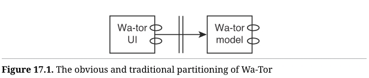
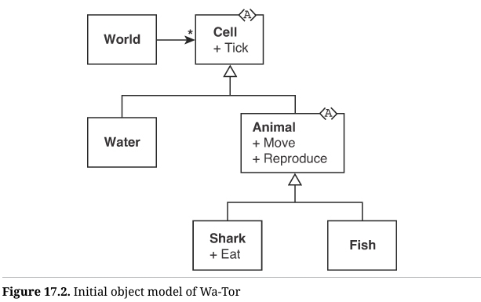
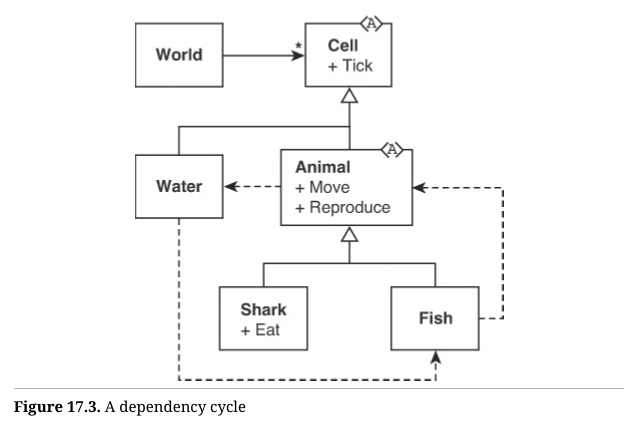
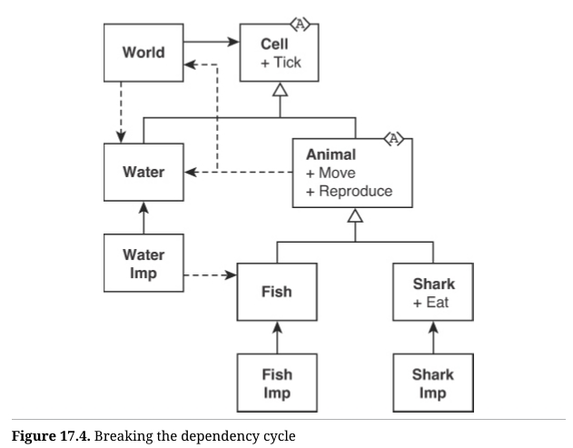

## Wa-Tor

在本书的最后一章，您和我将玩一个关于小小游戏的游戏。这个小小游戏叫做Wa-Tor；这是一个简单的小型细胞自动机，最早由 A. K. Dewdney 在1984年12月的《科学美国人》[^1]杂志上描述。我们要玩的游戏是：假装Wa-Tor是一个需要大量架构和设计工作的企业级应用程序。

说实话，我可以在几个小时内快速搞定 Wa-Tor，开心地走开。但对于这一章，我希望我们认真思考问题，就像这是一款有着 5000 万行代码（LOC）的大型程序一样。

那么，Wa-Tor[^2] 到底是什么呢？在脚注中引用的维基百科文章应该能为您提供理解它所需的所有信息（其实不多）。但基本上，Wa-Tor是一个典型的捕食者/猎物模拟，模拟了鱼和鲨鱼的行为。鱼会随机移动并偶尔繁殖。鲨鱼也会随机移动，但如果邻近有鱼，它们会吃掉鱼。鲨鱼在吃到足够的鱼后也会繁殖。如果鲨鱼在饿死之前没有吃到鱼，它们会死。

鱼和鲨鱼生活的世界没有陆地，全是水。而且，这个世界的上方和下方是相连的，左右也是相连的，因此这个世界在拓扑上是一个环面（torus）。因此，Wa-Tor 代表了水域环面（WAter TORus）。

我们稍后会详细讨论程序的特性。现在，我们先考虑一下架构和设计上的问题。让我们从基础开始，首先是单一责任原则（SRP）。在这款程序中，哪些是我们想要分离的角色？

在大多数大型企业系统中，通常有很多不同的角色。但在这个小小的应用程序中，我们只需要关注两个角色。第一个是用户体验（UX）设计师，他们无疑会在实际看到屏幕上的效果之前改变设计一两次。另一个是建模人员，他们可能会反复调整鲨鱼和鱼的行为，甚至可能加入更多的动物。

因此，我们从图17.1开始，这是一个非常明显且传统的划分方式。



`WatorUI` 组件的层级[^3]低于 `WatorModel` 组件。根据依赖原则，这意味着源代码的依赖关系必须跨越架构边界，指向 `WatorModel`。因此，`WatorUI` 将成为 `WatorModel` 的一个插件。

到目前为止，这个划分中只有两个组件[^4]和一个边界。在更大的系统中，我们会看到更多的边界，每个边界内有更多的组件。

我们先聚焦在模型上[^5]。我们需要什么样的类呢？

是的，我说的是类。我们可能在使用一门函数式语言，但如果你从本书中学到了什么的话，那就是函数式设计和面向对象设计其实是同一枚硬币的两面。

因此，初步来看，我认为对象模型大致如图 17.2 所示。



`world` 包含许多 `cell`。每个 `cell` 都可以处理时间的 `tick`[^6]。我猜想 `cell` 是一个抽象的类，而不是接口，因为我预期在这个层级会有具体的功能实现。

每个 `cell` 可以是 `water`，或者是可以 `move` 和 `reproduce` 的 `animal`。`animal` 的两种可能子类型是可以进食的 `fish` 和 `sharks`。

让我们看看能否编写代码。还不需要测试，因为我们还没有定义任何行为：

```clojure
(ns wator.cell)

(defmulti tick ::type)

-------------------------------
(ns wator.water
  (:require [wator
			 [cell :as cell]]))

(defn make [] {::cell/type ::water})

(defmethod cell/tick ::water [water]
  )

-----------------------------
(ns wator.animal)

(defmulti move ::type)
(defmulti reproduce ::type)

(defn tick [animal]
  )

--------------------------------
(ns wator.fish
  (:require [wator
			 [cell :as cell]
			 [animal :as animal]]))

(defn make [] {::cell/type ::fish})

(defmethod cell/tick ::fish [fish]
  (animal/tick fish)
  )

(defmethod animal/move ::fish [fish]
  )

(defmethod animal/reproduce ::fish [fish]
  )

-------------------------------------
(ns wator.shark
  (:require [wator
			[cell :as cell]
			[animal :as animal]]))

(defmethod cell/tick ::shark [shark]
  (animal/tick shark)
  )

(defmethod animal/move ::shark [shark]
  )

(defmethod animal/reproduce ::shark [shark]
  )

(defn eat [shark]
  )
```

这看起来相当标准。到目前为止，`cell` 模块看起来像是一个接口。`water` 模块实现它的方式很简单。那些悬挂的括号提醒我希望以后在这个函数里添加一些内容。

`animal` 模块没有实现 `tick`，但它确实有一个名为 `tick` 的函数，子类型可以调用。我加入它有点像是一种预感，这可能是一种冒失的决定；不过我觉得它会是必要的[^7]。

`fish` 简单地实现了 `cell` 和 `animal`。这看起来更像是多重继承，而不是 UML 图表展示的继承关系。不过在这个代码里其实没有任何继承关系，所以……

最后，`shark` 同样简单地实现了 `cell` 和 `animal`，并增加了它特有的 `eat` 函数。

我没有编写 `world` 的代码，因为我现在知道的还不足以开始。不过，我认为 `world` 必须处理一些问题。我们不希望 `world` 依赖 GUI，但 GUI 将对 `world` 提出许多限制。例如，我认为 GUI 会告诉我们 `world` 的大小。我还认为，由于 GUI 可能每秒重新绘制屏幕 N 次，GUI 也将定义时间。

但暂时让我们先把这些搁置一旁。前期设计差不多了，现在让我们看看能否编写一些行为代码。

water 的行为是什么？我们询问模型设计师，他们告诉我们，一个 water 单元如果有足够的时间，将随机演化成一个 fish 单元。以下是我对该规则的实现：

```clojure
(ns wator.core-spec
  (:require [speclj.core :refer :all]
            [wator
            [cell :as cell]
            [water :as water]
            [fish :as fish]]))

(describe "Wator"
  (with-stubs)
  (context "Water"
	(it "usually remains water"
          (with-redefs [rand (stub :rand {:return 0.0})]
        	(let [water (water/make)
        		 evolved (cell/tick water)]
        	  (should= ::water/water (::cell/type evolved)))))

	(it "occasionally evolves into a fish"
          (with-redefs [rand (stub :rand {:return 1.0})]
        	(let [water (water/make)
        		 evolved (cell/tick water)]
        	  (should= ::fish/fish (::cell/type evolved))))))
        	  
---------------------------------------------------------
(ns wator.water
  (:require [wator
            [cell :as cell]
            [fish :as fish]
            [config :as config]]))

(defn make [] {::cell/type ::water})

(defmethod cell/tick ::water [water]
  (if (> (rand) config/water-evolution-rate)
	(fish/make)
	water))

-------------------------------------------------------------
(ns wator.config)

(def water-evolution-rate 0.99999)
```

从这里可以立即看到这个程序的“函数式”特性[^8]。`tick` 的返回值是一个新的 `cell`。我不确定 `water-evolution-rate` 的值是否正确，因为模型设计师还没告诉我们这个速率应该是多少。所以我只是猜测了一下。我预计他们会等到看到模型的行为后，再告诉我们更改速率。

到目前为止，我还没有指定任何动态类型。现在似乎有点早，但我可以确定以后会需要动态类型。

无论如何，让我们看看能否让鱼移动起来。

等等，如何移动鱼呢？鱼的位置在哪里？鱼是否知道它的位置，还是由 `world` 知道？

`cell` 是排列在一个二维矩形笛卡尔网格中的，这个网格从左右和上下边界环绕相连。所以 `cell` 的位置是一个元组 `[x y]`。`world` 可以将 `cell` 保存在一个二维数组中，或者用位置元组作为键的映射（map）中。

我喜欢用映射来处理这样的事情，所以让我们创建一个充满 `water` 的 `cell` 的 `world`：

```clojure
(context "world"
  (it "creates a world full of water cells"
	(let [world (world/make 2 2)
          cells (:cells world)
          positions (set (keys cells))]
      (should= #{[0 0] [0 1]
				 [1 0] [1 1]} positions)
	  (should (every? #(= ::water/water (::cell/type %))
					  (vals cells))))))
      
---------------------------------------------------
(ns wator.world
  (:require [wator
			[water :as water]]))

(defn make [w h]
  (let [locs (for [x (range w) y (range h)] [x y]
        loc-water (interleave locs (repeat (water/make)))
        cells (apply hash-map loc-water)]
	{:cells cells}))
```

> `[x (range w) y (range h)]`：嵌套循环，`x` 遍历从 `0` 到 `w-1`，`y` 遍历从 `0` 到 `h-1`。
>
> `[x y]` 创建一个坐标对。
>
> 结果 `locs` 是一个包含所有坐标的列表，例如对于 `w=2` 和 `h=2`，`locs` 的值为 `[[0 0] [0 1] [1 0] [1 1]]`。
>
> `interleave` 将 `locs` 与 `(repeat (water))` 交错组合，形成一个列表，结构类似于 `[[0 0] water [0 1] water [1 0] water [1 1] water]`。

你是否注意到了使用 `interleave` 接受懒惰列表的 `water` 单元格（cells）？现在我们应该可以把一条鱼放进 `world` 中并让它四处移动了。以下是我第一次尝试的测试：

```clojure
(context "animal"
  (it "moves"
	(let [fish (fish/make)
		  world (-> (world/make 3 3)
				(world/set-cell [1 1] fish))
		  [loc cell] (animal/move fish [1 1] world)]
      (should= cell fish)
      (should (#{[0 0] [0 1] [0 2]
                 [1 0] [1 2]
                 [2 0] [2 1] [2 2]}
               loc)))))
```

这很直接。我们创建一个 3x3 的 `world`，中间放一条鱼。然后我们移动这条鱼。最后，我们确保它还是一条鱼，并且它的目的地是相邻的单元之一。

在编写这个测试时，我做了很多设计决策。这些决策正是 TDD 最后一个“D”往往代表“设计”的原因。稍后我会逐一解释这些决策，但首先让我展示一下通过该测试的代码：

```clojure
(ns wator.world
  (:require [wator
			[water :as water]]))

(defn make [w h] . . .)

(defn set-cell [world loc cell]
  (assoc-in world [:cells loc] cell))
  
-------------------------------------------
(ns wator.animal
  (:require [wator
			[cell :as cell]]))

(defmulti move (fn [animal & args] (::cell/type a
(defmulti reproduce (fn [animal & args] (::cell/t

(defn tick [animal]
  )
  
(defn do-move [animal loc world]
  [[0 0] animal])

-------------------------------------------------------
(ns wator.fish
  (:require [wator
            [cell :as cell]
            [animal :as animal]]))

(defn make [] {::cell/type ::fish})

(defmethod cell/tick ::fish [fish]
  (animal/tick fish)
  )
  
(defmethod animal/move ::fish [fish loc world]
  (animal/do-move fish loc world))
  
(defmethod animal/reproduce ::fish [fish]
  )
```

当你在方法体中看到 `...`，表示该方法自上次展示以来没有变化。这里并没有什么令人惊讶的地方。我更改了 `animal` 中 `defmulti` 定义，使其接受多个参数，并在 `animal` 中创建了一个默认的 `do-move` 方法，子类型可以根据需要调用该方法[^9]。`do-move` 的实现是退化的，仅仅是为了通过测试。

接下来是我在编写这个测试时做出的一些设计决策。首先的问题是，`animal` 如果无法“看到” `world` 是无法移动的。所以每个 `animal` 要么持有对 `world` 的引用，要么 `world` 应该是一个全局 `atom`，要么 `world` 应作为参数传递给 `move` 函数。我选择了最后一种方式[^10]，因为我对抛弃函数式范式而退回使用 `atom` 和 STM 的方式略有不满。

接下来的问题是 `animal` 并不知道自己所在的位置。因此，我需要将 `animal` 的位置与 `world` 一起传递给 `move` 函数。

最后也是最重要的，我思考了 `move` 函数应该返回什么。起初，我认为它应该返回更新后的 `world`，但这会导致以下不一致的问题：

想象一下 `world` 的更新过程，从位置 `[0 0]` 开始，依次更新每个单元。假设在 `[0 0]` 处有一条鱼，而更新将它移动到 `[0 1]`。但是 `[0 1]` 是 `world` 接下来要更新的单元格，因此同一条鱼可能再次移动。而在一个回合中，鱼不应该移动两次。

所以 `move` 函数不能更新 `world`。相反，`world` 将不得不从旧的 `world` 构建一个新的 `world`，一次更新一个单元。我想我们可以这样来实现[^11]：

```clojure
(let [new-world-cells (apply hash-map
							(map update-cell old-world-cells))]...)
```

现在让我们实际实现退化的 `do-move` 函数。移动一个 `animal` 的过程是什么？我想这相当简单。我们只需要获取 `animal` 所在位置的邻居，确定哪些是有效的目的地（即是 `water`），然后从这个列表中随机选择一个。因此，`do-move` 的实现应该像这样：

```clojure
(defn do-move [animal loc world]
  (let [neighbors (world/neighbors world loc)
  		destinations (filter
                       #(water/is?
                    	  (world/get-cell world %))
                       neighbors)
        new-location (rand-nth destinations)]
    [new-location animal]))
```

非常漂亮。我们请求 `world` 获取该位置的邻居，过滤掉不是 `water` 的邻居，然后随机选择一个。很酷。

我认为最好将所有环形结构的数学计算都很好地封装在 `world` 中。我不想让它泄露到所有 `animal` 中：

```clojure
(defn wrap [world [x y]]
  (let [[w h] (::bounds world)]
	[(mod x w) (mod y h)])
  )
  
(defn neighbors [world loc]
  (let [[x y] loc
		neighbors (for [dx (range -1 2) dy (range -1 2)]
					(wrap world [(+ x dx) (+ y dy)]))]
	(remove #(= loc %) neighbors))
```

准备好迎接不太美观的部分了吗？上面的代码拒绝编译，因为（你准备好了吗？）`water` 依赖于 `fish`（为了实现进化），`fish` 依赖于 `animal`（为了调用 `do-move`），而 `animal` 又依赖于 `water`。这是一个依赖循环，而 Clojure 讨厌依赖循环。参见图 17.3。



好了，深呼吸。记住，我们在这里是玩个游戏。在像 Wa-Tor 这样简单的应用中，我不会如此严格地对这些文件进行分区。事实上，我很可能会把整个程序写在一个文件里，让复杂性自生自灭。但我们假装这是一个多百万行的企业级应用程序，所以我们会认真处理所有这些源代码依赖，对吧？

因此，我们解决这个问题的方法是回到类似于旧的 C 语言中的声明和实现机制。参见图 17.4。



通过将 `water` 分成两部分，使其对 `fish` 的依赖在 `water-imp` 中，并确保 `water-imp` 依赖于 `water` 而不是相反（遵循 DIP），循环依赖被打破了。我还出于一致性分离了 `fish` 和 `shark`[^12]。我可能很快也得分离 `animal`[^13]。

现在代码看起来像这样：

```clojure
(ns wator.world
  (:require [wator
			[water :as water]]))

(defn make [w h]
  (let [locs (for [x (range w) y (range h)] [x y])
        loc-water (interleave locs (repeat (water/make)))
        cells (apply hash-map loc-water)]
	{::cells cells
	 ::bounds [w h]}))

(defn set-cell [world loc cell]
  (assoc-in world [::cells loc] cell))
                              
(defn get-cell [world loc]
  (get-in world [::cells loc]))

; . . .
------------------------------------------
(ns wator.cell)

(defmulti tick ::type)

------------------------------------------
(ns wator.water
  (:require [wator
			[cell :as cell]]))

(defn make [] {::cell/type ::water})

(defn is? [cell]
  (= ::water (::cell/type cell)))

------------------------------------------
(ns wator.water-imp
  (:require [wator
			[cell :as cell]
            [water :as water]
            [fish :as fish]
            [config :as config]]))
                              
(defmethod cell/tick ::water/water [water]
  (if (> (rand) config/water-evolution-rate)
	(fish/make)
	water))
                              
------------------------------------------
(ns wator.animal
  (:require [wator
            [world :as world]
            [cell :as cell]
            [water :as water]]))
                              
(defmulti move (fn [animal & args] (::cell/type animal)))

(defmulti reproduce (fn [animal & args] (::cell/type animal)))

(defn tick [animal]
  )

(defn do-move [animal loc world]
  (let [neighbors (world/neighbors world loc)
		destinations (filter #(water/is?
							   (world/get-cell world %))
								neighbors)
		new-location (rand-nth destinations)]
	[new-location animal]))

------------------------------------------
(ns wator.fish
  (:require [wator
			[cell :as cell]]))
(defn make [] {::cell/type ::fish})
        
------------------------------------------
(ns wator.fish-imp
  (:require [wator
            [cell :as cell]
            [animal :as animal]
            [fish :as fish]]))

(defmethod cell/tick ::fish/fish [fish]
  (animal/tick fish)
  )

(defmethod animal/move ::fish/fish [fish loc world]
  (animal/do-move fish loc world))

(defmethod animal/reproduce ::fish/fish [fish]
  )
```

鲨鱼目前还不相关，所以我没有展示它。

分离 `water` 和 `fish` 的标准很容易看出来。任何引用直接类型层次之外的文件的函数都放在 `imp` 文件中。特别注意命名空间和命名空间关键字。例如，注意在 `fish-imp` 中的 `defmethod` 仍会根据 `::fish/fish` 进行分发。

以防你以为我忘记了，以下是当前的测试：

```clojure
(ns wator.core-spec
  (:require [speclj.core :refer :all]
            [wator
            [cell :as cell]
            [water :as water]
            [water-imp]
            [animal :as animal]
            [fish :as fish]
            [fish-imp]
            [world :as world]]))
  (describe "Wator"
	(with-stubs)
	(context "Water"
	  (it "usually remains water"
		(with-redefs [rand (stub :rand {:return 0.0})]
		  (let [water (water/make)
				evolved (cell/tick water)]
			(should= ::water/water (::cell/type evolved)))))

	  (it "occasionally evolves into a fish"
		(with-redefs [rand (stub :rand {:return 1.0})]
		  (let [water (water/make)
				evolved (cell/tick water)]
			(should= ::fish/fish (::cell/type evolved))))))

(context "world"
  (it "creates a world full of water cells"
	(let [world (world/make 2 2)
		  cells (::world/cells world)
		  positions (set (keys cells))]
	  (should= #{[0 0] [0 1]
				 [1 0] [1 1]} positions)
	  (should (every? #(= ::water/water (::cell/type %))
					  (vals cells)))))

(it "makes neighbors"
  (let [world (world/make 5 5)]
	(should= [[0 0] [0 1] [0 2]
              [1 0] [1 2]
              [2 0] [2 1] [2 2]]
			 (world/neighbors world [1 1]))
	(should= [[4 4] [4 0] [4 1]
              [0 4] [0 1]
              [1 4] [1 0] [1 1]]
			 (world/neighbors world [0 0]))
	(should= [[3 3] [3 4] [3 0]
              [4 3] [4 0]
              [0 3] [0 4] [0 0]]
			 (world/neighbors world [4 4]))))
			 
(context "animal"
  (it "moves"
	(let [fish (fish/make)
		
		 world (-> (world/make 3 3)
				   (world/set-cell [1 1] fish))
		[loc cell] (animal/move fish [1 1] world)]
	(should= cell fish)
	(should (#{[0 0] [0 1] [0 2]
               [1 0] [1 2]
               [2 0] [2 1] [2 2]}
             loc))))))
```

看看 `ns` 声明中的 `:require`。注意我们引用了 `imp` 文件，但没有明确地使用它们。引用它们会注册它们所包含的 `defmethod`。

好了，现在我们可以移动 `fish`，我确信 `shark` 也会移动。因此，接下来我们应该尝试一些繁殖。但在此之前，我对 `world` 的类型系统感到（假装）担忧。先设置一下吧：

```clojure
(ns wator.world
  (:require [clojure.spec.alpha :as s]
            [wator
            [cell :as cell]
            [water :as water]]))

(s/def ::location (s/tuple int? int?))
(s/def ::cell #(contains? % ::cell/type))
(s/def ::cells (s/map-of ::location ::cell))
(s/def ::bounds ::location)
(s/def ::world (s/keys :req [::cells ::bounds])))

(defn make [w h]
  {:post [(s/valid? ::world %)]}
  …)
```

好了，现在感觉好多了。那么，我们需要哪些条件来实现繁殖呢？模型设计者说，如果一条 `fish` 在它旁边有一个 `water` 单元格并且它的年龄超过一定值，它就会繁殖。两条子鱼的年龄将被重置为零。否则，`fish` 的 `::age` 随时间增加。

以下是测试：

```clojure
(it "reproduces"
  (let [fish (-> (fish/make)
				 (animal/set-age config/fish-reproduction-age))
		world (-> (world/make 3 3)
				 (world/set-cell [1 1] fish))
		[loc1 cell1 loc2 cell2] (animal/reproduce
								  fish [1 1] world)]
	(should= loc1 [1 1])
    (should (fish/is? cell1))
    (should= 0 (animal/age cell1))
    (should (#{[0 0] [0 1] [0 2]
               [1 0] [1 2]
               [2 0] [2 1] [2 2]}
             loc2))
	(should (fish/is? cell2))
	(should= 0 (animal/age cell2))))

(it "doesn't reproduce if there is no room"
  (let [fish (-> (fish/make)
				 (animal/set-age config/fish-reproduction-age)]
		world (-> (world/make 1 1)
				  (world/set-cell [0 0] fish))
		failed (animal/reproduce fish [0 0] world)]
	(should-be-nil failed)))

(it "doesn't reproduce if too young"
	  (let [fish (-> (fish/make)
					 (animal/set-age
						(dec config/fish-reproduction-age)]
			world (-> (world/make 3 3)
					  (world/set-cell [1 1] fish)
			failed (animal/reproduce fish [1 1] world)]
		(should-be-nil failed)))
```

请注意，如果鱼繁殖了，返回值将包含两个子鱼。但是，如果出现问题，则返回 `nil`。这是因为我认为鱼的高层策略可能类似于这样：

```clojure
(if-let [result (animal/reproduce …)]
  result
  (animal/move …))
```

无论如何，以下是通过测试的简略代码：

```clojure
(ns wator.animal
  (:require [clojure.spec.alpha :as s]
            [wator
            [world :as world]
            [cell :as cell]
            [water :as water]
            [config :as config]]))

(s/def ::age int?)
(s/def ::animal (s/keys :req [::age]))

(defmulti move (fn [animal & args] (::cell/type a
(defmulti reproduce (fn [animal & args] (::cell/t
(defmulti make-child ::cell/type)

(defn make []
  {::age 0})

(defn age [animal]
  (::age animal))

(defn set-age [animal age]
  (assoc animal ::age age))

;. . .
```

再次注意，我将 `fish/reproduce` 函数推迟到 `animal/do-reproduce`。这样我可以在 `animal` 中指定 `reproduce` 的通用行为，同时允许 `fish` 进行重写或扩展。我不知道这是否有必要[^14]，但添加这个逻辑成本不高，并且可以避免在 `shark` 和 `fish` 中重复代码。

[^1]: 哎呀，《科学美国人》，我曾经很熟悉它……
[^2]: https://en.wikipedia.org/wiki/Wa-Tor
[^3]: 我在这里所使用的“高”与“低”层级的定义是“距离 I/O 的远近”。参见 Robert C. Martin 的《架构整洁之道》（Pearson, 2017），第183页。
[^4]: 参见 Martin，《架构整洁之道》，第93页。
[^5]: http://wiki.c2.com/?ModelFirs
[^6]: Dewdney 称这些时间单位为 "chronons"。
[^7]: 是的，我知道 "You Aren’t Gonna Need It" (YAGNI)。我们走着瞧吧。
[^8]: 几乎是函数式的）`(rand)` 调用是不纯的。
[^9]: 这有点像在基类中实现一个方法，并允许子类选择是否覆盖它。
[^10]: 也许这种不满是没有根据的，但毕竟这是一本关于函数式设计的书，所以...
[^11]: 记住 `:cells` 包含一个映射，因此 `update-cell` 函数将接收 `[key val]` 对，并返回 `[key val]` 对。
[^12]: 其实只是分离了 `fish`。我在图中分离了 `shark` 但没有在代码中实现。YAGNI（你不会需要它）。
[^13]: 未来的 Uncle Bob：……不，还是需要
[^14]: 是的，我知道 "YAGNI"（“你不会需要它”）原则，但规则就是用来打破的。