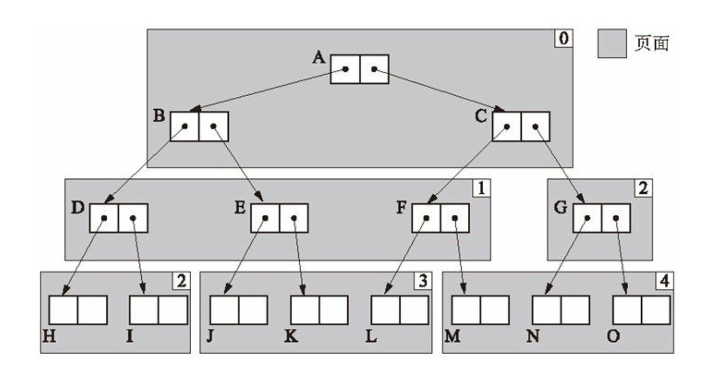
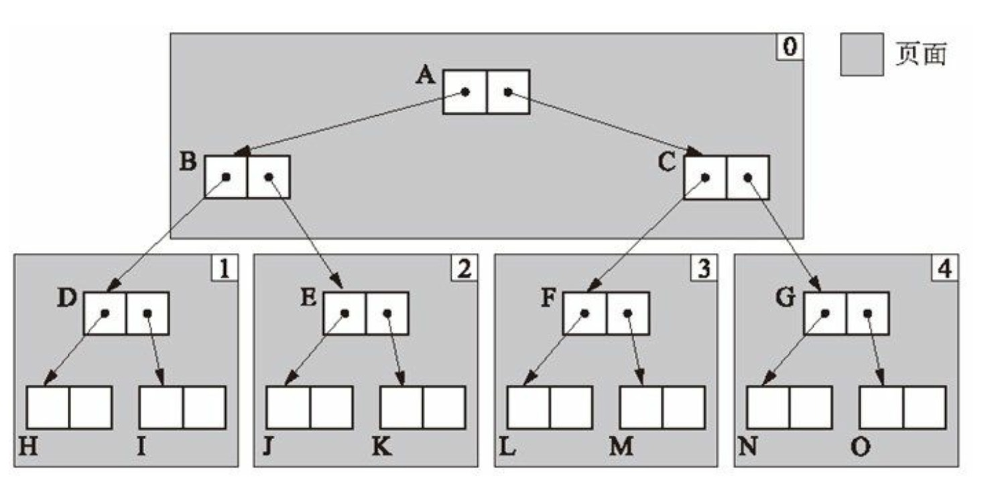

# GC 复制算法

GC 复制算法顾名思义，主要操作就是在 copy 上。具体就是操作就是

1. 当分配的队列内存空间不足时，GC 就会出实话新的空间 `to_start`，其大小与原空间一样。
2. 然后将原空间的活动对象复制到新的空间
3. 然后将根引用切换到新的空间，返回新的对象 `to_start`
4. 将原来的对象 `from_start` 整个回收

至此整个 GC 过程就结束了：

```go
func coping() {
  free = &to_start
  for r := roots {
  	*r = copy(&r)
  }
  swap(from_start, to_start)
}
```

那么 GC 复制算法在复制的过程具体是怎么做的呢？

## 复制（copy）

首先就是通过遍历根对象，然后将活动对讲记录下来，追加到 `to_start` 对象中。因为要把整个对象所有的引用都查出来，所以就用了递归的方式将活动对象标记出来并追加至 `to_start`。

> 因为选择的遍历 root 对象，并采用了递归查询 root 引用的子对象，所以一旦存在循环引用就会造成死循环，所以要通过类似[标记清除算法](mark-sweep-gc.md)标记的方式来避免这个问题。

在复制的过程中还用了一个字段 `free` 来记录新的空间还剩下多少可以分配，这样也是为了下次 GC 做了准备（当下次分配对象的时候，如果发现要分配的目标对象的 size + free 的和要比 `to_start` 要大，那就必须要再申请更大的内存，如果没有了就会触发下一轮的 GC 回收。）

```go
func copy(obj) {
	if !obj.copied {
		copy_data(&free,obj,obj.size)
		obj.copied = true
		obj.forwarding = &free	// 初始化新地址的开头
		&free += obj.size 	// 数据偏移量
		
		for child := children(obj.forwarding) {
			child = copy(&child)
		}
	}
	
	return obj.forwarding
}
```

**上述代码有个字段 `forwarding`，这就是存储新的对象，将原来对象 `*r` 的地址指向新的对象 `to_start`。**

## 优点

- 吞吐量高：因为它只需要循环遍历 root 中的活跃的对象而不是所有的对象。并且复制的对象也只是活跃的对象，不像标记清除算法查询与复制都是与所有的对象成正比的。
- 分配效率高：GC 复制算法分配的过程中没有用到空闲链表来分配，不需要循环空闲链表判断是否有内存大小符合目标分配的 size。GC 复制算法只需要判断目标内存大小是否比剩下的分块内存小就可以直接移动 free 指针完成分配。
- 不会发生内存碎片：这个很好理解，因为整个垃圾回收过程都是通过新建一个连续的内存块，然后循环活跃的对象依次放入新的内存中。然后整体回收原来空间的所有对象，整个过程是不会发生碎片化的。
- 因为活跃的对象都是按照引用顺序**顺序性**的将对象依次放在新的内存队列中，**彼此都是接近的位置**，那么就可以充分利用 **CPU 高速缓存**来读取对象。

## 缺点

- 堆空间利用率低下：我们之前讲了是通过初始化一个根队列一样大小的堆空间讲数据转移。所以相当于是将可用**堆空间折半**了。那么这就会导致因为堆空间不足，从而**导致频繁导致 GC 回收操作**。
- 会有爆栈的可能：因为在拷贝数据的时候采用递归，因为需要频繁在栈申请内存，所以当递归深度一高就可能发生**栈溢出**。
- 不与保守式 GC 算法兼容：因为移动了对象指针（什么是[保守式 GC 算法](//TODO)，后续在了解）。

## 复制算法的优化

### 广度优先

Cheney 在原来的 GC 复制算法的基础之上，采用了广度优先算法先将 root 引用的对象复制到新的堆上来，将原来的递归优化成**迭代**：

```go
func coping() {
  scan,free = &to_start
  for r := &roots {
  	*r = copy(&r)
  }
  // 迭代
  for {
  	if scan != free {
  		for child := children(scan)
  			*child = copy(&child)
  		scan += scan.size
  	} else {
  		break
  	}
  }
  swap(from_start, to_start)
}
```

这里采用了 **scan, free 双指针**的方式，**scan 用于搜索复制完成的对象的指针，free 其实与上面一样，当每次对象完成对象的复制时，就会从开始位置按照对象的 size 进行偏移**。

```go
func copy(obj) {
	if is_point_to_heap(obj.forwarding, &to_start) == false {
		copy_data(&free, obj, obj.size)
		obj.forwarding = &free
		free += obj.size
	}
	return obj.forwarding
}
```

在复制部分，我们可以注意到 cheney 还做了一个小优化，那就是没有通过 `copied` 来判断是否复制过，而是通过判断 `forwarding` 指针指向是否是新堆判断。

这里要注意算法的一个点：我们知道广度优先搜索是需要一个先入先出（FIFO）结构的队列，把搜索的对象放入这个队列中，并取出进行搜索。而上面的伪代码来看并没有这个队列。

其实这就是这个算法启用双指针的精妙之处。再回过头来看 scan,free 的作用：scan 与 free 初始状态都是新堆的起始位置；当扫描 root 引用的对象时，free 就会向右偏移；此时 scan 还没动。而当某个根引用的对象完成数据的复制时，此时 scan 就会向右偏移；然后当 scan 与 free 的位置一致时说明整个复制过程结束。此时**我们就知道了 scan 与 free 之间的堆间隔就是一个优先级队列**。

### 近似深度优先搜索

广度优先有一个不好点就是内存不友好，因为同一个对象的字对象内存布局是松散而不是连续的，这样无法利用 CPU 高速内存。所以后人又在 Cheney 的算法基础之上进行优化，采用了近似深度优先搜索的方式，将内存布局尽量友好，从而利于高效查询。简单来说就是通过数组将”内存细化“，将对象印象根据一个“度”将自对象连续的放置这个数组对象中。我们可以通过下面的图可以看到明显的变化



这是广度优先的堆对象内存布局，虽然对象 A,B,C 分布是连续，但是越往下就越松散。这样是不利于查询的



这样的内存布局相对于上面来说就“相对稳定”。