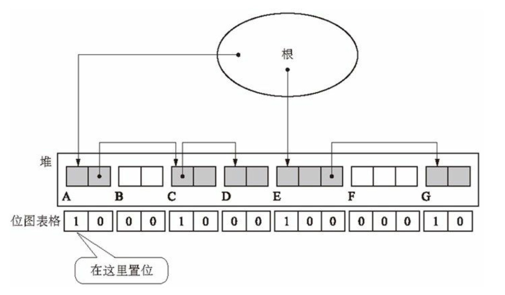

# GC 标记-清除算法（Mark Sweep GC）

其实这个 GC 算法的名字就描述这个垃圾回收算法的工作原理了。主要分为两个阶段

- 标记阶段
- 清除阶段

该算法在标记完了之后就会执行清除非标记的对象，并在清除阶段将这些回收的对象放置到一个空闲队列中等待 mutator 分配内存。

## 标记阶段 Mark

从根对象开始扫描，依次标记活动的对象，实现方式很简单，就是从根对象开始循环遍历。伪代码如下：

```go
func mark_phase() {
  for obj := roots {
    mark(&obj)
  }
}
```

而标记操作其实就是给每个对象打一个标签，遇到活动对象就将其标记。然后递归这个对象的子对象继续标记：

```go
func mark(obj) {
	if obj.mark == false {
		obj.mark = true
		for cobj := child(obj) {
			mark(&cobj)
		}
	}
}
```

因为可能存在循环引用对象的关系，通过判断标签避免重复标记。

> 所以从这里我们可以看出标记清除垃圾算法的效率取决于“对象的总数”是成正比的，是 O(N) 的复杂度的。

## 清除阶段 Sweep

在清除阶段 collector 会遍历整个堆，查找并回收没有被打上标记的对象（垃圾），并将其清除并得到再次利用。

```go
func sweep() {
	sweeping := heap_root
	for {
		if sweeping == nil {
			return
		}
		if sweeping.mark == true {
			sweeping.mark = false
		} else {
      enqueue(&free_list,sweeping)
		}
		sweeping = sweeping.next
	}
}
```

在遍历的途中将活跃对象标记取消（`sweeping.mark = false`）是为了下一轮 GC 的扫描。这样我们就把垃圾对象转变到空闲链表中，等待下一次内存分配。

我们的垃圾对象内存大小不一，是通过链表结构存储的。**如果它们是连续的，那我们就能把这些空闲的分块连接到一起形成一个大分块，这种操作就被称为合并（coalescing）**，这是在清除阶段执行的。但是几乎很少是连续的，所以目前我们现在的这种算法会导致**内存碎片化（fragmentation）**，经过多轮回收，就会产生更多的小分块散落在各处。试想一下，当分配内存的时候，由于内存不是连续的，还要一个个遍历空闲链表来找到能分配对象大小的内存分块，无疑效率是大打折扣的。

为了解决这个碎片化的问题，后来就引进了**压缩（compact）操作，标记清除压缩 GC 算法就是这么来的**

## 空闲链表的优化

其实对于上述的空闲链表也有结构上的优化。因为根据上述描述，垃圾回收的过程只有一个空闲队列，所以后续的内存分配的过程中每次都要遍历这个 free_list 对象。其实可以选择用**多个空闲链表**来解决这个问题。如我们可以将这**一个大的空闲链表拆分成若干份小队列**，如我们可以设定 2个字、3个字、......、100个字的 99 个空闲链表，然后剩下如果要分配的大小超过了 100 个字，就全部分配到单独的“大对象”空闲链表，这样就拆分了 100 个这样的空闲链表。那么在下次分配内存的时候，只要计算分配的对象大小之后就能直接分配到具体的空闲链表了。

## 碎片化的优化

标记清除 GC 算法的碎片化问题，除了 [GC 复制算法](copy-gc.md)和[标记清除压缩算法](mark-sweep-and-compack-gc.md)之外，其实还可以用 BiBOP 法来解决内存碎片化的问题。

BiBOP 全称：Big Bag Of Pages 的缩写，即**将大小相近的对象整理成固定大小的块进行管理的方法。**

回想一下产生碎片化的原因：在分配时对象就是 size 大小各异的，那么我们在分配堆时，**直接按固定大小块分配**不就可以解决这个问题了吗。

**把堆分割成固定大小的块，让每个块只能配置同样大小的对象，这就是 BiBOP。**

## 标记清除与COW

标记清除垃圾回收算法其实还有一个问题，就是它与写时复制（COW）不兼容，因为该算法在标记和清除阶段都会修改对象的头部信息（mark 标记）。所以这在这两个阶段就会频繁发生本应该发生的复制操作，进而增加内存空间的压力。

这种情况就可以采用位图标记法（bitmap mark），我们把要修改的对象记录下存储到表格中，与对象分开管理。这样就不会修改到对象而与 COW 冲突。

而位图标记法的实现方式的数据结构有多种，有散列表、树形结构等。这里为简便分析问题，用整形数组。



位图表格中的位的位置与堆中国各个对象的位置是一一对应的。

