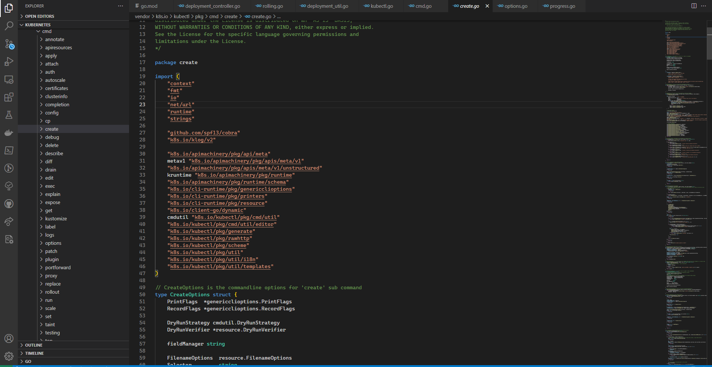
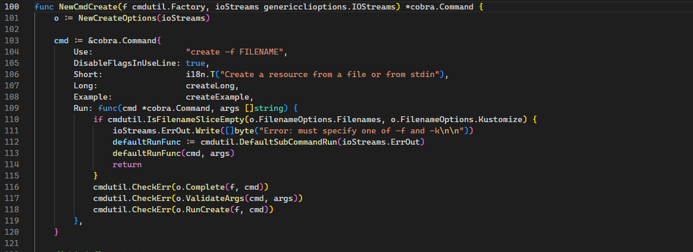

# Kubernetes Cli 在源码中是如何执行的

为了更好的理解 Kubernetes 命令执行的过程，特此学习并翻译一位IBM工程师的[Kubernetes源码之旅](https://developer.ibm.com/articles/a-tour-of-the-kubernetes-source-code/)的部分内容。

首先我们编写一个 yaml 文件如下：

```yaml
apiVersion: v1
kind: ReplicationController
metadata:
  name: nginx
spec:
  replicas: 1
  selector:
    app: nginx
  template:
    metadata:
      name: nginx
      labels:
        app: nginx
    spec:
      containers:
      - name: nginx
        image: nginx
        ports:
        - containerPort: 80
```

然后在命令中行中执行如下命令：`kubectl create -f ~/nginx_pod.yaml`。

虽然操作很简单，Kubernetes 就自动创建了对应的 pod 并按照预期的申明内容执行，那么在 Kubernetes 内部是如何将命令中的内容解析并执行的呢？

让我们跟着这位工程师的脚步往下看。

> 注意，该文写于2017年，此时 Kubernetes 已经发生了很多变化，文中的源码位置也发生了变化，具体在：https://github.com/kubernetes/kubernetes/tree/master/staging/src/k8s.io/kubectl/pkg/cmd
>
> 其实我们从[kubectl.go](https://github.com/kubernetes/kubernetes/blob/master/cmd/kubectl/kubectl.go)中也能看出来具体的代码位置。

## 在 Kubernetes 源代码中定位 kubectl 命令实现

所有 kubectl 命令的入口点都可以在 https://github.com/kubernetes/kubernetes/tree/master/pkg/kubectl/cmd 文件夹中找到。在这个文件夹中，有一个与所实现的 kubectl 命令的名称相匹配的 go 文件名。例如，kubectl create 命令就在文件夹名 create 下的 create.go 的文件中有一个初始入口点。实现各种命令的文件夹和示例go文件如下图所示。



## Kubernetes 与 Cobra 命令框架

Kubernetes 命令是通过[Cobra命令框架](https://github.com/spf13/cobra)实现的。Cobra 为构建命令行接口提供了很多很棒的特性，可以在[这里](https://blog.gopheracademy.com/advent-2014/introducing-cobra/)找到 Cobra 功能的基本概述。如图所示，Kubernetes 如何利用Cobra 的一个很好的特性是非常容易找到实现每个命令行选项的文件。此外，Cobra 结构将命令使用方式描述和命令描述放在运行命令的代码旁边。这在图中和[实际的代码行中都有显示](https://github.com/kubernetes/kubernetes/blob/master/staging/src/k8s.io/kubectl/pkg/cmd/create/create.go#L106)。这种结构的好处在于，您可以浏览和查看所有 Kubernetes kubectl 命令的描述，然后快速跳转到实现这些命令的代码。如图中第104-109行所示，字符串 Use、Short、Long 和 Example 都包含描述命令的信息，而 Run 指向实际运行该命令的函数。



上图中的118行的方法 `RunCreate` 方法是 `kubectl create -f` 核心实现。下图显示了 `RunCreate` 函数。在第132行，我添加了一个fmt。Println 来确认这个代码在我认为它会被调用的时候被调用。在下面的[编译和运行 Kubernetes 一节](https://developer.ibm.com/articles/a-tour-of-the-kubernetes-source-code/#compiling-and-running-kubernetes)中，我将展示如何在向 kubectl 源代码中单独添加调试语句时加速重新编译 Kubernetes 代码库。


> 注：因为本人并没有按照作者的方式执行，所以就贴了原文中的图

## Kubernetes 中的 Builder 和 Visitors

对于刚接触 Go 和 Kubernetes 的新手来说，[resource.NewBuilder](https://github.com/kubernetes/kubernetes/blob/master/staging/src/k8s.io/cli-runtime/pkg/resource/builder.go#L207) 函数中的代码实现非常吓人。值得花点时间更详细地解释这段代码。在高层次上，这段代码所做的是，从命令行中获取参数，并将其转换为一个资源列表。它还负责创建一个访问者结构，可以用来遍历所有的资源。这段代码很复杂，因为它使用了 Builder 模式的一个变体，其中每个函数都在做数据初始化的一个单独部分。函数 `Schema`, `ContinueOnError`, `NamespaceParam`, `DefaultNamespace`,`FilenameParam`, `SelectorParam`, 以及 `Flatten` 都接收一个指向 Builder 结构的指针，对 Builder 结构进行某种形式的修改，然后返回指向 Builder 结构的指针，供方法链上的下一个方法在进行修改时使用。所有这些方法都可以在 [builder.go](https://github.com/kubernetes/kubernetes/blob/master/staging/src/k8s.io/cli-runtime/pkg/resource/builder.go) 文件，但我在下面包含了一些，以便您可以看到它们是如何工作的。

```go
func (b *Builder) Schema(schema validation.Schema) *Builder {
  b.schema = schema
  return b
}

func (b *Builder) ContinueOnError() *Builder {
  b.continueOnError = true
  return b
}

func (b *Builder) Flatten() *Builder {
  b.flatten = true
  return b
}
```

一旦所有的初始化程序完成，`resource.NewBuilder` 函数最后会调用一个 Do 函数。Do 函数是一个关键部分，因为它返回一个 Result 对象，将用于我们的资源的创建。Do函数还创建了一个 Visitor 对象，可以用来遍历与调用 `resource.NewBuilder` 相关的资源列表。Do 函数的实现如下所示。

```go
// Do returns a Result object with a Visitor for the resources identified by the Builder.
// The visitor will respect the error behavior specified by ContinueOnError. Note that stream
// inputs are consumed by the first execution - use Infos() or Object() on the Result to capture a list
// for further iteration.
func (b *Builder) Do() *Result {
	r := b.visitorResult()
	r.mapper = b.Mapper()
	if r.err != nil {
		return r
	}
	if b.flatten {
		r.visitor = NewFlattenListVisitor(r.visitor, b.objectTyper, b.mapper)
	}
	helpers := []VisitorFunc{}
	if b.defaultNamespace {
		helpers = append(helpers, SetNamespace(b.namespace))
	}
	if b.requireNamespace {
		helpers = append(helpers, RequireNamespace(b.namespace))
	}
	helpers = append(helpers, FilterNamespace)
	if b.requireObject {
		helpers = append(helpers, RetrieveLazy)
	}
	if b.continueOnError {
		r.visitor = NewDecoratedVisitor(ContinueOnErrorVisitor{r.visitor}, helpers...)
	} else {
		r.visitor = NewDecoratedVisitor(r.visitor, helpers...)
	}
	return r
}
```

如上文所示，一个新的 `DecoratedVisitor` 被创建并存储为由 `Builder.Do` 函数返回的 `Result` 对象的一部分。`DecoratedVisitor` 有一个 `Visit` 函数，它将调用传递给它的 `Visitor` 函数。这方面的实现可以在 [resource/visitor.go#L322](resource/visitor.go)找到，如下所示。

```go
// NewDecoratedVisitor will create a visitor that invokes the provided visitor functions before
// the user supplied visitor function is invoked, giving them the opportunity to mutate the Info
// object or terminate early with an error.
func NewDecoratedVisitor(v Visitor, fn ...VisitorFunc) Visitor {
	if len(fn) == 0 {
		return v
	}
	return DecoratedVisitor{v, fn}
}

// Visit implements Visitor
func (v DecoratedVisitor) Visit(fn VisitorFunc) error {
	return v.visitor.Visit(func(info *Info, err error) error {
		if err != nil {
			return err
		}
		for i := range v.decorators {
			if err := v.decorators[i](info, nil); err != nil {
				return err
			}
		}
		return fn(info, nil)
	})
}
```

Do 函数返回的 `Result` 对象有一个 `Visit` 函数，用来调用 `DecoratedVisitor.Visit` 函数。这为我们提供了一条从 create.go 中的 `RunCreate` 函数的第150行到最终调用匿名函数的路径，该匿名函数在第150行传入，包含 `createAndRefresh` 函数，将引导我们的代码对API服务器进行REST调用。在 create.go 中 `RunCreate` 函数第150行调用的结果访问函数的实现如下所示。

```go
func (r *Result) Visit(fn VisitorFunc) error {
	if r.err != nil {
		return r.err
	}
	err := r.visitor.Visit(fn)
	return utilerrors.FilterOut(err, r.ignoreErrors...)
}
```

现在我们已经看到了一切是如何通过 `Visit` 函数和 `DecoratedVisitor` 类连接的，我们看到下面第150行的内联 Visitor 函数在第165行有一个 `createAndRefresh` 函数。


> 注：图上代码为2017年的 Kubernetes 源码，现已过时，其部分源码如下：
>
> ```go
> ...
> err = r.Visit(func(info *resource.Info, err error) error {
> 		if err != nil {
> 			return err
> 		}
> 		if err := util.CreateOrUpdateAnnotation(cmdutil.GetFlagBool(cmd, cmdutil.ApplyAnnotationsFlag), info.Object, scheme.DefaultJSONEncoder()); err != nil {
> 			return cmdutil.AddSourceToErr("creating", info.Source, err)
> 		}
> 
> 		if err := o.Recorder.Record(info.Object); err != nil {
> 			klog.V(4).Infof("error recording current command: %v", err)
> 		}
> 		// 对应上图鼠标划线的源码
> 		if o.DryRunStrategy != cmdutil.DryRunClient {
> 			if o.DryRunStrategy == cmdutil.DryRunServer {
> 				if err := o.DryRunVerifier.HasSupport(info.Mapping.GroupVersionKind); err != nil {
> 					return cmdutil.AddSourceToErr("creating", info.Source, err)
> 				}
> 			}
> 			obj, err := resource.
> 				NewHelper(info.Client, info.Mapping).
> 				DryRun(o.DryRunStrategy == cmdutil.DryRunServer).
> 				WithFieldManager(o.fieldManager).
> 				Create(info.Namespace, true, info.Object)
> 			if err != nil {
> 				return cmdutil.AddSourceToErr("creating", info.Source, err)
> 			}
> 			info.Refresh(obj, true)
> 		}
> 
> 		count++
> 
> 		return o.PrintObj(info.Object)
> 	})
> ...
> ```

其中的 `resource.NewHelper` 方法内容也很简单：

```go
func NewHelper(client RESTClient, mapping *meta.RESTMapping) *Helper {
	return &Helper{
		Resource:        mapping.Resource.Resource,
		RESTClient:      client,
		NamespaceScoped: mapping.Scope.Name() == meta.RESTScopeNameNamespace,
	}
}
```

随着 `Helper` 的创建和它的 `Create` 函数在 `createAndRefresh` 的第217行被调用，我们终于看到 `Create` 函数在 `Helper.Create` 函数的第119行调用了一个`createResource` 函数。如下图所示。`Helper.createResource` 函数，也如下图所示，执行对 API 服务器的实际 REST 调用，创建我们在 YAML 文件中定义的资源。

```go
func (m *Helper) Create(namespace string, modify bool, obj runtime.Object) (runtime.Object, error) {
	return m.CreateWithOptions(namespace, modify, obj, nil)
}

func (m *Helper) CreateWithOptions(namespace string, modify bool, obj runtime.Object, options *metav1.CreateOptions) (runtime.Object, error) {
	if options == nil {
		options = &metav1.CreateOptions{}
	}
	if m.ServerDryRun {
		options.DryRun = []string{metav1.DryRunAll}
	}
	if m.FieldManager != "" {
		options.FieldManager = m.FieldManager
	}
	if modify {
		// Attempt to version the object based on client logic.
		version, err := metadataAccessor.ResourceVersion(obj)
		if err != nil {
			// We don't know how to clear the version on this object, so send it to the server as is
			return m.createResource(m.RESTClient, m.Resource, namespace, obj, options)
		}
		if version != "" {
			if err := metadataAccessor.SetResourceVersion(obj, ""); err != nil {
				return nil, err
			}
		}
	}

	return m.createResource(m.RESTClient, m.Resource, namespace, obj, options)
}

func (m *Helper) createResource(c RESTClient, resource, namespace string, obj runtime.Object, options *metav1.CreateOptions) (runtime.Object, error) {
	return c.Post().
		NamespaceIfScoped(namespace, m.NamespaceScoped).
		Resource(resource).
		VersionedParams(options, metav1.ParameterCodec).
		Body(obj).
		Do(context.TODO()).
		Get()
}
```

> 延申：那么如何解析我们申明的 yaml 文件的呢？主要实现就是 `Helper.Get` 方法，通过获取命令行的 `-f filePath` 中的参数，通过 RESTClient 解析文件流，然后再反序列化成资源对象，即 [schema.GroupVersionKind](https://github.com/kubernetes/kubernetes/blob/master/staging/src/k8s.io/apimachinery/pkg/runtime/schema/group_version.go#L96) 和具体的数据部分。反序列化方式也分多种，如 [json](https://github.com/kubernetes/kubernetes/blob/master/staging/src/k8s.io/apimachinery/pkg/runtime/serializer/json/json.go#L135)，[protobuf](https://github.com/kubernetes/kubernetes/blob/master/staging/src/k8s.io/apimachinery/pkg/runtime/serializer/protobuf/protobuf.go#L101) 等（根据命令行时指定的文件）。具体可详见：https://github.com/kubernetes/kubernetes/tree/master/staging/src/k8s.io/apimachinery/pkg/runtime/serializer。

## 编译和运行 Kubernetes

现在我们已经回顾了代码，是时候学习如何编译和运行代码了。在上面提供的许多代码样本中，你会看到代码中的 `fmt.Println()` 调用。所有这些都是我添加到代码中的调试语句，你也可以把它们添加到你的源代码副本中。为了编译代码，我们将使用一个特殊的选项，通知 `Kubernetes` 构建过程只编译代码的 `kubectl` 部分。这将极大地加快 Kubernetes` 的编译过程。进行优化编译的 make 命令是:

```cmake
make WHAT='cmd/kubectl'
```

一旦我们添加了调试打印语句，重新编译了代码的 kubectl 部分，我们就可以使用以下命令启动 Kubernetes 开发环境:

```
PATH=$PATH KUBERNETES_PROVIDER=local hack/local-up-cluster.sh
```

在另一个终端窗口中，我们可以继续运行 kubectl 命令，并观察它的运行情况，包括 fmt.Printlns。我们用下面的命令来做这件事。

```
cluster/kubectl.sh create -f ~/nginx_kube_example/nginx_pod.yaml
```

下图显示了包含调试打印语句后的输出结果:


至此文章内容就结束了，原文后面的篇幅是讲学习源码的工具介绍，就不搬运了。