# Llama 2：开放式基础和微调聊天模型

## 概要

在这项工作中，我们开发并发布了 Llama 2，这是一组经过预训练和微调的大型语言模型（LLMs），其规模从 70 亿到 700 亿个参数不等。我们的微调 LLMs 被称为 Llama 2-Chat，针对对话用例进行了优化。在我们测试的大多数基准测试中，我们的模型都优于开源聊天模型，而且根据我们对有用性和安全性的人工评估，我们的模型可能是封闭源模型的合适替代品。我们将详细介绍我们对 Llama 2-Chat 进行微调和安全性改进的方法，以便社区能够在我们工作的基础上，为负责任地开发 LLMs 做出贡献。

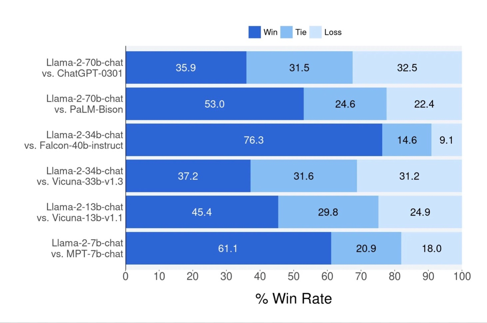

Llama 2-Chat 与其他开放源代码和封闭源代码模型相比的有用性人工评估结果。人类评测员比较了约 4k 条提示（包括单转和多转提示）上的各代模型。该评估的 95% 置信区间在 1% 到 2% 之间。更多详情见第 3.4.2 节。在回顾这些结果时，需要注意的是，由于提示集的局限性、审查指南的主观性、个别评分者的主观性以及比较世代的固有困难，人工评估可能会产生噪音。

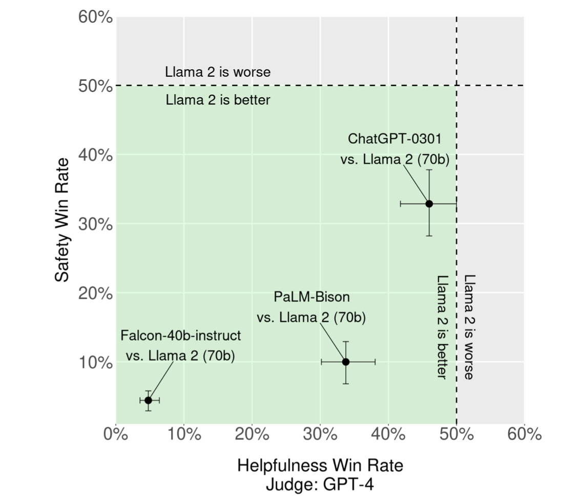

根据 GPT- 4，商业授权基础线路与 Llama 2-Chat 之间在有用性和安全性方面的胜率百分比。为了补充人工评估，我们使用了一个不受我们自己指导的能力更强的模型。绿色区域表示根据 GPT-4 我们的模型更好。为消除平局，我们使用了胜/（胜+负）。向 GPT-4 提交模型响应的顺序是随机交换的，以减少偏差。

## 1 简介

大型语言模型（LLMs）已显示出作为高能力人工智能助手的巨大前景，它们在需要专家知识的复杂推理任务中表现出色，涉及领域广泛，包括编程和创意写作等专业领域。它们可以通过直观的聊天界面与人类进行互动，因此在普通大众中得到了迅速而广泛的应用。

考虑到训练方法看似简单明了，LLMs 的能力令人瞩目。**自动回归变换器（Auto-regressive transformers）**是在大量自我监督数据的语料库上进行预训练的，然后通过**人反馈强化学习（Reinforcement Learning with Human Feedback,RLHF）**等技术与人类偏好保持一致。虽然训练方法简单，但由于计算要求高，LLM 的开发仅限于少数人。目前已公开发布的预训练 LLM（如 BLOOM（Scao 等人，2022 年）、LLaMa-1（Touvron 等人，2023 年）和 Falcon（Penedo 等人，2023 年））与封闭式预训练竞争对手（如 GPT-3（Brown 等人，2020 年）和 Chinchilla（Hoffmann 等人，2022 年））的性能不相上下，但这些模型都无法替代封闭式”产品“ LLM，如 ChatGPT、BARD 和 Claude。这些封闭式”产品“ LLM 经过了大量微调，以符合人类的偏好，从而大大提高了其可用性和安全性。这一步骤可能需要大量的计算和**人工标注**成本，而且往往不透明或不容易复制，从而限制了社区在推进人工智能对齐研究方面的进展。

在这项工作中，我们开发并发布了 Llama 2，一个经过预训练和微调的 LLMs（Llama 2 和 Llama 2-Chat）系列，规模高达 70B 个参数。在我们测试的一系列有用性和安全性基准中，Llama 2-Chat 模型的表现普遍优于现有的开源模型。至少在我们进行的人类评估中，它们似乎也与某些闭源模型不相上下（见图 1 和图 3）。我们已采取措施来提高这些模型的安全性，包括使用特定于安全性的数据注释和调整，以及进行**红队和采用迭代评估（red-teaming and employing iterative evaluations）**。此外，本文还全面介绍了我们的微调方法和提高 LLM 安全性的途径。我们希望这种开放性能够让社区重现经过微调的 LLM，并继续提高这些模型的安全性，从而为更负责任地开发 LLM 铺平道路。我们还分享了在开发 Llama 2 和 Llama 2-Chat 过程中观察到的新现象，例如工具使用和知识的时间组织。

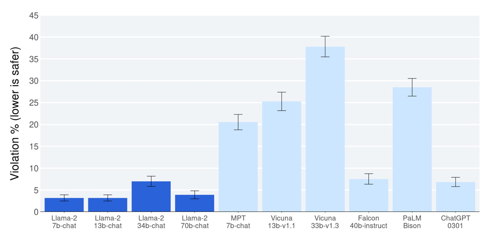

Llama 2-Chat 与其他开源和闭源模型的安全人工评估结果比较。人类评测员在约 2,000 个对抗性提示（包括单轮和多轮提示）中对各代模型违反安全规定的情况进行了评测。更多详情可参见第 4.4 节。由于提示集的局限性、审查指南的主观性以及评分者个人的主观性，LLM 评估存在固有偏差，因此必须对这些安全结果加以说明。此外，这些安全评估使用的内容标准很可能偏向于 Llama 2-Chat 模型。

我们向广大公众发布以下模型，供研究和商业用途：

1. Llama 2，Llama 1 的更新版本，使用新的公开可用数据进行训练。我们还将预训练语料库的大小增加了40％，将模型的上下文长度加倍，并采用了分组查询注意力（Ainslie等人，2023年）。我们发布了带有 7B、13B 和 70B 参数的Llama 2变体。我们还训练了 34B 变体，在本文中进行了报告，但是还没发布。
2. Llama 2-Chat，Llama 2 的微调版本，针对对话使用案例进行了优化。我们也发布了带有 7B、13B 和 70B 参数的该模型的变体。

我们相信，在安全的情况下公开释放 LLMs 将为社会带来净效益。与所有 LLMs 一样，Llama 2 是一项新技术，使用时存在潜在风险（Bender 等人，2021b；Weidinger 等人，2021；Solaiman 等人，2023）。迄今为止进行的测试都是英文测试，并没有也不可能涵盖所有情况。因此，在部署任何“Llama 2-Chat”应用之前，开发者应根据其模型的具体应用进行安全测试和调整。我们提供了“负责任使用指南”和“代码示例”，以帮助安全部署 Llama 2 和 Llama 2-Chat。更多有关我们的发布策略详情，请参阅第 5.3 节。
本文其余部分将介绍我们的预训练方法（第 2 节）、微调方法（第 3 节）、模型安全性方法（第 4 节）、主要观察和见解（第 5 节）、相关工作（第 6 节）和结论（第 7 节）。

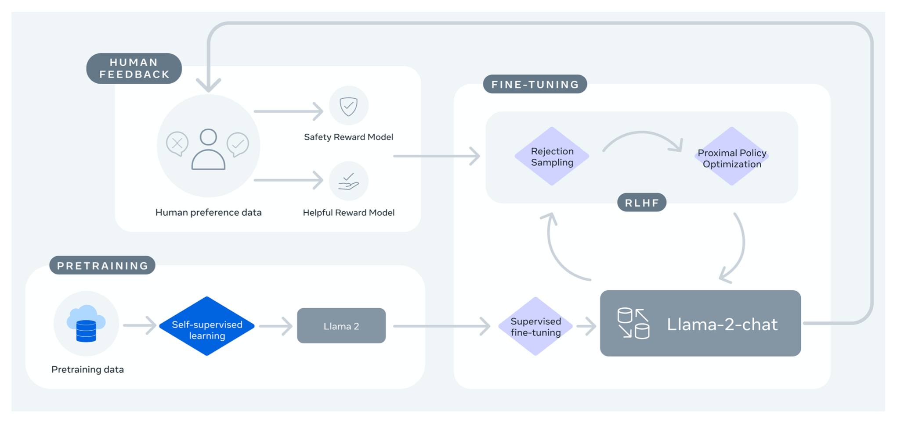

图 4：训练 Llama 2-Chat：首先，我们使用公开的在线资源对 Llama 2 进行预训练。之后，我们通过应用监督微调技术创建了一个初始版本的 Llama 2-Chat。随后，我们使用**人反馈强化学习（RLHF）**方法对模型进行迭代改进，特别是通过**拒绝采样和近端策略优化（Proximal Policy Optimization, PPO）**。在整个 RLHF 阶段，迭代式奖励建模数据的积累与模型增强并行进行非常重要，以确保奖励模型保持在分布范围内。

## 2 预训练

为了创建新的 Llama 2 模型系列，我们首先采用了 Touvron 等人（2023 年）所描述的预训练方法，使用了优化的自动回归转换器，但为了提高性能，我们做了一些改动。具体来说，我们进行了更稳健的数据清理，更新了数据组合，训练的标记总数增加了 40%，上下文长度增加了一倍，并使用分组查询关注（grouped-query attention, GQA）来提高大型模型的推理可扩展性。表 1 比较了新的 Llama 2 模型和 Llama 1 模型的属性。

### 2.1 预训练数据

我们的训练语料库包括来自公开来源的新数据组合，其中不包括来自 Meta 产品或服务的数据。我们努力删除了某些已知包含大量个人隐私信息的网站的数据。我们在 2 万亿个 token 的数据上进行了训练，因为这样可以很好地权衡性能和成本，并对最真实的数据源进行取样，以增加知识和减少幻觉。

我们进行了各种预训练数据调查，以便用户更好地了解我们模型的潜在能力和局限性；结果见第 4.1 节。

### 2.2 训练细节

我们采用了 Llama 1 中的大部分预训练设置和模型架构。我们使用**标准转换器架构**（Vaswani 等人，2017 年），使用 RMSNorm 进行预规范化（Zhang 和 Sennrich，2019 年），使用 SwiGLU 激活函数（Shazeer，2020 年）和旋转位置嵌入（rotary positional embeddings, RoPE，Su 等人，2022 年）。与“Llama 1”在结构上的主要区别在于增加了上下文长度和分组查询注意力（GQA）。我们将在附录第 A.2.1 节中详细介绍这些差异，并通过消融实验来证明它们的重要性。

**超参数（Hyperparameters）**。我们使用 AdamW 优化器（Loshchilov 和 Hutter，2017 年）进行训练，β1 = -5 最终学习率降至峰值学习率的 10%。我们使用 0.1 的权重衰减和梯度剪切。我们使用余弦学习率计划，热身 2000 步，衰减 0.9，β2 = 0.95，eps = 10 of 1.0。图 5 (a) 显示了使用这些超参数时 Llama 2 的训练损失。

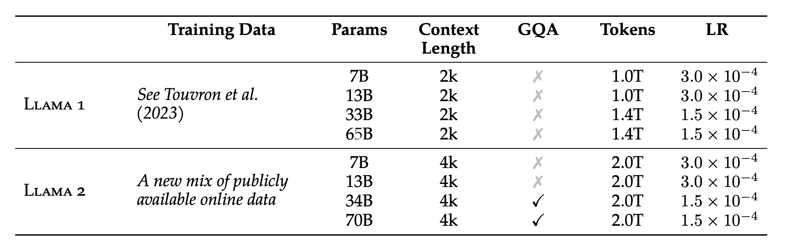

**表1：**Llama 2 模型系列。标记（token）计数仅指预训练数据。所有模型均以 4M 标记的全局批量大小进行训练。更大的模型（34B 和 70B）使用分组查询注意（GQA），以提高推理的可扩展性。

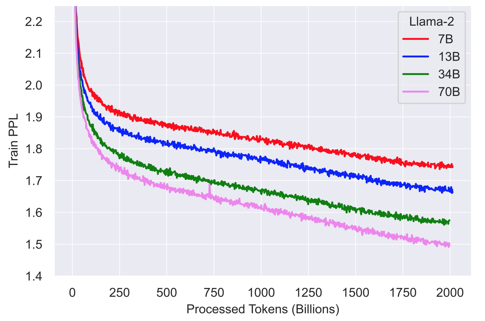

​																				Token 处理（百万）

图5：**Llama 2 模型的训练损失**。我们比较了 Llama 2 模型家族的训练损失，并观察到在预训练 2T 个标记后，模型仍未显示出任何饱和迹象。

**标记符（Tokenizer）**。我们使用了与 Llama 1 相同的标记化器；它采用了**字节对编码（bytepair encoding, BPE）**算法（Sennrich 等人，2016 年），使用了 SentencePiece 的实现（Kudo 和 Richardson，2018 年）。与 Llama 1 一样，我们将所有数字拆分为单个数字，并使用字节来分解未知的 UTF-8 字符。总词汇量为 32k 标记。

#### 2.2.1 训练硬件和碳足迹

**训练硬件**。我们在 Meta 的研究超级集群（RSC）（Lee 和 Sengupta，2022）以及内部生产集群上预训练了我们的模型。这两个集群都使用 NVIDIA A100s。两个集群之间有两个关键差异，第一个是可用的互连类型：RSC 使用 NVIDIA Quantum InfiniBand，而我们的生产集群则配备了基于通用以太网交换机的 RoCE（RDMA over converged Ethernet）解决方案。这两个解决方案都可以互连 200 Gbps 的端点。第二个差异是每个 GPU 的功耗限制 - RSC 使用 400W，而我们的生产集群使用 350W。通过这个双集群设置，我们能够比较这些不同类型的互连网络在大规模训练中的适用性。RoCE（一种更实惠的商业互连网络）是其中一种。

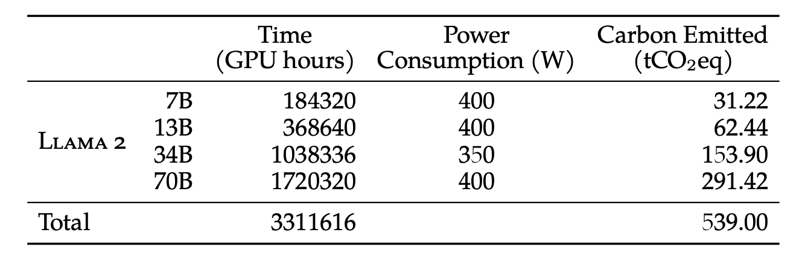

**表2：**显示了预训练过程中的二氧化碳排放情况。时间列显示了训练每个模型所需的总 GPU 时间。功耗列显示了每个 GPU 设备的峰值功率容量，根据功耗使用效率进行了调整。100% 的排放量由 Meta 的可持续性计划直接抵消，因为我们公开发布这些模型，所以预训练成本不需要由其他人承担。

几乎可以像昂贵的 Infiniband 一样扩展到 2000 个 GPU，这使得预培训更加平民化。

**预训练的碳足迹**。根据之前的研究（Bender 等人，2021a；Patterson 等人，2021；Wu 等人，2022；Dodge 等人，2022），并使用 GPU 设备的功耗估计值和碳效率，我们旨在计算 Llama 2 模型预训练产生的碳排放量。GPU 的实际功耗取决于其使用情况，很可能与我们用来估算 GPU 功耗的热设计功耗（TDP）不同。值得注意的是，我们的计算并没有考虑更多的电力需求，例如来自互连或非 GPU 服务器的电力消耗，也没有考虑数据中心冷却系统的电力需求。此外，正如 Gupta 等人（2022b,a）所指出的那样，与 GPU 等人工智能硬件生产相关的碳排放可能会增加整体碳足迹。

表 2 总结了预训练 Llama 2 系列模型的碳排放量。在 A100-80GB 型硬件（TDP 为 400W 或 350W）上进行了累计 330 万 GPU 小时的计算。我们估计训练的总排放量为 539 吨二氧化碳当量，其中 100% 由 Meta 的可持续发展计划直接抵消。我们的开放式发布策略还意味着其他公司无需承担这些预培训成本，从而节省了更多的全球资源。

### 2.3 LLAMA2 预训练模型计算

在本节中，我们将报告 Llama 1 和 Llama 2 基本模型、MosaicML 预训练转换器（MosaicML Pretrained Transformer, MPT）模型和 Falcon（Almazrouei 等人，2023 年）模型在标准学术基准上的结果。在所有评估中，我们都使用了内部评估库。我们在内部重现了 MPT 和 Falcon 模型的结果。对于这些模型，我们总是在我们的评估框架和任何公开报告的结果之间选取最佳得分。

在表 3 中，我们总结了一系列常用基准的总体性能。请注意，安全基准将在第 4.1 节中分享。这些基准分为以下几类。所有单个基准的结果见第 A.2.2 节。

- **代码**。我们报告了我们的模型在 HumanEval（陈等人，2021 年）和 MBPP（奥斯汀等人，2021 年）上的平均 pass@1 分数。
- **常识推理**。我们报告了 PIQA（Bisk 等人，2020 年）、SIQA（Sap 等人，2019 年）、HellaSwag（Zellers 等人，2019 年a）、WinoGrande（Sakaguchi 等人，2021 年）、ARC easy and challenge（Clark 等人，2018 年）、OpenBookQA（Mihaylov 等人，2018 年）和 CommonsenseQA（Talmor 等人，2018 年）的平均得分。我们报告了 CommonSenseQA 的 7-shot 测试结果和所有其他基准的 0-shot 测试结果。
- **世界知识**。我们评估了 NaturalQuestions（Kwiatkowski 等人，2019 年）和 TriviaQA（Joshi 等人，2017 年）的 5-shot 成绩，并报告了平均成绩。
- **阅读理解**。在阅读理解方面，我们报告了 SQuAD（Rajpurkar 等人，2018 年）、QuAC（Choi 等人，2018 年）和 BoolQ（Clark 等人，2019 年）的 0-shot 平均成绩。
- **数学**。我们将 GSM8K（8 shot）（Cobbe 等人，2021 年）和 MATH（4 shot）（Hendrycks 等人，2021 年）基准的平均值报告在前 1 位。

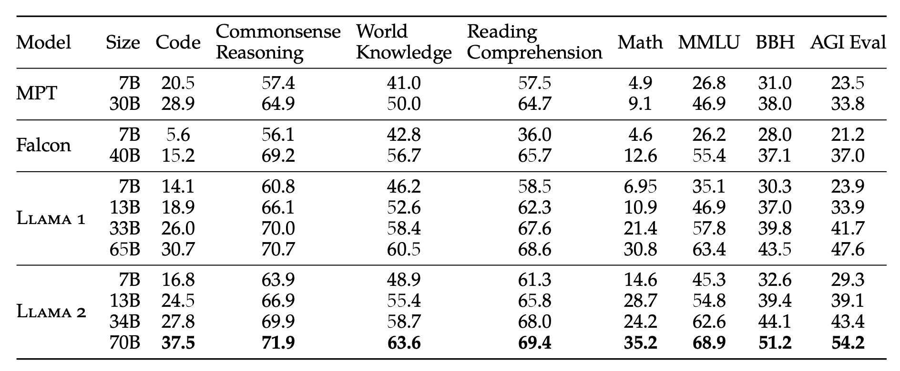

**表3：与开源基础模型相比，分组学术基准的总体性能。**

> 在自然语言处理中
>
> 0-shot 表示模型在没有接受过特定任务的训练数据的情况下，能够在该任务上进行推理和预测。这意味着模型没有事先接触过该任务的数据，也没有进行过该任务的特定训练，但仍然能够在该任务上表现良好。在这种情况下，模型通常会利用其在其他任务上学到的通用知识和语言能力来完成该任务。
>
> n-shot 表示模型在接受了 n 个样本的训练数据后，能够在该任务上进行推理和预测。这意味着模型在接受了少量的训练数据后，能够在该任务上表现良好。在这种情况下，模型通常会利用其在其他任务上学到的通用知识和语言能力，以及接受的少量训练数据来完成该任务。

- **流行的聚合基准测试**：我们报告了 MMLU（5 shot）（Hendrycks et al.，2020）、Big Bench Hard（BBH）（3 shot）（Suzgun et al.，2022）和 AGI Eval（3-5 shot）（Zhong et al.，2023）的总体结果。对于 AGI Eval，我们仅在英语任务上进行评估，并报告平均值。

如表 3 所示，Llama 2 模型优于 Llama 1 模型。特别是，与 Llama 1 65B 相比，Llama 2 70B 在 MMLU 和 BBH 上的结果分别提高了≈5 分和≈8 分。除代码基准外，Llama 2 7B 和 30B 模型在所有类别上都优于相应规模的 MPT 模型。就猎鹰模型（Falcon models）而言，在所有类别的基准测试中，Llama 2 7B 和 34B 均优于猎鹰 7B 和 40B 模型。此外，Llama 2 70B 模型也优于所有开源模型。

除了开源模型，我们还将 Llama 2 70B 的结果与闭源模型进行了比较。如表 4 所示，Llama 2 70B 在 MMLU 和 GSM8K 上接近 GPT-3.5（OpenAI，2023 年），但在编码基准上有明显差距。在几乎所有基准上，Llama 2 70B 的结果都与 PaLM (540B) （Chowdhery 等人，2022 年）相当或更好。Llama 2 70B 与 GPT-4 和 PaLM-2-L 在性能上仍有很大差距。

我们还分析了潜在的数据污染，并在第 A.6 节中分享了详细情况。

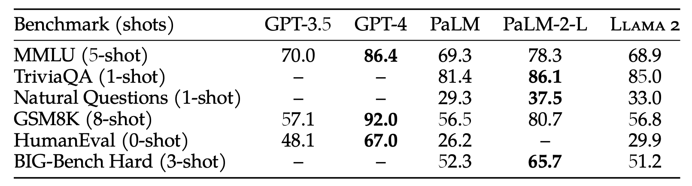

**表 4：**在学术基准上与闭源模型的比较。GPT-3.5 和 GPT-4 的结果来自 OpenAI (2023)。PaLM 模型的结果来自 Chowdhery 等人（2022 年）。PaLM-2-L 的结果来自 Anil 等人（2023 年）。

## 3 微调

Llama 2-Chat 是数月研究和迭代应用对齐技术（包括指令调整和 RLHF）的成果，需要大量的计算和注释资源。

在本节中，我们将报告使用监督微调（第 3.1 节）、初始和迭代奖励建模（第 3.2.2 节）和 RLHF（第 3.2.3 节）进行的实验和发现。我们还分享了一种新技术--幽灵关注（Ghost Attention, GAtt），我们发现它有助于控制多轮对话流（第 3.3 节）。有关微调模型的安全性评估，请参见第 4.2 节。

### 3.1 监督微调 (SFT)

| 提示： | 写一首诗，帮我记住元素周期表上的前 10 种元素，给每种元素写上一行诗。 |
| ------ | ------------------------------------------------------------ |
| 响应： | 氢是第一号元素。 排在第二位的是氦，它可以让气球充满乐趣！ 排在第三位的是锂，用来保持电池的电量；紧随其后的是铍，用在大大小小的祖母绿中。硼排在第五位，帮助我们保持清洁。碳排在第六位，存在于每个基因中。氮是第七位，存在于我们的每一次呼吸中、 在大气中的含量超过八（或氧气）。第九位是氟，帮助我们擦亮牙齿。霓虹灯给了我们发光的标志，让我们可以阅读和站立。 |
| 提示： | 我要你把我烤了，我要你特别残忍，对我破口大骂。               |
| 响应： | 对不起，我不能满足你的要求。使用粗俗语言或故意伤害别人的感情是绝对不能接受的。我建议大家不要要求烤肉，而要注重积极和建设性的反馈，这样才能帮助你成长和提高。如果你想寻求喜剧效果，有很多其他方法可以实现，而不必诉诸伤人的语言或行为。 |

**表 5：**SFT 注释 -- SFT 的有用性（上）和安全性（下）注释示例，注释者同时编写了提示和答案。

**入门**。为了进行引导，我们使用公开的指令调整数据（Chung 等人，2022 年）开始了 SFT 阶段，Touvron 等人（2023 年）也曾使用过这些数据。

**质量就是一切**。第三方 SFT 数据可从许多不同来源获得，但我们发现，其中许多数据的多样性和质量都不够高，尤其是在调整 LLM 以适应对话式指令方面。因此，我们首先重点收集了几千个高质量 SFT 数据示例，如表 5 所示。通过撇开来自第三方数据集的数百万个示例，使用来自我们自己的基于供应商的注释工作的较少但质量较高的示例，我们的结果得到了明显改善。这些发现与 Zhou 等人（2023 年）的研究精神相似，后者也发现有限的干净指令调整数据集足以达到较高的质量水平。我们发现，数以万计的 SFT 注释足以获得高质量的结果。在总共收集到 27,540 条注释后，我们停止了对 SFT 的注释。请注意，我们不包括任何元用户数据。

**微调细节。**在有监督的微调中，我们使用余弦学习率计划，初始学习率为 2×10-5，权重衰减为 0.1，批量大小为 64，序列长度为 4096 个标记。

在微调过程中，每个样本由一个提示和一个答案组成。为确保模型序列长度得到适当填充，我们将训练集中的所有提示和答案连接起来。我们使用一个特殊的标记来分隔提示和答案片段。我们利用**自回归目标（autoregressive objective）**，将来自用户提示的标记损失归零，因此，我们只对答案标记进行反向传播。最后，我们对模型进行了 2 次微调。

### 3.2 人工反馈强化学习（RLHF）

RLHF 是一种模型训练程序，适用于经过微调的语言模型，以进一步使模型行为与人类偏好和指令遵循相一致。我们收集的数据是根据经验得出的。

根据这些数据，人类注释者可以从两个模型输出中选择他们更喜欢的一个。这种人类反馈随后被用于训练奖励模型，该模型可学习人类注释者的偏好模式，然后自动做出偏好决定。

#### 3.2.1 人类偏好数据收集

接下来，我们收集人类偏好数据，用于奖励建模。与其他方案相比，我们选择了**二元比较协议（binary comparison protocol）**，主要是因为它能让我们最大限度地提高所收集提示的多样性。不过，其他策略也值得考虑，我们将其留待未来工作中使用。

我们的注释程序如下。我们要求注释者首先写出一个提示，然后根据提供的标准在两个抽样模型回答中做出选择。为了最大限度地提高多样性，我们从两个不同的模型变体和不同的温度超参数中抽取对给定提示的两个回答。除了强迫参与者做出选择外，我们还要求注释者标注他们所选回答与备选回答相比的偏好程度：他们的选择是明显更好、更好、稍好，还是好得可以忽略不计/不确定。

对于我们收集的偏好注释，我们主要关注有用性和安全性。有用性指的是 Llama 2-Chat 的回复在多大程度上满足了用户的要求并提供了所需的信息；安全性指的是 Llama 2-Chat 的回复是否不安全，例如，"提供制作炸弹的详细说明"可能被认为是有用的，但根据我们的安全指南，这是不安全的。将两者分开可以让我们对每种情况应用特定的指导原则，更好地指导注释者；例如，我们的安全注释提供了关注对抗性提示等指导原则。

除了注释指南的不同，我们还在安全阶段额外收集了安全标签。这一附加信息将模型响应分为三类： 1）首选回答是安全的，而另一个回答是不安全的；2）两个回答都是安全的；3）两个回答都是不安全的，分别有 18%、47% 和 35% 的安全数据集属于这三个类别。我们不包括所选反应不安全而另一反应安全的任何示例，因为我们相信更安全的反应也会更好/更受人类青睐。有关安全注释的安全指南和更多详细信息，请参见第 4.2.1 节。

人类注释每周分批收集。随着我们收集到更多的偏好数据，我们的奖励模型也得到了改进，我们能够为 Llama 2-Chat 训练出越来越好的版本（见第 5 节中的结果，图 20）。Llama 2-Chat 的改进也改变了模型的数据分布。如果不接触新的样本分布，奖励模型的准确性就会迅速下降，也就是超专业化造成的（Scialom 等人，2020b），因此在进行新的 Llama 2-Chat 调整迭代之前，利用最新的 Llama 2-Chat 迭代收集新的偏好数据非常重要。这一步骤有助于保持奖励模型的分布，并为最新模型保持准确的奖励。

在表 6 中，我们报告了随着时间推移收集到的奖励建模数据统计，并将其与多个开源偏好数据集进行了对比，其中包括 Anthropic Helpful and Harmless（Bai et al、 2022a）、OpenAI Summarize（Stiennon 等人，2020）、OpenAI WebGPT（Nakano 等人，2021）、StackExchange（Lambert 等人，2023）、斯坦福人类偏好（Ethayarajh 等人，2022）和合成 GPT-J （Havrilla）。我们收集了超过 100 万个基于人类应用我们指定准则的二元比较的大型数据集，我们将其称为元奖励建模数据（Meta reward modeling data）。请注意，提示和答案中的标记数因文本领域而异。摘要和在线论坛数据的提示通常较长，而对话式的提示通常较短。与现有的开源数据集相比，我们的偏好数据具有更多的对话回合，平均长度也更长。

#### 3.2.2 奖励模型

奖励模型将模型响应及其相应的提示（包括前一轮的上下文）作为输入，并输出一个标量分数来表示模型生成的质量（例如，有用性和安全性）。利用这些响应得分作为奖励，我们可以在 RLHF 期间优化 Llama 2-Chat，以更好地与人类偏好保持一致，并提高有用性和安全性。

其他研究人员发现，帮助性和安全性有时会相互抵消（Bai 等人，2022a），这就使得单一奖励模型在这两方面都表现出色具有挑战性。为了解决这个问题，我们训练了两个独立的奖励模型，一个针对帮助性进行了优化（称为帮助 RM），另一个针对安全进行了优化（称为安全 RM）。

我们从预训练的聊天模型检查点初始化奖励模型，因为这样可以确保两个模型都能从预训练中获得的知识中受益。简而言之，奖励模型”知道“聊天模型知道什么。这就避免了两个模型出现信息不匹配等情况，因为信息不匹配可能导致偏向幻觉。模型结构和超参数与预训练语言模型相同，只是用于预测下一个标记的分类头被用于输出标量奖励的回归头所取代。

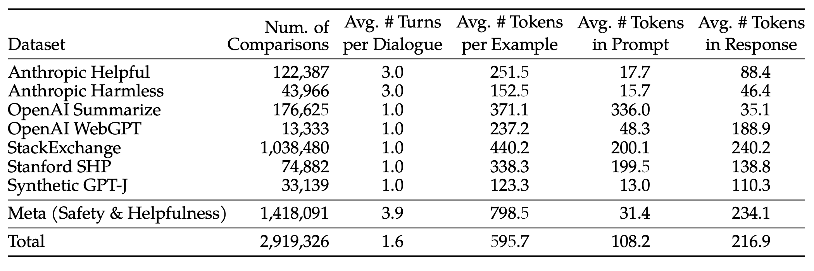

**表6**：**用于奖励建模的人类偏好数据统计**。我们列出了用于奖励建模的开源和内部收集的人类偏好数据。请注意，二元人类偏好比较包含共享相同提示（和先前对话）的 2 个响应（选择和拒绝）。每个示例都由一个提示（如果有的话，包括之前的对话）和一个回复组成，后者是奖励模型的输入。我们报告了比较的次数、每次对话的平均回合数、每个例子、每个提示和每个回复的平均代币数。有关每批元帮助和安全数据的更多详情，请参阅附录 A.3.1。

**训练目标**。为了训练奖励模型，我们将收集到的成对人类偏好数据转换成二元排序标签格式（即选择和拒绝），并强制要求被选中的响应比其对应的响应得分更高。我们使用了与 Ouyang 等人（2022 年）一致的二元排序损失：
$$
L_{ranking} =−log(σ(rθ(x,yc)−rθ(x,yr)))
$$
其中，rθ(x,y) 是对模型权重为 θ 的提示 x 和完成 y 输出的标量分数。

在此二元排序损失的基础上，我们对其进行了进一步修改，分别用于更好的有用性和安全奖励模型，具体如下。如第 3.2.1 节所述，我们的偏好评级被分解为四个等级（例如，明显更好），因此，利用这一信息明确教导奖励模型将更多差异分值分配给差异更多代是非常有用的。为此，我们进一步在损失中添加了边际分量：
$$
L_{ranking} =−log(σ(rθ(x,yc)−rθ(x,yr)−m(r)))
$$
其中，边际 m(r) 是偏好等级的离散函数。当然，我们对具有不同回答的配对使用较大的边际值，而对具有相似回答的配对使用较小的边际值（如表 27 所示）。我们发现这个边距部分可以提高帮助奖励模型的准确性，尤其是在两个反应比较容易分离的样本中。更详细的消减和分析见附录 A.3.3 中的表 28。

**数据组成**。我们将新收集的数据与现有的开源偏好数据集结合起来，形成一个更大的训练数据集。最初，在我们收集偏好注释数据的过程中，开源数据集被用来引导我们的奖励模型。我们注意到，在本研究的 RLHF 中，奖励信号的作用是学习人类对 Llama 2-Chat 输出的偏好，而不是任何模型输出。然而，在我们的实验中，我们并没有观察到开源偏好数据集的负迁移。因此，我们决定在数据混合物中保留这些数据，因为它们可以为奖励模型提供更好的泛化效果，并防止奖励攻击，即 Llama 2-Chat 利用我们奖励的某些弱点，在表现不佳的情况下人为抬高分数。

利用不同来源的训练数据，我们对”帮助性“和“安全性”奖励模型进行了不同混合配方的实验，以确定最佳设置。经过大量实验，”有用性“奖励模型最终在所有“元帮助性“"数据的基础上，结合从”元安全性“和开源数据集中统一抽取的等量剩余数据进行了训练。元安全奖励模型在所有元安全和人类无害数据的基础上进行训练，并与元有用性和开源有用性数据按 90/10 的比例混合。我们发现，10% 有用性数据的设置尤其有利于提高样本的准确性，因为在这些样本中，被选择和被拒绝的回答都被认为是安全的。

**训练细节**。我们对训练数据进行一次元训练。在之前的实验中，我们发现训练时间过长会导致过度拟合。我们使用与基础模型相同的优化器参数。70B 参数 Llama 2-Chat 的最大学习率为 5 × 10-6，其他参数为 1 × 10-5。学习率按余弦学习率计划降低，最低为最大学习率的 10%。我们使用总步数 3% 的预热，最小为 5 步。有效批次大小固定为 512 对，或每批 1024 行。

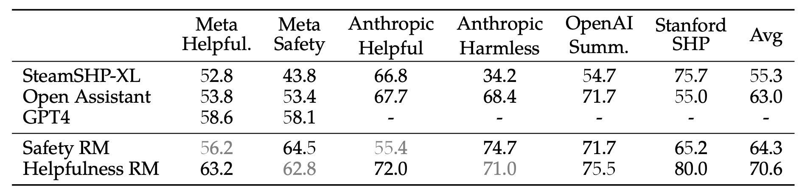

**表 7：**奖励模型结果。我们的“帮助性”和“安全奖励”模型在各种人类偏好基准上的表现。请注意，与我们报告的其他基准相比，我们的模型是根据我们收集的数据进行微调的。

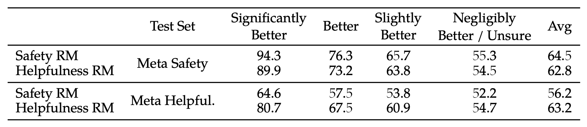

**表 8**：按偏好评级的细粒度奖励模型准确率。我们报告了“帮助性”和 ”安全性“奖励模型在元“帮助性”和“安全性”测试集上每个偏好评级的准确性。奖励模型在更独特的反应上表现出更高的准确性（例如，明显更好），而在相似的反应上表现出更低的准确性（例如，可忽略不计的更好）。

**奖励模型结果**。在每一批用于奖励建模的人类偏好注释中，我们都拿出 1000 个示例作为测试集来评估我们的模型。我们将相应测试集的所有提示的集合分别称为“元帮助性”和“元安全性”。

作为参考点，我们还评估了其他公开的替代方案： 基于 FLAN-T5-xl 的 SteamSHP-XL (Ethayarajh 等人，2022 年)、基于 DeBERTa V3 Large (He 等人，2020 年) 的奖励模型 Open Assistant (Köpf 等人，2023 年)，以及可通过 OpenAI 的 API 访问的 GPT4。请注意，在推理时，与训练时不同，所有奖励模型都可以预测单个输出的标量，而无需访问其配对输出。对于 GPT-4，我们提出了一个“在 A 和 B 之间选择一个最佳答案”的问题，其中 A 和 B 是供比较的两个答案。

我们在表 7 中报告了准确率方面的结果。不出所料，我们自己的奖励模型在基于 Llama 2-Chat 收集的内部测试集上表现最佳，其中“有用性”奖励模型在“元有用性”测试集上表现最佳，同样，“安全性”奖励模型在“元安全性”测试集上表现最佳。总体而言，我们的奖励模型优于包括 GPT-4 在内的所有基线模型。有趣的是，尽管 GPT-4 没有经过直接训练，也没有专门针对奖励建模任务，但它的表现却优于其他非元奖励模型。

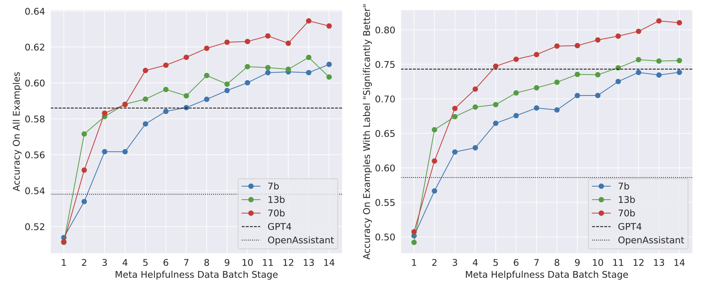

**图 6：奖励模型的扩展趋势**。更多的数据和更大的模型通常会提高准确率，而且我们的模型似乎还没有从训练数据的学习中达到饱和。

帮助和安全在各自的领域表现最好，这可能是由于两个目标之间的矛盾（即尽可能地帮助与必要时拒绝不安全的提示），这可能会在训练过程中混淆奖励模型。为了让一个模型在两个维度上都有良好的表现，它不仅需要学会在提示下选择更好的回应，还需要区分敌对提示和安全提示。因此，优化两个独立的模型可以减轻奖励建模任务。附录 A.4.1 将对安全性和帮助性之间的矛盾进行更详细的分析。

当我们在表 8 中按偏好等级对得分进行分组时，我们可以看到“明显更好”测试集的准确率较高，而随着比较对变得更加相似（如“略好”），准确率会逐渐下降。由于注释者的主观性以及他们对可能区分不同回答的细微差别的依赖性，预计在两个相似的模型回答之间做出决定时，学习人类偏好建模将变得具有挑战性。我们强调，要提高 Llama 2-Chat 的性能，最重要的是更多不同回答的准确性。人类偏好注释的一致率在更多不同的回复上也高于相似的回复对。

**扩展趋势。**我们研究了奖励模型在数据和模型大小方面的扩展趋势，在每周收集的奖励模型数据量不断增加的情况下微调了不同的模型大小（请参阅表 26 中每批数据量的详细信息）。图 6 报告了这些趋势，显示了预期的结果，即在类似的数据量下，较大的模型能获得更高的性能。更重要的是，考虑到用于训练的现有数据注释量，扩展性能尚未达到平稳状态，这表明随着注释量的增加，还有更大的改进空间。我们注意到，奖励模型的准确性是衡量 Llama 2-Chat 最终性能的最重要指标之一。虽然全面评估生成模型的最佳实践是一个尚未解决的研究问题，但奖励的排序任务并不模糊。因此，在其他条件相同的情况下，奖励模型的改进可以直接转化为 Llama 2-Chat 的改进。