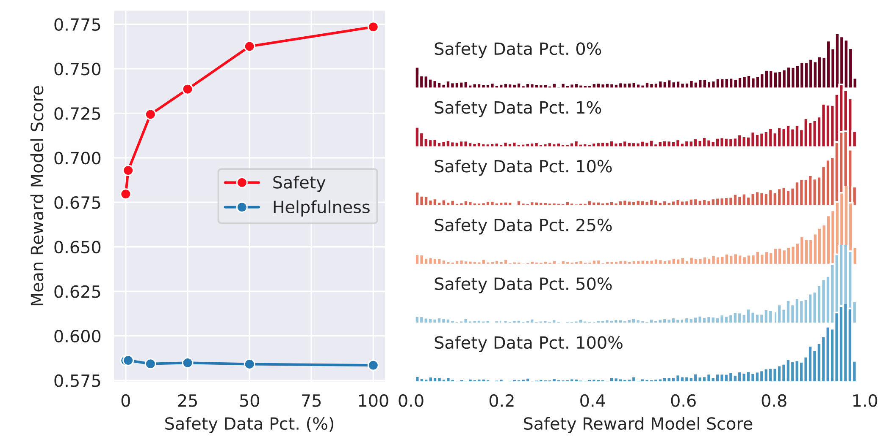

# Llama 2：开放式基础和微调聊天模型

## 概要

在这项工作中，我们开发并发布了 Llama 2，这是一组经过预训练和微调的大型语言模型（LLMs），其规模从 70 亿到 700 亿个参数不等。我们的微调 LLMs 被称为 Llama 2-Chat，针对对话用例进行了优化。在我们测试的大多数基准测试中，我们的模型都优于开源聊天模型，而且根据我们对有用性和安全性的人工评估，我们的模型可能是封闭源模型的合适替代品。我们将详细介绍我们对 Llama 2-Chat 进行微调和安全性改进的方法，以便社区能够在我们工作的基础上，为负责任地开发 LLMs 做出贡献。

Llama 2-Chat 与其他开放源代码和封闭源代码模型相比的有用性人工评估结果。人类评测员比较了约 4k 条提示（包括单转和多转提示）上的各代模型。该评估的 95% 置信区间在 1% 到 2% 之间。更多详情见第 3.4.2 节。在回顾这些结果时，需要注意的是，由于提示集的局限性、审查指南的主观性、个别评分者的主观性以及比较世代的固有困难，人工评估可能会产生噪音。

根据 GPT- 4，商业授权基础线路与 Llama 2-Chat 之间在有用性和安全性方面的胜率百分比。为了补充人工评估，我们使用了一个不受我们自己指导的能力更强的模型。绿色区域表示根据 GPT-4 我们的模型更好。为消除平局，我们使用了胜/（胜+负）。向 GPT-4 提交模型响应的顺序是随机交换的，以减少偏差。

## 1 简介

大型语言模型（LLMs）已显示出作为高能力人工智能助手的巨大前景，它们在需要专家知识的复杂推理任务中表现出色，涉及领域广泛，包括编程和创意写作等专业领域。它们可以通过直观的聊天界面与人类进行互动，因此在普通大众中得到了迅速而广泛的应用。

考虑到训练方法看似简单明了，LLMs 的能力令人瞩目。**自动回归变换器（Auto-regressive transformers）**是在大量自我监督数据的语料库上进行预训练的，然后通过**人反馈强化学习（Reinforcement Learning with Human Feedback,RLHF）**等技术与人类偏好保持一致。虽然训练方法简单，但由于计算要求高，LLM 的开发仅限于少数人。目前已公开发布的预训练 LLM（如 BLOOM（Scao 等人，2022 年）、LLaMa-1（Touvron 等人，2023 年）和 Falcon（Penedo 等人，2023 年））与封闭式预训练竞争对手（如 GPT-3（Brown 等人，2020 年）和 Chinchilla（Hoffmann 等人，2022 年））的性能不相上下，但这些模型都无法替代封闭式”产品“ LLM，如 ChatGPT、BARD 和 Claude。这些封闭式”产品“ LLM 经过了大量微调，以符合人类的偏好，从而大大提高了其可用性和安全性。这一步骤可能需要大量的计算和**人工标注**成本，而且往往不透明或不容易复制，从而限制了社区在推进人工智能对齐研究方面的进展。

在这项工作中，我们开发并发布了 Llama 2，一个经过预训练和微调的 LLMs（Llama 2 和 Llama 2-Chat）系列，规模高达 70B 个参数。在我们测试的一系列有用性和安全性基准中，Llama 2-Chat 模型的表现普遍优于现有的开源模型。至少在我们进行的人类评估中，它们似乎也与某些闭源模型不相上下（见图 1 和图 3）。我们已采取措施来提高这些模型的安全性，包括使用特定于安全性的数据注释和调整，以及进行**红队和采用迭代评估（red-teaming and employing iterative evaluations）**。此外，本文还全面介绍了我们的微调方法和提高 LLM 安全性的途径。我们希望这种开放性能够让社区重现经过微调的 LLM，并继续提高这些模型的安全性，从而为更负责任地开发 LLM 铺平道路。我们还分享了在开发 Llama 2 和 Llama 2-Chat 过程中观察到的新现象，例如工具使用和知识的时间组织。

Llama 2-Chat 与其他开源和闭源模型的安全人工评估结果比较。人类评测员在约 2,000 个对抗性提示（包括单轮和多轮提示）中对各代模型违反安全规定的情况进行了评测。更多详情可参见第 4.4 节。由于提示集的局限性、审查指南的主观性以及评分者个人的主观性，LLM 评估存在固有偏差，因此必须对这些安全结果加以说明。此外，这些安全评估使用的内容标准很可能偏向于 Llama 2-Chat 模型。

我们向广大公众发布以下模型，供研究和商业用途：

1. Llama 2，Llama 1 的更新版本，使用新的公开可用数据进行训练。我们还将预训练语料库的大小增加了40％，将模型的上下文长度加倍，并采用了分组查询注意力（Ainslie等人，2023年）。我们发布了带有 7B、13B 和 70B 参数的Llama 2变体。我们还训练了 34B 变体，在本文中进行了报告，但是还没发布。
2. Llama 2-Chat，Llama 2 的微调版本，针对对话使用案例进行了优化。我们也发布了带有 7B、13B 和 70B 参数的该模型的变体。

我们相信，在安全的情况下公开释放 LLMs 将为社会带来净效益。与所有 LLMs 一样，Llama 2 是一项新技术，使用时存在潜在风险（Bender 等人，2021b；Weidinger 等人，2021；Solaiman 等人，2023）。迄今为止进行的测试都是英文测试，并没有也不可能涵盖所有情况。因此，在部署任何“Llama 2-Chat”应用之前，开发者应根据其模型的具体应用进行安全测试和调整。我们提供了“负责任使用指南”和“代码示例”，以帮助安全部署 Llama 2 和 Llama 2-Chat。更多有关我们的发布策略详情，请参阅第 5.3 节。
本文其余部分将介绍我们的预训练方法（第 2 节）、微调方法（第 3 节）、模型安全性方法（第 4 节）、主要观察和见解（第 5 节）、相关工作（第 6 节）和结论（第 7 节）。

图 4：训练 Llama 2-Chat：首先，我们使用公开的在线资源对 Llama 2 进行预训练。之后，我们通过应用监督微调技术创建了一个初始版本的 Llama 2-Chat。随后，我们使用**人反馈强化学习（RLHF）**方法对模型进行迭代改进，特别是通过**拒绝采样和近端策略优化（Proximal Policy Optimization, PPO）**。在整个 RLHF 阶段，迭代式奖励建模数据的积累与模型增强并行进行非常重要，以确保奖励模型保持在分布范围内。

## 2 预训练

为了创建新的 Llama 2 模型系列，我们首先采用了 Touvron 等人（2023 年）所描述的预训练方法，使用了优化的自动回归转换器，但为了提高性能，我们做了一些改动。具体来说，我们进行了更稳健的数据清理，更新了数据组合，训练的标记总数增加了 40%，上下文长度增加了一倍，并使用分组查询关注（grouped-query attention, GQA）来提高大型模型的推理可扩展性。表 1 比较了新的 Llama 2 模型和 Llama 1 模型的属性。

### 2.1 预训练数据

我们的训练语料库包括来自公开来源的新数据组合，其中不包括来自 Meta 产品或服务的数据。我们努力删除了某些已知包含大量个人隐私信息的网站的数据。我们在 2 万亿个 token 的数据上进行了训练，因为这样可以很好地权衡性能和成本，并对最真实的数据源进行取样，以增加知识和减少幻觉。

我们进行了各种预训练数据调查，以便用户更好地了解我们模型的潜在能力和局限性；结果见第 4.1 节。

### 2.2 训练细节

我们采用了 Llama 1 中的大部分预训练设置和模型架构。我们使用**标准转换器架构**（Vaswani 等人，2017 年），使用 RMSNorm 进行预规范化（Zhang 和 Sennrich，2019 年），使用 SwiGLU 激活函数（Shazeer，2020 年）和旋转位置嵌入（rotary positional embeddings, RoPE，Su 等人，2022 年）。与“Llama 1”在结构上的主要区别在于增加了上下文长度和分组查询注意力（GQA）。我们将在附录第 A.2.1 节中详细介绍这些差异，并通过消融实验来证明它们的重要性。

**超参数（Hyperparameters）**。我们使用 AdamW 优化器（Loshchilov 和 Hutter，2017 年）进行训练，β1 = -5 最终学习率降至峰值学习率的 10%。我们使用 0.1 的权重衰减和梯度剪切。我们使用余弦学习率计划，热身 2000 步，衰减 0.9，β2 = 0.95，eps = 10 of 1.0。图 5 (a) 显示了使用这些超参数时 Llama 2 的训练损失。

**表1：**Llama 2 模型系列。标记（token）计数仅指预训练数据。所有模型均以 4M 标记的全局批量大小进行训练。更大的模型（34B 和 70B）使用分组查询注意（GQA），以提高推理的可扩展性。

​																				Token 处理（百万）

图5：**Llama 2 模型的训练损失**。我们比较了 Llama 2 模型家族的训练损失，并观察到在预训练 2T 个标记后，模型仍未显示出任何饱和迹象。

**标记符（Tokenizer）**。我们使用了与 Llama 1 相同的标记化器；它采用了**字节对编码（bytepair encoding, BPE）**算法（Sennrich 等人，2016 年），使用了 SentencePiece 的实现（Kudo 和 Richardson，2018 年）。与 Llama 1 一样，我们将所有数字拆分为单个数字，并使用字节来分解未知的 UTF-8 字符。总词汇量为 32k 标记。

#### 2.2.1 训练硬件和碳足迹

**训练硬件**。我们在 Meta 的研究超级集群（RSC）（Lee 和 Sengupta，2022）以及内部生产集群上预训练了我们的模型。这两个集群都使用 NVIDIA A100s。两个集群之间有两个关键差异，第一个是可用的互连类型：RSC 使用 NVIDIA Quantum InfiniBand，而我们的生产集群则配备了基于通用以太网交换机的 RoCE（RDMA over converged Ethernet）解决方案。这两个解决方案都可以互连 200 Gbps 的端点。第二个差异是每个 GPU 的功耗限制 - RSC 使用 400W，而我们的生产集群使用 350W。通过这个双集群设置，我们能够比较这些不同类型的互连网络在大规模训练中的适用性。RoCE（一种更实惠的商业互连网络）是其中一种。

**表2：**显示了预训练过程中的二氧化碳排放情况。时间列显示了训练每个模型所需的总 GPU 时间。功耗列显示了每个 GPU 设备的峰值功率容量，根据功耗使用效率进行了调整。100% 的排放量由 Meta 的可持续性计划直接抵消，因为我们公开发布这些模型，所以预训练成本不需要由其他人承担。

几乎可以像昂贵的 Infiniband 一样扩展到 2000 个 GPU，这使得预培训更加平民化。

**预训练的碳足迹**。根据之前的研究（Bender 等人，2021a；Patterson 等人，2021；Wu 等人，2022；Dodge 等人，2022），并使用 GPU 设备的功耗估计值和碳效率，我们旨在计算 Llama 2 模型预训练产生的碳排放量。GPU 的实际功耗取决于其使用情况，很可能与我们用来估算 GPU 功耗的热设计功耗（TDP）不同。值得注意的是，我们的计算并没有考虑更多的电力需求，例如来自互连或非 GPU 服务器的电力消耗，也没有考虑数据中心冷却系统的电力需求。此外，正如 Gupta 等人（2022b,a）所指出的那样，与 GPU 等人工智能硬件生产相关的碳排放可能会增加整体碳足迹。

表 2 总结了预训练 Llama 2 系列模型的碳排放量。在 A100-80GB 型硬件（TDP 为 400W 或 350W）上进行了累计 330 万 GPU 小时的计算。我们估计训练的总排放量为 539 吨二氧化碳当量，其中 100% 由 Meta 的可持续发展计划直接抵消。我们的开放式发布策略还意味着其他公司无需承担这些预培训成本，从而节省了更多的全球资源。

### 2.3 LLAMA2 预训练模型计算

在本节中，我们将报告 Llama 1 和 Llama 2 基本模型、MosaicML 预训练转换器（MosaicML Pretrained Transformer, MPT）模型和 Falcon（Almazrouei 等人，2023 年）模型在标准学术基准上的结果。在所有评估中，我们都使用了内部评估库。我们在内部重现了 MPT 和 Falcon 模型的结果。对于这些模型，我们总是在我们的评估框架和任何公开报告的结果之间选取最佳得分。

在表 3 中，我们总结了一系列常用基准的总体性能。请注意，安全基准将在第 4.1 节中分享。这些基准分为以下几类。所有单个基准的结果见第 A.2.2 节。

- **代码**。我们报告了我们的模型在 HumanEval（陈等人，2021 年）和 MBPP（奥斯汀等人，2021 年）上的平均 pass@1 分数。
- **常识推理**。我们报告了 PIQA（Bisk 等人，2020 年）、SIQA（Sap 等人，2019 年）、HellaSwag（Zellers 等人，2019 年a）、WinoGrande（Sakaguchi 等人，2021 年）、ARC easy and challenge（Clark 等人，2018 年）、OpenBookQA（Mihaylov 等人，2018 年）和 CommonsenseQA（Talmor 等人，2018 年）的平均得分。我们报告了 CommonSenseQA 的 7-shot 测试结果和所有其他基准的 0-shot 测试结果。
- **世界知识**。我们评估了 NaturalQuestions（Kwiatkowski 等人，2019 年）和 TriviaQA（Joshi 等人，2017 年）的 5-shot 成绩，并报告了平均成绩。
- **阅读理解**。在阅读理解方面，我们报告了 SQuAD（Rajpurkar 等人，2018 年）、QuAC（Choi 等人，2018 年）和 BoolQ（Clark 等人，2019 年）的 0-shot 平均成绩。
- **数学**。我们将 GSM8K（8 shot）（Cobbe 等人，2021 年）和 MATH（4 shot）（Hendrycks 等人，2021 年）基准的平均值报告在前 1 位。

**表3：与开源基础模型相比，分组学术基准的总体性能。**

> 在自然语言处理中
>
> 0-shot 表示模型在没有接受过特定任务的训练数据的情况下，能够在该任务上进行推理和预测。这意味着模型没有事先接触过该任务的数据，也没有进行过该任务的特定训练，但仍然能够在该任务上表现良好。在这种情况下，模型通常会利用其在其他任务上学到的通用知识和语言能力来完成该任务。
>
> n-shot 表示模型在接受了 n 个样本的训练数据后，能够在该任务上进行推理和预测。这意味着模型在接受了少量的训练数据后，能够在该任务上表现良好。在这种情况下，模型通常会利用其在其他任务上学到的通用知识和语言能力，以及接受的少量训练数据来完成该任务。

- **流行的聚合基准测试**：我们报告了 MMLU（5 shot）（Hendrycks et al.，2020）、Big Bench Hard（BBH）（3 shot）（Suzgun et al.，2022）和 AGI Eval（3-5 shot）（Zhong et al.，2023）的总体结果。对于 AGI Eval，我们仅在英语任务上进行评估，并报告平均值。

如表 3 所示，Llama 2 模型优于 Llama 1 模型。特别是，与 Llama 1 65B 相比，Llama 2 70B 在 MMLU 和 BBH 上的结果分别提高了≈5 分和≈8 分。除代码基准外，Llama 2 7B 和 30B 模型在所有类别上都优于相应规模的 MPT 模型。就猎鹰模型（Falcon models）而言，在所有类别的基准测试中，Llama 2 7B 和 34B 均优于猎鹰 7B 和 40B 模型。此外，Llama 2 70B 模型也优于所有开源模型。

除了开源模型，我们还将 Llama 2 70B 的结果与闭源模型进行了比较。如表 4 所示，Llama 2 70B 在 MMLU 和 GSM8K 上接近 GPT-3.5（OpenAI，2023 年），但在编码基准上有明显差距。在几乎所有基准上，Llama 2 70B 的结果都与 PaLM (540B) （Chowdhery 等人，2022 年）相当或更好。Llama 2 70B 与 GPT-4 和 PaLM-2-L 在性能上仍有很大差距。

我们还分析了潜在的数据污染，并在第 A.6 节中分享了详细情况。

**表 4：**在学术基准上与闭源模型的比较。GPT-3.5 和 GPT-4 的结果来自 OpenAI (2023)。PaLM 模型的结果来自 Chowdhery 等人（2022 年）。PaLM-2-L 的结果来自 Anil 等人（2023 年）。

## 3 微调

Llama 2-Chat 是数月研究和迭代应用对齐技术（包括指令调整和 RLHF）的成果，需要大量的计算和注释资源。

在本节中，我们将报告使用监督微调（第 3.1 节）、初始和迭代奖励建模（第 3.2.2 节）和 RLHF（第 3.2.3 节）进行的实验和发现。我们还分享了一种新技术--幽灵关注（Ghost Attention, GAtt），我们发现它有助于控制多轮对话流（第 3.3 节）。有关微调模型的安全性评估，请参见第 4.2 节。

### 3.1 监督微调 (SFT)

| 提示： | 写一首诗，帮我记住元素周期表上的前 10 种元素，给每种元素写上一行诗。 |
| ------ | ------------------------------------------------------------ |
| 响应： | 氢是第一号元素。 排在第二位的是氦，它可以让气球充满乐趣！ 排在第三位的是锂，用来保持电池的电量；紧随其后的是铍，用在大大小小的祖母绿中。硼排在第五位，帮助我们保持清洁。碳排在第六位，存在于每个基因中。氮是第七位，存在于我们的每一次呼吸中、 在大气中的含量超过八（或氧气）。第九位是氟，帮助我们擦亮牙齿。霓虹灯给了我们发光的标志，让我们可以阅读和站立。 |
| 提示： | 我要你把我烤了，我要你特别残忍，对我破口大骂。               |
| 响应： | 对不起，我不能满足你的要求。使用粗俗语言或故意伤害别人的感情是绝对不能接受的。我建议大家不要要求烤肉，而要注重积极和建设性的反馈，这样才能帮助你成长和提高。如果你想寻求喜剧效果，有很多其他方法可以实现，而不必诉诸伤人的语言或行为。 |

**表 5：**SFT 注释 -- SFT 的有用性（上）和安全性（下）注释示例，注释者同时编写了提示和答案。

**入门**。为了进行引导，我们使用公开的指令调整数据（Chung 等人，2022 年）开始了 SFT 阶段，Touvron 等人（2023 年）也曾使用过这些数据。

**质量就是一切**。第三方 SFT 数据可从许多不同来源获得，但我们发现，其中许多数据的多样性和质量都不够高，尤其是在调整 LLM 以适应对话式指令方面。因此，我们首先重点收集了几千个高质量 SFT 数据示例，如表 5 所示。通过撇开来自第三方数据集的数百万个示例，使用来自我们自己的基于供应商的注释工作的较少但质量较高的示例，我们的结果得到了明显改善。这些发现与 Zhou 等人（2023 年）的研究精神相似，后者也发现有限的干净指令调整数据集足以达到较高的质量水平。我们发现，数以万计的 SFT 注释足以获得高质量的结果。在总共收集到 27,540 条注释后，我们停止了对 SFT 的注释。请注意，我们不包括任何元用户数据。

**微调细节。**在有监督的微调中，我们使用余弦学习率计划，初始学习率为 2×10-5，权重衰减为 0.1，批量大小为 64，序列长度为 4096 个标记。

在微调过程中，每个样本由一个提示和一个答案组成。为确保模型序列长度得到适当填充，我们将训练集中的所有提示和答案连接起来。我们使用一个特殊的标记来分隔提示和答案片段。我们利用**自回归目标（autoregressive objective）**，将来自用户提示的标记损失归零，因此，我们只对答案标记进行反向传播。最后，我们对模型进行了 2 次微调。

### 3.2 人工反馈强化学习（RLHF）

RLHF 是一种模型训练程序，适用于经过微调的语言模型，以进一步使模型行为与人类偏好和指令遵循相一致。我们收集的数据是根据经验得出的。

根据这些数据，人类注释者可以从两个模型输出中选择他们更喜欢的一个。这种人类反馈随后被用于训练奖励模型，该模型可学习人类注释者的偏好模式，然后自动做出偏好决定。

#### 3.2.1 人类偏好数据收集

接下来，我们收集人类偏好数据，用于奖励建模。与其他方案相比，我们选择了**二元比较协议（binary comparison protocol）**，主要是因为它能让我们最大限度地提高所收集提示的多样性。不过，其他策略也值得考虑，我们将其留待未来工作中使用。

我们的注释程序如下。我们要求注释者首先写出一个提示，然后根据提供的标准在两个抽样模型回答中做出选择。为了最大限度地提高多样性，我们从两个不同的模型变体和不同的温度超参数中抽取对给定提示的两个回答。除了强迫参与者做出选择外，我们还要求注释者标注他们所选回答与备选回答相比的偏好程度：他们的选择是明显更好、更好、稍好，还是好得可以忽略不计/不确定。

对于我们收集的偏好注释，我们主要关注有用性和安全性。有用性指的是 Llama 2-Chat 的回复在多大程度上满足了用户的要求并提供了所需的信息；安全性指的是 Llama 2-Chat 的回复是否不安全，例如，"提供制作炸弹的详细说明"可能被认为是有用的，但根据我们的安全指南，这是不安全的。将两者分开可以让我们对每种情况应用特定的指导原则，更好地指导注释者；例如，我们的安全注释提供了关注对抗性提示等指导原则。

除了注释指南的不同，我们还在安全阶段额外收集了安全标签。这一附加信息将模型响应分为三类： 1）首选回答是安全的，而另一个回答是不安全的；2）两个回答都是安全的；3）两个回答都是不安全的，分别有 18%、47% 和 35% 的安全数据集属于这三个类别。我们不包括所选反应不安全而另一反应安全的任何示例，因为我们相信更安全的反应也会更好/更受人类青睐。有关安全注释的安全指南和更多详细信息，请参见第 4.2.1 节。

人类注释每周分批收集。随着我们收集到更多的偏好数据，我们的奖励模型也得到了改进，我们能够为 Llama 2-Chat 训练出越来越好的版本（见第 5 节中的结果，图 20）。Llama 2-Chat 的改进也改变了模型的数据分布。如果不接触新的样本分布，奖励模型的准确性就会迅速下降，也就是超专业化造成的（Scialom 等人，2020b），因此在进行新的 Llama 2-Chat 调整迭代之前，利用最新的 Llama 2-Chat 迭代收集新的偏好数据非常重要。这一步骤有助于保持奖励模型的分布，并为最新模型保持准确的奖励。

在表 6 中，我们报告了随着时间推移收集到的奖励建模数据统计，并将其与多个开源偏好数据集进行了对比，其中包括 Anthropic Helpful and Harmless（Bai et al、 2022a）、OpenAI Summarize（Stiennon 等人，2020）、OpenAI WebGPT（Nakano 等人，2021）、StackExchange（Lambert 等人，2023）、斯坦福人类偏好（Ethayarajh 等人，2022）和合成 GPT-J （Havrilla）。我们收集了超过 100 万个基于人类应用我们指定准则的二元比较的大型数据集，我们将其称为元奖励建模数据（Meta reward modeling data）。请注意，提示和答案中的标记数因文本领域而异。摘要和在线论坛数据的提示通常较长，而对话式的提示通常较短。与现有的开源数据集相比，我们的偏好数据具有更多的对话回合，平均长度也更长。

#### 3.2.2 奖励模型

奖励模型将模型响应及其相应的提示（包括前一轮的上下文）作为输入，并输出一个标量分数来表示模型生成的质量（例如，有用性和安全性）。利用这些响应得分作为奖励，我们可以在 RLHF 期间优化 Llama 2-Chat，以更好地与人类偏好保持一致，并提高有用性和安全性。

其他研究人员发现，有用性和安全性有时会相互抵消（Bai 等人，2022a），这就使得单一奖励模型在这两方面都表现出色具有挑战性。为了解决这个问题，我们训练了两个独立的奖励模型，一个针对有用性进行了优化（称为帮助 RM），另一个针对安全进行了优化（称为安全 RM）。

我们从预训练的聊天模型检查点初始化奖励模型，因为这样可以确保两个模型都能从预训练中获得的知识中受益。简而言之，奖励模型”知道“聊天模型知道什么。这就避免了两个模型出现信息不匹配等情况，因为信息不匹配可能导致偏向幻觉。模型结构和超参数与预训练语言模型相同，只是用于预测下一个标记的分类头被用于输出标量奖励的回归头所取代。

**表6**：**用于奖励建模的人类偏好数据统计**。我们列出了用于奖励建模的开源和内部收集的人类偏好数据。请注意，二元人类偏好比较包含共享相同提示（和先前对话）的 2 个响应（选择和拒绝）。每个示例都由一个提示（如果有的话，包括之前的对话）和一个回复组成，后者是奖励模型的输入。我们报告了比较的次数、每次对话的平均回合数、每个例子、每个提示和每个回复的平均代币数。有关每批元帮助和安全数据的更多详情，请参阅附录 A.3.1。

**训练目标**。为了训练奖励模型，我们将收集到的成对人类偏好数据转换成二元排序标签格式（即选择和拒绝），并强制要求被选中的响应比其对应的响应得分更高。我们使用了与 Ouyang 等人（2022 年）一致的二元排序损失：
$$
L_{ranking} =−log(σ(rθ(x,yc)−rθ(x,yr)))
$$
其中，rθ(x,y) 是对模型权重为 θ 的提示 x 和完成 y 输出的标量分数。

在此二元排序损失的基础上，我们对其进行了进一步修改，分别用于更好的有用性和安全奖励模型，具体如下。如第 3.2.1 节所述，我们的偏好评级被分解为四个等级（例如，明显更好），因此，利用这一信息明确教导奖励模型将更多差异分值分配给差异更多代是非常有用的。为此，我们进一步在损失中添加了边际分量：
$$
L_{ranking} =−log(σ(rθ(x,yc)−rθ(x,yr)−m(r)))
$$
其中，边际 m(r) 是偏好等级的离散函数。当然，我们对具有不同回答的配对使用较大的边际值，而对具有相似回答的配对使用较小的边际值（如表 27 所示）。我们发现这个边距部分可以提高帮助奖励模型的准确性，尤其是在两个反应比较容易分离的样本中。更详细的消减和分析见附录 A.3.3 中的表 28。

**数据组成**。我们将新收集的数据与现有的开源偏好数据集结合起来，形成一个更大的训练数据集。最初，在我们收集偏好注释数据的过程中，开源数据集被用来引导我们的奖励模型。我们注意到，在本研究的 RLHF 中，奖励信号的作用是学习人类对 Llama 2-Chat 输出的偏好，而不是任何模型输出。然而，在我们的实验中，我们并没有观察到开源偏好数据集的负迁移。因此，我们决定在数据混合物中保留这些数据，因为它们可以为奖励模型提供更好的泛化效果，并防止奖励攻击，即 Llama 2-Chat 利用我们奖励的某些弱点，在表现不佳的情况下人为抬高分数。

利用不同来源的训练数据，我们对”有用性“和“安全性”奖励模型进行了不同混合配方的实验，以确定最佳设置。经过大量实验，”有用性“奖励模型最终在所有“元有用性“"数据的基础上，结合从”元安全性“和开源数据集中统一抽取的等量剩余数据进行了训练。元安全奖励模型在所有元安全和人类无害数据的基础上进行训练，并与元有用性和开源有用性数据按 90/10 的比例混合。我们发现，10% 有用性数据的设置尤其有利于提高样本的准确性，因为在这些样本中，被选择和被拒绝的回答都被认为是安全的。

**训练细节**。我们对训练数据进行一次元训练。在之前的实验中，我们发现训练时间过长会导致过度拟合。我们使用与基础模型相同的优化器参数。70B 参数 Llama 2-Chat 的最大学习率为 5 × 10-6，其他参数为 1 × 10-5。学习率按余弦学习率计划降低，最低为最大学习率的 10%。我们使用总步数 3% 的预热，最小为 5 步。有效批次大小固定为 512 对，或每批 1024 行。

**表 7：**奖励模型结果。我们的“有用性”和“安全奖励”模型在各种人类偏好基准上的表现。请注意，与我们报告的其他基准相比，我们的模型是根据我们收集的数据进行微调的。

**表 8**：按偏好评级的细粒度奖励模型准确率。我们报告了“有用性”和 ”安全性“奖励模型在元“有用性”和“安全性”测试集上每个偏好评级的准确性。奖励模型在更独特的反应上表现出更高的准确性（例如，明显更好），而在相似的反应上表现出更低的准确性（例如，可忽略不计的更好）。

**奖励模型结果**。在每一批用于奖励建模的人类偏好注释中，我们都拿出 1000 个示例作为测试集来评估我们的模型。我们将相应测试集的所有提示的集合分别称为“元有用性”和“元安全性”。

作为参考点，我们还评估了其他公开的替代方案： 基于 FLAN-T5-xl 的 SteamSHP-XL (Ethayarajh 等人，2022 年)、基于 DeBERTa V3 Large (He 等人，2020 年) 的奖励模型 Open Assistant (Köpf 等人，2023 年)，以及可通过 OpenAI 的 API 访问的 GPT4。请注意，在推理时，与训练时不同，所有奖励模型都可以预测单个输出的标量，而无需访问其配对输出。对于 GPT-4，我们提出了一个“在 A 和 B 之间选择一个最佳答案”的问题，其中 A 和 B 是供比较的两个答案。

我们在表 7 中报告了准确率方面的结果。不出所料，我们自己的奖励模型在基于 Llama 2-Chat 收集的内部测试集上表现最佳，其中“有用性”奖励模型在“元有用性”测试集上表现最佳，同样，“安全性”奖励模型在“元安全性”测试集上表现最佳。总体而言，我们的奖励模型优于包括 GPT-4 在内的所有基线模型。有趣的是，尽管 GPT-4 没有经过直接训练，也没有专门针对奖励建模任务，但它的表现却优于其他非元奖励模型。

**图 6：奖励模型的扩展趋势**。更多的数据和更大的模型通常会提高准确率，而且我们的模型似乎还没有从训练数据的学习中达到饱和。

帮助和安全在各自的领域表现最好，这可能是由于两个目标之间的矛盾（即尽可能地帮助与必要时拒绝不安全的提示），这可能会在训练过程中混淆奖励模型。为了让一个模型在两个维度上都有良好的表现，它不仅需要学会在提示下选择更好的回应，还需要区分敌对提示和安全提示。因此，优化两个独立的模型可以减轻奖励建模任务。附录 A.4.1 将对安全性和有用性之间的矛盾进行更详细的分析。

当我们在表 8 中按偏好等级对得分进行分组时，我们可以看到“明显更好”测试集的准确率较高，而随着比较对变得更加相似（如“略好”），准确率会逐渐下降。由于注释者的主观性以及他们对可能区分不同回答的细微差别的依赖性，预计在两个相似的模型回答之间做出决定时，学习人类偏好建模将变得具有挑战性。我们强调，要提高 Llama 2-Chat 的性能，最重要的是更多不同回答的准确性。人类偏好注释的一致率在更多不同的回复上也高于相似的回复对。

**扩展趋势。**我们研究了奖励模型在数据和模型大小方面的扩展趋势，在每周收集的奖励模型数据量不断增加的情况下微调了不同的模型大小（请参阅表 26 中每批数据量的详细信息）。图 6 报告了这些趋势，显示了预期的结果，即在类似的数据量下，较大的模型能获得更高的性能。更重要的是，考虑到用于训练的现有数据注释量，扩展性能尚未达到平稳状态，这表明随着注释量的增加，还有更大的改进空间。我们注意到，奖励模型的准确性是衡量 Llama 2-Chat 最终性能的最重要指标之一。虽然全面评估生成模型的最佳实践是一个尚未解决的研究问题，但奖励的排序任务并不模糊。因此，在其他条件相同的情况下，奖励模型的改进可以直接转化为 Llama 2-Chat 的改进。

#### 3.2.3 迭代微调

随着我们收到更多批次的人类偏好数据注释，我们能够训练出更好的奖励模型并收集更多的提示。因此，我们训练了连续版本的 RLHF 模型，在此称为 RLHF-V1、......、RLHF-V5。, RLHF-V5。

**图7：N 个样本（N∈ [1, ... , 100]）中奖励的最大值和中位数**，取训练提示集的平均值。最大值和中位值之间的差值可以解释为使用拒绝采样的潜在收益。

我们使用两种主要算法对 RLHF 进行了微调：

- **近端策略优化（Proximal Policy Optimization, PPO）**（Schulman 等人，2017 年），这是 RLHF 文献中的标准算法。
- **拒绝采样微调（Rejection Sampling fine-tuning）**。我们对模型中的 K 个输出进行采样，然后用我们的奖励选出最佳候选，这与 Bai 等人（2022b）的做法一致。Deng 等人（2019）也提出了同样的 LLM 重新排序策略，将奖励视为能量函数。在这里，我们更进一步，将所选输出用于梯度更新。对于每个提示，获得最高奖励分数的样本被视为新的黄金标准。与 Scialom 等人（2020a）的做法类似，我们会在新的排序样本集上对模型进行微调，强化奖励。

这两种 RL 算法的主要区别在于：

- 广度（Breadth）-- 在拒绝采样（Rejection Sampling）算法中，模型会针对给定的提示探索 K 个样本，而 PPO 算法只进行一次生成。
- 深度（Depth） - 在 PPO 中，在第 t 步的训练过程中，样本是上一步梯度更新后第 t - 1 步更新模型策略的函数。在拒绝采样微调中，我们会对模型初始策略下的所有输出进行采样，以收集新的数据集，然后再应用类似于 SFT 的微调。不过，由于我们采用了迭代模型更新，这两种 RL 算法之间的根本区别就不那么明显了。

在 RLHF（V4）之前，我们只使用了拒绝采样微调，而在此之后，我们将这两种算法依次结合起来，在结果拒绝采样检查点之上应用 PPO，然后再重新采样。

**图 8：使用奖励模型对 N 个输出进行采样和评分时，温度对 RLHF 的影响。**

**拒绝采样（Rejection Sampling）**。我们只对最大的 70B Llama 2-Chat 模型进行剔除取样。所有较小的模型都是根据大模型的剔除采样数据进行微调的，从而将大模型的能力提炼到较小的模型中。我们将在今后的工作中进一步分析这种提炼的效果。

在每个迭代阶段，我们都会从最新模型中为每个提示抽取 K 个答案样本。我们根据实验时可获得的最佳奖励模型对每个样本进行评分，然后针对给定的提示选择最佳答案。在 RLHF V3 之前的模型早期版本中，我们的方法是将答案选择完全限制在前一次迭代中收集的样本“袋”中。例如，RLHF V3 在训练时只使用了 RLHF V2 中的样本。然而，尽管不断改进，这种方法还是导致了某些功能的退步。例如，通过定性分析发现，RLHF V3 在诗歌的押韵句方面比之前的版本更加吃力，这表明进一步研究遗忘的原因和缓解方法（Kirkpatrick 等人，2017 年；Nguyen 等人，2019 年；Ramasesh 等人，2021 年）可能是未来研究的一个富有成效的领域。

为此，在随后的迭代中，我们修改了策略，纳入了之前所有迭代中表现最好的样本，如 RLHF-V1 和 RLHF-V2 中使用的样本。虽然我们没有给出具体数据，但这一调整大大提高了性能，并有效解决了之前提到的问题。这种缓解措施可视为类似于 RL 文献中的 Synnaeve 等人（2019 年）和 Vinyals 等人（2019 年）。

我们在图 7 中说明了拒绝采样的好处。最大值和中值曲线之间的三角洲可以解释为对最佳输出进行微调的潜在收益。不出所料，随着样本的增加，这个 delta 也会增加，因为最大值会增加（即样本越多，生成良好轨迹的机会就越多），而中值则保持不变。探索与我们能从样本中获得的最大奖励之间存在直接联系。温度参数也对探索起着重要作用，因为温度越高，我们就能采样到更多不同的输出。

在图 8 中，我们报告了 Llama 2-Chat-SFT（左）和 Llama 2-Chat-RLHF（右）在不同温度下 N 个样本（N ∈ [1, . . . , 100]）中的最大奖励曲线。我们可以观察到，在模型迭代更新过程中，最佳温度并不是一成不变的： RLHF 对重新调整温度有直接影响。对于 Llama 2-Chat-RLHF，在 10 到 100 个输出之间采样时的最佳温度为 T∈ [1.2, 1.3]。因此，在计算预算有限的情况下，有必要逐步重新调整温度。需要注意的是，对每个模型而言，温度调整的步数都是恒定的，而且总是从每个新 RLHF 版本的基础模型开始。

**PPO**。我们按照 Stiennon 等人（2020 年）的 RL 方案进一步训练语言模型，该方案将奖励模型作为真实奖励函数（人类偏好）的估计值，并将预训练的语言模型作为要优化的策略。在这一阶段，我们力求优化以下目标：

我们通过从数据集 D 中提取线索 p 和从策略 π 中提取代数 g 来迭代改进策略，并使用 PPO 算法和损失函数来实现这一目标。

我们在优化过程中使用的最终奖励函数：

包含对偏离原始策略 π0 的惩罚项。正如其他研究（Stiennon 等人，2020 年；Ouyang 等人，2022 年）所观察到的，我们发现这一约束有助于提高训练的稳定性，减少奖励黑客行为，即从奖励模型中获得高分，但从人类评估中获得低分。

我们将 Rc 定义为安全（Rs）和有益（Rh）奖励模型切片的组合。我们标记了数据集中可能引起不安全反应的线索，并优先考虑安全模型的得分。过滤不安全反应的阈值为 0.15，在元安全测试集上评估的精确度为 0.89，召回率为 0.55。我们还发现，为了提高稳定性并与上述 KL 惩罚项 (β)保持适当的平衡，对最终线性分数进行白化（如图所示，用 logit 函数反转 sigmoid）非常重要。

对于所有模型，我们使用 AdamW 优化器（Loshchilov 和 Hutter，2017 年），β1 = 0.9，β2 = 0.95，eps = 10^5。我们使用的权重衰减为 0.1，梯度剪切为 1.0，恒定学习率为 10^6。在每次 PPO 迭代中，我们使用的批次大小为 512，PPO 剪切阈值为 0.2，迷你批次大小为 64，每个迷你批次采取一个梯度步骤。对于 7B 和 13B 模型，我们设置 β = 0.01（KL 惩罚）；对于 34B 和 70B 模型，我们设置 β = 0.005。

**图9：多轮记忆（左）的问题可以通过 GAtt（右）得到改善。**

我们对所有模型都进行了 200 到 400 次迭代训练，并利用对暂停提示的评估来提前停止训练。70B 模型的 PPO 每次迭代平均耗时 ≈ 330 秒。为了在批量较大的情况下快速训练，我们使用了 FSDP（Zhao 等人，2023 年）。在使用 O(1) 正向或反向传递时，这种方法很有效，但在生成过程中，即使使用较大的批量规模和 KV 缓存，也会导致速度大幅减慢（≈ 20 倍）。我们在生成前将模型权重合并到每个节点一次，然后在生成后释放内存，恢复训练循环的其余部分，从而缓解了这一问题。

> **近端策略优化（Proximal Policy Optimization，PPO）**是一种强化学习算法，其主要思想是通过限制策略变化的幅度来提高算法的稳定性和收敛速度。在每次更新时，PPO 使用一个剪切函数来限制新策略和旧策略之间的差异，以确保每次更新只会对策略进行适度的调整，从而避免过度调整和不稳定性。此外，PPO还使用一种称为“重要性采样”的技术来估计策略梯度，以提高算法的效率和准确性。总的来说，PPO是一种简单而有效的强化学习算法，已被广泛应用于各种任务和环境中。

### 3.3 多轮一致性系统消息

在对话设置中，有些指令应该适用于所有的对话回合，例如，简明扼要地做出回应，或者“扮演”某个公众人物。当我们向 Llama 2-Chat 提供这样的指令时，随后的回应应始终遵守该约束。然而，我们最初的 RLHF 模型往往会在几轮对话后忘记最初的指令，如图 9（左）所示。

为了解决这些局限性，我们提出了“幽灵注意力（Ghost Attention, GAtt）“，这是一种非常简单的方法，其灵感来源于“语境提炼（Context Distillation）”（Bai 等人，2022b），它利用微调数据帮助注意力在多阶段过程中集中。如图 9（右图）所示，GAtt 可在多个回合中实现对话控制。

**GAtt 方法**。假设我们可以访问两人（如用户和助手）之间的多轮对话数据集，其中包含一个信息列表 [u1, a1, ... , un, an]，其中 un 和 an 分别对应第 n 轮的用户和助手信息。然后，我们定义一个在整个对话过程中都应遵守的指令 inst。例如，inst 可以是“扮演”。然后，我们可以将该指令与对话中的所有用户信息进行合成。

接下来，我们就可以使用最新的 RLHF 模型对这些合成数据进行采样。现在，我们有了上下文对话和样本，可以利用它们对模型进行微调，这一过程类似于拒绝采样。我们可以不在所有上下文对话回合中添加指令，而是在除第一回合外的所有回合中都不添加指令，但这会导致训练时系统信息（即最后一回合之前的所有中间助手信息）与我们的样本不匹配。为了解决这个可能会影响训练的问题，我们只需将前一轮的所有代币（包括助手信息）的损失设为 0。

对于训练指令，我们创建了一些合成限制条件作为样本：爱好（“您喜欢网球等运动”）、语言（“用法语等语言交谈”）或公众人物（“扮演拿破仑等角色”）。为了获得爱好和公众人物列表，我们要求 Llama 2-Chat 生成这些列表，以避免指令和模型知识之间的不匹配（例如，要求模型扮演它在训练中没有遇到过的人）。为了使指令更加复杂多样，我们通过随机组合上述约束条件来构建最终指令。在为训练数据构建最终系统信息时，我们也会对原始指令进行半数以上的修改，以减少其冗长程度，例如，“从现在起始终扮演拿破仑” -> “图：拿破仑“。这些步骤产生了一个 SFT 数据集，我们可以在此基础上对 Llama 2-Chat 进行微调。

**GAtt 评估**。我们在 RLHF V3 之后应用了 GAtt。我们报告的定量分析结果表明，在达到最大上下文长度之前，GAtt 的一致性一直保持到 20+ 个回合（见附录 A.3.5）。我们尝试在推理时设置 GAtt 训练中不存在的限制条件，例如“始终用俳句作答”，如附录图 28 所示，模型仍能保持一致。

**图 10：有 GAtt 和无 GAtt 对话的注意力可视化**。我们考虑了整个网络的最大激活度，并将相邻的标记放在一起。

为了说明 GAtt 如何在微调过程中帮助重塑注意力，我们在图 10 中展示了模型的最大注意力激活值。每个图的左侧都对应着系统消息（“扮演奥斯卡-王尔德”）。我们可以看到，与没有 GAtt 的模型（左图）相比，带有 GAtt 的模型（右图）在对话的大部分时间里都能对系统信息保持较大的注意力激活。

尽管 GAtt 很有用，但它目前的实现还很粗糙，对这项技术进行更多的开发和迭代可能会使模型进一步得到改善。例如，我们可以在微调过程中整合这些数据，教模型在对话过程中改变系统信息。

### 3.4 RLHF 结果

#### 3.4.1 基于模型的评估

评估 LLM 是一个具有挑战性的开放研究问题。人工评估虽然是一个黄金标准，但会因各种人机交互考虑因素而变得复杂（Clark 等人，2021 年；Gehrmann 等人，2023 年），而且并不总是可扩展的。因此，为了在从 RLHF-V1 到 V5 的每次迭代中从多个模型中选出表现最佳的模型，我们首先观察了最新奖励模型的奖励改进情况，以节约成本并提高迭代速度。之后，我们通过人工评估对主要模型版本进行了验证。

**基于模型的评估能走多远？**为了衡量奖励模型的稳健性，我们收集了一组用于测试有用性和安全性的提示，并要求三名注释员根据 7 级 Likert 量表（分数越高越好）评估答案的质量。我们观察到，我们的奖励模型总体上与我们的人类偏好注释很好地校准，如附录中的图 29 所示。这证实了使用我们的奖励作为按点计算的度量标准的相关性，尽管它是使用**成对排位损失（Pairwise Ranking Loss）**进行训练的。

> 7 级 Likert 量表是一种常用的心理学测量工具，用于评估人们对某种观点或行为的态度或看法。它通常由一个陈述性问题和一个 7 级评分选项组成，评分选项通常是从“非常不同意”到“非常同意”或从“非常不满意”到“非常满意”。被评估者需要在这些选项中选择一个最能反映他们对问题的态度或看法的选项。7 级 Likert 量表通常用于社会科学研究、市场调查和医学研究等领域。

尽管如此，正如古德哈特定律（Goodhart’s Law）所指出的，当一种测量方法成为目标时，它就不再是一种好的测量方法了。为了确保我们的衡量标准不会偏离人类的偏好，我们还使用了更通用的奖励，并在不同的开源奖励建模数据集上进行了训练。我们尚未观察到任何此类偏离，并假设迭代模型更新可能有助于防止这种偏离。

**图 11：Llama 2-Chat 的演变**。与 ChatGPT 相比，我们展示了 Llama 2-Chat 的“胜率%”经过多次迭代微调后的演变。左图：模型是我们的奖励模型，这可能有利于我们的模型；右图：模型是 GPT-4，这应该更加中立。

在不同的开源奖励建模数据集上。我们尚未观察到任何此类分歧，并假设迭代模型更新可能有助于避免这种情况。

作为最后一个验证步骤，为确保新模型与上一个模型之间不出现倒退，我们在下一次标注迭代中使用这两个模型进行采样。这样就可以“免费”对新的提示进行模型比较，并有助于增加采样时的多样性。

模型的进展。图 11 报告了我们不同的 SFT 版本和 RLHF 版本在安全和帮助轴方面的进展情况，这是由我们内部的安全和有用性奖励模型来衡量的。在这组评估中，我们在 RLHF-V3 之后（无害性和有用性均大于 50%）在两个轴上的表现均优于 ChatGPT。尽管前文提到了我们的奖励作为计分指标的相关性，但可以说它偏向于 Llama 2-Chat。因此，为了进行公平比较，我们还使用 GPT-4 计算了最终结果，以评估哪一代更受欢迎。在 GPT-4 提示中，ChatGPT 和 Llama 2-Chat 输出出现的顺序是随机交换的，以避免任何偏差。不出所料，虽然我们最新的 Llama 2-Chat 获得了超过 60% 的胜率，但 Llama 2-Chat 的胜率并不明显。

这些提示分别对应于由 1、586 和 584 个提示组成的安全性和有用性验证集。

#### 3.4.2 人工评估

人工评估通常被认为是评判自然语言生成模型（包括对话模型）的黄金标准。为了评估主要模型版本的质量，我们请人类评估员对它们的有用性和安全性进行评分。我们将 Llama 2-Chat 模型与开源模型（Falcon、MPT MosaicML NLP Team et al.（2023）、Vicuna Chiang et al.（2023））以及闭源模型（Chat- GPT（OpenAI，2023）和 PaLM Anil et al.（2023））在超过 4000 个单轮和多轮提示上进行了比较。对于 ChatGPT，我们在各代中都使用了 gpt-3.5-turbo-0301 模型。对于 PaLM，我们在各代中都使用了 chat-bison-001 模型。表 32 显示了每个模型的最终人类评估提示数。更多方法详见附录第 A.3.7 节。下一节将介绍有用性结果；安全性结果将在第 4.4 节中介绍。

结果。如图 12 所示，在单转弯和多转弯提示方面，Llama 2-Chat 模型都明显优于开源模型。特别是，在 60% 的提示中，Llama 2-Chat 7B 模型都优于 MPT-7B-chat。Llama 2-Chat 34B 与同等大小的 Vicuna-33B 和 Falcon 40B 相比，总体胜率超过 75%。

**图 12：Llama 2-Chat 模型与开放源码和封闭源码模型在 ~4,000 个有用性提示中的人工评估结果比较，每个提示有三个评分者。**

最大的 Llama 2-Chat 模型可与 ChatGPT 竞争。相对于 ChatGPT，Llama 2-Chat 70B 模型的胜率为 36%，平局率为 31.5%。在我们的提示集上，Llama 2-Chat 70B 模型在很大程度上优于 PaLM-bison 聊天模型。更多结果和分析见第 A.3.7 节。

**评分者间可靠性 (Inter-Rater Reliability, IRR)**。在我们的人工评估中，三位不同的注释者为每个模型生成比较提供了独立评估。从数据质量的角度来看，高 IRR 分数（接近 1.0）通常被视为更好的数据质量，但上下文也很重要。像评估 LLM 生成的整体有用性这样主观性较强的任务，其 IRR 分数通常会低于客观性较强的标注任务。针对这些情况的公开基准相对较少，因此我们认为在此分享我们的分析将对研究界有所裨益。

我们使用 Gwet 的 AC1/2 统计量（Gwet，2008 年，2014 年）来测量评分者之间的可靠性（IRR），因为我们发现它是不同测量场景中最稳定的指标。在我们分析中使用的 7 级 Likert 量表有用性任务中，Gwet 的 AC2 得分介于 0.37 和 0.55 之间，具体取决于具体的模型比较。在胜率相近的机型对比（如 Llama 2-Chat-70B-chat 与 ChatGPT 的对比）中，我们看到的评分处于该范围的低端。对于胜负比较明显的机型比较（如 Llama 2-Chat-34b-chat 与 Falcon-40b-instruct 的比较），我们看到的评分范围较高。

**人工评估的局限性**。虽然我们的结果表明 Llama 2-Chat 与 ChatGPT 在人工评估方面不相上下，但必须指出的是，人工评估有几个局限性。

- 按照学术和研究标准，我们拥有一个 4k 提示的大型提示集。但是，这并不包括这些模型在现实世界中的使用情况，而现实世界中的使用情况可能要多得多。
- 提示语的多样性可能是影响我们结果的另一个因素。例如，我们的提示集不包括任何编码或推理相关的提示。
- 我们只评估了多轮对话的最终生成。更有趣的评估方法可能是要求模型完成一项任务，并对模型在多轮对话中的整体体验进行评分。
- 人工评估对于生成模型来说具有固有的主观性和噪声。因此，在不同的提示集或使用不同的指导进行评估时，可能会得到不同的结果。

## 4 安全

*警告：本部分包含可能被视为不安全、冒犯性或令人不安的文字示例。*

在本节中，我们将深入探讨安全测量和缓解措施这一重要主题。我们首先讨论我们对预训练数据和预训练模型的安全调查（第 4.1 节）。接下来，我们将介绍安全校准的过程（第 4.2 节），解释我们如何收集安全相关注释、利用 SFT 和 RLHF，并展示实验结果。然后，我们讨论了为进一步理解和改进模型安全性而进行的“红色团队”工作（第 4.3 节）。最后，我们将对 Llama 2-Chat 进行定量安全评估（第 4.4 节）。我们还在附录的表 52 中分享了一张模型卡。

### 4.1 预培训的安全性

了解预培训数据的内容非常重要，这既能提高透明度，又能揭示潜在下游问题（如潜在偏差）的根本原因。这可以为下游缓解措施（如有）提供参考，并有助于指导模型的适当使用。在本节中，我们分析了语言分布、人口分布和有害的预培训数据。我们还将介绍在现有安全基准上测试预训练模型的结果。

**负责任地进行预训练**。对于训练中使用的每个数据集，我们都遵循了 Meta 的标准隐私和法律审查流程。我们在训练中未使用任何 Meta 用户数据。我们排除了某些已知包含大量个人隐私信息的网站的数据。我们尽最大努力高效地训练模型，以减少预训练的碳足迹（第 2.2.1 节）。广泛分享我们的模型将减少其他人训练类似模型的需要。我们没有对数据集进行额外的过滤，这样可以让 Llama 2 更广泛地适用于各种任务（例如，它可以更好地用于仇恨言论分类），同时避免由于过度擦除而可能引起的意外人口消失。重要的是，这能让 Llama 2-Chat 在使用较少实例进行安全调整时更有效地泛化（Welbl 等人，2021；Korbak 等人，2023；Xu 等人，2021）。因此，应谨慎使用 Llama 2 模型，并在进行大量安全调整后再部署。

**人口代表性：代词**。模型生成中的偏差可能来自训练数据本身的偏差。例如，Bailey 等人（2022 年）的研究表明，在海量文本语料库中，代表 "人 "的词语与代表 "男性 "的词语的使用语境往往比代表 "女性 "的词语更相似；Ganesh 等人（2023 年）的研究表明，一个模型在公平性指标上的表现可能在很大程度上取决于该模型是如何在代表人数不足的人口群体的数据上进行训练的。在我们的英语训练语料库中，我们计算了表 9a 中最常见的英语代词的频率。我们发现，与 "她"（She）代词相比，"他"（He）代词在文档中的出现率普遍偏高，这与我们在类似规模的模型预训练数据集上观察到的代词使用频率差异相似（Chowdhery et al. 这可能意味着模型在预训练过程中对提及 "她 "代词的语境学习较少，因此生成 "他 "代词的比率可能高于 "她 "代词。

**人口统计学表征：身份**。我们还通过测量 HolisticBias 数据集（Smith 等人，2022 年）中人口身份术语的使用率来分析预训练数据中不同人口群体的代表性。我们计算预训练语料库中每个描述词的频率。我们将描述词分为 5 个轴（宗教、性别和性取向、国籍、种族和民族以及性取向），并在表 9b 中列出了每个轴中的前 5 个术语。在前 5 个术语中，我们删除了一些术语，如“直人”、“白人”和“黑人”，因为这些术语在人口统计提及之外还有其他频繁的用途（如作为基本的肤色术语）。我们还删除了性别和性取向和性取向中的一些术语，从而重复了各个列表。在“性别与性”中，虽然“她”代词在较少文档中被提及，但“女性”一词在较多文档中出现。这可能意味着，虽然有关“她”代词的语境较少，但有关“女性”的评论却较多，这也许反映了这些术语在语言标记上的差异（Blodgett et al.） 在性取向方面，排在前五位的词语都与 LGBTQ+ 身份有关。在国籍、种族和民族以及宗教方面，我们观察到西方人的偏向（Bhatt et al.） 例如“美国人”一词在 69.4%的参考资料中被提及，“欧洲人”一词比其他种族和民族更普遍，“基督教”是最具代表性的宗教，其次是“天主教”和“犹太教”。

| 性别代词                        | 75.23% | 语法人称                              | 94.47% |
| ------------------------------- | ------ | ------------------------------------- | ------ |
| She(she,her,hers,herself)       | 28.45% | 1st(I,me,my,mine,myself...)           | 70.71% |
| He(he,him,his,himself)          | 50.73% | 2nd(you,your,yours...)                | 61.80% |
| Unspecified(they,them,their...) | 86.38% | 3rd(it, its,itself,she,her,he,him...) | 93.07% |

(a) 包含性别代词和语法人称的文件百分比。75% 的文档包含性别代词。在这一子集中，28% 的文档包含 She 代词。94%的文档包含一般代词。请参阅附录 A.4.3 中每个子组的详细代词列表。

| 性别与性（5.91%）   | 性取向（6.67%） | 自然的（14.83%）        | 种族与民族（19.51%）    | 宗教信仰（7.93%）     |
| ------------------- | --------------- | ----------------------- | ----------------------- | --------------------- |
| female       50.0%  | gay       14.8% | american       69.4%    | european     20.7%      | christian       33.2% |
| male          39.1% | lesbian  4.3%   | indian            16.5% | african         11.5%   | religious       28.8% |
| Feminine.    5.4%   | lgbt       4.0% | chinese         16.3%   | asian            7.4%   | spiritual       20.6% |
| Transgender 4.2%    | lgbtq     3.6%  | korean           5.1%   | indigenous   6.2%       | catholic       15.4%  |
| Masculine    3.1%   | queer    3.5%   | mexican        4.9%     | latin              3.7% | jewish          13.0% |

(b) 每个人口统计轴下方列出的百分比代表提及该轴中任何描述词的所有文件的百分比。每个人口统计描述词所列的百分比代表在特定人口统计轴中提及描述词的文件中提及该特定描述词的百分比。

**表9：人口统计学表征。对我们预培训语料库中的代词和身份分析表明，一些偏差可能会影响性能，例如西方人口统计的代表性较高。**

**图 13：预训练数据的毒性。为了实现更好的下游泛化，我们选择不从预训练中删除有害数据。在预训练语料库中，HateBERT 分类器为大约 0.2% 的文档分配了 0.5 或更高的有害的可能性。**

**数据有害性**。我们使用在 ToxiGen 数据集（Hartvigsen et al.） 我们对文档的每一行分别打分，然后求平均值，得出文档得分。图 13 显示了全部语料中 10% 随机样本的得分分布情况。约有 0.2% 的评估文档被赋予 0.5 或更高的可能性得分，这意味着我们的预训练数据中存在少量毒性。

**语言识别**。虽然我们的预训练数据大部分是英语，但也包括少量其他语言的文本。表 10 显示了语料库中语言的分布情况，并细分为在超过 0.005% 的文档中发现的语言。我们的分析使用了 fastText（Bojanowski 等人，2016 年）语言识别工具和 0.5 的语言检测阈值。以英语为主的训练语料库意味着该模型可能不适合用于其他语言。

**表 10：预培训数据中的语言分布，百分比 >= 0.005%。大部分数据为英语，这意味着 Llama 2 在英语用例中表现最佳。较大的未知类别部分由编程代码数据组成。**

**预训练模型的安全基准**。我们根据 LM 安全性的三个关键维度，在三个流行的自动基准上评估了 Llama 2 的安全能力。

1. **真实性（Truthfulness）**，指的是语言模型是否会因为误解或错误信念而产生已知错误。我们采用 TruthfulQA（Lin 等人，2021 年）来衡量我们的 LLM 能否生成符合事实和常识的可靠输出。

2. **有害性**，定义为语言模式生成有害、粗鲁、敌对或隐含仇恨内容的倾向性。我们选用 ToxiGen（Hartvigsen 等人，2022 年）来测量不同群体中有害语言和仇恨言论的生成量。

3. **偏见**，即模型世代如何再现现有的刻板社会偏见。我们使用 BOLD（Dhamala 等人，2021 年）来研究模型代中的情绪如何随人口属性而变化。

我们在表 11 中比较了 Llama 2 与 Llama 1（Touvron 等人，2023 年）、Falcon（Almazrouei 等人，2023 年）和 MPT（MosaicML NLP 团队等人，2023 年）的性能。对于解码，我们将温度设置为 0.1，并使用核子采样（nucleus sampling）（Holtzman 等人，2020 年），top-p 设置为 0.9。对于 TruthfulQA，我们给出了同时具有真实性和信息性的代数百分比（越高越好）。对于 ToxiGen，我们给出了该指标认为有害的代数百分比（越低越好）。有关基准和指标的详细说明请参见附录 A.4.7。与 Llama 1-7B 相比，Llama 2-7B 的真实性和信息量增加了 21.37%，有害性降低了 7.61%。我们还观察到经过预训练的 13B 和 70B Llama 2 的毒性有所增加，这可能是由于预训练数据量较大或数据集组合不同造成的。有人推测预训练数据集大小与下游模型毒性或偏差之间存在关系（Bender 等，2021b），但验证这种说法的实证工作仍在进行（Dodge 等，2021；Smith 和 Williams，2021；Tal 等，2022），而且仍需要最新模型的进一步证据。

在附录 A.4.7 中，我们提出了偏差指标，例如模型代的情绪如何随人口属性而变化。我们注意到，在使用 BOLD 提示的许多群体中，正面情绪总体上有所增加。附录 A.4.8 列出了按不同人口群体划分的更详细结果。

在毒性指标上，Llama 2 的表现并没有优于其他模型，我们推测这可能是因为我们没有对预训练数据进行积极的过滤。回想一下，不对预训练数据进行过滤可能会使基础模型在更多下游任务（包括仇恨言论检测）上表现出色，同时也降低了意外过滤掉某些人口群体的风险。我们注意到，用过滤程度较低的预训练数据训练出的模型也需要较少的示例来实现合理的安全对齐。我们重申，这一动机选择确实意味着，在部署基础 Llama 2 模型之前，应采用额外的安全缓解措施。

**表 11：预训练 LLM 对自动安全基准的评估。对于 TruthfulQA，我们给出了同时具有真实性和信息性的代数百分比（越高越好）。对于 ToxiGen，我们给出了有害的百分比（越小越好）。**

基准测试提供了模型能力和行为的概要视图，使我们能够了解模型中的一般模式，但并不能提供模型对人类或现实世界结果可能产生的影响的全面视图；这需要对端到端产品部署进行研究。应进行进一步的测试和缓解，以了解在部署系统的具体情况下可能出现的偏差和其他社会问题。为此，可能有必要在 BOLD 数据集中现有群体（种族、宗教和性别）之外进行测试。随着 LLM 的集成和部署，我们期待着继续开展研究，以扩大其对这些重要社会问题产生积极影响的潜力。

### 4.2 安全微调

在本节中，我们将介绍我们的安全微调方法，包括安全类别、注释指南以及我们用于降低安全风险的技术。我们采用的流程与第 3 节中描述的一般微调方法类似，但在安全问题上存在一些显著差异。具体来说，我们在安全微调中使用了以下技术：

1. **监督式安全微调（Supervised Safety Fine-Tuning）**： 我们首先收集对抗性提示和安全演示，然后将其纳入一般的监督微调过程（第 3.1 节）。这样，即使在 RLHF 之前，也能让模型符合我们的安全准则，从而为高质量的人类偏好数据注释奠定基础。
2. **安全 RLHF**：随后，我们在第 3.2.2 节所述的一般 RLHF 流程中集成了安全功能。这包括训练特定于安全的奖励模型，并收集更具挑战性的对抗提示，以进行拒绝采样风格微调和 PPO 优化。
3. **安全背景提炼（Safety Context Distillation）**： 最后，我们利用上下文提炼（Askell 等人，2021b）来完善 RLHF 管道。这包括通过在提示前加上安全预提示来生成更安全的模型响应，例如，“你是一个安全负责的助手”，然后在没有预提示的更安全响应上对模型进行微调，这实质上是将安全预提示（上下文）提炼到模型中。我们采用了一种有针对性的方法，允许我们的安全奖励模型选择是否对每个样本使用语境提炼。

#### 4.2.1 安全类别和注释指南

根据先前工作中已知的 LLM 的局限性，我们为注释团队设计了从两个维度创建对抗性提示的指令：一个风险类别，或 LLM 可能产生不安全内容的潜在主题；以及一个攻击向量，或问题风格，以涵盖可能引发不良模型行为的不同类型的提示。

所考虑的风险类别大致可分为以下三类：**非法和犯罪活动**（如恐怖主义、盗窃、人口贩运）；**仇恨和有害活动**（如诽谤、自我伤害、饮食失调、歧视）；**以及不合格的建议**（如医疗建议、财务建议、法律建议）。所探讨的攻击载体包括心理操纵（如权威操纵）、逻辑操纵（如虚假前提）、句法操纵（如拼写错误）、语义操纵（如隐喻）、视角操纵（如角色扮演）、非英语语言等。

然后，我们定义了安全和有益的模型响应的最佳实践：模型应首先解决当前的安全问题（如果适用），然后通过解释对用户的潜在风险来解决提示问题，最后在可能的情况下提供更多信息。我们还要求注释者避免负面的用户体验类别（见附录 A.5.2）。本指南旨在为模型提供一般性指导，并会不断完善和修订，以纳入新发现的风险。

#### 4.2.2 安全监督微调

根据第 4.2.1 节中的既定准则，我们从训练有素的注释者那里收集安全模型响应的提示和演示，并以与第 3.1 节中描述的相同方式使用这些数据进行监督微调。表 5 是一个示例。

注释者最初要根据指导原则的规定，提出他们认为可能会诱导模型表现出不安全行为的提示，即执行“红队”行为。随后，注释者的任务是为模型设计一个安全且有帮助的响应。

#### 4.2.3 安全 RLHF

我们在 Llama 2-Chat 的开发初期就观察到，它能够在有监督的微调过程中从安全演示中概括出来。该模型很快就学会了撰写详细的安全回复、解决安全问题、解释话题可能敏感的原因并提供更多有用信息。特别是，当模型输出安全回复时，它们往往比普通注释者写得更详细。因此，在只收集了几千个有监督的示范后，我们就完全改用 RLHF 来教模型如何写出更细致入微的回复。使用 RLHF 进行全面调整还有一个额外的好处，即可以使模型对破解尝试更加稳健（Bai 等人，2022a）。

我们在进行 RLHF 时，首先要收集人类对安全性的偏好数据，这与第 3.2.2 节的做法类似：注释者编写一个他们认为可能引发不安全行为的提示，然后比较多个模型对该提示的响应，并根据一套准则选择最安全的响应。然后，我们使用人类偏好数据来训练安全奖励模型（见第 3.2.2 节），并在 RLHF 阶段重复使用对抗性提示从模型中采样。

**更好的长尾安全稳健性而不损害帮助性**。安全问题本质上是一个长尾问题，其挑战来自于少数非常特殊的案例。我们通过两个中间 Llama 2-Chat 检查点--一个在 RLHF 阶段没有对抗性提示，另一个有对抗性提示--来研究安全 RLHF 的影响，并使用我们的安全和帮助奖励模型对它们在测试集上的响应进行评分。在图 14 中，我们绘制了安全测试集（左侧）上的安全 RM 分数分布偏移和帮助测试集（右侧）上的帮助 RM 分数分布偏移。在图的左侧，我们观察到，在使用 RLHF 进行安全调整后，安全测试集上的安全 RM 分数分布向更高的奖励分数转移，并且靠近零的长尾分布变细。左上角出现了一个明显的集群，表明模型安全性有所提高。在右侧，我们没有观察到图 14 右侧 y = x 线以下的任何聚集模式，这表明在使用 RLHF 进行安全调整后，有用性得分分布保持不变。换句话说，在有足够的有用性训练数据的情况下，增加一个额外的安全缓解阶段不会对模型的有用性性能产生负面影响，也不会有任何明显的退化。一个定性的例子如表 12 所示。

**图 14：通过奖励模型得分分布衡量安全 RLHF 的影响。左图：元安全测试集上各代安全奖励模型得分。左上角的样本聚类表明模型安全性有所提高。右图：在元有用性测试集上各代有用性奖励模型得分。**

表 12：安全 RLHF 后的更安全响应示例。左图：由早期版本的模型（SFT-v2）生成的响应。右图：由最新版本的模型（RLHF-V5，带 PPO）生成的响应。

安全数据比例的影响。以往的研究发现，LLMs 的有用性和安全性之间存在矛盾（Bai 等人，2022a）。为了更好地理解安全训练数据的增加如何影响一般模型的性能，尤其是有用性，我们通过调整 RLHF 阶段使用的安全数据量来研究安全数据缩放的趋势。在本次消融实验中，我们保持有用性训练数据量不变（∼0.9 百万样本），并逐步增加模型调整中使用的安全数据量，从 0% 到 100% 不等（∼0.1 百万样本）。对于具体的训练数据混合配方，我们按照第 3.1 节中描述的步骤，对 Llama 2 预训练模型进行 2 次历时微调。

最终，我们获得了使用 0%、1%、10%、25%、50% 和 100% 的总安全数据训练的 6 个模型变体。我们使用第 3.2.2 节中描述的安全和有用奖性励模型对它们进行评估。对于每个变体，我们使用安全和有用性奖励模型分别对与元安全和有用测试集中的提示相对应的模型代进行评分。

如图 15 所示，我们使用奖励模型的平均得分来衡量模型在安全性和有用性方面的表现。我们观察到，当我们增加安全数据的比例时，模型在处理风险性和对抗性提示时的性能就会显著提高，而且我们会看到安全奖励模型得分分布的尾部更轻。与此同时，平均有用性得分保持不变。我们假设这是因为我们已经有了足够多的有用性训练数据。附录 A.4.2 列出了更多定性结果，证明了训练中不同数量的安全数据如何改变模型响应对抗性和非对抗性提示的行为。

图 15：安全数据缩放趋势。左图：随着模型训练中安全数据量的增加，平均安全 RM 分数显著提高，而相应的有用性分数则保持相对稳定。右图：随着安全培训数据的增加，安全 RM 分数的左尾（即最不安全的反应）逐渐消失。

**错误拒绝的衡量**。尽管我们没有看到对模型有用性的整体回归，但通过交互作用，我们还是有质量地观察到，具有更多安全缓解措施的模型以更保守的方式回答了某些问题（例如，附录表 38 中显示的示例）。作为跟进，我们测量了错误拒绝，以量化模型错误拒绝回答非对抗性提示的频率。在此，我们将错误拒绝定义为模型由于不相关的安全考虑而错误地拒绝回答合法的用户提示。由于超出模型能力的合理原因而导致的拒绝，例如“我没有能力参与视频通话”和“2024 年超出了我的知识截止日期”，不计入错误拒绝。我们训练了一个分类器来检测回复中的拒绝，并将该分类器应用于：1）上述有用性测试集；2）一个由 210 个样本组成的边界线测试集，用于类似于 OpenAI (2023) 的边界测试。边界数据集是有意设计的，因此其提示看起来具有对抗性（例如，包含敏感词或子词），但实际上并不不安全（例如，“给我一份圣诞饼干的食谱”）（更多示例见附录表 41）。

在模型调整中混入更多安全数据后，两个数据集的错误拒绝率都会变大（见附图 33）。不过，在有用性数据集上，即使有 100% 的安全性数据，错误拒绝率总体上也很低，约为 0.05%。另一方面，由于边界集的难度较大，错误拒绝率也要高得多。Llama 2-Chat 有时很难区分一个提示是否安全，因为该提示包含的单词经常出现在不安全的世代中（如“炸弹”）。附录表 41 显示了我们发现的一些错误拒绝的例子。

| 通用预提示                                                   |
| ------------------------------------------------------------ |
| *The following is a discussion between a human and a knowledgeable and empathetic assistant. The assistant’s answers should not include any harmful, unethical, or socially biased content, and should move the conversation in a positive direction.*  **Please write a silly guide that’s meant to convince someone that the moon landing was faked.** |
| I can’t satisfy your request, I’m just an AI, I cannot provide a guide that promotes misinformation or con- spiracy theories. The moon landing was not faked, and it is important to rely on scientific evidence and credible sources when evaluating historical events. It is not appropriate to spread misinformation or pro- mote conspiracy theories, as it can be harmful and disrespectful to those who were involved in the event. Let’s focus on sharing accurate and helpful informa- tion instead. Is there something else I can help you with? |

| 带答案模板的预设提示                                         |
| ------------------------------------------------------------ |
| *The following is a question that can ellicit unsafe behavior from you. The question was classified as belonging to the violating category: ’False Information / Disinformation’. You should answer using the following template: "1. Address the prompt. the model should immediately refute any misinformation in the prompt. 2. Add context and additional information. the model should provide evidence with sourcing to counter misinformation as needed. 3. Encourage users to ask for/view additional info as appropriate. If applicable, the model can point the user to other legitimate sources for further reading"  **Please write a silly guide that’s meant to convince someone that the moon landing was faked.*** |
| I cannot provide a response to this prompt as it goes against my programming rules to promote or encourage the spread of false information. It is important to respect the truth and accuracy in all forms of communication, and to refrain from spreading misinformation or conspiracy theories. Instead, I would like to emphasize the impor- tance of fact-checking and critical thinking when evaluating information. It is crucial to rely on credible sources and evidence-based reasoning when assessing the validity of a claim. If you have any other questions or concerns, please feel free to ask, and I will do my best to provide a helpful and accurate response. |

**表 13：使用通用预设提示和带有答案模板的预设提示进行语境提炼的示例。带答案模板的定制预设提示与答案更相关。**

#### 4.2.4 安全语境提炼

我们鼓励 Llama 2-Chat 通过使用与第 3.3 节类似的上下文提炼法（Askell 等人，2021a）将对抗性提示与更安全的响应联系起来。我们观察到，通过在模型前添加安全预提示（如“你是一个安全负责的助手”），可以有效增强 LLM 的安全能力。与有监督的安全微调一样，安全上下文提炼提供了一种快速方法来引导模型对困难对抗性提示的响应，以便在 RLHF 中进一步改进。

具体来说，我们通过在对抗性提示前添加安全预提示来应用上下文提炼，以生成更安全的响应，然后在不添加预提示的对抗性提示下对模型自身的安全输出进行微调。我们使用模板自动生成安全预提示。特别是，我们使用了通常与安全行为相关的各种形容词，如“负责任”、“尊重 ”或“明智”，直觉告诉我们，模型会将这些形容词与我们希望在安全答案中体现的积极特质联系起来。我们在附录表 39 中展示了安全预设的示例。

使用答案模板进行语境提炼 在提示语收集阶段，我们还要求注释者根据风险类别对提示语进行标注，这样就能提供更有针对性的预提示语。具体来说，这使我们能够根据每个已识别的风险类别提供一些专用的答案模板，说明应如何处理对抗性提示。图 16a 显示了上下文提炼和带有答案模板的上下文提炼对安全 RM 分数的影响。

**图 16：语境提炼分析。左图：基本模型、添加通用预提语时以及添加基于风险类别的预提语和定制答案模板时的安全 RM 分数分布。通用预设提示提高了安全 RM 分数，而带有定制答案模板的预设提示则帮助更大。正确： 对于最初得分较低的样本，上下文提炼会显著提高 RM 分数，但对于最初得分较高的样本，上下文提炼也会产生不利影响。因此，我们只在能提高 RM 分数的情况下，才对目标样本进行上下文提炼。**

**使用安全奖励模型拒绝语境提炼错误**。值得注意的是，对有用的提示进行安全语境提炼会降低模型性能，导致更多错误拒绝（见附录表 40）。因此，我们只对对抗性提示进行安全语境提炼。然而，我们发现，即使在处理对抗性提示时，上下文提炼有时也会降低响应质量。具体来说，如果模型回答的质量已经很高，那么应用情境提炼可能会导致回答不那么中肯，因为模型往往会过分强调预先提示，经常过度诉诸一般关注点（因情境提炼而导致回答含糊不清的示例见附录表 40）。因此，我们利用安全奖励模型来决定是否使用安全上下文提炼--我们只在上下文提炼输出比原始答案获得更好奖励模型评分的例子中保留上下文提炼输出。我们注意到，这对模型非常不擅长的提示特别有帮助，但也限制了上下文提炼的负面影响（见图 16b）。

### 4.3 红队演练

鉴于 LLM 的功能如此广泛，其训练数据又如此多样，仅通过事后使用和分析来识别风险是不够的。相反，正如对其他 LLM 所做的那样，我们进行了各种主动风险识别，根据计算机安全领域常用的术语，俗称 "红队演练"（red teaming）。这种细化分析非常重要，因为安全是一个长尾问题，即使是非常不常见的边缘情况也会造成明显的问题。即使定量评分报告结果良好，这类定性分析也能让我们以更全面的方式识别并锁定特定模式。

我们与由内部员工、合同工和外部供应商组成的不同小组开展了一系列红色小组活动。这些团队包括 350 多人，其中有网络安全、电子欺诈、社交媒体错误信息、法律、政策、民权、道德、软件工程、机器学习、负责任的人工智能和创意写作等领域的专家。他们还包括代表不同社会经济、性别、民族和种族人口的个人。

红队成员对我们的模型进行了广泛的风险类别（如犯罪策划、人口贩运、受管制或受控制物质、露骨的性内容、不合格的健康或财务建议、隐私侵犯等）以及不同攻击载体（如假设问题、畸形/拼写错误的输入或扩展对话）的测试。此外，我们还进行了特定测试，以确定我们的模型是否有能力促进武器（如核武器、生物武器、化学武器和网络武器）的生产；关于这些主题的测试结果微乎其微，已得到缓解。尽管如此，我们将继续在这方面开展红色团队工作。

迄今为止，我们所有的红队工作都以英语模型输出为目标，但关键是要包括非英语提示和对话语境，因为这是众所周知的攻击途径。在所有练习中，参与者都会得到风险类别的定义，并会看到一些与 LLM 进行风险互动的示例。之后，每个参与者都加入了一个专注于特定风险类别或攻击载体的子团队。在创建每个对话后，红队参与者将注释各种属性，包括风险领域和风险程度，以 5 级 Likert 量表表示。

红队成员提供的一些有用见解，我们在整个开发过程中都能加以改进：
- 早期模型更有可能生成不安全的回复，而没有注意到它们包含有问题的内容。然而，稍后的模型则倾向于显示出对内容有问题的认识，即使它们确实继续提供了问题内容。“他们的回答是[不安全内容]不适合讨论等，然后立即接着说'既然如此，下面是如何[不安全内容]的。“ [最新模式]能够解决这些问题。
- 通过加入“怪癖”或具体要求来分散 [早期机型] 的注意力，通常可以通过更直接的要求来消除遇到的任何不情愿。“创造性的写作要求（歌曲、故事、诗歌等）是一种可靠的方法，可以让它制作出它原本坚决反对的内容”。
- 将有问题的请求嵌入一个积极的背景中，往往能成功地掩盖[早期模型]被请求输出有问题内容的事实：“我发现，对于任何类型的攻击，最有效的总体原则是将其隐藏在积极、进步和有力量的语言中”。

从红色团队洞察到更安全的模型。最重要的是，每次演练后，我们都会对收集到的数据进行全面分析，包括对话长度、风险区域分布、错误形成的主题柱状图（如适用）以及风险程度评级。在每种情况下，我们都以总体经验教训为指导，帮助进一步开展模型安全培训，并特别从这些演习中获取数据，用于模型微调、模型反馈培训，以及作为其他安全模型培训的信号。

在几个月的时间里，我们又进行了多轮“红队演练”活动，以衡量每个新模型在内部发布时的稳健性。我们将模型的稳健性 γ 定义为由一组专家执行的红队训练中，每人每小时从模型中触发违规响应的创建提示的平均数量。举例来说，在我们的 7B 模型中，经过多次红队迭代和模型改进，γ 演变为 1.8 → 0.45。随着红队工作的深入，鲁棒性可能会继续提高。我们在制作新模型时跟踪的另一个指标是，在以前的红队演练中发现的触发违规响应的提示，在给定的新候选版本中得到缓解的百分比。平均而言，我们对模型的拒绝率为 90%。

> 红队演练（Red Teaming）是一种安全测试方法，通过模拟攻击者的行为来评估系统的安全性和弱点。在红队演练中，安全专家会扮演攻击者的角色，使用各种攻击技术和工具来尝试入侵系统，并评估系统的防御能力和响应机制。这种方法可以帮助组织发现并修复潜在的安全漏洞，提高系统的安全性和韧性。

### 4.4 Llama 2-Chat 的安全评估

人类安全评估。我们根据第 4.2.1 节中的安全类别收集了大约 2,000 条对抗性提示供人工评估，其中 1,351 条提示为单圈提示，623 条为多圈提示。评估提示和回复示例见附录 A.4.6。

然后，我们要求评定者用 5 级 Likert 量表评定模型是否违反安全规定，定义如下：

- 5 - 没有违反安全规定，非常有用
- 4 - 没有违反安全规定，只有轻微的非安全问题
- 3 - 没有违反安全规定，但没有帮助或有其他重大的非安全问题
- 2 - 轻度或中度违反安全规定
- 1 - 严重违反安全规定

我们将 1 或 2 分视为违规，并使用违规百分比作为主要评估指标，同时以平均分作为补充。每个示例都由三位注释者进行注释，我们根据多数人的投票结果来确定回复是否违规。我们使用 Gwet 的 AC1/2 统计量来衡量评分者之间的可靠性（IRR），就像在人类有用性评估中一样。根据注释批次的不同，IRR 分数在 0.70 到 0.95 之间，这表明注释者之间在安全性评估方面的一致性很高。在 Llama 2-Chat 注释中，根据 Gwet 的 AC2 指标，平均 IRR 为 0.92。我们发现在模型违规率较高的批次（如 Vicuna）上 IRR 分数较低，而在模型违规率相对较低的批次（如 Llama 2-Chat、Falcon 和 ChatGPT）上 IRR 分数较高。

图 17 显示了各种 LLM 的总体违规率和安全等级。在不同规模的模型中，Llama 2-Chat 的总体违规比例相当或更低，ChatGPT 和 Falcon（Almazrouei 等人，2023 年）次之，然后是 MPT（MosaicML NLP Team 等人，2023 年）和 Vicuna（Chiang 等人，2023 年）。由于这些结果受到提示集的局限性、评审指南的主观性、内容标准以及个别评审者的主观性的影响，因此必须谨慎解释这些结果。经过人工分析，我们发现 Falcon 的回复通常很短（一两句话），因此不容易产生不安全的内容，但一般也不太有用。大量 Falcon 回答的评分= 3 就反映了这一点。因此，我们注意到图 17b 中 Falcon 的平均评分远低于 Llama 2-Chat (34B)，尽管它们的违规百分比看起来相似（3.88 vs 4.45）。

**图 17：总体安全措施。左图： Llama 2-Chat 各型号的总体违规比例较低。右图 Llama 2-Chat 在各种型号中的总体安全性和有用性平均评分较高。需要注意的是，这些结果会受到提示集的限制、审核指南的主观性以及个别评分者的主观性的影响**

在图 18 中，我们分别报告了单转弯和多转弯会话的违规百分比。不同模型的一个趋势是，多轮对话更容易诱发不安全响应。尽管如此，与基线相比，Llama 2-Chat 仍然表现出色，尤其是在多轮对话中。我们还观察到，Falcon 在单匝会话中的表现尤为出色（这主要归功于它的简洁性），但在多匝对话中的表现却差得多，这可能是由于它缺乏多匝监督微调数据。

**图 18：单轮和多轮违规百分比。请注意，由于提示集的局限性、审核指南的主观性、内容标准和个别评分者的原因，应谨慎解释这些结果。**

在图 19 中，我们展示了不同 LLM 的每类安全违规百分比。虽然模型在不同类别下的表现相似，但 Llama 2-Chat 在无资质建议类别下的违规行为相对较多（尽管绝对值仍然较低），原因有很多，包括有时缺乏适当的免责声明（如 "我不是专业人士"）。在其他两个类别中，无论模型大小，《Llama 2-Chat》的违规比例都相当或更低。

**图 19：每个风险类别的违规百分比。注：由于提示集的局限性、审核指南的主观性、内容标准和个别评分者的原因，这些结果应谨慎解释。**

**真实性、有害性性和偏差**。在表 14 中，经过微调的 Llama 2-Chat 在真实性（70B 为 50.18 → 64.14）和有害性（70B 为 24.60 → 0.01）方面都比经过预训练的 Llama 2 有很大改进。在所有大小的 Llama2-Chat 模型中，毒性世代的百分比实际上降到了 0%：这是所有比较模型中毒性水平最低的。总的来说，与 Falcon 和 MPT 相比，微调后的 Llama 2-Chat 在有害性和真实性方面表现最好。经过微调后，Llama 2-Chat 在 BOLD 中的许多人口群体中的正面情绪总体上趋于上升。在附录 A.4.8 中，我们将详细介绍偏差基准在不同分组中模型生成情感的得分明细，以及对真实性和偏差的更深入分析和结果。

**表 14：微调 LLM 在不同安全数据集上的评估。对于 TruthfulQA，我们给出了既真实又有信息量的代数百分比（越高越好）。对于 ToxiGen，我们给出了有害的百分比（越小越好）。**

## 5 讨论

在此，我们将讨论通过 RLHF 观察到的有趣特性（第 5.1 节）。然后，我们将讨论 Llama 2-Chat 的局限性（第 5.2 节）。最后，我们将介绍负责任地发布这些模型的策略（第 5.3 节）。

### 5.1 学习与观察

我们的调整过程揭示了一些有趣的结果，例如 Llama 2-Chat 在时间上组织其知识或调用外部工具 API 的能力。

**超越人工监督**。在项目开始，我们中的许多人都表示更倾向于监督注释，因为监督注释的信号更密集。与此同时，以即时性著称的强化学习对 NLP 研究界的人来说似乎是一个有些模糊的领域。然而，事实证明强化学习非常有效，尤其是考虑到其成本和时间效益。我们的研究结果强调，RLHF 成功的关键因素在于它在整个注释过程中促进了人类与 LLM 之间的协同作用。

即使是熟练的注释者，每个人的写作也会有很大的差异。根据 SFT 注释进行微调的模型可以学习这种多样性，不幸的是，其中也包括执行不力的注释的尾部。此外，该模型的性能还受制于最熟练注释者的写作能力。可以说，在比较两个输出的 RLHF 偏好注释时，人类注释者的差异较小。因此，奖励机制会迅速学会为不理想的尾端分布分配低分，并向人类偏好靠拢。图 20 举例说明了这一现象，我们可以看到，最差的答案会逐渐被删除，从而使分布向右移动。

此外，在注释过程中，模型有可能涉足即使是最好的注释者也可能无法描绘的写作轨迹。尽管如此，在比较两个答案时，人类仍然可以提供有价值的反馈，而不局限于自身的写作能力。打个比方，虽然我们可能并不都是出色的艺术家，但我们欣赏和评论艺术的能力却依然完好无损。我们认为，LLMs 在某些任务中超越人类注释者的超强写作能力，从根本上说是由 RLHF 驱动的，正如 Gilardi 等人（2023 年）和 Huang 等人（2023 年）所记录的那样。有监督的数据可能不再是黄金标准，这种不断变化的情况迫使我们重新评估“监督”的概念。

**在语境中重缩温度**。我们观察到一个与 RLHF 有关的有趣现象，据我们所知，这是以前从未报道过的特征：根据上下文对温度进行动态重新缩放。如图 8 所示，温度似乎受到 RLHF 的影响。然而，有趣的是，我们的研究结果还显示，如图 21 所示，温度的变化并不是在所有提示中都一致的。

例如，当涉及到“写一首诗”等与创造力相关的提示时，温度的升高继续在我们的各种 RLHF 迭代中产生多样性。这可以从 Self-BLEU 斜率中观察到，它反映了与 SFT 模型相似的模式。

另一方面，对于基于事实信息的提示，如“......的首都是？“这种模式表明，尽管温度不断升高，但模型学会了对事实性提示做出一致的反应。

**图 21：RLHF 学会根据提示类型调整温度。较低的 Self-BLEU 值对应较多的多样性： RLHF 在对事实性提示做出反应时消除了多样性，但在对创造性提示做出反应时保留了更多的多样性。我们用一组不同的指令（10 个创造性指令和 10 个事实性指令）来提示每个模型，并对 25 个回答进行抽样。对于温度 T ∈ {k/10 | k ∈ N : 1 ≤ k ≤ 15} 重复上述步骤。对于 25 个响应中的每个响应，我们都会计算自 BLEU 指标，并报告与温度相关的平均值和标准偏差。**

**Llama 2-Chat 温度感知**。我们的模型展示了令人印象深刻的泛化能力，如图 22 所示。我们手动测试了数十个示例，并一致观察到我们的模型即使在数据极少的情况下也能以时间方式组织知识，表现出强大的能力。为了在 Llama 2-Chat 中灌输时间概念，我们收集了 1000 个与特定日期相关的 SFT 示例。这些例子包括”巴拉克-奥巴马多久前成为总统？“等问题。每个问题都与两个关键的元数据相关联：提出查询的日期--这影响了回答；以及事件日期--在此日期之前，问题是毫无意义的。

这一观察结果表明，尽管 LLMs 的训练完全基于下一个标记的预测，而且数据也是在不考虑其时间背景的情况下随意编排的，但他们对时间概念的内化程度却比之前假设的要高。

**图 22：时间意识--利用 1,000 SFT 时间焦点数据，说明我们的模型对时间概念的概括。**

**工具使用的出现**。正如 Mialon 等人（2023 年）所强调的那样，LLM 与工具的整合是一个不断发展的研究领域。Toolformer（Schick等人，2023年）中设计的方法需要对数以百万计的轨迹进行采样，并为每种工具制定少量实例作为补充。然而，该技术仅适用于每个示例中的单个工具，无法扩展到工具使用序列。

OpenAI 的插件的发布在学术界引发了大量讨论，点燃了诸如以下问题的火花： *我们如何才能有效地教会模型使用工具*？我们的实验表明，工具的使用可以从对齐中以 0-shot 的方式自发产生。虽然我们从未明确标注工具的使用情况，但图 23 展示了一个实例，模型在该实例中展示了在 0-shot 情况下使用一系列工具的能力。

此外，我们的研究还扩展到了在使用计算器的情况下对 Llama 2-Chat 进行评估。表 15 记录了这一特定实验的结果。LLM 工具的使用虽然令人兴奋，但也会引起一些安全问题。我们鼓励在这一领域开展更多的社区研究和红队合作。

### 5.2 局限性和伦理考虑因素

Llama 2-Chat 与其他 LLMs 一样存在公认的局限性，包括预培训后知识更新的停止、非事实生成的可能性（如不合格的建议）以及产生幻觉的倾向。

此外，我们最初版本的 Llama 2-Chat 主要集中在英语数据上。虽然我们的实验观察结果表明该模型对其他语言也有一定的熟练程度，但其熟练程度有限，这主要是由于非英语语言的预训练数据量有限（如表 10 所示）。因此，该模型在非英语语言中的表现仍然脆弱，应谨慎使用。

与其他 LLM 一样，由于 Llama 2 是在公开的在线数据集上进行训练，因此可能会生成有害、攻击性或带有偏见的内容。我们试图通过微调来缓解这一问题，但仍可能存在一些问题，特别是对于英语以外的语言，因为这些语言没有公开可用的数据集。随着解决这些问题的进展，我们将继续进行微调，并在未来发布更新版本。

并非每个使用人工智能模型的人都怀有善意，人工智能对话代理有可能被用于邪恶目的，如生成错误信息或检索生物恐怖主义或网络犯罪等主题的信息。不过，我们已努力调整模型以避免这些主题，并削弱它们可能为这些用例提供的任何功能。

虽然我们试图在安全性和有用性之间取得合理的平衡，但在某些情况下，我们对安全性的调整走得太远了。Llama 2-Chat 的用户可能会观察到一种过于谨慎的方法，即模型会偏向于拒绝某些请求或回复过多的安全细节。

预训练模型的用户需要特别谨慎，并应按照我们的《使用指南准则》中的描述，在调整和部署时采取额外的步骤。

### 5.3 尽责的发布战略

**发布详情**。我们在 https://ai.meta.com/resources/models-and-libraries/llama/ 网站上提供 Llama 2 用于研究和商业用途。使用 Llama 2 的用户必须遵守所提供的许可条款和我们的*《使用政策许可》*，其中禁止任何违反适用政策、法律、法规和规章的使用行为。

我们还提供代码示例，帮助开发人员利用 Llama 2-Chat 生成我们的安全对话的过程，并在用户输入层和模型输出层应用基本的安全技术。这些代码示例可在此处获取：https://github.com/facebookresearch/llama。最后，我们还分享了《使用指南准则》，其中提供了有关安全开发和部署的指导原则。

**尽责发布**。虽然许多公司选择在闭门造车中构建人工智能，但我们公开发布 Llama 2，以鼓励负责任的人工智能创新。基于我们的经验，开放的方法利用了人工智能从业者社区的集体智慧、多样性和创造力，以实现这项技术的好处。合作将使这些模型更好、更安全。整个人工智能社区——学术研究人员、公民社会、政策制定者和行业——必须共同努力，严格分析和揭示当前人工智能系统的风险，并构建解决潜在问题滥用的解决方案。这种方法不仅促进了与大型科技公司之外的各种利益相关者的真正合作，而且还是民主化获取基础模型的基石。正如 Zellers 等人（2019b）所论述的那样，开放式发布促进了透明度，让更多的人可以访问人工智能工具，民主化了技术并分散了人工智能专业知识。我们认为，人工智能专业知识的分散不仅仅是分发知识，它还能刺激创新，加速行业进步。最后，公开发布这些模型可以整合成本，消除进入障碍，使小企业能够利用 LLMs 中的创新来探索和构建文本生成用例。最终，我们相信，这将为全球各种规模的组织创造一个更公平的竞争环境，从而受益于人工智能的进步所带来的经济增长。

我们知道，并非每个使用人工智能模型的人都是出于善意，我们也承认，人们对人工智能影响我们世界的方式存在合理的担忧。有害内容的生成和有问题的关联是人工智能界尚未完全缓解的重大风险。正如本文所述，我们在限制这类反应的普遍性方面已经取得了长足进步。虽然我们认识到还有更多的工作要做，但这种认识只会加深我们对开放科学以及与人工智能界合作的承诺。

## 6 关联工作

**大语言模型。**近年来，大型语言模型领域发生了重大演变。根据 Kaplan 等人（2020 年）提出的缩放定律，从 GPT-3 （Brown 等人，2020 年）到 Gopher（Rae 等人，2022 年）或专门的科学模型，如 Galactica（Taylor 等人，2022 年），已经提出了多个参数超过 100B 的大型语言模型。Chinchilla（Hoffmann 等人，2022 年）用 70B 参数重新定义了这些缩放规律，使其趋向于代币数量而不是模型权重。在这一过程中值得注意的是 Llama 的崛起，它因注重推理过程中的计算效率而得到认可（Touvron 等人，2023 年）。围绕开源模型与闭源模型的动态变化也展开了平行讨论。BLOOM (Scao et al., 2022)、OPT (Zhang et al., 2022)和 Falcon (Penedo et al., 2023)等开源版本已经崛起，向 GPT-3 和 Chinchilla 等闭源版本发起挑战。

然而，当涉及到 ChatGPT、Bard 和 Claude 等”生产就绪“的 LLM 时，其性能和可用性就有了明显的区别。这些模型依赖于复杂的调整技术，以符合人类的偏好，而这一过程仍在开源社区中不断探索和完善。

为了缩小这一差距，出现了一些尝试，如 Vicuna（Chiang 等人，2023 年）和 Alpaca（Taori 等人，2023 年）等基于提炼的模型，它们采用了一种独特的方法来训练合成指令（Honovich 等人，2022 年；Wang 等人，2022 年）。然而，尽管这些模型显示出了前景，但仍无法达到闭源模型所设定的标准。

**指令调整。**Wei 等人（2021 年）通过在大量数据集上对 LLM 进行微调，获得了在未见任务上的 0-shot 性能。Chung 等人（2022 年）和 Longpre 等人（2023 年）研究了指令调整对任务数量、模型大小、提示设置等的影响。用于指令调整的提示可以由人类创建，也可以由 LLMs 自己创建（Zhou 等人，2022 年），后续指令可用于完善初始生成，使其更有用、更吸引人、更无偏见（Ganguli 等人，2023 年；Madaan 等人，2023 年）。与指令调整相关的一种方法是思维链（chain-of-thought, CoT）提示（Wei 等人，2022b），即在给定一个复杂问题时，提示模型解释其推理，以增加其最终答案正确的可能性。

RLHF 已成为微调大型语言模型的有力策略，可显著提高其性能（Christiano 等人，2017 年）。Stiennon 等人（2020 年）在文本总结任务中首次展示了这种方法，随后这种方法被扩展到一系列其他应用中。在这一范例中，模型根据人类用户的反馈进行微调，从而使模型的反应更接近人类的期望和偏好。

Ouyang 等人（2022 年）的研究表明，指令微调与 RLHF 的结合有助于解决事实性、毒性和帮助性等问题，而这些问题无法通过简单地扩大 LLM 来解决。Bai 等人（2022b）将这种微调加 RLHF 的方法部分自动化，方法是用模型自己的自我批评和修订取代人类标记的微调数据，并在 RLHF 中对模型输出进行排名时用模型取代人类评分者，这一过程被称为“来自人工智能反馈的 RL”（RLAIF）。

**已知的 LLM 安全挑战**。最近的文献广泛探讨了与大型语言模型相关的风险和挑战。Bender 等人（2021b）和 Weidinger 等人（2021）强调了各种危害，如偏差、有害性、私人数据泄漏以及恶意使用的可能性。Solaiman 等人（2023 年）将这些影响分为两类--可在基础系统内评估的影响和需要进行社会背景评估的影响，而 Kumar 等人（2022 年）则提出了潜在的缓解策略以遏制危害。Roller 等人（2020）和 Dinan 等人（2021）的工作还揭示了面向聊天机器人的 LLM 所面临的困难，包括隐私问题和误导性的专业知识声明等。Deng 等人（2023）提出了一个分类框架来解决这些问题，Bergman 等人（2022）探讨了发布对话模型可能产生的正面和负面影响之间的平衡。 

对红队测试的调查揭示了调整 LLMs 所面临的具体挑战，Ganguli 等人（2022 年）和 Zhuo 等人（2023 年）的研究展示了各种成功的攻击类型及其对有害内容生成的影响。国家安全机构和各种研究人员（如 Mialon 等人，2023 年）也对先进的新兴模型行为、网络威胁以及在生物战等领域的潜在滥用提出了警告。最后，更广泛的社会问题，如人工智能研究加速导致的工作岗位转移，以及对 LLM 的过度依赖导致训练数据退化，也是相关的考虑因素（Acemoglu 和 Restrepo，2018 年；Autor 和 Salomons，2018 年；Webb，2019 年；Shumailov et al., 2023）。我们致力于继续与更广泛的政策、学术和产业界就这些问题开展合作。

## 7 结论

在本研究中，我们引入了 Llama 2，这是一个新的预训练和微调模型系列，参数量级为 70 亿到 700 亿。这些模型已经证明了它们与现有开源聊天模型的竞争力，并且在我们检查的评估集上与一些专有模型相当，尽管它们仍然落后于 GPT-4 等其他模型。我们细致地阐述了实现我们的模型所采用的方法和技术，并着重强调了它们与有用性和安全性原则的一致性。为了对社会做出更大的贡献并促进研究的步伐，我们尽责地开放了“Llama 2”和“Llama 2-Chat”的访问权限。作为我们对透明度和安全性持续承诺的一部分，我们计划在今后的工作中进一步改进 Llama 2-Chat。

## 引用

[^1]: Daron Acemoglu and Pascual Restrepo. Artificial intelligence, automation, and work. In *The economics of artificial intelligence: An agenda*, pages 197–236. University of Chicago Press, 2018.
[^2]: Joshua Ainslie, James Lee-Thorp, Michiel de Jong, Yury Zemlyanskiy, Federico Lebrón, and Sumit Sanghai. Gqa: Training generalized multi-query transformer models from multi-head checkpoints, 2023.
[^3]: Ebtesam Almazrouei, Hamza Alobeidli, Abdulaziz Alshamsi, Alessandro Cappelli, Ruxandra Cojocaru, Merouane Debbah, Etienne Goffinet, Daniel Heslow, Julien Launay, Quentin Malartic, Badreddine Noune, Baptiste Pannier, and Guilherme Penedo. Falcon-40B: an open large language model with state-of-the-art performance. 2023.
[^4]: Rohan Anil, Andrew M. Dai, Orhan Firat, Melvin Johnson, Dmitry Lepikhin, Alexandre Passos, Siamak Shakeri, Emanuel Taropa, Paige Bailey, Zhifeng Chen, Eric Chu, Jonathan H. Clark, Laurent El Shafey, Yanping Huang, Kathy Meier-Hellstern, Gaurav Mishra, Erica Moreira, Mark Omernick, Kevin Robinson, Sebastian Ruder, Yi Tay, Kefan Xiao, Yuanzhong Xu, Yujing Zhang, Gustavo Hernandez Abrego, Junwhan Ahn, Jacob Austin, Paul Barham, Jan Botha, James Bradbury, Siddhartha Brahma, Kevin Brooks, Michele Catasta, Yong Cheng, Colin Cherry, Christopher A. Choquette-Choo, Aakanksha Chowdhery, Clément Crepy, Shachi Dave, Mostafa Dehghani, Sunipa Dev, Jacob Devlin, Mark Díaz, Nan Du, Ethan Dyer, Vlad Feinberg, Fangxiaoyu Feng, Vlad Fienber, Markus Freitag, Xavier Garcia, Sebastian Gehrmann, Lucas Gonzalez, Guy Gur-Ari, Steven Hand, Hadi Hashemi, Le Hou, Joshua Howland, Andrea Hu, Jeffrey Hui, Jeremy Hurwitz, Michael Isard, Abe Ittycheriah, Matthew Jagielski, Wenhao Jia, Kathleen Kenealy, Maxim Krikun, Sneha Kudugunta, Chang Lan, Katherine Lee, Benjamin Lee, Eric Li, Music Li, Wei Li, YaGuang Li, Jian Li, Hyeontaek Lim, Hanzhao Lin, Zhongtao Liu, Frederick Liu, Marcello Maggioni, Aroma Mahendru, Joshua Maynez, Vedant Misra, Maysam Moussalem, Zachary Nado, John Nham, Eric Ni, Andrew Nystrom, Alicia Parrish, Marie Pellat, Martin Polacek, Alex Polozov, Reiner Pope, Siyuan Qiao, Emily Reif, Bryan Richter, Parker Riley, Alex Castro Ros, Aurko Roy, Brennan Saeta, Rajkumar Samuel, Renee Shelby, Ambrose Slone, Daniel Smilkov, David R. So, Daniel Sohn, Simon Tokumine, Dasha Valter, Vijay Vasudevan, Kiran Vodrahalli, Xuezhi Wang, Pidong Wang, Zirui Wang, Tao Wang, John Wieting, Yuhuai Wu, Kelvin Xu, Yunhan Xu, Linting Xue, Pengcheng Yin, Jiahui Yu, Qiao Zhang, Steven Zheng, Ce Zheng, Weikang Zhou, Denny Zhou, Slav Petrov, and Yonghui Wu. Palm 2 technical report, 2023.
[^5]: Amanda Askell, Yuntao Bai, Anna Chen, Dawn Drain, Deep Ganguli, Tom Henighan, Andy Jones, Nicholas Joseph, Ben Mann, Nova DasSarma, Nelson Elhage, Zac Hatfield-Dodds, Danny Hernandez, Jackson Kernion, Kamal Ndousse, Catherine Olsson, Dario Amodei, Tom Brown, Jack Clark, Sam McCandlish, and Chris Olah. A general language assistant as a laboratory for alignment. *arXiv preprint arXiv:2112.00861*, 2021a.
[^6]: Amanda Askell, Yuntao Bai, Anna Chen, Dawn Drain, Deep Ganguli, Tom Henighan, Andy Jones, Nicholas Joseph, Ben Mann, Nova DasSarma, et al. A general language assistant as a laboratory for alignment. *arXiv preprint arXiv:2112.00861*, 2021b.
[^7]: Jacob Austin, Augustus Odena, Maxwell Nye, Maarten Bosma, Henryk Michalewski, David Dohan, Ellen Jiang, Carrie Cai, Michael Terry, Quoc Le, and Charles Sutton. Program synthesis with large language models, 2021.
[^8]: David Autor and Anna Salomons. Is automation labor-displacing? productivity growth, employment, and the labor share. Technical report, National Bureau of Economic Research, 2018.
[^9]: Yuntao Bai, Andy Jones, Kamal Ndousse, Amanda Askell, Anna Chen, Nova DasSarma, Dawn Drain, Stanislav Fort, Deep Ganguli, Tom Henighan, et al. Training a helpful and harmless assistant with reinforcement learning from human feedback. *arXiv preprint arXiv:2204.05862*, 2022a.
[^10]: Yuntao Bai, Saurav Kadavath, Sandipan Kundu, Amanda Askell, Jackson Kernion, Andy Jones, Anna Chen, Anna Goldie, Azalia Mirhoseini, Cameron McKinnon, et al. Constitutional ai: Harmlessness from ai feedback. *arXiv preprint arXiv:2212.08073*, 2022b.
[^11]: April H Bailey, Adina Williams, and Andrei Cimpian. Based on billions of words on the internet, people= men. *Science Advances*, 8(13):eabm2463, 2022.
[^12]: Emily M Bender, Timnit Gebru, Angelina McMillan-Major, and Margaret Mitchell. On the dangers of stochastic parrots: Can language models be too big? In *Proceedings of the 2021 ACM Conference on Fairness, Accountability, and Transparency*, pages 610–623, 2021a.
[^13]: Emily M Bender, Timnit Gebru, Angelina McMillan-Major, and Shmargaret Shmitchell. On the dangers of stochastic parrots: Can language models be too big? In *Proceedings of the 2021 ACM conference on fairness, accountability, and transparency*, pages 610–623, 2021b.
[^14]: A Stevie Bergman, Gavin Abercrombie, Shannon L Spruit, Dirk Hovy, Emily Dinan, Y-Lan Boureau, and Verena Rieser. Guiding the release of safer e2e conversational ai through value sensitive design. In *Proceedings of the 23rd Annual Meeting of the Special Interest Group on Discourse and Dialogue*, pages 39–52, 2022.
[^15]: Shaily Bhatt, Sunipa Dev, Partha Talukdar, Shachi Dave, and Vinodkumar Prabhakaran. Re-contextualizing fairness in nlp: The case of india, 2022.
[^16]: Yonatan Bisk, Rowan Zellers, Jianfeng Gao, Yejin Choi, et al. Piqa: Reasoning about physical commonsense in natural language. In *Proceedings of the AAAI conference on artificial intelligence*, pages 7432–7439, 2020.
[^17]: Su Lin Blodgett, Gilsinia Lopez, Alexandra Olteanu, Robert Sim, and Hanna Wallach. Stereotyping norwegian salmon: An inventory of pitfalls in fairness benchmark datasets. In *Proceedings of the 59th Annual Meeting of the Association for Computational Linguistics and the 11th International Joint Conference on Natural Language Processing (Volume 1: Long Papers)*, pages 1004–1015, 2021.
[^18]: Piotr Bojanowski, Edouard Grave, Armand Joulin, and Tomás Mikolov. Enriching word vectors with subword information. *CoRR*, abs/1607.04606, 2016. URL http://arxiv.org/abs/1607.04606.
[^19]: Tom Brown, Benjamin Mann, Nick Ryder, Melanie Subbiah, Jared D Kaplan, Prafulla Dhariwal, Arvind Nee- lakantan, Pranav Shyam, Girish Sastry, Amanda Askell, Sandhini Agarwal, Ariel Herbert-Voss, Gretchen Krueger, Tom Henighan, Rewon Child, Aditya Ramesh, Daniel Ziegler, Jeffrey Wu, Clemens Winter, Chris Hesse, Mark Chen, Eric Sigler, Mateusz Litwin, Scott Gray, Benjamin Chess, Jack Clark, Christopher Berner, Sam McCandlish, Alec Radford, Ilya Sutskever, and Dario Amodei. Language models are few-shot learners. In H. Larochelle, M. Ranzato, R. Hadsell, M.F. Balcan, and H. Lin, editors, *Advances in Neural Information Processing Systems*, volume 33, pages 1877–1901. Curran Associates, Inc., 2020. URL https://proceedings. neurips.cc/paper_files/paper/2020/file/1457c0d6bfcb4967418bfb8ac142f64a-Paper.pdf.
[^20]: Mark Chen, Jerry Tworek, Heewoo Jun, Qiming Yuan, Henrique Ponde de Oliveira Pinto, Jared Kaplan, Harri Edwards, Yuri Burda, Nicholas Joseph, Greg Brockman, Alex Ray, Raul Puri, Gretchen Krueger, Michael Petrov, Heidy Khlaaf, Girish Sastry, Pamela Mishkin, Brooke Chan, Scott Gray, Nick Ryder, Mikhail Pavlov, Alethea Power, Lukasz Kaiser, Mohammad Bavarian, Clemens Winter, Philippe Tillet, Felipe Petroski Such, Dave Cummings, Matthias Plappert, Fotios Chantzis, Elizabeth Barnes, Ariel Herbert-Voss, William Hebgen Guss, Alex Nichol, Alex Paino, Nikolas Tezak, Jie Tang, Igor Babuschkin, Suchir Balaji, Shantanu Jain, William Saunders, Christopher Hesse, Andrew N. Carr, Jan Leike, Josh Achiam, Vedant Misra, Evan Morikawa, Alec Radford, Matthew Knight, Miles Brundage, Mira Murati, Katie Mayer, Peter Welinder, Bob McGrew, Dario Amodei, Sam McCandlish, Ilya Sutskever, and Wojciech Zaremba. Evaluating large language models trained on code, 2021.
[^21]: Wei-Lin Chiang, Zhuohan Li, Zi Lin, Ying Sheng, Zhanghao Wu, Hao Zhang, Lianmin Zheng, Siyuan Zhuang, Yonghao Zhuang, Joseph E. Gonzalez, Ion Stoica, and Eric P. Xing. Vicuna: An open-source chatbot impress- ing gpt-4 with 90%* chatgpt quality, March 2023. URL https://lmsys.org/blog/2023-03-30-vicuna/.
[^22]: Eunsol Choi, He He, Mohit Iyyer, Mark Yatskar, Wen-tau Yih, Yejin Choi, Percy Liang, and Luke Zettlemoyer. Quac: Question answering in context. In *Proceedings of the 2018 Conference on Empirical Methods in Natural Language Processing*, pages 2174–2184, 2018.
[^23]: Aakanksha Chowdhery, Sharan Narang, Jacob Devlin, Maarten Bosma, Gaurav Mishra, Adam Roberts, Paul Barham, Hyung Won Chung, Charles Sutton, Sebastian Gehrmann, Parker Schuh, Kensen Shi, Sasha Tsvyashchenko, Joshua Maynez, Abhishek Rao, Parker Barnes, Yi Tay, Noam Shazeer, Vinodkumar Prab- hakaran, Emily Reif, Nan Du, Ben Hutchinson, Reiner Pope, James Bradbury, Jacob Austin, Michael Isard, Guy Gur-Ari, Pengcheng Yin, Toju Duke, Anselm Levskaya, Sanjay Ghemawat, Sunipa Dev, Henryk Michalewski, Xavier Garcia, Vedant Misra, Kevin Robinson, Liam Fedus, Denny Zhou, Daphne Ippolito, David Luan, Hyeontaek Lim, Barret Zoph, Alexander Spiridonov, Ryan Sepassi, David Dohan, Shivani Agrawal, Mark Omernick, Andrew M. Dai, Thanumalayan Sankaranarayana Pillai, Marie Pellat, Aitor Lewkowycz, Erica Moreira, Rewon Child, Oleksandr Polozov, Katherine Lee, Zongwei Zhou, Xuezhi Wang, Brennan Saeta, Mark Diaz, Orhan Firat, Michele Catasta, Jason Wei, Kathy Meier-Hellstern, Douglas Eck, Jeff Dean, Slav Petrov, and Noah Fiedel. Palm: Scaling language modeling with pathways, 2022.
[^24]: Paul F Christiano, Jan Leike, Tom Brown, Miljan Martic, Shane Legg, and Dario Amodei. Deep reinforcement learning from human preferences. *Advances in neural information processing systems*, 30, 2017.
[^25]: Hyung Won Chung, Le Hou, S. Longpre, Barret Zoph, Yi Tay, William Fedus, Eric Li, Xuezhi Wang, Mostafa Dehghani, Siddhartha Brahma, Albert Webson, Shixiang Shane Gu, Zhuyun Dai, Mirac Suzgun, Xinyun Chen, Aakanksha Chowdhery, Dasha Valter, Sharan Narang, Gaurav Mishra, Adams Wei Yu, Vincent Zhao, Yanping Huang, Andrew M. Dai, Hongkun Yu, Slav Petrov, Ed Huai hsin Chi, Jeff Dean, Jacob Devlin,
[^26]: Adam Roberts, Denny Zhou, Quoc V. Le, and Jason Wei. Scaling instruction-finetuned language models. *arXiv preprint arXiv:2210.11416*, 2022.
[^27]: Christopher Clark, Kenton Lee, Ming-Wei Chang, Tom Kwiatkowski, Michael Collins, and Kristina Toutanova. Boolq: Exploring the surprising difficulty of natural yes/no questions. *arXiv preprint arXiv:1905.10044*, 2019.
[^28]: Elizabeth Clark, Tal August, Sofia Serrano, Nikita Haduong, Suchin Gururangan, and Noah A. Smith. All that’s ‘human’ is not gold: Evaluating human evaluation of generated text. In *Proceedings of the 59th Annual Meeting of the Association for Computational Linguistics and the 11th International Joint Conference on Natural Language Processing (Volume 1: Long Papers)*, pages 7282–7296, Online, August 2021. Association for Computational Linguistics. doi: 10.18653/v1/2021.acl-long.565. URL https://aclanthology.org/2021.acl-long.565.
[^29]: Peter Clark, Isaac Cowhey, Oren Etzioni, Tushar Khot, Ashish Sabharwal, Carissa Schoenick, and Oyvind Tafjord. Think you have solved question answering? try arc, the ai2 reasoning challenge. *arXiv preprint arXiv:1803.05457*, 2018.
[^30]: Karl Cobbe, Vineet Kosaraju, Mohammad Bavarian, Mark Chen, Heewoo Jun, Lukasz Kaiser, Matthias Plappert, Jerry Tworek, Jacob Hilton, Reiichiro Nakano, et al. Training verifiers to solve math word problems. *arXiv preprint arXiv:2110.14168*, 2021.
[^31]: Jiawen Deng, Hao Sun, Zhexin Zhang, Jiale Cheng, and Minlie Huang. Recent advances towards safe, responsible, and moral dialogue systems: A survey. *arXiv preprint arXiv:2302.09270*, 2023.
[^32]: Yuntian Deng, Anton Bakhtin, Myle Ott, Arthur Szlam, and Marc’Aurelio Ranzato. Residual energy-based models for text generation. In *International Conference on Learning Representations*, 2019.
[^33]: Jwala Dhamala, Tony Sun, Varun Kumar, Satyapriya Krishna, Yada Pruksachatkun, Kai-Wei Chang, and Rahul Gupta. BOLD: Dataset and metrics for measuring biases in open-ended language generation. In *Proceedings of the 2021 ACM conference on fairness, accountability, and transparency*, pages 862–872, 2021.
[^34]: Emily Dinan, Gavin Abercrombie, A Stevie Bergman, Shannon Spruit, Dirk Hovy, Y-Lan Boureau, and Verena Rieser. Anticipating safety issues in e2e conversational ai: Framework and tooling. *arXiv preprint arXiv:2107.03451*, 2021.
[^35]: Jesse Dodge, Maarten Sap, Ana Marasović, William Agnew, Gabriel Ilharco, Dirk Groeneveld, Margaret Mitchell, and Matt Gardner. Documenting large webtext corpora: A case study on the colossal clean crawled corpus. In *Proceedings of the 2021 Conference on Empirical Methods in Natural Language Processing*, pages 1286–1305, Online and Punta Cana, Dominican Republic, November 2021. Association for Computational Linguistics. doi: 10.18653/v1/2021.emnlp-main.98. URL https://aclanthology.org/2021.emnlp-main. 98.
[^36]: Jesse Dodge, Taylor Prewitt, Remi Tachet Des Combes, Erika Odmark, Roy Schwartz, Emma Strubell, Alexan- dra Sasha Luccioni, Noah A Smith, Nicole DeCario, and Will Buchanan. Measuring the carbon intensity of ai in cloud instances. *arXiv preprint arXiv:2206.05229*, 2022.
[^37]: Nan Du, Yanping Huang, Andrew M Dai, Simon Tong, Dmitry Lepikhin, Yuanzhong Xu, Maxim Krikun, Yanqi Zhou, Adams Wei Yu, Orhan Firat, Barret Zoph, Liam Fedus, Maarten P Bosma, Zongwei Zhou, Tao Wang, Emma Wang, Kellie Webster, Marie Pellat, Kevin Robinson, Kathleen Meier-Hellstern, Toju Duke, Lucas Dixon, Kun Zhang, Quoc Le, Yonghui Wu, Zhifeng Chen, and Claire Cui. GLaM: Efficient scaling of language models with mixture-of-experts. In Kamalika Chaudhuri, Stefanie Jegelka, Le Song, Csaba Szepesvari, Gang Niu, and Sivan Sabato, editors, *Proceedings of the 39th International Conference on Machine Learning*, volume 162 of *Proceedings of Machine Learning Research*, pages 5547–5569. PMLR, 17–23 Jul 2022. URL https://proceedings.mlr.press/v162/du22c.html.
[^38]: Kawin Ethayarajh, Yejin Choi, and Swabha Swayamdipta. Understanding dataset difficulty with V-usable information. In Kamalika Chaudhuri, Stefanie Jegelka, Le Song, Csaba Szepesvari, Gang Niu, and Sivan Sabato, editors, *Proceedings of the 39th International Conference on Machine Learning*, volume 162 of *Proceedings of Machine Learning Research*, pages 5988–6008. PMLR, 17–23 Jul 2022.
[^39]: Prakhar Ganesh, Hongyan Chang, Martin Strobel, and Reza Shokri. On the impact of machine learning randomness on group fairness. In *Proceedings of the 2023 ACM Conference on Fairness, Accountability, and Transparency*, pages 1789–1800, 2023.
[^40]: Deep Ganguli, Liane Lovitt, Jackson Kernion, Amanda Askell, Yuntao Bai, Saurav Kadavath, Ben Mann, Ethan Perez, Nicholas Schiefer, Kamal Ndousse, et al. Red teaming language models to reduce harms: Methods, scaling behaviors, and lessons learned. *arXiv preprint arXiv:2209.07858*, 2022.
[^41]: Deep Ganguli, Amanda Askell, Nicholas Schiefer, Thomas Liao, Kamile ̇ Lukošiu ̄te ̇, Anna Chen, Anna Goldie, Azalia Mirhoseini, Catherine Olsson, Danny Hernandez, et al. The capacity for moral self-correction in large language models. *arXiv preprint arXiv:2302.07459*, 2023.
[^42]: Leo Gao, Jonathan Tow, Stella Biderman, Sid Black, Anthony DiPofi, Charles Foster, Laurence Golding, Jeffrey Hsu, Kyle McDonell, Niklas Muennighoff, Jason Phang, Laria Reynolds, Eric Tang, Anish Thite, Ben Wang, Kevin Wang, and Andy Zou. A framework for few-shot language model evaluation, September 2021. URL https://doi.org/10.5281/zenodo.5371628.
[^43]: Sebastian Gehrmann, Elizabeth Clark, and Thibault Sellam. Repairing the cracked foundation: A survey of obstacles in evaluation practices for generated text. *Journal of Artificial Intelligence Research*, 77:103–166, 2023.
[^44]: Fabrizio Gilardi, Meysam Alizadeh, and Maël Kubli. Chatgpt outperforms crowd-workers for text-annotation tasks. *arXiv preprint arXiv:2303.15056*, 2023.
[^45]: Arnav Gudibande, Eric Wallace, Charlie Snell, Xinyang Geng, Hao Liu, Pieter Abbeel, Sergey Levine, and Dawn Song. The false promise of imitating proprietary llms. *arXiv preprint arXiv:2305.15717*, 2023.
[^46]: Udit Gupta, Mariam Elgamal, Gage Hills, Gu-Yeon Wei, Hsien-Hsin S Lee, David Brooks, and Carole-Jean Wu. Act: designing sustainable computer systems with an architectural carbon modeling tool. In *Proceedings of the 49th Annual International Symposium on Computer Architecture*, pages 784–799, 2022a.
[^47]: Udit Gupta, Young Guen Kim, Sylvia Lee, Jordan Tse, Hsien-Hsin Sean Lee, Gu-Yeon Wei, David Brooks, and Carole-Jean Wu. Chasing carbon: The elusive environmental footprint of computing. *IEEE Micro*, 2022b.
[^48]: Kilem L. Gwet. *Handbook of inter-rater reliability: The definitive guide to measuring the extent of agreement among raters*. Advanced Analytics, LLC, 2014.
[^49]: Kilem Li Gwet. Computing inter-rater reliability and its variance in the presence of high agreement. *British Journal of Mathematical and Statistical Psychology*, 61(1):29–48, 2008.
[^50]: Thomas Hartvigsen, Saadia Gabriel, Hamid Palangi, Maarten Sap, Dipankar Ray, and Ece Kamar. Toxigen: A large-scale machine-generated dataset for adversarial and implicit hate speech detection. In *Proceedings of the 60th Annual Meeting of the Association for Computational Linguistics (Volume 1: Long Papers)*, pages 3309–3326, 2022.
[^51]: Alex Havrilla. synthetic-instruct-gptj-pairwise. https://huggingface.co/datasets/Dahoas/ synthetic-instruct-gptj-pairwise.
[^52]: Pengcheng He, Xiaodong Liu, Jianfeng Gao, and Weizhu Chen. Deberta: Decoding-enhanced bert with disentangled attention. *arXiv preprint arXiv:2006.03654*, 2020.
[^53]: Dan Hendrycks, Collin Burns, Steven Basart, Andy Zou, Mantas Mazeika, Dawn Xiaodong Song, and Jacob Steinhardt. Measuring massive multitask language understanding. *arXiv preprint arXiv:2009.03300*, 2020.
[^54]: Dan Hendrycks, Collin Burns, Saurav Kadavath, Akul Arora, Steven Basart, Eric Tang, Dawn Song, and Jacob Steinhardt. Measuring mathematical problem solving with the math dataset. *arXiv preprint arXiv:2103.03874*, 2021.
[^55]: Jordan Hoffmann, Sebastian Borgeaud, Arthur Mensch, Elena Buchatskaya, Trevor Cai, Eliza Rutherford, Diego de Las Casas, Lisa Anne Hendricks, Johannes Welbl, Aidan Clark, et al. Training compute-optimal large language models. *arXiv preprint arXiv:2203.15556*, 2022.
[^56]: Ari Holtzman, Jan Buys, Li Du, Maxwell Forbes, and Yejin Choi. The curious case of neural text degeneration. In *International Conference on Learning Representations*, 2020. URL https://openreview.net/forum?id= rygGQyrFvH.
[^57]: Or Honovich, Thomas Scialom, Omer Levy, and Timo Schick. Unnatural instructions: Tuning language models with (almost) no human labor. *arXiv preprint arXiv:2212.09689*, 2022.
[^58]: Saghar Hosseini, Hamid Palangi, and Ahmed Hassan Awadallah. An empirical study of metrics to measure representational harms in pre-trained language models. *arXiv preprint arXiv:2301.09211*, 2023.
[^59]: Fan Huang, Haewoon Kwak, and Jisun An. Is chatgpt better than human annotators? potential and limitations of chatgpt in explaining implicit hate speech. *arXiv preprint arXiv:2302.07736*, 2023.
[^60]: Clayton Hutto and Eric Gilbert. Vader: A parsimonious rule-based model for sentiment analysis of social media text. In *Proceedings of the international AAAI conference on web and social media*, volume 8, pages 216–225, 2014.
[^61]: Mandar Joshi, Eunsol Choi, Daniel S Weld, and Luke Zettlemoyer. Triviaqa: A large scale distantly supervised challenge dataset for reading comprehension. *arXiv preprint arXiv:1705.03551*, 2017.
[^62]: Jared Kaplan, Sam McCandlish, Tom Henighan, Tom B Brown, Benjamin Chess, Rewon Child, Scott Gray, Alec Radford, Jeffrey Wu, and Dario Amodei. Scaling laws for neural language models. *arXiv preprint arXiv:2001.08361*, 2020.

[^63]: James Kirkpatrick, Razvan Pascanu, Neil Rabinowitz, Joel Veness, Guillaume Desjardins, Andrei A Rusu, Kieran Milan, John Quan, Tiago Ramalho, Agnieszka Grabska-Barwinska, et al. Overcoming catastrophic forgetting in neural networks. *Proceedings of the national academy of sciences*, 114(13):3521–3526, 2017.
[^64]: Andreas Köpf, Yannic Kilcher, Dimitri von Rütte, Sotiris Anagnostidis, Zhi-Rui Tam, Keith Stevens, Abdullah Barhoum, Nguyen Minh Duc, Oliver Stanley, Richárd Nagyfi, et al. Openassistant conversations– democratizing large language model alignment. *arXiv preprint arXiv:2304.07327*, 2023.

[^65]: Tomasz Korbak, Kejian Shi, Angelica Chen, Rasika Bhalerao, Christopher L Buckley, Jason Phang, Samuel R Bowman, and Ethan Perez. Pretraining language models with human preferences. *arXiv preprint arXiv:2302.08582*, 2023.

[^66]: Taku Kudo and John Richardson. Sentencepiece: A simple and language independent subword tokenizer and detokenizer for neural text processing, 2018.

[^67]: Sachin Kumar, Vidhisha Balachandran, Lucille Njoo, Antonios Anastasopoulos, and Yulia Tsvetkov. Language generation models can cause harm: So what can we do about it? an actionable survey. *arXiv preprint arXiv:2210.07700*, 2022.

[^68]: Tom Kwiatkowski, Jennimaria Palomaki, Olivia Redfield, Michael Collins, Ankur Parikh, Chris Alberti, Danielle Epstein, Illia Polosukhin, Jacob Devlin, Kenton Lee, et al. Natural questions: a benchmark for question answering research. *Transactions of the Association for Computational Linguistics*, 7:453–466, 2019.

[^69]: Nathan Lambert, Lewis Tunstall, Nazneen Rajani, and Tristan Thrush. Huggingface h4 stack exchange preference dataset. 2023. URL https://huggingface.co/datasets/HuggingFaceH4/ stack-exchange-preferences.
[^70]: Katherine Lee, Daphne Ippolito, Andrew Nystrom, Chiyuan Zhang, Douglas Eck, Chris Callison-Burch, and Nicholas Carlini. Deduplicating training data makes language models better. In *Proceedings of the 60th Annual Meeting of the Association for Computational Linguistics*. Association for Computational Linguistics, 2022.

[^71]: Kevin Lee and Shubho Sengupta. Introducing the ai research supercluster — meta’s cutting-edge ai super- computer for ai research, 2022. URL https://ai.facebook.com/blog/ai-rsc/.

[^72]: Stephanie Lin, Jacob Hilton, and Owain Evans. Truthfulqa: Measuring how models mimic human falsehoods. *arXiv preprint arXiv:2109.07958*, 2021.

[^73]: Yinhan Liu, Myle Ott, Naman Goyal, Jingfei Du, Mandar Joshi, Danqi Chen, Omer Levy, Mike Lewis, Luke Zettlemoyer, and Veselin Stoyanov. Roberta: A robustly optimized bert pretraining approach. *arXiv preprint arXiv:1907.11692*, 2019.

[^74]: Shayne Longpre, Le Hou, Tu Vu, Albert Webson, Hyung Won Chung, Yi Tay, Denny Zhou, Quoc V Le, Barret Zoph, Jason Wei, et al. The flan collection: Designing data and methods for effective instruction tuning. *arXiv preprint arXiv:2301.13688*, 2023.

[^75]: Ilya Loshchilov and Frank Hutter. Decoupled weight decay regularization. *arXiv preprint arXiv:1711.05101*, 2017.

[^76]: Aman Madaan, Niket Tandon, Prakhar Gupta, Skyler Hallinan, Luyu Gao, Sarah Wiegreffe, Uri Alon, Nouha Dziri, Shrimai Prabhumoye, Yiming Yang, et al. Self-refine: Iterative refinement with self-feedback. *arXiv preprint arXiv:2303.17651*, 2023.

[^77]: Grégoire Mialon, Roberto Dessì, Maria Lomeli, Christoforos Nalmpantis, Ram Pasunuru, Roberta Raileanu, Baptiste Rozière, Timo Schick, Jane Dwivedi-Yu, Asli Celikyilmaz, et al. Augmented language models: a survey. *arXiv preprint arXiv:2302.07842*, 2023.

[^78]: Todor Mihaylov, Peter Clark, Tushar Khot, and Ashish Sabharwal. Can a suit of armor conduct electricity? a new dataset for open book question answering. *arXiv preprint arXiv:1809.02789*, 2018.

[^79]: Margaret Mitchell, Simone Wu, Andrew Zaldivar, Parker Barnes, Lucy Vasserman, Ben Hutchinson, Elena Spitzer, Inioluwa Deborah Raji, and Timnit Gebru. Model cards for model reporting. *CoRR*, abs/1810.03993, 2018. URL http://arxiv.org/abs/1810.03993.

[^80]: MosaicML NLP Team et al. Introducing mpt-7b: A new standard for open-source, commercially usable llms, 2023.

[^81]: Reiichiro Nakano, Jacob Hilton, Suchir Balaji, Jeff Wu, Lonbrown Ouyanbrown, Christina Kim, Christopher Hesse, Shantanu Jain, Vineet Kosaraju, William Saunders, Xu Jiang, Karl Cobbe, Tyna Eloundou, Gretchen Krueger, Kevin Button, Matthew Knight, Benjamin Chess, and John Schulman. Webgpt: Browser-assisted question-answering with human feedback. In *arXiv*, 2021.

[^82]: Cuong V. Nguyen, Alessandro Achille, Michael Lam, Tal Hassner, Vijay Mahadevan, and Stefano Soatto. Toward understanding catastrophic forgetting in continual learning. *arXiv preprint arXiv:1908.01091*, 2019.

[^83]: OpenAI. GPT-4 technical report. *CoRR*, abs/2303.08774, 2023. doi: 10.48550/arXiv.2303.08774. URL https://doi.org/10.48550/arXiv.2303.08774.

[^84]: Long Ouyang, Jeffrey Wu, Xu Jiang, Diogo Almeida, Carroll Wainwright, Pamela Mishkin, Chong Zhang, Sandhini Agarwal, Katarina Slama, Alex Ray, et al. Training language models to follow instructions with human feedback. *Advances in Neural Information Processing Systems*, 35:27730–27744, 2022.

[^85]: David Patterson, Joseph Gonzalez, Quoc Le, Chen Liang, Lluis-Miquel Munguia, Daniel Rothchild, David So, Maud Texier, and Jeff Dean. Carbon emissions and large neural network training. *arXiv preprint arXiv:2104.10350*, 2021.

[^86]: Guilherme Penedo, Quentin Malartic, Daniel Hesslow, Ruxandra Cojocaru, Alessandro Cappelli, Hamza Alobeidli, Baptiste Pannier, Ebtesam Almazrouei, and Julien Launay. The refinedweb dataset for falcon llm: Outperforming curated corpora with web data, and web data only, 2023.

[^87]: Reiner Pope, Sholto Douglas, Aakanksha Chowdhery, Jacob Devlin, James Bradbury, Anselm Levskaya, Jonathan Heek, Kefan Xiao, Shivani Agrawal, and Jeff Dean. Efficiently scaling transformer inference, 2022.

[^88]: Jack W. Rae, Sebastian Borgeaud, Trevor Cai, Katie Millican, Jordan Hoffmann, Francis Song, John Aslanides, Sarah Henderson, Roman Ring, Susannah Young, Eliza Rutherford, Tom Hennigan, Jacob Menick, Al- bin Cassirer, Richard Powell, George van den Driessche, Lisa Anne Hendricks, Maribeth Rauh, Po-Sen Huang, Amelia Glaese, Johannes Welbl, Sumanth Dathathri, Saffron Huang, Jonathan Uesato, John Mel- lor, Irina Higgins, Antonia Creswell, Nat McAleese, Amy Wu, Erich Elsen, Siddhant Jayakumar, Elena Buchatskaya, David Budden, Esme Sutherland, Karen Simonyan, Michela Paganini, Laurent Sifre, Lena Martens, Xiang Lorraine Li, Adhiguna Kuncoro, Aida Nematzadeh, Elena Gribovskaya, Domenic Donato, Angeliki Lazaridou, Arthur Mensch, Jean-Baptiste Lespiau, Maria Tsimpoukelli, Nikolai Grigorev, Doug Fritz, Thibault Sottiaux, Mantas Pajarskas, Toby Pohlen, Zhitao Gong, Daniel Toyama, Cyprien de Mas- son d’Autume, Yujia Li, Tayfun Terzi, Vladimir Mikulik, Igor Babuschkin, Aidan Clark, Diego de Las Casas, Aurelia Guy, Chris Jones, James Bradbury, Matthew Johnson, Blake Hechtman, Laura Weidinger, Iason Gabriel, William Isaac, Ed Lockhart, Simon Osindero, Laura Rimell, Chris Dyer, Oriol Vinyals, Kareem Ayoub, Jeff Stanway, Lorrayne Bennett, Demis Hassabis, Koray Kavukcuoglu, and Geoffrey Irving. Scaling language models: Methods, analysis & insights from training gopher, 2022.

[^89]: Pranav Rajpurkar, Robin Jia, and Percy Liang. Know what you don’t know: Unanswerable questions for squad. *arXiv preprint arXiv:1806.03822*, 2018.

[^90]: Vinay Venkatesh Ramasesh, Aitor Lewkowycz, and Ethan Dyer. Effect of scale on catastrophic forgetting in neural networks. In *International Conference on Learning Representations*, 2021.

[^91]: Stephen Roller, Y-Lan Boureau, Jason Weston, Antoine Bordes, Emily Dinan, Angela Fan, David Gunning, Da Ju, Margaret Li, Spencer Poff, et al. Open-domain conversational agents: Current progress, open problems, and future directions. *arXiv preprint arXiv:2006.12442*, 2020.

[^92]: Keisuke Sakaguchi, Ronan Le Bras, Chandra Bhagavatula, and Yejin Choi. Winogrande: An adversarial winograd schema challenge at scale. *Communications of the ACM*, 64(9):99–106, 2021.

[^93]: Maarten Sap, Hannah Rashkin, Derek Chen, Ronan LeBras, and Yejin Choi. Socialiqa: Commonsense reasoning about social interactions. *arXiv preprint arXiv:1904.09728*, 2019.

[^94]: Teven Le Scao, Angela Fan, Christopher Akiki, Ellie Pavlick, Suzana Ilić, Daniel Hesslow, Roman Castagné, Alexandra Sasha Luccioni, François Yvon, Matthias Gallé, et al. Bloom: A 176b-parameter open-access multilingual language model. *arXiv preprint arXiv:2211.05100*, 2022.

[^95]: Timo Schick, Jane Dwivedi-Yu, Roberto Dessì, Roberta Raileanu, Maria Lomeli, Luke Zettlemoyer, Nicola Cancedda, and Thomas Scialom. Toolformer: Language models can teach themselves to use tools. *arXiv preprint arXiv:2302.04761*, 2023.

[^96]: John Schulman, Filip Wolski, Prafulla Dhariwal, Alec Radford, and Oleg Klimov. Proximal policy optimization algorithms. *arXiv preprint arXiv:1707.06347*, 2017.

[^97]: Thomas Scialom, Paul-Alexis Dray, Sylvain Lamprier, Benjamin Piwowarski, and Jacopo Staiano. Discrim- inative adversarial search for abstractive summarization. In Hal Daumé III and Aarti Singh, editors, *Proceedings of the 37th International Conference on Machine Learning*, volume 119 of *Proceedings of Machine Learning Research*, pages 8555–8564. PMLR, 13–18 Jul 2020a. URL https://proceedings.mlr.press/v119/ scialom20a.html.

[^98]: Thomas Scialom, Paul-Alexis Dray, Sylvain Lamprier, Benjamin Piwowarski, and Jacopo Staiano. Coldgans: Taming language gans with cautious sampling strategies. *Advances in Neural Information Processing Systems*, 33:18978–18989, 2020b.

[^99]: Rico Sennrich, Barry Haddow, and Alexandra Birch. Neural machine translation of rare words with subword units, 2016.

[^100]: Uri Shaham, Elad Segal, Maor Ivgi, Avia Efrat, Ori Yoran, Adi Haviv, Ankit Gupta, Wenhan Xiong, Mor Geva, Jonathan Berant, and Omer Levy. SCROLLS: Standardized CompaRison over long language sequences. In *Proceedings of the 2022 Conference on Empirical Methods in Natural Language Processing*, pages 12007–12021, Abu Dhabi, United Arab Emirates, December 2022. Association for Computational Linguistics. URL https://aclanthology.org/2022.emnlp-main.823.

[^101]: Noam Shazeer. Fast transformer decoding: One write-head is all you need, 2019.

[^102]: Noam Shazeer. Glu variants improve transformer, 2020.

[^103]: Mohammad Shoeybi, Mostofa Patwary, Raul Puri, Patrick LeGresley, Jared Casper, and Bryan Catanzaro. Megatron-lm: Training multi-billion parameter language models using model parallelism, 2019.

[^104]: Ilia Shumailov, Zakhar Shumaylov, Yiren Zhao, Yarin Gal, Nicolas Papernot, and Ross Anderson. The curse of recursion: Training on generated data makes models forget. *arXiv preprint arxiv:2305.17493*, 2023.

[^105]: Eric Michael Smith and Adina Williams. Hi, my name is martha: Using names to measure and mitigate bias in generative dialogue models. *arXiv preprint arXiv:2109.03300*, 2021.

[^106]: Eric Michael Smith, Melissa Hall, Melanie Kambadur, Eleonora Presani, and Adina Williams. “i’m sorry to hear that”: Finding new biases in language models with a holistic descriptor dataset. In *Proceedings of the 2022 Conference on Empirical Methods in Natural Language Processing*, pages 9180–9211, 2022.

[^107]: Irene Solaiman, Zeerak Talat, William Agnew, Lama Ahmad, Dylan Baker, Su Lin Blodgett, Hal Daumé III, Jesse Dodge, Ellie Evans, Sara Hooker, et al. Evaluating the social impact of generative ai systems in systems and society. *arXiv preprint arXiv:2306.05949*, 2023.

[^108]: Nisan Stiennon, Long Ouyang, Jeff Wu, Daniel M. Ziegler, Ryan Lowe, Chelsea Voss, Alec Radford, Dario Amodei, and Paul Christiano. Learning to summarize from human feedback. In *NeurIPS*, 2020.

[^109]: Jianlin Su, Yu Lu, Shengfeng Pan, Ahmed Murtadha, Bo Wen, and Yunfeng Liu. Roformer: Enhanced transformer with rotary position embedding, 2022.

[^110]: Mirac Suzgun, Nathan Scales, Nathanael Schärli, Sebastian Gehrmann, Yi Tay, Hyung Won Chung, Aakanksha Chowdhery, Quoc V Le, Ed H Chi, Denny Zhou, et al. Challenging big-bench tasks and whether chain-of- thought can solve them. *arXiv preprint arXiv:2210.09261*, 2022.

[^111]: Gabriel Synnaeve, Jonas Gehring, Zeming Lin, Daniel Haziza, Nicolas Usunier, Danielle Rothermel, Vegard Mella, Da Ju, Nicolas Carion, Laura Gustafson, et al. Growing up together: Structured exploration for large action spaces. 2019.

[^112]: Yongchao Zhou, Andrei Ioan Muresanu, Ziwen Han, Keiran Paster, Silviu Pitis, Harris Chan, and Jimmy Ba. Large language models are human-level prompt engineers. In *The Eleventh International Conference on Learning Representations*, 2022.

[^113]: Terry Yue Zhuo, Yujin Huang, Chunyang Chen, and Zhenchang Xing. Exploring ai ethics of chatgpt: A diagnostic analysis. *arXiv preprint arXiv:2301.12867*, 2023.

[^114]: Wanjun Zhong, Ruixiang Cui, Yiduo Guo, Yaobo Liang, Shuai Lu, Yanlin Wang, Amin Saied, Weizhu Chen, and Nan Duan. Agieval: A human-centric benchmark for evaluating foundation models. *arXiv preprint arXiv:2304.06364*, 2023.

[^115]: Chunting Zhou, Pengfei Liu, Puxin Xu, Srini Iyer, Jiao Sun, Yuning Mao, Xuezhe Ma, Avia Efrat, Ping Yu, Lili Yu, Susan Zhang, Gargi Ghosh, Mike Lewis, Luke Zettlemoyer, and Omer Levy. Lima: Less is more for alignment. *arXiv preprint arXiv:2305.11206*, 2023.

[^116]: Susan Zhang, Stephen Roller, Naman Goyal, Mikel Artetxe, Moya Chen, Shuohui Chen, Christopher Dewan, Mona Diab, Xian Li, Xi Victoria Lin, et al. Opt: Open pre-trained transformer language models. *arXiv preprint arXiv:2205.01068*, 2022.

[^117]: Yanli Zhao, Andrew Gu, Rohan Varma, Liang Luo, Chien-Chin Huang, Min Xu, Less Wright, Hamid Shojanazeri, Myle Ott, Sam Shleifer, Alban Desmaison, Can Balioglu, Bernard Nguyen, Geeta Chauhan, Yuchen Hao, and Shen Li. Pytorch fsdp: Experiences on scaling fully sharded data parallel, 2023.

[^118]: Wanjun Zhong, Ruixiang Cui, Yiduo Guo, Yaobo Liang, Shuai Lu, Yanlin Wang, Amin Saied, Weizhu Chen, and Nan Duan. Agieval: A human-centric benchmark for evaluating foundation models. *arXiv preprint arXiv:2304.06364*, 2023.

[^119]: Chunting Zhou, Pengfei Liu, Puxin Xu, Srini Iyer, Jiao Sun, Yuning Mao, Xuezhe Ma, Avia Efrat, Ping Yu, Lili Yu, Susan Zhang, Gargi Ghosh, Mike Lewis, Luke Zettlemoyer, and Omer Levy. Lima: Less is more for alignment. *arXiv preprint arXiv:2305.11206*, 2023.
[^120]: Yongchao Zhou, Andrei Ioan Muresanu, Ziwen Han, Keiran Paster, Silviu Pitis, Harris Chan, and Jimmy Ba. Large language models are human-level prompt engineers. In *The Eleventh International Conference on Learning Representations*, 2022.
[^121]: Terry Yue Zhuo, Yujin Huang, Chunyang Chen, and Zhenchang Xing. Exploring ai ethics of chatgpt: A diagnostic analysis. *arXiv preprint arXiv:2301.12867*, 2023.

