# 内存分配

在前三章中，我们对内存进行了广泛的理论性概述，并介绍了一些底层知识。从第四章开始，您逐渐深入了解了.NET中内存管理的具体实现。截至目前，您主要学习了部分.NET内部机制（第四章）以及内存的结构化组织方式（第五章）。基于已掌握的知识，本章将进入本书最重要的主题——.NET垃圾回收器（Garbage Collector）的工作原理与使用准则。随着内容逐渐深入核心，除了实现细节外，您将接触到更多诊断实践和代码层面的实用知识。

我们首先探讨任何程序运行都不可或缺的机制——内存分配。这一机制为应用程序中创建的对象提供内存空间。无论您如何优化代码，程序始终需要创建对象。即使是最简单的控制台程序，在执行用户代码的第一行之前，就已创建了大量辅助对象。鉴于其关键性和高频使用特性，本章将展示.NET如何极致优化分配器的效率。

您可能还记得第一章简要提到的“分配器”概念——“负责管理动态内存分配与释放的实体”。其中定义的`Allocator.Allocate(amount)` 方法用于提供指定大小的内存。在这个抽象层级上，分配器并不关心对象类型，仅负责提供正确的字节数（后续由运行时进行正确填充）。

## 内存分配导论

显然，我们抽象的 `Allocator.Allocate(amount)` 方法只是冰山一角。本章将深入探讨这个单一方法的实现细节及相关实践技巧。

回顾第二章可知，操作系统提供原生分配机制。C/C++等非托管环境直接依赖这些机制，通过 `malloc/free` 或 `new/delete` 等接口获取内存（Windows称为堆API，Linux使用 `mmap/sbrk` 组合调用）。而.NET环境在操作系统与托管程序之间增加了抽象层。大多数情况下，.NET等托管环境会预分配连续内存块，并在内部实现自有分配机制。这种方式比每次创建对象都向操作系统申请内存高效得多——系统调用开销较大，后续您将看到更简洁的替代方案。

如前一章所述，GC托管堆由段（segment）或.NET 7引入的区域（region）构成。本章讨论的对象分配即发生于此。虽然前文未明确说明，但您可能已推知以下分配规则：

- 小对象堆（SOH）中的对象在Generation 0分配
- 大对象堆（LOH）直接分配（因其未分代），物理存储于LOH所属的段/区域
-  通过 `GC.AllocateUninitializedArray` 和 `GC.AllocateArray` API在固定对象堆（POH）直接分配，固定化数组将存入POH区域
-  非GC堆用于特殊场景（如只读字面量字符串）

《运行时手册》总结道：“每次分配大对象时都会扫描整个大对象堆，而小对象分配仅考虑临时段”。

.NET实现了两种主流分配策略（第一章已提及）：**顺序分配（sequential allocation）**和**空闲列表分配（free-list allocation）**。下面我们结合.NET实现具体解析。

## 指针碰撞分配

分配器持有内存段资源。段内最简单的内存分配方式就是移动表示“当前已分配内存末端”的指针（称为分配指针）。只需将该指针移动待创建对象大小的字节数，即完成了内存分配！图6-1演示了这一原理：假设已有若干对象存在（图6-1a），分配指针指向对象存储末端。当请求为对象A分配内存时，分配器将指针推进指定字节数（图6-1b），并返回指针原位置作为对象地址。


图6-1 简单顺序分配器实现

代码清单6-1的伪代码展示了这种简单高效的技术。正如后续内容所示，这正是CLR内部采用的分配策略之一。如此简洁的函数用汇编代码只需寥寥数条指令即可实现，效率极高。

代码清单6-1 基础指针碰撞分配器实现

```c
PTR Allocator.Allocate(amount) 
{
    PTR result = alloc_ptr;
    alloc_ptr += amount;
    return result;
}
```

这种分配方式亦称**指针碰撞分配（bump pointer allocation）**：通过“碰撞”移动分配指针来提供内存。该策略具有两大特性：

- 其一，顾名思义这是顺序算法——分配内存时指针始终单向移动。这种特性可带来良好的数据局部性。当程序批量创建对象时，这些对象往往代表相互关联的数据结构，因此相邻存储有利于性能（如第二章所述，CPU架构能充分利用时间局部性与空间局部性）。
- 其二，该模型假设内存空间无限大。虽然现实中的RAM容量有限（通常仅数十GB），但通过指针左侧的“魔法操作”（如回收闲置对象并压缩内存碎片），顺序分配仍具实用价值。这正是垃圾回收机制的核心作用——回收闲置对象后，分配指针将回退重置。

关于对象A存储区域的内存初始化问题：新对象需要零值化内存（对象构造函数负责初始化特定字段，这属于执行引擎而非垃圾回收器的职责）。若在 `Allocate` 方法中添加清零操作（如代码清单6-2所示），将引入不可忽视的性能开销。

代码清单6-2 带内存清零的顺序分配器实现

```c
PTR Allocator.Allocate(amount) 
{
    PTR result = alloc_ptr;
    ZeroMemory(alloc_ptr, amount);
    alloc_ptr += amount;
    return result;
}
```

为优化高频操作，.NET采用预清零内存策略。代码清单6-1代表快速路径，仅在必要时回退到代码清单6-2的清零操作。预清零还能提升CPU缓存效率——访问预清零内存会“预热”缓存。

系统通过**分配界限指针（allocation limit）**标识预清零内存区域边界，该区域称为**分配上下文（allocation context）**（见图6-2）。分配上下文是通过指针碰撞实现快速分配的核心区域。


图6-2 分配上下文位于分配指针与分配界限之间，包含即用型零值化内存

当分配上下文空间不足时触发回退机制（代码清单6-3）。CLR的回退机制包含复杂处理流程（后续章节详述SOH/LOH分配时会展开），基础方案是扩展分配上下文或创建新上下文。典型扩展单位为分配量子（allocation quantum），默认情况下至少扩展一个量子单位（若请求量更大则相应扩展）。

代码清单6-3 带分配上下文的增强型指针碰撞分配器

```c
PTR Allocator.Allocate(amount) 
{
    if (alloc_ptr + amount <= alloc_limit) {
        // 快速路径：直接移动指针
        PTR result = alloc_ptr;
        alloc_ptr += amount;
        return result;
    } else {
        // 慢速路径：调整分配上下文（至少扩展一个量子单位）
        if (!try_allocate_more_space()) {
            throw OutOfMemoryException;
        }
        PTR result = alloc_ptr;
        alloc_ptr += amount;
        return result;
    }
}
```

如前章所述，GC通过两阶段段构建机制预备内存：先保留大块内存，再按需提交物理页。但提交新页时仅部分页面会立即清零，因此分配上下文可能未完全利用已提交内存（见图6-3）。这是内存预备成本与性能收益的平衡——例如SOH默认分配量子为8KB，而每次段扩展提交16个物理页（通常64KB）。

> 虽然默认分配量子为8KB，但在特定情况下会动态调整。当前CLR实现会根据分配速率和活跃上下文数量，在1,024至8,096字节区间自适应调整。


图6-3. 段内的分配上下文——创建于当前分配末尾
通过这种方式，分配上下文可以持续增长，而无需每次向操作系统申请提交内存页。如图所示，这种内存获取方式经过精心设计，远比简单的逐对象分配高效得多。

分配上下文并非只能位于段内已提交内存的末端。它也可以创建在现有对象之间的空闲空间中（见图6-4）。这种情况下，分配指针将指向空闲空间的起始位置，分配限制指针则指向其末端。


 图6-4. 段内的分配上下文——创建于空闲空间内部

最关键的特性在于分配上下文具有线程亲和性。这意味着应用程序中每个执行.NET代码的托管线程都拥有专属的分配上下文。正如《运行时之书》所述：“分配上下文与内存块的线程亲和性确保了特定内存块永远只被单个线程写入。因此只要当前分配上下文未耗尽，对象分配就无需加锁。”

这对性能至关重要。若分配上下文由线程共享，Allocate方法就必须进行同步操作，从而引入额外开销。而通过为每个线程配备独立上下文，就能使用简单的指针递增技术，无需担心其他线程会并发修改其分配指针或限制指针。该机制基于线程本地存储（TLS）实现，每个线程的 `ThreadLocalInfo` 结构体中存储着包含分配上下文的 `Thread` 类实例。Java开发者会将此技术称为线程本地分配缓冲区（TLAB）。

> 注意：在单逻辑处理器的机器上，只会存在单个全局分配上下文。因此访问必须同步，因为不同线程可能访问这个唯一的全局上下文。不过这种情况下同步成本极低，因为任意时刻只能有一个线程运行。而在Linux系统上，即使只有一个可用核心，也永远不会使用全局分配上下文。

多个分配上下文的存在使得图6-3和图6-4的简化示意图变得复杂。应用程序中存在多个托管线程时，更典型的场景是单个段内存在多个分配上下文（见图6-5）。随着程序运行，有些会位于段末端，有些则会复用对象间的空闲空间。

 图6-5. 段内多个分配上下文——每个线程对应一个

分配上下文存在于包含第0代和第1代的短暂段中。因此图6-5展示的短暂段结构中，“objects”部分会被划分为第1代和第0代（若程序初始阶段对象较少，可能还包含第2代）。

图6-6再次总结了短暂段的内存组织结构。请牢记——代只是段内部可移动的逻辑分界。

图6-6. 短暂段组织结构概要

对于区域（region）模式，上述描述仍然适用，区别在于分配上下文位于 `gen0` 区域，且起始处没有 `segment_info` 结构。注意单个区域仅包含同代对象。

原始的指针递增分配技术存在一个缺陷：若对已分配对象执行清扫式垃圾回收，会产生内存碎片。在分配指针左侧将出现大量空闲内存空洞（见图6-7a）。原始的实现（非.NET所用方案）无法识别这些碎片，只能持续消耗新内存。显然，任何成熟的GC实现都不会在清扫堆内存后不尝试利用这些空闲空间。最简单的解决方案是触发压缩式垃圾回收，使存活对象紧密排列，从而整体回退分配上下文（见图6-7b）。但相比依赖压缩，还存在更优解。

图6-7. 指针递增分配与碎片问题：(a)清扫式GC产生碎片；(b)压缩式GC通过回退分配上下文回收内存，但需要大量内存拷贝

为减少碎片，.NET实现在空闲空间内部创建分配上下文（见图6-4和图6-5，复用碎片形成的空洞是理想方案）。GC会间歇性启动压缩，随后所有分配上下文将在段末端自然重组（见图6-8）。

图6-8. 压缩式垃圾回收器工作后可能重组所有分配上下文——(a)初始状态下三个分配上下文分散在段内；(b)压缩后GC分配段将获得最优重组

## 空闲链表分配

空闲链表分配的核心思想非常简单。当运行时要求垃圾回收器分配指定字节数的内存时，它会遍历空闲链表以寻找足够容纳所需字节数的空闲间隙。如第1章所述，可采用两种主要的空闲链表扫描策略：

- 最佳适配（Best-fit）：寻找最符合需求空间的空闲内存间隙（即大于等于所需尺寸的最小内存块），以尽可能减少内存碎片。朴素实现需要扫描整个空闲项列表，但更优方案是采用后文介绍的桶式管理。
- 首次适配（First-fit）：只要找到合适的空闲内存间隙就立即停止扫描。这种方法时间效率高，但在碎片化控制方面远非最优。

微软.NET实现采用桶式管理来维护不同尺寸的空闲间隙链表：既能实现快速扫描，又不会过度牺牲碎片优化效果。通过控制桶的数量（即不同尺寸范围的空闲间隙分类数量），可以在性能与碎片减少之间取得平衡。若只存在单个桶（所有尺寸的空闲间隙都归入其中），就退化为朴素的首次适配策略；反之若设置大量桶（以极精细的间隙尺寸粒度划分），则近似最佳适配策略。后文将会看到，各代堆采用的桶数量各不相同。

堆内存中的空闲空间同样需要标记表示。当扫描堆遇到空闲空间时，必须知晓该区域大小才能确定如何跳转到下一个有效对象。虽然可以通过查询空闲链表中的对应条目实现，但这并非理想方案——需要在堆和空闲链表之间来回跳转，会产生显著开销。实际上，系统会在每个空闲空间起始位置直接存储一个伪对象（dummy object）。该伪对象形似常规数组，但具有特殊的“空闲对象”方法表（见图6-9）。与方法表指针相邻存储的是空闲空间的“元素”数量（类似于普通数组的结构）。由于“空闲对象”数组的单个元素尺寸定义为1字节，因此元素数量值即为以字节表示的空闲空间大小。这样在堆扫描过程中，只需读取空闲对象的长度值即可跳过该区域，定位到下一个有效对象。

> 过程解析：
>
> 上述过程可以想象一下，当你在一本书中划掉某些段落后，如何记住这些空白处有多长，以便将来可能重新利用这些空间？.NET垃圾回收器面临类似的挑战。
>
> ### 空闲空间标记的挑战
>
> 当对象被回收后，堆内存中会出现"空洞"（空闲空间）。垃圾回收器在扫描堆时需要知道：
>
> 1. 这里是空闲空间（不是有效对象）
> 2. 这个空闲空间有多大（需要跳过多少字节才能到达下一个真实对象）
>
> ## 常规思路与问题
>
> 一种方法是维护一个单独的"空闲链表"，记录所有空闲空间的位置和大小。但这种方式有个明显缺点：
>
> ```
> 扫描堆 -> 遇到空间 -> 去查空闲链表 -> 找到对应条目 -> 返回堆继续扫描
> ```
>
> 这样的“跳来跳去”会导致CPU缓存失效，严重降低性能。
>
> ### 实际解决方案
>
> .NET采用了一个聪明的方法：**把空闲空间本身伪装成一个特殊的“假对象”**。
>
> 具体做法：
>
> 1. 在每个空闲空间的起始位置，构造一个看起来像数组的“伪对象”
> 2. 这个“伪对象”有两个关键部分：
>    - 指向特殊“空闲对象方法表”的指针（告诉GC：“我是空闲空间！”）
>    - 一个表示“元素数量”的整数值（实际就是空闲空间的字节数）
>
> 布局图如下：
>
> ```
> 真实对象布局:  [方法表指针] [其他字段...]
> 空闲对象布局:  [特殊方法表指针] [空间大小] [........未使用区域........]
>               ↑              ↑        ↑
>               告诉GC这是空闲块 告诉GC这块有多大 这部分可被重新分配
> ```
>
> 这种设计的妙处在于：
>
> 1. **无需额外查表**：GC看到特殊方法表指针就知道“这是空闲块”
> 2. **一次读取就能跳过**：紧挨着方法表指针的就是空间大小，读取后立即跳过
> 3. **与正常对象处理流程一致**：GC可以用统一的方式处理所有内存块
>
> ### 例子
>
> 假设内存中有这样的布局：
>
> ```
> [对象A][空闲区域200字节][对象B][空闲区域100字节][对象C]
> ```
>
> GC扫描时会看到：
>
> ```
> [对象A][空闲对象头部|200][对象B][空闲对象头部|100][对象C]
> ```
>
> 当扫描到第一个空闲对象头部时，GC检测到特殊方法表，立即知道这是空闲块，并直接跳过200字节找到对象B，非常高效。

此外，某些代际的空闲对象会采用名为“undo”的特殊元素取代常规对象头（这对“空闲对象”实属冗余）。如后文所述，该元素在处理链表时会临时保存其他空闲链表项的地址。

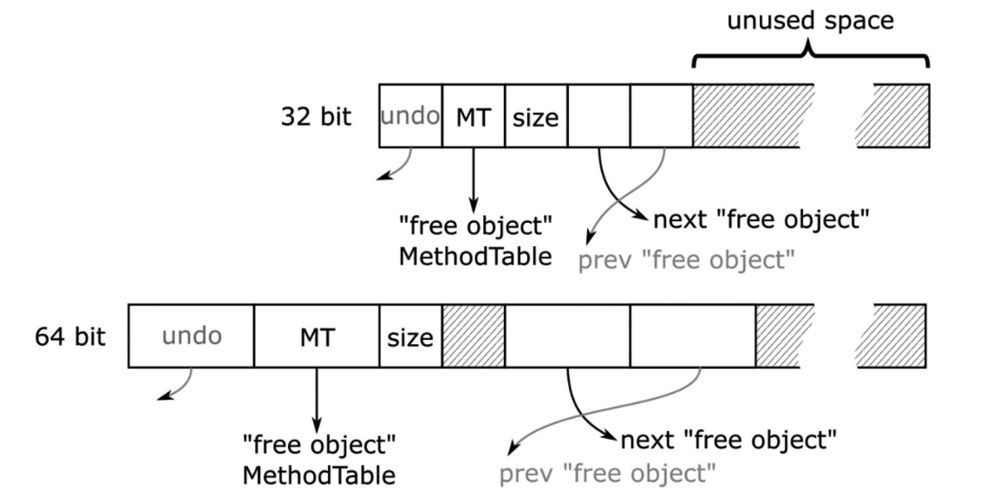图6-9. 表示GC堆上空闲空间的“自由对象”结构。对于某些代，还使用了“撤销”或指向前一个“自由对象”的指针等额外元素。

> 注意：若对与“自由对象”相关的.NET Core代码感兴趣，可从 `gc_heap::make_unused_array` 方法入手，该方法负责准备自由对象。如您所见，它会调用使用静态全局指针 `g_pFreeObjectMethodTable` 作为新方法表的 `SetFree` 方法。随后通过调用 `allocator::thread_item(gap_start, size)` 或 `allocator::thread_item_front(gap_start, size)`方法将间隙添加到空闲列表。此操作仅针对大于最小对象尺寸两倍的间隙执行，这有助于通过忽略小项目来降低列表管理开销。

每个代的分配器维护一个桶列表（见图6-10）。首个桶表示尺寸小于第一个桶大小（编码在 `first_bucket_bits` 字段中）的空闲项目列表。后续每个桶的尺寸翻倍，最后一个桶用于存储无上限的大尺寸项目。每个桶维护对应空闲项目列表的描述信息，特别是其头部。

如图6-10所示，列表本身在GC堆上的“自由对象”之间实现为双链表（第2代情况下）或单链表（其他代）。这使得在列表操作期间能快速遍历，因为至少堆的部分内容已在缓存中。在此维护单独列表并无必要。

双链版本的空闲列表已在.NET 6中引入。它仅用于第2代，因为该设计旨在解决一个特定问题：在此版本之前，所有代的空闲列表在并发清扫阶段（第11章详述）开始时会被重置。但当第2代进行并发清扫时，SOH中可能发生常规分配，从而触发“前台GC”。若该GC收集第1代并执行压缩操作，可能会尝试将晋升对象分配到第2代的间隙中。但由于列表已被清空，GC无法重用空闲空间，直到列表完全重建。这可能导致第2代不必要地增长，因为晋升对象需要被“分配”到某处——即该代末尾。

自.NET 6起，第2代空闲列表在GC开始时不再重置。但如今列表可能变得更大，因此采用更高效的数据结构（如双链表）对其中元素的链接与解链操作更为有利。

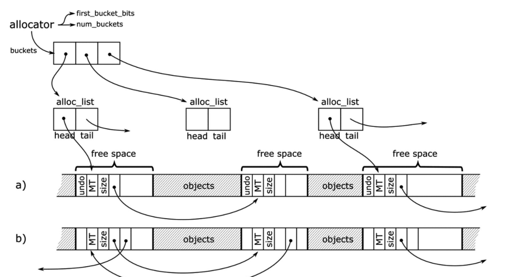图6-10. CLR中基于桶的空闲列表实现：(a)单链版本（用于第0、1代和UOH），(b)双链版本（用于第2代)

> 您可能会惊讶于每个代都有独立分配器，因为此前明确说明对象分配仅发生在SOH的第0代、LOH或POH中。但当GC将存活对象从一代晋升到下一代时，实际上也是在"分配"到下一代。

每代都有独立的桶数量和大小配置，如表6-1所示。可见两个短暂代仅为所有尺寸维护单个桶。第2代配置在32位和64位运行时中存在差异。例如在64位运行时中，GC会为小于256B、512B、1kB、2kB、4kB、8kB的尺寸维护桶，最后一个桶用于大于8kB的项目。

表6-1. 每代的空闲列表桶配置

| 区域         | 首桶尺寸     | 桶数量 |
| ------------ | ------------ | ------ |
| 第0代和第1代 | Int.Max      | 1      |
| 第2代        | 256B（64位） | 12     |
|              | 128B（32位） | 12     |
| LOH          | 64kB         | 7      |
| POH          | 256B         | 19     |

基于分桶空闲列表的分配相当简单（见代码清单6-4）。从首个合适桶开始，尝试在对应空闲列表中寻找匹配的空闲项目。从空闲项目分配所需内存后，可能仍有剩余空闲内存。若该剩余空间大于两个对象的最小尺寸（即64位平台为48字节），则会用剩余部分创建新空闲项目并添加到列表；否则，该小内存区域将被计为不可用碎片。

代码清单6-4. 空闲列表分配的伪代码实现

```c#
PTR Allocator.Allocate(amount)
{ 
	foreach (bucket in buckets) 
	{ 
	  if (amount < bucket.BucketSize) // 跳过项目过小的桶 { foreach (freeItem in bucket.FreeItemList) 		{ 
	    if (size < freeItem.Size) 
	    {  
	        UnlinkItem(freeItem); 
	        ZeroMemory(freeItem.Start, amount); 
	        if (RemainingFreeSpaceBigEnough()) 
	      	    LinkRemainingFreeSpace(freeItem, amount); 
	        return freeItem.Start; 
	     }
	   }
	 }
}
```

> 注意代码清单6-4中的内存清零操作仅适用于用户分配项目（需创建全新状态），但在晋升期间为老代分配时可省略（晋升对象内容将覆盖该空间）。这正是.NET的实现方式。此外，对于第0代和第1代，若空闲项目无法满足所需尺寸则会被丢弃（成为不可用碎片）。这意味着这两代中每个空闲项目仅会被检查一次。这是在维护空闲列表成本与允许碎片化成本之间的又一折衷方案。两个最年轻的代经常被压缩，因此空闲列表会频繁重建。

前文提及的“自由对象”中的 Undo 元素由垃圾回收器在计划阶段使用——具体而言，当决定使用老代中的某个空闲项目进行分配时（即用于存放从年轻代晋升的对象）。若找到合适项目，GC会通过指针操作（类似经典单链表操作）从空闲列表“解链”该空闲项目（见图6-11）：

- 被移除项目的地址存储在前一项目的“undo”字段中（若存在前一项目）；
- 前一项目的“next”指针改为指向被移除项目所指向的下一可用空闲项目。

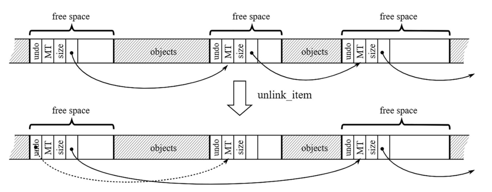图6-11. 单链表情况下的空闲列表项目解链操作。在计划阶段结束时，垃圾回收器可能决定执行清扫式回收而非压缩式回收。采用清扫式回收时，老年代保持原状，因此需要撤销那些计划中的分配操作。通过使用存储在“undo”字段中的空闲项目地址，可恢复原始列表。

> 空闲链表就像一串串联起来的空房子，每个房子（空闲内存块）都知道下一个空房子在哪里：
>
> ```
> [空闲块A] → [空闲块B] → [空闲块C] → ... → null
> ```
>
> 每个空闲块包含：
>
> - 一个“next”指针（指向链表中的下一个空闲块）
> - 一个“undo”字段（这是关键，稍后解释）
> - 块的大小信息
>
> ### 分配过程与“解链”操作
>
> 当GC需要给从年轻代晋升的对象分配空间时，它会从老年代的空闲链表中寻找合适大小的块。找到后，需要从链表中移除这个块（称为“解链”）：
>
> 解链前：
>
> ```
> [块A] → [块B] → [块C] → [块D]
> ```
>
> 假设要移除块C，解链后：
>
> ```
> [块A] → [块B] → [块D]  [块C]（已分离，准备分配给新对象）
> ```
>
> ### “Undo”机制的作用
>
> 这就是“Undo”元素发挥作用的地方！在实际执行解链操作时：
>
> 1. GC会在块B的“undo”字段中**记录被移除块C的地址**
> 2. 然后修改块B的“next”指针，让它指向块D
>
> ```
> 修改后的块B：[next指向D, undo记录了C的地址]
> ```
>
> ### 为什么需要“Undo”机制？
>
> 垃圾回收分为多个阶段，其中“计划阶段”会做出一些临时决策。有时候，GC可能先计划使用压缩式回收（移动对象以消除碎片），但后来决定改用清扫式回收（只标记可用空间，不移动对象）。
>
> 如果发生这种变化：
>
> 1. 老年代应保持原状
> 2. 那些已经从空闲链表中移除准备分配的块需要**放回原位**
>
> 撤销过程：
>
> 1. GC查看块B的“undo”字段，找到被移除的块C
> 2. 重新调整块B的“next”指针指回块C
> 3. 块C的“next”指针仍然指向块D
> 4. 结果：链表恢复原状
>
> ```
> 恢复后：[块A] → [块B] → [块C] → [块D]
> ```
>
> ### 总结
>
> “Undo”机制是.NET垃圾回收器的一个巧妙设计，允许GC在做出最终决策前尝试不同的内存管理策略，同时保留“反悔”的能力。这种灵活性对于平衡内存利用率和GC暂停时间至关重要。

不过您将在第7章中更详细地了解计划阶段、压缩阶段与清扫阶段之间的关联机制。

## 创建新对象

了解了两种基本的内存分配技术后，我们现在可以探讨它们在.NET内存分配中的协同工作机制，包括小对象堆（SOH）、大对象堆（LOH）和固定对象堆的分配原理。

当我们在C#中通过 `new` 运算符创建非数组引用类型对象时（如代码清单6-5所示），该操作会被编译为 CIL 指令 `newobj`（见代码清单6-6）。

代码清单6-5. C#中的对象创建示例

```
 var obj = new SomeClass();
```

代码清单6-6. 公共中间语言中的对象创建示例

```
newobj instance void SomeClass::.ctor()
```

JIT 编译器会根据不同条件为 `newobj` 指令生成对应的函数调用。最常见的情况是使用某种分配辅助函数，其决策逻辑如图6-12所示。这些决策基于JIT编译期间或运行时启动阶段已知的条件。图中可见两种主要选择：

- 若对象超过大对象阈值（将被放入LOH）或具有终结器（详见第12章的特殊方法），则使用通用但稍慢的 `JIT_New` 辅助函数。
- 否则将使用更快的辅助函数——具体版本取决于运行平台和GC模式。

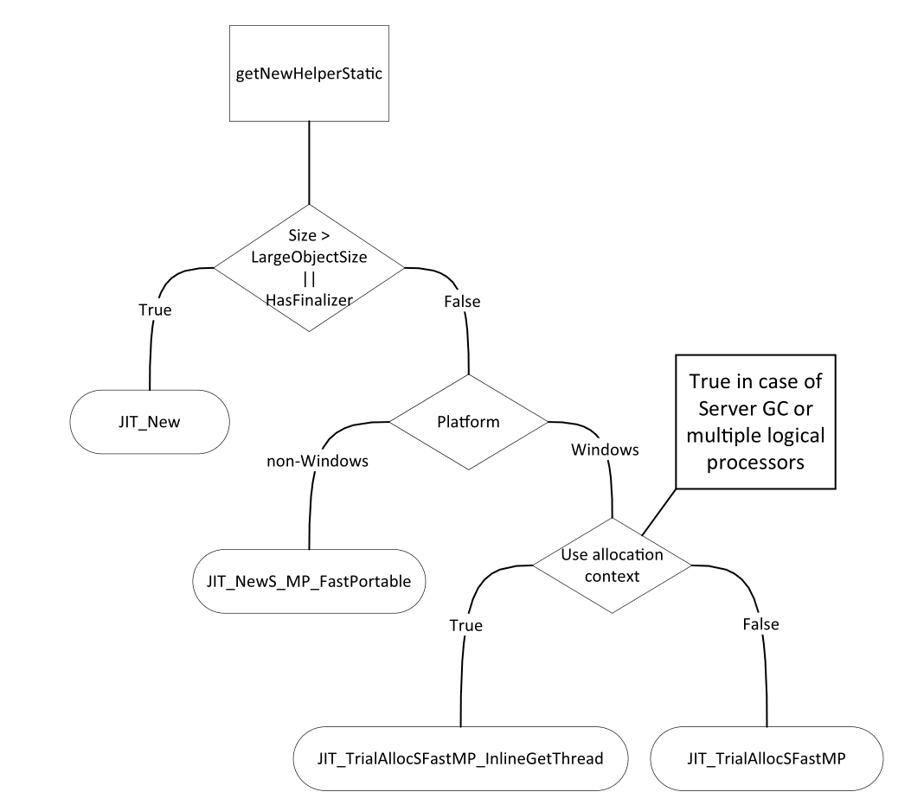

图6-12. JIT编译期间选择分配辅助函数的决策树（函数名称源自.NET Core源码)

需特别注意，该决策树仅在JIT编译阶段使用，最终会生成对应的分配辅助函数调用。因此在程序正常运行时不会产生额外开销，仅需调用预先确定的辅助函数。

> 注：创建数组时会生成CIL指令 `newarr`，该指令存在多个优化版本（例如专为一维对象数组或一维值类型数组设计的版本）。但由于底层分配机制本质上相同，为简洁起见此处不再赘述。

若需深入研究.NET分配机制，可从处理 `CEE_NEWOBJ` 操作码的JIT编译器逻辑入手（参见 `importer.cpp::Compiler::impImportBlockCode` 方法）。该方法会根据创建对象类型（数组、字符串、值类型或引用类型）做出不同处理。对于字符串和数组之外的引用类型，会调用 `CEEInfo::getNewHelper` 来执行图6-12中的部分决策逻辑。较慢的通用辅助函数对应 `CORINFO_HELP_NEWFAST` 常量，而更快的版本对应 `CORINFO_HELP_NEWSFAST`。这些辅助函数的具体实现由运行时启动阶段的 `InitJITHelpers1` 方法决定，这解释了图6-12决策树的剩余部分。

### 小对象堆分配

小对象堆的分配主要基于指针碰撞（bump pointer）技术。核心目标是通过前文所述的分配上下文机制，以指针碰撞方式完成大多数对象分配。仅当该方式失败时才会执行较慢的备用路径（后文详述）。

SOH最快的分配辅助函数仅需数行汇编代码（见代码清单6-7）。根据图6-12的决策树，在Server GC模式下或多逻辑处理器机器上，所有不含终结器的SOH对象都会使用该版本。

> 单处理器机器专用版本名为 `JIT_TrialAllocSFastSP`，包含锁机制以确保全局单一分配上下文的安全访问。

这段高效代码仅通过若干比较和加法指令即可完成（如注释所示）。在理想情况下，“分配”内存只需递增已提交且初始化的分配指针值，这正是“NET中内存分配成本极低”说法的由来。

代码清单6-7. 最高效的分配辅助函数

```assembly
; As input, rcx contains MethodTable pointer
; As result, rax contains the address of the new object
LEAF_ENTRY JIT_TrialAllocSFastMP_InlineGetThread, _TEXT
    ; Read object size into edx
    mov edx, [rcx + OFFSET__MethodTable__m_BaseSize]
    ; m_BaseSize is guaranteed to be a multiple of 8.
    ; Read Thread Local Storage address into r11
    INLINE_GETTHREAD r11
    ; Read alloc_limit into r10
    mov r10, [r11 + OFFSET__Thread__m_alloc_context__alloc_limit]
    ; Read alloct_ptr into rax
    mov rax, [r11 + OFFSET__Thread__m_alloc_context__alloc_ptr]
    add rdx, rax ; rdx = alloc_ptr + size
    cmp rdx, r10 ; is rdx smaller than alloc_limit
    ja AllocFailed
    ; Update alloc_ptr in TLS
    mov [r11 + OFFSET__Thread__m_alloc_context__alloc_ptr], rdx
	; Store the MT under alloc_ptr address (setting up the new object)
    mov [rax], rcx
    ret
AllocFailed:
	jmp JIT_NEW ; fast-path failed, jump to slow-path
LEAF_END JIT_TrialAllocSFastMP_InlineGetThread, _TEXT
```

如果当前分配上下文小于所需大小，最快的基于汇编的分配器会回退到调用更通用的 `JIT_NEW` 辅助函数（该函数也用于带终结器的对象或大对象堆中的分配）。这个通用辅助函数包含慢路径分配代码。正是这种必须放弃快速路径的情况，使得“分配是廉价的”这一说法并不总是成立。慢路径是一个相当复杂的状态机，它试图找到合适的位置来存储所需大小的对象。

慢路径有多复杂？它从 `a_state_start` 状态开始，当之前描述的快速分配失败时触发。该状态无条件转入 `a_state_try_fit` 状态，调用 `gc_heap::soh_try_fit` 方法（见图6-13）。随后整个复杂的流程便开始了！存在多种可能的决策路径，以下是其中最重要的几种：

- 慢路径首先尝试利用**短暂段(ephemeral segment)**中现有的未使用空间（见图6-13描述的 `soh_try_fit` 方法）。具体会：
  - 尝试通过空闲列表找到适合新分配上下文的空闲间隙（回顾图6-4）
  - 尝试在已提交内存中找到足够空间
  - 尝试从保留内存中提交更多内存
- 如果上述方法均失败，则会触发垃圾回收。根据条件不同，可能会多次触发回收。
- 如果所有尝试均失败，分配器将无法分配请求的内存，从而触发 `OutOfMemoryException`。

你可以在.NET的 `gc_heap::allocate_soh` 方法中找到小对象堆慢路径代码。

> 由于小对象堆分配触发GC（最常见情况）在CLR事件数据中通常标记为 `AllocSmall` 原因。

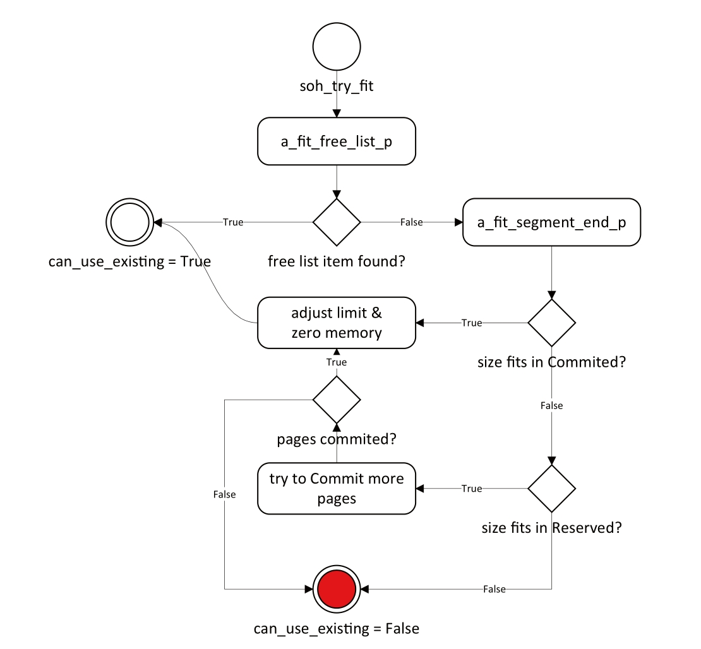图6-13展示了 `soh_try_fit` 方法的决策树

需要重点注意的是，与指针碰撞分配的快速路径相比，慢路径可能变得极其复杂（包括尝试适配空闲列表项甚至触发多次GC）。因此，“分配是廉价的”这一结论仅在特定条件下成立。开发者应当理解分配的真实成本，通过限制不必要的对象分配、避免盲目使用高分配量的库来优化性能。即使不触发GC，慢路径本身也可能代价高昂。在性能关键代码中，最佳实践是彻底避免分配（这也引出了性能优化第14条准则——避免分配）。

还需注意，带终结器的对象会使用更通用的分配辅助函数，且终结机制会带来额外开销（第12章详述）。这使得第25条准则——避免使用终结器显得尤为重要。

### 大对象堆与固定对象堆分配

令人惊讶的是，CLR在大对象堆（LOH）和固定对象堆（POH）的分配上共享了大量代码。主要区别在于：显然POH中的对象不可移动（无法执行压缩）。查看.NET源代码时，你会发现许多函数和变量名包含“uoh”（User Old Heap的缩写），这个名称源于LOH和POH中的对象都由用户代码分配，并被标识为老年代（gen 2）的一部分。描述分配位置的 `GC_ALLOC_FLAGS` 标志定义了三个常量，它们直观展现了LOH与POH的相似性：

```
GC_ALLOC_LARGE_OBJECT_HEAP =32,
GC_ALLOC_PINNED_OBJECT_HEAP =64,
GC_ALLOC_USER_OLD_HEAP = GC_ALLOC_LARGE_OBJECT_HEAP | GC_ALLOC_PINNED_OBJECT_HEAP,
```

分配过程中的主要差异是：LOH中的对象必须对齐内存边界，而POH不需要。此外，即使分配超过LOH阈值大小的固定数组，仍会置于POH而非LOH。其余代码逻辑则完全一致。

在用户旧堆（UOH）中分配时，第一步是查找空闲列表中是否有足够空间。若未找到，则使用段末尾空间的简化指针碰撞技术。虽然分配上下文会在函数间传递，但其仅用于跟踪对象分配地址。UOH分配没有快速路径，因此不采用基于分配上下文的优化——对于LOH而言，85,000字节的最小尺寸远大于典型分配上下文大小，清零如此大块内存的开销会使分配上下文优化的收益微乎其微；对于POH分配，虽然固定缓冲区通常也较大（且共享代码库的维护价值），使得分配上下文优化同样不具吸引力。

因此，UOH分配器始终采用与SOH慢路径相似的统一路径：

- 首先尝试利用现有未使用空间（见图6-14描述的 `uoh_try_fit`方法）

  - 在每个包含LOH或POH的段中，尝试在空闲列表中找到适合对象的空闲间隙

  - 尝试在已提交内存中寻找足够空间

  - 尝试从保留内存提交更多内存

- 若上述方法均失败，则触发垃圾回收（可能多次）

- 最终若仍失败，将引发 `OutOfMemoryException`

> UOH分配逻辑实现在.NET的 `gc_heap::allocate_uoh`方法中，其流程如图6-14所示。

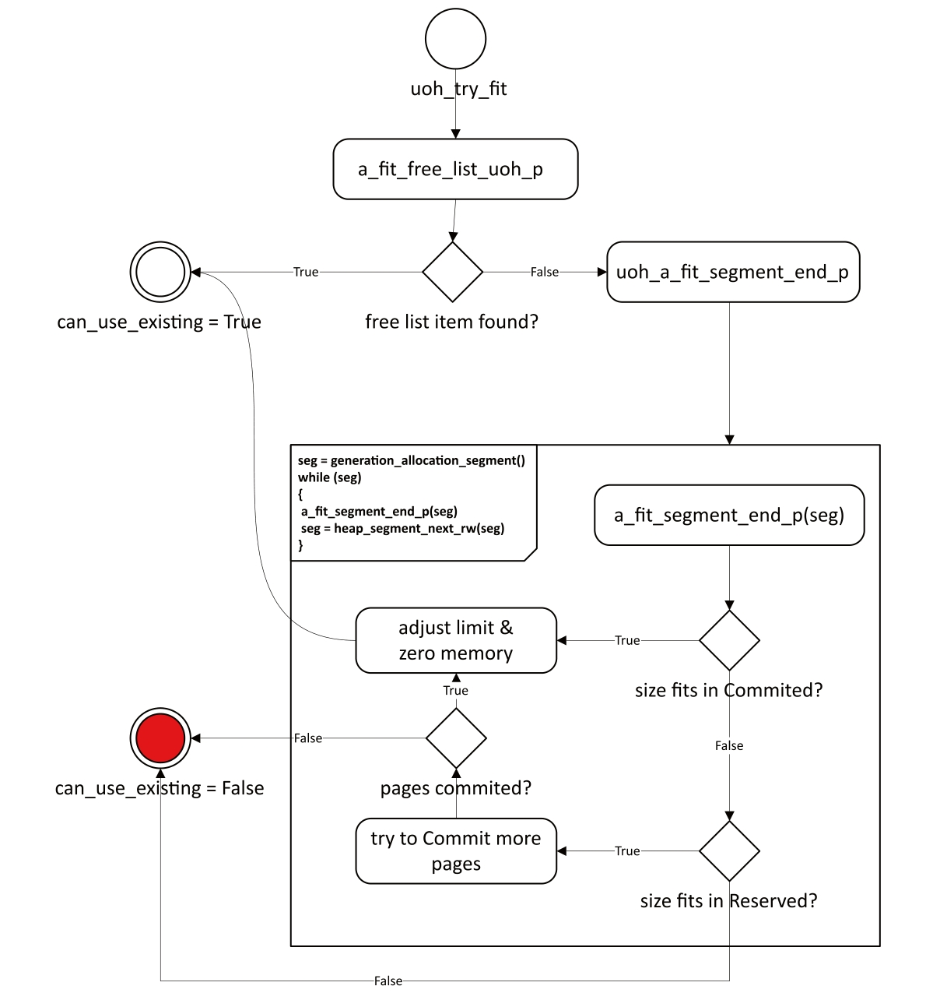

如你所见，用户旧堆（UOH）的状态机比小对象堆（SOH）更为复杂。但需特别注意：尽管UOH不使用分配上下文，分配器仍需确保对象创建后的初始状态清零，这意味着必须对内存进行归零操作。对于大型对象而言，内存清零的代价可能非常显著——结合第4章所述的内存访问延迟（表4-2），清零一个数MB大小的对象可能需要数十毫秒，这对应用程序而言可能是相当长的时间。

因此必须牢记：UOH中的对象分配成本远高于SOH，这引出了第15条准则——避免过度UOH分配。**创建可复用对象池是解决该问题最简单的方案。**

> 注意 .NET垃圾回收器持续改进，运行时新版本常引入重要优化。例如自.NET 4.5（及.NET Core 1.0）起，LOH分配器通过前文所述的分桶策略显著提升了空闲列表利用率。

一个有趣的问题是：.NET中可创建的最大对象尺寸是多少？自.NET诞生起，该限制始终是 `2GB`。虽然实践中很少创建如此巨大的对象，但某些场景可能需要更大的数组。在.NET 4.5之前无法突破此限制，而4.5版本新增的 `gcAllowVeryLargeObjects` 配置项（见代码清单6-8）允许创建接近64位有符号长整型上限（减去微小偏移量）的对象。虽然该设置支持创建超过 `2GB` 的数组，但其他对象尺寸限制仍保持不变：

- 数组元素数量上限仍为 `UInt32.MaxValue`（2,147,483,591）
- 单维数组最大索引：字节数组及单字节结构数组为 2,147,483,591（0x7FFFFFC7），其他类型为 2,146,435,071（0X7FEFFFFF）

- 字符串等非数组对象的最大尺寸不变

代码清单6-8 启用 `gcAllowVeryLargeObjects` 的配置（默认禁用）

```
<configuration>
	<runtime>
		<gcAllowVeryLargeObjects enabled="true" />
	</runtime>
</configuration>
```

如此巨大的对象将分配至何处？毫无疑问会被分配至LOH段——因其远超大型对象阈值。运行时很可能为此创建全新段，因为现有段几乎不可能容纳如此庞大的对象。请注意：由于内存访问延迟，分配此类巨型对象可能需要数秒时间！

> 如第4、5章所述，字符串字面量和运行时类型分配在NGHC（非GC堆）中。第15章将详述未公开API及其在此处分配对象的危险性。若需探查冻结对象的分配位置，可追踪 `SystemDomain::GetFrozenObjectHeapManager` 调用路径，最终会定位到运行时类型和静态装箱实例的分配点。

## 堆平衡机制

如前所述，服务器模式下的GC管理多个堆——每个逻辑处理器对应一个托管堆。多托管堆意味着存在多个短暂段和多个大对象堆段，同时应用程序中存在多个托管线程。这两者如何关联？线程如何与堆绑定？

这需要先解答另一个问题：堆如何与逻辑处理器绑定？理解该机制需结合第4章CPU与内存协作的知识。CLR致力于让托管堆尽可能“靠近”特定逻辑CPU核心（从访问时序角度），并避免同步开销，因此做出以下设计决策：

- 当操作系统支持获取当前线程执行核心信息时（Windows及多数Linux/macOS版本均支持），每个逻辑CPU固定绑定一个托管堆且永不更改。该设计通过提升局部性最大化CPU缓存效率，避免缓存一致性协议开销
- 若操作系统不支持核心信息，则执行微基准测试来经验性确定特定核心访问速度最快的堆
- 若机器采用 `NUMA` 架构（第2章提及），堆绑定将限制在单个 `NUMA` 组内

> 若对微基准测试实现感兴趣，可从 `heap_select::access_time` 静态函数开始研究

当托管线程开始分配内存时，会被绑定到其当前执行处理器对应的堆。图6-15展示了GC托管堆、线程与逻辑核心的典型关系：运行于两个逻辑处理器的线程，正在消耗采用“all-at-once”策略构建的托管内存（见前章）。第一个CPU绑定 SOH₁ 和 LOH₁ 段，第二个CPU绑定 SOH₂ 和 LOH₂ 段（段间完全隔离）。注意处理器虽然操作进程地址空间中的特定内存区域（通过段概念隔离），但内存中并不存在操作系统或硬件层面的魔法隔离机制。不过这种隔离设计能有效利用缓存，因为每个CPU频繁且独占地操作这些段。

运行在 CPU#1 的线程（标记为 T₁ 和 T₂）其分配上下文位于 SOH₁ 内，而第二个CPU上的线程（示例中为 T₃）则使用第二个堆，以此类推。由于LOH不使用分配上下文，图中未作体现。

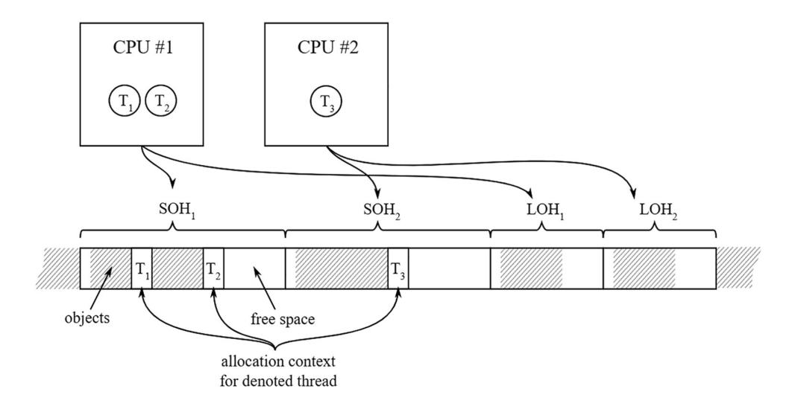

图6-15展示了逻辑处理器、线程与GC托管堆的绑定关系示意图

当线程创建时，由操作系统决定其执行的逻辑处理器。这在所有托管线程内存分配量相近时运行良好，但某些情况下可能出现部分线程分配量显著高于其他线程的现象，这将导致如图6-16所示的堆不平衡状态：线程3和4的内存分配量远超线程1和2（导致 SOH₂ 剩余空间急剧减少）。这种状态会引发三个主要问题：

- SOH₂ 将很快面临内存不足，触发GC并最终需要创建新SOH段
- CPU缓存利用率失衡
- 负责回收SOH₁的线程将承担更多工作

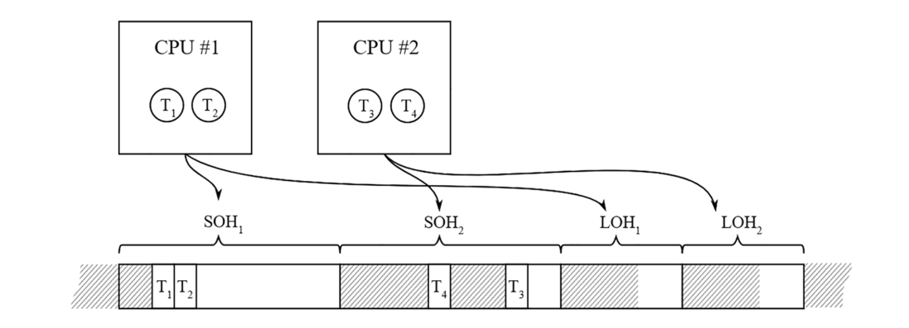

图6-16 多线程分配不均导致的堆不平衡状态

GC在通过慢路径分配时会执行堆平衡检查。若检测到不平衡，将为高分配线程重新分配堆——即将其分配上下文迁移至其他堆。这显然会违反前文所述的设计原则（线程在某个逻辑核心上执行却使用其他核心绑定的堆），因此GC会立即要求操作系统将该线程迁移至对应逻辑CPU执行。目前该行为仅通过Windows的 `SetThreadIdealProcessorEx` 函数实现（其他操作系统可能缺乏等效API）。堆平衡后的状态如图6-17所示。

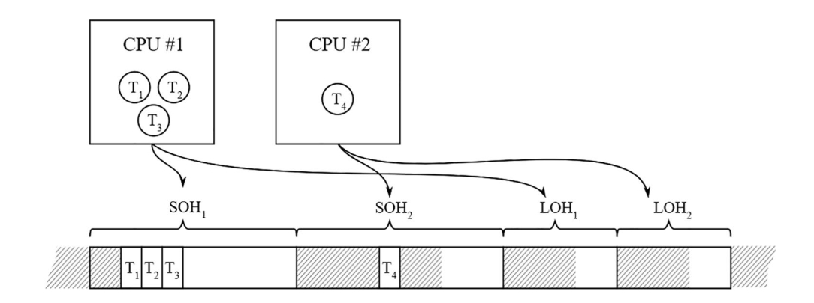

图6-17 图6-15场景的堆平衡结果

自.NET 4.5起，LOH堆也实现了平衡机制，这显著提升了分配性能。由于LOH平衡技术与SOH相同，此处不再赘述。

#### 固定对象堆(POH)分配API

自.NET 5起，只有数组能被分配到固定对象堆(Pinned Object Heap)。唯一的方式是使用GC类中的两个方法——`AllocateArray` 或 `AllocateUninitializedArray`，并将其 `pinned` 参数设为true。这些固定数组的元素类型只能是纯值类型（不包含任何引用类型字段），包括布尔值、数值以及仅包含值类型字段的结构体。若尝试分配不符合要求的类型数组，代码虽能编译通过，但运行时会抛出 `ArgumentException`。该限制在.NET 8中被移除。

## 内存不足异常(OutOfMemoryException)

从分配器的决策树可见，有时确实无法分配所需内存。这种情况常被误解，让我们深入剖析细节。

首先，何时会抛出 `OutOfMemoryException`？这是前文所述分配路径的最后选择，意味着：

- 垃圾回收器在分配期间已被触发（可能多次，包括完全压缩式GC），因此SOH碎片化不应是主因。除非问题极其特殊且波动，否则再次触发GC几乎无济于事。内存不足异常绝非因.NET运行时忘记回收内存所致。不过，若LOH分配时出现该异常，可考虑显式触发LOH压缩（见第7章）并再次执行GC。

- 分配器无法准备指定大小的内存区域，原因有二：
  - 虚拟内存耗尽：分配器无法保留足够大的内存区域（如创建新段）。主要由虚拟内存碎片化导致，32位运行时尤甚。碎片化会导致内存使用效率低下，因此即使系统显示有充足空闲RAM，仍可能抛出异常。切记表2-5所示的严格虚拟地址空间限制——32位运行时在64位系统上仅能支配2-3GB虚拟地址空间，即便物理内存充足。
  - 物理后备存储耗尽（包括RAM和页面/交换文件）：分配器无法提交更多内存（如扩展现有段）。需注意操作系统统筹管理所有进程内存，当系统整体内存使用（含磁盘交换）接近极限时，即使显示有空闲RAM，系统仍会拒绝运行时提交内存的请求。

由此可得两个重要结论：

- 手动触发GC通常无法缓解内存不足异常（除非在分配大对象时显式触发LOH压缩）
- 出现内存不足异常时系统显示有空闲RAM属正常现象

若遭遇内存不足异常，除修复内存泄漏外，可采取以下优化措施：

- **减少对象分配**：分析内存使用，消除不必要分配（本章后续将揭示许多隐藏的分配来源）
- **使用对象池**：通过对象复用降低碎片化，现有池方案可直接使用或自行实现
- **启用VM保留模式**：如第5章所述（对32位运行时尤为重要）
- **编译为64位**：简单有效的解决方案，通常能大幅扩展虚拟地址空间

### 场景6-1：内存不足异常

**问题描述**：某.NET生产环境进程间歇性崩溃并抛出`OutOfMemoryException`，其他环境无法复现。由于问题发生频率极低，难以附加监控工具，且无法预测下次异常发生时间，导致无法捕获完整内存转储进行分析。

**分析方案**：好消息是，Windows平台（.NET Framework和.NET Core）可配置在 `OutOfMemoryException` 发生时自动捕获完整内存转储！具体步骤如下：

1. **安装ProcDump监控工具**
   - 通过命令`procdump -i <转储文件存储目录> -ma`全局安装（如图6-18所示）
   - 调查完成后务必用 `procdump -u` 卸载，否则机器上所有崩溃进程都会生成转储文件，可能导致磁盘空间耗尽

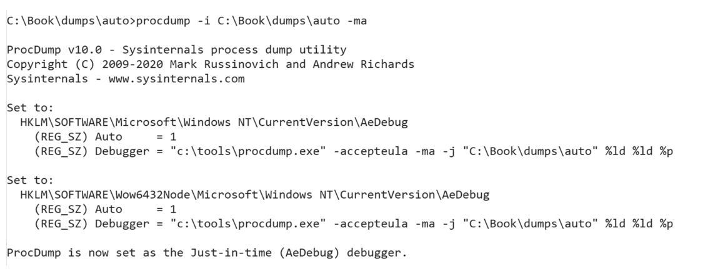

图 6-18. 在系统范围内安装 `procdump`工具可在发生 `OutOfMemoryException` 时自动生成内存转储文件

- 进程现已被监控，发生`OutOfMemoryException`时将自动生成完整转储
- 用 WinDbg 打开转储文件，执行`!analyze -v`命令（见代码清单6-9），可获取异常详细信息

代码清单6-9：WinDbg分析内存转储——内存不足异常信息

```plaintext
> !analyze -v
***********************************************************************
*                                                                     *
*                        Exception Analysis                           *
*                                                                     *
***********************************************************************
...
STACK_TEXT: 
02b7ee0c 273b25dd TestOOM!TestOOM.Program.TestOOM+0x3d  
02b7ee1c 273b1992 TestOOM!TestOOM.Program.Main+0x82
...
FAULTING_SOURCE_LINE: C:\Book\code\TestOOM\Program.cs  
FAULTING_SOURCE_FILE: C:\Book\code\TestOOM\Program.cs  
FAULTING_SOURCE_LINE_NUMBER: 89  
FAULTING_SOURCE_CODE:  
86: List<byte[]> bytes = new List<byte[]>();  
87: while (true)  
88: {  
> 89:     bytes.Add(new byte[1024 * 1024 * 1024]);  
90: }  
91: }
```

如代码清单6-9所示：`STACK_TEXT` 段显示触发异常的线程调用栈。若编译时包含符号文件（PDB），`FAULTING_SOURCE_CODE` 段会直接定位到引发异常的源代码行（本例为第89行的大数组分配）

对于 .NET Framework，你可以使用 `!analyzeoom` 命令可获取 GC 相关的 OOM 信息（代码清单6-10）。注意：该SOS命令暂不支持.NET Core。

代码清单6-10：WinDbg中analyzeoom命令显示的GC相关OOM信息

```plaintext
0:000> !analyzeoom  
Managed OOM occured after GC #2 (Requested to allocate 0 bytes)  
Reason: Didn't have enough memory to allocate an LOH segment  
Detail: LOH: Failed to reserve memory (1090519040 bytes)
```

您可以继续采用本书提到的其他基于内存转储的分析方法，包括检查内存段（segments）和堆（heaps）状态。需要特别注意的是：触发内存不足异常的代码可能并非问题的直接根源——它可能只是恰好在分配器无法为新对象找到合适内存空间时执行的线程。实际的内存瓶颈可能隐藏在别处。因此，建议重点分析转储文件中以下内容：

- 数量最多的对象类型
- 体积最大的对象实例
- 对象在各代堆中的分布情况

> 注意：在抛出内存不足异常前，CLR需要先分配异常对象实例。但在内存耗尽的情况下，运行时采用了巧妙的机制：系统启动时会预分配 `OutOfMemoryException` 实例（通过 `SystemDomain::CreatePreallocatedExceptions` 函数），当无法新建异常对象时直接复用该预分配实例。该机制同样适用于 `StackOverflowException` 和 `ExecutionEngineException` （具体实现可参考  `GetBestOutOfMemoryException`函数代码）。

## 栈分配

到目前为止，我们只讨论了在GC托管堆上分配对象的情况。这是最流行和最常用的方式。你已经看到我们付出了多大努力来使堆分配尽可能快。然而，正如前面章节所述，栈上的分配和释放默认就快得多——只需要移动栈指针，而且不会给GC带来任何开销。

如前所述，值类型在某些情况下可能会被分配在栈上。在特定条件下，你也可以显式要求进行栈分配。考虑到规则14——在热点路径上避免堆分配，这将是个非常有用的选项。

要在C#中显式进行栈分配，需要使用 `stackalloc` 运算符（见代码清单6-11）。它会返回一个指向栈上内存区域的指针。由于使用了指针类型，这类代码必须放在 `unsafe` 上下文中（除非像后文所示使用 `Span<T>` 类型）。新分配的内存内容未定义，因此不应做任何假设（比如认为内存会被清零）。

代码清单6-11 使用stackalloc显式栈分配

```c#
static unsafe void Test(int t)
{ 
	SomeStruct* array = stackalloc SomeStruct[20];
}
```

`stackalloc` 在C#领域非常罕见。主要因为许多开发者要么不了解这个特性，要么由于缺乏接受指针的API而未能完全掌握其用法。随着第14章将介绍的 `Span<T>` 类型的出现，这一现状已有所改变。例如当需要极高数据处理效率且不希望在大堆上分配大型数组时，就可以使用它。这种方案有两个优势：

- 如前所述，这类对象的释放只需移动栈指针——没有堆分配辅助机制，没有慢速路径，完全不涉及GC。
- 这类对象的地址隐式固定（不会移动），因为栈帧永远不会移动——你可以将指针传递给非托管代码而无需引入固定开销（但需确保非托管代码不会在函数返回后继续使用该对象）。

`stackalloc` 运算符会被编译为CIL的 `localloc` 指令（见代码清单6-12）。ECMA标准对其的描述是（部分省略）“从本地动态内存池分配size字节。当前方法返回时，本地内存池可被重用”。注意它没有明确提及栈，而是使用更通用的“本地内存池”概念（第4章已提及）。如第4章所述，ECMA标准力求技术中立，避免使用栈或堆这类具体概念。

代码清单6-12 代码清单6-11生成的CIL代码片段，展示 `stackalloc` 如何被转换为 `localloc` 指令

```
ldc.i4.s 20
conv.u
sizeof SomeStruct
mul.ovf.un
localloc
```

但通过这种方式能在栈上分配什么？ECMA标准对 `localloc` 指令没有具体说明，只承诺会分配指定字节数。由于CIL只保证内存块，CLR目前只能将其用作简单数据类型的容器。C#语言规范对 `stackalloc`运算符的定义详细描述了这些限制：只能用于“非托管类型(`unmanaged_type`)”数组。非托管类型包括：

- 基本类型：`sbyte, byte, short, ushort, int, uint, long, ulong, char, float, double, decimal` 或 `bool`
- 任何枚举类型
- 任何指针类型
- 任何用户定义的结构体（非构造类型且仅包含非托管类型字段）

需注意无法显式释放 `stackalloc` 分配的内存。方法结束时内存会被隐式释放。当密集使用栈时需特别注意，大量长时间运行的方法可能最终导致 `StackOverflowException`。

> `localloc` 指令会被JIT编译为一系列汇编 `push` 和 `sub rsp [size]` 指令来扩展栈帧。在32位和64位框架下，扩展大小会分别按8字节和16字节对齐。因此即使 `stackalloc` 两个整数的数组（通常占8字节），栈帧也会被扩展16字节（64位下）。因为在x64架构上，栈需要16字节对齐。更多细节可参考https://github.com/MicrosoftDocs/cpp-docs/blob/main/docs/build/stack-usage.md文档。

与代码清单6-11不同，使用 `stackalloc` 时不必强制使用 `unsafe` 代码。自C#7.2和.NET Core 2.1起，可以通过 `Span<T>` 类型（第15章详解）安全地编写代码，如代码清单6-13所示。

代码清单6-13 借助 `Span<T>` 支持，在安全代码中使用 `stackalloc` 进行显式栈分配

```c#
 static void Test(int t)
 { 
   Span<SomeStruct> array = stackalloc SomeStruct[20];
 }
```

## 避免内存分配

前文已详细探讨了内存分配及其底层机制。现在你应该充分认识到，在.NET中“内存分配很廉价”的说法有时成立（得益于分配上下文中的指针碰撞技术），但实际情况要复杂得多：

- 当走快速路径时，内存分配确实廉价。但分配上下文有时会不可预测地耗尽，此时必须切换上下文，触发更复杂（因而更慢）的分配路径

- 这些复杂分配路径会不时触发垃圾回收

- 大对象堆(LOH)上的大对象分配较慢，主要因为内存清零的成本

  > **内存清零**是指在分配新对象时，将分配给该对象的内存区域中的每个字节都设置为0的过程。在底层，这通常通过类似于`memset()`这样的函数实现，或使用专门的CPU指令（如Intel的 `REP STOSB`或AVX指令集中的向量操作）来填充内存。
  >
  > .NET必须清零内存的原因有三个：
  >
  > 1. **安全性**：防止新对象能够访问到之前对象留下的可能敏感的数据
  > 2. **语言规范需求**：C#规范要求所有字段必须有确定的初始值（引用类型为`null`，数值类型为`0`等）
  > 3. **简化开发**：开发人员可以假设对象字段已初始化为默认值
  >
  > 大对象堆(LOH)上的清零操作特别昂贵：
  >
  > 1. 内存体积因素
  >
  >    - 大对象堆用于存储大于85KB的对象（在标准.NET配置中）
  >
  >    - 清零时间与内存大小成正比，清零1MB内存比清零1KB内存大约需要1000倍时间
  >
  > 2. 硬件架构限制
  >
  >    - **内存带宽瓶颈**：清零大量连续内存受限于系统内存总线带宽
  >
  >    - **CPU缓存影响**：大对象远超L1/L2/L3缓存大小，导致大量缓存未命中
  >
  >    - **内存页面处理**：大对象可能跨越多个物理内存页面，增加TLB（转译后备缓冲器）未命中
  >
  > 3. 没有分配上下文优化
  >
  >    - 小对象堆(SOH)通常可以利用线程本地分配缓冲区(TLAB)和预先清零的内存块
  >
  >    - 大对象堆由于对象尺寸，无法有效利用这些优化
  >
  > 4. 处理器执行特性
  >
  >    - 清零大内存块时，CPU流水线可能会受到影响
  >
  >    - 分支预测和指令级并行性在重复的内存操作中效率降低
  >
  >    - NUMA架构下，跨节点的大内存分配会进一步降低性能
  >
  > 举个例子：假设分配一个大小为100MB的数组：
  >
  > - 系统必须清零约104,857,600个字节
  > - 在3GB/s的内存写入带宽下，理论上最快需要约35毫秒
  > - 实际上，考虑到其他开销，可能需要50-100毫秒
  > - 相比之下，分配一个小对象可能只需几十纳秒

- 大量分配对象会增加GC的工作量——这个显而易见的道理却至关重要。若分配大量临时对象，后续必须清理。创建的对象越多，打破对象生命周期分代假设的概率就越高

因此，.NET中最有效的内存优化方法之一就是避免分配，或至少保持分配意识。少量分配意味着：

- 给GC的内存压力小
- 内存访问成本低
- 与操作系统的交互少

性能敏感的.NET开发者需要掌握的核心知识是：了解内存分配的来源，以及如何消除或最小化它们。

本节列举常见分配来源及应对方案。但请注意一个重要原则——必须谨慎对待最小化分配这件事。有句常被滥用的名言：“过早优化是万恶之源”。确实没必要逐行分析代码中的每个分配点，这只会降低效率却收效甚微。每分钟执行一次的代码分配200字节还是800字节有区别吗？很可能没有。关键取决于代码需求。因此，从性能关键路径开始分析分配总是明智的，这些优化能带来最大收益。

首先需要了解常见分配来源以避免明显错误，至少清楚所写代码的内存开销。结合应用整体需求和具体场景，就能判断是否可接受。其次，掌握分配来源知识有助于应用规则5——尽早测量GC。只有通过测量才能避免对错误代码的过早优化，才能判断是否需要最小化分配，才能确定优化重点。

下文列出常见分配来源（有些显而易见，有些则不然），包括其发生条件及规避方法。

> 本章后续展示C#编译器机制时，使用 dnSpy 工具反编译代码有助于理解底层原理。建议读者通过修改代码、反编译观察运行时最终执行的代码变化来加深理解。

### 引用类型的显式分配

大多数分配场景显而易见——显式创建对象时。此时可以考虑是否真的需要创建堆上的引用类型对象。以下是不同场景的解决方案。

#### 通用场景——考虑使用结构体

开发者可能习惯使用类而忽略替代方案。实际上多数场景下，可以通过结构体在方法参数和返回值间传递少量数据。第4章代码清单4-7展示了这种情况，清单4-8和4-9则显示相比在堆上创建小对象，使用结构体生成的代码更优。表4-1的基准测试显示两者性能差异显著。

因此，当方法间传递的少量数据不存储在堆数据结构中时，应优先考虑结构体。许多业务逻辑都符合这个特点——获取数据、本地处理、返回结果。以代码清单6-14为例，该代码返回指定位置半径内所有雇员的完整姓名，展示了从外部服务获取集合的典型用法，但这种方式显式创建了大量对象：

- `PersonDataClass` 对象列表及对象本身
- 外部服务返回的 `Employee` 对象

```c#
[Benchmark]
public List PeopleEmployeedWithinLocation_Classes(int amount, LocationClass location)
{
    List result = new List();
    List input = service.GetPersonsInBatchClasses(amount);
    DateTime now = DateTime.Now;
    for (int i = 0; i < input.Count; ++i)
    {
        PersonDataClass item = input[i];
        if (now.Subtract(item.BirthDate).TotalDays > 18 * 365)
        {
            var employee = service.GetEmployeeClass(item.EmployeeId);
            if (locationService.DistanceWithClass(location, employee.Address) < 10.0)
            {
                string name = string.Format("{0} {1}", item.Firstname, item.Lastname);
                result.Add(name);
            }
        }
    }
    return result;
}

internal List GetPersonsInBatchClasses(int amount)
{
    List result = new List(amount);
    // 从外部源填充列表
    return result;
}
```

若改用结构体实现（见代码清单6-15），由于人员数据仅在方法内使用，可安全存储在栈上。`GetPersonsInBatch` 方法返回结构体数组能提高数据局部性、降低开销（如第4章所述）。外部服务如 `GetEmployeeStruct` 可返回小结构体，`DistanceWithStruct` 等方法可通过引用传递值类型参数避免复制。

代码清单6-15 尽可能使用结构体的业务逻辑示例

```c#
[Benchmark]
public List PeopleEmployeedWithinLocation_Structs(int amount, LocationStruct location)
{
    List result = new List();
    PersonDataStruct[] input = service.GetPersonsInBatchStructs(amount);
    DateTime now = DateTime.Now;
    for (int i = 0; i < input.Length; ++i)
    {
        ref PersonDataStruct item = ref input[i];
        if (now.Subtract(item.BirthDate).TotalDays > 18 * 365)
        {
            var employee = service.GetEmployeeStruct(item.EmployeeId);
            if (locationService.DistanceWithStruct(ref location, employee.Address) < 10.0)
            {
                string name = string.Format("{0} {1}", item.Firstname, item.Lastname);
                result.Add(name);
            }
        }
    }
    return result;
}

internal PersonDataStruct[] GetPersonsInBatchStructs(int amount)
{
    PersonDataStruct[] result = new PersonDataStruct[amount];
    // 从外部源填充数组
    return result;
}
```

相比清单6-14，清单6-15代码因引用传递略显复杂，但仍保持可读性。实测内存分配量减半（见表6-2），高频调用时差异显著。

表6-2 处理1000个对象/结构体时的基准测试结果

| 方法                                  | 平均耗时  | Gen 0回收 | 内存分配 |
| ------------------------------------- | --------- | --------- | -------- |
| PeopleEmployeedWithinLocation_Classes | 348.8微秒 | 15.1367次 | 62.60 KB |
| PeopleEmployeedWithinLocation_Structs | 344.7微秒 | 9.2773次  | 39.13 KB |

> 注意：`record`（底层是类）与 `record struct`（底层是结构体）具有相同的性能特性。虽然 `record struct` 在`GetHashCode` 和相等比较实现上有优势，但从内存管理角度看与普通结构体无异。

#### 元组——使用ValueTuple替代

通常需要返回或传递一个非常简单的数据结构，该结构只有几个字段。如果该类型仅使用一次，可能会倾向于使用元组或匿名类型，而不是定义一个类（见代码清单6-16）。然而，需要理解的是，`Tuple` 和匿名类型都是引用类型，因此总是在堆上分配内存。

代码清单6-16. 为仅使用一次的数据创建的元组和匿名类型

```csharp
var tuple1 = new Tuple<int, double>(0, 0.0);  
var tuple2 = Tuple.Create(0, 0.0);  
var tuple3 = new { A = 1, B = 0.0 };  
```

根据前文所述，在这种情况下应考虑使用用户定义的结构体。然而，自C# 7.0起，引入了一种新的值类型——值元组（`ValueTuple`），由 `ValueTuple` 结构体表示（见代码清单6-17）。这可以很好地替代之前使用的类，在某些场景下无需创建自定义结构体。

代码清单6-17. C# 7.0中引入的值元组

```csharp
var tuple4 = (0, 0.0);  
var tuple5 = (A: 0, B: 0.0);  
tuple5.A = 3;  
```

典型用例包括从方法返回多个值。相比于使用 `Tuple`（或自定义类）来包含所有结果（如代码清单6-18中的 `ProcessData1` 方法），可以使用值元组结构体，其中仅包含其他结构体（如代码清单6-18中的 `ProcessData2` 方法）。

代码清单6-18. 值元组与元组用于从方法返回多个值的对比

```csharp
public static Tuple<ResultDesc, ResultData> ProcessData1(IEnumerable<SomeClass> data)  
{  
    // 进行一些处理  
    return new Tuple<ResultDesc, ResultData>(new ResultDesc() { ... }, new ResultData() { ... });  
    // 或使用：  
    // return Tuple.Create(new ResultDesc() { ... }, new ResultData() { Average = 0.0, Sum = 10.0 });  
}  

public static (ResultDescStruct, ResultDataStruct) ProcessData2(IEnumerable<SomeClass> data)  
{  
    // 进行一些处理  
    return (new ResultDescStruct() { ... }, new ResultDataStruct() { ... });  
}  

public class ResultDesc  
{  
    public int Count;  
}  

public class ResultData  
{  
    public double Sum;  
    public double Average;  
}  

public struct ResultDescStruct  
{  
    public int Count;  
}  

public struct ResultDataStruct  
{  
    public double Sum;  
    public double Average;  
}  
```

这可以显著减少从方法返回多个值时的开销（见表6-3）。由于使用了结构体，`ProcessData2` 运行时无需任何内存分配！整个函数的性能提升了四倍以上。

表6-3. 代码清单6-18的DotNetBenchmark结果

| 方法         | 平均时间  | 内存分配 |
| ------------ | --------- | -------- |
| ProcessData1 | 18.380 ns | 88 B     |
| ProcessData2 | 4.472 ns  | 0 B      |

值元组还引入了一个称为解构（deconstruction）的特性，允许从元组中提取值并直接分配给单独的变量。还可以使用丢弃符（discards）明确表示对元组中的某些元素不感兴趣（见代码清单6-19）。这在某些场景中非常有用，因为编译器和JIT可以利用这些信息进一步优化底层结构的使用。

代码清单6-19. 使用丢弃符解构元组

```csharp
(ResultDescStruct desc, _) = ProcessData2(list);  
```

> ORM中计划并可能即将推出更改，以允许将数据库查询结果具体化为值元组和结构体。这将使它们的使用更加实用。请关注您使用的ORM或自行投票支持此类更改！

#### 小型临时本地数据——考虑使用 stackalloc

前文已经展示了使用结构体替代对象可以为本地临时数据带来显著的好处。相比于创建对象列表，可以使用结构体数组。然而，需要注意的是，结构体数组仍然在堆上分配——唯一的好处是数据更紧凑。但可以通过使用 `stackalloc` 进一步消除堆分配。

假设有一个简单的方法，接收一个对象列表，将其转换为临时列表，并处理该列表以计算某些统计数据。典型的基于 LINQ 的方法如代码清单6-20所示，但希望您可以将其推广到更复杂的情况。这种方法会分配大量内存——包含许多临时对象的列表。

代码清单6-20. 完全基于类的简单列表处理示例

```csharp
public double ProcessEnumerable(List<BigData> list)  
{  
    double avg = ProcessData1(list.Select(x => new DataClass() { Age = x.Age, Sex = Helper(x.Description) ? Sex.Female : Sex.Male }));  
    _logger.Debug("Result: {0}", avg / _items);  
    return avg;  
}  

public double ProcessData1(IEnumerable<DataClass> list)  
{  
    // 对列表项进行一些处理  
    return result;  
}  

public class BigData  
{  
    public string Description;  
    public double Age;  
}  
```

可以像前面的示例一样使用结构体数组。但这里我们使用 `stackalloc` 和 `Span<T>`（不安全代码）（见代码清单6-21）。

代码清单6-21. 完全基于结构体和 `stackalloc` 的简单列表处理示例

```csharp
public double ProcessStackalloc(List<BigData> list)  
{  
    // 危险但无需不安全代码！  
    Span<DataStruct> data = stackalloc DataStruct[list.Count];  
    for (int i = 0; i < list.Count; ++i)  
    {  
        data[i].Age = list[i].Age;  
        data[i].Sex = Helper(list[i].Description) ? Sex.Female : Sex.Male;  
    }  
    double result = ProcessData2(data);  
    return result;  
}  

// 将Span作为只读传递，明确表示不应修改  
public double ProcessData2(ReadOnlySpan<DataStruct> list)  
{  
    // 对list[i]项进行一些处理  
    return result;  
}  
```

新版本的代码带来了巨大的差异（见表6-4）。改进后的版本完全不分配内存，且速度提升了约四倍！如果此类代码位于热路径上，这绝对值得考虑。

表6-4. 代码清单6-20和6-21的DotNetBenchmark结果——处理100个元素

| 方法              | 平均时间   | 内存分配 |
| ----------------- | ---------- | -------- |
| ProcessEnumerable | 1,169.9 ns | 3272 B   |
| ProcessStackalloc | 443.2 ns   | 0 B      |

然而，请注意，`stackalloc` 应仅用于小型缓冲区（例如不超过1 kB）。使用 `stackalloc` 方法的主要风险是触发`StackOverflowException`，这在栈空间不足时可能发生。`StackOverflowException` 是一种无法捕获的异常，会直接终止整个应用程序而无法缓解。因此，分配过大的缓冲区是有风险的。代码清单6-21中的栈分配行尤其危险，因为元素数量事先未知。为了更安全，可以考虑一种模式，即检查元素数量，仅在足够小时使用 `stackalloc`，如代码清单6-22所示。

代码清单6-22. 基于结构体的简单列表处理示例，更安全地使用 `stackalloc`

```csharp
public double ProcessStackalloc(List<BigData> list)  
{  
    Span<DataStruct> data = list.Count < 100 ? stackalloc DataStruct[list.Count] : new DataStruct[list.Count];  
    for (int i = 0; i < list.Count; ++i)  
    {  
        data[i].Age = list[i].Age;  
        data[i].Sex = Helper(list[i].Description) ? Sex.Female : Sex.Male;  
    }  
    double result = ProcessData2(data);  
    return result;  
}  

// 将Span作为只读传递，明确表示不应修改  
public double ProcessData2(ReadOnlySpan<DataStruct> list)  
{  
    // 对list[i]项进行一些处理  
    return result;  
}  
```

在栈上分配大型数据甚至从性能角度来看也不太好，因为在线程栈上填充大块内存区域会引入大量内存页到进程工作集中（导致页面错误）。这些页面不与其他线程共享，因此可能是一种浪费的方法。

> 栈是一种快速分配和释放内存的结构，主要用作函数调用的局部变量存储。当一个函数被调用时，局部变量会在栈上分配内存，函数返回时，这些内存会自动释放。
>
> 当栈上分配大型数据的时候（比如一个几MB的数组），需要大量的内存页。如果这些内存页还没有被加载到内存中，就会触发大量页面错误，页面错误会导致内核模式的上下文切换，并消耗CPU时间来完成内存映射。这时候性能就会极具下降。
>
> 这里的**工作集**指的是程序在一段时间内频繁访问的内存页集合。栈上的数据是线程局部的，**不能被其他线程共享**。如果一个线程在栈上分配了大型数据，这些内存页只属于这个线程的工作集。如果程序有多个线程，每个线程都在栈上分配大块内存，内存页的需求会迅速膨胀，导致内存使用效率低下。

如果决定使用 `stackalloc` 并希望100%确保不会发生 `StackOverflowException`，可能会想使用 `RuntimeHelpers.TryEnsureSufficientExecutionStack()` 或 `RuntimeHelpers.EnsureSufficientExecutionStack()` 方法。如文档所述，这些方法“确保剩余的栈空间足够执行平均的.NET Framework函数”。当前值在32位和64位环境中分别为64 kB和128 kB。换句话说，如果`RuntimeHelpers.TryEnsureSufficientExecutionStack()` 返回 `true`，则 `stackalloc` 大小低于128 kB的缓冲区可能是安全的。我们说的是“可能”，因为这些值是实现细节，并不保证——仅确保“平均.NET Framework函数”的空间，这可能不包括大型 `stackalloc`。换句话说，仅 `stackalloc` 非常小的缓冲区是安全的（如前所述，1 kB似乎是安全值）。

#### 创建数组——使用ArrayPool

在表6-2中你已经看到，操作结构体临时数组相比对象集合能带来显著性能优势。然而每次需要时都分配结构体数组会引入额外开销——无论是性能还是内存流量方面。对于大型缓冲区尤为明显。这类场景的最佳解决方案是利用对象池——重用预分配对象池中的对象。为此.NET引入了 `ArrayPool`（位于 `System.Buffers` 命名空间）——一个可复用托管数组的池化容器。

这个抽象类作为工厂运作：其 `Shared` 属性返回一个管理多种类型数组集合的 `SharedArrayPool` 内部类实例，这些数组按类型分组存放在不同桶中。数组元素可以是引用类型或值类型。值类型实例的数组池化效率更高，因为你同时池化了数组和所有实例。

`SharedArrayPool` 中的27个桶各自包含大小是前一个桶两倍的数组，首个桶存放16元素数组，后续依次为32、64、128等长度。注意所有这些数组都是按需创建的，不会过度预分配。

需要数组时调用 `ArrayPool.Shared.Rent` 方法，使用完毕后调用 `Return` 归还（见代码清单6-23）。

代码清单6-23 ArrayPool基础用法

```c#
var pool = ArrayPool.Shared;
int[] buffer = pool.Rent(minLength);
try
{
	Consume(buffer);
}
finally
{
	pool.Return(buffer);
}
```

注意 `Rent` 方法返回的数组长度至少等于指定值。由于会向上取整到最近的桶大小，实际可能更大，但绝不会小于请求尺寸。应尽可能利用这个特性。例如当你租用512字节数组进行拷贝操作，却收到1024字节数组时，应该尝试以1024字节为块进行完整拷贝。

现在让我们通过改造代码清单6-15的 `PeopleEmployeedWithinLocation_Structs` 示例来使用 `ArrayPool`。这次我们不再创建普通数组，而是从共享 `ArrayPool` 实例获取池化数组（见代码清单6-24）。

代码清单6-24 基于结构体和ArrayPool的业务逻辑示例

```c#
public List PeopleEmployeedWithinLocation_ArrayPoolStructs(int amount, LocationStruct location)
{
    List result = new List();
    PersonDataStruct[] input = ArrayPool.Shared.Rent(amount);
    FillDataArray(input);
    DateTime now = DateTime.Now;
    for (int i = 0; i < amount; ++i)
    {
        ref PersonDataStruct item = ref input[i];
        if (now.Subtract(item.BirthDate).TotalDays > Constants.MaturityDays)
        {
            var employee = service.GetEmployeeStruct(item.EmployeeId);
            if (locationService.DistanceWithStruct(ref location, employee.Address)
            	<= Constants.DistanceOfInterest)
            {
                string name = string.Format("{0} {1}", item.Firstname, item.Lastname);
                result.Add(name);
            }
    	}
	}
    ArrayPool.Shared.Return(input);
    return result;
}

internal void FillDataArray(PersonDataStruct[] array)
{
// 从外部源填充数组
}
```

将代码清单6-24与6-14（使用对象集合）、6-15（使用分配的结构体数组）对比，可以看出 `ArrayPool` 带来的增益（见表6-5）。新代码仅分配了标准数组方案13%的内存（基准测试中几乎未触发gen 0 GC）。记住这些差异对应的千字节数原本都需要垃圾回收器处理！

表6-5 代码清单6-14/6-15/6-24在amount=1000时的DotNetBenchmark结果

| 方法                                           | 平均耗时  | Gen 0回收 | 内存分配  |
| ---------------------------------------------- | --------- | --------- | --------- |
| PeopleEmployeedWithinLocation_Classes          | 217.1微秒 | 17.0898次 | 141.27 KB |
| PeopleEmployeedWithinLocation_Structs          | 206.9微秒 | 10.4980次 | 86.55 KB  |
| PeopleEmployeedWithinLocation_ArrayPoolStructs | 200.3微秒 | 4.6387次  | 39.3 KB   |

> 表6-5的结果虽有趣但需注意可能存在误导。合成基准测试未必反映真实场景。例如当数百个操作并发执行时，只有小部分能成功获取池化数组，其余操作在支付池查询开销后仍需分配新数组。应将表6-5结果视为最佳情况，在真实多线程应用中未必能达到如此显著的内存优化。

当代码需要频繁操作大型缓冲区时，`ArrayPool` 应是默认选择。越来越多的库开始支持 `ArrayPool`（如前所述，.NET标准库也广泛使用它）。流行的 `Json.NET` 库就是典型例子。你可以通过 `JsonTextReader/JsonTextWriter` 标准方式使用（见代码清单6-25）。但从8.0版本开始，`Json.NET` 支持为其内部操作指定基于 `ArrayPool` 的 `IArrayPool` 接口实现（见代码清单6-26的 `JsonArrayPool`）。

代码清单6-25 Json.NET标准用法

```c#
public IList ReadPlain()
{
    IList value;
    JsonSerializer serializer = new JsonSerializer();
    using (JsonTextReader reader = new JsonTextReader(new StringReader(Input)))
    {
        value = serializer.Deserialize<IList>(reader);
        return value;
    }
}
```

代码清单6-26 Json.NET中使用 `ArrayPool`

```c#
public int[] ReadWithArrayPool()
{
    JsonSerializer serializer = new JsonSerializer();
    using (JsonTextReader reader = new JsonTextReader(new StringReader(Input)))
    {
        // 读取器从数组池获取缓冲区
        reader.ArrayPool = JsonArrayPool.Instance;
        var value = serializer.Deserialize<int[]>(reader);
        return value;
    }
}

public class JsonArrayPool : IArrayPool
{
    public static readonly JsonArrayPool Instance = new JsonArrayPool();
    public char[] Rent(int minimumLength)
    {
        // 从System.Buffers共享池获取字符数组
        return ArrayPool.Shared.Rent(minimumLength);
    }
    public void Return(char[] array)
    {
        // 将字符数组归还共享池
        ArrayPool.Shared.Return(array);
    }
}
```

通过为Json.NET序列化器提供 `ArrayPool`，可显著减少内存分配（见表6-6）。注意此缓冲区仅被Json.NET内部用于存储字符数组，目前不支持反序列化到缓冲数组（本例中的int[]）。

表6-6 代码清单6-25/6-26的DotNetBenchmark结果

| 方法              | 平均耗时  | 内存分配 |
| ----------------- | --------- | -------- |
| ReadPlain         | 10.53微秒 | 5.91 KB  |
| ReadWithArrayPool | 10.34微秒 | 4.23 KB  |

重要提示：另一种 `ArrayPool` 实现可通过 `ArrayPool.Create(int maxArrayLength, int maxArraysPerBucket)` 方法创建——称为 `ConfigurableArrayPool`。它采用更简单的基于桶的实现（未使用线程本地存储）。如 `Create` 方法签名所示，你可以配置每个桶的数组数量和最大缓存数组尺寸（决定桶数量）。默认最大缓存数组长度为1,073,741,824个元素。若尝试租用超过此限制的数组，池将始终分配新数组并在归还时丢弃。每个桶默认数组数量为CPU核心数的32倍，可通过环境变量调整：

- `DOTNET_SYSTEM_BUFFERS_SHAREDARRAYPOOL_MAXPARTITIONCOUNT`：设置分区数（默认为CPU核心数）
-  `DOTNET_SYSTEM_BUFFERS_SHAREDARRAYPOOL_MAXARRAYSPERPARTITION`：设置每个分区最大数组数

使用 `ArrayPool` 时（无论共享或自建），建议通过 `System.Buffers.ArrayPoolEventSource` 这个ETW提供程序进行监控。例如使用PerfView收集数据时，在"Collect"对话框的"Additional Providers"字段输入：

- `*System.Buffers.ArrayPoolEventSource`：仅收集事件数据
-  `*System.Buffers.ArrayPoolEventSource:::@StacksEnabled=true`：同时记录事件调用栈

这样你可以查看所有数组租用和分配情况（见图6-19）。需要特别关注 `BufferAllocated` 事件中 `OverMaximumSize` 和 `PoolExhausted` 原因。若频繁出现前者，说明当前池的最大尺寸设置过小；若后者频发，可能需要增加每桶数组数量。`ConfigurableArrayPool` 还会在桶内分配新数组时触发 `Pooled` 原因的 `BufferAllocated` 事件。

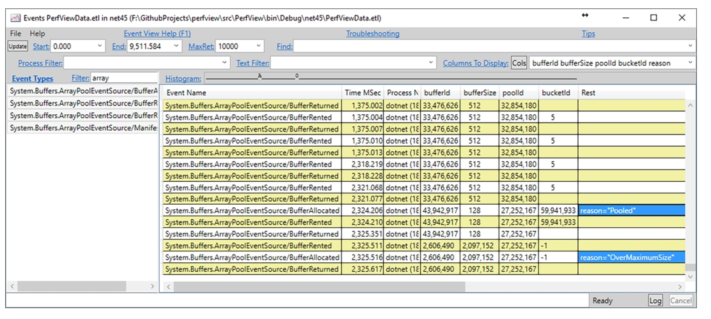

图6-19. PerfView中显示的 `ArrayPool` 生成的ETW事件

由于应用负载会随时间变化，自.NET 5起 `ArrayPool` 实现了修剪机制。该机制通过监控二代GC（使用第12章将介绍的`Gen2GcCallback` 类）并应用启发式算法判断是否需要修剪。具体算法较为复杂且可能随.NET版本变更，但需知该机制取决于池中数组的存活时长、元素尺寸及机器整体内存负载。

### 创建流——使用RecyclableMemoryStream

若应用中大量使用 `System.IO.MemoryStream` 类，应考虑采用对象池方案。`Microsoft.IO.RecyclableMemoryStream` 包中的 `RecyclableMemoryStream` 和 `RecyclableMemoryStreamManager` 类实现了 `MemoryStream` 对象池化。正如这些类的代码注释精辟指出的，高频使用 `MemoryStream` 会伴随以下问题：

- 内存浪费：`MemoryStream` 内部缓冲区在容量不足时会倍增，导致内存持续增长并反复分配更大数组
- 大对象堆(LOH)分配：当内部缓冲区过大时会在LOH分配，这对内存分配和回收都是昂贵操作
- 内存拷贝：每次 `MemoryStream` 扩容时所有字节都需要拷贝到新缓冲区，产生大量内存流量
- 持续不断的缓冲区重建可能导致内存碎片

`RecyclableMemoryStream` 类正是为解决这些问题而设计。其代码注释中的描述值得引用：“该流基于一系列统一尺寸的内存块实现。随着流长度增长，会从内存管理器获取额外块。这些内存块（而非流对象本身）才是被池化的对象。实现中最复杂的部分是处理 `GetBuffer()` 调用——这需要单个连续缓冲区。若只使用单个块则直接返回该块；若使用多块，则从内存管理器获取更大的缓冲区（这些大缓冲区同样按尺寸分级池化，默认以1MB为块大小的倍数）”

代码清单6-27展示了使用 `MemoryStream` 序列化对象的典型场景。除了创建 `XmlWriter` 和 `DataContractSerializer`（这两个对象本应缓存）外，还新建了 `MemoryStream`。当序列化大对象且操作频繁时，会导致前文所述问题。

代码清单6-27 使用 `DataContractSerializer` 和 `MemoryStream` 进行XML序列化

```c#
public string SerializeXmlWithMemoryStream(object obj)
{
    using (var ms = new MemoryStream())
    {
        using (var xw = XmlWriter.Create(ms, XmlWriterSettings))
        {
            var serializer = new DataContractSerializer(obj.GetType()); // 应缓存！
            serializer.WriteObject(xw, obj);
            xw.Flush();
            ms.Seek(0, SeekOrigin.Begin);
            var reader = new StreamReader(ms);
            return reader.ReadToEnd();
        }
    }
}
```

在高频流操作场景应考虑使用 `RecyclableMemoryStream`（见代码清单6-28）。需要创建 `RecyclableMemoryStreamManager` 实例，通过其 `GetStream` 方法获取池化流。该流实现 `IDisposable` 接口使得内存能在释放时回归池中。除了使用默认构造函数，创建管理器时可传入以下参数（代码清单6-28展示默认值）：

- `blockSize`：每个池化内存块的尺寸
- `largeBufferMultiple`：大缓冲区尺寸的基准倍数
- `maximumBufferSize`：超过此阈值的缓冲区不进行池化

代码清单6-28 使用 `DataContractSerializer` 和 `RecyclableMemoryStream` 进行XML序列化

```c#
static RecyclableMemoryStreamManager manager = new RecyclableMemoryStreamManager(
	new RecyclableMemoryStreamManager.Options(
		blockSize: 128 * 1024,
        largeBufferMultiple: 1024 * 1024,
        maximumBufferSize: 128 * 1024 * 1024,
        maximumSmallPoolFreeBytes: 0,
        maximumLargePoolFreeBytes: 0));

public string SerializeXmlWithRecyclableMemoryStream(T obj)
{
    using (var ms = manager.GetStream())
    {
        using (var xw = XmlWriter.Create(ms, XmlWriterSettings))
        {
            var serializer = new DataContractSerializer(obj.GetType()); // 应缓存！
            serializer.WriteObject(xw, obj);
            xw.Flush();
            ms.Seek(0, SeekOrigin.Begin);
            var reader = new StreamReader(ms);
            return reader.ReadToEnd();
        }
    }
}
```

使用 `RecyclableMemoryStream` 时，建议通过 `Microsoft-IO-RecyclableMemoryStream` 这个ETW提供程序进行监控。使用PerfView收集数据时，在"Collect"对话框的"Additional Providers"字段输入：

- `*Microsoft-IO-RecyclableMemoryStream`：仅收集事件数据
-  `*Microsoft-IO-RecyclableMemoryStream:::@StacksEnabled=true`：同时记录事件调用栈

> 注意：作为Additional Provider添加时，必须通过GUID(B80CD4E4-890E-468D-9CBA-90EB7C82DFC7)而非名称启用该ETW提供程序

`RecyclableMemoryStream` 提供了详尽的池使用情况分析（见图6-20）。特别需要关注 `MemoryStreamOverCapacity` 事件，该事件在请求超过最大缓冲区尺寸时触发。

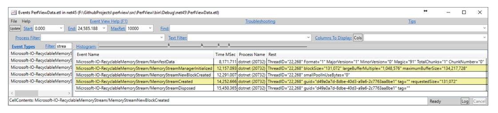

图6-20.  在PerfView中看到的由 `RecyclableMemoryStream` 生成的ETW事件  

> 注意：当需要频繁使用流时，您还应考虑使用 `System.IO.Pipelines` API。它提供了比流更高效的替代方案，且分配更少。第14章将对此进行更详细的介绍。  
>

#### 大量创建对象——使用对象池  

与集合类似，当需要频繁使用某些类型的对象时，可以考虑使用对象池。但请注意，如果大量分配对象后很快丢弃它们，这仍然符合分代假设。因此，这可能没有问题；垃圾回收器会迅速在0代中清理它们。在以下场景中应考虑使用对象池：  

- 对象分配在关键且高频的路径上，每个CPU周期都很重要——在这种情况下，通过提供更稳定的机制来避免对象分配（尤其是慢速路径）可能是有益的。正确编写的对象池应能很好地利用CPU缓存，因此操作池化对象可能非常高效。
- 除了分配成本本身，您可能还担心对象的初始化成本——如果初始化对象的字段非常复杂，您会希望避免反复创建新对象。因此，复用已初始化的对象（如果合适）可以带来好处。  
- 对象的生命周期很短，但足够长以至于被提升到1代或2代。为了使垃圾回收器发挥最佳性能，您真正希望只有两种对象：一种是快速在0代中死亡的对象，另一种是在2代中长期存活的对象。最糟糕的情况是对象存活时间刚好足够被提升到2代后立即死亡，这个问题被称为“中年危机”。对象池通过复用对象来延长其生命周期，从而解决这一问题。  

编写一个好的对象池并不简单。在单线程环境中可能很容易，但在多线程环境中实现无同步机制开销的线程安全对象池并不容易。许多简单的实现可能会比原始对象分配更严重地损害性能。清单6-29提供了一个经过充分测试的示例实现，完全基于Roslyn C#编译器中的 `ObjectPool` 类（附有原始注释解释性能驱动的细节）。  

清单6-29.  基于Roslyn编译器中的 `ObjectPool` 类实现的 `ObjectPool `

```c#
public class ObjectPool<T> where T : class   
{ 
	private T firstItem; 
	private readonly T[] items; 
	private readonly Func<T> generator; 
	public ObjectPool(Func<T> generator, int size) 
	{ 
		this.generator = generator ?? throw new ArgumentNullException("generator"); 
		this.items = new T[size - 1]; 
	} 
	public T Rent() 
	{ 
		// 性能优化：首先检查第一个元素。如果失败，RentSlow将检查剩余元素。 
		// 注意初始读取是乐观的非同步操作。这是有意为之。 
		// 我们仅在找到候选对象时才进行同步。最坏情况下可能会错过最近返回的对象。这不是大问题。 
		T inst = firstItem; 
		if (inst == null || inst != Interlocked.CompareExchange(ref firstItem, null, inst)) 
		{ 
			inst = RentSlow();
		} 
		return inst;
	}
	public void Return(T item)
	{
		if (firstItem == null) 
		{ 
			// 此处故意不使用同步操作。 
			// 最坏情况下两个对象可能存储到同一槽位。 
			// 这种情况极不可能发生，且仅意味着其中一个对象会被回收。 
			firstItem = item; 
		}
		else 
		{ 
			ReturnSlow(item); 
		}
	}
	private T RentSlow()   
   	{ 
    	for (int i = 0; i < items.Length; i++) 
    	{ 
    		// 注意初始读取是乐观的非同步操作。这是有意为之。 
    		// 我们仅在找到候选对象时才进行同步。最坏情况下可能会错过一些最近返回的对象。这不是大问题。 
    		T inst = items[i]; 
    		if (inst != null) 
    		{ 
    			if (inst == Interlocked.CompareExchange(ref items[i], null, inst)) 
    			{ 
    				return inst; 
    			}
    		}
    	}
    	return generator();   
	}
	private void ReturnSlow(T obj)
	{
		for (int i = 0; i < items.Length; i++) 
		{ 
			if (items[i] == null) 
			{ 
				// 此处故意不使用同步操作。 
				// 最坏情况下两个对象可能存储到同一槽位。 
				// 这种情况极不可能发生，且仅意味着其中一个对象会被回收。 
				items[i] = obj;
				break;
			}
		}
	}
}
```

不过，与其自己编写池，您应考虑使用现有实现，例如 `Microsoft.Extensions.ObjectPool` nuget包中提供的实现。它使用简单且非常灵活。  

清单6-30.  使用 `Microsoft.Extensions.ObjectPool`

```c#
public class MyObject : IResettable 
{ 
	public byte[] Buffer { get; set; } 
	public bool TryReset() 
	{ 
		// 当对象返回到池时清除缓冲区 
		Array.Clear(Buffer); 
	}   
}
private static ObjectPool _pool = ObjectPool.Create<MyObject>();
public static void DoSomeWork()
{ 
	MyObject instance = _pool.Get();
	// 执行工作
	pool.Return(instance);
}  
```

如清单6-30所示，您的池化对象可以选择实现 `IResettable` 接口。该接口公开了一个 `TryReset` 方法，当对象返回到池时将调用此方法，允许您执行任何必要的操作以准备实例供重用。  

您还可以通过 `IPooledObjectPolicy<T>` 接口为池提供自定义策略，描述如何创建新实例或在什么条件下可以将实例返回到池中。最后，如果您的对象实现了 `IDisposable`，则当实例因池已满而被丢弃时，将自动调用 `Dispose` 方法。

#### 返回Task的异步方法——使用ValueTask  

自C# 5.0引入 `async` 以来，它几乎已成为一种规范的编程方式。如今，异步代码随处可见。了解其使用如何影响内存消耗是值得的。以读取文件全部内容的简单异步代码为例（见清单6-31）。它首先同步检查文件是否存在，如果存在，则异步等待文件操作完成。  

清单6-31.  异步方法示例 

```c#
public async Task<string> ReadFileAsync(string filename)  
{ 
	if (!File.Exists(filename)) 
		return string.Empty; 
	return await File.ReadAllTextAsync(filename); 
}  
```

大多数.NET程序员可能已经知道，使用 `async` 关键字会将方法转换为一个相当复杂的状态机。此状态机负责在后续异步操作完成时正确处理计划的步骤。如果您查看编译器为清单6-31中的 `ReadFileAsync` 方法生成的代码，您将看到清单6-32中的代码。该方法已转换为启动状态机的代码，状态机由神秘命名的对象 `Program.<ReadFileAsync>d__14` 表示。关于此机制已有许多很好的描述，因此这里不再赘述。  

清单6-32.  清单6-31中的 `ReadFileAsync` 方法经编译器转换后的代码  

```c#
[AsyncStateMachine(typeof(Program.<ReadFileAsync>d__14))]   
public Task<string> ReadFileAsync(string filename)   
{ 
    Program.<ReadFileAsync>d__14 stateMachine = default(Program.<ReadFileAsync>d__14); 			 
    stateMachine.filename = filename; 
    stateMachine.<>t__builder = AsyncTaskMethodBuilder<string>.Create(); 
    StateMachine. filename = filename; 
    stateMachine. $<>1$ __state = -1; 
    stateMachine.<>t__builder.Start(ref stateMachine);   
    return  stateMachine.<>t_ builder.Task;  
```

从我们的角度来看，以下事实很重要（由清单6-33中的代码支持）：  

- 在清单6-32的编译器生成代码中，所有内容都是结构体（包括 `Program.<ReadFileAsync>d__14` 和 `AsyncTaskMethodBuilder<string>`）：这是有意识使用结构体的绝佳示例，否则可能会不假思索地使用类。但请注意，在调试模式下编译时，状态机会更改为引用类型（以性能为代价换取更好的可调试性），因此在反编译自己的程序集时不要感到惊讶。 
- `<ReadFileAsync>d__14`：此编译器生成的结构体表示状态机。如果异步操作未立即结束（发生在清单6-33中可见的`AwaitUnsafeOnCompleted` 内部），它将被装箱。在这种情况下，“state”必须逃离当前方法，因为异步操作可能在不同于初始启动的线程上继续。因此，它必须位于堆上而不是栈上。然而，将 `<ReadFileAsync>d__14` 设为结构体仍然有意义，因为可能存在不会发生此类装箱的常见路径（参见清单6-33中 `File.Exists` 返回 `false` 的情况）。  
- 表示状态机的编译器生成结构体会记住（捕获）方法的所有必要局部变量（本例中为 `filename`）——我们应该意识到这一点，因为如果状态机（`<ReadFileAsync>d__14`）被分配到堆上，它们的生命周期可能会显著延长。  

清单6-33.  表示 `ReadFileAsync` 方法状态机的结构体  

```c#
[CompilerGenerated]   
[StructLayout(LayoutKind.Auto)]   
private struct <ReadFileAsync>d__14 : IAsyncStateMachine
{
    void IAsyncStateMachine.MoveNext() 
    { 
        int num = this.<>1__state; 
        string result; 
        try 
        { 
            TaskAwaiter<string> awaiter; 
            if (num != 0) 
            { 
                if (!File.Exists(this.filename)) 
                { 
                    result = string.Empty; 
                    goto IL_A4; 
                } 
                awaiter = File.ReadAllTextAsync(this.filename, default(CancellationToken)). GetAwaiter(); 
                if (!awaiter.get_IsCompleted()) 
                { 
                    this.<>1__state = 0; 
                    this.<>u__1 = awaiter; 
                    this.<>t__builder.AwaitUnsafeOnCompleted<TaskAwaiter<string>, Program.<ReadFi leAsync>d__14>(ref awaiter, ref this); 
                    return; 
                } 
            }
            else
            { 
                awaiter = this.<>u__1; 
                this.<>u__1 = default(TaskAwaiter<string>);
                this.<>1__state = -1; 
            } 
            result = awaiter.GetResult(); 
        } 
        catch (Exception exception) 
        { 
            this.<>1__state = -2; 
            this.<>t__builder.SetException(exception); 
            return; 
        } 
        IL_A4:
        this.<>1__state = -2; 
        this.<>t__builder.SetResult(result); 
  	}  
}
```

除了堆分配状态机带来的开销外，异步方法还有另一个需要注意的地方。如果您跟踪清单6-33中文件不存在情况下的代码，您会看到在 `goto` 语句之后，调用了 `AsyncTaskMethodBuilder<string>` 结构体上的 `SetResult`。理论上这是一个非常快速的同步路径，没有任何异步等待开销。然而，`SetResult` 方法可能会分配一个 `Task` 对象来包含方法的结果（见清单6-34）。  

清单6-34.  `AsyncTaskMethodBuilder` 结构体  

```c#
public struct AsyncTaskMethodBuilder<TResult>
{
    public static AsyncTaskMethodBuilder<TResult> Create() 
    { 
        return default(AsyncTaskMethodBuilder<TResult>); 
    } 
    public static void Start<TStateMachine>(ref TStateMachine stateMachine) where TStateMachine : IAsyncStateMachine 
    { 
        // ...
        stateMachine.MoveNext(); 
    } 
    //...
    public void SetResult(TResult result) 
    { 
        if (this.m_task == null) 
        { 
            this.m_task = Task.FromResult<TResult>(result); 
            return; 
        } // ...
    } 
    public Task<TResult> Task { 
        get
        {
            ...
        }
    }
}
```

`SetResult` 内部调用的 `Task.FromResult` 方法很可能会分配一个新的Task来包装提供的结果，但出于性能考虑有一些例外：  

- 对于 `Task<bool>`，它返回两个缓存对象之一（对应true和false值）。 
- 对于 `Task<int>`，它返回-1到9值的缓存对象，但会为其他值创建新的Task。 
  对于许多数值类型的`Task<T>`，它返回值为0的缓存对象。  
- 对于null结果，它返回专用的缓存任务。 
- 其他情况下，它会创建新的 `Task`。  

仅仅为了返回结果值而分配 `Task` 对象并不高效。如果您的异步方法被频繁调用且经常同步完成，您会引入大量不必要的 `Task` 对象分配。为此，引入了 `Task` 的轻量级版本 `ValueTask`。它实际上是一个结构体，作为区分联合类型(discriminated union)——可以取以下三种可能值之一（见清单6-35）：  

- 就绪的结果（如果操作成功同步完成）。  

- 可以等待的普通 `Task`。  
- 还可以包装 `IValueTaskSource<T>`，可以实现此接口以池化任务对象，从而最小化分配。  

清单6-35.  .NET 8中的 `ValueTask` 实现 

```c#
public struct ValueTask<TResult>   
{ 
    // 如果_result包含结果则为null，否则为Task<TResult>或IValueTaskSource<TResult>
    internal readonly object _obj; 
    internal readonly TResult _result;
    ...
}  
```

对应的 `AsyncValueTaskMethodBuilder<TResult>` 的 `SetResult` 方法设置结果（如果已可用），或者像之前描述的那样以常规方式创建 `Task`（如果走常规异步路径）。这样，当您的异步方法同步完成时，可以完全避免分配。这只需要将返回类型从`Task<T>` 更改为 `ValueTask<T>`（见清单6-36）。编译器会通过使用 `AsyncValueTaskMethodBuilder` 代替`AsyncTaskMethodBuilder` 来处理其余部分。  

清单6-36.  `ValueTask` 使用示例  

```c#
public async ValueTask<string> ReadFileAsync2(string filename)   
{ 
    if (!File.Exists(filename)) 
        return string.Empty; 
    return await File.ReadAllTextAsync(filename);   
} 
```

在使用返回 `ValueTask` 的异步方法时，您可以像其他常规异步方法一样简单地等待它。只有在最紧密的循环中，在绝对关键的性能路径上，您才可能需要额外检查它是否已完成，并在这种情况下使用 `Result`（见清单6-37）。此代码完全基于结构体，因此不会发生分配。如果任务未完成，则会启动常规的 `Task` 驱动路径。  

清单6-37.  使用返回 `ValueTask` 的异步方法  

```c#
var valueTask = ReadFileAsync2();   
if (valueTask.IsCompleted)   
{ 
    return valueTask.Result;   
}   
else   
{ 
    return await valueTask.AsTask();   
}  
```

还有另一种优化可能。如前所述，在异步路径的情况下，仍然需要分配 `Task`。但如果它在您的性能关键路径上频繁调用，最好也能消除这种分配。为此，引入了上述 `IValueTaskSource`。您可以创建一个包装此接口实例的 `ValueTask`。关键在于您可以缓存或池化这些实例（见清单6-38），从而消除 `Task` 的分配。  

清单6-38.  使用由 `IValueTaskSource` 实现支持的 `ValueTask`示例  

```c#
public ValueTask<string> ReadFileAsync3(string filename)   
{ 
    if (!File.Exists(filename)) 
    	return new ValueTask<string>("!"); 
 	var cachedOp = pool.Rent(); 
    return cachedOp.RunAsync(filename, pool);   
}   
private ObjectPool<FileReadingPooledValueTaskSource> pool = new ObjectPool<FileReadingPooledValueTaskSource>(() => new FileReadingPooledValueTaskSource(), 10);  
```

实现IValueTaskSource<T>接口时，必须实现以下三个方法：GetResult、GetStatus和OnCompleted。  

此外，为了方便起见，此类类型应提供启动操作的方法和响应操作完成的方法。  

> 需要注意的是，实现一个完全功能化且线程安全的 `IValueTaskSource` 远非易事。在此包含整个`FileReadingPooledValueTaskSource`实现（清单6-38中使用）以及所有适当的解释超出了本书的范围。此外，预计只有少数开发人员实际上需要实现它。不过，请参考GitHub上的附带源代码查看完整的`FileReadingPooledValueTaskSource`实现（附有详细注释），以及 http://tooslowexception.com/implementing-custom-ivaluetasksource-asyncwithout-allocations/上的专门博客文章。  
>

您不应将 `ValueTask` 视为 `Task` 的默认替代品。虽然它可以提高同步完成方法大多数情况下的性能，但也带来了一些缺点。使用`ValueTask` 而非 `Task` 的权衡在 `ValueTask` 的文档中有详细解释：  

“虽然 `ValueTask<TResult>` 可以在同步成功获取结果的情况下避免分配，但它包含两个字段，而作为引用类型的`Task<TResult>` 是单个字段。这意味着方法调用最终返回两个字段的数据而不是一个，需要复制更多数据。还意味着如果在一个 `async` 方法中等待返回其中一个的方法，该 `async` 方法的状态机将因需要存储两个字段的结构体而非单个引用而变得更大。”  

“此外，对于通过 `await` 以外的方式使用异步操作结果的情况，`ValueTask<TResult>` 可能导致更复杂的编程模型，进而实际上可能导致更多分配。例如，考虑一个可能返回带有缓存任务作为常见结果的 `Task<TResult>` 或 `ValueTask<TResult>` 的方法。如果结果的使用者希望将其作为 `Task<TResult>` 使用，例如与 `Task.WhenAll` 和 `Task.WhenAny` 等方法一起使用，`ValueTask<TResult>` 首先需要使用 `AsTask` 转换为 `Task<TResult>`，这会导致分配，而如果最初使用缓存的`Task<TResult>`则可以避免。”

#### 隐藏分配  

并非所有分配都是显式的；某些操作会隐式创建对象。这通常被称为隐藏分配，应尽量避免这种情况。当然，它们在这方面更令人不悦；除非你了解它们，否则它们不会直接从代码中凸显出来。如第3章所述，你可以使用喜欢的IDE扩展来在编写代码时直接高亮这些隐藏分配。  

##### 委托分配

每次创建新委托（包括常用的 `Func` 和 `Action` 委托）时，都会产生隐藏分配。无论是从方法组（通过名称引用的方法，见代码清单6-39）创建委托，还是从lambda表达式创建（此时lambda表达式会被转换为编译器生成的方法，见代码清单6-40），都会发生这种情况。  

代码清单6-39. 从方法组创建委托的分配  

```csharp
Func<double> action = ProcessWithLogging; // 隐藏分配  
Func<double> action = new Func<double>(this.ProcessWithLogging); // 显式分配  
```

代码清单6-40. 从lambda表达式创建委托的隐藏分配  

```csharp
Func<double> action = () => ProcessWithLogging(); // 隐藏分配  
Func<double> action = new Func<double>(this.<SomeMethod>b__31_0)(); // 显式分配  
```

无法完全避免这些分配，但应考虑在合理情况下重用甚至缓存这些委托（例如避免在循环内重复创建委托）。  

> 关于lambda表达式有一个重要优化：如果它们不捕获（关闭）任何数据，C#编译器会生成代码将该委托实例缓存为静态字段（因此仅在首次使用时分配一次）。从.NET 8开始，此优化也适用于方法组。  

##### 装箱  

第4章已描述过装箱。.NET世界中一个主要的内存相关规则是避免装箱。过多的装箱确实会导致性能问题。遗憾的是，大多数装箱是隐式发生的，你可能甚至没有意识到。因此，值得看看常见的隐式装箱发生场景：  

- 当值类型在需要对象（引用类型）的地方使用时，需要进行装箱。除了第4章代码清单4-28中的小例子外，最常见的情况是在接受 `System.Object` 实例的方法参数中，如各种 `string.Format`、`string.Concat` 及类似重载：  

  ```csharp
  int i = 123;  
  return string.Format("{0}", i);  
  ```

  生成的CIL代码中发生了对 `System.Int32` 的装箱：  

  ```
  ldc.i4.s 123  
  stloc.0  
  ldstr "{0}"  
  ldloc.0  
  box System.Int32  
  call string System.String::Format(string, object)  
  ```

  为避免装箱，可以在方法调用时对值类型调用 `ToString(string.Format("{0}", i.ToString()))`，但 `ToString` 仍会分配新字符串（本章稍后将介绍使用插值字符串的更好解决方案）。一般来说，尽可能避免接受对象参数的方法是好的。 在.NET Framework 2.0引入泛型之前，大多数集合类型将其数据存储为对象引用，因为它们需要足够灵活以存储任何可能的数据。因此，存在许多如 `ArrayList.Add(Object value)` 等方法，可能导致装箱。得益于泛型类型，这个问题已不存在，因为泛型类型或方法会为特定值类型（如 `List<T>` 变为 `List<int>`）编译，无需装箱。  

- 值类型实例用作该值类型实现的接口时。由于接口是引用类型，需要装箱。例如，考虑 `GetMessage` 方法接受 `ISomeInterface` 类型的参数，而 `SomeStruct` 实现了该接口：  

  ```c#
  public string Main(string args) {  
      SomeStruct some;  
      var message = Helper(some);  
      return message;  
  }
  
  string Helper(ISomeInterface data) {  
      return data.GetMessage();  
  }
  ```

  生成的CIL代码中可见隐式装箱：  

  ```
  ldloc.0  
  box SomeStruct  
  call instance string Program::Helper(class ISomeInterface)  
  ```

  可以通过引入泛型方法来避免此类装箱，该方法将期望的接口作为泛型类型参数：  

  ```c#
  string Helper<T>(T data) where T : ISomeInterface {  
      return data.GetMessage();  
  }
  ```

  泛型方法会为此特定值类型作为参数编译，因此无需装箱：  

  ```
  ldloc.0  
  call instance string Program::Helper<valuetype SomeStruct>(!!0)  
  ```

现在看看最常见的装箱来源之一：在 `IEnumerable<T>` 的 `foreach` 指令中使用值类型作为接口（见代码清单6-41）。这种情况下，我们将 `List<int>` 实例作为 `IEnumerable<int>` 传递给 `Print` 方法。`foreach` 指令基于枚举器概念实现——它在传递的集合上调用 `GetEnumerator()`，然后依次调用 `Current()` 和 `MoveNext()`。在 `Print` 方法中，集合被视为`IEnumerable<int>`，因此会调用 `IEnumerable<int>.GetEnumerator()`，预期返回 `IEnumerator<int>`。`List<T>` 显然实现了 `IEnumerable<int>`，但重要事实是 `GetEnumerator()` 返回 `Enumerator` 实例，这是一个结构体。由于此结构体被用作 `IEnumerator<int>`，装箱在 `foreach` 循环开始时发生一次。  

代码清单6-41. 使用 `foreach` 语句时因装箱导致的隐藏分配  

```csharp
public int Main(string args) {  
    List<int> list = new List<int>() {1, 2, 3};  
    Print(list);  
    return list.Count;  
}  

public void Print(IEnumerable<int> list) {  
    foreach (var x in list) {  
        Console.WriteLine(x);  
    }  
}  
```

这显然不会带来太多开销，因为单个 `Enumerator` 的装箱很可能被 `foreach` 循环内的操作所掩盖。与所有此类问题一样，只有在热路径上大量使用此类 `foreach` 循环时才会对你造成影响。与往常一样，通过调查 `Enumerator` 分配的数量，尽早测量这是否是应用程序中的问题。如果想避免装箱，可以简单地将列表作为 `List<int>` 传递给 `Print` 方法（使其成为 `public void Print(List<int> list)`）。这种情况下，当 `foreach` 在底层调用 `List<int>.GetEnumerator()` 时，预期 `List<int>.Enumerator` 是一个结构体，将为其创建局部变量。不再需要装箱。  

这是良好编程实践可能与代码优化冲突的地方。一般来说，设计 `Print` 方法接受任何 `IEnumerable<T>` 而非具体 `List<T>` 实现是好的。但这会触发装箱，因此你必须在可能的性能影响和良好代码实践之间做出选择。  

可能出现的明显问题是，为什么像 `List<T>` 这样的常见集合首先将其枚举器实现为结构体，如果这意味着此类隐藏装箱开销。答案很简单，你可能已经猜到了：绝大多数用例是将枚举器用作局部变量，因此作为值类型，它们可以廉价且快速地在栈上分配。这远远超过了装箱可能带来的问题。  

值类型还有三个较少人知的装箱来源：  

1. 当 `valueType.GetHashCode()` 和 `valueType.ToString()` 调用时，这些虚方法未在 `valueType` 中重写。  
2. `valueType.GetType()` 总是对 `valueType` 进行装箱。  
3. 从值类型方法创建委托时，会进行装箱（见代码清单6-42和6-43）。  

代码清单6-42. 从值类型方法组创建委托的分配  

```csharp
SomeStruct valueType;  
Func<double> action2 = valueType.SomeMethod;  
```

代码清单6-43. 代码清单6-42的IL代码  

```
ldarg.1  
box CoreCLR.Program.SomeStruct  
ldftn instance float64 CoreCLR.Program.SomeStruct::SomeMethod()  
newobj instance void class [System.Runtime]System.Func`1<float64>::.ctor(object, native int)  
callvirt instance !0 class [System.Runtime]System.Func`1<float64>::Invoke()  
```

##### 闭包  

闭包是管理计算状态的机制——“一个函数连同该函数非局部变量的引用环境”（维基百科）。为了更好地理解它们，让我们使用一个简单的基于LINQ的方法示例，该方法使用lambda表达式从列表中过滤和选择值（见代码清单6-44）。如果你按顺序阅读本章，可能已经注意到 `Closures` 方法中两个可能的分配来源：两个委托可能从lambda表达式创建，因为 `Where` 和 `Select` 都期望 `Func<>` 作为参数。  

代码清单6-44. 使用lambda表达式的代码示例  

```csharp
private IEnumerable<string> Closures(int value) {  
    var filteredList = _list.Where(x => x > value);  
    var result = filteredList.Select(x => x.ToString());  
    return result;  
}  
```

然而，还有另一个重要的分配来源。代码清单6-44中的代码将被转换为使用额外的 `<>c__DisplayClass1_0` 类的更复杂构造（见代码清单6-45）。此类实现了上述闭包。它包含要执行的函数（使用某些内部名称 `<Closures>b__0`）和执行所需的所有变量（本例中为 `value`）。请注意以下事实：  

- 闭包实现为类，因此会导致分配——在我们的示例中，每次执行 `Closures` 方法时都会分配 `Program.<>c__DisplayClass1_0`。  
- 存储在闭包中的局部变量（捕获的）会计入堆上此闭包的大小——本例中捕获了 `value` 整数。变量越多，“闭包类”就越大。  

代码清单6-45. 编译器转换后使用lambda表达式的代码示例  

```csharp
private IEnumerable<string> Closures(int value) {  
    Program.<>c__DisplayClass1_0 <>c__DisplayClass1_ = new Program.<>c__DisplayClass1_0();  
    <>c__DisplayClass1_.value = value;  
    return this._list.Where(new Func<int, bool>(<>c__DisplayClass1_.<Closures>b__0))  
                    .Select(new Func<int, string>(Program.<>c.<>9.<Closures>b__1_1));  
}  

[CompilerGenerated]  
private sealed class <>c__DisplayClass1_0 {  
    public <>c__DisplayClass1_0() { }  
    internal bool <Closures>b__0(int x) { return x > this.value; }  
    public int value;  
}  
```

在尝试编写低内存使用代码时，应意识到闭包分配——闭包捕获的变量越少越好。你总是可以检查它，例如使用dnSpy工具查看反编译代码。  

代码清单6-46展示了关于何时捕获什么的一些额外见解。但要注意，由于广泛的编译器优化，有许多规则和例外，有时关于捕获内容和时间的所有调查都以这个结论结束——这是纯粹的魔法（或更严肃地说，当前使用的优化的深层实现细节）。请注意，代码清单6-46中的所有示例可能包含从lambda表达式创建的委托的隐藏分配。  

代码清单6-46. 闭包捕获状态的不同情况示例  

```csharp
// 没有闭包，因为没有要捕获的内容（未捕获"this"引用）：  
Func<double> action1 = () => InstanceMethodNotUsingThis();  

// 没有闭包，因为没有要捕获的内容（仍未捕获this）  
Func<double> action2 = () => InstanceMethodUsingThis();  

// 没有要捕获的内容  
Func<double> action3 = () => StaticMethod();  

// 捕获ss  
Func<double> action3 = () => StaticMethodUsingLocalVariable(ss);  

// 闭包捕获ss和this（以调用this.<>4__this.ProcessSomeStruct(this.ss)；  
// 如果ss参数缺失，则不会捕获任何内容（也不会捕获this）  
Func<double> action6 = () => InstanceMethodUsingLocalVariable(ss);  
```

如果想消除闭包，应生成不捕获任何变量的lambda表达式代码，或完全不用lambda表达式。代码清单6-47展示了如何重写代码清单6-44中的方法的示例。请注意，代码现在需要为结果分配列表，这可能比闭包本身所做的分配效率更低。  

代码清单6-47. 避免lambda表达式和闭包的代码示例  

```csharp
private IEnumerable<string> WithoutClosures(int value) {  
    List<string> result = new List<string>();  
    foreach (int x in _list)  
        if (x > value)  
            result.Add(x.ToString());  
    return result;  
}  
```

C# 7.0引入的局部函数类似于lambda表达式，可能需要分配闭包。将代码清单6-44中的代码重写为使用局部函数的代码，你会得到带有两个局部函数的代码（见代码清单6-48）。然而，这种方式仍未避免捕获value变量。  

代码清单6-48. 使用局部函数重写代码清单6-44的代码  

```csharp
private IEnumerable<string> ClosuresWithLocalFunction(int value) {  
    bool WhereCondition(int x) => x > value;  
    string SelectAction(int x) => x.ToString();  
    var filteredList = _list.Where(WhereCondition);  
    var result = filteredList.Select(SelectAction);  
    return result;  
}  
```

编译器生成的代码（见代码清单6-49）仍包含闭包捕获。  

代码清单6-49. 编译器转换后使用局部函数的代码示例  

```csharp
private IEnumerable<string> ClosuresWithLocalFunction(int value) {  
    Program.<>c__DisplayClass26_0 <>c__DisplayClass26_ = new Program.<>c__DisplayClass26_0();  
    <>c__DisplayClass26_.value = value;  
    return this._list.Where(new Func<int, bool>(<>c__DisplayClass26_.<ClosuresWithLocalFunction>g__WhereCondition|0))  
                    .Select(new Func<int, string>(Program.<ClosuresWithLocalFunction>g__SelectAction|26_1));  
}
```

然而，有一种特定情况闭包不会在堆上分配。考虑代码清单6-50中的代码。  

代码清单6-50. 局部函数和lambda  

```csharp
public int Lambda(int x) {  
    var add = (int value) => x + value;  
    return add(10);  
}  

public int LocalFunction(int x) {  
    int Add(int value) => x + value;  
    return Add(10);  
}  
```

在 `Lambda` 和 `LocalFunction` 方法中，都捕获了变量x的值。然而，如果检查反编译代码，你会发现为局部函数发出的闭包是结构体而非类。当局部函数仅从父函数调用且不作为委托逃逸时，就会发生这种情况。

##### Yield Return（Yield返回）

除了异步方法和闭包之外，还有另一种会导致编译器生成辅助类并产生隐藏分配的机制——`yield return` 机制。它用于快速便捷地创建迭代器方法。编译器负责创建保存迭代状态的迭代器类的繁重工作。例如，通过使用 `yield` 运算符重写清单6-44中的方法，可以轻松摆脱lambda表达式（见清单6-51）。

清单6-51. 使用yield运算符的代码示例  
```csharp
private IEnumerable<string> WithoutClosures(int value)   
{ 
    foreach (int x in _list) 
        if (x > value) 
            yield return x.ToString();   
}
```

然而，这段代码仍然会分配一个临时对象，用于表示迭代器的状态（见清单6-52）。可以看到，它还捕获了 `value` 变量以及 `this` 引用。但考虑到清单6-44中的代码除了闭包外，还分配了 `Where` 和 `Select` 方法使用的可枚举对象，这仍然是一个分配较少的选择。

清单6-52. 编译器转换后使用 `yield` 运算符的代码示例  
```csharp
[IteratorStateMachine(typeof(Program.<WithoutClosures>d__26))] 
private IEnumerable<string> WithoutClosures(int value) 
{  
    Program.<WithoutClosures>d__26 expr_07 = new Program.<WithoutClosures>d__26(-2); 
    expr_07.<>4__this = this; 
    expr_07.<>3__value = value; 
    return expr_07; 
}
```

##### 参数数组（Parameter Array）

自C# 2.0时代起，就可以使用 `params` 关键字创建接受可变数量参数的方法（见清单6-53）。需要注意的是，这只是编译器的语法糖。底层实现中，参数只是一个 `object` 数组。

清单6-53. 接受可变数量参数的方法示例  
```csharp
public void MethodWithParams(string str, params object[] args)   
{ 
    Console.WriteLine(str, args);   
}
```

因此，当向带有 `params` 的方法传递参数时，会分配一个新的 `object[]` 数组。当没有传递参数时，编译器会进行简单的优化（见清单6-54）。

清单6-54. 使用 `params` 方法的示例  
```csharp
SomeClass sc;   
MethodWithParams("Log {0}", sc); // 分配一个包含单个元素sc的object[]  
int counter;   
MethodWithParams("Counter {0}", counter); // 装箱整数并分配一个包含单个元素counter的object[]  
p.MethodWithParams("Hello!");  // 不分配，使用静态Array.Empty<object>()
```

大多数情况下，这些函数只传入少量参数。可以利用这种使用模式，通过为典型的少量参数使用提供重载（以对象或泛型方法的形式）来消除这种隐藏分配的来源（见清单6-55）。

清单6-55. 接受可变数量参数的方法重载示例  
```csharp
public void MethodWithParams(string str, object arg1)   
{ 
    Console.WriteLine(str, arg1);   
}   
public void MethodWithParams(string str, object arg1, object arg2)   
{ 
    Console.WriteLine(str, arg1, arg2);   
}   
public void GenericMethodWithParams<T1>(string str, T1 arg1)   
{ 
    Console.WriteLine(str, arg1);   
}   
public void GenericMethodWithParams<T1,T2>(string str, T1 arg1, T2 arg2)   
{ 
    Console.WriteLine(str, arg1, arg2);   
}
```

##### 字符串拼接与格式化（String Concatenation and Formatting）

字符串拼接以及使string类不可变的设计决策已在第4章中描述。为了完整性，这里仅提醒导致临时字符串分配的典型示例（见清单6-56）。

清单6-56. 最常见的字符串操作示例  
```csharp
// 这将产生一个临时字符串"Hello " + otherString  
string str = "Hello " + otherString + "!";   
// 分配str + "you are welcome"（之前的str将成为垃圾）  
str += " you are welcome";
```

但当需要将不同部分拼接成字符串时，有哪些替代方案？如第4章所述，可以利用 `StringBuilder` 类。使用可变的 `StringBuilder` 与不可变字符串拼接之间的性能差异可能非常显著。表6-7展示了清单6-57中三种方法的基准测试结果。它比较了上述两种方法。此外，第三个版本使用了 `StringBuilderCache`，虽然它不是公开的，但可以轻松从.NET Framework源代码中复制（https://referencesource.microsoft.com/#mscorlib/system/text/stringbuildercache.cs）。

清单6-57. 构建复杂字符串的三种方法。第一种使用经典的字符串拼接，产生许多临时短命字符串。第二种使用 `StringBuilder`，第三种实现了 `StringBuilder` 实例缓存（获取足够大的缓存实例以包含生成的文本）  
```csharp
[Benchmark]   
public static string StringConcatenation()   
{ 
    string result = string.Empty; 
    for (int num = 0; num < 64; num++) 
        result += string.Format("{0:D4}", num); 
    return result;   
}   
[Benchmark]   
public static string StringBuilder()   
{ 
    StringBuilder sb = new StringBuilder(); 
    for (int num = 0; num < 64; num++) 
        sb.AppendFormat("{0:D4}", num); 
    return sb.ToString();   
}   
[Benchmark]   
public static string StringBuilderCached()   
{ 
    StringBuilder sb = StringBuilderCache.Acquire(2 * 4 * 64); 
    for (int num = 0; num < 64; num++) 
        sb.AppendFormat("{0:04}", num); 
    return StringBuilderCache.GetStringAndRelease(sb);   
}
```

表6-7. 清单6-57中三种字符串构建方法的基准测试结果。使用.NET 8上的BenchmarkDotNet。

| 方法                | 平均时间  | Gen 0  | 分配内存 |
| ------------------- | --------- | ------ | -------- |
| StringConcatenation | 7.604微秒 | 2.5940 | 21.22 KB |
| StringBuilder       | 3.133微秒 | 0.3815 | 3.13 KB  |
| StringBuilderCached | 2.442微秒 | 0.2441 | 2.02 KB  |

从表6-7的结果可以清楚地看到，如果不了解字符串拼接的注意事项，内存消耗可能会大十倍。它还引入了十倍的GC开销。在这个测试案例中可能微不足道，但对于处理数千个请求的大型Web应用程序来说，这可能产生真正的差异。

对于通过追加较小字符串来创建较大文本的情况，`StringBuilder` 将是最佳选择。但对于仅拼接两三个部分的简单场景，最好直接使用+运算符（如清单6-56中的第一行）。底层实现中，它使用 `string.Concat`，通过直接操作字符串数据来高效拼接字符串（见清单6-58）。

清单6-58. 高效的 `string.Concat` 实现（`FillStringChecked` 直接操作内部字符串数据）  
```csharp
public static String Concat(String str0, String str1)   
{ 
    if (IsNullOrEmpty(str0)) 
    { 
        if (IsNullOrEmpty(str1)) 
        { 
            return String.Empty; 
        } 
        return str1; 
    } 
    if (IsNullOrEmpty(str1)) 
    { 
        return str0; 
    }  

    int str0Length = str0.Length; 
    String result = FastAllocateString(str0Length + str1.Length); 
    FillStringChecked(result, 0, str0); 
    FillStringChecked(result, str0Length, str1); 
    return result; 
}
```

> 如果格式化字符串的代码位于关键路径上，并且您真的希望避免任何分配，可以考虑使用像 `StringFormatter`（https://github.com/MikePopoloski/StringFormatter）这样的外部库。这是一个无分配库，API与 `string.Format` 非常相似。甚至还有基于它的更高级库，如无分配日志库 `ZeroLog`（https://github.com/Abc-Arbitrage/ZeroLog）。自.NET Core 2.1起，您还可以使用所有新的 `Span<T>` 相关API进行字符串操作（在第14章中提到）。
>

有时，您只需要用几个参数格式化字符串，比如在 `ToString` 实现中。让我们看看有哪些选项以及性能影响，以连接四个连续整数的简单情况为例。清单6-59展示了第4章中讨论的拼接实现：即使知道由于创建临时字符串应避免第一种方法，它们仍将用作参考。

清单6-59. 字符串拼接实现  
```csharp
public string StringConcatenation()   
{ 
    string result = string.Empty; 
    for (int i = 1; i <= 4; i++) 
    { 
        result += string.Format("{0:D4}", i); 
    } 
    return result;   
}   
public string StringBuilder()   
{ 
    StringBuilder sb = new StringBuilder(4 * 4); 
    for (int i = 1; i <= 4; i++) 
    { 
        sb.AppendFormat("{0:D4}", i); 
    } 
    return sb.ToString();   
}
```

对于如此少的参数，直接使用 `string.Format` 的一次调用来构建字符串可能更高效。在字符串格式化方面，.NET 6引入了“字符串插值”语法。如清单6-60所示，现在可以使用更开发人员友好的语法，其中参数名称直接插入到插值字符串中，而不是使用编号占位符。

清单6-60. 字符串格式化实现  
```csharp
public string StringFormat(int i1, int i2, int i3, int i4)   
{ 
    return string.Format("{0:04}{1:04}{2:04}{3:04}", i1, i2, i3, i4);   
}   
public string StringInterpolation(int i1, int i2, int i3, int i4)   
{ 
    return $"{i1:04}{i2:04}{i3:04}{i4:04}";   
}
```

插值字符串的明显改进是，您不会弄错变量的数量和顺序，因为它们直接出现在格式化字符串中。第二个改进是由于避免了调用 `string.Format` 所需的隐藏数组分配，以及插值字符串的构建方式带来的性能提升。C#编译器将 `StringInterpolation` 方法代码转换为清单6-61所示的形式。

清单6-61. C#编译器如何转换插值字符串  
```csharp
public string StringInterpolation(int i1, int i2, int i3, int i4)   
{ 
    System.Runtime.CompilerServices.DefaultInterpolatedStringHandler defaultInterpolatedStringHandler = new System.Runtime.CompilerServices.DefaultInterpolatedStringHandler(0, 4); 
    defaultInterpolatedStringHandler.AppendFormatted(i1, "D4"); 
    defaultInterpolatedStringHandler.AppendFormatted(i2, "D4"); 
    defaultInterpolatedStringHandler.AppendFormatted(i3, "D4"); 
    defaultInterpolatedStringHandler.AppendFormatted(i4, "D4"); 
    return defaultInterpolatedStringHandler.ToStringAndClear();   
}
```

`DefaultInterpolatedStringHandler` 是“插值字符串处理程序”的BCL实现。这是一种新模式，允许您高效地从可以格式化的不同部分构建字符串，就像通常使用 `StringBuilder` 所做的那样。

您甚至可以更进一步，提供一个栈分配的缓冲区，处理程序将在其中存储格式化字符，如清单6-62所示。

清单6-62. 使用插值字符串处理程序的改进代码  
```csharp
public string WithHandler(int i1, int i2, int i3, int i4)   
{ 
    var handler = new DefaultInterpolatedStringHandler(0, 4, CultureInfo.InvariantCulture, stackalloc char[16]); 
    handler.AppendFormatted<int>(i1, "D4"); 
    handler.AppendFormatted<int>(i2, "D4"); 
    handler.AppendFormatted<int>(i3, "D4"); 
    handler.AppendFormatted<int>(i4, "D4"); 
    return handler.ToStringAndClear();   
}
```

除了栈分配的缓冲区外，此代码还调用泛型 `AppendFormatted` 辅助方法以避免对整数值进行装箱。

是否有其他方法可以进一步提高性能？如果可以直接填充 `String` 存储的字符缓冲区会怎样？您应该立即停止阅读并思考一下，因为我们花了这么多段落解释一旦创建，字符串是不可变的。嗯...技巧是在字符串创建之前填充缓冲区，这要归功于`String.Create` 方法。主要限制是您需要知道完全格式化字符串的确切长度。

自.NET 6起，您可以传递已经构建的 `DefaultInterpolatedStringHandler` 实例。然而，还有一个更灵活的接受状态和 `Span<Action>` 的重载，如清单6-63所示。

清单6-63. String.Create重载定义  
```csharp
public static string Create<TState>(int length, TState state, System.Buffers.SpanAction<char, TState> action)
```

它的用法相当简单：定义创建格式化字符串所需的状态（如我们示例中的四个整数），并实现期望此状态和 `Span<char>` 的action，`Span<char>` 对应于将写入字符串内容的缓冲区，逐部分写入，如清单6-64所示。

清单6-64. 使用 `String.Create` 构建格式化字符串  
```csharp
public string StringCreate(int i1, int i2, int i3, int i4)   
{ 
    return string.Create(16, (i1, i2, i3, i4), (span, state) => 
    { 
        var pos = 0; 
        int length = 0; 
        Span<char> buffer = span; 
        buffer = span.Slice(pos, 4); 
        state.i1.TryFormat(buffer, out length, "D4"); 
        pos += length; 
        buffer = span.Slice(pos, 4); 
        state.i2.TryFormat(buffer, out length, "D4"); 
        pos += length; 
        buffer = span.Slice(pos, 4); 
        state.i3.TryFormat(buffer, out length, "D4"); 
        pos += length; 
        buffer = span.Slice(pos, 4); 
        state.i4.TryFormat(buffer, out length, "D4"); 
    });   
}
```

每个部分通过 `TryFormat` 辅助方法直接写入 span，该方法由大多数基本类型（包括 `DateTime` 和 `Guid`）提供，并接受`Span<char>`。您负责填充字符串的所有字符；否则，结果将是未定义的。

表6-8比较了不同实现在速度和分配方面的性能。可以看到，即使是基于 `StringBuilder` 的代码，其性能也不及处理程序和 `String.Create` 的实现。这再次提醒我们，要为每项任务使用正确的工具，并始终通过测量来确认技术选择。

表6-8. 清单6-59、6-60、6-62和6-64中不同字符串格式化方法的基准测试结果。使用.NET 8上的BenchmarkDotNet。

| 方法                | 平均时间   | Gen 0  | 分配内存 |
| ------------------- | ---------- | ------ | -------- |
| StringConcatenation | 295.53纳秒 | 0.0439 | 368 KB   |
| StringBuilder       | 211.07纳秒 | 0.0305 | 256 KB   |
| StringFormat        | 204.65纳秒 | 0.0248 | 208 KB   |
| StringInterpolation | 131.92纳秒 | 0.0067 | 56 KB    |
| WithHandler         | 101.64纳秒 | 0.0067 | 56 KB    |
| StringCreate        | 80.32纳秒  | 0.0067 | 56 KB    |

### 字符串编码  

自.NET诞生之初，字符串就采用UTF-16编码；每个字符在内存中占用2字节。其他更节省内存的编码方式早已存在，例如7位ASCII编码——这种编码诞生于电传打字机比计算机更普及的时代。它仅支持英文字母（大小写）、"?"等标点符号以及控制代码（其中换行符 `\n` 和回车符 `\r` 至今仍在使用）。此外还有8位变长UTF-8编码，它已成为万维网上信息交换的事实标准。  

若需在这些编码间转换字符串，应使用 `System.Text` 命名空间下的 `UTF7Encoding` 和 `UTF8Encoding` 辅助类。虽然.NET没有专门管理ASCII或UTF-8字符串的类型，但C# 11通过引入UTF-8字符串字面量改进了对UTF-8字符串的操作——任何带有 `u8` 后缀的字面字符串都会自动转换为包含其UTF-8编码的 `ReadOnlySpan<byte>`。  

`System.Text.Unicode.Utf8` 静态类提供了更多操作 `ReadOnlySpan<byte>` 的辅助方法。如代码清单6-65所示，`TryWrite` 方法利用 `TryWriteInterpolatedStringHandler` 类型可以轻松格式化并构建 `Span<T>` 内容。  

代码清单6-65 将UTF-8字符串格式化为 `ReadOnlySpan<byte>`

```c#
int i1 = 1;
int i2 = 2;
int i3 = 3;
int i4 = 4; 
byte[] utf8buffer = new byte[4*4+3+1]; // 4个4位数 + 分隔符 + \0  
Span<byte> utf8span = utf8buffer.AsSpan(); 
int bytesWritten = 0;
if (Utf8.TryWrite(utf8span, CultureInfo.InvariantCulture, $"{i1:X4}.{i2:X4}.{i3:X4}.{i4:X4}", out bytesWritten))  
{
...
```

`System.IUtf8SpanFormattable` 接口也定义了 `TryWrite` 方法（如图6-21所示），包括 `Guid`、`Version` 和日期相关类型在内的所有基础类型都实现了该接口，这有助于分段构建UTF-8 Span。

图6-21 实现 `IUtf8SpanFormattable` 接口的类型列表 

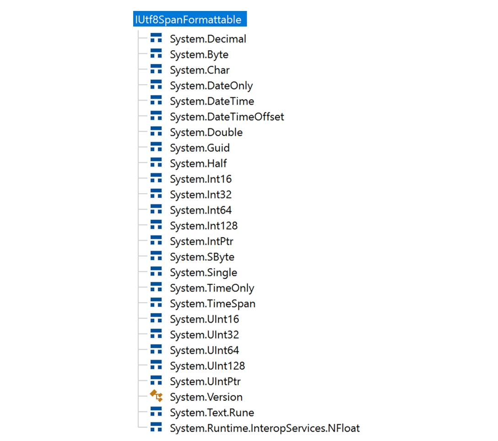

当需要将 `ReadOnlySpan<byte>` 转换为 `System.String` 时，应使用代码清单6-66所示的 `Utf8.ToUtf16` 方法。  

代码清单6-66 将UTF-8格式的 `ReadOnlySpan<byte>` 转换为字符串  

```c#
char[] utf16VersionBuffer = new char[utf8buffer.Length];  
Span<char> utf16Version = utf16VersionBuffer.AsSpan();  
var result = Utf8.ToUtf16(utf8span, utf16Version, out int bRead, out int cWritten);  
if (result == OperationStatus.Done)  
{  
    Console.WriteLine(utf16Version.ToString());  
}  
```

返回结果可能包含 `System.Buffers.OperationStatus` 枚举的四种状态：

- `Done`：操作成功
- `DestinationTooSmall`：目标 `Span<char>` 空间不足，但扩展缓冲区后可重试
- `NeedMoreData` 和 `InvalidData`：输入Span中存在无效字节序列导致处理中断  

此例使用 `ToString` 从 `Span<char>` 获取 `System.String`。与默认实现不同，`Span<T>` 的 `ToString` 会检查 `T` 是否为char类型，若是则基于字符数组构建字符串：  

```c#
if (typeof(T) == typeof(char)) 
{      
    return new string(new System.ReadOnlySpan<char>(ref System.Runtime.CompilerServices.Unsafe.As<T, char>(System.Runtime.CompilerServices.Unsafe.As<T, ref T>(ref _reference)), _length)); 
}  
```

若需将 `System.String` 转为UTF-8编码的 `Span<byte>`，可采用代码清单6-67的 `Utf8.FromUtf16` 方法。  

代码清单6-67 将 `System.String` 转换为UTF-8格式的 `ReadOnlySpan<byte>`

```c#
string utf16String = "1234567890";
var span = utf16String.AsSpan();
byte[] utf8Buffer = new byte[utf16String.Length + 1];
Span<byte> utf8Span = utf8Buffer.AsSpan(); 
var status = Utf8.FromUtf16(span, utf8Span, out var charsRead, out var bytesWritten); 
if (status == System.Buffers.OperationStatus.Done) 
{ 
    // 成功 
}  
```

虽然这些转换看似简单，但需注意UTF-8是变长编码。如代码清单6-68所示，当字符串包含法语重音符号等超出8位表示的字符时，需要多个字节进行编码，此时需调整缓冲区大小。  

代码清单6-68 处理UTF-8编码中的带重音字符  

```c#
string frenchString = "élémentaire à repérer"; 
Console.WriteLine($"'{frenchString}' - {frenchString.Length}"); 
var span = frenchString.AsSpan(); 
byte[] utf8Buffer = new byte[frenchString.Length + 1]; 
Span<byte> utf8Span = utf8Buffer.AsSpan(); 
var status = Utf8.FromUtf16(span, utf8Span, out var charsRead, out var bytesWritten); 
if (status == System.Buffers.OperationStatus.DestinationTooSmall) 
{ 
    // 扩大缓冲区 
    utf8Buffer = new byte[frenchString.Length + frenchString.Length/2 + 1]; 
    utf8Span = utf8Buffer.AsSpan(); 
    status = Utf8.FromUtf16(span, utf8Span, out charsRead, out bytesWritten); 
    Console.WriteLine(status); 
}
```

### 库内部的各种隐藏分配  

由于可能存在多种显式和隐式的分配来源，使用基础类库（BCL）和其他库会带来你未意识到的分配风险。此处不可能涵盖所有情况，因为这需要对常用库进行极其详尽的描述。因此，我们仅探讨BCL中最常见的几类隐藏分配。  

#### System.Generics 集合  

`System.Generic` 命名空间下的一些常用集合可视为数组的封装。以最流行的 `List<T>` 类为例（见代码清单6-69），其内部仅维护一个具有预设大小的数组（若构造函数未指定容量）。当 `List` 增长时（例如调用 `Add` 方法），原数组可能空间不足——此时会创建新数组并复制所有现有元素。  

代码清单6-69. List<T>实现的开头部分（摘自.NET 8源码）  
```csharp
public class List<T> : IList<T>, IList, IReadOnlyList<T>  
{  
    private const int _defaultCapacity = 4;  
    private T[] _items;
    ...
```

因此，`List<T>` 及 `Stack<T>`、`SortedList<T>`、`Queue<T>` 等集合在填充过程中可能需要多次调整底层数组大小。若能预先估算元素数量，应优先使用接受容量参数的构造函数，这些集合会对此进行优化利用。  

#### LINQ——委托  

使用LINQ优雅简洁，短短几行代码即可实现复杂数据操作。但LINQ是C#中分配开销最大的机制之一，其隐藏分配来源包括委托和闭包。由于LINQ方法基于委托实现，你会创建大量委托实例（见代码清单6-70）。  

代码清单6-70. LINQ查询中的委托分配示例  
```csharp
// 为lambda表达式分配委托  
var linq = list.Where(x => x.X > 0);  
return linq;  
```

不过如前所述，当执行的函数无需捕获上下文时，这些委托会被内部缓存，仅分配一次（见代码清单6-71），这是来自编译器的优化。  

代码清单6-71. 代码清单6-70经编译器转换后的委托分配示例  
```csharp
return System.Linq.Enumerable.Where(list, Program.<>c.<>9__5_0 ?? (Program.<>c.<>9__5_0 = new System.Func<SomeClass, bool>(Program.<>c.<>9.<DelegateWithLambda>b__5_0)));  
```

#### LINQ——匿名类型创建 

编写LINQ查询时，容易创建临时匿名类型，这会加剧分配负担。代码清单6-72展示了一个使用类SQL查询语法的简单LINQ示例。  

代码清单6-72. 使用查询语法的简单LINQ示例  
```csharp
public IEnumerable<Double> Main(List<SomeClass> list)  
{  
    var linq = from x in list  
               let s = x.X + x.Y  
               select s;  
    return linq;  
}  
```

需注意 `let` 语句实际会创建匿名临时对象（见代码清单6-73中编译器生成的 `<Main>b__0_0` 方法）。  

代码清单6-73. 编译器转换后的LINQ查询示例  
```csharp
[CompilerGenerated]  
private sealed class <>c  
{  
    internal <>f__AnonymousType0<SomeClass, double> <Main>b__0_0(SomeClass x)  
    {  
        return new <>f__AnonymousType0<SomeClass, double>(x, x.X + x.Y);  
    }  
}  
public IEnumerable<double> Main(List<SomeClass> list)  
{  
    return list.Select(<>c.<>9__0_0 ?? (<>c.<>9__0_0 = <>c.<>9.<Main>b__0_0))  
              .Select(<>c.<>9__0_1 ?? (<>c.<>9__0_1 = <>c.<>9.<Main>b__0_1));  
}  
```

虽然这些临时类型有时能提升代码可读性，但应评估其必要性。本例显然可直接返回求和结果（见代码清单6-74），从而避免额外分配（见代码清单6-75）。  

代码清单6-74. 使用方法语法的LINQ查询示例  
```csharp
public IEnumerable<Double> Main(List<SomeClass> list)  
{  
    var linq = list.Select(x => x.X + x.Y);  
    return linq;  
}  
```

代码清单6-75. 代码清单6-74经编译器转换后的结果  
```csharp
[CompilerGenerated]  
private sealed class <>c  
{  
    internal double <Main>b__0_0(SomeClass x)  
    {  
        return x.X + x.Y;  
    }  
}  
public IEnumerable<double> Main(List<SomeClass> list)  
{  
    return list.Select(<>c.<>9__0_0 ?? (<>c.<>9__0_0 = <>c.<>9.<Main>b__0_0));  
}  
```

#### LINQ——枚举器  

LINQ方法实际上构建了枚举器链——这些负责遍历集合元素的类型通常需要在堆上分配。即使最简单的 `Enumerable.Range` 方法也会分配迭代器（见代码清单6-76）。  

代码清单6-76. 隐藏迭代器分配示例  
```csharp
// 分配System.Linq.Enumerable/'<RangeIterator>d__111'  
var range = Enumerable.Range(0, 100);  
```

`Where`、`Select` 等常用方法同样会分配迭代器。例如 `Where` 方法可能分配以下迭代器之一：  

- `WhereArrayIterator`：操作数组时调用
- `WhereListIterator`：操作List时调用
- `WhereEnumerableIterator`：其他泛型情况

这些迭代器约占48字节（具体大小因.NET版本而异），包含源集合引用、选择委托、线程ID等数据。在单个方法中因LINQ使用多次分配48字节的对象，是否构成性能问题需视具体需求而定。  

LINQ内部虽存在组合迭代器的优化（如合并 `Where` 和 `Select` 操作为 `WhereSelectArrayIterator`），但仍无法避免分配。例如字符串过滤方法（见代码清单6-77）会分配两个迭代器：  
- `WhereArrayIterator`：48字节，短暂存活，很快被下一个替换
- `WhereSelectArrayIterator`：56字节，很大

代码清单6-77. 字符串过滤中的迭代器分配  
```csharp
string[] FilterStrings(string[] inputs, int min, int max, int charIndex)  
{  
    var results = inputs.Where(x => x.Length >= min && x.Length <= max)  
                       .Select(x => x.ToLower());  
    return results.ToArray();  
}  
```

此外还会分配捕获 `min` 和 `max` 的闭包委托。  

若需兼顾性能与LINQ的简洁性，可使用 [roslyn-linq-rewrite](https://github.com/antiufo/roslyn-linq-rewrite) 或 [LinqOptimizer](http://nessos.github.io/
LinqOptimizer) 等库将LINQ查询重写为过程式代码。  

> 注意：.NET生态中可通过F#实现函数式编程。函数式编程的核心原则之一是数据不可变性。F#等语言通过执行不修改原数据、而是返回新数据的函数来实现这一点。这可能会引发性能顾虑——正如C#开发者熟知的字符串不可变性会导致临时对象激增。初看可能认为F#的数据操作会产生大量对象复制，但实际上这需要思维模式的转变。在典型可变场景中，不可变类型的性能可能确实较低（例如向可变 `List<T>` 与不可变集合添加大量元素的对比）。但不可变集合在多线程环境下具有显著优势：对只读数据的无锁安全访问在高竞争场景中的收益，可能远超不可变性本身的开销。因此`System.Collections.Immutable` 命名空间下的不可变集合（如 `ImmutableArray<T>`、`ImmutableList<T>`等）是并行处理的理想选择。关键在于根据问题特性选择合适工具，不必过度关注针对不可变集合频繁状态变更的基准测试——这显然违背了其设计初衷！

### 场景 6-2：内存分配调查  

**描述**：你需要检查一个新创建项目的内存分配情况，以确保没有明显错误。该应用程序的目标是通过解析Gutendex（古登堡计划电子书元数据的Web API）上数十本在线书籍的内容来查找独特的英文单词。在解析书籍内容时，应用程序构建了一个“字典树”（trie）结构来统计遇到的独特单词信息。你首先尝试用 `dotnet-counters` 观察分配速率，发现达到了200MB/s，但由于缺乏参照基准，很难判断这个数值是否合理。唯一的方法是更详细地调查内存分配。  

**分析**：调查.NET应用内存分配的最佳工具之一是使用 `gc-verbose` 配置文件的 `dotnet-trace`。虽然它采用分配采样机制，但其粒度足以覆盖大多数典型场景。更重要的是，正如前文所述，这是一个跨平台工具，无论部署在Windows、Mac还是Linux上都能使用。  

若需要从程序启动就开始追踪分配，可以使用 `dotnet-trace` 的运行应用程序功能。执行以下命令：  

```bash
dotnet-trace collect --profile gc-verbose --show-child-io -- .WordStatsApp\bin\Release\net8.0\WordStatsApp.exe --pages 5
```

让我们借助 PerfView 分析生成的nettrace文件中的内存分配：  

1. 运行 PerfView
2. 在内存组中选择"GC Heap Alloc Ignore Free (Coarse Sampling) Stacks"  
3. 可以忽略可能弹出的"Broken Stacks"对话框  

此时有两种主要分析路径可选：  

1. 获取分配情况的宏观视图
   - 在"By Name"标签页中，按Exc列降序排序——这会快速显示影响最大的分配来源（见图6-22）。  

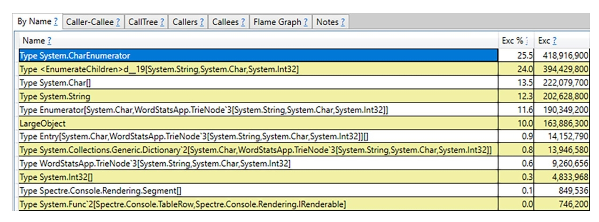

图6-22 示例书籍统计应用中的分配宏观视图

但类型信息并非唯一可用的数据，聚合的分配来源（调用堆栈）同样重要。例如要调查顶部 `System.CharEnumerator` 类型的分配位置，可在上下文菜单中选择"Goto >> Goto Item in Callers"。  

**调查技巧**：

- 对于无名模块（以 `?!` 结尾，如 `<<microsoft.codeanalysis.csharp!?>>`），可通过上下文菜单的"Lookup Symbols"尝试加载符号
- 使用"Grouping >> Group Module"可按模块分组

需要对频繁创建的对象进行彻底分析。这个过程相当繁琐，但可以通过比较PerfView拍摄的堆快照来定位值得分析的可疑对象。同时要警惕本章提到的各种典型隐藏分配来源。  

2. 调查特定方法的内存分配
   - 在"By Name"标签页中，在GroupPats选择"[No grouping]"取消所有分组以获取更多细节  
   - 在Find文本框输入目标方法名（例如 `TryNormalize`）  
   - 点击上下文菜单的"Goto >> Goto Item in Callees"——将显示该方法及其所有被调用者产生的内存分配（见图6-23）  

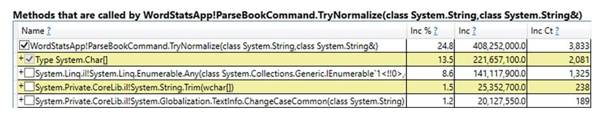

图6-23. `TryNormalize` 方法及其所有依赖方法调用产生的内存分配

可以看到 `TryNormalize` 方法产生了大量内存分配！仅 `Char[]` 数组就分配了超过200MB，而通过调用的 `Any` 和 `Trim` 方法产生的分配量更大。阅读本章后，这些（隐藏）分配来源在代码中应该非常明显（见代码清单6-78）。这显然只是展示你能获取多详细信息的示例。在实际调查中，你会更关注自己代码产生的分配，因此将其他外部模块分组查看是明智之举。

代码清单6-78 `TryNormalize`方法

```csharp
private static bool TryNormalize(string word, out string result) 
{
    result = word.ToLowerInvariant().Trim(' ', '_', '[', ']');
    if (result.Any(c => !char.IsLetter(c))) return false;
    return true;
}
```

分析结果时，你至少还会发现两个可疑的常见分配类型：`<EnumerateChildren>d__19[String,Char,Int32]`和`Enumerator[Char,TrieNode3[String,Char,Int32]]`。消除所有这些分配将是个很好的练习，建议你大胆尝试本书代码库提供的 `WordStatsApp` 进行实验。

> 在.NET Core 3.1之前，Linux平台的内存分配调查非常困难。幸运的是，现在我们有了跨平台CLI诊断工具，你可以在Linux或Mac上使用 `dotnet-trace`，然后在PerfView或Visual Studio中分析结果。此外，dotMemory等商业工具现在也支持非Windows环境。
>

请注意，你也可以在Visual Studio中查看nettrace会话文件（通过“文件→打开→文件...”菜单），这将提供多种分析视图。目前你最需要关注的是“分配(Allocations)”标签页（见图6-24）。

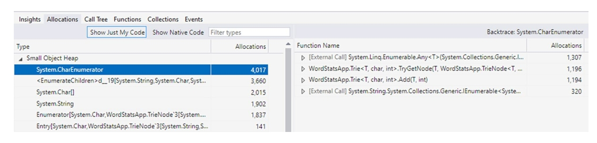

图6-24 在Visual Studio中打开的dotnet-trace会话文件

`JetBrains dotMemory` 同样是调查内存分配的绝佳工具。只需配置应用程序通过 `dotMemory` 启动，并记得选择采样(Sampled)或完整(Full)分配数据收集模式（本地环境推荐使用Full模式）。记录会话后，你将看到内存使用曲线图。可以选择任意GC之间的时间段，查看顶部显示的分配与垃圾回收统计信息（见图6-25）。如图所示，在选定时间段内GC耗时近5.3秒，分配对象总量超过1.5GB。

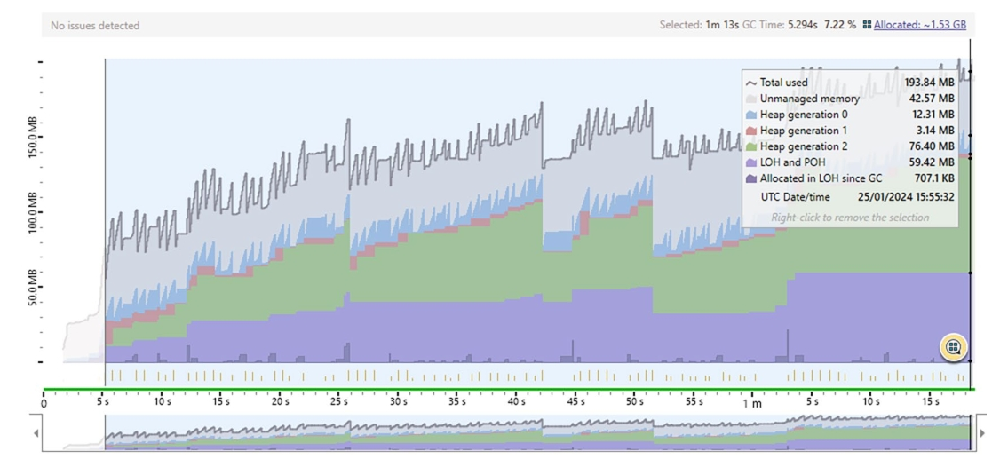

图 6-25 JetBrains dotMemory 性能分析会话

点击"Allocated"标签后，你将看到与PerfView或Visual Studio类似的详细分析界面（见图6-26）。

选择使用dotnet-trace+PerfView、Visual Studio还是dotMemory更多取决于个人偏好。我们建议您尝试所有这些工具以形成自己的判断。  

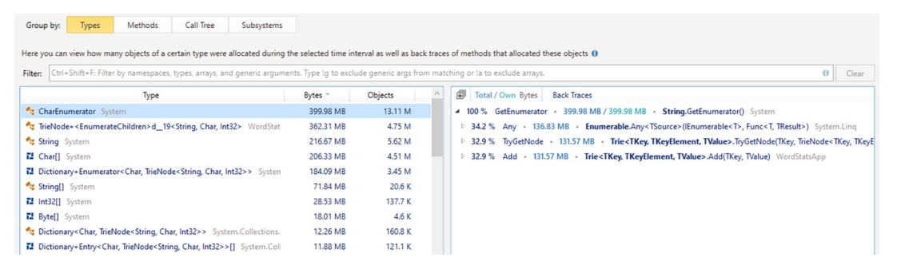

图6-26. JetBrains dotMemory分配分析界面  

### 场景6-3 - Azure函数  

**描述**：Azure函数按每秒资源消耗量（以GB-s为单位）和执行次数计费。微软官网的定价说明指出：“函数内存使用量按最接近的128MB向上取整（最高1536MB），执行时间按最接近1毫秒向上取整。单次函数执行的最低内存和时间为128MB和100毫秒。”这意味着每次函数调用至少消耗0.0125 GB-s（100毫秒×128MB=0.1秒×0.125GB）。此外每月有40万GB-s和100万次执行的免费额度。

考虑到这种定价模式，显然应该尽可能减少内存使用。如果Azure函数存在内存浪费，就可能超出免费额度。每当内存使用超过128MB阈值时，成本就会成倍增加。在.NET生态中，很少有场景能如此直接地将内存使用转化为真金白银的开支。  

**分析**：Azure通过Application Insights提供函数资源消耗监控功能。可以追踪所谓的“函数执行单元”，其计量单位为MB-ms（需换算为GB-s）。虽然能通过该指标监控成本，但除了Application Insights提供的基础数据外，无法获取更深层次的内存使用洞察。因此最佳实践是在开发环境中进行内存分析和优化。本地运行函数时，分配调查流程与场景6-2完全相同。  

> 注意：若需追踪程序内部分配速率，最简单的解决方案是使用 `GC.GetAllocatedBytesForCurrentThread` 静态方法。该方法能准确获取当前线程生命周期内已分配的字节数。  
>

## 本章总结  

本章深入剖析了.NET中对象的创建机制。您现在应该充分认识到：虽然对象分配可能非常快速，但也可能触发包括垃圾回收在内的复杂逻辑。  

前半章节揭示了.NET分配器的实现细节，展现了其为追求极致性能所做的复杂设计。这些设计不仅使对象创建极其高效，也让您从某些角度理解了内存管理主题的复杂性以及CLR的优秀实现。  

后半章节重点探讨了高效内存管理中最关键的优化手段——避免分配。通过减少分配既能降低直接成本，也能减轻GC负担。我们提供了虽不全面但相当详尽的潜在分配来源清单，并尽可能给出了规避方案。  

本章还包含三个解决内存分配问题的实际场景分析。这些案例与避免分配的章节相辅相成，让您能从更实用的诊断角度理解对象创建这一主题。  

### 规则14 - 避免在热路径上进行堆分配  

**理论依据**：虽然常说.NET中的分配成本低廉，但本章已证明这种说法并非绝对。您需要充分认知分配操作可能带来的代价——性能敏感场景下，它们可能引发显著开销。每次分配都意味着潜在的内存流动、操作系统交互甚至触发垃圾回收。分配对象越多，GC负担就越重。因此在性能关键代码路径上，最优解决方案就是避免分配。  

**实施方法**：避免分配的方案与可能发生分配的场景一样多样，本章“避免分配”一节已详细阐述。有些分配是显性的（如您主动创建的实例），可通过对象池或值类型消除；有些则是隐性的（如各类库和方法暗中产生的分配），需要先识别后处理。建议掌握常见隐藏分配模式，并借助 Clr Heap Allocation Analyzer 等IDE扩展工具或诊断工具进行追踪。  

**相关场景**：场景6-2、6-3  

### 规则15 - 避免过量的大对象堆(UOH)分配  

**理论依据**：.NET中的分配本就不总是低成本操作，而大对象堆(LOH)分配代价更为高昂。由于LOH分配频率低且对象体积大，其设计上不会预分配空间，因此内存清零操作可能成为主要开销。若频繁使用大型对象，建议采用可复用对象池机制，这不仅能稳定内存使用、降低分配开销，还能减轻GC工作负担。  

**实施方法**：频繁分配大对象通常意味着实际需求存在，直接消除分配往往不现实。受栈空间限制和复制成本影响，使用值类型也非可行方案。最佳实践是采用对象池机制（参见本章“避免分配”章节相关内容）。  

### 规则16 - 适时采用栈分配  

**理论依据**：类(Class)虽是.NET的基础数据类型，初学C#时就被作为默认构建块，但结构体(Struct)不应沦为被遗忘的冷门知识。结构体具有独特价值：更好的内存局部性、避免堆分配、以及编译器和JIT可能实施的深度优化。  

**实施方法**：建议将结构体纳入日常工具箱。实现新功能时，先思考是否真的需要类？简单结构体是否足够？是否需要对象集合？或许结构体数组就能满足需求？不必过度担心结构体复制成本——善用C#强大的按引用传递机制。当然，这种优化应集中在影响感知性能或资源利用的关键代码路径上，而非简单场景的过度设计。  
