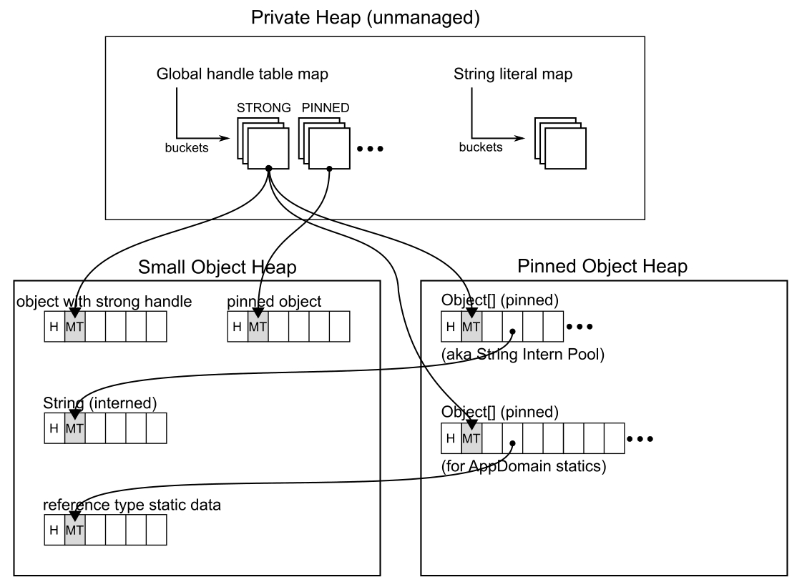

# 垃圾回收——标记阶段

在上一章节中，你已经了解了垃圾回收（GC）的一些通用知识，例如触发时机以及如何决定回收哪个代际。现在让我们深入探讨垃圾回收的第一个主要阶段——标记阶段（Mark phase）的具体细节。

此时GC已确定要回收哪些代际的对象，接下来需要探查哪些对象可以被回收。如前所述，公共语言运行时（CLR）实现的是追踪式垃圾回收器。它会从各种根对象（roots）出发，递归遍历当前程序状态下的整个对象图。所有无法从任何根对象到达的对象都被视为“死亡对象”（可回顾图1-15）。

本章讨论的非并发GC在标记阶段开始时，会挂起所有托管线程。这确保应用程序不会在此期间更新托管堆（Managed Heap），使得GC能够独占性地安全遍历堆内存，搜索所有可达对象。

## 对象遍历与标记

尽管存在多种不同的根对象，但查找可达对象的机制是共通的。给定特定根地址后，遍历例程会执行以下步骤：

- **转换为托管对象有效地址**——若遇到所谓的“内部指针”（即不指向对象起始位置，而是指向对象内部某处，通常是数组元素或嵌套在类中的结构体引用），需将其转换为正确的托管对象起始地址。
- **设置固定标志**——如果对象需要固定（pinned），则在其对象头中设置特定位。GC通过查看固定句柄表（pinned handle table）或栈扫描期间报告的标志来识别固定对象。注意：位于POH（固定对象堆）中的对象始终被视为固定对象，无需此步骤。
- **通过对象引用开始遍历**——借助类型信息（存储在 `MethodTable` 中），GC知道哪些偏移量（字段）代表外部引用。它会以深度优先的方式，通过维护待访问对象集合（称为标记栈(mark stack)，采用压栈/弹栈数据结构组织）来遍历这些引用。当访问对象时：
  - 若已访问过或属于更老代际，则直接跳过。
  - 若未访问过，则进行标记（通过在其 `MethodTable` 指针中设置特定位实现）。
  - 将其外部引用加入标记栈。

当标记栈中没有更多待访问对象时，遍历过程结束。

> 深度优先图遍历的传统方法基于递归调用，但难以保证不会发生栈溢出。CLR采用更安全可靠的迭代方案——基于可动态扩展的堆分配式栈结构（如标记栈），这种设计既避免了递归风险，又能按需增长。

需注意：固定标志和标记位都是在标记阶段设置，并在计划阶段（Plan phase）清除。在托管线程正常运行期间，仅通过查看对象头或MT指针无法判断对象是否被固定或标记。

> 若想深入研究.NET源码实现，可从 `GCHeap::Promote` 方法入手。该方法在需要时固定对象，并通过调用 `gc_heap::mark_object_simple` 进行标记，其中 `go_through_object_clr` 宏负责遍历对象的所有引用。核心逻辑在 `gc_heap::mark_object_simple1` 方法中实现，该方法利用 `mark_stack_array` 字段指向的辅助栈结构（通过 `mark_stack_bos` 和 `mark_stack_tos` 索引字段分别标识栈底和栈顶）完成深度优先对象图遍历。

了解标记过程的整体结构后，让我们详细分析应用程序中可能存在的各类GC根对象。这些知识对理解.NET内存管理至关重要，因为根对象可能持有整个可达对象图，进而引发常见问题：

- **内存占用过大**：某些根对象可能导致远超预期的对象保持可达状态，大量对象本身就会给GC带来开销。
- **内存泄漏**：更严重的是，根对象可能使其持有的对象图持续增长，导致内存使用量不断上升。

## 局部变量根

局部变量是最常见的根之一。其中一些是临时性的（如代码清单8-1所示），另一些则与应用程序生命周期共存（如代码清单8-2所示）。我们在代码中会不断创建各种局部变量。

代码清单8-1 极短生命周期的局部变量 `fullPath` 示例

```csharp
public static void Delete(string path)  
{  
    string fullPath = Path.GetFullPath(path);  
    FileSystem.Current.DeleteFile(fullPath);  
}  
```

代码清单8-2 极长生命周期的局部变量 `host` 示例（该变量存在于整个自托管ASP.NET应用生命周期）

```csharp
public static void Main(string[] args)  
{  
    var host = BuildWebHost(args);  
    host.Run();  
}  
```

这些变量通常由开发者显式创建（如代码清单8-1和8-2所示），但也经常被隐式生成（见代码清单8-3）。

代码清单8-3 隐式创建的极长生命周期局部变量 `host` 示例（实际与代码清单8-2逻辑相同）

```csharp
public static void Main(string[] args)  
{  
    BuildWebHost(args).Run();  
}  
```

局部变量可能代表值类型（如基本类型或结构体），也可能持有类型值的引用（请回顾第4章讨论的“引用”与“引用类型数据”重要区别）。本节主要讨论堆上分配对象的垃圾回收机制，因此我们将重点分析持有引用的局部变量（无论其是典型的引用类型如类，还是装箱后的值类型）。

### 局部变量存储

当将托管对象引用赋值给局部变量时，便创建了一个根。如代码清单8-4所示，新建的 `SomeClass` 类型实例引用被赋给局部变量c。自此之后，该实例应被视为可达对象。由于变量 `c` 在整个 `Helper` 方法内持续使用，至少在该方法结束前，该对象不会被垃圾回收。

代码清单8-4 持有引用的局部变量示例

```csharp
private int Helper(SomeData data)  
{  
    SomeClass c = new SomeClass();  
    c.Calculate(data);  
    return c.Result;  
}  
```

通常可用第1章图1-10来形象说明此场景：分配器在托管堆创建对象实例，而局部变量 `c` 存储在 `Helper` 方法激活帧的栈中。但如第4章所述，由于JIT编译器的卓越优化，局部变量也可能存入CPU寄存器。这引出一个值得反复强调的重要事实——作为根的局部变量可能存储在栈或寄存器中，JIT编译器会竭尽所能优化寄存器和栈槽的分配。

### 栈根

前文所述的根称为栈根。.NET官方文档《垃圾回收基础》章节将其描述为“由JIT编译器和栈遍历器提供的栈变量”。这个描述可能引发困惑——实际上它涉及当前运行方法中的所有局部变量，以及调用栈中所有方法的局部变量。“栈根”中的“栈”正是指调用栈，但需牢记这些根可能实际存在于栈或寄存器中。

当EE暂停时，必须遍历所有托管线程的调用栈以查找可能成为栈根的局部变量，这项工作由栈遍历器完成。若当前调用栈中某方法的局部变量持有托管对象引用，该对象即被视为存活对象，并成为对象图遍历的起点。

但判断特定指令地址处是否存在局部变量引用并非易事。如第7章“暂停”章节所述，线程只能在安全点暂停——对于完全可中断方法包含几乎所有指令，部分可中断方法则仅含其他方法调用。因此GC需要存储每个方法安全点处存活“栈根”（包括栈和寄存器槽位）的信息，这正是前文提到的GCInfo（GC info）的实质。

> ### 槽位 (Slots)
>
> 一般而言，**“槽位 (slots)” 指的是在方法执行期间，用来存储局部变量（特别是那些指向托管堆上对象的引用）的位置。**
>
> 这些“槽位”主要可以分为两类：
>
> 1. **CPU 寄存器 (CPU Register Slots)**：
>    - 这是JIT编译器最优先选择的存储位置，因为CPU寄存器访问速度极快。
>    - 当GCInfo显示 `存活槽位：rax` 时，意味着在某个特定的执行点（GC安全点），`rax` 寄存器中存储着一个仍然被认为是“存活”的对象的引用（即这个对象不能被回收）。
>    - 当显示 `无存活槽位` 时，意味着在那个时刻，所有被GC追踪的、用于存储局部变量引用的CPU寄存器槽位中，都没有存活的对象引用。
> 2. **栈槽位 (Stack Slots)**：
>    - 如果CPU寄存器不够用，或者因为其他原因（比如变量地址需要被获取），JIT编译器会把局部变量存储在线程的调用栈上。
>    - 这些栈槽位通常表示为相对于栈指针 (`rsp`) 或帧指针 (`rbp`) 的偏移量。
>    - GCInfo需要追踪这些栈上的位置，以确定它们是否也持有存活对象的引用。
>
> 这些槽位中存储的对托管对象的引用，是垃圾回收器（GC）判断对象是否“存活”的起点之一，它们被称为**“根 (roots)”**。如果一个对象能从任何一个“根”（比如一个存活槽位中的引用）追溯到，那么这个对象就是存活的，不能被回收。GCInfo的核心作用之一就是告诉GC在某个时刻，哪些槽位（寄存器或栈位置）里有需要被认为是根的引用。

### 词法作用域

在C#中，局部变量受词法作用域约束。简言之，它定义了变量的可见代码区域（包括所有嵌套代码块等）。以代码清单8-5为例，其中定义了三个局部变量：

- `c1`：表示 `ClassOne` 托管对象引用的局部变量，其词法作用域覆盖整个 `LexicalScopeExample` 方法（因声明在方法最外层作用域）
- `c2`：表示 `ClassTwo` 托管对象引用的局部变量，其词法作用域仅限于条件语句块
- `data`：存储整型基元值的局部变量

代码清单8-5 不同词法作用域的局部变量示例

```csharp
private int LexicalScopeExample(int value)  
{  
    ClassOne c1 = new ClassOne();  
    if (c1.Check())  
    {  
        ClassTwo c2 = new ClassTwo();  
        int data = c2.CalculateSomething(value);  
        DoSomeLongRunningCall(data);  
        return 1;  
    }  
    return 0;  
}  
```

接下来将深入探讨方法内创建对象的可达性与其词法作用域的关系。

### 存活栈根与词法作用域

在考虑由局部变量表示的对象的可达性时，一个非常直观的解决方案立即浮现在脑海中——它应该与局部变量的词法作用域相关联。因此，以代码清单8-5为例：

- `ClassOne` 的实例在方法的整个生命周期内都应该是可达的——从创建时刻（第3行）直到方法结束（第11行）。换句话说，局部变量 `c1` 从第3行到第11行构成了一个存活栈根。
- `ClassTwo` 的实例可能仅在条件语句块内可达——从创建时刻（第6行）直到该代码块结束（第9行）。换句话说，局部变量 `c2` 从第6行到第9行构成了一个存活栈根。

采用这种方法，代码清单8-5中 `LexicalScopeExample` 方法的GCInfo可以定义如下：

- 完全可中断的情况可以想象为代码清单8-6——每一行都有自己的信息（当然，实际GCInfo的粒度会是单独的汇编指令，但为了简洁起见，我们限制在C#代码行级别）。
- 部分可中断的情况则可以想象为代码清单8-7——信息仅存储在包含方法调用的代码行（包括分配/构造函数调用）。

代码清单8-6. 代码清单8-5中 `LexicalScopeExample` 方法的GCInfo可视化（完全可中断情况）。每行列出了存活栈根

```
无存活槽位
无存活槽位
c1的存活槽位
c1的存活槽位
c1的存活槽位
c1的存活槽位，c2的存活槽位
c1的存活槽位，c2的存活槽位
c1的存活槽位，c2的存活槽位
c1的存活槽位，c2的存活槽位
c1的存活槽位
c1的存活槽位
c2 无存活槽位
```

代码清单8-7. 代码清单8-5中 `LexicalScopeExample` 方法的GCInfo可视化（部分可中断情况）。每行列出了存活栈根

```
c1的存活槽位
c1的存活槽位
c1的存活槽位，c2的存活槽位
c1的存活槽位，c2的存活槽位
c1的存活槽位，c2的存活槽位
```

GCInfo存储的是关于JIT编译后汇编代码的信息。因此，它显然不操作特定的C#变量名，而是操作特定的栈槽位或CPU寄存器槽位。例如，代码清单8-6更现实的GCInfo表示可能如代码清单8-8所示（假设JIT编译器已将寄存器 `rax` 分配给局部变量 `c1`，`rbx` 分配给 `c2`）。

代码清单8-8. 代码清单8-5中 `LexicalScopeExample` 方法的GCInfo可视化（JIT汇编级别，完全可中断情况）

```
无存活槽位
无存活槽位
存活槽位：rax
存活槽位：rax
存活槽位：rax
存活槽位：rax，rbx
存活槽位：rax，rbx
存活槽位：rax，rbx
存活槽位：rax，rbx
存活槽位：rax
存活槽位：rax
无存活槽位
```

假设由于GC，运行时挂起了一个当前正在执行 `LexicalScopeExample` 方法第7行的线程（假设该方法已以完全可中断方式JIT编译）。借助代码清单8-8所示的GCInfo，GC立即知道CPU寄存器 `rax` 和 `rbx` 中存在存活栈根。标记过程可以从这些寄存器中存储的地址开始。

这种方法完全有效，能得出正确的结果。引用类型局部变量的词法作用域显然会影响引用类型对象的可达性。在Debug模式下编译应用程序时也采用相同的方法。JIT编译器将所有局部变量的可达性扩展到其词法作用域结束。这对于调试目的非常有用（例如在变量不再被代码引用后仍能检查其值）。但在Release模式下，可以采取更多措施来优化内存使用。

### 实时栈根与激进根回收

再次查看代码清单8-5时，您可能会注意到词法作用域并非表示可达性的最优方式。局部变量的词法作用域允许其被使用，并不意味着它实际被使用。从这个角度审视 `LexicalScopeExample` 方法时，可以发现：

- `ClassOne` 的实例在第5行之后就不再被使用——因此尽管变量 `c1` 的词法作用域延续到第11行，但它作为实时栈根的有效范围仅在第3至4行
- 同理，`ClassTwo` 的实例仅在第6和7行被使用——因此它作为实时栈根的有效范围仅限于这两行

换言之，C#编译器可以分析每个对象（通过局部变量）的实际使用情况并保存这些信息。随后JIT编译器在槽位分配（更短的对象生命周期允许重用宝贵的CPU寄存器）和生成GCInfo时会利用这些数据，从而产生更高效的GCInfo（见代码清单8-9）。

代码清单8-9展示了代码清单8-5中 `LexicalScopeExample` 方法在完全可中断情况下使用激进根回收技术时的GCInfo可视化：

```
无存活槽位
无存活槽位
存活槽位：rax
存活槽位：rax
无存活槽位
存活槽位：rax
存活槽位：rax
无存活槽位
无存活槽位
无存活槽位
无存活槽位
无存活槽位
```

这种新型GCInfo使得方法执行大部分时间都不存在实时栈根。当对象不再需要时，会立即被视为无法通过局部变量访问。这种积极回收对象的机制称为激进根回收（eager root collection），它能通过将对象生命周期压缩至必需的最小值来提升内存使用效率，同时允许更密集地重用CPU寄存器（如代码清单8-9中重复使用 `rax` 寄存器）。对于部分可中断方法，生成的GCInfo可能更精简（见代码清单8-10）。

代码清单8-10展示了代码清单8-5中 `LexicalScopeExample` 方法在部分可中断情况下使用激进根回收时的可能GCInfo：

```
3 存活槽位：rax
4 存活槽位：rax
6 存活槽位：rax
7 存活槽位：rax
```

> 本节所有示例仅使用了CPU寄存器槽位，这是典型场景——因为JIT编译器会优先使用快速的CPU寄存器而非缓慢的栈槽位。某些情况下它可能选择使用栈槽位，但这不会改变本文描述的机制。栈槽位表示为 `rsp` 或 `rbp` 地址的偏移量（取决于方法使用哪个寄存器），因此GCInfo还会为每个安全点存储当前 `rsp` 和 `rbp` 寄存器值。此外，x64运行时中的JIT更倾向于使用寄存器，因为x64平台新增了8个通用寄存器（`r8` 至 `r15`）。

为便于说明核心概念，前文示例中的对象生命周期已做简化处理。后文将揭示代码清单8-5中方法实际生成的GCInfo。

当线程被挂起时，其当前上下文（包括寄存器）会被保存。例如当 `LexicalScopeExample` 方法在第6行被挂起时，根据GCInfo，将从 `rax` 寄存器（存储在上下文中）获取一个实时栈根地址。通过逐帧检查调用栈（并借助激活帧中的信息恢复正确的线程上下文——如寄存器的先前值），所有方法都会重复这个逻辑。

当代码在Release模式下编译且方法已升级至Tier1时，JIT会启用激进根回收。这有时会导致一些令人惊讶甚至误导的行为，相关问题通常以“Debug模式下我的代码执行X，但Release模式下执行Y……”开头。

在大多数情况下（见代码清单8-11），无需通过将局部变量设为null来“通知”GC不再使用某个对象——即使在长时间运行调用前也是如此。得益于激进根回收技术，编译器和JIT能精准识别变量实际使用范围，无需显式声明。代码清单8-5与8-11在这方面完全等效，它们会产生相同的GCInfo和汇编代码（JIT首先会优化掉那些冗余的null赋值）。

代码清单8-11展示了一个不必要的null赋值示例：

```c#
private int LexicalScopeExample(int value)
{
    ClassOne c1 = new ClassOne();
    if (c1.Check())
    {
        c1 = null;
        ClassTwo c2 = new ClassTwo();
        int data = c2.CalculateSomething(value);
        c2 = null;
        DoSomeLongRunningCall(data);
        return 1;
    }
    return 0;
}
```

> 唯一例外是所谓的非跟踪变量（后文详述），这类变量在整个方法生命周期内都被视为存活。因此对于关键资源，您可能需要通过将局部变量设为null来辅助JIT编译器。

其次，当应用于具有副作用方法的对象时，激进根回收可能导致异常结果。您可能期望特定对象的生命周期基于其产生副作用的词法作用域，但实际上其生命周期与词法作用域无关。典型场景包括使用各类计时器、同步原语（如Mutex）或系统资源访问（如文件）。

代码清单8-12展示了不了解激进根回收机制就难以解释的典型行为。直觉上您可能期望 `Timer` 对象的生命周期与局部变量 `timer` 的词法作用域匹配，因此程序应持续打印当前时间直到按键。这确实是Debug构建中的表现，但在Release构建中激进根回收开始生效——由于 `Timer` 对象在第3行后未被使用，JIT编译器会在GCInfo中反映这点，使 `Timer` 对象在第3行后立即变为不可达！如果此后发生GC，它将被回收（计时器停止滴答，不再打印时间）。根据GC处理速度，计时器可能仍有几次打印机会。

```c#
static void Main(string[] args)
{
    Timer timer = new Timer((obj) => Console.WriteLine(DateTime.Now.ToString()), null, 0, 100);
    Console.WriteLine("Hello World!");
    GC.Collect(); // simulate GC happening here
    Console.ReadLine();
}

Program result:
Hello World!
12/18/2023 7:49:52 PM
```

请注意，在我们的示例中，为了产生可复现的结果，我们显式调用了垃圾回收（GC）。在实际场景中，这类GC通常由其他线程的内存分配触发。

此外，激进的根引用回收机制可能导致对象在其方法尚未执行完毕时就被判定为不可达（前提是该方法的执行过程中未引用`this`）。代码清单8-13模拟了这种场景：当 `DoSomething` 方法正在执行时，发生了垃圾回收（再次强调，这里显式调用GC仅用于演示）。同时，`SomeClass` 类实现了终结器（第12章将详细讲解终结机制），该终结器会在对象被垃圾回收后执行。

代码清单8-13 因过早回收根引用导致的异常对象行为

```csharp
static void Main(string[] args) 
{ 
    SomeClass sc = new SomeClass(); 
    sc.DoSomething("Hello world!"); 
    Console.ReadKey(); 
}

class SomeClass 
{ 
    public void DoSomething(string msg) 
    { 
        GC.Collect(); 
        Console.WriteLine(msg); 
    }
    ~SomeClass() 
    { 
        Console.WriteLine("Killing..."); 
    } 
}

程序输出：
Killing...
Hello world!
```

令人惊讶的是，输出结果表明对象在其方法完全执行前就被销毁。这是因为 `DoSomething` 方法没有引用`this`，实际上它根本不需要持有对象实例！

更极端的情况下，即使对象方法正在执行且代码中引用了`this`，激进的根引用回收仍可能回收该对象。代码清单8-14模拟了这种场景：尽管 `DoSomethingElse` 方法引用了 `this`，但 `SomeClass` 实例仍会像前例那样被提前回收。

代码清单8-14 因过早回收根引用导致的异常对象行为

```csharp
static void Main(string[] args) 
{ 
    SomeClass sc = new SomeClass() { Field = new Random().Next() }; 
    sc.DoSomethingElse(); 
    Console.ReadKey(); 
}

class SomeClass 
{ 
    public int Field; 
    public void DoSomethingElse() 
    { 
        Console.WriteLine(this.Field.ToString()); 
        GC.Collect(); 
        Console.WriteLine("Am I dead?"); 
    }
    ~SomeClass() 
    { 
        Console.WriteLine("Killing..."); 
    } 
}


程序输出：
615323
Killing...
Am I dead?
```

需要强调的是，这类优化非常普遍，因为JIT编译器会极力缩短局部变量的生命周期。大多数情况下，JIT编译器能安全运用该技术而不影响程序逻辑。由此引发的异常行为通常仅见于那些生命周期与副作用强关联的对象。

自.NET Core 3.0起，分层编译默认启用。其中Tier0层优化不会执行激进根引用回收，因此直接运行上述代码可能得不到相同结果。您可以通过在项目文件中添加 `<TieredCompilation>false</TieredCompilation>` 禁用分层编译来复现异常行为，或使用 `[MethodImpl(MethodImplOptions.AggressiveOptimization)]` 特性将方法直接提升至最高优化层级。

若需精确控制对象生命周期，可参考代码清单8-12的场景——假设您确实需要计时器在整个应用生命周期内运行。.NET为此提供了 `GC.KeepAlive` 方法（见代码清单8-15）。

代码清单8-15 使用 `GC.KeepAlive` 修复因过早回收导致的 `Timer` 异常行为（基于代码清单8-16）

```csharp
static void Main(string[] args) 
{ 
    Timer timer = new Timer((obj) => Console.WriteLine(DateTime.Now.ToString()), null, 0, 100); 
    Console.WriteLine("Hello World!"); 
    GC.Collect(); // 模拟此时发生GC
    Console.ReadLine(); 
    GC.KeepAlive(timer); 
}
```

`GC.KeepAlive` 通过简单技巧延长栈根生命周期。其实现代码为空（见代码清单8-16），但标记了 `[MethodImpl(MethodImplOptions.NoInlining)]` 特性阻止方法内联，从而强制编译器将参数视为在用状态（即可达状态）。因此调用 `GC.KeepAlive` 会延长目标对象的生命周期至该方法调用点。

即便空方法也可能产生开销，为防止JIT优化消除调用，.NET 5起 `KeepAlive` 方法被设为JIT内置方法以特殊处理。

代码清单8-16 BCL中 `GC.KeepAlive` 的实现

```csharp
[MethodImplAttribute(MethodImplOptions.NoInlining)] // 禁用优化
[Intrinsic] 
public static void KeepAlive(Object obj) 
{ 
}
```

> 注意：多数具有副作用的对象（如Mutex或Timer）都实现了 `IDisposable` 接口。因此在Main方法末尾调用 `timer.Dispose()` （或使用using语句）即可适当延长生命周期，无需调用 `GC.KeepAlive`。但了解激进回收的潜在问题仍很有必要。

> **“激进根回收 (eager root collection)” 是一种优化技术，目的是让对象尽可能早地符合被垃圾回收的条件，从而提高内存使用效率和CPU寄存器的重用率。**
>
> 它的核心思想是：**一个局部变量对对象的引用，其“存活”期不应该由该变量的词法作用域（lexical scope，即变量在代码中声明的有效范围）决定，而应该由该变量的“实际最后一次使用”来决定。**
>
> **激进根回收的优化**：
>
> - **C#编译器分析**：C#编译器会分析代码，精确地找出每个局部变量引用的对象实际上在代码中最后一次被读取或使用是在哪里。
> - **JIT编译器利用信息**：JIT编译器在生成机器码和GCInfo时，会利用C#编译器提供的这个“最后使用点”信息。
> - **更精确的GCInfo**：生成的GCInfo会反映出，一旦一个局部变量（比如 `c1`）在代码中完成了它的最后一次使用（比如 `c1.Check()` 之后 `c1` 再也没有被用到），那么即使 `c1` 这个变量名在词法上仍然有效，GCInfo也会告诉垃圾回收器：“这个槽位（存储 `c1` 引用的地方，比如 `rax` 寄存器）里的引用不再是‘实时栈根’了。”
> - **结果**：对象在其实际不再被程序逻辑需要后，会**立即**（从GC的角度看）变为不可达（如果没有其他根引用它的话），即使持有它的局部变量在词法上还“活着”。

### GCInfo

目前展示的GCInfo可视化内容（清单8-6至8-10）仅是简化版本。实际上，GCInfo是一种高度紧凑的二进制数据块。虽然其存储的具体实现细节很有趣，但与我们的目标无关。其核心设计理念与之前展示的内容保持一致。

若需获取真实的GCInfo数据进行诊断，操作过程并不简单。目前没有便捷工具可直接实现这一需求，但存在两种可行方案：首要方案是使用搭载SOS扩展的WinDbg调试器（本章将采用该方法）；其次是通过运行时内置的JIT日志功能——在启用特定标志时，该功能可同步输出GCInfo，但此方案较为复杂，因为它要求本地构建Debug版本的.NET运行时。

需要重点注意的是：分层编译（Tiered Compilation）会影响激进根收集（eager root collection）行为。在实验环境中若要获取完全优化的JIT编译代码，您需要彻底禁用分层编译，或者通过多次调用目标方法（或使用先前介绍的 `AggressiveOptimization` 属性修饰）确保该方法被提升至优化层级Tier 1。

在WinDbg中附加到目标进程（可以是运行中的进程或内存转储文件）后，首先需要定位目标方法的 `MethodDesc`（如清单8-17所示）：

清单8-17. 在加载SOS扩展的WinDbg中查找托管堆

> !name2ee CoreCLR.CollectScenarios.dll!CoreCLR.CollectScenarios.Scenarios.EagerRootCollection.LexicalScopeExample
> Module: 00007ffbadf6c158
> Assembly: CoreCLR.CollectScenarios.dll
> Token: 0000000006000002
> MethodDesc: 00007ffbadf6e130
> Name: CoreCLR.CollectScenarios.dll!CoreCLR.CollectScenarios.Scenarios.EagerRootCollection.LexicalScopeExample(Int32)
>  JITTED Code Address: 00007ffbadee1ac0

随后通过命令 `!gcinfo` 查看详细GCInfo（见清单8-18）。现在让我们用此命令分析清单8-5中的 `LexicalScopeExample` 方法。该命令输出包含选定方法的各类通用信息（如返回类型种类、是否使用可变数量参数等）。更重要的是，它会列出所有安全点（safe points）及每个安全点处存在的存活栈根（live stack roots）（如果有的话），同时提供各安全点在方法内部的指令偏移量。

清单8-18. `LexicalScopeExample` 方法的 `!gcinfo` 命令输出GCInfo

```
> !gcinfo 00007ffbadf6e130
entry point 00007FFBADEE1AC0
Normal JIT generated code
GC info 00007FFBADF9E130
Pointer table:
Prolog size: 0
Security object: <none>
GS cookie: <none>
PSPSym: <none>
Generics inst context: <none>
PSP slot: <none>
GenericInst slot: <none>
Varargs: 0
Frame pointer: <none>
Wants Report Only Leaf: 0
Size of parameter area: 0
Return Kind: Scalar
Code size: 58
00000016 is a safepoint:
0000001f is a safepoint:
00000032 is a safepoint:
0000003d is a safepoint:
00000045 is a safepoint:
```

清单8-18中 `LexicalScopeExample` 方法的GCInfo显示生成了五个安全点，这表明该方法是以部分可中断（partially interruptible）方式完成JIT编译的。对于完全可中断（fully interruptible）方法，GCInfo仅存储栈根的变化状态而不会列出具体安全点（后续示例将展示这种情况）。值得注意的是，清单8-18中所有安全点均未包含任何根引用（例如当 `rdi` CPU寄存器存储对象引用时，通常显示为 `+rdi` 标记）。每个安全点都会使其他所有栈根失效。

> 完全可中断方法的GCInfo可能占用大量存储空间（甚至可能与代码本身规模相当）。为在解码时间和存储效率之间取得平衡，GCInfo的主体部分以比特块形式存储，通过对应代码区域表示栈根存活状态的变化轨迹。每个比特块还会记录存活状态的初始值。因此，要解码特定代码偏移量处的栈根存活状态，需要先定位对应比特块，从其初始存活状态开始，逐偏移量应用存活状态变化，直至抵达目标偏移量。SOS扩展的 `!gcinfo` 命令正是通过这种方式（对方法内每个有效指令偏移量重复此过程）生成清单中清晰的可视化摘要。

但若脱离代码上下文，这些GCInfo的意义有限。幸运的是，另一个命令 `!u -gcinfo` 可以将JIT编译代码与GCInfo交织展示（见清单8-19，为清晰起见已移除内存地址和二进制数据等非必要信息）。

清单8-19.  `LexicalScopeExample` 方法的 `!u -gcinfo` 命令输出（无关数据如地址和二进制形式已删除）

```
> !u -gcinfo 00007ffbadf6e130
Normal JIT generated code
EagerRootCollection.LexicalScopeExample(Int32)
ilAddr is 000001BEBBA6223B pImport is 000001CC75DD2000
Code size: 58
push rbx
sub rsp,20h
mov ebx,ecx
mov rcx,7FFBE84C20C0h (MT: ClassOne)
call (JitHelp: CORINFO_HELP_NEWSFAST)
00000016 is a safepoint:
mov rcx,rax
call (ClassOne.Check())
0000001f is a safepoint:
test eax,eax
je 00007ffb`e83e1f00
mov rcx,7FFBE84C2160h (MT: .ClassTwo)
call (JitHelp: CORINFO_HELP_NEWSFAST)
00000032 is a safepoint:
mov rcx,rax
mov edx,ebx
call (ClassTwo.CalculateSomething(Int32))
0000003d is a safepoint:
mov ecx,eax
call (Program.DoSomeLongRunningCall(Int32))
00000045 is a safepoint:
mov eax,1
add rsp,20h
pop rbx
ret
00007ffb`e83e1f00:
xor eax,eax
add rsp,20h
pop rbx
ret
```

对 `!u -gcinfo` 命令结果的分析证实，安全点仅在调用方法时设置。这些调用既包括内部运行时方法（分配器），也包括其他托管方法（包括对象构造函数）。

然而，细心的读者可能会惊讶地发现，清单8-19中的GCInfo与清单8-10中提出的并不完全一致。虽然确实可以看到五个安全点被发出，但其中没有一个报告任何活跃根（live roots）。这与我们的预期相反，但进一步思考后会发现这是合理的。如果回顾第7章中的描述，线程挂起实际上发生在方法返回时，而不是方法被调用时。

因此，例如，在 `ClassOne.Check` 调用点的安全点视角下，确实不需要活跃根。方法将被调用，`this` 参数将通过 `rcx` 寄存器传递。如果此时需要EE挂起，保持参数活跃的责任在于 `Check` 方法（只要它们被需要）。从被调用者（`LexicalScopeExample` 方法）的视角来看，`ClassOne` 实例在 `Check` 方法结束后确实不再需要。因此，没有活跃根被报告。同样的逻辑适用于清单8-19和8-20中可见的其他安全点。

要查看完全可中断方法（fully interruptible code）的GCInfo，必须编写一个这样的方法。如前所述，JIT全权负责选择生成完全可中断还是部分可中断代码。然而，使用具有动态迭代次数的非平凡循环（nontrivial loops）更可能生成完全可中断版本（见清单8-20）。

清单8-20.  一个可能被JIT编译为完全可中断代码的方法示例

```c#
private int RegisterMap(int value)
{ 
    int total = 0; 
    SomeClass local = new SomeClass(value); 
    for (int i = 0; i < value; ++i) 
    { 
        total += local.DoSomeStuff(i); 
    } 
    return total;
}
public int DoSomeStuff(int value)
{ 
    return value * value;
}
```

在WinDbg中使用 `!u -gcinfo` 命令查看 `RegisterMap` 方法时，确实会注意到生成了完全可中断代码（见清单8-21）。请注意，这一决定基于JIT的内部启发式规则，结果可能因版本、运行时或其他条件而异。因此，可能需要多次尝试修改`RegisterMap`，以使其生成完全可中断代码。

清单8-21.  完全可中断的 `RegisterMap` 方法的 `!u -gcinfo` 命令输出

```
> !u -gcinfo 00007fff42c18518
Normal JIT generated code
JitApp.Program.RegisterMap(Int32)
...
push rsi
push rbx
sub rsp,28h
mov ebx,ecx
00000008 interruptible
xor esi,esi
mov rcx,7FFE89F02148h (MT: JitApp.SomeClass)
call coreclr!JIT_TrialAllocSFastMP_InlineGetThread (00007ffe`e99aac80)
00000019 +rax
mov dword ptr [rax+8],ebx
lea ecx,[rbx+1]
mov dword ptr [rax+0Ch],ecx
xor eax,eax
00000024 -rax
test ebx,ebx
jle end
loop:
mov ecx,eax
imul ecx,eax
add esi,ecx
inc eax
cmp eax,ebx
jl loop
end:
mov eax,esi
00000037 not interruptible
add rsp,28h
pop rbx
pop rsi
ret
```

即使在完全可中断代码中，也存在不可中断的区域（默认包括函数序言和结语部分），这一特性在输出结果中得以体现——可中断代码从偏移量8开始直至偏移量37。与围绕方法调用的安全点不同，我们注意到寄存器 `rax`（本例中）的多个槽活跃度变化。结合本章已掌握的知识和基础的汇编知识，读者可以轻松理解为何会生成此类GCInfo而非其他形式。值得注意的是，由于 `DoSomeStuff` 方法在循环内被内联，`SomeClass` 对象的根（roots）甚至在循环开始前就已失效。

使用 `!gcinfo` 或 `!u -gcinfo` 命令时，还可能遇到所谓的未跟踪根（untracked root）。这类根表示包含引用但运行时无法获取其生命周期信息的参数或局部变量。垃圾回收器会默认假定未跟踪位置在整个方法体内保持活跃（除非其值明显为零）。

> 若要从栈根（stack root）角度研究标记阶段（Mark phase），建议从 `gc_heap::mark_phase` 函数入手，跟踪其对 `GCScan::GcScanRoots` 方法的调用。该方法会通过 `Thread::StackWalkFrames` 遍历当前调用栈的所有托管线程栈帧，并配合 `GCHeap::Promote` 回调函数工作。分析Promote回调是深入理解标记机制的绝佳切入点。

### 固定局部变量

固定的局部变量是一种特殊类型的局部变量。在C#和F#中使用 `fixed` 关键字时会隐式创建这类变量（见代码清单8-22）。VB.NET不支持此特性，因为该语言完全不允许使用指针。

代码清单8-22  C#中使用 `fixed` 关键字的示例

```c#
static unsafe void TestPinning()
{
    var array = new byte[50];
    var weakRef = new WeakReference(array);
    fixed (byte* b = &array[26])
    {
        *b = 0x55;
    }
    DoCheck(weakRef);
}
```

若通过 `sharplab.io` 查看代码清单8-22中 `TestPinning` 方法生成的CIL代码，会注意到一个特殊的 `pinned` 局部变量——本例中索引为1的变量（见代码清单8-23）。`pinned` 关键字的功能正如其名——这类局部变量的内容在GC工作时不会被移动。本例中其类型为 `uint8&`，即字节地址的另一种表述（与代码清单8-23的预期完全一致）。

代码清单8-23  代码清单8-22对应的CIL代码起始部分

```
.method private hidebysig static
void TestPinning () cil managed noinlining flag(0200)
{
	// Method begins at RVA 0x2050
	// Code size 37 (0x25)
    .maxstack 2
    .locals init (
    [0] class [System.Runtime]System.WeakReference weakRef,
    [1] uint8& pinned
    )
    // ...
    // IL code
}
```

关于固定局部变量的信息会被JIT编译器使用，并生成相应的 `GCInfo`。此时除了根对象本身的信息外，其固定状态的信息也会被保留。通过观察代码清单8-23中 `TestPinning` 方法生成的 `GCInfo` 即可发现此特性（见代码清单8-24）。

地址 `sp+30` 处的栈位置（相对于方法开始执行时的栈指针）被标记为未跟踪且固定。这意味着当线程在 `TestPinning` 方法内被挂起时，该栈地址的内容将在栈根标记过程中被视为固定根。

代码清单8-24  代码清单8-23中方法的反汇编片段（含 `GCInfo`）

```
> !u -gcinfo 00007ffe914c0108
Normal JIT generated code
...
Untracked: +sp+30(pinned)(interior) +sp+28(pinned)(interior)
push rsi
push rbx
sub rsp,38h
xor eax,eax
mov qword ptr [rsp+30h],rax
mov qword ptr [rsp+28h],rax
mov rcx,7FFE914F20F8h (MT: System.Byte[])
mov edx,32h
call coreclr!JIT_NewArr1VC_MP_InlineGetThread (
00000026 is a safepoint:
mov rbx,rax ; store byte[] reference in rbx
...
add rbx,2Ah ; add 42 bytes (26 offset + 8 MT + 8 array size)
mov qword ptr [rsp+30h],rbx ; store it on the stack temporarily ...
; now [rsp+30h] is not zero so will be a live root
...
xor ecx,ecx
mov qword ptr [rsp+30h],rcx ; zero at rsp+30h
...
call (JitApp.Program.DoCheck(System.WeakReference))
...
```

代码清单8-24展示了该方法的若干关键片段。方法执行伊始，`sp+30` 和 `sp+28` 两个栈位置会被清零。随后若干指令中，新分配的 `byte[]` 数组引用存入 `rbx` 寄存器。接着 `rbx` 经过地址计算获得数组对象内部数据地址，该地址最终存储于 `sp+30` 栈位置。若线程在此指令后被挂起，GC将识别该地址并将整个数组对象视为固定状态——这正是 `sp+30` 根被标记为内部指针（interior）的原因，因其实际指向数组对象内部地址，GC会对此进行特殊处理。

这类固定根的生命周期极为短暂，仅在其所属方法执行期间可见。实际上，它们仅在GC执行栈根扫描阶段（基于GCInfo）被临时标记为固定状态，而在GC的Plan阶段固定标记就会被清除。这种瞬时特性使得定位固定源变得困难：例如在捕获内存转储时，几乎不可能恰好命中GC执行中间态，常规应用状态下的内存转储中这些变量根本不会显示固定状态。

部分工具可列举此类固定源。若结合当前线程所有执行方法的GCInfo及其局部变量状态，理论上可推演“假设此刻发生GC”时的变量固定情况。但这类数据仅具参考价值：因为实际GC发生时线程会停止在安全点（safe points），与内存转储时刻的执行位置未必一致。更需注意的是，内存转储仅是时间切片上的静态快照，单次快照难以全面反映局部变量固定状况，需要大量采样才能获得有效统计。

所幸ETW事件体系中的 `PinObjectAtGCTime` 事件会在每次对象固定时触发，该事件成为追踪所有固定对象（包括局部固定变量）的黄金数据源。

> WinDbg虽可列举固定句柄（后续展示），但这类句柄与本文讨论的局部固定变量性质不同。这种差异体现在.NET CLR Memory# of Pinned Objects计数器中——该计数器统计GC时所有固定（未被移动）对象，而WinDbg仅能显示固定句柄。相比之下，PerfView的堆快照视图能智能区分两类固定根。场景9-2将实操演示这些技术，包括对PinObjectAtGCTime ETW事件的深度分析。

### 堆栈根扫描

根据目前提供的所有描述，很容易理解GCInfo如何帮助检测堆栈根。当所有线程在其安全点挂起时，GCInfo用于识别哪些槽位是存活的。每个这样的槽位（无论是在堆栈上还是在寄存器中）都被视为根，标记遍历从此开始。

> 有人可能会疑惑，在堆栈根的上下文中如何处理 `goto` 语句。该语句允许将程序控制直接转移到带标签的语句——实现无条件跳转。这可能会破坏此处描述的整个GCInfo相关技术的运行——线程可能突然使用完全不同的代码块中的一组完全不同的数据。然而，`goto`语句并没有那么强大。正如C#语言规范关于标签（即`goto`的目标）所述：“标签可以从其作用域内的`goto`语句（§8.9.3）引用。这意味着`goto`语句可以在代码块内部和跳出代码块转移控制，但绝不能跳入代码块。”因此，`goto`语句不能简单地从一个方法跳转到另一个方法，也不能跳过中间代码直接跳入嵌套块。换句话说，`goto`语句被设计为安全的。这对GCInfo机制也很有用。在当前限制下，执行`goto`语句只是将指令指针更改为方法内部的适当代码块。

## 终结根

终结（Finalization）是一种在对象被回收时执行某些逻辑的机制。通常用于确保托管对象持有的非托管资源会被释放。由于其重要性和一些常见陷阱，第12章将详细描述终结机制。

目前只需说明：为了跟踪需要“终结”的对象，GC维护特殊队列。这些队列保存着“准备终结”对象的引用，因此它们也被视为需要扫描的根。

扫描终结队列的过程很直接——GC逐个遍历其中的对象，并从每个对象开始标记遍历。

> 若想研究.NET源码中的终结根扫描，可从 `gc_heap::mark_phase` 中调用的 `CFinalize::GcScanRoots` 方法入手（配合 `GCHeap::Promote` 回调）。

第12章将提供更多与开发相关的终结机制实践知识。

## GC内部根

如第5章详述，在进行第0代或第1代GC时，需要包含从老对象到新对象的引用（见图5-8）。这一步骤涉及遍历跨代记忆集中存储的对象引用——通过卡片机制（card mechanism）。第5章描述的卡字（Card words）和卡束（Card bundles）有助于快速识别存储此类引用的内存区域。这些被称为GC内部根，因为它们并非来自用户代码。

> 卡字和卡束相关知识，详见：[内存分区](Memory-Partitioning.md#卡束（Card Bundles）)

卡片扫描包含以下直接步骤：

1. 外层循环找到连续设置的卡片区域——这些区域代表包含跨代引用对象的内存。
2. 对每个这样的区域：
   - 找到第一个对象（对于小对象堆，借助第9章描述的砖块（bricks）机制）。
   - 逐个扫描该区域内的对象。检查包含引用的对象，确认这些引用是否确实跨代。若是，则将其视为根。

在此过程中，GC还会计算卡片效率比率——检测有多少卡片指向实际的第0代区域，又有多少指向短暂区域。该比率用于决定应回收哪一代——如果比率过低，GC会选择回收第1代而非第0代。默认比率阈值为30%，可通过 `DOTNET_GCLowSkipRatio` 环境变量修改。

卡片根扫描在上述堆栈根扫描之后进行，这意味着许多对象可能已被访问（标记），无需重复处理。

> 卡片标记通过 `gc_heap::mark_phase` 方法中的 `gc_heap::mark_through_cards_for_segments` （针对SOH）和 `gc_heap::mark_through_cards_for_uoh_objects` （针对LOH及.NET 5引入的POH）实现。
>
> SOH版本使用 `gc_heap::find_card` 查找“已设置”的卡片区域，并通过 `gc_heap::find_first_object` 定位该区域的第一个对象。对于找到的包含出引用的对象，调用 `gc_heap::mark_through_cards_helper` 遍历其引用字段。若目标对象确实跨代，则调用 `gc_heap::mark_object_simple` 回调开始标记遍历。
>
> UOH版本采用类似逻辑，基于 `gc_heap::find_card` 和 `gc::heap::mark_through_cards_helper` 方法。主要区别是由于没有砖块机制，脏区域需要逐个对象扫描。

低卡片效率可能是回收比最初请求更老代的原因。第7章“回收调优”节已提及此情况。可通过PerfView的GCStats报告中的"condemned reasons for the GC"表观察——若发生这种情况，"Internal Tuning"列会指出尝试回收的代。

常规的内部调优很可能是自然现象，无需担忧。从用户角度看，唯一影响是执行第1代GC而非第0代GC，差异不大。

## GC 句柄根

最后一类根是各种GC句柄。您已在第4章中见过它们。句柄有多种类型，但都存储在全局句柄表映射中。垃圾回收时会扫描该句柄表中特定的句柄类型，并将其目标对象视为根。最重要的两种句柄类型是：

- **强句柄（Strong handles）**：强句柄类似于普通引用。可以通过 `GCHandle.Alloc` 显式创建。CLR内部也会使用它们，例如存储预分配异常——如 `Exception`、`OutOfMemoryException` 或 `ExecutionEngineException`。
- **固定句柄（Pinned handles）**：强句柄的子类。当通过固定句柄（配合 `GCHandle.Alloc` 调用）固定对象时，会创建一个"pinned"类型的新句柄指向该对象。在标记阶段，这些句柄被视为根，其指向的对象会被固定（即在对象头中设置"pinning bit"）。该标记会在计划阶段使用（并在GC结束前清除）。

固定句柄还有一个重要变体——异步固定句柄。它与常规固定句柄意义相同（使对象不可移动），但被CLR内部用于异步I/O操作（如文件/套接字读写）。这类句柄具有自动解固定特性——异步I/O操作完成后立即解除固定（无需等待用户代码显式释放），这使得这类常用操作中的固定时间尽可能短。不过由于仅用于.NET内部需求，在常规调查中通常无需关注此类句柄。除非您的代码执行大量长时间异步I/O操作，导致固定引发问题（如内存碎片化）。

> 请注意，通过句柄固定（即使用 `GCHandle.Alloc(obj, GCHandleType.Pinned)`）与通过 `fixed` 关键字固定（前文“固定局部变量”章节所述）存在区别。虽然效果相同——对象在堆压缩期间不会移动，但区别在于其根来源—— `GCHandle` 的根在句柄表，而 `fixed` 关键字的根在栈。

需特别注意，句柄根在当前运行时实现中的作用比表面看起来更重要。`Pinned Object Heap` 中存储着两个关键数组（每个应用域）：存储驻留字符串引用的数组和存储静态对象引用的数组（见图8-1）。这些数组由运行时直接创建于POH中。这种设计很有价值，因为各种CLR内部数据都包含其元素地址。例如图8-1所示的字符串字面量映射表——它并非驻留字符串的根，只是用于快速查找的辅助数据结构（实际引用的是驻留字符串引用数组中的元素）。

观察内存管理逻辑的内部实现机制着实有趣！



图8-1 作为不同托管对象根的句柄表

> 在.NET源码中，您应从 `GCScan::GcScanHandles` 方法入手（传入 `GCHeap::Promote` 回调），该方法会调用：
>  `Ref_TracePinningRoots`（处理 `HNDTYPE_PINNED` 和 `HNDTYPE_ASYNCPINNED` 类型）
>  `Ref_TraceNormalRoots`（处理 `HNDTYPE_STRONG`、`HNDTYPE_SIZEDREF` 和 `HNDTYPE_REFCOUNTED` 类型）
>  `Ref_ScanDependentHandlesForRelocation`

你可以通过WinDbg和SOS扩展直观的观察句柄根的作用。以代码清单8-25的简单示例为例，我们将研究不同对象的根如何被报告。这在分析内存失控增长案例时非常实用——您需要理解对象增长图的根源所在。

代码清单8-25 用于展示不同句柄根的示例程序

```csharp
public int Run()   
{
    Normal normal = new Normal();  // 普通对象
    Pinned onlyPinned = new Pinned();  // 固定对象
    GCHandle handle = GCHandle.Alloc(onlyPinned, GCHandleType.Pinned);  // 固定句柄
    
    ObjectWithStatic obj = new ObjectWithStatic();  // 含静态字段的对象
    Console.WriteLine(ObjectWithStatic.StaticField);  // 访问静态字段
    
    Marked strong = new Marked();  // 标记对象
    GCHandle strongHandle = GCHandle.Alloc(strong, GCHandleType.Normal);  // 强句柄
    
    string literal = "Hello world!";  // 字符串字面量
    GCHandle literalHandle = GCHandle.Alloc(literal, GCHandleType.Normal);  // 字面量句柄
    
    Console.ReadLine();
    GC.KeepAlive(obj);  // 保持对象存活
    // ... 释放句柄
    return 0;   
}   

public class Normal { public long F1 = 101; }  // 普通类

[StructLayout(LayoutKind.Sequential)]
public class Pinned { public long F1 = 301; }  // 固定类

public class Marked { public long F1 = 401; }  // 标记类

public class ObjectWithStatic 
{ 
    public static Static StaticField = new Static();  // 静态字段
}  

public class Static { public long F1 = 501; }  // 静态类
```

当程序执行到 `Console.ReadLine` 时，通过WinDbg附加到该进程，可以使用 `!gcroot` 命令调查各对象的根。首先可以确认普通对象已被视为不可达——由于JIT的激进根回收（eager root collection）机制会检测到该对象此时已不再使用（见代码清单8-26）。

代码清单8-26 普通对象——因激进根回收机制变为不可达

```
> !dumpheap -type CoreCLR.CollectScenarios.Scenarios.VariousRoots+Normal
Address MT Size
000001c6b4dd26a0 00007fff8e84bce0 24
> !gcroot 000001c6b4dd26a0
Found 0 unique roots
```

接下来我们观察显式固定的 `onlyPinned` 对象的根报告情况。可以看到结果与图8-1完全吻合——其根被标识为来自 `HandleTable` 的固定类型句柄（见代码清单8-27），该表是CLR内部的非托管数据结构。

代码清单8-27 固定对象——通过固定句柄表可达（非托管结构）

```
> !dumpheap -type CoreCLR.CollectScenarios.Scenarios.VariousRoots+Pinned
Address MT Size
000001c6b4dd26b8 00007fff8e84be80 24
> !gcroot 000001c6b4dd26b8
HandleTable:
000001c6b0d015d8 (pinned handle)
-> 000001c6b4dd26b8 CoreCLR.CollectScenarios.Scenarios.VariousRoots+Pinned
Found 1 unique roots
> !gcwhere 000001c6b0d015d8
Address 0x1c6b0d015d8 not found in the managed heap.
```

静态引用类型数据由 `ObjectWithStatic.StaticField` 字段（类型为 `Static`）表示。该对象实例的根报告同样符合图8-1的描述——实例引用存储在 POH 分配的数组（此处显示为 `generation pinned`）中，而该数组又由 `HandleTable` 中的固定句柄持有（见代码清单8-28）。

代码清单8-28 静态对象——通过POH常规数组可达（该数组本身由非托管强句柄持有）

```
> !dumpheap -type CoreCLR.CollectScenarios.Scenarios.VariousRoots+Static
Address MT Size
000001c6b4dd2700 00007fff8e84c3b0 24
> !gcroot 000001c6b4dd2700
HandleTable:
000001c6b0d015f8 (strong handle)
-> 000001c6c4dc1038 System.Object[]
-> 000001c6b4dd2700 CoreCLR.CollectScenarios.Scenarios.VariousRoots+Static

Found 1 unique roots
> !gcwhere 000001c6c4dc1038
Address Heap Segment Generation
000001c6c4dc1038 0 023dc410ec40 pinned
```

您可能会频繁看到大量 `System.Object[]` 数组作为各种对象的根，但不要被误导。绝大多数情况下，这些数组之所以存在，是因为它们持有如本示例中的静态对象或驻留字符串。

强句柄的情况与固定句柄类似——代码清单8-26中的 `strong` 对象被报告为由 `HandleTable` 中的强类型句柄引用（见代码清单8-29）。

代码清单8-29 强句柄对象——通过强句柄表可达（非托管结构）

```
> !dumpheap -type CoreCLR.CollectScenarios.Scenarios.VariousRoots+Marked
Address MT Size
000001c6b4dd26d0 00007fff8e84c020 24
> !gcroot 000001c6b4dd26d0
HandleTable:
000001c6b0d01190 (strong handle)
-> 000001c6b4dd26d0 CoreCLR.CollectScenarios.Scenarios.VariousRoots+Marked
Found 1 unique roots
```

代码清单8-27中的字符串字面量理论上应该只有一个根：需注意它们存储在NGCH中，因此唯一的根就是显式创建的强句柄。`!gcroot` 命令输出验证了这一点（见代码清单8-30）。

代码清单8-30 附加强句柄的字符串字面量

```
> !eeheap
...
Frozen object heap
segment begin allocated committed allocated
size committed size
01e0b79209c0 01e0b7b00008 01e0b7b01d60 01e0b7b10000 0x1d58
(7512) 0x10000 (65536)
...
> !dumpheap -segment 1e0b79209c0
...
01e0b7b01c60 7ffcbcd9cf88
...
> !do 01e0b7b01c60
Name: System.String
MethodTable: 00007ffcbcd9cf88
EEClass: 00007ffcbcd7a500
Tracked Type: false
Size: 46(0x2e) bytes
File: C:\Program Files\dotnet\shared\Microsoft.NETCore.App\8.0.0\System.Private.
CoreLib.dll
String: Hello world!
Fields:
...

> !gcroot 1e0b7b01c60
HandleTable:
000001a022b71388 (strong handle)
-> 01e0b7b01c60 System.String
Found 1 unique roots.
```

您将在第15章通过 `ClrMD` 库学到更便捷的字符串字面量查找方法。此外，可以验证普通对象 `ObjectWithStatic` 实例没有句柄根，仅存在栈根（见代码清单8-31）——更准确地说，是被保留在 `rbx` 寄存器中。

代码清单8-31 普通对象实例——因 `GC.KeepAlive` 调用仍通过栈根可达（寄存于 `rbx`）

```
> !dumpheap -type CoreCLR.CollectScenarios.Scenarios.VariousRoots+ObjectWithStatic
Address MT Size
000001c6b4dd26e8 00007fff8e84c200 24
> !gcroot 000001c6b4dd26e8
Thread 273c:
000000793097d530 00007fff8e79319d CoreCLR.CollectScenarios.Scenarios.VariousRoots.Run()
rbx:
-> 000001c6b4dd26e8 CoreCLR.CollectScenarios.Scenarios.VariousRoots+ObjectWithStatic
Found 1 unique roots
```

使用 `!gchandles` 命令（见代码清单8-32）列举应用程序中的所有句柄（或特定类型句柄）也非常实用。

代码清单8-32 便捷的 `!gchandles` 命令（支持过滤）可列出应用中的句柄

```
> !gchandles
Handle Type Object Size Data Type
000001c6b0d013e8 WeakShort 000001c6b4dc1e20 152 System.Buffers.ArrayoolEventSource
000001c6b0d017a8 WeakLong 000001c6b4dd2740 152 System.RuntimeType+RuntimeTypeCache
000001c6b0d017f8 WeakLong 000001c6b4dc2878 64 Microsoft.Win32.UnsafeNativeMethods+
ManifestEtw+EtwEnableCallback
000001c6b0d01190 Strong 000001c6b4dd26d0 24 CoreCLR.CollectScenarios.Scenarios.
VariousRoots+Marked
000001c6b0d01198 Strong 000001c6b4dd2650 50 System.String
000001c6b0d011a0 Strong 000001c6b4dc2de0 32 System.Object[]
000001c6b0d011a8 Strong 000001c6b4dc2d78 104 System.Object[]
000001c6b0d011b0 Strong 000001c6b4dc13e0 24 System.SharedStatics
000001c6b0d011b8 Strong 000001c6b4dc1300 144 System.Threading.ThreadAbortException
000001c6b0d011c0 Strong 000001c6b4dc1270 144 System.Threading.ThreadAbortException
000001c6b0d011c8 Strong 000001c6b4dc11e0 144 System.ExecutionEngineException
000001c6b0d011d0 Strong 000001c6b4dc1150 144 System.StackOverflowException
000001c6b0d011d8 Strong 000001c6b4dc10c0 144 System.OutOfMemoryException
000001c6b0d011e0 Strong 000001c6b4dc1030 144 System.Exception
000001c6b0d011f8 Strong 000001c6b4dc13f8 128 System.AppDomain
000001c6b0d015d8 Pinned 000001c6b4dd26b8 24 CoreCLR.CollectScenarios.Scenarios.
VariousRoots+Pinned
000001c6b0d015e0 Pinned 000001c6c4dc3488 8184 System.Object[]
000001c6b0d015e8 Pinned 000001c6c4dc3050 1048 System.Object[]
000001c6b0d015f0 Pinned 000001c6b4dc13a8 24 System.Object
000001c6b0d015f8 Pinned 000001c6c4dc1038 8184 System.Object[]
// ...
// statistical data
```

> 还存在其他类型的句柄（特别是第12章将介绍的弱句柄），但从本章视角看它们并无差异，故为简洁起见予以省略。

## 内存泄漏排查指南

你是否发现.NET应用程序的内存占用随时间持续增长？无论内存标记机制的复杂性如何，请不要假设其存在任何缺陷。换言之，应用程序内存增长和内存泄漏并非由对象可达性判定错误导致！若存在内存泄漏，极可能是由于某些对象持续持有其他对象的引用。因此，.NET内存管理中最核心的问题在于如何定位泄漏源——究竟是哪些根对象在维持这些引用？

但在开始之前，首先需要确认是否真的存在内存泄漏，以及泄漏是否源自托管代码。因此排查应遵循以下两个步骤：

- **检查进程内存中哪部分在增长**：可能是因非托管库的缺陷或使用不当导致非托管内存泄漏。相关诊断方法详见第4章。
- **排除非托管内存泄漏后**，再按后续章节所述方法检查托管内存。

确认托管内存泄漏的唯一确凿证据是：即便发生了完全压缩的第2代GC（gen2），内存使用量仍持续增长。否则，可能只是因为GC尚未触发完整堆回收——从GC的角度看，当前并无回收必要（例如仍有充足可用内存）。亦或是仅发生非压缩式的后台完全GC，此时内存增长可能仅由碎片化导致。若在完全压缩式GC发生后内存仍持续增长，则可初步判定存在内存泄漏。

为区分这两种情况，应先监测一段时间内的GC行为——第2代GC是否执行？执行频率如何？可使用性能计数器（Performance Counters）或PerfView中的GCStats视图等工具。结合本书知识，通过分析GC事件时间线及GCStats中的"condemned reasons"表格，可查明为何未触发完全GC。

> 若不想等待下一次压缩式完全GC触发，可通过PerfView或 `dotnet-trace` 强制触发：订阅Microsoft-Windows-DotNETRuntime提供程序并使用关键字0x800000（CLR_MANAGEDHEAPCOLLECT_KEYWORD）。该关键字专为此设计，运行时会在新监听器订阅时强制触发GC。

使用 `dotnet-trace` 的命令如下：
 `dotnet-trace collect -p <pid> --providers Microsoft-Windows-DotNETRuntime:800000`

确认压缩式第2代GC确实发生后，即可开始调查内存泄漏原因。关键在于识别哪些根对象在不断累积并阻止其他对象被回收？这个问题并不容易回答。对于简单应用，仔细分析最近的代码变更往往足够——因为问题通常在新版本部署后显现。但这种方法并不可靠。

在包含数万甚至数百万个持续创建/回收对象的大型应用中，定位真实泄漏源极具挑战。对象间的引用关系犹如迷宫，难以梳理。内存泄漏诊断主要有两种方法：

1. **单次内存快照分析**：相对简单但需要一定运气，通过检查异常对象（通常是占用大量内存的同类对象群）来发现问题。可先通过额外测量缩小范围（泄漏对象几乎总位于第2代或LOH大对象堆）。若发现大量对象集中于特定业务逻辑、横切关注点或数据库访问等技术模块，熟悉应用代码结构将大有裨益。但需注意，应用中可能存在多个大型对象群，并非所有都是泄漏源——有些是应用正常运行所必需。这使得内存泄漏分析成为一项艰苦却充满成就感的侦探工作。该方法的实际案例见第5章场景5-2及第8章场景8-1。分析同一进程在不同内存增长阶段的多份快照也有助于建立直觉，发现异常模式。
2. **差异对比分析（推荐）**：通过比较两个及以上连续内存快照的差异，从复杂的对象网络中识别数量持续增长的对象群。借助专业工具可简化分析，但仍需结合应用设计结构的洞察力——因为可能存在多个增长对象群（仅部分属于意外泄漏）。该方法同样在第8章场景8-1中演示。

对于生产环境的内存泄漏，建议生成 `.gcdump` 文件（使用PerfView或 `dotnet-gcdump`）而非完整内存转储，因其对系统影响更小（详见第3章）。

内存泄漏分析过程繁琐复杂，没有放之四海皆准的解决方案。实际场景中往往需要混合使用上述技术，层层抽丝剥茧。

最后一条建议：无论应用特性如何，字符串对象几乎总是内存快照中数量最多的类型。大多数应用都会处理大量来自文件、HTTP请求、数据库等场景的字符串。请保持对字符串的关注，但不必优先分析——泄漏对象可能会引用某些字符串，但由于存在大量合法实例，过早分析它们往往徒劳无功。建议先排查其他可疑线索，仅当无计可施时再回头分析字符串。

### 场景 8-1 – nopCommerce 内存泄漏？

描述：您有一个纯净安装的 nopCommerce——这是一个用 ASP.NET 编写的开源电子商务平台。您需要验证 nopCommerce 的性能表现，包括内存使用模式。您已为 JMeter 3.2（一款流行的开源负载测试工具）准备了一个简单的负载测试场景。该测试会循环执行三个步骤——访问首页、某个分类页面（计算机类）和某个标签页（"awesome"）。您在每个请求之间添加了思考时间（暂停）来模拟真实用户行为。在测试过程中，您注意到内存使用量持续增长，同时第二代垃圾回收（GC）频繁发生——这看起来像是典型的内存泄漏！这是针对与场景 5-2 相同问题的另一种分析思路。

分析：您知道在负载测试期间托管内存存在某种泄漏（见图 8-2）。完全垃圾回收正在发生，但显然长期存活的对象正在第二代堆中积累。您将尝试使用前文所述处理内存泄漏的方法来找出原因。您会选择 PerfView 作为分析工具，因为它提供了出色的内存快照收集和分析能力。在使用该工具时，请提前阅读“收集内存数据”对话框中提供的两个非常全面实用的帮助主题：“收集GC堆数据”和“理解GC堆数据”。


图 8-2. 负载测试前十分钟的性能计数器——展示了各代堆大小。图表上标注了内存转储的采集时间点

> 注意：在深入.NET内存分析之前，您也可以先确认这确实是托管内存泄漏。请参考场景4-2、4-3和4-4的内容。

#### 方法 1 - 分析单个内存快照

在第一种方法中，您使用PerfView（通过Memory → Take Heap Snapshot选项）获取图8-2中标记的第一个内存快照。查看对象统计信息时，可能会发现一些有趣的现象。图8-3展示了按包含内存（Inc列）降序排列的不同对象的内存使用情况。[.NET Roots]引用了所有数据，因此占据100%的包含空间。其中大部分是静态根引用（这本身就很有趣），但绝大多数内存似乎由Autofac IoC容器持有（占所有对象的74%）。这可能表明问题的根源——在IoC控制的应用程序中，大多数对象由IoC容器引用并不奇怪。此外，许多与“内存缓存”相关的对象也明显较大。


图8-3. PerfView堆快照的"按名称"视图（按Inc列降序排列）

您可以使用火焰图视图（Flame Graph）直观查看数据（见图8-4）。相同的观察结果得到确认，似乎大量 `Microsoft.Extensions.Caching.Memory.CacheEntry` 实体通过Autofac容器保存在内存中。


图8-4. PerfView堆快照的火焰图视图（鼠标悬停标签被有意保留）

然而，如果应用程序设计为缓存大量数据，这可能是预期行为。令人担忧的是内存使用量的持续增长——也许您在缓存越来越多的数据却从未释放？在这个阶段，毫无疑问应该查看应用程序源代码并再次检查缓存机制。但首先查看引用 `CacheEntry` 对象的应用程序特定对象可能会有所帮助。

通过深入研究 `CacheEntry` 对象的“被引用来源”（Referred-From）视图，您确实可以发现一些线索。查找 nopCommerce 相关对象时，可以快速发现由 `Nop.Services.Catalog.ProductTagService` 实例持有的 `Nop.Core.Caching.MemoryCacheManager` 实例（见图8-5）。虽然数量不多，但提供了一些额外的追踪线索。


图8-5分析 - PerfView堆快照的“被引用来源”视图（针对 `Microsoft.Extensions.Caching.Memory.CacheEntry` 类型）

此时，您可以查看源代码中 `ProductTagService` 如何使用缓存，并找到真正原因。这已在场景5-2中介绍过，此处不再重复。不用说，问题实际上不在于 nopCommerce，而在于我们的负载测试准备不足。请注意，这不是人为设计的例子。我们亲身经历过这种情况。

采用这种方法时，有时很难识别问题的真正根源。这是因为对象之间存在非常间歇性的关系，而这些关系同时非常重要。例如，在本例中，`Nop.Services.Catalog.ProductTagService` 实际上在请求期间引用了 `Nop.Core.Caching.MemoryCacheManager`，但这种引用很快消失，而缓存机制本身才是保持 `CacheEntry` 实体存活的原因。

#### 方法 2 - 对比内存快照分析

第二种方法采用对比分析法，使用PerfView（通过Memory → Take Heap Snapshot选项）采集图8-2中标记的第二和第三个内存快照。这两个快照仅间隔三分钟，因为当前分析的内存泄漏现象十分显著（注：在某些情况下可能需要间隔数十分钟采集快照）。采集完成后，可通过 Diff 菜单进行对比分析。

从“按名称”视图（By Name）显示的对比结果可以得出明确结论（见图8-6）。新增对象中占绝对多数的是 `CacheEntry` 类型及其他缓存相关类型——这通过Exc（该类型的独占内存大小）和Inc（包含内存大小）列的正值变化体现，表明这些类型的实例总大小在两个快照间持续增长。


图8-6. PerfView两个堆快照差异的“按名称”视图（按Inc列降序排列）

在正常运行的系统里，新增缓存条目数量应与已过期的缓存条目数量基本持平（假设页面访问流量稳定）。因此 `CacheEntry` 实例及其他缓存相关类型的包含内存变化值理论上应趋近于零。当前明显的正增长直接指向缓存机制存在问题。此时可以参照前文所述的第一种方法，对其中一个或两个快照中的 `CacheEntry` 实例进行深入分析。建议重点关注：缓存条目的生命周期特征、缓存驱逐策略的实际执行情况、缓存键的生成规则是否存在重复累积、缓存依赖项是否被正确释放。

### 场景8-2：识别主流GC根类型

问题描述：需要分析应用程序中主要的GC根类型。这在内存泄漏分析过程中可作为重要线索。通过观察随时间变化最频繁的根类型，可能发现某些指向问题根源的模式。虽然此类分析不能直接定位问题原因，但在复杂的排查过程中，多角度的线索参考价值重大。

分析方法：运行时发出的事件是宝贵的信息源。当需要统计根类型数据时，`MarkWithType` 事件能显示特定GC期间被标记（即可达）的不同根类型字节数。每种根类型都会触发独立事件，因此单次GC通常会产生多个事件。根类型以 `_GC_ROOT_KIND` 枚举值表示（见代码清单8-33）。

代码清单8-33 表示根类型的枚举

```
namespace ETW
{
    typedef enum _GC_ROOT_KIND {
        GC_ROOT_STACK = 0,
        GC_ROOT_FQ = 1,
        GC_ROOT_HANDLES = 2,
        GC_ROOT_OLDER = 3,
        GC_ROOT_SIZEDREF = 4,
        GC_ROOT_OVERFLOW = 5,
        GC_ROOT_DH_HANDLES = 6,
        GC_ROOT_NEW_FQ = 7,
        GC_ROOT_STEAL = 8,
        GC_ROOT_BGC = 9
        } GC_ROOT_KIND;
    };
}
```

在PerfView的Collect对话框中选择GC Collect Only基础选项后，即可记录 `MarkWithType` 事件。通过Events视图筛选目标进程的事件后（图8-7），由于PerfView目前缺乏对此类数据的汇总和可视化功能，分析工作存在一定难度。


图8-7 示例进程的 `MarkWithType` 事件（显示Promoted、Type、HeapNum和ThreadID列）
 建议将筛选后的事件导出为CSV文件（右键选择Open View in Excel），使用Excel等电子表格工具分析。例如图8-8展示了基于不同根类型的对象提升大小随时间分布（使用Excel制作，纵轴为对数刻度）。


图8-8 按根类型分类的对象提升大小

需特别注意这些事件的数值多为增量值（`GC_ROOT_SIZEDREF` 类型除外），其统计顺序遵循代码清单8-33的枚举定义。每次GC期间的 `MarkWithType` 事件表示该根类型额外导致的字节提升量——例如终结器根导致的提升量不包含已被栈根标记的对象，句柄根事件不统计已被栈根或终结器根标记的对象，以此类推。

### 场景8-3：分代感知分析

 让我们分析第6章WordStatsApp应用程序中的对象提升情况。使用 `dotnet-trace` 工具记录 gc-collect 分析会话时，会注意到 `MarkWithType` 事件中类型3的提升字节数异常突出（见图8-9）。


图8-9 WordStatsApp 的 `MarkWithType` 事件

如代码清单8-33所示，类型3对应"Older"根类型，即表示从老年代到年轻代的引用。

此时，您可能不仅想知道此类根对象在特定GC中会提升多少内存，还想确切了解哪些对象因此被提升。

理论上，通过在GC前后分别生成内存转储可以获取这些信息。但目前尚无工具能直接进行此类分析。

为此运行时提供了分代感知分析功能。启用该功能后，运行时会在GC过程中自动生成特殊的nettrace文件或内存转储。

启用该功能需设置环境变量 `DOTNET_GCGenAnalysisGen`，其值为您关注的最低代际。同时建议设置触发分析的提升阈值，通过 `DOTNET_GCGenAnalysisBytes` 变量配置（注意阈值需采用十六进制格式）。例如要捕获提升超过16MB的GC，应将该变量设为 `1000000`。

还可通过 `DOTNET_GCGenAnalysisIndex` 跳过初始的若干次GC。

设置这些变量后，照常运行应用程序。您会发现在工作目录下将生成名为 `gcgenaware.PID.nettrace` 的空文件。

该文件会保持空状态，直到发生符合设定条件的GC时写入数据。随后会新建一个名为 `gcgenaware.PID.nettrace.completed` 的空文件表示记录完成。

由于这是单次分析，后续GC将不再记录。您可以关闭应用，在PerfView中打开生成的nettrace文件（目前尚无其他工具支持分析该格式），即可看到新增的堆快照视图（如图8-10所示）。


图8-10 PerfView中的分代感知分析界面

堆栈视图（Heap Stack）按GC期间观察到的根类型分组显示所有对象（图8-11)。


图8-11 PerfView中的分代感知堆栈视图

更关键的是Gen 0和Gen 1可遍历对象栈视图（图8-12、8-13)，它们精确展示了从老年代可达的年轻代对象：


图8-12 PerfView中的Gen 0可遍历对象栈


图8-13 PerfView中的Gen 1可遍历对象栈

深入分析这些视图可以发现，在WordStatsApp案例中，大部分Gen2到Gen0的根引用源自大对象堆(LOH)中的String[]数组对Gen0字符串的引用（图8-14）：


图8-14 Gen 0可遍历对象栈展开片段

查看应用程序源码可知，这是由于将整本书的文本分割为独立行所致。通过分配分析可以验证此结论。

在nettrace文件的事件面板中，会看到新增的 `Microsoft-Windows-DotNETRuntime/GC/GenAwareBegin` 和 `GenAwareEnd` 事件对，以及BulkEdge、BulkNode、BulkType等诊断事件（如第3章dotnet-gcdump CLI工具章节所述），这些事件详细记录了分析GC结束时对象间的拓扑关系。

# 本章小结

本章我们深入探讨了垃圾回收机制（GC）的首要关键环节——标记阶段。理解对象因何存活或消亡至关重要，这也是.NET内存管理中最核心的议题之一。

标记机制从各类根对象出发，逐步构建出可达对象的最终关系图。由于各类根对象在标记时都会检查对象头中的标记标志位，因此相同对象引用的子图不会被重复遍历，而不同类型的根对象只是不断扩展最终关系图的覆盖范围。

通过本章对标记机制全面细致的解析，相信您已对其运作原理有了更深刻的认识。尤其值得注意的是，驻留字符串（interned strings）和静态引用数据竟然与其他对象共用相同的标记机制，这个事实可能会令您感到意外！

在掌握这些知识后，接下来您就可以继续了解垃圾回收流程的下一个重要阶段——计划阶段（Plan phase），我们将在下一章详细阐述。