# 垃圾回收-计划阶段

标记阶段完成后，所有对象都已被标识为可达或不可达。可达对象通过专门的标志位进行标记，其中部分对象可能还会被额外标记为“已固定”（pinned）。此时垃圾回收器已掌握继续执行所需的所有信息。但随之而来的问题是——应该执行清扫（Sweep）还是压缩（Compact）回收？

与基于历史回收记录进行猜测不同，垃圾回收器可以根据当前状态预判执行结果。通过评估内存碎片化程度等关键因素，它能智能判断是否值得执行压缩操作，还是仅需清扫即可。这种预测机制显然更具前景。但您很快会发现，由于对象固定（pinning）等因素的存在，要精确预测碎片化程度并非易事。这甚至形成了一个悖论——要准确预判压缩效果，就必须实际执行压缩操作。

这正是计划阶段（Plan phase）的核心价值所在。该阶段通过模拟压缩过程（不实际移动对象）来获取精确的压缩效果数据，并据此做出决策。

更重要的是，这种方式准备的信息可直接用于后续的压缩或清扫阶段。如果模拟结果显示压缩效果理想（本章后续将详细探讨该决策机制），垃圾回收器会直接利用已收集的信息执行真实压缩；若仅需执行清扫，这些信息同样会被直接利用。由于最频繁的回收操作（第0代和第1代）通常采用压缩策略，这些模拟结果很少被废弃。

从某种意义上说，计划阶段是整个垃圾回收过程的“引擎舱”。它完成了所有繁重而必要的计算工作，而清扫或压缩阶段只是以相对简单的方式消费这些计算结果。

计划阶段如何能在不操作托管堆对象的情况下，同时模拟压缩和清扫过程？本章将深入揭示这一核心机制——您即将触及垃圾回收器最精妙的设计。理解计划阶段的工作机制，才能真正洞悉垃圾回收器的运作本质。

需要注意的是，本章描述的处理流程在SOH（小对象堆，含0/1/2代）和UOH（大对象堆LOH与固定对象堆POH）中存在细微差异。

## 小对象堆（SOH）

让我们先从SOH（小对象堆）的规划描述开始，即使它比UOH（大对象堆）的情况稍复杂些。理解了SOH后，UOH版本就很容易掌握了。

### 内存块与间隙

想象托管堆（小对象堆内部）的一个片段在GC（垃圾回收）过程刚开始时的状态（见图9-1）。一些对象彼此相邻存放，每个对象由对象头、方法表指针和至少一个指针大小的字段组成（如第4章所述，即使该字段未被使用）。有些对象较大，有些较小。

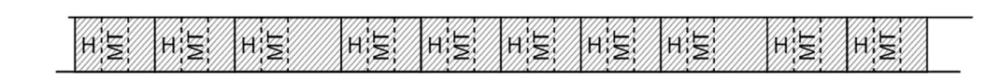

图9-1. GC过程开始时托管堆（小对象堆内部）的片段（H代表对象头，MT代表方法表指针，浅灰色填充表示对象）

假设经过前文描述的标记阶段后，所有可达对象已被标记（见图9-2）。此时规划阶段启动。

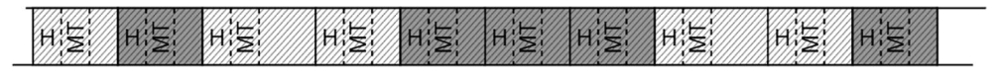

图9-2. 标记阶段结束后托管堆的片段（中等灰色对象表示已标记对象

在规划阶段，GC会逐对象扫描待回收的代和更年轻的代。通过对象方法表中的信息计算对象大小：对于数组，其大小为基址大小加上元素大小乘以元素数量。扫描时，专用指针会根据当前对象大小前进来跳转到下一个对象。你可以将堆视为一个巨型链表——每个对象的大小用于计算下一个对象的地址。但这种方法仅在对象间无空闲空间时有效。堆内存几乎总存在碎片化，那么遇到空闲空间时如何定位下一个对象？答案在第6章“空闲列表分配”一节中已给出：每当堆上存在空闲空间时，GC会用一个虚拟的"Free"对象填充它。这种对象类似数组，有专用的方法表条目，其元素为1字节大小，元素数量会调整以覆盖整个空闲区域。这样当遍历堆时，GC（或使用相同技术的调试器）就能像跳过普通对象一样跳过空闲空间。

规划阶段的核心原理是：在逐对象扫描过程中，将所有已标记和未标记对象分组（见图9-3）。可能创建两种分组：

- 内存块(Plug)：连续的可达（已标记）对象组
- 间隙(Gap)：连续的不可达（未标记）对象组

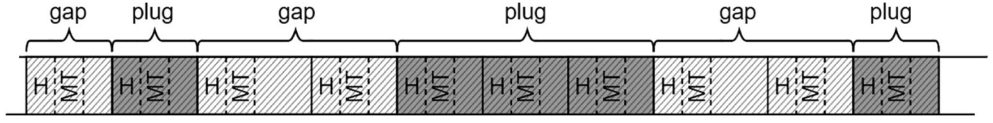

图9-3. 托管堆中的内存块与间隙

通过将整个托管堆划分为一系列内存块和间隙，我们可以更高效地计算所需信息（见图9-4）：

- 每个间隙的大小与位置：若选择清除（Sweep）式回收，多数间隙将转变为由空闲列表管理的可用空间。
- 每个内存块的重定位偏移量与位置：若选择压缩（Compact）式回收，将根据各内存块的重定位偏移量进行移动。

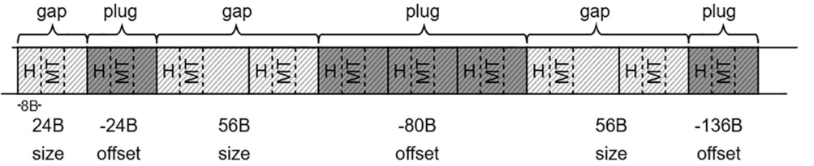

图9-4. 内存块与间隙关联的大小及偏移量信息

如何计算重定位偏移量？最简单场景下，可将其计算为所有前置间隙大小的累加值（如图9-4所示）。但实际实现要复杂得多——运行时采用专属内部分配器为待迁移的每个内存块寻找合适的目标地址，该地址会被记录而非立即执行迁移操作。

> 若您想深入探究细节并研究.NET源码，所有这些逻辑都实现在 `gc_heap::plan_phase` 方法中。该方法通过扫描连续对象来识别内存块与间隙，并通过调用 `allocate_in_condemned_generations` 或 `allocate_in_older_generations` 计算每个内存块的新位置——这里就是您展开研究的切入点。

对于可移动内存块（即未被固定的对象）的简单场景，[碰撞指针分配器（bump pointer allocator）](06-Memory-Allocation.md#指针碰撞分配)会将各内存块紧密排列。图9-5展示的“虚拟空间”正是内部分配器视角下的托管堆形态（即压缩完成后的理想状态），这仅为便于理解所做的示意图——实际运行时分配器仅操作指针并更新其值。该堆内存片段的计划阶段包含以下步骤：

- 首先，分配指针被重置至代际起始位置（见图9-5a）。
- 当遇到首个内存块（含单个对象）时，分配器在指针当前位置预留空间（见图9-5b），随后前移分配指针。内存块新旧位置的差值被记录为重定位偏移量。
- 当处理下一个内存块（含三个对象）时，分配器紧邻前一个“已分配”块后预留空间，同样记录新旧位置差值作为重定位偏移量。
- 最后一个内存块也遵循相同逻辑处理。

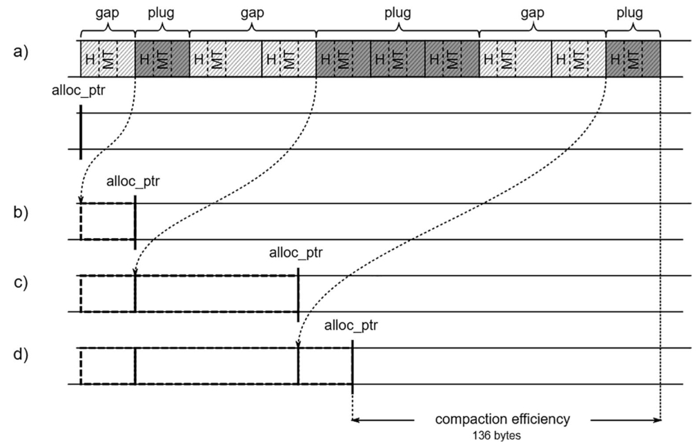

图9-5展示了插槽重定位偏移量的计算过程，其原理是基于内部分配器为每个插槽计算新地址——（a）图9-4中的对象布局及其在托管堆上的分配器视图，（b）内部分配器为第一个插槽找到位置，（c）内部分配器为第二个插槽找到位置，（d）内部分配器为最后一个插槽找到位置。

最终所有重定位偏移量计算完成后，垃圾回收器（GC）就能精确获知压缩发生后分配指针的最终值。这些信息可用于计算压缩效率，该指标将影响GC后续是否执行压缩的决策。

> 以图9-5为例，压缩后所有对象占用的空间将减少136字节，这正是分配指针初始值与最终值的差值。当前简化案例尚未体现复杂内部分配器的必要性，这将在后续讨论固定对象时展开。

通过将对象组织为插槽和间隙，GC能高效获取完整信息集：

- 压缩效率如何？
- 清扫回收时应在何处创建空闲列表项（间隙）？
- 压缩回收时应将可达对象移动至何处（插槽）？

接下来的问题是插槽与间隙相关数据的存储位置。GC本可使用专用内存区域，但当存在大量交错的小型间隙和插槽时，该方案将消耗过多内存。此外，交替访问托管堆与独立内存区域也会影响CPU缓存效率。鉴于GC已密集使用托管堆内存区域，微软.NET选择复用该区域存储插槽与间隙信息。

当间隙和插槽构建恰当时，每个插槽前都会存在对应的间隙。因此GC将对象组织成交替的插槽与间隙结构，从而能在每个插槽前的间隙末端（即存储无效对象的安全区域）保存关键信息（见图9-6）。这些插槽信息在64位运行时占用24字节，32位运行时占用12字节，包含对应间隙大小、插槽重定位偏移量及后续将解释的附加数据（重定位偏移量中的2个比特位及左右偏移量）。

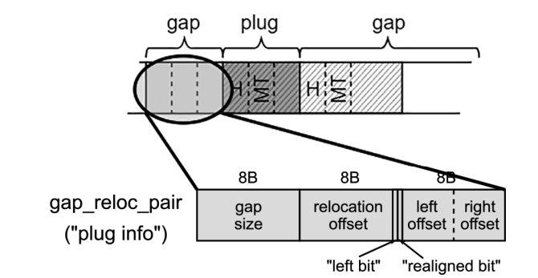

图9-6. 托管堆中插槽信息的存储位置

在托管堆中为插槽信息预留空间（位于每个插槽起始位置之前）是空对象也必须占用24字节（64位运行时环境下）的主要原因。由于插槽前的间隙至少包含一个对象，该间隙长度至少为24字节。这种设计巧妙而优雅地确保了始终有足够空间存储插槽信息！

图9-7展示了每对间隙和插槽的信息如何存储在托管堆中（参见图9-7）。这些信息将在后续的清扫（Sweep）或压缩（Compact）阶段使用。

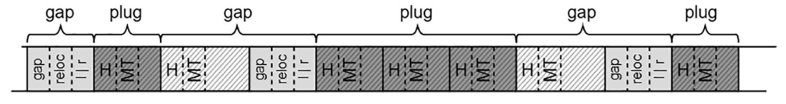

图9-7. 与插槽及间隙关联的尺寸和偏移量信息直接存储在托管堆中（基于图9-4的场景)

若GC决定执行压缩操作，这些插槽信息将被频繁调用。其中最关键的作用是确定垃圾回收完成后对象的新地址——只需检查对象地址X是否属于某个插槽范围，若是则从X中减去对应的插槽重定位偏移量即可。由于该查询可能被极高频次调用，必须竭尽全力优化计算效率。为此，插槽被组织为二叉搜索树（BST）结构。

如图9-6所示，每个插槽信息包含左右偏移量字段，分别指向左子树或右子树插槽信息的存储位置（若无对应子节点则标记为0）。这构成了包含所有插槽地址的二叉插槽树基础结构（见图9-8)。该树采用平衡构建方式，确保任意节点的左子树地址均小于该节点，右子树地址均大于该节点。

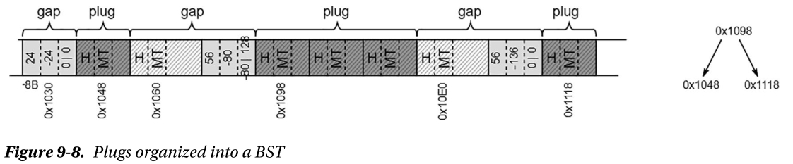

图9-8. 以BST形式组织的插槽

> 插槽树中的地址均指向插槽内首个对象的MT字段（遵循CLR常规设计）。GC通过固定偏移量可快速定位对应的插槽信息存储位置。

### 场景9-1 – 含有无效结构的内存转储

问题描述：在问题调查过程中，捕获了.NET应用程序的完整内存转储。但该转储似乎无法使用，因为数据结构无效。例如，在执行大多数SOS命令时会出现以下提示信息：

```
> !dumpheap -stat
The garbage collector data structures are not in a valid state for traversal.
It is either in the "plan phase," where objects are being moved around, or we are at the initialization or shutdown of the gc heap. Commands related to displaying, finding or traversing objects as well as gc heap segments may not work properly. !dumpheap and !verifyheap may incorrectly complain of heap consistency errors.
```

分析：该内存转储确实可能是在GC规划阶段捕获的，此时无法保证对象处于“正常状态”——因为堆内存无法通过常规方式遍历（即无法从区域起始位置开始，按照对象大小逐步推进，正如本章前文所述）。实际上，如果你查看.NET代码，会发现Plan阶段被以下防护代码包围：

```
GCScan::GcRuntimeStructuresValid(FALSE);
plan_phase(n);
GCScan::GcRuntimeStructuresValid(TRUE);
```

这是唯一设置此类保护机制的地方。因此，通过检查是否存在正在执行GC相关代码的线程，可以轻松确认内存转储是否是在这种不利时刻捕获的。根据运行环境不同，需要检查以下四种可能的库和命名空间组合：

- `coreclr!wks`：使用工作站GC的.NET。
- `coreclr!srv`：使用服务器GC的.NET。
- `clr!wks`：使用工作站GC的.NET Framework。
- `clr!srv`：使用服务器GC的.NET Framework。

例如，对于启用工作站GC的.NET 8应用程序的转储文件，可以通过以下方式验证：

```
> !findstack coreclr!wks
Thread 000, 6 frame(s) match
* 00 000000a963b7cd30 00007ff903bb0b48 CoreCLR!WKS::gc_heap::plan_phase+0xa9
* 01 000000a963b7ce40 00007ff903bb095a CoreCLR!WKS::gc_heap::gc1+0x178
* 02 000000a963b7ceb0 00007ff903b90d21 CoreCLR!WKS::gc_heap::garbage_collect+0x5ca
* 03 000000a963b7cf20 00007ff903b90e98 CoreCLR!WKS::GCHeap::GarbageCollect
Generation+0x191
* 04 000000a963b7cf60 00007ff903b90b15 CoreCLR!WKS::GCHeap::GarbageCollectTry+0xe8
* 05 000000a963b7cff0 00007ff903670613 CoreCLR!WKS::GCHeap::GarbageCollect+0x2a5
```

 显然，此时正处于GC的Plan阶段，因为存在线程正在执行 `gc_heap::plan_phase` 函数。

不过根据我们的实践经验，此类提示也可能在以下情况出现：当SOS调试扩展未正确加载时（例如错误使用.NET 2.0运行时版本的SOS分析.NET 4.0的转储文件，或反之），导致获取GC数据时发生常规性错误。

### 块表（Bricks Table）

插槽树（plug tree）的根节点需要存储在某个地方。为整个托管堆创建一个庞大的单一插槽树显然不切实际。在调查连续间隙与插槽时，向树中插入新条目可能触发树的重平衡操作。若一棵树需要覆盖所有插槽，其维护成本将极其高昂。此外，在如此庞大的树中进行查找遍历也会因需要跨越多个树层级而代价昂贵。

> 为了**高效地组织和查询关于“内存块/插槽”（即连续的存活对象区域）的信息**而构建的一种**二叉搜索树**。它的主要目的是在GC需要确定一个地址属于哪个内存块，以及该内存块将如何被重定位（如果发生压缩）时，提供快速的查找能力。由于单一覆盖整个堆的插槽树存在性能和维护问题，实际实现中会结合“块表”将其分解为多个更小的、管理特定内存区域的插槽树。

更实用的方案是为连续地址范围构建独立的插槽树。这种地址范围在CLR中称为“块”(brick)。32位运行时的块大小为2,048字节，64位运行时则为4,096字节。换言之，托管堆中每2KB或4KB内存区域都对应一个块，其中存储着该区域的插槽树信息。所有块通过覆盖整个托管堆的块表进行管理（参见图9-9）。

块表中的每个条目是一个16位整数，可表示三种逻辑状态：

- **0**：表示该块未关联任何插槽信息（指定地址范围内不存在插槽）。
- **>0**：表示插槽树根节点的偏移量（实际存储值为原始偏移量+1，以便用0表示无插槽状态）。
- **<0**：表示当前块是前续块的延续（存在跨越多块的大型插槽），此时应向前回溯指定数量的块以定位起始位置。

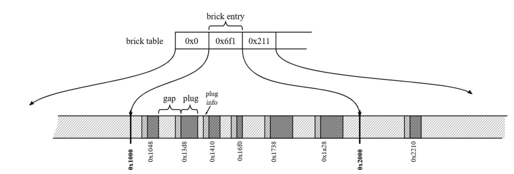

图9-9. 块与块表

通过将块表条目与每个插槽信息中的左右偏移量相结合，可以高效地表示插槽树结构（见图9-10）。示例块表条目包含值 `0x6f1`——它表示对应内存区域内插槽树根的偏移量。由于这是第二个块表条目，其代表 `0x1000`（4 KB）到 `0x2000`（8 KB）之间的地址区域。这意味着根节点位于 `0x6f0`（根据前文规则，正值需减1）加上 `0x1000` 后的地址 `0x16f0` 处。从该地址出发，可利用插槽信息中的偏移量遍历该块对应的整个插槽树。

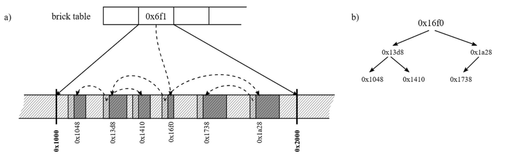

图9-10. 块与块表示例——(a) 作为插槽树根的块条目及插槽信息条目，(b) 逻辑插槽树表示

> 块表条目和左右偏移量均为短整型（16位），因其存储值范围在–32767至32767之间，足以表示4 KB地址范围内的偏移量。

当回答“地址X处对象的新地址是什么？”时，需执行以下简单步骤：

- 根据地址X计算块表条目索引——直接将其除以块大小。
- 若块表条目值<0，则跳转至指定块表条目重复流程。
- 若块表条目值>0，则开始遍历插槽树寻找对应插槽，从X中减去插槽的重定位偏移量。

至此我们可完成计划阶段运作原理的描述。所有必要信息已收集完毕，垃圾回收器可继续后续操作。通过末位插槽的重定位偏移量即可推算出压缩效率。然而仍有一个关键机制尚未说明——正是它使得整套技术复杂度显著提升。

### 固定（Pinning）

当一个对象被固定（pinned）时，通常是因为需要将其地址传递给某些非托管代码（见图9-11）。

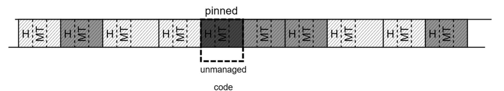

图9-11：固定示例。被固定的对象以深灰色标记

被固定的对象在压缩过程中不能简单移动，因为非托管代码可能正在使用它。若强行移动，非托管代码仍会访问原地址，但该地址此时将指向完全不同的数据集（见图9-12）。

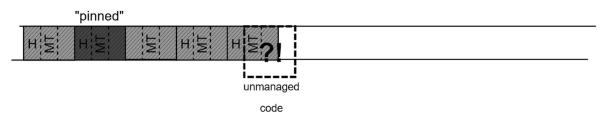

图9-12：固定示例——被固定对象移动后，非托管代码访问到未定义数据

固定机制显著增加了前一节所述技术的复杂性。内部分配器构建插槽树时必须以特殊方式处理被固定对象。本节将阐释其实现原理。

由于固定的存在，对象组实际上有三种可能类型：

- 插槽（Plug）：表示一组已标记（可到达）对象
- 固定插槽（Pinned Plug）：表示一组被固定（因而必然已标记）对象
- 间隙（Gap）：表示一组未标记（不可到达）对象

首先考虑最简单场景——某个固定插槽紧邻间隙之后（见图9-13a）。这种情况与之前差异不大：插槽信息仍可存储在对应间隙的末端，构建插槽树时正常存储左右偏移量。主要区别在于此类插槽的重定位偏移量应设为零。

此外，每个固定插槽前会存储一段空间的大小值（见图9-13b），该值表示若发生压缩时可释放的空间量。

因此在压缩过程中，普通插槽会被移动，而固定插槽保持原位（见图9-13c）。这是因为前文所述的内部分配器会直接“分配”固定插槽的原有位置，而不会移动它们。

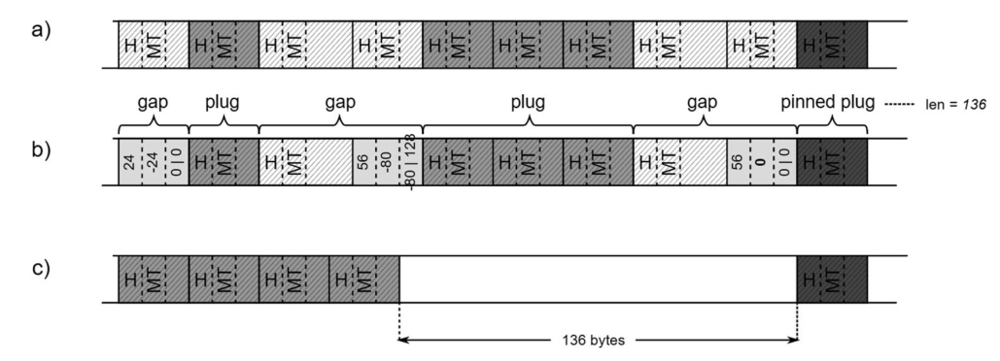

图9-13 存在间隙时固定插槽的管理——(a)含单个固定插槽的对象布局示例，(b)插槽信息组织结构，(c)压缩后的结果

> 需注意如图9-13(c)所示，常规插槽与固定插槽之间可能产生较大空闲间隙。该情景将在后续“降级”章节详细讨论。

所有固定插槽的数据均被记录在固定插槽队列中。后文将说明，由于垃圾回收器(GC)常需存储超出标准插槽信息容量的额外数据，因此必须维护独立的固定插槽队列。

> 值得注意的是，系统会复用已知的 `mark_stack_array` 来存储固定插槽数据。但此时其存储的不再是对象地址，而是专用标记类的实例指针。因此在分析.NET代码时，常能在固定插槽处理相关逻辑中见到 `mark_stack_array` （及其对应的 `mark_stack_tos` 与 `mark_stack_bos` 指针）。

现在考虑更复杂的情形——固定插槽紧邻常规插槽后方（见图9-14a）。此时存在一个问题：按照惯例应在固定插槽起始位置前存储其信息，但该位置并非空闲空间而是可达对象！GC本可将信息存于他处，但实际做法是直接覆写该前置对象（见图9-14b）。由于Plan阶段执行时所有托管线程必然处于挂起状态，因此.NET代码绝无可能在对象被“还原”前访问到这些“已破坏”对象。

被截断的对象末尾（64位系统下为3指针大小的24字节）将与固定插槽数据共同存储于新的队列条目中，该片段被称为前插槽（因其位于固定插槽之前），将在后续压缩或清扫阶段使用。

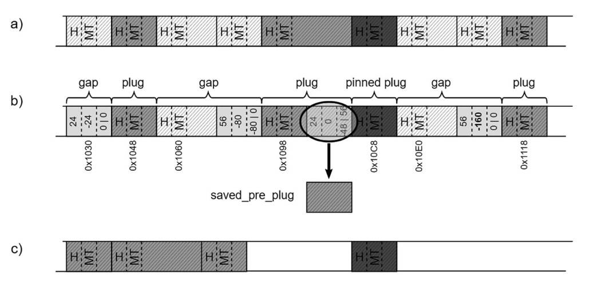

图9-14. 当固定插槽位于普通对象后方时的管理方案——(a) 单个固定插槽位于普通对象后的内存布局示例， (b) 将对象末端存储为预插槽信息的组织形式，(c) 压缩操作后的可能结果

> 请注意，对象至少24字节的要求在此场景中至关重要——它能确保即使是最小的前驱对象内部也有足够空间存储插槽信息。

该方案使垃圾回收器能以通用方式处理固定插槽：重定位偏移量设为0，间隙大小人工设定为24字节，插槽信息照常纳入插槽树结构（参见图9-15）。

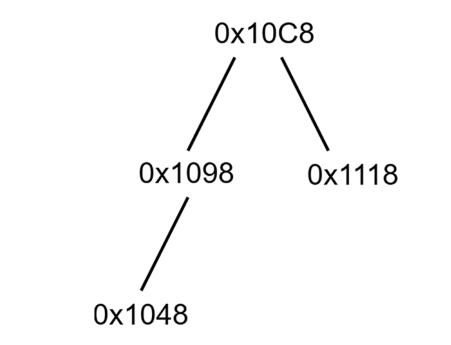

图9-15. 图9-14中插槽的逻辑树状表示

然而固定对象带来的复杂性不止于此。假设固定插槽恰好位于普通插槽之前（图9-16a），此时新问题出现——普通插槽期望将信息存储在自身起始位置（即固定对象末端）。但由于固定对象可能被未挂起的非托管线程访问（图9-16b），必须保证其内存绝对不被修改。解决方案很简单：不创建新插槽，而是将固定对象后的首个普通对象并入固定插槽（图9-16c）。后续章节将说明该信息如何在压缩阶段使用。

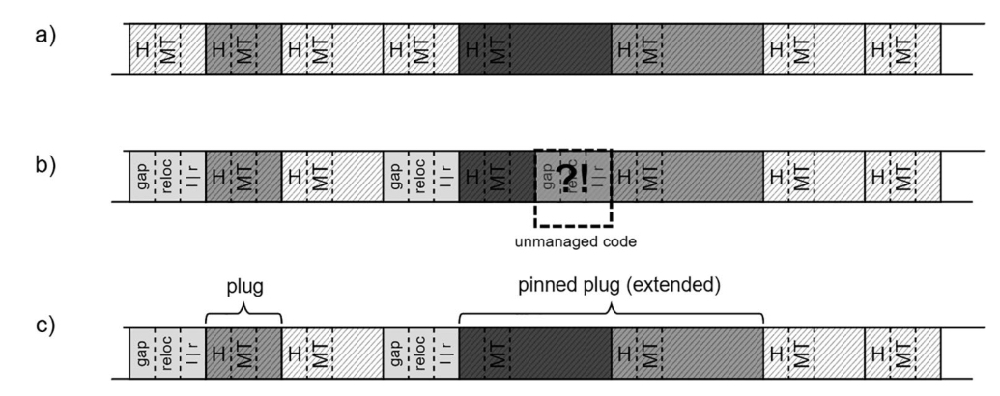

图9-16. 当固定插槽位于普通插槽前方时的管理方案—— (a) 单个固定插槽的内存布局示例，(b) 需要特殊处理的插槽信息组织方式，(c) 将普通插槽合并至固定插槽

这是一种折中方案。固定对象及其相邻的普通对象被视为扩展的固定插槽，因此将继承固定机制的所有缺陷。虽然应当尽量避免固定操作，但此处却反其道而行——垃圾回收器主动固定了额外的普通对象。通用化处理插槽的优势在此压倒了其弊端。若固定对象后邻接的是小对象，所产生的影响可忽略不计。

但当固定对象后接大型已标记对象块时，问题便显现：是否应将其全部纳入扩展固定插槽（理论上可能产生MB甚至GB级的固定插槽）？显然不可行。固定插槽仅扩展至其后首个独立对象。

假设固定对象后至少存在两个已标记对象（图9-17a），按前文方案扩展固定插槽至首个标记对象后，后续标记对象可安全创建为普通插槽——因为被并入固定插槽的普通对象内存区域已可覆写（图9-17b）。当然，这个“被破坏”对象的末端信息（称为后插槽数据）需像预插槽数据那样另行存储，供后续压缩或清扫阶段使用。

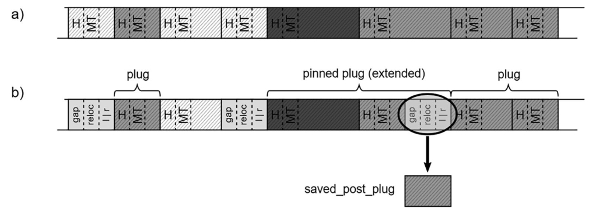

图9-17. 当固定插槽前存在至少两个标记对象时的管理方案——(a) 单个固定插槽的内存布局示例，(b) 插槽信息的组织方式

总结来看，最典型场景是固定对象位于大型已标记对象块内部（图9-18a）。此时必须同时保存前插槽与后插槽数据，并创建三个独立插槽（包含一个扩展后的固定插槽）（图9-18b）。

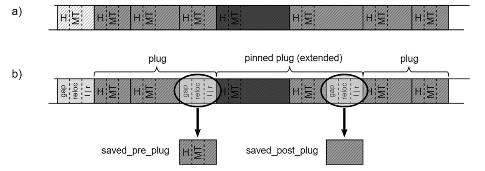

图9-18. 当固定插槽位于大型标记对象块内部时的管理方案——(a) 单个固定插槽的内存布局示例，(b) 插槽信息的组织方式

该机制会带来以下影响：

- 复制前/后插槽数据会产生额外内存流量——固定对象越多，开销越大。
- 固定插槽仅能扩展至单个对象，导致被固定的内存区域超出必要范围——若普通对象体积较大，将造成显著内存不可移动。
- 在规划阶段，托管堆中部分对象会被前/后插槽信息部分覆盖，导致无法正常遍历。这在捕获该阶段内存转储时可能引发问题（参见场景9-1）。

### 场景9-2——调查固定（Pinning）现象

**描述**：通过观察生产环境中的“.NET CLR Memory# of Pinned Objects”性能计数器（见图9-19），您发现应用程序中存在大量对象固定现象。现在需要确认这些固定是预期行为还是非预期的。

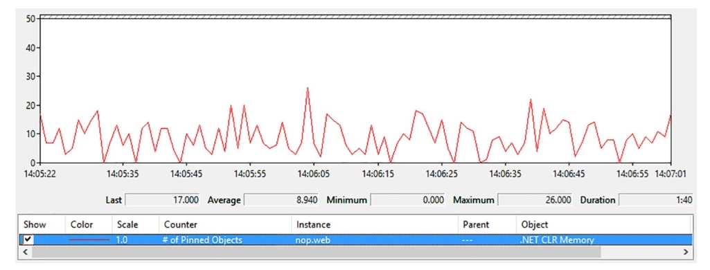

图9-19. .NET CLR Memory() 的固定对象

**分析**：根据前文对固定的说明，固定现象主要有两种来源：

1. **局部固定变量**：通过 `fixed` 关键字隐式创建的局部变量对象。这类对象的生命周期仅限于所在方法的执行期间。因此内存转储或PerfView的堆快照仅能捕获当前执行中的一小部分此类对象。注意每个此类对象都会触发一次 `PinObjectAtGCTime` ETW事件。
2. **固定句柄**：通过固定句柄显式固定的对象，包括CLR内部持有的对象以及通过 `GCHandle.Allocate` 调用显式创建的对象。句柄表在应用程序整个生命周期常驻内存，因此可通过内存转储或堆快照轻松分析。PerfView的ETW会话或 `dotnet-trace` 采集结果也会以 `PinObjectAtGCTime` 事件形式记录这些信息，但仅针对垃圾回收器正在处理的代（因为句柄表具有代感知能力）。

“.NET CLR Memory# of Pinned Objects”性能计数器会统计这两种类型，但该计数器仅适用于.NET Framework，.NET和.NET Core没有对应计数器。初始阶段您无法直接判断哪种固定类型是主要来源。

建议在固定对象计数较高时开启ETW会话进行分析。使用PerfView时勾选“.NET”复选框即可（无需选择“GC Collect Only”）。在Memory组的GCStats报告中，您会看到显著的固定对象数量确认（见图9-20）。最后一列“Pinned Obj”显示每次GC提升的固定对象数量，该数值应与性能计数器观测值一致。对于不提供性能计数器的.NET Core运行时，您可以直接从这里检查应用程序是否存在显著固定现象。

本示例中，`# of Pinned Objects` 值主要来源于通过 `PinObjectAtGCTime` 事件观测到的局部固定变量。

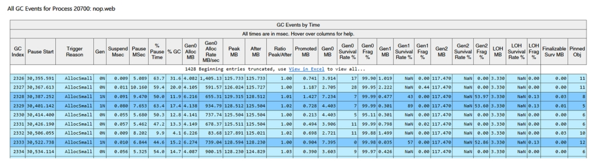

图9-20.  GC按时间排序事件表中的“Pinned Obj”列

在标记阶段，每个固定对象都会触发一个`PinObjectAtGCTime`事件。您可以在事件视图中查看这些独立事件，其中 `TypeName` 字段特别值得关注（见图9-21）。当固定对象的类型具有唯一性时，仅通过该字段往往就能快速定位固定来源。

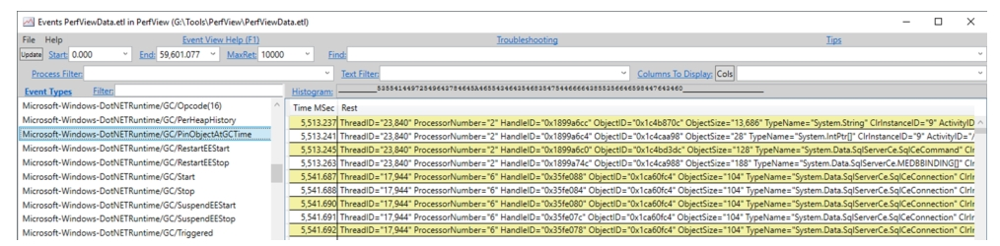

图9-21.  ETW事件 `Microsoft-Windows-DotNETRuntime/GC/PinObjectAtGCTime`

> 请注意，`PinObjectAtGCTime` 事件不附带调用堆栈。虽然可以通过设置.NET ETW提供者的@StacksEnabled=true选项启用堆栈跟踪，但这并无实际帮助——因为这些事件的堆栈始终位于GC内部代码中，而非实际使用固定对象的位置。

但存在更高效的分析视图：Advanced组中的专用“Pinning At GC Time Stacks”视图。该视图通过附加分析和分组提供聚合数据。默认的“By Name”视图会显示被固定类型的主要分布情况（见图9-22），可见所有固定对象都被归类到 NonGen2 来源。

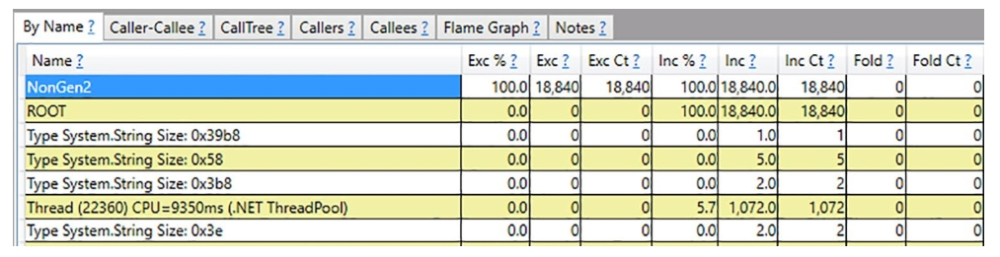

图9-22.  Pinning At GC Time Stacks视图——按类型分类
通过右键菜单选择“Goto Item in Callers”命令（或F10快捷键），可进一步分析固定对象的主要来源类型。您会发现它们大多标记为“StackPinned”（见图9-23）。本示例中，`System.Data.SqlServerCe` 命名空间下的类型（特别是 `SqlCeCommand`、`SqlCeConnection` 和 `MEDBBINDING[]` 数组）显然是主要贡献者。

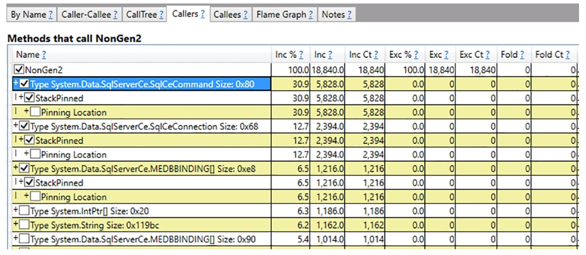

图9-23.  Pinning At GC Time Stacks视图——NonGen2 的调用溯源
至此，在源代码中搜索这些类型实例（配合fixed关键字的使用)应能明确锁定固定现象的根源。例如 `System.Data.SqlServerCe.SqlCeCommand.ExecuteCommandText` 方法中就存在如代码清单9-1所示的实现，其中 `DbBinding` 字段正是 `MEDBBINDING[]` 类型。

代码清单9-1. `System.Data.SqlServerCe.dll` 中的局部变量固定示例（通过dnSpy反编译）

```c#
fixed (IntPtr* ptr = this.accessor.DbBinding)
{ //
}
```

对于句柄固定的对象，还可通过WinDbg中的 `!GCHandles SOS` 命令分析。在“.NET CLR Memory# of Pinned Objects”数值较高时获取内存转储，用WinDbg打开后执行 `!GCHandles` 命令（见代码清单9-2），即可列出所有通过固定句柄固定的对象——包括CLR内部数组（如字符串驻留池或静态存储区）、Kestrel服务器使用的缓冲区等。目前尚无WinDbg扩展能直接分析基于堆栈的固定来源。

清单 9-2. `GCHandles` 命令展示的所有固定句柄

```
> !GCHandles Pinned
Handle Type Object Size Data Type
007f1374 Pinned 04988078 131084 System.Byte[]
007f1378 Pinned 04968058 131084 System.Byte[]
007f137c Pinned 04948038 131084 System.Byte[]
007f1398 Pinned 0490f058 32780 System.Object[]
007f13ac Pinned 04928018 131084 System.Byte[]
007f13b4 Pinned 0490b038 16396 System.Object[]
007f13b8 Pinned 048fb028 65532 System.Object[]
007f13bc Pinned 048f9008 8204 System.Object[]
007f13c0 Pinned 0403dbac 12 Bid+BindingCookie
007f13c4 Pinned 048f7fe8 4108 System.Object[]
007f13c8 Pinned 04918008 65532 System.Object[]
007f13cc Pinned 048e7fd8 65532 System.Object[]
007f13d0 Pinned 048e3ff8 16332 System.Object[]
007f13d4 Pinned 048e1ff8 8172 System.Object[]
007f13d8 Pinned 048e17d8 2060 System.Object[]
007f13dc Pinned 048d18b8 65292 System.Object[]
007f13e0 Pinned 048c9918 32652 System.Object[]
007f13e4 Pinned 048c94f8 1036 System.Object[]
007f13e8 Pinned 048c5518 16332 System.Object[]
007f13ec Pinned 048c3518 8172 System.Object[]
007f13f0 Pinned 048c2508 4092 System.Object[]
007f13f4 Pinned 048c22e8 524 System.Object[]
007f13f8 Pinned 038c121c 12 System.Object
007f13fc Pinned 048c1020 4788 System.Object[]
Statistics:
MT Count TotalSize Class Name
720dff90 1 12 System.Object
57fbb464 1 12 Bid+BindingCookie
720dffe4 18 417536 System.Object[]
720e419c 4 524336 System.Byte[]
Total 24 objects
```

总结来说，若要全面了解内存固定（pinning）情况，您应当关注同时考虑两种固定源的 `PinObjectAtGCTime` 事件。需注意SOS扩展工具仅列出与句柄相关的固定源。

最后需要说明的是，PerfView工具分析 .gcdump 堆快照的功能在此场景中更为实用。打开此类快照后，可定位到[.NET Roots]行并通过上下文菜单选择“转到调用树中的项”（快捷键ALT+T）。清除折叠设置（清空 Fold% 字段）后，您将能查看所有类型的根引用——包括被固定的局部变量（参见图9-24）。其中会显示已知的 `MEDBBINDING[]` 类型作为此类固定的主要来源。请注意这只是静态快照，因此基于堆栈的固定源不会被完整列出。

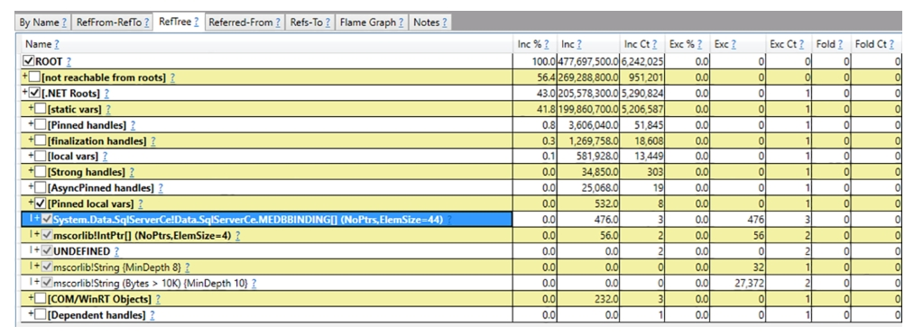

图9-24. PerfView堆快照分析中[.NET Roots]的引用树视图

> 有时还需清除 GroupPats 字段的分组设置和 FoldPats 字段的折叠设置。这样能生成更细粒度且更具描述性的结果。图9-24即采用此方式生成。

确定固定源后，可评估其是否可避免。若未造成严重内存碎片，可维持现状；若引发严重问题（如导致大量碎片），则需寻求解决方案。第13章将具体介绍避免过度内存固定的方法。

### 代际边界

在短暂段(ephemeral segment)内部，代际边界会在清扫(sweeping)或压缩(compacting)后发生变化。在没有固定对象(pinned objects)的场景下，这一调整过程较为简单——代际边界会被重新划定以包含所有晋升(promoted)的对象。

例如图9-25a展示了全量回收(Full Collection)时的对象布局，三个代际中均存在被标记(可达)的对象。如你所知，在计划阶段(Plan phase)，内部分配器会为数据块(plugs)计算新地址(见图9-25b)。但此外还会计算新的代际边界，所有这些操作在虚拟状态下完成，并未实际移动对象。因此图9-25b展示的是分配器对托管堆(Managed Heap)的抽象视图（浅灰色表示死亡对象，中灰色表示根据虚线移动的存活对象）。

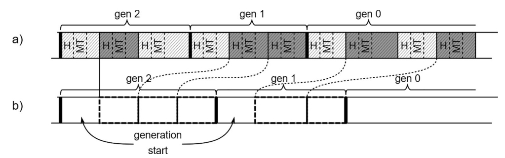

图9-25. 代际边界计算过程——(a) 对象布局示意图，(b) 分配器对托管堆的最终视图（浅灰色表示死亡对象，中灰色表示将按虚线移动的存活对象）

对于区域(regions)而言，代际边界的概念并不适用——因为每个区域仅包含单一世代（与包含多代际的短暂段不同）。存活对象在压缩期间会被分配到更老的代际。如图7-7和7-8所示，清扫时整个区域会直接晋升到更老的代际。

关于段(segments)还有一个细节需要注意：每个代际（即使是空代际）起始处都会保留最小对象大小的空闲空间。这个空间用于存储该代际首个数据块的元信息，使得所有数据块都能以统一方式处理，无需考虑跨代际的特殊情况。后文图示中为保持简洁通常会省略这部分空间，但在分析内存转储时请注意：每个代际起始处实际上都存在三指针长度的空闲空间。

### 降级

此前在图9-13和图9-14中已经展示了压缩操作可能产生的结果。关于内部分配器在固定插槽（pinned plug）周围的行为表现以及各代边界如何划定，这些细节尚未完全阐明。从实现角度来看，最简单的解决方案是在每个固定插槽后重置累积的重定位偏移量，使得后续插槽都能紧接其后分配。然后相应设置代际边界，使其覆盖所有存活对象。

但这种做法从内存碎片角度看效率极低，因为它有时会产生大片的空闲内存区域。为此，内部分配器会尝试用常规插槽填满所有固定插槽之间的空隙（见图9-26）。以堆内存的这个小型示例片段为例，计划阶段（Plan phase）将遵循以下步骤：

- 首次分配前，指针被重置到代际起始位置（见图9-26a）。
- 分配器为第一个（图9-26b）和第二个插槽（图9-26c）找到位置。
- 固定插槽则在其原始地址完成“分配”（图9-26d）。
- 分配器在固定插槽前为最后一个插槽找到位置——这里有足够空间容纳它（图9-26e）。

假设本例应用于短暂段（ephemeral segment），此时必须更新代际边界。初始状态下所有对象都属于第0代。如果按预期将所有存活对象（包括固定对象）都提升至第1代，那么第0代应该从固定插槽之后开始——原本第0代的固定对象本应和其他对象一样晋升到第1代。但这会导致第1代出现严重内存碎片。更合理的决策是复用现有空隙，提前结束第1代，将第0代起始位置规划在固定对象之前（图9-26f）。

因此，基于这个决策，固定对象仍保留在第0代——它并未像常规情况那样从第0代晋升到第1代！

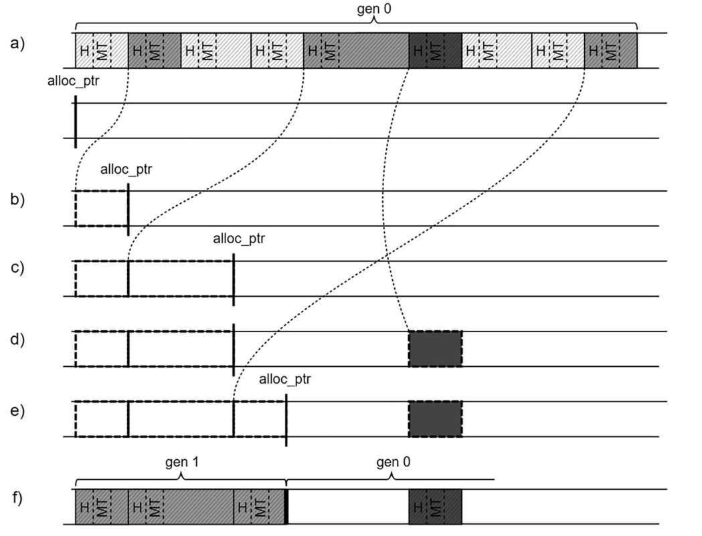

图9-26. 内部分配器填充由固定操作产生的空隙——(a)取自图9-14的对象布局及托管堆中的分配器视图，(b)内部分配器为第一个插槽找到位置，(c)内部分配器为第二个插槽找到位置，(d)固定插槽未被移动，(e)内部分配器在固定插槽前为最后一个插槽找到位置（存在足够容纳空间），(f)第0代起始于理论应晋升的固定插槽之前——该对象被降级（未晋升）

此类事件被称为降级（与晋升相对），意味着对象最终所处的代际比预期更低。降级可能表现为对象未被晋升，也可能导致其落入更低代际。

由于固定操作的存在，对象晋升可能出现三种情况。让我们从第1代固定插槽（其后方紧接单个对象）的视角分析：

- 若其前方存在足够容纳普通插槽的空隙，则固定插槽会从第1代降级至第0代（见图9-27）。
- 若其前方空隙既能容纳普通插槽又能满足第1代起始要求，则固定插槽会被降级但仍保留在第1代（见图9-28）。
- 若其前方没有足够空间容纳普通插槽，则固定插槽与普通插槽（包括大块空闲空间）都必须晋升到更老的代际（见图9-29）。

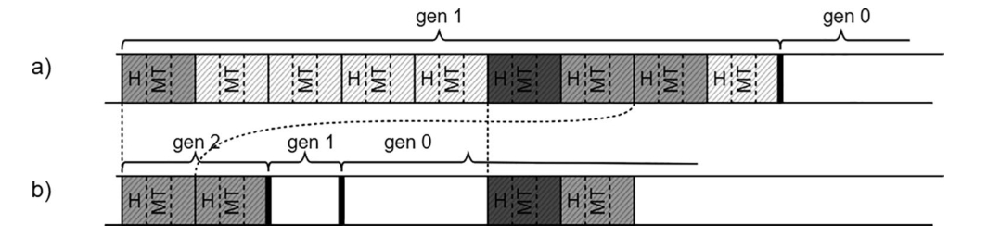

图 9-27. 降代——（a）对象布局，（b）压缩结果

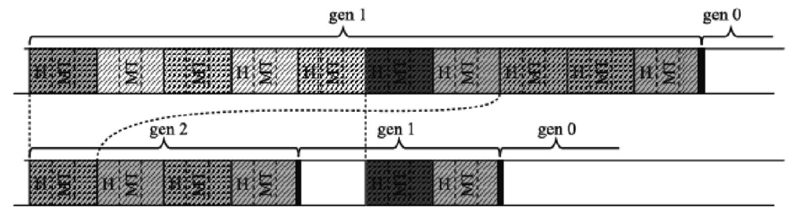

图 9-28. 降代——（a）对象布局，（b）压缩结果

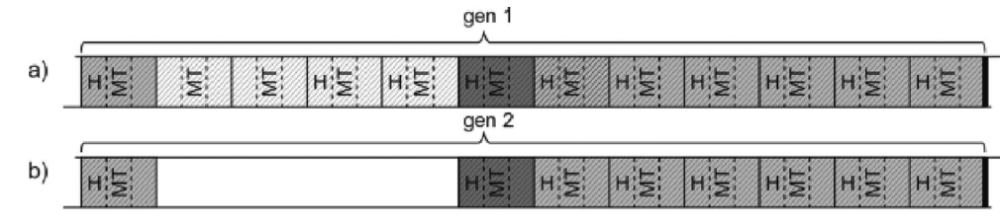

图9-29. 从第1代正常晋升至第2代——（a）对象布局，（b）压缩后的结果（会引入不必要的碎片）

内存分配器内部操作的单位是内存块（plug），而非单个对象。它无法将内存块拆分成更小的片段来填补空间，例如图9-29中钉住对象（pinned object）之前的空隙。这是分配器复杂度与所引入碎片开销之间的权衡。不过通常情况下，这种开销可以忽略不计。钉住对象通常只有两种存在形态：

- 短期存活的钉住对象会在第0代死亡，这一代空间小且动态性强，足以容纳这种开销而不会产生碎片。
- 长期存活的钉住对象则存在于第2代，因此大多数时候影响微乎其微（只要第2代不发生压缩，无论对象是否被钉住都与垃圾回收器无关）。

> 注意：在内存段（segment）的实现中，只有被钉住的内存块可能被降级（即一个钉住对象及其后紧邻的单个非钉住对象，如果存在的话）。

显然当存在多个被钉住内存块时，只有部分可能被降级。这完全取决于当前内存块和空隙的布局。图9-30展示了这种情况：普通内存块会尽可能高效地复用空隙空间，导致第一个被钉住内存块正常晋升，而第二个则从第1代降级到第0代。

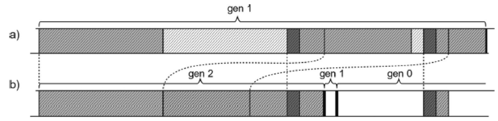

图9-30. 同时存在晋升与降级的示例

降级是一种优化机制，旨在最大化空隙空间的复用率。剩余的可用空间若足够大，将被转为空闲列表项（free-list items），从而获得被重用的机会。

这可能是为什么没有现成的诊断数据来展示降级现象。虽然可以通过详细的内存转储分析来观察，但实际工作中很少需要这么做。真正需要关注的是被钉住内存块引发的碎片化程度。不过了解钉住对象可能被晋升或降级仍有价值。前文提到过，纯第2代内存段可能被转换为临时段（ephemeral segment），此时被钉住内存块会从第2代降级至第1代和第0代。

SOS调试扩展中有一个未公开的 `!DumpGCData` 命令。除了能通过其他途径（如ETW）获取的数据（如压缩原因或各类GC计数）外，它还包含独有的“有趣数据点”信息：

```
Interesting data points
pre short: 0
post short: 0
merged pins: 0
converted pins: 0
pre pin: 0
post pin: 0
pre and post pin: 0
pre short padded: 0
post short padded: 0
```

如您所见，这些数据包含：

- **前后钉住类型**：同时包含前/后邻接信息的钉住内存块。
- **前钉住类型**​：仅包含前邻接信息的钉住内存块。
- **后钉住类型**​：仅包含后邻接信息的钉住内存块。
- **转换钉住类型**​：因钉住内存块扩展而被转换为钉住状态的对象。

该命令专为GC开发者设计，因其数据对.NET开发者并无实际用途。SOS后续版本中甚至不保证会保留此命令。如需深入研究，可在.NET源码中搜索 `gc_heap::record_interesting_data_point` 方法。

## 大对象堆（LOH）

在实践中，大对象堆（LOH）的“规划阶段”几乎从不需要执行，因为该阶段本质上只是清扫操作。但LOH必须保持支持必要时进行压缩的结构设计。

### 内存块与间隙

大对象堆的规划阶段仅在压缩时触发。默认情况下总是执行清扫操作，此时不会使用内存块与间隙机制（后文详述）。对于LOH而言，压缩行为非常罕见，通常仅在开发者显式调用或启用 `ConserveMemory` 时发生（第11章将解释）。这意味着绝大多数.NET应用程序中，LOH永远不会被压缩。但压缩功能仍需保留，因此大对象堆以简化形式支持内存块与间隙机制。

LOH的特殊性在于它仅存放大型对象，这使得以下优化成为可能：

- 由于单个对象本身已足够大，无需像普通堆那样将多个对象聚合成内存块。为简化规划阶段，每个可达对象都被视为独立内存块。首先，这种设计能保证高效的地址转换（LOH中对象分布密度远低于小对象堆）；其次可避免碎片化问题（若将多个大对象合并为巨型内存块，重定位效率会显著降低）。
- 为避免内存块信息存储开销（包括固定内存块前后的预留块），LOH中的对象分配时会预留填充空间（见图9-31）。这个填充区占用四个指针大小的空间（64位系统为32字节），并被构造为常规空闲对象。

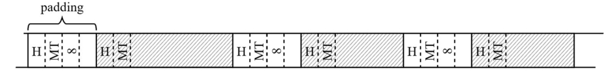

图9-31. 大对象堆中的对象布局（支持LOH压缩的运行时会在对象间插入填充空间）

在标记阶段，每个对象可能被标识为“已标记”或“已标记且固定”。这些对象会生成对应的内存块（见图9-32）。

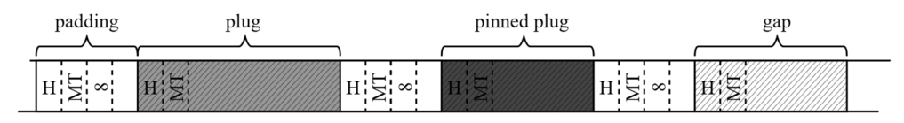

图9-32. 标记阶段后大对象堆中的对象布局

每个内存块(plug)前需要存储其信息，由于填充空间的存在，总能确保有足够存储空间（见图9-33）。这些信息极为精简，仅包含内存块的重定位偏移量（relocation offset）。

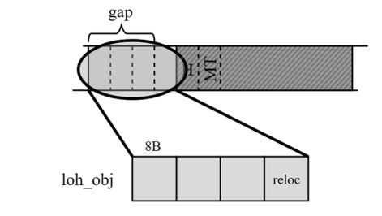

图9-33. 存储在大对象堆中的内存块信息（位于前置填充区）

重定位偏移量的计算方式与小对象堆相同。内存分配器会为连续的内存块（successive plugs）（即连续对象）寻找合适位置。前文提及，这正是将每个独立对象视为单独内存块（而非聚合成巨型内存块）的优势——分配器很难在固定内存块之间为巨型内存块找到合适位置。

填充空间的存在彻底杜绝了内存块信息覆盖其他对象的可能性，因此无需维护前置/后置内存块数据。

鉴于大对象堆中对象数量较少且体积庞大，这里不需要像小对象堆那样维护内存块树结构。通过简单的地址计算即可确定新对象位置：从内存块信息中获取重定位偏移量，再将其从对象地址中减去即可。因此大对象堆既不需要块(brick)结构，也无需维护块表。

由于大对象堆内部没有分代机制，既不需要重新计算代际边界，也不存在降代(demotion)可能。

综合这些特性，大对象堆的规划阶段远比小对象堆简单。无论是普通内存块还是固定内存块，其信息都存储在对象前方（见图9-34）。当执行压缩操作时，每个固定内存块前的空闲空间大小会额外记录在对应的固定内存块队列条目中。

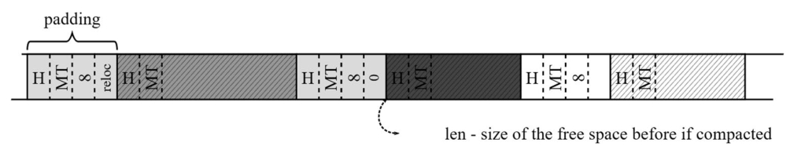

图9-34. 大对象堆规划阶段的执行结果（末段填充空间无需保存重定位信息，因其位于间隙之前）

需要特别说明的是，大对象堆中的固定（pinning）操作与小对象堆一样可能引发内存碎片化问题。

> 您可以在.NET Core源码的 `gc_heap::plan_loh` 方法中查看大对象堆规划阶段的具体实现代码。

## 决定是否进行压缩

在计划阶段完成复杂的计算后，垃圾回收器（GC）需要判断是否值得进行内存压缩。虽然存在多种可能强制触发压缩的情况，但大多数决策都基于内存碎片化程度。

GC可能决定执行压缩的缘由如下：

- 抛出 `OutOfMemoryException` 前的最后一次完全GC——此时GC应竭尽全力回收内存。
- 显式诱导压缩——例如通过指定 `GC.Collect` 方法的特定参数触发。
- 临时段（ephemeral segment）空间即将耗尽——正如代际回收章节所述，GC在决定扩展现有临时段或创建新段之前，会激进尝试回收内存。
- 采用区域模式时，若空闲区域（或即将释放的区域）不足以容纳下次回收前预测的 gen0 分配量。
- 代际碎片化程度过高——当某代内存碎片率较高时，对该代执行压缩回收可能成效显著——可回收大量内存区域。
- 系统物理内存负载过高——只要压缩可能回收的内存量超过特定阈值。

在之前描述的部分决策中，碎片化阈值起着关键作用。人们可能会好奇这个阈值具体是多少。每一代（generation）都维护着自己的阈值，该阈值由静态生成数据中的两个值构成（参见表7-1和表7-2）：

- **总碎片量**：通过计划阶段收集的信息，可以轻松计算特定代的碎片化程度。只需考虑各内存段中计划分配的结束地址，以及因固定（pinning）操作产生的空闲空间。该值对应表7-1和7-2中的 `fragmentation_limit` 列（汇总见表9-1）。
- **碎片化比率**​：即上述总碎片量与整个待回收代大小的比值。该值对应表7-1和7-2中的 `fragmentation_burden_limit` 列（汇总见表9-1）。

表9-1 各代的碎片化阈值

|      | 碎片大小   | 碎片比率 |
| ---- | ---------- | -------- |
| Gen0 | 40000字节  | 50%      |
| Gen1 | 80000字节  | 50%      |
| Gen2 | 200000字节 | 25%      |

例如：当第二代（Gen2）的所有碎片总量超过200,000字节**且**超过该代总大小的25%时，即认为其碎片化程度过高。

> 您可以在.NET Core源码的 `gc_heap::decide_on_compacting` 方法中查看压缩决策的具体实现。

## 特殊区域（Special Regions）

特殊区域是一项实验性功能，需通过设置环境变量 `DOTNET_GCEnableSpecialRegions=1` 启用。顾名思义，该功能仅在使用区域（regions）时生效。事实上，这是在引入区域内存模型之前无法实现的功能之一，因此尽管处于实验阶段，仍值得深入研究。

特殊区域的核心特性之一是**计划阶段清扫（Swept-in-Plan，SIP）**。前文提到，正常情况下GC会先模拟压缩过程，再根据结果决定执行实际压缩或简单清扫。启用特殊区域后，GC会首先检查每个区域的存活对象比例：若超过90%（即只有不到10%的对象可回收），则直接对该区域执行清扫。其原理在于，当区域内仅有少量对象可回收时，甚至无需模拟压缩即可判定压缩操作收益过低。这种清扫直接在计划阶段完成，故得名“计划阶段清扫”。

另一项特性是**动态晋升（Dynamic Promotion）**。当发现某区域存活对象比例超过90%时，GC会分析维持这些对象存活的根引用（roots）来源。若其中超过90%的存活对象是由第二代（Gen2）的根引用维持的，则GC会直接将整个区域晋升至Gen2。这对原本就是Gen1的区域无影响，但意味着Gen0区域可能直接跨代晋升至Gen2。其设计依据是：被Gen2引用的对象至少在下一次Gen2回收前都不会消亡，因为根引用在此期间始终有效。因此，若仅将区域晋升至Gen1，这些对象在下次Gen1回收时仍会存活，导致重复扫描。直接晋升至Gen2可避免这类无效操作。

但该功能仍存在权衡，这也是其保持实验状态的原因。通过上述规则，GC虽降低了CPU开销，却牺牲了部分内存效率。动态晋升策略下，即使某区域90%的对象会存活到下次Gen1回收，剩余10%本可回收的对象也不得不持续存活至下次Gen2回收。当前GC团队的首要目标是降低内存占用，因此暂时无法接受这种折衷方案。不过，这生动展示了区域内存模型带来的可能性——传统的段（segments）内存模型无法对小块内存实施差异化策略。

## 本章总结

GC通常被描述为“标记-清扫-压缩”三个阶段，而计划阶段（Plan phase）常被忽视。但通过本章，您应已认识到这个阶段的战略意义。该阶段通过预先计算所有关键数据，为后续阶段的高效执行铺平道路。

插槽（plugs）、间隙（gaps）和块表（brick tables）的协同设计堪称精妙——它们在不实际执行操作的情况下，同时模拟出压缩与清扫的结果。这部分机制在现有GC文献中几乎未有记载。至此，GC的核心流程已近尾声，下一章将最终阐述压缩（Compact）与清扫（Sweep）阶段的实现细节。