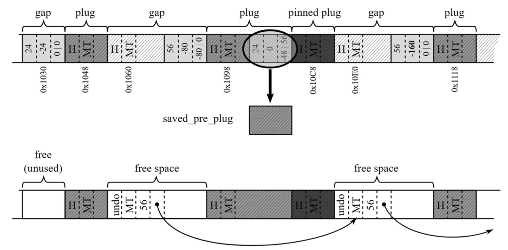
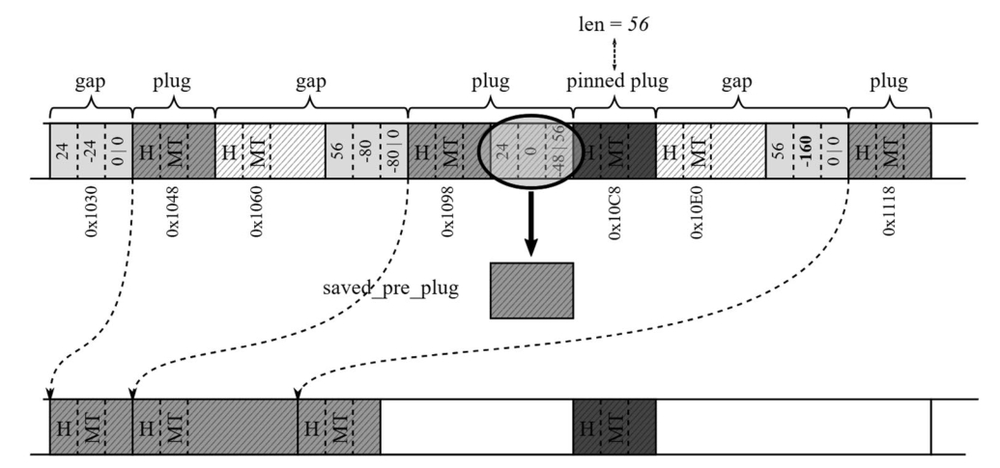
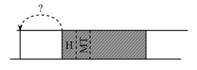
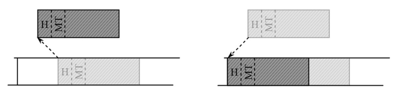
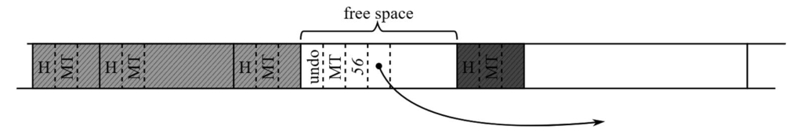
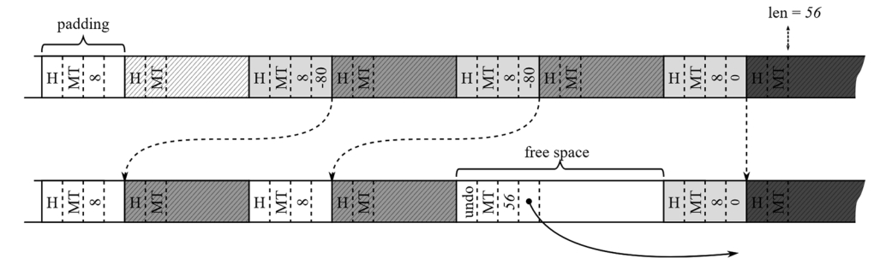
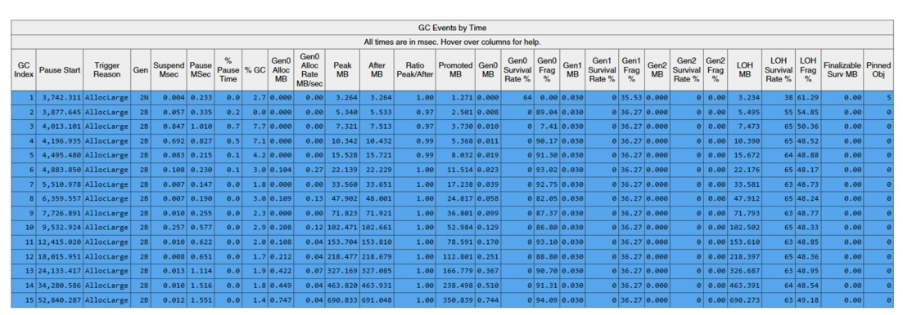
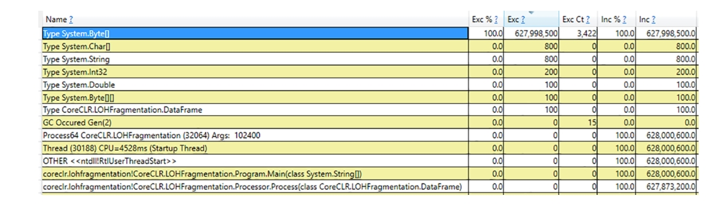
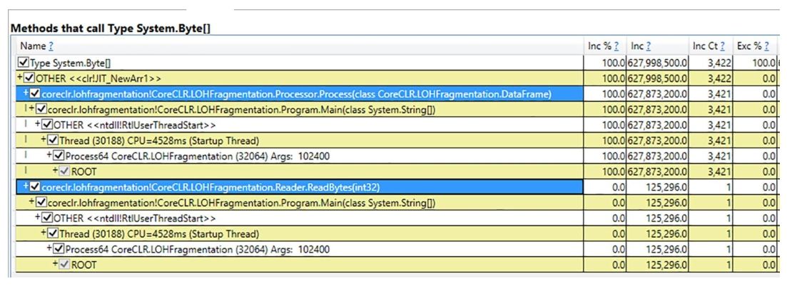
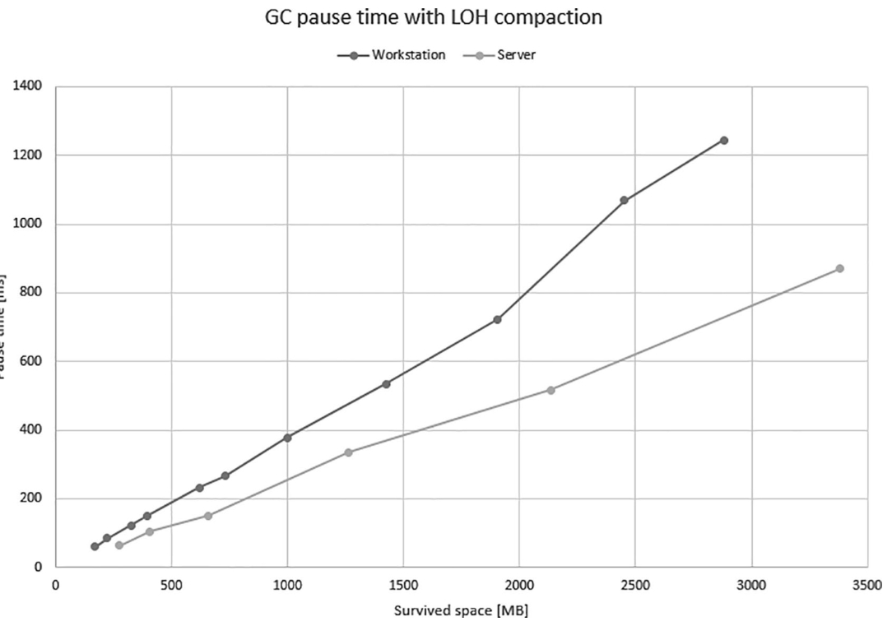

# 垃圾回收——清扫和压缩

关于GC细节的最后一章篇幅最短。尽管本章描述了“清扫”（Sweep）和“压缩”（Compact）等关键GC阶段，但通过前文您已了解大部分工作其实已在前期阶段完成。在“规划阶段”（Plan phase，见前一章）做出决策后，GC将执行本章所述的后续操作。

虽然此时多数计算已完成，但“清扫”或“压缩”阶段仍是性能开销的主要来源——修改和/或移动内存插槽（plugs）时的内存访问成本最为高昂。因此，尽管这些阶段在实现复杂度上低于前期，但对性能的影响却最为显著！

请注意最常见的GC组合是：先清扫LOH（大对象堆），再压缩SOH（小对象堆）。这个顺序很重要，我们将在本章后续说明。

## 清扫阶段

当GC决定不执行压缩时，就会进入清扫阶段。如第1章所述，清扫收集的原理很简单：将所有不可达对象转为空闲空间。您已了解在.NET GC术语中，这意味着需要将部分或全部内存间隙（gap）转换为空闲列表项（free-list items）。

正如前文强调且您现在可能已自行领悟的，清扫和压缩阶段都只是对“规划阶段”所收集信息的简单应用。对于快速浏览本书的读者而言，可能会惊讶于这两个在GC文献中高频出现的阶段——在本书中竟只占如此小的篇幅。这是因为所有繁重的计算工作都已提前在规划阶段完成！

### 小对象堆（SOH）清扫

小对象堆的清扫流程如下（见图10-1）：

- 将间隙转为空闲列表项：每个大于两个最小对象尺寸的间隙都会被创建为新的空闲列表项，并整合到空闲列表中（如第6章所述）。更小的间隙则视为未使用的空闲空间（但会计入碎片化统计）。
- 恢复保存的前后插槽：通过回写前后插槽（pre-and post-plugs）来还原所有“被销毁”的对象。
- 执行额外登记工作：更新终结队列（以反映新的代际边界），并根据类型对存活的句柄进行老化或年轻化处理。
- 调整内存段/区域：例如移除不再需要的段（或在VM囤积模式下将其存入可重用列表）。



图10-1 小对象堆（SOH）清扫结果示例（基于规划阶段信息）

■■若需从.NET Core源码研究SOH清扫机制，建议从gc_heap::plan_phase方法入手。在should_compact条件判断的else代码块中，会调用两个核心方法：gc_heap::make_free_lists将间隙转为空闲列表项，gc_heap::recover_saved_pinned_info恢复被前后插槽破坏的对象。

### 大对象堆（LOH）与固定堆（POH）

用户老年代堆（UOH）的清扫无需规划阶段参与，其实现方式是通过逐对象扫描堆内存（类似SOH规划阶段），直接在标记对象之间创建空闲列表项。此外，系统会删除不再需要的UOH内存段/区域（除非启用VM囤积模式，此时它们会被保留在段重用列表中）。

这种UOH清扫实现简单高效，但存在一个缺点——内存碎片化。用户可根据需要要求对LOH执行压缩。

## 压缩阶段

当GC决定（或收到显式指令）执行压缩时，将进入压缩阶段。如前所述，该阶段完全依赖规划阶段收集的信息。压缩过程分为两个主要阶段：移动（复制）对象、更新所有指向移动对象的引用。这使得压缩阶段的复杂度显著高于清扫阶段。尽管小对象堆与大对象堆的压缩原理相似，下文仍将分别详述。

### 小对象堆（SOH）

小对象堆的压缩必须极致高效。默认情况下，其中存在大量交错分布的间隙和插槽，可能涉及GB级数据。在保持所有地址有效的前提下移动这些内存，从性能角度来看绝非易事。让我们深入具体实现细节：

> 若需研究.NET Core源码中的SOH压缩实现，可重点查看 `relocate_phase`（更新移动对象地址）和 `compact_phase` （通过递归调用 `compact_plug` 与 `compact_in_brick` 方法逐块遍历插槽树）。

基于规划阶段信息，压缩过程按以下步骤执行：

#### 获取新的临时段（如需要）

当规划阶段显示需要扩展临时段（压缩后0/1代空间不足时），系统会通过三种方式实现：扩展当前临时段、复用其他段（如第7章所述）或创建新段。此操作不适用于区域化内存模式。

#### 重定位引用

此步骤会更新所有指向待移动对象地址的引用。由于在计划阶段已计算出所有信息，最终地址已预先确定，因此可以在实际移动对象前先行更新引用。这一过程需要大量工作，因为托管堆中可能散布着许多此类引用。重定位阶段充分利用了砖块（bricks）和插槽树（plug trees）来快速将当前地址转换为新地址。在此步骤中，GC会扫描多个内存区域以查找并更新引用：

- 栈上的引用：扫描所有托管线程的栈帧，查找并更新指向托管对象的引用。
- 跨代记忆集（cross-generational remembered set）中对象内部的引用：对于非完全GC（non-Full GC），所有通过卡表（cards）存储的跨代引用（包括SOH和LOH的跨代引用）都必须更新为新地址。
-  小对象堆（SOH）和用户老堆（UOH）中对象内部的引用：存活对象中包含的其他对象引用必须更新。对于SOH，使用砖块和插槽树快速定位存活对象（如前章所述，存活对象被分组为插槽）。对于完全GC，此时LOH和POH中通常只有存活对象（因为UOH清扫在SOH压缩之前完成），这使得GC无需砖块支持即可高效逐个扫描UOH存活对象。
-  插槽前后区域内部的引用：某些对象的末尾部分可能因插槽信息覆盖而损坏，其原始内存内容存储在固定插槽队列条目中。若其中包含引用，这些引用同样需要更新。
-  待终结队列中对象的引用：位于终结队列（见第12章）中的对象地址需要更新。
-  句柄表中的引用：句柄的指针需要更新。

对象包含的引用字段越多，此阶段GC的工作负载就越重。对于典型应用程序这可能不是问题，但当性能关键路径上使用非常复杂的数据结构时，值得考虑避免直接对象引用。

> 若想研究.NET Core中重定位阶段的代码实现，可从 `gc_heap::relocate_phase` 方法入手。其内部调用的核心方法是 `gc_heap::relocate_address`，该方法利用砖块和插槽树进行地址转换，被 `GCScan::GcScanRoots`、`gc_heap::relocate_in_uoh_objects` 及 `gc_heap::relocate_survivors` 等方法调用。

#### **移动压缩存活对象**

在前一步骤完成所有必要引用的更新后，GC 便开始移动所有存活对象。该过程包含以下步骤（见图 10-2）：

1. **复制对象**：按插槽（plug）逐个复制，使用预先计算的重定位偏移量。
2. **恢复插槽前后信息**：利用固定插槽队列（pinned plug queue）中存储的副本，修复对象被损坏的部分。



图 10-2：利用计划阶段计算的信息，压缩小对象堆（SOH）中的对象

尽管这一步骤的描述看似简短，但实际执行时可能涉及大量繁重工作。在完全 GC（Full GC）的情况下，遍历整个托管堆复制所有插槽可能会引发显著的内存流量。事实上，压缩式 GC 的大部分时间都消耗在此阶段。

有人可能会好奇，对象复制是如何实现的？由于插槽体积较大，其目标位置可能与当前内存区域重叠。那么，如何避免复制过程中对象自我覆盖？（见图 10-3）



图 10-3：对象复制的理论问题——原地复制可能导致自我覆盖

一种简单粗暴的解决方案是使用中间缓冲区（见图 10-4）。然而，这会使内存流量翻倍——每个对象都需要被复制两次。显然，这种方案不可接受。



图10-4 对象复制问题的解决方案——使用临时缓冲区

我们通常将对象视为必须整体复制的统一乐高积木。但在底层实现中，这些不过是连续的内存区域，完全可以分块复制。这正是CLR采用的策略。滑动压缩算法的关键在于：总是优先复制低地址数据，并通过严格控制复制粒度（在.NET中最小重定位地址至少间隔一个指针大小）从根本上避免内存重叠。因此对象复制通过 `memcopy` 函数以指针为单位进行内存搬运。为了提升效率，复制循环被展开为每次处理四个指针大小的内存块，剩余空间则按双指针或单指针大小分组处理（见代码清单10-1）。

代码清单10-1 对象复制过程中使用的 `memcopy` 方法核心部分

```c++
void memcopy(uint8_t* dmem, uint8_t* smem, size_t size)
{
	const size_t sz4ptr = sizeof(PTR_PTR)*4;
	// 每次处理四个指针大小的内存块
    if (size >= sz4ptr) {
        do {
            ((PTR_PTR)dmem)[0] = ((PTR_PTR)smem)[0];
            ((PTR_PTR)dmem)[1] = ((PTR_PTR)smem)[1];
            ((PTR_PTR)dmem)[2] = ((PTR_PTR)smem)[2];
            ((PTR_PTR)dmem)[3] = ((PTR_PTR)smem)[3];
            dmem += sz4ptr;
            smem += sz4ptr;
        } while ((size -= sz4ptr) >= sz4ptr);
    }
    // 处理剩余的16字节和/或8字节
}
```

代码清单10-1中的内存复制指令会被编译为多条 `mov` 汇编指令，从而获得极高的执行效率。

> 若需研究.NET Core压缩阶段的实现代码，可从 `gc_heap::compact_phase` 方法入手。该方法的核心工作是针对每个活动内存块调用 `gc_heap::compact_in_brick`，其底层又会调用 `gc_heap::compact_plug` 方法。当对象从年轻代区域迁移到老年代区域时，虽然使用的是老年代区域分配器来计算偏移量，但本质上仍采用完全相同的机制。

#### 修复分代边界

在压缩阶段完成后调用此步骤，用于修复所有分代边界。该过程会重置内部分配指针、为计划中的分配上下文创建空闲空间，并执行其他必要的修正操作。对于区域式内存布局，如果某个分代已没有可用区域，则会从该区域的空闲列表中获取一个区域；若空闲列表也为空，则创建新区域。

#### 按需删除/释放内存段

对内存段和区域进行相应整理，例如移除不再需要的段（若启用了虚拟机囤积机制，则将其存入可重用列表）。

#### 创建空闲列表项

在每个固定插槽（pinned plug）之前，若空间足够大（您可能记得，其长度已在计划阶段计算并保存在固定插槽队列条目中），就会创建新的空闲对象并加入空闲列表——详见图10-5。



图10-5. 在固定插槽前创建相应的空闲项（接续图10-2的示意图）

#### 更新根引用年龄

此阶段会进行额外修正以更新终结队列（反映新的分代边界），并调整相应类型存活句柄的年龄状态（老化或年轻化）。句柄年龄反映了其指向对象所属的分代，因此垃圾回收器能据此判断需要扫描哪些句柄。

### 大对象堆处理

大对象堆（LOH）的压缩采用与小对象堆（SOH）相似的技术。但由于LOH没有分代机制、复杂插槽结构及插槽树等设计，其实现更为简单。

若启用LOH压缩，该操作会在SOH压缩之前执行。整个过程通过单次循环扫描LOH中已标记对象，并依据LOH规划阶段计算的迁移偏移量逐个复制到目标位置。对于固定对象，系统会在其前方创建对应的空闲空间（见图10-6）并链接到空闲列表。对象间的填充区域将予以保留，以供后续GC循环使用。



图10-6. 利用规划阶段计算的信息进行大对象堆压缩

### 场景10-1 – 大对象堆碎片化

描述：在应用程序开发过程中，你注意到其内存使用量明显高于预期。该应用程序主要用于处理大型数据包并生成结果数据包——比如批量处理图像。其处理代码片段如清单10-2所示，注释中标注了所处理数据的大小。由于输入帧和输出帧均大于85,000字节，它们都被分配在大对象堆（LOH）中。待存储的数据为100千字节（`largeBlocks`），因此同样创建于LOH。

清单10-2. 演示LOH碎片化的示例代码

```c#
void Main()
{
    // ...
    List<byte[]> largeBlocks = new List<byte[]>();
    while (someCondition)
    { 
        // . 
        var frame = reader.ReadBytes(size); // 输入帧始终大于85,000字节
        var output = processor.Process(frame); // 输出帧略大于输入帧
        var largeBlock = new byte[102_400]; // 从输出帧中提取数据存入largeBlock
        largeBlocks.Add(largeBlock);
    }
    // ...
}
```

虽然这个示例看似刻意设计，但它揭示了大对象堆碎片化的最常见诱因之一：数组；字符串则是另一大诱因。

分析：假设通过初步分析，你已确认LOH体积超出预期（见表10-1）。可能通过性能计数器或基于ETW（Windows事件追踪）的数据验证了这一现象。

表10-1. 大对象堆预期体积与实际观测值对比

| 对象数量 | 预期值[MB]  | 观测值[MB]  |
| -------- | ----------- | ----------- |
| 1,000    | 102,400,000 | 152,769,104 |
| 2,000    | 204,800,000 | 324,972,048 |
| 3,000    | 307,200,000 | 463,287,752 |
| 4,000    | 409,600,000 | 686,795,056 |

通过在PerfView中记录基于ETW的会话（选择标准“GC Collect Only”选项），可以快速定位问题根源是LOH碎片化（见图10-7）。根据“LOH碎片率%”列显示，碎片化程度约为48%，这意味着大量空间被浪费！



图10-7. PerfView的GCStats报告中“按时间排序的GC事件”表格（来自被调查进程）

一如既往，我们当然可以通过直接分析代码来定位大对象堆的分配情况。但有没有更简便的方法呢？答案依然是——PerfView来拯救！大对象堆碎片化本质上是由死亡对象造成的，正是这些对象导致了内存碎片。因此，最理想的方式是查明哪些对象在大对象堆中最频繁死亡。幸运的是，只要在记录ETW会话时启用“.NET”选项（而非“GC Collect Only”或“GC Only”），PerfView就能提供这类统计信息。记录完成后，你可以在内存组中打开“Gen 2 Object Deaths (Coarse Sampling) Stacks”视图（见图10-8）。虽然名称如此，但该分析实际上也涵盖了大对象堆中的对象。如图所示，大量 `System.Byte[]` 数组正在消亡——这个发现本身可能就足以明确问题源头，但我们还能深入挖掘。



图10-8. PerfView中“Gen 2 Object Deaths (Coarse Sampling) – By Name”视图，显示Gen2+代中消亡的对象

选中 `System.Byte[]` 类型后，通过右键菜单“Goto”组中的“Goto Item in Callers”功能，我们将看到这些死亡对象的内存分配堆栈轨迹（见图10-9），这才是真正具有实操价值的信息！

> 请注意：该采样数据基于CLR的GCAllocationTick事件生成，该事件每分配100KB内存触发一次。这意味着对于85,000字节的阈值，至少每两个对象会触发一次事件；而对于真正的大对象，每个对象都会触发事件。

触发 `GCAllocationTick` 事件前的100KB阈值并非全局设置，而是针对每个对象堆独立计算的。通过查看事件负载中的 `AllocationKind` 字段（0表示小对象堆SOH，1表示大对象堆LOH，2表示固定对象堆POH），可以确定具体是哪个堆触发了阈值。

分析小对象堆碎片化时，通过在PerfView采集配置中选择“.NET Alloc”或“.NET SampAlloc”选项，可以获得更精细的分析结果。



图10-9. PerfView中的“Gen 2 Object Deaths (Coarse Sampling) – Callers”视图，显示分配 `System.Byte[]` 的方法

从调用方视图中可以清晰看出，存在两个导致字节数组死亡的分配源头。但值得注意的是，`Reader.ReadBytes()` 方法仅分配了单个消亡数组，而 `Processor.Process` 方法却分配了数以千计的消亡数组。

在实际应用程序中，通常存在多种不同类型的“高频死亡”对象。作为通用排查原则，建议优先关注列表顶部分配量最大的方法。因此在本案例中，您应当重点审查 `Processor.Process` 方法为何会分配如此大量短命的字节数组。

另一种诊断方法是使用WinDbg配合SOS扩展，无论是分析内存转储文件还是直接附加到进程。通过执行 `!heapstat` 命令，可以获取托管堆的整体概况（见清单10-3）。正如预期，我们观察到LOH存在显著碎片化（22%），同时还有大量未被回收但已不可达的对象（25%）。综合计算可得出47%的碎片率，这与之前的分析结果相互印证。

清单10-3. 碎片化分析——使用 `!heapstat` 命令获取托管堆概览

```
> !heapstat -inclUnrooted
Heap Gen0 Gen1 Gen2 LOH
Heap0 1579192 96024 24 1907001192
Free space: Percentage
Heap0 7816 11160 0 434527752SOH: 1% LOH: 22%
Unrooted objects: Percentage
Heap0 1567816 65560 0 488427824SOH: 97% LOH: 25%
```

我们还可以利用大对象堆（LOH）的内存组织与分配原理进行深度分析。通过执行 `!eeheap` 命令，可以列出所有LOH内存段（见清单10-4）。正如预期（参考表5-3所述，在64位运行时配合工作站GC模式下，内存段大小为128MB），随着内存增长会出现多个LOH段。您需要了解：当当前段空间耗尽时会逐个创建新段，且分配器在段内采用线性内存分配策略。简而言之，内存地址越高，其中存储的数据就越新。

清单10-4. 碎片化分析——使用 `!eeheap` 命令列举LOH内存段

```
> !eeheap -gc
Number of GC Heaps: 1
generation 0 starts at 0x0000013acb3c8730
generation 1 starts at 0x0000013acb3b1018
generation 2 starts at 0x0000013acb3b1000
ephemeral segment allocation context: none
segment begin allocated size
0000013acb3b0000 0000013acb3b1000 0000013acb549fe8 0x198fe8(1675240)
Large object heap starts at 0x0000013adb3b1000
segment begin allocated size
0000013adb3b0000 0000013adb3b1000 0000013ae33af528 0x7ffe528(134210856)
0000013ae4a60000 0000013ae4a61000 0000013aeca5fdb0 0x7ffedb0(134213040)
0000013aed130000 0000013aed131000 0000013af512f300 0x7ffe300(134210304)
0000013af5130000 0000013af5131000 0000013afd11c870 0x7feb870(134133872)
0000013a80000000 0000013a80001000 0000013a87fecf10 0x7febf10(134135568)
0000013a8a890000 0000013a8a891000 0000013a9287d0d0 0x7fec0d0(134136016)
0000013a92890000 0000013a92891000 0000013a9a8811c8 0x7ff01c8(134152648)
0000013a9a890000 0000013a9a891000 0000013aa28881a0 0x7ff71a0(134181280)
0000013aa2890000 0000013aa2891000 0000013aaa879090 0x7fe8090(134119568)
0000013aaa890000 0000013aaa891000 0000013ab287d060 0x7fec060(134135904)
0000013ab2890000 0000013ab2891000 0000013aba87bb20 0x7feab20(134130464)
0000013aba890000 0000013aba891000 0000013ac2880680 0x7fef680(134149760)
0000013afd130000 0000013afd131000 0000013b05117f28 0x7fe6f28(134115112)
0000013b05130000 0000013b05131000 0000013b0d118458 0x7fe7458(134116440)
0000013b0d130000 0000013b0d131000 0000013b0ecb6fc8 0x1b85fc8(28860360)
Total Size: Size: 0x71c41750 (1908676432) bytes.
------------------------------
GC Heap Size: Size: 0x71c41750 (1908676432) bytes.
```

通过转储最旧内存段（清单10-4中的首个段）内容，可以观察长期存在的碎片化模式（见清单10-5）。碎片化现象清晰可见——78,974字节的空闲内存区域与102,424字节的对象交替分布。使用 `!gcroot` 命令可快速定位这些对象的引用链（同样参见清单10-5）。例如，最后一个字节数组对象的唯一根引用是Main方法中 `List<byte[]>` 类型的局部变量 `largeBlocks`。这就是典型的碎片化场景——大量存活对象（主要是数组）与空闲内存块交错分布。

清单10-5. 碎片化分析——使用 `!dumpheap` 命令列举首个LOH段对象（结果截取最后几行）及 `!gcroot` 命令追踪示例对象的引用根

```
> !dumpheap 0000013adb3b1000 0000013ae33af528
...
0000013ae22b4cd8 00007fff857ebe10 102424
0000013ae22cdcf0 0000013ac914e200 78974 Free
0000013ae22e1170 00007fff857ebe10 102424
0000013ae22fa188 0000013ac914e200 30 Free
0000013ae22fa1a8 00007fff857ebe10 102424
0000013ae23131c0 0000013ac914e200 78974 Free
0000013ae2326640 00007fff857ebe10 102424
0000013ae233f658 0000013ac914e200 30 Free
0000013ae233f678 00007fff857ebe10 102424
0000013ae2358690 0000013ac914e200 78974 Free
0000013ae236bb10 00007fff857ebe10 102424
0000013ae2384b28 0000013ac914e200 30 Free
0000013ae2384b48 00007fff857ebe10 102424
0000013ae239db60 0000013ac914e200 78974 Free
0000013ae23b0fe0 00007fff857ebe10 102424
0000013ae23c9ff8 0000013ac914e200 30 Free
0000013ae23ca018 00007fff857ebe10 102424
> !gcroot 0000013ae23ca018
Thread 811c:
000000233e9feeb0 00007fff28fc0645 CoreCLR.LOHFragmentation.Program.Main(System.String[])
rbp-80: 000000233e9fef20
-> 0000013acb3b68d0 System.Collections.Generic.List`1[[System.Byte[], mscorlib]]
-> 0000013abaf50a68 System.Byte[][]
-> 0000013ae23ca018 System.Byte[]
Found 1 unique roots (run '!GCRoot -all' to see all roots).
```

然而，仅仅知道存活对象之间存在空隙并不能揭示问题本质。关键在于查明哪些对象的消亡导致了这些空隙？答案往往隐藏在最新分配的数据中。通过转储最新内存段（清单10-4中的最后一个段）的内容，可以观察即时产生的碎片化形态（见清单10-6）。如果足够幸运，您会发现类似的分布模式——只不过这些间隙中存在的不是空闲块，而是尚未被回收的对象。本案例正是如此：最新LOH区域包含之前描述的小型填充用空闲块、以及我们熟悉的102,424字节对象，但二者之间还夹杂着其他对象！

清单10-6. 碎片化分析——使用 `!dumpheap` 命令列举末段LOH对象（结果截取最后几行）

```
> !dumpheap 0000013b0d131000 0000013b0ecb6fc8
0000013b0ec0b4b0 0000013ac914e200 30 Free
0000013b0ec0b4d0 00007fff857ebe10 99634
0000013b0ec23a08 0000013ac914e200 30 Free
0000013b0ec23a28 00007fff857ebe10 102424
0000013b0ec3ca40 0000013ac914e200 30 Free
0000013b0ec3ca60 00007fff857ebe10 99627
0000013b0ec54f90 0000013ac914e200 30 Free
0000013b0ec54fb0 00007fff857ebe10 99635
0000013b0ec6d4e8 0000013ac914e200 30 Free
0000013b0ec6d508 00007fff857ebe10 102424
0000013b0ec86520 0000013ac914e200 30 Free
0000013b0ec86540 00007fff857ebe10 99628
0000013b0ec9ea70 0000013ac914e200 30 Free
0000013b0ec9ea90 00007fff857ebe10 99636
```

通过分析这些对象的引用根（见清单10-7），您将锁定碎片化的罪魁祸首。可以识别出这些字节数组源自 `DataFrame` 类，由 `Program.Main` 和 `Processor.Process` 方法创建。

清单10-7. 碎片化分析——使用 `!gcroot` 命令定位导致碎片化的对象引用根

```
0:000> !gcroot 0000013b0ec3ca60
Found 0 unique roots (run '!GCRoot -all' to see all roots).
0:000> !gcroot 0000013b0ec54fb0
Found 0 unique roots (run '!GCRoot -all' to see all roots).
0:000> !gcroot 0000013b0ec86540
Thread 811c:
000000233e9feeb0 00007fff28fc0645 CoreCLR.LOHFragmentation.Program.Main(System.String[])
r15:
-> 0000013acb549228 CoreCLR.LOHFragmentation.DataFrame
-> 0000013b0ec86540 System.Byte[]
Found 1 unique roots (run '!GCRoot -all' to see all roots).
0:000> !gcroot 0000013b0ec9ea90
Thread 811c:
000000233e9fee50 00007fff28fc0aad CoreCLR.LOHFragmentation.Processor.Process
(CoreCLR.LOHFragmentation.DataFrame)
rbx:
-> 0000013acb549240 CoreCLR.LOHFragmentation.DataFrame
-> 0000013b0ec9ea90 System.Byte[]
Found 1 unique roots (run '!GCRoot -all' to see all roots).
```

调查至此结束。该示例较为简单，因为仅少数类型对象被分配到大对象堆（LOH），且大对象分配模式被刻意设计为最大化碎片化（每个连续输入帧都比前一个略大）。这种模式会产生难以被重复利用的空闲项间隙。在此场景下，最新对象会堆积在末端，因此可以轻松定位到垃圾回收前可能仍存活的对象位置。

在复杂应用程序中，大对象堆将包含各种尺寸的众多对象。此时分析那些最终变成无用间隙的对象来源会繁琐得多。碎片化问题没有放之四海皆准的调查法则，事实上这是各类内存相关问题中最难分析的方面之一，因其具有时间性特征。虽然存在内存间隙，但无法直接追溯这些间隙之前存储的内容。多数情况下，这些间隙会通过空闲列表分配器重新利用，这使得调查更加困难——新对象会分散在第二代堆或大对象堆中所有可重复利用的间隙里。遗憾的是，不存在“此处曾由对象X占用但长期闲置”的明确事件标记，我们只能依靠前文所示的间接证据。

> 请注意在.NET Framework中，大对象堆包含CLR内部使用的某些数组。例如程序集加载时创建的静态引用数组不应造成问题，还有用于字符串驻留的数组（参见第8章图8-1及第4章“字符串驻留”章节）。若进行过度的显式字符串驻留操作，构建这些表也可能导致大对象堆碎片化！不过需注意，自引入固定对象堆后，这些数据结构已改存其中。

既然已知大对象堆碎片化是个问题，我们该如何应对？自.NET Framework 4.5.1（及.NET Core 1.0）起，可显式强制压缩大对象堆。具体方法是将静态属性 `GCSettings.LargeObjectHeapCompactionMode` 设为 `GCLargeObjectHeapCompactionMode.CompactOnce`。该设置仅会在首次发生的阻塞式GC时触发一次压缩。需注意此设置仅影响阻塞式回收，典型的非阻塞式（后台）GC不会响应此设置，因此通常需要在设置该属性后立即显式触发阻塞式完全GC。

解决方案之一是显式触发LOH压缩，可选择定期执行或如代码清单10-8示例所示在内存使用超过阈值时执行。这两种方案均非完美，需审慎考量，它们会带来前文讨论过的显式GC调用的所有问题。

另一解决方案是启用 `GCConservativeMode`（如第11章所述）。

代码清单10-8 演示LOH碎片化的示例代码

```csharp
if (GC.GetTotalMemory() > LOH_COMPACTION_THRESHOLD) 
{ 
    GCSettings.LargeObjectHeapCompactionMode = GCLargeObjectHeapCompactionMode.CompactOnce; 
    GC.Collect(); 
}
```

除阻塞式GC的固有缺陷外，压缩大对象堆本身也较耗时。暂停时间与存活对象总大小呈线性增长，即使对于仅存活几百MB的小型大对象堆，应用程序也会暂停100至200毫秒。存活对象规模越大，情况越严重——当存活对象达数GB量级时，应用程序可能冻结超过1秒！图10-10展示了工作站GC与服务器GC模式下的耗时对比（具体数值可能因硬件性能而异）。



图10-10  LOH（大对象堆）碎片化场景下工作站GC与八托管堆服务器GC的暂停时间（测试环境：Intel i7-4770K处理器，16GB DDR3-1600内存）

服务器GC的大对象堆压缩速度略快，因其LOH被分割为多个可并行压缩的段。当遇到无法重构的第三方代码导致LOH管理问题时，压缩可能是唯一解决方案。若拥有源码权限，更优方案是采用大对象池或数组池技术（参见第6章“创建数组——使用ArrayPool”“创建大量对象——使用对象池”章节）。

> 注意：如第7章所述，某些特定场景（例如运行设置内存限制的Docker容器应用）会触发LOH自动压缩机制。

## 总结

可见清扫阶段极为高效，因其无需大量内存操作，仅需局部修改创建空闲项并恢复被占位信息覆盖的对象。相比之下，压缩过程复杂且引发显著内存流量。决策采用何种策略正是前一章所述计划阶段的核心职责。

至此我们完成了.NET内存管理核心——垃圾收集器（第7-10章）的全面解析。前六章仅是铺垫，后续内容皆为延伸。这些章节逐步深入揭示了GC各关键阶段：

- 触发垃圾收集的机制（第7章）
- 运行时如何协作实现托管线程暂停（第7章）
- GC的代际选择策略（第7章）
- 通过根标记实现可达对象追踪（第8章）
- GC如何同步规划压缩与清扫策略并择优执行（第9章）
- 压缩与清扫的具体执行流程（本章）

理论原理（工作机制与设计初衷）与实践场景（问题分析与编码优化）始终交织呈现。系统学习这些章节后，您已建立坚实的.NET GC知识体系，并能运用所述方法诊断常见问题、规避典型错误。

由于各章节知识高度关联，相关准则统一汇总于本章末。但这远非终点——GC仍有许多细节待探索。后续内容将更加侧重实践，包括GC不同模式（第11章）与终结机制（第12章）等深度解析。期待您继续探索之旅！

> 注意，垃圾收集相关章节未提及 `IDisposable` 接口。新手开发者常误以为该接口会“触发”对象回收，这实属谬误。`IDisposable` 仅是约定类型实例生命周期需显式管理的契约接口，与GC机制无直接关联。为避免混淆并保持章节简洁，该机制详解详见第12章。