# GC模式与设置

前四章详细描述了.NET垃圾回收器（GC）的最基础形态。在本章中，我们将探讨所有GC的变体。除了了解它们的设计原理和原因，我们还将分析其优缺点，涵盖GC的操作模式和延迟设置。

关于.NET中不同的GC模式，最常见的疑问是：如何选择？因此，在了解它们的差异后，我们将尝试回答这一关键问题。本章中的场景还将展示所选模式对应用程序性能和行为的实际影响。

## 模式概览

在第七章开头“高层次视角”一节中，已简要总结了.NET GC可能运行的各种模式。为了建立上下文，当时有必要概述这些模式。现在，我们将深入探讨这些模式的区别及其背后的设计逻辑。

### 工作站模式 vs. 服务器模式

最核心的划分是**工作站模式（Workstation）**和**服务器模式（Server）**。这两种模式自.NET运行时诞生之初便存在，其名称源于它们的目标应用场景。不过，尽管代表典型用途，实际使用中完全可以在桌面应用中选择服务器模式，或在Web应用中选择工作站模式——具体取决于需求。更恰当的方式是将这两种模式视为两组显著不同的GC配置集合。

#### 工作站模式

工作站模式主要针对交互式、基于UI的应用程序对响应速度的需求。良好的交互性要求应用程序的停顿尽可能短暂——用户不希望因长时间GC导致界面卡顿。较长的停顿会影响操作的流畅性和整体响应性。因此：

- **GC触发更频繁，单次工作量更少**：由于对象创建频率较低，产生的垃圾量较少。
- **内存使用更低**：频繁的GC会更积极地回收内存，减少“残留垃圾”。
- **单一托管堆（Managed Heap）**：桌面应用通常单任务处理，无需并行处理多堆。同时，该模式假设计算机上运行着多个应用，每个应用占用部分CPU核心和内存，因此无需（也不适合）通过多线程同时处理多个堆。自设计之初，工作站模式便采用单线程处理单一托管堆。
- **内存段较小**：适用于操作小内存区域（但此特性不适用于“区域（Regions）”内存模型）。

虽然多数桌面应用受益于这些设计，但并非所有场景均适用。例如，某些桌面应用可能在后台触发并行处理（如编译或语法验证），此时需要权衡模式选择。

#### 服务器模式

服务器模式专为需要**并行处理大量请求**的应用程序设计。此类应用通常追求**高吞吐量**——即在单位时间内处理尽可能多的数据。因此：

- **默认内存段更大**（尤其在64位系统上）：在触发GC前可容纳更多内存分配（但此特性不适用于“区域（Regions）”内存模型，因其大小与模式无关）。
- **GC触发频率更低**：由于GC间隔期间创建了更多对象，单次暂停时间通常更长。但由于**多CPU核心并行处理**，实际暂停时间可能短于工作站模式。此外，多次小规模GC的效率低于单次大规模GC——过早回收可能导致本可自然消亡的对象被误保留（存活率随等待时间延长而降低）。最终，累计暂停时间反而更短。
- **内存占用更高**：低频GC会导致更多“残留垃圾”，工作集（Working Set）内存大于工作站模式。但服务器通常配备大容量内存，故这不构成严重问题。
- **多托管堆（Managed Heaps）架构**：根据CPU核心数动态扩展，并行处理多个堆比操作单一巨堆更高效。需注意，在容器化场景中若CPU受限，此优势可能受限。

综上，服务器模式**以更高内存消耗为代价换取更低的总暂停时间**。

> 有人可能会好奇，这两种截然不同的模式在.NET源代码中是如何组织的，以及它们共享多少代码。以.NET Core为例（虽然如第4章所述所有.NET发行版共享相同的GC），其核心实现都集中在同一个 `.\src\coreclr\gc\gc.cpp` 文件中，该文件包含大量由 `#if` 预处理器指令控制的代码块。随后，这个文件会在两个不同的命名空间和预定义宏配置下被编译两次——其中 `.\src\coreclr\gc\gcsvr.cpp` 定义了 `SERVER_GC` 常量和 `SVR` 命名空间：
>
> ```cpp
> #define SERVER_GC 1  
> namespace SVR { 
>     #include "gcimpl.h"  
>     #include "gc.cpp"  
> }
> ```
>
> ```cpp
> namespace WKS {  
>     #include "gcimpl.h"  
>     #include "gc.cpp"  
> }
> ```

因此，当看到各种与GC相关的类型或方法时，它们要么来自 `WKS::` 命名空间，要么来自 `SVR::` 命名空间。定义 `SERVER_GC` 宏会隐式启用其他几个重要宏（尤其是 `MULTIPLE_HEAPS`），而 gc.cpp 中大量代码段都依赖于此宏。

### 非并发模式 vs. 并发模式

除了运行模式之外，GC与用户线程的协作方式还有两种：**并发模式**（GC工作与其他线程并行执行）和**非并发模式**（GC工作时所有用户线程暂停）。

#### 非并发模式

非并发GC自.NET诞生之初就存在，同时支持工作站模式和服务器模式。其实现概念非常简单——所有托管用户线程在GC期间被挂起，GC完成工作后恢复线程执行。

#### 并发模式

并发GC（如名称所示）会在用户线程正常运行时执行。这使得其概念和实现都复杂得多：用户线程与垃圾回收器（Collector）在工作期间必须保持额外同步，以确保双方对内存状态有一致的认知，避免引发严重问题（例如修改已被回收的对象，或误回收仍存活的对象）。这种同步机制的实现显然并非易事，尤其是在需要保持低开销的情况下。后文将具体解析.NET如何实现这种技术。

并发GC在不同.NET版本中的命名有所变化：

- 工作站GC的并发版本自.NET 1.0起提供，最初称为“并发工作站GC”（Concurrent Workstation GC）。.NET 4.0引入重要改进后，更名为“后台工作站GC”（Background Workstation GC）。
- 服务器GC的并发版本直到.NET 4.5才推出，称为“后台服务器GC”（Background Server GC）。

> 在源代码组织层面，这两种模式依然实现在同一个 `.\src\coreclr\gc\gc.cpp` 文件中。并发版本的代码被 `#if BACKGROUND_GC` 预处理器指令包裹。需要注意的是，`BACKGROUND_GC`宏在 SVR 和 WKS 版本中始终被定义，它们同时包含并发与非并发模式的代码，实际运行模式在运行时启动阶段动态启用。

## 模式配置

从前文可知，垃圾回收器存在两个相互独立的配置项，每个配置项有两种可选值，由此组合出四种可能的运行模式。这基本上就是您能对GC进行的全部设置了——习惯了JVM世界高度精细化配置的用户可能会感到惊讶。这显然是经过深思熟虑的设计决策：JVM采用以GC为核心的配置思路，您可以调整几乎所有的GC操作细节，但必须深入理解其原理并明确修改目的；而微软选择了以应用为中心的路径——开发者只需根据应用类型选择对应模式，具体如何响应负载和适应应用特性则由GC自行负责。

后续章节将简要介绍如何在.NET Framework和更新的.NET Core中调整GC工作模式。

请注意，本文不会描述这些设置在项目文件层面（例如 Visual Studio 中）的具体表现形式。整个.NET生态中存在多种工具和项目格式，请参考您所用工具的最新文档。这里呈现的是运行时直接识别的底层配置，这些设置在未来不太可能发生变动。

需特别注意，在仅配备单逻辑CPU核心的机器上，无论 `gcServer` 如何设置，系统始终采用工作站GC模式。

### .NET Framework

对于.NET Framework应用程序，调整GC模式的主要方式是通过标准配置文件（见代码清单11-1）：

- ASP.NET Web应用：托管在IIS中的Web应用需使用 `web.config` 文件。请注意，在此场景下ASP.NET宿主默认启用服务器GC模式（在.NET 4.5+运行时中还会额外启用后台模式）。

- 控制台应用或 Windows 服务：默认使用 `[应用名称].exe.config` 文件。若未指定这些设置，系统默认启用并发工作站模式。这对以请求处理方式处理大量数据的 Windows 服务尤为重要！此类服务的行为更接近服务器应用而非交互式应用，切换至某种服务器GC变体可显著提升性能。

代码清单11-1 .NET Framework应用程序的GC相关配置（`[应用名称].exe.config/Web.config`文件）

```xml
<?xml version="1.0" encoding="utf-8"?>
<configuration>
  <startup>
    <supportedRuntime version="v4.0" sku=".NETFramework,Version=v4.7"/>
  </startup>
  <runtime>
    <gcServer enabled="true"/>
    <gcConcurrent enabled="true"/>
  </runtime>
</configuration>
```

这些配置也可通过环境变量或注册表项设置（路径：`HKCU\Software\Microsoft.NETFramework`）：

- `COMPlus_gcServer=0/1` 环境变量或 `gcServer` 注册表键（值0/1）
- `COMPlus_gcConcurrent=0/1` 环境变量或 `gcConcurrent` 注册表键（值0/1）

### .NET Core

.NET Core在配置方面更为灵活，除文件配置外还提供两种新方式：

文件配置与.NET Framework类似，仅将XML格式改为JSON（见代码清单11-2）。

代码清单11-2 .NET Core应用程序的GC相关配置

```json
SomeApplication.runtimeconfig.json
{
  "runtimeOptions": {
    "tfm": "net8.0",
    "framework": {
      "name": "Microsoft.NETCore.App",
      "version": "8.0.0"
    },
    "configProperties": {
      "System.GC.Server": true,
      "System.GC.Concurrent": true
    }
  }
}
```

.NET Core支持更多称为“配置旋钮（configuration knobs）”的设置，可通过多种方式传值，其中最值得注意的是环境变量方式——这在Docker镜像等严格隔离的环境中尤为实用。完整配置旋钮列表参见：https://learn.microsoft.com/en-us/dotnet/core/runtime-config/garbagecollector：

- `DOTNET_gcServer`/`COMPlus_gcServer=0/1`环境变量或 `gcServer` 注册表键（值0/1）
- `DOTNET_gcConcurrent`/`COMPlus_gcConcurrent=0/1` 环境变量或 `gcConcurrent` 注册表键（值0/1）

> 注意：若同时设置JSON配置和环境变量/注册表，`COMPlus_`/`DOTNET_`前缀的配置具有更高优先级。
>  所有数值均需使用十六进制格式（即使不带0x前缀）。

## GC暂停与开销

自动内存管理这一话题本质上与其引入的开销息息相关。毕竟，GC（垃圾回收器）是作为应用程序的一部分运行的代码。它会消耗CPU周期，并可能在运行期间导致应用程序其余部分暂停工作。此前我们并未特别关注GC活动的开销问题，现在正是探讨这一话题的时机。不同GC运行模式具有不同的性能特征，因此这是分析该问题的理想切入点。

但如何衡量这种开销？我们讨论的究竟是哪方面的开销？从.NET应用程序整体性能的角度来看，可以从两个层面进行分析：

- GC层面：如前所述，GC工作会带来两个最不受欢迎的副作用。

  - **GC暂停**：目前并不存在完全无暂停的GC。应用程序线程被GC暂停显然是不可取的，尤其是在交互式应用中。开发者可能需要测量GC暂停时间（总时长、平均值、百分位数等）。可接受的暂停阈值取决于具体应用特性。一般而言，若频繁出现单次GC暂停超过数十毫秒的情况，就应引起高度警惕。

  - **GC的CPU开销**：执行GC代码与其他代码一样会消耗CPU资源。GC运行时间越长或使用的CPU核心越多，被占用的常规代码执行资源就越多。这对并发和非并发GC同样重要。同样，可接受的GC使用阈值取决于具体应用场景。在常规Web应用中，我们观察到持续超过10%的GC使用率就值得警惕。

- **应用层面**：测量应用程序性能本身可以单独成书，但最核心的指标包括：

  - **吞吐量**：应用程序执行速度，例如单位时间内可处理的HTTP请求数量

  - **延迟**：通常关注尾部延迟，例如耗时最长的X%操作的执行时长

  - **内存消耗**：内存占用量，特别是峰值内存使用情况

图11-1展示了.NET中最常用的两种GC开销测量方式。图中呈现了两个用户线程（T1和T2）和一个GC线程（GC1）的状态随时间变化情况。当线程未占用处理器时间（处于等待状态）时，用虚线表示；当线程执行与GC相关的代码时，用箭头标记；执行程序代码的线程则用浅灰色矩形表示。此外，线程被挂起或恢复的时刻用深灰色区域标注。本章后续将沿用这套图示规范来阐释各GC模式的工作原理。

通过这种呈现方式，可以直观说明两种主流.NET指标：

- GC暂停时间：测量GC非并发阶段的持续时间。包含执行引擎挂起应用程序线程的时间、GC执行时间以及线程恢复时间的总和。该数据可通过PerfView中GCStats报告的“GC Events by Time”表格查看（对应Suspend MSec列记录挂起/恢复耗时，Pause MSec列记录GC处理耗时）。
- CPU相对GC时间占比：描述从上次GC至今的时间段内，GC总耗时（含并发GC阶段）所占的比例。该指标体现在PerfView的GCStats报告中“GC Events by Time”表格的“% GC”列。

> 注：虽然“% Time in GC”性能计数器或“time-in-gc”.NET计数器也可测量GC的CPU开销，但其精确度较低。自引入后台GC后，.NET团队更推荐采用基于CLR事件的测量方式（通过ETW或EventPipe实现）。需特别注意：当未发生GC时，该性能计数器不会更新，将保持显示前次测量值。因此，若在性能监视器中看到持续显示99%的GC时间，可能只是上次GC的未更新数据——此时应通过检查“# Gen 0 Collections”性能计数器或“gen-0-gccount”.NET计数器等指标来确认是否发生了新的GC。

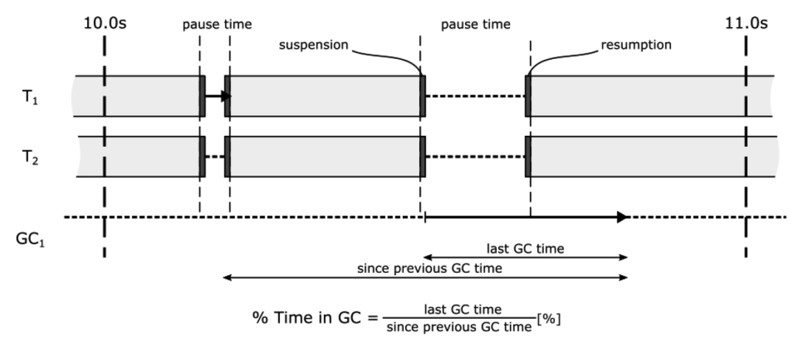

图11-1 暂停时间与GC耗时占比——典型的.NET GC度量指标

众多免费或商业工具均可提供类似指标，但其测量方式可能存在差异，具体细节请参阅各工具文档。

我们将在分析不同GC模式时再次讨论这些度量指标。现在，让我们开始详细解读.NET垃圾回收的四种工作模式。

## 模式描述

接下来的小节将介绍四种垃圾回收（GC）模式的工作原理。这些模式已通过类似图11-1的示意图进行说明。为简洁起见，大多数示意图中省略了暂停/恢复块，但需注意这些操作会在GC的每个非并发阶段前后发生。此外，所有示意图均假设分配器（Allocator）在某一时刻判定需要触发GC。图表中的时间长度仅为示意用途，实际GC/用户线程的耗时应通过专业工具测量。

每种模式的描述均附有典型应用场景列表。

### 工作站非并发模式

最简单的GC模式实际上已在第7至10章详细阐述，它是.NET中GC工作机制的基础。后文将直接称其为“非并发GC”（省略“工作站”或“服务器”标注）。该模式具有以下特征（见图11-2）：

- 所有托管线程在GC全程都会被挂起，无论进行的是0代、1代还是2代（完全GC）垃圾回收。单次短暂GC耗时极短，因此采用非并发方式并无问题。但图中特别指出，完全阻塞式GC（非并发模式下的完全GC称为完全阻塞式GC）可能比短暂GC消耗更多时间，这类GC会显著影响系统响应。
- GC代码由触发回收的用户线程执行（在分配器内部触发），且不改变该线程的常规优先级（通常为普通优先级），因此需与其他应用程序线程竞争CPU资源。
- GC始终在“全局停顿（STW）”阶段执行，且可根据策略决定是否启用压缩。

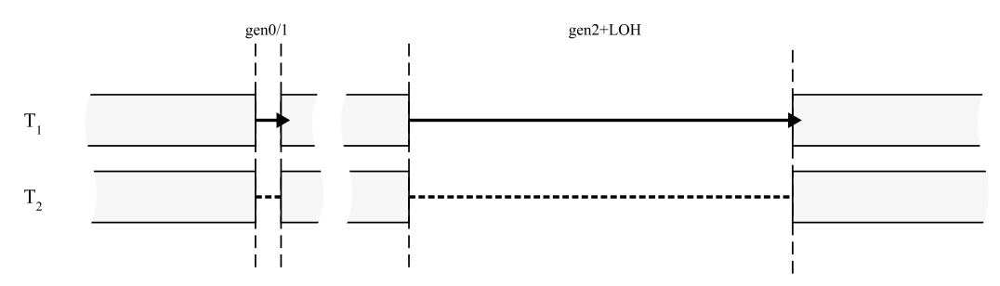

图11-2 工作站非并发GC模式示意图

若要通过CLR事件跟踪此类GC行为，其事件发射流程如图11-3所示。本书采用PerfView工具中的命名规范，但若查阅GC源码可见四个事件的命名与PerfView显示存在差异：

```
– GCSuspendEEStart is GCSuspendEEBegin (id = 9).
– GCSuspendEEStop is GCSuspendEEEnd (id = 8).
– GCRestartEEStart is GCRestartEEBegin (id = 7).
– GCRestartEEStop is GCRestartEEEnd (id = 3).
```

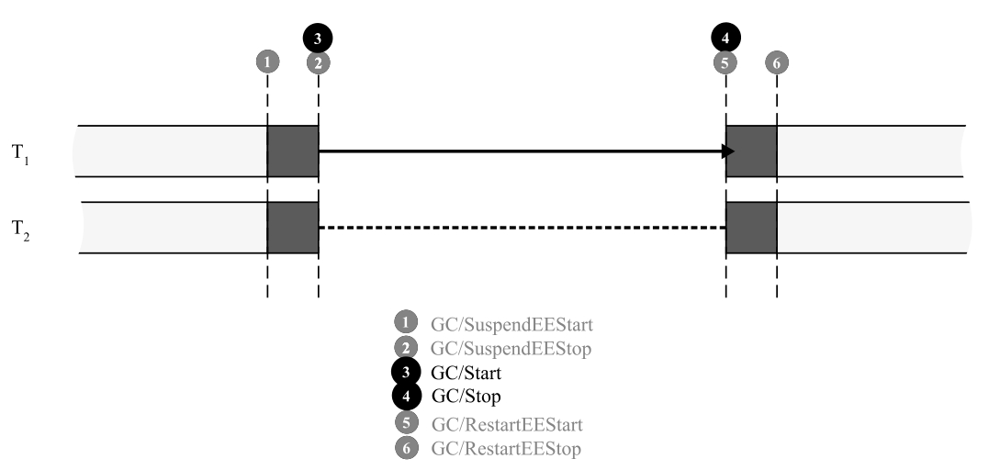

图11-3 工作站非并发GC模式下触发的CLR事件

典型应用场景：

- 高负载竞争环境：当多个应用程序激烈争夺有限CPU资源时，由于该模式仅使用单线程执行回收，可显著降低GC对CPU核心资源的占用影响
- 轻量级Web应用环境（如容器化微服务）：若应用内存占用较小且性能需求不高，非并发GC既能满足需求，又可通过限制线程数量节省系统资源

### 工作站并发模式（4.0版本前）

如前所述，该模式原称“并发GC”，在4.0及后续版本中被“后台GC”取代。因此我们不会过多关注此模式（例如省略整个并发GC实现章节）。下一节介绍的继任模式本质上也会涵盖本模式特性。工作站非并发GC模式具有以下特征（见图11-4）：

- 存在一个专用于GC的附加线程——该线程大部分时间处于挂起状态等待工作任务。
-  短期代际回收始终采用非并发模式——其执行速度足够快，无需并发处理。这也使得它们在必要时可进行压缩。
-  完全GC可运行于两种模式：
  -  非并发GC：由于“停止所有线程”的特性，此类完全GC可执行压缩操作。
  -  并发GC：大部分工作在不挂起托管线程的情况下执行。鉴于实现复杂度，此GC变体不支持压缩。
- 并发式完全GC还具有以下附加特征：
  - 用户托管线程在其执行期间仍可分配对象——但此类分配受限于短期代段大小（因为在并发GC期间无法触发其他GC来腾出空间）。若空间耗尽，用户线程将被挂起直至完全GC结束。
  - 包含两次短暂的“停止所有线程”阶段——分别位于GC开始阶段和中间阶段。
  - 自GC开始至第二次“停止所有线程”阶段前分配的对象将被提升代际。
  - 第二次“停止所有线程”阶段后分配的所有对象都将被提升代际。

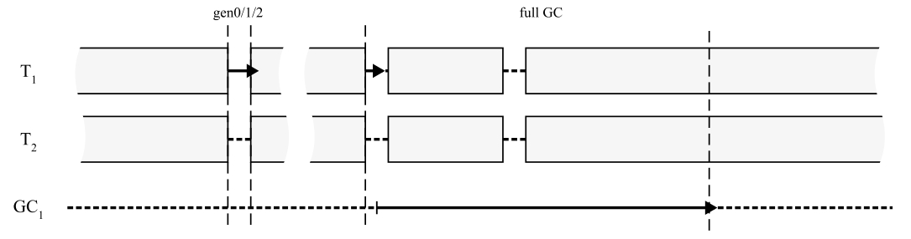

图 11-4. 工作站并发GC模式示意图（适用于.NET Framework 4.0之前版本）

典型使用场景：

对于.NET 4.0之前的大多数UI应用程序而言，并发GC在缩短暂停时间方面实现了重大改进——这对交互式应用程序至关重要。在大多数情况下，该系统能有效避免由GC引起的明显卡顿。但需要注意的是，并发GC不执行内存压缩，因此仍需定期触发非并发的完全GC来缓解内存碎片问题。该模式存在一个严重限制：当短期代段空间耗尽时，必须阻塞正在分配内存的线程。工作站模式下的内存段容量较小（32位模式下仅16MB），即便采用并发GC，也可能因短期代段空间频繁耗尽而导致线程暂停次数超出预期。后续推出的后台工作站GC模式正是为突破这些限制而设计的重大改进。

### 后台工作站模式

自.NET Framework 4.0起，后台工作站GC取代了工作站并发GC，并延续至.NET Core。其核心改进在于：即使在并发GC期间，也能按需触发短期代际回收。该模式解除了普通线程的内存分配限制，显著降低了后台GC操作对系统的影响。

后台工作站GC模式具有以下特征（多数与工作站并发GC相似，见图11-5）：

- 配备一个专用于GC的附加线程——该线程大部分时间处于挂起待命状态

- 短期代际回收采用非并发模式——其执行速度足够快，无需并发处理。这也使得必要时可进行内存压缩

- 完全GC支持两种执行模式：

  - 非并发GC：基于“停止所有线程”特性，此类完全GC可执行压缩。

  - 后台GC：大部分工作在不挂起托管线程的情况下完成。与并发GC相同，此模式不支持压缩。

- 后台完全GC还具有以下特性：

  - 托管线程在其执行期间可继续分配对象——此类分配可能触发常规短期代际回收（称为前台GC，与后台GC相对应）。

  - 在后台GC过程中可能多次发生前台GC。如.NET官方文档所述：“专用后台垃圾回收线程会在安全点频繁检查是否存在前台GC请求”。前台GC属于常规非并发回收，此时后台GC会暂时挂起。由于系统处于完全暂停状态，前台GC可执行压缩操作，甚至能通过创建新内存段/区域来扩展堆空间。

  - 包含两次短暂的“停止所有线程”阶段——分别位于开始阶段和中间阶段（后续将详细说明）。

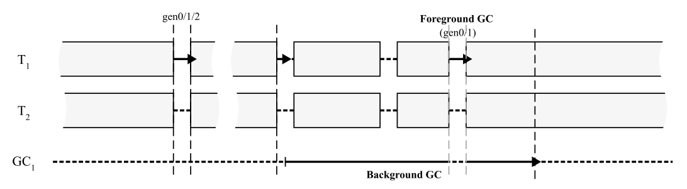

图11-5 后台工作站GC模式示意图（自.NET Framework 4.0起可用）

现在我们来深入剖析“后台工作站模式”的“解剖结构”。其针对0代、1代或2代的非并发垃圾回收（GC）过程较为简单。但后台GC究竟如何运作？前台GC又会在哪些具体时机触发？当分析后台GC时，可将其划分为以下几个阶段（参见图11-6）：

- 初始“全局暂停”阶段（A）：当分配器触发常规GC代码时，系统决定启动后台GC。此阶段通常还需执行常规的短暂代GC（例如某些分配预算已耗尽）。在此阶段会完成对象的初始标记，这些标记数据将供后续后台GC使用。

- 并发标记阶段（B）：在恢复用户线程运行的同时，后台GC通过并发方式追踪对象可达性。本章后续将详述如何在用户线程并行操作的情况下实现这一机制。此阶段可能因内存分配触发零次或多次前台GC。
- 最终标记的“全局暂停”阶段（C）：暂停所有用户线程时，后台GC将最终确定要在下一阶段回收的对象可达性。
- 并发清理阶段（D）：在用户线程正常运行期间，GC可以安全清理阶段C已确认的废弃对象。此阶段仍可能发生额外的前台GC。

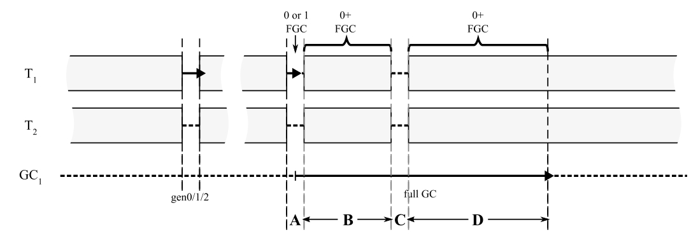

图11-6. 后台工作站GC模式的深度剖析

若要通过ETW/EventPipe事件追踪此类后台与前台GC，其事件生成逻辑如图11-7所示。相较于简单的非并发GC（如图11-3所示），这里会产生更多事件类型。如图所示，除典型GC事件外，还存在一系列以BGC为前缀的事件，用于详细描述后台GC过程。其中 `BGCRevisit` 和 `BGCDrainMark` 事件将在后续说明，其他事件名称已具备自解释性。需注意图11-7展示的是后台GC期间仅触发单次前台GC的情况。所有BGC前缀事件均由  `Microsoft-Windows-DotNETRuntimePrivate` 提供程序生成。该提供程序默认未被 `dotnet-trace` 启用，需在命令行中显式指定，例如：`dotnet trace collect --providers "Microsoft-Windows-DotNETRuntimePrivate:1:5,Microsoft-Windows-DotNETRuntime:1:5" -p <进程ID>`。提供程序列表的语法格式为：提供程序名称后接关键字（此处 `1` 代表GC关键字）和详细级别（此处 `5` 表示详细模式）。用户可使用Visual Studio便捷地可视化事件列表并按需筛选。再次提醒，若查阅.NET源代码，会发现事件命名存在差异——部分事件以“Begin”替代“Start”，以“End”替代“Stop”。

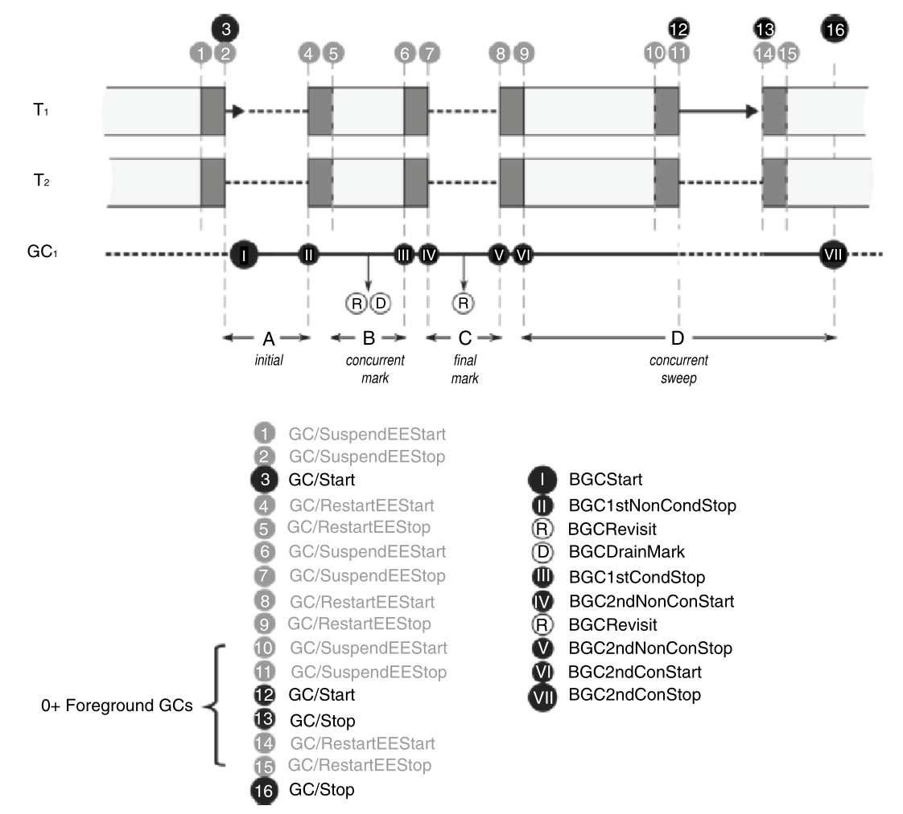

图11-7. 单次后台工作站GC过程中触发的ETW/EventPipe事件

> 后台GC的大部分代码在工作站(Workstation)和服务器(Server)版本间共享（主要区别在于执行线程数），这些代码会在SVR和WKS命名空间下分别编译。若要在.NET代码中研究该机制，建议从 `gc_heap::garbage_collect` 方法入手，重点关注 `do_concurrent_p` 标志位的使用。当后台GC启动时，系统会调用 `gc_heap::do_background_gc` 方法来唤醒后台GC线程。值得注意的是，前台GC和后台GC均由相同的 `gc_heap::gc1` 方法实现，其差异在于全局设置 `concurrent` 标志位的状态：
>
> - 执行前台GC时，`gc_heap::gc1` 方法在 `concurrent` 标志禁用状态下运行（即第7-10章描述的常规模式）
> - 执行后台GC时，`gc_heap::gc1` 方法在独立线程中以 `concurrent` 标志启用状态运行，进而触发 `gc_heap::background_mark_phase` 和 `gc_heap::background_sweep` 方法的执行（下节将简要说明这两个方法）

典型应用场景：大多数UI应用程序会极力优化后台工作站GC的暂停时间，这使得该模式特别适合各类交互式应用（尤其是基于UI的程序）。但需注意，由于后台GC仍不执行压缩操作，内存碎片化可能逐渐累积，最终可能触发阻塞式完全GC来缓解此问题——这将对UI响应性产生负面影响。

#### 并发标记

人们可能会疑惑，如何在用户线程运行时确定对象可达性。这些线程持续修改对象、创建和删除对象间的引用关系。在如此动态的条件下，如何发现可达性呢？

如您所知，.NET中的追踪式垃圾回收器通过从各类根节点出发遍历整个对象图来实现对象可达性发现（参见第1章“标记阶段”章节及图1-15）。被访问的对象会被标记，最终只有带标记的对象被视为存活对象，其余则作为垃圾回收。这种机制在与用户线程并发工作时会引发两个核心问题：

- 如何在不干扰用户线程工作的前提下标记对象？
- 如何确保用户线程与回收器对对象关系的认知保持一致性？

首先考虑对象标记问题。第8章提到，标记对象意味着设置其方法表指针中的一个特定位。这在“停止所有线程”模式下完全可行，但在线程可能使用该指针时修改如此关键的指针——无论出于安全性还是性能考量（包括缓存失效问题）——都是不可接受的。

> 用户线程可能正在读取或依赖方法表指针（MT）中的信息（例如，进行虚方法调用、类型检查）。在它使用时修改这个指针（哪怕只是一个位）是极其危险的，可能导致崩溃或不可预测的行为。并且MT是指向类型元数据的重要指针，CPU缓存会高度优化对其的访问。频繁修改MT中的位会导致缓存行失效（cache line invalidation）和伪共享（false sharing）问题，严重拖慢用户线程和GC自身的性能。

因此，并发标记将标记信息存储在专用的独立标记数组中。其组织结构类似于第5章描述的卡表：标记数组中每个比特位对应托管堆上16字节区域（32位运行时为8字节），如图11-8所示。标记数组按4字节长的标记字进行组织。当GC访问对象并需要标记时，会设置标记数组中相应的比特位。由于GC是标记数组的唯一所有者，访问时不存在同步问题。更重要的是，在并发标记过程中这些比特位只能被置位而不会被清除——这使得多线程并行执行并发标记时（如后文将介绍的后台服务器GC模式）的同步机制大为简化。

> GC修改的是自己专属的标记数组，用户线程完全不感知这个数组，也不会直接访问它。对象本身的MT指针保持不变。由于只有GC线程会写入这个标记数组（在并发标记期间），并且规则是“只能置位，不能清除”，这大大简化了同步。
>
> **“只能置位，不能清除”**：这意味着如果多个GC线程（在并行并发标记，如后台服务器GC中）同时发现一个对象可达，它们都去设置同一个比特位，结果是一样的（位被置1），不会有冲突。如果允许清除，就需要复杂的锁机制来协调。
>
> Mark Array 是一个位数组，其中的每个位（bit）对应托管堆中的一小块内存区域。在 64 位系统中，每个位对应 **16 字节** 的托管堆区域；在 32 位系统中，每个位对应 8 字节的区域[2](https://goodies.dotnetos.org/files/03. NET GC Internals - Concurrent Mark phase.pdf)。因此，一个比特位对应 16 字节的说法是正确的（针对 64 位环境）。而且它的设计是为了存储对象标记信息而不直接修改对象本身的元数据（如 MethodTable），以避免多线程并发时的冲突和缓存失效问题。
>
> 只需要标示“这个区域**有没有**一个被标记为重要的房子（对象）的**起点**或**一部分**”。
>
> 此外，Mark Array 的大小是相对于托管堆的大小按比例分配的，比如在 64 位系统中，每 1GB 的托管堆大约需要 8MB 的 Mark Array 内存[2](https://goodies.dotnetos.org/files/03. NET GC Internals - Concurrent Mark phase.pdf)。
>
> 标记数组的粒度：1个比特位对应16字节的托管堆区域。
>
> - 想象托管堆被划分成连续的、每块16字节的小格子。
> - 标记数组中的每一个比特位就负责这样一个16字节的小格子。
> - 如果GC标记了一个对象，它会找到这个对象**起始位置**所在的那个（或那些，如果对象跨越多个格子）16字节格子，然后在标记数组中将对应这个格子的比特位置为1。


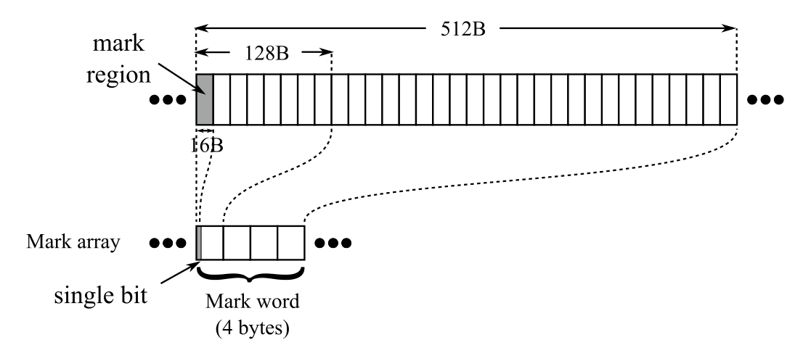

图11-8 标记数组组织结构（64位运行时环境）

需要注意的是，16字节的粒度已足够精确，因为每个这样的内存区域最多只可能包含一个对象（请记住最小对象大小为24字节）。后续通过扫描标记数组中置位的比特位，即可获取对应对象的可达性信息。这是解决第一个并发标记问题的简易方案。

第二个问题则需要更深入的思考。当回收器遍历对象图时，若对象间的引用关系被修改会导致什么问题？可能会产生以下情形：

- 尚未被访问的对象修改了（新增、删除或同时操作）对其他对象的引用：这属于正常情况，由于该对象尚未被访问，垃圾回收器在后续访问时自然会包含这些变更。
- 已被访问的对象清除了对某个原本不可达对象的引用（见图11-9a）——这仍然安全。短时间内会产生所谓的“浮动垃圾”，随后垃圾回收器会发现该对象不可达并予以回收。
- 已被访问的对象新增了对某个原本不可达对象的引用（见图11-9b），例如创建新对象或从其他对象重新赋值引用：这种情况非常危险。可能导致垃圾回收器无法访问（标记）被引用的对象，使其被误判为垃圾回收——尽管该对象可能仍在被使用！这就是著名的“对象丢失”问题。正确的并发标记实现必须防止此类情况发生。
- 已被访问的对象修改了对某个原本可达对象的引用——需通过检查垃圾回收器是否能通过其他引用访问该对象，才能判定是否属于“对象丢失”问题。
- 正在被访问的对象修改了自身引用——这需要确认该引用是否已被访问。若未被访问则回归第一种情况；若已访问，则可能适用前三种情形之一。

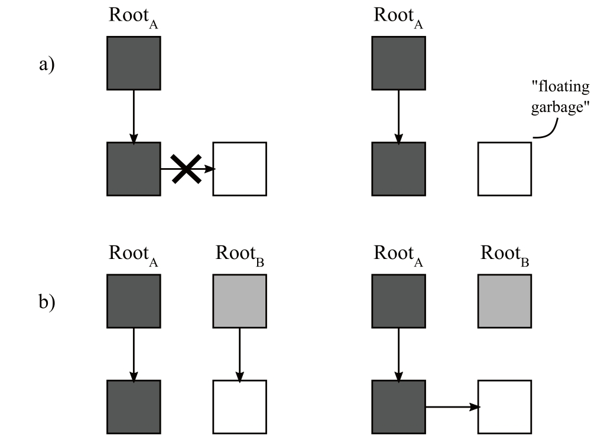

图11-9 并发标记期间可能出现的问题：(a) 产生浮动垃圾，(b) 对象丢失问题

针对上述问题的解决方案看似显而易见——应当重新访问那些存在问题的对象！现有多种并发标记技术，它们在“浮动垃圾”数量、需要重新访问的对象数量，以及用户线程与垃圾回收器之间的同步开销等方面做出了不同取舍。

.NET选择采用了一种简单而高效的**写屏障**技术。每当已被访问（或正在被访问）的对象发生修改时，该对象就会被标记为“待重新访问”。在Windows平台上（.NET 5之前），修改记录列表由操作系统通过已知的 `WriteWatch` 机制管理（该机制在第5章讲解卡表时也有提及）。此机制以内存页为粒度，因此即使只修改单个对象，也会导致整个4KB页面失效。对于非 Windows 运行时，以及自 .NET 5 起的Windows平台，CLR 通过 JIT 注入的特殊写入屏障实现了自主的 `Write Watch` 机制，这些屏障会修改专用数组中的对应字节。在垃圾回收过程中的特定时刻，系统会扫描修改记录列表（可称为写入监视列表），并将已标记对象作为新增根节点重新访问。这便优雅地解决了第二个并发标记问题。

> - 传统Windows ( .NET 5之前)：利用操作系统的 WriteWatchAPI。这个API能监测哪些内存页（Page，通常4KB）发生了写入。当GC需要时，它可以查询哪些页“脏了”。**缺点**就是粒度粗（4KB）。即使只改了一个对象的1个字节，整个4KB页面都会被标记为脏，导致GC可能需要重新检查该页面内所有已标记对象。
> - 非Windows平台及.NET 5+的Windows：CLR实现了自己的、更细粒度的“写监视”机制。JIT注入的写屏障会直接修改一个由CLR管理的专用字节数组中的对应字节（标记该小块内存区域“脏了”）。这种方式通常比页面粒度更精确，开销也可能更低。

因此，回顾后台GC的各个阶段（如图11-6和11-7所示），其工作流程如下：

- 初始“停止世界”阶段(A)：当线程暂停时，系统会准备初始列表。此阶段仅扫描栈和终结队列，为后续并发标记构建“工作列表”。该工作列表仅包含已发现的对象，此时暂不追踪它们的对外引用。

- 并发标记阶段（B）：当用户线程运行时，执行并发标记的主要工作。该阶段会遍历以下根对象（在标记数组中标示对象）：

  - **句柄**。
  - **前一步骤准备好的工作列表**：此处会处理来自堆栈的大规模对象图。此阶段会触发 `BGCDrainMark ETW/EventPipe` 事件，记录工作列表中的对象数量。

  - **写监视列表**：在并发标记结束时，会检查此阶段发生的所有对象修改。此阶段触发 `BGCRevisit ETW/EventPipe` 事件，描述初始“脏”页数量及最终因此被标记的对象数。

- 最终标记，“Stop the World”阶段（C）：这是“最终确认”时刻。所有线程暂停，GC有机会完成收尾工作。此时标记数组应已较好反映对象可达性状态，但为确保万无一失，仍需重新检查（注意这是增量式工作）。由于对象图遍历会参考标记数组中的标记位，许多对象无需重复访问。重新扫描根对象仅用于确保没有新增的可达对象——这会产生一些浮动垃圾（已标记对象不会被取消标记），但如前所述，这不会影响结果的正确性。最终标记阶段会处理以下根对象：

  - 堆栈、终结队列和句柄。

  - 写监视列表——涵盖GC在之前检查中未能跟上的所有修改

  - 同时完成所有典型标记相关工作（如扫描依存句柄和弱引用）

> 在.NET Core中，并发标记的核心逻辑位于 `gc_heap::background_mark_phase` 方法。最重要的两个数据结构是 `mark_array`（图11-8中的数组）和 `c_mark_list`（初始阶段填充的“工作列表”）。`c_mark_list` 由 `gc_heap::background_promote_callback` 方法在扫描堆栈和终结队列时填充，随后由 `gc_heap::background_drain_mark_list` 方法消费。
>
> 写监视列表通过 `gc_heap::revisit_written_pages` 方法读取，该方法调用 `gc_heap::get_write_watch_for_gc_heap` 获取已更新的内存位置列表并逐对象扫描。当启用软件写监视时，可在写屏障（如 `JIT_WriteBarrier_WriteWatch_PreGrow64`）中看到其使用。
>
> 所有并发标记工作通过 `gc_heap::background_promote` 方法实现，该方法经由 `gc_heap::background_mark_simple` 和 `gc_heap::background_mark_simple1` 遍历对象图（最终由 `gc_heap::background_mark1` 方法设置 `mark_array` 中的对应标记位）。

总结：

- 并发标记会产生浮动垃圾，导致垃圾回收策略相对保守——相比阻塞式标记，更多死亡对象会占用内存更长时间。
- 后台GC期间频繁的对象引用关系修改可能使大量页失效，从而迫使GC重新访问大量对象。

#### 并发清扫

在并发清扫阶段开始时，标记数组已包含所有存活对象的信息。与第9、10章描述的非并发式计划与清扫阶段类似，这些信息将用于清理死亡对象。该阶段会逐一遍历堆中的对象，对照标记数组进行检查，并为不可达对象创建空闲列表项（具体实现方式与第10章完全一致，包括更新代际分配器）。由于SOH（小对象堆）分配可能在并发清扫期间发生，观察二者的交互机制尤为重要。

该过程包含以下步骤：

- **初始化准备**：运行时恢复用户线程执行前，所有代际的空闲列表项会被清空——这使得分配器在短时间内无法感知可用空间（它们只能在当前已消耗的段/区域末端进行分配）。
- **短暂代并发清扫**：首先在0/1代执行快速清扫，操作独立空闲列表以避免用户线程分配与并发GC同时访问列表的冲突。清扫完成后立即发布该列表，使短暂代分配器可立即使用回收空间。此阶段禁止前台GC（因其可能触发压缩操作，与逐对象扫描产生冲突）。
- **持久代并发清扫**：随后处理2代、大对象堆(LOH)和固定对象堆(POH)，生成的空闲列表项会立即发布给对应分配器。
  - 此时用户线程在0代分配时可使用已发布的空闲空间，同时允许前台GC运行。
  - 若对象从1代提升至2代，将直接消费2代已创建的空闲列表项（由于前台GC会临时挂起后台GC，不存在并发访问风险）。
- 历史版本中整个过程中禁止LOH分配，但自.NET Core 3.1起允许在2代清扫时进行大对象分配。不过LOH清扫期间仍禁止分配（避免GC修改列表时分配器并发访问），试图分配大对象的线程会被阻塞直至清扫完成。与普通模式相同，并发清扫期间可能释放空内存段。

> 在.NET代码中，并发清扫由 `gc_heap::background_sweep` 方法实现。该方法先调用 `c_heap::background_ephemeral_sweep` 扫描0/1代对象，随后处理2代、LOH和POH（每扫描256个对象后，通过 `gc_heap::allow_fgc` 方法在安全点允许前台GC介入）。对象扫描过程中，沿用已知的 `gc_heap::thread_gap` 和 `gc_heap::make_unused_array` 方法分别创建空闲列表项和不可用碎片空间。

> .NET垃圾回收（GC）流程中，为防止并发竞用，以下步骤必须同步执行（通常通过暂停托管线程，即STW，Stop-The-World机制）：
>
> 1. **初始标记（Initial Mark）**
>    - 需要暂停所有托管线程，扫描根对象（如静态变量、线程栈等）并标记直接可达对象。
>    - 目的是确保根对象状态一致，避免并发修改导致漏标。
> 2. **最终标记（Final Mark）**
>    - 在并发标记完成后，再次暂停所有托管线程，处理并发期间发生的引用变更（如写屏障记录的修改）。
>    - 重新标记因并发修改而可能遗漏的对象，确保标记完整。
> 3. **对象移动与压缩（Compaction）**
>    - 移动对象内存地址时必须暂停所有托管线程，防止对象引用失效。
>    - 压缩完成后更新引用指针，再恢复线程。
> 4. **清理阶段（Cleanup）**
>    - 回收未被引用的内存区域时，部分操作需暂停线程以保证内存状态一致。
>    - 如重置跨代引用卡表（Card Table）等。
> 5. **终结器队列处理（Finalization）**
>    - 虽然终结器在独立线程执行，但GC调度终结器运行时，需同步等待终结器线程完成，避免资源提前释放或状态不一致。
> 6. **晋升与跨代引用更新**
>    - 对象晋升（如从Gen0到Gen1）时，需同步更新跨代引用的标记，防止并发写入导致引用丢失。
>
> 总结来说，**所有涉及根扫描、标记开始和结束、对象移动（压缩）以及跨代引用更新的关键步骤都必须同步执行，通常通过暂停应用线程实现**。并发标记阶段本身允许后台线程与应用线程并行运行，但会通过写屏障和最终标记阶段来保证数据一致性。
>
> 这些同步点保证了GC的正确性，避免了并发竞用导致的内存泄漏或程序错误[3](https://stackoverflow.com/questions/17130382/understanding-garbage-collection-in-net)[5](https://www.red-gate.com/simple-talk/development/dotnet-development/understanding-garbage-collection-in-net/)[8](https://citeseerx.ist.psu.edu/document?repid=rep1&type=pdf&doi=c21ad4f7ba6a96df2b255c437f09b5fadf1b1f1f)。

### 服务器非并发模式

自.NET诞生之初直至.NET Framework 4.5版本，该模式一直是专为服务器（主要是Web）应用程序设计的默认独占模式。实际上，它是对前文所述“工作站非并发模式”的简单扩展——所有垃圾回收（GC）操作都是阻塞式的，无论回收哪个代际。但需特别注意的是，从内存管理视角来看存在一个重要差异：默认情况下，托管堆（Managed Heap）的数量与逻辑CPU核心数相同。

服务器非并发GC模式具有以下特征（参见图11-10）：

- 存在专用于GC的额外线程（称为服务器GC线程）——默认数量与托管堆数量严格对应。这些线程大部分时间处于挂起状态等待工作，每个线程固定绑定到单个托管堆。
- 所有回收操作均为非并发GC——由于回收工作由多个GC线程并行处理，相比相同堆大小的工作站模式，其引发的暂停时间更短。作为“全局暂停”式回收，必要时任何回收都可执行压缩操作。
- 此外，采用标记窃取（mark stealing）技术实现多GC线程间的标记工作负载均衡：当因存活对象引用分布不均导致堆间不平衡时，GC线程会动态“窃取”其他线程待遍历的对象批次进行处理。

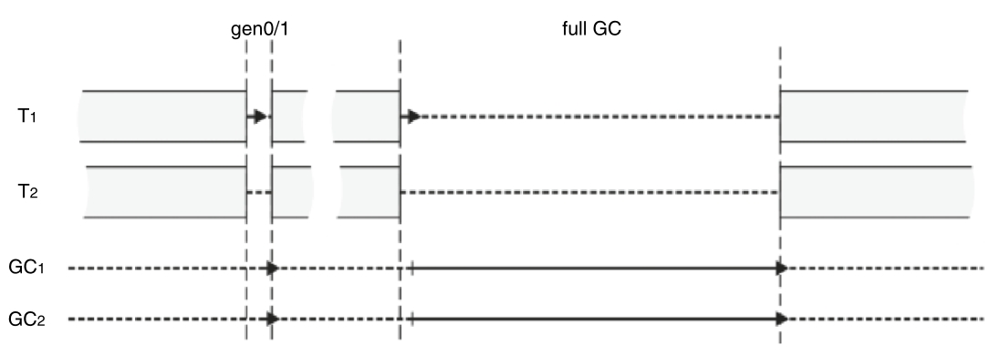

图11-10 服务器非并发GC模式示意图

在服务器GC模式中，托管堆数量（即GC线程数）不必与机器逻辑CPU核心数严格对应。自.NET Framework 4.6+和.NET Core起，新增了 `GCHeapCount` 配置项——该参数专门指定GC使用的线程与托管堆数量。此配置仅适用于服务器GC模式，可通过 `COMPlus_GCHeapCount` 环境变量（.NET Core也支持 `DOTNET_GCHeapCount`）或XML/JSON配置文件设置（见代码清单11-3）。设定值必须小于进程可用的逻辑CPU数量（因操作系统存在多种限制核心数的机制），否则将自动截取为最大可用值。

代码清单11-3 配置GC相关线程及托管堆数量

```xml
<configuration>
  <runtime>
    <gcServer enabled="true"/>
    <GCHeapCount enabled="6"/>
  </runtime>
</configuration>
```

早期版本中，实现此类限制的唯一方式是直接约束进程可用的逻辑核心数。但这种方式存在严重缺陷——它会全局影响运行时环境，而不仅作用于GC子系统。这意味着即使开发者仅希望对GC进行限制，整个.NET程序的并发能力也会遭受不必要的削弱。因此自 `GCHeapCount` 配置引入后，该方式已成为控制GC相关参数的首选方案。

> 另有 `GCNoAffinitize` 与 `GCHeapAffinitizeMask` 这一对参数用于控制线程/堆的CPU亲和性。当系统存在大量未被充分利用的CPU核心（例如通过 `GCHeapCount` 限制了线程数时），可通过这些设置将特定CPU核心专用于指定应用，实现精确的CPU资源分配。

典型应用场景：

- 在高负载Web服务器中，当多个应用的并发线程导致CPU核心资源激烈争用时，此模式比后文所述更耗资源的“后台服务器GC”更合适。通过 `GCHeapCount` 可进一步限制线程数量。
- 由于所有GC（包括完全回收）都可能执行压缩操作，该模式相比并发版本能更有效对抗内存碎片，从而减小工作集内存占用。
- 所有GC操作均为阻塞式，因此在并发标记阶段不会产生浮动垃圾（floating garbage），这进一步降低了工作集大小。

### 后台服务器 GC

自.NET Framework 4.5起，这成为服务器应用程序的默认模式。这是目前最复杂的垃圾回收机制（GC）。不过只要了解非并发服务器GC（Non-concurrent Server GC）和后台工作站GC（Background Workstation GC），你就会发现它实际上是两者的结合体。

后台服务器GC模式具有以下特征（见图11-11）——与后台工作站GC高度相似：

- 每个托管堆都有两个专用于GC的线程——它们大部分时间处于挂起状态等待工作：	
  -  服务器GC线程：与非并发服务器GC相同，负责执行所有阻塞式GC（包括前台GC）。
  -  后台GC线程：每个堆额外分配的线程，专门执行后台GC。
- 短暂代回收（Ephemeral collections）采用非并发GC机制——其执行速度足够快，无需并发处理。这种机制在必要时可进行压缩处理，由多个前台GC线程并行执行——每个线程负责各自的托管堆。
- 完全GC（Full GC）有两种执行模式：
  -  非并发GC：因其“全局暂停”特性，可进行堆压缩。与短暂代回收类似，所有服务器GC线程并行工作。
  -  后台GC：在执行过程中允许托管线程继续运行。此模式不进行堆压缩，与后台工作站GC类似，由专用后台GC线程并行执行。

- 后台完全GC还具有以下特性：
  - 托管线程在其执行期间仍可分配对象——这些分配可能触发短暂代回收（前台GC）。
  - 一个后台GC过程中可能发生多次前台GC。
  - 后台完全GC机制包含两次短暂的“全局暂停”阶段——分别出现在GC开始阶段和中间阶段。

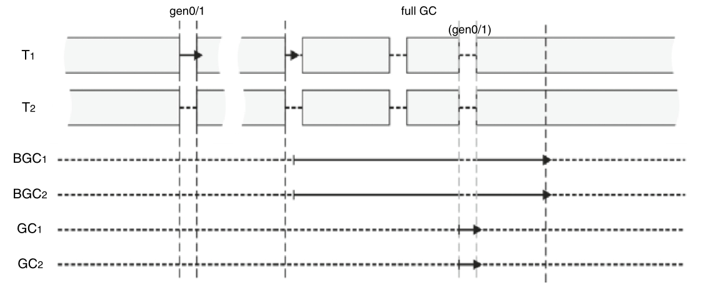

图11-11 后台服务器GC模式示意图

若要完整描述后台服务器GC（Background Server GC），基本上需要复述后台工作站GC（Background Workstation GC）的大部分内容。二者的核心区别在于：后台服务器GC会为每个CPU核心分配一个额外的GC线程，而非仅使用单个线程。

这种设计通过结合后台工作站GC（短暂停顿、宽松的线程分配限制）和非并发服务器GC（并行回收带来的可扩展性）的优势，显著增加了实现复杂度。就线程资源占用而言，这是最耗费资源的GC模式——在16核机器上，将会有32个线程专用于垃圾回收。

典型应用场景：

- 多数服务器应用的默认GC模式：若同一台服务器上运行着数十个.NET应用程序，则不宜全部采用后台服务器GC。
- 运行在专用设备上的高资源消耗桌面应用：在医疗设备或工业控制站等单一应用环境中，可考虑启用该模式——这套最精密的GC机制能充分利用硬件资源，实现最佳运行效果。

## 延迟模式

除了四种GC模式外，系统还提供了一套正交配置用于控制垃圾回收的延迟（即暂停）行为。通过延迟模式设置，开发者可以调节GC的侵入性——即其执行阻塞暂停的倾向程度。与前文介绍的GC模式不同，延迟模式支持在程序运行时动态调整，这为实现特殊场景优化创造了可能。

虽然可通过环境变量（在.NET Core中设置 `COMPlus_GCLatencyMode` 或 `DOTNET_GCLatencyMode`）配置延迟模式，但官方推荐的做法是通过代码设置 `GCSettings.LatencyMode` 静态字段。该字段可接受 `GCLatencyMode` 枚举值（见代码清单11-4），对应本节将介绍的各类模式。

代码清单11-4 延迟模式枚举定义

```csharp
public enum GCLatencyMode 
{
    Batch = 0,          // 批处理模式
    Interactive = 1,    // 交互模式  
    LowLatency = 2,     // 低延迟模式
    SustainedLowLatency = 3, // 持续低延迟模式
    NoGCRegion = 4      // 无GC区域模式
}
```

如后文所述，延迟模式同时具备控制GC并发行为的能力。各模式特性将在后续章节简要说明。

### 批处理模式(Batch)

批处理模式适用于对GC暂停时长不敏感的场景。该模式允许GC从吞吐量或内存利用率等维度进行优化，是所有非并发GC（即通过 `System.GC.Concurrent` 或 `gcConcurrent` 设置禁用的GC）的默认延迟模式。

实际应用中，该模式可用于动态关闭后台GC功能。换言之，即使应用程序启动时启用了并发GC，仍可通过此设置临时禁用。关于后台GC线程在此模式下的行为，不同GC模式存在差异：

- **服务器GC**：线程将被无限期挂起，直至恢复延迟模式设置
- **工作站GC**：线程会在超时后（当前版本为20秒）自动销毁，并触发 `GCTerminateConcurrentThread ETW/EventPipe` 事件

### 交互模式(Interactive)

交互模式下，垃圾回收器会竭力缩短单次暂停的持续时间，即便以牺牲内存使用率为代价（这对于需要快速响应的UI应用程序尤为重要）。该模式会启用后台GC，是所有并发GC的默认设置。因此，在.NET中交互模式是默认启用的，因为无论是工作站GC还是服务器GC模式，默认都采用并发机制。

与批处理模式形成互补，交互模式可用于动态启用并发GC——此时若后台GC线程尚未创建，系统将生成专用线程并触发 `GCCreateConcurrentThread ETW/EventPipe` 事件。

此外，当工作站GC与交互模式（即默认配置）配合使用时，将启用第7章“回收调优”章节所述的GC时间调节机制。

### 低延迟模式(LowLatency)

低延迟模式适用于不计代价追求最短GC暂停时间的场景，仅在工作站GC模式下可用。该模式会禁用所有常规的（包括并发与非并发的）第2代垃圾回收——这是非常严苛的限制！完全GC仅会在收到系统内存不足通知或显式触发时（如调用 `GC.Collect` 方法）执行。

该模式对应用程序运行具有显著影响：

- **暂停时间极短**：仅执行快速的短暂代回收
- **内存占用激增**：第2代堆和大对象堆中的对象将完全不被回收

这种高强度延迟模式仅应在对延迟有极端要求的短时场景中使用，例如用户密集交互阶段。需特别注意：退出该模式后迟早会触发高强度垃圾回收——最佳实践是在可控时机尽快手动触发GC。

设置低延迟模式时，必须确保其能及时恢复。在.NET Framework中，常规 `try/finally` 结构可能不足以保证，因为 `finally` 块仍有极小概率无法执行。建议采用约束执行区域（Constrained Execution Region, CER）机制——如.NET文档所述：“CER是编写可靠托管代码的机制，该区域内CLR会抑制可能阻止代码完整执行的带外异常”。例如，CLR会延迟中止正在CER内执行的线程。其使用方式简单，只需在 `try` 块前调用 `PrepareConstrainedRegions` 方法（见代码清单11-5）。

代码清单11-5 通过约束执行区域安全设置低延迟模式

```csharp
GCLatencyMode oldMode = GCSettings.LatencyMode;
RuntimeHelpers.PrepareConstrainedRegions();
try
{
    GCSettings.LatencyMode = GCLatencyMode.LowLatency;
    // 在此执行时间敏感的短期任务
}
finally
{
    GCSettings.LatencyMode = oldMode;
}
```

在.NET Core中，由于运行时已确保 `finally` 块必定执行（不存在线程中止或应用域卸载），CER机制已被弃用。

> `finally` 块真的一定会执行吗？
>
> 在C#和.NET的大多数日常场景下，`finally`块**“几乎总是”**会执行——无论`try`块内是否抛出了异常，或者是否提前`return`。
> **但这不是绝对保证。** 有极少数情况下，`finally`块可能不会被执行，比如：
>
> - 进程崩溃或被强制终止（如`Environment.FailFast()`、操作系统kill进程、严重硬件故障等）。
> - 机器掉电。
> - 发生CLR的“灾难性异常”（如 `OutOfMemoryException` 在某些极端条件下、`StackOverflowException`、`Thread.Abort`等）。
>
> `Thread.Abort` 是.NET早期版本里比较典型的例子：它会在线程任意时刻抛出一个异常，中断线程执行，理论上可能导致`finally`块未被执行（或者只执行了一部分）。
>
> 要最大可能的保证代码执行怎么办？
>
> **CER**（约束执行区域）是.NET提供的一个机制，用来尽最大可能保证某一段关键代码——尤其是`finally`块——**不会被中断、能完整地执行完**。
> 原理是：
>
> - CLR会在进入CER前预先加载好所有可能会用到的代码和资源，尽量避免在关键区域里发生“带外异常”。
> - CLR会延迟线程中止（`Thread.Abort`），直到CER块结束。
>
> 所以，在**极端高可靠性场景**（比如非托管资源回收、安全关键操作等），可以通过如下方式编写：
>
> ```c#
> RuntimeHelpers.PrepareConstrainedRegions();
> try
> {
>     // 临界操作
> }
> finally
> {
>     // 关键清理代码
> }
> ```

### 持续低延迟模式(SustainedLowLatency)

鉴于低延迟模式的严苛要求可能导致堆内存过快增长，.NET Framework 4.5 引入了该模式的改良版本——持续低延迟模式（SustainedLowLatency）。此模式在工作站和服务器GC模式下均可使用，是短暂停时间与内存占用量之间的折中方案：仅禁用非并发的完全GC，仍允许执行短暂代回收和后台垃圾回收。需注意，该模式仅在运行时已启用并发GC设置时有效（即便后续通过批处理或交互模式动态修改过延迟设置）。与低延迟模式类似，完全阻塞式GC仅会在系统内存不足或显式调用 `GC.Collect()` 时触发。

持续低延迟模式通过抑制堆内存增长速度，能在较长时间内维持低延迟状态，同时提供相对较短的暂停时间（因后台GC引入的暂停，其响应速度略逊于标准低延迟模式）。这一特性使其成为处理用户输入场景的理想选择——例如当用户进行UI操作时启用该模式提升交互体验。Visual Studio的Roslyn语法解析器源码中就应用了此策略：在编辑器检测到用户输入时切换至持续低延迟模式，并通过超时机制自动恢复原始设置（见代码清单11-6）。

代码清单11-6 Roslyn源码中持续低延迟模式设置示例

```csharp
/// <summary>
/// 此类用于管理GC模式切换至SustainedLowLatency
/// 
/// 可安全跨线程调用，但设计初衷是当UI线程接收到用户键盘/鼠标输入时调用
/// </summary>
internal static class GCManager
{
    /// <summary>
    /// 在无法接受高延迟的场景（如处理键盘输入）中调用此方法，
    /// 以抑制耗时的阻塞式第2代垃圾回收
    /// 
    /// 除非再次调用本方法，否则阻塞式GC将在短时延迟后自动恢复
    /// </summary>
    internal static void UseLowLatencyModeForProcessingUserInput()
    {
        var currentMode = GCSettings.LatencyMode;
        var currentDelay = s_delay;
        if (currentMode != GCLatencyMode.SustainedLowLatency)
        {
            GCSettings.LatencyMode = GCLatencyMode.SustainedLowLatency;
            // 在最后一次调用本方法后，延迟指定时间恢复原始延迟模式
            currentDelay = new ResettableDelay(s_delayMilliseconds);
            currentDelay.Task.SafeContinueWith(
                _ => RestoreGCLatencyMode(currentMode), 
                TaskScheduler.Default);
            s_delay = currentDelay;
        }
        currentDelay?.Reset();
    }
}
```

### 无GC区域模式(NoGCRegion)

这是迄今为止要求最为严苛的模式，随.NET Framework 4.6引入。正如微软文档所述，该模式“尝试在关键路径执行期间禁止垃圾回收——前提是有指定量的可用内存”。换言之，它试图完全禁用GC，但无法永久实现。因此不能简单地通过设置 `GCSettings.LatencyMode` 字段来启用（将其设为 `GCLatencyMode.NoGCRegion` 无效），而需调用专用方法：

```csharp
bool GC.TryStartNoGCRegion(long totalSize)
bool GC.TryStartNoGCRegion(long totalSize, bool disallowFullBlockingGC)  
bool GC.TryStartNoGCRegion(long totalSize, long lohSize)
bool GC.TryStartNoGCRegion(long totalSize, long lohSize, bool disallowFullBlockingGC)
```

这些方法都要求指定期望在不触发GC的情况下可分配的内存总量（totalSize，字节）。当GC确认有足够可用内存时， `TryStartNoGCRegion` 返回true表示已进入无GC延迟模式。可选参数 `lohSize` 可指定大对象堆(LOH)的专用配额。若不指定，总配额将分别应用于小对象堆(SOH)和大对象堆（实际可分配双倍内存）。

当可用内存不足时，`TryStartNoGCRegion` 内部会触发完全非并发GC来尝试释放内存。通过设置 `disallowFullBlockingGC` 参数为false可禁止此行为。

> 在传统基于内存段的GC实现中，指定大小不得超过所有短暂代内存段总容量（服务器GC模式下需乘以对应段数）：
>
> - 指定 `lohSize` 时，(`totalSize - lohSize`)必须≤短暂代段容量。
> - 仅指定 `totalSize` 时，该值必须≤单个短暂代段容量（保守策略）。
>
> 这是因为短暂代段空间耗尽时将强制触发GC。若指定大小超出限制，会抛出 `ArgumentOutOfRangeException`。

进入无GC模式后，程序可正常执行。只要SOH和LOH的分配量未超限，就不会触发GC。但必须显式调用 `GC.EndNoGCRegion()` 来终止该模式！虽然GC机制本身不依赖于此（分配超限时会自动恢复原模式），但API层面要求严格配对调用——否则后续 `TryStartNoGCRegion` 调用将抛出“无GC区域模式已在进行中”的 `InvalidOperationException`。即使因超限已自动恢复，仍需调用 `EndNoGCRegion`，此时会抛出"分配内存超出无GC区域模式指定限制"异常。

由于无GC区域本身有分配量限制，其终止操作不像低延迟模式那样需要约束执行区域(CER)保护。最坏情况不过是触发GC。但建议在调用 `TryStartNoGCRegion` 前检查并终止之前的无GC区域，避免异常。

综合这些考量，使用无GC区域的典型代码如清单11-7所示：

清单11-7 无GC区域创建示例

```csharp
// 防止之前finally块未执行的情况
if (GCSettings.LatencyMode == GCLatencyMode.NoGCRegion) 
    GC.EndNoGCRegion();
    
if (GC.TryStartNoGCRegion(1024, true))
{
    try 
    {
        // 执行关键操作
    }
    finally
    {
        try { GC.EndNoGCRegion(); } 
        catch (InvalidOperationException ex) 
        { 
            // 记录异常信息
        }
    }
}
```

> 在.NET Core源码中，可通过 `GCHeap::StartNoGCRegion` 方法入手研究该模式。该方法由 `GC.TryStartNoGCRegion` 的内部实现 `GCInterface_StartNoGCRegion` 调用，可能触发 `GCHeap::GarbageCollect`，并通过 `gc_heap::prepare_for_no_gc_region` 检查短暂代段条件及设置配额限制。程序运行期间，当满足GC条件时会调用 `gc_heap::should_proceed_for_no_gc` 来检测分配限制。

### 延迟优化目标

回顾第7章“静态数据”章节，其中介绍了另一种延迟控制机制——延迟优化目标（层级），该机制会影响静态数据的处理策略。如.NET源码注释所述：“延迟模式要求用户具备特定GC知识（如预算、完全阻塞GC）。我们正逐步转向更直观的优化目标，让用户直接声明最关注的性能维度（包括内存占用量、吞吐量和暂停可预测性）”。因此在未来.NET版本中，可能会从现有延迟模式过渡到更面向维度的优化目标。目前已规划四个目标层级：

- **内存占用量优先（层级0）**：允许较长且较频繁的暂停，但保持较小堆大小。
- **暂停与吞吐量平衡（层级1）**：暂停更可预测且更频繁，最长暂停时间短于层级0。
- **吞吐量优先（层级2）**：暂停不可预测但频率较低（可能持续时间较长）。
- **短暂停优先（层级3）**：暂停高度可预测且频繁，最长暂停时间短于层级1。

如第7章所述，当前（.NET Framework 4.8和.NET 8时期）仅支持层级0和1，且其在运行时和GC中的应用仍非常有限。

可通过 `GCLatencyLevel` 配置项设置延迟层级，使用 `COMPlus_GCLatencyLevel/DOTNET_GCLatencyLevel` 环境变量，取值0或1（默认值）。

### GC模式选择指南

您已经了解了垃圾回收器（GC）的各种运行模式，以及通过延迟设置实现的侵入性控制。尽管前文已讨论过各模式的优缺点，但我们尚未明确回答一个问题：哪种GC模式最适合您的场景？

简单答案是使用默认GC模式！多数情况下，这个答案完全够用，您无需纠结其他选项。但仍有若干可调节参数值得关注，某些场景下可能需要调整。最常见的两种例外情况是：

- 运行在多应用共享服务器上的Web应用：此时默认的“后台服务器模式”（Background Server）可能资源占用过高。可通过 `GCHeapCount` 参数微调，或切换至其他模式。
- 执行大量处理的Windows服务：默认的“后台工作站模式”（Background Workstation）可能扩展性不足，建议改用某种服务器模式。

表11-1汇总了目前所介绍的GC模式特性概要。

表11-1 GC模式对照表

|             | 工作站模式                                                   |                                                              | 服务器模式                                                   |                                                       |
| ----------- | ------------------------------------------------------------ | ------------------------------------------------------------ | ------------------------------------------------------------ | ----------------------------------------------------- |
| CPU使用     | 非并发                                                       | 后台                                                         | 非并发                                                       | 后台                                                  |
|             | 无专用GC线程                                                 | 单GC线程                                                     | GC线程数=逻辑CPU核心数                                       | GC线程数=2×逻辑CPU核心数                              |
| 批处理模式  | 支持（默认）                                                 | 支持（禁用后台GC）                                           | 支持（默认）                                                 | 支持（禁用后台GC）                                    |
| 交互模式    | 支持（启用后台GC）                                           | 支持（默认）                                                 | 支持（启用后台GC）                                           | 支持（默认）                                          |
| 低延迟模式  | 支持                                                         | 支持                                                         | 不支持                                                       | 不支持                                                |
| 持续低延迟  | 不支持                                                       | 支持                                                         | 不支持                                                       | 支持                                                  |
| GCHeapCount | 不支持                                                       | 不支持                                                       | 支持                                                         | 支持                                                  |
| 典型场景    | 单机运行多个轻量应用，可接受较长暂停（可通过低延迟模式短期控制） | 要求严格响应速度的交互应用（配合低延迟/持续低延迟模式控制长暂停） | 当前较少使用，作为资源消耗型后台服务器与工作站模式的折中方案 | 大多数请求处理型应用（如IIS托管Web应用、Windows服务） |

## 其他GC配置选项

除本章详述的设置外，还有其他配置选项可自定义GC行为。如第15章所述，通过 `GC.GetConfigurationMethods` 方法可获取部分配置值，这些值源自 `.\src\coreclr\gc\gcconfig.h` 文件定义的内部变量。

本节介绍的设置需通过 `DOTNET_xxx` 环境变量启用（.NET 6之前使用 `COMPlus_xxx` 前缀）。数值需采用十六进制格式，但无需添加 `0x` 前缀。

由于这些设置大多已在微软官方文档中说明（详见https://learn.microsoft.com/en-us/dotnet/core/runtime-config/garbage-collector），本文将不赘述有效值范围，仅聚焦适用场景。

### 调整堆内存限制

在容器环境中运行时，GC会自动检测内存限制。由于GC仅控制应用程序使用的托管内存（不包括JIT编译方法或原生代码分配的内存），它会将所有堆的总大小限制为容器内存的百分比，默认比例为75%。例如在1GB内存限制的容器中，GC最多使用750MB，超限时将抛出 `OutOfMemoryException`，剩余250MB供其他用途。

根据场景需求，您可能需调整该限制：若默认值过高（如原生代码或其他进程需要超过250MB导致OOM终止），或过低（希望进程能使用800MB-900MB），可通过 `GCHeapHardLimitPercent` （调整百分比）或 `GCHeapHardLimit` （设置绝对值，如800MB）手动配置。

少数高级场景中，可能需要更精细的控制。`GCHeapHardLimitSOH`/`GCHeapHardLimitLOH`/`GCHeapHardLimitPOH`（及其相对百分比版本）可分别限制特定堆的大小。自.NET 8起，还可通过第15章介绍的 `GC.RefreshMemoryLimit()` 运行时动态调整这些值。

### 调整堆数量

服务器GC模式下，默认会为每个可用核心创建一个堆。若需减少堆数量（通常为降低内存占用），可通过 `GCHeapCount` 设置实现。

### 调整GC线程亲和性

服务器GC模式下，每个GC堆对应一个固定绑定CPU核心的GC线程。以下情况可能需要修改默认亲和性：

- 当减少堆数量时（通过前述 `GCHeapCount`），剩余GC线程会按序绑定前几个CPU核心（如设置3个堆则绑定前3个核心）。若同一机器运行多个.NET进程，可能导致核心竞争不均，此时可通过 `GCHeapAffinitizeMask` 或 `GCHeapAffinitizeRanges` （语法不同）指定目标核心。
- 当进程仅间歇性使用资源时，固定核心可能造成浪费。若并发进程长时间占用核心且OS调度器无法重新分配被固定的GC线程，建议通过 `GCNoAffinitize` 完全禁用线程亲和性。

Windows系统还需注意CPU组限制：多CPU组系统中，GC默认仅使用进程所属组的核心。如需使用全部核心，需设置`GCCpuGroup`。该限制已在.NET 7（Windows 11/Windows Server 2022及以上版本）中解除。

> 在 .NET 程序中，可以通过新建 `runtimeconfig.json` 配置文件来设置：
>
> ```
> {
>   "configProperties": {
>     "System.GC.Server": true,
>     "System.GC.HeapCount": 3,
>     "System.GC.HeapAffinitizeMask": 1023,
>     "System.GC.NoAffinitize": false,
>     "System.GC.CpuGroup": true
>   }
> }
> ```
>
> [Garbage collector config settings - .NET | Microsoft Learn](https://learn.microsoft.com/en-us/dotnet/core/runtime-config/garbage-collector#ways-to-specify-the-configuration)

### 内存负载阈值

当系统处于高负载状态时，GC会主动调整行为以更积极地回收内存，从而减少内存占用。默认情况下，当物理内存总使用量（包含所有进程）达到90%时触发此机制。对于内存超过80GB的机器，默认阈值会根据核心数动态调整（始终保持在90%-97%之间）。通过 `GCHighMemPercent` 可手动调整该阈值。典型应用场景包括：若进程本身内存占用较低，此时强制GC激进回收（实际可释放内存有限）反而会影响性能，此时适当提高阈值更为合理。

### GC保守模式

如前几章所述，垃圾回收频率取决于各代预算（budget），而预算又根据回收后存活对象的比例动态调整。这种机制的核心目标是最小化GC开销，而非最小化内存占用。但在某些场景下（如单台服务器运行多个应用），可能需要优先控制内存使用量。为此引入的 `GCConserveMemory` 设置，允许以性能开销为代价换取更低的内存占用。

该设置自.NET Framework 4.8和.NET 5起可用，可通过多种方式配置：

- 在.NET Framework 4.8及以上版本中，可通过 `app.config` 文件（设置 `Configuration > Runtime > GCConserveMemory` 键）或环境变量（`COMPlus_GCConserveMemory`）启用
-  在.NET 5及以上版本中，可通过 `runtimeconfig.json`文件（在 `configProperties` 中设置 `System.GC.ConserveMemory` 键）或环境变量（`DOTNET_GCConserveMemory`）启用

启用 `GCConserveMemory` 时需设置0-9的数值，0表示禁用。数值越大GC策略越激进，其实际含义是碎片率上限的计算公式为`(10–GCConserveMemory)/10`。例如设为7时得到0.3，表示GC会将堆碎片率控制在30%以内。

实际运行中，每次执行第2代回收时，GC会计算第2代堆与LOH（大对象堆）的累计碎片量。若超过阈值，GC将执行压缩回收以尝试回收空闲空间。特别地，若LOH单独碎片率超过阈值，则会触发LOH压缩——这是少数能自动触发LOH压缩的场景之一。

需注意LOH压缩条件仅在总碎片率超阈值时才会评估。举例说明：若第2代堆2GB（碎片率10%），LOH堆1GB（碎片率90%），由于第2代堆体积是LOH的两倍，累计碎片率仅约36%。此时只有将 `GCConserveMemory` 设为7及以上（碎片率上限≤30%）才会触发LOH压缩。

### 动态适配模式

保守模式虽能有效降低.NET应用内存占用，但动态适配模式（DATAS）可更进一步。通过设置 `GCDynamicAdaptationMode` 启用该模式时（其基于保守模式构建，会默认将 `GCConserveMemory` 设为5，但可手动调整），将产生两种效果：

- 其一，根据其他代的大小动态调整第0代预算。与常规模式仅依据对象存活率决定第0代预算不同，`DATAS` 模式下 GC 会确保在进程内存使用量较低时保持第0代小型化，从而进一步降低总内存占用。

- 其二，在服务器GC模式下更为显著。默认情况下服务器GC会为每个CPU核心创建独立堆，若小型应用运行在多核机器上会导致堆数量过多而浪费内存。虽然可通过 `GCHeapCount` 手动设置堆数量，但精准设定困难且应用负载可能随时间波动（高峰期适用的值在空闲期会造成浪费）。`DATAS` 模式下，GC会根据工作负载动态调整堆数量：基于最近三次垃圾回收收集的指标（如GC耗时、分配锁竞争时间等）进行启发式判断——当过多线程竞争分配锁时，表明需要增加堆数量。

### 大内存页支持

第二章曾简要提及大内存页（Linux称为huge pages），即大于默认4KB的页面（x64架构支持2MB和1GB页面）。.NET通过 `GCLargePages` 设置提供实验性支持，启用后可通过两种方式提升性能：

- **减少TLB未命中**：更大的页面意味着更少的页表项，从而降低转换检测缓冲区（TLB）的使用压力。
- **减少缺页中断**：当应用分配大缓冲区时，GC提交并清零内存可能耗时。使用大内存页时内存已预先提交，可消除此开销。

使用大内存页时，内存不会被交换到磁盘。这会影响同主机上其他应用，因此操作系统会限制其使用。Windows要求进程用户具备 `SeLockMemoryPrivilege` 权限。Linux需管理员预先分配大页池。

启用 `GCLargePages` 时必须同时设置堆硬限制，否则进程初始化将失败（错误码0x8013200E）。因为GC会在启动时提交所有大内存页，必须预先知晓内存用量上限。

通过 `GCHeapHardLimit` 设置堆硬限时，GC会提交两倍于设定值的内存（但不使用超额部分）。目前原因不明，可能属于bug。建议改用 `GCHeapHardLimitSOH、GCHeapHardLimitLOH和GCHeapHardLimitPOH` 分别设置各堆限制（必须同时设置三项，否则报错0x8013200D），此时GC会按预期仅提交实际所需内存。

### 场景11-1：验证GC配置

**场景描述**：在维护.NET应用时，需要确认生产环境当前GC配置（例如怀疑配置错误）。虽然可检查配置文件，但无法100%确认——文件配置可能被环境变量或注册表覆盖，也可能存在拼写错误。唯一可靠方式是直接检查.NET进程的运行时设置。

**分析方法**：最简便无侵入的方式是利用 `ETW/EventPipe` 机制。每次 `ETW/EventPipe` 会话启停时，.NET运行时会发送诊断事件（供诊断工具使用），需关注 `MicrosoftWindows-DotNETRuntimeRundown/Runtime/Start` 事件（在运行时启动及 `ETW/EventPipe` 会话启停时触发）。

因此，只需启动并结束ETW/EventPipe会话，查看包含目标字段StartupFlags的事件即可获取配置信息：

- **.NET Framework** 使用PerfView采集ETW事件
- **.NET Core 5+** 使用命令：`dotnet trace collect --providers Microsoft-Windows-DotNETRuntimeRundown:0x80000000001:5 -p <进程ID>`

StartupFlags字段的含义直观明了，重点关注以下三个值：

- **CONCURRENT_GC**：表示启用并发GC（未列出则启用非并发GC）。
- **SERVER_GC**：表示启用服务器GC（未列出则启用工作站GC）。
- **HOARD_GC_VM**：表示启用VM驻留机制（参见第5章）。

这些值可能组合出现，例如后台服务器GC会同时显示 `CONCURRENT_GC` 和 `SERVER_GC`，非并发工作站GC则不会显示任何标志。

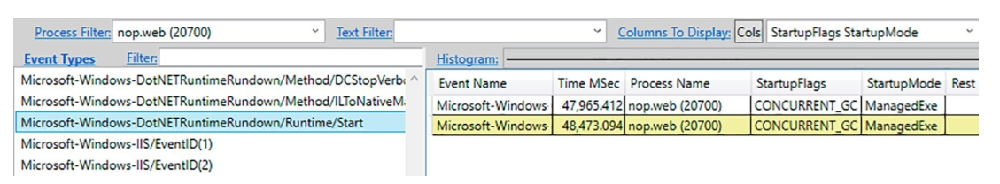

图11-12. Microsoft-Windows-DotNETRuntimeRundown/Runtime/Start事件显示的CLR运行时设置

作为PerfView的替代方案，您可以使用 Sasha Goldshtein 开发的 `etrace` 工具。该工具允许通过命令行控制ETW会话，并提供多种筛选条件。在您的场景中，您只需关注单个进程的特定事件。由于 `etrace` 会启动.NET相关的ETW会话，Runtime/Start事件将被触发。具体命令及其输出如代码清单11-8所示。

代码清单11-8. 用于列出指定ETW提供程序事件并应用筛选条件（如进程ID）的 `etrace` 命令

```
.\etrace.exe --other Microsoft-Windows-DotNETRuntimeRundown --event Runtime/Start
 --pid=21316
 Processing start time: 30/04/2018 10:21:51
Runtime/Start [PNAME= PID=21316 TID=14648 TIME=30/04/2018 10:21:51]
ClrInstanceID = 9
Sku = 1
BclMajorVersion = 4
BclMinorVersion = 0
BclBuildNumber = 0
BclQfeNumber = 0
VMMajorVersion = 4
VMMinorVersion = 0
VMBuildNumber = 30319
VMQfeNumber = 0
StartupFlags = 1
StartupMode = 1
CommandLine = F:\IIS\nopCommerce\Nop.Web.exe
ComObjectGuid = 00000000-0000-0000-0000-000000000000
RuntimeDllPath = C:\Windows\Microsoft.NET\Framework\v4.0.30319\clr.dll
```

这种方法的唯一不便之处在于 `StartupFlags` 以数值形式呈现，需要您自行参照对应的枚举类型进行解析（见代码清单11-9）。在代码清单11-8中，`StartupFlags` 值为1，表示仅设置了 `CONCURRENT_GC` 标志。

代码清单11-9. 运行时StartupFlags枚举

```c#
public enum StartupFlags
{
    None = 0,
    CONCURRENT_GC = 0x000001,
    LOADER_OPTIMIZATION_SINGLE_DOMAIN = 0x000002,
    LOADER_OPTIMIZATION_MULTI_DOMAIN = 0x000004,
    LOADER_SAFEMODE = 0x000010,
    LOADER_SETPREFERENCE = 0x000100,
    SERVER_GC = 0x001000,
    HOARD_GC_VM = 0x002000,
    SINGLE_VERSION_HOSTING_INTERFACE = 0x004000,
    LEGACY_IMPERSONATION = 0x010000,
    DISABLE_COMMITTHREADSTACK = 0x020000,
    ALWAYSFLOW_IMPERSONATION = 0x040000,
    TRIM_GC_COMMIT = 0x080000,
    ETW = 0x100000, ARM = 0x400000,
    SINGLE_APPDOMAIN = 0x800000,
    APPX_APP_MODEL = 0x1000000,
    DISABLE_RANDOMIZED_STRING_HASHING = 0x2000000
}
```

另一方面，托管在IIS上的ASP.NET Web应用程序会显示StartupFlags值为208919（十六进制33017），对应以下标志组合：
 CONCURRENT_GC（并发GC）、
 LOADER_OPTIMIZATION_SINGLE_DOMAIN（加载器单域优化）、
 LOADER_OPTIMIZATION_MULTI_DOMAIN（加载器多域优化）、
 LOADER_SAFEMODE（加载器安全模式）、
 SERVER_GC（服务器模式GC）、
 HOARD_GC_VM（GC虚拟机保留模式）、
 LEGACY_IMPERSONATION（传统身份模拟）、
 DISABLE_COMMITTHREADSTACK（禁用线程堆栈提交）。

### 场景11-2：不同GC模式的基准测试

**问题描述**：关于不同GC运行模式的探讨最终归结为一个核心问题——哪种模式最适合您的应用程序？表面上看答案很明确：默认模式在多数情况下已经足够。服务器端Web应用采用后台服务器GC模式？交互式UI应用采用后台工作站GC模式？禁用并发模式的情况通常缺乏合理性。但每个应用都有其特殊性，无法保证默认模式就是最优解。此时，唯一可靠的验证方法就是实际测量各选项的影响效果。

**关键问题**：如何准确测量这种影响？需要使用哪些工具？应该关注哪些指标？这正是本场景要解决的问题。我们将使用之前提到的nopCommerce电商系统作为分析对象。请注意，测试结果仅反映该应用当前开发阶段的特性，切勿直接套用结论到您的项目中。本场景的核心价值在于演示分析方法论，帮助您在具体场景中实施类似评估。

**分析方法**：如何量化不同GC设置的效果？“GC暂停与开销”章节已做过基础讨论。测试将在Docker容器化环境中运行nopCommerce应用，通过多维度指标进行全面评估：

- GC开销将通过 `dotnet-counters` 会话记录的“CPU使用率(%)”和“自上次GC后的GC时间占比(%)”指标进行测量（保存为CSV文件）。

- 内存占用情况通过观察 `dotnet-counters` 会话中的“GC堆大小(MB)”指标获取。
- 暂停时间将通过分析 `dotnet-trace` 的 `gc-collect` 会话中记录的 `PauseMSec` 测量值进行深入研究（导出为CSV文件）。
- 客户端视角的响应时间由JMeter工具的汇总报告记录（保存为CSV文件）。

由于需要处理所有这些数据，此类基准测试相当繁琐。由于缺乏能够自动化记录、合并和处理这些结果的工具，该流程目前主要依靠人工操作。若您发现合适的工具，请务必使用！但我们仍强烈建议您以这种全面的方式审视GC设置测量结果，否则实验观察将不完整，可能导致错误结论。

测试场景包含以下步骤：

1. 运行docker化部署的nopCommerce并使用默认样本数据初始化——每个待测试的GC设置都需要重复此步骤。
2. 使用JMeter运行负载测试，模拟网站典型用户流量（始终确保可重复的初始条件——重启应用程序池、进行适当预热、禁用其他后台程序等）。
3. 立即在容器内启动 `dotnet-trace` 会话——使用开销极低的gc-collect配置。
4. 同时立即在容器内启动 `dotnet-counters` 会话（使用collect选项将结果保存为CSV文件）。
5. 让负载测试持续运行指定时长。
6. 停止所有进程。
7. 在PerfView中打开生成的nettrace会话，将所有GC相关事件转换为CSV格式（通过GCStats报告中的“ndividual GC Events/View in Excel”选项实现）。
8. 至此，每个GC设置应生成三个CSV文件——分别来自dotnet-counters、dotnet-trace和JMeter。 
9. 开始分析——包括生成后文所示的各类图表。这项繁琐的工作已通过若干Python脚本实现自动化，这些脚本主要依赖 `pandas` 和 `matplotlib` 库进行数据处理与可视化。

这种方法的主要优势在于其极低侵入性。您可随时启动测试，甚至在生产环境中进行。也无需专门执行负载测试——只要确保条件可重复，在具有相似用户流量（每日/每周/每月相同时段等）时进行观察即可。

此类测量还有另一个重要方面（第3章已提及）：警惕平均值！平均值作为统计量虽能营造“有价值信息”的假象，实则可能掩盖诸多关键事实。因此在测量前文指标时，务必关注其随时间的变化趋势。例如若GC堆大小未显著波动，平均值或许足够；但对于应用程序响应时间（或本例中的GC暂停时间）等关键参数，平均值往往缺乏代表性。

对于关键指标，百分位数才能提供真正有价值的信息。因此无论是GC暂停时间还是应用响应时间，都需基于CSV数据生成百分位图。百分位数与业务需求高度相关——例如要求99%用户响应时间低于2秒、99.99%用户低于10秒。本场景中，我们通过Python脚本对 `dotnet-trace` 和JMeter的采样数据进行百分位计算。某些工具（如.NET Aspire的仪表盘）或Azure等托管环境可辅助此过程。实验中需回答的核心问题是：四种GC配置中哪种最合适——

- 工作站非并发后台 (Workstation Non-concurrent Background)。
- 工作站模式 (Workstation)。
- 服务器非并发后台 (Server Non-concurrent Background)。
- 服务器模式 (Server)。

“合适性”应由业务需求驱动——无论是响应时间SLA、资源消耗（CPU/内存）还是其他可量化指标。需注意，GC开销本身并非业务核心指标——您能想象管理层会直接要求“GC时间占比低于10%”吗？实际上，我们更应关注GC开销对其他业务指标的影响。

每次测试前都通过环境变量配置正确的运行时设置。每种模式均进行多次测试以降低外部因素干扰。

首先讨论CPU开销。图11-13清晰显示：服务器模式GC的CPU使用率显著高于工作站模式。这符合预期，因为服务器模式会积极利用多核CPU资源，而工作站模式则相对保守。

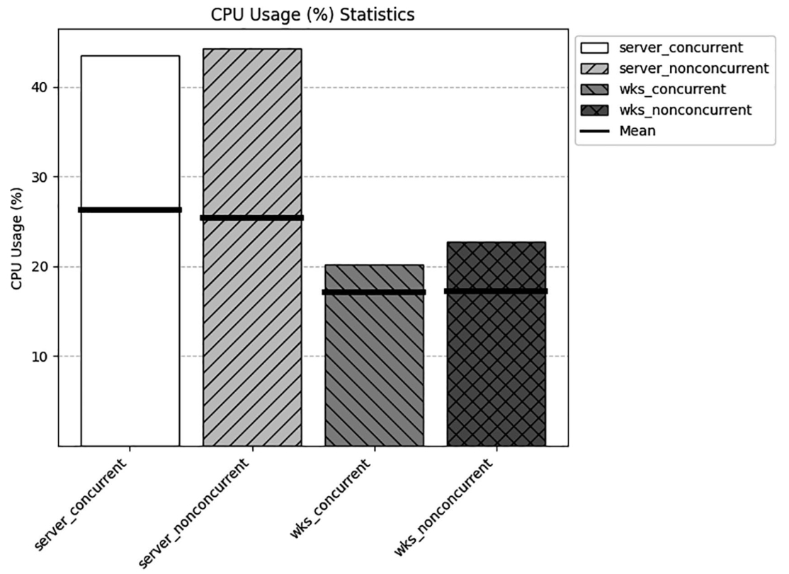

图11-13. 各类GC的CPU使用率

通过使用“自上次GC以来在GC中花费的时间百分比(%)（% Time in the GC since last GC (%)）”计数器指标（见图11-14），您可能会得到具有误导性的结果——工作站模式的GC开销实际上比服务器模式大得多。回顾图11-1可知，“GC时间百分比（% Time in GC）”衡量的是从上次GC到本次GC期间，GC持续时间所占的比例。在服务器模式下，虽然单次GC耗时较短，但由于需要在多个托管堆（多核）上并行处理，因此尽管单次时间缩短，总体CPU使用率却与工作站模式相当，而这一关键信息无法通过“GC时间百分比”指标准确体现。这个观察结论非常重要：在使用“GC时间百分比”计数器时，必须结合当前GC模式进行解读——对于工作站模式，您应该比服务器模式更能容忍较高的百分比值。

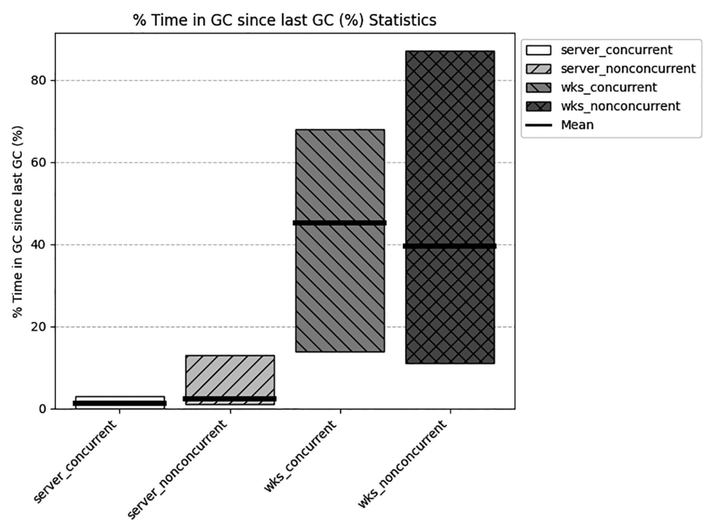

图11-14. GC时间百分比测量

> 如前所述，测量“GC时间百分比”指标（GCStats报告中提供）需要使用包含CPU采样的重量级 `dotnet-trace` 会话，这会引入显著开销。在此类检测下应用程序可能变慢数倍，因此无法进行有意义的性能比较。故本场景中未采用该测量方式。

内存使用量则更能体现不同GC模式间的差异（见图11-15）。与工作站模式相比，两种服务器模式的托管堆内存占用明显更大。而同一模式下，非并发版本与后台版本之间的内存差异则微乎其微。若内存使用量是您的核心考量指标，这些数据将有助于决策。

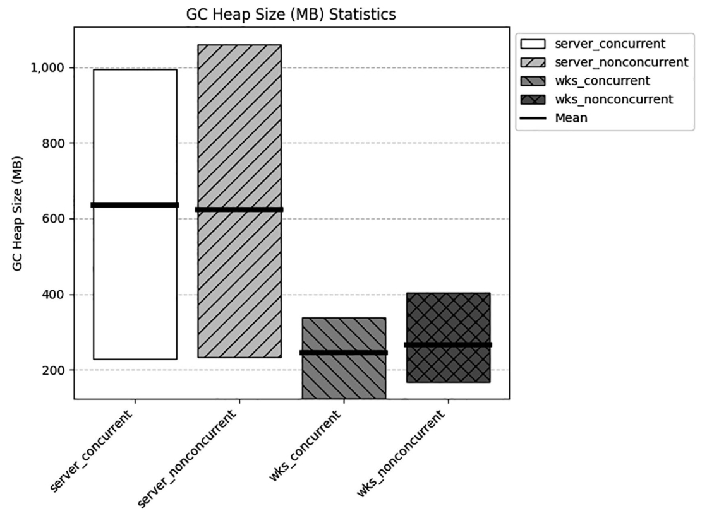

图11-15. 内存使用结果

关于各GC模式产生的暂停时间数据可能更具参考价值，尤其是针对各待回收代际的细分数据。这些结果也符合预期（见图11-16）。短期代（ephemeral generations）的回收速度在所有GC模式下都极快，真正的差异体现在完全GC（full GC）上。表现最差的是非并发工作站模式——该模式下仅使用单个阻塞线程执行全量垃圾回收。非并发服务器模式由于支持多托管堆并行回收而相对较快，但仍明显慢于两种并发版本。

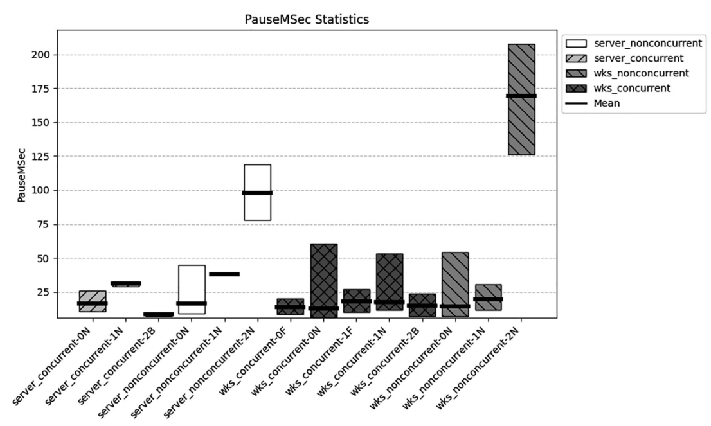

图11-16. 各代GC暂停时间均值结果

但如前所述，对于如此重要的指标，平均值并不具备足够代表性。观察百分位数数据时（见图11-17），后台服务器模式表现最优，而非并发工作站模式明显最差（尤其在超过99%的高百分位区间出现严重劣化）。这才是评估应用暂停时间的正确方式——实际测量您自己的应用，结果可能会出乎意料！

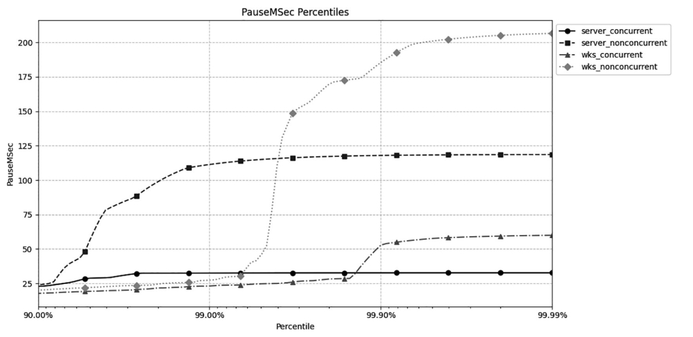

图11-17. GC暂停时间百分位结果

但正如前文所述，GC开销（包括GC暂停）对业务核心指标的影响更为关键。从应用视角看这些测试结果如何？图11-18展示了通过JMeter测量的响应时间，对应负载测试场景中的各个操作步骤（如添加购物车、展示商品分类等）。

可见在本场景中，无论是否启用并发，服务器GC模式的响应时间均显著优于工作站模式。值得注意的是，由于请求处理耗时本身较长，非并发模式产生的长暂停在客户端视角的最大响应时间中并未显著体现——因为常规处理耗时本就远超最长的GC暂停时间。若您的请求处理时间在几十毫秒级别，GC暂停对应用的影响将更为显著。

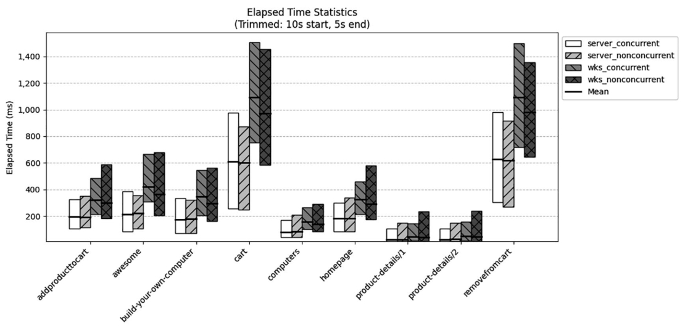

图11-18. 响应时间结果

但平均值仍不足够，我们来看选定场景步骤（购物车商品详情设置）的响应时间百分位数（见图11-19）。数据显示该特定端点受非并发工作站GC模式的严重影响，相比其他模式产生显著延迟。其他端点未呈现如此明显的延迟，这可能表明该端点存在较重处理逻辑。这也印证了进行细粒度测量的必要性——不同GC模式下响应时间的百分位分布。

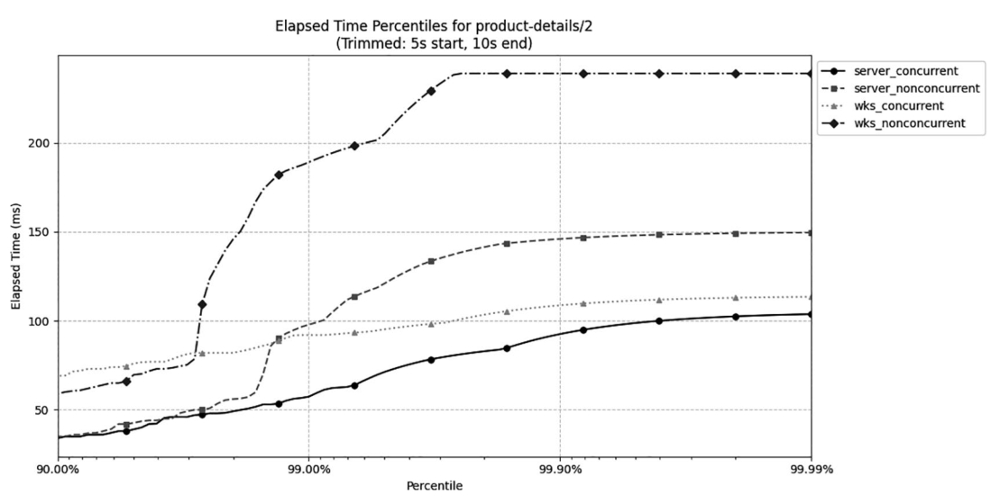

图11-19. 响应时间百分位结果

本场景的最终结论是：建议采用任一服务器GC版本，但需注意其CPU和内存消耗显著增加。这完全符合预期，并清晰表明您可以通过这些模式控制GC的“激进程度”。需特别强调，这些结论基于特定前提条件——模拟的用户负载、特定环境（CPU核心数、内存容量、其他运行中的应用程序）。因此，在近生产环境（而非开发机）执行此类测试至关重要。

> 虽然本场景以适合负载测试的Web应用为例，但桌面/移动应用同样可通过自动化测试进行评估。若采用MVVM等架构实现业务逻辑分离，也可仅测试通过API暴露的逻辑层。但请注意，隔离测试组件与完整应用测试的结果可能存在显著差异。

为简洁起见，本文省略了各类延迟模式的类似基准测试。其测试流程基本一致，结论也应符合预期。但唯有针对您具体应用的实测数据，才能最终判定采用这些模式的实际价值。

## 本章总结

本章介绍了多种调整.NET垃圾回收器(GC)行为的方法。您已从实现原理和实践应用两个维度，深入理解了工作站模式与服务器模式的差异；同时掌握了非并发GC与并发GC（现称为后台GC）的特性，并简要了解了并发标记与清除等核心机制的实现原理。

章节最后探讨了模式选择策略——包括工作站与服务器GC的决策指南。一方面，这些模式差异属于常识范畴；另一方面，开发者往往不会主动修改默认配置。这正是.NET团队的卓越成就：默认配置在大多数场景下表现优异，通常无需人工干预。

但总会存在默认配置无法满足需求的场景，因此本章末节通过完整案例，详细演示了如何基于严谨的性能基准测试做出科学的配置决策。

以下两条规则浓缩了本章核心知识。下一章我们将探讨与对象生命周期相关的重要机制：终结(finalization)。

