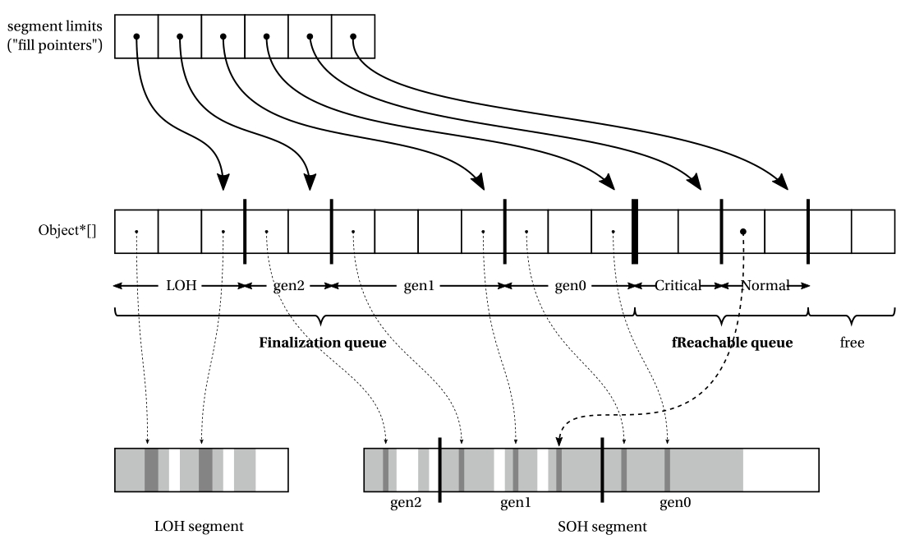
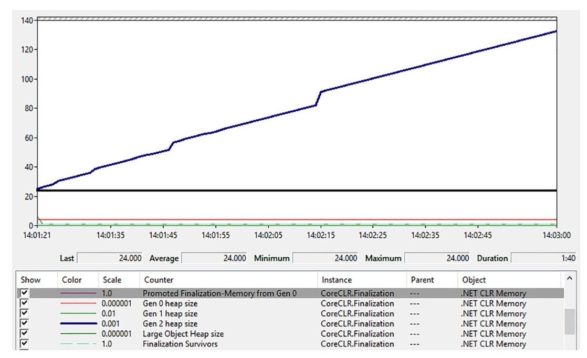
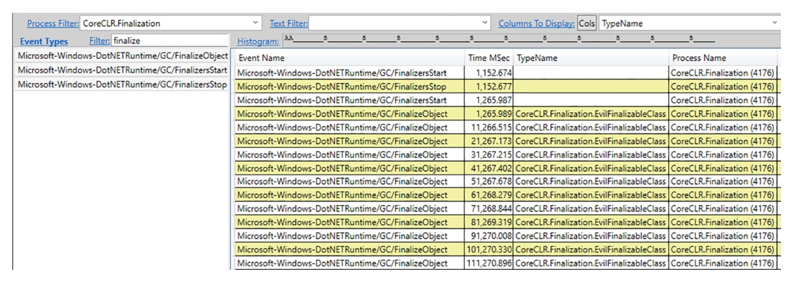
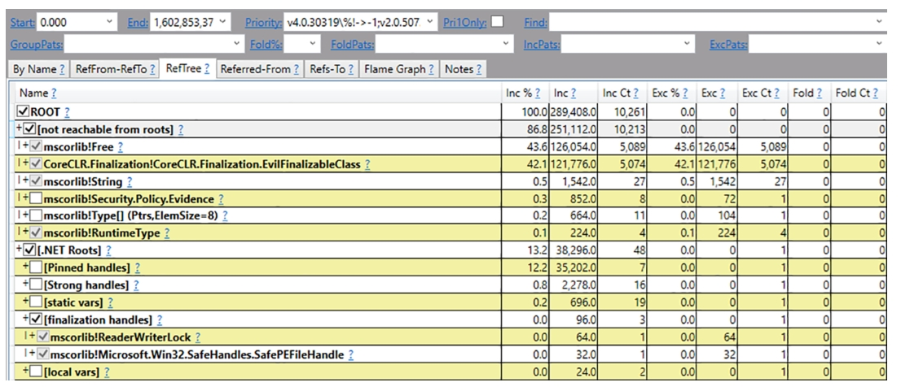

# 对象生成周期

前几章已全面阐述了.NET的自动内存管理机制。第6章介绍了对象创建方式，第7至11章则详细讲解了无用对象的回收过程。但若不了解某些辅助机制，你的知识体系仍不完整。本章将聚焦其中三项机制。这些机制虽可独立运作，但在概念上都与同一主题紧密关联——即对象的生命周期。

所述三项机制包括：终结（finalization）、可释放对象（及其广为采用的 `Disposable` 模式）以及弱引用（`weak references`）。通过本章学习，你将透彻理解它们的实现原理、应用场景及使用方法。文中还提供若干实际案例，演示如何诊断相关问题。需特别说明的是，这些机制主要从内存管理视角进行阐释。其他著作中有更全面的探讨，涵盖所有优劣考量及常见陷阱——本书并非C#入门教材，故不涉及通用C#话题讨论。

终结机制与 `Disposable` 模式均与非托管代码交互（及 `P/Invoke` 机制）密切相关，因此本章大量篇幅聚焦于此。但请注意，这两项机制连同弱引用，同样适用于与非托管资源无关的常规托管代码场景——例如日志记录或缓存应用。即便你不涉及非托管代码与 `P/Invoke`，本章内容仍值得一读。

## 对象与资源生命周期

在托管世界中，一切似乎都很简单。你创建对象、使用它们，当不再需要时垃圾回收器（GC）会在某个时刻将其删除。只要对象不再被使用，具体何时被回收并不重要。这种非确定性的对象释放方式是追踪式垃圾回收器（如.NET中的实现）的典型特征。

这一切都很美好，直到你希望对象不再被需要时触发某些操作——这种技术称为终结（finalization）。突然间，GC的非确定性特性成了问题——开发者根本没有合适的地方编写相关代码。因为从代码角度来看，对象创建的时刻（构造函数）是明确的，但对象回收的时刻却没有明确定义。

像.NET这样的托管运行时提供了专门的终结机制——包括一个明确定义的位置，开发者可以在此编写对象成为垃圾时需要执行的代码。事实上，本章大部分内容都在讨论这种终结过程。由于它本质上与垃圾回收的非确定性相关，因此常被称为非确定性终结（non-deterministic finalization）——它必然会发生，但具体时间未知。

此外，有时可能需要确定性终结（deterministic finalization）——在明确知道对象不再使用时显式执行操作。.NET通过 `IDisposable` 接口提供了这种终结的契约，后文将详细探讨。

> 非确定性终结与确定性终结有时也被分别称为隐式清理（implicit cleanup）和显式清理（explicit cleanup）。

请注意，从概念上讲，终结机制与垃圾回收机制并无直接关联。它绝对不涉及垃圾回收本身（尽管有些开发者会误解）。终结只是产生副作用——你可能希望在对象不可达或不再需要时执行某些操作。但无论是C#中的终结器（finalizers）还是 `IDisposable` 接口，都不负责释放不再需要的对象内存！我们在多次招聘面试中听到候选人说 `Dispose` 方法会释放内存，希望读完前几章后你能彻底明白这是错误的。

那么为什么需要终结机制？在完全托管的环境中，它的必要性其实很低。这种情况下，所有托管对象相互引用，整个对象图都由GC妥善管理。如果删除一个对象（比如将其最后一个引用赋值为null），追踪式GC会自动删除其他所有无法从别处访问的关联对象。这种删除关联对象的行为，正是C++中析构函数的典型职责。

在托管世界中，终结机制主要用于对象持有GC和运行时无法管理的资源（非托管资源）。这类资源通常是各种句柄、描述符以及与系统资源相关的数据，它们必须显式释放。特定环境越依赖这类非托管协作，终结机制就越重要。.NET环境从设计之初就高度兼容非托管代码——正如前文所述，其设计目标之一是将常规C++代码稍作修改即可编译为.NET程序（类似如今的C++/CLI语言）。许多常用API底层都依赖非托管资源（如文件、套接字、位图等），因此.NET开发者从早期就开始使用两种终结形式：确定性的 `IDisposable` 契约和非确定性终结。

> JVM作为极流行的托管环境，对非确定性终结的关注度低得多。它们被认为不可靠、易出问题且会给GC带来不必要的开销。事实上，Java 9起甚至将 `java.lang.Object.finalize` 方法标记为废弃。多年来更推荐采用确定性终结方法——通过提供显式清理方法并要求开发者在对象不再需要时调用（通常用 `try-finally` 块包裹），这正是.NET世界知名的 `Disposable` 模式。

作为废弃方法的替代方案，Java建议使用 `java.lang.ref.Cleaner` 类来管理对象引用，通过 `java.lang.ref.PhantomReference` 及其关联的清理动作实现非确定性终结。虚引用（`PhantomReference`）会在回收器确定其引用对象可被回收后入队。

由于托管与非托管世界的共存，你需要分别考虑两个问题：对象生命周期的管理和对象持有的（非托管）资源管理。对象生命周期管理完全由GC负责，而运行时对非托管资源的理解有限，因此资源管理需要你借助本章所述特性自行处理。

需注意的是，本章将展示.NET中特定的终结实现会影响对象生命周期——因为终结本质上是对象删除的副作用。

## 终结（Finalization）

在.NET中通常所说的“终结”一般被理解为非确定性终结。正如ECMA-335标准所述：“创建对象类型的类定义可以提供一个实例方法（称为终结器），当该类的实例不再可达时调用。”这正是本章节要探讨的内容——如何声明和使用终结器方法，以及CLR如何实现它。

### 引言

在C#类型中声明终结器时，引入了特殊的 `~` 语法来模仿C++的析构函数（见代码清单12-1）。这表示当对象不再可达且其内存即将被回收时调用的代码。不要被C++析构函数语法所迷惑，这段代码执行的确切时间是非确定性的，稍后你会明白这一点。

在我们的示例中，终结器用于关闭已打开文件的句柄（否则迟早会达到系统最大句柄数限制）。在Windows系统中，系统资源通常由“句柄”表示，这些句柄通常映射到 `IntPtr` 结构体。

代码清单12-1 C#中使用终结器的简单示例

```csharp
class FileWrapper
{
    private IntPtr _handle;
    public FileWrapper(string filename)
    {
        Unmanaged.OFSTRUCT s;
        _handle = Unmanaged.OpenFile(filename, out s, 0x00000000);
    }
    // 终结器
    ~FileWrapper()
    {
        if (_handle != IntPtr.Zero)
            Unmanaged.CloseHandle(handle);
    }
}
```

C#中的终结器只是一个包装器，编译器会将其转换为重写 `System.Object.Finalize` 的 `Finalize` 方法（见代码清单12-2）。

代码清单12-2 终结器的IL方法定义

```il
.method family hidebysig virtual
instance void Finalize() cil managed
{
    .override method instance void [System.Runtime]System.Object::Finalize()
    // ...
}
```

重写 `Finalize` 方法是类型与GC之间的一种契约——这些对象被称为可终结对象，会得到GC的特殊处理。

> 在F#或VB.NET中声明可终结类型时，必须显式重写 `Finalize` 方法。但在C#中这是不允许的。尝试这样做会导致错误：“不要重写 `Object.Finalize`。相反，应提供一个析构函数。”因此，唯一的方法是使用 `~Typename` 语法。这个“析构函数”的名称相当不幸，因为如我们所知，它与托管对象本身的解构无关，更多与资源管理相关。有趣的是，由于C++已经使用 `~Typename()` 语法作为C++析构函数，在C++/CLI中终结器被定义为 `!Typename()`。

还需注意，正如微软文档所述：“派生类型中的每个 `Finalize` 实现都必须调用其基类型的 `Finalize` 实现。这是应用程序代码允许调用 `Finalize` 的唯一情况。”在C#中，析构函数包装器会自动完成这一点，但在其他语言中需要记住这一点。

例如，你可以使用终结器来管理由消耗资源引入的额外内存压力（借助 `GC.AddMemoryPressure`和 `GC.RemoveMemoryPressure` 方法），即使它是托管资源但你知道它底层使用了一些本地资源。典型的例子是使用 `System.Drawing.Bitmap` 类，它实际上表示为单个系统资源句柄，但在使用位图数据时显然需要一些额外内存（见代码清单12-3）。

代码清单12-3 使用终结器维护额外内存压力的示例

```csharp
class MemoryAwareBitmap
{
    private System.Drawing.Bitmap _bitmap;
    private long memoryPressure;
    public MemoryAwareBitmap(string file, long size)
    {
        _bitmap = new System.Drawing.Bitmap(file);
        if (_bitmap != null)
        {
            memoryPressure = size;
            GC.AddMemoryPressure(memoryPressure);
        }
    }
    ~MemoryAwareBitmap()
    {
        if (_bitmap != null)
        {
            // 不需要调用_bitmap.Dispose()因为它可能已经被终结
            // 稍后会详细讨论
            GC.RemoveMemoryPressure(memoryPressure);
        }
    }
}
```

然而，使用终结器有一些限制：

- 如前所述，它们的执行时间是非确定性的——终结器很可能会被调用（稍后你会看到），但确切时间不可预测。从资源管理角度看这很糟糕。如果拥有的资源有限，应该尽快释放。等待非确定性清理是低效的。在GC之后，`GC.WaitForPendingFinalizers` 方法可以确保在继续处理之前执行已收集可终结对象的终结器。我们稍后会多次提到这一点。
- 终结器的执行顺序是未定义的。即使一个可终结对象引用了另一个可终结对象，也不能保证它们的终结器会以任何逻辑顺序运行（比如“被拥有者”在“拥有者”之前或相反）。因此，你不应该在终结器中引用任何其他可终结对象，即使你“拥有”它们。无序执行是一个经过深思熟虑的设计决策——有时根本不可能找到一个自然顺序（例如，可终结对象之间的循环引用怎么办？）。不过，在关键终结器形式中存在一些可能的排序，稍后会描述。但是，终结器代码可以引用常规托管对象字段（即没有终结器的）。可以保证整个对象图只有在运行终结器后才会被收集。
- 在当前.NET实现中，执行终结器的线程是明确定义的。然而，ECMA-335没有强加任何要求。因此，应该避免依赖任何线程上下文（包括可能导致死锁的线程同步，如锁定）。
- 不能保证终结代码一定会执行或完整执行——例如，如果终结器中的某些同步问题导致它无限期阻塞，或者进程快速终止而没有给GC执行它们的机会。由于后面描述的复活技术，终结器也可能被执行多次。
- 从终结器抛出异常非常危险——默认情况下，它会直接杀死整个进程。因为终结器代码被认为非常重要（如释放系统范围的同步原语），无法执行它会被视为最高严重级别。因此，你必须非常小心，不要让任何异常逃逸出终结器。
- 可终结对象会给GC带来额外开销，可能影响整个应用程序性能——正如你将在描述终结实现的章节中看到的。

所有这些都得出相同的结论——实现终结器很棘手，使用它们可能不可靠，因此通常应该避免使用它们。将它们视为隐式的“安全网”，用于开发人员没有通过首选的显式清理方法释放资源的情况。在讨论 `Disposable` 模式时，你会看到这种典型用法。

> ECMA-335指出“为值类型定义终结器是有效的。然而，该终结器只会为该值类型的装箱实例运行。”在.NET运行时中，这不再有效。运行时在装箱时简单地忽略值类型中定义的终结器。

从程序员的角度来看，应该只关心终结器在对象变得不可达后的“某个时间”被调用。尽管如此，虽然这是一个实现细节，但了解终结器何时可能被实际调用是很好的。一般来说，有两种情况会发生：

- 在GC结束后：无论是什么触发了GC，在这次特定GC中发现不可达的可终结对象都会被排队，它们的终结器很快就会被执行。请记住，这意味着只有来自被判定（和更年轻）代的对象终结器会被调用。
- 作为CLR内部簿记：当运行时卸载AppDomain时，以及当它关闭时。

如前所述，终结器不一定仅限于非托管资源。你可以想象其他用途，比如代码清单12-4中的生命周期日志示例。如果出于某种原因，你希望在对象创建和删除时记录一些内容，它的构造函数和终结器似乎是理想的位置。例如，你可能想这样做，因为该对象代表了关键或资源密集型功能。

代码清单12-4 在C#中使用终结器的简单示例

```csharp
class LoggedObject
{
    private ILogger _logger;
    public LoggedObject(ILogger logger)
    {
        _logger = logger;
        // _logger.Log("Object created.");
    }
    // 终结器
    ~LoggedObject()
    {
        _logger.Log("Object finalized.");
    }
}
```

请注意，即使在这样一个“非-非托管”的世界中，实现终结器也不简单。在代码清单12-4中，终结器可能通过接口使用依赖注入的记录器。这意味着你不能保证注入的具体记录器实例不是可终结的，因此你会面临无序终结执行的问题——当从你的终结器调用时，记录器可能已经被释放。这是一个简单但富有表现力的终结陷阱示例。

如何减轻这种危险？一些解决方案可能基于代码审查或自动化静态分析——确保 `ILogger` 实现不是可终结的，或者它们是关键可终结的（很快你就会明白为什么这可能有所帮助）。但首选的解决方案总是一样的——避免使用终结。如果这样一个对象的生命周期如此重要，你可能会从实现 `Disposable` 模式中获益更多，其中清理时刻是手动定义的，对日志设施来说更安全。

### 激进根回收问题

对象与资源的生命周期分离管理可能导致异常副作用。在第8章的代码清单8-13至8-16中已有所体现，这些问题大多与激进根回收技术相关。虽然这项基于JIT的优化技术能尽可能缩短对象生命周期，但在资源管理场景中可能引发问题。

典型案例如使用流访问文件（见代码清单12-5）。若取消 `ProblematicObject.UseMe` 方法内的GC调用注释（模拟方法执行期间发生的GC回收），程序将抛出未处理异常：`System.ObjectDisposedException: 无法访问已关闭的文件`。这是由于JIT优化会将 `UseMe` 方法内的 `ProblematicObject` 实例在最后一次 `this` 引用后标记为不可达。因此当 `stream` 赋值给 `localStream` 变量后，`ProblematicObject` 的终结器可能立即执行。如你所见，终结器关闭了流对象，导致后续 `ReadByte` 调用失败。简单修正方案是始终使用实例成员 `stream` 而非局部变量（例如最后一行改为 `return this.stream.ReadByte()`）。此时 `UseMe` 方法最后一行仍持有 `this` 引用，可避免激进根回收优化。但若 `ReadByte` 执行期间发生GC，由于 `ProblematicObject` 实例已无引用，同样的问题仍会出现——激进根回收优化同样会影响“this”指针。**这再次证明不应在终结器中调用任何托管对象方法！**

代码清单12-5 终结器过早释放资源的问题

```c#
class ProblematicObject
{
    Stream stream;
    public ProblematicObject() => stream = File.OpenRead(@"C:\Temp.txt");
    ~ProblematicObject() {
        Console.WriteLine("Finalizing ProblematicObject");
        stream.Close();
    }
    public int UseMe() {
        var localStream = this.stream;
        // 常规代码，复杂度足以阻止方法内联和部分/完全中断
        // 此处发生GC且终结器已执行完毕
        // 可通过以下调用模拟：
        // GC.Collect();
        // GC.WaitForPendingFinalizers();
        return localStream.ReadByte();
    }
}
class Program
{
    static void Main(string[] args) {
        var pf = new ProblematicObject();
        Console.WriteLine(pf.UseMe());
        Console.ReadLine();
    }
}
```

在P/Invoke调用中也可能出现同类问题。为此.NET引入了若干改进方案。首先扩展代码清单12-1，添加直接使用P/Invoke的 `UseMe` 方法（见代码清单12-6）。这会产生相同问题——被急切回收的 `ProblematicFileWrapper` 实例会触发终结器关闭文件句柄，而后续代码仍在尝试使用该句柄。此时 `Unmanaged.ReadFile` 调用将失败，`UseMe` 方法返回-1。

代码清单12-6 终结器过早释放资源问题（代码清单12-1的扩展）

```c#
public class ProblematicFileWrapper {
	private IntPtr handle;
    public ProblematicFileWrapper(string filename) {
        Unmanaged.OFSTRUCT s;
        handle = Unmanaged.OpenFile(filename, out s, 0x00000000);
    }
    ~ProblematicFileWrapper() {
        Console.WriteLine("Finalizing ProblematicFileWrapper");
        if (handle != IntPtr.Zero)
        Unmanaged.CloseHandle(handle);
    }
    public int UseMe() {
        var hnd = this.handle;
        // 常规代码
        // 此处发生GC且终结器已执行完毕
        // 可通过以下调用模拟：
        //GC.Collect();
        //GC.WaitForPendingFinalizers();
        byte[] buffer = new byte[1];
        if (Unmanaged.ReadFile(hnd, buffer, 1, out uint read, IntPtr.Zero)) {
        	return buffer[0];
        }
        return -1;
    }
}
```

基础解决方案是通过 `GC.KeepAlive(this)` 控制激进根回收，在 `UseMe` 方法返回前显式延长持有句柄的对象生命周期。但这种方式会使代码臃肿且繁琐。

这些问题促使BCL早期引入了 `HandleRef` 结构体。这个简单包装器同时持有句柄及其所属对象，在P/Invoke调用期间通过互操作封送处理机制特殊处理，延长目标对象生命周期。对应的P/Invoke签名需使用 `HandleRef` 替代原始 `IntPtr`（见代码清单12-7）。

代码清单12-7 使用 `HandleRef` 结构体解决终结器问题

```c#
public int UseMe()
{
    var hnd = this.handle;
    // 常规代码
    // 此处发生GC且终结器已执行完毕
    // 可通过以下调用模拟：
    //GC.Collect();
    //GC.WaitForPendingFinalizers();
    byte[] buffer = new byte[1];
    if (Unmanaged.ReadFile(new HandleRef(this, hnd), buffer, 1, out uint read, IntPtr.Zero)) {
    	return buffer[0];
    }
    return -1;
}
```

但 `HandleRef` 无法解决所有问题——特别是后续将讨论的恶意句柄回收攻击。因此它已成为过时的遗留方案，主要存在于旧代码中（80%以上的使用集中在Windows Forms和 `System.Drawing` 代码库）。

与 `HandleRef` 同时期引入的 `HandleCollector` 类通过引用计数机制管理句柄——当创建句柄数超过阈值时触发GC。该方案同样被视为遗留技术，现已极少使用。

> 切勿使用 `HandleRef` 及其同期引入的 `HandleCollector` 类。此处介绍它们仅为了完整呈现资源管理知识体系，并提供理解后续推荐的 `SafeHandle` 方案的历史背景。即使在现有代码中遇到这些类型，也不应效仿这种模式。.NET Framework 2.0引入的安全句柄（`SafeHandle`）是更优秀的替代方案，下一节将详细阐述。

> `HandleRef` 用于在 P/Invoke 场景下，**安全地传递非托管资源句柄**，同时**防止其对应托管对象被垃圾回收**。
>
> 为什么不推荐用 HandleRef？
>
> - `HandleRef` 只是**防止垃圾回收器回收托管对象**，它**本身不负责句柄的释放或管理**，容易造成资源泄漏。
> - 它的设计局限于“托管对象+非托管句柄”这种很老的场景，**没有内置的异常安全和自动释放机制**。
> - 开发者容易出错，忘记释放句柄，造成句柄泄漏，严重时会导致系统句柄耗尽。
>
> 现代 .NET 资源管理，尤其涉及 P/Invoke 和非托管句柄时，统一推荐使用 **SafeHandle（及其派生类）**。
>
> `SafeHandle` 是 .NET 框架专门为安全封装和自动释放非托管句柄设计的抽象基类。派生类如 `SafeFileHandle`、`SafeWaitHandle`、`SafeProcessHandle` 等。它能确保即使出现异常，句柄也一定会被安全释放，彻底解决资源泄漏问题。与 `using` 或自动资源管理（finalizer、Dispose模式）高度集成。

### 关键终结器

由于前文提到的终结器存在种种问题，.NET Framework 引入了一种更为可靠的替代方案——关键终结器（Critical Finalizers）。它们本质上是带有额外保障的常规终结器，专为那些必须确保终结代码绝对执行（即使在应用程序域被强制卸载或线程被中止等极端情况下）的场景设计。正如微软官方文档所述：“在继承自 `CriticalFinalizerObject` 的类中，只要终结器遵循 CER（受约束的执行区域）规则，公共语言运行时（CLR）就能保证所有关键终结代码都有机会执行，即使遇到 CLR 强制卸载应用程序域或中止线程的情况。”

要定义关键终结器，必须在继承自 `CriticalFinalizerObject` 的类中编写终结器。`CriticalFinalizerObject` 类本身是抽象类且不包含具体实现（见代码清单 12-8），它只是类型系统与运行时之间的又一契约。运行时采取特殊措施确保关键终结器在任何情况下都能执行，例如会预先对关键终结器代码进行 JIT 编译，以避免在内存不足异常发生时因无法编译而失效。

代码清单 12-8 `CriticalFinalizerObject` 类定义（部分特性为简洁起见已省略）

```c#
public abstract class CriticalFinalizerObject
{
    protected CriticalFinalizerObject() { } 
    ~CriticalFinalizerObject() { }
}
```

由于常规终结器的执行顺序不确定性可能引发问题，关键终结器在这方面提供了额外保证。微软文档特别说明：“CLR 在常规终结器与关键终结器之间建立了弱排序规则：对于同一时间被垃圾回收的对象，所有非关键终结器的调用都优先于任何关键终结器。例如 `FileStream` 这类持有 `SafeHandle` 数据（继承自 `CriticalFinalizerObject`）的类，可以先运行标准终结器来刷新缓冲区数据。”

实际开发中很少需要直接从 `CriticalFinalizerObject` 派生类型，更常见的做法是继承 `SafeHandle` 类型（其本身即派生自 `CriticalFinalizerObject`）。但由于 `SafeHandle` 类型依赖于终结器与 `Dispose` 模式，我们将在本章后续介绍这两者后再详细讨论。

### 终结机制内部原理

在了解了终结器（finalizers）的含义后，我们现在来看看它们在运行时中的具体实现。到目前为止，我们主要从语义层面进行了大量描述——它们的设计目的、提供的保证以及引入的限制。然而，理解它们的实现还带来了另一系列缺点也很重要。本节的主要目的就是了解这些内容。

首先，如第6章所述，如果一个类型定义了终结器，就会使用更慢的分配路径——这是仅因类型重写了`Finalize`方法而引入的第一个重要开销。

> 若想研究.NET源码中因终结导致的慢速分配路径，可从JIT处理 `CEE_NEWOBJ` 操作码的流程入手（实现于JIT导入器`importer.cpp:Compiler::impImportBlockCode`）。它在 `CEEInfo::getNewHelperStatic` 中检查类型是否定义了终结器。如果是，则选择 `CORINFO_HELP_NEWFAST` 辅助函数，该函数在运行时启动时被分配给 `JIT_New` 函数。经过一系列调用后，`GCHeap::Alloc` 函数通过 `CHECK_ALLOC_AND_POSSIBLY_REGISTER_FOR_FINALIZATION` 宏调用 `CFinalize::RegisterForFinalization` ——该函数负责后续描述的终结对象簿记工作。如前所述，虽然 ECMA-335 规定装箱值类型的终结器会被调用，但这一行为现已不再成立。GC必须感知所有可终结对象，以便在它们不可达时调用其终结器。GC将这些对象记录在终结队列（finalization queue）中。换言之，终结队列在任何时刻都包含当前存活的所有可终结对象。如果终结队列中存在大量对象，并不一定意味着出现了问题——这只说明当前存在许多定义了终结器的存活对象。

在垃圾回收的标记阶段（Mark phase）结束时，GC会检查终结队列以判断其中是否有任何可终结对象已死亡。如果存在这样的对象，由于它们的终结器需要被执行，这些对象还不能被立即删除。因此，这些对象会被转移到另一个名为 `fReachable 队列`（即可达终结队列）中。该队列的名称源于它表示“可通过终结访问的对象”（finalization reachable）——即那些仅因终结机制而暂时恢复可达状态的对象。如果发现此类对象，GC会通知专用的终结器线程开始工作。

终结器线程是.NET运行时创建的另一条独立线程。它会逐个从 `fReachable` 队列中移除对象并调用其终结器。这个过程发生在GC恢复托管线程之后，因为终结器代码可能需要分配新对象。由于对象在 `fReachable` 队列中的唯一根引用已被移除，当下一次GC判定该对象所在分代时，会发现它已真正不可达并回收其内存。

请注意，这里引入了终结机制最大的开销之一：**可终结对象默认至少会存活到下一次更高代际的GC**。例如，如果对象被提升至gen2，就意味着需要触发gen2 GC才能回收它，而不是gen1 GC。

为了控制终结的异步特性，运行时提供了 `GC.WaitForPendingFinalizers` 方法。该方法的功能如其名——它会阻塞调用线程，直到 `fReachable` 队列中的所有对象都被处理完毕（即所有终结器都已执行）。作为副作用，在该方法调用后，所有之前“通过终结可达”的对象将真正变为不可达状态，因此随后的GC会回收它们。

> 这里的“通过终结可达”不是指的“根节点可达”的活动对象，而是“可终结对象”。这些对象已经不再被应用程序的任何活动代码直接引用（即“根”对象不可达）；
>
> “通过终结可达”指的是，它们的类型实现了终结器（C# 里的 `~ClassName()`）。在第一次变得不可达时，**GC 并不会立刻回收它们**。此时，GC 会把这些对象放入“终结队列”（`fReachable` 队列，finalization-reachable queue）（即终结可达），等待专门的终结器线程调用它们的终结器方法。这样是为了让对象有机会释放非托管资源（比如文件句柄、数据库连接等）。

这引出了一个非常流行的“终极显式垃圾回收”模式（见代码清单12-9）——当需要彻底清理内存时普遍使用。

代码清单12-9 考虑终结根的显式GC常见模式

```csharp
GC.Collect();  
GC.WaitForPendingFinalizers();  
GC.Collect();  
```

初看似乎毫无意义，但这些调用实际上非常合理：

- 第一次显式完全阻塞GC会发现当前的 `fReachable` 对象集合。
- 线程等待GC处理完所有 `fReachable` 对象，使它们真正不可达。
- 第二次显式完全阻塞GC会回收这些对象的内存。

显然，如果在 `WaitForPendingFinalizers` 期间其他线程仍在分配可终结对象，那么在第二次 `GC.Collect` 调用时可能会发现新的 `fReachable` 对象集合。这导致一个悖论——似乎永远无法完全回收内存（至少在不激进地阻塞所有可能分配对象的线程的情况下）。这一点在 `GC.GetTotalMemory` 方法的实现中清晰可见（见代码清单12-10），该方法返回当前存活对象占用的总字节数。若需要精确值，应传递`true`作为其 `forceFullCollection` 参数。该方法会通过多次触发完全GC和终结等待来尝试获取真实的存活对象集合——直到结果在5%的变化范围内趋于稳定（最多迭代20次以避免无限循环）。

代码清单12-10 `GC.GetTotalMemory` 实现

```c#
[System.Security.SecuritySafeCritical] // auto-generated
public static long GetTotalMemory(bool forceFullCollection) {
    long size = GetTotalMemory();
    if (!forceFullCollection)
        return size;
        // If we force a full collection, we will run the finalizers on all
        // existing objects and do a collection until the value stabilizes.
        // The value is "stable" when either the value is within 5% of the
        // previous call to GetTotalMemory, or if we have been sitting
        // here for more than x times (we don't want to loop forever here).
    int reps = 20; // Max number of iterations
    long newSize = size;
    float diff;
    do {
        GC.WaitForPendingFinalizers();
        GC.Collect();
        size = newSize;
        newSize = GetTotalMemory();
        diff = ((float)(newSize - size)) / size;
    } while (reps-- > 0 && !(-0.05 < diff && diff < 0.05));
    return newSize;
}
```

你可以复用代码清单12-10中的代码作为“究极显式垃圾回收”模式（或者只要其实现不变，直接调用 `GC.GetTotalMemory(true)` 亦可）。更激进的做法是在首次（甚至每次）`GC.Collect` 调用前，将 `GCSettings.LargeObjectHeapCompactionMode` 设置为 `GCLargeObjectHeapCompactionMode.CompactOnce`。

需要特别注意的是，当 `forceFullCollection` 参数为 `true` 时，`GC.GetTotalMemory` 调用的开销可能极其昂贵。在内存使用模式高度动态的场景下，该方法可能会触发多达20次完全阻塞式GC！因此对于大型动态应用程序，需要做好等待超过一秒才能获取返回值的准备。

还有一个尚未解释的实现细节。如前所述，GC期间只会处理被判定回收的代及其更年轻代中的可终结对象。举例来说，当发生第1代GC时，只有0代和1代中不可达的可终结对象才会被移入 `fReachable` 队列。

这就要求终结队列具备代感知能力——如何判断当前对象所属的代？虽然可以通过检查每个对象的内存地址边界来确定其所属代，但这种做法会消耗宝贵的CPU资源。因此实际实现中，终结队列本身采用分代结构——它将对象地址按不同代划分为多个“组”，在特定GC时只需处理对应代别的组。是的，当对象发生代际提升或降级时，其地址也需要在对应的组间迁移！这又带来了额外的终结机制开销。

当前终结队列和 `fReachable` 队列都实现为单一的对象地址数组（见图12-1），后文统称为“终结数组”。该数组逻辑上划分为三个区域：

- 终结部分：细分为五个组（对应3个代+LOH+POH）。
- `fReachable` 部分：按关键终结器和普通终结器分组存储对象地址。
- 空闲部分：供前面各组扩展使用。

各组边界由称为填充指针的短数组管理。因此遍历特定代的终结队列时，只需访问对应填充指针划定的数组元素即可。从终结队列提升到 `fReachable` 队列意味着将地址复制到目标组（根据终结器类型选择关键或普通 `fReachable` 区），代际迁移同样涉及地址在源组与目标组间的复制。由于终结数组要求保持连续，这类复制操作实际上需要移动源与目标元素之间的所有地址（并相应更新填充指针）。

如前所述，新建包含终结器的对象必须注册到终结队列——从实现角度看，该对象地址需要添加到终结数组的gen0组（这会导致关键和普通 `fReachable` 组的所有后续元素都需要向后移动一位）。因此终结队列操作需要加锁，因为多个线程可能同时通过分配器修改该队列。此外，当终结数组满载时，会新建一个扩容20%的副本。这些操作显然增加了终结机制的开销，由于锁竞争和数组元素复制，可能直接导致用户线程分配速度下降。



图12-1. 展示终结队列与 `fReachable` 队列的终结机制内部结构示意图。为避免图示过于杂乱，仅标注了少量对象引用——实际场景中，除空闲部分外，终结数组的所有元素都包含有效对象地址

GC类公开了两个重要的终结API。首先是 `GC.ReRegisterForFinalize(object)` 方法，该方法允许为已注册过的对象重新注册终结器。本章后续将阐述其使用场景。`GC.ReRegisterForFinalize(object)` 方法的底层实现与对象分配时的常规终结注册完全调用相同的运行时方法——因此调用该方法会产生前文所述的相同开销。

在某些后续会讨论的场景中，可能需要显式禁用可终结对象的终结器执行（这一过程称为终结抑制）。`GC.SuppressFinalize(object)` 方法作为 `Disposable` 模式的组成部分，常被用户线程调用，故其经过了高度优化。与直觉相反（例如通过移除地址并移动后续元素），该方法完全不操作终结数组，从而避免了同步访问终结数组的开销。取而代之的是，它仅设置对象头中的一个标志位，这显然是极其高效的操作。此后，终结器线程对设置了该标志位的对象将不再调用 `Finalize` 方法。

如前所述，在标记阶段结束时，GC会根据终结数组中相应代别的组别检查对象。若对象未被标记，其地址会被移至 `Critical` 或  `Normal fReachable` 区段。若对该对象调用了 `GC.SuppressFinalize`，则会被移至空闲组。

随后，终结器线程扫描这些组中的元素并更新对应的填充指针（扫描完成后，对象将位于“空闲部分”不再被处理，真正成为不可达对象）。当前实现采用单终结器线程。从技术角度看，完全可以使用多个终结器线程并行读取和处理 `fReachable` 队列项。但此类优化可能会破坏应用程序代码，因为大多数终结器代码并未考虑多线程访问场景。

> 若需研究.NET终结机制的源码，可查看 `CFinalize` 类实现。该类的实例由 `gc_heap::finalize_queue` 字段指向，因此在多堆场景（服务器GC）中实际存在多个终结数组（但仅有一个终结器线程）。`CFinalize` 通过  Object 类型的m_Array字段（对象指针数组）维护终结数组，填充指针则由 Object[] 类型的 `m_FillPointers` 字段（指向终结数组元素的指针数组）管理。初始时 `m_Array` 包含100个元素，但会通过 `CFinalize::GrowArray` 方法（创建容量增加20%的新数组并复制现有元素）按需扩展。
>
> `GC.SuppressFinalize` 方法的实现极为简单，调用 `GCHeap::SetFinalizationRun` 方法在指定对象头中设置 `BIT_SBLK_FINALIZER_RUN` 标志位。
>
> 前文提及的 `GCHeap::RegisterForFinalization` 方法会调用 `CFinalize::RegisterForFinalization` 方法，该方法通过移动相关元素（必要时调用 `GrowArray`）实现将对象地址存入终结队列的逻辑。
>
> 在标记阶段，`CFinalize::GcScanRoots` 方法被调用来标记两个 `fReachable` 区段（`m_Array` 最后使用的两个组）中的对象。标记阶段结束时，对 `condemned` 代及更年轻代对应的组调用 `CFinalize::ScanForFinalization`方法。该方法通过调用带不同参数的 `MoveItem`（根据对象是否具有关键终结器）执行终结提升。若发现任何 `fReachable` 对象，则触发 `hEventFinalizer` 事件唤醒终结器线程。最终在GC结束时，调用 `CFinalize::UpdatePromotedGenerations` 方法检查终结队列中所有对象的当前代别，并将其移至正确的组别。
>
> 终结器线程的主循环实现在 `FinalizerThread::FinalizerThreadWorker` 方法中。该方法无限等待 `hEventFinalizer` 事件触发，随后通过调用 `FinalizerThread::FinalizeAllObjects` 和 `FinalizerThread::DoOneFinalization`（在 `BIT_SBLK_FINALIZER_RUN` 标志位未设置时调用底层 `Finalizer` 方法）启动处理流程。

细心的读者可能会问：为何要使用这些队列和专用线程，而不是直接在GC过程中调用终结器？这个问题切中要害。需知终结器是用户自定义代码，程序员可能在其中写入任何内容——包括让线程休眠一小时的 `Thread.Sleep` 调用。若GC在工作过程中调用终结器，整个GC将被阻塞一小时！更糟的是，终结器代码可能引发死锁，导致整个GC陷入死锁状态。在GC内部执行用户定义的终结器代码会使其暂停时间完全不可预测，因此异步处理终结机制是更为安全的选择。

#### 终结化开销

终结化开销的数量级是多少？在一般情况下，很难测量垃圾回收过程中额外对象提升和整体终结队列处理的成本。不过，我们可以轻松测量由于终结处理导致的分配慢路径的开销。这可以通过 `BenchmarkDotNet` 简单基准测试来实现，该测试创建多个可终结或不可终结对象（见代码清单12-11）。

代码清单12-11. 测量可终结对象分配开销的简单基准测试

```csharp
public class NonFinalizableClass   
{ 
    public int Value1; 
    public int Value2; 
    public int Value3; 
    public int Value4; 
}  

public class FinalizableClass   
{ 
    public int Value1; 
    public int Value2; 
    public int Value3; 
    public int Value4; 
    ~FinalizableClass() { } 
}  

[Benchmark]  
public void ConsumeNonFinalizableClass()   
{ 
    for (int i=0; i<N; i++) 
    { 
        var obj = new NonFinalizableClass(); 
        obj.Value1 = Data; 
    }  
}  

[Benchmark]  
public void ConsumeFinalizableClass()   
{ 
    for (int i=0; i<N; i++) 
    { 
        var obj = new FinalizableClass(); 
        obj.Value1 = Data; 
    }  
}
```

测试结果令人震惊（见代码清单12-12）。在这种简单场景下，分配小型可终结对象的速度比常规对象慢约40倍（由于额外的对象提升，确实发生了第1代GC）！两种方法的底层JIT汇编代码完全相同（除了调用的分配器函数不同）。如果可终结对象创建频率较低，这可能不是问题，但若要在高性能关键路径中为高分配率对象添加终结器，请务必三思。

代码清单12-12. 代码清单12-11的BenchmarkDotNet基准测试结果
 （Gen 0和Gen 1列显示单次测试执行的平均第0代和第1代GC次数）

| 方法                       | N    | 平均耗时       | Gen 0  | Gen 1  | 内存分配量 |
| -------------------------- | ---- | -------------- | ------ | ------ | ---------- |
| ConsumeNonFinalizableClass | 1    | 2.777 ns       | 0.0076 | -      | 32B        |
| ConsumeFinalizableClass    | 1    | 132.138 ns     | 0.0074 | 0.0036 | 32B        |
| ConsumeNonFinalizableClass | 10   | 30.667 ns      | 0.0762 | -      | 320B       |
| ConsumeFinalizableClass    | 10   | 1,342.092 ns   | 0.0744 | 0.0362 | 320B       |
| ConsumeNonFinalizableClass | 100  | 316.633 ns     | 0.7625 | -      | 3200B      |
| ConsumeFinalizableClass    | 100  | 13,607.436 ns  | 0.7477 | 0.3662 | 3200B      |
| ConsumeNonFinalizableClass | 1000 | 3,244.837 ns   | 7.6256 | -      | 32000B     |
| ConsumeFinalizableClass    | 1000 | 131,725.089 ns | 7.5684 | 3.6621 | 32000B     |

根据目前描述的所有实现细节，我们可以将终结化的缺点总结如下：

- 默认强制使用更慢的分配路径，包括分配期间操作终结队列的开销
- 默认至少提升可终结对象一次，增加了“中年危机”的可能性
- 即使对象仍存活时也会引入额外开销——主要是维护分代终结队列的更新
- 当可终结对象的分配速率高于其终结速率时可能产生风险（参见场景12-1）

### 场景12-1 – 终结器导致的内存泄漏

描述：您的应用程序内存使用量随时间持续增长。无论是“\.NET CLR Memory\#
Bytes in all Heaps”还是“\.NET CLR Memory\Gen 2 heap size”计数器都在上升。您想调查这个内存泄漏问题，但没有发现明显原因。本场景模拟了一种不太常见但可能发生的泄漏原因。

这里存在一个微妙的内存泄漏可能性。由于 `fReachable` 队列中的终结器是按顺序执行的，其总耗时取决于每个可能运行缓慢的终结器。如果可终结对象的分配速度高于终结执行速度，`fReachable` 队列就会不断增长，堆积所有等待终结的对象。这再次说明为什么终结代码应尽可能简单。

让我们用代码清单12-13重现这个恶性终结器问题。示例程序创建可终结对象的速度远快于终结器的执行速度。模拟高流量场景时（当您已遇到中年危机问题），垃圾回收会非常频繁地发生。

代码清单12-13. 展示因长耗时终结导致内存泄漏的实验代码

```c#
public class LeakyApplication
{
    public void Run()
    {
        while (true)
        {
            Thread.Sleep(100);
            var obj = new EvilFinalizableClass(10, 10000);
            GC.KeepAlive(obj); // 防止obj被完全优化掉
            GC.Collect();
        }
    }
}

public class EvilFinalizableClass
{
    private readonly int finalizationDelay;
    public EvilFinalizableClass(int allocationDelay, int finalizationDelay)
    {
        this.finalizationDelay = finalizationDelay;
        Thread.Sleep(allocationDelay);
    }
    ~EvilFinalizableClass()
    {
    	Thread.Sleep(finalizationDelay);
    }
}
```

虽然您已知道泄漏原因，但让我们从诊断角度观察其表现。顺便说，希望您已知道解决方案——尽量避免使用终结器，若确实需要，务必确保它们快速且简单。

分析：首先使用侵入性最小、最简单的工具——性能计数器。观察应用程序随时间变化的行为时，您会注意到第2代堆在不断增长（见图12-2中的细线）。还有两个与终结相关的性能计数器需要注意：

- `.NET CLR Memory\Finalization Survivors`：由于终结而存活的对象数量（更准确地说，是上次GC期间从终结队列移至 `fReachable` 队列的对象数）。
- `.NET CLR Memory\Promoted Finalization-Memory from Gen 0`：因终结而存活的对象总大小（即上次GC期间从终结队列移至 `fReachable` 队列的对象总大小）。请注意一个重要事实——尽管该计数器名称有误导性，它统计的是所有被回收代的对象，而不仅限于第0代。

> 记住，在没有性能计数器的情况下，您可以从CLR事件获取相同信息：`GCHeapStats_V1` 事件包含与 `FinalizationPromotedCount` 和 `FinalizationPromotedSize` 字段完全一致的值。

但图12-2中这两个计数器完全稳定，显示每次仅提升一个24字节大小的对象。在监控应用程序时这绝不会引起警觉。这是因为每次对象分配后都会发生GC，意味着每次GC只提升一个可终结对象。请注意这些计数器与终结对象的分配速率相关——创建的终结对象越多，被提升的对象就越多（因为终结机制）。这些计数器并不反映这些被提升对象的后续情况。



图12-2. 与终结相关的性能计数器

遗憾的是，并没有计数器可以直接显示终结速率或 `fReachable` 队列大小。分析这类问题非常棘手。

您可以通过 `Microsoft-Windows-DotNETRuntime/GC group` 中的CLR事件来监控终结过程（使用PerfView收集对话框中的标准.NET选项或 `dotnet-trace的--profile gc-verbose` 参数时会记录这些事件）：

- `FinalizersStart`：当终结线程在GC后被唤醒开始执行终结时触发。
- `FinalizeObject`：终结线程处理每个可终结对象时触发。
- `FinalizersStop`：当当前批次对象终结完成时触发（即 `fReachable` 队列中所有对象处理完毕时）。

在PerfView记录会话中查看这些事件能快速发现问题根源（见图12-3）。虽然应用程序启动时有且仅有一次快速的终结过程，但后续表现明显异常——每个终结器执行之间存在十秒延迟！随着不断创建新的 `EvilFinalizableClass` 实例，终结线程将永远无法跟上进度（因此您再也看不到 `FinalizersStop` 事件）。



图12-3. 与终结相关的ETW事件

显然，在实际应用程序中，这类问题会更加隐蔽。但通常来说，可以通过这种方式诊断长时间运行的终结过程。

虽然观察漫长的终结时间是个有用线索，但若能直接观察根本原因——不断增长的 `fReachable` 队列会更好。遗憾的是，目前PerfView的堆快照并不显示 `fReachable` 队列根（见图12-4），而仅显示终结队列。同样地，其他工具通常也只会简单地将这些对象列为不可达对象，无法直接查看 `fReachable` 队列。



图12-4. 堆快照中的根对象不显示 `fReachable` 队列

不过，通过 WinDbg、dotnet-dump 或 ClrMD 可以更深入地查看终结队列和 `fReachable` 队列。在进行实时调试或内存转储分析时，您可以使用 SOS 扩展命令 `!finalizequeue`（见代码清单 12-14），该命令会提供非常详细的信息。如您所见，它同时显示了“可终结对象”（按代划分，因为终结队列是分代的）和“准备终结的对象”——这些正是 `fReachable` 队列中的对象。显然，问题一目了然——本例中竟有 5,175 个 `fReachable` 对象！

代码清单 12-14. 使用 SOS 的 `finalizequeue` 命令调查终结队列

```shell
> !finalizequeue
SyncBlocks to be cleaned up: 0
Free-Threaded Interfaces to be released: 0
MTA Interfaces to be released: 0
STA Interfaces to be released: 0
----------------------------------
generation 0 has 1 finalizable objects (000001751fe7e700->000001751fe7e708)
generation 1 has 0 finalizable objects (000001751fe7e700->000001751fe7e700)
generation 2 has 2 finalizable objects (000001751fe7e6f0->000001751fe7e700)
Ready for finalization 5175 objects (000001751fe7e708->000001751fe888c0)
Statistics for all finalizable objects (including all objects ready for finalization):
...
Statistics:
MT Count TotalSize Class Name
00007ffcee93c3e0 1 32 Microsoft.Win32.SafeHandles.SafePEFileHandle
00007ffcee93d680 1 64 System.Threading.ReaderWriterLock
...
00007ffc93a35c98 5176 124224 CoreCLR.Finalization.EvilFinalizableClass
Total 5178 objects, ...
```

您可以通过添加 `-allReady` 参数（见代码清单12-15）将结果限定为仅显示 `fReachable` 队列及那些在终结队列外没有根引用的对象。此时一切变得清晰且符合预期——存在5,175个 `EvilFinalizableClass` 实例。拥有如此大量的 `fReachable` 对象显然是个危险信号。您可以通过捕获更多转储文件并检查该数字是否持续增长来进一步确认问题根源。

代码清单12-15. 使用SOS的 `finalizequeue` 命令专门调查 `fReachable` 队列

```shell
> !finalizequeue -allReady
SyncBlocks to be cleaned up: 0
Free-Threaded Interfaces to be released: 0
MTA Interfaces to be released: 0
STA Interfaces to be released: 0
----------------------------------
generation 0 has 1 finalizable objects (000001751fe7e700->000001751fe7e708)
generation 1 has 0 finalizable objects (000001751fe7e700->000001751fe7e700)
generation 2 has 2 finalizable objects (000001751fe7e6f0->000001751fe7e700)
Finalizable but not rooted:
Ready for finalization 5175 objects (000001751fe7e708->000001751fe888c0)
---------------------------------- Statistics for all finalizable objects that are no
longer rooted:
...
Statistics:
MT Count TotalSize Class Name
...
00007ffc93a35c98 5175 124200 CoreCLR.Finalization.EvilFinalizableClass
Total 5175 objects
```

较旧版本的SOS可能不会显示具体实例列表。这种情况下，您可以通过底层终结数组（括号中给出）对应的可终结对象段地址范围来排查。通过转储该数组在指定范围内的内容，即可获取具体的可终结对象引用（见代码清单12-16，展示了 `fReachable` 队列的地址范围）。

代码清单12-16. 查看 `fReachable` 队列内容

```shell
> dq 000001751fe7e708 000001751fe888c0
...
00000175`1fe88888 00000175`21850358 00000175`21850388
00000175`1fe88898 00000175`218503b8 00000175`218503e8
00000175`1fe888a8 00000175`21850418 00000175`21850448
00000175`1fe888b8 00000175`21850478 00000175`2182ae28
> !do 00000175`2182ae28
Name: CoreCLR.Finalization.EvilFinalizableClass
MethodTable: 00007ffc93a35c98
EEClass: 00007ffc93b41208
Size: 24(0x18) bytes
...
```

可通过 `SOSEX` 扩展工具执行类似分析，使用 `finq` 和 `frq` 命令分别检查终结队列（finalization queue）与可达队列（fReachable queue）（参见代码清单12-17）。此处特别提及是因为这些命令的输出结果比SOS中的对应命令更为清晰直观。

代码清单12-17. 使用 `SOSEX` 中的 `finq` 和 `frq` 命令检查两种终结队列

```shell
> .load g:\Tools\Sosex\64bit\sosex.dll
> !finq -stat
Generation 0:
Count Total Size Type
---------------------------------------------------------
1 24 CoreCLR.Finalization.EvilFinalizableClass
1 object, 24 bytes
Generation 1:
0 objects, 0 bytes
Generation 2:
Count Total Size Type
---------------------------------------------------------
1 32 Microsoft.Win32.SafeHandles.SafePEFileHandle
1 64 System.Threading.ReaderWriterLock
2 objects, 96 bytes
TOTAL: 3 objects, 120 bytes
> !frq -stat
Freachable Queue:
Count Total Size Type
---------------------------------------------------------
5175 124200 CoreCLR.Finalization.EvilFinalizableClass
5,175 objects, 124,200 bytes
```

### 复活

有一个与终结（finalization）相关的非常有趣的话题。如你所知，当对象的唯一根引用是 `fReachable` 队列时，终结器会被调用。终结器线程会调用它们的 `Finalize` 方法，之后该引用会从队列中移除。因此，对象变得不可达，并将在下一次回收该代（generation）的垃圾回收（GC）中被收集。

但 `Finalize` 方法是实例方法（可以访问 `this`），因此可以在其中编写任何用户代码。这意味着没有任何东西能阻止你将对象的自身引用（`this`）赋值给某个全局可访问的（例如静态的）根——突然之间，你的对象又变得可达了（见代码清单 12-18）！这种现象称为复活（resurrection），本质上是因为终结器是用户编写的不可控代码。

代码清单 12-18. 对象复活的示例（不完全正确）

```csharp
class FinalizableObject  
{  
    ~FinalizableObject() { Program.GlobalFinalizableObject = this; }  
}  
```

一个即将被回收的对象突然又变成了普通的可达对象。此时，它的全局引用（如示例中的 `Program.GlobalFinalizableObject`）是唯一的根，当然你也可以进一步将其扩展到其他根引用。

但如果复活后的对象再次变得不可达会发生什么？它会被回收还是会再次复活？要回答这个问题，我们需要回顾一下：对象的终结注册是在分配时完成的。终结器执行后，对象引用会从 `fReachable` 队列中消失。复活操作并不会将其重新放回终结队列，因此当代码清单 12-18 中的 `FinalizableObject` 实例第二次变得不可达时，它的终结器不会被调用——因为它根本不在终结队列中！

但在使用复活技术时，通常你会希望对象能多次复活，而不仅仅是一次。因此，必须使用之前提到的 `GC.ReRegisterForFinalize` 方法重新注册对象的终结（见代码清单 12-19）。这样做之后，你就创建了一个永生对象——它永远不会被垃圾回收。

代码清单 12-19. 对象复活的示例（修正后的代码清单 12-18）

```csharp
class FinalizableObject  
{  
    ~FinalizableObject()  
    {  
        Program.GlobalFinalizableObject = this;  
        GC.ReRegisterForFinalize(this);  
    }  
}  
```

复活并不是一种流行的技术。即使在微软自己的代码中也很少使用。这是因为它以一种隐蔽的方式操纵对象的生命周期，相当于给终结机制打了激素——放大了所有缺点。

有人可能会设想基于复活的对象池——终结器负责将对象返回到某个共享池中（通过复活），如代码清单 12-20 所示。但 `EvilPool` 这个名称和缺失的实现细节并非没有原因。这种池实现的主要问题在于你无法控制资源何时被回收。很快，池化的实例会进入第 2 代，之后它们的终结器在下一次第 2 代回收前都不会运行。在某些服务器应用中，第 2 代回收可能几小时才发生一次，这使得对象池效率极低。实现对象池有更好的方式，比如基于显式池管理（如第 6 章介绍的 `ArrayPool<T>`）。将池管理隐式化并没有特殊优势。考虑到实现终结器的种种陷阱，通常最好的解决方案是干脆不用它们（尤其是在存在更简单替代方案时）。不过，欢迎你自己实现 `EvilPool` 作为练习——尽管它缺乏实用性，但能带来很多学习乐趣！

代码清单 12-20. 实际应用中的对象复活示例

```csharp
public class EvilPool<T> where T : class  
{  
    static private List<T> items = new List<T>();  
    static public void ReturnToPool(T obj)  
    {  
        // 将 obj 添加到 items  
        GC.ReRegisterForFinalize(obj);  
    }  
    static public T GetFromPool() { ... }  
}  

public class SomeClass  
{  
    ~SomeClass()  
    {  
        EvilPool<SomeClass>.ReturnToPool(this);  
    }  
}  
```

定义了终结器的类的每个实例都可能被外部通过 `GC.ReRegisterForFinalize` 和 `GC.SuppressFinalize` 调用，因为这些方法接受任何对象（只要这些对象确实定义了终结器）。这意味着你可以通过控制其终结器的调用来玩转对象资源管理。这对某些对象来说可能并不理想。一个典型的例子是 `System.Threading.Timer` 类型，它提供了在线程池上按指定间隔周期性执行方法的机制。与 `Timer` 相关的终结会通知线程池取消计时器。试想，如果对这样的对象调用 `GC.SuppressFinalize`，你会以一种意外的方式控制计时器行为——它将永远不会停止。这可能是一个糟糕的设计决策，也可能不是。

如果你确实想依赖终结机制，又不希望暴露类型给这类问题，就应该排除外界干扰终结器的可能性。第一步是将类标记为 `sealed`，防止在派生类中重写 `Finalize`。第二步是引入某个辅助对象或可终结对象，由它负责主对象的终结。`System.Threading.Timer` 类型的实现就采用了这种方式。代码清单 12-21 展示了这种方法的简化形式。内部私有类 `TimerHolder` 持有主 `Timer` 对象的引用。当 `Timer` 实例变得不可达时，`timerHolder` 字段也会不可达——从而触发其终结器来清理父对象（注意此示例包含了部分 `Dispose` 模式）。

代码清单 12-21. 简化的 `Timer` 类实现（使用嵌套的可终结对象）

```csharp
public sealed class Timer : IDisposable  
{  
    private TimerHolder timerHolder;  
    public Timer()  
    {
        timerHolder = new TimerHolder(this);  
    }

    private sealed class TimerHolder  
    {  
        internal Timer m_timer;  
        public TimerHolder(Timer timer) => m_timer = timer;  
        ~TimerHolder() => m_timer?.Close();  
        public void Close()  
        {
            m_timer.Close();  
            GC.SuppressFinalize(this);  
        }
    }

    public void Close()  
    {
        Console.WriteLine("Finalizing Timer!");
    }

    public void Dispose()  
    {
        timerHolder.Close();
    }
}  
```

通过这种方式，你在不公开暴露的情况下引入了终结机制——`Timer` 本身并不是可终结的！`GC.SuppressFinalize` 和 `GC.ReRegisterForFinalize` 无法对它调用。

> 如果在复活场景中调用 `GC.ReRegisterForFinalize` 但复活的对象并未赋值给任何根（例如代码清单 12-19 中没有 `Program.GlobalFinalizableObject = this` 这行代码），这样做有意义吗？当然有！接下来会发生什么？重新注册的对象会进入终结队列，等待下一次 GC 处理。然后整个循环重新开始——它会被提升到  `fReachable` 队列，最终其终结器再次被调用……再次复活对象。通过这种方式，你可以创建一个仅由终结队列引用的永生对象。本章代码清单 12-37 展示了一个可能的应用场景。但请记住——这绝对不是你应该遵循的设计模式。只是需要知道这种可能性存在。

## 可释放对象

到目前为止，我们主要讨论了非确定性终结。现在让我们转向更推荐的确定性资源清理方式——显式终结。从概念上讲，这种方式比使用终结器的非确定性终结要简单得多，这也是其最显著的优势之一。从概念上看，它只涉及两个方法：

- 一个用于初始化：用于创建和存储资源。在.NET中，这通常是运行时支持的构造函数（在对象分配期间调用），除非你需要异步初始化。
- 一个用于清理：用于释放资源。在.NET中，没有运行时支持的方法来完成这一操作。你可以自由命名这个方法。

回到代码清单12-1中的简单 `FileWrapper` 类，去掉终结器并引入显式清理后，你会得到类似代码清单12-22的代码。`Close` 方法只是一个需要调用的普通方法，它会释放所有相关资源。与代码清单12-1相比，这里添加了 `UseMe` 方法，用于示例演示。

代码清单12-22. 使用显式清理的简单示例

```csharp
class FileWrapper   
{ 
    private IntPtr handle; 
    public FileWrapper(string filename) 
    { 
        Unmanaged.OFSTRUCT s; 
        handle = Unmanaged.OpenFile(filename, out s, 0x00000000); 
    }   
    
    // 清理方法  
    public void Close()   
    { 
        if (handle != IntPtr.Zero) 
            Unmanaged.CloseHandle(handle);   
    }   
    
    public int UseMe()   
    { 
        byte[] buffer = new byte[1]; 
        if (Unmanaged.ReadFile(this.handle, buffer, 1, out uint read, IntPtr.Zero)) 
        { 
            return buffer[0]; 
        } 
        return -1;   
    }  
}
```

使用显式清理时（见代码清单12-23），一切都变得如此简单。所有操作都是显式执行的，因此这里没有任何意外。对象的使用被封装在其初始化（构造函数）和清理方法之间，因此早期根回收也不会在这里造成问题。你可以完全清楚地知道底层资源何时被分配和释放。

代码清单12-23. 使用代码清单12-22中的FileWrapper

```csharp
var file = new FileWrapper(@"C:\temp.txt");   
Console.WriteLine(file.UseMe());   
file.Close();  
```

如果这种方法如此理想，为什么还有人要发明替代方案呢？显然，这种方法有一个巨大的缺点——开发人员必须记住调用清理方法。如果忘记调用，某些资源就会泄漏。

为了解决这个问题，C#通过引入 `IDisposable` 接口标准化了显式清理。其定义极其简单（见代码清单12-24a）。这个接口本质上是一个契约，它表示：“我有一些东西在工作完成后需要清理。”

代码清单12-24a. `IDisposable` 接口声明

```csharp
namespace System 
{ 
    public interface IDisposable 
    { 
        void Dispose(); 
    }  
}
```

从.NET Core 3.0开始，还提供了其异步版本 `IAsyncDisposable`（见代码清单12-24b）。

代码清单12-24b. `IAsyncDisposable` 接口声明

```csharp
namespace System 
{ 
    public interface IAsyncDisposable 
    { 
        ValueTask DisposeAsync(); 
    }  
}
```

因此，按照这种设计，代码清单12-22中的 `FileWrapper` 应该实现 `IDisposable` 接口，其 `Dispose` 实现应该调用 `Close` 方法（或者直接替换它，如代码清单12-25所示）。

代码清单12-25. 使用 `IDisposable` 接口实现显式清理的简单示例

```csharp
class FileWrapper : IDisposable 
{ 
    private IntPtr handle; 
    public FileWrapper(string filename) 
    { 
        Unmanaged.OFSTRUCT s; 
        handle = Unmanaged.OpenFile(filename, out s, 0x00000000); 
    } 
    
    // 清理方法  
    public void Dispose() 
    { 
        if (handle != IntPtr.Zero) 
            Unmanaged.CloseHandle(handle); 
    } 
    
    public int UseMe() 
    { 
        byte[] buffer = new byte[1]; 
        if (Unmanaged.ReadFile(this.handle, buffer, 1, out uint read, IntPtr.Zero)) 
        { 
            return buffer[0]; 
        } 
        return -1; 
    }  
}
```

有了这样一个完善的契约，各种手动和自动代码审查都会变得更加容易。如果有人创建了一个实现 `IDisposable` 接口的类型实例（以下简称可释放对象），但从未调用其 `Dispose` 方法，这就是一个明显的清理遗漏。各种静态分析工具（如 ReSharper）可以自动检测到这种情况。

> 正如 `IDisposable` 接口注释中所说：“理论上，这个接口可以作为编译器的标记，确保可释放对象在方法中分配后，在所有代码路径上都得到清理。但在实践中，任何如此严格的编译器都可能惹恼很多人。”

拥有这样一份完善的契约有助于进行各种手动和自动代码审查。如果有人创建了一个实现了 `IDisposable` 接口的类型实例（以下简称可释放对象）但从未调用其 `Dispose` 方法，这就是一个典型的应被杜绝的问题。各种静态分析工具（如 ReSharper）可以自动检测此类情况。

> 如 `IDisposable` 接口注释所述：“理论上，该接口可作为编译器的标记，确保在方法中分配的可释放对象在所有代码路径上都被清理。但实际上，如此严苛的编译器可能会惹恼许多人。”

代码清单12-26a. `using` 子句示例

```csharp
public static void Main()   
{ 
    using (var file = new FileWrapper()) 
    { 
        Console.WriteLine(file.UseMe()); 
    }   
}
```

`using` 关键字也可与 `IAsyncDisposable` 配合使用，但需添加 `await` 前缀，如代码清单12-26b所示。

代码清单12-26b. 异步 `using` 子句示例

```csharp
public static async Task Main()   
{ 
    await using (var file = new AsyncFileWrapper()) 
    { 
        Console.WriteLine(file.UseMe()); 
    }   
}
```

C#编译器会将`using`子句转换为对应的`try-finally`块，其中`Dispose`方法将在`finally`块中被调用（见代码清单12-27）。值得注意的是，这也能确保早期根回收不会过早回收对象实例，因为其`Dispose`方法会在最后被调用。

代码清单12-27. using子句的编译结果（源自代码清单12-26）

csharp

csharp

复制

```csharp
public static void Main()   
{ 
    FileWrapper fileWrapper = new FileWrapper(); 
    try 
    { 
        Console.WriteLine(file.UseMe()); 
    } 
    finally 
    { 
        if (fileWrapper != null) 
        { 
            ((IDisposable)fileWrapper).Dispose(); 
        } 
    }
}
```

然而，存在 `using` 子句并不能保证开发者一定会使用它。换言之，开发者仍可能直接实例化可释放对象却忘记调用 `Dispose` 方法。`using` 子句仅是良好的实践规范。

若从资源管理角度看，清理代码至关重要（通常确实如此），您有两种选择：

- 礼貌要求开发者始终调用可释放对象的 `Dispose` 方法——虽然听起来有些荒谬，但这实为优选方案。前文提到的工具能有效辅助，特别是当要求更严格时（如强制要求可释放对象必须置于 `using` 子句中）。此类问题代码可被轻松检测，例如在代码审查中拒绝包含此类问题的合并请求。
- 通过终结器调用 `Dispose` 建立安全网——这是相当流行的方案。若未显式调用 `Dispose`，终结器将代为执行。唯一缺点是使用了本应尽量避免的终结器。这种基础保护性的终结器代码可以非常简单，因此相关实现问题较少。但仍会引入微小分配开销，并需在终结队列中维护额外对象。请确保该方案仅用于重要场景。

采用第二种方案时，若终结器的唯一职责是通过调用 `Dispose` 清理资源，则当开发者已显式调用 `Dispose` 时无需再调用终结器。`GC.SuppressFinalize` 方法正是为此设计——它能禁用对象的终结器调用。这催生了一种常见模式：`Dispose` 方法调用 `GC.SuppressFinalize` 以标记终结器不再需要。`System.Reflection.Metadata` 包中的 `CriticalDisposableObject` 抽象类（见代码清单12-28）提供了该模式的精简示例，它实现了以终结器作为安全网的关键可终结对象。

代码清单12-28. `System.Reflection.Internal.CriticalDisposableObject` 类型

```csharp
namespace System.Reflection.Internal   
{ 
    internal abstract class CriticalDisposableObject : CriticalFinalizerObject, IDisposable 
    { 
        protected abstract void Release(); 
        public void Dispose() 
        { 
            Release(); 
            GC.SuppressFinalize(this); 
        } 
        ~CriticalDisposableObject() 
        { 
            Release(); 
        } 
    }
}
```

通常，将显式清理（通过 `IDisposable`）与隐式清理（通过终结器）结合的方式已发展为所谓的“`Disposable` 模式”（或称`IDisposable` 模式）。这是一种更结构化的组合方案（见代码清单12-29）。该模式在.NET生态中近乎标准，但官方文档实现因引入虚方法 `Dispose`（与 `IDisposable.Dispose` 同名）而令人困惑——该方法会从 `IDisposable.Dispose` 和终结器中调用。为区分调用来源，添加了布尔参数 `disposing`，但实际无人知晓 `true` 或 `false` 的具体含义。此外还添加了 `disposed` 布尔字段以防止重复释放。

相反，我们建议通过重命名 `Dispose(bool disposing)` 为 `Release(bool fromFinalizer)` 来简化规则：

- 非托管资源始终需要清理。
- 仅当非终结器调用时才对实现 `IDisposable` 的字段调用 `Dispose`。

最后，将布尔字段重命名为 `_isReleased`，每个公共方法都应检查该标志并抛出 `ObjectDisposedException` 以提示该实例已不可用。

代码清单12-29. 结合显隐式清理的 `Disposable` 模式示例

```csharp
class FileWrapper : IDisposable 
{
    private bool _isReleased = false;
    private IntPtr handle;
    
    public FileWrapper(string filename) 
    {
        Unmanaged.OFSTRUCT s;
        handle = Unmanaged.OpenFile(filename, out s, 0x00000000);
    }

    protected virtual void Cleanup(bool fromFinalizer) 
    {
        if (_isReleased) return;
        _isReleased = true;
        
        if (handle != IntPtr.Zero) 
        {
            Unmanaged.CloseHandle(handle);
            handle = IntPtr.Zero;
        }
        
        if (!fromFinalizer) 
        {
            // 对实现IDisposable的托管资源调用Dispose
        }
    }

    ~FileWrapper() 
    {
        Cleanup(true);
    }

    public void Dispose() 
    {
        Cleanup(false);
        GC.SuppressFinalize(this);
    }

    public int UseMe() 
    {
        if (_isReleased) 
            throw new ObjectDisposedException(this.GetType().Name);
            // 或在新版.NET中使用：ObjectDisposedException.ThrowIf(_isReleased);
            
        byte[] buffer = new byte[1];
        if (Unmanaged.ReadFile(this.handle, buffer, 1, out uint read, IntPtr.Zero)) 
        {
            return buffer[0];
        }
        return -1;
    }
}
```

> 可释放对象和 `using` 子句还可用于实现简单的引用计数技术，如第7章代码清单7-3所示。通过引入在 `using` 子句中使用的辅助类，其构造函数递增引用计数，`Dispose` 方法递减计数。当计数归零时触发对象清理。您还可通过实现完整 `Disposable` 模式进行双重保护，确保即使引用计数逻辑异常时仍能执行清理。
>
> 这里主动调用 `GC.SuppressFinalize(this)` 主要有两个意思：
>
> 1. **你已经主动释放了资源**（尤其是非托管资源），对象不需要再走终结器来做这件事了。
> 2. 不会被重复调用，对象直接回收，跳过终结器队列，提高回收效率。

根据.NET源码中`IDisposable`接口注释，实现的`Dispose`方法应满足：

- 可安全多次调用。
- 释放与实例关联的所有资源。
- 必要时调用基类的 `Dispose` 方法。
- 通过抑制终结来减少终结队列中的对象数量。
- 通常不应抛出异常（除 `OutOfMemoryException` 等极端意外错误）。

在全面探讨 `IDisposable`、可释放对象和 `Disposable` 模式后，请记住它们与GC没有直接关联！若您需要牢记本章节的唯一要点，那就是：`Dispose` 方法不会回收对象内存。如您所见，除终结机制外，这里几乎未提及运行时相关的内容。可释放类的实现完全在语言层面完成。

## 安全句柄（Safe Handles）

实现终结器存在许多隐患，这促使.NET Framework 2.0引入了一种新类型来帮助管理非托管资源。`SafeHandle` 类基于关键终结器构建，是管理系统资源（包括终结器、裸 `IntPtr` 和 `HandleRef`）的更优方案。其设计源于一个观察：几乎所有句柄都可以用 `IntPtr` 表示，因此它通过默认行为和运行时支持对这些句柄进行了封装。

相较于手动实现终结器，更推荐的做法是创建继承自抽象类 `System.Runtime.InteropServices.SafeHandle` 的类型（如代码清单12-30所示），并将其作为句柄包装器使用。由于大部分逻辑已内置，开发者无需自行实现终结逻辑，从而避免了潜在问题。`SafeHandle` 既是关键终结器，又实现了 `Disposable` 模式。

代码清单12-30. `SafeHandle` 类片段（省略了大量属性和代码）

```csharp
public abstract class SafeHandle : CriticalFinalizerObject, IDisposable {
    protected IntPtr handle;  // 必须为protected以便派生类访问
    private volatile int _state; // 引用计数和关闭/释放状态的原子操作字段
    ~SafeHandle() { 
        Dispose(disposing: false); 
    }
    public void Dispose() { 
        Dispose(disposing: true); 
        GC.SuppressFinalize(this); 
    }
    protected virtual void Dispose(bool disposing) { 
        InternalRelease(disposeOrFinalizeOperation: true); 
    }
    private void InternalRelease(bool disposeOrFinalizeOperation) { /* 无锁的引用计数处理 */ }
}
```

若想了解`SafeHandle`的托管实现细节，可参考`src/libraries/System.Private.CoreLib/src/System/Runtime/InteropServices/SafeHandle.cs`文件。其中通过无锁方式管理句柄状态和引用计数的代码（如 `DangerousAddRef` 和 `InternalRelease` 方法）非常值得研究。

运行时对 `SafeHandle` 的特殊处理使其不仅是一种良好设计实践。最重要的特性是CLR在P/Invoke调用期间会保护其实例不被垃圾回收（类似 `HandleRef`），并通过引用计数机制提升安全性。每次P/Invoke调用时，JIT生成的代码会自动增加引用计数，调用结束后再递减。释放 `SafeHandle` 时，只有当引用计数归零才会清理资源，这有效防范了恶意句柄回收攻击（见下文注释）。

> 句柄回收攻击（Handle-recycling attack）
> 使用裸系统句柄（如 `FileWrapper` 示例中的 `IntPtr`）存在潜在安全漏洞。在 Windows 系统中，句柄作为全局稀缺资源会被频繁复用。若托管对象提供了显式终止方法（如 `Disposable` 模式），非受信线程可能故意关闭正在被其他线程使用的句柄，导致状态损坏。更危险的是，若此时受信线程恰好申请了新句柄并获得相同的回收值，攻击者就能通过记忆的句柄值访问本无权限的资源。

使用 `SafeHandle` 的优势包括：

- 关键终结器机制比常规终结器更可靠，且无需编写自定义终结代码。
- 本质上是 `IntPtr` 的轻量级包装，避免了因终结导致大型对象及其依赖被提升的问题。
- 持有 `SafeHandle` 的对象无需实现终结器——当这些对象不可达时，包装器也会不可达并触发终结器释放句柄。
- 更优的生命周期管理：P/Invoke期间GC的特殊处理替代了 `GC.KeepAlive` 或 `HandleRef` 的魔法操作。
- 强类型化设计取代模糊的 `IntPtr`，不同资源有对应的派生类型（如文件句柄不能误传给互斥体API）。
- 通过引用计数防御句柄回收攻击。

遗憾的是，尽管 `SafeHandle` 已在.NET生态中存在多年，但在用户代码中仍不常见（BCL内部已广泛使用），许多人仍倾向于手动实现 `IntPtr` 包装器的终结逻辑。

> JIT对 `SafeHandle` 的特殊处理可通过 `IL SafeHandleMarshaler::ArgumentOverride` 方法入手，该方法会在P/Invoke调用前后分别调用 `SafeHandle.DangerousAddRef` 和 `SafeHandle.DangerousRelease`。

定义`SafeHandle`派生类非常简单，只需重写`IsInvalid`和`ReleaseHandle`两个成员。框架还提供了两个更便捷的抽象类：`SafeHandleMinusOneIsInvalid`和`SafeHandleZeroOrMinusOneIsInvalid`，它们已实现基于名称含义的`IsInvalid`逻辑。

派生类可通过 `protected IntPtr handle` 字段访问底层句柄，也可通过 `SetHandle` 方法设置值。改进 `FileWrapper` 的第一步是创建自定义文件 `SafeHandle`（见代码清单12-31），其核心逻辑在于构造函数（分配句柄）和 `ReleaseHandle` 方法实现。

代码清单12-31. 自定义SafeHandle派生类示例

```csharp
class CustomFileSafeHandle : SafeHandleZeroOrMinusOneIsInvalid {
    // P/Invoke返回SafeHandles时调用，有效句柄值将在之后设置
    private CustomFileSafeHandle() : base(true) { } 

    // 仅当需要支持用户提供句柄时
    internal CustomFileSafeHandle(IntPtr preexistingHandle, bool ownsHandle) : base(ownsHandle) {
        SetHandle(preexistingHandle);
    }

    internal CustomFileSafeHandle(string filename) : base(true) {
        Unmanaged.OFSTRUCT s;
        IntPtr handle = Unmanaged.OpenFile(filename, out s, 0x00000000);
        SetHandle(handle);
    }

    override protected bool ReleaseHandle() {
        return Unmanaged.CloseHandle(handle);
    }
}
```

随后可将该句柄用作新版 `FileWrapper` 的字段（见代码清单12-32）。虽然仍实现类似代码清单12-29的 `Disposable` 模式，但由于非托管文件句柄已封装在 `CustomFileSafeHandle` 中，不再需要终结器——显式清理时会释放句柄，即使忘记释放， `CustomFileSafeHandle` 的终结器也会处理。

代码清单12-32. 使用SafeHandle封装资源的示例

```csharp
public class FileWrapper : IDisposable {
    private bool disposed = false;
    private CustomFileSafeHandle handle;

    public FileWrapper(string filename) {
        Unmanaged.OFSTRUCT s;
        handle = new CustomFileSafeHandle(filename);
    }

    public void Dispose() {
        if (disposed) return;
        disposed = true;
        handle?.Dispose();
    }

    public int UseMe() {
        byte[] buffer = new byte[1];
        if (Unmanaged.ReadFile(handle, buffer, 1, out uint read, IntPtr.Zero)) {
            return buffer[0];
        }
        return -1;
    }
}
```

注意代码清单12-32中的 `OpenFile` 和 `ReadFile`  P/Invoke调用（见代码清单12-33）使用 `CustomFileSafeHandle` 作为参数和返回值，这是因为P/Invoke封送机制能自动将 `SafeHandle` 派生类视为底层的 `IntPtr` 处理。

代码清单12-33. 消费 `SafeHandle` 的P/Invoke方法

```csharp
public static class Unmanaged {
    [DllImport("kernel32.dll", BestFitMapping = false, ThrowOnUnmappableChar = true)]
    public static extern CustomFileSafeHandle OpenFile2(
        [MarshalAs(UnmanagedType.LPStr)]string lpFileName, 
        out OFSTRUCT lpReOpenBuff, 
        long uStyle);

    [DllImport("kernel32.dll", SetLastError = true)]
    public static extern bool ReadFile(
        CustomFileSafeHandle hFile,
        [Out] byte[] lpBuffer,
        uint nNumberOfBytesToRead,
        out uint lpNumberOfBytesRead,
        IntPtr lpOverlapped);
}
```

实际上，本示例无需自定义文件句柄 `SafeHandle`，因为.NET已为常见资源提供了预定义类型：

- `SafeFileHandle`：文件句柄。
- `SafeMemoryMappedFileHandle`/`SafeMemoryMappedViewHandle`：内存映射文件相关句柄。
- `SafeNCryptKeyHandle`/`SafeNCryptProviderHandle`/`SafeNCryptSecretHandle`：加密资源句柄。
- `SafePipeHandle`：命名管道句柄。
- `SafeProcessHandle`：进程句柄。
- `SafeRegistryHandle`：注册表键句柄。
- `SafeWaitHandle`：同步等待句柄。

若某些非托管代码必须使用`IntPtr`，可通过 `DangerousGetHandle` 获取原始句柄，但需手动调用 `DangerousAddRef` 和 `DangerousRelease` 来更新引用计数。

关于终结器的认知存在一个反常识：开发者应该极少需要编写自定义终结器。大多数场景都能通过 `SafeHandle` 优雅解决。