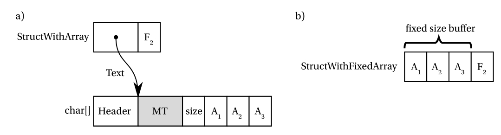

# 其他主题

到目前为止，本书所有章节都聚焦于.NET内存管理的不同方面，尤其是垃圾回收器的工作原理。此刻您已掌握了理解这套机制底层原理所需的大部分知识。之所以说“大部分”，是因为受限于书籍篇幅，当然还存在一些未涉及的细节。这些知识始终贯穿着实践技巧和各种诊断场景，但为了保持章节清晰且篇幅合理，部分更进阶的实践内容被暂时搁置。本章与下一章将专门探讨这些主题，堪称.NET内存管理的“精华指南”，完全聚焦于内存管理的高级实践。随着.NET生态中性能敏感型代码的普及（尤其是 `Span`                                                                                                                                                                                       及其相关技术的广泛应用），这些技巧正被越来越多开发者采用。

鉴于本章的补充性质，内容采用模块化结构编排。您可以自由选读感兴趣的部分，但我们强烈建议您逐节阅读！

## 依赖句柄

除已知的句柄类型外，.NET Framework 4.0（及.NET Core）还引入了一种未提及的特殊句柄——依赖句柄。它在主对象（primary）与依赖对象（secondary）之间建立双向关联，实现生命周期绑定：

- 从依赖对象到主对象表现为弱引用（不影响生命周期，依赖对象不会阻止主对象被回收）。
- 从主对象到依赖对象表现为强引用（只要主对象存活，依赖对象就会保持活跃）。

凭借这些特性，依赖句柄成为非常灵活的工具，例如可以实现动态“附加字段”的功能。实际上这正是其设计初衷，后文将具体展示。

与其他句柄类型不同，依赖句柄不能通过 `GCHandle API` 创建。自.NET 6+起，可通过 `System.Runtime.CompilerServices` 命名空间下的 `DependentHandle` 类实现。

代码清单13-1 `DependentHandle` 使用示例

```csharp
static object _target = new object();  

[MethodImpl(MethodImplOptions.AggressiveOptimization)]  
static void TestDependent()  
{
    var dependent = new Object(); 
    var dependentWeakRef = new WeakReference(dependent);
    var dependentHandle = new DependentHandle(_target, dependent);
    
    Console.WriteLine(dependentHandle.Target == null); // False
    Console.WriteLine(dependentWeakRef.IsAlive); // True
    
    // 原子化操作获取主对象和依赖对象
    var (target2, dependent2) = dependentHandle.TargetAndDependent;
    
    _target = null; // 清除主对象引用
    GC.Collect(2); // 强制执行完全回收
    Console.WriteLine(dependentHandle.Target == null); // True
    Console.WriteLine(dependentWeakRef.IsAlive); // False
    
    dependentHandle.Dispose(); // 释放句柄资源
}
```

在清单13-1中，我们创建两个对象并通过 `DependentHandle` 绑定其生命周期。即使“dependent”对象不再被直接引用（仅通过 `WeakReference` 弱引用），只要“_target”存在它就保持活跃。当“_target”引用被清除后，“dependent”随即变为不可达状态。注意务必调用 `Dispose()` 释放依赖句柄占用的资源。

依赖句柄（Dependent handles）在运行时内部有多种用途，例如支持在调试器的“编辑并继续”功能中添加字段。调试器无法直接修改对象的运行时布局来新增字段，因为堆上可能已存在该对象的实例。因此，依赖句柄会在这种场景下维护它们之间的生命周期关联关系。

另一种使用依赖句柄的方式（也是.NET 6之前的唯一方式）是通过包装类 `ConditionalWeakTable`。正如其源代码注释所述，它提供“对运行时生成对象字段的编译器支持”，并“允许DLR和其他语言编译器在运行时为托管对象实例附加任意‘属性’”。`ConditionalWeakTable` 以字典形式组织，其中键存储目标对象，值存储附加的“属性”（依赖对象）。字典键采用弱引用，不会阻止这些对象被回收（与普通字典键不同）。当键对象被回收时，`ConditionalWeakTable` 会自动移除对应的字典条目。

`ConditionalWeakTable` 的API设计直观，与常规泛型 `Dictionary<TKey, TValue>` 类似（见代码清单13-2）。通过 `Add` 方法会创建一个新的底层依赖句柄，将值实例“添加”到键实例上。由于键必须唯一（通过 `Object.ReferenceEquals` 比较），该类每个托管对象只能附加单个值（如需附加多个属性，可将元组或集合作为值存储）。如代码清单13-2所示，可通过 `TryGetValue` 方法尝试获取与给定键关联的值。

代码清单13-2 `ConditionalWeakTable` 使用示例

```csharp
class SomeClass   
{ public int Field; }  

class SomeData   
{ public int Data; }  

public static void SimpleConditionalWeakTableUsage()   
{ 
    // SomeClass(主对象)与SomeData(次对象)间的依赖句柄
    var weakTable = new ConditionalWeakTable<SomeClass, SomeData>();  
    var obj1 = new SomeClass();  
    var data1 = new SomeData();  
    var obj1weakRef = new WeakReference(obj1);  
    var data1weakRef = new WeakReference(data1);  

    weakTable.Add(obj1, data1);  // 若键已存在会抛出异常
    weakTable.AddOrUpdate(obj1, data1);  

    GC.Collect();  
    Console.WriteLine($"{obj1weakRef.IsAlive} {data1weakRef.IsAlive}");  // 输出True True  

    if (weakTable.TryGetValue(obj1, out var value))  
    { 
        Console.WriteLine(value.Data);  
    }  

    GC.KeepAlive(obj1);  
    GC.Collect();  
    Console.WriteLine($"{obj1weakRef.IsAlive} {data1weakRef.IsAlive}");  // 输出False  
}
```

若未调用代码清单13-2中的 `GC.KeepAlive`，在第一次 `GC.Collect` 后 `obj1` 和 `data1` 实例可能已被回收（如第8章所述，当JIT编译器决定激进回收根引用时）。反之，如果我们改为调用 `GC.KeepAlive(data1)` 来保持次对象（值）而非主对象（键）存活，第一个 `Console.WriteLine` 很可能会输出 False True——此时由于没有引用持有键对象，它已被回收。

需要注意的是，每个托管对象（键）只能关联单个值的限制来自 `ConditionalWeakTable`，而非依赖句柄本身。因此如代码清单13-3所示，完全可以通过多个 `ConditionalWeakTable` 实例为同一对象添加多个“值”。

列表13-3. `ConditionalWeakTable` 使用示例

```c#
var obj1 = new SomeClass();
var weakTable1 = new ConditionalWeakTable<SomeClass, SomeData>();
var weakTable2 = new ConditionalWeakTable<SomeClass, SomeData>();
var data1 = new SomeData();
var data2 = new SomeData();
weakTable1.Add(obj1, data1);
weakTable2.Add(obj1, data2);
```

底层依赖句柄的弱引用表现为长弱引用（第12章已介绍），因此即使目标对象正在被终结，它们仍会维持目标对象与依赖对象之间的关系（见列表13-4）。这使您能正确处理对象复活场景。

列表13-4. 依赖句柄的终结行为

```c#
class FinalizableClass : SomeClass
{
	~FinalizableClass() { 
        Console.WriteLine("~FinalizableClass"); 
    }
}

public static void FinalizationUsage()
{

    ConditionalWeakTable<SomeClass, SomeData> weakTable = new ConditionalWeakTable<SomeClass, SomeData>();
    var obj1 = new FinalizableClass();
    var data1 = new SomeData();
    var obj1weakRef = new WeakReference(obj1, trackResurrection: true);
    var data1weakRef = new WeakReference(data1, trackResurrection: true);
    weakTable.Add(obj1, data1);
    GC.Collect();
    Console.WriteLine("obj1weakRef.IsAlivedata1weakRef.IsAlive");//输出 True True
    GC.KeepAlive(obj1);
    GC.Collect();
    Console.WriteLine("{obj1weakRef.IsAlive} {data1weakRef.IsAlive}"); // 输出 True True      
    GC.KeepAlive(obj1);      
    GC.Collect();      
    Console.WriteLine("obj1weakRef.IsAlivedata1weakRef.IsAlive");//输出 True True
    GC.KeepAlive(obj1);
    GC.Collect();
    Console.WriteLine("{obj1weakRef.IsAlive} {data1weakRef.IsAlive}"); // 输出 True True
    GC.WaitForPendingFinalizers();
    GC.Collect();
    Console.WriteLine($"{obj1weakRef.IsAlive} {data1weakRef.IsAlive}"); // 输出 False False
}
```

在WinDbg中，依赖句柄被视为常规句柄，因此可用 `!gchandles` SOS命令进行分析（见列表13-5）。由于 `ConditionalWeakTable` 内部容器是可终结的，您也常会在终结队列中见到它（见列表13-6）。

列表13-5. `!gchandles` SOS扩展命令运行结果（针对类似列表13-3的代码）

```
> !gchandles -stat
...
Handles:
Strong Handles: 11
Pinned Handles: 1
Weak Long Handles: 40
Weak Short Handles: 6
Dependent Handles: 2
> !gchandles -type Dependent
Handle Type Object Size Data Type
00000292abfe1bf0 Dependent 00000292b034d188 24 00000292b034d448 SomeClass
00000292abfe1bf8 Dependent 00000292b034d188 24 00000292b034d430 SomeClass
Statistics:
MT Count TotalSize Class Name
00007fff033166b8 2 48 SomeClass
Total 2 objects
```

清单13-6.  `!finalizequeue` SOS扩展命令执行结果（针对类似清单13-3的代码）

```
> !finalizequeue
...
Statistics for all finalizable objects (including all objects ready for finalization):
MT Count TotalSize Class Name
...
00007fff03429678 2 112 System.Runtime.CompilerServices.
ConditionalWeakTable<SomeClass, SomeData>+Container
Total 32 objects, 2,152 byte
```

> 依赖句柄（Dependent handles）可用于实现缓存或弱事件模式。在前者场景中，只要关联对象存活，就可以缓存与该对象相关的数据。在后者场景中，可以将处理程序（委托）的生命周期与目标对象生命周期进行适当绑定（关于弱事件模式的完整描述参见第12章）。清单13-7展示了Windows Presentation Foundation中 `WeakEventManager` 类的部分实现。为了将委托生命周期与其目标对象绑定，这里使用了 `ConditionalWeakTable`（由 `_cwt` 字段表示）。通过这种方式，只要目标对象存活，委托列表就会保持活跃状态。

清单13-7.  `ListenerList` 类方法（摘自WPF的 `WeakEventManager` 类）

```c#
public void AddHandler(Delegate handler)
{
    object target = handler.Target;
    // 将记录添加到主列表
    list.Add(new Listener(target, handler));
    AddHandlerToCWT(target, handler);
}

void AddHandlerToCWT(object target, Delegate handler)
{
    // 将处理程序添加到CWT——这能确保处理程序在目标对象存活期间保持活跃
    // 同时不会延长目标对象本身的生存期
    object value;
    if (!_cwt.TryGetValue(target, out value))
    {
        // 99%的情况——目标对象仅单次监听
        _cwt.Add(target, handler);
    }
    else
    {
        // 1%的情况——目标对象多次监听
        // 我们将委托存储在列表中
        List list = value as List;
        if (list == null)
        {
            // 惰性初始化列表，并添加旧处理程序
            Delegate oldHandler = value as Delegate;
            list = new List();
            list.Add(oldHandler);
            // 将列表作为新值存入CWT
            _cwt.Remove(target);
            _cwt.Add(target, list);
        }
        // 将新处理程序添加到列表
        list.Add(handler);
    }
}
```

> 在标记阶段，依赖句柄需要特殊扫描方式，因为它们可能形成复杂的依赖关系，单次扫描往往不足。假设句柄表中按序存储三个依赖句柄：对象C指向对象A，B指向C，A指向B。若已确定对象A的可达性（标记为可达），首次扫描仅会标记B为可达。第二次扫描将标记C为可达（因为此时GC已知B可达）。第三次扫描不会改变任何状态（A已被标记），至此整个分析终止。对于数百万个依赖句柄及其复杂依赖关系，这种多轮次扫描理论上可能带来开销。此外，与其他类型句柄不同，依赖句柄目前不会被GC“分代”处理（仅因实现复杂度而未实现），这意味着即便Gen 0回收也会扫描所有依赖句柄。因此请谨慎使用依赖句柄。
>
> 若想深入探究.NET Core中的实现细节，可从 `gc_heap::background_scan_dependent_handles` 和 `gc_heap::scan_dependent_handles` 方法入手。这两个方法及其调用的 `GcDhReScan、GcDhUnpromotedHandlesExist` 都有详细注释。标记阶段开始时调用的 `GcDhInitialScan` 方法，其相关注释同样揭示了依赖句柄的实现机制。

> 关于依赖句柄的机制用一句话来总结就是：
>
> **依赖句柄（Dependent Handle）让你把两个对象的生命周期绑定起来，主对象在，副对象不回收；主对象没了，副对象也能自动回收。**
>
> A是主对象（primary），B是依赖对象（secondary）。当发生GC回收时，如果只剩下“依赖句柄”持有A和B：
>
> - 如果A可以被回收（没有其它强引用），则B也可以回收。
> - 如果A不能回收，则B也暂时不能回收，即便B没有其它强引用。
>
> 应用场景：
>
> **ConditionalWeakTable**
>
> - .NET 的 `ConditionalWeakTable<TKey, TValue>` 就是依赖句柄的经典应用。
> - 你可以给某个对象（TKey）“外接”一个附加对象（TValue），只要主对象（TKey）还活着，附加值（TValue）就不会被回收。
> - 当主对象被回收，附加值也会被回收，不会内存泄漏。
>
> **CLR 框架底层**
>
> - 一些框架要保证某些辅助资源或缓存对象不会早于主对象被销毁，就会用依赖句柄。

## 线程本地存储

普通的静态变量在单个应用程序域(AppDomain)内表现为全局变量，应用程序中的每个线程都可以访问它们。因此，通常需要采用多线程同步技术来确保线程安全地访问这些变量。然而，还存在另一种全局数据形式——线程本地存储(TLS)，其特点是每个线程都拥有独立的数据副本。换句话说，这些变量虽然像全局变量一样通过相同的名称或标识符被所有线程访问，但每个线程存储的实际数据却是相互隔离的。这种机制避免了同步问题，因为每个值仅能被关联的线程访问。

目前在.NET中，有三种使用线程本地存储的方式：

- 线程静态字段(Thread static fields)：作为静态字段使用，并额外标记 `[ThreadStatic]` 特性。
- `ThreadLocal` 类型：封装线程静态字段的辅助类。
- 线程数据槽(Thread data slots)：通过 `Thread.SetData` 和 `Thread.GetData` 方法实现。

.NET官方文档明确指出，线程静态字段的性能远优于数据槽，在可能的情况下应优先选用。我们将深入探究这两种技术的底层实现以理解差异所在。此外，静态字段是强类型的(像其他.NET字段一样具有明确类型)，而数据槽始终基于 `Object` 类型操作；对于命名数据槽，还需要使用基于字符串的标识符——这两种情况都可能导致编译时难以发现的潜在问题。

### 线程静态字段

使用线程静态字段非常简单，只需为普通静态字段添加 `ThreadStatic` 特性即可。线程静态字段既支持值类型也支持引用类型（见代码清单13-8）。在本例中，尽管两个不同线程读取的是相同的线程静态字段，但它们获取的是独立的值。因此一个线程会输出 “Worker 1:1”，而另一个线程输出“Worker 2:2”。若这两个静态字段仅是普通静态字段，多线程写入时就会发生竞态条件，最终存储的是不确定的1和2的混合值。

代码清单13-8 线程静态字段使用示例

```csharp
class SomeData  
{ 
    public int Field;  
}  

class SomeClass  
{ 
    [ThreadStatic]  
    private static int threadStaticValueData;  
    [ThreadStatic]  
    private static SomeData threadStaticReferenceData;  

    public void Run(object param)  
    { 
        int arg = int.Parse(param.ToString());  
        threadStaticValueData = arg;  
        threadStaticReferenceData = new SomeData() { Field = arg };  
        while (true)  
        { 
            Thread.Sleep(1000);  
            Console.WriteLine($"Worker {threadStaticValueData}:{threadStaticReferenceData.Field}.");  
        }  
    }  

    static void Main(string[] args)  
    { 
        SomeClass runner = new SomeClass();  
        Thread t1 = new Thread(new ParameterizedThreadStart(runner.Run));  
        t1.Start(1);  
        Thread t2 = new Thread(new ParameterizedThreadStart(runner.Run));  
        t2.Start(2);  
        Console.ReadLine();  
    }  
}
```

原生线程静态字段存在一个陷阱——若静态字段包含初始化器，该初始化器仅在执行静态构造函数的线程上触发一次。换言之，只有首次使用该类型的线程才会正确初始化线程静态字段，其他线程看到的将是字段的默认值（见代码清单13-9）。由于这一特性，`SomeOtherClass.Run` 方法会输出“Worker 44”和“Worker 0”，这可能令人十分意外。

代码清单13-9 线程静态字段初始化的意外情况示例

```csharp
class SomeOtherClass  
{ 
    [ThreadStatic]  
    private static int threadStaticValueData = 44;  

    public void Run()  
    { 
        while (true)  
        { 
            Thread.Sleep(1000);  
            Console.WriteLine($"Worker {threadStaticValueData}");   // 输出Worker 44或Worker 0
        }  
    }  

    static void Main(string[] args)  
    { 
        SomeOtherClass runner = new SomeOtherClass();  
        Thread t1 = new Thread(runner.Run);  
        t1.Start();  
        Thread t2 = new Thread(runner.Run);  
        t2.Start();  
    }  
}
```

> 尽管 ThreadStatic 表示给这个字段在每个线程上有独立的值，互不影响。但是，初始值的行为却不一致。
>
> ```c#
> [ThreadStatic]
> private static int threadStaticValueData = 44;
> ```
>
> 目的是想让每个线程初始值都是 `44`。但是它被标记了 ThreadStatic 的字段只会在主线程执行一次静态初始化器（即 `static SomeOtherClass()`），所以其它线程访问的时候会是默认值 0。实际上它等价于这个写法：
>
> ```c#
> class SomeOtherClass {
>     [ThreadStatic]
>     private static int threadStaticValueData;
>     static SomeOtherClass() { threadStaticValueData = 44; }
> }
> ```

为解决这些问题，.NET Framework 4.0引入了`ThreadLocal<T>`类，它提供了更优且更确定性的初始化行为。我们可以通过构造函数传入值工厂方法，当首次访问`Value`属性时会延迟初始化类实例（见代码清单13-10）。

代码清单13-10 `ThreadLocal` 使用示例

```csharp
class SomeOtherClass  
{ 
    private static ThreadLocal<int> threadValueLocal = new ThreadLocal<int>(() => 44, trackAllValues: true);  

    public void Run()  
    { 
        while (true)  
        { 
            Thread.Sleep(1000);  
            Console.WriteLine($"Worker {threadStaticValueData}:{threadValueLocal.Value}.");  
            Console.WriteLine(threadValueLocal.Values.Count);  
            threadValueLocal.Value = threadValueLocal.Value + 1;  
        }  
    }  
}
```

`ThreadLocal<T>` 可以存储在非静态字段中，从而为类的每个实例跟踪不同的线程静态值。此外，通过向构造函数的`trackAllValues` 参数传入 `true`，`ThreadLocal<T>` 能追踪所有已初始化的值，后续可通过 `Values` 属性遍历所有当前值。但需谨慎使用此功能，这可能导致本应线程隔离的引用实例在线程间传递。

该特性的典型应用场景是在多线程环境中独立聚合各线程的值。例如要实现线程安全的计数器，有三种方案：用简单锁保护计数器、使用原子操作、或通过 `ThreadLocal<T>` 让每个线程操作自己的子计数器。我们通过基准测试来比较这三种实现（见代码清单13-11）。

代码清单13-11 三种线程安全计数器的实现方式

```c#
[MemoryDiagnoser]
public class CounterBenchmark
{
    [Params(10_000, 100_000, 1_000_000)]
    public static int Iterations;
    public static int NumberOfThreads = 32;

    [Benchmark]  
    public long InterlockedIncrement()  
    {  
        static void increment(StrongBox<long> counter) => Interlocked.Increment(ref counter.Value);  
        static long getResult(StrongBox<long> counter) => Interlocked.Read(ref counter.Value);  
        return Run(increment, getResult, new StrongBox<long>());  
    }  

    [Benchmark]  
    public long Lock()  
    {  
        static void increment(StrongBox<long> counter) { lock (counter) { counter.Value++; } }  
        static long getResult(StrongBox<long> counter) => Interlocked.Read(ref counter.Value);  
        return Run(increment, getResult, new StrongBox<long>());  
    }  

    [Benchmark]  
    public long ThreadLocal()  
    {  
        static void increment(ThreadLocal<long> counter) => counter.Value++;  
        static long getResult(ThreadLocal<long> counter)  
        {  
            long result = 0;  
            foreach (var value in counter.Values) { 
                result += value; 
            }  
            return result;  
        }  
        return Run(increment, getResult, new ThreadLocal<long>(trackAllValues: true));  
    }  

    private static long Run<T>(Action<T> increment, Func<T, long> getResult, T state)  
    {  
        var threads = new Thread[NumberOfThreads];  
        for (int i = 0; i < NumberOfThreads; i++)  
        {  
            threads[i] = new Thread(() =>  
            {  
                for (int j = 0; j < Iterations; j++) { 
                    increment(state); 
                }  
            });  
            threads[i].Start();  
        }  
        foreach (var thread in threads) { 
            thread.Join(); 
        }  
        return getResult(state);  
    }
}
```

`Run` 函数会启动32个线程，每个线程调用指定次数的“increment”函数，最后调用“getResult”函数获取结果。

需要注意的是这个基准测试有些非常规。它使用局部函数来减少重复代码，使书中示例更简洁易读。在实际基准测试中，应避免任何可能影响结果的操作，即使这意味着要复制粘贴大量代码。

> 部分读者可能是第一次见到 `StrongBox`。这个类型在.NET中已存在很长时间（自3.5版本起！）但鲜为人知。它本质上就是一个包含单个字段的泛型类，主要用于需要装箱值类型但又要保持强类型的情况（不能直接转为 `Object`）。可以将其视为可变的 `Tuple`。本例中计数器需要装箱以实现多线程共享。

在阅读理解代码后，请花几秒钟猜测哪种实现更快，以及性能差距的数量级。然后查看清单13-12中的测试结果。

清单13-12 .NET 8上的基准测试结果

| Method               | Iterations |         Mean | Allocated |
| -------------------- | ---------- | -----------: | --------: |
| InterlockedIncrement | 10000      |     1.900 ms |   4.65 KB |
| Lock                 | 10000      |    13.274 ms |   4.66 KB |
| ThreadLocal          | 10000      |     1.944 ms |  44.18 KB |
| InterlockedIncrement | 100000     |    92.672 ms |   4.66 KB |
| Lock                 | 100000     |   139.899 ms |   4.75 KB |
| ThreadLocal          | 100000     |     3.614 ms |  45.03 KB |
| InterlockedIncrement | 1000000    |   715.166 ms |   4.71 KB |
| Lock                 | 1000000    | 1,323.899 ms |   5.04 KB |
| ThreadLocal          | 1000000    |    23.600 ms |  20.43 KB |

如你所见，`ThreadLocal` 版本的性能明显优于其他方案，且随着迭代次数的增加，性能差距会进一步扩大。当然这是个极端案例——线程除了递增计数器外不执行任何操作，因此资源争用达到了最大化。在实际场景中，不同方案的对比结果会更加复杂，请务必在决策前进行严谨的性能测试。

`ThreadLocal` 本质上是对线程静态字段的复杂封装。由于其内部结构的额外处理逻辑（参见代码清单13-13），可能会观察到一定的性能损耗。此外，`ThreadLocal` 包含终结器，并在构造和终结过程中获取全局锁。若大量创建实例，可能成为应用程序中显著的资源争用源。不过如果性能并非首要考量，`ThreadLocal` 通常比直接使用线程静态字段更为便捷。

代码清单13-13. `DotNetBenchmark` 对比原始类型和引用类型在线程本地存储中的访问性能——线程静态字段与 `ThreadLocal` 的测试结果

若您确实需要原生线程静态字段的性能，同时要解决初始化问题，可以通过属性包装器实现延迟初始化（参见代码清单13-14）。

代码清单13-14. 线程静态数据初始化问题的解决方案

```csharp
[ThreadStatic]  
private static int? threadStaticData;  
public static int ThreadStaticData  
{  
    get 
    { 
        if (threadStaticData == null) 
            threadStaticData = 44; 
        return threadStaticData.Value; 
    }  
}
```

使用 `ThreadLocal` 时需特别注意存储内容，这可能导致隐蔽的内存泄漏。观察代码清单13-15的示例：

代码清单13-15. `ThreadLocal` 引发内存泄漏的案例

```csharp
internal class Repository  
{  
    private ThreadLocal<List<Item>> _storage = new(valueFactory: () => new List<Item>());  
    public void Add(int value) { _storage.Value.Add(new Item(value, this)); }  

    internal class Item(int value, Repository parent)  
    {  
        public int Value { get; } = value;  
        public Repository Parent { get; } = parent;  
    }  
}  

internal class Program  
{  
    public static void Main()  
    {  
        var reference = AllocateRepository();  
        GC.Collect();  
        GC.WaitForPendingFinalizers();  
        GC.Collect();  
        Console.WriteLine($"Is repository alive: {reference.IsAlive}"); // 输出True  
    }  

    private static WeakReference AllocateRepository()  
    {  
        var repository = new Repository();  
        repository.Add(10);  
        return new WeakReference(repository);  
    }  
}
```

该程序展示了一个使用 `ThreadLocal<List>` 作为内部存储的 `Repository` 类。每个 `Item` 都包含值及其所属 `Repository` 的反向引用。运行时会发现，即使没有任何显式引用，`Repository` 实例仍然存活！如前所述，`ThreadLocal` 本质是线程静态字段的封装——线程静态字段的值会持续存活至关联线程终止。对于传统线程静态字段这通常不成问题，因其使用方式与静态字段类似。但当 `ThreadLocal` 作为实例字段时，其生命周期更短，因此需要在实例不再使用时清理线程静态值。这通过 `Dispose` 方法和作为后备的终结器实现。在泄漏案例中，虽然未调用 `Dispose`，但终结器未能生效的原因在于：列表中的 `Item` 持有了      `Repository`（进而持有 `ThreadLocal` 实例）的引用，导致其始终被根引用。为避免此类问题，请确保正确释放 `ThreadLocal`。

### 线程数据槽

使用线程数据槽简单直接。有两种不同类型的数据槽可用（见代码清单13-16）：

- **命名线程数据槽**：通过 `Thread.GetNamedDataSlot` 方法以字符串名称访问。可以存储并复用该方法返回的 `LocalDataStoreSlot` 实例。
- **未命名线程数据槽**​：只能通过 `Thread.AllocateDataSlot` 方法返回的 `LocalDataStoreSlot` 实例访问。

代码清单13-16 使用线程数据槽的示例

```csharp
public void UseDataSlots() {
    // 命名数据槽
    Thread.SetData(Thread.GetNamedDataSlot("SlotName"), new SomeData());
    object data = Thread.GetData(Thread.GetNamedDataSlot("SlotName"));
    Console.WriteLine(data);
    Thread.FreeNamedDataSlot("SlotName");

    // 未命名数据槽
    LocalDataStoreSlot slot = Thread.AllocateDataSlot();
    Thread.SetData(slot, new SomeData());
    object data = Thread.GetData(slot);
    Console.WriteLine(data);
}
```

后文会提到，使用线程数据槽API时会丢失强类型——`Thread.SetData和Thread.GetData` 都要求并返回 `System.Object` 类型的实例。在.NET Framework早期版本中，数据槽作为动态分配线程本地存储的便捷方式提供（无法在运行时向类添加新的线程静态字段）。.NET Framework 4.0引入了 `ThreadLocal` 作为现代且强类型的替代方案。数据槽现在应被视为过时技术。实际上，在.NET Core中，数据槽只是 `ThreadLocal` 的封装器。

### 线程本地存储内部原理

理解线程本地存储的实现机制很重要，因为这可能让人误以为它是某种神奇的、超高速的线程亲和性存储。线程亲和性让人联想到栈，而栈很快，对吧？那么这种特殊的、保存在某些秘密线程相关空间中的线程本地存储，可能更快？实际情况要复杂得多，了解其底层原理有助于理解该技术的优缺点。

首先，操作系统确实为每个线程预留了专用内存区域，称为线程本地存储（TLS）。在Windows中称为TLS，在Linux中称为线程特定数据。该区域非常小（通常不超过一个内存页），组织为指针大小的槽位。Windows保证每个进程至少有64个槽位，最多1088个；Linux的槽位数因发行版而异（glibc通常1024个，musl通常128个）。这些限制非常严格——Windows的64个槽位在64位进程中仅占512字节内存！

因此，说数据“存储在TLS”时需要谨慎。TLS槽位设计用于存储指向常规内存的指针，这在.NET和其他编译器（如C/C++）中都是如此。线程本地存储空间根本不足以直接存储数据。即便如此，这种存储仍具有以下性能优势：

- 频繁访问时，包含TLS槽位的内存页很可能常驻物理内存
- 访问该内存页无需同步，因为仅单个线程可见

在CLR中，定义了一个全局的线程静态变量 `ThreadLocalInfo`（见代码清单13-17）。C++编译器使用单个TLS槽位存储该实例地址（每个底层系统线程存储自己的 `ThreadLocalInfo` 副本）。

代码清单13-17 CoreCLR中的线程本地存储定义

```cpp
#ifndef _MSC_VER
EXTERN_C __declspec(thread) ThreadLocalInfo gCurrentThreadInfo;
#else
EXTERN_C __thread ThreadLocalInfo gCurrentThreadInfo;
#endif
```

`ThreadLocalInfo` 包含以下三类CLR内部数据：

- 表示当前托管线程的非托管 `Thread` 类实例地址——这是最关键部分，在整个运行时中被广泛使用（如通过 `GetThread` 方法）。
- 当前线程代码执行的 `AppDomain` 实例地址——这是性能优化捷径，因为该指针也可从 `Thread` 实例获取。
- 表示线程当前角色的标志（如终结器线程、工作线程、GC线程等）。

> 这三个字段中，仅第一个在现代.NET版本中真正有用。由于无法再创建新 `AppDomain`，无需在线程级别跟踪当前 `AppDomain`。第三个字段是为兼容不支持线程静态变量的旧版Windows而存在，相关数据已迁移到专用线程静态字段以消除间接访问。虽然现在无用，但保留这两个字段是为了与调试器和诊断工具保持兼容。

因此，当使用.NET中的任何线程本地存储技术时，实际只有 `ThreadLocalInfo` 结构的指针存储在TLS中。所有线程静态数据既存在于CLR私有堆也存在于GC堆，与常规静态变量的实现方式类似（见图13-1）。`Thread` 类实例将其线程本地存储相关数据组织到另外两个类中。


图13-1. .NET中线程本地存储的内部机制。实际存储线程本地数据的位置以灰色标出

- `ThreadLocalBlock`（线程本地块）：为每个应用程序域(AppDomain)创建（因此在.NET Core应用中每个线程仅有一个实例）。它额外维护 `ThreadStaticHandleTable`（线程静态句柄表），该表持有对专用托管数组的强引用句柄，这些数组存储线程静态字段实例的引用。

-  `ThreadLocalModule`（线程本地模块）：为每个应用程序域中的每个模块创建。它包含两个关键数据：

  - 非托管静态数据块：存储所有线程静态的非托管值。为优化内存访问，数据块中的内容采用内存对齐填充。

  - 指向托管数组的指针：该数组存储本模块的静态引用，引用按类型分组存储。

换言之，线程静态数据以下列方式存储：

- 对于引用类型字段：实例通常分配在堆上，其引用存储在由 `ThreadStaticHandleTable` 管理的强引用句柄所维护的专用 `Object[]` 数组中。需特别注意：

  - 同一类型可能存在多个堆分配实例（若这些字段已初始化且非null）——每个运行中的托管线程对应一个实例。

  - 将存在多个堆分配的 `Object[]` 数组来存储上述引用——每个应用程序域、模块及运行中的托管线程各对应一个数组。

- 对于非托管类型字段：这些值存储在非托管内存的静态数据块中。同样会存在多个数据块——每个线程、应用程序域及其内部模块各对应一个。

- 对于结构体：以装箱形式存储在托管堆上，处理方式与前述引用类型相同。

由于模块的类型和静态字段数量在编译时已知，专用 `Object[]` 数组和静态数据块的大小均为预先计算好的常量值。

> 细心的读者可能注意到，在.NET中创建线程可能引发大量分配操作，原因在于线程静态字段。每个应用程序域及其内部模块都可能新建多个 `Object[]` 数组（由于单个应用程序域中托管线程静态字段数量通常较少，这些数组很可能分配在小对象堆SOH中），同时 `ThreadLocalModule` 会分配在CLR私有数据区（包含各模块的静态数据块）。所幸这些结构和数组大多是延迟分配的。

例如，在图13-1中，我们展示了其中一个模块的视角——虽然实际可能存在更多 `ThreadLocalModule`，但为了简洁起见并未全部显示。该模块中定义了一些类型，我们重点看 `Type1`（如代码清单13-18所示）。它包含两个原始类型的线程静态字段（long和int类型），这些值存储在 `ThreadLocalModule` 的静态数据块中；另外还有两个 `SomeData` 引用类型的线程静态字段。与常规静态字段类似，这些实例通常分配在堆上，其引用存储在专用的常规对象数组中。图13-1中，`Type1` 的两个字段已为线程1初始化，但（出于演示目的）仅为线程2初始化了第一个字段。

代码清单13-18 图13-1所示的简单类型示例

```csharp
class Type1 
{ 
    [ThreadStatic] private static int static1; 
    [ThreadStatic] private static long static2; 
    [ThreadStatic] private static SomeData static3; 
    [ThreadStatic] private static SomeData static4; 
    ...
}
```

初看可能令人不安：这些本应“线程专属”的静态对象，实际上只是散落在GC堆中的普通对象。但请注意，只要没有异常情况，它们仅对所属托管线程可见（因此仍是线程安全的）。不过它们可能引发伪共享问题（参见第2章），因为这些实例可能位于同一缓存行边界内。

因此，当把TLS视为“快速魔法内存”时，请始终牢记图13-1的机制。实际上，TLS在这里只是实现数据结构线程亲和性的技术细节，其本身并不会加速任何操作。

JIT编译时，会为线程静态字段计算相应偏移量——非托管类型存储在静态块中，引用类型存储在引用数组中。这些偏移量保存在 `MethodTable`相关区域，供JIT编译器计算数据访问地址。实际访问时需要先获取当前线程的 `ThreadLocalModule`，因此线程静态数据的访问会产生显著额外开销（参见带注释的代码清单13-17和13-18）。

代码清单13-19 线程静态非托管变量赋值操作（类似代码清单13-8中的 `threadStaticValueData`）

```
// Assume esi register contains value to store
// Pass the static block index
mov ecx,2
// Accesses ThreadLocalModule data (via TLS-stored pointer)
// As a result, rax contains ThreadLocalModule address
call coreclr!JIT_GetSharedNonGCThreadStaticBaseOptimized
mov rdi,rax
// Store the value:
// 1Ch is an pre-calculated offset in the statics blob, esi contains value to store
mov dword ptr [rdi+1Ch],esi
Listing 13-20. Assigning thread static reference variable (like threadStaticReferenceData in Listing 13-8)
// Assume rbx contains value (reference) to store
// Pass the static block index
mov edx,2
// Accesses ThreadLocalModule inside (via TLS-stored pointer)
// As a result, rax contains reference to an array element where references of that
type begins
call coreclr!JIT_GetSharedGCThreadStaticBaseOptimized
mov rcx,rax
// Store the reference (in rbx) under given array element (in rcx) by calling write barrier
mov rdx,rbx
call JitHelp: CORINFO_HELP_ASSIGN_REF
```

那些间接寻址操作使得访问静态字段（无论是常规静态字段还是线程静态字段）的速度比访问普通字段慢了几个数量级（后者通常只需一两条简单的 `mov` 指令即可完成访问）。

> 若想深入了解.NET中线程本地存储的实现机制，`JIT_GetSharedNonGCThreadStaticBase` 和 `JIT_GetSharedGCThreadStaticBase` 这两个方法是最佳切入点。由JIT生成的方法中经常包含 `INLINE_GETTHREAD` 宏，该宏会从TLS存储中获取 `gCurrentThreadInfo`（即线程静态的 `ThreadLocalInfo` 实例）——例如在Windows系统上，它会使用 `OFFSET__TEB__ThreadLocalStoragePointer` 在当前的线程环境块（TEB）中查找TLS地址。如前所述，`ThreadLocalInfo` 包含指向非托管Thread实例的指针。AppDomain指针和 `m_EETlsData` 字段现已不再使用，仅为保持与调试器的向后兼容性而保留。位于 `.\src\coreclr\vm\threadstatics.h` 文件中的 `ThreadLocalModule` 和 `ThreadStatics` 类型，以及 `.\src\coreclr\vm\threads.h` 文件中的 `ThreadLocalBlock`，包含了处理线程本地存储的核心逻辑。

那么包含线程静态字段的泛型类型如何处理？前文所述的逻辑依赖于编译时已知线程静态字段数量这一前提，但泛型类型并不满足此条件——编译器无法预知会发生多少种泛型类型实例化（每种实例化都可能需要全新的线程静态变量集合）。解决方案与处理泛型类型常规静态字段的方案类似：`ThreadLocalModule` 维护了一个额外的动态指针数组，这些指针指向更小的结构体，其组织方式与 `ThreadLocalModule` 本身相似（参见图13-2及对应的代码清单13-21）。每个 `DynamicEntry` 结构体专用于单个泛型类型实例化，包含与 `ThreadLocalModule` 相同类型的数据。


图13-2. 泛型类型的线程本地存储内部结构

代码清单13-21. 图13-2所示的简单Some泛型类型

```c#
class Some
{ 
    [ThreadStatic] 
    private static T static1; 
    [ThreadStatic] 
    private static SomeData static2; 
    [ThreadStatic] 
    private static SomeData static3;
}
```

> 从垃圾回收（GC）的角度来看，引用类型的线程静态数据是常规对象，其根植于前文提到的专用 `Object[]` 数组。这些数组由 `ThreadLocalBlock` 维护的强引用句柄保持存活状态。因此，只要对应的线程（Thread）和应用程序域（AppDomain）存在，这些对象就会保持存活。

#### 总结

操作系统确实会给每个线程分配一小块专属空间，叫做TLS区。但这块空间实际非常袖珍（如 64 个槽位不到 1kb），往往只有几十到上千个指针槽位。所以它的设计之初就不是用来存储数据的，而是存放指针的，用来定位到真正的数据存储地（实际数据一般是放在普通堆/CLR私有堆中）。这也说明了它的这种多层间接寻址要比普通的字段直接寻址效率要慢得多。

.NET 中线程本地存储的大致结构：

- TLS 槽位：操作系统为每个线程分配有限的槽位，只存放“指向”线程本地结构体的指针（`ThreadLocalInfo`）。
- `ThreadLocalInfo`：包含三个成员：1.指向当前线程 `Thread` 示例的指针。2.AppDomain 指针。3.线程标志（如工作线程、GC线程等）。
- `Thread`：通过前面的 `ThreadLocalInfo` 定位线程对象，其中主要包含两个对象：
  - 线程本地块（`ThreadLocalBlock`）：每个 AppDomain 一个（因此 .NET Core APP 只有一个）。它内部维护一个线程静态句柄表（`ThreadStaticHandleTable`），负责指向专用数组对象 `Object[]`。后者专用于存储线程静态字段的引用类型值的引用。
  - 线程本地模块（`ThreadLocalModule`）：每个 AppDomain 一个。内部维护两个对象：1.非托管静态数据块（存 primitive 类型的线程静态字段值，如 int、long）。2.指向托管数组的指针（存引用类型的线程静态字段的引用）。
- 专用数组 `Object[]`：每个线程，每个模块，每个 AppDomain 都有一个。用来存放引用类型的线程静态字段的引用。

间接寻址的过程：

1. JIT 代码通过 TLS 槽位取到 `ThreadLocalInfo`。
2. 从 `ThreadLocalInfo` 间接拿到 `Thread` 实例。
3. 进而定位到 `ThreadLocalBlock`、`ThreadLocalModule。`
4. 找到专用 `Object[]`，按照偏移量访问目标字段引用。
5. （如果是值类型）则定位到非托管静态数据块的偏移位置。

上述数据流转与寻址过程图如下：


### 使用场景

尽管前文对线程数据存储的描述已明确指出其会带来一定开销，但从性能角度看它有一个主要优势——消除了多线程同步需求。线程亲和性（thread affinity）是线程本地存储区别于其他数据类型的核心功能特性。

一般而言，线程本地存储适用于以下场景：

- 存储和管理线程感知数据——例如某些非托管资源可能需要由同一线程获取和释放。
- 利用单线程亲和性——例如：
  - 日志记录或诊断：每个线程可无同步地操作本地诊断数据，避免与其他线程相互干扰（`System.Diagnostics.Tracing.EventSource` 中的 `[ThreadStatic]` 字段 `m_EventSourceExceptionRecurenceCount` 即为典型示例）。
  - 缓存：提供线程本地缓存完全可行，但需注意缓存副本数量会与托管线程数量成正比。第4章介绍的 `StringBuilderCache` 类就是绝佳范例——每个线程都缓存一个小型 `StringBuilder` 实例以实现无需线程同步的高效访问，这比从全局池中获取更高效。`System.Buffers` 命名空间中的 `SharedArrayPool` 也采用了类似的分层缓存机制。

> 绝大多数情况下，线程静态变量无法与异步编程共用，因为异步方法续体（continuation）不保证在原线程执行——异步方法恢复时线程本地数据会丢失（桌面应用UI线程等特殊情况除外，因其续体保证在原线程恢复）。为此，.NET提供了 `ThreadLocal` 的补充方案  `AsyncLocal` 来保持异步执行上下文的数据。但从内存管理角度看，这个类并无特别之处——它是普通类实例，其存储的值通过执行上下文（`ExecutionContext` 类）中的字典维护。

## 托管指针

出于简洁考虑，前文一直回避托管指针的话题（尽管细心读者可能注意到一两处相关注释³）。普通.NET开发者大多只接触对象引用，这已足够应对托管世界的需求——对象通过引用相互关联。如第4章所述，对象引用实质上是类型安全的指针（地址），始终指向对象的 `MethodTable` 引用字段（虽然常说它指向对象起始处，但严格来说对象头位于 `MethodTable` 引用之前）。通过对象引用可以获取整个对象地址，例如GC能通过固定偏移快速访问对象头，字段地址也可利用 `MethodTable` 中的信息轻松计算。

但CLR中还存在另一种指针类型——托管指针（managed pointer）。这类指针更为通用，可指向对象起始处之外的其他位置。ECMA-335标准定义托管指针可指向：

- 局部变量
- 方法参数
- 复合类型字段（即其他类型的字段）
- 数组元素

尽管灵活性更高，托管指针仍是类型化的。指向 `System.Int32` 的托管指针类型在CIL中记为 `System.Int32&`，指向 `SomeNamespace.SomeClass` 实例则记为 `SomeNamespace.SomeClass&`。这种强类型特性使其比可任意转换的非托管指针更安全。

但安全性提升伴随代价。托管指针的使用存在限制：

- 仅允许用于局部变量
- 参数签名
- 方法返回类型
- `ref struct` 字段

直接指出：“它们不能用于字段签名，因为数组的元素类型和装箱托管指针类型的值是不被允许的。将托管指针类型用作方法的返回类型是不可验证的。”

指针运算可能破坏托管指针的安全性，因此它们不会直接暴露在 C# 语言中，除非使用 `unsafe` 关键字。然而，它们仍以受限形式通过 `ref` 关键字存在：自 C# 7 起引入的 `ref` 参数、`ref` 局部变量及 `ref` 返回值。以引用方式传递参数本质上就是底层使用托管指针。因此，托管指针也常被称为 `byref` 类型（或简称 `byref`）。你已在第4章的代码清单4-33和4-34中见过引用传递的示例。

### Ref Locals（引用局部变量）

您可以将引用局部变量视为存储托管指针的局部变量。因此，这是一种便捷的创建辅助变量的方式，后续可用于直接访问特定字段、数组元素或其他局部变量（参见代码清单13-22）。请注意，赋值操作的左右两侧都必须使用`ref`关键字标记，以表示对托管指针的操作。

代码清单13-22. 引用局部变量的基本用法

```csharp
public static void UsingRefLocal(SomeClass data)   
{ 
    ref int refLocal = ref data.Field; 
    refLocal = 2;   
}  
```

代码清单13-22中的简单示例仅用于演示——您只是直接访问了一个`int`字段，因此性能提升可以忽略不计。更常见的用法是通过引用局部变量获取对大型实例的直接指针，以避免复制（参见代码清单13-23），并将其通过引用传递到其他地方或在本地使用。引用局部变量也常用于存储引用返回方法的结果（稍后将介绍）。

代码清单13-23. 引用局部变量的可能用法

```csharp
ref VeryLargeStruct reflocal = ref veryLargeStruct; // 后续通过reflocal直接访问veryLargeStruct，无需复制 
```

还需注意的是，从`C# 7.3`开始，引用可以重新赋值，因此您不仅限于在局部变量初始化时设置其值。

可以为引用局部变量赋值为`null`（参见代码清单13-24）。乍看之下可能有些奇怪，但这完全合理。您可以将引用局部变量视为存储引用地址的变量，但这并不意味着引用本身指向任何内容。

代码清单13-24. 为引用局部变量赋null值

```csharp
SomeClass local = null;   
ref SomeClass localRef = ref local;  
```

但也可以存在`null`引用局部变量。这里讨论的不是指向`null`引用的引用局部变量，而是其本身为`null`的引用局部变量。换句话说，它没有指向任何内容。在纯`C#`中无法直接创建这样的变量，但在IL层面是有效的。辅助方法 `Unsafe.NullRef<T>`（用纯IL编写）会返回一个`null`引用局部变量，您可以在`C#`中如代码清单13-25所示使用它。这是一种危险工具，因为任何不使用`ref`关键字的操作都会导致解引用，从而抛出 `NullReferenceException`。

代码清单13-25. 创建并使用null引用局部变量

```csharp
ref var nullRef = ref Unsafe.NullRef<string>();  

var nullRef2 = Unsafe.NullRef<int>(); // 抛出NullReferenceException  
Console.WriteLine(nullRef); // 抛出NullReferenceException  
Console.WriteLine(nullRef == null); // 抛出NullReferenceException  
nullRef = "Hello"; // 抛出NullReferenceException  
Console.WriteLine(nullRef == Unsafe.NullRef<string>()); // 抛出NullReferenceException  
Console.WriteLine(Unsafe.IsNullRef(ref nullRef)); // 唯一检查引用是否为null的方式  
```

由于这种用法非常罕见且令人意外，请避免在公共API中返回`null`引用。如果必须这样做，最好在函数名中明确标注（例如`FrozenDictionary.GetValueRefOrNullRef`）。

### Ref 返回

Ref 返回允许从方法返回托管指针。显然，在使用它们时必须引入一些限制。正如微软文档所述：“返回值必须具有超出方法执行周期的生命周期。换句话说，它不能是返回它的方法中的局部变量。它可以是类的实例或静态字段，也可以是传递给方法的参数。”尝试返回局部变量会生成编译器错误 CS8168：“无法通过引用返回局部变量 'obj'，因为它不是 ref 局部变量。”

清单 13-26 展示了上述局部变量限制的示例。您不能返回指向栈分配（或存储在 CPU 寄存器中）的 `localInt` 变量的托管指针，因为一旦 `ReturnByRefValueTypeInterior` 方法结束，该指针就会失效。

清单 13-26. 尝试通过 ref 返回局部变量的无效代码示例

```csharp
public static ref int ReturnByRefValueTypeInterior(int index)   
{ 
    int localInt = 7; 
    return ref localInt; // 编译错误：无法通过引用返回局部变量 'localInt'，因为它不是 ref 局部变量  
}
```

然而，通过 ref 返回方法参数的元素是完全可行的，因为从方法的角度来看，该参数的生命周期比方法本身更长（见清单 13-27）。在我们的示例中，`GetArrayElementByRef` 方法返回指向数组参数中指定元素的托管指针。

清单 13-27. ref 返回用法示例

```csharp
public static ref int GetArrayElementByRef(int[] array, int index)   
{ 
    return ref array[index];   
}
```

使用 `ref` 返回方法很容易，但可以通过三种不同的方式实现（见清单 13-28）：

- 通过使用返回的托管指针：这是使用 `ref` 返回方法最典型的方式，因为您希望利用它通过 `ref` 返回的特性。在这种情况下，您必须使用 `ref` 关键字调用方法，并将结果存储在局部 `ref` 变量中。清单 13-28 中的第一个 `GetArrayElementByRef` 调用展示了这种方法。由于您返回的是指向数组元素的托管指针，因此可以直接修改其内容（控制台将输出 423）。
- 通过使用返回的托管指针指向的值：也可以通过省略方法调用中的两个 `ref` 关键字来隐式解引用值（见清单 13-28 中的第二个 `GetArrayElementByRef` 调用）。这样，返回值将被复制，因此修改结果不会直接修改原始内容（控制台将输出 423，忽略您尝试将第一个元素更改为 5 的操作）。
- 通过直接分配方法返回的引用：某些方法返回 `ref` 不仅是为了避免复制，还为了避免暴露内部存储。当您只想为该存储分配值时，可以省略 `ref` 关键字，并将函数调用放在赋值运算符的左侧。

清单 13-28. 使用 ref 返回方法

```csharp
int[] array = {1, 2, 3};   
ref int arrElementRef = ref PassingByref.GetArrayElementByRef(array, 0); 
arrElementRef = 4;   
Console.WriteLine(string.Join("", array)); // 将输出 423   

int arrElementVal = PassingByref.GetArrayElementByRef(array, 0);   
arrElementVal = 5;   
Console.WriteLine(string.Join("", array)); // 仍将输出 423  
```

请注意，与 `ref` 局部变量类似，您可以通过 `ref` 返回对 null 值的引用（见清单 13-29）。这个示例灵感来自 .NET 示例，展示了一个非常简单的书籍集合类型。其 `GetBookByTitle` 方法通过 `ref` 返回具有指定标题的书籍（如果存在）。如果不存在，则返回预定义的 null 实例引用 nobook。因此，检查 `GetBookByTitle` 返回的引用是否指向某个对象是完全可行的。

清单 13-29. 返回 null 引用的 `ref` 返回

```csharp
public class BookCollection   
{ 
    private Book[] books = { 
        new Book { Title = "Call of the Wild, The", Author = "Jack London" }, 
        new Book { Title = "Tale of Two Cities, A", Author = "Charles Dickens" } 
    }; 
    private Book nobook = null; 

    public ref Book GetBookByTitle(string title) { 
        // Book nobook = null; // 这样写无效
        for (int ctr = 0; ctr < books.Length; ctr++) { 
            if (title == books[ctr].Title) 
                return ref books[ctr]; 
        } 
        return ref nobook; 
    }   
}   

static void Main(string[] args)   
{ 
    var collection = new BookCollection();   
    ref var book = ref collection.GetBookByTitle("<Not exists>");   
    if (book == null)   
    { 
        Console.WriteLine(book.Author);   
    } 
}
```

请注意，您不能简单地使用局部 `nobook` 变量（如 `GetBookByTitle` 方法内部注释行所示），因为无法通过 `ref` 返回生命周期不超过方法执行周期的局部变量值。

清单 13-30 修改了清单 13-28 的示例，展示了一个通过 ID 存储书籍的 API。您可以直接为方法返回的 `ref` 赋值，从而将其分配给内部存储。

清单 13-30. 直接分配 ref 返回

```csharp
public class BookCollection 
{ 
    private Book[] books = new Book[10]; 
    public ref Book GetBookById(int id) { 
        return ref books[id]; 
    }   
}   

static void Main()   
{ 
    var collection = new BookCollection(); 
    collection.GetBookById(2) = new Book { Title = "The Hobbit", Author = "J.R.R. Tolkien" };   
}
```

当然，这个示例有些简单，因为在数组中避免查找操作并没有显著的性能优势。但您可以使用相同的语法，例如在 .NET 6 引入的 `CollectionsMarshal.GetValueRefOrAddDefault` 方法中，以避免字典查找操作。

### 只读引用（Readonly Ref）与 in 参数

引用类型非常强大，因为它们允许修改目标对象。因此，C# 7.2 引入了只读引用来控制对引用变量存储的修改能力。请注意值类型目标与引用类型目标在这种上下文中的微妙差异：

- 对于值类型目标：它保证整个值不会被修改。由于这里的值是整个对象（内存区域），因此保证不会更改任何字段。
- 对于引用类型目标：它保证引用值本身不会被更改。由于这里的值是指向另一个对象的引用本身，因此保证不会将其更改为指向其他对象。但您仍然可以修改被引用对象的属性。

让我们修改代码清单 13-29 的示例，使其返回一个只读引用（见代码清单 13-31）。代码实际上是相同的，唯一的区别是 `GetBookByTitle` 方法的签名变化。

代码清单 13-31. 取自 .NET 文档示例

```c#
public class BookCollection
{ 
    public ref readonly Book GetBookByTitle(string title) }
}
static void Main(string[] args)
{ 
    var collection = new BookCollection(); 
    ref readonly var book = ref collection.GetBookByTitle(""); 
    if (book != null) { 
        Console.WriteLine(book.Author); 
    }
}
```

`BookCollection` 可以用来说明指向值类型的只读引用与指向引用类型的只读引用之间的区别。如果 `Book` 是一个类，您将无法更改只读引用的目标，因此无法像代码清单 13-29 的注释行那样分配新对象。然而，完全可以修改目标引用实例的字段（如代码清单 13-32 中更改作者）。

代码清单 13-32. 当 `Book` 是类时使用代码清单 13-31 的类

```c#
static void Main(string[] args)
{ 
    var collection = new BookCollection(); 
    ref readonly var book = ref collection.GetBookByTitle("Call of the Wild, The"); 
    // book = new Book(); // 不允许。如果没有 readonly 则是允许的 
    book.Author = "Konrad Kokosa";
}
```

但如果 `Book` 是一个结构体，您将无法更改其值，如代码清单 13-33 中尝试更改作者（出于同样的原因，也无法像前一行那样为其分配新值）。

代码清单 13-33. 当 `Book` 是结构体时使用代码清单 13-31 的 `BookCollection`

```c#
static void Main(string[] args)
{ 
    var collection = new BookCollection(); 
    ref readonly var book = ref collection.GetBookByTitle("Call of the Wild, The"); 
    // book = new Book(); // 不允许。如果没有 readonly 则是允许的 
    // book.Author = "Konrad Kokosa";   // 不允许。如果没有 readonly 则是允许的
}
```

这些看似复杂的细微差别更容易记住，只要记住受保护的值是什么——是整个对象（对于值类型）还是引用（对于引用类型）。

还有一个重要方面需要提及。假设 `Book` 结构体有一个修改其字段的方法（见代码清单 13-34）。如果在返回的只读引用上调用它会发生什么？即使在这种情况下，也保证原始值不会被更改（见代码清单 13-35）。这是通过防御性复制方法实现的——在执行 `ModifyAuthor` 方法之前，会复制返回的值类型（在我们的例子中是 `Book` 结构体），并在副本上调用该方法。编译器不会分析被调用的方法是否实际修改了状态，因为这很困难（假设方法内部有许多可能的条件，甚至可能依赖于外部数据）。因此，任何在此类结构体上调用的方法都会以这种方式处理。

因此，实际上 `ModifyAuthor` 方法仍然被执行，但仅作用于临时实例，该实例随后被丢弃。对防御性副本所做的任何更改都不会反映回原始副本，并且会丢失。

代码清单 13-34. 修改其状态的简单值类型方法

```c#
public struct Book
{ 
    public void ModifyAuthor() { 
        this.Author = "XXX"; 
    }
}
```

代码清单 13-35. 当 `Book` 是结构体时使用代码清单 13-31 的 `ModifyAuthor`

```c#
static void Main(string[] args)
{ 
    var collection = new BookCollection(); 
    ref readonly var book = ref collection.GetBookByTitle("Call of the Wild, The"); 
    book.ModifyAuthor(); 
    Console.WriteLine(collection.GetBookByTitle("Call of the Wild, The").Author);   
    // 输出 Jack London
}
```

防御性复制可能既令人惊讶——有人可能期望如果 `ModifyAuthor` 方法成功执行，字段会被修改。它也很昂贵——创建结构体的防御性副本是明显的性能开销。

此规则有一个例外和避免开销的方法：将整个结构体标记为 `readonly`。在这种情况下，编译器可以确定该方法不会产生副作用（否则会出现编译错误），因此可以避免进行防御性复制。这是您应尽可能将结构体标记为 `readonly` 的众多原因之一。本章后面会更详细地介绍 `readonly` 结构体。

请注意，当 `Book` 是类时，预期行为仍然存在——即使返回的是只读引用，`ModifyAuthor` 也会修改对象状态。请记住，只读引用禁止的是对引用的修改，而不是对引用目标值的修改。

请记住，只读引用不仅可用于集合。在 Microsoft 文档中，有一个很好的示例，使用只读引用来返回表示某些全局常用值的静态值类型（见代码清单 13-36）。如果没有 `readonly ref`，返回的 Origin 值可能会被修改，这显然是不可接受的，因为 Origin 应被视为常量。在引入 `ref` 返回之前，该值可以作为常规值类型公开，这会导致每次访问属性时都会进行复制。

代码清单 13-36. 使用 `readonly ref` 公开静态值的示例（基于 Microsoft 文档示例）

```c#
struct Point3D
{ 
    private static Point3D origin = new Point3D(); 
    public static ref readonly Point3D Origin => ref origin;
}
```

只读引用的一种形式也以 "in" 参数的形式提供。这是 C# 7.2 中添加的对按引用传递的一个小而重要的补充。当使用 `ref` 参数按引用传递时，参数可能会在方法内部被更改——这暴露了与 `ref` 返回相同的问题。因此，添加了 `in` 修饰符来指定参数按引用传递，但不应该被调用的方法修改（见代码清单 13-37）。

代码清单 13-37. 使用 in 参数的示例

```c#
public class BookCollection
{ 
    public void CheckBook(in Book book)
    {
        book.Title = "XXX"; // 编译错误：无法分配给变量 'in Book' 的成员，因为它是只读变量。 
    }
}
```

请注意，此处适用与只读引用相同的规则：仅保证参数的值不会被修改。因此，如果 `in` 参数是引用类型，则只有引用不可修改——目标引用实例仍然可以被更改。因此，在代码清单 13-37 中，如果 Book 是一个类，它将编译无误，并且 Title 会被更改。只有像 book = new Book() 这样的赋值是不允许的。

因此，当使用 `in` 值类型参数调用方法时，会采用相同的防御性复制方法（见代码清单 13-38）。与 `readonly ref` 一样，可以通过将整个结构体标记为 `readonly` 来避免防御性复制。

代码清单 13-38. 使用 in 参数的示例

```c#
public class BookCollection
{ 
    public void CheckBook(in Book book) 
    {
        book.ModifyAuthor(); // 在 book 的防御性副本上调用，原始 book 的 Title 不会被更改。 
    }
}
```

### Ref类型内部机制

细心的读者在阅读代码清单13-21至13-33时可能会产生许多有趣的问题。例如，传递这些托管指针如何与GC协作？JIT编译器底层生成了什么代码？使用这套复杂机制的实际性能收益是什么？如果你对这些答案感兴趣，请继续阅读。当然也可以跳过本节直接进入下一章，学习C#中 `ref` 类型的实际应用。

让我们深入探讨托管指针的主要使用场景。理解这些将揭示前文所述限制的原因，并帮助你更好地掌握它们。在后续代码示例中，我们将使用代码清单13-39展示的两个简单类型。这些示例会用到C#中托管指针的三种形式——`ref` 参数、`ref` 局部变量和 `ref` 返回值。

代码清单13-39 后续示例使用的两个简单类型

```csharp
public class SomeClass  
{ 
    public int Field; 
}  
public struct SomeStruct  
{ 
    public int Field; 
}  
```

我们将从托管指针的底层细节开始探讨，最终引申到实际应用中的注意事项。

#### 指向栈分配对象的托管指针

托管指针可以指向方法的局部变量或参数。从实现角度看，如第8章所述，局部变量或参数可能分配在栈上，也可能存储在CPU寄存器中（如果JIT编译器决定这么做）。托管指针在此情况下如何工作？简单来说，托管指针指向栈地址是完全合法的！这正是托管指针不能存储在对象字段中（也不能装箱）的原因之一。如果它最终出现在托管堆上，就可能比其所指向的栈地址所在的方法存活更久，这将极其危险（被指向的栈地址可能包含未定义数据，很可能是其他方法的数据）。因此，通过限制托管指针仅用于局部变量和参数，其生命周期就被限制在其最严格的目标——栈的生命周期内。

那么存储在寄存器中的局部变量和参数呢？请记住寄存器使用只是优化细节；在IL层面只有栈存在，因此寄存器存储的目标必须至少提供与栈分配目标相同的生命周期特性。这里很大程度上取决于JIT编译器。换句话说，使用CPU寄存器替代栈地址从JIT编译器角度看差异不大。

但托管指针（或更准确地说，它们指向的对象）如何向GC报告？这是必须的，否则GC可能无法检测目标对象的可达性——如果此时该托管指针是唯一的根引用，就会产生问题。

让我们分析一个非常简单的引用传递场景，类似于第4章的代码清单4-34（见代码清单13-40）。`NoInlining` 特性用于防止Test方法被内联（内联版本将在后文讨论）。

代码清单13-40 简单的引用传递场景（传递整个引用类型对象的引用）

```csharp
static void Main(string[] args)  
{ 
    SomeClass someClass = new SomeClass(); 
    PassingByref.Test(ref someClass); 
    Console.WriteLine(someClass.Field); // 输出"11"  
}  

public class PassingByref  
{ 
    [MethodImpl(MethodImplOptions.NoInlining)] 
    public static void Test(ref SomeClass data) 
    { 
        data.Field = 11; // SomeClass实例必须至少存活到这一行（不被垃圾回收）
    }  
}  
```

观察这段代码在CIL和汇编层面的表示非常有趣。对应的CIL代码揭示了强类型 `SomeClass&` 托管指针的使用（见代码清单13-41）。在Main方法中，`ldloca` 指令用于将局部变量地址（索引0对应 `someClass` 变量）加载到评估栈，然后传递给Test方法。Test方法使用 `ldind.ref` 指令解引用该地址并将结果对象引用压入评估栈。

代码清单13-41 代码清单13-40的CIL代码

```cil
.method private hidebysig static void Main(string[] args) cil managed  
{ 
    .locals init ([0] class SomeClass) 
    IL_0000: newobj instance void SomeClass::.ctor() 
    IL_0005: stloc.0 
    IL_0006: ldloca.s 0 
    IL_0008: call void PassingByref::Test(class SomeClass&) 
    IL_000d: ldloc.0 
    IL_000e: ldfld int32 SomeClass::Field 
    IL_0013: call void [System.Console]System.Console::WriteLine(int32) 
    IL_0018: ret 
}  

.method public hidebysig static void Test(class SomeClass& data) cil managed noinlining  
{ 
    IL_0000: ldarg.0 
    IL_0001: ldind.ref 
    IL_0002: ldc.i4.s 11 
    IL_0004: stfld int32 SomeClass::Field 
    IL_0009: ret
}
```

虽然CIL代码很有趣，但只有JIT编译后的代码才能揭示底层真相。查看两个方法的汇编代码，确实可以看到Test方法接收一个指向栈的地址，那里存储着新创建的 `SomeClass` 实例引用（见带注释的代码清单13-42）。

代码清单13-42 代码清单13-41方法的汇编代码

```asm
Program.Main(System.String[]) 
    push rbp 
    sub rsp,30h 
    lea rbp,[rsp+30h] 
    xor eax,eax 
    mov qword ptr [rbp-8h],rax   // 栈归零 
    mov qword ptr [rbp-10h],rax  // 栈归零 
    mov rcx,7FFF84379840h (MT: RefsApp.SomeClass) 
    call coreclr!JIT_TrialAllocSFastMP_InlineGetThread // 调用分配器 
    mov qword ptr [rbp-10h],rax  // 在栈上存储引用 
    lea rcx,[rbp-10h]            // 将局部变量的栈地址加载到RCX寄存器（作为Test方法的第一个参数） 
    call Test(SomeClass ByRef)  

PassingByref.Test(SomeClass ByRef) 
L0000: mov rax,[rcx]             // 解引用RCX中的地址，结果加载到RAX（RAX包含对象实例地址） 
L0003: mov dword ptr [rax+8],0xb // 将值11(0x0B)存储到对象的相应字段
```

在C++中，类似的汇编代码（如使用指针的指针时）也会生成类似代码清单13-42的代码。但当Test方法执行时，GC如何知道RCX寄存器包含对象地址？答案很有趣——代码清单13-42中的Test方法包含空的GCInfo。换句话说，Test方法非常简单，GC不会中断其工作，因此不需要报告任何信息。

> 在代码清单13-42的示例中，`SomeClass` 实例由于Main方法而保持存活。Main方法的 `GCInfo` 会显示 `rbp-10h` 和 `rbp-8h` 栈地址被报告为存活根（`!u -gcinfo` 命令会列出Untracked: `+rbp-8 +rbp-10`）。

如果Test方法更复杂，它可能被JIT编译为完全或部分可中断方法（见第8章）。例如在后者情况下，你可能会看到各种安全点，其中一些会列出某些CPU寄存器（或栈地址）为存活槽——如代码清单13-43所示，展示了WinDbg中 `!u -gcinfo` 命令的片段（第8章已解释过）。

代码清单13-43 更复杂Test方法变体的JIT编译代码及对应GCInfo示例（其C#源代码未显示）

```cli
> !u -gcinfo 00007ffc86850d00
Normal JIT generated code
PassingByref.Test(SomeClass ByRef)
Begin 00007ffc86850d00, size 44
push rdi
push rsi
sub rsp,28h
mov rsi,rcx
...
call 00007ffc`86850938
00000029 is a safepoint:
00000028 +rsi(interior)
...
call 00007ffc`868508a0
00000033 is a safepoint:
00000032 +rsi(interior)
...
add rsp,28h
pop rsi
pop rdi
ret
```

这些生命周期槽位会被列为内部指针，因为托管指针通常可能指向对象内部（这一点稍后会解释）。因此，托管指针始终被报告为内部根引用，即使在本例中它们指向对象的起始位置。垃圾回收器如何处理这些指针将在后文说明。

如前所述，本例中已显式禁用内联优化。如果在代码清单13-40中注释掉 `NoInlining` 特性，经过JIT编译后会得到如下汇编代码：

```
Program.Main(System.String[])
sub rsp, 0x28
mov rcx, 7FFF84379840h (MT: RefsApp.SomeClass) // 将SomeClass的方法表指针存入RCX寄存器
call 0x7ffac3452520 // 调用内存分配器（执行后RAX寄存器将包含新对象地址）
mov dword [ΥaΥ+0×8][\boldsymbol{\Upsilon}\boldsymbol{a}\boldsymbol{\Upsilon}+\boldsymbol{0}\boldsymbol{\times}\boldsymbol{8}][ΥaΥ+0×8], 0xb // 直接将值11存储到对象的相应字段
add rsp, 0x28
ret
```

> 这里再次展现了JIT编译器优化的强大能力。整个托管指针的概念被完全优化掉，仅剩下使用对象地址的直接访问操作。

当使用结构体替代类时（参见类似第4章代码清单4-33的代码清单13-44），生成的汇编代码会非常相似。值得注意的是，虽然代码清单13-44中的Test方法仅操作栈上分配的数据（SomeStruct值类型的局部变量），但由于使用了托管指针，对应的GCInfo仍会列出存活槽位。这需要垃圾回收器自行忽略这些标记。

代码清单13-44 简单的按引用传递场景（传递值类型对象的引用）

```c#
static void Main(string[] args)
{
    SomeStruct someStruct = new SomeStruct();
    PassingByref.Test(ref someStruct);
    Console.WriteLine(someStruct.Field);
}

[MethodImpl(MethodImplOptions.NoInlining)]
public static void Test(ref SomeStruct data)
{
    data.Field = 11;
}
```

#### 托管指针指向堆分配对象

虽然指向栈的托管指针可能很有趣，但那些指向托管堆上对象的指针则更加引人注目。与对象引用不同，托管指针可以指向对象内部——类型的字段或数组的元素（见图13-3）。这就是为什么它们被称为“内部指针”。稍微思考一下，这会引发一些有趣的问题——垃圾回收器（GC）如何处理这些指向托管对象内部的内部指针？


图13-3. 托管指针（也称为内部指针或 `byref`）与常规对象引用的对比

让我们稍微修改一下代码清单13-40，改为仅通过引用传递堆分配的 `SomeClass` 实例的一个字段（见代码清单13-45）。`Main`方法实例化了一个 `SomeClass` 实例，将其一个字段的引用传递给 `Test` 方法，并打印结果。

修改后的`Test`方法现在需要一个 `System.Int32&` 托管指针。在执行过程中，`Test`方法操作的是一个指向整数的托管指针。但这不仅仅是一个普通的指向整数的指针——它是一个堆分配对象的字段！GC如何知道它不应该回收该指针所属的对象？`int&` 指针本身并没有任何信息表明它来自哪里。

代码清单13-45. 简单的按引用传递场景（传递对象的字段引用）

```csharp
static void Main(string[] args)   
{ 
    SomeClass someClass = new SomeClass(); 
    PassingByref.Test(ref someClass.Field); 
    Console.WriteLine(someClass.Field); // 输出 "11"   
}   

public class PassingByref   
{ 
    [MethodImpl(MethodImplOptions.NoInlining)] 
    public static void Test(ref int data) 
    { 
        data = 11;   // 这应该保持包含对象的存活！ 
    }   
}  
```

首先，请注意我们的`Test`方法会被JIT编译成一个原子性（从GC的角度来看）的方法，GC根本不会中断它——与代码清单13-40中的情况相同（见代码清单13-46）。因此，对于这样一个简单的方法来说，根报告的问题无关紧要。

代码清单13-46. JIT编译代码清单13-39后的汇编代码

```markdown
Program.Main(System.String[]) 
L0000: sub rsp, 0x28 
L0004: mov rcx, rcx,7FFF83FB9840h (MT: RefsApp.SomeClass) 
L000e: call coreclr!JIT_TrialAllocSFastMP_InlineGetThread 
L0013: lea rcx, [rax+0x8] 
L0017: call PassingByref.Test(Int32 ByRef)   

PassingByref.Test(Int32 ByRef) 
L0000: mov dword [rcx], 0xb 
L0006: ret  
```

但假设`Test`方法足够复杂，生成了可中断的代码。代码清单13-47展示了对应的JIT编译代码可能的样子。`RSI`寄存器保存了作为参数传递的整数字段地址的值，它被报告为一个内部指针。

代码清单13-47. JIT编译生成完全可中断代码后的汇编代码片段

```markdown
!u -gcinfo 00007ffc86fb0ce0 
Normal JIT generated code CoreCLR.Unsafe.PassingByref.Test(Int32 ByRef)  

Begin 00007ffc86fb0ce0, size 41   
push rdi   
push rsi   
sub rsp,28h   
mov rsi,rcx   
00000009 interruptible   
00000009 +rsi(interior)   
0000003a not interruptible   
0000003a -rsi(interior)   
add rsp,28h   
pop rsi   
pop rdi   
ret  
```

如果发生GC且`Test`方法在`RSI`包含内部指针时被挂起，垃圾回收器必须解释它以找到对应的对象。这通常并不简单。有人可能会想到一种简单的算法：从指针地址开始，向后扫描内存以找到对象的起始位置。这种方法显然效率低下且有许多缺点：

- 内部指针可能指向一个大对象的远字段（或一个非常大的数组的远元素）——因此需要进行大量这种低效的扫描。
- 检测对象的起始位置并不简单——可能是检查随后的8字节（或32位情况下的4字节）是否构成有效的MT地址，或是在每个对象起始处分配的某些“标记”字节，但这只是为了支持理论上罕见的内部指针使用而增加不必要的复杂性和内存开销。无论如何，这种方法总是会产生误报，例如在扫描包含另一个对象副本的字节数组时。
- 所有托管指针都被报告为内部指针——因此它们可能指向栈，这种情况下首先尝试找到包含对象是没有意义的。

至此，你可能已经明白为什么这种算法不切实际。为了高效解析内部指针，垃圾回收器必须更聪明。

事实上，你已经见过这里使用的机制。在GC期间，内部指针通过第9章描述的“内存块（bricks）”和“插槽树（plug tree）”转换为对应的对象。给定一个特定地址，计算对应的内存块表条目，并遍历相应的插槽树以找到该地址所在的插槽（见第9章的图9-9和图9-10）。然后，逐个扫描插槽中的对象以找到包含该地址的对象。

这种算法也有其自身的成本。插槽树遍历和插槽扫描需要时间。这使得解引用内部指针并不简单。这是托管指针不允许存在于堆上的第二个重要原因——创建由内部指针引用的复杂对象图会使遍历这样的图相当昂贵。提供这种灵活性并不值得引入显著的开销。

还需注意，这种找到内部指针指向的父对象的算法仅在GC的“计划阶段”之后才可能实现。只有在那时，插槽和间隙才会与对应的插槽树一起构建。在“计划阶段”，GC使用一种更简单的技术来找到内部指针指向的父对象——扫描包含给定对象的内存块。这可能会引入显著的开销；在最坏情况下，运行时需要扫描整个4KB内存块以找到可能位于其末端的对象。想象一下有几十个这样的内部指针，运行时很容易最终进行大量内存扫描。

> 当然，内部指针在压缩GC的重定位过程中也会被考虑。它们的值（地址）会根据对应的插槽偏移量更改，就像常规引用一样。
>
> 如果你想自己研究内部指针，可以从.NET源代码中的 `gc_heap::find_object(uint8_t* interior, ...)` 方法开始——插槽扫描在 `gc_heap::find_first_object(uint8_t* start, uint8_t* first_object)` 方法中完成。

内部指针允许一些乍一看可能显得危险的模式。例如，你可以返回一个指向局部创建的类实例或数组的托管指针（见代码清单13-48）。

代码清单13-48. 内部指针成为唯一根的示例

```csharp
public static ref int ReturnByRefReferenceTypeInterior(int index)   
{ 
    int[] localArray = new[] { 1, 2, 3 }; 
    return ref localArray[index];   
}   

static void Main(string[] args)   
{ 
    ref int byRef = ref ReturnByRefReferenceTypeInterior(0); 
    // 上述方法中创建的数组在代码中不再可访问，但仍然存活 
    byRef = 4; // 使用byRef防止提前回收根  
}  
```

这对于C++开发者来说可能显得反直觉——如何从一个方法返回一个整数数组元素的引用，而数组对象本身似乎变得不可访问？它之所以能工作，是因为返回的内部指针成为了整个数组的根（见图13-4）。由于前面提到的限制（内存块和插槽树的可用性），没有API可以将这样的指针“转换回”它指向的对象的正确引用。


图13-4. 托管指针作为数组对象的唯一根（通过指向其某个元素）

我们可以通过 `WeakReference` 类型来观察内部指针的行为（用于趣味实验或精巧的单元测试）。代码清单13-49使用了一个 `ArrayWrapper` 类而非普通数组，这将很快在我们的实验中发挥作用。返回的引用指向 `ArrayWrapper` 的整数字段。此外，`ObservableReturnByRefReferenceTypeInterior` 方法返回一个指向所创建对象的 `WeakReference`，以便观察其存活状态。

代码清单13-49. 内部指针成为唯一根的示例

```csharp
public static ref int ObservableReturnByRefReferenceTypeInterior(int index, out WeakReference wr)  
{  
    ArrayWrapper wrapper = new ArrayWrapper() { Array = new[] {1, 2, 3}, Field = 0 };  
    wr = new WeakReference(wrapper);  
    return ref wrapper.Field;  
}  

static void Main(string[] args)  
{  
    ref int byRef = ref ObservableReturnByRefReferenceTypeInterior(2, out WeakReference wr);  
    byRef = 4;  
    for (int i = 0; i < 3; ++i)  
    {  
        GC.Collect();  
        Console.WriteLine(byRef + " " + wr.IsAlive);  
    }  
    GC.Collect();  
    Console.WriteLine(wr.IsAlive);  
}  
```

通过这种方式，你可以在Main方法中观察到：只要返回的内部指针（由局部 `ref byRef` 变量表示）仍在使用，`ArrayWrapper` 实例就会保持存活（见代码清单13-50）。

代码清单13-50. 代码清单13-49的运行结果

```markdown
4 True  
4 True  
4 True  
False  
```

如果我们在代码清单13-49的Main方法循环中捕获内存转储，借助WinDbg工具可以发现：`ArrayWrapper` 的唯一根是存储在栈上的内部指针（见代码清单13-51）。

代码清单13-51. WinDbg中的 `dumpheap` 与 `gcroot` SOS命令——内部指针存储在栈上（RBP是栈寻址寄存器）

```
> !dumpheap -type ArrayWrapper
Address MT Size
0000027b00023d20 00007ffdace07220 32
...
> !gcroot 0000027b00023d20
Thread 3f48:
000000a65857de60 00007ffdacf60598 CoreCLR.Unsafe.Program.Main(System.String[])
rbp-50: 000000a65857dec0 (interior)
-> 0000027b00023d20 ArrayWrapper
Found 1 unique roots (run '!GCRoot -all' to see all roots).
```

其他工具（如PerfView）通常将它们列为常规局部变量根（PerfView中显示为[local vars]根）。从代码视角看，这有时会令人困惑——因为Main方法与 `ArrayWrapper` 类型之间并无直接关联（若内部指针指向深层嵌套类型时，这种关联会更加隐晦）。

内部指针的使用可能导致出人意料（但仍合乎逻辑）的行为。我们将代码清单13-49修改为通过 `ref` 返回 `ArrayWrapper` 内部数组的指定元素（见代码清单13-52）。

代码清单13-52 内部指针成为唯一根的示例

```csharp
public static ref int ObservableReturnByRefReferenceTypeInterior(int index, out WeakReference wr)
{
    ArrayWrapper wrapper = new ArrayWrapper() { Array = new[] { 1, 2, 3 }, Field = 0 };
    wr = new WeakReference(wrapper);
    return ref wrapper.Array[index];
}
```

修改后，Main方法的运行结果发生变化（见代码清单13-53）。显然，返回的 `ArrayWrapper` 实例在`ObservableReturnByRefReferenceTypeInterior` 方法结束后立即变为不可达状态（因而被垃圾回收）。这看似反常，因为底层数组仍被 `byRef` 内部指针保持着存活状态！

代码清单13-53 代码清单13-52的运行结果

```markdown
4 False 
4 False 
4 False 
False
```

通过图示关系可以清晰解释这一现象（见图13-5）。当 `ObservableReturnByRefReferenceTypeInterior` 方法结束但首次 `GC.Collect` 调用前，对象关系如图13-5a所示——`ArrayWrapper` 实例仍存活，通过其 `Array` 字段引用 `int[]` 数组，`byRef` 局部变量也指向同一数组。当GC发生时，`int[]` 数组仍被内部指针持有，但已无任何引用指向 `ArrayWrapper` 实例，该实例因此被判定为不可达并被回收。


图13-5 代码清单13-52中的对象关系示意图：(a) GC运行前，(b) GC运行后

> 为保持灵活性，托管指针也可指向非托管内存区域。这类指针在GC的标记或压缩阶段会被自动忽略。

### C#中的托管指针——Ref变量

如前所述，ref变量（ref参数、ref局部变量和ref返回值用法）是托管指针之上的抽象层。它们不应被视为指针，而是变量！详细阅读 Vladimir Sadov 的精彩文章[《ref返回不是指针》](http://mustoverride.com/refs-not-ptrs/)。

虽然实验托管指针和ref变量用法很有趣，但您究竟为什么需要它们？为什么要引入所有这些ref局部变量、ref返回值和ref参数？背后有一个非常重要的原因：以类型安全的方式避免数据复制——尤其是处理大型结构体时！

值类型有许多优势，本书已多次提及——避免堆分配和提供更好的数据局部性，可以显著提升代码性能。但它们的值传递语义（第4章详细解释）也带来了一些麻烦——JIT编译器会尽力避免复制小型结构体，但实际上这是超出我们控制的实现细节。每次将值类型作为参数传递或从方法返回时，都应假设发生了内存复制。

ref变量的引入正是为了克服这一缺点。它们允许显式通过引用传递值类型，结合了两者的优势——既避免堆分配，又能像引用一样使用（因为它们提供引用语义）。

让我们通过一个简单基准测试让数据说话（见代码清单13-54）。该测试定义了按值和按引用传递值类型（结构体）的方法。为了测量传递结构体大小的影响，使用了三种不同结构体——分别包含8、28和48个整数字段（因此大小分别为32、112和192字节）。为简洁起见，仅展示最小结构体的定义。此外，还包含一个接受类似大小类作为参数的方法。

代码清单13-54. 测量按值传递与按引用传递性能的基准测试

```c#
public unsafe class ByRef
{
    [GlobalSetup]
    public void Setup()
    {
        this.bigStruct = new BigStruct();
        // ...
    }
    [Benchmark]
    public int StructAccess()
    {
    	return Helper1(bigStruct); 
    }
    [Benchmark]
    public int ByRefStructAccess()
    {
    	return Helper1(ref bigStruct); 
    }
    [Benchmark]
    public int ClassAccess()
    {
    	return Helper2(bigClass); 
    }
    [MethodImpl(MethodImplOptions.NoInlining)]
    private int Helper1(BigStruct data)
    {
    	return data.Value1;
    }
    [MethodImpl(MethodImplOptions.NoInlining)]
    private int Helper1(ref BigStruct data)
    {
    	return data.Value1;
    }
    [MethodImpl(MethodImplOptions.NoInlining)]
    private int Helper2(BigClass data)
    {
    	return data.Value1;
    }
    public struct BigStruct
    {
        public int Value1;
        public int Value2;
        public int Value3;
        public int Value4;
        public int Value5;
        public int Value6;
        public int Value7;
        public int Value8;
    }
}
```

BenchmarkDotnet 的结果清晰展示了按引用传递的优势（见代码清单13-55）：执行时间与结构体大小无关（与类和结构体的时间相近）。而按值传递（涉及结构体复制）随着结构体增大而变慢。为简洁未测试ref返回，但结论相同。

代码清单13-55. 代码清单13-54基准测试结果

| Method          |     Mean | Allocated |
| --------------- | -------: | --------: |
| Struct32B       | 1.560 ns |       0 B |
| Struct112B      | 5.229 ns |       0 B |
| Struct192B      | 7.457 ns |       0 B |
| ByRefStruc32tB  | 1.332 ns |       0 B |
| ByRefStruct112B | 1.343 ns |       0 B |
| ByRefStruct192B | 1.329 ns |       0 B |
| ClassAccess     | 1.098 ns |       0 B |

因此引入ref变量对于使用大型值类型尤为重要：您无需再担心结构体复制问题。此外，还可以借助前文提到的 `readonly ref` 和 `readonly struct` 来控制数据可变性。所有这些改进都是为了让值类型在高性能场景中更具实用性。

但ref变量即使在简单场景中也很有用。.NET文档中的优秀示例如代码清单13-56所示。查找矩阵中值的两种实现方式——按值返回（使用值元组）和按引用返回。两者性能差异不大（返回的值元组会存储在寄存器中，不涉及结构体复制）。但第二种方式允许快速修改矩阵中的值。第一种仅返回索引，修改需要根据索引二次访问矩阵元素。最终选择取决于您想向用户暴露何种API。虽然性能差异可能不大，但在高频调用时会累积显著影响。

代码清单13-56. 使用ref返回实现更灵活快速的可变性

```c#
public static (int i, int j) FindValueReturn(int[,] matrix, Func<int, bool> predicate)
{
    for (int i = 0; i < matrix.GetLength(0); i++)
    	for (int j = 0; j < matrix.GetLength(1); j++)
    		if (predicate(matrix[i, j]))
    			return (i, j);
    return (-1, -1); // Not found
}
public static ref int FindRefReturn(int[,] matrix, Func<int, bool> predicate)
{
    for (int i = 0; i < matrix.GetLength(0); i++)
        for (int j = 0; j < matrix.GetLength(1); j++)
    		if (predicate(matrix[i, j]))
    			return ref matrix[i, j];
    throw new InvalidOperationException("Not found");
}
```

得益于ref变量，ref返回集合可能会更受欢迎。特别是存储大型值类型的集合，可以通过引用访问元素而无需复制。代码清单13-57展示了一个简单集合示例，其索引器通过引用返回指定元素。

代码清单13-57. 自定义ref返回集合的简单示例

```c#
public class SomeStructRefList
{
	private SomeStruct[] items;
    public SomeStructRefList(int count)
    {
        this.items = new SomeStruct[count];
    }
        public ref SomeStruct this[int index] => ref items[index];
    }
}
static void Main(string[] args)
{
    SomeStructRefList refList = new SomeStructRefList(3);
    for (var i = 0; i < 3; ++i)
    	refList[i].Field = i;
    for (var i = 0; i < 3; ++i)
    	Console.Write(refList[i].Field); // Prints 012
}
```

如果API需要，可以通过 `readonly ref` 防止元素修改（见代码清单13-58）。但需注意所有后果——特别是调用方法时值的防御性复制问题（参见代码清单13-58中的Main方法）。

代码清单13-58. 自定义只读 `ref` 返回集合的简单示例

```c#
public struct SomeStruct
{
    public int Field;
    public void ModifyMe()
    {
    	this.Field = 9;
    }
}
public class SomeStructReadOnlyRefList
{
    private SomeStruct[] items;
    public SomeStructReadOnlyRefList(int count)
    {
    	this.items = new SomeStruct[count];
    }
    public ref readonly SomeStruct this[int index] => ref items[index];
}

static void Main(string[] args)
{
    SomeStructReadOnlyRefList readOnlyRefList = new SomeStructReadOnlyRefList(3);
    for (var i = 0; i < 3; ++i)
    //readOnlyRefList[i].Field = i; // Error CS8332: Cannot assign to a member of property 'SomeStructRefList.this[int]' because it is a readonly variable
    	readOnlyRefList[i].ModifyMe(); // Called on defensive copy! Does not modify the orignal value.
    for (var i = 0; i < 3; ++i)
    	Console.WriteLine(readOnlyRefList[i].Field); // Prints 000 instead of 999
}
```

> ■■对比代码清单13-56和13-57中Main方法的CIL代码相关部分，可观察到防御性复制。ref返回代码直接对索引器返回的元素调用ModifyMe方法：
>
> ```
> IL_0008: ldc.i4.0
> IL_0009: callvirt instance valuetype SomeStruct& SomeStructRefList::get_
> Item(int32)
> IL_000e: call instance void SomeStruct::ModifyMe()
> on the other hand, the readonly ref value is copied into an additional, temporary local variable:
> IL_0008: ldc.i4.0
> IL_0009: callvirt instance valuetype SomeStruct& modreq(InAttribute)
> SomeStructRefList2::get_Item(int32)
> IL_000e: ldobj C/SomeStruct // Load the object from the returned address on the
> evaluation stack, making a copy
> IL_0013: stloc.0 // Store the value from the evaluation stack into
> the local variable
> IL_0014: ldloca.s 0 // Load the address of the local variable
> IL_0016: call instance void C/SomeStruct::ModifyMe()
> ```

随着C# 7.2引入更灵活的ref变量，预计会有更多公共集合API加入ref返回语义。按照约定，通过引用返回集合元素的方法通常命名为 `ItemRef`。目前 `System.Collections.Immutable` 命名空间中的大多数不可变集合（如 `ImmutableArray、ImmutableList` 等）都已包含此类变更。ref返回逻辑可能比直接访问底层存储更复杂。例如 `ImmutableSortedSet` 的内部存储基于构成AVL二叉树的节点，其 `ItemRef` 实现就依赖于二叉树遍历（见代码清单13-59）。

代码清单13-59. 更复杂的ref返回集合实现示例

```c#
public sealed partial class ImmutableSortedSet<T>
{
    internal sealed class Node : IBinaryTree<T>, IBinaryTree, IEnumerable<T>, IEnumerable
    {
        ...
        internal ref readonly T ItemRef(int index)
        {
            if (index < _left._count)
            {
            	return ref _left.ItemRef(index);
            }
            if (index > _left._count)
            {
            	return ref _right.ItemRef(index - _left._count - 1);
            }
        	return ref _key;
        }
        ...
    }
    ...
}
```

实现ref返回行为并不总是简单，因为它直接暴露集合项。这在某些情况下并不理想，因为：

- 集合可能需要特殊处理其项（如记录每次修改或版本控制），而通过 `byref` 暴露会跳过这些处理。
- 集合可能重组内部存储（如底层数组扩容时需要重建），这会使得返回的 `byref` 失效。

这两个问题正是流行的 `List` 和 `Dictionary<TKey, TValue>` 不提供 `ItemRef` 方法的原因：

- 它们使用内部 `_version` 计数器（用于序列化）。
- 可能因内部数组存储而重组项。

不过，如果仍想以不安全方式通过 `ref` 访问这些容器中的元素，可以使用 `System.Runtime.InteropServices.CollectionsMarshall` 类型中的方法。

## 关于结构体的更多内容……

结构体（struct）自.NET诞生之初就已存在，但早期并未受到广泛关注。随着.NET越来越多地用于高性能代码场景，开发者逐渐触及垃圾回收器（GC）的性能瓶颈。结构体的使用因此日益普及——只要谨慎使用避免堆内存分配，它们能显著降低GC工作量从而提升性能。作为性能优化爱好者，我们乐见结构体日益流行。许多曾经存在不必要内存分配的地方，如今都已改用基于结构体的类型实现零分配优化。

随着微软.NET团队对结构体重视程度的提升，C#语言也不断新增相关特性支持。本章已提及多项特性——引用局部变量（ref locals）、引用返回值（ref returns）与原有的引用参数（ref arguments）共同实现了值类型的零拷贝传递；只读引用（readonly ref）和in参数则简化了对值可变性的控制。此外还有两项值得深入探讨的重要特性：只读结构体（readonly structs）和引用结构体（ref structs）（后者近期还新增了引用字段功能）。我们预计这些特性在未来几年将显著普及，至少会广泛应用于高性能代码中。当然，我们不认为 CRUD 业务逻辑层会突然充斥这些结构体相关特性。

### 只读结构体

前文已介绍过 `readonly ref` 和 `in` 参数能防止特定上下文中的参数修改。开发者还可以更进一步，创建完全不可变的只读结构体——这种结构体一旦实例化后就无法被修改。前文已展示过使用只读结构体带来的编译器优化机会——例如安全消除方法调用时的防御性拷贝。

通过在结构体声明前添加 `readonly` 修饰符即可定义只读结构体（见代码清单13-60）。C#编译器会强制要求结构体所有字段都必须标记为 `readonly`。

代码清单13-60 只读结构体声明示例

```csharp
public readonly struct ReadonlyBook
{
    public readonly string Title;
    public readonly string Author;
    
    public ReadonlyBook(string title, string author)
    {
        this.Title = title;
        this.Author = author;
    }
    
    public void ModifyAuthor()
    {
        //this.Author = "XXX";   // 编译错误：只读字段不能在构造函数或变量初始化器之外被赋值
        Console.WriteLine(this.Author);
    }
}
```

若某类型在业务逻辑上本就应该是不可变的，那么在编写高性能代码时，非常值得考虑使用通过 `in` 关键字按引用传递的只读结构体。

正如微软官方文档所述：“在任何接受只读结构体作为参数的位置，都可以使用 `in` 修饰符。此外，当返回对象的生命周期超出方法作用域时，可以将只读结构体作为引用返回值返回。”因此，使用只读结构体是实现安全且高性能的不可变类型操作的绝佳方式。

例如，我们将代码清单13-31中的 `BookCollection` 类修改为存储只读结构体数组（见代码清单13-61）。由于不可变性在编译时就被强制保证，编译器可以安全地省略 `CheckBook` 方法中的防御性拷贝。

代码清单13-61 代码清单13-31的修改版——存储只读结构体

```csharp
public class ReadOnlyBookCollection
{
    private ReadonlyBook[] books = {
        new ReadonlyBook("Call of the Wild, The", "Jack London"),
        new ReadonlyBook("Tale of Two Cities, A", "Charles Dickens")
    };
    private ReadonlyBook nobook = default;
    
    public ref readonly ReadonlyBook GetBookByTitle(string title)
    {
        for (int ctr = 0; ctr < books.Length; ctr++)
        {
            if (title == books[ctr].Title)
                return ref books[ctr];
        }
        return ref nobook;
    }
    
    public void CheckBook(in ReadonlyBook book)
    {
        //book.Title = "XXX"; // 将引发编译器错误
        book.DoSomething(); // 可确保DoSomething方法不会修改book的字段
    }
    
    public static void Main(string[] args)
    {
        var coll = new ReadOnlyBookCollection();
        ref readonly var book = ref coll.GetBookByTitle("Call of the Wild, The");
        book.Author = "XXX";    // 编译错误：只读字段不能在构造函数或变量初始化器之外被赋值
    }
}
```

### Ref Structs 与 Ref Fields

正如前文多次解释的那样，托管指针（managed pointers）有其合理存在的限制——特别是它们不允许出现在托管堆上（作为引用类型的字段或通过装箱操作）。然而，在后文将介绍的某些场景中，能够拥有一个包含托管指针的类型会非常有用。这种类型应当与托管指针本身具有相似的约束条件（以避免破坏所包含托管指针的限制）。因此，这类类型通常被称为 `byref-like` 类型（因为托管指针的另一个名称就是 `byref`）。

从 C# 7.3 开始，您可以通过在结构体声明中添加 `ref` 修饰符来声明自定义的 `byref-like` 类型（参见代码清单 13-62）。

代码清单 13-62. `Ref struct` 声明示例

```csharp
public ref struct RefBook  
{ 
    public string Title; 
    public string Author;  
}
```

C# 编译器对 `ref struct` 施加了许多限制，以确保它们仅能分配在栈上：

- 不能作为类或普通结构体的字段声明（因为它们可能被装箱）。
- 出于相同原因，不能声明为静态字段。
- 不能进行装箱——因此无法将它们赋值/转换为 `object`、`dynamic` 或任何接口类型。也不能用作数组元素，因为数组元素存在于堆上。
- 如果被状态机捕获，则不能在迭代器中使用，因为这会导致它们被装箱（换句话说，迭代器的实现方式不能使得 `ref struct` 在两次 `yield return` 调用之间保持存活）。
- 不能作为泛型参数使用，但这只是运行时的限制，未来有计划修复该问题。
- 不能在异步方法中作为局部变量使用——因为它们可能作为异步状态机的一部分被装箱。
- 不能被 lambda 表达式或局部函数捕获——因为它们会被闭包类装箱（参见第6章）。

尝试在上述场景中使用 ref struct 会导致编译错误。代码清单 13-63 展示了一些示例。

代码清单 13-63. 一些禁止的 `ref struct` 用法示例

```csharp
public class RefBookTest 
{
    private RefBook book;   // 编译错误：字段或自动实现属性不能是 'RefBook' 类型，除非它是 ref struct 的实例成员
    public void Test() 
    { 
        RefBook localBook = new RefBook(); 
        object box = (object)localBook; // 编译错误：无法将类型 'CoreCLR.UnsafeTests.RefBook' 转换为 'object'
        RefBook[] array = new RefBook[4]; // 编译错误：数组元素不能是 'RefBook' 类型
    }  
}
```

与托管指针类似，`ref struct` 只能用作方法参数、返回类型和局部变量。也可以在其他 `ref struct` 中作为字段类型使用（参见代码清单 13-64）。

代码清单 13-64. 在其他 `ref struct` 中使用 `ref struct` 字段的示例

```csharp
public ref struct RefBook  
{ 
    public string Title; 
    public string Author; 
    public RefPublisher Publisher;  
}  

public ref struct RefPublisher  
{ 
    public string Name;  
}
```

此外，您可以通过声明 `readonly ref struct` 来结合 `readonly` 和 `ref struct` 的特性——声明仅存在于栈上的不可变结构体。这有助于 C# 编译器和 JIT 编译器在使用它们时进行进一步优化（例如避免防御性拷贝）。

尽管您已经了解 `ref struct` 提供的功能，但人们可能会好奇它们到底在哪些场景下有用。显然，如果没有实际用途，它们就不会被引入。基于其限制条件，它们提供了两个非常重要的特性：

- **永远不会在堆上分配**：由于其生命周期保证非常严格，您可以以特殊方式使用它们。如本节开头所述，它们的主要优势是可以将托管指针存储在字段中。
- **不会被多线程访问**：由于在线程之间传递栈地址是非法的，因此可以保证栈分配的 `ref struct` 仅由其所属线程访问。这从根本上消除了任何棘手的竞态条件，且无需任何同步开销。

这两个特性使得 `ref struct` 本身就非常有趣。然而，引入 `ref struct` 的主要动机是为了支持下一章将介绍的 `Span<T>` 结构。

> 有人可能会问，为什么声明 "ref struct" 时不使用 `stackonly` 关键字而是 `ref` 关键字？原因在于 "ref struct" 提供的限制比简单的 "仅栈分配" 更严格：如前文所列，例如它们不能作为指针类型使用。因此，将其命名为 "stackonly" 会产生误导。

如前所述，由于 ref struct 的限制，其强大之处在于可以包含托管指针。这一特性多年来并未直接暴露给 C#，但最终在 C# 11 中引入（参见代码清单 13-65）。

代码清单 13-65. 简单的 ref 字段示例

```csharp
ref struct S  
{ 
    public ref int Value;  
}
```

ref 字段的一个使用场景是为复杂数据结构创建“快捷方式”或“包装器”（参见代码清单 13-66）。将托管指针作为类型的字段允许在多个需要访问底层数据结构的方法之间共享它。

代码清单 13-66. `ref` 字段的用例示例

```csharp
public ref struct EventWritten  
{ 
    private ref EventMetadata Metadata; 
    public EventWritten(EventSource source, int EventId) 
    { 
        Metadata = ref source.m_eventData![EventId]; 
    } 
    // 其他频繁访问 Metadata 字段的方法  
}
```

作为字段的托管指针还允许您对 readonly 语义进行更精细的控制。您可以控制是否允许修改值和/或指针本身（参见代码清单 13-67）：

- `readonly ref`：该字段不能在构造函数或 init 方法之外进行 ref 重新赋值，但可以进行值赋值。
- `ref readonly`：该字段可以进行 `ref` 重新赋值，但不能在任何时候进行值赋值。这类似于将 `in` 参数 ref 重新赋值给 ref 字段的方式。
- `readonly ref readonly`：`ref readonly` 和 `readonly ref` 的组合。

代码清单 13-67. Ref 字段与 readonly 语义

```csharp
ref struct ReadOnlyExamples  
{ 
    ref readonly int RefReadonlyField; 
    readonly ref int ReadonlyRefField; 
    readonly ref readonly int ReadonlyRefReadonlyField; 

    void Uses(int[] array) 
    { 
        RefReadonlyField = ref array[0];  // 允许 
        RefReadonlyField = array[0];     // 错误：值是只读的 

        ReadonlyRefField = ref array[0];  // 错误：托管指针是只读的 
        ReadonlyRefField = array[0];     // 允许 

        ReadonlyRefReadonlyField = ref array[0];  // 错误：值是只读的 
        ReadonlyRefReadonlyField = array[0];     // 错误：托管指针是只读的 
    }  
}
```

> Ref 字段与逃逸作用域：在 ref struct 中包含 ref 字段会引发所谓的“逃逸作用域”问题——即表达式可以安全逃逸到哪个作用域而不违反托管指针的限制（例如防止其因意外装箱而出现在堆上）。这一主题涉及 C# 编译器强制执行的复杂规则，在《Span 安全性》和《低级结构改进（C# 11）》文档中有详细描述。逃逸作用域还可以通过 `scoped` 关键字和 `UnscopedRef` 属性进行控制。然而，逃逸作用域即使对于本书的范围而言也属于高级主题。欢迎您阅读上述两份文档以获取更多细节。

> “逃逸作用域”是指**引用能够安全存在的范围**，防止引用指向已经被销毁的内存。如 ref 返回局部变量：
>
> ```c#
> ref struct DangerousExample
> {
>     ref int field;
>     
>     public DangerousExample(ref int value)
>     {
>         field = ref value;  // 存储了对外部变量的引用
>     }
> }
> 
> // 危险的使用方式
> DangerousExample CreateDangerous()
> {
>     int localVar = 42;
>     return new DangerousExample(ref localVar);  // 报错
>     // localVar 在方法结束后被销毁，但引用仍然存在
> }
> ```
>
> C# 编译器通过**逃逸作用域分析**来防止这类问题：
>
> ```c#
> ref struct SafeExample
> {
>     ref int field;
>     
>     // 编译器会分析这个构造函数
>     public SafeExample(ref int value)
>     {
>         field = ref value;
>     }
> }
> 
> void TestMethod()
> {
>     int localVar = 42;
>     var example = new SafeExample(ref localVar);  // success
>     // example 和 localVar 在同一作用域，同时销毁
>     
>     // 但如果试图返回 example，编译器会报错
>     // return example;  // 编译错误
> }
> ```
>
> `scoped` 关键字用于显式限制引用的作用域：
>
> ```c#
> ref struct ScopedExample
> {
>     ref int field;
>     
>     // scoped 表示参数不会逃逸到方法外
>     public ScopedExample(scoped ref int value)
>     {
>         // field = ref value;  // ❌ 编译错误，因为 value 是 scoped
>     }
>     
>     public void ProcessValue(scoped ref int value)
>     {
>         // 可以在方法内使用，但不能存储引用
>         Console.WriteLine(value);
>     }
> }
> ```
>
> `UnscopedRef` 用于明确表示引用可以逃逸（作用域）：
>
> ```c#
> ref struct UnscopedExample
> {
>     ref int field;
>     
>     // 明确表示这个 ref 参数可以被存储
>     public UnscopedExample([UnscopedRef] ref int value)
>     {
>         field = ref value;  // 允许，因为使用了 UnscopedRef，允许逃逸到当前方法作用域外
>     }
> }
> ```

### 固定大小缓冲区

在结构体中定义数组字段时，该字段仅包含对堆分配数组的引用，数组本身并不属于结构体的一部分（参见代码清单13-68和图13-6a）。这种设计可能符合也可能不符合您的需求。

代码清单13-68 结构体中数组字段的示例

```csharp
public struct StructWithArray   
{ 
    public char[] Text; 
    public int F2; 
    // 其他字段...
}   
static void Main(string[] args)   
{ 
    StructWithArray data = new StructWithArray(); 
    data.Text = new char[128];   
}
```

不过，确实存在将整个数组内嵌到结构体内部的方法——这种技术称为固定大小缓冲区。限制条件是数组必须预定义大小，且元素类型只能是以下基本类型之一：bool、byte、char、short、int、long、sbyte、ushort、uint、ulong、float或double。此外，使用固定缓冲区的结构体必须标记为 `unsafe`（参见代码清单13-69和图13-6b）。类（class）中不允许使用固定缓冲区。从图13-6b可以明显看出，将其称为缓冲区（buffer）比数组（array）更贴切，因为它们只是给定元素的连续内存布局（不包含任何类型或大小信息）。

代码清单13-69 结构体中使用固定缓冲区的示例

```csharp
public unsafe struct StructWithFixedBuffer
{
    public fixed char Text[128];
    public int F2;
    // 其他字段...
}
```



图13-6 结构体字段的两种形式对比：(a)常规堆分配数组；(b)固定大小缓冲区

固定缓冲区需要 `unsafe` 关键字的原因是缓冲区会作为托管指针暴露。因此访问时不会进行边界检查。如果尝试读写超过缓冲区末尾的位置，将会获取到垃圾数据或触发 `AccessViolationException` 异常。

固定缓冲区最常见于P/Invoke场景中，用于定义互操作封送结构（参见代码清单13-70），通常表示字符或整数的非托管数组结构（例如表示系统句柄数组）。

代码清单13-70 BCL中固定缓冲区的使用示例

```csharp
public unsafe ref partial struct FileSystemEntry   
{   
    private FileNameBuffer _fileNameBuffer;   
    private struct FileNameBuffer   
    { 
        internal fixed char _buffer[Interop.Sys.DirectoryEntry.NameBufferSize];   
    }   
    public ReadOnlySpan<char> FileName   
    { 
        get { 
            if (_directoryEntry.NameLength != 0 && _fileName.Length == 0) 
            { 
                Span<char> buffer = MemoryMarshal.CreateSpan(ref _fileNameBuffer._buffer[0], Interop.Sys.DirectoryEntry.NameBufferSize); 
                _fileName = _directoryEntry.GetName(buffer); 
            } 
            return _fileName; 
        }   
    }   
}
```

虽然如此，开发者可能会尝试在通用代码中使用它们，作为定义紧凑数据结构的便捷方式。即使这类结构体作为泛型集合的一部分被堆分配，产生的代码也能提供更好的数据局部性。我们以 `List` 为例进行说明（参见代码清单13-71）。

代码清单13-71 在List元素中使用堆分配结构体

```csharp
List<StructWithArray> list = new List<StructWithArray>();  
List<StructWithFixedBuffer> list = new List<StructWithFixedBuffer>();  
```

图13-7清晰展示了两种方式的数据局部性差异。使用常规堆分配数组时，托管堆上会散布大量对象（优点是每个结构体元素可以拥有不同大小的数组）。而使用固定缓冲区时，所有元素都内嵌在单个数组中（缺点是每个内嵌缓冲区必须保持相同大小）。后者提供了更紧凑的数据布局，由于更好的CPU缓存利用率，这种特性在高性能场景中可能具有优势。


图13-7.  使用List时堆分配结构体的数据局部性差异：(a)普通数组，(b)固定大小缓冲区

对于栈分配数据，使用 `stackalloc` 运算符可获得类似效果。若仅需数组，通常选择 `stackalloc` 运算符；而包含固定大小缓冲区的结构体允许在数组旁打包额外数据。最终选择取决于具体使用场景。

C#7.3新增了“可移动固定缓冲区索引”特性。可移动固定缓冲区指成为堆分配对象组成部分的固定大小缓冲区（如泛型List示例）。称为“可移动”是因GC在压缩阶段可能移动整个对象。此前访问元素时需固定整个缓冲区。

清单13-72.  封装含固定大小缓冲区的结构体的包装类

```c#
public class StructWithFixedArrayWrapper
{ 
    public StructWithFixedArray Data = new StructWithFixedArray();
}
```

当结构体未装箱时，通过索引访问固定大小缓冲区是安全的——栈分配结构体不会移动，故无需固定（见清单13-73第一段）。但在C#7.3之前，对堆分配结构体的固定缓冲区进行索引访问会引发编译器错误：“不能在未固定表达式中使用固定大小缓冲区，请尝试使用 `fixed` 语句”。因此需固定整个缓冲区（见第二段）。显然这种固定既奇怪又无必要——索引是相对于字段起始位置的相对操作，对象移动不影响偏移量。C#7.3移除了这一限制（见第三段）。

清单13-73.  C#7.3中固定大小缓冲区索引的变更

```c#
static void Main(string[] args)
{ 
    // 访问栈分配固定缓冲区
    StructWithFixedBuffer s1 = new StructWithFixedBuffer();
    Console.WriteLine(s1.text[4]);
    // C#7.3前访问可移动缓冲区
    StructWithArrayWrapper wrapper1 new StructWithArrayWrapper();
    fixed (char* buffer = wrapper1.Data.Text)
    { 
        Console.WriteLine(buffer[4]); 
    }
    
    // C#7.3后访问可移动缓冲区
    StructWithArrayWrapper wrapper2 = new StructWithArrayWrapper();
    Console.WriteLine(wrapper2.Data.text[4]);
}
```

> C#语言设计者在讨论此特性时指出：“要求固定可移动目标的原因源于代码生成策略——我们总是转换为非托管指针，从而强制用户通过fixed语句固定。但索引操作无需这种转换。使用托管指针进行相同的不安全指针运算时，中间引用受GC跟踪，自然无需固定。”

注意可将 `stackalloc` 与固定大小缓冲区结合，创建包含其他“数组”（缓冲区）的栈分配数组。由于第6章所述限制，使用常规堆分配数组字段无法实现（见清单13-74）。

清单13-74.  结合 `stackalloc` 与固定大小缓冲区

```c#
var data = stackalloc StructWithArray[4]; // Not-possible with compilation error: Cannot take the address of, get the size of, or declare a pointer to a managed type('StructWithArray')
var data = stackalloc StructWithFixedBuffer[4]; // Possible
```

### 内联数组

C# 12 引入了内联数组，其语法类似于固定大小的缓冲区，但移除了 `unsafe` 约束。该特性基于  `System.Runtime.CompilerServices.InlineArrayAttribute` 实现，如代码清单 13-75 所示。

代码清单 13-75. 使用 InlineArray 特性定义内联数组

```c#
[System.Runtime.CompilerServices.InlineArray(10)]
public struct CharBuffer
{
	public char _firstElement;
}
```

`CharBuffer` 实例将在栈上创建。代码清单 13-76 演示了可以像普通数组一样读写这 10 个字符。如果尝试越界访问，要么会引发编译错误，要么在运行时触发 `IndexOutOfRangeException` 异常。

代码清单 13-76. 像常规数组一样操作内联数组内容

```c#
public void TestCharBuffer
{
    var buffer = new CharBuffer();
    buffer[0] = 'H';
    buffer[1] = 'e';
    buffer[2] = 'l';
    buffer[3] = 'l';
    buffer[4] = 'o';
    buffer[10] = 'x';  // 这会导致编译错误
    int pos = 10;
    buffer[pos] = "x";  // 这会触发 IndexOutOfRangeException
}
```

与 `stackalloc` 类似，可以通过 `Span` 来操作数组，如代码清单 13-77 所示。

代码清单 13-77. 将内联数组作为 Span 的存储空间

```c#
public void TestCharBuffer
{
    var span = MemoryMarshal.CreateSpan(ref buffer._firstElement, 10);
    Console.WriteLine(span.ToString());
}
```

相比 `stackalloc` 数组，内联数组的主要优势在于可以操作栈上分配的引用类型数组，如代码清单 13-78 所示。

代码清单 13-78. 操作栈上分配的引用类型数组

```c#
[System.Runtime.CompilerServices.InlineArray(10)]
public struct ObjectBuffer
{
    public object _firstElement;
}
public void TestObjectArray
{
    // 以下代码无法编译
    // 错误 CS0208: 无法获取托管类型("object")的地址、大小或声明指针
    // Span objects = stackalloc object[10];
    var objects = new ObjectBuffer();
    objects[0] = "One string";
    objects[1] = "Another string";
}
```

该特性被应用于 `String.Format` 方法的实现中，如代码清单 13-79 所示。

代码清单 13-79. `String.Format` 中使用内联数组的示例

```c#
[InlineArray(2)]
internal struct TwoObjects
{
    private object? _arg0;
    public TwoObjects(object? arg0, object? arg1)
    {
        this[0] = arg0;
        this[1] = arg1;
    }
    public static string Format(string format, object? arg0, object? arg1)
    {
        TwoObjects twoObjects = new TwoObjects(arg0, arg1);
        return FormatHelper(null, format, MemoryMarshal.CreateReadOnlySpan(ref twoObjects._arg0, 2));
    }
}
```

通过这种方式，包含两个参数的临时数组被分配在栈上。

> 注意，这里的 `InlineArray` 的类的成员变量是 `object` 类型，这里内联的是引用，并不是实际对象的大小。
>
> ObjectBuffer 的内存布局实际上是：`[引用1][引用2][引用3]...[引用10] `。每个引用在 64 位系统上占用 8 字节，即总大小为 80 字节。如果以数组对象做对比，InlineArray 之后大小还比数组结构要小：
>
> ```c#
> [InlineArray(1000)]
> public struct ObjectBuffer1000
> {
>     public object _firstElement;
> }
> 
> // 普通数组
> object[] regularArray = new object[1000];
> // 内存：数组对象头(24字节) + 1000个引用(8000字节) = 8024字节 + 堆上分配
> 
> // 方式2：InlineArray
> var inlineBuffer = new ObjectBuffer1000();
> // 内存：1000个引用(8000字节) = 8000字节 + 栈上分配
> ```
>
> .NET 中数组对象头的内存布局计算：
>
> ```
> // 64位系统上的对象头结构：
> // [8字节] Object Header Word (OHW) - 包含 GC 信息、锁状态等（也叫同步索引块）
> // [8字节] Method Table Pointer - 指向类型的方法表
> // = 16字节基础头
> 
> // 数组对象还需要额外信息：
> // [4字节] Array Length - 数组长度
> // [4字节] Padding/Alignment - 为了8字节对齐
> // = 8字节数组特有信息
> 
> // 总计：16 + 8 = 24字节对象头
> 
> 如果是一个空对象，则因为要内存对齐，则是24字节
> ```
>
> 为什么最小对象是24字节？
>
> 1. **.NET 设计决策**：统一的最小对象大小。
> 2. **GC 优化**：针对24字节最小大小优化的内存管理。
> 3. **减少碎片**：避免过多的小对象造成内存碎片。
> 4. **字符串兼容**：字符串对象天然需要24字节最小空间。
>
> 16字节其实已经对齐了，24字节是 .NET 运行时的一个设计选择，不是对齐需求！

