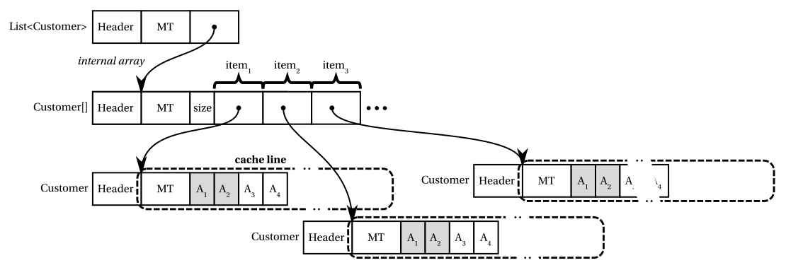
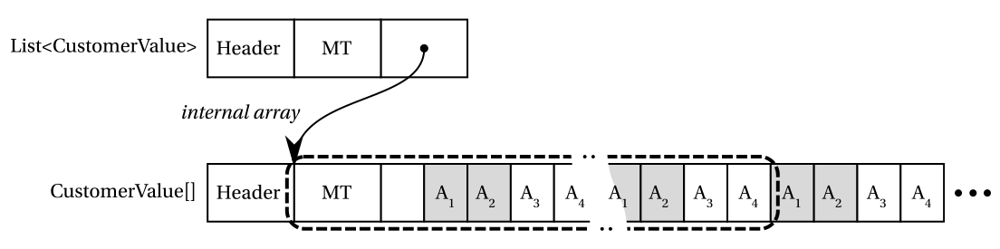
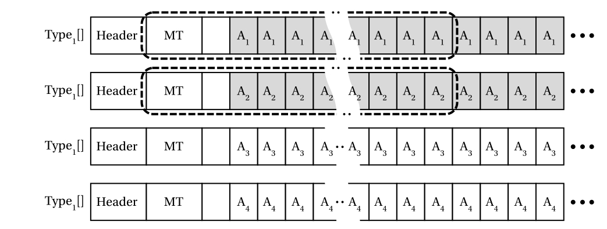
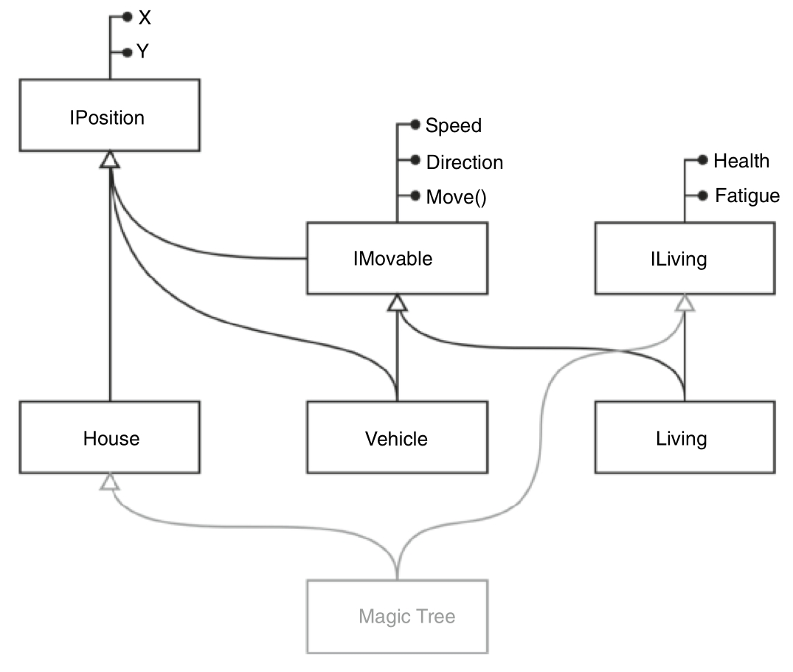
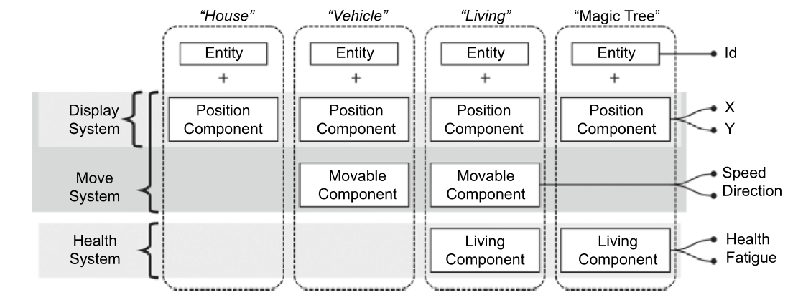

本章是前一章的延续，将介绍.NET中更高级的技术。请注意，阅读前一章（特别是关于引用类型、引用返回和 `ref` 结构体的内容）对理解本章非常有帮助。

本章内容与当前.NET编程趋势（尤其是注重性能优化的方向）紧密契合——通过极致压榨CPU时钟周期和堆内存分配，使托管框架和应用运行得更快。越来越多的库及其API正在通过更高效的Span和管道技术进行“Span化”和“管道化”改造。希望本章的讲解能帮助您适应这个现代化的.NET世界。

# Span与Memory

在C#中，我们可以通过多种方式分配连续内存：常规堆分配数组、固定缓冲区、`stackalloc` 或非托管内存。如果能用统一的方式表示所有这些情况，同时不引入比普通数组更多的开销，将会非常便利。此外，这类内存经常需要被“切片”——仅将部分内存提供给其他方法处理。而所有这些操作都应该在不产生堆分配的前提下完成——堆分配正是高性能.NET代码的头号敌人。这些需求催生了 `Span<T>`。

## Span<T>

.NET Core 2.1引入了新的泛型类型 `Span<T>`。它是值类型（ref struct），因此本身不会产生分配。它具有返回引用的索引器，可以像数组一样使用。更重要的是，它设计用于高效切片——子范围由另一个 `Span<T>` ref 结构体表示，同样无需任何内存分配。

代码清单14-1展示了典型的 `Span<T>` 使用场景。无论 `UseSpan` 方法最后使用哪个 span 实例（代表不同类型的内存），都可以通过 `Span<T>` 公开的 `Length` 属性和索引器成员像数组一样使用。注意 `UseSpan` 被标记为 `unsafe` 是因为指针使用，而非 `Span<T>` 本身。

代码清单14-1. 典型 `Span<T>` 使用场景

```csharp
unsafe public static void UseSpan() 
{
    var array = new int[64];
    Span<int> span1 = new Span<int>(array);
    Span<int> span2 = new Span<int>(array, start: 8, length: 4);
    Span<int> span3 = span1.Slice(0, 4);
    Span<int> span4 = stackalloc[] { 1, 2, 3, 4, 5 };
    Span<int> span5 = span4.Slice(0, 2);
    void* memory = NativeMemory.Alloc(64);
    Span<byte> span6 = new Span<byte>(memory, 64);
    
    var span = span1; // 也可以是span2, span3等
    for (int i = 0; i < span.Length; i++)
        Console.WriteLine(span[i]);
        
    NativeMemory.Free(memory);
}
```

并非所有内存都应被修改，因此还提供了对应的 `ReadOnlySpan<T>` 类型来表示只读内存。典型应用包括处理字符串数据——字符串不可变，若用 `Span<T>` 表示会破坏这个特性。字符串的 `AsSpan` 扩展方法返回的是 `ReadOnlySpan<char>`。当然，也可以主动用此类型表示常规数据的只读视图（见代码清单14-2）。

代码清单14-2. 典型 `ReadOnlySpan<T>` 使用场景

```csharp
public static void UseReadOnlySpan() 
{
    var array = new int[64];
    ReadOnlySpan<int> span1 = new ReadOnlySpan<int>(array);
    ReadOnlySpan<int> span2 = new Span<int>(array);
    
    string str = "Hello world";
    ReadOnlySpan<char> span3 = str.AsSpan();
    ReadOnlySpan<char> span4 = str.AsSpan(start: 6, length: 5);
}
```

虽然初看可能并不惊艳，但这个类型在许多应用中具有革命性意义。首先，它能显著简化某些API。试想一个整数解析例程需要处理各种内存类型时（见代码清单14-3），API接口会因支持所有使用场景而快速膨胀。而通过 `Span<char>` 可以简化为单一方法（见代码清单14-4）。

代码清单14-3  存在问题的整型解析API

```c#
int Parse(string input);
int Parse(string input, int startIndex, int length);
unsafe int Parse(char* input, int length);
unsafe int Parse(char* input, int startIndex, int length);
```

代码清单14-4  使用 `Span<T>` 简化的整型解析API

```c#
int Parse(ReadOnlySpan input);
```

得益于 `Span<T>` 能够表示各种形式的连续值集合（如数组、字符串、非托管数组指针等），它可以极大简化API设计，无需创建大量重载方法，也无需强制用户创建不必要的副本（以使数据适配API要求）。

其次，`Span<T>` 极大简化了高性能代码的编写，例如可以安全地使用 `stackalloc`（如代码清单14-1所示）。但最重要的是其切片能力，允许对较小的内存块进行操作（例如解析时），在代码中传递这些切片而不会产生开销。稍后您将看到它是如何实现高效切片的。

C#编译器还能智能地处理 `Span<T>` 包装数据的生命周期。因此，从方法返回包装托管数组的 `Span<T>` 是完全可行的（因为数组生命周期超出方法范围，见代码清单14-5中的 `ReturnArrayAsSpan` 方法），但不允许返回局部栈数据（因为方法结束时这些数据会被丢弃，见代码清单14-5中非法的 `ReturnStackallocAsSpan` 方法）。在处理非托管内存时需要特别注意，因为必须记得显式释放内存（见代码清单14-5中的 `ReturnNativeAsSpan` 方法，其中分配的内存从未被释放）。

代码清单14-5  返回 `Span<T>` 的三种示例

```c#
public Span<int> ReturnArrayAsSpan()
{
    var array = new int[64];
    return array.AsSpan();
}

public Span<int> ReturnStackallocAsSpan()
{
    Span span = stackalloc[] { 1, 2, 3, 4, 5 };
    // 编译错误CS8352: 无法在此上下文中使用局部变量'span'，因为它可能将引用变量暴露到声明范围之外
    return span;
}

public unsafe Span<int> ReturnNativeAsSpan()
{
    IntPtr memory = Marshal.AllocHGlobal(64);
    return new Span(memory.ToPointer(), 8);
}
```

### 使用示例

让我们看几个 `Span<T>` 的使用示例。自本书第一版以来，`Span<T>` 已在.NET生态系统中广泛应用，形成了许多成熟的设计模式。

Kestrel 服务器（用于托管ASP.NET Core Web应用程序）很好地利用了大数据切片能力。代码清单14-6展示了 `KestrelHttpServer` 早期实现中 `HttpParser`类的部分代码。可以看到，传入的HTTP请求通过 `Span<T>` 切片逐行解析：首先每行作为独立切片传入 `ParseRequestLine` 方法，随后该行中的每个关键部分（如HTTP路径或查询）又被切片为独立的 `Span<T>` 实例并传递给 `OnStartLine` 方法。这种方式避免了调用 `string.Substring` 时发生的内存复制，且由于 `Span<T>` 是栈上分配的，全程不会产生堆分配。

`OnStartLine` 方法进一步使用传入的 `Span<T>` 实例实现业务逻辑。同样地，切片后的HTTP头信息也在 `HttpParser` 类中以相同方式解析。

代码清单14-6 KestrelHttpServer中 `HttpParser` 类的代码片段

```csharp
public unsafe bool ParseRequestLine(TRequestHandler handler, in ReadOnlySequence<byte> buffer, out SequencePosition consumed, out SequencePosition examined) {
    var span = buffer.First.Span;
    var lineIndex = span.IndexOf(ByteLF);
    if (lineIndex >= 0) {
        consumed = buffer.GetPosition(lineIndex + 1, consumed);
        span = span.Slice(0, lineIndex + 1);
    }
    // 固定内存并解析切片
    fixed (byte* data = &MemoryMarshal.GetReference(span)) {
        ParseRequestLine(handler, data, span.Length);
    }
}

private unsafe void ParseRequestLine(TRequestHandler handler, byte* data, int length) {
    int offset;
    // 获取方法并设置偏移量
    var method = HttpUtilities.GetKnownMethod(data, length, out offset);
    // 获取路径切片
    var pathBuffer = new Span<byte>(data + pathStart, offset - pathStart);
    // 获取查询参数切片
    var targetBuffer = new Span<byte>(data + pathStart, offset - pathStart);
    var query = new Span<byte>(data + queryStart, offset - queryStart);
    handler.OnStartLine(method, httpVersion, targetBuffer, pathBuffer, query, customMethod, pathEncoded);
}
```

另一个经典案例是 `System.Private.CoreLib` 程序集中定义的内部 `ValueStringBuilder` 结构体。顾名思义，这是 `StringBuilder` 的值类型版本，提供可变的字符串操作功能。

如代码清单14-7所示，它使用 `Span<char>` 作为内部存储，使其具有存储无关性——初始存储可以是 `stackalloc` 分配的栈内存、原生内存或堆分配的数组。通过返回引用类型的索引器，可以高效访问单个字符。

代码清单14-7 内部 `ValueStringBuilder` 类的代码片段

```csharp
internal ref struct ValueStringBuilder {
    private char[] _arrayToReturnToPool;
    private Span<char> _chars;
    private int _pos;

    public ValueStringBuilder(Span<char> initialBuffer) {
        _arrayToReturnToPool = null;
        _chars = initialBuffer;
        _pos = 0;
    }
    public ref char this[int index] => ref _chars[index];
}
```

私有字段 `_pos` 作为游标指示已使用的字符数。通过代码清单14-8中的 `AsSpan` 方法组，可以轻松通过切片返回当前内容（无需任何内存分配）。

代码清单14-8 内部 `ValueStringBuilder` 类的切片功能

```csharp
public ReadOnlySpan<char> AsSpan() => _chars.Slice(0, _pos);
public ReadOnlySpan<char> AsSpan(int start) => _chars.Slice(start, _pos - start);
public ReadOnlySpan<char> AsSpan(int start, int length) => _chars.Slice(start, length);
```

当需要真正的字符串时，可通过代码清单14-9中的堆分配 `ToString` 方法实现。注意此时会调用 `Dispose` 方法（后文说明），表示该实例已被消费。

代码清单14-9 内部 `ValueStringBuilder` 类的字符串转换功能

```csharp
public override string ToString() {
    string result = _chars.Slice(0, _pos).ToString();
    Dispose();
    return result;
}
```

如代码清单14-10所示，向此类构建器追加内容只需在当前游标位置设置字符（追加字符串时设置多个字符）。当初始`Span<char>`空间不足时，会从`ArrayPool<char>`租用更大数组（参见`Grow`方法）。由于`Span<char>`的存储无关性，只需将新数组赋给同一字段即可。

代码清单14-10 内部 `ValueStringBuilder` 类的追加逻辑

```csharp
[MethodImpl(MethodImplOptions.AggressiveInlining)]
public void Append(char c) {
    int pos = _pos;
    if (pos < _chars.Length) {
        _chars[pos] = c;
        _pos = pos + 1;
    } else {
        GrowAndAppend(c);
    }
}

[MethodImpl(MethodImplOptions.NoInlining)]
private void GrowAndAppend(char c) {
    Grow(1);
    Append(c);
}

[MethodImpl(MethodImplOptions.NoInlining)]
private void Grow(int additionalCapacityBeyondPos) {
    int minimumLength = (int)Math.Max((uint)(_pos + additionalCapacityBeyondPos), 
        Math.Min((uint)(_chars.Length * 2), 2147483591u));
    char[] array = ArrayPool<char>.Shared.Rent(minimumLength);
    _chars.Slice(0, _pos).CopyTo(array);
    char[] arrayToReturnToPool = _arrayToReturnToPool;
    _chars = (_arrayToReturnToPool = array);
    if (arrayToReturnToPool != null) {
        ArrayPool<char>.Shared.Return(arrayToReturnToPool);
    }
}
```

从数组池中获取的数组应当归还给池。这一操作由 `Dispose` 方法处理（见代码清单14-11）。请注意，虽然该方法命名为 `Dispose`，但 `ValueStringBuilder` 并未实现 `IDisposable` 接口——因为 ref struct 无法实现接口！因此无法使用 `using` 块包装实例，必须显式调用 `Dispose` 方法。

代码清单14-11. `ValueStringBuilder`类的内部片段（释放逻辑）

```csharp
[MethodImpl(MethodImplOptions.AggressiveInlining)]
public void Dispose()
{
    char[] toReturn = _arrayToReturnToPool;
    this = default; // 安全措施：避免在错误地再次追加内容时使用已归还的数组
    if (toReturn != null) // 若原始stackalloc缓冲区足够大则无需操作
    {
        ArrayPool<char>.Shared.Return(toReturn);
    }
}
```

使用 `ValueStringBuilder` 非常简单。只需准备初始存储空间（如小型 `stackalloc` 缓冲区）并传递给其构造函数（见代码清单14-12）。

代码清单14-12. `ValueStringBuilder` 使用示例

```csharp
public string UseValueStringBuilder()
{
    Span<char> initialBuffer = stackalloc char[40];
    var builder = new ValueStringBuilder(initialBuffer);
    
    // 使用builder.Append(...)的逻辑
    string result = builder.ToString();
    builder.Dispose();
    return result;
}
```

`ValueStringBuilder` 是综合运用多种现代技术的绝佳范例：ref struct、ref 返回、Span<T>、ArrayPool<T> 以及最常用的stackalloc。通过阅读其[源码](https://github.com/dotnet/runtime/blob/main/src/libraries/Common/src/System/Text/ValueStringBuilder.cs)（可在.NET运行时 GitHub 仓库找到）能有效掌握这些技术。

> .NET代码库中还有个非常相似的 [ValueListBuilder](https://github.com/dotnet/runtime/blob/main/src/libraries/System.Private.CoreLib/src/System/Collections/Generic/ValueListBuilder.cs) 结构体，建议您阅读其实现！

受 `Span<T>` 灵活性的吸引，您可能会想出如代码清单14-13所示的简洁方案：小于特定阈值时使用 `stackalloc` 分配缓冲区，较大时则使用 `ArrayPool`。虽然这段代码看起来优雅且能通过编译，但存在严重缺陷——无法将数组归还给池（无法从 `Span<T>` 实例还原原始数组）！

代码清单14-13. 尝试提供条件性本地缓冲区分配的简洁方案（不可行）

```csharp
private const int StackAllocSafeThreshold = 128;
public void UseSpanNotWisely(int size)
{
    Span<int> span = size < StackAllocSafeThreshold 
        ? stackalloc int[size] 
        : ArrayPool<int>.Shared.Rent(size);
    for (int i = 0; i < size; ++i)
        Console.WriteLine(span[i]);
    // ArrayPool<int>.Shared.Return(??); // 无法归还数组
}
```

前文展示的 `ValueStringBuilder` 解决的正是类似问题（还额外实现了本地缓冲区的可扩展性）。若您尝试实现类似代码清单14-13的功能，将会遇到C#的语言限制。例如在非 `unsafe` 上下文中，不能将 `stackalloc` 结果赋值给已定义的变量（只能在初始化时赋值）。因此这种方案需要额外代码，会变得冗长且不够优雅（见代码清单14-14）。不过在.NET基础库中仍可能见到这类代码，因为它确实能实现所需功能（虽然需要借助 `unsafe` 指针操作）。

代码清单14-14. 使用 `unsafe` 的有效实现方案

```csharp
public unsafe void UseSpanWisely(int size)
{
    Span<int> span;
    int[] array = null;
    if (size < StackAllocSafeThreshold)
    {
        int* ptr = stackalloc int[size];
        span = new Span<int>(ptr, size);
    }
    else
    {
        array = ArrayPool<int>.Shared.Rent(size);
        span = array;
    }
    for (int i = 0; i < size; ++i)
        Console.WriteLine(span[i]);
    if (array != null)
        ArrayPool<int>.Shared.Return(array);
}
```

自C# 11起，对 `Span<T>` 变量作用域的限制有所放宽。使用 `unsafe` 关键字时，编译器允许 span 逃逸作用域，并会显示警告而非错误（如代码清单14-15所示）。这些变更对早期C#版本也适用。

代码清单14-15. 更简洁的条件性本地缓冲区分配方案

```csharp
public unsafe void UseSpanWiselyAndConcisely(int size)
{
    Span<int> span;
    int[] array = null;
    if (size < StackAllocSafeThreshold)
    {
        span = stackalloc int[size]; // 警告CS9080：在此上下文中使用变量'span'可能导致引用变量逃逸其声明作用域
    }
    else
    {
        array = ArrayPool<int>.Shared.Rent(size);
        span = array;
    }
    for (int i = 0; i < size; ++i)
        Console.WriteLine(span[i]);
    if (array != null)
        ArrayPool<int>.Shared.Return(array);
}
```

`Span<T>` 的另一个典型应用是通过 `"字符串".AsSpan().Slice(...)` 方法实现非分配性子字符串操作。这是在解析字符串时避免昂贵 `string.Substring` 调用的绝佳方案。

### 探秘 Span<T>

在了解了 `Span<T>` 的各种用法示例后，我们来深入探讨其实现原理。虽然初看并不明显，但其内部实现相当复杂，涉及诸多CLR底层机制的关键设计。因此我们将逐步详细解析 `Span<T>` 背后的设计决策——作为当前.NET生态变革的核心，理解这些设计至关重要。

出于性能考虑，最好使用结构体（避免堆分配）。由于它可能表示栈分配的内存（如 `stackalloc`），其本身绝不能出现在堆上（否则可能超出其包装内存的生命周期）。即使不考虑性能因素，也必须使用栈分配的结构体并确保其不会被装箱（这是第一个设计难点）。

- 作为内存区域的表示，它需要存储两个信息：指针（地址）和长度。
- `Span<T>` 可能表示托管数组的子区间（例如切片操作），因此指针可能指向托管对象内部——如果您联想到“内部指针”（interior pointer）就对了！实际上最理想的指针类型就是托管指针（可指向对象内部）。但您可能记得托管指针仅允许用于局部变量、参数和返回值，不能作为字段——即使是结构体字段也不行，因为结构体可能被装箱（第三个设计难点）。

这些要点构成了 `Span<T>` 最核心的设计考量。进一步分析，若能满足以下两个条件，上述三个难题将迎刃而解：

- 存在仅能栈分配的类型——这样就能安全存储栈地址，且默认单线程使用无需考虑线程安全问题
- 允许在 `Span<T>` 字段中使用托管指针——这样就能以安全方式访问任意内存类型

若您没有跳过第13章，可能已经意识到我们描述的正是...ref 结构体！这类 byref-like 类型完美契合需求（事实上它们就是为 `Span<T>` 而引入的）。更妙的是，byref-like 类型无需运行时修改，主要工作由C#编译器完成，其IL代码与当前.NET和.NET Framework 完全向后兼容。因此第一个条件已满足。

第二个条件更为苛刻。有了 byref-like 类型后，自然会想到 byref-like 实例字段——由于二者的限制特性相似，托管指针理应能作为 byref-like 类型的成员字段。遗憾的是，当前C#和CIL都不支持此类字段，必须修改运行时。为此专门为 `Span<T>` 引入了新的内在类型（runtime实现）来表示这类 byref-like 实例字段。因此第二个条件仅在.NET Core 2.1及更高版本中才能满足。

当第二个条件不满足时，可通过变通方案实现（稍后展示）。这导致存在两种 `Span<T>` 实现版本：

- “慢速版”：运行在.NET Framework和.NET Core 2.1之前的兼容版本，无需运行时修改。由于向后兼容风险，.NET Framework 可能永远不会支持新特性。
- “快速版”：利用.NET Core 2.1引入的 byref-like 实例字段支持的版本。

不必过分关注“快慢”命名——两者都很快，尽管“慢速版”比后者慢一倍。清单14-16的基准测试及14-17的结果清晰表明：

-  NET 8.0的“快速版” `Span<T>` 性能优于常规.NET数组。
-  .NET Framework的“慢速版” `Span<T>` 慢约50%。

但要注意，这个精心设计的基准测试仅聚焦索引器数据访问。实际应用场景的性能差异会更小。

清单14-16. 使用 `Span` 进行访问时间的简单基准测试（“.NET Framework版”为慢速实现，“.NET Core版”为快速实现），并与常规数组进行对比

```c#
public class SpanBenchmark
{
    private byte[] array;
    [GlobalSetup]
    public void Setup()
    {
        array = new byte[128];
        for (int i = 0; i < 128; ++i)
        array[i] = (byte)i;
    }
    [Benchmark]
    public int SpanAccess() 
    {
        var span = new Span<byte>(this.array);
        int result = 0;
        for (int i = 0; i < 128; ++i) 
        {
            result += span[i];
        }
        return result;
    }

    [Benchmark]
    public int ArrayAccess() 
    {
        int result = 0;
        for (int i = 0; i < 128; ++i) 
        {
            result += this.array[i];
        }
        return result;
    }
}
```

清单14-17. 来自清单14-16的BenchmarkDotNet测试结果

| 方法        | 运行平台           | 平均耗时 | 误差     | 内存分配 |
| ----------- | ------------------ | -------- | -------- | -------- |
| SpanAccess  | .NET 8.0           | 50.66 ns | 0.386 ns | -        |
| ArrayAccess | .NET 8.0           | 63.23 ns | 0.540 ns | -        |
| SpanAccess  | .NET Framework 4.8 | 96.56 ns | 1.813 ns | -        |
| ArrayAccess | .NET Framework 4.8 | 66.49 ns | 1.092 ns | -        |

接下来我们将详细剖析两个版本的实现，重点关注从托管/非托管内存的构造过程以及索引器实现。

> 后续代码清单会频繁使用 `Unsafe` 类。这个通用类提供内存和指针的底层操作（本章稍后简要介绍）。示例中的用法非常直观——主要用于类型转换和简单指针运算。

### 慢速 Span

“慢速 Span”无法使用类似 byref 的字段。为了模拟作为字段的内部指针，它需要同时存储对象引用和对象内部的偏移量（见代码清单 14-18）。保留对象引用可避免产生 GC 漏洞——当包裹在 `Span<T>` 中时，需要通过该引用来保持对象可达性。`Span<T>` 还会存储长度信息。

代码清单 14-18　.NET Framework 中“慢速” `Span<T>` 的声明

```csharp
public readonly ref partial struct Span<T> 
{ 
    private readonly Pinnable<T> _pinnable; 
    private readonly IntPtr _byteOffset; 
    private readonly int _length; 
}
// 这个类存在的唯一目的，就是让任意对象都能通过非安全转换来获取用户数据起始位置的引用
[StructLayout(LayoutKind.Sequential)]
internal sealed class Pinnable<T> 
{ 
    public T Data; 
}
```

那么从托管数据和非托管数据构造 `Span<T>` 的过程是怎样的呢？包裹托管数组的操作非常直观（见代码清单 14-19）。这里会存储数组的完整引用（确保 GC 能发现并避免回收该数组），以及数组数据起始位置的偏移量（即 `ArrayAdjustment` 实际返回的值），在数组切片情况下还会进行适当的偏移调整。

代码清单 14-19　从托管数组构造“慢速” Span

```csharp
public Span(T[] array) 
{ 
    _length = array.Length; 
    _pinnable = Unsafe.As<Pinnable<T>>(array); 
    _byteOffset = SpanHelpers.PerTypeValues<T>.ArrayAdjustment; 
}
public Span(T[] array, int start, int length) 
{ 
    _length = length; 
    _pinnable = Unsafe.As<Pinnable<T>>(array); 
    _byteOffset = SpanHelpers.PerTypeValues<T>.ArrayAdjustment.Add<T>(start); // Add 方法执行指针运算
}
```

包裹非托管内存的操作更为简单，因为不需要关心对象引用问题（见代码清单 14-20）。只需保存长度和地址信息。

代码清单 14-20　从非托管内存构造“慢速” Span

```csharp
public unsafe Span(void* pointer, int length) 
{ 
    _length = length; 
    _pinnable = null; 
    _byteOffset = new IntPtr(pointer); 
}
```

“慢速 Span”的索引器需要进行更多计算——对于托管数组，它需要在对象地址基础上添加数据起始的字节偏移量，以及指定索引处元素的字节偏移量（见代码清单 14-21）。

代码清单 14-21 “慢速” Span 的索引器实现

```csharp
public ref T this[int index]
{
    get 
    { 
        if (_pinnable == null) 
            unsafe 
            { 
                return ref Unsafe.Add<T>(ref Unsafe.AsRef<T>(_byteOffset.ToPointer()), index); 
            } 
        else 
            return ref Unsafe.Add<T>(ref Unsafe.AddByteOffset<T>(ref _pinnable.Data, _byteOffset), index); 
    } 
}
```

> 若想深入研究“慢速” Span 的源代码，建议反编译  `System.Memory` nuget 包进行分析。

### 快速 Span

“快速 Span”利用了运行时对类 byref 字段的支持。得益于 byref 字段，这一版 `Span<T>` 的实现更为简洁。无论托管还是非托管数据都由 byref 字段持有（见代码清单 14-22）。由于垃圾回收器（GC）支持托管（内部）指针，当 `Span<T>` 仍在使用时，相关托管对象不会被回收的风险。

代码清单 14-22　从托管和非托管内存构造“快速”Span

```c#
public Span(T[] array)
{
    _reference = ref MemoryMarshal.GetArrayDataReference(array);
    _length = array.Length;
}
public Span(T[] array, int start, int length)
{
    _reference = ref Unsafe.Add(ref MemoryMarshal.GetArrayDataReference(array), (nint)(uint)start /*强制零扩展*/);
    _length = length;
}
public unsafe Span(void* pointer, int length)
{
    _reference = ref *(T*)pointer;
    _length = length;
}
```

此外，内存访问变得极其简单，只需非常快速的指针运算即可（见代码清单 14-23）——这使得性能可与常规数组媲美。

代码清单 14-23 “快速”Span的索引器实现

```c#
public ref T this[int index]
{

    [Intrinsic]
    get { 
        return ref Unsafe.Add(ref _reference, (nint)(uint)index); 
    }
}
```

性能差异的另一来源是.NET Core中JIT编译器的改进。特别是它在消除边界检查（例如循环中的检查）方面表现更优。另一个区别在于“快速”Span体积更小，因此按值传递时的开销更低。

从GC开销的角度来看，“慢速”与“快速”Span其实截然相反。“慢速版”直接持有对象引用（当包装托管对象时），因此遍历速度更快；而“快速版”包含需要GC遍历扫描的内部指针，解引用速度稍慢。但实践中这种差异微不足道，很难想象存在大量存活 `Span<T>` 的应用会因此产生显著影响。

> 自C# 11起，ref结构体(ref struct)中已可使用ref字段。但更通用的 byref-like字段（类中也可使用）呢？这类可能引入堆到堆内部指针的特性不太可能被加入。如前所述，与运行时解析它们的开销相比，其带来的收益实在有限。

> **慢速 Span VS 快速 Span 实质上的区别**
>
> **byref 字段**是 .NET 运行时级别的特性，允许在结构体中直接存储**对内存位置的引用**，而不是存储对象引用+偏移量的组合。
>
> ```c#
> // 概念对比：
> // 传统字段：存储"值"或"对象引用"
> public struct TraditionalStruct
> {
>     private object _objectRef;    // 存储对象引用
>     private int _value;          // 存储值
> }
> 
> // byref 字段：直接存储"内存位置的引用"
> public ref struct ByRefStruct  
> {
>     private ref T _reference;    // 直接指向内存中的某个 T 实例
> }
> ```
>
> 慢速 Span 是通过三个属性来存储对象：
>
> ```c#
> public readonly ref partial struct SlowSpan<T> 
> { 
>     private readonly Pinnable<T> _pinnable;  // 8字节：对象引用
>     private readonly IntPtr _byteOffset;     // 8字节：偏移量
>     private readonly int _length;            // 4字节：长度
> }
> ```
>
> 这里面就需要 20字节（+ 4字节对齐填充 = 24字节）。在访问元素时，需要三步：1. 获取 _pinnable 引用。2.计算位置。3. 解引用（UnSafe）。
>
> 而快速 Span 直接通过 byref 存储对象内存位置的引用：
>
> ```c#
> public readonly ref partial struct FastSpan&lt;T&gt;
> {
>     private ref readonly T _reference;   // 8字节：直接的内存引用
>     private readonly int _length;        // 4字节：长度  
> }
> ```
>
> 这里只需要 12 字节 + 4字节的对齐填充 = 16字节。在访问元素时，只需要直接使用 _reference 和指针位置计算。
>
> 在汇编指令上也可以看出明显区别：
>
> ```
> ; 慢速 Span (伪汇编)
> mov rdx, [rax+8]        ; 访问 _pinnable.Data  
> mov rcx, [rbp-16]       ; 加载 _byteOffset
> add rdx, rcx            ; 计算基地址
> lea rax, [rdx+2*4]      ; 计算最终地址 (index * sizeof(T))
> ```
>
> ```
> ; 快速 Span (伪汇编) 
> mov rax, [rbp-8]        ; 直接加载 _reference
> lea rax, [rax+2*4]      ; 计算最终地址 (index * sizeof(T))
> ```

## Memory<T>

Span<T> 非常高效快速，但正如你所见，它存在诸多限制。这些限制在异步代码场景下尤为棘手。例如，Span<T> 不能存活于堆上，这意味着它无法被装箱，因此不能存储在可能被装箱到堆上的异步状态机字段中。为此，我们引入了互补类型 Memory<T>。它和 Span<T> 一样表示连续的内存区域，但并非 byref 类型且不包含 byref 实例字段。因此与 Span<T> 不同，这个类型可以存在于堆上（虽然出于性能考虑它仍是结构体，但不再是 ref 结构体）。它可以存储在普通对象的字段中，可用于异步状态机等场景。但另一方面，它不能用于包装 `stackalloc` 返回的内存。

Memory<T> 可以包装以下数据（见代码清单14-24）：

- 数组：作为预分配缓冲区在异步调用中重复使用，或用于API中 Span<T> 限制过强的场景。
- 字符串：此时会表示为 ReadOnlyMemory<char>。
- 实现 `IMemoryOwner<T>` 的类型：用于需要更精细控制 Memory<T> 实例生命周期的场景（稍后将详述）。

代码清单14-24 Memory使用示例

```c#
byte[] array = new byte[] {1, 2, 3};
Memory memory1 = new Memory(array);
Memory memory2 = new Memory(array, start: 1, length: 2);
ReadOnlyMemory memory3 = "Hello world".AsMemory();
```

你可以将 Memory<T> 视为可自由分配及传递的容器。其存储内容不能直接访问，可通过以下方式使用：

- 通过 Span<T> 属性进行本地高效访问（因此 Memory<T> 常被称为“span工厂”）
- 调用 `ToArray` 提取为数组，或通过 `ToString` 将 Memory<T> 转为字符串（注意这两个操作都会分配新的引用类型实例！）
- 与 Span<T> 类似，可通过 `Slice`方法进行切片

切片操作和生成 Span<T> 都是高效的非分配操作——仅是将内存区域包装为结构体。正如你所知，整个操作有时只需使用寄存器，甚至不需要占用栈空间。

异步代码是 Memory<T> 最常见的应用场景，作为 Span<T> 的替代方案（见代码清单14-25）。在异步代码内部，可以通过前述多种方式访问 Memory<T> 的内容（代码清单14-25直接使用了 `ToString` 转换）。

代码清单14-25 在异步代码中使用 `ReadOnlyMemory` 替代 Span<T>

```c#
public static async Task FetchStringAsync(ReadOnlySpan requestUrl) // 错误CS4012 不能在异步方法或lambda表达式中声明'ReadOnlySpan'类型的参数或局部变量
{
    HttpClient client = new HttpClient();
    var task = client.GetStringAsync(requestUrl.ToString());
    return await task;
}
public static async Task FetchStringAsync(ReadOnlyMemory requestUrl)
{
    HttpClient client = new HttpClient();
    var task = client.GetStringAsync(requestUrl.ToString());
    return await task;
}
```

让我们看个更复杂的例子（见代码清单14-26）。`BufferedWriter` 类实现了指定 `Stream` 的缓冲写入功能。它内部使用字节数组(`writeBuffer`)并通过 `writeOffset` 字段跟踪当前使用量。唯一的公开 `WriteAsync` 方法是异步的，因此接受 `ReadOnlyMemory<byte>` 作为数据源。这比添加各种重载方法（接受数组、字符串、原生内存指针等）更通用灵活。仅依赖 `ReadOnlyMemory<T>` 就能编写更简洁的代码，只要数据源与 `ReadOnlyMemory<T>` 兼容。

在异步 `WriteAsync` 方法内部，`ReadOnlyMemory<T>` 被转换为 span 传递给私有的同步方法 `WriteToBuffer`。在 `WriteToBuffer` 方法中，`writeBuffer` 被包装成另一个 Span<T> 以使用便捷的 `CopyTo` 方法。此外，切片功能帮助 `WriteAsync` 方法通过 `while` 循环以分块方式消费数据源。注意 `BufferedWriter` 类除 `writeBuffer` 外没有进行任何内存分配。

代码清单14-26 ReadOnlyMemory<T> 与 ReadOnlySpan<T> 协作示例

```c#
public class BufferedWriter : IDisposable
{
    private const int WriteBufferSize = 32;
    private readonly byte[] writeBuffer = new byte[WriteBufferSize];
    private readonly Stream stream;
    private int writeOffset = 0;

	public BufferedWriter(Stream stream) => this.stream = stream;
    public async Task WriteAsync(ReadOnlyMemory<byte> source)
    {
    	int remaining = writeBuffer.Length - writeOffset;
        if (source.Length <= remaining)
        {
            WriteToBuffer(source.Span);
            return;
        }
        while (source.Length > 0)
        {
            remaining = Math.Min(writeBuffer.Length - writeOffset, source.Length);
            WriteToBuffer(source.Slice(0, remaining).Span);
            source = source.Slice(remaining);
            await FlushAsync().ConfigureAwait(false);
        }
    }

    private void WriteToBuffer(ReadOnlySpan<byte> source)
    {
        source.CopyTo(new Span<byte>(writeBuffer, writeOffset, source.Length));
        writeOffset += source.Length;
    }

    private Task FlushAsync()
    {
        if (writeOffset > 0)
        {
            Task task = stream.WriteAsync(writeBuffer, 0, writeOffset);
            writeOffset = 0;
            return task;
        }
        return default;
    }

    public void Dispose() => stream?.Dispose();
}
```

## IMemoryOwner

如何控制 Memory<T> 包装的内存生命周期？并非所有内存类型都需要显式管理——例如数组会被GC自动回收。为了避免让所有 Memory<T> 实例都实现 Disposable，我们引入了 IMemoryOwner<T> 抽象，通过所有权语义提供额外控制层。当需要精确控制 Memory<T> 生命周期时，必须通过 IMemoryOwner<T> 接口实现提供其所有者（见代码清单14-27）。Memory<T> 实例通过所有者的 Memory<T> 属性公开。IMemoryOwner<T> 实现了 IDisposable 接口，因此所有者能显式控制对应 Memory<T> 的所有权。

使用 IMemoryOwner 实例需遵循约定（如同所有 `IDisposable` 场景）——必须记得调用 `Dispose` 方法，例如借助 `using` 语句。也可实现所有权语义——始终只有一个对象（或方法）“拥有” `IMemoryOwner` 实例，并由该拥有者在任务完成后调用 `Dispose`。

代码清单14-27 `IMemoryOwner<T>` 接口声明


```c#
/// 
/// Memory的所有者，负责妥善释放底层内存
/// 
public interface IMemoryOwner : IDisposable
{
	Memory<T> Memory { get; }
}
```


> 对于代码清单14-24这类简单场景，IMemoryOwner<T> 和所有权语义并非必需。此时GC成为底层内存唯一的隐式“所有者”，当所有引用该内存的 `Memory<T>` 实例失效后，GC会负责回收。

需要显式资源管理的典型场景是包装从池中租借的对象，例如 `ArrayPool<T>` 的数组（见代码清单14-28）。这种场景下，数组何时该被归还？在`Consume` 方法内部？还是在 `await` 结束后？如果 `Consume` 方法存储了传入 `Memory<T>` 的引用（可能因装箱而存在），且该引用比方法调用存活更久怎么办？

代码清单14-28 `Memory<T>` 包装内存的所有权问题

```c#
Memory pooledMemory = new Memory(ArrayPool.Shared.Rent(128));
await Consume(pooledMemory);
```

`IMemoryOwner<T>` 接口能有效组织代码——持有该接口的方法或类需负责资源的显式清理。`IMemoryOwner<T>` 实例的暴露需极为谨慎——若某方法或类型构造函数接受该实例，则该方法或类型应被视为底层内存的新所有者（需在之后调用 `Dispose` 或继续传递）。约定所有者（特定方法或整个类型）可以安全消费底层 `Memory` 属性。

实际应用可参考包装 `ArrayPool<T>.Shared` 数组的 `MemoryPool<T>` 类。代码清单14-29展示在单个方法内通过 `using`                                                                   语句控制所有权的示例，代码清单14-30展示整个类型作为底层内存所有者的案例。后者类型应实现 `IDisposable` 以表明需要执行显式清理。

代码清单14-29 方法作为显式所有者的 `Memory<T>` 示例

```c#
using (IMemoryOwner<int> owner = MemoryPool<int>.Shared.Rent(128))
{
    Memory memory = owner.Memory;
    ConsumeMemory(span);
    ConsumeSpan(memory.Span);
}
```

代码清单14-30 类型作为显式所有者的 `Memory<T>` 示例

```c#
public class Worker : IDisposable
{
    private readonly IMemoryOwner<byte> memoryOwner;
    public Worker(IMemoryOwner<byte> memoryOwner) => this.memoryOwner = memoryOwner;
    public UseMemory()
    {
        ConsumeMemory(memoryOwner.Memory);
        ConsumeSpan(memoryOwner.Memory.Span);
    }

    public void Dispose() => this.memoryOwner?.Dispose();
}
```

> `MemoryPool<T>.Shared` 使用静态 `ArrayMemoryPool<T>` 实例，其 `Rent` 方法返回新的 `ArrayMemoryPoolBuffer<T>` 实例。该实例以简单方式实现 `IMemoryOwner<T>`——构造函数从 `ArrayPool<T>.Shared` 租借数组，`Dispose`方法将其归还池中。`ArrayMemoryPool<T>.Memory` 属性仅将租借数组包装为 `Memory<T>` 实例。具体实现可参阅 [ArrayMemoryPool.cs](https://github.com/dotnet/runtime/blob/main/src/libraries/System.Memory/src/System/Buffers/ArrayMemoryPool.cs)和 [ArrayMemoryPool.ArrayMemoryPoolBuffer.cs](https://github.com/dotnet/runtime/blob/main/src/libraries/System.Memory/src/System/Buffers/ArrayMemoryPool.ArrayMemoryPoolBuffer.cs)文件。

例如可将代码清单14-26的 `BufferedWriter` 改造得更灵活，使其接受外部缓冲区而非自行分配（见代码清单14-31）。这样既支持租借数组，也支持非托管内存等场景。

代码清单14-31 改造自代码清单14-26的使用外部缓冲区的 `FlexibleBufferedWriter` 类

```c#
public class FlexibleBufferedWriter : IDisposable
{
    private const int WriteBufferSize = 32;
    private readonly IMemoryOwner<byte> memoryOwner;
    private readonly Stream stream;
    private int writeOffset = 0;
    public FlexibleBufferedWriter(Stream stream, IMemoryOwner<byte> memoryOwner)
    {
        this.stream = stream;
        this.memoryOwner = memoryOwner;
    }

    public void Dispose()
    {
        stream?.Dispose();
        memoryOwner?.Dispose();
    }
}
```

得益于 `Memory<T>` 可获取 `Span<T>` 的特性，`FlexibleBufferedWriter` 实现与原版高度相似。例如 `WriteToBuffer` 方法现在直接在源 `Span<T>` 与所属内存的 `Span<T>` 间执行 `CopyTo` 操作（见代码清单14-32）。`WriteAsync` 方法中所有 `writeBuffer.Length` 都可安全替换为 `memoryOwner.Memory.Length`。

代码清单14-32 `FlexibleBufferedWriter.WriteToBuffer`方法实现

```c#
private void WriteToBuffer(ReadOnlySpan source)
{
    source.CopyTo(memoryOwner.Memory.Span.Slice(writeOffset, source.Length));
    writeOffset += source.Length;
}
```

遗憾的是并非所有API都支持 `Span/Memory`。例如.NET Core 2.1之前的 `Stream.WriteAsync` 仅接受 `byte` 数组参数。此时需进行转换（见代码清单14-33）。若底层存储是数组，`MemoryMarshal.TryGetArray` 能直接获取数组引用（避免复制）；否则需将数据复制到临时数组（通常从池中租借以避免分配）。注意 `FlushAsync` 调用方需负责归还租借的缓冲区——由于该方法是私有方法，调用方可控，但应避免在公共方法中暴露租借缓冲区。

编写底层代码时需善用此类方案。代码清单14-33展示了本章多项功能的协同应用。

代码清单14-33 `FlexibleBufferedWriter.FlushAsync`方法实现

```c#
private Task FlushAsync(out byte[] sharedBuffer)
{
    sharedBuffer = null;
    if (writeOffset > 0)
    {
        Task result;
        if (MemoryMarshal.TryGetArray(memoryOwner.Memory, out ArraySegment array))
        {
        	result = stream.WriteAsync(array.Array, array.Offset, writeOffset);
        }
        else
        {
            sharedBuffer = ArrayPool.Shared.Rent(writeOffset);
            memoryOwner.Memory.Span.Slice(0, writeOffset).CopyTo(sharedBuffer);
            result = stream.WriteAsync(sharedBuffer, 0, writeOffset);
        }
        writeOffset = 0;
        return result;
    }
    return default;
}
```

接受缓冲区的通用类是值得库作者遵循的设计模式（至少作为可选方案）。特别是设计序列化器等内存敏感代码时，推荐支持外部缓冲区或池机制，让使用者能根据应用性能需求注入自有机制。

> `Memory<T>` 可用于P/Invoke场景，此时可能需要固定底层内存。为此 `Memory<T>` 暴露 `Pin` 方法返回 `MemoryHandle` 实例（表示固定内存的可释放对象）。包装字符串或数组时通过 `GCHandle` 固定，对于 `IMemoryOwner<T>` 返回的 `Memory<T>`，要求所有者是 `MemoryManager<T>` 抽象类的实现。`MemoryManager<T>`子类需实现 `IPinnable` 接口及其 `Pin/Unpin`方法——Pin方法由 `Memory<T>.Pin` 调用，Unpin由 `MemoryHandle.Dispose` 调用，从而让内存所有者负责内存的固定与释放。

## Memory<T> 内部实现

与 Span<T> 不同，由于决定不支持托管指针，Memory<T> 的实现直接明了且不含意外因素。在设计 Memory<T> 时考虑了以下方面：

- 它应具有引用类型的生命周期——虽然可能最初作为结构体，仅在需要时才装箱。
- 堆分配对象仅通过引用表示——目前内部指针不能存在于堆上，因此这点显而易见。这简化了设计，因为只有数组和字符串这两种类型需要“类内部指针”行为（因为它们可索引且可切片）。
- 不需要支持栈分配内存。
- 非托管内存需要显式资源管理——因此可能由额外的所有者类（IMemoryOwner）支持，如前所述。

这些要点形成了简单的 Memory<T> 实现。代码清单14-34展示了当前.NET源码的摘录，仅存储一个托管引用（数组或字符串）、索引和长度（用于切片）。构造过程也基本是直截了当的。

代码清单14-34 .NET仓库中的 Memory<T> 声明（包含一个构造函数）

```c#
public readonly struct Memory
{
    private readonly object _object;
    private readonly int _index;
    private readonly int _length;
    ...
}

public Memory(T[] array, int start, int length)
{
    _object = array;
    _index = start;
    _length = length;
}
```

根据设计，Memory<T> 不暴露通用索引器。如前所述，内存访问通过切片和转换为 Span<T> 实现。Span<T> 属性的实现（见代码清单14-35）可以很直接。对于数组或字符串，返回适当的切片 span。若内存所有者，则通过调用 `GetSpan` 方法委托给所有者获取span。

代码清单14-35 `Memory<T>.Span` 属性的伪代码

```c#
public Span Span
{
    get {
        if (/* 对象是MemoryManager */) {
        	// 返回底层Memory的切片
        }
        else if (typeof(T) == typeof(char) && _object is string s) {
        	// 将字符串切片作为Span返回
        }
        else if (_object != null) // 表示包装的是数组
        {
        	// 返回数组切片
        }
    }
}
```

您可能好奇非托管内存如何通过代码清单14-34中的 Memory<T> 字段表示。由于非托管内存需要显式清理，这种情况下 `_object` 字段将表示相应的 `MemoryManager<T>` 实现，负责分配和释放底层内存。代码清单14-36简要展示了这种管理器的轮廓，灵感来自 `System.Buffers` 命名空间内部的 `NativeMemoryManager` 类。

代码清单14-36 原生内存管理示例

```c#
unsafe class NativeMemoryManager : MemoryManager<byte>
{
    private readonly int _length;
    private void* _ptr;
    public NativeMemoryManager(int length)  
    {  
        _length = length;  
        _ptr = NativeMemory.Alloc((nuint)length);  
    }  

    protected override void Dispose(bool disposing)  
    {  
        NativeMemory.Free(_ptr);  
    }  

    public override Memory<byte> Memory => CreateMemory(_length); // 创建将本实例作为包装对象的Memory<T>  

    public override Span<byte> GetSpan() => new Span<byte>(_ptr, _length);
}
```

## Span<T>与Memory<T>使用准则

了解这些类型后，您可能想知道何时使用以及如何选择？请遵循以下使用规则：

- 在高性能通用代码中使用 Span<T> 或 Memory<T> ——业务逻辑中可能不需要到处使用它们。
- 方法参数优先使用 Span<T> 而非 Memory<T> ——它更快（有运行时支持）且能表示更多内存类型。但在异步代码中只能使用 Memory<T>。
- 优先使用只读版本而非可变版本——既能明确意图也更安全，还能支持更多场景。例如：接受 ReadOnlySpan<T> 参数的方法可以同时接收 Span<T> 和 ReadOnlySpan<T>，而接受 Span<T> 参数的方法不能接收 ReadOnlySpan<T>。
- 记住 IMemoryOwner<T>（或 MemoryManager<T>）关乎所有权——最终必须调用其 `Dispose` 方法。为安全起见， IMemoryOwner<T> 实例理想情况下应仅由单个对象持有。存储 IMemoryOwner<T> 实例（可释放对象）的类型自身也应是可释放的（以妥善管理该资源）。

# Unsafe（不安全操作）

`System.Runtime.CompilerServices.Unsafe` 类提供了通用的底层功能，用于暴露一些在CIL中可能实现但在C#中无法表达的能力。然而正如其名所示，它允许的操作是不安全且危险的！得益于其灵活性，`Unsafe` 类被广泛应用于现代.NET库代码中（Span<T>、Memory<T> 等许多类型都依赖它）。

本书不打算全面介绍 `Unsafe` 类的所有功能，而是通过简要说明其方法并展示几个使用示例，帮助读者理解其核心用途。

`System.Runtime.CompilerServices.Unsafe` 提供了丰富的方法集（见代码清单14-37），可分为以下功能组：

- 类型转换与重新解释：可在非托管指针与ref类型之间双向转换，还能在任何两个ref类型之间转换（是的，这听起来有多危险就有多危险）。
- 指针运算：可像常规指针一样对ref类型实例进行加减操作（如果了解托管指针的特性，你就能想象到所有危险的边界情况）。
- 信息获取：可获取各种信息，如类型大小或两个ref类型实例之间的字节偏移量。
- 内存访问：可对任意内存位置进行读写操作。

代码清单14-37 `Unsafe` 类API——方法按功能分组排列，部分重载已省略。注释为笔者所加

```c#
public static partial class Unsafe {
    // 类型转换/重新解释
    public unsafe static void* AsPointer(ref T value)
    public unsafe static ref T AsRef(void* source)
    public static ref TTo As<TFrom, TTo>(ref TFrom source)
    public static ref T Unbox(object box) where T : struct
    public static TTo BitCast<TFrom, TTo>(TFrom source)
    // 指针运算
    public static ref T Add(ref T source, int elementOffset)
    public static ref T Subtract(ref T source, int elementOffset)
    public static ref T AddByteOffset(ref T source, nuint byteOffset)
    public static ref T SubtractByteOffset(ref T source, IntPtr byteOffset)
    // 信息获取方法
    public static int SizeOf()
    public static System.IntPtr ByteOffset(ref T origin, ref T target)
    public static bool IsAddressGreaterThan(ref T left, ref T right)
    public static bool IsAddressLessThan(ref T left, ref T right)
    public static bool AreSame(ref T left, ref T right)
    // 内存访问方法
    public unsafe static T Read(void* source)
    public unsafe static void Write(void* destination, T value)
    public unsafe static void Copy(void* destination, ref T source)
    // 块内存操作
    public static void CopyBlock(ref byte destination, ref byte source, uint byteCount)
    public unsafe static void InitBlock(void* startAddress, byte value, uint byteCount)
    public static bool IsNullRef(ref readonly T source)
}
```

显然 `Unsafe` 类并非通用工具，它仅适用于特定、严格控制的场景，要求开发者必须清楚操作后果并考虑所有边界情况。切勿将其视为突破类型安全限制的捷径，例如破坏面向对象编程中的类型体系！

来看几个示例。首先，在代码清单14-19、14-21和14-25中已经展示了 `Unsafe` 类在实现 Span<T> 时进行类型转换和指针运算的重要用法。

类型转换功能尤为强大。例如可以将两个完全不相关的托管类型相互转换（见代码清单14-38）。源实例的内存会按照目标类型的字段布局重新解释。这个简单示例中，我们将两个连续的 `int` 重新解释为 `long`，这或许还有些实际意义。注意即使进行如此底层的指针操作，`DangerousPlays` 方法也无需标记为 `unsafe`，因为 `Unsafe` 类已封装所有操作。

代码清单14-38 危险但有效的代码——使用 `Unsafe.As` 进行转换

```c#
public class SomeClass
{ 
    public int Field1; 
    public int Field2;
}
public class SomeOtherClass
{ 
    public long Field;
}
public void DangerousPlays(SomeClass obj)
{ 
    ref SomeOtherClass target = ref Unsafe.As<SomeClass, SomeOtherClass>(ref obj); 
    Console.WriteLine(target.Field);
}
```

> 这种强力转换被实际应用于突破可变性规则，允许在 Memory<T> 和 ReadOnlyMemory<T> 之间双向转换。当然这要求两种类型必须具有相同的内存布局。

例如 `BitConverter` 静态类就大量使用这种转换来实现字节数组与各种类型的互转（见代码清单14-39）。

代码清单14-39 `BitConverter` 类中的 `Unsafe` 使用示例

```c#
public static byte[] GetBytes(double value)
{ 
    byte[] bytes = new byte[sizeof(double)]; 
    Unsafe.As<byte, double>(ref bytes[0]) = value; 
    return bytes;
}
```

这些方法还能将基元类型重新解释为引用类型，反之亦然！显然这极其危险，极可能导致运行时崩溃。代码清单14-40展示了这种鲁莽转换的示例，调用 `VeryDangerous` 方法很可能会抛出 `AccessViolationException` （除非 `Long1` 字段保持默认值0，此时会被 `Console.WriteLine` 理解为 null）。

> 这里的 Unsafe.As 需要三步：1.byte[0] 的地址本来是 double* 类型。2.Unsafe.As 将 double* 重新解释为 byte* 类型。3.最后赋值：通过这个  double* 地址，将 double 值写入内存

代码清单14-40 极度危险的代码——使用 `Unsafe.As` 转换

```c#
public struct UnmanagedStruct
{ 
    public long Long1; 
    public long Long2;
}
public struct ManagedStruct
{ 
    public string String; 
    public long Long2;
}
public void VeryDangerous(ref UnmanagedStruct data)
{ 
    ref ManagedStruct target = ref Unsafe.As<UnmanagedStruct, ManagedStruct>(ref data); 
    Console.WriteLine(target.String);   // Long1的值现在被当作字符串引用！
}
```

指针运算是 `Unsafe` 的另一常见用法。以 `Array.Reverse` 静态方法内部调用的 `SpanHelpers.ReverseInner` 辅助方法为例（见代码清单14-41），这本质上就是类似C/C++风格的指针操作，通过移动指针来实现数组原地反转。

代码清单14-41 `Array.Reverse` 静态方法中的 `Unsafe` 使用示例

```c#
private static void ReverseInner(ref T elements, nuint length)
{ 
    ref T first = ref elements; 
    ref T last = ref Unsafe.Subtract(ref Unsafe.Add(ref first, length), 1); 
    do { 
        T temp = first; 
        first = last; 
        last = temp; 
        first = ref Unsafe.Add(ref first, 1); 
        last = ref Unsafe.Subtract(ref last, 1); 
    } while (Unsafe.IsAddressLessThan(ref first, ref last));
}
```

由于 Span<T>、Memory<T> 和 Unsafe<T> 的许多用法存在固定模式，.NET引入了 `MemoryMarshal` 静态类提供辅助方法。其中典型方法包括：

- `AsBytes`：将任何基元类型（结构体）的 Span<T> 转换为 Span<byte>。
- `Cast`：在两种基元类型（结构体）的 Span<T> 之间转换。
- `TryGetArray、TryGetMemoryManager、TryGetString`：尝试将 Memory<T>（或 ReadOnlyMemory<T>）转换为特定类型。
- `GetReference`：通过ref返回方式获取底层 Span<T> 或 ReadOnlySpan<T> 对象。

使用 `MemoryMarshal` 类可以更轻松地实现“魔法”操作。例如截取结构体的某部分并重新解释为另一个结构体，整个过程无需任何拷贝（见代码清单14-42）。

```c#
public struct SmallStruct
{
    public byte B1;
    public byte B2;
    public byte B3;
    public byte B4;
    public byte B5;
    public byte B6;
    public byte B7;
    public byte B8;
}
public unsafe void Reinterpretation(ref UnmanagedStruct data)
{
    var span = new Span<UnmanagedStruct>(Unsafe.AsPointer(ref data), 1);
    ref var part = ref MemoryMarshal
                // cast from Span<byte> to Span<SmallStruct>
                .Cast<byte, SmallStruct>(
                    // cast from Span<UnmanagedStruct> to Span<byte>
                    MemoryMarshal.AsBytes(span)
                                // slice accordingly and access first element
                                .Slice(0, 8))[0];
    Console.WriteLine(part.B1); // Get the first byte
}
```

人们可能会好奇这些“魔法”究竟有何用处。普通.NET开发者真的需要 `Unsafe` 吗？坦白说，并不需要。`Unsafe` 主要应用于底层库代码——序列化、二进制日志记录、网络通信等诸如此类的场景。

实际上，`Unsafe` 类本质上是对IL（中间语言）能力的封装，这些功能无法通过常规C#语法实现。大多数 `Unsafe` 方法的CIL实现极其简单（如代码清单14-43所示）。

代码清单14-43 `Unsafe` 方法的CIL实现示例

```
.method public hidebysig static !!TTo& As<TFrom, TTo> (!!TFrom& source) cil managed
{ 
    IL_0000: ldarg.0 
    IL_0001: ret
}
.method public hidebysig static !!T& Add (!!T& source, int32 elementOffset) cil managed
{ 
    IL_0000: ldarg.0 
    IL_0001: ldarg.1 
    IL_0002: sizeof !!T 
    IL_0008: conv.i 
    IL_0009: mul 
    IL_000A: add 
    IL_000B: ret
}
```

`Unsafe` 背后并无玄机。它真正的价值在于将这些操作暴露出来，其中大部分甚至能在安全代码中使用。

# 数据导向设计

CPU性能与内存访问速度之间的差距正在不断扩大。我们在第2章已对此进行了全面探讨——CPU与内存如何通过多级缓存协同工作，缓存行与内存内部实现的组织形式如何影响代码性能，以及为何具有强时间局部性和空间局部性的顺序数据访问更受青睐。

在开发常规业务驱动型Web应用或桌面软件的日常工作中，开发者并不需要如此底层的内存访问视角。当处理小规模数据、HTTP请求或UI交互时，毫秒级的性能差异几乎无法察觉。此时源代码的可读性、可扩展性与表现力，以及快速开发交付和迭代的能力，才是系统设计中最关键的考量因素。面向对象编程及其设计模式与SOLID原则，正是这种理念的完美体现。

然而有一类特殊应用却能打破这一通用范式：那些需要高效处理海量数据、对每毫秒性能都锱铢必较的系统。典型场景包括：

- 金融软件：尤其是实时算法交易和各类分析决策系统，它们需要基于海量异构数据给出尽可能快速的响应。
- 大数据：虽然通常与批处理和离线计算关联，但每个操作节省的毫秒时间累积起来可能意味着数天整体处理时间的差异，更不用说节省的云计算成本。搜索引擎等需要实时响应的场景更是如此。
- 游戏开发：帧率（FPS）直接影响游戏体验和画面表现上限的领域，每毫秒都至关重要。
- 机器学习：执行复杂ML算法时，计算资源永远处于紧缺状态。

值得注意的是，尽管这些应用初看可能是CPU密集型（包含大量复杂算法），但由于前文所述的性能差距，内存访问往往才是真正的性能瓶颈。另一个尚未提及的重要因素是并行数据处理能力，这关系到如何充分利用个人电脑或服务器上的多核计算资源。

由此引出了数据导向的软件设计范式——其核心在于通过数据结构和架构设计实现最高效的内存访问。这种设计通常与面向对象原则相冲突，因为封装、多态等特性会引入干扰内存访问优化的开销。

数据导向设计主要从两个维度发力：

- 类型与数据结构设计：优先保证顺序内存访问，考虑缓存行边界（高频访问数据紧凑存储）和缓存层级特性（尽可能利用低级缓存）。
- 算法设计：确保数据结构和处理流程易于并行化，避免昂贵的同步开销。

数据导向设计可进一步划分为：

- 战术级数据导向设计：聚焦数据结构的局部性优化，如字段布局优化和访问顺序调整。这类局部优化较易融入现有面向对象系统。
- 战略级数据导向设计：从架构层面重构系统，需要开发者从面向对象思维转向数据导向思维。

## 战术性设计

本书从第2章开始就贯穿着战术性数据导向设计的思想，你已经了解到缓存利用率的重要性——这在规则2（应避免随机访问）和规则3（提升数据空间与时间局部性）中得到了总结。

这种战术性设计由多种模式构成。我们在此稍作总结，并提供书中相关内容的引用和补充示例。

### 设计类型时应将高频访问数据尽量放入首条缓存行

在讨论托管类型的自动内存布局时（引用字段被集中放置在对象起始位置，以便垃圾回收器能通过 MethodTable 指针在同一缓存行内访问），你已经见识过这条规则的实际应用。这是CLR的优化策略，但开发者应当主动关注这种机制。

自动布局方式未必符合高频访问数据的分布需求。以代码清单14-44中的类为例，面向对象程序员会对这种设计感到满意——所有内容都封装在单一对象中，仅通过行为（计算评分）对外暴露接口。

代码清单14-44 演示缓存行利用率的示例类

```csharp
class Customer   
{ 
    private double earnings; 
    // ...其他字段 
    private DateTime dateOfBirth; 
    // ...其他字段  
    private bool isSmoking; 
    // ...其他字段 
    private double scoring; 
    // ...其他字段 
    private HealthData health; 
    private AuxiliaryData auxiliary; 

    public void UpdateScoring() 
    { 
        this.scoring = this.earnings * (this.isSmoking ? 0.8 : 1.0) * ProcessAge(this.dateOfBirth); 
    } 

    private double ProcessAge(DateTime dateOfBirth) => 1.0;   
}
```

`Customer` 类的自动布局对多数开发者而言已足够。但设想你需要高频使用这个类，每秒对数百万个实例调用 `UpdateScoring` 方法。由于该方法会访问 scoring、earning、isSmoking 和 dateOfBirth 字段，它们应当被布局在首条缓存行范围内（该缓存行会在每次访问 `Customer` 实例时自动加载）。类默认采用的 `LayoutKind.Automatic` 布局不会考虑这点——即便 `HealthData` 和 `AuxiliaryData` 引用极少被使用，它们仍会被置于对象起始位置，其余字段则按对齐要求排列（如前一章“对象/结构体布局”章节所述）。

解决方案是将 `Customer` 改为可指定顺序布局的非托管结构体（见代码清单14-45）。具体措施包括：

1. 将 `HealthData` 和 `AuxiliaryData` 改为值类型标识符以消除引用——这不仅能帮助转换为非托管类型，还能减少GC的标记开销（每个 `Customer` 实例不再作为两个额外对象的扫描根节点）
2. 将 `DateTime` 替换为其他类型，因其自动布局会强制整个结构体采用自动布局（见第13章说明）

完成改造后，可采用 `LayoutKind.Sequential` 手动优化字段顺序（由于对齐要求会产生填充空间，这是空间与速度的权衡）。四个高频访问字段应当置于结构体起始位置。

代码清单14-45 考虑缓存行利用率的结构体布局

```csharp
[StructLayout(LayoutKind.Sequential)]   
struct CustomerValue   
{ 
    public double Earnings; 
    public double Scoring; 
    public long DateOfBirthInTicks; 
    public bool IsSmoking; 
    // ...其他字段 
    public int HealthDataId; 
    public int AuxiliaryDataId;   
}
```

但并非必须使用顺序布局才能实现良好的空间局部性。有时只需确保高频访问字段彼此相邻即可。例如 Windows Presentation Foundation 库内部使用的 `FrugalObjectList` 和 `FrugalStructList` 集合，其内部存储采用以下特定集合之一：`SingleItemList、ThreeItemList、SixItemList` 和 `ArrayItemList`。在增删元素时，存储类型会在这些实现间转换（最后一种处理7个及以上元素的存储）。这种设计带来了什么？对于少于7个元素的场景（如代码清单14-46展示的 `ThreeItemList` 片段），通过索引器使用的 `IndexOf、SetAt` 或 `EntryAt` 等方法获得了极其简洁、基于switch语句的实现。除了消除泛型数组开销（如边界检查或存储长度的额外空间），该方案还通过将3个或6个字段相邻布局，提供了良好的空间局部性。

代码清单14-46 `ThreeItemList` 类片段（`FrugalObjectList` 和 `FrugalStructList` 使用的存储类型之一）

```csharp
/// <summary>   
/// 处理3元素列表的简单类。性能分析表明：
/// 相比对象和数组，该设计能获得更好的内存局部性和性能  
/// </summary>   
internal sealed class ThreeItemList<T> : FrugalListBase<T>   
{ 
    public override T EntryAt(int index) 
    { 
        switch (index) 
        { 
            case 0: return _entry0; 
            case 1: return _entry1; 
            case 2: return _entry2; 
            default: throw new ArgumentOutOfRangeException("index"); 
        } 
    } 

    private T _entry0; 
    private T _entry1; 
    private T _entry2; 
}
```

正如这些类型源码注释所述：“性能测量显示 Avalon7 中存在大量元素数量有限的列表，常见为空列表或单元素列表(...)因此这些类采用从零开始的存储模型，并通过保守的增长策略来最小化稳态内存占用(...)代码结构也充分考虑了CPU层面的性能。分析表明，对于不超过6个元素的列表，由于减少了处理器缓存未命中，`FrugalList` 的性能优于 `ArrayList`或 `List<T>`。”

### 设计适合低级别缓存的数据

第2章中的代码清单2-5和图2-11已经展示了不同级别缓存的性能开销。开发者必须时刻关注数据体量及其与CPU典型缓存大小的关系。

### 设计便于并行化的数据结构

虽然并行处理超出了本书讨论范围，但优秀的数据布局和算法设计能让部分数据通过多核并行或SIMD指令加速处理。但需警惕代码清单2-6展示的伪共享问题（对应表2-3的基准测试结果）。

#### 避免非连续内存访问（尤其是随机访问）

第2章通过DRAM工作原理解释了为何应优先连续访问。代码清单2-1演示的二维数组行优先/列优先访问对比（对应表2-1基准测试）显示：因缓存命中率差异，后者可能慢数倍。

相比其他集合类型，优先访问连续内存的T[]数组（特别是当T为结构体时，可回顾第4章图4-25对比数组的数据局部性优势）。后续战略模式设计将应用此原则。

## 战略级设计

战略级设计将数据导向设计推向新高度，彻底突破传统面向对象设计范式。其代码风格可能令OOP开发者惊讶，但深入思考后会理解其合理性。与战术级设计不同，战略级设计需要开发者完成思维模式的重大转变。下面介绍几种典型技术。

### 从结构体数组(Array-of-Structures)转向数组结构(Structure-of-Arrays)

面向对象编程强调数据封装，对象与方法代表精心设计的单一职责行为。例如代码清单14-44的 `Customer` 实例通常存储在独立“容器”中，其 `UpdateScorings` 方法会遍历所有客户实例并调用计分更新（见代码清单14-47）。这是OOP开发者都能理解的直白代码。

代码清单14-47 基于代码清单14-44的客户仓储类实现

```csharp
class CustomerRepository  
{ 
    List<Customer> customers = new List<Customer>();  
    public void UpdateScorings() 
    { 
        foreach (var customer in customers) 
        { 
            customer.UpdateScoring(); 
        } 
    }  
```

此类代码会引发大量缓存行失效——`Customer` 实例可能分散在GC堆各处（见图14-1），虽然压缩式垃圾回收可能使同期分配的对象具有较好局部性，甚至指针碰撞分配器初始就可能连续分配，但这些只是推测而非保证。例如已满的分配上下文切换会导致连续两个 `Customer` 实例可能位于完全不同的内存区域。因此对于引用类型数组，必须假设每个缓存行仅包含少量有效数据，其余都是无关内存碎片。



图14-1 引用类型数组的差劲数据局部性导致缓存行载入大量无关数据（相关数据已灰显）

改用结构体数组能显著改善数据局部性。例如 `CustomerRepository` 可以存储 `CustomerValue` 结构体实例列表（如代码清单14-45所示，参见图14-2）。顺序读取列表底层数组时，CPU预取器能轻松识别这种访问模式并提前加载数据，缓存行的利用率大幅提升。同时每个缓存行载入的冗余内存垃圾也显著减少——仅包含当前不需要的 `CustomerValue` 字段。



图14-2 值类型数组的优良数据局部性使缓存行载入的无关数据大幅减少（相关数据已灰显）

但在性能关键场景中，读取这些非必要字段仍可能代价过高。此时就需要跳出熟悉的 OOP 范式进行彻底改造。在数据导向设计中，核心要素不再是封装行为的对象，而是数据本身。本例中，数据由客户的关键属性构成（包括输入输出两方面）。

第一种方案是将客户数据拆分为两个值类型数组——一个存放计分算法使用的“热数据”，另一个存储其他次要字段。

我们还可以更进一步。不必围绕客户实体组织代码，而是围绕数据本身进行设计——为每个重要字段创建独立数组（见代码清单14-48）。这种数据导向的经典设计模式，通常称为从AoS（结构体数组）布局转为SoA（数组结构体）布局。

代码清单14-48 数组结构体数据组织示例

```c#
class CustomerRepository
{
    int NumberOfCustomers;
    double[] Scoring;
    double[] Earnings;
    DateTime[] DateOfBirth;
    bool[] IsSmoking;
    // ...
    public void UpdateScorings()
    {
    	for (int i=0; i < NumberOfCustomers; ++i)
        {
        	Scoring[i] = Earnings[i] * (IsSmoking[i] ? 0.8 : 1.0) * ProcessAge(DateOfBirth[i]);
        }
	}
}
```

通过直接暴露数据，实际上已不存在“客户”实体。“客户”只是各数组相同索引位置的数据集合。这些数组紧密存储着算法需要顺序访问的热点数据，缓存行利用率达到最优（见图14-3）。CPU能检测到多个同步进行的顺序读取，预取器会为每个数组访问提前加载数据。



图14-3 数组结构体方式实现的最佳数据局部性（必要数据已灰显）

该方案还有个额外优势：后期引入其他使用不同字段的高性能算法时，仍能受益于这种数据组织形式。

类似思路也可用于扁平化层次化（树状）数据。传统实现中每个节点都存储子节点列表，遍历这种树结构会因访问分散在GC堆中的节点实例而产生大量缓存缺失。

以代码清单14-49的简单树为例，其 `Process` 方法将每个节点的值更新为所有祖先节点值之和。

代码清单14-49 传统树节点实现

```c#
public class Node
{
    public int Value { get; set; }
    public List<Node> Children = new List<Node>();
    public Node(int value) => Value = value;
    public void AddChild(Node child) => Children.Add(child);
    public void Process()
    {
    	InternalProcess(null);
    }
    private void InternalProcess(Node parent)
    {
        if (parent != null) this.Value += parent.Value;
        // 假设此处有更复杂的处理逻辑
        foreach (var child in Children)
        {
        	child.InternalProcess(this);
        }
    }
}
```

但这种树结构也可以用扁平化的节点数组表示——每个元素都是节点，存储其父节点的引用（或更优方案：索引）。这通常需要将初始的OO风格树预处理为数组形式。若扁平化处理得当，树的遍历可转为线性处理（见代码清单14-50）。

代码清单14-50 扁平化为值类型节点数组的树结构

```c#
public class Tree
{
    public struct ValueNode
    {
        public int Value;
        public int Parent;
    }
    private ValueNode[] nodes;
    private static Tree PrecalculateFromRoot(OOP.Node root)
    {
    	// 通过前序深度优先遍历扁平化树结构
    }
    public void Process()
    {
        for (int i=1; i < nodes.Length; ++i)
        {
            ref var node = ref nodes[i];
            node.Value += nodes[node.Parent].Value;
        }
    }
}
```

> 实现树结构扁平化时需特别注意。代码清单14-50的示例之所以有效，是因为其 Process 方法的算法逻辑仅依赖父节点值，因此采用前序深度优先遍历（使子节点在数组中都位于父节点之后）完全可行。若算法依赖子节点（如节点值需要累加所有后代值），则应改用后序深度优先遍历，确保扁平化数组中每个元素都位于其所有子节点之后。

### 实体组件系统

在面向对象编程中，继承与封装是核心原则之一。但在复杂应用中，继承树可能变得异常复杂——许多对象会共享部分行为特征。游戏开发就是典型场景：存在数十种行为各异的实体类型，例如坦克属于装甲载具，卡车不具备装甲但具有容器功能，普通士兵仅具备移动能力和生命值属性但不一定拥有装甲。图14-4展示的继承树就体现了这种复杂性。

从更广泛的软件开发视角来看，这种继承结构会带来维护难题——当需要新增仅具备部分行为的实体类型时（例如图14-4中同时具备“可定位”和“生命体”特性但不可移动的魔法树 `MagicTree` 类），开发者必须创建新类并重写相关方法来实现新行为。



图14-4. 表示部分游戏对象的继承树示例

这种设计在数据导向的语境下会立即暴露出明显缺陷——数据分散在整个继承树层级中。对于少量业务对象协作的常规 OOP 场景这无可厚非，但当需要处理成千上万个相似实体（例如更新所有载具位置）时，就会成为性能瓶颈。

虽然可以采用结构数组（SoA）模式分别维护房屋、载具等类型的结构体列表，但这种方式缺乏实用性——许多算法仍需要访问分散在不同列表中的属性集合（从而破坏数据局部性优势）。

针对该问题的解决方案，就是所谓的**实体组件系统（Entity Component System）**——简而言之，它推崇**组合优于继承**的原则。稍后你会看到，该系统的基石之一正是良好的数据局部性，这与结构数组（SoA）的理念一脉相承。

在实体组件系统中，不存在代表房屋或载具等具体类型的对象。实体（Entity）通过动态添加或移除组件（Component）来组合出各种能力，再由不同的系统（System）处理这些实体所对应的逻辑。换句话说，ECS的三大核心要素如下（参见图14-5）：

- **实体（Entity）**：仅具有唯一标识的简单对象，不包含数据或逻辑。通过为其添加或移除特定组件来定义该实体的能力。例如，若要在游戏中创建类似载具的对象，只需生成一个实体并装配相应组件（在简化示例中即位置组件 `Position` 和可移动组件 `Movable`）。
- **组件（Component）**：仅包含数据、不包含逻辑的简单对象。这些数据用于表示该组件对应能力的当前状态（例如位置组件存储坐标数据，可移动组件存储速度参数）。
- **系统（System）**：特定能力或功能的逻辑处理器。系统会对实体进行筛选后逐个处理，例如移动系统（Move System）将筛选出所有装配了位置组件和可移动组件的实体，并根据这些组件的属性执行位移计算。



图14-5. 实体组件系统概览

在游戏的主循环中，各个系统会依次执行。这种方式的优势已经显而易见：每个组件的数据都按照结构数组（SoA）的方式独立且连续存储。例如当显示系统遍历实体时，它实际上是在遍历连续存储的位置组件数据。显然，这需要高效的实体过滤机制（以及快速判断实体是否挂载特定组件的能力）。不过这些实现细节不在本文讨论范围内，我们将通过一个极简的 ECS 实现来阐述核心概念。

首先，实体（Entity）可以简化为仅包含标识符的类型（见代码清单14-51）。这里将其声明为只读结构体——使用结构体是为了在实体数组中保持内存紧凑，只读修饰则可避免作为 `in` 参数传递时产生防御性拷贝。

代码清单14-51 实体定义

```c#
public readonly struct Entity
{
    public readonly long Id;
    public Entity(long id) { Id = id; }
}
```

组件同样只是简单的数据容器（见代码清单14-52）。它们被声明为可变结构体以形成紧凑的组件数据数组，通过ref返回机制可以直接修改存储中的组件数据。

代码清单14-52 示例组件定义

```c#
public struct PositionComponent
{
    public double X;
    public double Y;
}
public struct MovableComponent
{
    public double Speed;
    public double Direction;
}
public struct LivingComponent
{
	public double Fatigue;
}
```

为实现面向数据的组件存储，我们引入 `ComponentManager<T>` 类（见代码清单14-53）。其核心字段 `registeredComponents` 是组件类型的数组。注册组件只需填充数组下一个空闲位置（为简洁起见，这里省略了解注册及可能产生的碎片处理）。通过附加的字典来检查实体是否挂载组件（同样出于简洁考虑未做同步处理），使用ref返回数组元素避免数据拷贝。

代码清单14-53 管理组件数据的 `ComponentManager<T>` 类

```c#
public class ComponentManager<T>
{
    private static T Nothing = default;
    private static int registeredComponentsCount = 0;
    private static T[] registeredComponents = ArrayPool<T>.Shared.Rent(128);
    private static Dictionary<long, int> entityIdtoComponentIndex = new Dictionary<long, int>();
    public static void Register(in Entity entity, in T initialValue)  
    {  
        registeredComponents[registeredComponentsCount] = initialValue;  
        entityIdtoComponentIndex.Add(entity.Id, registeredComponentsCount);  
        registeredComponentsCount++;  
    }  

    public static ref T TryGetRegistered(in Entity entity, out bool result)  
    {  
        if (entityIdtoComponentIndex.TryGetValue(entity.Id, out int index))  
        {  
            result = true;  
            return ref registeredComponents[index];  
        }  
        result = false;  
        return ref Nothing;  
    } 
}
```

接着定义系统抽象基类（见代码清单14-54）和整合所有元素的管理器（见代码清单14-55）。

代码清单14-54 简单系统基类定义

```c#
public abstract class SystemBase
{
	public abstract void Update(List entities);
}
```

代码清单14-55 管理实体和系统的管理器

```c#
public class Manager
{
    private List<Entity> entities = new List<Entity>();
    private List<SystemBase> systems = new List<SystemBase>();
    public void RegisterSystem(SystemBase system)  
    {  
    	systems.Add(system);  
    }  

    public Entity CreateEntity()  
    {  
        var entity = new Entity(entities.Count);  
        entities.Add(entity);  
        return entity;  
    }  

    public void Update()  
    {  
        foreach (var system in systems)  
        {  
            system.Update(entities);  
        }  
    }
}
```

基于这些基础构件，我们可以实现移动系统示例（见代码清单14-56）。`MoveSystem` 需要同时具有位置和移动组件的实体，其 `Update` 方法会进行相应过滤。虽然这里明显需要高效的实体过滤机制，但只要管理得当，组件数据就能保持较高的顺序访问概率，从而获得出色的数据局部性并有效利用CPU预取器。

代码清单14-56 移动系统示例

```c#
public class MoveSystem : SystemBase
{
    public override void Update(List entities)
    {
        foreach (var entity in entities)
        {
            bool hasPosition = false;
            bool isMovable = false;
            ref var position = ref ComponentManager<PositionComponent>.TryGetRegistered(in entity, out hasPosition);  
            ref var movable = ref ComponentManager<MovableComponent>.TryGetRegistered(in entity, out isMovable);  

            if (hasPosition && isMovable)  
            {  
                position.X += CalculateDX(movable.Speed, movable.Direction);  
                position.Y += CalculateDY(movable.Speed, movable.Direction);  
            }  
        }  
    }  
}
```

> 请注意此实现有多处过度简化。如前所述，它不包含任何线程同步机制，实体-组件管理方案也较为简陋。完整的工业级实现远非本书所能涵盖，诸如 Simon Schmid开发的 Entitas（https://github.com/sschmid/Entitas）或 Unity 的实体组件系统等成熟方案在这些方面有更完善的实现。例如系统通常不需要自行过滤实体，而是接收动态维护的预过滤实体列表（当实体增删组件时会自动更新）。此外，成熟的ECS实现还需要支持系统间通信与关联（通常通过消息系统实现），这些内容在此均未涉及。

# 管道

自.NET诞生之初，流（Streams）就已存在。它们能完成任务，但不太适合高性能代码场景。流可能会频繁分配内存，需要在各处复制数据。在多线程场景中使用时，它们还会引入同步开销。为了编写使用缓冲区的高效代码，必须发明新方案——这正是管道（最初称为通道）诞生的背景，其设计主要针对网络流传输场景，最初应用于 Kestrel 网络托管服务器。虽然 Kestrel 是其主要设计动机之一，但管道最终作为通用库向开发者开放。

从.NET Framework 4.6.2和.NET 6开始，管道API正式可用。管道可视为类 Stream 的缓冲区，专门解决高性能和高扩展性代码的相关问题。它们采用生产者-消费者模式设计，包含写入器（发送数据）和读取器（接收数据）。一段代码向管道注入数据，另一段代码则等待从管道拉取数据。与本章介绍的其他技术类似，管道主要面向底层库开发者（如网络或序列化代码场景）。

由于管道从设计之初就以高性能和可扩展性为核心目标，它们具有以下特性：

- 内存管理基于内部缓冲池——避免堆内存分配。
- 在API层面广泛使用 Span<T> 和 Memory<T>——实现零拷贝数据访问（通过切片内部缓冲区直接操作数据，无需复制）。
- 以高效方式实现异步和线程安全。

尽管底层机制复杂，管道API却相当直观。首先需要配置管道实例并指定内存池（见代码清单14-57）。本书不赘述其他配置选项（特别是与管道调度器相关的配置），我们仅简要描述管道的核心功能和用法。

代码清单14-57 管道配置示例

```csharp
var pool = MemoryPool<byte>.Shared;  
var options = new PipeOptions(pool);  
var pipe = new Pipe(options);  
```

实例化的管道提供两个关键属性：`Writer` 和 `Reader`。其基础用法如代码清单14-58所示。注意此例中的读写操作可以安全地拆分到不同线程执行。使用管道时，必须通过 `FlushAsync` 方法显式刷新写入器缓冲区（使数据对读取器可见），而读取器必须通过 `AdvanceTo` 方法显式更新读取位置（通知管道已处理数据，可释放对应缓冲区）。

代码清单14-58 管道基础用法

```csharp
static async Task AsynchronousBasicUsage(Pipe pipe)  
{  
    // 写入数据  
    pipe.Writer.Write(new byte[] { 1, 2, 3 }.AsSpan());  
    await pipe.Writer.FlushAsync();  

    // 读取数据  
    var result = await pipe.Reader.ReadAsync();  
    byte[] data = result.Buffer.ToArray();  
    pipe.Reader.AdvanceTo(result.Buffer.End);  
    data.Print();  
}  
```

但代码清单14-58的示例虽然便于理解，却存在反模式问题：

- 写入器发送数据前需堆分配字节数组。
- 读取器需堆分配字节数组并复制数据。

这显然违背了本节开头提到的设计原则。要充分发挥管道特性，应该直接从管道获取缓冲内存。

先改进写入端（见代码清单14-59）。通过 `Writer` 可直接获取无分配的 Span<T> 或 Memory<T> 缓冲区（底层返回所需大小的内部缓冲区切片）。操作 Span<T> 后，必须通过 `Advance` 方法显式更新写入位置，随后 `FlushAsync` 方法会将数据刷新。由于 Span<T> 不能用于 `async` 方法，可通过同步方式等待管道API返回的任务。

代码清单14-59 使用缓冲内存的管道操作（因 Span<T> 限制采用同步方法）

```csharp
static void SynchronousGetSpanUsage(Pipe pipe)  
{  
    Span<byte> span = pipe.Writer.GetSpan(2);  
    span[0] = 1;  
    span[1] = 2;  
    pipe.Writer.Advance(2);  
    pipe.Writer.FlushAsync().GetAwaiter().GetResult();  

    var readResult = pipe.Reader.ReadAsync().GetAwaiter().GetResult();  
    byte[] data = readResult.Buffer.ToArray();  
    pipe.Reader.AdvanceTo(readResult.Buffer.End);  
    data.Print();  
    pipe.Reader.Complete();  
}
```

然而，同步阻塞异步（sync-over-async）对扩展性极其不利，而如果您正在使用管道（pipelines），很可能意味着您对此非常关注。大多数情况下，Span<T> 相关的问题可以通过将相关部分移至同步方法来解决，有时可以借助局部函数（如代码清单 14-60 所示）来保持方法的异步性。

代码清单 14-60. 使用带缓冲内存的管道，通过局部函数保持方法异步

```c#
static async Task AsynchronousGetSpanUsage(Pipe pipe)
{
    static void WriteData(PipeWriter writer)
    {
        Span span = writer.GetSpan(2);
        span[0] = 1;
        span[1] = 2;
        writer.Advance(2);
    }
    
    WriteData(pipe.Writer);  
    await pipe.Writer.FlushAsync();  
    var readResult = await pipe.Reader.ReadAsync();  
    byte[] data = readResult.Buffer.ToArray();  
    pipe.Reader.AdvanceTo(readResult.Buffer.End);  
    data.Print();  
    pipe.Reader.Complete();  
}
```

从概念上，您应该将 `GetSpan` 和 `GetMemory` 方法返回的数据视为将被写入管道的独立内存块。这些块具有可配置的最小尺寸，因此即使您只请求几个字节，实际获得的内存也会比请求的更多（这不会造成问题，因为内部使用了内存池，无需堆分配）。请注意，返回的内存块可能被复用且已包含先前写入的数据。内存不会自动清零，因此必须调用 `Advance` 方法并精确指定已写入的字节数。代码清单 14-61 展示了对两个缓冲块的连续写入，但“推进”（Advanced）的字节数超过了实际写入量，导致读取数据的某些部分可能包含未定义值。

代码清单 14-61. 使用带缓冲内存的管道。借助 Memory<T> 实现异步方法

```c#
static async Task AsynchronousGetMemoryUsage(Pipe pipe)
{
    Memory memory = pipe.Writer.GetMemory(sizeHint: 2);
    memory.Span[0] = 1;
    memory.Span[1] = 2;
    Console.WriteLine(memory.Length);   // 输出 4096
    pipe.Writer.Advance(4);
    await pipe.Writer.FlushAsync();
    Memory<byte> memory2 = pipe.Writer.GetMemory(2);  
    memory2.Span[0] = 3;  
    memory2.Span[1] = 4;  
    pipe.Writer.Advance(4);  
    await pipe.Writer.FlushAsync();  

    var readResult = await pipe.Reader.ReadAsync();  
    byte[] data = readResult.Buffer.ToArray();  
    pipe.Reader.AdvanceTo(readResult.Buffer.End);  
    data.Print(); // 输出 1,2,0,0,3,4,0,0  
}
```

要使管道读取端实现零拷贝（zero-copy）需要更多改动，但仍保持直观性。相较于直接将 `readResult.Buffer` 数据复制到新数组，您可以直接访问数据而无需复制。`Reader.Buffer` 是 `ReadOnlySequence<byte>` 类型，具有以下特性：

- 该序列（缓冲区）表示从生产者接收的一个或多个内存段。
- `IsSingleSegment` 属性指示序列是否仅包含单个内存段。
- `First` 属性返回首个内存段（`ReadOnlyMemory<byte>` 类型）。
- 可枚举遍历多个 `ReadOnlyMemory<byte>` 内存段。

代码清单 14-62 展示了常见的缓冲区消费方式。注意这段代码不会产生任何内存分配——读取的数据通过切片后的 ReadOnlyMemory<byte> 和 ReadOnlySpan<byte> 结构体表示。

此外，清单 14-62 还演示了管道的另一特性：读取器的 `AdvanceTo` 方法可分别更新两个不同的读取位置：

- 消费位置（consumed position）：表示该位置之前的数据已被读取（消费）且不再需要，后续 `ReadAsync` 调用不会再次返回这些数据（底层缓冲机制可能释放这部分内存）。
- 检查位置（examined position）：表示已读取分析到该位置的数据，但这些数据尚不完整（例如只读取了部分消息）。位于消费位置与检查位置之间的数据会在后续 `ReadAsync` 调用时与新到达的数据一并返回。

代码清单 14-62. 零拷贝管道读取端示例

```c#
static async Task Process(Pipe pipe)
{
    PipeReader reader = pipe.Reader;
    var readResult = await pipe.Reader.ReadAsync();
    var readBuffer = readResult.Buffer;
    SequencePosition consumed;
    SequencePosition examined;
    ProcessBuffer(in readBuffer, out consumed, out examined);
    reader.AdvanceTo(consumed, examined);
}

private static void ProcessBuffer(in ReadOnlySequence sequence,
out SequencePosition consumed, out SequencePosition examined)
{
    consumed = sequence.Start;
    examined = sequence.End;
    if (sequence.IsSingleSegment)  
    {  
        // 以单段Span形式消费缓冲区  
        var span = sequence.First.Span;  
        Consume(in span);  
    }  
    else  
    {  
        // 以多段Span集合形式消费缓冲区  
        foreach (var segment in sequence)  
        {  
            var span = segment.Span;  
            Consume(in span);  
        }  
    }
}

private static void Consume(in ReadOnlySpan span) // 无需防御性复制，ReadOnlySpan是只读结构体
{
//...
}
```

零拷贝读取管道数据（如代码清单14-62所示）很可能成为常见的设计模式。例如在 `KestrelHttpServer` 的 `HttpParser` 类中就已部分采用该模式（见代码清单14-6）。这类解析器的核心需求是按行解析网络数据流。因此需要改造 `ProcessBuffer` 方法：读取缓冲区数据时扫描换行符，若发现行尾则更新消费位置；若未发现则仅标记为已检测数据，待新数据到达时重新处理。

代码清单14-63 `KestrelHttpServer` 中 `HttpParser` 类的 `ParseRequestLine` 完整实现

```c#
public unsafe bool ParseRequestLine(TRequestHandler handler, in ReadOnlySequence
buffer, out SequencePosition consumed, out SequencePosition examined)
{
    consumed = buffer.Start;
    examined = buffer.End;
    // 处理首段内存
    var span = buffer.First.Span;
    var lineIndex = span.IndexOf(ByteLF);
    if (lineIndex >= 0)
    {
        consumed = buffer.GetPosition(lineIndex + 1, consumed);
        span = span.Slice(0, lineIndex + 1);
    }
    else if (buffer.IsSingleSegment)
    {
        // 未找到行尾
        return false;
    }
    else if (TryGetNewLine(buffer, out var found))
    {
        span = buffer.Slice(consumed, found).ToSpan();
        consumed = found;
    }
    else
    {
        // 未找到行尾
        return false;
    }
    // 固定内存并解析  
    fixed (byte* data = &MemoryMarshal.GetReference(span))  
    {  
    	ParseRequestLine(handler, data, span.Length);  
    }  
    examined = consumed;  
    return true;
}

private static bool TryGetNewLine(in ReadOnlySequence buffer, out SequencePosition found)
{
    var byteLfPosition = buffer.PositionOf(ByteLF);
    if (byteLfPosition != null)
    {
        // 定位到\n后1字节处
        found = buffer.GetPosition(1, byteLfPosition.Value);
        return true;
    }
    found = default;
    return false;
}
```

# 本章总结

本章涵盖了多个看似不相关的技术主题，实则存在重要共性——这些高级技术专为特定场景设计，尤其适用于对性能有严苛要求的底层代码。这也正是本章命名为“高级技术”的原因。

我们深入探讨了 Span<T> 和 Memory<T> 等类型，它们能实现零堆分配的高效代码，同时介绍了 `Unsafe` 类和 `Pipeline` API等进阶用法。需要强调的是，本章不提供普适性规则。若非要总结一条，那就是：切忌过度设计。所述技术通常仅适用于基础设施层的底层代码，建议封装至类库或NuGet包中。业务逻辑层应避免直接使用 Span<T> 或 Memory<T> 等技术类型——它们与业务领域无关，而领域表达力恰恰是应用建模的核心要素。Span<T> 和 Memory<T> 的真正价值在于无需复制的数据处理场景，是高性能要求的进阶解决方案的最佳选择。