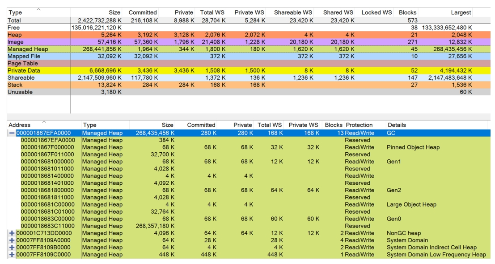

至此，您已经了解了与 .NET 内存管理相关的诸多主题——包括对 .NET 垃圾回收器 (Garbage Collector, GC) 工作原理的全面描述。其他重要主题也有所涉及，例如借助终结 (finalization) 和可释放对象 (disposable objects) 进行资源管理、各种类型的句柄 (handles)、结构体 (structs) 的使用、多种诊断场景以及相关的实用建议。现在，您应该对内存管理这个主题感到相当得心应手了，尽管知识量可能有点令人应接不暇：如有需要，请随时回顾本书的任何部分。

那么，还剩下什么呢？确实不多了。在本章中，我们将介绍一些与 GC 相关的编程 API。这些 API 可在代码的不同层级使用，提供不同级别的灵活性。我们认为这是本书结尾的一个好主题。既然您或多或少理解了 GC 的运作方式，现在可以看看如何从代码中控制和测量它了。我们将从回顾早已熟知的 `GC` 类开始，主要是作为参考，因为其中大部分可用方法在本书各处已有所使用。最后，我们将解释如何使用强大的库 ClrMD 和 TraceEvent 来构建您自己的监控和诊断工具箱。作为精华所在，还将简要介绍将整个 GC 替换为您自定义 GC 的可能性。

# GC API

静态 `GC` 类及其方法在之前的章节中已经使用过。在此，我们想简要总结它们的用法，并展示那些尚未提及或描述不够详细的细微可能性。为避免重复，如果特定方法的使用示例已在书中出现，我们会提供相应章节的参考。所有方法都按功能分组，作为小节呈现。此外，除了 `GC` 类本身，还会介绍一些完美契合整个“GC API”主题的其他方法和类型。

## 回收数据与统计信息

第一组包含提供有关 GC 配置、状态以及内存消耗统计信息的属性和方法。

好的，这是对您提供的关于 `GC.GetConfigurationVariables()` 方法及其相关配置信息的中文翻译：

### GC.GetConfigurationVariables()

可以通过环境变量或运行时设置来配置垃圾回收器 (GC)。此方法以键/值对的形式列出这些设置。键对应于 `GCConfig` 类的内部字段名，而非环境变量名：您可以在 `.\src\coreclr\gc\gcconfig.h` 文件中找到映射关系，如清单 15-1 所示。

清单 15-1.  gcconfig.h 中的 GC 配置变量示例

```c++
#define GC_CONFIGURATION_KEYS \
BOOL_CONFIG (ServerGC, "gcServer", "System.GC.Server", false, "Whether we should be using Server GC")  \
BOOL_CONFIG (ConcurrentGC, "gcConcurrent", "System.GC.Concurrent", true, "Whether we should be using Concurrent GC")  \
```

第一列是键，即该方法返回的名称。第二列是环境变量名的后缀，该环境变量需以 `DOTNET_` 为前缀（例如，`ServerGC` 对应的环境变量是 `DOTNET_gcServer`）。第三列是可在运行时设置中使用的 GC 属性名称。第四列是默认值。最后一列解释了该配置的含义和用法。`GC.GetConfigurationVariables()` 仅列出具有对应 GC 属性的配置变量（不知为何，排除了 `GCLOHThreshold` 设置）。

因此，一个打印所有返回配置变量的简单代码（在 .NET 8 环境下）：

```csharp
foreach (var pair in GC.GetConfigurationVariables())
    Console.WriteLine($"{pair.Key} = {pair.Value}");
```

可能返回如下结果：

```markdown
ServerGC = True
ConcurrentGC = True
RetainVM = False
NoAffinitize = False
GCCpuGroup = False
GCLargePages = False
HeapCount = 8
MaxHeapCount = 0
GCHeapAffinitizeMask = 0
GCHeapAffinitizeRanges =
GCHighMemPercent = 0
GCHeapHardLimit = 0
GCHeapHardLimitPercent = 0
GCHeapHardLimitSOH = 0
GCHeapHardLimitLOH = 0
GCHeapHardLimitPOH = 0
GCHeapHardLimitSOHPercent = 0
GCHeapHardLimitLOHPercent = 0
GCHeapHardLimitPOHPercent = 0
GCConserveMem = 0
GCName =
GCDynamicAdaptationMode = 0
```

请注意，未设置的配置项会输出其默认值。

### GC.MaxGeneration

该属性返回当前.NET垃圾回收器（GC）实现的代数。在需要遍历所有可用代数（避免硬编码数字2）的代码中非常有用——例如通过连续调用 `GC.CollectionCount` 方法（如下所示），或使用 `GC.GetGeneration` 方法检查对象是否已处于最老代（后续也会展示此类用法）。请注意，该属性当前值为2，因为最老代（第2代）和大对象堆（LOH）被视为同一代（在完全GC时一起回收）。

### GC.CollectionCount(Int32)

该方法返回程序启动以来特定代数垃圾回收的次数。传入的代数值不应小于0，也不应大于 `GC.MaxGeneration` 的返回值。注意该计数具有包含性——若第1代被回收，则第0代和第1代的计数器都会递增。因此代码清单15-2将产生如清单15-3所示的输出结果（每次年轻代的回收计数都包含更老代的回收）。

清单15-2 `GC.CollectionCount` 方法使用示例

```csharp
GC.Collect(0);   
Console.WriteLine($"{GC.CollectionCount(0)} {GC.CollectionCount(1)} {GC.CollectionCount(2)}");   
GC.Collect(1);   
Console.WriteLine($"{GC.CollectionCount(0)} {GC.CollectionCount(1)} {GC.CollectionCount(2)}");   
GC.Collect(2);   
Console.WriteLine($"{GC.CollectionCount(0)} {GC.CollectionCount(1)} {GC.CollectionCount(2)}");  
```

清单15-3 清单15-2代码输出结果

```markdown
1 0 0  
2 1 0  
3 2 1  
```

该方法可用于应用程序内部诊断和日志记录。最常见的用途可能是实现“智能”显式GC调用——仅当GC未自动触发时才执行（如清单15-4所示）。这种方式能减少主动触发GC的代码量（可回顾第7章关于显式调用GC的讨论）。也可通过定期检查各代数计数器来检测新发生的GC，从而创建类似“回调”的机制（若检测粒度足够小）。

清单15-4 根据上次检查后是否发生GC来决定是否显式触发

```csharp
if (lastGen2CollectionCount == GC.CollectionCount(2))  
{ 
    GC.Collect(2); 
}  
lastGen2CollectionCount = GC.CollectionCount(2);  
```

### GC.GetGeneration

该方法返回给定对象所属的代。对于托管堆上的有效对象，返回值介于0到 `GC.MaxGeneration` 之间。

典型应用是创建代感知的缓存策略。例如需要创建固定对象池时：在.NET 5+版本中应直接在POH（固定对象堆）中分配，但对于旧版本，最好重用已进入最老代的对象——这些对象很可能驻留在专属于第2代的内存段中。假设对象固定时间较短，在第2代专用段执行固定影响更小，因为此期间发生完全GC的概率更低。

通过 `GC.GetGeneration` 方法可实现此类对象池：维护一个“已老化”对象列表（优先从池中租用）和年轻对象列表（预期它们会随时间老化）。清单15-5展示了该池的雏形实现：当调用 `Rent` 方法时，首先检查已老化对象；若不存在则检查年轻对象（`RentYoungObject` 方法）；若仍无可用对象则通过工厂方法新建。调用 `Return` 方法归还对象时，通过 `GC.GetGeneration` 检查对象“年龄”并存入相应集合。此外借助第12章介绍的 `Gen2GcCallback` 类，在每次完全GC后执行维护操作——将刚进入最老代的对象从年轻集合迁移到老化集合。

清单15-5 `PinnableObjectPool` 雏形实现（优先提供最老代对象）

```csharp
public class PinnableObjectPool<T> where T : class  
{
    private readonly Func<T> factory;
    private ConcurrentStack<T> agedObjects = new ConcurrentStack<T>();
    private ConcurrentStack<T> notAgedObjects = new ConcurrentStack<T>();

    public PinnableObjectPool(Func<T> factory) 
    {
        this.factory = factory;
        Gen2GcCallback.Register(Gen2GcCallbackFunc, this);
    }

    public T Rent() 
    {
        if (!agedObjects.TryPop(out T result)) 
            RentYoungObject(out result);
        return result;
    }

    public void Return(T obj) 
    {
        if (GC.GetGeneration(obj) < GC.MaxGeneration)
            notAgedObjects.Push(obj);
        else
            agedObjects.Push(obj);
    }

    private void RentYoungObject(out T result) 
    {
        if (!notAgedObjects.TryPop(out result)) 
            result = factory();
    }

    private static bool Gen2GcCallbackFunc(object targetObj) 
    {
        ((PinnableObjectPool<T>)targetObj).AgeObjects();
        return true;
    }

    private void AgeObjects() 
    {
        List<T> notAgedList = new List<T>();
        foreach (var candidateObject in notAgedObjects)
        {
            if (GC.GetGeneration(candidateObject) == GC.MaxGeneration)
                agedObjects.Push(candidateObject);
            else
                notAgedList.Add(candidateObject);
        }
        notAgedObjects.Clear();
        foreach (var notAgedObject in notAgedList)
            notAgedObjects.Push(notAgedObject);
    }
}
```

出于简洁考虑，该实现省略了缓存清理和多线程同步（特别是 `AgeObjects` 方法）等关键逻辑。但请注意：在.NET新版本中应直接使用POH而非此类对象池。

> 如第12章所述，.NET基础库(CoreFX)中的 `PinnableBufferCache` 类是该模式的真实实现，包含缓存清理、多线程访问优化等完整实现。强烈建议仔细研究这个类的源码，它是本书讨论的诸多概念的绝佳范例。

若向 `GetGeneration` 方法传递无效对象，返回值是未定义的（如清单15-6）——当前.NET实现会返回-`int.MaxValue`（假设不属于临时段的对象都在非GC堆中），而旧版本可能返回2。

清单15-6 向 `GC.GetGeneration` 传递栈分配无效对象

```csharp
UnmanagedStruct us = new UnmanagedStruct { Long1 = 1, Long2 = 2 };
int gen = GC.GetGeneration(Unsafe.As<UnmanagedStruct, object>(ref us));
Console.WriteLine(gen);
/* 输出：
2147483647
*/
```

### GC.GetTotalMemory

该方法返回所有代中正在使用的字节总数（不包括内存碎片），即托管堆上所有托管对象的总大小。若未事先触发显式垃圾回收（GC），该数值还会包含已不可达的“死亡”对象所占内存[1]。如第12章所述（参见代码清单12-10），需特别注意：当 `forceFullCollection` 参数设为 `true` 时，此方法可能极其耗时——最坏情况下会触发20次完全阻塞式GC以获取稳定结果！

`GetTotalMemory` 方法通常用于诊断和日志记录场景，在各种单元测试和实验中颇受欢迎。但若需追踪测试期间的内存分配情况，后文将介绍的 `GC.GetAllocatedBytesForCurrentThread` 是更优选择。

此外，若计划将此方法用于基于内存阈值的流程控制（例如当内存使用量超过限定值时限制Web请求），务必谨慎。由于该方法未计入内存碎片和段/区域管理的总体开销（如预先提交内存段页面），其测量结果并不能准确反映整体内存压力。此类场景建议改用 `Process` 类提供的全局内存测量指标。代码清单15-7的简单"Hello world"示例清晰展示了这种差异（结果参见代码清单15-8）：GC堆中的对象约占用600kB内存，而整个进程的专用内存使用量高达9MB（虚拟内存显然更大，相关内存分类详见第2章）。

代码清单15-7 使用 `GC.GetTotalMemory` 与 `Process` 类多种内存测量方法

```csharp
static void Main(string[] args)   
{ 
    Console.WriteLine("Hello world!"); 
    var process = Process.GetCurrentProcess(); 
    Console.WriteLine($"{process.PrivateMemorySize64:N0}"); 
    Console.WriteLine($"{process.WorkingSet64:N0}"); 
    Console.WriteLine($"{process.VirtualMemorySize64:N0}"); 
    Console.WriteLine($"{GC.GetTotalMemory(true):N0}"); 
    Console.ReadLine();   
}  
```

代码清单15-8 代码清单15-7的运行结果

```markdown
Hello world!  
11,165,696  
28,766,208  
2,480,842,821,632  
87,688  
```

即使托管堆占用的内存也显著大于其中对象的总大小（见图15-1）。GC段提交的内存达280kB，而代码清单15-8显示的结果仅约85kB——这种差异主要源于未计入内存碎片。通过WinDbg的SOS扩展命令 `!heapstat` 可以验证这一点（见代码清单15-9），其中空闲空间总量可被轻松计算出来。



图15-1 代码清单15-7程序的VMMAP视图（暂停在最后一行时捕获）

代码清单15-9 代码清单15-7程序的 `HeapStat` SOS命令执行结果

```
> !heapstat -inclUnrooted
Heap Gen0 Gen1 Gen2 LOH POH FRZ
Heap0 57488 0 58552 0 32712
Total 57488 0 58552 0 32712
Free space:
Heap Gen0 Gen1 Gen2 LOH POH FRZ
Heap0 3640 0 3576 0 0 SOH:6% POH:0%
Total 3640 0 3576 0 0
Unrooted objects:
Heap Gen0 Gen1 Gen2 LOH POH FRZ
Heap0 494 0 40 0 0 SOH:0% POH:0%
Total 494 0 40 0 0
Committed space:
Heap Gen0 Gen1 Gen2 LOH POH FRZ
Heap0 69632 69632 69632 4096 69632
Total 69632 69632 69632 4096 69632
```

> 遗憾的是，若要通过编程方式获取"Working Set – Private"值，您需要使用 `PerformanceCounter` 类并读取自身进程的性能计数器数据。自.NET 5起，开发者已能通过编程获取包含碎片化在内的托管堆总大小（参见本章后续"GC.GetGCMemoryInfo"章节）。此外，也可通过 ClrMD 或本章介绍的基于ETW的TraceEvent库获取这些详细信息。

### GC.GetTotalAllocatedBytes

该方法自.NET Core 3.0引入，返回进程启动以来所有托管堆（小对象堆和大对象堆）中累计分配的字节总数。当 `precise` 布尔参数设为 `true` 时，方法会扣除各线程当前分配上下文中尚未使用的部分，从而返回更精确的数值。但此操作需要挂起线程，因此会对应用程序性能产生影响。常规GC内存消耗数值具有分配上下文的粒度特征。

### GC.GetCurrentThreadAllocatedBytes

该方法返回当前线程迄今为止分配的总字节数。这是一个持续增长的累计值，无论对象是否存活都会被统计。由于仅针对当前线程，无法查询其他线程的分配情况，其实现因此高效直接（如代码清单15-10所示）：该方法累加先前分配上下文中已分配的字节数，以及当前分配上下文中已消耗的部分（详见第5章关于分配上下文的详细说明）。

代码清单15-10 .NET中 `GC.GetCurrentThreadAllocatedBytes` 方法的实现

```
FCIMPL0(INT64, GCInterface::GetAllocatedBytesForCurrentThread)
{
    ...
    INT64 currentAllocated = 0;
    Thread *pThread = GetThread();
    gc_alloc_context* ac = pThread->GetAllocContext();
    currentAllocated = ac->alloc_bytes + ac->alloc_bytes_uoh - (ac->alloc_limit - ac->
    alloc_ptr);
    return currentAllocated;
}
FCIMPLEND
```

该特性适用于隔离的单元测试或分配实验（参见代码清单15-11）。其线程隔离特性可提供清晰且可复现的结果。请勿使用 `GC.GetTotalMemory` 方法，因其测量的是内存使用总量而非累计分配量。

代码清单15-11 单元测试中使用 `GC.GetCurrentThreadAllocatedBytes` 的示例

```c#
[Fact]
public void SampleTest()
{
    string input = "Hello world!";
    var startAllocations = GC.GetAllocatedBytesForCurrentThread();
    ReadOnlySpan<char> span = input.AsSpan().Slice(0, 5);
    var endAllocations = GC.GetAllocatedBytesForCurrentThread();
    Assert.Equal(startAllocations, endAllocations);
    Assert.Equal("Hello", span.ToString());
}
```

需注意该方法在.NET Core 2.1中引入，.NET Framework 4.8开始支持。.NET Framework还通过 `AppDomain` 类提供了另一种内存测量方式：

- `MonitoringTotalAllocatedMemorySize`：返回应用域累计分配的字节总数，原理类似 `GC.GetCurrentThreadAllocatedBytes` 但作用于 `AppDomain` 级别。每次分配上下文变更时更新（可能比GC更频繁），因此具有分配上下文粒度的精度（仅精确到几KB）。
- `MonitoringSurvivedMemorySize`：返回上次GC后存活对象占用的字节总数。仅在完全GC后保证精确，虽然会更频繁更新但精确度较低。

当前分配测量方法的差异导致编写同时兼容.NET Standard、.NET Core和.NET Framework的代码存在困难。例如BenchmarkDotNet库通过为不同场景选择最优解（最精确方法）来解决该问题，如代码清单15-12所示。

代码清单15-12 BenchmarkDotNet的 `GcStats` 类片段（被 MemoryDiagnoser 使用）

```c#
public struct GcStats : IEquatable<GcStats>
{
    #if !NET6_0_OR_GREATER
    private static readonly Func<long> GetAllocatedBytesForCurrentThreadDelegate =
    CreateGetAllocatedBytesForCurrentThreadDelegate();
    private static readonly Func<bool, long> GetTotalAllocatedBytesDelegate =
    CreateGetTotalAllocatedBytesDelegate();
    #endif
    private static Func<long> CreateGetAllocatedBytesForCurrentThreadDelegate()
    {
        // this method is not a part of .NET Standard so we need to use reflection
        var method = typeof(GC).GetTypeInfo().GetMethod("GetAllocatedBytesForCurrentThread",
        BindingFlags.Public | BindingFlags.Static);
        // we create delegate to avoid boxing, IMPORTANT!
        return method != null ? (Func<long>)method.CreateDelegate(typeof(Func<long>)) : null;
    }
    private static Func<bool, long> CreateGetTotalAllocatedBytesDelegate()
    {
        // this method is not a part of .NET Standard so we need to use reflection
        var method = typeof(GC).GetTypeInfo().GetMethod("GetTotalAllocatedBytes",
        BindingFlags.Public | BindingFlags.Static);
        // we create delegate to avoid boxing, IMPORTANT!
        return method != null ? (Func<bool, long>)method.CreateDelegate(typeof(Func<bool,
        long>)) : null;
    }
    private static long? GetAllocatedBytes()
    {
        ...
        // "This instance Int64 property returns the number of bytes that have been allocated by a specific
        // AppDomain. The number is accurate as of the last garbage collection." - CLR via C#
        // so we enforce GC.Collect here just to make sure we get accurate results
        GC.Collect();
        if (RuntimeInformation.IsFullFramework) // it can be a .NET app consuming our .NET Standard package
        	return AppDomain.CurrentDomain.MonitoringTotalAllocatedMemorySize;
        #if NET6_0_OR_GREATER
        return GC.GetTotalAllocatedBytes(precise: true);
        #else
        if (GetTotalAllocatedBytesDelegate != null) // it's .NET Core 3.0 with the new API available
        	return GetTotalAllocatedBytesDelegate.Invoke(true); // true for the "precise" argument
        // https://apisof.net/catalog/System.GC.GetAllocatedBytesForCurrentThread() is not part of the .NET Standard, so we use reflection to call it..
        return GetAllocatedBytesForCurrentThreadDelegate.Invoke();
        #endif
    }
    ...
}
```

### GC.GetGCMemoryInfo

此前方法中缺失的是获取触发或诱导GC效率评估的能力。如本书所示，您可以使用PerfView及其GCStats视图基于GC发出的事件来获取这些信息。

GC会在每次回收前后记录大量统计信息，如碎片字节数、提升字节数、暂停持续时间等。自.NET Core 3.0起， `GC.GetGCMemoryInfo` 方法成为访问这些细节的首选方式。在.NET 5中，通过 `GCKind` 枚举参数可以查询最近一次GC的详情（包括短暂代GC（gen0或gen1）、完全阻塞式GC（阻塞式gen2）或后台GC（始终为gen2））。

代码清单15-13展示了在诱导GC后显示返回的 `GCMemoryInfo` 结构体各字段的方法，结果见清单15-14。

清单15-13  显示 `GCMemoryInfo` 字段的方法

```c#
GC.Collect(2, GCCollectionMode.Aggressive);
GCMemoryInfo info = GC.GetGCMemoryInfo(GCKind.Any);
if (info.Index != 0)
{
    Console.Write("#{info.Index} 是第{info.Generation}代");      
    if (info.Compacted) { 
        Console.Write(" 压缩式"); 
    }      
    if (info.Concurrent) { 
        Console.Write(" 并发式"); 
    }      
    Console.WriteLine();      
    Console.WriteLine("高内存阈值 = {info.HighMemoryLoadThresholdBytes}");
    Console.WriteLine("高内存负载=info.MemoryLoadBytes");
    Console.WriteLine("堆大小字节数 = {info.HeapSizeBytes}");
    Console.WriteLine("提升字节数=info.PromotedBytes");
    Console.WriteLine("碎片字节数 = {info.FragmentedBytes}");
    Console.WriteLine("已提交字节数=info.TotalCommittedBytes");
    Console.WriteLine("总可用字节数 = {info.TotalAvailableMemoryBytes}");
    Console.WriteLine("固定对象数=info.PinnedObjectsCount");
    Console.WriteLine("待终结对象数 = {info.FinalizationPendingCount}");
    Console.WriteLine("暂停时间占比 = {info.PauseTimePercentage}");      
    foreach (var pause in info.PauseDurations)      
    {          
        if (pause.TotalNanoseconds > 0)  // 不显示无暂停阶段          
        { 
            Console.WriteLine(" {pause.TotalMicroseconds} 微秒"); 
        }
    }
    for (int gen = 0; gen < info.GenerationInfo.Length; gen++)
    {
    	var genInfo = info.GenerationInfo[gen];
        if (gen == 4) 
        { 
            Console.WriteLine("POH"); 
        }
        else if (gen == 3) { 
            Console.WriteLine("LOH"); 
        }
        else { 
            Console.WriteLine($"第{gen}代"); 
        }
        Console.WriteLine($" 回收前碎片 = {genInfo.FragmentationBeforeBytes}");  
        Console.WriteLine($" 回收后碎片 = {genInfo.FragmentationAfterBytes}");  
        Console.WriteLine($" 回收前大小 = {genInfo.SizeBeforeBytes}");  
        Console.WriteLine($" 回收后大小 = {genInfo.SizeAfterBytes}");  
    }  
}
```

`Index` 字段为0表示尚未发生GC，此时不应使用其他字段。与PerfView GCStats中"Pause MSec"列显示的合并暂停值不同，这里能获取应用程序线程被挂起的每个阶段持续时间：阻塞式GC会暂停一次，后台GC会暂停两次。`PauseDurations` 字段始终包含2个值，因此需要忽略持续时间为0纳秒的那个。

`GenerationInfo` 字段可获取每次GC前后各“代”的碎片/大小信息。其中0表示gen0，1表示gen1，2表示gen2，3表示大对象堆(LOH)，4表示固定对象堆(POH)。这与 `GCMemoryInfo` 的 `Generation` 字段（取值0/1/2）有所不同。

清单15-14  GC后 `GCMemoryInfo` 字段内容

```
#3 is gen2 compacting
High Mem threshold = 61582189363
High Mem load = 37633560166
Heap Size bytes = 125112
Promoted bytes = 124992
Fragmented bytes = 120
Committed bytes = 139264
Total Avail. bytes = 68424654848
Pinned obj count = 1
Finalization pend = 1
Pause time % = 0.01
126 micro seconds
Gen 0
    Fragmentation before = 11464
    Fragmentation after = 0
        Size before = 49384
        Size after = 0
Gen 1
    Fragmentation before = 0
    Fragmentation after = 72
        Size before = 0
        Size after = 37376
Gen 2
    Fragmentation before = 3576
    Fragmentation after = 48
        Size before = 58552
        Size after = 55024
LOH
    Fragmentation before = 0
    Fragmentation after = 0
        Size before = 0
        Size after = 0
POH
	Fragmentation before = 0
	Fragmentation after = 0
        Size before = 32712
        Size after = 32712
```

.NET 8为 `GCMemoryInfo.PauseTimePercentage` 属性新增了 `GC.GetTotalPauseDuration` 方法：可获取自进程开始以来的总暂停时间（毫秒）。

### GC.KeepAlive

`GC.KeepAlive` 是一个通过影响生成的GC信息来延长栈根存活期的方法，它能确保指定参数至少在该方法调用行之前保持可达状态。本书第8章（见代码清单8-16和8-17）详细讨论了该方法的用途和意义，其他章节的多个示例中也曾使用过该方法。

### GCSettings.LargeObjectHeapCompactionMode

将此属性设置为 `GCLargeObjectHeapCompactionMode.CompactOnce` 值时，即明确要求在下一次完全阻塞GC发生时压缩大对象堆（LOH）。第10章“场景10-1——大对象堆碎片化”一节中详细描述了该设置的使用方法和性能影响。

### GCSettings.LatencyMode

通过设置此属性可以控制GC的延迟模式，从而调节GC的并发性，并启用 `LowLatency`（低延迟）或 `SustainedLowLatency` （持续低延迟）等附加模式。第11章详细介绍了各种延迟模式的使用场景，并阐述了应如何选择合适的模式。

### GCSettings.IsServerGC

该属性指示CLR是否以服务器GC模式启动（参见第11章）。请注意这是只读属性，因为运行时启动后无法更改GC模式。结合指针大小（表示进程位数）和处理器数量，这些诊断数据建议在应用程序启动时记录（见代码清单15-15）。

代码清单15-15 获取基础诊断数据的示例

```csharp
Console.WriteLine("{0} on {1}-bit with {2} CPUs", 
    (GCSettings.IsServerGC ? "Server" : "Workstation"),
    (IntPtr.Size == 8) ? 64 : 32,
    Environment.ProcessorCount);
```

## GC通知机制

GC API中包含关于完全阻塞GC临近通知的功能。这种需求主要源于.NET 4.5之前的时代，当时服务器GC只有非并发的阻塞版本。由于此类GC可能耗时较长，预判其发生就非常有用。典型应用场景是通知负载均衡器暂时将该服务器实例标记为不可用，直到完全阻塞GC结束。如今随着Web应用大多运行在后台GC模式（暂停时间显著缩短），GC通知的重要性已大幅降低。此外，只有阻塞式垃圾回收会触发此类通知——若启用并发配置，后台垃圾回收将不会发送通知。

通知API包含以下方法：

- `GC.RegisterForFullGCNotification(int maxGenerationThreshold, int largeObjectHeapThreshold)`：注册GC通知，当第2代堆或LOH分配预算使用率达到指定阈值时触发。微软文档特别说明：“请注意该通知并不保证一定会发生完全GC，仅表示满足可能触发完全GC的阈值条件”。若阈值设置过高，会产生大量未实际触发GC的误报通知；若设置过低，则可能漏判真实发生的GC。
- `GC.CancelFullGCNotification`：取消GC通知机制。
- `GC.WaitForFullGCApproach`：阻塞调用线程直至GC临近通知（含指定超时参数的重载方法）。
- `GC.WaitForFullGCComplete`：阻塞调用线程直至完全GC完成（同样含指定超时参数的重载方法）。

代码清单15-16展示了GC通知的典型用法：通过专用线程轮询GC通知，并在发生时执行相应操作。

```csharp
GC.RegisterForFullGCNotification(10, 10);
Thread startpolling = new Thread(() => 
{
    while (true) 
    {
        GCNotificationStatus s = GC.WaitForFullGCApproach(1000);
        if (s == GCNotificationStatus.Succeeded) 
        {
            Console.WriteLine("GC is about to begin");
            // ...响应完全GC，例如调用代码将当前服务器从负载均衡器移除
        } 
        else if (s == GCNotificationStatus.Timeout) continue;

        s = GC.WaitForFullGCComplete(10_000);
        if (s == GCNotificationStatus.Succeeded) 
        {
            Console.WriteLine("GC has ended");
        } 
        else if (s == GCNotificationStatus.Timeout) 
            Console.WriteLine("GC took alarming amount of time");
    }
});
startpolling.Start();
// ...
GC.CancelFullFullGCNotification();
```

需要强调的是，该API本质上具有不确定性——因为您要求GC预测未来行为。因此需要通过实际工作负载实验来确定 `GC.RegisterForFullGCNotification` 的合适参数值。

> 虽然有人可能对必须猜测 `RegisterForFullGCNotification` 阈值感到不满，但目前确实没有更好的替代方案。真实场景中的工作负载始终动态变化，难以精确预测。通过调整阈值参数至少能帮助您适应典型工作负载模式。

## 控制非托管内存压力

通过调用以下方法，您可以告知垃圾回收器（GC）某些托管对象正在持有（或释放）一定量的非托管内存（这些内存对GC不可见）：

- `GC.AddMemoryPressure(Int64)`
- `GC.RemoveMemoryPressure(Int64)`

自上次GC以来的净内存压力（即添加量减去移除量）会与预算值进行比较以触发GC。该预算初始值为4MB，并会根据最近三次GC期间添加/移除的内存压力以及当前托管堆大小动态调整。此方法的各种使用场景详见第7章“场景7-3——分析显式GC调用”以及第12章的代码清单12-3。

```c#
public class LargeUnmanagedResource : IDisposable
{
    private IntPtr unmanagedPtr;
    private readonly long size;
    
    public LargeUnmanagedResource(long size)
    {
        this.size = size;
        unmanagedPtr = Marshal.AllocHGlobal((int)size);
        
        // 告诉GC我们分配了额外的内存
        GC.AddMemoryPressure(size);
    }
    
    public void Dispose()
    {
        if (unmanagedPtr != IntPtr.Zero)
        {
            Marshal.FreeHGlobal(unmanagedPtr);
            // 成对调用
            GC.RemoveMemoryPressure(size);
            unmanagedPtr = IntPtr.Zero;
        }
    }
}
```

> 注意：如果默认实现效果不佳，您也可以自行实现类似的机制。

## 显式垃圾回收

显式调用GC的功能已在第7章详细阐述。更多细节请参阅该章“显式触发”一节以及“场景7-3——分析显式GC调用”。为完整起见，以下是用于触发显式回收的GC方法重载列表：

- Collect()
- Collect(int generation)
- Collect(int generation, GCCollectionMode mode)
- Collect(int generation, GCCollectionMode mode, bool blocking)
- Collect(int generation, GCCollectionMode mode, bool blocking, bool compacting)

## 无GC区域

可通过以下方法创建和管理禁止GC执行的代码区域：

- GC.TryStartNoGCRegion(long totalSize)
- GC.TryStartNoGCRegion(long totalSize, bool disallowFullBlockingGC)
- GC.TryStartNoGCRegion(long totalSize, long lohSize)
- GC.TryStartNoGCRegion(long totalSize, long lohSize, bool disallowFullBlockingGC)
- GC.EndNoGCRegion()
- GC.RegisterNoGCRegionCallback(long totalSize, Action callback)

这些方法的使用说明和示例详见第11章“无GC区域”一节。

## 终结器管理

以下三个方法可用于控制终结行为：

- GC.ReRegisterForFinalize(object obj)
- GC.SuppressFinalize(object obj)
- GC.WaitForPendingFinalizers()

具体内容详见第12章。

## 内存使用

处理 `OutOfMemoryException` 非常棘手，尤其是在重要业务流程中发生时。为主动规避这种情况，可使用 `MemoryFailPoint` 类在执行关键操作前预先确保内存充足。请注意该API无法完全避免 `OutOfMemoryException` ，仅作为最佳努力方案。

使用方式简单直接（见代码清单15-17）。当可用内存不足时，`MemoryFailPoint` 构造函数会抛出 `InsufficientMemoryException`。由于多线程使用需要内部簿记，`MemoryFailPoint` 实现了 `IDisposable` 接口，因此需调用 `Dispose` 方法（或使用 `using` 语句）。

代码清单15-17 `MemoryFailPoint` 简单示例

```c#
try
{
    using (MemoryFailPoint failPoint = new MemoryFailPoint(sizeInMegabytes: 1024))
    {
    // 执行计算
    }
}
catch (InsufficientMemoryException e)
{
    Console.WriteLine(e);
    throw;
}
```

> 重要提示：目前仅基于Windows的运行时实现了该类的功能。在其他系统上，`MemoryFailPoint` 构造函数总会执行成功。

当前Windows实现中，`MemoryFailPoint` 通过以下步骤检查托管内存分配的可行性：

- 检查虚拟地址空间是否充足——64位程序因巨大的地址空间通常总能满足；即使32位应用程序，也很难想象需要一次性分配超过32位地址空间的内存。
- 显式调用完全、阻塞式、压缩式GC以最大限度释放未使用段并压缩托管内存。
- 检查是否有足够空闲虚拟内存。
- 检查是否需要扩展OS页面文件来满足内存需求。
- 检查是否有足够连续虚拟空闲地址空间来创建GC段（如需）。

> 强烈建议关注进程空闲内存空间管理的开发者阅读 `MemoryFailPoint` 类源码。其内部通过 Win32 API 的 `CheckForAvailableMemory` 方法获取当前可用内存，通过 `VirtualQuery` 调用查找连续空闲虚拟地址区域（`MemFreeAfterAddress`方法），并通过 `GetSystemInfo` 获取地址空间大小（`GetTopOfMemory`方法）。内部静态方法 `GC.GetSegmentSize` 用于返回GC段大小（即LOH区域大小）。
>
> 通过反射可获取段大小信息（但请注意未来版本可能改变实现细节）：
>
> ```c#
> var mi = typeof(GC).GetMethod("GetSegmentSize", BindingFlags.Static | BindingFlags.NonPublic);
> var segmentSize = (ulong)mi.Invoke(null, null);
> ```

## 内存限制

如第11章所述，可以通过环境变量或运行时设置对GC（垃圾回收器）施加内存限制。自.NET 8起，还可以在运行时以编程方式设置或调整这些限制。第一种使用场景是在无法完全控制的环境中运行程序。例如，当环境通过.NET运行时无法识别的方式设定限制时（如AWS Lambda执行环境通过 `AWS_LAMBDA_FUNCTION_MEMORY_SIZE` 环境变量设置内存限制），可以在应用程序启动时添加代码读取该限制并转换为.NET运行时可识别的配置。另一种更高级的场景是全天动态调整内存限制，例如在特定时段降低限制，以便为机器上其他程序腾出更多内存。

可动态调整的限制包括：

- `GCHeapHardLimit`：所有堆内存总量的绝对上限。
- `GCHeapHardLimitPercent`：所有堆内存总量占物理内存的百分比上限。
- `GCHeapHardLimitSOH`：小对象堆（SOH）的绝对上限。
- `GCHeapHardLimitLOH`：大对象堆（LOH）的绝对上限。
- `GCHeapHardLimitPOH`：固定对象堆（POH）的绝对上限。
- `GCHeapHardLimitSOHPercent`：SOH占物理内存的百分比上限。
- `GCHeapHardLimitLOHPercent`：LOH占物理内存的百分比上限。
- `GCHeapHardLimitPOHPercent`：POH占物理内存的百分比上限。

调整方法：首先通过静态类 `AppContext` 设置新值，然后调用 `GC.RefreshMemoryLimit()` 通知垃圾回收器。如代码清单15-18所示：

```csharp
AppContext.SetData("GCHeapHardLimitPercent", 50UL);  
GC.RefreshMemoryLimit();
```

注意：数值必须以 `ulong` 类型提供（如代码中的 `UL` 后缀所示），使用其他数据类型会导致设置被静默忽略。若设置过低限制， `GC.RefreshMemoryLimit()` 会抛出 `InvalidOperationException`。大多数无效的组合限制（例如SOH、LOH和POH百分比总和超过100%）也会触发异常，但无效的 `GCHeapHardLimitPercent` 值会被静默忽略。

## GC类的内部调用机制

 GC静态类本质上是运行时本地方法实现的封装层。如代码清单15-19所示，大多数方法标记为 `InternalCall` 特性，这些方法在.NET源码 `coreclr/vm/ecalllist.h` 文件中映射到对应的运行时方法（见代码清单15-20）。例如 `GetGeneration` 方法最终通过 `gc.cpp` 文件中的 `GCHeapUtilities::GetGCHeap()->WhichGeneration` 实现（见代码清单15-21）。

代码清单15-19（GC类部分实现）：

```csharp
public static class GC {
    [MethodImplAttribute(MethodImplOptions.InternalCall)] 
    public static extern int GetGeneration(Object obj);
}
public static class GCSettings {
    public static bool IsServerGC { 
        [MethodImplAttribute(MethodImplOptions.InternalCall)] get; 
    }
}
```

代码清单15-20（运行时接口映射）：

```markdown
FCFuncStart(gGCInterfaceFuncs)
    FCFuncElement("GetGeneration", GCInterface::GetGeneration)
FCFuncEnd()
FCFuncStart(gGCSettingsFuncs)
    FCFuncElement("get_IsServerGC", SystemNative::IsServerGC)
FCFuncEnd()
```

代码清单15-21（运行时方法实现示例）：

```cpp
FCIMPL1(int, GCInterface::GetGeneration, Object* objUNSAFE) {
    FCALL_CONTRACT;
    if (objUNSAFE == NULL) FCThrowArgumentNull(W("obj"));
    int result = (INT32)GCHeapUtilities::GetGCHeap()->WhichGeneration(objUNSAFE);
    FC_GC_POLL_RET();
    return result;
}
FCIMPLEND
```

## 冻结段（Frozen Segments）

有一组你可能不应该使用、但为了完整性我们必须提及的API：冻结段API。目前提供以下两个方法：

- `GC._RegisterFrozenSegment(IntPtr sectionAddress, nint sectionSize)`：接收一块原生内存的地址及其大小，将其注册为冻结段。该API会返回一个句柄。
-  `GC._UnregisterFrozenSegment(IntPtr segmentHandle)`：接收之前调用 `_RegisterFrozenSegment` 返回的句柄，注销关联的冻结段。

这些API专为外部使用设计（BCL从未调用过它们），但被声明为私有方法，必须通过反射调用。这反映了它们的实验性质，同时也是一种门槛机制，确保没有人会在不了解其风险的情况下贸然使用。

那么，什么是冻结段？本书前文已用“非GC堆”（NGCH）的名称详细讨论过这一概念。没错，此API允许你将任意一块原生内存注册为NGCH的一部分，实际上是唯一“受支持”的在该堆中分配对象的方式。换句话说，你可以用它将托管对象存储到非托管内存中。

重申一下，GC会忽略NGCH。存储在该堆中的对象在垃圾回收期间永远不会被扫描，因此任何外部引用都不会被视为根引用。同样，GC也永远不会释放未被引用的冻结对象，所以你必须完全自行管理这些内存。

为什么需要这种功能？如果你真的使用这个API（再次强烈建议不要这样做），可能是出于性能考虑。假设你的应用程序需要数GB的静态数据，这些数据可以是任何内容，比如缓存或机器学习模型。关键在于数据会一次性加载（在启动时或定期刷新），且无法存储为结构体（通常因为包含指向其他数据的指针）。如果将其放在“普通”托管堆中，应用程序性能会受到两方面负面影响：

- 没有API能直接将对象分配到第2代。即使部分数据可能进入LOH（数组），但大部分会分配在第0代。由于这是长期存在的数据，GC可能需要将数GB数据提升到第1代，再到第2代，这会带来显著开销。
- 数据提升到第2代后问题仍未结束。每次GC执行完全压缩回收时，都必须重新扫描你的数GB数据。这是资源浪费，因为这些数据不会变化。

将数据分配到冻结段可以解决这两个问题。GC永远不会扫描或移动这些数据，因此对应用程序性能的影响微乎其微。

读到此处，你可能在想“太棒了，我要在应用中使用它！”但有个关键问题：.NET是为自动内存管理设计的。系统没有提供在任意位置分配引用对象的现成方法，因此你必须完全手动操作。这需要对.NET类型系统有深刻理解，并将你带入“不安全”的深水区。

举个具体例子，请看代码清单15-22中手动在冻结段分配简单对象所需的操作：

代码清单15-22 在冻结段中手动分配对象

```csharp
public class ObjectWithConstructor   
{ 
    public int Value { get; set; } 
    public ObjectWithConstructor() { Value = 42; }   
}   
public static unsafe void AllocateInFrozenSegment()   
{ 
    const int Size = 1024 * 1024 * 10; // 10MB
    // 分配内存并注册为冻结段
    var nativeMemory = NativeMemory.AlignedAlloc(Size, 8);
    RegisterFrozenSegment((IntPtr)nativeMemory, Size);
    var ptr = (nint*)nativeMemory;
    
    // 预留对象头空间
    ptr++;
    
    // 写入方法表指针
    *ptr = typeof(ObjectWithConstructor).TypeHandle.Value;
    
    // 转换为ObjectWithConstructor实例
    var obj = *(ObjectWithConstructor*)&ptr;
    
    // 调用默认构造函数
    typeof(ObjectWithConstructor).GetConstructor([]).Invoke(obj, null);
    Console.WriteLine(obj.Value); // 输出42
}
```

而这仅仅是冰山一角。当你真正围绕它构建应用程序时，情况会变得更加复杂。例如，要分配下一个对象，你需要知道 `ObjectWithConstructor` 实例在内存中的大小——这意味着需要解析方法表来提取该数据。此外，使用反射调用构造函数很可能开销过大。若涉及数组、字符串或更复杂的类型，则必须完全掌握其内存布局。即便我们专门用一整章来讨论这个主题，恐怕也只能触及皮毛。

若您不顾我们的警告仍想深入探索，建议查阅GitHub上的 https://github.com/microsoft/FrozenObjects 仓库。该仓库包含由 Bing 团队开发的工具，可将对象写入文件并反序列化为冻结内存段。

# ClrMD

`Microsoft.Diagnostics.Runtime` 库（又称ClrMD）是一套用于探查托管进程和内存转储的托管API。它更适用于构建诊断工具和小型代码片段，而非作为进程的自我监控方案（尽管后文将展示这种可能性）。该库提供了与WinDbg的SOS扩展类似的功能，但使用方式更加便捷——开发者可以直接在C#代码中调用。该NuGet包支持.NET Framework和.NET Core应用程序，可分析.NET Framework与.NET Core目标进程。其完整源代码已开源在https://github.com/microsoft/clrmd，您可深入了解实现原理！

由于篇幅所限，本文无法涵盖该库的全部功能。以下示例旨在展示其基础能力和强大特性，既不构成完整教程也不代表全部应用场景。更多信息请参阅ClrMD文档和示例代码（本节示例基于库的第三版）。

使用ClrMD需先创建 `DataTarget` 类实例，可通过以下静态方法获取：

- `AttachToProcess`：通过PID附加到运行中的进程。ClrMD要求目标进程所有线程处于挂起状态，建议将 `suspend` 参数设为 true。若设为false（如源码注释所述），使用者需自行挂起进程——ClrMD不支持探查运行中的进程，强行操作会导致未定义行为。这种模式赋予开发者完全控制权，可灵活管理目标进程状态以最小化性能影响。
- `LoadDump`：加载内存转储文件（当前支持ELF coredump和Windows Minidump格式）。

> 注意：理论上不挂起进程可实现自我监控，但这会带来诸多挑战——例如如何处理进程动态变化的状态、如何在GC和内存分配发生时检查堆等。ClrMD维护者 Lee Culver 并未明确禁止自检，因为某些极端场景可能需要此功能。但正确实现这种功能需要极高技术能力，若遇到问题请视为非支持场景。建议将自检任务委托给子进程处理。

当获取到 `DataTarget` 实例后，即可开始探查目标进程中使用的运行时环境（参见代码清单15-23）。该过程会包含对底层DAC（数据访问组件）的信息获取——这个关键组件负责解析CLR所有的内部数据结构。

代码清单15-23 ClrMD基础用法示例——附加到运行中进程

```c#
using (DataTarget target = DataTarget.AttachToProcess(pid, true))
{ 
    foreach (ClrInfo clrInfo in target.ClrVersions) 
    { 
        Console.WriteLine("发现CLR版本:" + clrInfo.Version.ToString()); // 以下数据用于从符号服务器请求DAC文件: 
        ModuleInfo dacInfo = clrInfo.DacInfo; 
        Console.WriteLine("文件大小:dacInfo.FileSize:X");
        Console.WriteLine("时间戳: {dacInfo.TimeStamp:X}"); 
        Console.WriteLine($"DAC文件: {dacInfo.FileName}"); 
        ClrRuntime runtime = clrInfo.CreateRuntime();
        ...
    }
}
```

通过 `ClrRuntime` 属性可探查CLR的各个组件：

- `AppDomains/SharedDomain/SystemDomain`：从应用域可枚举加载的模块。
- `ThreadPool`：获取CLR线程池详情（包括CPU使用率、活跃/空闲/退役工作线程数）。
- `Threads`：列出应用程序运行中的线程。
- `Heap`：`ClrHeap` 实例是内存分析的入口点。

在深入内存分析前，代码清单15-24演示如何列出所有线程及其调用栈：

代码清单15-24 ClrMD用法示例——列出线程调用栈

```c#
foreach (ClrThread thread in runtime.Threads)
{
    if (!thread.IsAlive) 
        continue; 
    Console.WriteLine("线程 {0:X}:", thread.OSThreadId); 
    foreach (ClrStackFrame frame in thread.EnumerateStackTrace()) 
    {
        Console.WriteLine($"{frame.StackPointer,12:X} {frame.InstructionPointer,12:X} {frame}"); 
    }
    Console.WriteLine();
}
```

还可遍历所有应用域、加载模块及已使用的托管类型（见代码清单15-25）：

代码清单15-25 ClrMD用法示例——列出应用域/模块/加载类型

```c#
foreach (var domain in runtime.AppDomains)
{ 
    Console.WriteLine("应用域 {domain.Name} ({domain.Address:X})"); 
    foreach (var module in domain.Modules) 
    {   
        Console.WriteLine("   模块 {Path.GetFileName(module.Name)} ({(module.IsPEFile ? module.AssemblyName : "")})"); 
        foreach (var (mt, mdToken) in module.EnumerateTypeDefToMethodTableMap()) 
        { 
            var type = runtime.GetTypeByMethodTable(mt); 
            Console.WriteLine($" {type.Name} 字段数: {type.Fields.Length}"); 
        } 
        Console.WriteLine();   
    } 
}
```

> 注意：ClrMD展示的是运行时视角的进程状态，而非代码定义。例如某模块定义了Foo类型但未被进程使用，`EnumerateTypeDefToMethodTableMap` 可能不会返回Foo——这取决于运行时是否加载该类型。该行为属于实现细节，可能随版本变化。

然而，在本书中，我们显然对内存相关信息更感兴趣，因此让我们看看ClrMD能做什么。例如，您可以调查CLR使用的所有内存区域，包括本机堆（参见代码清单15-26和示例结果15-27）。

代码清单15-26 ClrMD用法示例——列出CLR使用的本机堆

```c#
Console.WriteLine("Native Heaps");
foreach (var native in runtime.EnumerateClrNativeHeaps().OrderBy(n => n.MemoryRange.Start))
{
    Console.WriteLine($"   0x{native.MemoryRange.Start:X} (size: {native.MemoryRange.Length,12:N0}) - {native.Kind}");
}
```

代码清单15-27 代码清单15-26的示例结果

```
Native Heaps
0x7FFC4A5B0000 (size: 12,288) - LowFrequencyHeap
0x7FFC4A5B4000 (size: 36,864) - HighFrequencyHeap
0x7FFC4A5BD000 (size: 12,288) - StubHeap
0x7FFC4A5C0000 (size: 24,576) - IndirectionCellHeap
0x7FFC4A5C6000 (size: 36,864) - CacheEntryHeap
0x7FFC4A5CF000 (size: 16,384) - LookupHeap
0x7FFC4A5D3000 (size: 200,704) - DispatchHeap
0x7FFC4A604000 (size: 356,352) - ResolveHeap
0x7FFC4A65B000 (size: 20,480) - VtableHeap
0x7FFC4A660000 (size: 458,752) - LowFrequencyHeap
0x7FFC4A6D0000 (size: 65,536) - HighFrequencyHeap
0x7FFC4A6E0000 (size: 65,536) - FixupPrecodeHeap
0x7FFC4A6F0000 (size: 65,536) - NewStubPrecodeHeap
0x7FFC4A700000 (size: 65,536) - HighFrequencyHeap
0x7FFC4A710000 (size: 65,536) - FixupPrecodeHeap
```

托管堆可以通过 `ClrRuntime` 的 `Heap` 属性获取的 `ClrHeap` 类进行更深入调查。例如，您可以遍历当前存在的所有托管对象，并追踪这些对象的字段和引用（参见代码清单15-28和对应的结果15-29）。

代码清单15-28 ClrMD用法示例——列出某些托管类型实例的引用

```c#
ClrHeap heap = runtime.Heap;
foreach (var clrObject in heap.EnumerateObjects())
{
    if (!clrObject.IsValid) continue;
    if (clrObject.Type.Name.EndsWith("SampleClass"))
    ShowObject(heap, clrObject, string.Empty);
}

private static void ShowObject(ClrHeap heap, ClrObject clrObject, string indent)
{
    string generation = GetGeneration(heap, clrObject);
    Console.WriteLine($"{indent}{clrObject.Type?.Name} | 0x{clrObject.Address:x} - {generation,4}");      
    foreach (var reference in clrObject.EnumerateObjectReferencesWithFields())      
    {          
        Console.Write($"   {reference.Field.Name} :");
        ShowObject(heap, reference, " ");
    }
}

private static string GetGeneration(ClrHeap heap, ClrObject clrObject)
{
    var segment = heap.GetSegmentByAddress(clrObject.Address);
    string gen = "???";
    if (segment != null)
    {
        var generation = segment.GetGeneration(clrObject.Address);
        switch (generation)
        {
            case Generation.Generation0: gen = "gen0"; break;
            case Generation.Generation1: gen = "gen1"; break;
            case Generation.Generation2: gen = "gen2"; break;
            case Generation.Large: gen = "LOH"; break;
            case Generation.Pinned: gen = "POH"; break;
            case Generation.Frozen: gen = "NGC"; break;
        }
    }
    return gen;
}
```

代码清单15-29 代码清单15-28的示例结果

```
CoreCLR.HelloWorld.SampleClass | 0x27337c15e40 - gen0
_another : CoreCLR.HelloWorld.AnotherClass | 0x27337c15e68 - gen0
_someOther : CoreCLR.HelloWorld.SomeOtherClass | 0x27337c15e80 - gen0
_literal : System.String | 0x2b3c9eb2100 -  NGC
```

值得注意的是，`SampleClass` 的字符串字段位于非GC堆（NonGC heap）中。如果您还记得第4章的内容，字符串字面量最终会存储在这里。查看代码清单15-30中 `SampleClass` 的定义时，这一点并不令人意外。

代码清单15-30 包含存储为字段的字符串字面量的 `SampleClass` 定义

```c#
class SampleClass
{
    public SampleClass(int id)
    {
        _another = new AnotherClass(id + 100);
        _someOther = new SomeOtherClass(id + 200);
        _literal = "I will be frozen in the NonGC heap...";
    }
    private AnotherClass _another;
    private SomeOtherClass _someOther;
    private string _literal;
}
```

`_literal` 字符串字段的值是对C#编译器生成的字符所创建的非GC堆中字符串字面量的引用。如果您想列出非GC堆中存储的其他字符串字面量呢？ClrMD再次派上用场！

请记住，如果GC处于工作站模式（Workstation mode），托管堆仅包含一个堆。在服务器模式（Server mode）下，会根据核心数量创建多个堆。您可以通过 `ClrHeap.IsServer` 属性判断GC运行在服务器模式还是工作站模式。每个堆（工作站模式下1个，服务器模式下每个核心1个）可以通过 `ClrHeap.SubHeaps` 属性列出。对应的 `ClrSubHeap` 实例允许您了解它是否包含区域（HasRegion），并遍历其段（segment）。每个这样的 `ClrSegment` 都有一个类型（代、LOH、POH或NGCH），并提供有趣的数据，包括其地址、大小、保留和提交的范围。

例如，代码清单15-31展示了如何列出所有堆，并为每个堆查找存储字符串字面量的对应非GC段。

代码清单15-31 列出NoGC堆中创建的字符串字面量

```c#
if (!heap.CanWalkHeap)
{
    Console.WriteLine("Cannot walk heap...");
    return;
}

foreach (ClrSubHeap subHeap in heap.SubHeaps)
{
    Console.Write($"#{subHeap.Index} heap");
    if (subHeap.HasRegions)
    {
    	Console.Write(" with regions");
    }
    Console.WriteLine();
    foreach (var segment in subHeap.Segments.OrderBy(s => s.Start))  
    {  
        if (segment.Kind == GCSegmentKind.Frozen)  
        {  
            Console.WriteLine($"NGC | {segment.Start,11:x} - {segment.End,11:x} ({segment.Length})");  
            DumpStrings(segment);  
        }  
    }  
    Console.WriteLine();  
}
```

在遍历托管堆时，您需要确保目标（活动进程或内存转储）处于允许状态。这就是为什么在继续之前必须始终检查 `CanWalkHeap` 是否为true。此外，如第4章所述，您可能会发现“Frozen”一词用于描述非GC对象堆（NonGC Object Heap）。

下一步是遍历段中的所有对象并找到字符串对象，如代码清单15-32所示。

代码清单15-32 列出给定段中所有字符串对象的值

```c#
private static void DumpStrings(ClrSegment segment)
{
    foreach (var obj in segment.EnumerateObjects())
    {
        if (!obj.IsValid)
        {
        	break;
        }
        if (obj.Type?.IsString == true)  
        {  
            var str = obj.AsString();  
            Console.WriteLine($" {obj.Address,12:x}  \"{str}\"");  
        }  
    }  
}
```

ClrMD对象迭代器可能会返回无效对象（即其地址为0或类型未知）。因此，在使用任何 `ClrObject` 之前检查其 `IsValid` 属性非常重要。

> 如果您需要检查这些字面量以确保没有意外地在程序集中存储了秘密，这段ClrMD代码可能不够，因为它只显示已使用的字面量（即应用程序中已运行的代码使用了它们）。对于未使用的字符串字面量，您必须调查程序集文件并解析#US流的内容。别担心！`System.Reflection.Metadata` 命名空间包含您所需的一切，如代码清单15-33所示。

代码清单15-33 从程序集中列出编译的字符串字面量

```c#
using (var stream = File.OpenRead(filename))
{
    var peReader = new PEReader(stream);
    var metadataReader = peReader.GetMetadataReader();
    var handle = MetadataTokens.UserStringHandle(0);
    do
    {
        var literal = metadataReader.GetUserString(handle);
        Console.WriteLine($"  '{literal}'");
        handle = metadataReader.GetNextHandle(handle);
    } while (!handle.IsNil);
}
```

还可以遍历它包含的对象，如代码清单15-34和示例结果15-35所示。

```
heap.IsServer ? "Server"
```

代码清单15-34 ClrMD用法示例——列出进程的所有GC段

```c#
var mode = heap.IsServer ? "Server" : "Workstation";
Console.WriteLine($"GC {mode}");
Console.WriteLine($"{heap.SubHeaps.Length} heaps");
Console.WriteLine($"{heap.Segments.Length} Segments");
Console.WriteLine("------------------------------------");

foreach (ClrSubHeap subHeap in heap.SubHeaps)
{
    Console.Write($"#{subHeap.Index} heap");
    if (subHeap.HasRegions)
    {
    	Console.Write(" with regions");
    }
    Console.WriteLine();
    foreach (var segment in subHeap.Segments.OrderBy(s => s.Start))
    {
    	DumpSegment(segment);
    }
    Console.WriteLine();
}
private static void DumpSegment(ClrSegment segment)
{
    // seems to be different from (segment.Kind == Ephemeral) for .NET Core
    var isEphemeral = (segment.Kind == GCSegmentKind.Generation0) || (segment.Kind ==
    GCSegmentKind.Generation1) || (segment.Kind == GCSegmentKind.Generation2);
    if (isEphemeral)
    {
    	Console.Write("SOH | ");
    }
    else if (segment.Kind == GCSegmentKind.Large)
    {
    	Console.Write("LOH | ");
    }
    else if (segment.Kind == GCSegmentKind.Pinned)
    {
    	Console.Write("POH | ");
    }
    else if (segment.Kind == GCSegmentKind.Frozen)
    {
    	Console.Write("NGC | ");
    }
    else if (segment.Kind == GCSegmentKind.Ephemeral)
    {
    	Console.Write("SOH | ");
    }
    else
    {
    	Console.WriteLine(" ? | ");
    }
    Console.WriteLine($"{segment.Start,11:x} - {segment.End,11:x} ({segment.Length})");
        // dump generations
    if ((isEphemeral || (segment.Kind == GCSegmentKind.Ephemeral)) && segment.Length > 0)
    {
    	DumpGenerations(segment);
    }
}
private static void DumpGenerations(ClrSegment segment)
{
    if (segment.Generation2.Length > 0)
        Console.WriteLine($" gen2 {segment.Generation2.Start,11:x} - {segment.Generation2.End,11:x} ({segment.Generation2.Length})");
    if (segment.Generation1.Length > 0)
    	Console.WriteLine($" gen1 {segment.Generation1.Start,11:x} - {segment.Generation1.End,11:x} ({segment.Generation1.Length})");
    Console.WriteLine($" gen0 {segment.Generation0.Start,11:x} - {segment.Generation0.End,11:x} ({segment.Generation0.Length})");
}
private static string GetGeneration(ClrHeap heap, ClrObject clrObject)
{
    var segment = heap.GetSegmentByAddress(clrObject.Address);
    string gen = "???";
    if (segment != null)
    {
        var generation = segment.GetGeneration(clrObject.Address);
        switch (generation)
        {
            case Generation.Generation0:
            	gen = "gen0";
            	break;
            case Generation.Generation1:
                gen = "gen1";
                break;
            case Generation.Generation2:
                gen = "gen2";
                break;
            case Generation.Large:
                gen = "LOH";
                break;
            case Generation.Pinned:
                gen = "POH";
                break;
            case Generation.Frozen:
                gen = "NGC";
                break;
        }
    }
    return gen;
}
private static void ShowObject(ClrHeap heap, ClrObject clrObject, string indent)
{
    string generation = GetGeneration(heap, clrObject);
    Console.WriteLine($"{indent}{clrObject.Type?.Name} | 0x{clrObject.Address:x} - {generation,4}");
    foreach (var reference in clrObject.EnumerateReferencesWithFields())
    {
        Console.Write($" {reference.Field.Name} :");
        ShowObject(heap, reference.Object, " ");
    }
}
```

清单15-35 在服务器应用程序上运行清单15-34的输出结果示例

```
GC Server
16 heaps
81 Segments
------------------------------------
#0 heap with regions
POH | 17cf1c00020 - 17cf1c00020 (0)
SOH | 17d11c00020 - 17d11c22218 (139768)
gen1 17d11c00020 - 17d11c22218 (139768)
gen0 0 - 0 (0)
SOH | 17d12400020 - 17d1240d848 (55336)
gen0 17d12400020 - 17d1240d848 (55336)
LOH | 17d1dc00020 - 17d1e6899b8 (11049368)
SOH | 17d3fc00020 - 17d3fc01518 (5368)
gen2 17d3fc00020 - 17d3fc01518 (5368)
gen0 0 - 0 (0)
...
#15 heap with regions
POH | 17d0fc00020 - 17d0fc00020 (0)
SOH | 17d1d000020 - 17d1d000bd0 (2992)
gen2 17d1d000020 - 17d1d000bd0 (2992)
gen0 0 - 0 (0)
SOH | 17d1d800020 - 17d1d830838 (198680)
gen0 17d1d800020 - 17d1d830838 (198680)
LOH | 17d3bc00020 - 17d3c4d04f0 (9241808)
SOH | 17d3dc00020 - 17d3dc1f860 (129088)
gen1 17d3dc00020 - 17d3dc1f860 (129088)
gen0 0 - 0 (0)
```

如第9章所述，固定对象会增加GC的工作难度，同时也会提升应用程序的内存消耗。在调查过程中，除了使用WinDbg配合SOS的 `!GCHandles -type Pinned` 命令外，您还可以使用ClrMD按代际列出各内存段中的固定对象，如清单15-36所示。

清单15-36 按堆和内存段列出固定对象的代码

```csharp
foreach (var handle in heap.Runtime
    .EnumerateHandles()
    .Where(h => (h.HandleKind == ClrHandleKind.Pinned) || (h.HandleKind == ClrHandleKind.AsyncPinned))
    .OrderBy(h => heap.GetSegmentByAddress(h.Object.Address)?.SubHeap.Index)
    .ThenBy(h => heap.GetSegmentByAddress(h.Object.Address)?.Start)
    .ThenBy(h => h.Object.Address))
{
    var instance = handle.Object;
    if (instance.Address == 0) continue;
    
    var segment = heap.GetSegmentByAddress(instance.Address);
    if (segment == null) continue;
    
    var index = segment.SubHeap.Index;
    Console.WriteLine($"heap #{index}");
    Console.WriteLine($"   {segment.Start,11:x} - {segment.End,11:x}");
    
    var generation = segment.GetGeneration(instance.Address);
    var gen = (generation == Generation.Generation0) ? "gen 0" :
              (generation == Generation.Generation1) ? "gen 1" :
              (generation == Generation.Generation2) ? "gen 2" :
              (generation == Generation.Large) ? " LOH" :
              (generation == Generation.Pinned) ? " POH" :
              (generation == Generation.Frozen) ? "NGCH" : "?";
    
    var kind = (handle.HandleKind == ClrHandleKind.Pinned) ? "P" : "A";
    Console.WriteLine($"   {kind} - {gen} {instance.Address,11:x} ({instance.Size,6}) | {instance.Type?.Name}");
}
```

清单15-37展示了一个在服务器模式GC下运行的应用程序发送若干HTTP请求后的输出片段。

清单15-37 按堆和内存段列出固定对象的输出片段

```markdown
...
heap #6  
28dd4400020 - 28dd440b050  
A - gen 0 28dd44019f8 ( 72) | System.Threading.OverlappedData  
A - gen 0 28dd4402f88 ( 72) | System.Threading.OverlappedData  

heap #10  
28dd7400020 - 28dd7682f58  
P - gen 0 28dd7400200 ( 24) | System.Object  
A - gen 0 28dd74277c0 ( 72) | System.Threading.OverlappedData  
...
```

若在本节填充更多示例会显得冗余。我们相信您已经体会到ClrMD的强大价值。此处仅补充几个重要功能：

- 通过 `ClrHeap.EnumerateFinalizerRoots()` 方法遍历终结器可达队列中的所有对象。
- 使用 `ClrHeap.EnumerateRoots()` 枚举所有根对象，或通过 `ClrRuntime.EnumerateThreads` 列出线程后调用 `EnumerateStackRoots` 聚焦特定线程。
- 获取JIT编译方法的代码地址（可用于反汇编查看原生代码）。

ClrMD的一个典型应用场景是在LINQPad（http://www.linqpad.net）中进行内存转储分析。该工具提供便捷的脚本环境，无需启动 Visual Studio 即可快速使用 ClrMD 进行诊断。

> 如需获取基于ClrMD的工具列表（或相关集成方案），请查阅 Matt Warren 维护的在线资源《Tools built on top of CLRMD》，地址：http://mattwarren.org/2018/06/15/Tools-for-Exploring-.NET-Internals

# TraceEvent库

`Microsoft.Diagnostics.Tracing.TraceEvent` 是一个.NET库，通过ETW（针对.NET Framework）和EventPipe（针对.NET Core）提供CLR事件的收集和处理能力。它是PerfView工具的核心组件之一，现已作为独立的NuGet包发布（但其源代码仍保留在PerfView仓库中）。

为避免内容冗余，此处不再重复 `TraceEvent` 的基础使用示例。您可以在https://github.com/Microsoft/perfview/blob/master/documentation/TraceEvent/TraceEventProgrammersGuide.md找到完整的文档和示例。简而言之，`TraceEvent` 库支持将ETW会话记录到文件（即PerfView常用的ETL文件格式），并支持事后分析或实时创建/消费ETW会话。任何ETW提供程序的事件都可以被启用和消费。

为方便使用常见ETW提供程序，`TraceEvent` 库提供了两个强类型解析器：`ClrTraceEventParser` 和 `KernelTraceEventParser`（通过会话对象的 `Source` 属性的 `Clr` 和 `Kernel` 字段访问）。前者能解析所有CLR运行时事件，因此在GC相关场景中非常实用——只需为关注的事件实现强类型回调即可。代码清单15-38展示了创建实时响应GC开始/结束事件并打印统计信息的ETW会话示例。

代码清单15-38 `TraceEvent` 用法示例——使用内置CLR提供程序解析器

```csharp
using (var session = new TraceEventSession("SampleETWSession")) 
{
    Console.CancelKeyPress += (object sender, ConsoleCancelEventArgs cancelArgs) => {
        session.Dispose(); 
        cancelArgs.Cancel = true;
    };
    session.EnableProvider(ClrTraceEventParser.ProviderGuid, TraceEventLevel.Verbose, (ulong)ClrTraceEventParser.Keywords.Default);
    session.Source.Clr.GCStart += ClrOnGcStart;
    session.Source.Clr.GCStop += ClrOnGcStop;
    session.Source.Clr.GCHeapStats += ClrOnGcHeapStats;
    session.Source.Process();
}

private static void ClrOnGcStart(GCStartTraceData data) 
{
    Console.WriteLine($"[{data.ProcessName}] GC gen{data.Depth} because {data.Reason} started {data.Type}.");
}

private static void ClrOnGcStop(GCEndTraceData data) 
{
    Console.WriteLine($"[{data.ProcessName}] GC ended.");
}

private static void ClrOnGcHeapStats(GCHeapStatsTraceData data) 
{
    Console.WriteLine($"[{data.ProcessName}] Heapstats - gen0={data.GenerationSize0:N0}| gen1={data.GenerationSize1:N0}| gen2={data.GenerationSize2:N0}| LOH={data.GenerationSize3:N0}| POH={data.GenerationSize4}");
}
```

通过CLR和内核解析器配合回调机制，可以轻松消费CLR事件负载。利用 `ProcessID` 字段过滤本进程事件，即可实现低开销的深度自我监控（需谨慎选择启用的提供程序和关键字以避免事件洪流）。

对于非Windows平台的.NET应用，需要通过 `EventPipe` 连接CLR内置服务器（类似 `dotnet-trace` 工具）。`Microsoft.Diagnostics.NETCore.Client` NuGet包提供了创建 `EventPipe` 会话所需的类，如代码清单15-39所示。

代码清单15-39 创建连接.NET EventPipe的会话

```csharp
private static EventPipeSession CreateSession(int pid) 
{
    var provider = new EventPipeProvider(
        "Microsoft-Windows-DotNETRuntime",
        EventLevel.Informational,
        (long)(ClrTraceEventParser.Keywords.GC | ClrTraceEventParser.Keywords.Exception)
    );
    var client = new DiagnosticsClient(pid);
    var session = client.StartEventPipeSession(provider);
    return session;
}
```

与 `TraceEvent` 类似，需要指定提供程序名称、详细级别和事件关键字，并通过 `DiagnosticsClient` 绑定目标进程ID。创建会话后，用 `TraceEvent` 的 `EventPipeEventSource` 包装会话，即可在 `source.Clr` 属性上注册处理器。代码清单15-40利用了 `TraceEvent` 对GC事件的预处理能力——只需绑定 `GCEnd` 事件处理器即可获取各代晋升字节数、LOH/POH大小等统计信息（这正是 `dotnet-gcmon` 的实现原理）。

代码清单15-40 通过EventPipe获取GC和异常详情

```csharp
using (var session = CreateSession(pid)) 
{
    var source = new EventPipeEventSource(session.EventStream);
    source.NeedLoadedDotNetRuntimes();
    source.AddCallbackOnProcessStart(process => {
        process.AddCallbackOnDotNetRuntimeLoad(runtime => {
            runtime.GCEnd += OnGCEnd;
        });
    });
    source.Clr.ExceptionStart += OnExceptionStart;
    
    Task.Run(() => source.Process());
    Console.WriteLine("Press ENTER to exit...");
    Console.ReadLine();
}
```

注意：与ETW会话类似，`Process()` 方法会阻塞线程直至会话释放，因此代码清单15-40使用独立线程处理。通过强类型事件负载（`TraceEvent` 的核心优势）可轻松提取所需信息，如代码清单15-41所示。

代码清单15-41 从强类型事件负载提取信息

```csharp
private static void OnExceptionStart(ExceptionTraceData data) 
{
    Console.WriteLine($" {data.ExceptionType,32} | {data.ExceptionMessage}");
}

private static void OnGCEnd(TraceProcess process, TraceGC gc) 
{
    var builder = new StringBuilder();
    builder.Append($"{gc.Number,4} ");
    if (gc.Reason == GCReason.Induced) builder.Append("> ");
    else builder.Append("| ");
    
    builder.Append($"{gc.Generation}-");
    if (gc.Type == GCType.NonConcurrentGC) builder.Append("N");
    else if (gc.Type == GCType.BackgroundGC) builder.Append("B");
    else if (gc.Type == GCType.ForegroundGC) builder.Append("F");
    else builder.Append(" ");
    
    builder.Append("] ");
    builder.Append($"{gc.HeapStats.TotalPromotedSize0/1024,8}KB  {gc.HeapStats.TotalPromotedSize1/1024,8}KB  {gc.HeapStats.TotalPromotedSize2/1024,8}KB  {gc.HeapStats.GenerationSize3/1024,8}KB  {gc.HeapStats.GenerationSize4/1024,8}KB");
    Console.WriteLine(builder.ToString());
}
```

此外，借助 `TraceEvent` 可利用ETW的调用栈记录功能。需使用更高级的 `TraceLog` 会话解释器，通过 `CallStack()` 方法获取栈帧集合（详见库示例）。注意：启用栈追踪会显著增加开销，需谨慎使用。

> 至此，我们已介绍完进程内内存监控的多种方法：
>
> - 您可以通过调用 `GC.GetAllocatedBytesForCurrentThread`方法（参见本章前文的代码清单15-11）监测每个线程的内存分配情况。基于此功能，您可以聚合所有线程的数据来构建进程级统计信息。但需注意：该方法仅反映内存分配量，无法说明有多少分配的内存仍存活，因此不能体现进程的整体内存占用。对于.NET Framework，还可使用 `AppDomain.MonitoringTotalAllocatedMemorySize` 属性实现相同目的（参见代码清单15-12）。
>
> - 通过 `GC.GetTotalMemory`方法（见代码清单15-6）可以观测所有代中托管对象占用的总大小（不含内存碎片）。虽然这一指标极具参考价值，但它既未考虑堆内存碎片化，也未反映托管堆的整体内存占用，因此与操作系统视角下的进程内存消耗无直接关联。不过，当托管堆上存活对象持续增长时，该方法能有效帮助发现内存泄漏问题。建议结合 `Process.WorkingSet64` 或  `PrivateMemorySize64` 等进程属性来辅助分析整体内存使用情况。
> - 对于.NET Framework进程（仅限Windows平台），可通过**.NET CLR内存性能计数器**获取代大小、虚拟内存消耗等深度指标。这些计数器能提供丰富的运行时洞察，但需注意其局限性。
> - 利用 `TraceEvent` 库监听GC事件可获取更精确的运行时信息。正如本书多次展示的，CLR事件蕴含着海量诊断数据。ETW 或 EventPipe 引入的性能开销与捕获的事件数量成正比，因此选择性地监听GC `Start/End/GCHeapStats` 等关键事件是获取高层级内存信息的合理方案。
> - 通过ClrMD库自附加到当前进程，能深入分析托管堆内存结构（包括内存段分布、对象引用关系、根对象、终结队列等）。这种诊断方式适合在Debug版本中使用，但部署到生产环境的Release版本前需审慎评估——自附加操作存在风险，可能导致不可预知的问题。

# 自定义垃圾回收器

从.NET Core 2.1开始，垃圾回收器（GC）与执行引擎（Execution Engine）之间的耦合度大幅降低。在此版本之前，垃圾回收代码与CLR的其他代码高度耦合。而.NET Core 2.1引入了“本地GC”（Local GC）的概念，这意味着运行时可以使用独立DLL中的GC实现，使GC成为可插拔组件。通过设置单个环境变量即可替换GC实现（见代码清单15-42）。

代码清单15-42 设置环境变量来替换GC实现

```bash
set DOTNET_GCName=ZeroGC.dll
```

`DOTNET_GCName` 仅接受包含自定义 GC 的库文件名，并会在 coreclr.dll 所在目录中查找该文件。从.NET 9开始，可以使用 `DOTNET_GCPath` 环境变量指定绝对路径。

.NET在初始化时会检测该环境变量，并尝试从指定库加载自定义GC而非内置默认GC。自定义GC可以采用与默认GC完全不同的实现机制——诸如分代（generations）、内存段（segments）、分配器（allocators）和终结（finalization）等概念在自定义GC中可能都不存在。

最简单的本地GC实现并不复杂，只需从CLR代码中直接引入少数几个文件即可编译：`debugmacros.h`、`gcenv.base.h` 和 `gcinterface.h`。请注意，为简洁起见，此处仅展示最具代表性的代码部分，完整可运行示例请参考本书配套源码库。

自定义GC库只需定义两个必需的导出函数供CLR初始化时调用：`GC_Initialize` 和 `GC_VersionInfo`（见代码清单15-43）。前者需指定两个关键接口的自定义实现：`IGCHeap` 和 `IGCHandleManager`。后者用于管理向后兼容性，可声明自定义GC所需的运行时版本（更准确说是GC接口版本）。

代码清单15-43 本地GC库中两个必需的导出函数

```cpp
extern "C" DLLEXPORT HRESULT 
GC_Initialize( /* In */ IGCToCLR* clrToGC, /* Out */ IGCHeap** gcHeap, /* Out */ IGCHandleManager** gcHandleManager, /* Out */ GcDacVars* gcDacVars 
) 
{ 
    IGCHeap* heap = new ZeroGCHeap(clrToGC); 
    IGCHandleManager* handleManager = new ZeroGCHandleManager(); 
    *gcHeap = heap; 
    *gcHandleManager = handleManager; 
    return S_OK; 
} 

extern "C" DLLEXPORT void 
GC_VersionInfo( /* Out */ VersionInfo* result 
) 
{ 
    result->MajorVersion = GC_INTERFACE_MAJOR_VERSION; 
    result->MinorVersion = GC_INTERFACE_MINOR_VERSION; 
    result->BuildVersion = 0; 
    result->Name = "Zero GC"; 
}
```

此外应保存提供的 `IGCToCLR` 接口地址，用于在GC代码中与CLR通信。该接口包含许多方法，其中最值得关注的有：

- `SuspendEE` 和 `RestartEE`：请求运行时挂起/恢复托管线程（可用于实现自定义GC的非并发阶段）。
- `GcScanRoots`：遍历所有托管线程栈，对遇到的GC根对象调用 `promote_func`（在标记阶段实现中需要）。
- `GcStartWork` 和 `GcDone`：通知运行时GC开始/结束。

自定义 `IGCHeap` 接口是实现垃圾回收核心功能的主接口（见代码清单15-44）。实现 `IGCHeap` 需要重写80多个方法！但大多数方法并不需要有效实现——因为它们是基于内置GC的设计理念声明的。例如 `SetGcLatencyMode` 或 `SetLOHCompactionMode` 等方法可以仅提供空实现，因为自定义GC可能根本不支持延迟模式或LOH（大对象堆）概念。

代码清单15-44 自定义 `IGCHeap` 实现片段

```cpp
class ZeroGCHeap : public IGCHeap 
{ 
private: 
    IGCToCLR* gcToCLR; 
public: 
    ZeroGCHeap(IGCToCLR* gcToCLR) { this->gcToCLR = gcToCLR; } 
    // 继承自IGCHeap 
}
```

在众多 `IGCHeap` 方法中，最顶层的是对象分配（`IGCHeap::Alloc`）和垃圾回收（`IGCHeap::GarbageCollect`）。最简单的“零GC”实现（仅分配对象从不回收内存）如代码清单15-45所示。注意自定义GC无需区分“小对象”和“大对象”（即SOH和LOH），可以自由决定分配策略——例如始终使用Heap API配合常规 `calloc` 函数调用。

代码清单15-45 自定义 `IGCHeap` 两个顶层方法的实现示例

```cpp
class ObjHeader 
{ 
private: 
#ifdef _WIN64 
    DWORD m_alignpad; 
#endif // _WIN64 
    DWORD m_SyncBlockValue; 
}; 

Object* ZeroGCHeap::Alloc(gc_alloc_context* acontext, size_t size, uint32_t flags) 
{ 
    int sizeWithHeader = size + sizeof(ObjHeader); 
    ObjHeader* address = (ObjHeader*)calloc(sizeWithHeader, sizeof(char*)); 
    return (Object*)(address + 1); 
} 

HRESULT ZeroGCHeap::GarbageCollect(int generation, bool low_memory_p, int mode) 
{ 
    return NOERROR; 
}
```

看到仅有一行代码的 `GarbageCollect` 方法会令人会心一笑——在默认.NET GC中，这个方法会触发执行数千行代码（本书用了数百页篇幅描述的内容）。现在唯一限制你的是想象力，请自由实现专属GC吧！

编写自定义GC会完全替代默认GC功能，因此难以仅对默认行为进行“微调”。不过如果有人将内置GC代码整体发布为独立GC库，修改工作会轻松许多。

有趣的是，.NET团队自身就在使用本地GC特性——在.NET 8中，使用内存段的老版本GC被编译为clrgc.dll随运行时发布。如需回退到该版本，可将 `GCName` 环境变量指向该文件。另有一个clrgcexp.dll包含实验性GC功能（例如在区域化GC成为默认行为前，就通过该版本发布）。

请注意，为简洁起见省略了 `IGCHandleManager` 和 `IGCHandleStore` 的空实现，建议阅读本书提供的Zero GC完整实现了解相关代码。

# 本章总结

本章阐述了通过编程方式控制和监控.NET内存使用的多种方法。基于前几章所学的知识，读者应该能够从容地运用这些功能编写代码。正如您可能注意到的，要正确配置和解读本章介绍的库所提供的数据，通常需要（至少是有助于）了解CLR和GC的内部机制。

首先，我们系统性地介绍了GC类的静态方法和属性，全面概括了其功能特性。由于GC类在本书中频繁出现，您可能已经意识到它在各种场景中的实用性。在本章描述的所有技术中，GC类及其辅助类堪称开发者日常工作中最常用的工具。

无论是ClrMD还是EventTrace，都是用于深度诊断和监控.NET进程（包括自监控场景下的当前进程）的卓越库。它们单独或组合使用时，都能提供关于.NET运行时和应用程序行为的详尽信息。这些库在各类诊断工具开发中极受欢迎，考虑到它们产生的开销相对较小（这一特性对预生产环境尤其具有吸引力），值得考虑采用。

出于技术探索的趣味性，本章最后一节展示了如何用自定义实现完全替代GC。我们相信这个内容为全书画上了一个绝妙而富有反讽意味的句点——这本专门解析内置默认GC的著作，最终却演示了如何将其彻底替换。我们强烈推荐您通过附带的“零GC”示例进行实验，这个自定义GC实现极具启发性。结合本书各章节（包括开头理论章节）所传授的知识，您现在已具备扎实的基础，可以着手编写非 trivial 的自定义GC实现了！