# 垃圾回收——简介  

欢迎来到本书最重要的部分。前几章已经从理论和硬件层面广泛介绍了内存管理的主题。您还深入了解了.NET环境中内存的组织方式——如何划分为段和代，以及整个基础设施如何与操作系统协同工作。这些知识本身具有重要价值，例如可以帮助您诊断过度的内存分配问题，或使用不同方法来避免这些问题。  

然而，不可否认的是，在内存管理方面，.NET世界本质上与其自动内存回收机制密不可分。您已经了解了分配器（Allocator），知道对象是如何创建的。现在是时候学习对象如何以及何时被删除，并在不再需要时回收其占用的内存了。  

本章及接下来的三章将详细讲述.NET中垃圾回收（GC）的工作原理。为了避免一次性灌输过多知识，这部分内容被分为四章。但这四章内容紧密关联，要全面掌握相关知识，建议全部阅读。  

此外，这些章节的内容建立在之前章节的基础上。如果您没有按顺序阅读本书，强烈建议在阅读本章前至少浏览前几章（尤其是第5章和第6章）。  

在本章中，您将了解在哪些情况下会触发垃圾回收，详细剖析执行的各个阶段，并深入探讨初始步骤的细节。所有这些内容都会附带注释和示例，让您不仅能获得知识的满足感，还能将其应用于实践。  

# 高层次概览  

在深入之前，最好先对Microsoft .NET运行时中实现的垃圾回收器有一个宏观认识。如前几章所述，GC主要有两种工作模式：  

- **工作站模式（Workstation）**：旨在最小化托管线程视角下GC引入的延迟。其核心策略是通过更频繁地回收内存，减少每次回收的工作量，从而降低暂停的感知时长。这种模式特别适合桌面应用程序，因为用户体验对延迟敏感——您不会希望因为长时间运行的GC导致整个应用程序卡顿。  

- **服务器模式（Server）**：旨在最大化应用程序吞吐量。其策略是减少GC触发频率，但每次回收时会带来更长的暂停时间。这也意味着内存消耗会更高——由于回收频率低，GC会允许内存增长到更大的值。更长的暂停时间和更高的内存占用通过更高的吞吐量来补偿。虽然单次暂停时间更长，但由于单位时间内处理的数据量更大，累计暂停时间反而更短。  

工作站模式和服务器模式在设计上有重要区别。最显著的一点是托管堆（Managed Heap）的数量。如第5章所述，工作站模式下只有一个托管堆，而服务器模式下默认会为进程可用的每个逻辑核心创建一个托管堆。  

此外，上述两种模式还可以在以下子模式下运行：  

- **非并发模式（Non-concurrent）**：GC执行时会暂停所有托管线程。  
- **并发模式（Concurrent）**：GC的部分工作可以与托管线程并行执行。  

这两种工作模式组合起来，为应用程序提供了四种GC配置选项。第11章将详细讨论这些组合，并分析它们各自的适用场景。为简化说明，第7章至第10章仅讨论最简单的情况——非并发的工作站模式。这样可以在不涉及复杂细节的前提下，帮助您理解GC的核心机制。  还有一点值得回顾：托管堆的三个区域行为有所不同：  

- 小对象堆（SOH）可能使用清扫（Sweep）或压缩（Compact）回收——这主要由GC自主决定。手动触发GC时可以指定偏好。  
- 大对象堆（LOH）默认仅使用清扫回收——但可以显式请求单次压缩回收。在某些情况下（如进程设置了内存限制），GC可能会决定压缩LOH。  
- 固定对象堆（POH）仅使用清扫回收，因为其中所有对象都被固定（pinned），无法移动内存地址。  

> 后续内容会展示.NET Core源码内部实现，供有兴趣深入研究的读者参考。在.NET中启动垃圾回收时，会设置多个标志位来存储选项。其中最重要的之一是`collection_mode`枚举，可能包含以下标志：  
>
> - `collection_non_blocking`：非阻塞（并发）GC  
> - `collection_blocking`：阻塞式（"Stop the World"）GC  
> - `collection_optimized`：仅在需要时触发GC（当指定代的分配预算耗尽时）  
> - `collection_compacting`：带小对象堆压缩的回收  
> - `collection_aggressive`：尽可能释放内存的压缩回收  
> - `collection_gcstress`：CLR内部压力测试模式  

这些手动调优选项将在后续章节详述，现在让我们聚焦于最简单的非并发工作站模式GC。  

# 通过示例理解GC工作——内存段  

此刻，我们认为有必要澄清一些关于GC的常见误解，这有助于您建立对GC活动的高层次认知。  

首先，垃圾回收总是在特定代的上下文中进行——这个代被称为"condemned generation"（待回收代）。分代式GC技术的优势在于可以只回收堆的一部分。如第5章所述，回收时会连带处理所有比当前待回收代更年轻的分代。此外，LOH和POH中的对象在逻辑上属于第2代。因此可能出现以下场景：  

- 第0代待回收：仅回收第0代。  
- 第1代待回收：回收第0代和第1代。  
- 第2代待回收：回收所有三代（0、1、2）以及LOH和POH。这种情况通常称为完全垃圾回收（Full GC）。  

GC工作时，只会对待回收代及其更年轻代中的对象进行可达性分析（标记）。然后GC需要决定是执行清扫回收还是压缩回收。  

让我们用类似第5章图5-5的示意图来可视化这些场景。请花时间彻底理解这些示例场景，因为它们构成了.NET中GC工作机制的核心。  

首先，假设在某个时间点，您程序中的.NET内存布局如图7-1所示。根据第5章的知识，可以识别出这种典型结构——包含SOH（短暂段）和LOH段的连续内存块。SOH段进一步划分为第0、1、2代。各代都包含一些对象，代边界已标出。为简化说明，我们暂时忽略POH。

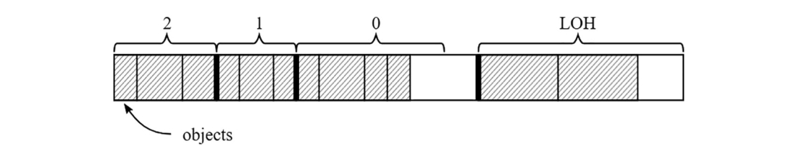

图7-1. 后续三幅图例的初始内存状态。对象用斜线填充标识。第0代末端存在空闲空间，SOH段也未被各代完全占用  

现在考虑第0代待回收的示例（见图7-2）。此时标记阶段仅分析第0代对象的可达性。假设第0代只有一个对象被标记为可达（图7-2a，深灰色填充为可达对象）。随后GC需选择回收技术：  

- **清扫回收**（图7-2b）：第0代所有不可达对象转为空闲空间。第1代边界扩展以容纳被提升的可达对象（单个标记对象晋升至第1代）。典型清扫回收会导致第1代碎片化显著增加——可见大块空洞空间。

- **压缩回收**（图7-2c）：第0代可达对象被压缩后并入扩展的第1代。虽无碎片化，但操作更复杂（需内存拷贝及更新对象引用）。

  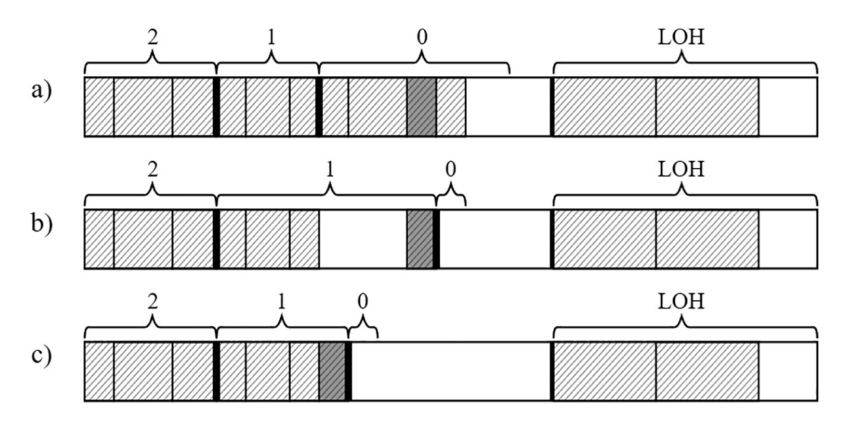

  图7-2. 第0代待回收的垃圾回收：(a)第0代可达对象标记，(b)清扫回收后，(c)压缩回收后  

总结第0代回收后的特点：

- 仅检查第0代对象可达性
- 第0代会被清空——这是默认行为。来自最年轻代的所有对象要么被回收，要么被提升至更老的一代。本章后续将会介绍一些例外情况，但当前我们暂时维持这个简化场景。
- 第0代可达对象晋升至第1代
- 第1代会出现扩展——无论是清扫回收（因碎片化导致扩展幅度更大）还是压缩回收（扩展幅度较小）都是如此。
- 第2代与LOH未变动（但通过卡表扫描了它们指向第0代的引用）

再看第1代待回收案例（图7-3）。此时需分析第0、1代对象可达性。假设第0代1个对象及第1代2个对象被标记（图7-3a）。GC的两种选择：

- **清扫回收**（图7-3b）：第0、1代不可达对象转为空闲空间，调整第1、2代边界容纳晋升对象，导致显著碎片化。

- **压缩回收**（图7-3c）：压缩两代可达对象后调整代际边界。  

  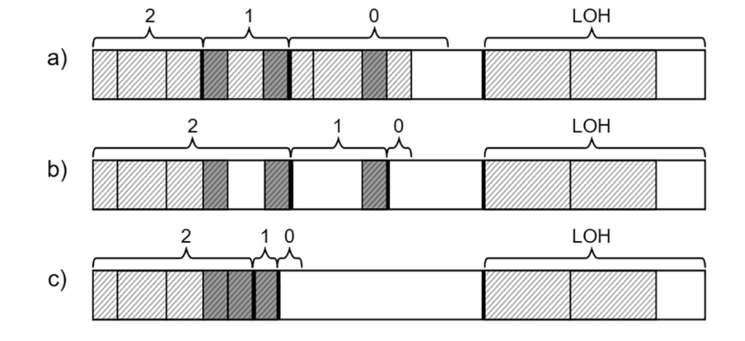

  图7-3. 第1代待回收的垃圾回收：(a)两代可达对象标记，(b)清扫回收后，(c)压缩回收后  

第1代回收特点总结：

- 仅检查第0、1代对象可达性
- 第0代清空，其可达对象晋升至第1代
- 第1代可达对象晋升至第2代
- 第1代可能扩展或收缩——具体取决于采用的回收技术。有趣的是，当回收第1代时...第1代反而可能扩展。这显然是碎片化导致的，因此在我们的示例场景中GC不太可能选择清扫回收。不过从理论和技术层面来看，这种情况确实可能发生。
- 第2代扩展
- LOH未变但已扫描其指向年轻代的引用
- 回收第1代与回收第0代在性能表现上存在细微差异——前者通常需要分析更多对象，并可能涉及更多对象的移动/访问。不过这两种情况都在同一个短暂段内操作（部分数据可能已缓存在CPU中），因此实际性能差异通常并不显著。


> 当回收第0代或第1代时，GC还可能采用另一种对象提升技术。在执行压缩回收时，GC不会直接扩展老年代边界来容纳待提升对象，而是尝试利用老年代的空闲空间（通过空闲列表管理）来“分配”这些对象。这种技术既能有效利用内存碎片（同时减少碎片化），又能避免盲目扩展代际范围。
>
> 如图7-3所示场景，第1代中的某个对象可以被安置在第2代的可用空闲空间中：
>
> 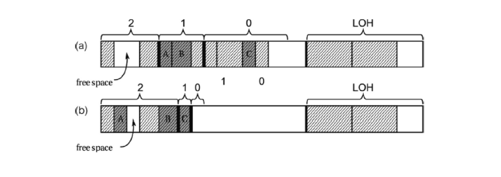
>
> 这种技术仅适用于压缩式垃圾回收（Compacting GC）。在清扫回收（Sweep Collection）中，由于对象不会被移动，自然无法将其安置到空闲空间。

现在让我们分析第2代被标记为待回收代的情况（参见图7-4）。这种完全回收（Full Collection）需要处理的对象数量远超前两种场景，这正是开发者需要谨慎避免触发过多不必要完全回收的原因（后续章节将详细讨论）。在完全回收过程中，标记阶段会扫描整个托管堆（Managed Heap）——包括第0、1、2代以及大对象堆（LOH）和固定对象堆（POH）。如图7-4a所示，示例中部分对象已被标记为可达。此时GC需要在两种回收技术中做出选择：

- 清扫回收（图7-4b）：所有代中不可达对象（含LOH和POH）都将转为空闲空间。各代边界相应调整。需特别注意：第2代、第1代及LOH会出现严重的内存碎片化

- 压缩回收（图7-4c）：小对象堆（SOH）内所有对象将被压缩（请注意：LOH不会自动压缩，POH则永远不会被压缩）。这是内存使用率最优的方案，但移动大量对象需要付出较大性能代价

  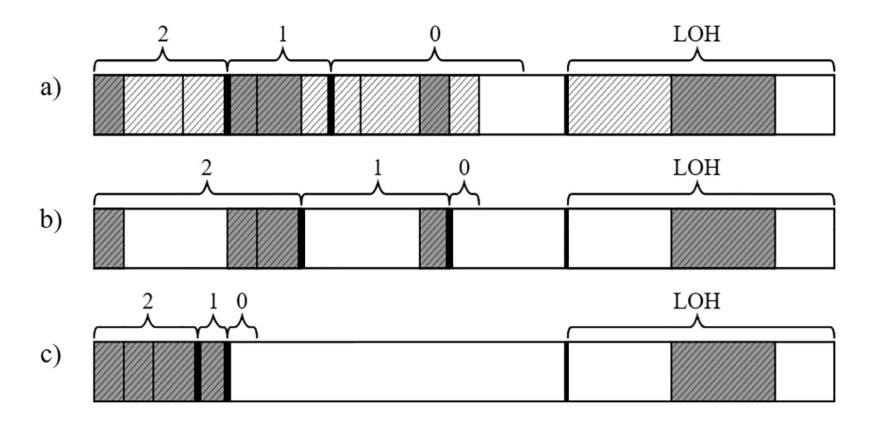

  图7-4. 第2代被判定回收的垃圾收集（即完全回收）—— (a) 标记为可达的对象，(b) 清扫收集后，(c) 压缩收集后  

总结而言，当第2代被判定回收的垃圾收集（即完全GC）完成后：  

- 所有代（包括LOH和POH）中的对象可达性均已被检查。第0代变为空。  
- 来自第0代和第1代的可达对象分别被提升至第1代和第2代。  
- 第2代中的可达对象仍保留在第2代。  
- LOH和POH也经历了非压缩式回收——虽然会引入一些内存碎片，但这些空闲空间将被LOH/POH的自由列表分配器重新利用。  

细心的读者可能注意到，每次涉及第1代或第2代回收的GC后，第2代在内存段中的占比可能会增长（如果存在大量长期存活且无法回收的对象）。最终可能出现第2代过大导致第0代或第1代剩余空间不足的情况（参见图7-5a）。此时仅靠清扫或压缩收集可能无法解决问题，GC可能会采用以下步骤的压缩方案（参见图7-5b）：  

- 当前短暂段被转换为专属于第2代的段——所有来自第1代和第2代的可达对象将被压缩存放于此。  
- 新建一个短暂段——所有来自第0代的可达对象作为第1代对象被压缩存放其中。  
- LOH仍按常规方式进行清扫收集。  

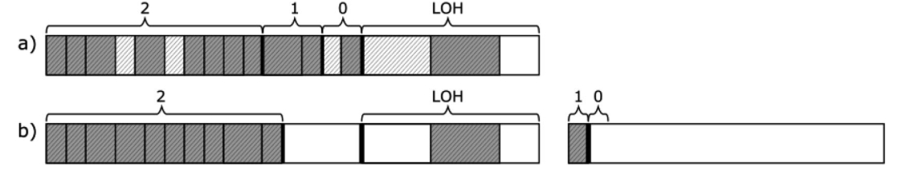

图7-5. 第2代过大时的完全回收—— (a) 标记为可达的对象，(b) 创建新短暂段后的压缩收集  

这意味着第2代可能会“无限”增长。若新短暂段再次出现相同情况，该段将被转为专用第2代段，此时可能出现以下三种情形之一：  

- 通过提交并保留内存创建全新短暂段——如图7-5所示案例
- 从段待命列表（若存在）中获取新短暂段——该机制在第五章图5-26讨论段重用时引入，但需启用VM保留功能（并非默认配置）  
- 将现有第2代占比较小的专用段转为短暂段（参见图7-6）——即使未启用VM保留，也无需强制创建新段  

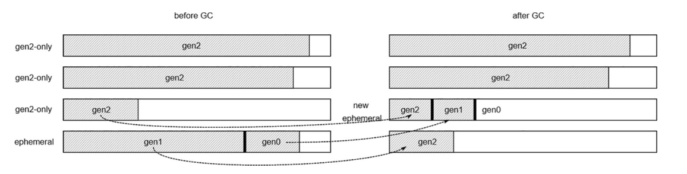

图7-6. 完全回收时重用专用第2代段作为新短暂段的压缩收集  

> 需特别注意：将当前短暂段转为专用第2代段（通过重用现有段或创建全新段）可能是由过度固定(pinning)引发——短暂段中大量固定对象会导致内存碎片化，阻碍分配上下文创建，从而促使整个段晋升为第2代。从固定需求角度看这是完全合理的，因为固定对象的地址不会因此改变。  
>

必须反复强调：完全GC需要标记所有代别及LOH中的对象，这些对象可能分布在多个内存段。当大量内存存活时，该过程代价极高。此外，此过程中可能涉及重用第2代段或创建新段，因此完全GC的性能开销可能比仅影响单个（CPU缓存友好的）短暂段的第0/1代GC高出数个数量级，应尽可能避免完全GC！  

# 示例解析GC工作机制——区域模式  

采用区域(region)替代内存段(segment)使垃圾回收机制更通用：不再需要处理同时包含第0代、第1代和潜在第2代的短暂段(ephemeral segment)，也无需区分完整第2代段和LOH段。每个区域仅包含单一代别的对象。虽然仍可采用清扫(Sweep)或压缩(Compact)收集策略，但存在若干差异。

当执行**清扫收集（Sweep collection）**时，无需将标记对象从较年轻代复制到较老代，而是直接晋升整个年轻代区域（参见图7-7b）。这种方式避免了内存中的对象复制操作。  

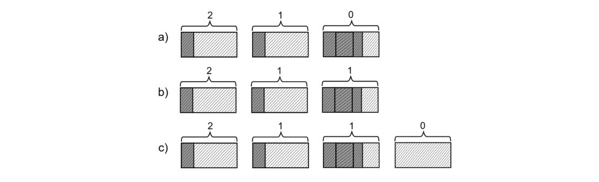

图7-7. 第0代清扫式垃圾回收——  (a) 第0代存在大量存活对象，(b) 第0代区域整体晋升，(c) 新建第0代区域  

当所有第0代区域都晋升为第1代后，GC会创建新的第0代区域用于后续内存分配（参见图7-7c）。

对于**压缩收集（Compacting collection）**（参见图7-8a），较年轻代中的标记对象会被“分配”到较老代区域中——要么放入该区域的自由列表(free-list)，要么追加在区域末尾（类似于第0代分配新对象的方式）。这意味着年轻代区域会被清空，但仍保持原代别归属（参见图7-8b）。  


图7-8. 第0代压缩式垃圾回收——(a) 第0代少量存活对象，(b) 对象被复制到第1代区域，第0代区域加入自由列表

> 若需在.NET Core源码中查看这些晋升/降级机制，可搜索以下关键函数：`gc_heap::decide_on_demotion_pin_surv` 和 `gc_heap::decide_on_promotion_surv`。建议在以下函数设置断点观察区域代际变化：`gc_heap::set_region_plan_gen_num`（计划阶段设置区域代别）和 `gc_heap::set_region_gen_num`（GC结束时最终确定区域代别）。

# 分步解析垃圾回收机制  

在概述垃圾回收器的运行结果后，让我们深入剖析其工作流程。从宏观角度看，垃圾回收过程包含以下步骤：  

1. **触发回收**：特定条件触发GC需求
2. **挂起托管线程**：请求执行引擎暂停所有托管代码线程（非并发GC模式下全程暂停）
3. **执行GC线程**：触发GC的用户线程开始执行垃圾回收代码（仅限非并发工作站模式）
4. **选定回收代别**：根据多种条件判定需要回收的代别
5. **标记阶段**：标记待回收代及其更年轻代中所有可达对象  
6. **规划阶段**：计算压缩情况下对象的新地址，据此决定采用清扫或压缩策略  
7. **执行回收**：根据规划阶段数据执行清扫或压缩（若选择压缩需先执行重定位阶段更新对象引用）  
8. **恢复线程**：请求执行引擎恢复所有托管线程  

本章剩余内容及第8-10章将详细解析每个步骤，这些内容可作为完整GC过程的导航图。  

过程中会通过性能计数器和ETW/EventPipe事件输出诊断数据，部分数据实时输出，部分在GC结束时汇总。通过SOS命令（需使用WinDbg或dotnet-dump工具）还可获取更多分析数据，本章将结合这些工具进行多场景演示。  

## 场景7-1：GC使用情况分析  

**场景描述**：
需要观察电商平台nopCommerce（基于ASP.NET Core的开源系统）在负载测试中的GC行为，该场景延续第5章场景5-1的测试环境。测试采用JMeter工具模拟每秒约7次请求（访问首页、商品页和标签页），对自托管的Nop.Web.exe进程进行两分钟快速诊断。  

**分析步骤**： 让我们跳过负载测试准备的技术细节部分，假设相关流程和工具已就绪。本次负载测试使用JMeter工具设计并执行，采用简单场景（访问首页、单个商品页和单个标签页），每秒约执行7个请求。该测试脚本与场景5-1中使用的JMeter测试完全一致。但本次仅进行两分钟的快速分析，以便快速识别GC（垃圾回收）使用情况。监控对象为自托管的.NET Framework网络应用程序（进程名为Nop.Web.exe）。

首先，你可能需要检查应用程序的整体 .NET 内存消耗和垃圾回收（GC）使用情况。这包括观察以下性能计数器：  

- `\.NET CLR Memory(Nop.Web)\Gen 0 堆大小`（实际上是第 0 代的分配预算，如前面章节所述）
- `\.NET CLR Memory(Nop.Web)\Gen 1 堆大小`
- `\.NET CLR Memory(Nop.Web)\Gen 2 堆大小`
- `\.NET CLR Memory(Nop.Web)\大对象堆（LOH）大小`
- `\.NET CLR Memory(Nop.Web)\% GC 时间`

应用程序运行前两分钟的结果如图 7-7 和 7-8 所示。可以看到各代堆大小相当稳定——短暂代（Gen 0/1）变化较快，但并未随时间增长，而最老一代（Gen 2）稳定在 89,520,308 字节。然而，GC 时间占比（% Time in GC）却令人担忧——平均值约为 24%（图 7-10 清晰可见），意味着进程有四分之一时间耗费在垃圾回收上，这是相当严重的开销！  

若要进一步分析此情况，可使用 PerfView 工具检查 ETW（事件跟踪）事件。在负载测试期间，通过在 Collect（收集）对话框 中选择 GC Collect Only（仅收集 GC 事件），即可记录来自 Microsoft-Windows-DotNETRuntime 提供程序的 GC 关键字事件。收集停止并完成数据处理后，你可以在 Memory Group（内存组）文件夹 中查看 GCStats 报告，从而深入研究 GC 使用情况。  

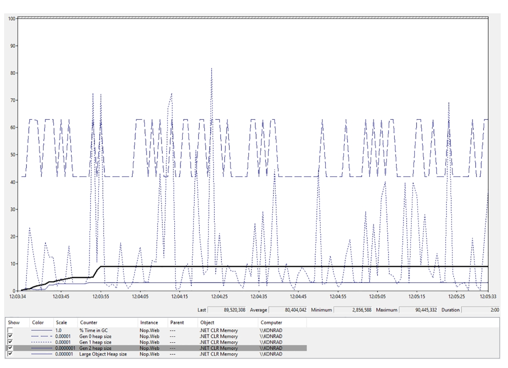

图7-9. NopCommerce应用程序在近两分钟负载测试期间各代堆大小的性能监视器视图

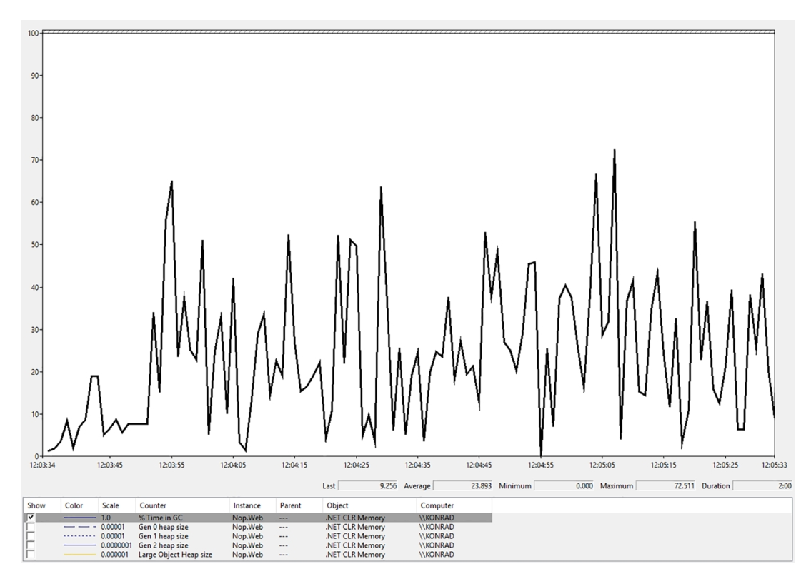

图7-10. NopCommerce 应用程序在近两分钟负载测试期间 GC 利用率的性能监视器视图

`GCStats` 报告完整汇总了会话记录期间所有.NET运行时进程的GC相关事件。打开报告时，所有进程都会列出，因此我们选择Nop.Web进程。报告开头部分展示了多项诊断数据（见图7-11）。例如，"CLR Startup Flags"显示为"None"，表明运行时使用的是简单的非并发工作站GC（Workstation GC）。

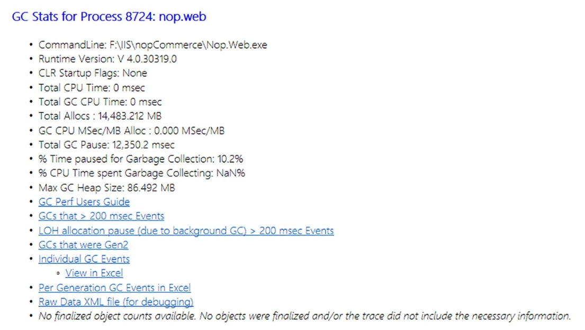

图7-11. Nop.Web 进程 GCStats 报告起始部分

下一张汇总表可能对我们更有参考价值——按代统计的GC汇总数据（参见图7-12）。该表展示了两分钟录制期间指定进程中发生的所有GC摘要。如图所示，这段时间共发生了3,016次垃圾回收（相当于每秒约25次GC），GC导致的总暂停时间超过12秒。对于两分钟的测试时长而言，这意味着约10%的时间消耗在GC上。而在典型使用场景中，这个比例最高不应超过几个百分点。还需注意的是，第二代GC（gen2）的暂停时间明显比第零代（gen0）和第一代（gen1）更长（见图7-12中的“平均暂停”列）。

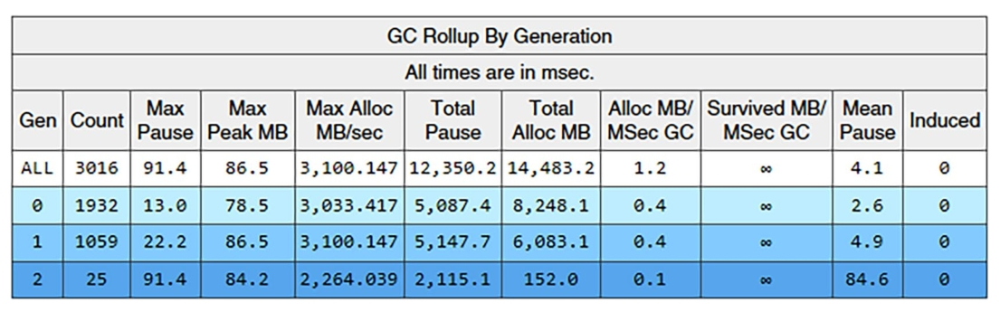

图7-12. Nop.Web 进程 GCStats 报告中按代统计的 GC 汇总表

需要特别关注的是异常庞大的内存分配量——对象分配总量超过12GB！正如你在图7-9所见，各代内存容量保持相对稳定，这表明应用程序分配了大量短生命周期的临时数据，这些数据会立即变成垃圾。

通过同份 GCStats 报告中的关键表格“按时间排序的GC事件”（图7-13）可进行深入分析。该表以时间序列列出录制期间所有GC事件，并提供了多种极具价值的数据指标。对于长时间段的录制，表格会截断显示（如图所示），但始终可以获取原始CSV数据并通过Excel等工具进行深度分析。

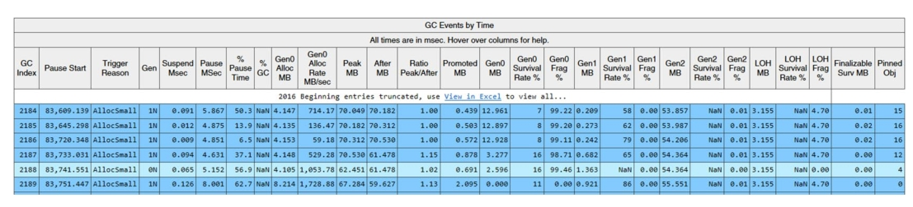

图7-13. Nop.Web进程的GCStats报告中“按时间排序的GC事件”表格

在展示的表格片段中，可以发现以下关键信息：

- 所有GC的触发原因均为`AllocSmall`——这表明GC是由于小对象堆（SOH）的分配而触发的。
- 单秒内触发了多次GC（参见`Pause Start`列的时间变化），且单次分配量较大（参见`Gen0 Alloc MB`列）——这印证了我们对“大量小对象分配”的怀疑。

此时，我们需要像第6章的案例6-2那样，进一步分析具体分配了哪些对象。本章后续将结合其他场景，逐步解释该表格中的其他列。随着本章内容的深入，您对GCStats报告的理解会逐渐全面，最终达到熟练解读的水平。

> 补充说明：`Gen`列不仅标识回收的代，还描述了GC的类型
>
> - **N**: 非并发GC（阻塞式）
> - **B**: 后台GC
> - **F**: 前台GC（在后台GC期间阻塞式回收短暂代）
> - **I**: 手动触发的阻塞式GC
> - **i**: 手动触发的非阻塞式GC

# **垃圾回收性能分析**

为了大致了解各个步骤的相对耗时，请查看图7-14中通过ETW CPU性能分析工具在简单负载测试中采集到的数据（即前一场景中展示的测试）。"Inc"列显示了每个方法（及其调用的所有子方法）消耗的总时间（毫秒）。被测应用程序运行在工作站GC模式下，测试期间共触发627次垃圾回收（另一份未展示的ETW报告显示），平均每次GC暂停时间为4.33毫秒。

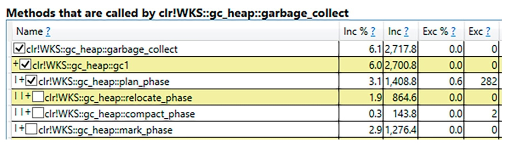

图7-14. 工作站GC模式下应用程序各GC阶段的性能分析数据

**标记（mark）**和**计划（plan）**步骤耗时相近。由于GC代码结构特性，`plan_phase` 方法同时包含**压缩（compact）**和**重定位（relocate）**阶段。令人意外的是，重定位（更新对象地址）比压缩（移动对象）本身更耗时。

但不必过度关注这些具体数值。它们会因存活对象比例、对象间引用数量、对象总量等条件产生显著波动。若需精确数据，建议使用PerfView工具通过以下两个简单步骤自主分析：

- 启用CPU采样的ETW会话采集：勾选"CPU Samples"选项。可通过调整"CPU Sample Interval MSec"降低采样间隔获取更精确结果（但出于性能考虑通常不建议）
- 使用CPU堆栈视图分析数据：通常需要进行以下调整（清除所有 GroupPats 和 Folding）：
  - 定位 `clr?!` 或 `coreclr?!` 行（分别对应.NET Framework/.NET Core）执行"Lookup Symbols"命令
  - 找到 `garbage_collect` 方法后，通过"Goto Item in Callees"命令开始分析

关于对象数量对GC总体开销（CPU占用和处理时间）的影响：

- 对象总量大时：对象越多，计划阶段工作量越大。托管堆需逐对象扫描，但得益于线性内存访问模式（对象顺序访问），缓存机制能缓解部分开销
- 存活对象多时：标记阶段工作量随存活对象增加而上升。托管堆遍历过程存在大量非线性（不利于缓存）访问，对象间引用越多开销越大。若执行压缩阶段，大量存活对象会导致高频内存读写和引用更新
- 计划阶段对存活对象数量较不敏感：因其基于“内存插头”（第9章详解）机制处理成组存活对象

结论简单直观：创建的对象越少越好。例如，在LOH中创建单个大数组并通过 `Span<T>` 复用其片段，远优于创建多个小数组。

# 垃圾回收性能调优数据

在深入探讨垃圾回收（GC）的各个阶段之前，有必要先了解GC所使用的各种“启发式规则”或“内部调优”数据。

GC管理的数据可分为两大类：**静态数据**和**动态数据**。两者对GC的行为和决策机制都至关重要。虽然这些数据通常是框架内部的实现细节（不同版本可能调整），但完全忽略它们又不可行，因此本节将重点解析其核心逻辑。

## **静态数据**

静态数据在运行时初始化时设定，之后保持不变，主要包括各代（含LOH和POH）的以下配置项：

- **最小分配预算**（Minimum size）：代的最小内存分配阈值
- **最大分配预算**（Maximum size）：代的最大内存分配阈值
- **碎片限制与碎片比率限制**（Fragmentation limit/ratio）：决定是否触发内存压缩的阈值
- **增长系数**（Limit/max limit）：用于计算代预算的动态调整
- **时间触发阈值**（time_clock）：基于时间的代回收触发条件
- **GC计数触发阈值**（gc_clock）：基于GC次数的代回收触发条件

> 在.NET Core中，此处描述的静态数据由定义于`.\src\coreclr\gc\gcpriv.h`文件中的`static_data`结构体表示。针对两种不同的延迟模式（latency modes），会在`.\src\coreclr\gc\gc.cpp`文件中初始化一个静态表`static_data_table`。部分数值会在运行时启动阶段通过`gc_heap::init_static_data`方法动态计算得出。

静态数据的调优取决于垃圾回收（GC）的延迟级别配置（第11章将详细讨论）。目前针对静态数据主要存在两种模式，其核心差异在于各代内存区域的尺寸策略：

- **均衡模式（默认）**：暂停时间更可预测且频繁，平衡延迟与内存占用
- **内存优化模式**：最小化内存占用，但可能导致更长更频繁的暂停

表7-1和表7-2展示了两种延迟模式下的静态数据值（基于16MB L3缓存环境的假设）。这些数据揭示了几个关键设计逻辑：

1. 第0代最小分配预算与CPU缓存的关系。第0代（Gen0）的最小内存预算取决于CPU缓存容量——若您还记得第2章强调的CPU缓存重要性，这一设计就非常合理。该机制确保承载最高流量（最频繁访问）的Gen0能合理利用CPU缓存资源。
2. 短暂代（0/1代）最大预算与内存段的关系。短暂代的最大预算由临时内存段（ephemeral segment）大小决定，这与第5章讨论的物理内存组织结构完全吻合。该设置在Workstation模式和32位Server模式中尤为重要，因其内存段尺寸相对较小（参见表5-3）。
3. 长生命周期代的“逻辑无限”扩展。第2代（Gen2）和大对象堆（LOH）的最大预算仅受地址空间上限限制（`SSIZE_T_MAX` 为字长的一半）。这种设计同样合理——由于长期存活对象都集中在这两个区域，其空间必须保持“逻辑无限”以适应各种内存使用场景。当然，这种“无限”仍受物理资源（RAM内存、分页文件、寻址限制）的实际约束。

表7-1. GC静态数据 - “均衡模式”（基于16MB三级缓存假设）

| 代别 | 最小分配预算 | 最大分配预算 | 碎片限制 | 碎片负担限制 | 增长系数 | 最大系数 | 时间阈值   | GC触发阈值 |
| ---- | ------------ | ------------ | -------- | ------------ | -------- | -------- | ---------- | ---------- |
| Gen0 | 1)8/10 MB    | 2)8-200 MB   | 40,000   | 0.5          | 9.0      | 20.0     | 1,000 ms   | 1          |
| Gen1 | 160 kB       | 3)至少6 MB   | 80,000   | 0.5          | 2.0      | 7.0      | 10,000 ms  | 10         |
| Gen2 | 256 kB       | SSIZE_T_MAX  | 200,000  | 0.25         | 1.2      | 1.8      | 100,000 ms | 100        |
| LOH  | 3 MB         | SSIZE_T_MAX  | 0        | 0.0          | 1.25     | 4.5      | 0 ms       | 0          |
| POH  | 3 MB         | SSIZE_T_MAX  | 0        | 0.0          | 1.25     | 4.5      | 0 ms       | 0          |

表7-2. GC静态数据 - “内存优化模式”（基于16MB三级缓存假设）

| 代别 | 最小分配预算 | 最大分配预算 | 碎片限制 | 碎片负担限制 | 增长系数   | 最大系数  | 时间阈值   | GC触发阈值 |
| ---- | ------------ | ------------ | -------- | ------------ | ---------- | --------- | ---------- | ---------- |
| Gen0 | 1)8/10 MB    | 2)8-200 MB   | 40,000   | 0.5          | 4)9.0/20.0 | 20.0/40.0 | 1,000 ms   | 1          |
| Gen1 | 256 kB       | 3)至少6 MB   | 80,000   | 0.5          | 2.0        | 7.0       | 10,000 ms  | 10         |
| Gen2 | 256 kB       | SSIZE_T_MAX  | 200,000  | 0.25         | 1.2        | 1.8       | 100,000 ms | 100        |
| LOH  | 3 MB         | SSIZE_T_MAX  | 0        | 0.0          | 1.25       | 4.5       | 0 ms       | 0          |
| POH  | 3 MB         | SSIZE_T_MAX  | 0        | 0.0          | 1.25       | 4.5       | 0 ms       | 0          |

1. 最小分配预算与CPU缓存的关系。最小分配预算取决于CPU缓存大小（此处假设为16MB），不同芯片的计算方式有所差异（由硬件厂商实现）。通常工作站模式（第一个数值）的预算会略小于服务器模式（第二个数值）。开发者可通过`GCGen0MaxBudget` 和 `GCGen1MaxBudget` 配置项手动设置Gen0和Gen1的最大预算值。
2. Gen0最大预算规则。
   - 并发工作站GC模式：固定8MB
   - 服务器GC及非并发工作站GC模式：取临时段（ephemeral segment）大小的一半（参见表5-3），但不得低于6MB且不超过200MB
3. Gen1最小预算规则。
   - 并发工作站GC模式：固定6MB
   - 服务器GC及非并发工作站GC模式：取临时段大小的一半（参见表5-3），且不低于6MB
4. 数值分别对应工作站和服务器GC模式

各代内存区域的最小/最大尺寸限制机制将在本章后续详细解析，相关内容会在后文中多次涉及。

## 动态数据

动态数据从分代视角呈现了托管堆的当前状态。这些数据在垃圾回收（GC）过程中更新，用于多项决策（包括是否应执行压缩式GC、某代是否“已满”需要触发GC等）。动态数据为每一代（包括LOH和POH）维护了多种属性，其中最重要的是：

- **分配预算（又称“期望分配量”）**：GC允许该代在下一次回收前分配的内存总量
- **剩余预算（对应 `new_allocation` 字段）**：当前分配预算中剩余的可分配空间——每次分配上下文时会递减该值
- **碎片化**：该代中空闲对象消耗的内存总量
- **存活大小**：存活对象占用的总空间
- **存活固定大小**：存活的固定内存块（本章后续详述）占用的总空间
- **存活率**：存活字节数与总字节数的比值
- **当前大小**：GC结束时所有对象的累计大小（不含碎片化导致的内存）
- **GC“时钟”**：回收该代的GC次数
- **时间“时钟”**：上次回收该代的GC启动时间

剩余预算属性是分配器与GC协同工作的关键。它追踪某代内部分配量相对于其分配预算的情况——若该值变为负数，则意味着分配预算已耗尽，将触发该代的垃圾回收。

这引出了最重要的属性——分配预算。它表示GC允许特定代进行内存分配的总量。如第6章所述，用户代码只能在第0代、LOH和POH中分配内存，但所有代的分配预算都会被追踪。为何还要记录第1代和第2代？原因很简单：对象在代际间的晋升被视为对老年代的分配。在后续“计划阶段”描述中可以看到，GC会使用内部分配器为晋升对象寻找“位置”（此处为简化表述）。这两种分配行为都会消耗分配预算。

分配预算会在每次回收该代时动态调整。新值主要基于该代的存活率计算得出——存活率指存活对象大小相对于所有对象总大小（含未存活对象）的比值。当存活率较高（大量对象在GC后存活）时，会更激进地增加分配预算，以延迟下次GC触发时间，预期未来能获得更好的死亡/存活对象比例。超过特定比率阈值时，新分配预算直接设为最大值；若存活率足够低，则可能设置为接近最小值。计算值有时会通过线性模型进一步修正，对边界存活率混合使用当前与历史分配预算的加权值。

图7-15展示了基于存活率计算新分配预算的函数关系示意图。曲线斜率陡峭程度以及触发最大代容量的阈值，取决于表7-1和7-2中的静态参数 `limit` 与 `max_limit`。这些限制值越小，曲线斜率越陡峭，达到最大值速度越快。

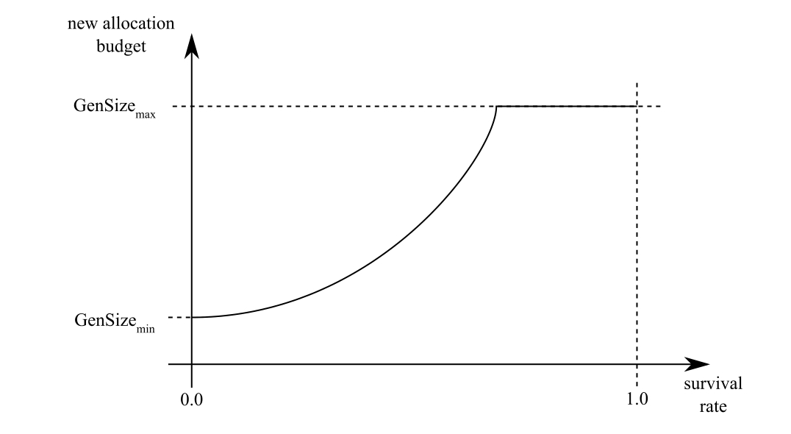

图7-15 展示存活率与新分配预算关系的典型函数示意图

观察表7-1和7-2的数据可知，年轻代对存活率的响应远比老代更为动态。特别是第0代的“反应”极其敏感，其新分配预算经常直接跳转到边界值——最小或最大代容量。

> 这正是“.NET Memory/Gen 0 heap size”性能计数器（显示第0代分配预算）在应用生命周期内往往稳定在两个固定值的原因。第5章的图5-6、图5-7以及图7-9清晰展现了这一现象——“Gen 0堆大小”持续在4MB与6MB之间切换。根据表7-1和7-2的配置，这表明GC运行在工作站模式并启用了并发GC。

运行时初始化阶段，各代的分配预算会被设为其静态数据中的最小值（参见表7-1和7-2）。代大小与分配预算有何关联？关键在于理解：分配预算代表某代在下一次GC触发前的分配限额——该限额可能被耗尽，也可能因动态条件在未来发生变化。

> 请注意：关于“默认代大小”的常见问题其实并不成立。各代初始创建时均为空，不存在所谓的默认大小。随着对象分配与晋升，代容量根据分配预算动态增长。

剩余预算、分配预算与代大小的关系，最直观的体现可见.NET Core源码中的 `current_generation_size` 方法（清单7-1）。任何时候，代数据大小（不含碎片）的近似值等于其当前数据大小加上分配预算与剩余预算的差值。GC结束时，被回收代的剩余预算会重置为分配预算值。当对象在第0代、LOH或POH中分配时，对应代的剩余预算会相应递减。因此自上次GC以来的分配量，可通过这两个值的差值反映。

清单7-1 计算代大小的方法（摘自.NET Core源码）

```cpp
size_t gc_heap::current_generation_size(int gen_number) 
{ 
    dynamic_data* dd = dynamic_data_of(gen_number); 
    size_t gen_size = (dd_current_size(dd) + dd_desired_allocation(dd) - dd_new_allocation(dd)); 
    return gen_size; 
}
```

细心的读者可能会疑惑：动态字段 `new_allocation` 如何在每次对象分配时更新？第6章完全未提及这一点，也很难想象这会在清单6-7所示的快速分配路径中实现。实际上，`new_allocation` 仅在创建或扩展分配上下文（GC分配的内存块单元）时递减。

若想深入理解分配预算如何影响GC工作及其与代大小的关系，强烈建议阅读展示示例进程前五次GC的Scenario 7-2。

## 场景7-2：理解分配预算机制

**场景描述**：开发者需要深入理解分配预算概念、代大小及其对GC工作负载的影响机制。这不仅有助于学习阶段，在进行GC触发根因分析时也能提供关键洞察。

**分析方法**：通过调试会话进行深度分析是最佳实践。我们使用清单7-2所示的C#测试程序——该程序在循环中分配100万个字节数组，并通过额外数组保持所有对象引用（确保对象在应用生命周期内始终存活）。每个字节数组尺寸为25,024字节（25,000字节数据 + 8字节数组长度 + 16字节对象元数据）。

**清单7-2 本场景使用的测试程序**

```csharp
GC.Collect();
const int LEN = 1_000_000;
byte[][] list = new byte[LEN][];
for (int i = 0; i < LEN; ++i)
{
    list[i] = new byte[25000];
    if (i % 100 == 0) 
    {
        Console.WriteLine("Allocated 100 arrays");
        if (GC.CollectionCount(0) >= 20) 
        {
            Console.WriteLine($"Leaving at i = {i}");
            break;
        }
    }
}
```

感谢 Visual Studio 的调试功能和 CLR 事件日志记录，前几次垃圾回收过程已通过分配预算的方式得到全面描述。

为收集此场景下的所有信息，我们在CLR运行时调试期间于 `gc_heap::garbage_collect` 方法中设置了动作断点。以下文本展示了语法示例：`#{settings.gc_index} gen{settings.condemned_generation} [{gc_trigger_reason}]- {settings.pause_mode}{"\n",s8b} new_allocation(0) = {dynamic_data_table[0].new_allocation}{"\n",s8b}`。通过此方式可获取“剩余预算”（即`new_allocation`字段的值）。显然，在常规问题分析中（仅基于后文描述的CLR事件数据即可完成时）无需此步骤。

通过分析PerfView中的会话数据（查看各代的 PerHeapHistory 事件数据），可获取以下信息：

- **GC开始时各代大小（Begin size）** —— 来自`SizeBefore`属性
- **分配预算（Allocation budget）​**​ —— 来自`NewAllocation3`属性
- **晋升对象大小（Promoted size）​**​ —— 由`PinnedSurv`和`NonePinnedSurv`字段求和得出
- **GC结束时各代大小（Final size）​**​ —— 来自`SizeAfter`属性

“Excel中的分代GC事件”链接还额外提供了GC启动/停止时间、回收代次（condemned generation）以及碎片化程度等数据。

我们将详细观察不同垃圾回收过程中动态数据的变化值，以便更深入理解运行机制。请注意，本场景中同时使用了PerfView的GCStats报告中的“All GC Events”表格（该表格已在场景7-1中介绍过）。
