# 垃圾回收——简介  

欢迎来到本书最重要的部分。前几章已经从理论和硬件层面广泛介绍了内存管理的主题。您还深入了解了.NET环境中内存的组织方式——如何划分为段和代，以及整个基础设施如何与操作系统协同工作。这些知识本身具有重要价值，例如可以帮助您诊断过度的内存分配问题，或使用不同方法来避免这些问题。  

然而，不可否认的是，在内存管理方面，.NET世界本质上与其自动内存回收机制密不可分。您已经了解了分配器（Allocator），知道对象是如何创建的。现在是时候学习对象如何以及何时被删除，并在不再需要时回收其占用的内存了。  

本章及接下来的三章将详细讲述.NET中垃圾回收（GC）的工作原理。为了避免一次性灌输过多知识，这部分内容被分为四章。但这四章内容紧密关联，要全面掌握相关知识，建议全部阅读。  

此外，这些章节的内容建立在之前章节的基础上。如果您没有按顺序阅读本书，强烈建议在阅读本章前至少浏览前几章（尤其是第5章和第6章）。  

在本章中，您将了解在哪些情况下会触发垃圾回收，详细剖析执行的各个阶段，并深入探讨初始步骤的细节。所有这些内容都会附带注释和示例，让您不仅能获得知识的满足感，还能将其应用于实践。  

# 高层次概览  

在深入之前，最好先对Microsoft .NET运行时中实现的垃圾回收器有一个宏观认识。如前几章所述，GC主要有两种工作模式：  

- **工作站模式（Workstation）**：旨在最小化托管线程视角下GC引入的延迟。其核心策略是通过更频繁地回收内存，减少每次回收的工作量，从而降低暂停的感知时长。这种模式特别适合桌面应用程序，因为用户体验对延迟敏感——您不会希望因为长时间运行的GC导致整个应用程序卡顿。  

- **服务器模式（Server）**：旨在最大化应用程序吞吐量。其策略是减少GC触发频率，但每次回收时会带来更长的暂停时间。这也意味着内存消耗会更高——由于回收频率低，GC会允许内存增长到更大的值。更长的暂停时间和更高的内存占用通过更高的吞吐量来补偿。虽然单次暂停时间更长，但由于单位时间内处理的数据量更大，累计暂停时间反而更短。  

工作站模式和服务器模式在设计上有重要区别。最显著的一点是托管堆（Managed Heap）的数量。如第5章所述，工作站模式下只有一个托管堆，而服务器模式下默认会为进程可用的每个逻辑核心创建一个托管堆。  

此外，上述两种模式还可以在以下子模式下运行：  

- **非并发模式（Non-concurrent）**：GC执行时会暂停所有托管线程。  
- **并发模式（Concurrent）**：GC的部分工作可以与托管线程并行执行。  

这两种工作模式组合起来，为应用程序提供了四种GC配置选项。第11章将详细讨论这些组合，并分析它们各自的适用场景。为简化说明，第7章至第10章仅讨论最简单的情况——非并发的工作站模式。这样可以在不涉及复杂细节的前提下，帮助您理解GC的核心机制。  还有一点值得回顾：托管堆的三个区域行为有所不同：  

- 小对象堆（SOH）可能使用清扫（Sweep）或压缩（Compact）回收——这主要由GC自主决定。手动触发GC时可以指定偏好。  
- 大对象堆（LOH）默认仅使用清扫回收——但可以显式请求单次压缩回收。在某些情况下（如进程设置了内存限制），GC可能会决定压缩LOH。  
- 固定对象堆（POH）仅使用清扫回收，因为其中所有对象都被固定（pinned），无法移动内存地址。  

> 后续内容会展示.NET Core源码内部实现，供有兴趣深入研究的读者参考。在.NET中启动垃圾回收时，会设置多个标志位来存储选项。其中最重要的之一是`collection_mode`枚举，可能包含以下标志：  
>
> - `collection_non_blocking`：非阻塞（并发）GC  
> - `collection_blocking`：阻塞式（"Stop the World"）GC  
> - `collection_optimized`：仅在需要时触发GC（当指定代的分配预算耗尽时）  
> - `collection_compacting`：带小对象堆压缩的回收  
> - `collection_aggressive`：尽可能释放内存的压缩回收  
> - `collection_gcstress`：CLR内部压力测试模式  

这些手动调优选项将在后续章节详述，现在让我们聚焦于最简单的非并发工作站模式GC。  

# 通过示例理解GC工作——内存段  

此刻，我们认为有必要澄清一些关于GC的常见误解，这有助于您建立对GC活动的高层次认知。  

首先，垃圾回收总是在特定代的上下文中进行——这个代被称为"condemned generation"（待回收代）。分代式GC技术的优势在于可以只回收堆的一部分。如第5章所述，回收时会连带处理所有比当前待回收代更年轻的分代。此外，LOH和POH中的对象在逻辑上属于第2代。因此可能出现以下场景：  

- 第0代待回收：仅回收第0代。  
- 第1代待回收：回收第0代和第1代。  
- 第2代待回收：回收所有三代（0、1、2）以及LOH和POH。这种情况通常称为完全垃圾回收（Full GC）。  

GC工作时，只会对待回收代及其更年轻代中的对象进行可达性分析（标记）。然后GC需要决定是执行清扫回收还是压缩回收。  

让我们用类似第5章图5-5的示意图来可视化这些场景。请花时间彻底理解这些示例场景，因为它们构成了.NET中GC工作机制的核心。  

首先，假设在某个时间点，您程序中的.NET内存布局如图7-1所示。根据第5章的知识，可以识别出这种典型结构——包含SOH（短暂段）和LOH段的连续内存块。SOH段进一步划分为第0、1、2代。各代都包含一些对象，代边界已标出。为简化说明，我们暂时忽略POH。


图7-1. 后续三幅图例的初始内存状态。对象用斜线填充标识。第0代末端存在空闲空间，SOH段也未被各代完全占用  

现在考虑第0代待回收的示例（见图7-2）。此时标记阶段仅分析第0代对象的可达性。假设第0代只有一个对象被标记为可达（图7-2a，深灰色填充为可达对象）。随后GC需选择回收技术：  

- **清扫回收**（图7-2b）：第0代所有不可达对象转为空闲空间。第1代边界扩展以容纳被提升的可达对象（单个标记对象晋升至第1代）。典型清扫回收会导致第1代碎片化显著增加——可见大块空洞空间。

- **压缩回收**（图7-2c）：第0代可达对象被压缩后并入扩展的第1代。虽无碎片化，但操作更复杂（需内存拷贝及更新对象引用）。

  

  图7-2. 第0代待回收的垃圾回收：(a)第0代可达对象标记，(b)清扫回收后，(c)压缩回收后  

总结第0代回收后的特点：

- 仅检查第0代对象可达性
- 第0代会被清空——这是默认行为。来自最年轻代的所有对象要么被回收，要么被提升至更老的一代。本章后续将会介绍一些例外情况，但当前我们暂时维持这个简化场景。
- 第0代可达对象晋升至第1代
- 第1代会出现扩展——无论是清扫回收（因碎片化导致扩展幅度更大）还是压缩回收（扩展幅度较小）都是如此。
- 第2代与LOH未变动（但通过卡表扫描了它们指向第0代的引用）

再看第1代待回收案例（图7-3）。此时需分析第0、1代对象可达性。假设第0代1个对象及第1代2个对象被标记（图7-3a）。GC的两种选择：

- **清扫回收**（图7-3b）：第0、1代不可达对象转为空闲空间，调整第1、2代边界容纳晋升对象，导致显著碎片化。

- **压缩回收**（图7-3c）：压缩两代可达对象后调整代际边界。  

  

  图7-3. 第1代待回收的垃圾回收：(a)两代可达对象标记，(b)清扫回收后，(c)压缩回收后  

第1代回收特点总结：

- 仅检查第0、1代对象可达性
- 第0代清空，其可达对象晋升至第1代
- 第1代可达对象晋升至第2代
- 第1代可能扩展或收缩——具体取决于采用的回收技术。有趣的是，当回收第1代时...第1代反而可能扩展。这显然是碎片化导致的，因此在我们的示例场景中GC不太可能选择清扫回收。不过从理论和技术层面来看，这种情况确实可能发生。
- 第2代扩展
- LOH未变但已扫描其指向年轻代的引用
- 回收第1代与回收第0代在性能表现上存在细微差异——前者通常需要分析更多对象，并可能涉及更多对象的移动/访问。不过这两种情况都在同一个短暂段内操作（部分数据可能已缓存在CPU中），因此实际性能差异通常并不显著。


> 当回收第0代或第1代时，GC还可能采用另一种对象提升技术。在执行压缩回收时，GC不会直接扩展老年代边界来容纳待提升对象，而是尝试利用老年代的空闲空间（通过空闲列表管理）来“分配”这些对象。这种技术既能有效利用内存碎片（同时减少碎片化），又能避免盲目扩展代际范围。
>
> 如图7-3所示场景，第1代中的某个对象可以被安置在第2代的可用空闲空间中：
>
> 
>
> 这种技术仅适用于压缩式垃圾回收（Compacting GC）。在清扫回收（Sweep Collection）中，由于对象不会被移动，自然无法将其安置到空闲空间。

现在让我们分析第2代被标记为待回收代的情况（参见图7-4）。这种完全回收（Full Collection）需要处理的对象数量远超前两种场景，这正是开发者需要谨慎避免触发过多不必要完全回收的原因（后续章节将详细讨论）。在完全回收过程中，标记阶段会扫描整个托管堆（Managed Heap）——包括第0、1、2代以及大对象堆（LOH）和固定对象堆（POH）。如图7-4a所示，示例中部分对象已被标记为可达。此时GC需要在两种回收技术中做出选择：

- 清扫回收（图7-4b）：所有代中不可达对象（含LOH和POH）都将转为空闲空间。各代边界相应调整。需特别注意：第2代、第1代及LOH会出现严重的内存碎片化

- 压缩回收（图7-4c）：小对象堆（SOH）内所有对象将被压缩（请注意：LOH不会自动压缩，POH则永远不会被压缩）。这是内存使用率最优的方案，但移动大量对象需要付出较大性能代价

  

  图7-4. 第2代被判定回收的垃圾收集（即完全回收）—— (a) 标记为可达的对象，(b) 清扫收集后，(c) 压缩收集后  

总结而言，当第2代被判定回收的垃圾收集（即完全GC）完成后：  

- 所有代（包括LOH和POH）中的对象可达性均已被检查。第0代变为空。  
- 来自第0代和第1代的可达对象分别被提升至第1代和第2代。  
- 第2代中的可达对象仍保留在第2代。  
- LOH和POH也经历了非压缩式回收——虽然会引入一些内存碎片，但这些空闲空间将被LOH/POH的自由列表分配器重新利用。  

细心的读者可能注意到，每次涉及第1代或第2代回收的GC后，第2代在内存段中的占比可能会增长（如果存在大量长期存活且无法回收的对象）。最终可能出现第2代过大导致第0代或第1代剩余空间不足的情况（参见图7-5a）。此时仅靠清扫或压缩收集可能无法解决问题，GC可能会采用以下步骤的压缩方案（参见图7-5b）：  

- 当前短暂段被转换为专属于第2代的段——所有来自第1代和第2代的可达对象将被压缩存放于此。  
- 新建一个短暂段——所有来自第0代的可达对象作为第1代对象被压缩存放其中。  
- LOH仍按常规方式进行清扫收集。  


图7-5. 第2代过大时的完全回收—— (a) 标记为可达的对象，(b) 创建新短暂段后的压缩收集  

这意味着第2代可能会“无限”增长。若新短暂段再次出现相同情况，该段将被转为专用第2代段，此时可能出现以下三种情形之一：  

- 通过提交并保留内存创建全新短暂段——如图7-5所示案例
- 从段待命列表（若存在）中获取新短暂段——该机制在第五章图5-26讨论段重用时引入，但需启用VM保留功能（并非默认配置）  
- 将现有第2代占比较小的专用段转为短暂段（参见图7-6）——即使未启用VM保留，也无需强制创建新段  


图7-6. 完全回收时重用专用第2代段作为新短暂段的压缩收集  

> 需特别注意：将当前短暂段转为专用第2代段（通过重用现有段或创建全新段）可能是由过度固定(pinning)引发——短暂段中大量固定对象会导致内存碎片化，阻碍分配上下文创建，从而促使整个段晋升为第2代。从固定需求角度看这是完全合理的，因为固定对象的地址不会因此改变。  
>

必须反复强调：完全GC需要标记所有代别及LOH中的对象，这些对象可能分布在多个内存段。当大量内存存活时，该过程代价极高。此外，此过程中可能涉及重用第2代段或创建新段，因此完全GC的性能开销可能比仅影响单个（CPU缓存友好的）短暂段的第0/1代GC高出数个数量级，应尽可能避免完全GC！  

# 示例解析GC工作机制——区域模式  

采用区域(region)替代内存段(segment)使垃圾回收机制更通用：不再需要处理同时包含第0代、第1代和潜在第2代的短暂段(ephemeral segment)，也无需区分完整第2代段和LOH段。每个区域仅包含单一代别的对象。虽然仍可采用清扫(Sweep)或压缩(Compact)收集策略，但存在若干差异。

当执行**清扫收集（Sweep collection）**时，无需将标记对象从较年轻代复制到较老代，而是直接晋升整个年轻代区域（参见图7-7b）。这种方式避免了内存中的对象复制操作。  


图7-7. 第0代清扫式垃圾回收——  (a) 第0代存在大量存活对象，(b) 第0代区域整体晋升，(c) 新建第0代区域  

当所有第0代区域都晋升为第1代后，GC会创建新的第0代区域用于后续内存分配（参见图7-7c）。

对于**压缩收集（Compacting collection）**（参见图7-8a），较年轻代中的标记对象会被“分配”到较老代区域中——要么放入该区域的自由列表(free-list)，要么追加在区域末尾（类似于第0代分配新对象的方式）。这意味着年轻代区域会被清空，但仍保持原代别归属（参见图7-8b）。  

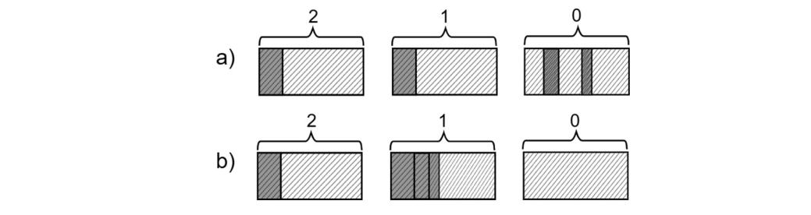

图7-8. 第0代压缩式垃圾回收——(a) 第0代少量存活对象，(b) 对象被复制到第1代区域，第0代区域加入自由列表

> 若需在.NET Core源码中查看这些晋升/降级机制，可搜索以下关键函数：`gc_heap::decide_on_demotion_pin_surv` 和 `gc_heap::decide_on_promotion_surv`。建议在以下函数设置断点观察区域代际变化：`gc_heap::set_region_plan_gen_num`（计划阶段设置区域代别）和 `gc_heap::set_region_gen_num`（GC结束时最终确定区域代别）。

# 分步解析垃圾回收机制  

在概述垃圾回收器的运行结果后，让我们深入剖析其工作流程。从宏观角度看，垃圾回收过程包含以下步骤：  

1. **触发回收**：特定条件触发GC需求
2. **挂起托管线程**：请求执行引擎暂停所有托管代码线程（非并发GC模式下全程暂停）
3. **执行GC线程**：触发GC的用户线程开始执行垃圾回收代码（仅限非并发工作站模式）
4. **选定回收代别**：根据多种条件判定需要回收的代别
5. **标记阶段**：标记待回收代及其更年轻代中所有可达对象  
6. **规划阶段**：计算压缩情况下对象的新地址，据此决定采用清扫或压缩策略  
7. **执行回收**：根据规划阶段数据执行清扫或压缩（若选择压缩需先执行重定位阶段更新对象引用）  
8. **恢复线程**：请求执行引擎恢复所有托管线程  

本章剩余内容及第8-10章将详细解析每个步骤，这些内容可作为完整GC过程的导航图。  

过程中会通过性能计数器和ETW/EventPipe事件输出诊断数据，部分数据实时输出，部分在GC结束时汇总。通过SOS命令（需使用WinDbg或dotnet-dump工具）还可获取更多分析数据，本章将结合这些工具进行多场景演示。  

## 场景7-1：GC使用情况分析  

**场景描述**：
需要观察电商平台nopCommerce（基于ASP.NET Core的开源系统）在负载测试中的GC行为，该场景延续第5章场景5-1的测试环境。测试采用JMeter工具模拟每秒约7次请求（访问首页、商品页和标签页），对自托管的Nop.Web.exe进程进行两分钟快速诊断。  

**分析步骤**： 让我们跳过负载测试准备的技术细节部分，假设相关流程和工具已就绪。本次负载测试使用JMeter工具设计并执行，采用简单场景（访问首页、单个商品页和单个标签页），每秒约执行7个请求。该测试脚本与场景5-1中使用的JMeter测试完全一致。但本次仅进行两分钟的快速分析，以便快速识别GC（垃圾回收）使用情况。监控对象为自托管的.NET Framework网络应用程序（进程名为Nop.Web.exe）。

首先，你可能需要检查应用程序的整体 .NET 内存消耗和垃圾回收（GC）使用情况。这包括观察以下性能计数器：  

- `\.NET CLR Memory(Nop.Web)\Gen 0 堆大小`（实际上是第 0 代的分配预算，如前面章节所述）
- `\.NET CLR Memory(Nop.Web)\Gen 1 堆大小`
- `\.NET CLR Memory(Nop.Web)\Gen 2 堆大小`
- `\.NET CLR Memory(Nop.Web)\大对象堆（LOH）大小`
- `\.NET CLR Memory(Nop.Web)\% GC 时间`

应用程序运行前两分钟的结果如图 7-7 和 7-8 所示。可以看到各代堆大小相当稳定——短暂代（Gen 0/1）变化较快，但并未随时间增长，而最老一代（Gen 2）稳定在 89,520,308 字节。然而，GC 时间占比（% Time in GC）却令人担忧——平均值约为 24%（图 7-10 清晰可见），意味着进程有四分之一时间耗费在垃圾回收上，这是相当严重的开销！  

若要进一步分析此情况，可使用 PerfView 工具检查 ETW（事件跟踪）事件。在负载测试期间，通过在 Collect（收集）对话框 中选择 GC Collect Only（仅收集 GC 事件），即可记录来自 Microsoft-Windows-DotNETRuntime 提供程序的 GC 关键字事件。收集停止并完成数据处理后，你可以在 Memory Group（内存组）文件夹 中查看 GCStats 报告，从而深入研究 GC 使用情况。  


图7-9. NopCommerce应用程序在近两分钟负载测试期间各代堆大小的性能监视器视图


图7-10. NopCommerce 应用程序在近两分钟负载测试期间 GC 利用率的性能监视器视图

`GCStats` 报告完整汇总了会话记录期间所有.NET运行时进程的GC相关事件。打开报告时，所有进程都会列出，因此我们选择Nop.Web进程。报告开头部分展示了多项诊断数据（见图7-11）。例如，"CLR Startup Flags"显示为"None"，表明运行时使用的是简单的非并发工作站GC（Workstation GC）。


图7-11. Nop.Web 进程 GCStats 报告起始部分

下一张汇总表可能对我们更有参考价值——按代统计的GC汇总数据（参见图7-12）。该表展示了两分钟录制期间指定进程中发生的所有GC摘要。如图所示，这段时间共发生了3,016次垃圾回收（相当于每秒约25次GC），GC导致的总暂停时间超过12秒。对于两分钟的测试时长而言，这意味着约10%的时间消耗在GC上。而在典型使用场景中，这个比例最高不应超过几个百分点。还需注意的是，第二代GC（gen2）的暂停时间明显比第零代（gen0）和第一代（gen1）更长（见图7-12中的“平均暂停”列）。


图7-12. Nop.Web 进程 GCStats 报告中按代统计的 GC 汇总表

需要特别关注的是异常庞大的内存分配量——对象分配总量超过12GB！正如你在图7-9所见，各代内存容量保持相对稳定，这表明应用程序分配了大量短生命周期的临时数据，这些数据会立即变成垃圾。

通过同份 GCStats 报告中的关键表格“按时间排序的GC事件”（图7-13）可进行深入分析。该表以时间序列列出录制期间所有GC事件，并提供了多种极具价值的数据指标。对于长时间段的录制，表格会截断显示（如图所示），但始终可以获取原始CSV数据并通过Excel等工具进行深度分析。


图7-13. Nop.Web进程的GCStats报告中“按时间排序的GC事件”表格

在展示的表格片段中，可以发现以下关键信息：

- 所有GC的触发原因均为`AllocSmall`——这表明GC是由于小对象堆（SOH）的分配而触发的。
- 单秒内触发了多次GC（参见`Pause Start`列的时间变化），且单次分配量较大（参见`Gen0 Alloc MB`列）——这印证了我们对“大量小对象分配”的怀疑。

此时，我们需要像第6章的案例6-2那样，进一步分析具体分配了哪些对象。本章后续将结合其他场景，逐步解释该表格中的其他列。随着本章内容的深入，您对GCStats报告的理解会逐渐全面，最终达到熟练解读的水平。

> 补充说明：`Gen`列不仅标识回收的代，还描述了GC的类型
>
> - **N**: 非并发GC（阻塞式）
> - **B**: 后台GC
> - **F**: 前台GC（在后台GC期间阻塞式回收短暂代）
> - **I**: 手动触发的阻塞式GC
> - **i**: 手动触发的非阻塞式GC

# **垃圾回收性能分析**

为了大致了解各个步骤的相对耗时，请查看图7-14中通过ETW CPU性能分析工具在简单负载测试中采集到的数据（即前一场景中展示的测试）。"Inc"列显示了每个方法（及其调用的所有子方法）消耗的总时间（毫秒）。被测应用程序运行在工作站GC模式下，测试期间共触发627次垃圾回收（另一份未展示的ETW报告显示），平均每次GC暂停时间为4.33毫秒。


图7-14. 工作站GC模式下应用程序各GC阶段的性能分析数据

**标记（mark）**和**计划（plan）**步骤耗时相近。由于GC代码结构特性，`plan_phase` 方法同时包含**压缩（compact）**和**重定位（relocate）**阶段。令人意外的是，重定位（更新对象地址）比压缩（移动对象）本身更耗时。

但不必过度关注这些具体数值。它们会因存活对象比例、对象间引用数量、对象总量等条件产生显著波动。若需精确数据，建议使用PerfView工具通过以下两个简单步骤自主分析：

- 启用CPU采样的ETW会话采集：勾选"CPU Samples"选项。可通过调整"CPU Sample Interval MSec"降低采样间隔获取更精确结果（但出于性能考虑通常不建议）
- 使用CPU堆栈视图分析数据：通常需要进行以下调整（清除所有 GroupPats 和 Folding）：
  - 定位 `clr?!` 或 `coreclr?!` 行（分别对应.NET Framework/.NET Core）执行"Lookup Symbols"命令
  - 找到 `garbage_collect` 方法后，通过"Goto Item in Callees"命令开始分析

关于对象数量对GC总体开销（CPU占用和处理时间）的影响：

- 对象总量大时：对象越多，计划阶段工作量越大。托管堆需逐对象扫描，但得益于线性内存访问模式（对象顺序访问），缓存机制能缓解部分开销
- 存活对象多时：标记阶段工作量随存活对象增加而上升。托管堆遍历过程存在大量非线性（不利于缓存）访问，对象间引用越多开销越大。若执行压缩阶段，大量存活对象会导致高频内存读写和引用更新
- 计划阶段对存活对象数量较不敏感：因其基于“内存插头”（第9章详解）机制处理成组存活对象

结论简单直观：创建的对象越少越好。例如，在LOH中创建单个大数组并通过 `Span<T>` 复用其片段，远优于创建多个小数组。

# 垃圾回收性能调优数据

在深入探讨垃圾回收（GC）的各个阶段之前，有必要先了解GC所使用的各种“启发式规则”或“内部调优”数据。

GC管理的数据可分为两大类：**静态数据**和**动态数据**。两者对GC的行为和决策机制都至关重要。虽然这些数据通常是框架内部的实现细节（不同版本可能调整），但完全忽略它们又不可行，因此本节将重点解析其核心逻辑。

## **静态数据**

静态数据在运行时初始化时设定，之后保持不变，主要包括各代（含LOH和POH）的以下配置项：

- **最小分配预算**（Minimum size）：代的最小内存分配阈值
- **最大分配预算**（Maximum size）：代的最大内存分配阈值
- **碎片限制与碎片比率限制**（Fragmentation limit/ratio）：决定是否触发内存压缩的阈值
- **增长系数**（Limit/max limit）：用于计算代预算的动态调整
- **时间触发阈值**（time_clock）：基于时间的代回收触发条件
- **GC计数触发阈值**（gc_clock）：基于GC次数的代回收触发条件

> 在.NET Core中，此处描述的静态数据由定义于`.\src\coreclr\gc\gcpriv.h`文件中的`static_data`结构体表示。针对两种不同的延迟模式（latency modes），会在`.\src\coreclr\gc\gc.cpp`文件中初始化一个静态表`static_data_table`。部分数值会在运行时启动阶段通过`gc_heap::init_static_data`方法动态计算得出。

静态数据的调优取决于垃圾回收（GC）的延迟级别配置（第11章将详细讨论）。目前针对静态数据主要存在两种模式，其核心差异在于各代内存区域的尺寸策略：

- **均衡模式（默认）**：暂停时间更可预测且频繁，平衡延迟与内存占用
- **内存优化模式**：最小化内存占用，但可能导致更长更频繁的暂停

表7-1和表7-2展示了两种延迟模式下的静态数据值（基于16MB L3缓存环境的假设）。这些数据揭示了几个关键设计逻辑：

1. 第0代最小分配预算与CPU缓存的关系。第0代（Gen0）的最小内存预算取决于CPU缓存容量——若您还记得第2章强调的CPU缓存重要性，这一设计就非常合理。该机制确保承载最高流量（最频繁访问）的Gen0能合理利用CPU缓存资源。
2. 短暂代（0/1代）最大预算与内存段的关系。短暂代的最大预算由临时内存段（ephemeral segment）大小决定，这与第5章讨论的物理内存组织结构完全吻合。该设置在Workstation模式和32位Server模式中尤为重要，因其内存段尺寸相对较小（参见表5-3）。
3. 长生命周期代的“逻辑无限”扩展。第2代（Gen2）和大对象堆（LOH）的最大预算仅受地址空间上限限制（`SSIZE_T_MAX` 为字长的一半）。这种设计同样合理——由于长期存活对象都集中在这两个区域，其空间必须保持“逻辑无限”以适应各种内存使用场景。当然，这种“无限”仍受物理资源（RAM内存、分页文件、寻址限制）的实际约束。

表7-1. GC静态数据 - “均衡模式”（基于16MB三级缓存假设）

| 代别 | 最小分配预算 | 最大分配预算 | 碎片限制 | 碎片负担限制 | 增长系数 | 最大系数 | 时间阈值   | GC触发阈值 |
| ---- | ------------ | ------------ | -------- | ------------ | -------- | -------- | ---------- | ---------- |
| Gen0 | 1)8/10 MB    | 2)8-200 MB   | 40,000   | 0.5          | 9.0      | 20.0     | 1,000 ms   | 1          |
| Gen1 | 160 kB       | 3)至少6 MB   | 80,000   | 0.5          | 2.0      | 7.0      | 10,000 ms  | 10         |
| Gen2 | 256 kB       | SSIZE_T_MAX  | 200,000  | 0.25         | 1.2      | 1.8      | 100,000 ms | 100        |
| LOH  | 3 MB         | SSIZE_T_MAX  | 0        | 0.0          | 1.25     | 4.5      | 0 ms       | 0          |
| POH  | 3 MB         | SSIZE_T_MAX  | 0        | 0.0          | 1.25     | 4.5      | 0 ms       | 0          |

表7-2. GC静态数据 - “内存优化模式”（基于16MB三级缓存假设）

| 代别 | 最小分配预算 | 最大分配预算 | 碎片限制 | 碎片负担限制 | 增长系数   | 最大系数  | 时间阈值   | GC触发阈值 |
| ---- | ------------ | ------------ | -------- | ------------ | ---------- | --------- | ---------- | ---------- |
| Gen0 | 1)8/10 MB    | 2)8-200 MB   | 40,000   | 0.5          | 4)9.0/20.0 | 20.0/40.0 | 1,000 ms   | 1          |
| Gen1 | 256 kB       | 3)至少6 MB   | 80,000   | 0.5          | 2.0        | 7.0       | 10,000 ms  | 10         |
| Gen2 | 256 kB       | SSIZE_T_MAX  | 200,000  | 0.25         | 1.2        | 1.8       | 100,000 ms | 100        |
| LOH  | 3 MB         | SSIZE_T_MAX  | 0        | 0.0          | 1.25       | 4.5       | 0 ms       | 0          |
| POH  | 3 MB         | SSIZE_T_MAX  | 0        | 0.0          | 1.25       | 4.5       | 0 ms       | 0          |

1. 最小分配预算与CPU缓存的关系。最小分配预算取决于CPU缓存大小（此处假设为16MB），不同芯片的计算方式有所差异（由硬件厂商实现）。通常工作站模式（第一个数值）的预算会略小于服务器模式（第二个数值）。开发者可通过`GCGen0MaxBudget` 和 `GCGen1MaxBudget` 配置项手动设置Gen0和Gen1的最大预算值。
2. Gen0最大预算规则。
   - 并发工作站GC模式：固定8MB
   - 服务器GC及非并发工作站GC模式：取临时段（ephemeral segment）大小的一半（参见表5-3），但不得低于6MB且不超过200MB
3. Gen1最小预算规则。
   - 并发工作站GC模式：固定6MB
   - 服务器GC及非并发工作站GC模式：取临时段大小的一半（参见表5-3），且不低于6MB
4. 数值分别对应工作站和服务器GC模式

各代内存区域的最小/最大尺寸限制机制将在本章后续详细解析，相关内容会在后文中多次涉及。

## 动态数据

动态数据从分代视角呈现了托管堆的当前状态。这些数据在垃圾回收（GC）过程中更新，用于多项决策（包括是否应执行压缩式GC、某代是否“已满”需要触发GC等）。动态数据为每一代（包括LOH和POH）维护了多种属性，其中最重要的是：

- **分配预算（又称“期望分配量”）**：GC允许该代在下一次回收前分配的内存总量
- **剩余预算（对应 `new_allocation` 字段）**：当前分配预算中剩余的可分配空间——每次分配上下文时会递减该值
- **碎片化**：该代中空闲对象消耗的内存总量
- **存活大小**：存活对象占用的总空间
- **存活固定大小**：存活的固定内存块（本章后续详述）占用的总空间
- **存活率**：存活字节数与总字节数的比值
- **当前大小**：GC结束时所有对象的累计大小（不含碎片化导致的内存）
- **GC“时钟”**：回收该代的GC次数
- **时间“时钟”**：上次回收该代的GC启动时间

剩余预算属性是分配器与GC协同工作的关键。它追踪某代内部分配量相对于其分配预算的情况——若该值变为负数，则意味着分配预算已耗尽，将触发该代的垃圾回收。

这引出了最重要的属性——分配预算。它表示GC允许特定代进行内存分配的总量。如第6章所述，用户代码只能在第0代、LOH和POH中分配内存，但所有代的分配预算都会被追踪。为何还要记录第1代和第2代？原因很简单：对象在代际间的晋升被视为对老年代的分配。在后续“计划阶段”描述中可以看到，GC会使用内部分配器为晋升对象寻找“位置”（此处为简化表述）。这两种分配行为都会消耗分配预算。

分配预算会在每次回收该代时动态调整。新值主要基于该代的存活率计算得出——存活率指存活对象大小相对于所有对象总大小（含未存活对象）的比值。当存活率较高（大量对象在GC后存活）时，会更激进地增加分配预算，以延迟下次GC触发时间，预期未来能获得更好的死亡/存活对象比例。超过特定比率阈值时，新分配预算直接设为最大值；若存活率足够低，则可能设置为接近最小值。计算值有时会通过线性模型进一步修正，对边界存活率混合使用当前与历史分配预算的加权值。

图7-15展示了基于存活率计算新分配预算的函数关系示意图。曲线斜率陡峭程度以及触发最大代容量的阈值，取决于表7-1和7-2中的静态参数 `limit` 与 `max_limit`。这些限制值越小，曲线斜率越陡峭，达到最大值速度越快。


图7-15 展示存活率与新分配预算关系的典型函数示意图

观察表7-1和7-2的数据可知，年轻代对存活率的响应远比老代更为动态。特别是第0代的“反应”极其敏感，其新分配预算经常直接跳转到边界值——最小或最大代容量。

> 这正是“.NET Memory/Gen 0 heap size”性能计数器（显示第0代分配预算）在应用生命周期内往往稳定在两个固定值的原因。第5章的图5-6、图5-7以及图7-9清晰展现了这一现象——“Gen 0堆大小”持续在4MB与6MB之间切换。根据表7-1和7-2的配置，这表明GC运行在工作站模式并启用了并发GC。

运行时初始化阶段，各代的分配预算会被设为其静态数据中的最小值（参见表7-1和7-2）。代大小与分配预算有何关联？关键在于理解：分配预算代表某代在下一次GC触发前的分配限额——该限额可能被耗尽，也可能因动态条件在未来发生变化。

> 请注意：关于“默认代大小”的常见问题其实并不成立。各代初始创建时均为空，不存在所谓的默认大小。随着对象分配与晋升，代容量根据分配预算动态增长。

剩余预算、分配预算与代大小的关系，最直观的体现可见.NET Core源码中的 `current_generation_size` 方法（清单7-1）。任何时候，代数据大小（不含碎片）的近似值等于其当前数据大小加上分配预算与剩余预算的差值。GC结束时，被回收代的剩余预算会重置为分配预算值。当对象在第0代、LOH或POH中分配时，对应代的剩余预算会相应递减。因此自上次GC以来的分配量，可通过这两个值的差值反映。

清单7-1 计算代大小的方法（摘自.NET Core源码）

```cpp
size_t gc_heap::current_generation_size(int gen_number) 
{ 
    dynamic_data* dd = dynamic_data_of(gen_number); 
    size_t gen_size = (dd_current_size(dd) + dd_desired_allocation(dd) - dd_new_allocation(dd)); 
    return gen_size; 
}
```

细心的读者可能会疑惑：动态字段 `new_allocation` 如何在每次对象分配时更新？第6章完全未提及这一点，也很难想象这会在清单6-7所示的快速分配路径中实现。实际上，`new_allocation` 仅在创建或扩展分配上下文（GC分配的内存块单元）时递减。

若想深入理解分配预算如何影响GC工作及其与代大小的关系，强烈建议阅读展示示例进程前五次GC的Scenario 7-2。

## 场景7-2：理解分配预算机制

**场景描述**：开发者需要深入理解分配预算概念、代大小及其对GC工作负载的影响机制。这不仅有助于学习阶段，在进行GC触发根因分析时也能提供关键洞察。

**分析方法**：通过调试会话进行深度分析是最佳实践。我们使用清单7-2所示的C#测试程序——该程序在循环中分配100万个字节数组，并通过额外数组保持所有对象引用（确保对象在应用生命周期内始终存活）。每个字节数组尺寸为25,024字节（25,000字节数据 + 8字节数组长度 + 16字节对象元数据）。

**清单7-2 本场景使用的测试程序**

```csharp
GC.Collect();
const int LEN = 1_000_000;
byte[][] list = new byte[LEN][];
for (int i = 0; i < LEN; ++i)
{
    list[i] = new byte[25000];
    if (i % 100 == 0) 
    {
        Console.WriteLine("Allocated 100 arrays");
        if (GC.CollectionCount(0) >= 20) 
        {
            Console.WriteLine($"Leaving at i = {i}");
            break;
        }
    }
}
```

感谢 Visual Studio 的调试功能和 CLR 事件日志记录，前几次垃圾回收过程已通过分配预算的方式得到全面描述。

为收集此场景下的所有信息，我们在CLR运行时调试期间于 `gc_heap::garbage_collect` 方法中设置了动作断点。以下文本展示了语法示例：`#{settings.gc_index} gen{settings.condemned_generation} [{gc_trigger_reason}]- {settings.pause_mode}{"\n",s8b} new_allocation(0) = {dynamic_data_table[0].new_allocation}{"\n",s8b}`。通过此方式可获取“剩余预算”（即`new_allocation`字段的值）。显然，在常规问题分析中（仅基于后文描述的CLR事件数据即可完成时）无需此步骤。

通过分析PerfView中的会话数据（查看各代的 PerHeapHistory 事件数据），可获取以下信息：

- **GC开始时各代大小（Begin size）** —— 来自`SizeBefore`属性
- **分配预算（Allocation budget）​**​ —— 来自`NewAllocation3`属性
- **晋升对象大小（Promoted size）​**​ —— 由`PinnedSurv`和`NonePinnedSurv`字段求和得出
- **GC结束时各代大小（Final size）​**​ —— 来自`SizeAfter`属性

“Excel中的分代GC事件”链接还额外提供了GC启动/停止时间、回收代次（condemned generation）以及碎片化程度等数据。

我们将详细观察不同垃圾回收过程中动态数据的变化值，以便更深入理解运行机制。请注意，本场景中同时使用了PerfView的GCStats报告中的“All GC Events”表格（该表格已在场景7-1中介绍过）。

### GC #1 – 由显式调用GC.Collect()触发

示例程序中的第一次垃圾回收是通过显式调用触发的（参见代码清单7-2的第一行）。PerfView中GCStats报告的"All GC Events"表格对应片段如下：

| GC索引 | 触发原因 | 代   | Gen0分配量[MB] | 晋升量[MB] | Gen0存活率[%] | Gen1[MB] | Gen1存活率[%] | LOH[MB] | LOH存活率[%] |
| ------ | -------- | ---- | -------------- | ---------- | ------------- | -------- | ------------- | ------- | ------------ |
| 1      | 人工触发 | 2NI  | 0.000          | 0.299      | 38            | 0.302    | 0             | 0.000   | 0            |

数据证实这是一次非并发式的完全GC（2NI），由手动触发（Induced）。由于这是程序启动后的首次GC，Gen0和LOH区域在上次GC后的分配量均显示为零。此时可见初始内存状态：

- 程序已在Gen0进行了部分内存分配（为简洁起见，我们省略了代码清单7-2中的部分 `Console.WriteLine` 调用），POH区域也因运行时内部需求产生了分配。
-  各代内存预算会根据机器配置，基于静态和动态数据设置为初始值。

|          | Gen0       | Gen1    | Gen2    | LOH       | POH       |
| -------- | ---------- | ------- | ------- | --------- | --------- |
| 剩余预算 | 15,859,696 | 262,144 | 262,144 | 3,145,728 | 3,113,016 |
| 初始大小 | 776,560    | 0       | 0       | 0         | 32,712    |

各代晋升内存量如下：

|          | Gen0    | Gen1 | Gen2 | LOH  | POH    |
| -------- | ------- | ---- | ---- | ---- | ------ |
| 晋升大小 | 298,880 | 0    | 0    | 0    | 32,712 |

> 这些数值以GC分配上下文变更单位表示。Visual Studio断点读取的NewAllocation值可能与各类ETW事件值存在微小差异，源于两者的取整计算方式不同。

这表明在0代中，776,560字节的总分配量中有298,880字节仍被引用，将晋升至1代（约38%存活率，对应"All GC Events"表中的Gen0 Survival Rate%）。此外，LOH区域对象全部未能存活，而POH区域对象全部存活。

此时将基于上述存活率为 condemned 代及所有年轻代（在本例首次完全GC中即所有代）重新计算分配预算。由于1代和2代的存活率为零，这些代的分配预算再次设置为最小值。在进程启动阶段，0代通常会出现较高的存活率——正常情况下GC会尝试将最年轻代的存活率调优至百分之几甚至更低。最终新的分配预算如下：

|          | Gen0       | Gen1    | Gen2    | LOH       | POH       |
| -------- | ---------- | ------- | ------- | --------- | --------- |
| 分配预算 | 16,777,216 | 262,144 | 262,144 | 3,145,728 | 3,145,728 |

各代的剩余预算值也将设置为与分配预算相同。最终各代物理大小取决于实际晋升的对象：

|          | Gen0 | Gen1    | Gen2 | LOH  | POH    |
| -------- | ---- | ------- | ---- | ---- | ------ |
| 最终大小 | 584  | 302,352 | 0    | 0    | 32,712 |

### GC #2 – 由内存分配触发

后续的垃圾回收由循环中不断新建的 `byte[]` 数组触发。"All GC Events"表格对应片段如下：

| GC索引 | 触发原因   | 代   | Gen0分配量[MB] | 晋升量[MB] | Gen0存活率[%] | Gen1[MB] | Gen1存活率[%] | LOH[MB] | LOH存活率[%] |
| ------ | ---------- | ---- | -------------- | ---------- | ------------- | -------- | ------------- | ------- | ------------ |
| 2      | AllocSmall | 2N   | 16.783         | 25.043     | 99            | 16.791   | 92            | 8.00    | 100          |

从上轮GC至今：

- Gen0分配达16.78MB——源于循环中大量 `byte` 数组的创建
- 大对象堆(LOH)分配8MB——因新建了包含百万个8字节引用的超大数组

此时可观察到：

- 16.783MB的Gen0分配量已超出预算（上轮GC后设置为16,777,216字节）
- 8MB的LOH分配也超出预算（原设置为3MB）

通过GC开始时各代剩余预算为负值可验证这点：

|          | Gen0       | Gen1     | Gen2    | LOH        | POH       |
| -------- | ---------- | -------- | ------- | ---------- | --------- |
| 剩余预算 | -13,168    | -112,144 | 262,144 | -4,854,328 | 3,145,728 |
| 初始大小 | 16,790,848 | 302,352  | 0       | 8,000,056  | 32,712    |

需注意由于上轮GC中 Gen0 对象晋升，Gen1 预算也被耗尽，这会导致本轮GC转而回收 Gen1 而非初始的 Gen0。但由于 LOH 预算同时超限，最终触发完全GC（对应事件表中2N标记）。

各代晋升内存量如下：

|          | Gen0       | Gen1    | Gen2 | LOH       | POH    |
| -------- | ---------- | ------- | ---- | --------- | ------ |
| 晋升大小 | 16,766,472 | 276,536 | 0    | 8,000,024 | 32,712 |

由此可得以下结论：

- Gen0 对象几乎全部晋升（所有byte数组都被byte[][]数组引用而存活）
- Gen1 中上轮晋升的对象继续保留

新分配预算调整如下：

|          | Gen0        | Gen1      | Gen2    | LOH        | POH       |
| -------- | ----------- | --------- | ------- | ---------- | --------- |
| 分配预算 | 134,217,728 | 1,935,752 | 262,144 | 28,000,088 | 3,145,728 |

预算调整逻辑解析：

- Gen0存活率接近100%，故预算大幅提升至128MB
- Gen1存活率达92%（参见事件表Gen1 Survival Rate%），预算相应增加
- Gen2预算维持不变（初始数据量为零）
- LOH预算增长近9倍（采用类似图7-15的倍增算法）

最终各代物理大小取决于实际晋升对象：

|          | Gen0 | Gen1       | Gen2    | LOH       | POH    |
| -------- | ---- | ---------- | ------- | --------- | ------ |
| 最终大小 | 0    | 16,790,848 | 302,352 | 8,000,056 | 32,712 |

> SOH 和 LOH 使用不同锁，可能有两个线程同时分配内存并各自检测到预算超限而触发GC。最终只有一个线程能成功挂起 EE 执行 GC，但回收时会处理所有超限的代。

至此，经过两轮GC后内存状态如下：

- Gen0预算增至128MB——因高存活率表明需要更大空间来优化下次回收效果
- Gen1预算小于实际代大小——GC尚未适应当前分配/晋升速率，后续GC会根据实际情况调整（稳定内存波动则平衡预算，持续增长则继续扩容）
- LOH预算扩容以适应新的大对象分配需求

### GC #3 – 由分配触发的垃圾回收

第三次垃圾回收是由于进一步分配 `byte[]` 数组而触发的。“所有GC事件”表的摘录如下：

| GC索引 触发原因 | 原因       | 代 Gen0 | 分配量 [MB] | 晋升量 [MB] | Gen0存活率 [%] | Gen1 [MB] | Gen1存活率 [%] | LOH [MB] | LOH存活率 [%] |
| --------------- | ---------- | ------- | ----------- | ----------- | -------------- | --------- | -------------- | -------- | ------------- |
| 3               | AllocSmall | 2N      | 134.232     | 159.146     | 99             | 134.240   | 100            | 8.000    | 100           |

可以看到，自上次GC以来，按照预期，第0代中分配了约128MB内存，这应该会耗尽它的分配预算。然而，如2N值所示，这次GC升级为阻塞式完全GC（Full GC）。通过观察GC开始时各代的剩余预算值为负可以理解其原因：

由于第0代和第1代的晋升操作，第1代和第2代的“剩余预算”均为负值，因此回收代被提升至第2代。各代的晋升大小如下：

|          | Gen0        | Gen1        | Gen2    | LOH        | POH       |
| -------- | ----------- | ----------- | ------- | ---------- | --------- |
| 剩余预算 | -22,728     | -14,302,136 | -89,904 | 28,000,088 | 3,145,728 |
| 初始大小 | 134,239,664 | 16,790,848  | 302,352 | 8,000,056  | 32,712    |

|          | Gen0        | Gen1       | Gen2    | LOH       | POH    |
| -------- | ----------- | ---------- | ------- | --------- | ------ |
| 晋升大小 | 134,103,616 | 16,766,184 | 276,536 | 8,000,056 | 32,712 |

还可以观察到新的分配预算值如下：

|          | Gen0        | Gen1        | Gen2       | LOH        | POH       |
| -------- | ----------- | ----------- | ---------- | ---------- | --------- |
| 分配预算 | 134,217,728 | 117,363,288 | 13,634,176 | 28,000,088 | 3,145,728 |

可以看到发生了以下变化：

- 由于高存活率，新的第0代分配预算被设置为该代的最大容量（128 MB）。
- 第1代和第2代的分配预算由于高存活率而显著增加。

最终的代大小根据先前的晋升大小呈现出符合预期的值：

|          | Gen0 | Gen1        | Gen2       | LOH       | POH    |
| -------- | ---- | ----------- | ---------- | --------- | ------ |
| 最终大小 | 0    | 134,239,664 | 17,093,200 | 8,000,056 | 32,712 |

### GC #4 – 由分配触发的垃圾回收

第四次垃圾回收同样是由于持续分配 `byte[]` 数组且超出第0代预算引发。“所有GC事件”表的摘录如下：

| GC索引 触发原因 | 原因       | 代 Gen0 | 分配量 [MB] | 晋升量 [MB] | Gen0存活率 [%] | Gen1 [MB] | Gen1存活率 [%] | LOH [MB] | LOH存活率 [%] |
| --------------- | ---------- | ------- | ----------- | ----------- | -------------- | --------- | -------------- | -------- | ------------- |
| 4               | AllocSmall | 2N      | 134.232     | 293.250     | 99             | 134.240   | 100            | 8.000    | 100           |

134.232 MB的分配量确实超出了先前设置的第0代预算。但情况与上次GC类似：由于第0代和第1代的晋升操作同时耗尽了第1代和第2代预算，导致本次回收升级为完全GC（2N标记）。

通过GC开始时各代的负剩余预算值可验证此结论：

|          | Gen0        | Gen1        | Gen2       | LOH        | POH        |
| -------- | ----------- | ----------- | ---------- | ---------- | ---------- |
| 剩余预算 | -22,728     | -16,740,328 | -3,071,600 | 28,000,088 | 13,694,584 |
| 初始大小 | 134,239,664 | 134,239,664 | 17,093,200 | 8,000,056  | 32,712     |

各代晋升数据如下：

|          | Gen0        | Gen1        | Gen2       | LOH       | POH    |
| -------- | ----------- | ----------- | ---------- | --------- | ------ |
| 晋升大小 | 134,103,616 | 134,103,616 | 17,042,720 | 8,000,056 | 32,712 |

由于第0代和第1代被回收且仅包含可达的字节数组，其全部内容均被晋升（第0代99%、第1代100%的高存活率）。

新分配预算呈现以下变化：

|          | Gen0        | Gen1        | Gen2        | LOH        | POH       |
| -------- | ----------- | ----------- | ----------- | ---------- | --------- |
| 分配预算 | 134,217,728 | 134,217,728 | 120,917,056 | 28,000,088 | 3,145,728 |

- 第0代预算维持最大值（128 MB），即使高存活率也无法继续提升
- 第1代预算增至代容量上限，这是对高存活率和大规模晋升的响应
- 第2代预算因高存活率显著增加

最终各代大小符合晋升前后的数据逻辑：

|          | Gen0 | Gen1        | Gen2        | LOH       | POH    |
| -------- | ---- | ----------- | ----------- | --------- | ------ |
| 最终大小 | 0    | 134,239,664 | 151,332,864 | 8,000,056 | 32,712 |

### GC #5 – 由分配触发的垃圾回收

本次垃圾回收仍由持续分配 `byte[]` 数组且超出第0代预算引发。“所有GC事件”表摘录如下：

| GC索引 触发原因 | 原因       | 代 Gen0 | 分配量 [MB] | 晋升量 [MB] | Gen0存活率 [%] | Gen1 [MB] | Gen1存活率 [%] | LOH [MB] | LOH存活率 [%] |
| --------------- | ---------- | ------- | ----------- | ----------- | -------------- | --------- | -------------- | -------- | ------------- |
| 5               | AllocSmall | 0N      | 134.232     | 134.104     | 99             | 268.479   | -              | 8.000    | -             |

经过数次完全GC和预算调整后，本次终于观察到仅针对第0代的“短暂GC”。通过内部GC数据可清晰解析此现象：

|          | Gen0        | Gen1        | Gen2        | LOH         | POH         |
| -------- | ----------- | ----------- | ----------- | ----------- | ----------- |
| 剩余预算 | -22,728     | 114,112     | -13,126,136 | 120,977,480 | 120,977,480 |
| 初始大小 | 134,239,664 | 134,239,664 | 151,332,864 | 8,000,056   | 32,712      |

虽然第0代（因分配）和第2代（因前次GC晋升）预算均超限，但GC代际预算检查逻辑（从第0代开始逐级验证）在首个未超限代（此处为第1代）即终止，因此未升级为完全GC。但敏锐的读者会发现：第2代预算既已超限，只要后续GC中第1代预算耗尽，便会立即触发完全GC。晋升数据仅记录第0代（其他代未参与本次回收）：

|          | Gen0        | Gen1 | Gen2 | LOH  | POH  |
| -------- | ----------- | ---- | ---- | ---- | ---- |
| 晋升大小 | 134,103,616 | -    | -    | -    | -    |

因高存活率，第0代预算保持最大值（其他代预算未调整）：

| Gen0     |             | Gen1 | Gen2 | LOH  | POH  |
| -------- | ----------- | ---- | ---- | ---- | ---- |
| 分配预算 | 134,217,728 | -    |      |      |      |

最终各代大小如下：

|          | Gen0 | Gen1        | Gen2        | LOH       | POH    |
| -------- | ---- | ----------- | ----------- | --------- | ------ |
| 最终大小 | 0    | 268,479,328 | 151,332,864 | 8,000,056 | 32,712 |

### 后续垃圾回收情况

由于示例程序的内存使用量保持稳定，后续的GC将重复呈现类似模式。第六次GC将因第0代、第1代和第2代预算同时超限而触发完全GC。鉴于第2代的高存活率，最终会提升该代的分配预算。

所有 GC 触发原因均为 `AllocSmall`（超出第0代预算）。随着回收进行，第2代容量将逐步增长，其他代则保持稳定水平。

GC 工作机制受静态数据和动态更新的动态数据双重调控。这些数据共同决定 GC 触发时机、回收代选择、以及是否执行压缩或清扫操作。理解这些数据的运作原理及其影响机制至关重要。

通过场景7-2的详细分析，我们清晰展示了静态数据与动态数据的关联性，以及内存分配行为对两者的影响。各代容量本质上是根据存活率计算的分配预算所驱动的动态值。因此，GC 会持续调整代际容量以适应当前分配模式和存活特征，同时兼顾表7-1和表7-2中的静态数据（特别是图7-15所示的核心计算函数）。

需注意这些都是底层实现细节。随着版本迭代，这些参数对 GC 工作的具体影响方式可能发生变化。但“分配预算”这一核心概念大概率会保持现有架构。

> 在.NET Core实现中，前文所述的动态数据由 `.\src\coreclr\gc\gcpriv.h` 文件中定义的 `dynamic_data`类实现。前文提及的每个属性都能对应到该类的具体字段，其中最关键的是通过 `desired_allocation` 字段实现的分配预算机制。每次 GC 结束时，`gc_heap::desired_new_allocation` 方法会综合运用多种启发式算法（主要基于图7-15所示的存活率模型，并通过 `linear_allocation_model` 全局方法进行线性修正——根据代的填充率在历史值与新值之间进行线性调整）重新计算该值。若要深入研究，可从 `gc_heap::compute_new_dynamic_data` 方法入手，该方法在每次 GC 结束时被调用。

## 垃圾回收触发机制

关于垃圾回收（GC），首要问题是：它何时会被触发？在给出具体答案前，有必要理解 GC 实现背后的设计理念——这些原则在《运行时手册》中有明确阐述：

- GC 应足够频繁地执行，避免托管堆中存在大量（按比例或绝对数量）已分配但未使用的对象（垃圾），从而造成内存浪费
- GC 应尽可能少地执行，以节省 CPU 资源，尽管频繁 GC 会降低内存使用量
- 每次 GC 都应高效。若回收的内存过少，则 GC（包括消耗的CPU周期）就属于资源浪费
- 每次 GC 都应快速完成，许多工作负载对延迟有严格要求
- 托管代码开发者无需深入了解 GC 即可实现良好的内存利用率（相对于其工作负载）。GC应能自我调节以适应不同的内存使用模式

基于这些设计原则，答案可以概括为：GC 应在保证最佳效果的前提下尽可能少地触发。考虑到无数种使用场景和快速变化的环境条件，设计这种自调节的 GC 是极具挑战性的任务。虽然有人可能认为 GC 会周期性触发（例如每隔若干毫秒），但除少数例外情况外，这种设想并不成立——单纯为了“看看会发生什么”而触发回收是低效的。

以下详细说明可能触发GC的各种原因。

> 各种 GC 触发原因在内部用 `gc_reason` 枚举表示。若想深入研究此主题，可从该枚举入手。

### 分配触发

如第6章所述，当SOH（小对象堆）和UOH（大对象堆）分配器无法为新对象找到合适空间时，都可能触发垃圾回收。根据具体条件，可能触发一次或两次短暂 GC（回收第0代或第1代），也可能触发完全 GC。

这是应用程序中最常见的 GC 触发原因，可进一步细分为四种具体类型（括号内为 PerfView 报告使用的名称）：

1. **小对象分配（AllocSmall）**：最常见情况，当对象分配导致第0代分配预算超限时触发（如第6章所述）。
2. **大对象分配（AllocLarge）**：在大对象分配过程中耗尽LOH（大对象堆）预算时触发。
3. **慢速路径小对象分配（OutOfSpaceSOH）**：在SOH的“慢速路径”对象分配过程中空间不足，即使经过段重组或已执行某些 GC 仍无法满足所需空间。在64位运行时的大虚拟内存空间中应属罕见，但如场景7-2所示，工作站 GC 模式下仍可能发生。
4. **慢速路径大对象分配（OutOfSpaceLOH）**：在UOH的“慢速路径”对象分配过程中空间不足。与 OutOfSpaceSOH 类似，通常较为罕见。

良好的内存管理通常归结为创建尽可能少的对象。没有分配行为，这类触发条件就不会出现——零分配意味着完全不会触发GC！

### 显式触发机制

在某些特定场景下，开发者可能需要显式请求垃圾回收。这类 GC 被称为“诱导回收(induced collection)”。最常见的显式触发方式是通过 `GC.Collect` 方法的重载实现：

- `GC.Collect()`：请求触发非压缩的阻塞式完全 GC。
- `GC.Collect(int generation)`：请求触发指定代的阻塞式非压缩 GC。
- `GC.Collect(int generation, GCCollectionMode mode)`：通过指定模式（强制/优化/激进）触发阻塞式 GC。其中激进模式(Agrressive)要求必须指定第2代，会强制进行内存压缩并主动释放内存
- `GC.Collect(int generation, GCCollectionMode mode, bool blocking)`：可显式控制是否阻塞的 GC
- `GC.Collect(int generation, GCCollectionMode mode, bool blocking, bool compacting)`：全参数控制的 GC

值得注意的是，GC 内部会通过多维度条件判断最有效的回收代别。因此即使指定特定代，仍可能触发更高代的回收（例如当老年代预算超限时）。

> 看似矛盾的调用如 `GC.Collect(2, GCCollectionMode.Forced, blocking: false, compacting: true)` 实际会被 GC 智能处理——根据第11章原理，非阻塞式完全 GC 无法执行压缩，此时 GC 会自动选择非阻塞非压缩或阻塞压缩方案。

显式调用 `GC.Collect` 通常缺乏合理性。.NET GC 作为高度优化的复杂系统，通过持续跟踪各类统计指标，基于启发式算法自主决定回收时机和代别选择。人工干预往往会破坏这种自调节机制。

更关键的是，该方法鲜有合理使用场景。如第8-10章所述，CLR 会尽全力快速回收可释放对象。若对象未被回收，必然存在活跃引用持有，此时调用 `GC.Collect` 无济于事。常见误区是认为“CLR可能忘记回收，需要人工提醒”，但实际上 GC 只会在确定回收有效时才会触发。

让我们来探讨在哪些情况下可能需要手动触发特定代际的垃圾回收：

- **第0代回收**：当你认为最年轻代中存在大量死亡对象并希望强制回收时。然而，如果应用程序频繁分配小对象，第0代本身就会自动高频回收。根据 CLR 的默认配置（参见表7-1），第0代堆本身也不会增长到过大。因此最佳实践通常是交由 GC 自行决策——基于分配速率和存活率的自我调节机制会以最优频率执行第0代回收。显式调用反而可能破坏这种动态调优机制。
- **第1代回收**：这一代是中间过渡层。对象何时进入、停留多久取决于应用程序的动态运行状态，难以静态预测。第1代存在的意义是避免年轻代对象直接晋升到永久存活的第2代，为对象提供被回收的机会。GC 通过持续跟踪分配和存活率来优化这一过程。显式触发第1代回收会打乱这种平衡——所有存活对象都将被强制晋升到第2代，其中部分对象可能过早且不必要地进入老年代。虽然临时性触发“短暂代回收”(ephemeral collection)看似诱人（因其速度远快于完全回收），但更合理的做法应是优化数据结构设计以缩短对象生命周期。
- **第2代回收**：完全 GC 的成本远高于其他代际回收，但能彻底清理所有可回收对象。当你发现第2代“持续膨胀”时，显式调用看似合理。但这种现象往往源于未被察觉的根引用（如缓存泄露），而非 GC 工作疏忽。实际上，内存压力下 GC 早已自动执行完全回收。额外添加显式调用只会带来性能损耗而无实际收益。根本解决之道是重构应用：避免生成长期存活对象、控制大状态存储、合理管理缓存生命周期、优化大数据集处理。

需特别注意：无论调用 `GC.Collect` 时指定哪个代际参数，最终都可能触发完全GC！

那么，哪些极少数场景下适合使用 `GC.Collect`？以下是典型用例：

- **已知的特殊分配模式**——当应用程序存在 GC 无法识别的间歇性行为时（但开发者明确掌握对象生命周期）。例如偶发的批处理作业会产生大量第2代垃圾，但后续长时间无内存压力可能导致这些垃圾滞留。在游戏关卡加载等预期的大规模分配前主动清理也属此类。另一个场景是进入低延迟模式前执行彻底回收，确保运行时开销最小化。这些场景与稳态 Web 服务形成鲜明对比——后者具有稳定的请求处理特征，GC 的自主决策通常优于人工干预。但若 Web 应用启动时需要预加载大量数据，在服务上线前强制执行压缩式 GC 可使缓存数据在第2代中紧凑排列，避免异常分配影响首批请求。
- **主动式清理窗口**——利用应用程序特性，在用户无感知时段（如等待输入时、加载界面期间）预执行回收。这属于较弱的合理场景，需严格评估调用必要性：是确有实效还是“以防万一”的过度设计？切记此类调用会干扰 GC 的自我调优。
- **基准测试准备**——精确测量需要可控环境。为确保 GC 开销的可重复性，应在每次基准测试前将内存清理至一致状态。
- 测试 `WeakReference` 的单元测试或检测疑似内存泄漏的第三方代码时，在测试前后显式调用 `GC.Collect` 能确保结果可复现。

对于存在内存问题的第三方库，可在调用前后尝试清理。但需注意：`GC.Collect` 应始终保持低频调用。若试图通过周期性调用来掩盖问题，本质上是在逃避真正的内存危机——典型如“中年对象危机”或永久根引用问题，这些都无法通过强制 GC 解决。

另有一种隐式触发 GC 的方式：调用 `GC.AddMemoryPressure(Int64 size)`（第15章详述）。该方法告知 GC 某些托管对象持有指定量的非托管内存。由于 GC 无法追踪非托管堆，通过动态阈值机制，当累计压力值超限时会基于内部启发式算法触发非阻塞式回收。

> `GC.AddMemoryPressure/GC.RemoveMemoryPressure` 的实现机制随.NET版本迭代不断演进，其具体行为依赖于当时的 GC 度量体系。

### 场景7-3——分析显式GC调用

**描述：**您正在开发一个基于WPF的桌面应用程序。鉴于前文所述，您需要检查该程序是否会显式触发垃圾回收（GC）。虽然拥有源代码时最简单的解决方案是直接搜索 `GC.Collect` 调用，但该应用由多个组件构成，且部分组件没有源代码。此外，仅仅发现 `GC.Collect` 调用的存在并不能说明实际使用情况——比如调用频率、是否真正执行等。本例将以dnSpy应用（前文介绍过的免费开源.NET调试器及汇编编辑器）作为分析对象。

分析：我们将首先检测程序运行期间是否存在显式 GC 触发。最快捷的方法是使用".\NET CLR Memory(dnSpy)# Induced GC"性能计数器（见图7-16），该计数器会统计所有此类 GC 调用。显然，测试期间确实发生了显式 GC（一分钟内触发了6次）。通过实时观察性能图表，可以快速发现这些调用主要发生在通过 Assembly Explorer 面板打开新程序集时。

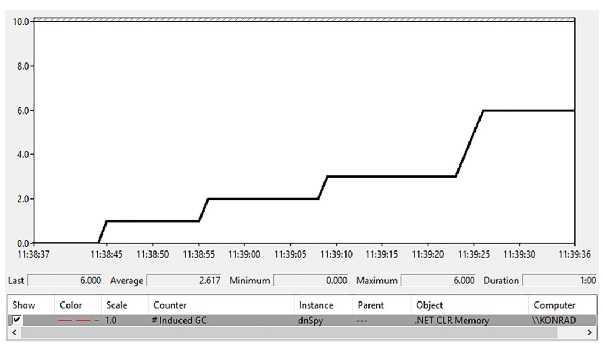

图7-16. dnSpy应用程序启动首分钟内的性能计数器（.\NET CLR Memory(dnSpy)# Induced GC）

在确认存在显式触发的 GC 后，我们使用 PerfView 收集事件及其调用堆栈。具体操作需在 “Collect/Run” 对话框的“Additional Providers”字段中输入：
 `Microsoft-Windows-DotNETRuntime:GCKeyword:Informational:@StacksEnabled=true`

完成记录后，从 Memory Group 中打开 GCStats 报告。在dnSpy进程的“GC Rollup By Generation”表格中（见图7-17的Induced列），可以再次验证显式GC调用的存在。

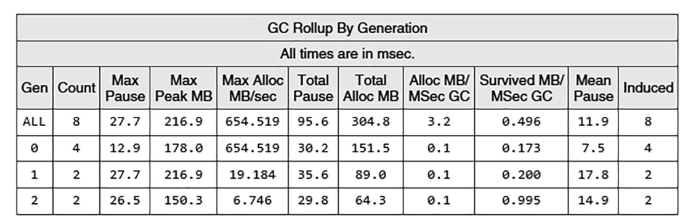

图7-17. dnSpy进程GCStats报告中的分代GC汇总表

接着打开记录会话中的Events面板，定位由显式调用 `GC.Collect` 的线程发出的 `Microsoft-Windows-DotNETRuntime/GC/Triggered` 事件。由于启用了 StacksEnabled 选项，每个事件都附带了对应的调用堆栈（见图7-18）。

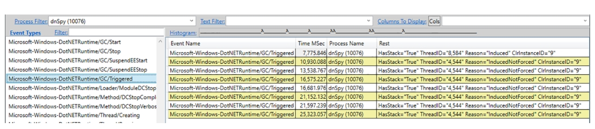

图7-18. 筛选显示 dnSpy 进程的事件视图

`Reason`（原因）字段可能出现的三种值说明：

-  Induced（主动诱发）：显式触发的 GC，不指定压缩与阻塞偏好。
-  InducedNotForced（非强制诱发）：显式触发的非阻塞型 GC。
-  InducedCompacting（压缩诱发）：显式触发的压缩型 GC（仅针对 SOH，请注意 LOH 压缩需通过独立设置显式启用）。

通过右键点击任意值并选择"Open Any Stacks"（查看调用堆栈）选项，您可以查看每次显式 GC 触发的具体堆栈轨迹。

> 表面上看，`Microsoft-Windows-DotNETRuntime/GC/Start` 事件似乎是更理想的分析起点。但该事件实际是从 GC 工作开始时触发的。在本案例中，大多数垃圾回收都在专用 GC 线程上以后台方式处理——这些事件的堆栈轨迹始终指向专用 GC 线程接收启动信号的代码位置，而非 `GC.Collect` 的调用位置。

通过堆栈轨迹分析，您应能识别出显式 GC 触发的两大主要来源（dnSpy 工具及其源代码可在https://github.com/0xd4d/dnSpy获取）：

1. **反编译后的内存清理（见图7-19）**：当反编译完成后，临时缓存中的数据可能已不再需要。此时通过显式调用 `GC.Collect` 触发垃圾回收，可快速释放这些内存。

   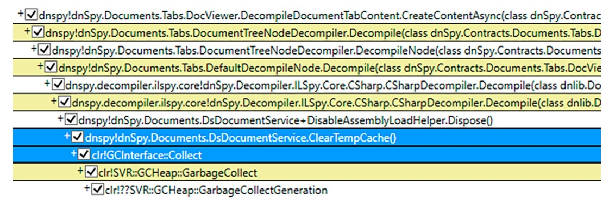

   图7-19. 第一类显式 `GC.Collect` 调用的堆栈轨迹

   对应代码如代码清单7-3所示，其核心思路是：用实现了 `IDisposable` 接口的辅助类封装高资源消耗对象（本例中的`DsDocumentService` 实例）。该辅助类采用**简易引用计数技术**追踪被封装对象的使用状态——当检测到对象不再被使用时，立即触发显式资源清理。

   清单7-3. dnSpy代码中的显式GC调用示例

   ```c#
   sealed class DsDocumentService : IDsDocumentService {
       int counter_DisableAssemblyLoad;
       public IDisposable DisableAssemblyLoad() => new DisableAssemblyLoadHelper(this);
   
       sealed class DisableAssemblyLoadHelper : IDisposable {
           readonly DsDocumentService documentService;
           public DisableAssemblyLoadHelper(DsDocumentService documentService) {
               this.documentService = documentService;
               Interlocked.Increment(ref documentService.counter_DisableAssemblyLoad);
           }
           public void Dispose() {
               int value = Interlocked.Decrement(ref documentService.counter_DisableAssemblyLoad);
               if (value == 0) documentService.ClearTempCache();
           }
       }
   
       void ClearTempCache() {
           bool collect;
           lock (tempCache) {
               collect = tempCache.Count > 0;
               tempCache.Clear();
           }
           if (collect) {
               GC.Collect();
               GC.WaitForPendingFinalizers();
           }
       }
   }
   ```

   清单7-4展示了该类的典型用法：

   ```c#
   using (context.DisableAssemblyLoad()) {
       // 在此代码块内辅助类的引用计数器保持递增状态
       // context包含DsDocumentService实例引用
   }
   ```

   清单7-3仅是防御性内存清理的一种实现方式。开发者也可选择在程序集反编译事件触发时直接调用 `GC.Collect`，或让 `DsDocumentService` 直接实现 `IDisposable` 接口并在 `Dispose` 方法中调用 `GC.Collect`（但会改变类型语义）。另一种方案是在 `DsDocumentService` 的终结器中调用 `GC.Collect`。

   本例展示的手动内存清理属于前文所述的第一类应用场景——开发者通过显式 GC 调用来及时清理用户操作产生的大量临时数据。

2. **位图资源引发的非托管内存控制**（见图7-20）：如图所示，此次 GC 由 WPF 框架内部触发（PresentationCore.dll），发生在图像加载过程中。

   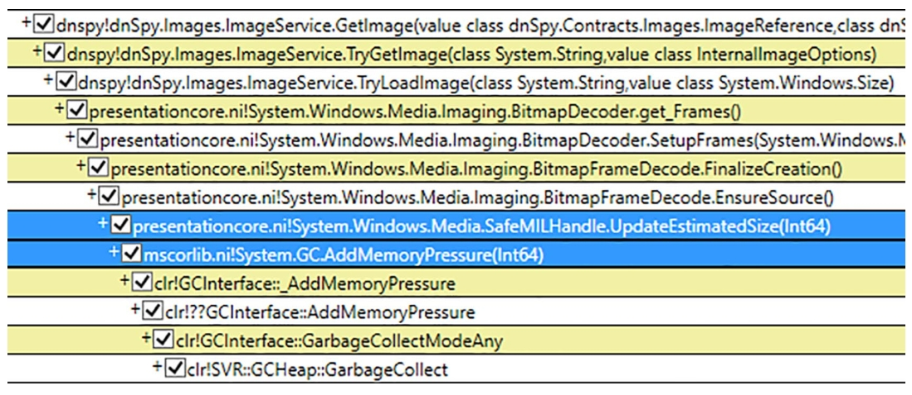

   图7-20. 第二类显式 `GC.Collect` 调用的堆栈追踪

   经分析发现这是一个已知问题。WPF中的 `BitmapSource` 类所表示的位图对象，虽然托管部分体积较小，却持有大量非托管内存的图像数据。由于 GC 无法感知非托管数据的大小，会导致误判。常规解决方案是让 `BitmapSource` 实现 `IDisposable` 接口，并在构造函数和 `Dispose` 方法中分别调用 `GC.AddMemoryPressure` 和 `GC.RemoveMemoryPressure`。但本例采用了不同设计——通过带有引用计数的附加句柄管理位图数据，由该句柄处理内存压力通知（见代码清单7-5）。需注意的是，当内存压力超过阈值时，`AddMemoryPressure` 可能自动触发 GC。

   代码清单7-5. 来自 PresentationCore.dll 的 `SafeMILHandleMemoryPressure` 类（Windows Presentation Foundation）

   ```c#
   namespace System.Windows.Media
   {
       internal class SafeMILHandleMemoryPressure
       {
           internal SafeMILHandleMemoryPressure(long gcPressure)
           {
               _gcPressure = gcPressure;
               _refCount = 0;
               GC.AddMemoryPressure(_gcPressure);
           }
           internal void AddRef() => Interlocked.Increment(ref _refCount);
           internal void Release()
           {
               if (Interlocked.Decrement(ref _refCount) == 0)
               {
                   GC.RemoveMemoryPressure(_gcPressure);
                   _gcPressure = 0L;
               }
           }
           private long _gcPressure;
           private int _refCount;
       }
   }
   ```

   该示例采用了与前文反编译案例相似的引用计数封装模式，但关键区别在于：此次封装器不直接触发 GC，而是通过内存压力机制让 GC 自主决策。若不进行此类通知，GC 触发频率将远低于实际需求，导致应用长期维持高内存占用。随着图像加载数量增加，此问题会愈发显著。在 WPF 应用中观察到此类诱发型 GC 属正常现象，只要不产生过高 GC 时间开销（如% Time in GC指标激增）即可。若问题严重，虽然无法修改 WPF 内部代码，但可在应用层通过创建 `WriteableBitmap` 对象池实现复用。

   > 历史背景：早期版本的 `SafeMILHandleMemoryPressure` 通过自有计数器管理内存使用，并显式调用GC.Collect触发完全回收，但实际效果弊大于利。自.NET Framework 4.6.2起，该逻辑已改用AddMemoryPressure/RemoveMemoryPressure方法交由GC自主管理。

   该分析方法同样适用于.NET Core应用。以Paint.NET为例：绘制几条线段后直接关闭未保存的图像。使用 `dotnet-gcmon -p` 命令检测诱发型 GC 时，可如图7-21所示观察 reason 列中的 Induced/InducedNotForced/InducedCompacting 标记。

   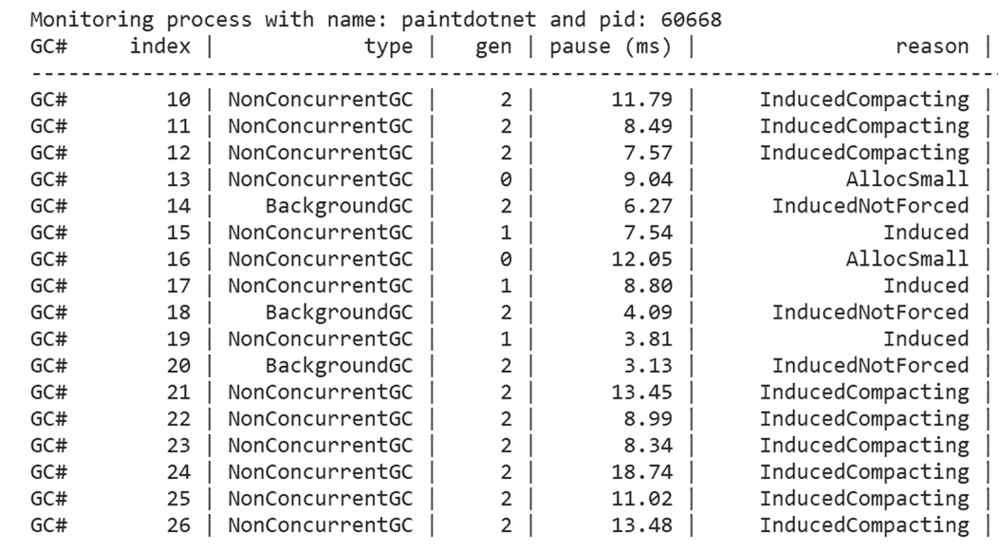

   图7-21. 使用 `dotnet-gcmon` 检测显式 `GC.Collect` 调用
   通过执行 `dotnet trace collect -p <pid>` 命令生成 `.nettrace` 文件，该文件记录了 GC 在此场景下发出的事件。在PerfView 中双击该文件，进入"Open Any Stacks"面板，然后双击"GC/Triggered"行即可查看触发 GC 的方法来源（如图7-22所示）。

   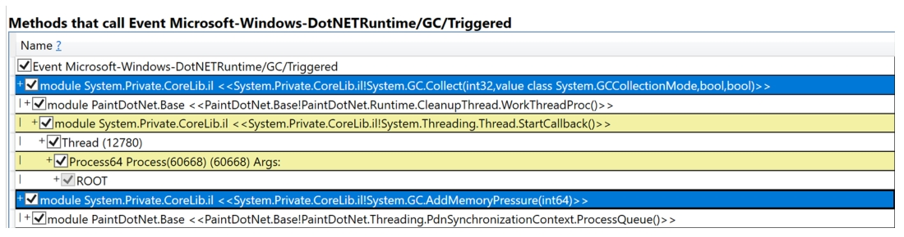

   图7-22. 在 PerfView 中查找触发诱发型 GC 的方法

   与 dnSpy 场景类似，显式的 `GC.Collect` 和 `GC.AddMemoryPressure` 调用是诱发 GC 的根本原因。

### 低内存级别系统触发

在 Windows 系统中，垃圾回收可能由“外部因素”触发。当操作系统检测到内存不足时，会广播“低内存”通知。规范编写的应用程序可以（但非必须）监听此类通知并作出响应，例如尝试减少工作集内存以缓解系统压力。

.NET 运行时会监听该通知。收到通知后，将触发第0代 GC（但在高内存压力下可能升级为完全 GC）。降低内存消耗有助于改善整个系统的运行状态（包括基于 .NET 的应用程序）。

> 低内存通知机制仅 Windows 系统支持。其内部通过 `CreateMemoryResourceNotification` API创建内存资源通知对象，并由终结器线程（第11章将详细介绍）负责监听。选择该线程因其保证在应用整个生命周期持续运行。当 Windows 发出通知时，终结器线程将触发 GC。根据 `System.Runtime.Caching.PhysicalMemoryMonitor` 内部类的注释（该注释源自 Windows 内部实现），当物理内存占用率达到97%-99%时会触发低内存事件（具体阈值取决于系统安装的物理内存大小）。

若要验证低内存通知是否触发应用内的 GC，最简单的方式是通过 PerfView 或 `dotnet-trace` 记录会话，检查 `Microsoft-WindowsDotNETRuntime/GC/Start` 事件中带有 `LowMemory` 和 `InducedLowMemory` 标记的 GC 记录。

需注意 CLR 可能忽略操作系统的低内存通知而不触发 GC，这取决于运行时认为是否值得回收。但通常系统级内存压力会使 GC 行为更激进——前提是这种回收可能释放有效空间。

### 各类内部触发机制

运行时和标准库中还存在多处内部请求 GC 的触发点。这类 GC 大多被标记为诱发型（与显式调用相同），因为从 GC 角度看，触发源来自用户代码、运行时还是托管库代码并无本质区别。

最常见的触发场景包括：

- **应用程序域卸载**：清理 AppDomain 相关对象是触发完全阻塞式 GC 的合理场景（仅.NET Framework支持该机制）
- **死亡线程对象清理**​：长时间运行的应用可能创建/停止大量线程。每个线程对应托管对象，且原生线程句柄需待托管线程清理后才关闭。对于主要处于空闲状态但偶发创建线程的应用，这会导致进程句柄不断累积。预防机制为：当死亡线程超过75个且距上次完全 GC 超过30分钟时，触发非阻塞式回收——该 GC 会回收包含至少37个死亡线程的最高代（通常为第2代，因线程对象往往具有长生命周期）
- **NoGC区域预清理**​：调用 `GC.TryStartNoGCRegion`（参见第15章）时，代码段请求暂时禁用垃圾回收，这可能增加内存压力。因此提前进行主动清理是明智之举——该场景会触发完全阻塞式 GC 以确保回收所有死亡对象（除非向 `disallowFullBlockingGC` 参数传递 `true`）

>  .NET团队内部还使用称为 “GC压力”的诊断机制，通过高频触发 GC 来发现所谓的“GC漏洞”（例如本应报告给 GC 但未被报告的对象）。

上述大多数内部触发在 PerfView 中会显示为 Induced 原因标记。

### EE暂停

在垃圾回收（GC）的某些阶段，执行应用程序代码的线程不应继续运行，因为它们试图访问的对象正被 GC 操作。根据 GC 模式的不同，这些暂停时刻的持续时间也有差异。在非并发模式下，整个 GC 过程都会在用户线程暂停的状态下执行。即使在并发模式下（第11章将详述），也只有部分 GC 工作能与托管线程并行执行，因此仍需要在某些时刻暂停托管线程。

暂停所有执行用户代码线程的过程称为“EE暂停”（Execution Engine suspension，即托管线程暂停）。对于此处描述的非并发 GC 模式，GC 会在工作开始时要求运行时暂停所有托管线程，并在完成后恢复它们。这种强制性方法常被称为"Stop the World"技术——从应用程序视角看，整个运行环境在垃圾回收期间都被冻结。

如《运行时手册》所述：“CLR必须确保所有托管线程都已停止（防止它们修改堆内存），才能安全可靠地定位所有托管对象。线程只会在安全点（safe point）暂停，此时可以检查寄存器和栈位置中的活动引用。”

因此，安全点是指能够检查寄存器和栈中活动引用的代码位置。安全点的实现并不简单，且暂停/恢复操作必须高效，因为这些时间会计入 GC 总暂停时间。虽然从.NET内存管理的角度来看（也是本书的核心主题），这些实现细节并不关键（线程暂停属于执行引擎而非 GC 本身的功能），但理解相关术语很重要——这些术语会出现在内存分析工具（尤其是 WinDbg）中。此外，线程暂停逻辑与本地数据活性（local data liveness）密切相关，后文将展开说明。

从 GC 视角看，每个托管线程可能处于两种模式：

- **协作模式（Cooperative）**：如.NET Core源码注释所述：“当线程处于协作模式时，意味着它可能正在修改 GC 引用，因此运行时必须与其协作，使其到达可安全枚举 GC 引用的‘GC安全’位置。”这是线程执行托管代码时的主要状态。
-  **抢占模式（Preemptive）**：该模式意味着暂停服务无需关注此线程——它保证位于可安全执行 GC 的位置（因其正在运行的代码不涉及 GC 引用操作）。最常见的情况是线程正在执行 P/Invoke 调用的非托管代码。当从本地调用返回时，若 GC 正在进行，线程会自行暂停。

因此，EE 暂停可以定义为强制所有托管线程进入抢占模式的状态。从协作模式到抢占模式的转换只能发生在安全点。每个安全点都会记录线程状态的快照——包括栈布局和寄存器内容（因为它们可能包含对象引用，构成对象树的根节点），这些数据称为 GC 信息（GC info）。若将应用程序所有指令都设为安全点（允许在任何指令处抢占线程），就需要为每条指令存储 GC 信息，这将消耗大量内存！

于是这里采用了折中方案。托管代码可能被 JIT 编译为两种类型：

- 部分可中断代码（Partially interruptible）：仅方法调用处（包括显式的 GC 轮询调用）是安全点。典型.NET方法中方法调用间的指令数通常很少，因此这种方案能以合理的 GC 信息存储开销提供良好的安全点密度，也是 JIT 编译器的首选。
-  完全可中断代码（Fully interruptible）：除方法序言（prolog）和尾声（epilog）外，每条指令都是安全点。JIT 编译器必须为每条指令存储 GC 信息，这使得完全可中断代码能快速暂停。但由于存储开销大，JIT 编译器会尽量避免此方案。典型应用场景包括：含有未知迭代次数且内部无方法调用的循环（无法保证快速结束，可能导致 GC 长时间阻塞）。另一种解决方案是在循环每次迭代中插入 GC 轮询调用。

> 若需深入研究，可在.NET Core代码中查找实现 GC 轮询调用的 `FC_GC_POLL` 和 `FC_GC_POLL_RET` 宏。

如《运行时手册》所言：“JIT基于启发式规则选择生成完全或部分可中断代码，以平衡代码质量、GC 信息大小和 GC 暂停延迟之间的关系。”

暂停过程中，执行引擎会协调所有处于协作模式的线程，强制它们在安全点转入抢占模式：首先调用操作系统 API 暂停底层原生线程（Windows使用 `SuspendThread` 函数），然后：

- 对于完全可中断代码：线程始终处于安全点，直接保持暂停状态。
- 对于部分可中断代码：若线程在非安全点被暂停，执行引擎会修改线程的返回地址（存储在栈中），使其指向一个特殊存根（stub）来“停放”线程到安全点。随后恢复线程执行，线程将在从当前方法返回时运行该存根。

> - **对于完全可中断代码 (Fully Interruptible Code)：**
>
>   - **定义**：这种代码的每一条（或几乎每一条）机器指令执行后，线程都处于一个GC安全点。
>   - **暂停过程**：因为线程被 `SuspendThread` 暂停时，它自然就处于一个安全点了。所以执行引擎不需要做额外的事情，线程直接保持暂停状态，等待GC完成。
>
> - **对于部分可中断代码 (Partially Interruptible Code)：**
>
>   - **定义**：这种代码中，只有特定的点是 GC 安全点。在两个安全点之间，可能有一段较长的代码序列，在这段代码执行期间，线程不处于安全点。JIT 这样做是为了优化性能，避免过多的安全检查。
>   - 暂停过程：
>     1. 线程被 `SuspendThread` 暂停了，但它很可能停在了两个安全点之间的“不安全区域”。
>     2. **执行引擎的“魔法”**：执行引擎检查线程当前的状态。它发现线程不在安全点。
>     3. **修改返回地址**：每个函数调用在线程的栈上都会保存一个“返回地址”，告诉CPU当这个函数执行完毕后应该跳回到哪里继续执行。执行引擎会找到当前正在执行的函数（或其附近的一个合适的函数）的返回地址，并**把它修改掉**。
>     4. **指向特殊存根 (Stub)**：修改后的返回地址不再指向原来的调用者，而是指向一个由运行时准备好的、非常短小的特殊代码片段，称为“存根 (stub)”。
>     5. **临时恢复线程**：执行引擎会短暂地恢复线程的执行。
>     6. **线程继续执行到“被修改的返回点”**：线程继续执行当前函数中剩余的指令。当这个函数执行完毕，准备“返回”时，它会查看栈上的返回地址。但这个地址已经被修改了！
>     7. **执行存根**：于是，线程不会返回到原来的调用者，而是跳转到那个特殊的“存根”代码。
>     8. 存根的工作：这个存根代码的作用就是：
>        - 通知GC：“这个线程现在已经到达一个安全的地方，可以暂停了。” (它把线程“停放”到了一个安全点)。
>        - 然后线程就在这个存根里等待，直到GC完成。
>   - **恢复线程**
>     - GC 完成了它的工作。
>     - 执行引擎会通知所有被暂停的线程：“好了，你们可以继续工作了。”
>     - 对于那些被“劫持”到存根的线程，存根会负责把原来的返回地址恢复，然后让线程从它真正应该继续的地方开始执行。
>
>   也就是说，GC不能直接在非安全点使用线程，所以它耍了个花招： 它让线程继续执行完当前正在做的“一小段不安全的工作”（通常是当前函数的剩余部分），然后通过修改线程的“下一步计划”（返回地址），把它引导到一个“安全停车场”（存根），在那里等待GC结束。

恢复线程比暂停简单得多。GC 完成后，通过触发暂停结束事件，所有暂停线程将被唤醒并继续执行。

可通过CLR事件对 `GCSuspendEEBegin_V1/GCSuspendEEEnd_V1` 和 `GCRestartEEBegin_V1/GCRestartEEEnd_V1` 来监控 GC 暂停与线程恢复过程。

在结束线程暂停主题前，还有最后一个要点。将线程从协作模式切换到抢占模式存在成本：除了簿记开销外，主要来自一个潜在问题。要理解这点，需先了解调用约定（calling conventions）——函数调用时，调用方与被调用方通过“调用约定”确定参数和返回值的存储位置，以及寄存器值恢复的责任方（调用方清理/被调用方清理/混合模式）。当采用被调用方清理约定时，方法执行期间寄存器值的存储位置无法确定（可能被复制到其他寄存器/压入栈/弹出等），唯一保证是方法返回前会恢复原始值。若此时发生垃圾回收就会产生问题：若对象被移动，GC 需要更新所有指向它们的值。但如果该值在原生被调用方清理方法执行期间存于寄存器中，GC 无法追踪当前存储位置，方法返回时将恢复旧值。这意味着运行时在切换到抢占模式前，不能将任何值保留在寄存器中。因此 JIT 会生成“栈溢出”（stack spill）指令：在切换到抢占模式前通过一系列"push"指令将所有寄存器值保存到栈中，返回协作模式时再通过"pop"指令恢复。这样当线程处于抢占模式时发生 GC，运行时可直接更新栈中的值，无需关心原生方法对寄存器的操作。

显然，栈溢出操作有成本——会给 `P/Invoke` 调用增加若干纳秒开销。对于耗时毫秒级甚至数百微秒的方法可忽略不计，但对于瞬时返回的简单方法则代价过高。为此 .NET 5 引入了 `SuppressGCTransition` 特性：当应用于 `P/Invoke` 方法时，它会移除“GC转换”（GC transition），使线程在原生调用期间保持协作模式。这意味着该原生调用期间不会发生垃圾回收（执行引擎会尝试暂停线程，但原生代码内无安全点，只有方法返回后才会处理）。这样 JIT 无需生成栈溢出指令，减少了调用原生方法的开销。但这是把双刃剑：若在原生调用期间触发 GC，执行引擎仍会暂停其他所有线程等待该线程结束调用，导致应用程序实际上只有原生线程在工作时处于冻结状态。因此 `SuppressGCTransition` 仅适用于保证在极短时间内（几纳秒）完成的方法，绝对不可用于涉及I/O或同步的方法——否则弊远大于利。

### 场景7-4 – 分析GC暂停时间

描述：在开发.NET应用程序时，出于好奇你想了解GC暂停实际耗时。此处不应预期存在任何问题，纯粹出于你的求知欲。

分析：借助前文提到的CLR事件，计算GC暂停与恢复时间十分便捷。对于.NET Core应用程序，最简单的方式是配置dotnet-gcmon并添加-c参数，如图7-23所示选择暂停时间（毫秒）列即可。

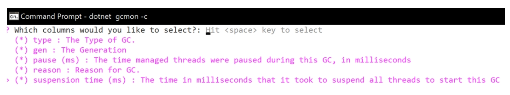

图7-23  使用dotnet gcmon -c命令选择暂停时间（毫秒）列

随后，在命令行通过 `-p` 参数指定应用程序的进程ID。当应用程序触发垃圾回收时，你将看到每次 GC 的暂停持续时间，如图7-24所示。

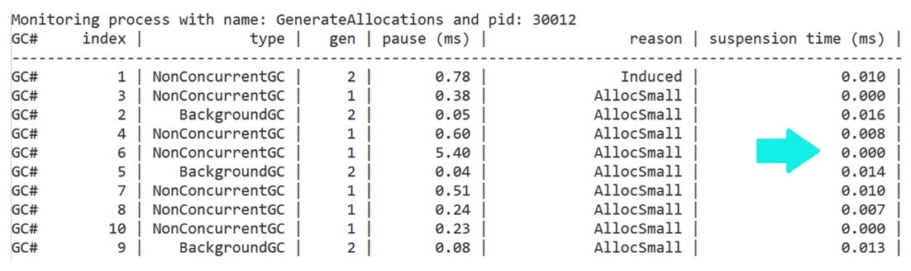

图7-24  通过 `dotnet gcmon` 查看 GC 暂停时间

对于.NET Framework应用程序，或需要分析通过 `dotnettrace` 记录的会话时，可使用PerfView中的GCStats报告。"GC Events by Time"表格清晰汇总了每次 GC 事件（见图7-25中的 Suspend Msec 和 Pause MSec 列）。可见，等待线程暂停的耗时（Suspend）远低于 GC 暂停本身（Pause）的耗时。

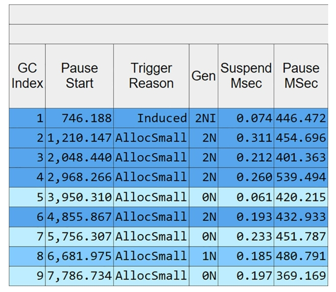

图7-25  PerfView的GCStats报告中"GC Events by Time"表格显示的暂停与停滞时间

正常情况下，应用程序执行期间不应观察到显著的线程暂停耗时。若出现此现象，很可能意味着运行时存在缺陷——因为开发者无法控制 GC 暂停机制。例如，.NET 2.0曾存在一个缺陷：当 CPU 密集型循环重复执行相同代码且未到达安全点时，会导致暂停时间延长至数秒，该问题已在.NET 4.0中修复。常规应用中，长时间I/O操作或线程优先级混乱可能导致暂停时间延长（例如超过1毫秒)。

## 垃圾回收调优

当垃圾回收器（GC）被触发以回收特定代际时，它可能会决定回收与指定代际不同的代际。根据各种条件，GC 还可能强制或阻止压缩操作，或改变其他默认行为。因此，即使某个操作（包括您的 `GC.Collect` 调用）请求回收特定代际，GC 也可能基于静态和动态 GC 数据（前文已详述）中的多种启发式规则，决定回收不同代际。

本节将列举不同条件下可能改变回收代际的各类原因，帮助您理解应用程序中实际发生的 GC 行为背后的逻辑。

需注意此处决策顺序的重要性：每个后续决策（启发式规则）通常会提升回收代际。换言之，若某个检查决定回收第2代，而后续检查建议回收第1代，最终仍会回收较老的代际（第2代的决策会覆盖第1代建议）。后文将详述少数例外情况。

以下是可能改变回收代际的各类决策（括号内名称源自PerfView的“GC回收代际原因”表格，这是分析此阶段的最佳工具）：

- **分配预算超限（Generation Budget Exceeded）**：回收超过分配预算的最老代际。对于大对象堆（LOH）将回收第2代（触发完全 GC），但仅当后台 GC 未运行时生效。这意味着即使对象分配时仅检测到第0代预算超限，仍可能因老年代预算问题回收更老的代际。场景7-2展示了此类典型情况。

- **基于时间的调优（Time Tuning）**：GC 会关注各代际回收次数与时间间隔的合理比例（仅在工作站模式且处于 `Interactive` 或 `SustainedLowLatency` 延迟模式时生效）。若某代际距上次回收时间超过阈值且低代际 GC 次数达到上限，则可能回收该代际。阈值参见表7-1和7-2的 `time_clock` 与 `gc_clock` 列。具体表现为：

  - 若第1代超过10秒未回收且发生10次 GC，则可能回收第1代。

  - 若第2代超过100秒未回收且发生100次 GC，则可能触发完全 GC。

  这种机制适应了工作站模式进程不如服务器模式规律的特点，使 GC 能更快识别分配/存活模式。业界常提及的“GC黄金法则”（健康应用中各代回收次数比应为 `1:10:100`）正源于此时间调优机制。但需注意该比例仅适用于工作站 GC 模式，且现代场景中已不再普遍适用。健康的 GC 比例远比这种简单比率复杂且动态。

- **卡表效率低下（内部调优）**：卡表中存在过多“跨代引用错误”。回顾第5章介绍的卡表机制，您可能记得它会带来一定开销。每张卡对应一片连续内存区域，其中可能存放多个对象。每个对象可能包含指向其他对象的引用，但只有部分引用真正属于跨代引用——即指向正在被回收代中的对象。这些“有效”引用占所有引用的比例称为卡表效率。当卡表效率过低时，意味着需要无意义地遍历大量对象。因此若该数值跌破阈值，就应当回收第1代。这样可将长生命周期对象集中迁移至第2代，从而消除大部分跨代引用。

- **临时段空间不足（临时段低水位与低碎片化第2代）**：包含第0代和第1代的堆段（更准确说是该段预留内存的剩余空间）不足第0代最小尺寸的两倍时，将回收第1代以释放临时内存（原因标记为临时段低水位）。若此时第2代存在足够容纳（经压缩后的）第1代的碎片空间，则会同时回收第2代并触发完全GC（原因标记为低碎片化第2代临时段）。这意味着当临时段空间紧张时，垃圾回收器会采取更激进的回收策略（主要是增加第1代回收频率），以避免申请新堆段（或扩展当前堆段）。

- **临时代碎片化严重（碎片化临时代）**：当第0代或第1代的碎片化程度超过阈值时，将回收对应代。

- **临时段空间耗尽需扩展堆段（扩展堆）**：当临时代持续增长且无法通过回收满足空间需求时，将回收第2代（触发完全阻塞式GC）。此规则不适用于区域化堆。

- **分配期间空间耗尽（压缩式完全GC）**：作为内存分配器抛出 `OutOfMemoryException` 前的最后手段，将触发完全阻塞式压缩GC。

- **高内存负载**（参见后续说明）或操作系统发出低内存通知，且第2代严重碎片化（高内存压力）：执行阻塞式完全 GC 以缓解内存压力。

- 高内存负载或操作系统发出低内存通知，且第2代预算即将耗尽（最大代预算）：更激进地触发完全GC。

- **第2代碎片化超标（碎片化第2代）**：当第2代碎片化程度超过阈值时将回收该代。

- **第2代、LOH或POH过小无法执行后台GC（小堆）**：此时将触发完全阻塞式 GC。

- **避免无效完全GC（避免无效完全GC）**：当检测到压缩式完全 GC 收效甚微时（例如需要扩展第2代最后区域或为其申请新区域），会降级为仅回收第1代。

- **三种与预备模式相关的原因（预备模式诱导、预备模式LOH分配、预备模式）**：详见下节说明。

- **三种与硬内存限制设置相关的原因（硬限下压缩完全GC、硬限下LOH碎片、硬限下LOH回收）**：本章后续详解。

- **作为后台完全 GC 初始阶段的临时代回收（BGC前临时代回收）**：第11章将展示其运作机制。

- **在低延迟模式下，仅允许回收第0代或第1代（将覆盖此前所有决策）。**

此外还存在一组特殊模式下的回收判定原因，包括**预备模式**、内存"硬限制"约束条件以及实验性的**伺服调优模式**，这些将在后续章节详细说明。

> 前文提及的**高内存负载状态**指系统物理内存使用率超过特定阈值（通常为90%）。对于配备大量逻辑核心且内存超过 80GB 的高性能机器，该阈值可能上调至97%。实际上还存在第二级“极高内存负载”阈值，其值比默认阈值高7%（即通常为97%）。可通过 `GCHighMemPercent` 配置变量覆盖默认阈值值。
>
> 需特别注意，高内存负载状态会从多个维度影响 GC 行为，使其采取更激进的内存回收策略，具体表现为：
>
> - 更倾向于执行阻塞式压缩回收（尤其在“极高内存阈值”状态下）
> - 执行内存区域解除提交（decommit）
> - 可能触发大对象堆（LOH）压缩
> - 是触发**预备模式**的必要条件（详见后文对应章节）

在前述部分回收决策中，**碎片化阈值**起着关键作用。各代均维护独立的阈值，该阈值由静态代数据中的两个参数构成（见表7-1和7-2）：

- 因不可用碎片化浪费的内存总量

  - 未被分代分配器管理的闲置空闲空间：其中包括清扫过程中产生的小间隙（后文将详述），以及短暂分代中因适配失败而被丢弃的空间（如第5章所述，这些分代中的空闲列表项仅被检查一次后即释放）。
  - 预期分配器效率：表征截至目前空闲列表项的实际复用效果

- 该值对应表7-1和7-2中的`fragmentation_limit`列（汇总数据见表7-3）。

  表7-3 各代碎片化阈值

  |       | 碎片化限制值 | 碎片化比率 |
  | ----- | ------------ | ---------- |
  | 第0代 | 40,000       | 75%        |
  | 第1代 | 80,000       | 75%        |
  | 第2代 | 200,000      | 50%        |

- **碎片化比率**：指当前分代中不可用碎片总大小与该分代整体大小的比值。该数值通过将表7-1和表7-2中的 `fragmentation_burden_limit` 列数值翻倍计算得出，但最高不超过75%（完整阈值参见表7-3）。

例如：若第2代分代中不可用碎片大小超过200,000字节，且超过该分代总大小的50%，则判定该分代碎片化程度过高。

### 硬性内存限制

您可以通过配置 `GCHeapHardLimit` 或 `GCHeapHardLimitPercent` 来指定 GC 堆大小的硬性上限。这两个参数分别以绝对值或百分比形式（相对于物理内存总量）设定 GC 堆的最大提交大小。

对于64位运行时，若进程运行在设置了内存限制的受限环境中（Windows 作业或 Docker 容器），GC 的硬性内存限制会自动设为内存限制值的75%（但不低于20 MB）。例如，运行在内存限制为1 GB容器中的.NET进程，其 GC 硬性内存限制将自动设为750 MB。

需注意，降低硬性内存限制会增加进程进入前文所述高内存负载场景的概率。这是设计使然——通过促使 GC 更积极地回收内存，从而在严格内存限制下避免内存耗尽异常。

此外，硬性内存限制的存在（无论是通过配置设置还是容器环境）会引入三种新的代回收场景。这些场景都会触发大对象堆（LOH）压缩，以防止因内存碎片化触达内存限制：

- 抛出 OOM 异常前的最终回收（硬性限制下的压缩完全回收）。
- 为消除 LOH 碎片化执行的完全回收（硬性限制下的 LOH 碎片回收）——当 LOH 碎片超过硬性限制1/8时触发。
- 因预估可回收大量 LOH 内存执行的完全回收（硬性限制下的 LOH 内存回收）——当 GC 规划阶段发现潜在可回收的 LOH 内存超过硬性限制1/8时触发。

### 临时模式

在垃圾回收器（GC）的运行模式中，有一种能自动激活并影响 GC 决策的模式——**临时模式（provisional mode）**。用 Maoni Stephens 的话来说：“GC启动后，可能会改变其原本计划采用的回收类型”。这种决策是临时性的，因此得名。其目标是通过针对不同场景的精细调整，让 GC 变得更“智能”。作为开发者，你无法控制临时模式，它对用户完全透明。

在.NET 8版本中，临时模式仅在一个特定场景下触发——当系统处于“高内存负载”状态下执行完全阻塞式 GC（full blocking GC）时，若检测到第2代堆（Generation 2）存在严重碎片化，该模式就会启用。当后续的完全阻塞式 GC 检测到这两个条件都不再满足时，临时模式会自动关闭。

临时模式的运行机制可通过以下维度说明：

- **启用时机**：在完全阻塞式 GC（包括后文将解释的 `PMFullGC` 模式）结束时。
- **触发条件**​：需同时满足高内存负载状态且第2代堆存在显著碎片化——当前具体判定标准有两个：第2代堆占用超过托管堆总大小的50%，且其碎片化率超过10%。
-  ​**执行效果**​：由完全 GC 改为执行压缩式第1代 GC（compacting Gen1 GC），通过填补第2代堆的空隙来替代低效且昂贵的完全压缩式GC。
- **终止条件**：若在第1代 GC 执行期间，发现第2代堆体积增大（这表明第1代存活对象已无法填入第2代剩余空间），系统会立即触发名为 `PMFullGC`（可在 PerfView 中观察到）的压缩式完全 GC。此次 GC 可能结束或延续临时模式。

在临时模式运行期间，你会观察到前文提及的三种特殊回收标记：

- **临时模式诱导**（Provisional Mode Induced）：完全 GC 被转换为阻塞式 GC。
- **临时模式LOH分配**（Provisional Mode LOH alloc）：因大对象堆（LOH）分配触发的 GC 被转为阻塞式 GC。
- **临时模式**（Provision Mode）：完全 GC 被转换为压缩式第1代 GC。

前两种标记的解释如下：当完全 GC 在临时模式下执行时，为保证系统稳定性，总是采用阻塞模式。这是为了避免出现前台 GC 持续请求压缩式完全 GC 却无法立即执行的矛盾状态。

### “伺服调优”

在.NET 8时期，这项名为“BGC伺服调优”的实验性 GC 功能默认处于禁用状态。可通过 `BGCFLTuningEnabled` 和 `BGCMemGoal` 配置参数启用。该名称可能源自“伺服电机调优(servo motor tuning)”，其设计目标是通过闭环反馈机制实现特定内存使用目标的动态调谐。此处提及主要是为未来提供参考。

启用该功能后会新增以下几种代际回收触发原因：

- **伺服初始化(Servo Initial)**：当伺服调优机制需要通过触发完全后台 GC 来获取初始数据时发生。
- **伺服阻塞式GC(Servo Blocking gc)**：当伺服调优判定需要执行阻塞式 GC 时发生。
- **伺服后台GC(Servo BGC)**：当伺服调优判定适合执行后台 GC 时发生。
- **伺服零代GC(Servo Gen0)**：当伺服调优决定应推迟一代 GC 并优先执行零代 GC 时发生。

### 场景7-5 —— 代际回收原因分析

**场景描述**：您需要了解应用程序中最常见的 GC 触发原因，分析哪些代际被回收及其触发机制。这类深度分析通常仅适用于特定场景（例如发现频繁发生完全 GC 时，需要定位根本原因）。

**分析方法**：目前最有效的分析手段是使用 PerfView 工具解析 GCStats 报告。在录制会话时勾选“『仅GC收集』”选项后，工具生成的“GC代际回收原因”表格将提供完整解释（参见图7-26）。本场景延续了场景7-2中对前五次 GC 的详细分析，此处可观察这些 GC 在 PerfView 中的具体表征。分析时请参照前文列出的各类代际回收决策名称进行对照解读。

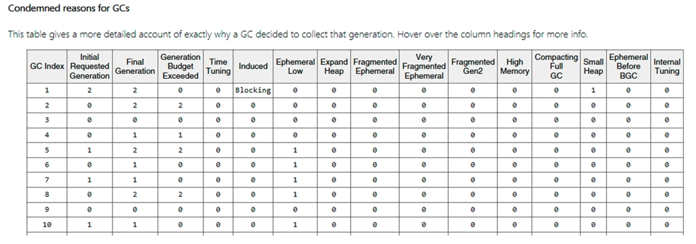

图7-26. PerfView中GCStats报告显示的"GC代际回收原因"表格
 此处可清晰验证我们在场景7-2中对前五次GC的分析结论：

- **GC#1** 被显式触发（Induced 列显示 Blocking 值），要求执行完全 GC（“初始请求代际”值为2），实际也以完全 GC 执行（“最终代际”值为2）。
- **GC#2**​ 初始请求为0代回收（“初始请求代际”值为0）——因该代分配预算耗尽。但由于第2代预算也同时耗尽（“最终代际”值为2），最终升级为完全 GC。需特别说明的是，实际触发因素是 LOH（大对象堆）分配预算超限，但如前所述，LOH 在 GC 机制中被视同第2代处理。
-  ​**GC#3**​ 初始请求为0代回收并实际执行，系统判定无需升级其他代际。
-  ​**GC#4**​ 初始请求为0代回收，但因第1代分配预算耗尽，最终升级为1代回收。
-  ​**GC#5**​ 初始请求为1代回收（Ephemeral Low 列值为1，对应 OutOfSpaceSOH 状态），但由于第2代分配预算耗尽，最终仍升级为完全GC。

仔细分析“GC的 condemned 原因”表，并结合“按时间统计的GC事件”表，可以深入洞察应用程序的垃圾回收行为。但这是一项相当枯燥且费时费力的工作。您可以查看“GC的 condemned 原因”表，寻找常见模式、高频重复原因等。遗憾的是，目前还没有工具能对这些判定原因进行整体汇总分析。

以下列出的指标尤其值得关注，它们可能预示着代码存在问题：

- **主动触发（Induced）**：显式调用GC通常缺乏合理性。若频繁出现，建议排查具体原因（参见场景7-3）。
- **临时段碎片化（Fragmented Ephemeral）和二代堆碎片化（Fragmented Gen2）**：频繁出现表明内存碎片化问题。您需要更深入理解应用程序的内存分配模式（参见场景5-2和6-2）。

> 若需自行分析.NET Core代码，请仔细阅读 `gc_heap::generation_to_condemn` 方法。所有  `condemned ` 原因均在该方法中逐一检查。

### 场景7-6 – 临时模式（Provisional Mode）

现象描述：频繁出现完全 GC（Full GC）。您可以通过 `dotnet-trace` 采集会话数据，并在PerfView的GCStats报告中观察GC行为（方法与前一场景完全相同）。此时会发现所有完全GC的触发原因均为 `PMFullGC`。让我们深入分析！

分析过程：为演示本场景，我们使用一个模拟案例——ProvisionalModeApp 程序人为制造了因内存碎片导致二代堆（Gen2）持续增长的情境。若通过 `GCHighMemPercent` 参数大幅调低“高内存阈值”，即可观察到临时模式的运作机制。应用程序运行初期，GC行为完全正常（见图7-27与图7-28）。

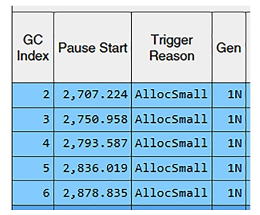

图7-27. 应用程序初始阶段GC事件表

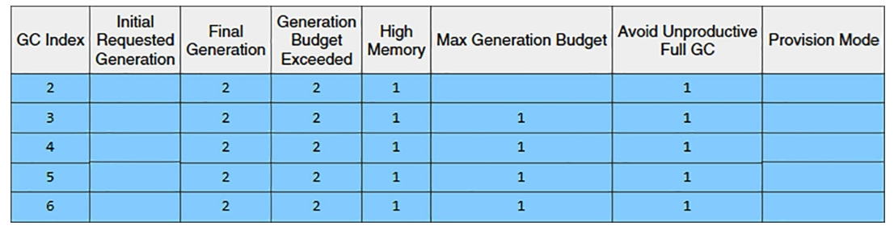

图7-28. 应用程序初始阶段“GC判定原因”表

虽然存在因小对象分配触发的GC，但由于高内存负载状态及持续增长的二代堆(Gen2)，此时可见"High Memory"(高内存)和"Avoid Unproductive Full GC"(避免无效完全GC)等判定原因。

从第7次GC开始出现关键变化(见图7-29)。

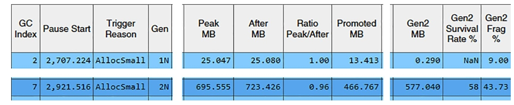

图7-29. 第7次GC详情——满足启用临时模式条件的关键GC

本次GC由小对象分配触发，但最终演变为阻塞型完全GC。更重要的是，它显然满足“临时模式”的启用条件：

- 处于高内存负载状态
- 二代堆占用超过托管堆总内存的50%(577MB vs 723MB)
- Gen2碎片化率超过10%(实际达43.73%)

因此可以预期系统将启用临时模式。这一变化在第8次GC中得到明确验证(见图7-30)。

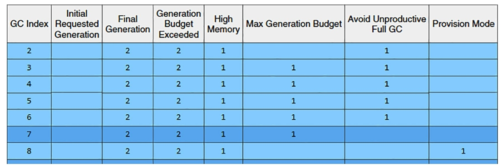

图7-30. 第8次GC详情——因临时模式将完全 GC 降级为 Gen1 GC

由于AllocSmall（小对象分配）触发了Gen0垃圾回收（GC），按照预期本应因最终代（Final Generation）和代预算超限（Generation Budget Exceeded）而转为阻塞式完全GC（Full GC）。但实际由于处于临时模式（Provisional Mode），该回收被转为Gen1压缩式GC（此时可见回收原因标记为“Provision Mode”临时模式）。

如“临时模式”章节所述，此类 Gen1 GC 会在工作结束时检查 Gen2 代的大小是否增长。若检测到增长，则会立即触发一次压缩式完全 GC（compacting Full GC）。

这正是当前发生的场景：随后的完全GC以 `PMFullGC` 为原因被触发（参见图7-31）。

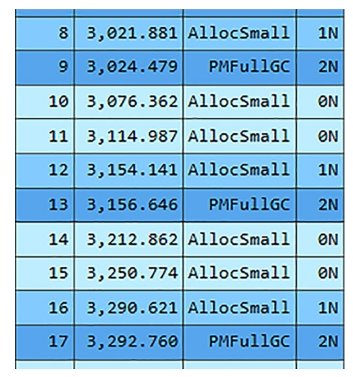

图7-31. 展示 `PMFullGC` 反复触发模式的连续GC详情

如图7-31所示，后续情况开始循环往复——由于AllocSmall（小对象分配）会定期触发 Gen0 垃圾回收，其中部分回收会升级为 Gen1 回收。由于当前仍处于临时模式（Provisional Mode），且明显可见 Gen2 代容量持续增长，系统会立即调度一次"PMFullGC"完全 GC 来执行清理，并在回收结束时决定是否继续维持临时模式。这一机制在前文所述临时模式的"Until"（终止条件）部分已有说明。

在我们这个人为设计的示例中，由于刻意制造了内存泄漏且 Gen2 代存在严重内存碎片，这种模式会无限循环下去。请注意，在此场景的 PerfView 数据中，您不会看到"Provisional Mode Induced"（临时模式诱发）或"Provisional Mode LOH alloc"（临时模式大对象堆分配）这两种回收原因——它们需要不同的内存碎片/堆使用模式才会出现。

## 本章总结

在本章中，我们开始深入探究.NET内存管理的核心——垃圾回收器（Garbage Collector）。首先从宏观视角出发，循序渐进地讲解并演示了垃圾回收工作负载的整体概念。随后详尽剖析了垃圾回收的各个主要阶段。虽然后续三个章节会深入探讨这些阶段，但本章重点解释了前三个关键环节：

- 触发垃圾回收的机制。
- 整个运行时如何协作执行EE暂停（即暂停所有托管线程）。
- 垃圾回收器如何选择要回收的代。

鉴于这些主题的重要性，本章还提供了五个实际应用场景的分析——包括如何检测GC使用情况以及定位显式调用 `GC.Collect` 的方法。

掌握了本章的所有知识要点后，我们将继续解析垃圾回收的后续阶段。下一章将深入讲解标记阶段（Mark phase）的具体实现。
