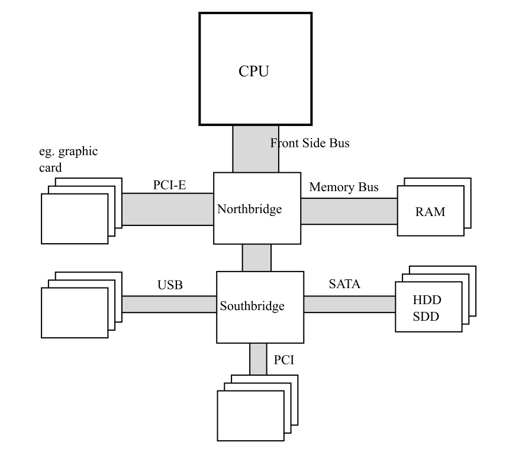
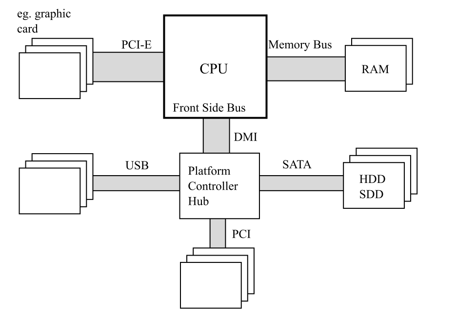
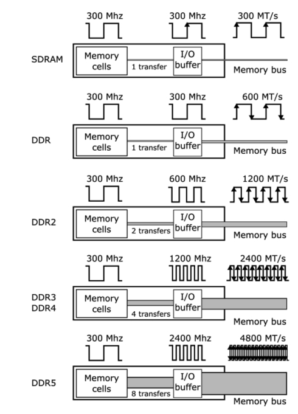
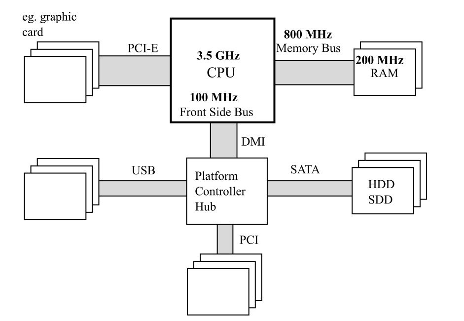
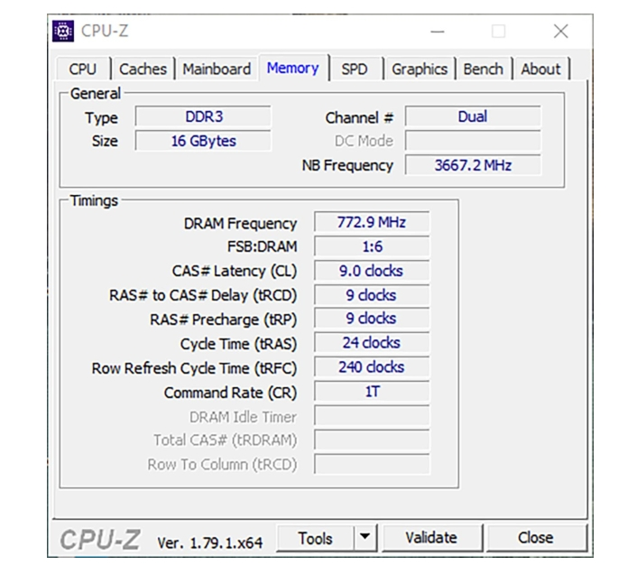
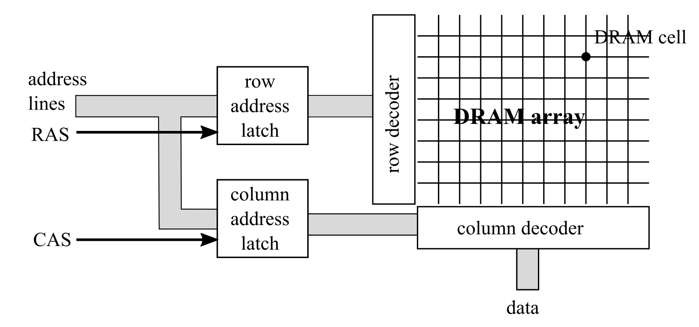
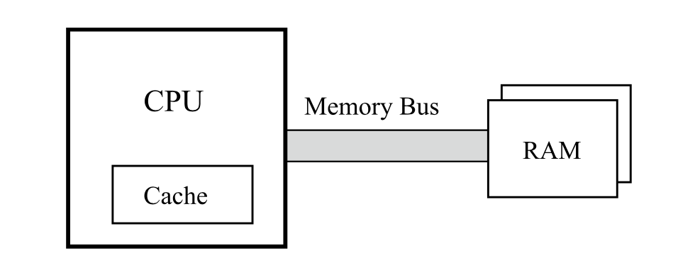

# 底层内存管理

在上一章中，您学习了内存管理的理论基础。现在，您可以直接跳转到自动内存管理的具体细节，了解 **Garbage Collector（垃圾回收器）** 的工作原理，以及可能导致内存泄漏的情况。但如果您真的想彻底掌握这个主题，那么花一些时间深入了解**内存管理的底层机制**是非常值得的。这将帮助您更好地理解 .NET（以及其他托管运行时环境）中 Garbage Collector 设计者所做出的各种决策。

这些机制的设计者并非在真空中工作，他们必须适应计算机硬件和操作系统的各种限制与机制。本章将向您介绍这些**机制与限制**。老实说，要用不让人感到负担的方式来讲解这些内容并不容易。然而，如果不涉及这些细节，就无法完整地理解 .NET 中的内存管理。

尽管在 .NET 的大多数内存管理场景下，`new` 运算符已经足够，但深入理解底层进程和机制仍然大有裨益。**硬件、操作系统和编译器**共同影响了 .NET 的工作方式及其实现，尽管这些影响并不总是显而易见。这些知识与上一章提到的 **Mechanical Sympathy（机械共鸣）** 的理念高度一致。

我们希望您也会觉得这里提到的一些小知识点很有趣。当然，如果您时间紧迫，或者更想直接进入 .NET 内部实现和实际示例，也可以**快速浏览本章，等以后有空时再深入阅读**。

## 硬件

现代计算机是如何工作的？您可能已经对这个主题有了基本的了解：计算机的核心是 **处理器（Processor）**，它是主要的计算单元，负责执行程序代码。处理器可以访问 **RAM（随机存取存储器）**，它的速度很快；也可以访问 **硬盘（HDD 或 SSD）**，但速度较慢。此外，还有 **显卡（Graphics Card）**，对于游戏玩家和各种图形设计师来说至关重要，它负责生成显示在屏幕上的图像。

然而，这种**宏观**的理解并不足以支持我们深入探讨本章的内容。接下来，我们将更深入地了解现代计算机的体系结构，如 **图 2-1** 所示。

典型计算机架构的主要组件如下：

- **处理器（Processor，CPU，中央处理单元）**：计算机的核心单元，负责执行指令（在第 1 章已经介绍）。其中包含**算术逻辑单元（ALU）、浮点运算单元（FPU）、寄存器（registers）、指令执行流水线（instruction execution pipelines）**等组件，这些组件可以将指令拆分成多个小操作，并尽可能并行执行。
- **前端总线（Front-Side Bus，FSB）**
  连接 **CPU 与 Northbridge** 之间的数据总线。
- **Northbridge（北桥）**
  主要包含**内存控制器（Memory Controller）**，负责管理 CPU 与内存之间的通信。
- **RAM（随机存取存储器，Random Access Memory）**：计算机的主存储器，存储数据和程序代码，只有在通电时才会保留数据，因此也被称为**动态 RAM（DRAM）或易失性存储器（volatile memory）**。
- **内存总线（Memory Bus）**：连接 **RAM 与 Northbridge** 之间的数据总线。
- **Southbridge（南桥）**：负责处理所有**I/O（输入/输出）**相关的功能，例如 **USB、音频、串行端口（Serial）、系统 BIOS、ISA 总线、中断控制器（Interrupt Controller）** 以及 **IDE 通道（PATA 或 SATA，存储控制器）**。
- **存储 I/O（Storage I/O）**：**非易失性存储（Nonvolatile Memory）**，主要存储数据，例如常见的 **HDD（机械硬盘）或 SSD（固态硬盘）**。

**图 2-1**. 计算机架构——CPU、RAM、北桥、南桥及其他组件

这幅图展示了计算机的基本架构，其中包括中央处理器（CPU）、随机存储器（RAM）、北桥（Northbridge）、南桥（Southbridge）以及其他硬件组件。图中数据总线的宽度大致表示了各部分之间数据传输量的比例（非常粗略的示意）。

在过去，**CPU、Northbridge 和 Southbridge** 是独立的芯片。然而，随着计算机架构的不断演进，这些组件已经被整合。从 **Intel Nehalem** 和 **AMD Zen** 微架构开始，Northbridge 直接集成到了 **CPU 核心（CPU Die）** 内部，在这种情况下，它通常被称为 **Uncore** 或 **System Agent**。这种架构的演变在 **图 2-2** 中展示。

**图 2-2**. 现代硬件架构 - CPU 内部集成了 Northbridge，连接 RAM 和 Southbridge（在 Intel 术语中已更名为 **Platform Controller Hub**），以及其他组件。总线的宽度大致表示数据传输量的比例（仅为粗略示意）。

这种集成化设计的好处在于，**内存控制器（Memory Controller）**（原属于 Northbridge）被放置在更接近 CPU 执行单元的位置，从而减少了由于物理距离造成的延迟，并提高了协同工作效率。然而，市场上仍然存在一些采用传统架构的处理器（最著名的是 **AMD FX 系列**），它们仍然将 **CPU、Northbridge 和 Southbridge** 作为独立组件。

任何内存管理机制的主要挑战都来源于 **CPU 与内存及存储子系统之间的性能差距**。处理器的速度远超内存，因此每次访问内存（无论是读还是写）都会引入额外的延迟。当 CPU 需要等待数据访问时，就会产生 **stall（停滞）**。这种停滞会降低 CPU 的利用率，因为 CPU 的时钟周期会被浪费在等待上，而不是执行实际任务。

目前，主流处理器的运行频率通常在 3 GHz 及以上，而内存的内部时钟频率则处于完全不同的数量级，仅为 200–400 MHz。制造运行频率与 CPU 相同的 RAM 成本极高，因为现代 RAM 依赖于**电容的充放电**来存储数据，而缩短充放电时间极为困难。

您可能会惊讶于内存的实际运行频率如此之低。毕竟，在计算机市场上，内存模块通常标注为3200 MHz 或 4800 MHz，这些数字似乎更接近 CPU 速度。这些规格从何而来呢？接下来我们会揭示其中的技术细节。

内存模块由**内部存储单元（internal memory cells）** 以及**额外的缓冲区（Buffers）**组成，后者有助于弥补低时钟频率的限制。现代 DDR（Double Data Rate）内存采用了多种优化技术（见**图 2-3**）：

- **双倍数据速率（Double Data Rate，DDR）**
  通过**双沿触发（Double Pumping）**，在**单个时钟周期内发送两次数据**（分别在时钟信号的上升沿和下降沿进行数据传输）。这就是 DDR 内存的核心原理，也称为**双倍速率传输（Double Pumping）**。
- **突发模式（Burst Mode）**，通过内部缓存（Internal Buffering），在一个内存时钟周期内一次性读取多个数据。
  - **DDR2** 将外部时钟频率提升 **2 倍**
  - **DDR3 和 DDR4** 提升 **4 倍**
  - **DDR5** 进一步提升 **8 倍**

相比过去使用的 **SDRAM（Synchronous DRAM）**，现代 DDR 模块的读写效率大幅提升。例如，在 **DDR5** 内存中，由于**结合了双倍速率传输（Double Pumping）和 8 次数据读取**，每个时钟周期的“突发长度（Burst Length）”达到了 16。

**图 2-3**. SDRAM、DDR、DDR2、DDR3、DDR4 和 DDR5 的内部结构，这幅图展示了各种内存模块（如 SDRAM、DDR、DDR2、DDR3、DDR4 和 DDR5）的内部运行机制，并以一个具有 300 MHz 内部时钟频率的内存模块为例。图中提到的 **MT/s** 表示“每秒百万次传输”（Mega Transfers per Second）。需要注意，这并不是一个严格的技术示意图，而是一个用于说明内存内部时钟与最终传输速率关系的直观图解。

以一个典型的 DDR4 内存芯片为例，比如 16GB 2400 MHz（在规格中描述为 DDR4-2400 或 PC4-19200）。在这种情况下，内部 DRAM 阵列的时钟频率为 300 MHz。通过内部 I/O 缓冲器，内存总线的时钟频率被四倍增至 1200 MHz。此外，由于每个时钟周期内进行两次数据传输（时钟信号的上升沿和下降沿各一次），最终实现了 2400 MT/s 的数据传输速率（每秒百万次传输）。这就是 2400 MHz 规格的由来。简单来说，由于 DDR 内存的“双倍数据率”（double pumping）特性，内存的速度通常以 I/O 时钟频率的两倍来标注，而 I/O 时钟频率本身是内部内存时钟频率的倍数。以 MHz 为单位标注速度实际上是一种市场营销上的简化方式。另一个标注——PC4-19200——则表示这种内存的最大理论性能。其计算方式为：2400 MT/s 的数据传输速率乘以 8 字节（每次传输的是一个 64 位长的字），得出 19200 MB/s 的理论带宽。

让我们从整体架构的角度来看 Konrad 的台式机配置。它配备了一颗运行频率为3.5 GHz的Intel Core i7-4770K处理器（Haswell一代）。前端总线（Front-Side Bus，简称FSB）的频率仅为100 MHz。使用的DDR3-1600内存（也称为PC3-12800）具有200 MHz的内部内存时钟频率，而由于DDR3的工作机制，其I/O总线时钟频率为800 MHz。这一点在图2-4中已经进行了说明，同时也可以通过硬件诊断工具如CPU-Z（见图2-5）得到验证。

内存模块在不断改进。例如，在DDR5中，改进内存带宽是主要的设计驱动力。因此，引入了倍增突发长度（burst length）的技术，以及其他类似的改进，例如将“bank”（存储体）和“bank group”（存储体组）的数量加倍，或者从单通道设计改为双独立通道设计。不过，解释这些技术需要涉及内存模块的底层操作，这远远超出了本书的讨论范围。

如果您对此感兴趣，可以参考 **RAM Anatomy Poster**（可在 [prodotnetmemory.com](https://prodotnetmemory.com/) 网站上获取）。

**图2-4**. 现代硬件架构示例及时钟频率（Intel Core i7-4770K与DDR3-1600）    

**图2-5**. CPU-Z截图——内存标签，显示北桥（Northbridge，NB）和DRAM频率以及FSB:DRAM频率比（但工具的该版本中此比率有误，实际应为1:8）  

尽管 DDR 内存在不断优化，但 CPU 的速度仍然远超内存。为了解决这一问题，计算机体系结构采取了**在不同层级缓存数据**的方式，以**减少访问延迟**：

- 对于 HDD（机械硬盘），数据通常会**缓存在 RAM 或更快的 SSD 存储**（如混合硬盘中的小型 SSD）。
- 对于 RAM，数据会被缓存到 **CPU 内部缓存（CPU Cache）**，后续我们将进一步探讨这一点。

除了缓存之外，还有诸如**优化硬件设计、改进内存控制器（Memory Controller）、优化 DMA（Direct Memory Access）**等多种技术。但由于 DMA 主要用于设备数据传输，不属于 Garbage Collector 管理的内存区域，因此本书不会深入讨论该技术。

### 内存

目前个人电脑中主要使用两种类型的内存，它们在生产、使用成本和性能方面存在显著差异：   

- **静态随机存取存储器 (Static Random Access Memory, SRAM)**：这种内存访问速度非常快，但结构较为复杂，每个存储单元由4到6个晶体管组成（存储一位数据）。只要电源不断，数据便能保持，不需要刷新。由于其高速度，SRAM主要用于CPU缓存。
- **动态随机存取存储器 (Dynamic Random Access Memory, DRAM)**：其单元结构非常简单（比SRAM更小），**每个单元由一个晶体管和一个电容构成**。由于电容存在“泄漏”，单元需要不断刷新（这会占用宝贵的毫秒时间并导致内存读取变陈旧）。从电容读取信号需要放大，这进一步增加了复杂性。读取和写入操作也需要时间，并且由于电容延迟，这些操作并非线性（需要等待一定时间以确保读取或写入成功）。     

让我们进一步探讨DRAM技术，因为它是我们电脑中常见内存（DIMM插槽中安装的内存）的基础。如前所述，单个DRAM单元由一个晶体管和一个电容组成，存储一位数据。这些单元被组织成DRAM阵列，访问特定单元的地址通过所谓的地址线提供。

如果为DRAM阵列中的每个单元分配一个独立的地址，那将极为复杂且昂贵。例如，在32位寻址的情况下，需要一个32位宽的地址线解码器（负责选择特定单元的组件）。地址线的数量对系统整体成本有很大影响——地址线越多，内存控制器与内存（RAM）芯片或模块之间的引脚和连接就越多。因此，地址线被复用为行线（row）和列线（column）（见图2-6），完整的地址需要在同一条线上写入两次。

图2-6. DRAM芯片示例，包括DRAM阵列及最重要的信号通道：地址线、RAS和CAS

从特定单元读取一位数据需要以下几个步骤：   

1. 将行号加载到地址线上。   
2. 通过专用线路上的行地址选通信号（Row Address Strobe, RAS）触发解释。
3. 将列号加载到地址线上。
4. 通过列地址选通信号（Column Address Strobe, CAS）触发解释。
5. 行和列指向DRAM阵列中的特定单元，从该单元读取一位数据并将其写入数据线。

我们电脑中安装的DRAM模块由多个这样的 RAM阵列组成，这些阵列经过组织以便在单个时钟周期内访问多个位（即单个字）。  

在获取单个位的每个步骤之间的转换时间对内存性能有显著影响。这些时间或许对你来说并不陌生，因为它们是内存模块规格中的重要因素，并对内存价格产生很大影响。你可能熟悉DIMM模块上的时序，例如DDR3 9-9-9-24。这些时序代表执行特定操作所需的时钟周期数，它们分别具有以下含义：   

- **tCL (CAS延迟)**：从列地址选通信号（CAS）到开始回复（接收数据）之间的时间。
- **tRCD (RAS到CAS延迟)**：从行地址选通信号（RAS）到列地址选通信号（CAS）之间的最短时间。   
- **tRP (行预充电时间)**：访问某行之前需要预充电的时间。未预充电的行无法被使用。
- **tRAS (行激活时间)**：访问某行中的信息时，该行必须保持激活的最短时间。      

请注意这些时序的重要性。如果你需要的数据所在的行和列已经设置好，读取几乎是即时的。如果需要更改列，则需花费 **tCL** 的时钟周期。如果需要更改行，情况会更糟：需要先进行预充电（tRP周期），然后是 RAS 和 CAS 延迟（tCL和tRCD）。

对于追求极限性能的电脑用户而言，这些时序至关重要。尤其是玩家会非常关注这些参数。如果性能是你的首要需求，那么购买内存模块时应该选择时序尽可能低的产品。      然而，我们更关注DRAM内存架构及其时序对内存管理的影响。行更改的成本（RAS信号时序和预充电）非常高。这也是顺序内存访问模式远比非顺序模式快的诸多原因之一。从单行中按突发模式读取数据（偶尔更改列）比频繁更改行要快得多。如果访问模式完全随机，你几乎会在每次内存访问时都受到这些行更改时序的影响。      以上信息的目的只有一个——让你深刻理解为什么非顺序内存访问是如此不受欢迎。正如你将看到的，这并不是完全随机访问成为最差情况的唯一原因。

### CPU

现在我们来讨论中央处理单元（CPU）的主题。处理器与所谓的指令集架构（Instruction Set Architecture，简称ISA）兼容。ISA定义了许多内容，包括可以执行的操作（指令）的集合、寄存器及其含义、内存寻址方式等等。从这个意义上说，ISA就像是处理器制造商与用户之间的一种契约（接口）——程序是基于这种契约编写的。例如，当您使用某种架构的汇编语言编程时，看到的正是这一层。

在.NET生态系统中，最广泛使用的ISA包括IA-32（32位i386架构，如Pentium 32位处理器）、AMD64（兼容于大多数现代处理器，包括Intel Core、AMD FX和Zen等）以及A64（用于ARM64架构）。

在ISA之下，还有处理器的微架构（microarchitecture），它是ISA的具体实现。微架构的改进可以在不影响系统和软件的情况下进行，因此能够保持向后兼容性。

> 注意，关于64位架构标准的命名存在许多混淆，您经常会看到x86-64、EMT64T、Intel 64或AMD64等名称被交替使用。尽管这些名称中包含了制造商的标识，有时也存在一些细微的差异，但就本书的目的而言，您可以放心地将这些名称视为没有歧义的，并且可以安全地互换使用。

如前一章所述，寄存器是CPU的关键组成部分，因为目前所有的计算机都是以寄存器机器的形式实现的。在数据操作的背景下，访问寄存器是即时的，因为这一过程在单个处理器周期内完成，不会引入任何额外的延迟。在距离CPU最近的位置，没有比处理器寄存器更适合存储数据的地方。当然，寄存器只存储当前指令所需的数据，因此不能被视为通用内存。实际上，一般来说，处理器拥有的寄存器数量比其ISA（指令集架构）中显现的数量更多。这种设计允许进行多种优化（例如所谓的寄存器重命名）。然而，这些属于微架构的实现细节，并不会影响内存管理的机制。

#### CPU 缓存

正如我们之前提到的，为了缓解CPU与RAM之间的性能差距，使用了一种间接的组件来存储最常用和最需要的数据副本——即CPU缓存。图2-7以非常通俗的方式展示了这一点。

图2-7. CPU、缓存与RAM的关系

这个缓存在指令集架构（ISA）层面上是透明的。程序员和操作系统都无需知道它的存在，也不需要对其进行管理。在理想情况下，缓存的正确使用和管理应完全由CPU负责。为了实现尽可能快的缓存，使用了前面提到的SRAM芯片。

由于成本和尺寸（占用了处理器内宝贵的空间），它们的容量无法与主内存（RAM）相比。但根据预期成本，它们的速度可以与CPU相当，或者可能仅慢一到两个数量级。

#### 缓存命中和丢失

缓存的概念非常简单。当处理器执行的指令需要访问内存（无论是读取还是写入）时，它首先会检查缓存，看所需的数据是否已经存在。如果存在，那就太好了！这意味着你获得了非常快速的内存访问，这种情况被称为**缓存命中**。如果数据不在缓存中（即所谓的缓存未命中），那么就必须首先从RAM中读取数据，然后再存储到缓存中，这显然是一个更慢的操作。缓存命中率和缓存未命中率是非常重要的指标，它们可以告诉我们代码是否有效利用了缓存。

#### 数据局部性

那么，为什么缓存会如此有用呢？缓存基于一个非常重要的概念——**数据局部性（data-locality）**。我们可以区分两种局部性：

- **时间局部性(temporal locality)**：如果你访问某个内存区域，那么在不久的将来你很可能会再次访问它。这使得使用缓存变得非常合理——你从内存中读取了一些数据，可能会在稍后再次使用它。通常，你会将一些数据结构加载到变量中，并反复使用这些变量（例如计数器、从文件中读取的临时数据等）。
- **空间局部性(spatial locality)**：如果你访问某个内存区域，那么你很可能会访问其附近的数据。如果你缓存比当前需要更多的周围数据，这种局部性可以成为你的优势。例如，如果你需要从内存中读取几个字节，那么就读取并缓存多几个字节。你很少会访问非常孤立的内存区域。你会发现，栈和堆的结构使得执行任务的线程通常访问相似的内存区域。局部变量或数据结构中的字段通常也是紧密排列的。

请注意，缓存的好处建立在上述条件适用的基础上。然而，这是一把双刃剑。如果你以某种方式编写程序，使其打破数据局部性，缓存将变成一个不必要的负担。你将在本章后面看到这一点。

#### 缓存实现

只要与ISA内存模型保持兼容，缓存的实现细节在理论上并不重要。缓存的存在只是为了加速内存访问，仅此而已。然而，这正是 Joel Spolsky 所说的“泄漏抽象法则（The Law of Leaky Abstractions）”的完美示例：

> 所有非平凡的抽象在某种程度上都是泄漏的。

这意味着，理论上应该隐藏实现细节的抽象在某些情况下却不幸地将这些细节暴露了出来。而且通常这种暴露是不可预测的和/或不希望的。关于缓存的具体情况很快就会变得清晰，但现在让我们先深入探讨一下实现细节。

最重要且影响最大的事实是，RAM和缓存之间的数据以称为**缓存行**的块进行传输。缓存行的大小是固定的，在当今绝大多数计算机中，通常为64字节。需要特别注意的是——你不能从内存中读取或写入少于缓存行大小的数据，也就是说64字节。即使你只想从内存中读取一个比特，整个64字节的缓存行也会被填充。这种设计利用了DRAM的快速顺序访问（记得本章前面提到的预充电和RAS延迟吗？）。

如前所述，DRAM的访问宽度为64位（8字节），因此需要进行八次传输才能填充这样的缓存行。这会消耗很多CPU周期，因此有多种技术来应对这种情况。其中之一是“关键字优先”和“提前重启”（Critical Word First and Early Restart）。这种方式不是逐字读取缓存行，而是优先从最需要的字开始读取。想象一下，在最坏的情况下，8字节的数据可能会出现在缓存行的末尾，因此你必须等待前面七次传输完成才能访问它。这项技术首先读取最重要的字，等待这些数据的指令可以继续执行，而其余的缓存行则会异步填充。

## 操作系统

## NUMA 和 CPU 组

## 总结