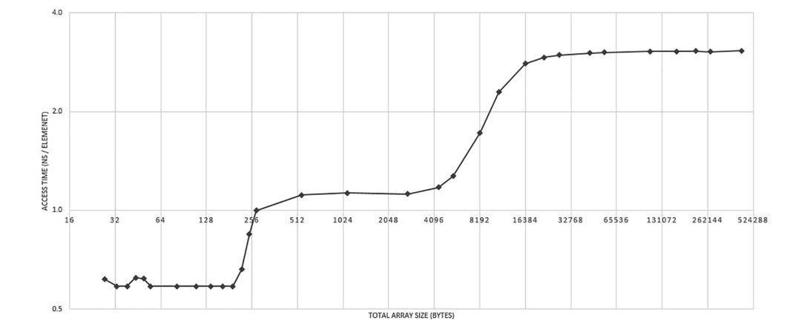
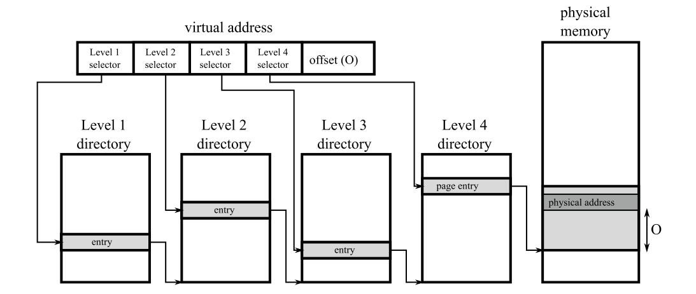

# 底层内存管理

在上一章中，您学习了内存管理的理论基础。现在，您可以直接跳转到自动内存管理的具体细节，了解 **Garbage Collector（垃圾回收器）** 的工作原理，以及可能导致内存泄漏的情况。但如果您真的想彻底掌握这个主题，那么花一些时间深入了解**内存管理的底层机制**是非常值得的。这将帮助您更好地理解 .NET（以及其他托管运行时环境）中 Garbage Collector 设计者所做出的各种决策。

这些机制的设计者并非在真空中工作，他们必须适应计算机硬件和操作系统的各种限制与机制。本章将向您介绍这些**机制与限制**。老实说，要用不让人感到负担的方式来讲解这些内容并不容易。然而，如果不涉及这些细节，就无法完整地理解 .NET 中的内存管理。

尽管在 .NET 的大多数内存管理场景下，`new` 运算符已经足够，但深入理解底层进程和机制仍然大有裨益。**硬件、操作系统和编译器**共同影响了 .NET 的工作方式及其实现，尽管这些影响并不总是显而易见。这些知识与上一章提到的 **Mechanical Sympathy（机械共鸣）** 的理念高度一致。

我们希望您也会觉得这里提到的一些小知识点很有趣。当然，如果您时间紧迫，或者更想直接进入 .NET 内部实现和实际示例，也可以**快速浏览本章，等以后有空时再深入阅读**。

## 硬件

现代计算机是如何工作的？您可能已经对这个主题有了基本的了解：计算机的核心是 **处理器（Processor）**，它是主要的计算单元，负责执行程序代码。处理器可以访问 **RAM（随机存取存储器）**，它的速度很快；也可以访问 **硬盘（HDD 或 SSD）**，但速度较慢。此外，还有 **显卡（Graphics Card）**，对于游戏玩家和各种图形设计师来说至关重要，它负责生成显示在屏幕上的图像。

然而，这种**宏观**的理解并不足以支持我们深入探讨本章的内容。接下来，我们将更深入地了解现代计算机的体系结构，如 **图 2-1** 所示。

典型计算机架构的主要组件如下：

- **处理器（Processor，CPU，中央处理单元）**：计算机的核心单元，负责执行指令（在第 1 章已经介绍）。其中包含**算术逻辑单元（ALU）、浮点运算单元（FPU）、寄存器（registers）、指令执行流水线（instruction execution pipelines）**等组件，这些组件可以将指令拆分成多个小操作，并尽可能并行执行。
- **前端总线（Front-Side Bus，FSB）**
  连接 **CPU 与 Northbridge** 之间的数据总线。
- **Northbridge（北桥）**
  主要包含**内存控制器（Memory Controller）**，负责管理 CPU 与内存之间的通信。
- **RAM（随机存取存储器，Random Access Memory）**：计算机的主存储器，存储数据和程序代码，只有在通电时才会保留数据，因此也被称为**动态 RAM（DRAM）或易失性存储器（volatile memory）**。
- **内存总线（Memory Bus）**：连接 **RAM 与 Northbridge** 之间的数据总线。
- **Southbridge（南桥）**：负责处理所有**I/O（输入/输出）**相关的功能，例如 **USB、音频、串行端口（Serial）、系统 BIOS、ISA 总线、中断控制器（Interrupt Controller）** 以及 **IDE 通道（PATA 或 SATA，存储控制器）**。
- **存储 I/O（Storage I/O）**：**非易失性存储（Nonvolatile Memory）**，主要存储数据，例如常见的 **HDD（机械硬盘）或 SSD（固态硬盘）**。


**图 2-1**. 计算机架构——CPU、RAM、北桥、南桥及其他组件

这幅图展示了计算机的基本架构，其中包括中央处理器（CPU）、随机存储器（RAM）、北桥（Northbridge）、南桥（Southbridge）以及其他硬件组件。图中数据总线的宽度大致表示了各部分之间数据传输量的比例（非常粗略的示意）。

在过去，**CPU、Northbridge 和 Southbridge** 是独立的芯片。然而，随着计算机架构的不断演进，这些组件已经被整合。从 **Intel Nehalem** 和 **AMD Zen** 微架构开始，Northbridge 直接集成到了 **CPU 核心（CPU Die）** 内部，在这种情况下，它通常被称为 **Uncore** 或 **System Agent**。这种架构的演变在 **图 2-2** 中展示。


**图 2-2**. 现代硬件架构 - CPU 内部集成了 Northbridge，连接 RAM 和 Southbridge（在 Intel 术语中已更名为 **Platform Controller Hub**），以及其他组件。总线的宽度大致表示数据传输量的比例（仅为粗略示意）。

这种集成化设计的好处在于，**内存控制器（Memory Controller）**（原属于 Northbridge）被放置在更接近 CPU 执行单元的位置，从而减少了由于物理距离造成的延迟，并提高了协同工作效率。然而，市场上仍然存在一些采用传统架构的处理器（最著名的是 **AMD FX 系列**），它们仍然将 **CPU、Northbridge 和 Southbridge** 作为独立组件。

任何内存管理机制的主要挑战都来源于 **CPU 与内存及存储子系统之间的性能差距**。处理器的速度远超内存，因此每次访问内存（无论是读还是写）都会引入额外的延迟。当 CPU 需要等待数据访问时，就会产生 **stall（停滞）**。这种停滞会降低 CPU 的利用率，因为 CPU 的时钟周期会被浪费在等待上，而不是执行实际任务。

目前，主流处理器的运行频率通常在 3 GHz 及以上，而内存的内部时钟频率则处于完全不同的数量级，仅为 200–400 MHz。制造运行频率与 CPU 相同的 RAM 成本极高，因为现代 RAM 依赖于**电容的充放电**来存储数据，而缩短充放电时间极为困难。

您可能会惊讶于内存的实际运行频率如此之低。毕竟，在计算机市场上，内存模块通常标注为3200 MHz 或 4800 MHz，这些数字似乎更接近 CPU 速度。这些规格从何而来呢？接下来我们会揭示其中的技术细节。

内存模块由**内部存储单元（internal memory cells）** 以及**额外的缓冲区（Buffers）**组成，后者有助于弥补低时钟频率的限制。现代 DDR（Double Data Rate）内存采用了多种优化技术（见**图 2-3**）：

- **双倍数据速率（Double Data Rate，DDR）**
  通过**双沿触发（Double Pumping）**，在**单个时钟周期内发送两次数据**（分别在时钟信号的上升沿和下降沿进行数据传输）。这就是 DDR 内存的核心原理，也称为**双倍速率传输（Double Pumping）**。
- **突发模式（Burst Mode）**，通过内部缓存（Internal Buffering），在一个内存时钟周期内一次性读取多个数据。
  - **DDR2** 将外部时钟频率提升 **2 倍**
  - **DDR3 和 DDR4** 提升 **4 倍**
  - **DDR5** 进一步提升 **8 倍**

相比过去使用的 **SDRAM（Synchronous DRAM）**，现代 DDR 模块的读写效率大幅提升。例如，在 **DDR5** 内存中，由于**结合了双倍速率传输（Double Pumping）和 8 次数据读取**，每个时钟周期的“突发长度（Burst Length）”达到了 16。


**图 2-3**. SDRAM、DDR、DDR2、DDR3、DDR4 和 DDR5 的内部结构，这幅图展示了各种内存模块（如 SDRAM、DDR、DDR2、DDR3、DDR4 和 DDR5）的内部运行机制，并以一个具有 300 MHz 内部时钟频率的内存模块为例。图中提到的 **MT/s** 表示“每秒百万次传输”（Mega Transfers per Second）。需要注意，这并不是一个严格的技术示意图，而是一个用于说明内存内部时钟与最终传输速率关系的直观图解。

以一个典型的 DDR4 内存芯片为例，比如 16GB 2400 MHz（在规格中描述为 DDR4-2400 或 PC4-19200）。在这种情况下，内部 DRAM 阵列的时钟频率为 300 MHz。通过内部 I/O 缓冲器，内存总线的时钟频率被四倍增至 1200 MHz。此外，由于每个时钟周期内进行两次数据传输（时钟信号的上升沿和下降沿各一次），最终实现了 2400 MT/s 的数据传输速率（每秒百万次传输）。这就是 2400 MHz 规格的由来。简单来说，由于 DDR 内存的“双倍数据率”（double pumping）特性，内存的速度通常以 I/O 时钟频率的两倍来标注，而 I/O 时钟频率本身是内部内存时钟频率的倍数。以 MHz 为单位标注速度实际上是一种市场营销上的简化方式。另一个标注——PC4-19200——则表示这种内存的最大理论性能。其计算方式为：2400 MT/s 的数据传输速率乘以 8 字节（每次传输的是一个 64 位长的字），得出 19200 MB/s 的理论带宽。

让我们从整体架构的角度来看 Konrad 的台式机配置。它配备了一颗运行频率为3.5 GHz的Intel Core i7-4770K处理器（Haswell一代）。前端总线（Front-Side Bus，简称FSB）的频率仅为100 MHz。使用的DDR3-1600内存（也称为PC3-12800）具有200 MHz的内部内存时钟频率，而由于DDR3的工作机制，其I/O总线时钟频率为800 MHz。这一点在图2-4中已经进行了说明，同时也可以通过硬件诊断工具如CPU-Z（见图2-5）得到验证。

内存模块在不断改进。例如，在DDR5中，改进内存带宽是主要的设计驱动力。因此，引入了倍增突发长度（burst length）的技术，以及其他类似的改进，例如将“bank”（存储体）和“bank group”（存储体组）的数量加倍，或者从单通道设计改为双独立通道设计。不过，解释这些技术需要涉及内存模块的底层操作，这远远超出了本书的讨论范围。

如果您对此感兴趣，可以参考 **RAM Anatomy Poster**（可在 [prodotnetmemory.com](https://prodotnetmemory.com/) 网站上获取）。


**图2-4**. 现代硬件架构示例及时钟频率（Intel Core i7-4770K与DDR3-1600）    


**图2-5**. CPU-Z截图——内存标签，显示北桥（Northbridge，NB）和DRAM频率以及FSB:DRAM频率比（但工具的该版本中此比率有误，实际应为1:8）  

尽管 DDR 内存在不断优化，但 CPU 的速度仍然远超内存。为了解决这一问题，计算机体系结构采取了**在不同层级缓存数据**的方式，以**减少访问延迟**：

- 对于 HDD（机械硬盘），数据通常会**缓存在 RAM 或更快的 SSD 存储**（如混合硬盘中的小型 SSD）。
- 对于 RAM，数据会被缓存到 **CPU 内部缓存（CPU Cache）**，后续我们将进一步探讨这一点。

除了缓存之外，还有诸如**优化硬件设计、改进内存控制器（Memory Controller）、优化 DMA（Direct Memory Access）**等多种技术。但由于 DMA 主要用于设备数据传输，不属于 Garbage Collector 管理的内存区域，因此本书不会深入讨论该技术。

### 内存

目前个人电脑中主要使用两种类型的内存，它们在生产、使用成本和性能方面存在显著差异：   

- **静态随机存取存储器 (Static Random Access Memory, SRAM)**：这种内存访问速度非常快，但结构较为复杂，每个存储单元由4到6个晶体管组成（存储一位数据）。只要电源不断，数据便能保持，不需要刷新。由于其高速度，SRAM主要用于CPU缓存。
- **动态随机存取存储器 (Dynamic Random Access Memory, DRAM)**：其单元结构非常简单（比SRAM更小），**每个单元由一个晶体管和一个电容构成**。由于电容存在“泄漏”，单元需要不断刷新（这会占用宝贵的毫秒时间并导致内存读取变陈旧）。从电容读取信号需要放大，这进一步增加了复杂性。读取和写入操作也需要时间，并且由于电容延迟，这些操作并非线性（需要等待一定时间以确保读取或写入成功）。     

让我们进一步探讨DRAM技术，因为它是我们电脑中常见内存（DIMM插槽中安装的内存）的基础。如前所述，单个DRAM单元由一个晶体管和一个电容组成，存储一位数据。这些单元被组织成DRAM阵列，访问特定单元的地址通过所谓的地址线提供。

如果为DRAM阵列中的每个单元分配一个独立的地址，那将极为复杂且昂贵。例如，在32位寻址的情况下，需要一个32位宽的地址线解码器（负责选择特定单元的组件）。地址线的数量对系统整体成本有很大影响——地址线越多，内存控制器与内存（RAM）芯片或模块之间的引脚和连接就越多。因此，地址线被复用为行线（row）和列线（column）（见图2-6），完整的地址需要在同一条线上写入两次。


图2-6. DRAM芯片示例，包括DRAM阵列及最重要的信号通道：地址线、RAS和CAS

从特定单元读取一位数据需要以下几个步骤：   

1. 将行号加载到地址线上。   
2. 通过专用线路上的行地址选通信号（Row Address Strobe, RAS）触发解释。
3. 将列号加载到地址线上。
4. 通过列地址选通信号（Column Address Strobe, CAS）触发解释。
5. 行和列指向DRAM阵列中的特定单元，从该单元读取一位数据并将其写入数据线。

我们电脑中安装的DRAM模块由多个这样的 RAM阵列组成，这些阵列经过组织以便在单个时钟周期内访问多个位（即单个字）。  

在获取单个位的每个步骤之间的转换时间对内存性能有显著影响。这些时间或许对你来说并不陌生，因为它们是内存模块规格中的重要因素，并对内存价格产生很大影响。你可能熟悉DIMM模块上的时序，例如DDR3 9-9-9-24。这些时序代表执行特定操作所需的时钟周期数，它们分别具有以下含义：   

- **tCL (CAS延迟)**：从列地址选通信号（CAS）到开始回复（接收数据）之间的时间。
- **tRCD (RAS到CAS延迟)**：从行地址选通信号（RAS）到列地址选通信号（CAS）之间的最短时间。   
- **tRP (行预充电时间)**：访问某行之前需要预充电的时间。未预充电的行无法被使用。
- **tRAS (行激活时间)**：访问某行中的信息时，该行必须保持激活的最短时间。      

请注意这些时序的重要性。如果你需要的数据所在的行和列已经设置好，读取几乎是即时的。如果需要更改列，则需花费 **tCL** 的时钟周期。如果需要更改行，情况会更糟：需要先进行预充电（tRP周期），然后是 RAS 和 CAS 延迟（tCL和tRCD）。

对于追求极限性能的电脑用户而言，这些时序至关重要。尤其是玩家会非常关注这些参数。如果性能是你的首要需求，那么购买内存模块时应该选择时序尽可能低的产品。      然而，我们更关注DRAM内存架构及其时序对内存管理的影响。行更改的成本（RAS信号时序和预充电）非常高。这也是顺序内存访问模式远比非顺序模式快的诸多原因之一。从单行中按突发模式读取数据（偶尔更改列）比频繁更改行要快得多。如果访问模式完全随机，你几乎会在每次内存访问时都受到这些行更改时序的影响。      以上信息的目的只有一个——让你深刻理解为什么非顺序内存访问是如此不受欢迎。正如你将看到的，这并不是完全随机访问成为最差情况的唯一原因。

### CPU

现在我们来讨论中央处理单元（CPU）的主题。处理器与所谓的指令集架构（Instruction Set Architecture，简称ISA）兼容。ISA定义了许多内容，包括可以执行的操作（指令）的集合、寄存器及其含义、内存寻址方式等等。从这个意义上说，ISA就像是处理器制造商与用户之间的一种契约（接口）——程序是基于这种契约编写的。例如，当您使用某种架构的汇编语言编程时，看到的正是这一层。

在.NET生态系统中，最广泛使用的ISA包括IA-32（32位i386架构，如Pentium 32位处理器）、AMD64（兼容于大多数现代处理器，包括Intel Core、AMD FX和Zen等）以及A64（用于ARM64架构）。

在ISA之下，还有处理器的微架构（microarchitecture），它是ISA的具体实现。微架构的改进可以在不影响系统和软件的情况下进行，因此能够保持向后兼容性。

> 注意，关于64位架构标准的命名存在许多混淆，您经常会看到x86-64、EMT64T、Intel 64或AMD64等名称被交替使用。尽管这些名称中包含了制造商的标识，有时也存在一些细微的差异，但就本书的目的而言，您可以放心地将这些名称视为没有歧义的，并且可以安全地互换使用。

如前一章所述，寄存器是CPU的关键组成部分，因为目前所有的计算机都是以寄存器机器的形式实现的。在数据操作的背景下，访问寄存器是即时的，因为这一过程在单个处理器周期内完成，不会引入任何额外的延迟。在距离CPU最近的位置，没有比处理器寄存器更适合存储数据的地方。当然，寄存器只存储当前指令所需的数据，因此不能被视为通用内存。实际上，一般来说，处理器拥有的寄存器数量比其ISA（指令集架构）中显现的数量更多。这种设计允许进行多种优化（例如所谓的寄存器重命名）。然而，这些属于微架构的实现细节，并不会影响内存管理的机制。

#### CPU 缓存

正如我们之前提到的，为了缓解CPU与RAM之间的性能差距，使用了一种间接的组件来存储最常用和最需要的数据副本——即CPU缓存。图2-7以非常通俗的方式展示了这一点。


图2-7. CPU、缓存与RAM的关系

这个缓存在指令集架构（ISA）层面上是透明的。程序员和操作系统都无需知道它的存在，也不需要对其进行管理。在理想情况下，缓存的正确使用和管理应完全由CPU负责。为了实现尽可能快的缓存，使用了前面提到的SRAM芯片。

由于成本和尺寸（占用了处理器内宝贵的空间），它们的容量无法与主内存（RAM）相比。但根据预期成本，它们的速度可以与CPU相当，或者可能仅慢一到两个数量级。

#### 缓存命中和丢失

缓存的概念非常简单。当处理器执行的指令需要访问内存（无论是读取还是写入）时，它首先会检查缓存，看所需的数据是否已经存在。如果存在，那就太好了！这意味着你获得了非常快速的内存访问，这种情况被称为**缓存命中**。如果数据不在缓存中（即所谓的缓存未命中），那么就必须首先从RAM中读取数据，然后再存储到缓存中，这显然是一个更慢的操作。缓存命中率和缓存未命中率是非常重要的指标，它们可以告诉我们代码是否有效利用了缓存。

#### 数据局部性

那么，为什么缓存会如此有用呢？缓存基于一个非常重要的概念——**数据局部性（data-locality）**。我们可以区分两种局部性：

- **时间局部性(temporal locality)**：如果你访问某个内存区域，那么在不久的将来你很可能会再次访问它。这使得使用缓存变得非常合理——你从内存中读取了一些数据，可能会在稍后再次使用它。通常，你会将一些数据结构加载到变量中，并反复使用这些变量（例如计数器、从文件中读取的临时数据等）。
- **空间局部性(spatial locality)**：如果你访问某个内存区域，那么你很可能会访问其附近的数据。如果你缓存比当前需要更多的周围数据，这种局部性可以成为你的优势。例如，如果你需要从内存中读取几个字节，那么就读取并缓存多几个字节。你很少会访问非常孤立的内存区域。你会发现，栈和堆的结构使得执行任务的线程通常访问相似的内存区域。局部变量或数据结构中的字段通常也是紧密排列的。

请注意，缓存的好处建立在上述条件适用的基础上。然而，这是一把双刃剑。如果你以某种方式编写程序，使其打破数据局部性，缓存将变成一个不必要的负担。你将在本章后面看到这一点。

#### 缓存实现

只要与ISA内存模型保持兼容，缓存的实现细节在理论上并不重要。缓存的存在只是为了加速内存访问，仅此而已。然而，这正是 Joel Spolsky 所说的“泄漏抽象法则（The Law of Leaky Abstractions）”的完美示例：

> 所有非平凡的抽象在某种程度上都是泄漏的。

这意味着，理论上应该隐藏实现细节的抽象在某些情况下却不幸地将这些细节暴露了出来。而且通常这种暴露是不可预测的和/或不希望的。关于缓存的具体情况很快就会变得清晰，但现在让我们先深入探讨一下实现细节。

最重要且影响最大的事实是，RAM和缓存之间的数据以称为**缓存行**的块进行传输。缓存行的大小是固定的，在当今绝大多数计算机中，通常为64字节。需要特别注意的是——你不能从内存中读取或写入少于缓存行大小的数据，也就是说64字节。即使你只想从内存中读取一个比特，整个64字节的缓存行也会被填充。这种设计利用了DRAM的快速顺序访问（记得本章前面提到的预充电和RAS延迟吗？）。

如前所述，DRAM的访问宽度为64位（8字节），因此需要进行八次传输才能填充这样的缓存行。这会消耗很多CPU周期，因此有多种技术来应对这种情况。其中之一是“关键字优先”和“提前重启”（Critical Word First and Early Restart）。这种方式不是逐字读取缓存行，而是优先从最需要的字开始读取。想象一下，在最坏的情况下，8字节的数据可能会出现在缓存行的末尾，因此你必须等待前面七次传输完成才能访问它。这项技术首先读取最重要的字，等待这些数据的指令可以继续执行，而其余的缓存行则会异步填充。

> 注意：典型的内存访问模式是什么样的？当某人想从内存读取数据时，首先会在缓存中创建相应的缓存行条目，并将 **64 字节** 的数据读入缓存中。当有人想在内存中写入数据时，第一步与读取数据时相同——如果缓存中没有该缓存行，首先会将缓存行填充到缓存中。然后，写入数据会修改这块缓存数据。此时，有两种策略可能发生：
>
> - **直写（Write-through）**：写入缓存行后，修改的数据立即被保存到主内存中。这种方法实现简单，但会对内存总线造成很大的开销。
> - **回写（Write-back）**：写入缓存行后，缓存行被标记为“脏”（dirty）。然后，当缓存中没有空间存放其他数据时，这个脏块会被写回内存（并且删除该修改过的脏缓存条目）。处理器可能会定期写入这些脏块，通常发生在空闲时间。
>
> 还有一种优化技术叫做 **写合并（Write-combining）**。它确保来自特定内存区域的缓存行会完整地写入，而不是写入其单独的字（word），再次利用了对内存的更快速的顺序访问。

由于缓存行的存在，存储在内存中的数据是按照 **64 字节边界对齐** 的。因此，在最坏情况下，如果要读取连续的两个字节，就必须消耗两个缓存行，其总大小为 128 字节。这一点可以在图 2-8中看到，当你想要读取地址 A 处的 2 字节数据时，恰好在缓存行的边界前一个字节，因此你最终需要读取两个缓存行。


图 2-8. 访问两个连续字节时需要填充两个缓存行，因为它们不幸地位于不同的缓存行中

你可能会想，为什么要花时间讨论这么多硬件实现细节？在管理代码的舒适环境下，这些真的重要吗？让我们来看看。

通过清单 2-1中的示例代码和表 2-1中的结果，展示了非顺序内存访问模式的成本。该示例程序以两种方式访问相同的二维数组——按行和按列。结果分别展示了在三个不同环境下的表现：PC（Intel Core i7-4770K 3.5GHz）、笔记本（Intel Core i7-4712MQ 2.3GHz）和 Raspberry Pi 2 板（ARM Cortex-A7 0.9GHz）。

清单 2-1. 按列与按行索引访问数组（5000x5000 的整数数组）

```c#
int[,] tab = new int[n, m];
for (int i = 0; i < n; ++i)
{
    for (int j = 0; j < m; ++j)
    {
    	tab[i, j] = 1;
    }
}
int[,] tab = new int[n, m];
for (int i = 0; i < n; ++i)
{
    for (int j = 0; j < m; ++j)
    {
    	tab[j, i] = 1;
    }
}
```

表 2-1. 列索引与行索引的结果对比（n, m = 5000）

| 模式 | PC     | Laptop | Raspberry Pi 2 |
| ---- | ------ | ------ | -------------- |
| 行   | 52 ms  | 127 ms | 918 ms         |
| 列   | 401 ms | 413 ms | 2001 ms        |

这个示例展示了**非顺序数据检索**对性能的严重影响。在示例程序的第二个版本中，数据是按列读取的。因此，**DRAM 的活动行（Active Line）** 需要频繁更换。但更重要的是，缓存的使用非常低效，因为即使整个缓存行被加载，实际只读取了其中的一个字节。随后，当访问另一个远离的地址时，需要填充**新的缓存行**。这种模式会导致性能下降 **7 倍以上**（如 **表 2-1** 所示），因为CPU 经常因等待内存访问而停滞（Stalls）。

图 2-9. 按行访问 vs. 按列访问的区别说明了在访问包含 1 到 40 这 40 个值的小数组时，按行访问与按列访问的性能差异（假设每个缓存行可存储 4 个整数，并且CPU 只有足够的缓存来存储 4 个缓存行）。

- 读取前 4 个元素（1,2,3,4）时，加载第 1 个缓存行，所有元素都能被利用。
- 读取下 4 个元素（5,6,7,8）时，加载第 2 个缓存行，所有元素都能被利用。
- 读取下 4 个元素（9,10,11,12）时，加载第 3 个缓存行，所有数据都有效。这一模式贯穿整个数组，缓存行的利用率达到了最优。

图2-9的右侧展示了第二种模式，即每个缓存行读取一个整数后，再转到下一个缓存行：

1. 读取前 4 个元素时，需要读取 4 个不同的缓存行，但每个缓存行仅用到了1 个值（即第 1 行的 **1**，第 2 行的 **9**，依此类推）。
2. 读取下一个元素（33）时，缓存已满，需要淘汰最少使用的数据（很可能是 1,2,3,4），然后加载新的缓存行（包含 33,34,35,36）
3. 读取元素 2时，需要重新加载刚刚被淘汰的缓存行（1,2,3,4），导致重复读取。
4. 这一访问模式不断重复，导致缓存行被多次重复读取，降低了性能。


图2-9. 按行与按列的访问模式 - 箭头指示访问会触发缓存行失效（在访问前十个元素时）

尽管真实的 CPU拥有更多的缓存行缓冲区，且缓存行可以存储比 4 个整数更多的数据，但图 2-9仍然揭示了真实世界中的一个关键问题：不良的内存访问模式会导致 CPU 频繁更换缓存行，从而极大降低程序的执行效率。

如您所见，即使是.NET 运行时环境及其先进的内存管理技术，也无法完全消除 CPU 低效缓存访问带来的影响。不合理的内存访问模式会导致代码性能下降数倍，甚至数量级。如果在Java 或 C/C++语言中运行类似的测试，您也会得到类似的性能下降，因为这些问题源于底层 CPU 架构，而不是某种特定的编程语言。

#### 数据对齐

还有一个非常重要的内存访问方面需要讨论。大多数 CPU 体系结构都要求访问“对齐的”数据，即数据的起始地址必须是特定字节对齐值的整数倍。每种数据类型都有自己的对齐要求，而结构体的数据对齐取决于其字段的对齐。在访问未对齐的数据（Unaligned Data） 时，访问速度可能会变慢 数倍，因此必须小心处理。这通常是编译器和开发者的责任，需要在设计数据结构时确保对齐。在 CLR（Common Language Runtime，公共语言运行时） 中，对象的内存布局大多由运行时自动管理，因此你可以在 Garbage Collector（垃圾回收器） 代码中看到许多与对齐处理相关的逻辑。在 第 13 章，您将了解 对象的内存布局（Object Memory Layout） 以及如何控制它，同时考虑 数据对齐对性能的影响。

然而从 .NET Core 3.0 开始，引入了硬件内置指令（Hardware Intrinsics），提供了对 CPU 特定硬件指令的访问，而这些指令无法通过更通用的机制轻松暴露。例如，对齐的内存加载（Aligned Memory Loads）和存储（Stores） 现在可以通过 `LoadAlignedVector256` 或 `StoreAligned` 方法实现。这些方法主要适用于低级操作，特别是在使用非托管（Non-Managed）或原生（Native）内存的场景中。这类指令在向量化（Vectorization）技术中尤为重要。**向量化指的是将单值操作转换为向量操作，即在一次迭代中同时处理多个值，而不是逐个处理单个值。**这依赖于 SIMD（Single Instruction, Multiple Data，单指令多数据流） 指令集，从而显著提升计算性能。

#### 非时序（Non-Temporal）访问

目前为止，我们讨论的 CPU 体系结构通常只能通过缓存（Cache）访问内存。换句话说，CPU 访问 DRAM 只能通过缓存，所有读/写操作都会存入缓存中。假设您要初始化一个非常大的数组，但您知道该数组不会马上被使用。根据之前的知识，我们知道这种初始化方式会引发大量的内存流量（Memory Traffic），因为数组会按缓存行（Cache Line）分块写入。此外，每次写入都会涉及三个步骤：

1. 从 DRAM 读取数据到缓存
2. 在缓存中修改数据
3. 将修改后的缓存行写回主存（Main Memory）

在这种情况下，缓存行仅用于写入数据，并不会被读取，导致了缓存空间的浪费，原本这些缓存可以被其他程序更有效地利用。

为了解决这个问题，我们可以使用非时序访问（Non-Temporal Access）的汇编指令，如 `MOVNTI,MOVNTQ,MOVNTDQ` 这些指令允许开发者直接写入内存，而不经过缓存，从而减少缓存污染（Cache Pollution）。这些指令在 C/C++ 中可以通过 `_mm_stream_*` 一系列函数调用，而不需要直接编写汇编代码。例如：`_mm_stream_si128` 执行 MOVNTDQ 指令，它可以直接将 16 字节（4 个 4 字节整数）写入内存，而不经过缓存。

列表 2-2：示例：使用非时序存储进行快速数组初始化

```c
#include <emmintrin.h>
void setbytes(char *p, int c)
{
    __m128i i = _mm_set_epi8(c, c, c, c, c, c, c, c, c, c, c, c, c, c, c, c); // sets 16
    signed 8-bit integer values
    _mm_stream_si128((__m128i *)&p[0], i);
    _mm_stream_si128((__m128i *)&p[16], i);
    _mm_stream_si128((__m128i *)&p[32], i);
    _mm_stream_si128((__m128i *)&p[48], i);
}
```

从 .NET Core 3.0 开始，硬件内置指令（Hardware Intrinsics）提供了对非时序访问（Non-Temporal Access） 的支持。

您可以使用 `StoreAlignedNonTemporal` 方法，该方法在 JIT（即时编译器）编译时会被转换为适当的 `MOVNTxx` 指令，具体指令取决于访问的内存数据类型（如 字节（byte）、整数（integer）、浮点数（float） 等）。

在 清单 2-3 中，您可以看到一个示例程序，它批量处理输入数组的值，将每个值乘以 2，并使用 `StoreAlignedNonTemporal` 方法进行存储。

```c#
int simdLength = Vector<float>.Count;
var vec2 = new Vector<float>(2.0f);

unsafe
{
    fixed (float* p = outputArray)
    {
        for (; i <= arrayLength - simdLength; i += simdLength)
        {
            var vector = new Vector<float>(inputArray, i);
            vector = vector * vec2;
            vector.StoreAlignedNonTemporal(p + i);
        }
    }
}
```

使用非时序存储（StoreAlignedNonTemporal）时，有一个需要特别注意的地方：存储地址必须是“对齐的”（Aligned），即写入的内存地址必须是缓存行大小（一般为 32 字节或 64 字节）的整数倍。然而，普通的托管（Managed）数组默认情况下并不保证对齐，因此需要使用以下两种方法之一来处理这个问题：

- 使用对齐的本机内存（Aligned Native Memory）通过 `NativeMemory.AlignedAlloc` 方法（.NET 6 引入），分配对齐的原生内存。
  这样可以保证数据按缓存行对齐，提高性能。
- 在数组中找到第一个对齐的地址，并从该地址开始处理，剩余的部分（非对齐部分）需要使用普通的非时序或非对齐 API 进行处理。

需要注意的是，**非时序访问（Non-Temporal Access）**并不是一种默认的“快速内存访问”技术。它的使用场景较为特殊，需要开发者深入理解 CPU 缓存行为，否则可能导致反向优化，甚至影响性能。

> 注意：除了非时序存储（StoreAlignedNonTemporal），还有非时序加载（Non-Temporal Loads），即直接从内存加载数据到寄存器，而不经过缓存。
>
> 例如：
>
> - **MOVNTDQA** 指令用于非时序加载，在 **C/C++** 中可以通过 **`_mm_stream_load_si128`** 函数访问。
> - 在 .NET 硬件内置指令 API 中，提供了 **`LoadAlignedNonTemporal`** 方法，可用于非时序数据加载。

#### **预取（Prefetching）**

除了前面提到的优化机制，还有一种提高缓存利用率（Cache Utilization）的方法，即**预取（Prefetching）**。它的核心思想是**提前将可能会被使用的数据加载到缓存中**，从而减少**缓存未命中（Cache Miss）**的情况。预取可以通过两种方式工作：

1. **硬件驱动（Hardware-driven）**
   - 当 CPU 发现多个缓存未命中且存在特定访问模式时，会自动触发预取机制。
   - 大多数 CPU 能够跟踪 8 到 16 种内存访问模式，以优化多线程或多进程环境下的内存访问。
2. **软件驱动（Software-driven）**：通过显式调用 `PREFETCHT0` 指令，这可以通过 C/C++ 中的 `_mm_prefetch` 函数进行访问。

和所有缓存优化机制一样，预取是一把 **双刃剑（Double-Edged Weapon）**。如果你对代码的内存访问模式有足够的了解，那么预取可以显著提升程序性能。但如果误用，预取可能会导致性能下降，甚至浪费 CPU 资源。预取的**时机（Timing）** 至关重要：

- 预取太晚：数据仍未进入缓存，访问时仍会发生**缓存未命中**（Cache Miss）。
- 预取太早：数据可能在使用前就被其他数据驱逐（Evicted）出缓存，导致无效预取。

在 .NET 的垃圾回收器（GC）中，x86、x64 和 ARM64 体系结构都使用了预取技术（详见**清单 2-4**）。

```c++
// enable on processors known to have a useful prefetch instruction
#if defined(TARGET_AMD64) || defined(TARGET_X86) || defined(TARGET_ARM64)
#define PREFETCH
#endif
#ifdef PREFETCH
inline void Prefetch(void* addr)
{
#ifdef TARGET_WINDOWS
#if defined(TARGET_AMD64) || defined(TARGET_X86)
#ifndef _MM_HINT_T0
#define _MM_HINT_T0 1
#endif
	_mm_prefetch((const char*)addr, _MM_HINT_T0);
#elif defined(TARGET_ARM64)
	__prefetch((const char*)addr);
#endif //defined(TARGET_AMD64) || defined(TARGET_X86)
#elif defined(TARGET_UNIX)
	__builtin_prefetch(addr);
#else //!(TARGET_WINDOWS || TARGET_UNIX)
	UNREFERENCED_PARAMETER(addr);
#endif //TARGET_WINDOWS
}
#else //PREFETCH
inline void Prefetch (void* addr)
{
	UNREFERENCED_PARAMETER(addr);
}
#endif //PREFETCH
```

如果垃圾回收算法的设计没有考虑缓存的优化，可能会导致严重的性能问题。一个典型的反面示例是：假设 GC 需要存储一些 1 字节的诊断数据，但这些数据分散在整个内存的随机位置。当 GC 需要收集这些数据时，它必须遍历整个内存，每次读取 1 字节，但却需要填充整条缓存行（Cache Line）。

这就导致了缓存污染（Cache Pollution）：缓存中充满了无用的数据。低效的缓存利用率：读取 1 字节就要填充 64 字节的缓存行，浪费 98% 以上的缓存带宽。由于缓存未命中率增加，CPU 需要频繁访问 DRAM，导致执行速度变慢。

所有高效利用内存的算法（特别是垃圾回收）都必须考虑 CPU 的内部机制。内存并不是一个“可以随意访问的平面空间”，随意访问任意字节都会有一定的性能代价！

#### 层次缓存

回到硬件架构，由于对性能的需求和成本优化的考虑，CPU设计逐渐演变为更加复杂的层次缓存。这个概念非常简单。与其使用单一的缓存，不如创建几个不同大小和速度的缓存。这使得可以构建一个非常小且极快的一级缓存（称为L1），接着是稍大且稍慢的二级缓存（L2），最终是三级缓存（L3）。在现代架构中，这种层次结构通常包含三个级别。现代计算机的这种层次缓存如图2-10所示。确实，有时可以看到配备L4缓存的处理器，但那是一种不同类型的内存，主要用于这些CPU内的集成显卡。

图2-10. 具有层次缓存的CPU - 一级缓存分为指令缓存（L1i）和数据缓存（L1d），以及二级（L2）和三级（L3）缓存。CPU通过内存总线与DRAM连接。

一级缓存分为两个独立的部分，一个用于数据（标记为L1d），另一个用于指令（标记为L1i）。从内存中读取并由处理器执行的指令实际上也是数据，只是经过适当的解释。在L1以上的级别中，数据和代码指令实际上是同等对待的。然而，实践证明，在最低缓存级别中，最好将数据和指令分开处理。因此，这种设计被称为哈佛架构(Harvard architecture)。出于这个原因，如今的计算机架构被称为修改哈佛架构(Modified Harvard Architecture)。这种方案效果很好，因为在存储数据和程序代码的内存区域之间存在很强的独立性，但仅限于最低级别。

了解到有三个主要的缓存级别后，一个显而易见的问题随之而来：它们与主内存之间的速度和大小通常有什么区别？较低缓存级别的内存可以非常快，以至于L1甚至L2的访问速度可能比管道执行时间还快（除非你需要等待确切地址的计算，这也是一个成本较高的操作）。那么，这些访问时延是什么样的呢？

目前，这一章节的原文是在一台搭载Intel Core i7-4712MQ CPU（Haswell架构），运行频率为2.30 GHz的笔记本电脑上编写的。假设我笔记本上的一个CPU周期大约为0.4纳秒（~1/2.30 GHz），并根据Haswell i7的规格，可以在表2-2中看到不同内存级别的访问延迟。

| Operator | Latency    |
| -------- | ---------- |
| L1 cache | < 2.0 ns   |
| L2 cache | 4.8 ns     |
| L3 cache | 14.4 ns    |
| 主存     | 71.4 ns    |
| HDD      | 150 000 ns |

你可以清楚地看到，优化缓存使用是非常重要的。当所需数据存储在L3缓存中时，延迟可以快到五倍，而不是在RAM中。使用L1缓存时，性能提升超过30倍。这就是为什么了解缓存的使用情况对整体性能至关重要。缓存能容纳多少数据？这完全取决于具体的CPU型号，但i7-4770K的规格很好地反映了市场标准。L1缓存有64 KiB（分为32 KiB的代码和32 KiB的数据），而L2缓存则为256 KiB。L3缓存通常更大，大小为8 MiB。

在.NET的管理环境中，这些时序会有什么影响呢？让我们来看一个简单的例子，展示了访问数据的延迟如何依赖于处理的内存量。我们使用清单2-5中的代码，进行一系列顺序读取（最佳情况）。由于使用的结构大小为64字节，因此读取是以64字节的步长进行，并且每次都需要加载新的缓存行。图2-11显示了每个tab数组单个元素的平均访问时间，取决于该数组总共占用了多少内存。

**当数据大小超过每个级别的缓存大小时，访问时间会明显恶化**。基准测试是在Intel i7-4770K处理器上进行的，性能明显下降的点大约在256 KiB和8192 KiB，这与L2和L3缓存的大小相对应。你会发现，处理小数据量的速度可能比处理超出L3缓存的数据快几倍。

清单2-5. 后续缓存行的顺序读取：

```c#
public struct OneLineStruct
{
    public long data1;
    public long data2;
    public long data3;
    public long data4;
    public long data5;
    public long data6;
    public long data7;
    public long data8;
}
public static long OneLineStructSequentialReadPattern(OneLineStruct[] tab)
{
    long sum = 0;
    int n = tab.Length;
    for (int i = 0; i < n; ++i)
    {
    	unchecked { sum += tab[i].data1; }
    }
    return sum;
}
```

图2-11. 访问时间与数据大小的关系 - Intel x86架构/顺序读取。

> 注意：两个轴都是对数坐标
> 注意 在缓存的讨论中，有一个有趣但不太重要的话题 - 驱逐策略（eviction strategies）。它涉及如何在某个级别缺少空间时为新数据腾出空间。有两种可能的方法，有时在不同级别上混合使用：
>
> -  独占缓存：数据仅存在于一个级别的缓存中。这种方法在AMD处理器中最为常见。
> - 包含缓存：较低级别（例如L1d）中的每个缓存行也存在于更高的级别（例如L2）中。
>
> 虽然这个话题很有趣，但它并不影响你对内存管理的理解。可以假设CPU制造商在确保这些机制最有效实施方面已经尽力而为。

#### 多核层次缓存

然而，这并不是你在计算机设计之旅的终点。现代的大多数CPU都有多个核心。简单来说，核心是指独立处理代码的单个简化处理器。在过去，每个核心一次只能运行一个线程。因此，一个四核处理器能够同时执行四个线程。如今，几乎所有处理器都具备了**同时多线程机制（simultaneous multithreading mechanism, SMT）**，这使得单个核心可以同时执行两个线程。英特尔处理器称之为超线程，而AMD的Zen微架构则支持完整的SMT。图2-12展示了四核CPU中各个核心缓存的分配情况。

图2-12. 多核CPU——每个核心都有自己的一级缓存（分为指令缓存（L1i）和数据缓存（L1d））以及二级缓存（L2）。三级缓存（L3）则在核心之间共享。CPU通过内存总线连接到DRAM。

如你所见，每个核心都拥有独立的一级和二级缓存，而三级缓存则是共享的。核心与L3缓存之间的连接实际上是实现的细节。例如，在大多数现代英特尔CPU中，存在一个双向的、极快的32字节宽的总线，进一步将它们与集成GPU和系统代理连接起来。需要注意的是，在SMT处理器中，同一核心上运行的两个线程共享L1和L2缓存，因此它们的实际使用量会减半，除非两个线程访问相同的数据。这显然需要操作系统的支持，以根据线程的内存访问模式合理分配线程到核心上。

由于每个线程可以在不同的处理器和/或核心上运行，因此缓存数据的一致性问题随之而来。每个核心拥有自己版本的一级和二级缓存，只有三级缓存是共享的。这就需要引入一个复杂的概念，称**为缓存一致性**。该机制描述了如何保持存储数据的一致性，并通过**缓存一致性协议**来实现——这是一种在核心间通报数据变化的方式。每当本地缓存中的数据被修改（由某个脏标志或修改标志指示）时，这一信息必须广播给其他核心。

有许多扩展和高级缓存一致性协议旨在提供高效的操作——尤其是非常流行的MESI协议。其名称源于缓存行可能存在的四种状态——已修改（modified）、独占（exclusive）、共享（shared）和无效（invalid）。尽管如此，缓存一致性协议可能会对内存流量造成很大的开销，从而影响整体程序性能。直观上，核心之间不断需要互相更新缓存可能导致明显的开销。因此，编写代码时应尽量**减少不同核心对同一缓存行下的内存地址的访问**。这意味着要尽量避免线程之间的通信，或者至少要非常注意哪些数据及其在线程间的共享方式。

> 注意：如前所述的非时间指令省略了正常的缓存一致性规则，使用它们时应与特殊的 `sfence` 汇编指令配合使用，以确保其结果对其他核心可见。

但是，这些知识在像.NET这样高级的环境中真的有用吗？垃圾收集器是否能利用其对内部机制的了解，隐藏硬件实现的细节？这些问题的答案可以通过以下示例找到。

列表2-6展示了多线程代码，允许同时运行`threadsCount`个线程来访问同一个`sharedData`数组。每个线程仅仅递增一个单元素的数组（理论上）不会影响其他线程。在这个例子中，有两个重要的参数指示共享数组中元素的布局——是否存在起始间隔，以及它们之间的距离（`offset`）。在四核机器上以 `threadsCount=4` 运行时，每个线程很可能会在其自己的物理核心上执行。

列表2-6. 线程之间可能存在的伪共享（false sharing）：

```c#
const int offset = 1;
const int gap = 0;
public static int[] sharedData = new int[4 * offset + gap * offset];
public static long DoFalseSharingTest(int threadsCount, int size = 100_000_000)
{
    Thread[] workers = new Thread[threadsCount];
    for (int i = 0; i < threadsCount; ++i)
    {
        workers[i] = new Thread(new ParameterizedThreadStart(idx =>
        {
            int index = (int)idx + gap;
            for (int j = 0; j < size; ++j)
            {
            	sharedData[index * offset] = sharedData[index * offset] + 1;
            }
        }));
    }
    for (int i = 0; i < threadsCount; ++i)
    	workers[i].Start(i);
    for (int i = 0; i < threadsCount; ++i)
    	workers[i].Join();
    return 0;
}
```

表2-3. 列表2-6代码的基准测试结果，显示虚假共享对处理时间的影响

| Version                | PC    | Laptop | Raspberry Pi 2 |
| ---------------------- | ----- | ------ | -------------- |
| #1 (offset=1, gap=0)   | 5.0 s | 6.7 s  | 29.0 s         |
| #2 (offset=16, gap=0)  | 2.4 s | 2.6 s  | 13.8 s         |
| #3 (offset=16, gap=16) | 0.7 s | 0.8 s  | 12.1 s         |

在表2-3中，可以看到不同 `gap` 和 `offset` 组合之间的性能差异非常显著。在最常见的情况下，间隔为0，偏移为1。布局和线程访问如图2-13a所示。这不幸地引入了相当大的缓存一致性开销。每个线程（核心）都有自己相同内存区域的本地副本（在其自己的缓存行中），因此在每次递增后，必须使其他线程的本地副本失效。这迫使核心不断地失效其缓存。


图2-13a. 版本#1，偏移1字节且没有间隔——每个线程访问修改相同的缓存行

显而易见的解决方案是将每个线程访问的元素分散到不同的缓存行中。最简单的方法是创建一个更大的数组，仅使用每16个元素中的一个（16个4字节的 `Int32` 总共64字节）。在偏移 16且间隔为 0 的例子中可以看到这一点（见图2-13b）。正如表2-3所示，性能大幅提升，但仍有改进空间。


图2-13b. 版本#2，偏移16字节且没有间隔——每个线程访问并修改自己的缓存行

乍一看并不明显，但仍有一个缓存行被不断失效，这导致了**伪共享**问题——一种不幸的数据访问模式，其中理论上未被修改的共享数据位于其他线程修改的缓存行中，导致其不断失效。正如您将在下一章中了解到的，每种类型在 .NET 中都有附加的头部信息。在数组的情况下，长度存储在对象的开头。此外，当通过索引操作符访问数组元素时，生成的代码会检查是否越界。这意味着在每次访问任何数组元素时，都要读取数组对象的开头来检查数组的长度。因此，第一个核心与其他核心共享对象头，不断使相应的缓存行失效。为了解决这个问题，您必须将元素偏移一个缓存行。这是版本#3，当偏移仍为16而间隔也为16时（见图2-13c）。


图2-13c. 版本#3，偏移16字节和间隔16字节——每个线程修改自己的缓存行并读取包含数组头的共享缓存行

在这种情况下，每个核心都有自己的本地副本的第一个缓存行，仅用于读取。它们在自己的缓存行中修改数据。没有增加缓存一致性协议的开销。从表2-3可以看出，这种代码的运行速度甚至比虚假共享快了七倍！

> 其他架构有时放弃x86中的顺序一致性，这简化了设计，但使编程变得困难（需要显式的内存屏障）。这样的架构的一个例子是在2006年苹果计算机上的PowerPC。

到目前为止，您已经花了很多时间理解数据的缓存。然而，几页前提到程序指令也有缓存（L1i）。我们没有关注这个问题有几个原因。首先，编译器可以很好地准备代码，而CPU在猜测代码访问模式方面也做得很好。结果，这个缓存工作得很好——编译器和程序执行的性质造成了良好的时间局部性和空间局部性，CPU能够利用这些优势。此外，指令缓存的管理并不属于.NET中专注于数据管理的内存管理领域。唯一显而易见的改进是生成尽可能小的代码。然而，如今很难将这一建议付诸实践——一切都是由编译器优化完成的，代码的大小更多是由于商业需求。

## 操作系统

您在硬件方面投入了相当多的时间。我们最初承诺要关注操作系统。现在是时候讨论操作系统设计者如何认真应对所有硬件限制了。

由于操作系统和硬件架构的不同，物理内存的限制从 2 GB 到 24 TB 不等。而当前典型的商品硬件通常配备数十 GB 的内存。如果某个程序直接使用物理内存，它就必须管理其创建和删除的所有内存区域。这种内存管理逻辑不仅复杂，而且在每个程序中都要重复实现。此外，从底层编程的角度来看，以这种方式使用内存也会相当繁琐。每个程序都需要记住自己使用的内存区域，以避免相互干扰。分配器之间需要协调，以妥善管理创建和删除的对象。从安全的角度来看，这也非常危险——没有中间层，程序不仅能访问自己的内存区域，还能访问其他进程的数据。

#### 虚拟内存

因此，引入了一种非常方便的抽象——**虚拟内存（virtual memory）**。它将内存管理的复杂性移到操作系统中，操作系统为每个程序提供一个虚拟地址空间。具体来说，这意味着每个进程都认为自己是系统中唯一的运行程序，并且整个内存都可供其使用。更重要的是，由于地址空间是虚拟的，它可以大于物理内存。此外，物理 DRAM 内存还可以通过使用如用于交换文件的硬盘等二级存储进行扩展——稍后会详细介绍。

> 注意，是否存在没有虚拟内存的操作系统？对于任何商品用途，没有。但确实存在一些针对嵌入式系统的小型操作系统和框架，例如 μClinux 内核。

操作系统内存管理器有两个主要职责：

- 将虚拟地址空间映射到物理内存：在 32 位机器上，虚拟地址是 32 位长，而在 64 位机器上，虚拟地址是 64 位长（尽管目前只使用低 48 位，这仍然允许 128 TB 的地址空间）。
- 将某些内存区域从 DRAM 内存移动到硬盘：由于总使用内存可能大于物理内存，因此必须有机制将数据从 DRAM 交换到较慢的存储介质，如 HDD 或 SSD，以便临时存储。这些数据存储在页面文件（page file）或交换文件（swap file）中。

将数据从 RAM 移动到临时存储显然会导致性能显著下降。这个过程在不同的系统中被称为**交换**或**分页**，主要是出于历史原因。Windows 有一个专用文件，称为页面文件，用于存储来自内存的数据，因此有了“分页”这个术语。而在 Linux 中，这些数据存储在一个专用分区，称为**交换分区**，因此在类 Unix 系统中称为“交换”。

虚拟内存在 CPU 中实现（借助内存管理单元 MMU）并与操作系统协作。逐字节地映射虚拟到物理空间将非常昂贵，因此这一过程是通过称为“页面”的连续内存块来完成的。图 2-14 显示了虚拟内存和物理内存的示意图。


图2-14。虚拟地址到物理地址的映射。每个进程（A为浅灰色，B为深灰色）都有自己的虚拟地址空间，但它们的物理页面分别存储在RAM中（实心填充的页面）和交换到磁盘（虚线填充的页面）。

操作系统为每个进程维护一个页面目录(page directory)，以便将虚拟地址映射到物理地址。简单来说，页面目录条目指向页面的物理起始地址及其权限等其他元数据。

在现代操作系统中，常见的做法是引入多级目录，这样可以紧凑地存储稀疏页面目录数据，同时保持较小的页面大小。目前，在大多数架构上，典型页面大小为 4 kB（如x86、x64和ARM），并使用四级页面目录（见图2-15）。



图2-15。四级页目录，页面大小为4 kB – 通过三个级别的页选择器，它可以表示更为稀疏的数据

在将虚拟地址转换为物理地址时，需要进行页面目录的遍历：

- 1级选择器选择1级目录中的一个条目，指向某个2级目录条目。
- 2级选择器选择特定2级目录条目中的一个条目，指向某个3级目录条目。
- 3级选择器选择特定3级目录条目中的一个条目，指向某个4级目录条目。
- 最后，4级选择器选择特定4级目录条目中的一个条目，直接指向物理内存中的某个页面。
- 偏移量指向所选页面中的特定地址。

这样的转换需要遍历保存在物理内存中的页面目录树，因此也可以缓存到L1/L2/L3缓存中。但是，如果每次地址转换（频繁执行的操作）都需要访问这些数据，开销将会非常大。因此，引入了转换后备缓冲区（Translation Look-Aside Buffers, TLB），用于缓存转换结果。TLB 的工作原理简单——它像一个地图，选择器是键，页面的物理地址起始是值。TLB 设计得非常快速，因此占用的存储空间很小。它们也采用多级结构，以模拟页面目录。TLB 未命中的结果（即没有缓存的虚拟到物理转换）会导致执行完整的页面目录遍历，这个过程代价高昂。

> 值得注意的是，TLB 预取具有一定复杂性——如果 CPU 自己触发预取（例如，基于分支预测），可能会导致不必要的页面目录遍历（因为分支预测可能不准确）。为避免这种情况，TLB 的预取由软件控制。同时请注意，硬件预取的页面数量是有限的。如果超出限制，可能会导致页面未命中，而如果猜测错误，这将造成不必要的开销。你的代码中是否有相关的TLB优化需要考虑？主要目标是减少页面数量，从而使页面目录更小，进而减少TLB未命中的次数。从.NET应用程序的角度来看，下一节中提到的大页面是影响页面管理的唯一途径。
>
> 通常，L1缓存处理虚拟地址，因为将虚拟地址转换为物理地址的成本远高于缓存访问本身。这意味着当页面发生变化时，所有或部分缓存行必须失效。因此，频繁的页面更改会对缓存性能产生负面影响。

#### 大页

如前所述，虚拟地址转换可能代价高昂，因此尽量避免这些转换是非常理想的。一种方法是使用更大的页面大小。这将减少地址转换的频率，因为许多地址可以容纳在同一页面中，并且已经有 TLB 缓存的转换。但是，大页面可能会导致RAM或交换文件所使用的磁盘空间浪费。有一个解决方案——所谓的“大页面”（或“巨页”）。在硬件支持下，它们允许创建一个大的连续物理内存块，该块由许多顺序排列的普通页面构成。这些页面通常比普通页面大两个或三个数量级。当程序需要在数GB数据中进行随机访问时，这些页面非常有用。数据库引擎是大页面的典型消费者。Windows操作系统也使用大页面来映射其核心内核镜像和数据。

大页面是不可分页的（无法移动到页面文件中），并且在Windows和Linux上都受到支持。不幸的是，填充大页面相当困难，这会导致内存碎片。此外，可能没有足够的连续物理内存可用。自.NET Core 3.0起，可以在.NET中启用大页面，具体设置为COMPlus_GCLargePages/DOTNET_GCLargePages。第11章将对此进行更详细的说明。

#### 虚拟内存碎片化

在内存的分配与释放中，碎片化问题仍然存在，正如第一章提到的堆概念。在虚拟内存中，这意味着操作系统无法在进程地址空间中保留一个指定大小的连续内存块。尽管所有空闲间隙的总大小可能远远超过所需大小，但已保留内存之间的间隙却不够大。对于32位应用程序来说，这个问题可能非常严重，因为虚拟空间可能不足以满足现代的需求。

当一个进程分配大块内存并长时间运行时，碎片化问题尤为明显，这正是32位版本的基于Web的.NET应用程序（托管在IIS上）所面临的情况。为防止碎片化，进程必须妥善管理内存（对于.NET进程，这意味着CLR本身）。我们将在第7至第10章中深入探讨垃圾回收算法，因为这需要对.NET有更深的理解。

#### 通用内存布局

了解了基本的内存构建块后，我们可以进一步探讨更高层次的内存。一个程序的内存布局是什么呢？在描述一个程序的典型内存布局时，通常会展示如图2-16所示的图像，它显示了程序的典型地址空间。


图2-16.典型进程虚拟地址空间

如图所示，虚拟地址空间分为两个区域：

- **内核空间(Kernel space)**：地址的上半部分由操作系统本身占据，称为内核空间，因为设备驱动程序和内核数据结构在此映射。注意，只有内核代码能够访问这部分地址空间。
- **用户空间(User space)**：地址空间的下半部分可供应用程序代码使用（底部的一小部分用于检测空指针除外）。

从你的角度来看，用户空间显然是最重要的地方：这是CLR存储数据的区域。得益于虚拟内存机制，每个进程可以访问整个地址空间，仿佛它是系统中唯一的进程。

图2-17中显示的内存区域如下：

- 每个线程都有一个栈。
- 操作系统为运行时提供不同的API来创建堆（稍后将详细介绍）。
- 当应用程序启动时，操作系统会将相应的二进制文件从磁盘映射到地址空间。一些只读数据可以在多个进程间共享，例如可执行的程序集代码。
- 这样的图示有助于对地址空间的整体布局进行高层次的理解，但实际情况更为复杂。接下来，让我们深入了解.NET运行时支持的两个主要操作系统：Windows和Linux。

## NUMA 和 CPU 组


## 总结