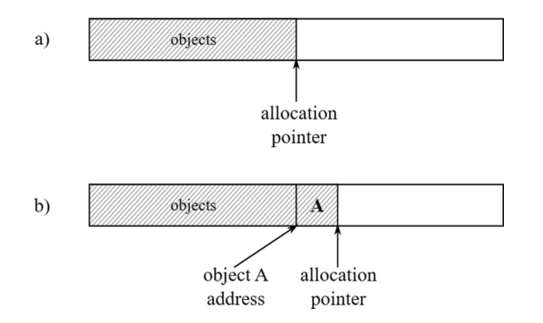
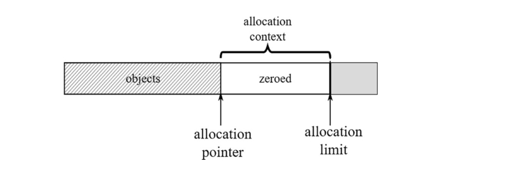
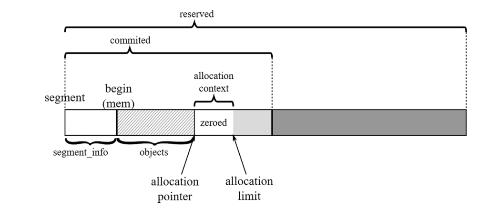
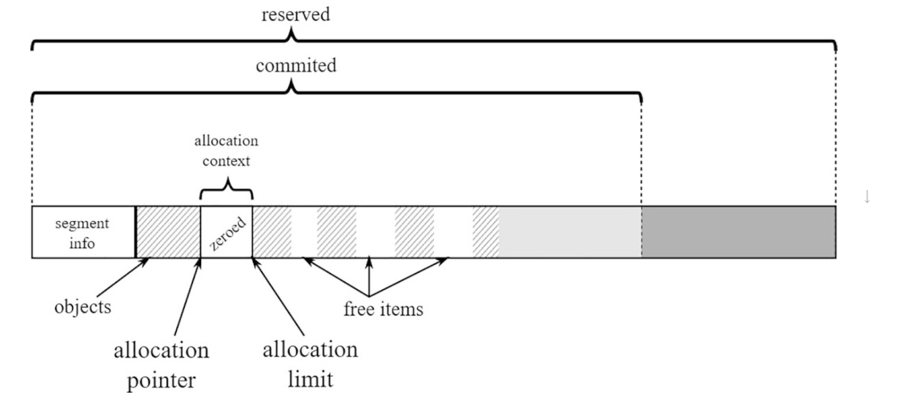
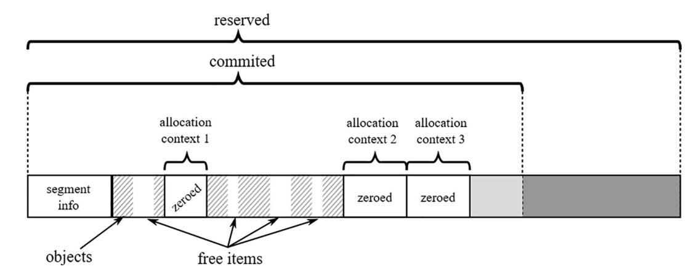
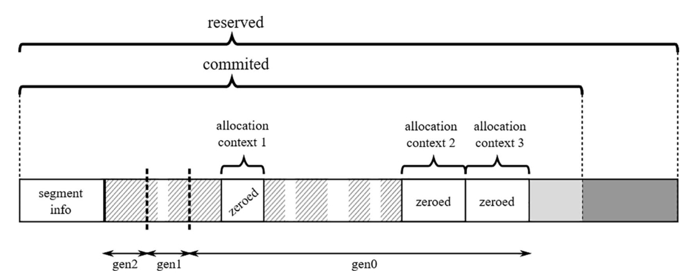
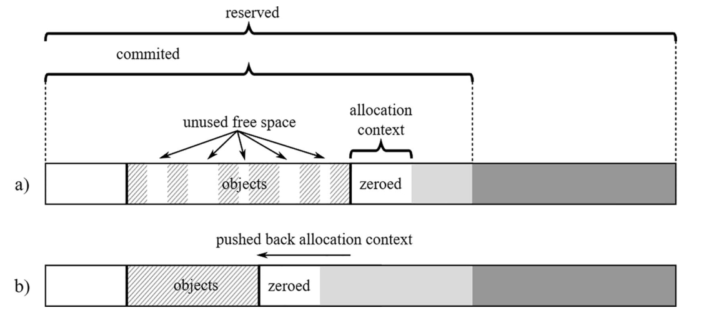
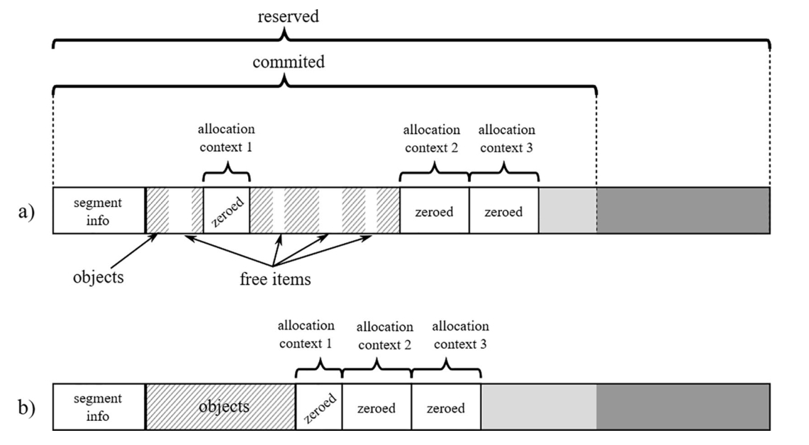

# 内存分配

在前三章中，我们对内存进行了广泛的理论性概述，并介绍了一些底层知识。从第四章开始，您逐渐深入了解了.NET中内存管理的具体实现。截至目前，您主要学习了部分.NET内部机制（第四章）以及内存的结构化组织方式（第五章）。基于已掌握的知识，本章将进入本书最重要的主题——.NET垃圾回收器（Garbage Collector）的工作原理与使用准则。随着内容逐渐深入核心，除了实现细节外，您将接触到更多诊断实践和代码层面的实用知识。

我们首先探讨任何程序运行都不可或缺的机制——内存分配。这一机制为应用程序中创建的对象提供内存空间。无论您如何优化代码，程序始终需要创建对象。即使是最简单的控制台程序，在执行用户代码的第一行之前，就已创建了大量辅助对象。鉴于其关键性和高频使用特性，本章将展示.NET如何极致优化分配器的效率。

您可能还记得第一章简要提到的“分配器”概念——“负责管理动态内存分配与释放的实体”。其中定义的`Allocator.Allocate(amount)` 方法用于提供指定大小的内存。在这个抽象层级上，分配器并不关心对象类型，仅负责提供正确的字节数（后续由运行时进行正确填充）。

## 内存分配导论

显然，我们抽象的 `Allocator.Allocate(amount)` 方法只是冰山一角。本章将深入探讨这个单一方法的实现细节及相关实践技巧。

回顾第二章可知，操作系统提供原生分配机制。C/C++等非托管环境直接依赖这些机制，通过 `malloc/free` 或 `new/delete` 等接口获取内存（Windows称为堆API，Linux使用 `mmap/sbrk` 组合调用）。而.NET环境在操作系统与托管程序之间增加了抽象层。大多数情况下，.NET等托管环境会预分配连续内存块，并在内部实现自有分配机制。这种方式比每次创建对象都向操作系统申请内存高效得多——系统调用开销较大，后续您将看到更简洁的替代方案。

如前一章所述，GC托管堆由段（segment）或.NET 7引入的区域（region）构成。本章讨论的对象分配即发生于此。虽然前文未明确说明，但您可能已推知以下分配规则：

- 小对象堆（SOH）中的对象在Generation 0分配
- 大对象堆（LOH）直接分配（因其未分代），物理存储于LOH所属的段/区域
-  通过 `GC.AllocateUninitializedArray` 和 `GC.AllocateArray` API在固定对象堆（POH）直接分配，固定化数组将存入POH区域
-  非GC堆用于特殊场景（如只读字面量字符串）

《运行时手册》总结道：“每次分配大对象时都会扫描整个大对象堆，而小对象分配仅考虑临时段”。

.NET实现了两种主流分配策略（第一章已提及）：**顺序分配（sequential allocation）**和**空闲列表分配（free-list allocation）**。下面我们结合.NET实现具体解析。

## 指针碰撞分配

分配器持有内存段资源。段内最简单的内存分配方式就是移动表示“当前已分配内存末端”的指针（称为分配指针）。只需将该指针移动待创建对象大小的字节数，即完成了内存分配！图6-1演示了这一原理：假设已有若干对象存在（图6-1a），分配指针指向对象存储末端。当请求为对象A分配内存时，分配器将指针推进指定字节数（图6-1b），并返回指针原位置作为对象地址。



图6-1 简单顺序分配器实现

代码清单6-1的伪代码展示了这种简单高效的技术。正如后续内容所示，这正是CLR内部采用的分配策略之一。如此简洁的函数用汇编代码只需寥寥数条指令即可实现，效率极高。

代码清单6-1 基础指针碰撞分配器实现

```c
PTR Allocator.Allocate(amount) 
{
    PTR result = alloc_ptr;
    alloc_ptr += amount;
    return result;
}
```

这种分配方式亦称**指针碰撞分配（bump pointer allocation）**：通过“碰撞”移动分配指针来提供内存。该策略具有两大特性：

- 其一，顾名思义这是顺序算法——分配内存时指针始终单向移动。这种特性可带来良好的数据局部性。当程序批量创建对象时，这些对象往往代表相互关联的数据结构，因此相邻存储有利于性能（如第二章所述，CPU架构能充分利用时间局部性与空间局部性）。
- 其二，该模型假设内存空间无限大。虽然现实中的RAM容量有限（通常仅数十GB），但通过指针左侧的“魔法操作”（如回收闲置对象并压缩内存碎片），顺序分配仍具实用价值。这正是垃圾回收机制的核心作用——回收闲置对象后，分配指针将回退重置。

关于对象A存储区域的内存初始化问题：新对象需要零值化内存（对象构造函数负责初始化特定字段，这属于执行引擎而非垃圾回收器的职责）。若在 `Allocate` 方法中添加清零操作（如代码清单6-2所示），将引入不可忽视的性能开销。

代码清单6-2 带内存清零的顺序分配器实现

```c
PTR Allocator.Allocate(amount) 
{
    PTR result = alloc_ptr;
    ZeroMemory(alloc_ptr, amount);
    alloc_ptr += amount;
    return result;
}
```

为优化高频操作，.NET采用预清零内存策略。代码清单6-1代表快速路径，仅在必要时回退到代码清单6-2的清零操作。预清零还能提升CPU缓存效率——访问预清零内存会“预热”缓存。

系统通过**分配界限指针（allocation limit）**标识预清零内存区域边界，该区域称为**分配上下文（allocation context）**（见图6-2）。分配上下文是通过指针碰撞实现快速分配的核心区域。



图6-2 分配上下文位于分配指针与分配界限之间，包含即用型零值化内存

当分配上下文空间不足时触发回退机制（代码清单6-3）。CLR的回退机制包含复杂处理流程（后续章节详述SOH/LOH分配时会展开），基础方案是扩展分配上下文或创建新上下文。典型扩展单位为分配量子（allocation quantum），默认情况下至少扩展一个量子单位（若请求量更大则相应扩展）。

代码清单6-3 带分配上下文的增强型指针碰撞分配器

```c
PTR Allocator.Allocate(amount) 
{
    if (alloc_ptr + amount <= alloc_limit) {
        // 快速路径：直接移动指针
        PTR result = alloc_ptr;
        alloc_ptr += amount;
        return result;
    } else {
        // 慢速路径：调整分配上下文（至少扩展一个量子单位）
        if (!try_allocate_more_space()) {
            throw OutOfMemoryException;
        }
        PTR result = alloc_ptr;
        alloc_ptr += amount;
        return result;
    }
}
```

如前章所述，GC通过两阶段段构建机制预备内存：先保留大块内存，再按需提交物理页。但提交新页时仅部分页面会立即清零，因此分配上下文可能未完全利用已提交内存（见图6-3）。这是内存预备成本与性能收益的平衡——例如SOH默认分配量子为8KB，而每次段扩展提交16个物理页（通常64KB）。

> 虽然默认分配量子为8KB，但在特定情况下会动态调整。当前CLR实现会根据分配速率和活跃上下文数量，在1,024至8,096字节区间自适应调整。



图6-3. 段内的分配上下文——创建于当前分配末尾
通过这种方式，分配上下文可以持续增长，而无需每次向操作系统申请提交内存页。如图所示，这种内存获取方式经过精心设计，远比简单的逐对象分配高效得多。

分配上下文并非只能位于段内已提交内存的末端。它也可以创建在现有对象之间的空闲空间中（见图6-4）。这种情况下，分配指针将指向空闲空间的起始位置，分配限制指针则指向其末端。



 图6-4. 段内的分配上下文——创建于空闲空间内部

最关键的特性在于分配上下文具有线程亲和性。这意味着应用程序中每个执行.NET代码的托管线程都拥有专属的分配上下文。正如《运行时之书》所述：“分配上下文与内存块的线程亲和性确保了特定内存块永远只被单个线程写入。因此只要当前分配上下文未耗尽，对象分配就无需加锁。”

这对性能至关重要。若分配上下文由线程共享，Allocate方法就必须进行同步操作，从而引入额外开销。而通过为每个线程配备独立上下文，就能使用简单的指针递增技术，无需担心其他线程会并发修改其分配指针或限制指针。该机制基于线程本地存储（TLS）实现，每个线程的 `ThreadLocalInfo` 结构体中存储着包含分配上下文的 `Thread` 类实例。Java开发者会将此技术称为线程本地分配缓冲区（TLAB）。

> 注意：在单逻辑处理器的机器上，只会存在单个全局分配上下文。因此访问必须同步，因为不同线程可能访问这个唯一的全局上下文。不过这种情况下同步成本极低，因为任意时刻只能有一个线程运行。而在Linux系统上，即使只有一个可用核心，也永远不会使用全局分配上下文。

多个分配上下文的存在使得图6-3和图6-4的简化示意图变得复杂。应用程序中存在多个托管线程时，更典型的场景是单个段内存在多个分配上下文（见图6-5）。随着程序运行，有些会位于段末端，有些则会复用对象间的空闲空间。

 图6-5. 段内多个分配上下文——每个线程对应一个

分配上下文存在于包含第0代和第1代的短暂段中。因此图6-5展示的短暂段结构中，“objects”部分会被划分为第1代和第0代（若程序初始阶段对象较少，可能还包含第2代）。

图6-6再次总结了短暂段的内存组织结构。请牢记——代只是段内部可移动的逻辑分界。

图6-6. 短暂段组织结构概要

对于区域（region）模式，上述描述仍然适用，区别在于分配上下文位于 `gen0` 区域，且起始处没有 `segment_info` 结构。注意单个区域仅包含同代对象。

原始的指针递增分配技术存在一个缺陷：若对已分配对象执行清扫式垃圾回收，会产生内存碎片。在分配指针左侧将出现大量空闲内存空洞（见图6-7a）。原始的实现（非.NET所用方案）无法识别这些碎片，只能持续消耗新内存。显然，任何成熟的GC实现都不会在清扫堆内存后不尝试利用这些空闲空间。最简单的解决方案是触发压缩式垃圾回收，使存活对象紧密排列，从而整体回退分配上下文（见图6-7b）。但相比依赖压缩，还存在更优解。

图6-7. 指针递增分配与碎片问题：(a)清扫式GC产生碎片；(b)压缩式GC通过回退分配上下文回收内存，但需要大量内存拷贝

为减少碎片，.NET实现在空闲空间内部创建分配上下文（见图6-4和图6-5，复用碎片形成的空洞是理想方案）。GC会间歇性启动压缩，随后所有分配上下文将在段末端自然重组（见图6-8）。

图6-8. 压缩式垃圾回收器工作后可能重组所有分配上下文——(a)初始状态下三个分配上下文分散在段内；(b)压缩后GC分配段将获得最优重组

