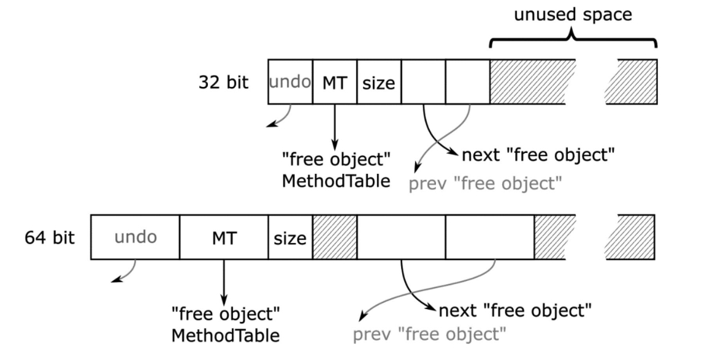

# 内存分配

在前三章中，我们对内存进行了广泛的理论性概述，并介绍了一些底层知识。从第四章开始，您逐渐深入了解了.NET中内存管理的具体实现。截至目前，您主要学习了部分.NET内部机制（第四章）以及内存的结构化组织方式（第五章）。基于已掌握的知识，本章将进入本书最重要的主题——.NET垃圾回收器（Garbage Collector）的工作原理与使用准则。随着内容逐渐深入核心，除了实现细节外，您将接触到更多诊断实践和代码层面的实用知识。

我们首先探讨任何程序运行都不可或缺的机制——内存分配。这一机制为应用程序中创建的对象提供内存空间。无论您如何优化代码，程序始终需要创建对象。即使是最简单的控制台程序，在执行用户代码的第一行之前，就已创建了大量辅助对象。鉴于其关键性和高频使用特性，本章将展示.NET如何极致优化分配器的效率。

您可能还记得第一章简要提到的“分配器”概念——“负责管理动态内存分配与释放的实体”。其中定义的`Allocator.Allocate(amount)` 方法用于提供指定大小的内存。在这个抽象层级上，分配器并不关心对象类型，仅负责提供正确的字节数（后续由运行时进行正确填充）。

## 内存分配导论

显然，我们抽象的 `Allocator.Allocate(amount)` 方法只是冰山一角。本章将深入探讨这个单一方法的实现细节及相关实践技巧。

回顾第二章可知，操作系统提供原生分配机制。C/C++等非托管环境直接依赖这些机制，通过 `malloc/free` 或 `new/delete` 等接口获取内存（Windows称为堆API，Linux使用 `mmap/sbrk` 组合调用）。而.NET环境在操作系统与托管程序之间增加了抽象层。大多数情况下，.NET等托管环境会预分配连续内存块，并在内部实现自有分配机制。这种方式比每次创建对象都向操作系统申请内存高效得多——系统调用开销较大，后续您将看到更简洁的替代方案。

如前一章所述，GC托管堆由段（segment）或.NET 7引入的区域（region）构成。本章讨论的对象分配即发生于此。虽然前文未明确说明，但您可能已推知以下分配规则：

- 小对象堆（SOH）中的对象在Generation 0分配
- 大对象堆（LOH）直接分配（因其未分代），物理存储于LOH所属的段/区域
-  通过 `GC.AllocateUninitializedArray` 和 `GC.AllocateArray` API在固定对象堆（POH）直接分配，固定化数组将存入POH区域
-  非GC堆用于特殊场景（如只读字面量字符串）

《运行时手册》总结道：“每次分配大对象时都会扫描整个大对象堆，而小对象分配仅考虑临时段”。

.NET实现了两种主流分配策略（第一章已提及）：**顺序分配（sequential allocation）**和**空闲列表分配（free-list allocation）**。下面我们结合.NET实现具体解析。

## 指针碰撞分配

分配器持有内存段资源。段内最简单的内存分配方式就是移动表示“当前已分配内存末端”的指针（称为分配指针）。只需将该指针移动待创建对象大小的字节数，即完成了内存分配！图6-1演示了这一原理：假设已有若干对象存在（图6-1a），分配指针指向对象存储末端。当请求为对象A分配内存时，分配器将指针推进指定字节数（图6-1b），并返回指针原位置作为对象地址。


图6-1 简单顺序分配器实现

代码清单6-1的伪代码展示了这种简单高效的技术。正如后续内容所示，这正是CLR内部采用的分配策略之一。如此简洁的函数用汇编代码只需寥寥数条指令即可实现，效率极高。

代码清单6-1 基础指针碰撞分配器实现

```c
PTR Allocator.Allocate(amount) 
{
    PTR result = alloc_ptr;
    alloc_ptr += amount;
    return result;
}
```

这种分配方式亦称**指针碰撞分配（bump pointer allocation）**：通过“碰撞”移动分配指针来提供内存。该策略具有两大特性：

- 其一，顾名思义这是顺序算法——分配内存时指针始终单向移动。这种特性可带来良好的数据局部性。当程序批量创建对象时，这些对象往往代表相互关联的数据结构，因此相邻存储有利于性能（如第二章所述，CPU架构能充分利用时间局部性与空间局部性）。
- 其二，该模型假设内存空间无限大。虽然现实中的RAM容量有限（通常仅数十GB），但通过指针左侧的“魔法操作”（如回收闲置对象并压缩内存碎片），顺序分配仍具实用价值。这正是垃圾回收机制的核心作用——回收闲置对象后，分配指针将回退重置。

关于对象A存储区域的内存初始化问题：新对象需要零值化内存（对象构造函数负责初始化特定字段，这属于执行引擎而非垃圾回收器的职责）。若在 `Allocate` 方法中添加清零操作（如代码清单6-2所示），将引入不可忽视的性能开销。

代码清单6-2 带内存清零的顺序分配器实现

```c
PTR Allocator.Allocate(amount) 
{
    PTR result = alloc_ptr;
    ZeroMemory(alloc_ptr, amount);
    alloc_ptr += amount;
    return result;
}
```

为优化高频操作，.NET采用预清零内存策略。代码清单6-1代表快速路径，仅在必要时回退到代码清单6-2的清零操作。预清零还能提升CPU缓存效率——访问预清零内存会“预热”缓存。

系统通过**分配界限指针（allocation limit）**标识预清零内存区域边界，该区域称为**分配上下文（allocation context）**（见图6-2）。分配上下文是通过指针碰撞实现快速分配的核心区域。


图6-2 分配上下文位于分配指针与分配界限之间，包含即用型零值化内存

当分配上下文空间不足时触发回退机制（代码清单6-3）。CLR的回退机制包含复杂处理流程（后续章节详述SOH/LOH分配时会展开），基础方案是扩展分配上下文或创建新上下文。典型扩展单位为分配量子（allocation quantum），默认情况下至少扩展一个量子单位（若请求量更大则相应扩展）。

代码清单6-3 带分配上下文的增强型指针碰撞分配器

```c
PTR Allocator.Allocate(amount) 
{
    if (alloc_ptr + amount <= alloc_limit) {
        // 快速路径：直接移动指针
        PTR result = alloc_ptr;
        alloc_ptr += amount;
        return result;
    } else {
        // 慢速路径：调整分配上下文（至少扩展一个量子单位）
        if (!try_allocate_more_space()) {
            throw OutOfMemoryException;
        }
        PTR result = alloc_ptr;
        alloc_ptr += amount;
        return result;
    }
}
```

如前章所述，GC通过两阶段段构建机制预备内存：先保留大块内存，再按需提交物理页。但提交新页时仅部分页面会立即清零，因此分配上下文可能未完全利用已提交内存（见图6-3）。这是内存预备成本与性能收益的平衡——例如SOH默认分配量子为8KB，而每次段扩展提交16个物理页（通常64KB）。

> 虽然默认分配量子为8KB，但在特定情况下会动态调整。当前CLR实现会根据分配速率和活跃上下文数量，在1,024至8,096字节区间自适应调整。


图6-3. 段内的分配上下文——创建于当前分配末尾
通过这种方式，分配上下文可以持续增长，而无需每次向操作系统申请提交内存页。如图所示，这种内存获取方式经过精心设计，远比简单的逐对象分配高效得多。

分配上下文并非只能位于段内已提交内存的末端。它也可以创建在现有对象之间的空闲空间中（见图6-4）。这种情况下，分配指针将指向空闲空间的起始位置，分配限制指针则指向其末端。


 图6-4. 段内的分配上下文——创建于空闲空间内部

最关键的特性在于分配上下文具有线程亲和性。这意味着应用程序中每个执行.NET代码的托管线程都拥有专属的分配上下文。正如《运行时之书》所述：“分配上下文与内存块的线程亲和性确保了特定内存块永远只被单个线程写入。因此只要当前分配上下文未耗尽，对象分配就无需加锁。”

这对性能至关重要。若分配上下文由线程共享，Allocate方法就必须进行同步操作，从而引入额外开销。而通过为每个线程配备独立上下文，就能使用简单的指针递增技术，无需担心其他线程会并发修改其分配指针或限制指针。该机制基于线程本地存储（TLS）实现，每个线程的 `ThreadLocalInfo` 结构体中存储着包含分配上下文的 `Thread` 类实例。Java开发者会将此技术称为线程本地分配缓冲区（TLAB）。

> 注意：在单逻辑处理器的机器上，只会存在单个全局分配上下文。因此访问必须同步，因为不同线程可能访问这个唯一的全局上下文。不过这种情况下同步成本极低，因为任意时刻只能有一个线程运行。而在Linux系统上，即使只有一个可用核心，也永远不会使用全局分配上下文。

多个分配上下文的存在使得图6-3和图6-4的简化示意图变得复杂。应用程序中存在多个托管线程时，更典型的场景是单个段内存在多个分配上下文（见图6-5）。随着程序运行，有些会位于段末端，有些则会复用对象间的空闲空间。

 图6-5. 段内多个分配上下文——每个线程对应一个

分配上下文存在于包含第0代和第1代的短暂段中。因此图6-5展示的短暂段结构中，“objects”部分会被划分为第1代和第0代（若程序初始阶段对象较少，可能还包含第2代）。

图6-6再次总结了短暂段的内存组织结构。请牢记——代只是段内部可移动的逻辑分界。

图6-6. 短暂段组织结构概要

对于区域（region）模式，上述描述仍然适用，区别在于分配上下文位于 `gen0` 区域，且起始处没有 `segment_info` 结构。注意单个区域仅包含同代对象。

原始的指针递增分配技术存在一个缺陷：若对已分配对象执行清扫式垃圾回收，会产生内存碎片。在分配指针左侧将出现大量空闲内存空洞（见图6-7a）。原始的实现（非.NET所用方案）无法识别这些碎片，只能持续消耗新内存。显然，任何成熟的GC实现都不会在清扫堆内存后不尝试利用这些空闲空间。最简单的解决方案是触发压缩式垃圾回收，使存活对象紧密排列，从而整体回退分配上下文（见图6-7b）。但相比依赖压缩，还存在更优解。

图6-7. 指针递增分配与碎片问题：(a)清扫式GC产生碎片；(b)压缩式GC通过回退分配上下文回收内存，但需要大量内存拷贝

为减少碎片，.NET实现在空闲空间内部创建分配上下文（见图6-4和图6-5，复用碎片形成的空洞是理想方案）。GC会间歇性启动压缩，随后所有分配上下文将在段末端自然重组（见图6-8）。

图6-8. 压缩式垃圾回收器工作后可能重组所有分配上下文——(a)初始状态下三个分配上下文分散在段内；(b)压缩后GC分配段将获得最优重组

## 空闲链表分配

空闲链表分配的核心思想非常简单。当运行时要求垃圾回收器分配指定字节数的内存时，它会遍历空闲链表以寻找足够容纳所需字节数的空闲间隙。如第1章所述，可采用两种主要的空闲链表扫描策略：

- 最佳适配（Best-fit）：寻找最符合需求空间的空闲内存间隙（即大于等于所需尺寸的最小内存块），以尽可能减少内存碎片。朴素实现需要扫描整个空闲项列表，但更优方案是采用后文介绍的桶式管理。
- 首次适配（First-fit）：只要找到合适的空闲内存间隙就立即停止扫描。这种方法时间效率高，但在碎片化控制方面远非最优。

微软.NET实现采用桶式管理来维护不同尺寸的空闲间隙链表：既能实现快速扫描，又不会过度牺牲碎片优化效果。通过控制桶的数量（即不同尺寸范围的空闲间隙分类数量），可以在性能与碎片减少之间取得平衡。若只存在单个桶（所有尺寸的空闲间隙都归入其中），就退化为朴素的首次适配策略；反之若设置大量桶（以极精细的间隙尺寸粒度划分），则近似最佳适配策略。后文将会看到，各代堆采用的桶数量各不相同。

堆内存中的空闲空间同样需要标记表示。当扫描堆遇到空闲空间时，必须知晓该区域大小才能确定如何跳转到下一个有效对象。虽然可以通过查询空闲链表中的对应条目实现，但这并非理想方案——需要在堆和空闲链表之间来回跳转，会产生显著开销。实际上，系统会在每个空闲空间起始位置直接存储一个伪对象（dummy object）。该伪对象形似常规数组，但具有特殊的“空闲对象”方法表（见图6-9）。与方法表指针相邻存储的是空闲空间的“元素”数量（类似于普通数组的结构）。由于“空闲对象”数组的单个元素尺寸定义为1字节，因此元素数量值即为以字节表示的空闲空间大小。这样在堆扫描过程中，只需读取空闲对象的长度值即可跳过该区域，定位到下一个有效对象。

> 过程解析：
>
> 上述过程可以想象一下，当你在一本书中划掉某些段落后，如何记住这些空白处有多长，以便将来可能重新利用这些空间？.NET垃圾回收器面临类似的挑战。
>
> ### 空闲空间标记的挑战
>
> 当对象被回收后，堆内存中会出现"空洞"（空闲空间）。垃圾回收器在扫描堆时需要知道：
>
> 1. 这里是空闲空间（不是有效对象）
> 2. 这个空闲空间有多大（需要跳过多少字节才能到达下一个真实对象）
>
> ## 常规思路与问题
>
> 一种方法是维护一个单独的"空闲链表"，记录所有空闲空间的位置和大小。但这种方式有个明显缺点：
>
> ```
> 扫描堆 -> 遇到空间 -> 去查空闲链表 -> 找到对应条目 -> 返回堆继续扫描
> ```
>
> 这样的“跳来跳去”会导致CPU缓存失效，严重降低性能。
>
> ### 实际解决方案
>
> .NET采用了一个聪明的方法：**把空闲空间本身伪装成一个特殊的“假对象”**。
>
> 具体做法：
>
> 1. 在每个空闲空间的起始位置，构造一个看起来像数组的“伪对象”
> 2. 这个“伪对象”有两个关键部分：
>    - 指向特殊“空闲对象方法表”的指针（告诉GC：“我是空闲空间！”）
>    - 一个表示“元素数量”的整数值（实际就是空闲空间的字节数）
>
> 布局图如下：
>
> ```
> 真实对象布局:  [方法表指针] [其他字段...]
> 空闲对象布局:  [特殊方法表指针] [空间大小] [........未使用区域........]
>               ↑              ↑        ↑
>               告诉GC这是空闲块 告诉GC这块有多大 这部分可被重新分配
> ```
>
> 这种设计的妙处在于：
>
> 1. **无需额外查表**：GC看到特殊方法表指针就知道“这是空闲块”
> 2. **一次读取就能跳过**：紧挨着方法表指针的就是空间大小，读取后立即跳过
> 3. **与正常对象处理流程一致**：GC可以用统一的方式处理所有内存块
>
> ### 例子
>
> 假设内存中有这样的布局：
>
> ```
> [对象A][空闲区域200字节][对象B][空闲区域100字节][对象C]
> ```
>
> GC扫描时会看到：
>
> ```
> [对象A][空闲对象头部|200][对象B][空闲对象头部|100][对象C]
> ```
>
> 当扫描到第一个空闲对象头部时，GC检测到特殊方法表，立即知道这是空闲块，并直接跳过200字节找到对象B，非常高效。

此外，某些代际的空闲对象会采用名为“undo”的特殊元素取代常规对象头（这对“空闲对象”实属冗余）。如后文所述，该元素在处理链表时会临时保存其他空闲链表项的地址。

图6-9. 表示GC堆上空闲空间的“自由对象”结构。对于某些代，还使用了“撤销”或指向前一个“自由对象”的指针等额外元素。

> 注意：若对与“自由对象”相关的.NET Core代码感兴趣，可从 `gc_heap::make_unused_array` 方法入手，该方法负责准备自由对象。如您所见，它会调用使用静态全局指针 `g_pFreeObjectMethodTable` 作为新方法表的 `SetFree` 方法。随后通过调用 `allocator::thread_item(gap_start, size)` 或 `allocator::thread_item_front(gap_start, size)`方法将间隙添加到空闲列表。此操作仅针对大于最小对象尺寸两倍的间隙执行，这有助于通过忽略小项目来降低列表管理开销。

每个代的分配器维护一个桶列表（见图6-10）。首个桶表示尺寸小于第一个桶大小（编码在 `first_bucket_bits` 字段中）的空闲项目列表。后续每个桶的尺寸翻倍，最后一个桶用于存储无上限的大尺寸项目。每个桶维护对应空闲项目列表的描述信息，特别是其头部。

如图6-10所示，列表本身在GC堆上的“自由对象”之间实现为双链表（第2代情况下）或单链表（其他代）。这使得在列表操作期间能快速遍历，因为至少堆的部分内容已在缓存中。在此维护单独列表并无必要。

双链版本的空闲列表已在.NET 6中引入。它仅用于第2代，因为该设计旨在解决一个特定问题：在此版本之前，所有代的空闲列表在并发清扫阶段（第11章详述）开始时会被重置。但当第2代进行并发清扫时，SOH中可能发生常规分配，从而触发“前台GC”。若该GC收集第1代并执行压缩操作，可能会尝试将晋升对象分配到第2代的间隙中。但由于列表已被清空，GC无法重用空闲空间，直到列表完全重建。这可能导致第2代不必要地增长，因为晋升对象需要被“分配”到某处——即该代末尾。

自.NET 6起，第2代空闲列表在GC开始时不再重置。但如今列表可能变得更大，因此采用更高效的数据结构（如双链表）对其中元素的链接与解链操作更为有利。

图6-10. CLR中基于桶的空闲列表实现：(a)单链版本（用于第0、1代和UOH），(b)双链版本（用于第2代)

> 您可能会惊讶于每个代都有独立分配器，因为此前明确说明对象分配仅发生在SOH的第0代、LOH或POH中。但当GC将存活对象从一代晋升到下一代时，实际上也是在"分配"到下一代。

每代都有独立的桶数量和大小配置，如表6-1所示。可见两个短暂代仅为所有尺寸维护单个桶。第2代配置在32位和64位运行时中存在差异。例如在64位运行时中，GC会为小于256B、512B、1kB、2kB、4kB、8kB的尺寸维护桶，最后一个桶用于大于8kB的项目。

表6-1. 每代的空闲列表桶配置

| 区域         | 首桶尺寸     | 桶数量 |
| ------------ | ------------ | ------ |
| 第0代和第1代 | Int.Max      | 1      |
| 第2代        | 256B（64位） | 12     |
|              | 128B（32位） | 12     |
| LOH          | 64kB         | 7      |
| POH          | 256B         | 19     |

基于分桶空闲列表的分配相当简单（见代码清单6-4）。从首个合适桶开始，尝试在对应空闲列表中寻找匹配的空闲项目。从空闲项目分配所需内存后，可能仍有剩余空闲内存。若该剩余空间大于两个对象的最小尺寸（即64位平台为48字节），则会用剩余部分创建新空闲项目并添加到列表；否则，该小内存区域将被计为不可用碎片。

代码清单6-4. 空闲列表分配的伪代码实现

```c#
PTR Allocator.Allocate(amount)
{ 
	foreach (bucket in buckets) 
	{ 
	  if (amount < bucket.BucketSize) // 跳过项目过小的桶 { foreach (freeItem in bucket.FreeItemList) 		{ 
	    if (size < freeItem.Size) 
	    {  
	        UnlinkItem(freeItem); 
	        ZeroMemory(freeItem.Start, amount); 
	        if (RemainingFreeSpaceBigEnough()) 
	      	    LinkRemainingFreeSpace(freeItem, amount); 
	        return freeItem.Start; 
	     }
	   }
	 }
}
```

> 注意代码清单6-4中的内存清零操作仅适用于用户分配项目（需创建全新状态），但在晋升期间为老代分配时可省略（晋升对象内容将覆盖该空间）。这正是.NET的实现方式。此外，对于第0代和第1代，若空闲项目无法满足所需尺寸则会被丢弃（成为不可用碎片）。这意味着这两代中每个空闲项目仅会被检查一次。这是在维护空闲列表成本与允许碎片化成本之间的又一折衷方案。两个最年轻的代经常被压缩，因此空闲列表会频繁重建。

前文提及的“自由对象”中的 Undo 元素由垃圾回收器在计划阶段使用——具体而言，当决定使用老代中的某个空闲项目进行分配时（即用于存放从年轻代晋升的对象）。若找到合适项目，GC会通过指针操作（类似经典单链表操作）从空闲列表“解链”该空闲项目（见图6-11）：

- 被移除项目的地址存储在前一项目的“undo”字段中（若存在前一项目）；
- 前一项目的“next”指针改为指向被移除项目所指向的下一可用空闲项目。

图6-11. 单链表情况下的空闲列表项目解链操作。在计划阶段结束时，垃圾回收器可能决定执行清扫式回收而非压缩式回收。采用清扫式回收时，老年代保持原状，因此需要撤销那些计划中的分配操作。通过使用存储在“undo”字段中的空闲项目地址，可恢复原始列表。

> 空闲链表就像一串串联起来的空房子，每个房子（空闲内存块）都知道下一个空房子在哪里：
>
> ```
> [空闲块A] → [空闲块B] → [空闲块C] → ... → null
> ```
>
> 每个空闲块包含：
>
> - 一个“next”指针（指向链表中的下一个空闲块）
> - 一个“undo”字段（这是关键，稍后解释）
> - 块的大小信息
>
> ### 分配过程与“解链”操作
>
> 当GC需要给从年轻代晋升的对象分配空间时，它会从老年代的空闲链表中寻找合适大小的块。找到后，需要从链表中移除这个块（称为“解链”）：
>
> 解链前：
>
> ```
> [块A] → [块B] → [块C] → [块D]
> ```
>
> 假设要移除块C，解链后：
>
> ```
> [块A] → [块B] → [块D]  [块C]（已分离，准备分配给新对象）
> ```
>
> ### “Undo”机制的作用
>
> 这就是“Undo”元素发挥作用的地方！在实际执行解链操作时：
>
> 1. GC会在块B的“undo”字段中**记录被移除块C的地址**
> 2. 然后修改块B的“next”指针，让它指向块D
>
> ```
> 修改后的块B：[next指向D, undo记录了C的地址]
> ```
>
> ### 为什么需要“Undo”机制？
>
> 垃圾回收分为多个阶段，其中“计划阶段”会做出一些临时决策。有时候，GC可能先计划使用压缩式回收（移动对象以消除碎片），但后来决定改用清扫式回收（只标记可用空间，不移动对象）。
>
> 如果发生这种变化：
>
> 1. 老年代应保持原状
> 2. 那些已经从空闲链表中移除准备分配的块需要**放回原位**
>
> 撤销过程：
>
> 1. GC查看块B的“undo”字段，找到被移除的块C
> 2. 重新调整块B的“next”指针指回块C
> 3. 块C的“next”指针仍然指向块D
> 4. 结果：链表恢复原状
>
> ```
> 恢复后：[块A] → [块B] → [块C] → [块D]
> ```
>
> ### 总结
>
> “Undo”机制是.NET垃圾回收器的一个巧妙设计，允许GC在做出最终决策前尝试不同的内存管理策略，同时保留“反悔”的能力。这种灵活性对于平衡内存利用率和GC暂停时间至关重要。

不过您将在第7章中更详细地了解计划阶段、压缩阶段与清扫阶段之间的关联机制。
