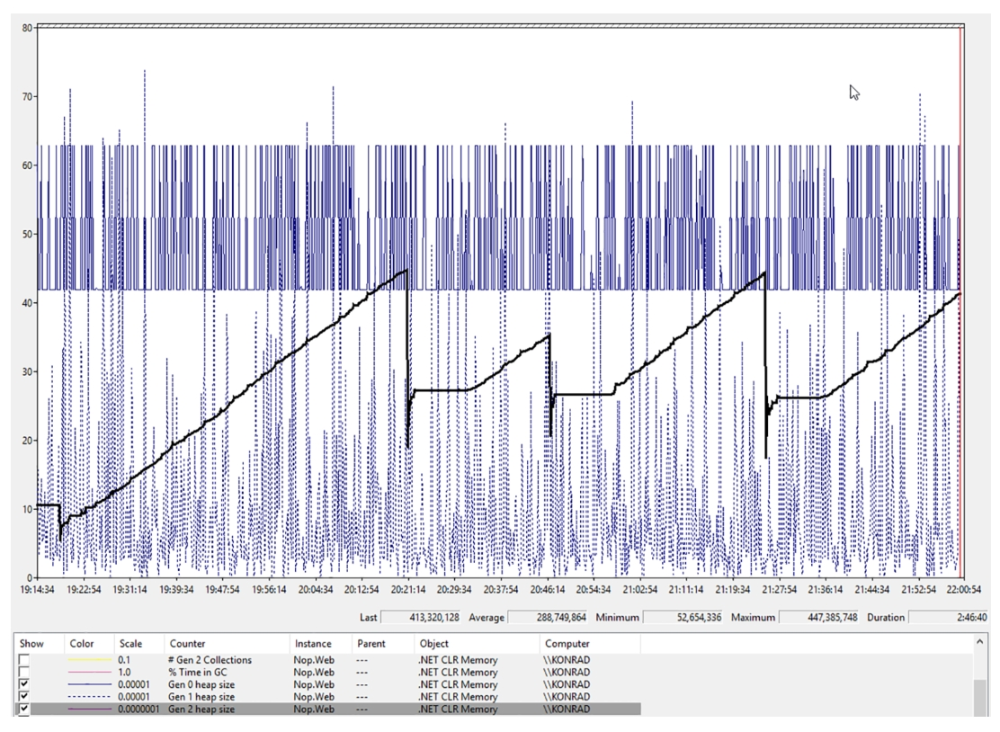
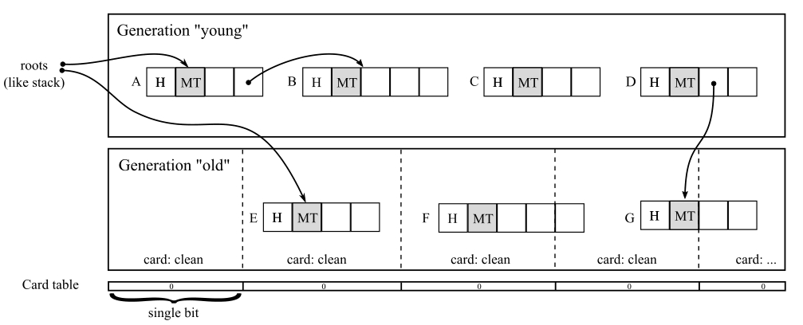

# 内存分区

## 分区策略

垃圾回收堆（GC Heap）的容量可能增长至数十甚至数百GB。从内存分配器的角度来看这或许不成问题，但很难想象垃圾回收器能统一处理如此庞大的数据量。及时处理千兆级别的数据本就困难重重。在设计垃圾回收器整体架构时，最关键参数之一是其引入的开销——例如因垃圾回收导致线程活动暂停的时长，或其所消耗的CPU资源。理想情况下，暂停时间应短于毫秒级。然而根据第二章列出的内存访问延迟特性，读取千兆数据所需时间远超数毫秒。正因如此，所有垃圾回收器实现背后最核心的设计决策之一就是**内存分区策略**。

简而言之，必须将整个 GC 堆分割为更小的部分，才能实现独立操作。若策略得当，可极大加速垃圾回收器工作，因为实践证明程序运行期间无需对所有数据一视同仁。

现有分区策略通常基于已分配对象的某项特性：

- **大小**：可按对象大小划分堆区域。例如对小型对象与大对象区别处理，这在采用压缩回收时尤为重要。复制大对象会产生显著内存开销，因此可能仅压缩小对象区域，而对大对象采用清扫回收。
- **生命周期**：对象存活时长至关重要。直观而言，短暂存活的对象应与贯穿应用生命周期的对象区别对待。如第四章所示，某些字符串甚至永恒存在！虽然无法预知未来，但至少可区分新生对象与长期存活对象。不同生命周期的内存区域通常称为“代”（generations），以“年轻代/老年代”或连续数字命名。
- **可变性**：对象是否可变是关键特性。不可变对象创建后无法修改，值得与可变对象差异化管理。
- **类型**：可对特定类型对象特殊处理。例如为字符串、整型或其他特殊类、接口实现或特性维护独立堆区，效果因场景而异
- **种类**：对象可按多种方式分类。例如是否包含指针（外部引用）？若无则压缩时无需考虑；是否已被固定（pinning，第七章详述）？固定对象即便在压缩回收时也不移动，或应存入独立分区以避免移动开销。

微软 .NET 与 Mono 实现仅采用前两种策略。其垃圾回收器不关注对象类型或可变性，仅管理所需字节数（如“为新对象分配N字节”）。但随着 GC 设计演进，后续章节将看到对字符串字面量或固定数组的特殊优化。

下文将详细探讨这两种分区策略。惯例上以.NET实现为主，Mono或其他运行时仅作旁注。

## 大小分区

第一种策略是根据对象大小差异化管理。前文提及，主要原因在于压缩回收时的内存复制开销。由于无需划分过多体积区间，仅需设定单一阈值区分大小对象。GC 堆因此被划分为两个物理隔离的内存区域：

- **小对象堆（SOH）​**：存放所有小于85,000字节的对象
- **大对象堆（LOH）​**：存放所有大于等于85,000字节的对象

二者共享大部分逻辑与代码，但存在关键差异。需注意该阈值为85,000字节（非85×1024字节的85KiB或85kB）。此阈值可通过`LOHThreshold` 配置调高（不可调低）。

分区策略导致两堆区采用不同处理方式：

- **SOH**可采用压缩回收，因小对象内存复制开销更低（第七章将介绍SOH同时实现了清扫和原地压缩回收，计划阶段决定具体方式）
- **非内存受限环境**​（如无内存限制的容器中），​**LOH**默认采用清扫回收以避免大对象压缩成本（但用户可显式触发LOH压缩）

> Mono 6.12采用8,000字节阈值，更大对象存入“大对象空间”（LoS）。小对象先分配在新生代，存活后晋升至主堆。类似.NET，小对象空间可压缩，LoS仅执行清扫。

85,000字节阈值的选定源于工程实践与历史因素——基于.NET初期大量内部及外部场景测试得出的实验值。

该阈值针对对象的**浅层大小**（引用计为指针大小而非目标对象体积），故 LOH 常见对象多为数组和大字符串。含大数组字段的对象本身仍属小对象（字段仅是小型指针）。

另一实现细节是**内存对齐**：

- **SOH**：32位运行时4字节对齐，64位运行时8字节对齐
- **LOH**：始终8字节对齐（与运行时位数无关）

此设计主因双精度数组需 8 字节对齐（后文详述），且 8 字节对齐对大对象影响微乎其微。

### 小对象堆（SOH）

作为最活跃的内存区域，绝大多数对象体积小于85,000字节，故SOH对象数量通常比LOH高数个数量级。为缓解海量对象对GC性能的影响（如标记阶段遍历大对象图），该区域进一步按对象生命周期划分为“代”（后文详述）。

### 大对象堆（LOH）

LOH在GC实现中被标记为第3代，但逻辑上属于第2代——仅当第2代回收时才会处理。

设计假设大对象分配较罕见（多数程序无需大量短生命周期的大数据结构），但某些场景（如大型JSON字符串）可能导致性能问题（参见第六章“规则15——避免过量LOH分配”）。例外情况包括：

#### 大对象堆——双精度数组

32位运行时环境下（即便运行于64位机器），元素超1,000的双精度数组会存入LOH（如代码清单5-1所示）。由于每个双精度占8字节，这意味着LOH可能存放仅8,000字节的数组，打破85,000字节下限规则。

代码清单5-1：32位.NET运行时环境下，含1000+元素的双精度数组会分配至LOH，因此本示例程序将分别输出“0”和“2”

```csharp
double[] array1 = new double[999];
Console.WriteLine(GC.GetGeneration(array1)); // 输出 0
double[] array2 = new double[1000];
Console.WriteLine(GC.GetGeneration(array2)); // 输出 2
```

为何设定如此特殊的例外规则？如前所述，这源于**内存对齐**需求。双精度类型占8字节，对其非对齐访问的性能损耗远高于整型。64位环境中SOH和LOH均采用8字节对齐故无此问题，但32位SOH的4字节对齐可能导致性能隐患。

这些数组被存入**始终8字节对齐的LOH**（该设计主要为此场景服务），从而避免大型数组的非对齐访问开销。但为何不将所有双精度数组都分配至LOH？因为LOH不压缩的特性会导致**内存碎片化**——大量小对象将产生不连续内存空隙。仅对超阈值数组启用LOH分配，实质是在非对齐访问成本与碎片化之间取得的平衡。而1000个元素的阈值同样通过实验得出。

> 开发者仍需警惕32位运行时下双精度数组引发的碎片化问题。例如频繁创建/回收超1000个元素的双精度数组会导致LOH内存分散。此时应改用**可复用数组缓冲池**而非持续新建数组（详见场景6-1）。

> **数组的对齐与访问性能**
>
> 在 32 位运行时环境中：
>
> - **SOH（小对象堆）默认是 4 字节对齐**，也就是说，分配的对象起始地址以 4 字节为粒度对齐。
> - **双精度类型（`double`）占用 8 字节**，并要求 **8 字节对齐** 才能高效访问。虽然双精度本身的大小是 4 字节的倍数，但如果分配在 4 字节对齐的堆上，可能会导致非对齐访问。
>
> **非对齐访问的性能问题**
>
> 假如双精度数组分配在 SOH（4 字节对齐）上，可能会出现以下问题：
>
> - 当数组的起始地址非 8 字节对齐时，硬件需要额外操作（通常是两次内存读取和合并）来访问双精度元素。
> - 这种非对齐访问会带来显著的性能损耗，尤其在涉及大量数据计算的场景（如科学计算、数值分析等）中。
>
> **LOH（大对象堆）与 8 字节对齐**
>
> - **LOH 始终以 8 字节对齐**，因此分配到 LOH 的对象可以避免非对齐访问的问题。
> - 为了解决双精度数组在 SOH 上的性能隐患，.NET 的 32 位运行时采用了一种特殊规则：
>   - **当双精度数组的长度超过 1000 个元素（即 8000 字节）时，直接分配到 LOH**，从而避免潜在的非对齐访问。
>   - 这个规则是为双精度数组优化的特例，而非普适规则。

## 生命周期分区

如前所述，由于小对象堆（SOH）可能包含海量对象，故决策按对象生命周期将其分区管理，该设计称为**分代垃圾回收**——通过特定方式将具有相似生命周期的对象划分为不同代。生命周期定义方式主要有两种：

- **绝对时间**：以CPU时钟周期数等实时指标衡量对象存活时长。但存在根本性缺陷：“长生命周期”的临界值难以界定（1秒算长还是短？）答案完全取决于具体程序特性（对象分配频率/回收需求等），虽可设计自适应阈值计算机制，但会过度复杂化。
- **相对时间**：以经历垃圾回收的次数作为代划分依据。例如：对象每存活一次GC则年龄计数器+1，超过预设阈值即归为“老年代”

> 我们甚至可以想象一些不那么明显的方法来表示对象的生命周期。例如，如果收集器和分配器的设计方式使对象永远不会移动到较低的地址范围，那么对象的年龄就可以计算为其地址与内存中其他位置的差值。
>

值得注意的是，许多垃圾回收系统的描述一开始都会说.NET有一个分代垃圾回收系统（Generational GC）。但是，为什么分代垃圾回收有意义呢？为什么要根据对象的年龄对其进行拆分并采用不同的处理方式才有意义呢？这主要源于一个被称为 “分代假设 ”的观察结果。事实上，该假设有较弱（不那么普遍）和较强（更普遍）的版本。
它们共同构成了分代 GC 的基础。与人类生活相比，它们有点反直觉：

- 弱代假说（又称婴儿死亡率）： 观察发现，大多数年轻的物体寿命都很短。换句话说，程序分配的大部分对象很快就会闲置。这些都是由局部变量、临时（隐藏）分配和所有短命处理所代表的临时对象。各种计算机科学研究广泛证实了这一假设。
- 强代假说： 观察发现，一个对象存活的时间越长，它就越有可能继续存活下去。这包括各种长期存活的对象，如长期缓存、“管理器”、“助手”、对象池、业务工作流等。然而，研究并没有完全证实这一假设，因为对象的生命周期特征似乎要比这复杂得多。这种假设甚至没有一个通用的定义。

了解物体在不同年龄段的分布情况（见图 5-2）对我们大有裨益。如果大部分年轻对象死得快，就值得更频繁地回收它们的内存（把它们分成 “年轻 ”一代）。而如果老对象很少死亡，则值得更少地回收内存（将它们分成 “老 ”一代）。当然，也可以在它们之间创建任意数量的 “临时 ”中间代。


图 5-2. 弱代假设和强代假设图示：根据年龄划分的存活（可触及）对象数量。一旦将对象划分为不同的代，就可以对它们分别进行处理。例如，只对最年轻或最年长的一代触发垃圾收集，或收集所有代，这通常被称为全垃圾收集。

当一个对象达到一定的生命周期阈值时，它就会被提升到下一代。换句话说，升级后的对象将被视为属于下一代，也就是更老的一代。这究竟是什么意思，为什么不同的 GC 实现之间会有很大差异？

其中一种可能是复制到内存的其他区域，就像第 1 章中提到的复制 GC（图 1-16）。想象一下图 5-3 中的代组织，我们有三个独立的内存区域，分别命名为 0、1 和 2 代。然后考虑以下示例步骤：
- 程序运行一段时间后，我们创建了对象 A、B 和 C，它们被分配到最年轻的一代 “0”（图 5-3a）。
- 一段时间后，发生了一次 GC - 假设对象 A 无法访问。因此，只有对象 B 和 C 被复制到 “1”代（图 5-3b）。
- 一段时间后，我们创建了对象 D，并将其分配到 “0”代（图 5-3c）。
- 过了一段时间，GC 再次发生--假设现在 B 已无法访问。因此，对象 C 和 D 被复制到了更早的代（图 5-3d）。
- 一段时间后，我们创建了对象 E - 它被分配到了 “0”代（图 5-3e）


图 5-3. 复制 GC 时的世代，作为分离的内存区域。在另一种方法中，代可以通过地址边界进行逻辑定义。

这样，升级就只是移动这些边界，而不是对象本身（见图 5-4）。这种方法比复制快得多，因为更新这些逻辑边界几乎不花时间。此外，存活的对象可以压缩，也可以不压缩（不过，如果压缩的话会复杂得多）。想象一下图 5-4 中的代组织，其中有一个连续的内存块。然后考虑以下示例步骤：

- 程序运行一段时间后，我们创建了对象 A、B 和 C，此时只有一个最年轻的世代 “0”（图 5-4a）。第 1 代和第 2 代的边界被降级为零或很小（这取决于具体的实现细节）。
- 一段时间后，发生了一次 GC--我们再次假设对象 A 无法访问。我们还假设进行了一次简单的清扫收集。对象 A 的内存已被回收。由于对象 B 和 C 现在应该属于较早的 “1 代”，因此其边界被移到了对象 C 之后（图 5-4b），同时也调整了 “0 代 ”的边界。无需复制内存。
- 一段时间后，我们创建了对象 D - 它被分配到 “0”代（图 5-4c）。但这样做没有任何缺点。

- 一段时间后，又发生了一次全面的 GC--让我们再次假设 B 已无法到达，因此它的内存已被回收。代的边界必须再次调整。对象 D 现在属于 “1 代”，C 属于 “2 代”（图 5-4d）。第 0 代的边界也作了适当调整。
- 一段时间后，我们创建了对象 E - 它被分配到代 “0”（图 5-4e）。


图 5-4. 代作为单个连续内存区域内的逻辑边界。由于代边界的变化，晋升只是属于不同代的一个事实

这是.NET 运行时处理代的高级视图。我们决定创建三个代，就像前面的例子一样，以连续的数字命名。因此，第 0 代是 “年轻 ”对象，第 2 代是 “年老 ”对象，而第 1 代则包含介于两者之间的对象。另一个决定因素是如何计算代与代之间的生命周期边界。对于 .NET GC 来说，这非常简单--一般来说，如果一个对象在垃圾回收中存活下来，它就会被提升到更老的一代。

> 这条规则也有例外，即降级（或干脆不升级）。为什么会出现这种情况，我们将在以后的章节中加以说明，因为这与各种收集器和分配器机制密切相关。
>

换句话说，当一个对象存活到第 N 代时，它现在属于第 N+1 代（我们说它已经晋升到第 N+1 代）。这也意味着，在经过一次第 0 代和一次第 1 代 GC 之后，它可能会进入第 2 代，并在那里待到不再需要它为止。

> Mono 作为 Microsoft .NET 的主要替代品，对小对象（如前面 LoH 描述中提到的小于 8000 字节）也有类似的组织结构。它只区分两代--“年轻的 ”称为 Nursery，“年老的 ”称为旧空间或主要堆。它还使用了前面描述的更简单的复制晋升机制--当 Nursery中的对象在垃圾回收中存活下来时，它就会被复制到旧一代。
>

分代垃圾回收有一个明显的缺点。由于分代假设是其构造的基础，如果在应用程序中不遵守分代假设，就会导致严重的不利行为，例如第 10 章中描述的 “规则 18--避免中年危机”。由此可以得出一个重要结论--在一个符合分代假设的健康系统中，分代越老，垃圾回收的频率就越低。你可能还对分代的大小很感兴趣。这是确认应用程序是否存在内存泄漏的最简单方法。可以使用性能计数器、GC 事件机制或 .NET 计数器来观察代的大小（见表 5-1）。它们都是在垃圾回收发生后测量堆的状态：

- 由于传统原因，`\.NET CLR Memory(processname)\Gen 0` 堆大小计数器显示的不是真正的第 0 代大小，而是一种称为分配预算的东西（最简单的说法是，在对某一代触发 GC 之前分配到该代的字节数）。因此，查看这个计数器可能会产生误导。
- 请记住，无论基础数据刷新频率如何，性能监控器的最高采样率都是一秒。因此，如果在一秒钟内发生多次垃圾回收，您会看到数值的增长大于 1。

表5-1. 使用性能监视器和 `dotnet-counters` 进行的基本代际大小测量（其中 `processname` 对应您的进程实例名称）

| 代       | GC（GCHeapStats_V2事件） | 性能计数器（.NET CLR Memory(processname)）或.NET计数器（使用dotnet-counters） |
| -------- | ------------------------ | ------------------------------------------------------------ |
| 0        | GenerationSize0          | 第0代堆大小（“分配预算”）                                    |
|          |                          | 第0代大小（字节）                                            |
| 1        | GenerationSize1          | 第1代堆大小                                                  |
|          |                          | 第1代大小（字节）                                            |
| 2        | GenerationSize2          | 第2代堆大小                                                  |
|          |                          | 第2代大小（字节）                                            |
| 3（LOH） | GenerationSize3          | 大对象堆大小                                                 |
|          |                          | 大对象堆大小（字节）                                         |
| 4（POH） | GenerationSize4          | 固定对象堆大小                                               |
|          |                          | 固定对象堆大小（字节）                                       |

不过这些注意事项并不构成严重问题，因为最频繁进行垃圾回收的第0代和第1代通常体积很小，不会引发任何问题。

> 对位于LOH或POH中的对象调用 `GC.GetGeneration` 会返回2。在CLR内部，信息记录方式有两种：按代（从0到4）或按对象堆（0、1或2）。后者对应小对象堆（SoH(0)）、大对象堆（LoH(1)）或固定对象堆（PoH(2)）。您可以参考实现代索引与对象堆索引转换的 `gen_to_oh()` 辅助函数。

### 场景5-1——我的程序健康吗？随时间变化的代大小

**描述**：您希望在 Web 应用程序执行过程中观察各代（Generation）堆的大小变化。理想情况下，您希望在预生产环境的负载测试中以**非侵入式**的方式进行监测，以帮助检测代码中潜在的内存泄漏。本次测试的应用是一个标准的 nopCommerce 4 安装实例——一个基于 ASP.NET 开发的通用开源电子商务平台（您也可以参考**场景5-2**，该场景在稍有不同的条件下进行了类似的测试）。

**分析**：我们跳过负载测试的技术准备部分，假设已具备适当的流程和工具。本次负载测试的执行频率约为每秒 7 个请求，持续 170 分钟。这段时间应足以检测是否存在内存泄漏。nopCommerce 通过 .NET Windows Server Hosting 托管在 IIS 上，并采用进程外托管（out-of-process hosting）。这意味着，虽然应用程序池对应一个 `w3wp.exe` 进程，但它仅将请求转发给自托管的 .NET Framework Web 应用程序。在本例中，该进程名为 `Nop.Web.exe`。

首先，您可以根据第 4 章中的方案 4-1 检查应用程序的总体内存使用情况。这包括观察来自 Process(Nop.Web) 的 Working Set - Private、Private Bytes、Virtual Bytes 计数器和 Total committed Bytes 计数器。

其次，最简便的观测方式是使用性能监视器（Performance Monitor）工具监控表5-1所列计数器。观测结果如图5-5所示，表5-2提供了简要的数值摘要。需注意，图中各代内存大小采用不同比例尺以便清晰呈现。通过分析可知：

- **第0代大小（细实线）**在4,194,300字节至6,291,456字节之间持续波动。如前所述，该数值并非实际代大小，而是其分配预算（allocation budget）。不过仍可将其视为稳定性指标——若存在内存增长，该计数器数值也会同步上升。
- **第1代大小（虚线）**因其过渡性质波动剧烈。由于未呈现上升趋势，测量结果印证了应用程序的健康状态。
- **第2代大小（粗实线）**呈现锯齿状波动模式——对象最终会进入最老代际，并定期被垃圾回收。垃圾回收器会尽可能延迟完全回收，因此老年代对象堆积属于正常现象。对于Web应用而言，大量对象的可达性与用户会话生命周期及数据缓存机制相关，故此类锯齿模式无需担忧。**但若第2代大小的峰值呈现持续上升趋势，则可能预示潜在问题**，此时应延长观测周期以确认增长模式。建议同步监控 `\.NET CLR Memory(Nop.Web)\% Time in GC` 计数器（详见场景7-1）来评估垃圾回收对整体进程的开销。需注意：该性能计数器仅在垃圾回收完成后更新，因此当GC频繁发生时其数据才具有参考价值。

另需强调的是，第0代和第1代内存占用量通常极小，其波动无需过度关注。这是典型场景——任何内存泄漏都会表现为最老代际的持续增长（即越来越多的长生命周期对象被持有）。



图5-5. 在近三小时的ASP.NET应用程序负载测试中，各代内存大小的性能监视器视图

表5-2. 图5-5所示测量数据的简要摘要

| 代   | 最小       | 最大        |
| ---- | ---------- | ----------- |
| 0    | 4,194,300  | 6,291,456   |
| 1    | 18,268     | 7,384,704   |
| 2    | 52,654,336 | 447,385,748 |
| LOH  | 36,000     | 38,826,368  |

对比ETW数据与性能计数器的采集结果也颇具意义。如前所述，性能计数器每秒仅采样一次，而ETW数据则是全量采集（`GCHeapStats_V2`事件会在每次GC结束时触发）。图5-6 a、b、c通过更短的20秒时间跨度（以便更清晰地展示差异）呈现了这种区别。ETW 代大小数据通过 PerfView 采集（选择低开销的“GC Collect Only”选项），随后将 `GCHeapStats_V2` 事件数据导出至 CSV 文件。性能计数器数据通过性能监视器的“数据收集器集”机制记录（支持将会话保存至文件而非实时绘制，包括CSV文本格式）。通过对比可见：

1. **性能计数器数据确实每秒采样一次**。由于测试期间网站负载较高，垃圾回收发生频率远高于采样间隔，因此 ETW 能提供更密集的数据点。
2. **第0代数据差异显著**（图5-6a）。这是前文提到的历史遗留机制所致。若需精确追踪第0代大小变化，必须采用 ETW 数据。
3. **第1代数据部分吻合**（图5-6b）。虽然部分性能计数器采样点与 ETW 数据重合，但两者间仍存在大量动态变化未被记录。这种差异在多数场景下可以接受——当应用 GC 频率低于1次/秒时，性能计数器采样完全够用。但高频 GC 场景需注意该局限性。
4. **第2代数据高度一致**（图5-6c）。由于完全 GC 发生频率较低，性能计数器几乎不会遗漏关键数据点。


图 5-6. 利用从 ETW 导出的 CSV 数据和性能计数器数据创建代大小图表

总体评价是积极的。可以认为该应用程序运行状况良好。通过对相关性能计数器的长期观察，未发现任何特别值得警惕的问题。在当前场景中，仅展示了 ETW 数据的一小部分区域，用以说明 ETW 与性能计数器在测量结果上的差异。即便分析完整的 ETW 数据，也不会发现任何异常情况。不过，仍需采取进一步措施来测量垃圾回收（GC）的总体开销（参见第七章的Scenario 7-1）。

### **记忆集（Remembered Sets）**

前文已介绍过，小对象堆（SOH）中的对象会按代划分，这意味着垃圾回收（GC）可以分别针对不同代执行。GC 可能选择仅回收“年轻代”（young generation）或仅回收“老年代”（old generation）。不过，这种描述是一种过度简化，后续章节将深入探讨其复杂性。

回顾第1章描述的通用垃圾回收机制，您可能记得回收器使用的**标记阶段**（Mark phase）。该阶段负责通过从根对象出发、遍历对象图来确定对象可达性。在此过程中，GC会追踪已访问对象中包含的**外向引用**（outgoing references）。当遍历涵盖应用程序中所有对象的完整对象图时，这一机制运作良好。但如果仅需回收对象图的子集（例如仅回收年轻代），会发生什么？

图5-7展示了一个三代垃圾回收器的场景随时间演变的示例：

- 第0代包含对象A、B、C和D。对象A直接由根引用（可能被栈上的局部变量持有），其字段引用了对象B；对象C仅被老年代中的对象引用；对象D无任何引用指向（完全不可达）。
- 第1代包含对象E、F和G。对象E直接由根引用，其字段引用了年轻代的对象C；对象F无引用指向（另一个完全不可达对象）；对象G被年轻代的对象D引用。
- 第2代未展示对象以避免图示冗余——无论“更老代”指代第1代或第2代，其机制原理相同。


图 5-7. 在简单的示例中使用两代的跨代引用分析

图5-7展示了应用程序中常见的引用类型。跨代引用在此完全有效：

-  新生代指向老年代：新创建的对象可能引用已存在的旧对象（如对象D和G）
-  老年代指向新生代：较早创建的对象可能持有新创建对象的引用（如对象E和C）

从标记阶段的角度看，必须处理这类跨代引用。虽然可以遍历整个对象图来判定A、B、C、D、E、F、G的可达性，但全图遍历会违背分代设计的初衷。因此我们采用仅标记“新生代”的初始方案——即只遍历年轻代对象，具体来说就是从根出发持续遍历，直到遇到非年轻代对象为止。但这种方法显然会导致错误：

从根集合出发，仅对象A和B被标记。即使对象E被根引用，也会因其位于老年代而被忽略。对象C由于未被根或其他新生代对象引用而不会被访问——尽管它被E引用，但该引用未被察觉。最终对象C和D被视为不可达：D确实可回收，但仍在被E使用的对象C却被错误回收！这清楚表明必须妥善处理老年代指向新生代的跨代引用，这些引用在判定新生代对象可达性时必须纳入考量。

**为解决这个问题，引入了记忆集（remembered sets）技术。本质上，记忆集是独立维护的对象间引用集合。在.NET中，它是专门记录老年代指向新生代引用的跨代数据结构，这些信息将在标记阶段使用。**

在我们的示例场景中，执行新生代垃圾回收时，遍历过程会同时从根集合和记忆集记录的引用（包含E→C的引用）出发，从而获得正确的标记结果。

请注意，如果仅回收年轻代，对象D会被正确垃圾回收，而对象G会暂时处于未被引用状态。等到后续执行老年代垃圾回收时，它将被标记为不可达对象。因此，对象D和G最终都会被回收。

 然而，若尝试仅执行老年代垃圾回收，我们会遇到相同问题——回收器无法感知到G正被D引用。这就需要为老年代到年轻代的跨代引用再建立一个记忆集（remembered set）。但正如后文所述，实现记忆集并非易事，因此.NET采用了更简单的方案。微软官方文档明确指出：“回收某个代意味着要回收该代及其所有更年轻代的对象”。这引出了.NET内存管理最重要的规则之一：垃圾回收可能以下列形式触发：

- 仅回收第0代
- 回收第0代和第1代
- 回收所有代（0、1、2代）及大对象堆（完全回收）

那么如何维护记忆集？何时添加或移除其中的引用？通用解决方案是在引用关系建立时进行记录，这主要发生在字段赋值时（参见代码清单5-2）。

**代码清单5-2** 以公共字段赋值为例展示老年代到年轻代的跨代引用（假设对象e比对象c存活在更老的代）

```csharp
E e = new E();
...
C c = new C();
e.SomeField = c;  // 此处将建立跨代引用
```

代码清单5-2的最后一行是记录新引用关系的理想位置。但我们需要以更全局的视角看待这个问题——C#中定义的字段只是语言规范规定的引用存储方式之一，记忆集机制不应与特定语言绑定。未来可能出现其他存储引用的方式（无论是C#还是新语言）。

因此，该机制实际通过运行时层面的底层技术实现——即第1章提到的写屏障（write barrier）概念。写屏障代码被注入到“Mutator.Write”操作中（参见第1章代码清单1-7），每当执行内存写入时都会触发该操作。由于这是极其频繁的操作，任何额外处理都可能带来巨大开销，因此必须谨慎设计写屏障。幸运的是，只有满足以下条件时才需要触发写屏障：

- 写入的值是托管对象引用
- 写入目标地址位于托管堆，且是有效对象的字段
- 目标地址所在代比被引用对象所在代更老

最终我们可能得到如代码清单5-3所示的实现逻辑：检查上述条件并在满足时记录引用。执行标记阶段时，记忆集中的引用应与其他根引用一同处理。

清单5-3. 支持记忆集的写屏障极简伪代码示意

```c#
Mutator.Write(address, value)
{
  *address = value;
  if (AreWriteBarrierConditionMeet(address, value))
  {
    RememberedSet.AddOrUpdate(address, value);
  }
}
```

这是阐释.NET运行时可能实现方式的通用概念。显然，每次执行都检查这些条件会带来巨大开销。但仔细思考后，我们会发现许多优化可能——主要源于这些条件可以在即时编译（JIT）期间预先判断。JIT编译器通过IL代码能明确知晓是否正在将托管对象引用存储到另一个托管对象的字段中。在生成汇编代码时，JIT可根据是否需要写屏障来生成对应版本的 `Mutator.Write`。这正是.NET运行时采用的方法。

> 若想深入了解细节，可从.NET Core源码中的 `CodeGen::genCodeForTreeNode`方法入手（针对GT_STOREIND操作数的情况）。该方法会调用 `CodeGen::genCodeForStoreInd`，后者通过 `gcIsWriteBarrierCandidate` 判断是否需要写屏障。若判定需要，则调用 `CodeGen::genGCWriteBarrier` 方法。该方法会生成调用两个辅助函数之一的汇编代码：`CORINFO_HELP_ASSIGN_REF`（当JIT编译器确认目标位于托管堆内时使用）或`CORINFO_HELP_CHECKED_ASSIGN_REF`（反之）。这两个辅助函数对应的汇编实现分别是 `JIT_WriteBarrier` 和 `JIT_CheckedWriteBarrier`，位于 `.\src\vm\amd64\JitHelpers_Fast.asm` 文件中。请注意，这些操作都发生在JIT编译期间，运行时仅会调用 `JIT_WriteBarrier` 或 `JIT_CheckedWriteBarrier` 函数（对应前述两个辅助函数）。另需说明，此描述仅针对x64运行时，x86架构的写屏障处理逻辑类似但路径不同，此处不再赘述。

让我们通过.NET应用程序来深入观察写屏障机制。从清单5-4的简单C#代码开始，该代码创建两个对象并将后者赋值给前者的字段。

清单5-4. 演示.NET写屏障的示例代码

```csharp
ClassA someClass = new ClassA();  
ClassB otherClass = new ClassB();  
someClass.FieldB = otherClass;  
```

清单5-4的代码可能被编译为如清单5-5所示的CIL代码（已简化但保留关键细节）。`ClassA` 和 `ClassB` 的实例保存在评估栈中，随后调用 `stfld` 指令——该指令将评估栈顶的值存储到栈次顶对象（通过元数据令牌描述的字段）中。

清单5-5. 由清单5-4示例代码编译生成的CIL代码

```
newobj ClassA::.ctor
newobj ClassB::.ctor
stfld ClassA::FieldB
```

在进行JIT编译时，这段代码可能会被转换为如清单5-6所示的汇编代码。具体生成的代码形态取决于运行时版本等诸多因素，但当前示例足以说明问题。可以看到，`stfld` 指令被转换成了 `JIT_WriteBarrier` 函数调用（此处未使用 `checked` 版本，因为JIT编译器明确知道操作的是托管对象）。

清单5-6. x64机器上JIT编译后的CIL代码

```
; 以下指令对应ClassA对象的内存分配及构造函数调用
mov rcx,7FFCC4BA6600h (MT: ClassA)
call coreclr!JIT_TrialAllocSFastMP_InlineGetThread (00007ffd`241d2130)
mov rdi,rax ; rdi保存ClassA引用
mov rcx,rdi
call System_Private_CoreLib+0xc04060 (00007ffd`22e44060) (System.Object..ctor(), mdToken:0000000006000103)
; 以下指令对应ClassB对象的内存分配及构造函数调用
mov rcx,7FFCC4BA67B8h (MT: ClassB)
call coreclr!JIT_TrialAllocSFastMP_InlineGetThread (00007ffd`241d2130)
mov rsi,rax ; rsi保存ClassB引用
mov rcx,rsi   call System_Private_CoreLib+0xc04060 (00007ffd`22e44060) (System.Object..ctor(), mdToken: 0000000006000103)
; 以下指令调用写屏障，存储引用并更新记忆集
lea rcx,[rdi+8] ; rcx包含ClassA对象中FieldB字段的地址
mov rdx,rsi ; rdx包含ClassB引用
call coreclr!JIT_WriteBarrier (00007ffd`2403fae0)
```

在深入分析 `JIT_WriteBarrier` 函数之前，还需要了解另一种重要技术——卡表（card tables）。

### 卡表（Card Tables）

您可能会注意到，单纯记录每个引用到记忆集的方法存在严重缺陷。在图5-7的简单场景中，记忆集确实很小（实际上仅包含单个引用）。但对于存在数百、数千甚至数百万对象相互引用的真实应用呢？更糟糕的是，.NET采用三代堆结构，导致可能的跨代引用数量更为庞大。加之对象引用变更本就是高频操作，若将记忆集简单实现为所有跨代引用的原始集合，必然会产生难以承受的开销。

正如常见的技术权衡方案，解决这个问题需要做出妥协。为了降低集合管理开销，系统不再精确追踪单个引用，而是改用固定大小的内存块进行跟踪——这种技术被称为卡表（card tables）。

为说明其原理，让我们将时间倒回图5-7所示场景之前（见图5-8a）。此时对象E尚未持有指向对象C的跨代引用。卡表的核心思想很简单：将老年代划分为固定大小的连续内存块（每块包含固定字节数）。在图5-8a示例中可以看到四个完整区块和第五个区块的部分空间：第一区块恰好不包含任何对象；第二区块仅含单个对象；第三区块包含某个对象的部分数据（对象可能跨越区块边界）；第四区块包含同一对象的剩余部分及另一对象的部分数据，以此类推。

每个内存区块在卡表数据结构中对应一个卡表项。初始状态下所有卡片均为“干净”状态（可通过单比特值0表示）。干净卡片意味着对应内存区域内不存在老年代到年轻代的跨代引用。



图5-8a. 卡表机制管理老年代到年轻代的跨代引用。此时展现的是图5-7场景发生前的瞬间状态，所有卡片均保持干净状态（尚未存在此类引用）

图5-8b则展示了将对象C赋值给对象E字段后的应用状态。系统定位到包含对象E的对应卡片，将该卡片整体标记为“脏”状态（通常通过将二进制值置为1来实现，这一过程称为“设置卡片”）


图5-8b. 卡表管理老年代到年轻代的跨代引用。当对象C被赋值给对象E的字段后，卡表中对应的卡片已被置位（标记为“脏”状态）

在下次垃圾回收（GC）时，该卡片集合内的所有对象均被视为可能的附加根。换言之，当发生新生代垃圾回收时，系统会同时从根对象和比当前回收代更老代中已标记卡片集合内的所有对象出发遍历对象图（通过这种方式，在我们的示例中对象C因其引用来自卡片集合中的对象E而被判定为可达）。

> 细心的读者可能会问：如果修改对象F的最后一个字段（该字段位于第四张卡片内），而对象F起始于第三张卡片，此时实际会标记哪张卡片？由于写屏障必须尽可能轻量级，系统仅会标记第四张卡片（因其对应被修改的地址）。随后在标记阶段，通过第9章描述的砖表(brick table)技术，可以定位到该卡片起始地址对应的对象（本例中即对象F）。

显然这会带来一定开销。由于单个老代到新生代的引用，必须遍历卡片内所有对象及其引用。这是性能与精度之间的权衡，可通过调整卡片大小来平衡。若卡片小到仅能容纳单个对象，就会退化为记忆集方案（每个引用单独追踪）；若卡片大到覆盖整个代，则相当于全量遍历对象图。

在.NET运行时中，单张卡片对应256字节（64位系统）或128字节（32位系统）。每张卡片由单个比特位标志表示——只要该128/256字节内存区域内有引用被写入，对应比特位就会被置位。这些比特位按字节分组，因此单个字节代表8×256字节（2048字节）的内存区域。卡片进一步以32个比特为单位组成“卡字”（card word），即4字节宽的DWORD类型（无符号长整型），故单个卡字对应8192字节内存空间。图5-9展示了64位平台下的组织结构（图示说明略）。

> 卡字的基本操作大小类型是 DWORD，DWORD是CPU高效处理的数据宽度（如x86架构），能提升标记和扫描速度。


图5-9 .NET运行时中的卡表组织结构（64位版本）。卡表中的每个比特位代表256字节内存空间，这些比特位按字节分组（因此每个字节代表2,048字节内存区域），字节又进一步组合成卡字（card word），每个卡字对应的内存区域是单个字节的4倍大小。多个卡字进一步组合成卡表

> 卡字是卡表的更细粒度实现，具体表现为：
>
> 1. **位图表示**：卡字通常是一个 32 位或 64 位的整数(取决于平台)，每一位对应一个卡区域
> 2. **批量处理**：用一个字(word)同时管理多个卡，提高访问效率
> 3. **缓存友好**：通过合并多个卡的状态，减少缓存未命中率
>
> 在实际实现中，卡表可能被组织为卡字的数组，每个卡字管理 32 或 64 个卡区域(取决于字长)。

基于上述知识，我们现在可以深入分析前文提及的 `JIT_WriteBarrier` 函数。值得注意的是，`JIT_WriteBarrier` 代码的内存区域仅作为占位符使用，实际会运行时被替换为具体实现（显然在程序执行暂停时完成替换）。该占位符大小等于最大函数实现版本，以确保其他版本均可适配。我们将分析最简版本（见代码清单5-7），但所有版本差异极小，分析其一即可充分理解（详见下文注释说明）。

在.NET Core源代码的`.\src\coreclr\vm\amd64\JitHelpers_FastWriteBarriers.asm`文件中（针对x64实现），可以找到不同的 `JIT_WriteBarrier` 实现版本，主要包括：

- `JIT_WriteBarrier_PreGrow64` 与 `JIT_WriteBarrier_PostGrow64`：
   用于工作站GC模式。前者在代际0和1处于默认内存位置时使用。运行一段时间后，运行时可能决定将其迁移到其他位置，此时会注入后者的 PostGrow 版本。
- `JIT_WriteBarrier_SVR64`：用于服务器 GC 模式。该模式下存在多堆结构，因而会有多个代0和1。检查引用是否属于这些代会显著降低性能，因此无条件设置卡表（cards）。
- `JIT_WriteBarrier_WriteWatch_PreGrow64`、`JIT_WriteBarrier_WriteWatch_PostGrow64` 及`JIT_WriteBarrier_WriteWatch_SVR64`：前述函数对应的“写入监视”（Write Watch）技术实现版本，该技术由CLR实现（后续将详述）。

当运行时决定切换写屏障时，会调用以下方法：

```cpp
int WriteBarrierManager::ChangeWriteBarrierTo(WriteBarrierType newWriteBarrier, bool isRuntimeSuspended) {
    ExecutableWriterHolder<void> writeBarrierWriterHolder(GetWriteBarrierCodeLocation((void*)JIT_WriteBarrier), GetCurrentWriteBarrierSize());
    memcpy(writeBarrierWriterHolder.GetRW(), (LPVOID)GetCurrentWriteBarrierCode(), GetCurrentWriteBarrierSize());
}
```

更多细节可参阅`.\src\coreclr\vm\amd64\jitinterfaceamd64.cpp`中的 `StompWriteBarrierResize` 和 `StompWriteBarrierEphemeral`方法。

如代码清单5-7所示，写屏障的实现逻辑其实非常简洁：

- 寄存器rcx存储目标地址（对应示例代码`Mutator.Write`中的`address`参数），寄存器rdx存储源引用（对应示例代码`Mutator.Write`中的`value`参数）
- 第3行通过`mov [rcx], rdx`完成核心操作——将给定值写入目标地址。我们仅当`rdx`属于新生代时才需要操作卡表（设置卡片标记），因为运行时只关注**老生代到新生代**的跨代引用（将代际0和1视为新生代，代际2视为老生代）。
- 因此，第6-14行用于检查源引用是否属于**临时代际**（即代际0和1）。若不属于，函数立即退出；若属于，则进一步检查卡表是否尚未标记。这部分代码是我们需要重点关注的：

- 第16行将卡表地址（运行时会将常量`0F0F0F0F0F0F0F0F0h`替换为实际地址）加载到`rax`寄存器
- 第17行将目标地址（`rcx`）右移11位（相当于除以2048）
- 第18-22行检查卡表中对应字节是否为`FFh`，若未标记则进行设置

**代码清单5-7** `JIT_WriteBarrier_PostGrow64`函数实现（部分原始注释已移除/补充）

```assembly
LEAF_ENTRY JIT_WriteBarrier_PostGrow64, _TEXT
align 8
mov [rcx], rdx                ; 将rdx值写入rcx地址
NOP_3_BYTE                    ; 对齐填充
PATCH_LABEL JIT_WriteBarrier_PostGrow64_Patch_Label_Lower
mov rax, 0F0F0F0F0F0F0F0F0h   ; 运行时替换为新生代下界地址
cmp rdx, rax                  ; 检查是否低于新生代下界
jb Exit
nop                           ; 对齐填充
PATCH_LABEL JIT_WriteBarrier_PostGrow64_Patch_Label_Upper
mov r8, 0F0F0F0F0F0F0F0F0h    ; 运行时替换为新生代上界地址
cmp rdx, r8                   ; 检查是否高于新生代上界
jae Exit
nop                           ; 对齐填充
PATCH_LABEL JIT_WriteBarrier_PostGrow64_Patch_Label_CardTable
mov rax, 0F0F0F0F0F0F0F0F0h   ; 运行时替换为卡表地址
shr rcx, 0Bh                  ; 计算卡表条目偏移（地址/2048）
cmp byte ptr [rcx + rax], 0FFh; 检查卡表字节是否已标记
jne UpdateCardTable
REPRET
UpdateCardTable:
mov byte ptr [rcx + rax], 0FFh; 标记卡表
ret
align 16
Exit:
REPRET
LEAF_END_MARKED JIT_WriteBarrier_PostGrow64, _TEXT
```

关键点在于：虽然理论上只需设置单个卡片位（对应256字节内存区域），但实际会设置整个字节（对应8个卡片/2048字节）。这是出于性能考量——用单条指令操作字节（如代码所示）远比位操作（需准备和操作位掩码）高效。

当然这会带来额外开销：原本只需标记256字节，现在会标记2,048字节。这再次体现了性能权衡的艺术。

> 需注意：当前写屏障实现（包括清单5-7）**仅检查源引用是否属于新生代**，而**不检查目标地址是否属于老生代**。因此：
>
> 1. 标记阶段只会检查老生代地址对应的卡表条目，新生代间的引用标记会被自动忽略
> 2. 在写屏障中检查`rcx`是否属于老生代会显著增加复杂度，直接标记卡片比执行全套检查更高效
>

### 卡束（Card Bundles）

卡表技术通过优化记忆集（remembered set）的使用来提升效率。其核心思想不是逐一追踪每个跨代引用，而是以组为单位进行追踪。如之前所述，在64位.NET版本中，每张卡（card）覆盖256字节的内存区域。若该区域内的任意对象被修改并包含指向年轻代的引用，则通过设置对应位将整个内存块标记为脏（dirty）。由于底层优化，实际会设置整个字节，对应2,048字节（2KB）的内存区域。但还存在进一步的优化空间。

假设我们在服务器上运行一个典型Web应用，其内存占用约为数GB。若老年代大小为2GB，卡表中每个字节对应2KB内存，则覆盖整个老年代需要1MB的卡表。虽然这看似不大，但每次年轻代垃圾回收时都需要扫描这些字节以查找老年代到年轻代的引用。年轻代垃圾回收必须极快，而扫描如此大的卡表会带来显著开销。即使仅需几毫秒，这也可能超过垃圾回收的总耗时！此外，卡表可能非常稀疏——大量未置位的卡与置位的卡交错存在。

为此，.NET引入了称为**卡束（card bundle）**的额外观察层级。如果说卡表中的一个字（word）聚合了多张卡，那么卡束中的一个字则聚合了多个卡表字。卡束被设计为密度更高，覆盖更大的内存区域（见图5-10）。卡束字中的每个位对应32个卡表字（覆盖256KB内存），因此每个字节代表2MB，而4字节的卡束字覆盖8MB。


**图5-10**. .NET（64位版本）中的卡束表结构。卡束表中的每个位代表32个卡表字（256KB），这些位按字节分组（每个字节代表2,048KB内存），字节进一步组成卡束字，覆盖4倍大的内存区域（8MB）

这种机制支持快速（可能缓存）扫描脏区域：首先扫描卡束表定位大块脏区域，然后仅在这些区域内精确扫描卡表。以2GB老年代为例，仅需1,024字节的卡束表即可覆盖。若某位置位，则扫描对应的32个卡表字以查找具体脏卡。

但卡束的置位（标记为“脏”）由谁负责？写屏障（write barrier）代码中并未显式处理此逻辑。其底层机制依赖操作系统：

- **Windows（.NET 5之前）**：通过`MEM_WRITE_WATCH`标志预留卡表内存页，利用`GetWriteWatch` API获取脏页列表，并在`gc_heap::update_card_table_bundle()`方法中更新卡束表。
- **Linux**：因缺乏系统级写监视机制，.NET Core在写屏障中手动实现（见代码清单5-8）。自.NET 5起，Windows与Linux采用统一实现。

**代码清单5-8**. Linux版.NET运行时中写屏障汇编代码片段（手动实现卡束脏标记）

```asm
#ifdef FEATURE_MANUALLY_MANAGED_CARD_BUNDLES 
    // rcx已右移0xB位，需再右移0xA位
    shr rcx, 0Ah 
    NOP_2_BYTE // 对齐填充
PATCH_LABEL JIT_WriteBarrier_PreGrow64_Patch_Label_CardBundleTable 
    mov rax, 0xF0F0F0F0F0F0F0F0 
    // 检查卡束是否已脏
    cmp byte ptr [rcx + rax], 0FFh 
    jne UpdateCardBundleTable 
REPRET 
UpdateCardBundleTable:
    mov byte ptr [rcx+rax], 0FFh 
#endif  
```

此处同样以字节粒度标记脏状态，因此Linux版卡表以2MB为粒度操作。

> 还有一个有趣的话题需要讨论，那就是卡片表对数组的处理。试想一下，在上一代中存储了一个大型对象表。这个数组足够大，可以跨越许多卡片，甚至是卡束。再假设我们将一个新创建的对象赋值给该表的一个元素。结果会怎样呢？只有卡片字中的一个对应字节以及卡束字中的一个对应位会被弄脏。但是，标记阶段将如何使用这些信息呢？将扫描表中的哪些元素？是只扫描相应卡片的一部分，还是扫描整个数组？答案很简单--只扫描数组中已设置卡片的部分。 

在 .NET 运行时中，您已经学到了很多关于记忆集、卡表和卡束的知识。我们花了很多篇幅来讨论这个主题，因为它是.NET GC 运行的关键机制之一。然而，在.NET文档或文章中，对这一机制的描述却较少。其中一个原因可能是它是一个隐藏很深的实现细节。它经过了高度优化，这意味着它不会造成问题，也不需要为大众所知。不过，我们相信，没有比这本关于 .NET 内存管理的书更适合解释和让你理解这个主题的了。了解了到目前为止所学到的所有知识后，我们还可以讨论本章末尾介绍的规则--避免不必要的堆引用。 

## 分区类别

### 非GC堆（NonGC Heap）

在早期文档和部分源代码中，该堆被称为冻结堆（Frozen heap）。如第4章所述，长度小于64K的只读字面量字符串会被存储在这个特殊的非GC堆中。除了这些永驻内存的字符串外，通过`typeof()`或`GetType()`返回的运行时类型等只读对象也会驻留于此。由于这些对象永久存活且不受垃圾回收器监管，该堆因此得名。

若对非GC堆中的对象调用`GC.GetGeneration()`会返回什么？在.NET 8之前会返回2，但在.NET 8中会返回`0x7FFFFFFF`（即int.MaxValue）。

### 固定对象堆（Pinned Object Heap）

分散存在的长期固定对象会加剧GC的工作负担，尤其会在压缩过程中引发内存碎片化。对于那些分配后立即需要固定的场景，更高效的做法是直接在内存的特殊区域（而非常规的gen 0代）分配它们。这正是`GC.AllocateArray`和`GC.AllocateUninitializedArray`方法的设计目标——这两个方法通过末位的布尔参数告知分配器是否需要固定数组。

在设计固定对象堆（POH）时，决策层决定“仅”支持对纯值类型（即不含引用类型字段的类型）数组的分配。这意味着开发者无法分配包含类或引用的数组。该设计旨在支持 `P/Invoke` 调用中固定缓冲池的场景，例如ASP.NET Core的Kestrel服务器或System.Net.Sockets中异步本地缓冲区的优化实现（这类缓冲区通常是字节数组）。

若尝试分配非纯值类型的固定数组，代码虽能通过编译，但会抛出`System.ArgumentException`异常，提示："Cannot use type 'ReferenceType'. Only value types without pointers or references are supported."。该检查由`System.Private.CoreLib` 中的托管代码通过调用`System.Runtime.CompilerServices.RuntimeHelpers.IsReferenceOrContainsReferences<T>()`实现。不过在.NET 8中移除了此限制——CLR的本地分配代码不再校验类型，完全支持分配引用数组（如第4章所述 PinnedHeapTable 的案例）。

### 固定对象堆与CLR内部数据

除开发者分配的固定缓冲区外，POH还被.NET框架内部用于存储特定数据。第4章在讨论字符串驻留和静态字段时曾两次提及这些场景，其核心是`PinnedHeapHandleTable`结构。下面深入探讨其实现细节。

#### PinnedHeapHandleTable

该数据结构由.NET运行时维护，用于管理为内部用途分配的POH对象数组。其内部采用分桶结构（.NET Core中的数据结构示意图见图5-11），每个桶对应一个在POH中分配的`Object[]`数组。这些数组被固定以防止垃圾回收器移动——因为CLR的非托管模块可能持有数组元素的指针，移动它们会迫使GC执行大量指针更新操作。

每个桶存储着对应数组的固定句柄，并额外维护了数组数据起始指针（`m_pArrayDataPtr`）和当前可用元素的索引（`m_currentPos`，这些数组会预分配冗余空间）。当数组元素耗尽时，运行时将创建新桶（即在POH中分配新`Object[]`数组）。桶之间通过单向链表连接（每个桶的`m_pNext`指针指向下一桶，末位桶则为null）。

如图5-11所示，`PinnedHeapHandleTable`主要有两种用途：

- 全局字符串字面量映射表（即字符串驻留池）对应的一个或多个`Object[]`——由至少包含一个桶的独立`PinnedHeapHandleTable`管理
- 各应用域静态字段对应的一个或多个`Object[]`——由BaseDomain中的`PinnedHeapHandleTable`管理（每个实例至少包含一个桶）


图 5-1 PinnedHeapHandleTable 结构

> 尽管SystemDomain（系统域）通常是一个应用程序域，并且继承自BaseDomain因而包含 `m_pPinnedHeapHandleTable` 字段，但该字段实际并未被使用。由于系统域不包含任何托管模块，因此不需要在其中存储静态成员。

您可以使用 WinDbg 查看句柄表数组。附加到.NET进程后，首先通过SOS扩展的 `!eeheap` 命令列出所有与GC相关的内存区域（参见清单5-9）。在获取到POH（固定对象堆）对应的地址范围后，使用 `!dumpheap` 命令列出其中的所有对象。以一个简单的"Hello world"控制台程序为例，其结果如清单5-9所示。可以看到，在此简单程序中仅存在三个 `Object[]` 数组（值为`7ff7c58dc470` 的列对应 `Object[]` 的方法表）。

清单5-9 使用 WinDbg 和 SOS 扩展列出固定对象堆中的句柄表

```
> !eeheap
...
Pinned object heap
segment 		begin 		allocated 	committed allocated 	size		committed size
0257b989ec40  0217a5c00028 0217a5c07ff0 	0217a5c11000 	0x7fc8(32712) 	0x11000 (69632)
```

```
!dumpheap 217a5c00028 0217a5c07ff0
Address 		MT 		  Size
0217a5c00028 7ff7c58dc470 8,184
0217a5c02020 7ff7c58dc470 8,184
0217a5c04018 7ff7c58dc470 16,344
```

这三个数组分别是：

1. 域1的句柄表（包含大多数库模块及程序自身）
2. 字符串驻留池
3. 共享域的句柄表（在简单控制台程序中可能仅包含 `System.Private.CoreLib.dll` 模块）

目前尚无直接方法判断各数组的具体用途——您需要通过 `!dumparray` 命令查看每个数组的内容来推断。

字符串驻留池显然会包含被驻留的字符串引用。另外两个数组则主要存储所用库和代码中的各种静态成员，以及因 NGEN 程序集启用 `NoStringInterning` 选项而未经驻留处理的字符串字面量解析结果。

句柄表还有另一用途——运行时使用它们存储反射相关数据。当调用 `GetType、typeof` 或其他反射API时，底层的 RuntimeType 及其他信息也会通过句柄保存在表中。因此您可能在这些数组中看到大量类型相关的对象引用。

`PinnedHeapHandleTable` 通常不会成为应用程序的性能瓶颈。除非动态创建大量静态成员、频繁加载动态应用程序域，或驻留巨量字符串。若在固定对象堆中发现大量仅被固定句柄引用的超大 Object 数组，则可能表明您遇到了上述罕见场景。但由于这些数组仅存储引用，您通常会先在其他内存区域注意到被引用对象的存在。

## 物理分区

您已经知道托管内存被划分为不同的内存区域：大对象堆（LOH）用于存储超过85,000字节的对象（及某些特殊例外），小对象堆（SOH）存储较小对象并进一步分代，而固定对象堆（POH）则存放永远不会移动的对象（大小可能超过85,000字节）。从操作系统视角看，这些区域都被视为“堆”（如图5-1所示）。但尚未阐明的是GC托管堆如何具体组织非GC堆（NGCH）、POH、LOH及分代的SOH。现在我们将结合已有知识，剖析GC堆的物理组织结构。

需要特别注意的是，微软实现的垃圾回收器可能以两种截然不同的模式运行：

- **工作站模式**：仅包含单个托管堆
- **服务器模式**：默认包含与.NET应用可用逻辑核心数相等的多个托管堆

后续章节将深入探讨这两种模式的其他差异，目前只需关注托管堆数量的区别即可。

物理实现因.NET版本而异：

- **.NET 7之前**：托管堆由一组堆段（segment）构成。每个堆段属于LOH或SOH（.NET 5后包含POH）。对于SOH段，若存在多个段，则除一个称为“暂时代段”（ephemeral segment）的段外，其余均为第2代段。暂时代段存放第0代和第1代对象（可选包含第2代）。
- **.NET 7及更高版本（64位）**：堆段被区域（region）取代（尽管API和内部实现仍沿用“段”术语）。这些区域分别属于NGCH、POH、LOH、第2代、第1代或第0代。不再存在暂时代段——单个区域不能存储多个代的对象。

通过描述.NET运行时启动过程中各元素的创建过程，最能清晰阐释这些概念。

### 段实现（Pre-.NET7）

让我们从预分配区域（pre-region）的实现开始讲起。图5-12展示了最简单场景（工作站模式运行）下托管堆创建的三个阶段，更复杂的场景将在后文讨论。

在该场景中，会发生以下步骤：

- .NET运行时首先尝试分配（保留）一个连续的初始内存块（见图5-12a），这是将所有段保持在一起的优化措施。若虚拟地址空间不足，这些段将会分散存储。
- 随后需要为小对象堆（SOH）和大对象堆（LOH）创建两个独立段。它们通过逻辑划分的方式在新保留的内存块中创建（见图5-12b）。
- 在SOH段中通过提交指定内存量来创建第0、1、2代，LOH段也会提交相应内存量（见图5-12c）。


图5-12展示了最简单场景下的块与段表示——单个内存块同时包含SOH和LOH段

> 在.NET运行时中，段和区域由 `heap_segment` 对象表示（后续章节将深入探讨）。这些对象跟踪内存地址信息、已保留/提交的内存量等关键数据。如后文所述，堆段从低地址向高地址消耗，对象分配越多，段内需要提交的内存就越多。

通过 `VMMap` 工具观察简单控制台程序，可以直观验证图5-12的示意图。展开图5-1所示的“GC托管堆”条目后，可见内存布局（图5-13）与前述描述完全吻合：

- 约260KB专用于第0代（259KB）、第1代（24字节）和第2代（24字节）
- 近256MB保留内存用于SOH段剩余空间
- 72KB专用于大对象堆（LOH）
- 近128MB保留用于LOH段剩余空间


图 5-13. 简单控制台 .NET 应用程序中的单个程序块包含两个程序段（SOH 和 LOH），在 `VMMap` 中可见

如前所述，包含第0代和第1代的堆段称为临时段（ephemeral segment）。这一重要概念在垃圾回收器的实现中频繁出现，因此本书后续章节会多次提及。

通过WinDbg的SOS插件执行`!eeheap`命令（见清单5-10）可列出所有堆段与代际信息。该命令输出的两个独立堆段信息与图5-13所示内容对应。细心的读者会发现，各代起始地址实际上与堆段起始位置存在`0x1000`偏移量，这一设计原理将在“堆段、内存区域与堆结构剖析”章节详细阐述。

清单5-10 WinDbg中SOS插件`!eeheap`命令显示的堆段与代际信息（对应图5-13进程状态）

```assembly
> !eeheap
Number of GC Heaps: 1
generation 0 starts at 0x0000026700001030
generation 1 starts at 0x0000026700001018
generation 2 starts at 0x0000026700001000
ephemeral segment allocation context: none
segment begin allocated size
0000026700000000 0000026700001000 0000026700033b18 0x32b18(207640)
Large object heap starts at 0x0000026710001000
segment begin allocated size
0000026710000000 0000026710001000 0000026710005480 0x4480(17536)
Total Size: Size: 0x36f98 (225176) bytes.
------------------------------
GC Heap Size: Size: 0x36f98 (225176) bytes.
```

 默认堆段大小取决于多重因素，其中最关键的是垃圾回收器运行模式，其次是运行时环境的位数架构。表5-3对此进行了系统总结。例如图5-13所示的控制台应用程序运行于64位工作站模式运行时环境，其小对象堆（SOH）段大小为256MB，而大对象堆（LOH）段为128MB。值得注意的是，在服务器模式下，默认SOH段大小与逻辑核心数成反比（核心数越多，单个堆段越小）。

表5-3 不同运行条件下的默认堆段大小

|      | 工作站模式 |       | 服务器模式      |                |
| ---- | ---------- | ----- | --------------- | -------------- |
|      | 32位       | 64位  | 32位            | 64位           |
| SOH  | 16MB       | 256MB | 64MB(#CPU<=4)   | 4 GB (#CPU<=4) |
|      |            |       | 32 MB (#CPU<=8) | 2 GB (#CPU<=8) |
|      |            |       | 16 MB (#CPU>8)  | 1 GB (#CPU>8)  |
| LOH  | 16MB       | 128MB | 32MB            | 256MB          |

 图5-14通过 `VMMap` 工具展示了ASP.NET 4.5应用在8核64位服务器模式下的堆段分布。可见一个连续的巨型内存块被保留（reserved），其中包含8个SOH段与8个LOH段，其尺寸完全符合表5-3的默认值（SOH段2GB，LOH段256MB）。

至此我们更能理解第2章所述“保留内存”与“提交内存”区别的重要性。虽然图5-14中Web应用的托管堆看似占用了惊人的18GB保留内存，实际仅消耗8MB提交内存。


图5-14. 在 `VMMap` 工具中可见，ASP.NET应用程序内部存在一个巨大的连续内存块，其中包含八个堆段（SOH与LOH）。该应用运行于支持超线程的四核八线程机器，采用64位服务器模式的运行时环境。

目前为止展示的两种场景具有一个共同特性——所有内存段都是在单个连续内存块中创建的。这是最常见的初始场景，称为“一次性分配”模式（如图5-15a和5-16a所示）。但还存在另外两种可能的分配模式：

- **两阶段式**：存在两个独立内存块——分别用于小对象堆（SOH）和大对象堆（LOH）段（见图5-15b和5-16b）。
- **逐段式**：每个段都有独立的内存块（见图5-16c）。

这种情况可能发生在.NET运行时无法保留单个连续虚拟内存块时。若发生此情况，将尝试采用两阶段式模式。若仍失败，在服务器模式下会选择更细粒度的逐段式模式。


 图5-15 工作站GC可能的初始段配置：(a)一次性配置，(b)两阶段式配置（与逐段式配置相同）


 图5-16 服务器GC可能的初始段配置（以4核机器为例）：(a)一次性配置，(b)两阶段式配置，(c)逐段式配置

当应用程序运行并分配大量对象时，临时段或大对象堆可能被填满。此时将分配额外内存段。第6章将介绍处理此类情况的典型方法。请注意，此处描述的段配置在.NET Core的Windows和Linux版本中保持一致。

> 在Mono（当前6.12版本）中，代的物理组织方式略有不同：
>
> - 小对象存储在两种内存区域中。新生代（Nursery）是4MB大小的连续内存块，其大小在Mono启动时通过配置设定且不会动态变化，此处采用快速指针推进分配技术。老年代被组织成16KB的块（但会以更大块分配以避免碎片化），统称为主堆（Major Heap）。
> - 大对象空间中的大对象被组织成1MB的区段，而更大的对象则直接通过 `VirtualAlloc` 调用分配，并以单向链表形式记录。

内存段可分为四种类型：

- 小对象堆
- 大对象堆
- 只读堆
- 固定对象堆（自.NET 5起）

第三种类型（只读堆）自.NET Framework 3.5和.NET Core起已被弃用。但其他框架（目前仅有.NET Native）可能仍在使用，因此在各种资料——包括.NET源代码、CLR事件和文档中仍可见其踪迹。第3章提及ETW事件时已注意到这点：当创建新段时会触发 `GCCreateSegment` 事件，其类型在有效载荷中以 `GCSegmentType` 给出，可能值包括 `ReadOnlyHeapMapMessage` 枚举值（以及 `SmallObjectHeapMapMessage`、`LargeObjectHeapMapMessage` 和 `PinnedObjectHeapMapMessage`）。只读堆段用于对象冻结功能，该功能可通过用 `StringFreezingAttribute` 标记程序集启用。

当此类程序集通过原生映像生成器（Ngen.exe）序列化为原生映像时，所有字符串字面量将以托管形式预编译到生成的映像中。该映像内包含这些字符串（或广义对象，尽管没有处理它们的API）的内存区域可注册为只读段，并立即投入使用（因为对象已以托管形式存在）。

注意与第4章描述的字符串驻留的区别——后者需要在运行时进行常规字符串分配。此外如微软文档所述：“请注意，公共语言运行时（CLR）无法卸载任何包含冻结字符串的原生映像，因为堆中的任何对象都可能引用该冻结字符串。因此，仅当包含冻结字符串的原生映像被大量共享时，才应使用 `StringFreezingAttribute`类。”

自.NET 8起，只读段正式称为非GC堆（NonGC Heap）。第4章已描述字符串字面量如何存储在 NGCH 中。您可能注意到在描述POH、LOH和SOH的GC段初始化时未提及NGCH——NGCH没有全局初始化：当首次分配只读对象时，会延迟创建全局 `FrozenObjectHeapManager` 原生对象，该对象负责创建用于分配只读对象的段。每个只读段由 `FrozenObjectSegment` 原生实例标识，这些实例由 `FrozenObjectHeapManager` 存储在列表中，每个段都映射到垃圾回收器管理的标准 `heap_segment`，如图5-17所示。


 图5-17 显示 `SystemDomain` 唯一的 `FrozenObjectHeapManager` 维护着非GC堆的只读段

当只读段填满时，会创建大小是前一个段两倍的新段。初始保留4MB的只读段空间，每个段首次提交64KB。借助这些永不移动的字符串字面量和只读运行时类型对象，JIT可以编写优化代码直接访问其地址，而无需添加任何写屏障调用。

### .NET 7+ 区域化实现

 图5-18展示了.NET 8采用区域（region）而非段（segment）的初始化方式。


 图5-18：.NET 8应用程序地址空间初始状态，其中区域从POH延伸到LOH，中间依次为 `gen2`、`gen1` 和 `gen0`

- 在地址空间中会保留一个连续的巨型内存块。
- 该保留块内部会创建五个区域：`POH、gen2、gen1、gen0` 及 `LOH` 各占一个区域。其中 `LOH` 和 `POH` 区域的尺寸是 `SOH` 区域的八倍。
- NGCH 区域则按需创建在地址空间的另一部分
- 每个区域初始会提交一个内存页。

图5-19中VMMap工具展示了简单控制台应用程序的托管堆地址空间状态：

- 保留的256GB内存块中创建了POH（32MB）、多个SOH（各4MB）及LOH（32MB）区域
- 地址空间另一部分创建了4MB区域用于存储NGCH


图5-19：VMMap 显示的.NET 8简单控制台程序各区域分布

通过WinDbg的 `!eeheap` SOS命令也可查看相同区域列表（见清单5-11）。
清单5-11：WinDbg中SOS !eeheap命令列出的区域与代际，对应图5-19进程状态

```
Number of GC Heaps: 1
----------------------------------------
Small object heap
segment begin allocated committed allocated size committed size
generation 0:
02882991f320 024818400028 024818415740 024818421000 0x15718 (87832) 0x21000 (135168)
generation 1:
02882991f270 024818000028 024818000028 024818001000 0x1000 (4096)
generation 2:
02882991f1c0 024817c00028 024817c00028 024817c01000 0x1000 (4096)
Frozen object heap
segment begin allocated committed allocated size committed size
024813709030 0288aa620008 0288aa6209f0 0288aa630000 0x9e8 (2536) 0x10000 (65536)
Large object heap
segment begin allocated committed allocated size committed size
02882991f3d0 024818800028 024818800028 024818801000 0x1000 (4096)
Pinned object heap
segment begin allocated committed allocated size committed size
02882991ec40 024815c00028 024815c04018 024815c11000 0x3ff0 (16368) 0x11000 (69632)
------------------------------
GC Allocated Heap Size: Size: 0x1a0f0 (106736) bytes.
GC Committed Heap Size: Size: 0x45000 (282624) bytes.
```

值得注意的是，NGCH在此被命名为“冻结对象堆”，且仍沿用“段”而非“区域”的术语——未来SOS版本可能会调整命名。

内部称为大区域的POH和LOH，其尺寸是基础区域（SOH）的八倍。基础区域大小取决于地址空间中保留块的尺寸：若设置了`GCHeapHardLimit`，则保留块与限制值同大；否则保留尺寸取以下两者的较小值：

- 虚拟地址空间的一半（Windows 64位系统为128TB的一半）
- 物理内存两倍与256GB间的较大值

以当前Windows Server 2022支持的48TB物理内存上限为例，实际仅会采用第二种计算方式。例如64GB内存机器取256GB，256GB内存机器则取512GB。

基础区域尺寸通过以下代码计算：

```c
#define LARGE_REGION_FACTOR (8)
// = 19
const int min_regions_per_heap = ((ephemeral_generation_count+1) + (total_generation_
count - uoh_start_generation)*LARGE_REGION_FACTOR);
size_t max_region_size = gc_heap::regions_range / min_regions_per_heap;

if (max_region_size >= (4 * 1024 * 1024)) {
    gc_region_size = 4 * 1024 * 1024;
} else if (max_region_size >= (2 * 1024 * 1024)) {
    gc_region_size = 2 * 1024 * 1024;
} else {
    gc_region_size = 1 * 1024 * 1024;
}
```

计算逻辑分为两步：

1. 先确定若将区域尺寸乘以19倍堆数后，能否填满保留块的一半空间
2. 根据该尺寸设定基础区域大小：
   - 大于4MB则取4MB
   - 大于2MB则取2MB
   - 否则取1MB

按此计算，在未覆盖GC设置的情况下，除非机器核心数超过1724个，否则基础区域始终为4MB。例如4核服务器的Server模式下，CLR会创建4个32MB POH区域，4个4MB的gen2/gen1/gen0 SOH区域，4个32MB LOH区域。如图5-20所示，VMMap显示此时托管堆虽保留256GB（占128TB地址空间），实际仅提交272KB内存——这再次印证了第2章所述保留内存与提交内存区别的重要性。


图5-20：VMMap显示的4核机器Server模式应用区域分布，四个托管堆中的POH/SOH/LOH区域呈分组排列

若需在 .NET 7+ 中使用旧版内存段（segment）实现，请在 Windows 系统设置环境变量 `DOTNET_GCName` 为 "clrgc.dll"，在 Linux/MacOS 系统设为 "libclrgc.so"。

如你所见，区域（region）比内存段小得多（尤其在服务器模式下内存段通常非常庞大），且代际内存不再强制要求连续布局——旧版中第2代、第1代和第0代必须共存于临时段的限制已被取消。这两项改进使得垃圾回收器能在不同代际或固定对象堆（UOH）间复用区域：空闲区域会被保留在池中，因此第1代的空闲区域可按需作为第0代重新启用。对于超过大区域尺寸的分配请求，GC会创建特殊的“巨型区域”（仍归类为LOH）。

总结如下：

基础区域（通常4MB，根据配置可能为1MB或2MB）：用于第0/1/2代大区域（基础区域的8倍尺寸）：用于大对象堆（LOH）和固定对象堆（POH）巨型区域（任意尺寸）：用于超过大区域尺寸的LOH分配。

如前所述，由于第0、1（及2）代不再需要共存于临时段（每个代拥有相同尺寸的独立区域），这使得诸如动态晋升与降级（DPAD，详见第8章）等优化成为可能。

### 非GC堆（NonGC Heap）

非GC堆的分配机制与其他内存区域截然不同。它不像POH、LOH和SOH那样预分配固定区域，而是由`FrozenObjectHeapManager` 类的唯一实例按需分配冻结段。具体表现为：当需要向NGCH分配对象时，若当前不存在冻结段，则会创建首个4MB大小的段；当现有冻结段空间不足时，系统会创建容量翻倍的新段，以此类推。

### 场景5-2——nopCommerce内存泄漏？

**场景描述**：我们获取了nopCommerce（基于ASP.NET开发的开源电商平台）的基础安装包。根据官方文档说明，该ZIP包“适用于需要部署到生产环境的最小文件集”。安装过程非常简单：“若使用IIS，只需将解压后的nopCommerce文件夹内容复制到IIS虚拟目录（或站点根目录）”。现在我们需要验证nopCommerce的性能表现，包括内存使用模式。我们已使用JMeter 3.2（流行的开源负载测试工具）构建了一个简易测试场景：循环执行三个操作——访问首页、商品分类页（“电脑”）和标签页（"awesome"），各请求间设置了思考时间（暂停）来模拟真实用户行为，持续测试1小时。

**特别说明**：本场景演示时间较长，旨在展示多种分析手段。选择nopCommerce作为测试对象是因为其稳定性和成熟度。文中刻意保留了一些设计缺陷用于演示问题排查方法，请勿据此评价nopCommerce的产品质量。

**分析过程**：本场景与场景5-1类似，可采用相同的分析起点。我们首先通过性能监视器（实时或数据收集器集）观察以下计数器：

- \Process(Nop.Web)\Working Set - Private
- \Process(Nop.Web)\Private Bytes
- \Process(Nop.Web)\Virtual Bytes
- .NET CLR Memory(Nop.Web) # Total committed Bytes
- .NET CLR Memory(Nop.Web)\Gen 0 heap size
- .NET CLR Memory(Nop.Web)\Gen 1 heap size
- .NET CLR Memory(Nop.Web)\Gen 2 heap size
- .NET CLR Memory(Nop.Web)\Large Object Heap size

测试开始20分钟内，可明显观察到托管内存的"#Total committed Bytes"快速增长，随后突然下降又急速回升，这种锯齿状模式循环出现。各代堆大小变化如下图所示（图5-21）：

- **第0代**（长虚线）：在4,194,300至6,291,456字节间稳定波动。虽然这不是真实代际大小，但该“分配预算（allocation budget）”指标稳定，可排除问题。
- **第1代**（短虚线）：动态变化但整体平稳，无增长趋势，判断正常。
- **第2代**（细实线）：呈现异常锯齿状波动，峰值达1,314,381,592字节，明显存在内存问题。
- **大对象堆**（粗实线）：缓慢增长至约38MB（偶现46MB峰值），与第2代超1GB的波动相比可暂不优先处理。


图5-21. ASP.NET Core应用程序一小时负载测试期间各代堆大小的性能监视器视图（perfmon）

若在测试过程中使用VMMap查看Nop.Web.exe进程状态，我们会发现首个线索：存在大量Domain 1低频与高频堆（图5-22a仅展示其中一小部分）。如此多的堆段可能表明应用程序正在创建大量动态类型，例如通过反射或加载多个程序集。这让人联想到场景4-4中 `XmlSerializer` 引发的同类问题。


图5-22a. 测试期间Nop.Web.exe进程的VMMap视图局部（显示大量Domain 1低频/高频堆）

但切勿急于定论。如场景4-4所述，应通过添加以下计数器验证猜测：

- .NET CLR Loading(Nop.Web)\Bytes in Loader Heap
- .NET CLR Loading(Nop.Web)\Current Classes Loaded
- .NET CLR Loading(Nop.Web)\Current Assemblies
- .NET CLR Loading(Nop.Web)\Current appdomains

令人意外的是，这些计数器在数小时测试中数值毫无变化。线索失效——事实上，即便存在大量低频/高频堆也未必代表问题。通过 `VMMap` 定期观察可发现其数量恒定，我们被表象误导了。这些堆段数量庞大可能仅因 nopCommerce 框架动态创建了大量类型，现阶段深入调查并无意义。

放弃这条线索后，让我们聚焦主要怀疑对象——第2代堆。再次使用 `VMMap` 时，可通过"Details"排序使所有GC托管堆相邻排列（图5-22b）。观察可见大量仅包含第2代的堆段，并注意到三个关键现象：

1. 内存地址较短（前半部分为零）——表明进程运行在32位.NET运行时环境（本应通过部署流程知晓）
2. 仅存在单个包含第0/1代的临时段——暗示GC可能处于工作站模式
3. 第2代堆段大小均为16MB——根据表5-3，此现象仅出现在32位工作站GC模式，印证了前两个发现


图5-22b. 测试期间Nop.Web.exe进程的VMMap局部视图，显示大量包含第2代对象的GC托管堆

在32位.NET运行时上以工作站GC模式运行此Web应用程序可能并非最优配置，尽管这个发现很重要，但它仍无法解释观察到的内存泄漏问题。我们需要继续深入调查。

本场景中引入 `VMMap` 工具主要是为了展示.NET应用程序的物理内存结构，与本章所述知识形成呼应。同时它也揭示了使用该工具时可能存在的误区（例如将高频出现的多个堆误判为问题）。在故障排查工具箱中配备 `VMMap` 是有益的，但对于此类问题，通常不应将其作为首要调查手段。查看性能计数器后，我们或许应该直接使用 `WinDbg` 或 `PerfView` 展开分析。

现在我们必须借助其他工具。首选方案可能是搭载SOS扩展的 `WinDbg`。我们已使用 `ProcDump` 工具获取了Nop.Web.exe的完整内存转储文件。将其载入 `WinDbg` 后，应先通过执行`.loadby sos clr` 命令加载 SOS 扩展，随后可运行两个关键命令：`!eeversion`（显示.NET运行时信息）和 `lmf`（列出所有加载模块）——详见清单5-12。如你所见，该进程正在使用.NET Framework 4.7和工作站GC模式，加载的是32位版本的 clr.dll（64位版本位于 `C:\Windows\Microsoft.NET\Framework64` 目录）。这最终验证了我们先前的发现。

清单5-12. 在加载SOS扩展的 WinDbg 中，通过 `eeversion` 和 `lmf` 命令确认进程使用32位.NET Framework及工作站GC模式

```
> !eeversion
4.7.2117.0 retail
Workstation mode
SOS Version: 4.7.2117.0 retail build
> lmf
...
72f70000 73656000 clr C:\Windows\Microsoft.NET\Framework\v4.0.30319\clr.dll
...
```

要开始调查第2代堆，我们执行命令`!heapstat`和`!eeheap`（见清单5-13）。可以看到第2代堆非常庞大（1,217,024,356字节），且剩余空间很小（10,981,728字节）。碎片化可能不是问题所在。`!eeheap`命令列出了大量段（segment）的详细信息，这些内容我们之前在 `VMMap` 工具中也看到过。

清单5-13：在加载了SOS的WinDbg中，`!heapstat`和`!eeheap`命令揭示了GC托管堆的细节。`!eeheap`命令的输出经过精简，仅显示部分关键内容。

```
> !heapstat
Heap Gen0 Gen1 Gen2 LOH
Heap0 9719400 280232 1217024356 38826368
Free space: Percentage
Heap0 7042304 1152 10981728 12587408SOH: 1% LOH: 32%
> !eeheap
segment begin allocated size
024c0000 024c1000 034bffe4 0xffefe4(16773092)
0a070000 0a071000 0b06ffe0 0xffefe0(16773088)
0fb20000 0fb21000 10b1ffdc 0xffefdc(16773084)
122b0000 122b1000 132affe0 0xffefe0(16773088)
142f0000 142f1000 152effe0 0xffefe0(16773088)
...
41820000 41821000 4281ffec 0xffefec(16773100)
43820000 43821000 4410ea14 0x8eda14(9361940)
42820000 42821000 431aa510 0x989510(9999632)
```

通过了解各段的地址范围，我们可以用`!dumpheap`命令调查其内容。由于内存泄漏似乎很严重且对象存活时间较长，我们选择调查最早创建的段之一（通常意味着最老的段）。清单5-14展示了针对第四个段执行`!dumpheap`命令后统计的对象数据结果。输出内容经过大幅精简，仅显示最后几行。可以看到存在大量来自`Microsoft.Extensions.Caching.Memory`命名空间的对象，其中特别值得关注的`CacheEntry`类暗示了缓存可能存在问题。

清单5-14：在加载了SOS的WinDbg中，`!dumpheap`命令显示某个段内对象的统计数据（输出内容经过大幅精简）。

```
> !dumpheap -stat 122b1000 132affe0
MT Count TotalSize Class Name
...
04aa58e4 33795 946260 Microsoft.Extensions.Primitives.IChangeToken[]
0b542680 33808 946624 Microsoft.Extensions.Caching.Memory.
PostEvictionCallbackRegistration[]
089f26fc 33818 1082176 Microsoft.Extensions.Caching.Memory.PostEvictionDelegate
71f91d64 34858 4327314 System.String
089e2b70 33786 4459752 Microsoft.Extensions.Caching.Memory.CacheEntry Total 431540 objects
```

接下来我们可以开始逐一检查不同的 `CacheEntry` 对象实例。其方法表（`MethodTable`）地址为089e2b70，因此可以修改`!dumpheap`命令，仅列出第四个段中`Microsoft.Extensions.Caching.Memory.CacheEntry`的实例（见清单5-15）。输出将包含33,786个实例的庞大列表，这里仅展示其中几行。

清单5-15：在加载了SOS的WinDbg中，`!dumpheap`命令列出指定段内具有给定方法表的所有对象。

```
> !dumpheap -mt 089e2b70 122b1000 132affe0
Address MT Size
...
132af460 089e2b70 132
132af64c 089e2b70 132
132af98c 089e2b70 132
132afd08 089e2b70 132
Statistics:
MT Count TotalSize Class Name
089e2b70 33786 4459752 Microsoft.Extensions.Caching.Memory.CacheEntry Total 33786 objects
```

通过`!DumpObj`命令配合实例地址，我们可以检查每个实例的详细信息（见清单5-16）。其中一个字段名为`<Key>k__BackingField`，这表明我们可以查看缓存条目的键值（同样参见清单5-16）。结果显示该键为`Nop.pres.widget-79740-1-left_side_column_after_category_navigation-DefaultClean`，似乎是某个页面小部件的缓存数据。

清单5-16：在加载了SOS的WinDbg中，`!DumpObj`命令展示了清单5-14所列某个实例的详细信息。

```
> !DumpObj 132afd08
Name: Microsoft.Extensions.Caching.Memory.CacheEntry
MethodTable: 089e2b70
EEClass: 089c4f2c
Size: 132(0x84) bytes
File: F:\IIS\nopCommerce\Microsoft.Extensions.Caching.Memory.dll
Fields:
...
71f81404 400000b 34 ...ffset, mscorlib]] 1 instance 132afd3c _absoluteExpiration
...
71f92104 4000012 20 System.Object 0 instance 132afc18 <Key>k__BackingField
...
> !DumpObj 132afc18
Name: System.String
...
String: Nop.pres.widget-79740-1-left_side_column_after_category_navigation-DefaultClean
```

逐个检查段内所有`CacheEntry`实例的方式会非常枯燥耗时。幸运的是，我们可以使用第3章提到的 `netext` 扩展插件。其`wfrom`命令允许我们以类SQL（或类LINQ）语法查询对象。我们可以要求仅列出特定方法表对象中的`_Key_k__BackingField`字段，并筛选出目标地址段范围内的实例（见清单5-17）。

> 注意：Netext以略微不同的格式显示字段名，因此使用`_Key_k__BackingField`而非`<Key>k__BackingField`。

清单5-17：在加载 `netext` 的WinDbg中，展示 `!wfrom` 命令的部分输出结果——该命令筛选 `089e2b70` 方法表对象在指定地址范围内的 `_Key_k__BackingField` 字段。

```
> !wfrom -mt 089e2b70 where (($addr() > 122b1000) && ($addr() < 132affe0)) select _Key_k__
BackingField
...
_Key_k__BackingField: Nop.pres.widget-74954-1-mob_header_menu_after-DefaultClean
_Key_k__BackingField: Nop.pres.widget-76130-1-header_menu_before-DefaultClean
_Key_k__BackingField: Nop.pres.widget-75965-1-body_start_html_tag_after-DefaultClean
_Key_k__BackingField: Nop.pres.widget-75369-1-searchbox_before_search_button-DefaultClean
_Key_k__BackingField: Nop.pres.widget-75965-1-searchbox_before_search_button-DefaultClean
_Key_k__BackingField: Nop.pres.widget-75867-1-header_selectors-DefaultClean
_Key_k__BackingField: Nop.pres.widget-75965-1-header_menu_before-DefaultClean
_Key_k__BackingField: Nop.pres.widget-75573-1-body_start_html_tag_after-DefaultClean
_Key_k__BackingField: Nop.pres.widget-75680-1-mob_header_menu_after-DefaultClean
...
```

从结果中可以快速发现明显规律：几乎所有键名都以`Nop.pres.widget`开头，后接数字和（可能）部件名称。现在我们可以确信部件数据缓存机制存在问题。但疑问随之而来——为什么会有这么多相似的缓存条目？为何仅首组数字不同的条目会被重复缓存？这不禁让人怀疑是否每个请求都会生成新缓存。

通过`!gcroot`命令查看若干引用关系图后（见清单5-18），我们注意到这些条目被`ProductTagService`等组件中的`MemoryCacheManager`持有。

清单5-18：在加载SOS的WinDbg中，`!gcroot`命令展示某个`CacheEntry`实例的引用链（因路径较长，仅显示关键节点）。

```
> !gcroot 132afd08
Thread 6d5c:
0bc8f128 71ec99fa System.Threading.ExecutionContext.RunInternal(System.Threading.
ExecutionContext, System.Threading.ContextCallback, System.Object, Boolean)
ebp+4c: 0bc8f13c
    -> 0348777c System.Threading.Thread
    -> 025416d8 System.Runtime.Remoting.Contexts.Context
    -> 024c12e0 System.AppDomain
    ...
    -> 0ac5df50 Nop.Services.Catalog.ProductTagService
    -> 033dbacc Nop.Core.Caching.MemoryCacheManager
    -> 033db504 Microsoft.Extensions.Caching.Memory.MemoryCache
    ...
    -> 132afd08 Microsoft.Extensions.Caching.Memory.CacheEntry
```

这是整个谜题中最难解答的部分——若无法访问源代码，几乎无从下手。幸运的是，大多数情况下我们分析的是自己开发的应用程序，因此可以随时查阅熟悉的代码。在本案例场景中，我们会发现缓存键（cache key）包含了一个取自匿名用户 cookie 的客户标识符。但我们的 JMeter 测试脚本中偏偏漏掉了管理 cookie 的 HTTP Cookie Manager 组件！这意味着每个 HTTP 请求都被视为来自未设置 cookie 的新客户。这显然是由于负载测试脚本配置错误导致的非预期场景。

由于nopCommerce是开源项目，我们也能迅速定位问题根源：

- 通过搜索缓存键中的名称（如 `mob_header_menu_after` 标识符），可以在 `./src/Presentation/Nop.Web/Views/Shared/Components/TopMenu/Default.cshtml` 文件中找到这行代码：

  ` @await Component.InvokeAsync("Widget", new { widgetZone = "mob_header_menu_after" })`

-  而定义在 `./src/Presentation/Nop.Web/Components/Widget.cs` 文件中的 Widget 组件，其 Invoke 方法会调用widget工厂：

  `var model = _widgetModelFactory.PrepareRenderWidgetModel(widgetZone, additionalData);`

-  `WidgetModelFactory` 中的 `PrepareRenderWidgetModel` 方法构建缓存键的方式如下：

  ```
  var cacheKey = string.Format(ModelCacheEventConsumer.WIDGET_MODEL_KEY,
   _workContext.CurrentCustomer.Id,
   _storeContext.CurrentStore.Id,
   widgetZone,
   _themeContext.WorkingThemeName);
  ```

由此可见，小部件系统使用了 `CurrentCustomer.Id` 作为标识——对于未登录用户，该 ID 由 cookie 管理。若 cookie 不存在，系统就会生成新的整数值。

本案例旨在演示：通过理解内存代际（generations）和段（segments）的概念，我们能够发现问题，并借助底层工具追根溯源。当然，实际遇到问题的成因可能千差万别，像这种负载测试配置错误反而属于较罕见的情况。这个练习的重点不在于展示特定问题的解决方案，而是传授方法论思路。后续案例中我们也会采用更便捷的工具（如PerfView或商业内存分析工具）来诊断内存泄漏问题。

### 场景 5-3 ——大对象堆浪费？

描述：在我们的64位工作站应用程序中，我们正在处理庞大的对象列表——可以将其视为某种“大数据”处理流程。但不幸的是，经过一段时间后，程序会抛出 `OutOfMemoryException` 异常，导致无法处理全部数据。流程始于预处理阶段——我们会创建一组由预处理对象构成的大型数组列表。每个数组块包含10,000,000个指向其他位置对象的引用。这些数组在分配时就会触发内存异常。我们开始研究如何避免这类异常。

分析：首先值得在即将发生内存异常时，使用 `VMMap` 工具观察进程状态（参见图5-22）。可以看到确实存在巨大的内存消耗。进程的私有工作集（Private Working Set）占用了约15GB，几乎耗尽所有可用物理内存（该机器配置为16GB RAM）。此外，如果检查系统页面文件，会发现 `pagefile.sys` 已占用近32GB——这是系统管理员设置的最大上限值。这意味着系统已无剩余内存可供分配新数组，我们对此束手无策（除非通过增加物理内存或扩大页面文件上限来修改系统配置）。

然而，有个值得警惕的内存段消耗现象。存在大量LOH（大对象堆）段，每个段中仅约一半空间是实际提交的（size-committed）区域，其余部分仅为保留状态。为何会出现这种情况？回顾表5-3可知，在64位工作站GC模式下，LOH段大小为128MB。我们的处理流程需要创建包含10,000,000个引用的数组。每个引用占8字节，因此整个数组需要约76MB空间。当分配新数组时，现有LOH段的剩余空间（约52MB）无法满足需求，因此必须为每个新数组创建全新段。这导致每个LOH段中都有约52MB空间被“浪费”（假设应用程序没有频繁创建能利用这部分空间的小型LOH对象）。

但细心的读者可能发现我们的推理存在谬误。请回忆第二章的要点：保留的虚拟内存不会直接消耗物理内存。仔细观察图5-23会发现，LOH段的保留部分并未计入已提交字节（Committed）或私有字节（Private）。这些空间实际上并未造成内存浪费。我们不要被测量数据误导。事实上，我们确实耗尽了所有可用内存，对此无能为力（除非减少单次分配的数组数量）。


图5-23　OutOfMemoryException 抛出前片刻的进程VMMap视图片段

不过，虽然LOH段中的未使用保留空间不会造成实际内存浪费，但这确实会导致虚拟地址空间的浪费。在64位运行时环境中这不是问题，因为虚拟地址空间非常充裕。但在32位.NET运行时环境中，这可能成为严重问题，因为其虚拟地址空间非常有限。若是这种情况，应考虑将处理数据拆分为更小的数组，以提高单个LOH段的利用率并避免碎片化。

### 段、区域与堆内存结构

在早期版本的.NET（引入区域之前）中，段（segment）是托管堆的物理表现形式，其内部结构较为简单（见图5-24）。如代码清单5-10所示，示例程序中的临时段地址为 `0x0000026700000000`，但实际“起始”于地址 `0x0000026700001000`。开头的4,096字节（十六进制0x1000）专用于存储运行时管理的段信息，对象在此之后的地址中创建。每个小对象堆（SOH）和大对象堆（LOH）段具有以下结构：

- 起始部分存储段信息（`heap_segment类`的实例）。虽然该类仅有十几个字节大小，但大多数情况下会为此提交整个内存页，这是后台GC的性能优化策略（第11章详述）。该结构的起始位置（即整个段的起始地址）在先前 `!eeheap` 命令输出中显示为段地址。
- 对象分配起始于.NET源代码中 `mem` 字段存储的地址，但在 `!eeheap` 命令输出中记为 `begin` 字段。如第6章所述，段的保留内存是以多个页为单位提交的，而非仅针对单个对象，因此提交的内存会略多于当前对象所需空间。
- 当前已分配对象的结束地址存储在 `allocated` 字段中。


图5-24展示了堆段的内部结构。

在区域机制下，`heap_segment` 类名虽未改变（仍表示区域），但其 `gen_num` 字段存储代别信息，`flags` 字段用于区分SOH、LOH和POH（固定对象堆）区域。`heap_segment` 实例不再存储在每个区域起始处，而是位于地址空间的其他区域。`mem` 等其他字段保持不变。

虽然这些知识对日常.NET开发帮助有限，但在分析.NET代码时，了解这些基础类之间的关系至关重要，这将为有志探索.NET源代码的开发者铺平道路。

以下是表示垃圾回收核心功能的几个关键类（见图5-25a和5-25b）：

- `GCHeap`：这个高层类始终存在单一实例，作为垃圾回收器与执行引擎之间的接口（二者分别维护全局实例 `g_pGCHeap` 和 `g_theGCHeap`）。包含 `Alloc、GarbageCollect` 等方法。在服务器模式下，每个托管堆对应一个额外的 `GCHeap` 实例，因此工作站模式有1个实例，服务器模式有（1+核心数）个实例。
- `gc_heap`：单个托管堆的低级API，被 `GCHeap` 调用。包含垃圾回收的核心方法，如 `allocate、garbage_collect、make_heap_segment` 等。服务器模式下每个 `GCHeap` 实例操作对应的 `gc_heap` 实例；工作站模式下所有 `gc_heap` 方法均为静态，无需实例化。因此工作站模式无实例，服务器模式实例数与核心数相同。
- `generation`：表示单个代别。包含代别对应的段/区域信息、分配相关数据及其他元数据。
- `heap_segment`：如前所述表示单个段/区域信息。所有段/区域通过单向链表连接，每个段可指向同代别的下一个段。


