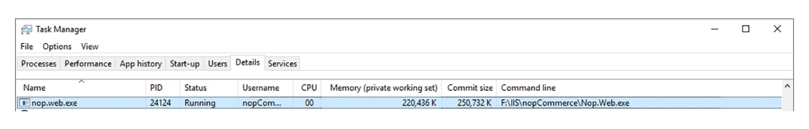
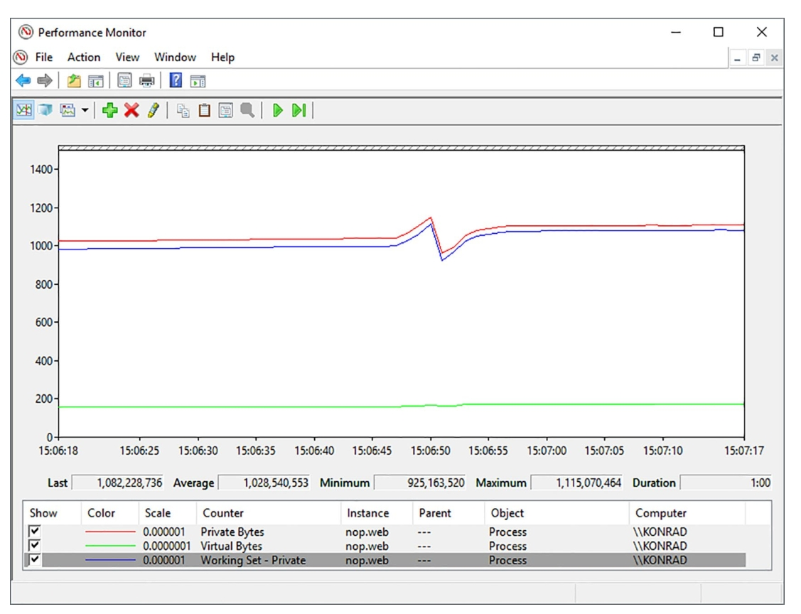
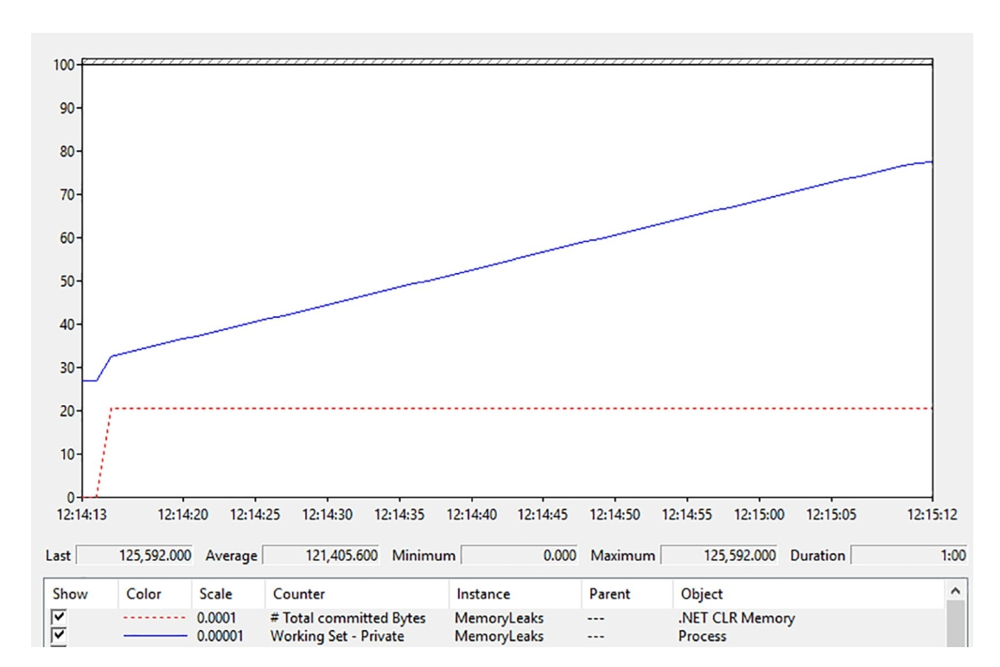
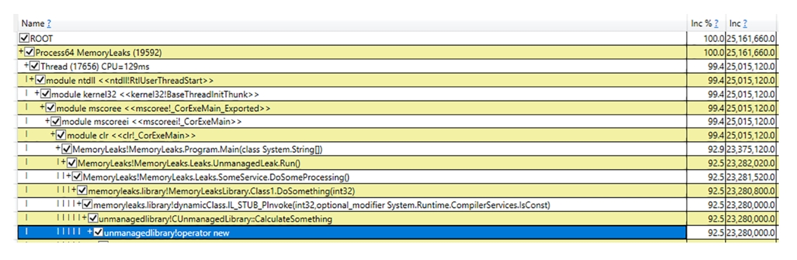
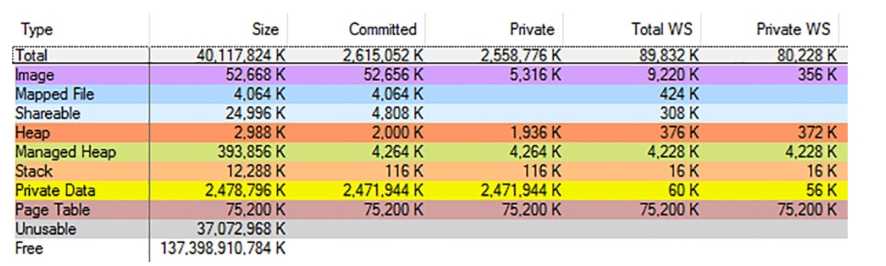
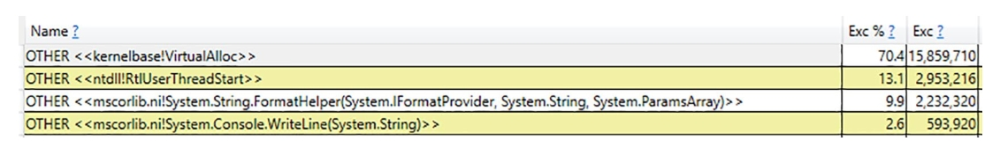
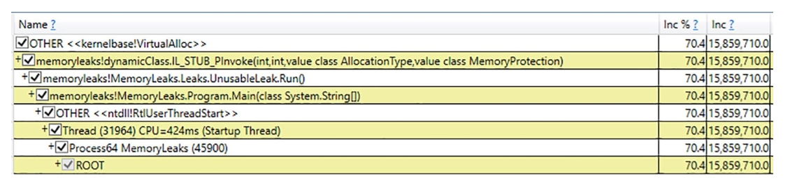
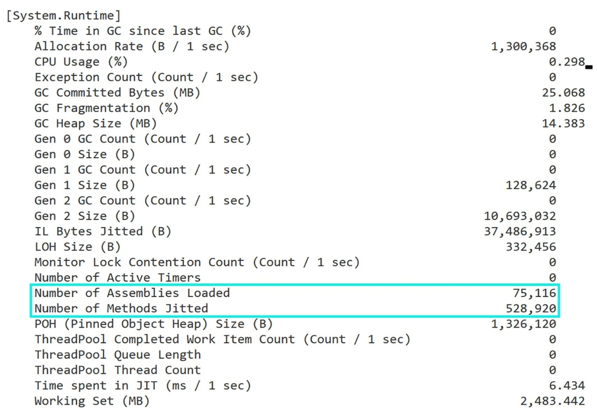

# 进程内存区域

## 我的应用程序内存有大多？

**问题：**您正在为客户编写一个 .NET 应用程序，客户问您该程序需要多少内存以及典型的内存用量是多少，因为他们怀疑该程序消耗太多内存。需要多少内存以及典型的内存使用量是多少，因为他们怀疑内存消耗过多。如何正确测量。每个人都建议使用不同的工具和不同的方法来解释结果。假设你们是 [Paint](https://www.getpaint.net/)..NET (www.getpaint.net/) 开发人员！

**回答：** 要正确回答客户的问题，您应该了解操作系统如何看待您的进程内存使用情况。系统是如何查看进程内存使用情况的。[第 2 章](Low-Level-Memory-Management.md)已对此作了简要说明，您可能会你可能会注意到各种工具之间并不十分一致。从高层次的角度来看，您应该
集中于以下测量：

- **专用工作集（Private working set）**： 表示进程占用的物理 RAM 内存量。进程占用的物理 RAM 内存量。这是容器的主要瓶颈，因此应先查看这里。
- **私有字节（Private bytes，又称提交大小）**： 表示物理内存和分页到磁盘的内存量。你不希望出现过多的分页，因此如果这个大小远远大于**专用工作集（Private Working Set）**，就应该引起警惕。分页文件的无限增长也是危险的，因为你的硬盘存储空间并不是无限的。
- **虚拟字节（Virtual bytes）**： 表示所有虚拟字节，包括已提交（私有）和仅保留的虚拟字节、无论其位置如何。这种测量方法最抽象，因为它页表目录除外（参见第 2 章）。只有在 32 位情况下，才需要检查是否达到了2 GB 的限制。在 64 位中，.NET Core 保留了 2 TB 的容量，所以看到它时不要害怕！

在 Windows 中，要测量这些大小，您只需使用任务管理器的 “详细信息 ”选项卡，该选项卡将显示分别显示为内存（私人工作集）和提交大小列（虚拟字节不显示在此
虚拟字节），请参见图 4-5。



图4-5：Windows 任务管理器展示的基本数据内存使用。

您也可以使用性能监视器工具（见图 4-6）来记录 `\Process(processname)\
Working Set - Private, \Process(processname)\Private Bytes, \Process(processname)\Virtual
Bytes` 计数器。除了绝对大小，趋势当然也同样重要。



图 4-6. 显示基本内存使用数据的性能计数器

您还可以考虑使用 Windows 上的 **VMMap**工具来分析测量的进程大小中包含哪些内容（参见图 4-4）。您将发现相同的测量
列： 私有工作集、私有和大小。关于内存类型，重要的是先查看托管堆。不过，其他内存类型也值得关注。如果怀疑有内存泄漏，及时观察所有内存类型的大小，并尝试找出持续增长的内存类型。内存泄露可能存在于托管代码中，也可能存在于某些被引用的非托管组件中（甚至是隐式的，而你却没有意识到）。

在 Linux 上，可以使用[第 2 章](Low-Level-Memory-Management.md)中介绍的 `top` 工具展示相应的列。也可以使用第 3 章中介绍的 `dotnet-counters` CLI 工具，并将 `monitor -p <process id>` 作为命令行。您将同时获得托管内存大小（将 Gen1 大小 (B)、Gen2 大小 (B)、LOH
大小 (B) 和 POH（钉接对象堆）大小 (B) 计数器之和）和工作集大小（使用工作集(MB) 计数器），如图 4-7 所示。


图4-7：使用 `dotnet-counter` 查看工作集和托管内存使用情况

你可能已经注意到了 **GC 提交字节（MB）** 计数器：它显示了所有托管堆（SOH、LOH、POH）中累计的提交字节数，包括第 5 章中提到的 NGCH，以及第 6 章中详细描述的空闲列表和不可用的碎片化内存。

当你使用服务器 GC（Server GC）时，请记住，内存使用量可能会因硬件配置（核心数量或可用内存）而有所不同。

## 我的程序的本机内存使用量持续增长
**描述**：你的客户报告称，在连续运行几天后，使用 .NET 编写的 Windows 服务抛出了 **OutOfMemory** 异常。你必须调查原因，当然，你还必须快速完成这项任务。

**解答**：由于没有提供完整的进程内存转储，你可以通过监控程序的内存使用情况来开始调查。你可以从**性能监视器**工具入手，观察最重要的计数器（见图 4-8）：

- \Process(processname)\Working Set - Private
- \Process(processname)\Private Bytes
- \Process(processname)\Virtual Bytes
- .NET CLR Memory(processname)\# Total committed Bytes: Counter to observe
  Managed Heap usage



图4-8：在场景 4-2 中的性能计数器显示托管堆大小稳定，但私有工作集（Private Working Set）却在不断增长。

从你观察到的情况可以明显看出，这里存在内存泄漏——进程的内存使用量在持续增加。然而，托管堆的大小非常稳定，因此这很可能是一个与 .NET 代码无关的非托管内存泄漏（不过，正如你在场景 4-3 中将会看到的，这也可能是托管代码的问题！）。基于这一点，值得借助 **VMMap** 工具深入查看进程内部的情况。通过短暂的观察，你可能会注意到，**堆内存类型** 的私有大小（Private Size）在持续增长。你的程序正在逐渐生成越来越多大约 16 MiB 大小的堆内存区域（见图 4-9）。


图4-9：VMMap 展示了场景 4-2 堆内存区域，这里显示创建的堆内存（Heap(Private Data)）在实时增长

这是调查中的第一个线索——堆区域很可能因为大量使用堆 API（例如在 C 中调用 `malloc` 或在 C++ 中使用 `new` 操作符）而不断增长。现在你需要找出是哪段代码在调用这些 API。通过进程的内存转储来完成这项任务可能会非常繁琐，因为非托管内存分析非常困难（尤其是对于不熟悉非托管领域的 .NET 开发人员来说更是如此）。

幸运的是，有一个更简单的方法可以利用 **PerfView** 来进行调查。在其“收集”对话框中，将可执行文件的名称输入到 **OS Heap Exe** 字段中，或者将进程 ID 输入到 **OS Heap Process** 字段中（请注意，只有在第二种情况下，你才能附加到一个已经运行的进程）。提供其中一个 OS Heap 选项将启用对堆 API 使用情况的 ETW 跟踪。启动收集并等待适当的时间，具体取决于你的进程内存使用量增长的速度。

停止收集并完成所有处理后，你应该从 **Memory Group** 文件夹中打开 **Net OS Heap Alloc Stacks**。逐步展开树中的各个元素，深入到分配最多的代码部分（即 **Inc %** 列中值最高的部分）。对于某些节点，你可能需要加载符号（右键单击并从上下文菜单中选择 **Lookup Symbols**）。还可以通过上下文菜单中的 **Ungroup Module** 选项禁用模块分组，这也很有帮助。很快，你应该能够清楚地看到超过 90% 的分配原因（见图 4-10）。这就是 ETW 强大功能的体现！



图 4-10. 场景 4-2 的 PerfView 分析结果。你可以看到 `operator new` 的聚合调用堆栈。

你可以发现，大多数内存分配的原因是 `CUnmanagedLibrary::CalculateSomething` 方法中使用了 `new` 操作符，而该方法被 .NET 应用程序的其他组件调用。这确实是问题的根本原因，因为上述方法的实现经过了特别设计，但确实非常愚蠢（见代码清单 4-4）。

代码清单 4-4. 场景 4-2 中内存泄漏的原因：

```
int CUnmanagedLibrary::CalculateSomething(int size)
{
    int* buffer = new int[size];
    return 2 * size;
}
```

在现实场景中，可能会有许多其他内存分配来源，因此你需要对它们进行一些调查，并做出有根据的推测，这可能是一个真正的挑战。请注意，如果你没有应用程序所使用的非托管库的符号文件，在 **Net Virtual Alloc Stacks** 视图中将看不到具体的方法和函数名称。然而，它仍然会指出哪个组件存在问题，因此你可以联系该组件的开发者或在线搜索解决方案。还需要记住的是，针对堆 API 的 ETW 跟踪可能会引入相当大的性能开销，因此在启用它时要小心，尤其是在生产环境中。

## 我的程序虚拟内存使用量持续增长
**描述**：你的应用程序在客户的机器上出现了一些奇怪的现象。它的内存使用量似乎无限增长，但似乎并没有产生任何负面影响，程序也能正常运行。客户报告称“消耗了数 GB 的内存”，而你在自己的环境中从未观察到这种行为。没人知道你是否应该对此感到担忧。

**分析**：你应该再次通过监控程序的内存使用情况来开始调查。你可以从**性能监视器**工具入手，观察以下性能计数器：

- **\Process(processname)\Working Set - Private**
- **\Process(processname)\Private Bytes**
- **\Process(processname)\Virtual Bytes**
- **\.NET CLR Memory(processname)\# Total committed Bytes**

你可能很快会注意到，托管堆的使用量和私有工作集的大小是稳定的。然而，**私有字节（Private Bytes）** 却在持续增长——这可能意味着大部分分配的内存并未驻留在物理 RAM 中。同时，**虚拟字节（Virtual Bytes）** 也在持续增长，表明进程地址空间中“消耗”了数 GB 的虚拟内存！通过使用 **VMMap** 工具查看进程内部，你会发现背后的原因（见图 4-11）。确实有超过 40 GB 的虚拟内存被消耗，但其中大约 37 GB 被标记为不可用！这表明有人正在非常低效地分配页面（回想第 2 章的内容）。你可以通过查看内存区域列表来验证这一猜测（见图 4-12），列表中显示了许多包含不可用数据的页面。



图 4-11. 场景 4-3 的 VMMap 进程视图。虚拟内存总量（Size）非常庞大，但其中大部分被标记为不可用（Unusable）。


图 4-12. 场景 4-3 的 VMMap 不可用区域视图。存在大量这样的区域，它们与单页大小的私有数据（Private Data）交错分布。

现在，你需要理解程序的哪一部分以如此不恰当的方式使用了页面。再次，你可以使用 **PerfView**，但这次你关注的是虚拟 API（例如调用 `VirtualAlloc`），因为问题是与私有数据（Private Data）内存类型相关（而不是堆类型）。你应该在“收集”对话框中勾选 **VirtAlloc** 选项，并在运行有问题的应用程序时开始收集数据。启用此提供程序所引入的开销比场景 4-2 中使用的堆 API 要小。

停止收集并完成所有处理后，你应该从 **Memory Group** 文件夹中打开 **Net Virtual Alloc Stacks**。如果内存泄漏问题显著，你很可能在展示的列表顶部找到根本原因——在本例中，70.4% 的分配是由 `VirtualAlloc` 调用导致的（见图 4-13）。



图 4-13. 场景 4-3 的 PerfView 分析显示了大量 `VirtualAlloc` 调用。

如果双击它，将展示一个调用树。展开具有最大分配贡献的节点。可以选择通过上下文菜单中的 **Lookup Symbols** 和 **Ungroup Module** 选项加载符号并禁用分组。现在，你应该能够找到虚拟内存分配的最大来源——在本例中是来自 `MemoryLeaks` 模块的 `MemoryLeaks.Leaks.UnusableLeak.Run()` 方法（见图 4-14）。



图 4-14. 场景 4-3 的 PerfView 分析显示了 `VirtualAlloc` 的聚合调用堆栈。

确实，该方法包含了一个 `VirtualAlloc` 的互操作调用，每次仅分配单个页面（通常为 4 KiB），而如你所知，Windows 上的分配粒度为 64 KiB（见代码清单 4-5）。因此，每次调用 `VirtualAlloc` 都会浪费 60 KiB 的不可用内存。

代码清单 4-5. 场景 4-3 的问题代码片段
```csharp
ulong block = (ulong)DllImports.VirtualAlloc(IntPtr.Zero, new IntPtr(pageSize),
    DllImports.AllocationType.Commit,
    DllImports.MemoryProtection.ReadWrite);
```

在现实场景中，某些引用的非托管库可能会以这种低效的方式使用 `VirtualAlloc`。通过使用针对虚拟 API 的 ETW 数据，你将能够追踪到导致低效虚拟内存分配的单一方法调用。

## 我的程序托管内存使用量随着程序集数量增长而持续增加

**描述**：你的客户抱怨应用程序消耗了大量内存。内存使用量不断增长到数 GB，然后由于 `OutOfMemory` 异常崩溃。你确信代码没有使用任何非托管组件，因此你认为内存泄漏发生在 C# 代码中（尽管始终要记住，你使用的库可能在内部使用了一些非托管代码，所以……始终保持警惕，并回顾之前呈现的场景）。客户发送了几张任务管理器的截图，显示所有内存大小确实在持续增长。

**分析**：你通过监控以下性能计数器开始分析：
- **\Process(processname)\Working Set - Private**
- **\Process(processname)\Private Bytes**
- **\Process(processname)\Virtual Bytes**
- **\.NET CLR Memory(processname)\# Total committed Bytes**

结果让你非常惊讶，因为托管堆的总提交字节数是稳定的。然而，所有其他观察到的内存大小确实在增长，甚至包括私有工作集。出于直觉，你使用 VMMap 查看进程内部。经过几分钟的观察，你发现托管堆的私有工作集在持续增长，因此显然你的内存泄漏与 .NET 有关。但为什么性能计数器没有反映出这一点？查看 VMMap 中的托管堆类型列表时，你注意到一些异常情况（见图 4-15）。标记为 GC 的托管堆区域（存储由应用程序分配的对象的部分）增长非常缓慢。另一方面，有数十个名为 **Domain 1**、**Domain 1 Low Frequency Heap** 和 **Domain 1 High Frequency Heap** 的内存区域！这意味着大量额外的程序集被加载，很可能是因为动态程序集的创建。


图4-15：VMMap 展示场景4-4的托管堆

你通过返回到**性能监视器**并添加以下额外的计数器来确认这一情况：
- **\.NET CLR Loading(processname)\Bytes in Loader Heap**
- **\.NET CLR Loading(processname)\Current Classes Loaded**
- **\.NET CLR Loading(processname)\Current Assemblies**
- **\.NET CLR Loading(processname)\Current appdomains**

前三个计数器在持续增长，因此显然你刚刚找到了内存泄漏的根本原因。某些代码正在加载数十个动态程序集。

你可以使用 `dotnet-counters` 查看“加载的程序集数量”和“JIT 编译的方法数量”计数器的增长情况，正如图 4-16 所示，它们疯狂增长。



图4-16：`dotnet-counter`展示了加载大量的程序集和 JIT 编译的方法

拥有超过 75,000 个已加载的程序集以及超过 500,000 个 JIT 编译的方法，绝对不是正常情况的标志！

再次，**ETW** 和 **PerfView** 前来救援！这次，你关注的是与程序集加载相关的事件。你可以通过“收集”对话框中的 **Additional Providers** 字段启用这些事件的跟踪。在此字段中输入以下内容： 

`Microsoft-Windows-DotNETRuntime:LoaderKeyword:Always:@StacksEnabled=true` 
这表示你对加载器相关的事件感兴趣，并且希望为每个事件记录调用堆栈。启动收集并等待适当的时间（例如，在此期间，你可以通过 **Current Assemblies** 性能计数器观察到新程序集的加载）。

停止收集并完成所有处理后，你应该打开 **Events** 列表，并找到与你的进程相关的 `Microsoft-Windows-DotNETRuntime/Loader/AssemblyLoad` 事件（见图 4-17）。


图4-17：PerfView 事件展示了场景4-4，可以看到有很多 AssemblyLoad 事件

你刚刚找到了问题的根源！实际上，微软关于 **XmlSerializer** 的文档中提到：

> 为了提高性能，XML 序列化基础设施会动态生成程序集以序列化和反序列化指定的类型。该基础设施会查找并重用这些程序集。此行为仅在使用以下构造函数时发生：
>
> - `XmlSerializer.XmlSerializer(Type)`
> - `XmlSerializer.XmlSerializer(Type, String)`
>
> 如果你使用了其他任何构造函数，将生成同一程序集的多个版本，并且这些版本永远不会被卸载，从而导致内存泄漏和性能下降。
>
> 最简单的解决方案是使用上述两个构造函数之一。否则，你需要在一个 **Hashtable** 中缓存这些程序集，如以下示例所示。

在此示例中（见图 4-18），使用了其他不幸的构造函数之一：生成的程序集未被重用，因此导致了观察到的内存泄漏。

> **注意**：类似的问题可能出现在其他与动态程序集创建相关的场景中，例如调用 `AppDomain.CreateDomain` 后未卸载它，或通过各种脚本引擎为编译的脚本创建程序集。

## 我的程序无法卸载插件
**描述**：你编写了一个程序，使用可收集的程序集（通过 `AssemblyLoadContext`）来加载和卸载插件。但显然出了问题。从任务管理器中可以看到，你的程序内存使用量正在缓慢且无休止地增长。

**分析**：你使用 `dotnet-counters` 开始粗略分析，并观察关键指标：

- **工作集 (MB)**  
- **GC 提交字节 (MB)**  
- **GC 堆大小 (MB)**  

你可以很容易地观察到，**工作集**很快就会达到约 1 GB 的规模，而托管堆非常小——只有几十 MB 左右。

```
[System.Runtime]
% Time in GC since last GC (%) 0
Allocation Rate (B / 1 sec) 122,824
CPU Usage (%) 3.125
Exception Count (Count / 1 sec) 0
GC Committed Bytes (MB) 44.876
GC Fragmentation (%) 1.396
GC Heap Size (MB) 37.409
Gen 0 GC Budget (MB) 16
Gen 0 GC Count (Count / 1 sec) 0
Gen 0 Size (B) 0
Gen 1 GC Count (Count / 1 sec) 0
Gen 1 Size (B) 2,526,584
Gen 2 GC Count (Count / 1 sec) 0
Gen 2 Size (B) 24,857,672
IL Bytes Jitted (B) 3,528,056
LOH Size (B) 491,712
Monitor Lock Contention Count (Count / 1 sec) 0
Number of Active Timers 0
Number of Assemblies Loaded 18,570
Number of Methods Jitted 129,956
POH (Pinned Object Heap) Size (B) 33,760
ThreadPool Completed Work Item Count (Count / 1 sec) 0
ThreadPool Queue Length 0
ThreadPool Thread Count 0
Time paused by GC (ms / 1 sec) 0
Time spent in JIT (ms / 1 sec) 822.663
Working Set (MB) 1,081.278
```

但是，你也可以观察到，正如所怀疑的那样，**加载的程序集数量**正在无休止地增长（同时**JIT 编译的方法数量**也在增长）。这清楚地证实了你的“插件”从未被卸载，并且泄漏的内存更多与运行时和程序集数据相关，而不是托管堆本身。

此时，你可以重复场景 4-4 的调查方法，找出这些泄漏的程序集是在何时加载的。但你非常清楚代码中加载插件的位置（见代码清单 4-6）。

**代码清单 4-6. 插件加载方法**

```csharp
private IEnumerable<ICommand> LoadPluginCommands(string path)
{
    var assemblyLocation = typeof(Program).Assembly.Location;
    var programPath = Path.GetDirectoryName(assemblyLocation);
    var absolutePath = Path.Combine(programPath, path);

    var pluginContext = new PluginAssemblyLoadContext(absolutePath);
    var assemblyName = AssemblyName.GetAssemblyName(absolutePath);
    var assembly = pluginContext.LoadFromAssemblyName(assemblyName);

    foreach (Type type in assembly.GetTypes())
    {
        if (typeof(ICommand).IsAssignableFrom(type))
        {
            var command = Activator.CreateInstance(type) as ICommand;
            yield return command;
        }
    }
}
```

你可能会疑惑，代码清单 4-6 中的方法是否遗漏了对 `pluginContext` 实例调用 `Unload` 方法的操作。但实际上并没有遗漏。因为该程序集是可收集的，当 `PluginAssemblyLoadContext` 实例被垃圾回收时，它会自动开始卸载。正如你在关于可收集程序集的部分中可能记得的，它们使用的是协作式卸载——只有在所有对可收集程序集的引用都消失后，程序集及其所有相关数据才会被卸载。

由于指标表明这些程序集从未被卸载，这显然意味着程序中的某些部分仍然持有已加载程序集中的实例。

因此，为了进一步调查问题，你应该像处理常规内存泄漏一样对待它（如后续章节所述）。但你应该特别关注来自加载的可收集程序集的对象数量是否增加。仅仅查看所有对象的数量（或内存占用）随时间的增长可能会让人困惑。此外，程序集的加载本身会导致与之关联的托管对象的累积。

例如，在这个场景中，你可以在其他泄漏对象中找到一些相关的对象，但它们绝不是整体内存使用中最突出的部分。图 4-19 展示了 JetBrains dotMemory 中两个内存快照的对比示例。可以看到许多程序集和与运行时相关的对象正在泄漏。但根本原因可以从高亮显示的行中推断出来——有数千个来自 `BasePlugin` 基础设施的 `CommandExecuted` 委托正在泄漏。


图4-19：用 JetBrains dotMemory 比较两个内存快照，展示类型实例的不同处，并以大小排序

通过查看 JetBrains dotMemory 中它们的 **Similar Retention** 视图，你会清楚地看到这些对象被 `OnCommandExecuted` 事件保持存活（见图 4-20）。


图 4-20. JetBrains dotMemory 工具中的 **Similar Retention** 视图，展示了是什么让 `CommandExecuted` 实例保持存活。

确实，你会发现示例加载插件的代码中存在一个不幸的模式：注册了一个事件但从未注销它（见代码清单 4-7）。`IBaseJob` 实例来自主程序集（不可卸载的程序集）。注册事件会在它与 `TestCommand` 实例（来自已加载的程序集）之间创建引用。在后续章节中，我们将详细描述注册事件如何在源和目标之间创建这样的引用。

**代码清单 4-7. 示例插件的代码片段**

```csharp
public class TestCommand : ICommand
{
    public string Execute(IBaseJob context)
    {
        context.OnCommandExecuted += HandleOnCommandExecuted;
        //...
    }
}
```

# 类型系统

类型是 CLI（通用语言基础架构）中的一个核心概念，在 ECMA-335 标准中被定义为“描述值，并指定该类型的所有值应支持的契约”。关于通用类型系统本身可以写很多内容，但出于内存管理的目的，我们可以暂时停留在从日常使用 C# 或其他编程语言中获得的直观类型定义上。不过，在后续章节中，您将深入了解 .NET 中的各种类型类别。 

.NET 中的每个类型都由一个名为 **MethodTable** 的数据结构描述。它包含了许多关于类型的信息，其中最重要的包括：  
- **GCInfo**：用于垃圾回收器目的的数据结构（我们将在后续章节中详细讨论）。  
- **Flags**：描述各种类型属性。  
- **基本实例大小**：表示对象的大小。  
- **EEClass 引用**：存储通常仅在类型加载、JIT 编译或反射时需要的“冷”数据，包括所有方法、字段和接口的描述。  
- **所有方法的描述（包括继承的方法）**：调用这些方法所需的描述信息。  
- **静态字段相关数据**：包括与原始静态字段相关的数据（我们将在本章后面深入探讨静态字段的细节）。  

运行时通过 MethodTable 的地址（称为 TypeHandle）来获取有关已加载类型的信息。您将在本书的其余部分频繁看到它们，因为 MethodTable 是执行引擎（Execution Engine）和垃圾回收器（Garbage Collector）之间协作的基本构建块之一。  

## 类别分类
几乎每篇关于 .NET 内存的文章都会讲述同一个故事——“值类型分配在栈上，引用类型分配在堆上。”以及“类是引用类型，而结构体是值类型。”许多针对 .NET 开发者的流行面试题也涉及这一主题。但这种区分值类型和引用类型的方式并不是最恰当的。我们将在后面深入探讨实现细节，而像任何隐藏在抽象背后的具体实现一样，它们可能会发生变化。真正重要的是它们为开发者提供的抽象。因此，与其采用同样的实现驱动方法，我们更希望阐述其背后的逻辑。  

让我们从头开始，也就是从 ECMA-335 标准出发。不幸的是，我们需要的定义有些模糊，您可能会迷失在诸如类型、值、值类型、类型的值等词语的不同含义中。总体而言，记住以下内容是有帮助的：该标准定义了“任何由类型描述的值被称为该类型的实例。”换句话说，您可以互换地谈论值类型或引用类型的值（或实例）。进一步来说，它们被定义为：  

- **值类型**：一种类型，其实例直接包含其所有数据。（...）由值类型描述的值是自包含的。  
- **引用类型**：一种类型，其实例包含对其数据的引用。（...）由引用类型描述的值表示另一个值的位置。  

在这里，您可以看到这两种类型的真正区别在于它们提供的抽象：值类型的实例（值）在其自身位置包含所有数据，而引用类型的值仅指向位于“某处”的数据（它们引用某些内容）。但这种数据位置的抽象带来了非常重要的后果，与一些基本主题相关：  

### 生命周期 
- **值类型的值**包含其所有数据——您可以将其视为一个单一的、自包含的存在。数据的生命周期与值类型实例本身的生命周期相同。
- **引用类型的值**是存储另一个值的位置，其生命周期并未由定义本身决定。

### 共享
- **值类型的值**默认不共享——如果您希望在其他地方使用它（例如，尽管我们在查看实现细节，但方法参数或另一个局部变量），默认情况下它会按字节逐字复制。这就是所谓的**按值传递语义**。由于值的副本被传递到另一个地方，原始值的生命周期不会改变。
- **引用类型的值**默认共享——如果您希望在其他地方使用它，默认情况下将使用**按引用传递语义**。因此，之后另一个引用类型实例会指向相同的值位置。正如第 1 章所讨论的那样，我们需要以某种方式跟踪所有引用，以了解值的生命周期。