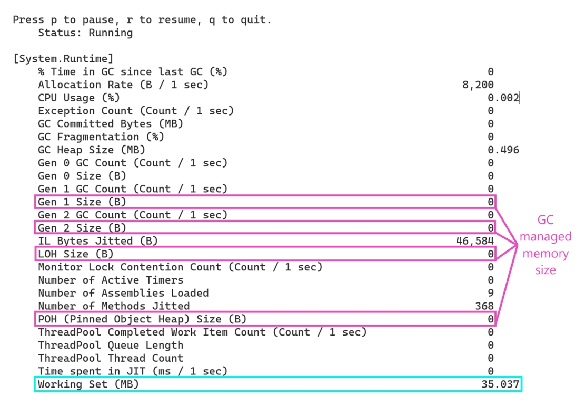
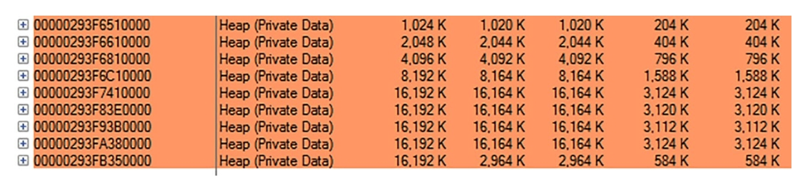
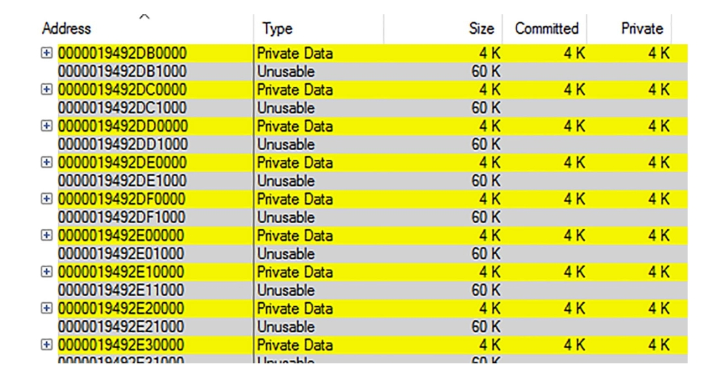
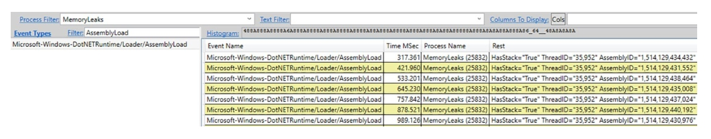
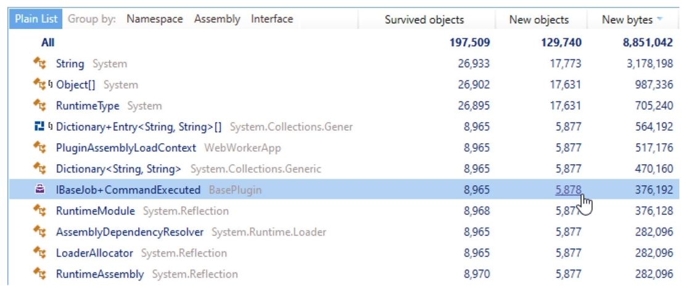
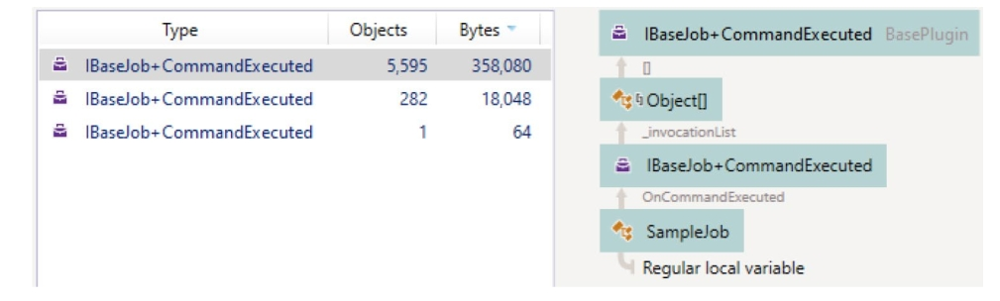
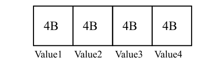
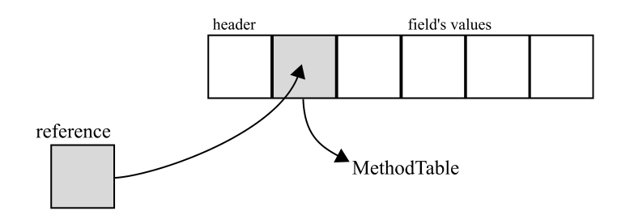

# 进程内存区域

## 我的应用程序内存有大多？

**问题：**您正在为客户编写一个 .NET 应用程序，客户问您该程序需要多少内存以及典型的内存用量是多少，因为他们怀疑该程序消耗太多内存。需要多少内存以及典型的内存使用量是多少，因为他们怀疑内存消耗过多。如何正确测量。每个人都建议使用不同的工具和不同的方法来解释结果。假设你们是 [Paint](https://www.getpaint.net/)..NET (www.getpaint.net/) 开发人员！

**回答：** 要正确回答客户的问题，您应该了解操作系统如何看待您的进程内存使用情况。系统是如何查看进程内存使用情况的。[第 2 章](Low-Level-Memory-Management.md)已对此作了简要说明，您可能会你可能会注意到各种工具之间并不十分一致。从高层次的角度来看，您应该
集中于以下测量：

- **专用工作集（Private working set）**： 表示进程占用的物理 RAM 内存量。进程占用的物理 RAM 内存量。这是容器的主要瓶颈，因此应先查看这里。
- **私有字节（Private bytes，又称提交大小）**： 表示物理内存和分页到磁盘的内存量。你不希望出现过多的分页，因此如果这个大小远远大于**专用工作集（Private Working Set）**，就应该引起警惕。分页文件的无限增长也是危险的，因为你的硬盘存储空间并不是无限的。
- **虚拟字节（Virtual bytes）**： 表示所有虚拟字节，包括已提交（私有）和仅保留的虚拟字节、无论其位置如何。这种测量方法最抽象，因为它页表目录除外（参见第 2 章）。只有在 32 位情况下，才需要检查是否达到了2 GB 的限制。在 64 位中，.NET Core 保留了 2 TB 的容量，所以看到它时不要害怕！

在 Windows 中，要测量这些大小，您只需使用任务管理器的 “详细信息 ”选项卡，该选项卡将显示分别显示为内存（私人工作集）和提交大小列（虚拟字节不显示在此
虚拟字节），请参见图 4-5。


图4-5：Windows 任务管理器展示的基本数据内存使用。

您也可以使用性能监视器工具（见图 4-6）来记录 `\Process(processname)\
Working Set - Private, \Process(processname)\Private Bytes, \Process(processname)\Virtual
Bytes` 计数器。除了绝对大小，趋势当然也同样重要。


图 4-6. 显示基本内存使用数据的性能计数器

您还可以考虑使用 Windows 上的 **VMMap**工具来分析测量的进程大小中包含哪些内容（参见图 4-4）。您将发现相同的测量
列： 私有工作集、私有和大小。关于内存类型，重要的是先查看托管堆。不过，其他内存类型也值得关注。如果怀疑有内存泄漏，及时观察所有内存类型的大小，并尝试找出持续增长的内存类型。内存泄露可能存在于托管代码中，也可能存在于某些被引用的非托管组件中（甚至是隐式的，而你却没有意识到）。

在 Linux 上，可以使用[第 2 章](Low-Level-Memory-Management.md)中介绍的 `top` 工具展示相应的列。也可以使用第 3 章中介绍的 `dotnet-counters` CLI 工具，并将 `monitor -p <process id>` 作为命令行。您将同时获得托管内存大小（将 Gen1 大小 (B)、Gen2 大小 (B)、LOH
大小 (B) 和 POH（钉接对象堆）大小 (B) 计数器之和）和工作集大小（使用工作集(MB) 计数器），如图 4-7 所示。



图4-7：使用 `dotnet-counter` 查看工作集和托管内存使用情况

你可能已经注意到了 **GC 提交字节（MB）** 计数器：它显示了所有托管堆（SOH、LOH、POH）中累计的提交字节数，包括第 5 章中提到的 NGCH，以及第 6 章中详细描述的空闲列表和不可用的碎片化内存。

当你使用服务器 GC（Server GC）时，请记住，内存使用量可能会因硬件配置（核心数量或可用内存）而有所不同。

## 我的程序的本机内存使用量持续增长
**描述**：你的客户报告称，在连续运行几天后，使用 .NET 编写的 Windows 服务抛出了 **OutOfMemory** 异常。你必须调查原因，当然，你还必须快速完成这项任务。

**解答**：由于没有提供完整的进程内存转储，你可以通过监控程序的内存使用情况来开始调查。你可以从**性能监视器**工具入手，观察最重要的计数器（见图 4-8）：

- \Process(processname)\Working Set - Private
- \Process(processname)\Private Bytes
- \Process(processname)\Virtual Bytes
- .NET CLR Memory(processname)\# Total committed Bytes: Counter to observe
  Managed Heap usage


图4-8：在场景 4-2 中的性能计数器显示托管堆大小稳定，但私有工作集（Private Working Set）却在不断增长。

从你观察到的情况可以明显看出，这里存在内存泄漏——进程的内存使用量在持续增加。然而，托管堆的大小非常稳定，因此这很可能是一个与 .NET 代码无关的非托管内存泄漏（不过，正如你在场景 4-3 中将会看到的，这也可能是托管代码的问题！）。基于这一点，值得借助 **VMMap** 工具深入查看进程内部的情况。通过短暂的观察，你可能会注意到，**堆内存类型** 的私有大小（Private Size）在持续增长。你的程序正在逐渐生成越来越多大约 16 MiB 大小的堆内存区域（见图 4-9）。



图4-9：VMMap 展示了场景 4-2 堆内存区域，这里显示创建的堆内存（Heap(Private Data)）在实时增长

这是调查中的第一个线索——堆区域很可能因为大量使用堆 API（例如在 C 中调用 `malloc` 或在 C++ 中使用 `new` 操作符）而不断增长。现在你需要找出是哪段代码在调用这些 API。通过进程的内存转储来完成这项任务可能会非常繁琐，因为非托管内存分析非常困难（尤其是对于不熟悉非托管领域的 .NET 开发人员来说更是如此）。

幸运的是，有一个更简单的方法可以利用 **PerfView** 来进行调查。在其“收集”对话框中，将可执行文件的名称输入到 **OS Heap Exe** 字段中，或者将进程 ID 输入到 **OS Heap Process** 字段中（请注意，只有在第二种情况下，你才能附加到一个已经运行的进程）。提供其中一个 OS Heap 选项将启用对堆 API 使用情况的 ETW 跟踪。启动收集并等待适当的时间，具体取决于你的进程内存使用量增长的速度。

停止收集并完成所有处理后，你应该从 **Memory Group** 文件夹中打开 **Net OS Heap Alloc Stacks**。逐步展开树中的各个元素，深入到分配最多的代码部分（即 **Inc %** 列中值最高的部分）。对于某些节点，你可能需要加载符号（右键单击并从上下文菜单中选择 **Lookup Symbols**）。还可以通过上下文菜单中的 **Ungroup Module** 选项禁用模块分组，这也很有帮助。很快，你应该能够清楚地看到超过 90% 的分配原因（见图 4-10）。这就是 ETW 强大功能的体现！


图 4-10. 场景 4-2 的 PerfView 分析结果。你可以看到 `operator new` 的聚合调用堆栈。

你可以发现，大多数内存分配的原因是 `CUnmanagedLibrary::CalculateSomething` 方法中使用了 `new` 操作符，而该方法被 .NET 应用程序的其他组件调用。这确实是问题的根本原因，因为上述方法的实现经过了特别设计，但确实非常愚蠢（见代码清单 4-4）。

代码清单 4-4. 场景 4-2 中内存泄漏的原因：

```
int CUnmanagedLibrary::CalculateSomething(int size)
{
    int* buffer = new int[size];
    return 2 * size;
}
```

在现实场景中，可能会有许多其他内存分配来源，因此你需要对它们进行一些调查，并做出有根据的推测，这可能是一个真正的挑战。请注意，如果你没有应用程序所使用的非托管库的符号文件，在 **Net Virtual Alloc Stacks** 视图中将看不到具体的方法和函数名称。然而，它仍然会指出哪个组件存在问题，因此你可以联系该组件的开发者或在线搜索解决方案。还需要记住的是，针对堆 API 的 ETW 跟踪可能会引入相当大的性能开销，因此在启用它时要小心，尤其是在生产环境中。

## 我的程序虚拟内存使用量持续增长
**描述**：你的应用程序在客户的机器上出现了一些奇怪的现象。它的内存使用量似乎无限增长，但似乎并没有产生任何负面影响，程序也能正常运行。客户报告称“消耗了数 GB 的内存”，而你在自己的环境中从未观察到这种行为。没人知道你是否应该对此感到担忧。

**分析**：你应该再次通过监控程序的内存使用情况来开始调查。你可以从**性能监视器**工具入手，观察以下性能计数器：

- **\Process(processname)\Working Set - Private**
- **\Process(processname)\Private Bytes**
- **\Process(processname)\Virtual Bytes**
- **\.NET CLR Memory(processname)\# Total committed Bytes**

你可能很快会注意到，托管堆的使用量和私有工作集的大小是稳定的。然而，**私有字节（Private Bytes）** 却在持续增长——这可能意味着大部分分配的内存并未驻留在物理 RAM 中。同时，**虚拟字节（Virtual Bytes）** 也在持续增长，表明进程地址空间中“消耗”了数 GB 的虚拟内存！通过使用 **VMMap** 工具查看进程内部，你会发现背后的原因（见图 4-11）。确实有超过 40 GB 的虚拟内存被消耗，但其中大约 37 GB 被标记为不可用！这表明有人正在非常低效地分配页面（回想第 2 章的内容）。你可以通过查看内存区域列表来验证这一猜测（见图 4-12），列表中显示了许多包含不可用数据的页面。


图 4-11. 场景 4-3 的 VMMap 进程视图。虚拟内存总量（Size）非常庞大，但其中大部分被标记为不可用（Unusable）。



图 4-12. 场景 4-3 的 VMMap 不可用区域视图。存在大量这样的区域，它们与单页大小的私有数据（Private Data）交错分布。

现在，你需要理解程序的哪一部分以如此不恰当的方式使用了页面。再次，你可以使用 **PerfView**，但这次你关注的是虚拟 API（例如调用 `VirtualAlloc`），因为问题是与私有数据（Private Data）内存类型相关（而不是堆类型）。你应该在“收集”对话框中勾选 **VirtAlloc** 选项，并在运行有问题的应用程序时开始收集数据。启用此提供程序所引入的开销比场景 4-2 中使用的堆 API 要小。

停止收集并完成所有处理后，你应该从 **Memory Group** 文件夹中打开 **Net Virtual Alloc Stacks**。如果内存泄漏问题显著，你很可能在展示的列表顶部找到根本原因——在本例中，70.4% 的分配是由 `VirtualAlloc` 调用导致的（见图 4-13）。


图 4-13. 场景 4-3 的 PerfView 分析显示了大量 `VirtualAlloc` 调用。

如果双击它，将展示一个调用树。展开具有最大分配贡献的节点。可以选择通过上下文菜单中的 **Lookup Symbols** 和 **Ungroup Module** 选项加载符号并禁用分组。现在，你应该能够找到虚拟内存分配的最大来源——在本例中是来自 `MemoryLeaks` 模块的 `MemoryLeaks.Leaks.UnusableLeak.Run()` 方法（见图 4-14）。


图 4-14. 场景 4-3 的 PerfView 分析显示了 `VirtualAlloc` 的聚合调用堆栈。

确实，该方法包含了一个 `VirtualAlloc` 的互操作调用，每次仅分配单个页面（通常为 4 KiB），而如你所知，Windows 上的分配粒度为 64 KiB（见代码清单 4-5）。因此，每次调用 `VirtualAlloc` 都会浪费 60 KiB 的不可用内存。

代码清单 4-5. 场景 4-3 的问题代码片段
```csharp
ulong block = (ulong)DllImports.VirtualAlloc(IntPtr.Zero, new IntPtr(pageSize),
    DllImports.AllocationType.Commit,
    DllImports.MemoryProtection.ReadWrite);
```

在现实场景中，某些引用的非托管库可能会以这种低效的方式使用 `VirtualAlloc`。通过使用针对虚拟 API 的 ETW 数据，你将能够追踪到导致低效虚拟内存分配的单一方法调用。

## 我的程序托管内存使用量随着程序集数量增长而持续增加

**描述**：你的客户抱怨应用程序消耗了大量内存。内存使用量不断增长到数 GB，然后由于 `OutOfMemory` 异常崩溃。你确信代码没有使用任何非托管组件，因此你认为内存泄漏发生在 C# 代码中（尽管始终要记住，你使用的库可能在内部使用了一些非托管代码，所以……始终保持警惕，并回顾之前呈现的场景）。客户发送了几张任务管理器的截图，显示所有内存大小确实在持续增长。

**分析**：你通过监控以下性能计数器开始分析：
- **\Process(processname)\Working Set - Private**
- **\Process(processname)\Private Bytes**
- **\Process(processname)\Virtual Bytes**
- **\.NET CLR Memory(processname)\# Total committed Bytes**

结果让你非常惊讶，因为托管堆的总提交字节数是稳定的。然而，所有其他观察到的内存大小确实在增长，甚至包括私有工作集。出于直觉，你使用 VMMap 查看进程内部。经过几分钟的观察，你发现托管堆的私有工作集在持续增长，因此显然你的内存泄漏与 .NET 有关。但为什么性能计数器没有反映出这一点？查看 VMMap 中的托管堆类型列表时，你注意到一些异常情况（见图 4-15）。标记为 GC 的托管堆区域（存储由应用程序分配的对象的部分）增长非常缓慢。另一方面，有数十个名为 **Domain 1**、**Domain 1 Low Frequency Heap** 和 **Domain 1 High Frequency Heap** 的内存区域！这意味着大量额外的程序集被加载，很可能是因为动态程序集的创建。


图4-15：VMMap 展示场景4-4的托管堆

你通过返回到**性能监视器**并添加以下额外的计数器来确认这一情况：
- **\.NET CLR Loading(processname)\Bytes in Loader Heap**
- **\.NET CLR Loading(processname)\Current Classes Loaded**
- **\.NET CLR Loading(processname)\Current Assemblies**
- **\.NET CLR Loading(processname)\Current appdomains**

前三个计数器在持续增长，因此显然你刚刚找到了内存泄漏的根本原因。某些代码正在加载数十个动态程序集。

你可以使用 `dotnet-counters` 查看“加载的程序集数量”和“JIT 编译的方法数量”计数器的增长情况，正如图 4-16 所示，它们疯狂增长。


图4-16：`dotnet-counter`展示了加载大量的程序集和 JIT 编译的方法

拥有超过 75,000 个已加载的程序集以及超过 500,000 个 JIT 编译的方法，绝对不是正常情况的标志！

再次，**ETW** 和 **PerfView** 前来救援！这次，你关注的是与程序集加载相关的事件。你可以通过“收集”对话框中的 **Additional Providers** 字段启用这些事件的跟踪。在此字段中输入以下内容： 

`Microsoft-Windows-DotNETRuntime:LoaderKeyword:Always:@StacksEnabled=true` 
这表示你对加载器相关的事件感兴趣，并且希望为每个事件记录调用堆栈。启动收集并等待适当的时间（例如，在此期间，你可以通过 **Current Assemblies** 性能计数器观察到新程序集的加载）。

停止收集并完成所有处理后，你应该打开 **Events** 列表，并找到与你的进程相关的 `Microsoft-Windows-DotNETRuntime/Loader/AssemblyLoad` 事件（见图 4-17）。



图4-17：PerfView 事件展示了场景4-4，可以看到有很多 AssemblyLoad 事件

你刚刚找到了问题的根源！实际上，微软关于 **XmlSerializer** 的文档中提到：

> 为了提高性能，XML 序列化基础设施会动态生成程序集以序列化和反序列化指定的类型。该基础设施会查找并重用这些程序集。此行为仅在使用以下构造函数时发生：
>
> - `XmlSerializer.XmlSerializer(Type)`
> - `XmlSerializer.XmlSerializer(Type, String)`
>
> 如果你使用了其他任何构造函数，将生成同一程序集的多个版本，并且这些版本永远不会被卸载，从而导致内存泄漏和性能下降。
>
> 最简单的解决方案是使用上述两个构造函数之一。否则，你需要在一个 **Hashtable** 中缓存这些程序集，如以下示例所示。

在此示例中（见图 4-18），使用了其他不幸的构造函数之一：生成的程序集未被重用，因此导致了观察到的内存泄漏。

> **注意**：类似的问题可能出现在其他与动态程序集创建相关的场景中，例如调用 `AppDomain.CreateDomain` 后未卸载它，或通过各种脚本引擎为编译的脚本创建程序集。

## 我的程序无法卸载插件
**描述**：你编写了一个程序，使用可收集的程序集（通过 `AssemblyLoadContext`）来加载和卸载插件。但显然出了问题。从任务管理器中可以看到，你的程序内存使用量正在缓慢且无休止地增长。

**分析**：你使用 `dotnet-counters` 开始粗略分析，并观察关键指标：

- **工作集 (MB)**  
- **GC 提交字节 (MB)**  
- **GC 堆大小 (MB)**  

你可以很容易地观察到，**工作集**很快就会达到约 1 GB 的规模，而托管堆非常小——只有几十 MB 左右。

```
[System.Runtime]
% Time in GC since last GC (%) 0
Allocation Rate (B / 1 sec) 122,824
CPU Usage (%) 3.125
Exception Count (Count / 1 sec) 0
GC Committed Bytes (MB) 44.876
GC Fragmentation (%) 1.396
GC Heap Size (MB) 37.409
Gen 0 GC Budget (MB) 16
Gen 0 GC Count (Count / 1 sec) 0
Gen 0 Size (B) 0
Gen 1 GC Count (Count / 1 sec) 0
Gen 1 Size (B) 2,526,584
Gen 2 GC Count (Count / 1 sec) 0
Gen 2 Size (B) 24,857,672
IL Bytes Jitted (B) 3,528,056
LOH Size (B) 491,712
Monitor Lock Contention Count (Count / 1 sec) 0
Number of Active Timers 0
Number of Assemblies Loaded 18,570
Number of Methods Jitted 129,956
POH (Pinned Object Heap) Size (B) 33,760
ThreadPool Completed Work Item Count (Count / 1 sec) 0
ThreadPool Queue Length 0
ThreadPool Thread Count 0
Time paused by GC (ms / 1 sec) 0
Time spent in JIT (ms / 1 sec) 822.663
Working Set (MB) 1,081.278
```

但是，你也可以观察到，正如所怀疑的那样，**加载的程序集数量**正在无休止地增长（同时**JIT 编译的方法数量**也在增长）。这清楚地证实了你的“插件”从未被卸载，并且泄漏的内存更多与运行时和程序集数据相关，而不是托管堆本身。

此时，你可以重复场景 4-4 的调查方法，找出这些泄漏的程序集是在何时加载的。但你非常清楚代码中加载插件的位置（见代码清单 4-6）。

**代码清单 4-6. 插件加载方法**

```csharp
private IEnumerable<ICommand> LoadPluginCommands(string path)
{
    var assemblyLocation = typeof(Program).Assembly.Location;
    var programPath = Path.GetDirectoryName(assemblyLocation);
    var absolutePath = Path.Combine(programPath, path);

    var pluginContext = new PluginAssemblyLoadContext(absolutePath);
    var assemblyName = AssemblyName.GetAssemblyName(absolutePath);
    var assembly = pluginContext.LoadFromAssemblyName(assemblyName);

    foreach (Type type in assembly.GetTypes())
    {
        if (typeof(ICommand).IsAssignableFrom(type))
        {
            var command = Activator.CreateInstance(type) as ICommand;
            yield return command;
        }
    }
}
```

你可能会疑惑，代码清单 4-6 中的方法是否遗漏了对 `pluginContext` 实例调用 `Unload` 方法的操作。但实际上并没有遗漏。因为该程序集是可收集的，当 `PluginAssemblyLoadContext` 实例被垃圾回收时，它会自动开始卸载。正如你在关于可收集程序集的部分中可能记得的，它们使用的是协作式卸载——只有在所有对可收集程序集的引用都消失后，程序集及其所有相关数据才会被卸载。

由于指标表明这些程序集从未被卸载，这显然意味着程序中的某些部分仍然持有已加载程序集中的实例。

因此，为了进一步调查问题，你应该像处理常规内存泄漏一样对待它（如后续章节所述）。但你应该特别关注来自加载的可收集程序集的对象数量是否增加。仅仅查看所有对象的数量（或内存占用）随时间的增长可能会让人困惑。此外，程序集的加载本身会导致与之关联的托管对象的累积。

例如，在这个场景中，你可以在其他泄漏对象中找到一些相关的对象，但它们绝不是整体内存使用中最突出的部分。图 4-19 展示了 JetBrains dotMemory 中两个内存快照的对比示例。可以看到许多程序集和与运行时相关的对象正在泄漏。但根本原因可以从高亮显示的行中推断出来——有数千个来自 `BasePlugin` 基础设施的 `CommandExecuted` 委托正在泄漏。



图4-19：用 JetBrains dotMemory 比较两个内存快照，展示类型实例的不同处，并以大小排序

通过查看 JetBrains dotMemory 中它们的 **Similar Retention** 视图，你会清楚地看到这些对象被 `OnCommandExecuted` 事件保持存活（见图 4-20）。



图 4-20. JetBrains dotMemory 工具中的 **Similar Retention** 视图，展示了是什么让 `CommandExecuted` 实例保持存活。

确实，你会发现示例加载插件的代码中存在一个不幸的模式：注册了一个事件但从未注销它（见代码清单 4-7）。`IBaseJob` 实例来自主程序集（不可卸载的程序集）。注册事件会在它与 `TestCommand` 实例（来自已加载的程序集）之间创建引用。在后续章节中，我们将详细描述注册事件如何在源和目标之间创建这样的引用。

**代码清单 4-7. 示例插件的代码片段**

```csharp
public class TestCommand : ICommand
{
    public string Execute(IBaseJob context)
    {
        context.OnCommandExecuted += HandleOnCommandExecuted;
        //...
    }
}
```

# 类型系统

类型是 CLI（通用语言基础架构）中的一个核心概念，在 ECMA-335 标准中被定义为“描述值，并指定该类型的所有值应支持的契约”。关于通用类型系统本身可以写很多内容，但出于内存管理的目的，我们可以暂时停留在从日常使用 C# 或其他编程语言中获得的直观类型定义上。不过，在后续章节中，您将深入了解 .NET 中的各种类型类别。 

.NET 中的每个类型都由一个名为 **MethodTable** 的数据结构描述。它包含了许多关于类型的信息，其中最重要的包括：  
- **GCInfo**：用于垃圾回收器目的的数据结构（我们将在后续章节中详细讨论）。  
- **Flags**：描述各种类型属性。  
- **基本实例大小**：表示对象的大小。  
- **EEClass 引用**：存储通常仅在类型加载、JIT 编译或反射时需要的“冷”数据，包括所有方法、字段和接口的描述。  
- **所有方法的描述（包括继承的方法）**：调用这些方法所需的描述信息。  
- **静态字段相关数据**：包括与原始静态字段相关的数据（我们将在本章后面深入探讨静态字段的细节）。  

运行时通过 MethodTable 的地址（称为 TypeHandle）来获取有关已加载类型的信息。您将在本书的其余部分频繁看到它们，因为 MethodTable 是执行引擎（Execution Engine）和垃圾回收器（Garbage Collector）之间协作的基本构建块之一。  

## 类别分类
几乎每篇关于 .NET 内存的文章都会讲述同一个故事——“值类型分配在栈上，引用类型分配在堆上。”以及“类是引用类型，而结构体是值类型。”许多针对 .NET 开发者的流行面试题也涉及这一主题。但这种区分值类型和引用类型的方式并不是最恰当的。我们将在后面深入探讨实现细节，而像任何隐藏在抽象背后的具体实现一样，它们可能会发生变化。真正重要的是它们为开发者提供的抽象。因此，与其采用同样的实现驱动方法，我们更希望阐述其背后的逻辑。  

让我们从头开始，也就是从 ECMA-335 标准出发。不幸的是，我们需要的定义有些模糊，您可能会迷失在诸如类型、值、值类型、类型的值等词语的不同含义中。总体而言，记住以下内容是有帮助的：该标准定义了“任何由类型描述的值被称为该类型的实例。”换句话说，您可以互换地谈论值类型或引用类型的值（或实例）。进一步来说，它们被定义为：  

- **值类型**：一种类型，其实例直接包含其所有数据。（...）由值类型描述的值是自包含的。  
- **引用类型**：一种类型，其实例包含对其数据的引用。（...）由引用类型描述的值表示另一个值的位置。  

在这里，您可以看到这两种类型的真正区别在于它们提供的抽象：值类型的实例（值）在其自身位置包含所有数据，而引用类型的值仅指向位于“某处”的数据（它们引用某些内容）。但这种数据位置的抽象带来了非常重要的后果，与一些基本主题相关：  

**生命周期** 

- 值类型的值包含其所有数据——您可以将其视为一个单一的、自包含的存在。数据的生命周期与值类型实例本身的生命周期相同。
- 引用类型的值是存储另一个值的位置，其生命周期并未由定义本身决定。

**共享**

- 值类型的值默认不共享——如果您希望在其他地方使用它（例如，尽管我们在查看实现细节，但方法参数或另一个局部变量），默认情况下它会按字节逐字复制。这就是所谓的**按值传递语义**。由于值的副本被传递到另一个地方，原始值的生命周期不会改变。
- 引用类型的值默认共享——如果您希望在其他地方使用它，默认情况下将使用**按引用传递语义**。因此，之后另一个引用类型实例会指向相同的值位置。正如第 1 章所讨论的那样，我们需要以某种方式跟踪所有引用，以了解值的生命周期。

**标识符**

- 值类型实例没有身份标识。默认情况下，值类型的实例仅当它们的**数据位序列相同时才被认为是相同的**。
- 引用类型实例仅当它们的**存储位置相同时才被认为是相同的**。

### 类型存储  
但有人可能会坚持问，这两种基本类型的实例到底分配在哪里：栈还是堆？答案并不绝对！多年来，“值类型分配在栈上，引用类型分配在堆上”这一说法被反复提及，几乎成为一种不假思索的“咒语”。由于这是一个非常优秀的设计决策，在我们之前讨论的不同 CLI 实现中也被反复采用。但请记住，这句话并不是完全正确的。正如您将在接下来的部分中看到的那样，这条规则也有例外。

尽管如此，值类型和引用类型的存储问题只有在为特定平台设计 CLI 实现时才会被深入考虑。我们只需知道该平台是否有栈或堆可用即可。由于当今绝大多数操作系统都同时支持栈和堆，因此决策相对简单。但除此之外，CPU 寄存器也可能可用，而这些在“值类型分配在……”的“咒语”中却从未被提及。

事实上，类型实例的存储实现主要取决于 JIT 编译器的设计。JIT 编译器是针对特定平台设计的，因此它了解该平台上的可用资源。基于 x86/x64 的 JIT 编译器显然可以生成使用栈、堆和寄存器的代码。然而，决定将某个类型实例存储在哪里并不仅仅由 JIT 编译器决定。编译器会根据对代码的分析来做出这些决策。甚至可以通过特定的语言 API（如 C# 中的 `stackalloc`）让开发者显式选择存储位置（就像在 C++ 中，您可以将对象分配在栈或堆上一样）。

Java 采取了一种更简单的做法：根本没有用户定义的值类型，因此也不存在它们应该存储在哪里的问题！一些内置的基本类型（如整数等）被认为是值类型，但其他所有内容都被分配在堆上（暂不考虑稍后会提到的逃逸分析）。在 .NET 的设计中，也可以决定将所有类型的实例都分配在堆上，只要不违反值类型和引用类型的语义，这种设计也是完全可行的。关于内存位置，ECMA-335 标准提供了完全的自由：

> 方法状态的四个区域——传入参数数组、局部变量数组、本地内存池和求值栈——被描述为逻辑上独立的区域。一个符合规范的 CLI 实现可以将这些区域映射到一块连续的内存数组中，作为一个传统的栈帧保存在底层目标架构中，或者使用任何其他等效的表示技术。

为什么选择了这些实现决策而不是其他方式，将在接下来的章节中分别讨论值类型和引用类型时更加实际地解释。

---

### 堆栈与堆的讨论  
需要补充一点重要说明。谈论栈和堆是一种实现细节，但它也是一种性能和内存使用的优化手段。如果您用 C# 编写代码，并针对 x86/x64 或 ARM 计算机，那么您肯定知道堆、栈和寄存器都会被用来存储这些类型的实例。正如第 2 章提到的“泄漏抽象法则”所说，值类型或引用类型的抽象可能会“泄漏”。您可以利用这一点来优化性能（这在第 14 章描述的各种高级优化技术中尤为明显）。

## 值类型  
正如前面提到的，值类型的实例“直接包含其所有数据”。ECMA-335 将值定义为：  

> 用像整数或浮点数这样的数据，可以用一种简单的位模式来表示。每个值都有一个对应的类型，这个类型不仅定义了它在内存中占用的空间大小，还解释了这些位的具体含义，以及可以对该值执行的操作。值的主要用途是表示编程语言中的基本类型和非对象实体。

在通用语言规范（CLS）中，值类型分为两类：  
- **结构体（Structs）**：有许多内置的整数类型（如 `char`、`byte`、`int` 等）、浮点类型和布尔类型。当然，您也可以定义自己的结构体。  
- **枚举（Enumerations）**：它们基本上是整数类型的扩展，成为一组命名常量的类型。从内存管理的角度来看，它们被视为整数类型，因此本书中不会详细讨论它们。

### 值类型的存储  
那么，“值类型存储在栈上”这一说法又是怎么回事呢？从实现的角度来看，没有任何规定禁止将所有值类型存储在堆上。只是有一个更好的解决方案——使用栈或 CPU 寄存器。正如第 1 章所述，栈是一种非常轻量级的机制。通过简单地创建适当大小的激活帧并在不再需要时释放它，就可以在栈上“分配”和“释放”对象。既然栈看起来如此高效，是否应该始终使用它呢？遗憾的是，这并不总是可能的，主要是因为栈数据的生命周期与值本身的期望生命周期之间的矛盾。正是生命周期和值共享决定了应使用哪种机制来存储值类型的数据。

让我们逐一分析值类型实例的可能存储位置及其适用的存储方式：  
- **方法中的局部变量**：它们具有严格且明确定义的生命周期，即方法调用的生命周期（包括所有子调用）。所有值类型的局部变量都可以分配在堆上，并在方法结束时释放。但在这里使用栈更有意义，因为我们知道只有一个值的实例（没有共享）。因此，无需担心有人会在方法结束后或从另一个线程并发访问这个值。在这种情况下，使用激活帧中的栈作为局部值类型实例的存储是非常合适的。此外，CLI 明确指出：“一个指向局部变量或参数的托管指针可能导致引用超出变量的生命周期，因此这是不可验证的。”我们将在第 14 章回到托管指针的话题。  

- **方法的参数**：它们可以被视为局部变量处理，因此同样可以使用栈而不是堆。  

- **实例字段（在引用类型或值类型内部）**：它们的生命周期取决于包含它们的类型实例的生命周期。因此，作为某种类型实例（无论是引用类型还是值类型）字段的值类型将与包含它们的实例存储在同一位置。  

- **静态字段（在类、接口或模块中）**：这里的情况类似于引用类型的实例字段。静态字段的生命周期与定义它的类型的生命周期相同：栈不能用作存储，因为激活帧的生命周期可能短得多。  

- **本地内存池**：它的生命周期严格与方法的生命周期相关（ECMA 指出“本地内存池在方法退出时被回收”）。这意味着可以毫无问题地使用栈，这也是为什么本地内存池被实现为激活帧的增长部分。  

- **暂时存储在求值栈（evaluation stack）上**：求值栈上的值的生命周期由 JIT 完全控制。JIT 清楚地知道为什么需要这个值以及何时不再使用它。因此，它有完全的自由选择使用堆、栈还是寄存器。出于性能原因，它显然会优先尝试使用 CPU 寄存器和栈。

  > 在 .NET 中，求值栈是方法执行时用于临时存储操作数的区域，JIT 编译器通过它管理计算过程中的中间值。

这样，我们就回到了最初的那句话——“值类型存储在栈上”。正如您所见，以下陈述总结了现实情况：  

“当值是局部变量或存在于本地内存池中时，值类型存储在栈上。当它们是堆上其他对象的一部分或是静态字段时，它们存储在堆上。并且它们始终可以作为求值栈处理的一部分存储在 CPU 寄存器中。”

稍微复杂了一些，对吧？但这仍然不是全部真相，因为正如您即将看到的，所谓的闭包会捕获局部变量，并将其提升到引用类型的上下文中，从而导致它们被分配在堆上。这是即将提到的值类型的装箱操作的一个例子。

### 结构体

结构体（Structures）可能是自 .NET 诞生以来在 C# 中最被忽视和低估的元素之一。这似乎是由以下几个原因造成的：  
- 如果将结构体简单地理解为“值类型存储在栈上”，就很难真正理解它们的优势。  
- 它们带来了很多限制（例如，不支持继承，无法用作锁对象）。  
- 仅使用类已经足够好，因此您可能觉得没有必要在这方面做出改变。  
- 知道结构体遵循按值传递的语义后，您可能会认为将它们作为参数传递给方法或在变量之间赋值会导致数据复制（但实际情况并非总是如此，我们很快就会看到）。  

那么，为什么要在代码中使用结构体呢？以下是使用结构体的主要好处：  
- **它们可以分配在栈上而不是堆上**：没错，这是实现细节的“泄漏”，但从性能角度来看，您可以从中受益。栈上的分配避免了垃圾回收器（GC）管理这些类型实例的开销，这总是有益的。  
- **它们更小**：结构体实例只存储其数据，而不包含任何额外的元数据（稍后在本章中会看到，类实例需要两个指针大小的额外开销），因此它们比类实例占用更少的内存。虽然内存便宜，但在处理大量数据时，这种节省可能非常有用。  
- **它们提供更好的数据局部性**：由于结构体更小，它们在集合中的数据排列更紧密（稍后会有图示说明）。正如您在第 2 章中看到的那样，从缓存利用的角度来看，这始终是好事。  
- **字段访问速度更快**：结构体直接包含数据，因此无需额外的解引用操作。  
- **它们天然支持按值传递语义**：如果您希望创建一个不可变类型，那么结构体是一个很好的选择。但您也可以结合使用按引用传递语义（稍后会解释），从而兼得值类型和引用类型的优势。  

我们将在本书的后续部分详细探讨这些优势，因为使用结构体是最常见且有效的内存和性能优化手段之一。特别是在第 13 和 14 章中，我们将特别关注如何通过 `in`、`out` 和 `ref` 关键字实现按引用传递（尤其是在像 `Span<T>` 这样的类型的上下文中）。在此之前，我们只需要继续进行简短的、总体性的介绍。  

### 结构体概述  
结构体可以看作是一种描述内存区域布局的类型，并附带了可以对其实例调用的方法。结构体实例仅包含其数据（与值类型的定义一致），因此当我们定义一个如代码清单 4-8 所示的示例结构体时，它在内存中的表示形式如图 4-21 所示（无论是 32 位还是 64 位架构都相同）。它需要为四个整数分配空间，因此将占用 16 字节。

代码清单 4-8. 定义结构体的例子

```c#
public struct SomeStruct
{
    public int Value1;
    public int Value2;
    public int Value3;
    public int Value4;
}
```



图2-21：清单4-8结构体的内存布局

根据所使用的存储位置（以及具体的实现），这个内存区域可以位于栈上、堆上，甚至可能直接位于 CPU 寄存器中（稍后会提到）。然而，它不能直接以原始形式存储在托管堆上。托管堆上的对象必须是**带有元数据的自描述引用类型实例**（我们将在后面详细介绍这些元数据）。因此，当需要将一个结构体实例存储到堆上时，就会发生所谓的“装箱”操作。我们将在本章后面的相应部分详细讨论装箱。我们还会稍微讨论一下内存布局如何依赖于类型的字段，这部分内容不仅影响结构体，也会影响类，相关内容将在第 13 章进一步展开。

从内存管理的角度来看，您现在需要关注的是使用结构体所带来的影响。如果一个结构体实例被装箱（其副本被分配到堆上），那么它的优势就会丧失。结构体的真正强大之处体现在未装箱的版本中。换句话说，您希望利用它们不分配在堆上的特性来获得好处。使用结构体是一种可以帮助您遵循核心规则之一的机制：“避免分配”。此外，由于结构体不支持继承，编译器和/或 JIT 编译器能够推断出大量关于它们如何被使用的信息，而无需依赖虚方法调用和多态性。

### 结构体的存储  
让我们来看一个示例类（如代码清单 4-9 所示），它使用了在代码清单 4-8 中定义的结构体。`Main` 方法中有一个局部变量 `sd`，用于存储一个类型为 `SomeStruct` 的结构体实例。基于到目前为止所学的内容，您可以得出以下结论：  
- `sd` 实例通过值传递给 `Helper` 方法，这可能意味着复制其数据。`Helper` 方法操作的是数据的一个副本，因此对副本的修改不会影响原始的 `sd` 值。  
- `sd` 是一个局部值类型变量，因此它会被分配在栈上或寄存器中，而不是堆上。  

**代码清单 4-9**：使用代码清单 4-8 中的结构体实例的示例代码  
```csharp
public class ExampleClass
{
    public int Main(int data)
    {
        SomeStruct sd = new SomeStruct();
        sd.Value1 = data;
        return Helper(sd);
    }

    private int Helper(SomeStruct arg)
    {
        return arg.Value1;
    }
}
```

如果您查看 `Main` 方法的 CIL（公共中间语言）代码，例如通过使用 dnSpy 工具（见代码清单 4-10），您会看到它是如何被编译成在求值栈上操作的栈机代码，以及执行了哪些步骤：  

- **`ldloca.s 0`**：将第一个局部变量（索引为 0）的地址压入求值栈。
- **`initobj SomeStruct`**：根据 Microsoft 文档的描述，`initobj` 指令会将求值栈中取出（并移除）的地址所指向的内存区域初始化为 `SomeStruct` 类型（`initobj` 的作用是“将指定地址处的值类型的每个字段初始化为适当的空引用或 0 值”）。  
- **`ldloca.s 0`**：再次将第一个局部变量的地址压入求值栈。  
- **`ldarg.1`**：将方法的第二个参数（即 `int data`，因为默认情况下第一个参数是类实例本身）压入求值栈。  
- **`stfld int32 SomeStruct::Value1`**：将求值栈中的第一个元素（`data` 的值）存储到第二个元素（`SomeStruct.Value1` 字段的地址）所指向的位置。这两个元素都会从求值栈中移除。  
- **`ldarg.0`**：将方法的第一个参数（即类实例本身，在 C# 中称为 `this` 关键字）压入求值栈。  
- **`ldloc.0`**：将第一个局部变量的值压入求值栈——可以假设整个 16 字节的 `SomeStruct` 数据被复制，并在 `Helper` 方法中被访问。  
- **`call instance int32 ExampleClass::Helper(valuetype SomeStruct)`**：调用 `Helper` 方法，并将结果压入求值栈。  
- **`ret`**：返回给调用者。  

**代码清单 4-10**：代码清单 4-9 中的 `Main` 方法编译成公共中间语言 (CIL)  
```cil
.method public hidebysig instance int32 Main(int32 data) cil managed
{
    // 方法起始于 RVA 0x2048
    // 代码大小 24 (0x18)
    .maxstack 2
    .locals init (
        [0] valuetype SomeStruct
    )
    ldloca.s 0
    initobj SomeStruct
    ldloca.s 0
    ldarg.1
    stfld int32 SomeStruct::Value1
    ldarg.0
    ldloc.0
    call instance int32 ExampleClass::Helper(valuetype SomeStruct)
    ret
} // end of method ExampleClass::Main
```

代码清单 4-10 中使用了三种不同的位置——局部变量、方法参数和求值栈本身。您可以清楚地看到，这里没有堆分配（如果是堆分配的话，会使用 `newobj` 指令，稍后会在类的对应示例中看到，见代码清单 4-15）。这是我们期望的优化。您可以预期，`SomeStruct` 的实例会被分配在栈上，并在调用 `Helper` 方法时复制到其激活帧中。这表明您需要深入思考使用结构体是否真的有益（请参见以下说明）。  

> 由于按值传递导致的结构体数据复制可能会抵消通过避免堆分配而获得的性能提升。然而，有两个方面仍然使得结构体在编写高性能代码时非常有趣：  
> - 很多时候，小的结构体数据可以通过 JIT 编译器很好地优化，仅使用 CPU 寄存器而不涉及栈（如接下来的段落所示）。  
> - 一种流行的解决方案是基于按引用传递结构体数据，这也是可行的（借助前面提到的 `ref`、`in` 和 `out` 关键字，稍后会详细解释）。  
>

这一切都非常合理，我们完全可以就此打住。然而，值得花点时间看看这样的抽象栈机代码是如何被 JIT 编译器转换为适当的机器代码的。那三个位置是如何映射到堆、栈和 CPU 寄存器的？显然，这取决于我们讨论的是哪种 JIT 编译器，但让我们专注于最流行的组合——x64 平台上的 RyuJIT。您在代码清单 4-11 中看到的结果是压倒性地积极的。JIT 编译器能够优化整个求值栈的处理，并发现只需一条 `mov` 指令即可！这段代码的作用是：  
- **`mov eax, edx`**：它将第二个参数 `data`（根据 Microsoft x64 调用约定存储在 `edx` 寄存器中）移动到 `eax` 寄存器，该寄存器将在方法退出时包含结果。  
- **`ret`**：从方法返回。  

这里没有对 `Helper` 方法的调用（它已经被内联了），没有结构体数据的复制，实际上根本没有结构体！  

**代码清单 4-11**：代码清单 4-9 中的 `Main` 方法经过 RyuJIT x64 即时编译后的结果  
```asm
Samples.ExampleClass.Main(Int32)
mov eax, edx
ret
```

有人可能会说，这是因为 `Helper` 方法太简单了。但事实是，即使我们在 `Helper` 方法中进行了更复杂的处理并使用了所有字段，`SomeStruct` 实例可能仍然不会分配在栈上。这是现代 JIT 算法提供的复杂程度。  

我们希望您理解的是，结构体是高效的数据容器，由于它们的简单性，允许进行深远的代码优化。虽然“结构体的局部变量分配在栈上”的说法有一定道理，但正如您所见，情况可能会更好。局部变量可以直接优化为由 CPU 寄存器处理，而无需触及栈。即使您预计按值传递结构体数据会导致内存复制，JIT 编译器也可能将其优化为简单的 CPU 寄存器操作。  

> 代码清单 4-11 中的优化发生在 Release 模式下编译时，因为此时启用了所有可能的优化。如果您在 Debug 模式下编译代码清单 4-9 的示例，`Main` 方法会被 JIT 编译成 32 行汇编代码，其中包含 `SomeStruct` 的栈复制，而且 `Helper` 方法也不会被内联（并且会额外占用 18 行汇编代码）。因此，Release 模式下的 2 行汇编代码在 Debug 模式下变成了 50 行！

还有一个非常重要的注意事项需要说明。.NET 运行时可能会根据结构体的大小以不同的方式对待和优化它们。例如，如果我们在代码清单 4-8 中的 `SomeStruct` 类型中再添加一个整数字段，JIT 编译器将不会对 `Main` 方法进行优化。栈分配和内存复制确实会发生。这种对结构体的不同处理方式的阈值是另一个深层次的实现细节，取决于诸如大小和字段数量等因素。如果您想确保性能，应该通过引用传递结构体。

> 在这种情况下，内存复制也会尽可能地优化，并尽量利用处理器的能力。例如，数据会借助 `vmovdqu` 指令进行复制。这个 AVX（高级矢量扩展）汇编指令可以在整数向量和未对齐的内存位置之间来回移动值。然而，如果我们关心高性能，就应该尽量避免不必要的复制。
>

另一个有趣且令人好奇的事实：您可能已经知道，但在结构体的方法内部是可以为“this”字段赋新值的。虽然从语言的角度来看这听起来像是个奇闻，但从内存管理的角度来看，这样的例子并没有什么特别之处：
```csharp
public struct SomeData
{
    public int Value1;
    public int Value2;
    public int Value3;
    public int Value4;

    public void Bizzarre()
    {
        this = new SomeData();
    }
}
```
由于值类型在原地存储其数据，因此这种重新赋值可以简单地被视为对结构体字段的重新初始化。

> 当您定义自己的结构体时，通常最好让它表现为不可变的（immutable）。在方法调用和字段赋值之间传递对象时，人们可能会误以为修改它会影响它的原始值。但正如您所知，对于值类型来说，这是不正确的，因为它们遵循按值传递语义。因此，最好通过将其设计为不可变对象来明确表明它不应该被修改——例如，让所有字段只有 getter 而没有可用的修改方法。这种方法绝对有助于避免意外行为。

## 引用类型

正如我们所说，引用类型的实例包含对其数据的引用。在通用语言规范（Common Language Specification）中定义了两种主要的引用类型类别：  

- **对象类型（Object type）**：根据 ECMA-335 的描述，对象是“自描述值的引用类型”，并且“其类型明确存储在其表示形式中”。它们包括众所周知的类和委托。还有一些内置的引用类型，其中最著名的是 `Object` 类型——所有其他引用类型的基类。  
- **指针类型（Pointer type）**：它是一个机器特定的内存地址（见第 1 章）。指针可以是托管的或非托管的。托管指针将在第 13 章中详细解释，因为它们在实现按引用传递语义中起着重要作用。  

您可以将引用类型的实例看作由两部分组成（见图 4-22）：  

- **引用**：引用类型实例的值是对它的数据的引用。这个引用是存储在别处的数据的地址。引用具有按值传递的语义，因此当在不同位置之间传递时，它们只是被复制。记住：复制的是地址，而不是该地址上存储的数据。  
- **引用类型的数据**：这是由引用指向的内存区域。标准没有规定这些数据应该存储在哪里。头部（Header）和方法表（MethodTable）将在后面详细说明。  



**图 4-22**：引用类型实例的示意图  

这看起来很像第 1 章中描述指针及其所指向数据的图 1-10。原因很简单：引用可以被视为一种带有运行时额外安全保障的指针。  

通常无法将引用类型存储在栈上，因为它们的生命周期比活动帧（方法调用的持续时间）长得多。这就是“引用类型存储在堆上”这一说法的来源。当然，.NET 运行时有多个堆可用，所以即使这个简单的句子也不完全正确。  

关于引用类型的堆分配可能性，有一个例外。如果引用类型的实例具有与局部值类型变量相同的特性，它可以像值类型一样分配在栈上。具体来说，这意味着运行时需要能够证明某个引用不会逃逸出其局部作用域，也不会在其他线程之间共享。检查这种方法的技术称为**逃逸分析（Escape Analysis）**。这种技术已经在 Java 中成功实现，在那里尤其有益，因为 Java 默认几乎所有的内容都分配在堆上（例如，无法声明用户定义的栈分配类型）。  

在 .NET 的情况下，在 .NET 8 的时候，运行时对逃逸分析（运行时团队称之为“对象栈分配”）有部分支持，并且默认是禁用的。您可以通过将环境变量 `DOTNET_JitObjectStackAllocation` 设置为 1 来观察它的实际效果。代码清单 4-12 展示了一个简单的方法，其中 `p1` 和 `p2`（`Vector` 是一个自定义类）可能从“栈对象分配”中受益。JIT 可能会检测到它们未在 `UseVectors` 方法外部使用，并将它们分配在方法的栈帧中。  

**代码清单 4-12**：逃逸分析（“对象栈分配”）技术可能会注意到局部变量 `p1` 和 `p2` 没有“逃逸”出方法，因此可以安全地分配在栈上。  
```csharp
public int UseVectors()
{
    var p1 = new Vector(1, 2);
    var p2 = new Vector(3, 4);
    var result = Add(p1, p2);
    return result.X + result.Y;
}
```

观察这种行为并不容易，因为目前没有 CLR 事件或诊断工具可以用来测量这种“栈分配”。但您可以附加调试器并观察启用和禁用逃逸分析时不同的 JIT 编译代码。  

当逃逸分析未启用时（这是默认情况），您可以轻松发现常规代码用于分配 `Vector` 类的 `p1` 和 `p2` 实例并初始化其字段（见代码清单 4-13）。  

**代码清单 4-13**：代码清单 4-12 中方法的 JIT 编译代码片段，默认行为（逃逸分析禁用）  
```asm
...
sub rsp,20h
mov rsi,7FFC032D2B28h (MT: Vector)
mov rcx,rsi
call coreclr!JIT_TrialAllocSFastMP_InlineGetThread (00007ffc`62b809c0)
mov rdi,rax
dword ptr [rdi+8],1
dword ptr [rdi+0Ch],2
mov rcx,rsi
call coreclr!JIT_TrialAllocSFastMP_InlineGetThread (00007ffc`62b809c0)
mov rbx,rax
mov dword ptr [rbx+8],3
mov dword ptr [rbx+0Ch],4
...
```

当将 `DOTNET_JitObjectStackAllocation` 设置为 1 时，JIT 编译代码变得更加有趣！您会清楚地看到两个对象都是在方法的栈帧中“构建”的（使用指向栈的 `rsp` 寄存器）。但它们的内存布局与堆分配的情况完全相同——包括开头的方法表指针。  

**代码清单 4-14**：代码清单 4-12 中方法的 JIT 编译代码片段，启用了逃逸分析