# .NET 内存管理

## 术语简介

- **比特位（Bit）**：是计算机技术中信息的最小单位。它代表两种可能的状态，通常是数值0和1，或逻辑值“真”和“假”。为了表示更大的数值，需要使用多个比特的组合来将其编码为二进制数。指定数据大小时，比特通常使用小写字母“b”表示。

- **二进制数**：是用一串比特表示的整数数值。每个比特的值决定了对应2的幂在数值和中的贡献。例如，为了表示数字5，需要用三位比特，分别为1、0、1，因为 1×1+0×2+1×4=5。一个n位二进制数最多可以表示 $2^{n−1}$的值。为了表示正负数，通常还会使用一个额外的比特来表示符号。对于浮动点数等更复杂的数值编码，也有其他的二进制编码方式。

- **二进制代码**：除了表示数值，二进制比特序列还可以表示不同的数据类型，比如文本字符。每个比特序列都被指定为代表特定的数据。最基础且多年来最常用的是ASCII码，它使用7位二进制码来表示文本和其他字符。此外，还有其他重要的二进制码，比如操作码（Opcode），用于编码指令，告诉计算机应该执行什么操作。

- **字节 (Byte)**：历史上，字节是用来表示一个字符文本的比特序列，采用指定的二进制编码。最常见的字节大小为8比特，虽然根据计算机架构的不同，字节的大小也可能有所变化。为了避免歧义，通常使用“八位组（Octet）”来明确表示8比特的长度数据单元。尽管如此，8比特字节已成为默认标准，因此我们通常会将字节理解为8比特长度的值，并且它已成为定义数据大小的公认标准。目前，除非是特殊架构，否则几乎不可能遇到不同于8比特长度的字节。在指定数据大小时，字节通常使用大写字母“B”表示。

- **内存**：负责存储数据和程序本身。内存的实现方式随着时间的推移发生了显著的变化，从前述的打孔卡片、磁性介质和阴极射线管，到当前使用的晶体管。内存可以进一步划分为两大类：

  - **随机存取内存（RAM）**：允许在相同的访问时间下读取数据，无论访问的是内存中的哪个区域。实际上，正如你将在第二章看到的，现代内存由于技术原因，只有在某些情况下接近实现这一条件。
  - **非均匀存取内存**：与RAM相反，访问内存所需的时间取决于其在物理存储中的位置。这显然包括打孔卡片、磁性介质、传统硬盘、CD和DVD等，存储介质必须被定位（例如旋转）到正确位置才能进行访问。

- **地址**：表示整个内存区域中的特定位置。通常以字节为单位表示，因为在许多平台上，单个字节是最小的可寻址粒度。

- **算术逻辑单元（ALU）**：负责执行诸如加法和减法等操作。它是计算机的核心，大部分工作都在这里完成。如今的计算机通常包含多个ALU，从而实现计算的并行化。

- **控制单元**：解码从内存读取的程序指令（操作码）。根据内部指令的描述，它知道应该执行哪种算术或逻辑操作，并知道在哪些数据上执行。

- **寄存器**：是ALU和/或控制单元（统称为执行单元）可以快速访问的内存位置，通常存储在其中。之前提到的累加器是一种特殊、简化的寄存器类型。寄存器在访问速度上非常快，实际上没有比寄存器更接近执行单元的存储位置。

- **字（Word）**：特定计算机设计中使用的固定大小的数据基本单元。它在许多设计领域中都有体现，例如大多数寄存器的大小、最大地址或一次操作中传输的最大数据块。最常见的表示方式是比特数（称为字长）。如今的大多数计算机都是32位或64位的，因此它们有32位或64位的字长、32位或64位长的寄存器，等等。

### 静态分配

最早的编程语言大多只支持**静态内存分配**——也就是说，在程序执行之前，必须在编译时就确定所需的内存大小和确切的内存位置。由于内存大小是固定且预定义的，内存管理变得非常简单。从机器代码、汇编语言到FORTRAN和ALGOL的早期版本，所有主要的“远古时代”编程语言都受到这种限制。然而，静态内存分配也存在许多缺点。例如，它很容易导致内存使用低效。如果我们事先不知道程序将处理多少数据，又该如何确定要分配多少内存呢？这使得程序的灵活性大大降低。通常来说，这种程序如果要处理更大规模的数据，就必须重新编译。

在最早的计算机中，所有内存分配都是**静态的**，因为所使用的内存单元（累加器、寄存器或RAM内存单元）在程序编码时就已确定。因此，定义的“变量”在整个程序生命周期内都保持不变。如今，我们仍然在某些情况下使用**静态分配**，例如创建**静态全局变量**等，这些变量会存储在程序的特殊数据段中。你将在后续章节中了解到.NET程序中这些变量的具体存储位置。

###   寄存器计算机（Register Machine）

计算机使用**寄存器**（或特殊情况下的**累加器**）在**算术逻辑单元（ALU）**上进行运算。基于这种设计的计算机被称为**寄存器计算机（Register Machine）**。因为在这种计算机上执行程序时，实际上是在寄存器上进行计算。如果我们要进行加法、除法或其他运算，必须先从内存中将正确的数据加载到正确的寄存器中。然后，我们调用特定的指令来执行相应的运算，最后再调用另一条指令，将运算结果从寄存器存回内存。

假设我们想要在一台只有**两个寄存器（A和B）**的计算机上编写一个计算表达式 `s = x + (2 * y) + z` 的程序，我们作以下假设：

- `s`、`x`、`y` 和 `z` 是存储有某些数值的**内存地址**。
- 我们使用的是一种低级的伪汇编语言，具有 `Load`（加载）、`Add`（加法）和 `Multiply`（乘法）等指令。

在这种理论计算机上，可以使用一个简单的程序来实现 `s = x + (2 * y) + z` 的计算。**代码清单 1-1** 展示了该程序的伪代码实现，并通过注释说明了每条指令执行后的寄存器状态。

```
Load 		A, y // A = y
Multiply 	A, 2 // A = A * 2 = 2 * y
Load 		B, x // B = x
Add 		A, B // A = A + B = x + 2 * y
Load 		B, z // B = z
Add 		A, B // A = A + B = x + 2 * y + z
Store 		s, A // s = A
```

>   **注意**：你能想象一种计算机，它的指令集允许你**直接在内存上执行操作**，而无需先将数据加载到寄存器中吗？在这种伪汇编语言中，代码看起来会更加简洁且更接近高级语言，因为不再需要加载（Load）和存储（Store）指令。例如：
>
> ```
> Multiply s, y, 2  // s = 2 * y
> Add s, x          // s = s + x = 2 * y + x
> Add s, z          // s = s + z = 2 * y + x + z
> ```
>
> 是的，**确实存在过这样的计算机**，例如 **IBM System/360**。但是，如今我们并不知道还有任何正在生产或使用的计算机采用这种设计。

>   思考时间：为什么直接在内存执行操作这种设计方案被抛弃了？
>
> 1. **内存访问速度瓶颈**：
>
>    在现代计算机架构中，**寄存器的访问速度远快于内存**。
>
>    - **寄存器** 通常存储在 CPU 内部，访问速度可以达到 **纳秒级**（ns）。
>    - **内存**（RAM）位于外部，总线带宽和延迟限制使其访问速度远慢于寄存器，通常在 **百纳秒级**（100ns 以上）。
>
>    如果每条指令都直接操作内存，每次计算都会导致**额外的内存访问延迟**，导致性能大幅下降。
>
> 2. **指令吞吐量和并行性**：
>
>    现代 CPU 采用**流水线（Pipeline）**和**指令并行（ILP, Instruction Level Parallelism）**技术，提高计算效率：
>
>    - **寄存器架构**允许 CPU 在多个指令周期内并行执行不同的操作，比如**同时加载数据、计算、存储结果**。
>    - 直接内存操作的架构则会频繁阻塞流水线，因为每条指令都可能需要等待**内存访问完成**，严重影响执行效率。
>
> 3. 操作执行的效率问题：如直接在内存上操作，那么每条指令都需要指定完整的内存地址，这会导致指令内容过长，浪费存储空间，复杂的解析也会增加 CPU 的开销。比如还有内存缓存问题，直接操作会因为缓存架构（层次化缓存架构）增加复杂性。

### **栈（The Stack）**

从概念上讲，**栈（Stack）** 是一种数据结构，可以简单地描述为**“后进先出”（LIFO, Last In First Out）**的列表。它支持两个主要操作：

- **压入（Push）**：将数据添加到栈顶。
- **弹出（Pop）**：从栈顶移除并返回数据。

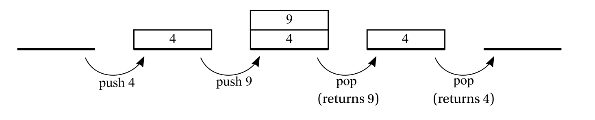

**图 1-2** 说明了**Push** 和 **Pop** 操作的示意图。这个图只是一个概念性绘图，与任何特定的内存模型或实现方式无关。

 从计算机编程的早期开始，**栈**的概念就与之密切相关，主要是因为**子程序（Subroutine）**的引入。如今，**.NET 框架** 大量使用**调用栈（Call Stack）**和**栈（Stack）**的概念，因此让我们看看它是如何发展的。栈作为数据结构的最初定义仍然适用，例如在.NET 中，有一个 `Stack<T>` 集合可用。

栈在**内存管理**中至关重要，特别是在**.NET 编程**中，大量数据可能会被存储在栈中。让我们深入了解栈及其在**函数调用**中的应用。

下面，我们使用伪 C 语言（C-like Pseudo-code）编写的示例程序（代码清单 1-2），它展示了一个**函数内部调用另一个函数**的过程：

- **`main` 函数**调用 **`fun1`**（传递两个参数 `a` 和 `b`），在 `fun1` 内部定义了两个局部变量 `x` 和 `y`。
- **`fun1` 函数**在某个时刻调用 **`fun2`**（传递单个参数 `n`），`fun2` 内部有一个局部变量 `z`。

**代码清单 1-2** 展示了这个函数调用过程的伪代码。

```
void main()
{
    ...
    fun1(2, 3);
    ...
}
int fun1(int a, int b)
{
    int x, y;
    ...
    fun2(a+b);
}
int fun2(int n)
{
    int z;
    ...
}
```

首先，想象一下有一块连续的内存区域，用于处理栈，它的设计是使得后续的内存单元地址逐渐增大（见图1-3a左侧）。还有一块程序代码所在的内存区域（见图1-3a右侧），它的组织方式也是相同的。由于函数的代码不一定要连续存放，所以main、fun1 和 fun2 的代码块在图中是分开的。程序执行过程可以按以下步骤描述：

1. 调用 fun1 之前：显然，由于程序已经在运行，一些栈区域已经被创建（图中栈区域顶部的灰色部分）。栈指针（SP）保持着一个地址，指示栈的当前边界。程序计数器（PC）指向main函数中的某个位置（我们标记为地址 A1），就在调用 fun1 指令之前。

   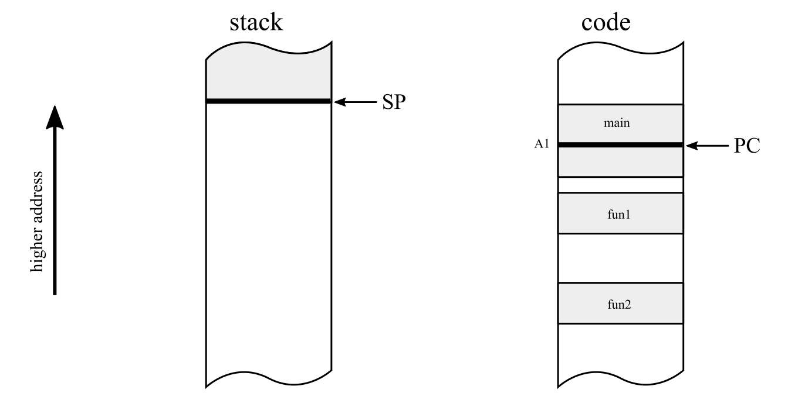

   图1-3a：栈与代码内存区域——调用函数 fun1 之前的状态（对应代码清单 1-2）

2. 在 main 中调用 fun1 之后（见图 1-3b）：

   当函数被调用时，栈会扩展，栈指针（SP）会移动来存储必要的信息。这些额外的空间包括：

   - **参数**：所有函数参数会被保存在栈上。在我们的例子中，参数 `a`（值为 2）和 `b`（值为 3）被存储在栈中。
   - **返回地址**：为了在执行完 fun1 后继续执行 main 函数，下一条指令的地址（即调用 fun1 后的下一条指令地址）会被保存在栈中。在我们的例子中，这个地址是 `A1+1`（指向地址 A1 后的下一条指令）。
   - **局部变量**：所有的局部变量也会被保存到栈上。在我们的例子中，变量 `x` 和 `y` 被存储在栈中。

   当子程序被调用时，放置在栈上的结构被称为**激活帧**（Activation Frame）。在典型的实现中，栈指针会按适当的偏移量递减，指向一个新激活帧的起始位置。因此，通常说栈是**向下生长**的。

   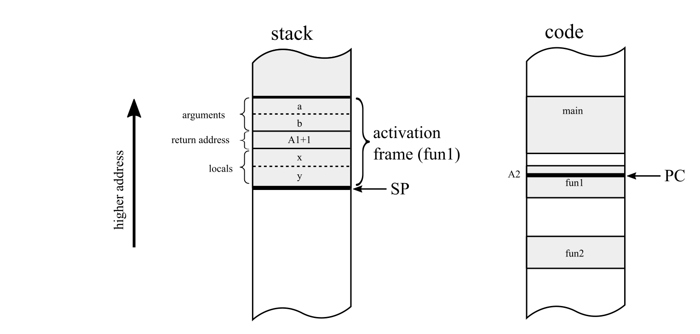

   图1-3b：栈与代码内存区域——调用函数 fun1 之后的状态（对应代码清单 1-2）

3. 从 fun1 调用 fun2 之后：

   相同的创建新激活帧的模式再次出现。这次，激活帧包含：

   - 参数 `n` 的内存区域，
   - 返回地址 `A2+1`，
   - 局部变量 `z`。

   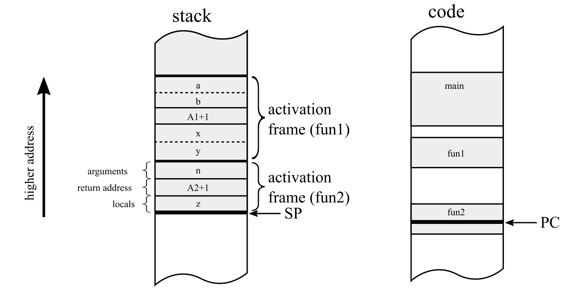

图1-3b：栈与代码内存区域——调用函数 fun1 的 fun2 之后的状态

激活帧（Activation Frame）通常也被更一般地称为**栈帧（Stack Frame）**，它指的是为了特定目的存储在栈中的任何结构化数据。

正如你所想象的那样，后续的嵌套子程序调用会重复这个模式，每个调用都会为其创建一个激活帧。子程序调用嵌套得越深，栈上的激活帧就越多。这当然使得**无限嵌套调用**变得不可能，因为它需要为无限数量的激活帧分配内存。在 .NET 中，这种无限循环会导致 **StackOverflowException**（栈溢出异常）。你已经调用了太多的嵌套子程序，导致栈的内存限制被突破。

请注意，这里介绍的机制仅仅是一个示例性和通用性的描述。实际实现可能因计算机架构和操作系统的不同而有所变化。在后续章节中，我们将深入探讨 .NET 如何使用激活帧和栈。

当一个子程序执行结束时，它的激活帧会被丢弃，方法是将栈指针（SP）向上递增，增量等于当前激活帧的大小，同时使用保存的返回地址将程序执行跳转回调用该函数的位置。换句话说，栈帧中的数据（如局部变量、参数）在函数返回后不再需要，因此只需简单地增加栈指针的值，即可“释放”该函数占用的内存。这些数据会在下次栈被使用时，被其他函数调用的数据直接覆盖（见图 1-4）。

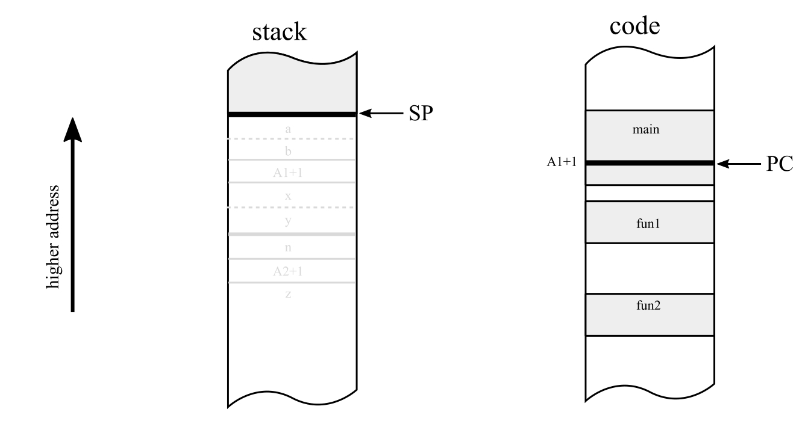

图 1-4：栈与代码内存区域——从函数 fun1 返回后，激活帧被丢弃

在实际实现中，SP（栈指针）和 PC（程序计数器）通常存储在专用寄存器中。
在这一点上，地址的大小、观察到的内存区域以及寄存器的具体细节并不是特别重要。

在现代计算机中，栈的管理既受到硬件的支持，也受到软件的支持：

- 硬件层面：提供专用寄存器用于管理栈指针（SP）。
- 软件层面：操作系统通过线程抽象和专门分配的栈内存区域，对栈进行管理。

### 栈式计算机（The Stack Machine）

在继续讨论其他内存概念之前，我们先停留在与栈相关的主题上，即所谓的栈式计算机（Stack Machine）。与寄存器机（Register Machine）不同，栈机中的所有指令都作用于专门的表达式栈（Expression Stack）或计算栈（Evaluation Stack）。请注意，这个表达式栈不一定与我们之前讨论的栈相同。因此，一台栈机可能同时具有一个额外的“表达式栈”和一个通用栈（General-Purpose Stack），甚至可能完全没有寄存器。

在这样的计算机中，指令默认会从表达式栈的顶部取出操作数，取出的数量取决于指令的需求。运算完成后，计算结果会被重新存入栈顶。如果一台栈机严格遵循这个原则，即所有操作只能访问栈顶的值，则称为纯栈机（Pure Stack Machine）。而如果指令可以访问栈中的更深层数据，则称为非纯栈机（Impure Stack Machine）。

那么，在表达式栈上执行操作具体是什么样的呢？例如，一条Multiply（乘法）指令（不带任何参数）会：
1. 弹出（Pop）两个栈顶的值作为操作数，
2. 执行乘法运算，
3. 将结果压入栈顶（Push）。  

这一过程如图 1-5 所示。

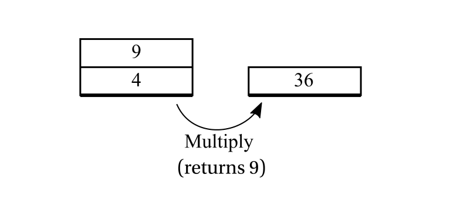

图 1-5：栈机中假设的 Multiply 指令

让我们回到寄存器机示例中的表达式 s = x + (2 * y) + z，并将其按照栈机的方式进行重写（见代码清单 1-3）。

代码清单 1-3：实现 s = x + (2 * y) + z 计算的栈机伪代码：

```
			// empty stack
Push 2 		// [2] - single stack element of value 2
Push y 		// [2][y] - two stack elements of value 2 and y
Multiply 	// [2*y]
Push x 		// [2*y][x]
Add 		// [2*y+x]
Push z 		// [2*y+x][z]
Add 		// [2*y+x+z]
Pop l 		// [] (with side effect of writing a value into l)
```

栈机的概念使得代码更加清晰易懂，其主要优点可以总结如下：

- 不需要管理临时变量存储的位置。在栈机中，不需要考虑临时值应该存放在寄存器、栈还是主存，这在概念上比手动管理这些目标更简单，从而简化了实现。
- 指令编码更紧凑。由于大多数指令不需要操作数或仅需要一个操作数，因此指令的二进制编码可以更加高效，生成的二进制代码也更加紧凑。尽管相较于寄存器架构，栈机需要执行更多的加载（Load）/存储（Store）指令，从而可能增加指令数量，但这种方法在某些情况下仍然是有益的。

在计算机早期时代，内存成本高且资源有限，这种高指令密度的特性是一个重要优势。在当今的计算领域，栈机仍然适用于某些场景，例如智能手机下载的代码或Web 应用。指令的高密度二进制编码意味着更好的 CPU 缓存利用率。

尽管栈机概念具有诸多优势，但它很少被直接应用于硬件架构。一个 notable 的例外是 Burroughs B5000 系列，它在硬件级别实现了栈计算模型。如今，几乎没有被广泛使用的计算机可以被称为纯粹的栈机。不过，仍然存在一个值得注意的例外：x87 浮点单元（FPU）。在x86 兼容 CPU 内部，x87 FPU 被设计为栈机架构，并且至今仍然以栈机方式运行，这主要是出于向后兼容性的考虑。

那么，为什么我们仍然要讨论这种架构呢？因为栈机架构是一种极佳的设计方式，用于构建平台无关的虚拟机（Virtual Machine, VM）或执行引擎（Execution Engine）。Java Virtual Machine（JVM） 和 .NET 运行时（.NET Runtime） 就是两个典型的栈机实现。虽然它们运行在x86 或 ARM 这样的寄存器机（Register Machine）上，但它们的执行逻辑仍然是栈机模型。在第 4 章，我们将详细讲解 .NET 的中间语言（Intermediate Language, IL），并清楚展示这种机制的实现。

和大多数技术选择一样，这是一种工程与历史因素的结合：

1. 更好的硬件抽象
   - 栈机代码不依赖于底层硬件的寄存器数量，可以适配不同的硬件架构。
   - 这样，将栈机代码转换为实际寄存器代码的任务可以交由JIT（即时编译器）或解释器来处理。
2. 更容易实现跨平台
   - 虚拟栈机（Virtual Stack Machine）的实现更加简单，同时又能保持较高的执行性能。
   - 结合前面提到的更好的代码密度（Code Density），使得它成为适用于广泛设备的理想选择。
   - 这可能是 Sun 公司在设计 Java 时选择栈机架构的原因——Java 最初是为机顶盒（Set-Top Box）等小型设备开发的。
   - 微软（Microsoft）在设计 .NET 时，也遵循了相同的路径。
3. 简洁优雅的设计
   - 栈机模型结构简单、易于实现，使得构建虚拟机变得更加清晰和高效。

另一方面，基于寄存器的虚拟机（Register-Based VM）的设计更加接近底层硬件，在优化方面具有优势：

- 更高的执行效率
  - 代码越接近实际机器指令，解释器（Interpreter）执行时就越高效。
  - 解释执行（Interpretation）时，JVM 或 .NET 运行时只有有限的时间来进行优化，因此越接近底层架构，性能就越高。
- 更好的 CPU 缓存利用
  - 寄存器是计算机中访问速度最快的存储单元，比栈或主存快得多。
  - 直接在寄存器中进行计算可以提供更好的缓存局部性（Cache Locality），减少 CPU 访问主存的开销。

> 注意：所有的虚拟机（VM）和执行引擎（Execution Engine）都是栈机吗？
> 绝对不是！
>
> 一个典型的例子是 Dalvik——它是Google Android 早期（直到 4.4 版本）的虚拟机，采用的是基于寄存器（Register-Based）的 JVM 实现。
> Dalvik 解释执行中间字节码（Dalvik Bytecode），不同于传统的基于栈的 JVM。
>
> 后来，在 Dalvik 的继任者Android Runtime（ART） 中，引入了 JIT（即时编译，Just-in-Time Compilation，详见第 4 章），进一步优化了执行性能。
>
> 其他采用非栈机架构的虚拟机还包括：
>
> - BEAM（Erlang/Elixir 的虚拟机）
> - Chakra（IE9 中的 JavaScript 执行引擎）
> - Parrot（Perl 6 的虚拟机）
> - Lua VM（Lua 语言的虚拟机）
>
> 因此，不能说寄存器机架构的虚拟机不常见，实际上它们在许多领域依然非常流行。

### 指针

到目前为止，我们只介绍了两种内存概念：静态分配和栈分配（作为栈帧的一部分）。指针的概念是非常普遍的，可以从计算机早期就开始看到——就像之前展示的指令指针（程序计数器）或栈指针一样。专门用于内存寻址的寄存器，如索引寄存器，也可以看作是指针。

注：我们将在第二章中讨论内存访问模式的重要性，特别是在缓存使用的背景下。在内存寻址的上下文中，一个重要的增强是曼彻斯特Mark 1计算机中引入的索引寄存器，它是“Baby”计算机的继任者。索引寄存器允许我们通过将其值加到其他寄存器来间接引用内存。因此，操作连续内存区域（如数组）所需的指令减少了。

指针是存储内存位置地址的变量。简单来说，它允许你通过地址引用内存中的其他位置。指针的大小与之前提到的字长相关，它取决于计算机的架构。如今，我们通常处理32位或64位宽的指针，这些指针通常存储在栈上（例如，作为局部变量或函数参数）或在CPU寄存器中。图1-6显示了一个典型的情况，其中一个局部变量（存储在函数的激活帧内）是指向另一个内存区域（地址为Addr）的指针。

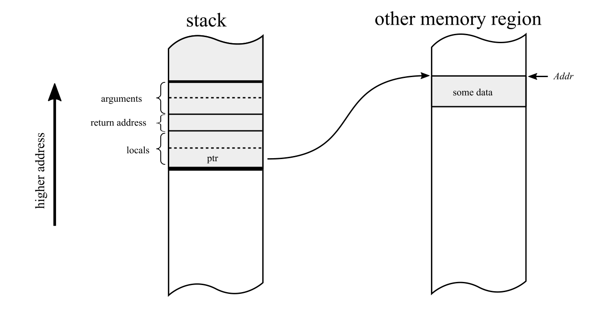

图1-6. 函数中的局部变量ptr是一个指针，指向地址为Addr的内存

指针的简单概念使我们能够构建复杂的数据结构，如链表或树，因为内存中的数据结构可以相互引用，创建更复杂的结构（见图1-7）。

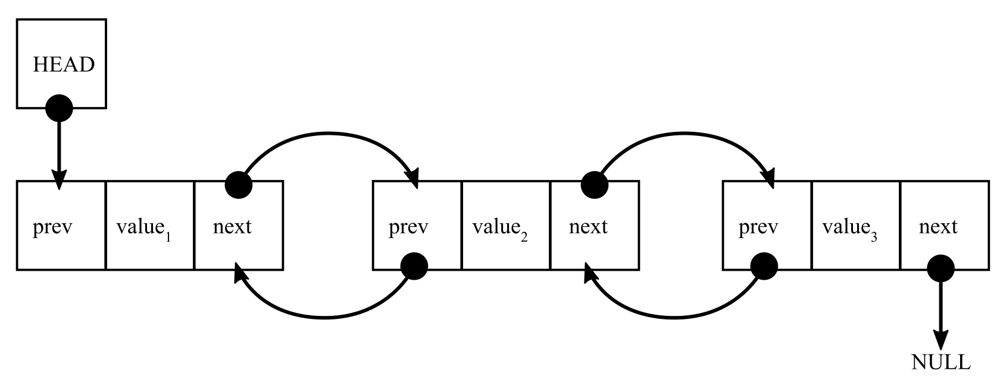

图1-7. 使用指针构建双向链表结构，每个元素都指向其前一个和下一个元素

### 堆

最终，我们到达了 .NET 内存管理中最重要的概念——堆（Heap）。堆（不太常见的名称是“自由存储区”Free Store）是用于动态分配对象的内存区域。事实上，“自由存储区”是一个更好的名称，因为它并不暗示任何内部结构，而只是强调了用途。

实际上，你可能会问，堆这种数据结构与堆（Heap）本身有什么关系？答案是：没有关系。与组织良好的栈（Stack）不同，栈是基于 LIFO（后进先出）数据结构的概念，而堆更像是一个“黑箱”（Black Box），可以请求它提供内存，但并不关心内存来自哪里。因此，“内存池”或者前面提到的“自由存储区”可能是更合适的名称。“Heap” 这个名称可能最早是从英语中的传统用法借来的，意思是“混乱的地方”，与组织有序的栈空间形成对比。从历史上看，ALGOL 68 语言引入了堆分配机制，但这一标准并未被广泛采用。不过，这很可能是“Heap”这个名称的起源。然而，事实上，这个名字的真正历史来源现在已经变得相当模糊。

堆是一种可以提供指定大小的连续内存块的机制。这种操作被称为 **动态内存分配（Dynamic Memory Allocation）**，因为内存块的大小和实际位置在编译时都不需要预先确定。由于内存的位置在编译时无法确定，因此动态分配的内存必须通过指针来引用。因此，指针和堆的概念是天然相关的。

当调用某个“为我分配 X 字节的内存”这样的函数时，返回的地址显然需要存储在某个指针中，以便将来引用已分配的内存块。这个指针可以存储在栈上（见图 1-8）、堆本身，或者存储在其他位置，例如寄存器。

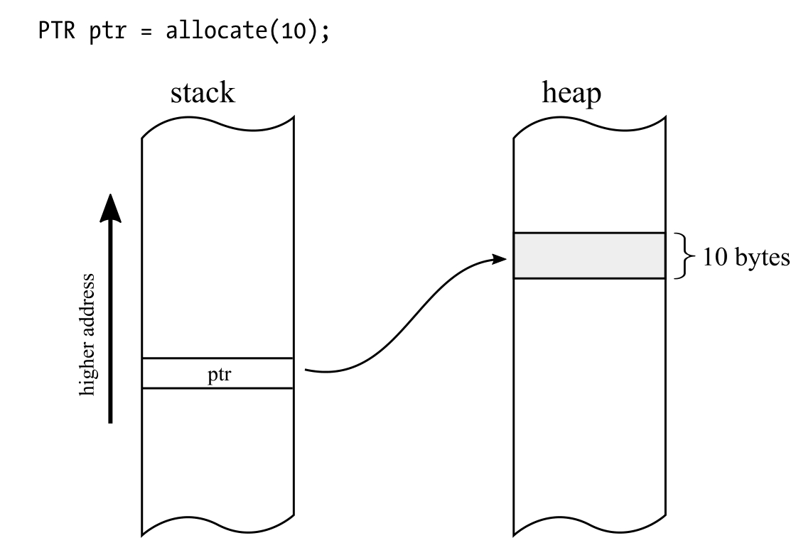

图 1-8. 栈中的指针 `ptr` 和堆上的 10 字节块

分配操作的反向操作称为 **释放（Deallocation）**，即将特定的内存块归还到内存池中，以便将来使用。堆如何分配给定大小的内存块是一个具体的实现细节，有许多不同的 **“分配器”（Allocators）**，你很快会看到其中的一些。

在多次分配和释放内存块的过程中，我们可能会遇到这样一种情况：尽管堆上总共有足够的可用空间，但由于这些空间是不连续的，可能无法满足某个对象所需的连续内存块。这种情况称为 **堆碎片化（Heap Fragmentation）**，可能会导致内存使用效率显著下降。图 1-9 说明了这种问题：在删除对象 B 和 D 之后，尽管总的可用内存足够容纳新对象 X，但由于没有足够的连续空间，X 无法被分配。

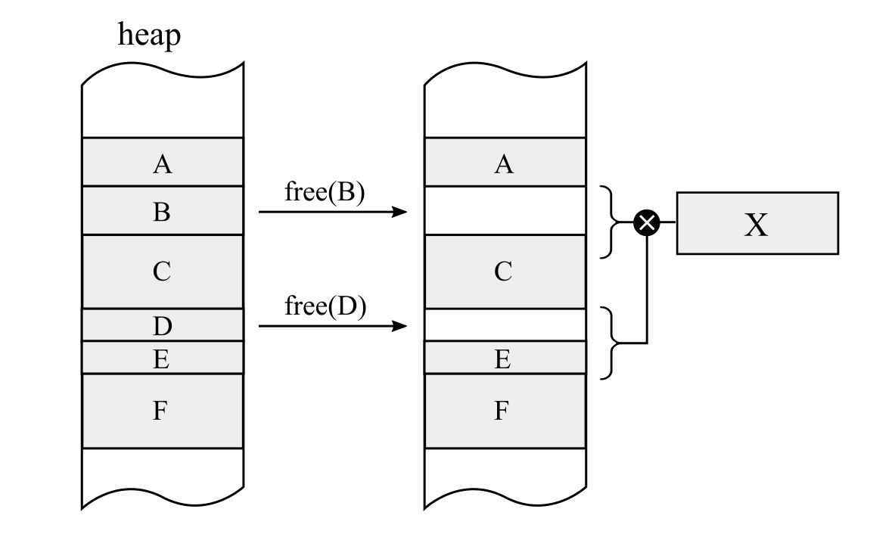

图 1-9. 碎片化问题——删除对象 B 和 D 之后，虽然堆上总的可用空间足够，但由于没有足够的连续空间，新的对象 X 无法被分配

值得注意的是，在一个进程内是使用单个堆，还是多个堆实例，也是一个具体的实现细节（我们将在 .NET 的上下文中更深入地讨论这个问题）。

## 自动内存管理

为了克服**手动内存管理**的问题，并为程序员提供更便捷的处理方式，不同的**自动内存管理（Automatic Memory Management）**方法被提出。有趣的是，第二古老的高级编程语言——**LISP**（1958年创建，仅比 FORTRAN 晚了几年），在这个领域提供了许多创新。

有一个有趣的轶事来自 **John McCarthy** 在他关于 LISP 设计的论文 *“Recursive Functions of Symbolic Expressions and Their Computation by Machine, Part I”*（《符号表达式的递归函数及其机器计算（第一部分）》）中，他简要描述了这个机制，但仅仅称之为 **“回收（Reclamation）”**。后来，他对这一部分作了注释：

> “我们已经称这个过程为垃圾回收（Garbage Collection），但我猜我当时不敢在论文里使用这个词——或者是电子研究实验室的语法审查员不允许我用。”

虽然名称不同，但这一概念已经诞生并准备好被实现了。如今，**自动内存管理（Automatic Memory Management）** 和 **垃圾回收（Garbage Collection, GC）** 这两个术语可以互换使用。我们可以将垃圾回收定义为一种机制，它解除程序员手动管理内存的责任，使得一旦对象不再被需要，它们就会被自动销毁，并回收内存。

本书想要传达的一个核心观点是，即使内存管理完全自动化，它仍然可能带来问题。作为一个小小的佐证，这里引用一个关于LISP 最早垃圾回收实现的趣事：

McCarthy 在 《编程语言历史 I》（History of Programming Languages I） 书中回忆道，在 MIT 的一次工业合作研讨会（Industrial Liaison Symposia）上，LISP 进行了首次公开演示。然而，由于一个小小的疏忽，当时的电传打字机 Flexowriter（那个时代的电动打字机）开始疯狂打印大量的页面，上面反复出现的错误消息以这样一句话开头：

> “垃圾回收器已被调用。以下是一些有趣的统计信息……”

由于这个问题，演示被迫取消，而在场的观众则哄堂大笑。究竟这是否是垃圾回收器的误用，除了 John McCarthy 本人，没有人知道。但可以确定的是，虽然这起事故是人为错误而非算法错误，但从一开始，垃圾回收器就带来了不少“麻烦”！

### **分配器、执行体和垃圾收集器**

在自动内存管理的学术研究中，执行体（Mutator）和其他相关概念是非常重要的术语。由于有了清晰的定义，您可以在以后阅读学术或技术论文时避免歧义。例如，在讨论特定算法时，可以提到“对执行体的开销”。在考虑各种垃圾收集设计时，常常会讨论垃圾收集器（Collector）对执行体的影响，反之亦然。让我们更仔细地看看这些术语。

#### 执行体（Mutator）

在与内存管理相关的几个基本概念中，最基础但最重要的一个抽象概念就是执行体。最简单的定义，执行体可以被视为一个负责执行应用程序代码的实体。之所以称其为执行体（Mutator），是因为它会改变（赋值）内存的状态——对象会被分配或修改，且它们之间的引用会发生变化。换句话说，执行体是推动应用程序内存变化的主要力量。这个名称最早由Edsger Dijkstra在1978年的论文《On-the-Fly Garbage Collection: An Exercise in Cooperation》中提出。值得一提的是，Dijkstra在这篇相当古老的论文中提出的观点，至今仍被使用，例如在2015年的Go语言中，并且取得了不错的效果。

执行体的抽象提供了一种在特定框架或运行时内对事物进行干净且清晰分类的方法。您可以将执行体定义为任何能够修改内存的实体，无论是通过更新现有对象，还是通过创建新对象。虽然这并不是严格的定义，但我们可以扩展它为任何可以读取内存的实体（因为读取是程序执行中的关键操作）。这引出了一个重要的观察——为了能够正常操作，执行体需要向正在运行的应用程序提供三种操作：

- **New(amount)**：分配给定数量的内存，该内存随后将被新创建的对象使用。请注意，在此抽象层次上，对象的类型信息是无关紧要的。只提供所需分配的内存大小。
- **Write(address, value)**：将指定的值写入给定的地址。在这里，我们同样抽象了是考虑对象字段（在面向对象编程中）、全局变量，还是其他任何类型的数据组织。
- **Read(address)**：从指定地址读取值。

在最简单的世界里，即没有任何垃圾收集算法的情况下，这三种操作有简单的实现（在列表1-6中的伪代码中展示）。

```c#
Mutator.New(amount)
{
	return Allocator.Allocate(amount);
}
Mutator.Write(address, value)
{
	*address = value;
}
Mutator.Read(address) : value
{
	return *address;
}
```

但是，在自动垃圾收集的世界中，这三种操作是执行体与垃圾收集器（Collector）和分配机制（Allocator）合作的地方。这种合作方式是什么样的，以及它如何影响上述简单实现，是设计中的一个重要关注点。在本书中，您将最常见的增强方式是添加所谓的屏障（Barrier）——它可以是读屏障或写屏障。屏障是对操作进行增强的一种方式（在操作之前或之后）。屏障允许我们与垃圾收集器机制同步（直接或间接、同步或异步），以通知程序执行和内存使用的情况。代码清单1-6中的三种方法是每个垃圾收集器可能希望插入的注入点。我们将在后续章节中讨论不同垃圾收集算法时，详细介绍一些常见的变体。在开发者的日常现实中，执行体抽象的最常见实现就是大家熟知的线程（Thread）。它完美契合了执行体的定义——它是执行代码、变更对象及对象之间引用图的单位。对我们来说，这非常直观，因为绝大多数流行的运行时环境都使用这种实现。线程作为许多其他功能的一部分，通过一些额外的层与操作系统进行通信，允许执行 New、Write 和 Read 操作。

然而，执行体并不一定要实现为操作系统线程。一个流行的例子是 Erlang 生态系统中的进程（Process）——它们作为轻量级的协程，由运行时本身管理。它们可以被看作是所谓的“绿色线程”，但在 Erlang 虚拟机（VM）中，称其为“绿色进程”更为准确，因为运行时对这些实体的隔离要比线程级的实体之间的隔离强得多。它们是由运行时级别管理的实体，而不是操作系统级别管理的。另一种常见的执行体实现可以基于所谓的纤程（Fiber），它是操作系统提供的轻量级执行单元，Linux和Windows都支持。

#### 分配器（Allocator）

执行体必须能够处理我们在前面讨论过的 **New** 操作。在这些方法的内部，迟早都会涉及到一个非常重要的概念——**分配器（Allocator）**。简单来说，分配器是负责动态内存分配和释放的实体。

分配器必须提供两个主要操作：

- **Allocate(amount)**：分配指定大小的内存。当然，这个功能可以进一步扩展，例如提供能够为特定类型对象分配内存的方法（如果分配器可以获取类型信息）。正如我们所见，这个操作在 Mutator.New 方法内部会被使用。
- **Deallocate(address)**：释放指定地址的内存，使其可用于后续分配。请注意，在自动内存管理的情况下，这个方法是内部的，并不会暴露给执行体（因此，用户代码无法显式调用它）。

这个概念看似简单，甚至可以说是显而易见的，但实际上并没有那么容易实现。设计分配器涉及多个不同的方面，而最终都会面临权衡取舍，主要是在性能、实现复杂度（这直接影响可维护性）等方面的权衡。接下来，我们会深入研究两种最流行的分配器：**顺序分配器（Sequential Allocator）** 和 **空闲链表分配器（Free-List Allocator）**。不过，由于这是实现细节，我们会在第4章结合 .NET 的具体情况进行探讨。

#### 收集器（Collector）

如果我们把执行体（Mutator）定义为负责执行应用程序代码的实体，那么收集器（Collector）就是负责执行垃圾回收（自动回收内存）的实体。换句话说，你可以把收集器看作是一段软件代码、一个线程，或者两者的结合，具体取决于上下文。

那么，收集器如何知道哪些对象已经不再需要，可以安全释放呢？这实际上是一个不可能完成的任务，因为它需要预测未来——一个对象是否会再次被使用，取决于接下来要执行的代码，而代码的执行可能又依赖于用户操作、外部数据等不确定因素。理想情况下，收集器应该知道对象的**存活性（liveness）**：

- **存活对象（live objects）** 是那些将来还会被访问的对象。
- **死亡对象（dead objects，或垃圾）** 是那些不会再被使用的对象，可以安全销毁。

但现实中，收集器并不能直接判断对象是否存活，所以垃圾收集（GC, Garbage Collection）只能基于**可达性（reachability）**来近似估计。

这里有一个很有趣的现象：由于 Allocator.Deallocate 方法并不会公开，执行体实际上**无法显式释放已经分配的内存**，它只能不断请求分配新的内存，就像计算机拥有无限的内存一样。但实际上，我们的计算机资源是有限的，这正是垃圾收集机制存在的意义——它是对“无限内存计算机”的一种模拟，其效率则取决于具体实现方式。

有人可能会想到一种特殊的垃圾收集器——“零垃圾收集器”（Null/Zero Garbage Collector），即它永远不释放已分配的内存。如果计算机真的拥有无限内存，这种收集器当然可以正常工作，但现实中这种情况并不存在。不过，零垃圾收集器仍然有一些实际用途，比如短生命周期的程序，在这些场景中，内存的无限增长是可以接受的。未来，随着 Serverless（无服务器架构）和 短时运行单函数（short-running single functions）的发展，这类收集器可能会越来越流行。关于 .NET 中零垃圾收集器的示例，我们会在第15章介绍。

由于**对象的存活性（liveness）是不可知的**，垃圾收集器的核心机制就变成了**判断对象的可达性（reachability）**。

**对象的可达性**意味着：
从任何执行体可以访问的内存出发，是否存在一条引用链，可以最终指向这个对象（见图1-10）。可达性不等同存活性，但它是当前我们能用的最好的近似方法。

- 如果一个对象不可达（unreachable），那么它肯定不会再被使用，因此可以安全回收。
- 如果一个对象是可达的（reachable），它可能仍然存活，但也可能永远不会被访问（比如，它被复杂的引用链保留，但代码实际不会再用到它）。
- 存活性与可达性之间的不匹配，正是大多数**内存泄漏（memory leak）** 发生的根本原因。

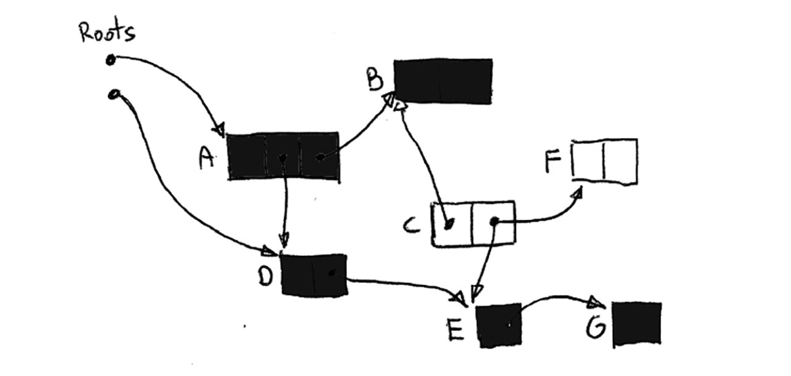

执行体的起始可达对象被称为**根（Roots）**。具体的根对象类型，取决于具体的执行体实现方式，但在最常见的情况中，执行体就是一个线程（通常是 操作系统级的原生线程），那么它的根对象主要包括：

- 局部变量和子程序参数（存放在栈或寄存器中）
- 静态分配的对象（例如全局变量，存放在堆上）
- 收集器内部维护的其他数据结构

在了解了执行体（Mutator）、分配器（Allocator）和收集器（Collector）之后，我们接下来会进一步探讨各种不同的自动内存管理策略。虽然可以列出一个完整的清单并详细介绍所有方案，但篇幅所限，我们不会面面俱到，而是专注于现代编程语言中最重要、最流行的几种方法。

### 跟踪式垃圾收集器（Tracking Collector）

在自动内存管理中，判断对象的可达性（reachability）非常困难，因为它涉及整个程序对象图（object graph） 的全局状态，而显式调用 `free()` 释放对象仅仅是局部行为。在这种局部上下文中，我们无法得知全局情况——是否仍然有其他对象在使用当前对象？

引用计数（Reference Counting） 试图通过局部计数来解决这个问题，但它只关注本地的引用关系，并不能感知整个对象图，因此会导致循环引用（circular references）以及其他问题。

相比之下，**跟踪式垃圾收集器（Tracking Garbage Collector）**具备全局视角，能够基于整个程序的运行情况准确判断对象是否应该被删除（回收内存）。事实上，这种方法如此流行，以至于当人们提到垃圾收集器（Garbage Collector, GC） 时，通常指的就是跟踪式垃圾收集器。它广泛应用于运行时环境，例如 .NET、JVM（Java Virtual Machine） 等。

追踪式垃圾回收器（Tracing Garbage Collector）的核心概念是通过从**执行体（Mutator）**的根对象开始，递归地追踪程序中整个对象图，从而确定对象的真实可达性。这显然不是一项简单的任务，因为进程内存可能占用数 GB，追踪如此大量数据中的所有对象间引用非常困难，尤其是在执行体正在运行并不断修改这些引用的情况下。追踪式垃圾回收器最典型的实现包括两个主要步骤：

1. **标记（Mark）**：在此阶段，回收器通过确定对象是否可达来判断内存中的哪些对象可以被回收。
2. **回收（Collect）**：在此阶段，回收器释放那些被判定为不再可达的对象的内存。

这种简单的两阶段逻辑的实现可以进一步扩展，例如在 .NET 中描述为 **标记-计划-清除-压缩（Mark-Plan-Sweep-Compact）**。在接下来的章节中，你将详细看到这些内部工作原理。现在，我们以更通用的方式来看待标记和回收步骤，因为它们也会引发一些有趣的问题。

#### 标记阶段

在**标记（Mark）**步骤中，回收器通过确定对象是否可达来判断内存中的哪些对象应该被回收。回收器从**执行体（Mutator）**的根对象开始，遍历整个对象图，并标记所有被访问过的对象。在标记阶段结束时，未被标记的对象是不可达的。标记对象还有助于处理循环引用问题。如果在图遍历过程中多次遇到同一个对象，由于标记的存在，我们只需检查一次。

图 1-13 展示了这种算法的初始步骤。从根对象开始，我们通过对象间的引用遍历对象图。采用深度优先（depth-first）还是广度优先（breadth-first）遍历是具体的实现细节。图 1-13 展示了一种深度优先的方法，其中每个对象可能处于以下三种状态之一：

- **未访问的对象**，用白色框表示；
- **待访问的对象**，用浅灰色框表示；
- **已访问的对象（标记为可达）**，用深灰色框表示。

图 1-13 中的初始步骤可以描述如下（每一步对应一个子图）：

1. **初始状态**：所有对象都未被访问。
2. 对象 A 作为第一个根对象被加入待访问队列。
3. 由于对象 A 包含指向对象 B 和 D 的引用（作为字段），它们被加入待访问队列。此时，对象 A 被标记为可达。
4. 从待访问队列中取出下一个对象 B 进行访问。由于对象 B 没有指向其他对象的引用，它被直接标记为可达。
5. 从待访问队列中取出下一个对象 D 进行访问。对象 D 包含一个指向对象 E 的引用，因此对象 E 被加入队列。对象 D 被标记为可达。
6. 对象 E 包含一个指向对象 G 的引用，因此对象 G 被加入队列。对象 E 被标记为可达。
7. 从待访问队列中取出最后一个对象 G 进行访问。由于对象 G 没有指向其他对象的引用，它被直接标记为可达。此时，队列中已没有更多对象，因此我们确定对象 C 和 F 是不可达的（即“死亡”对象）。

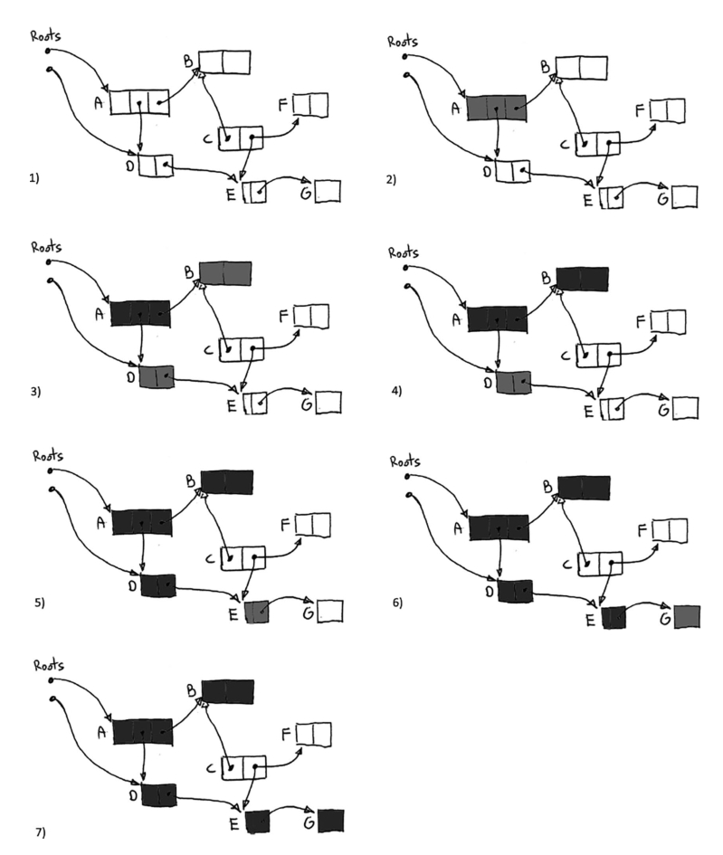

图 1-13 标记阶段的步骤顺序

显然，在**执行体**正常工作时遍历这样的对象图是非常困难的，因为由于程序的正常执行（如创建新对象、变量赋值、对象字段更新等），对象图会不断变化。因此，在某些垃圾回收器的实现中，**标记阶段**会暂停所有**执行体**的运行。这样可以安全且一致地遍历对象图。当然，一旦线程恢复运行，回收器基于对象图所掌握的信息就会过时。但对于不可达对象来说，这并不是问题——如果它们之前不可达，那么它们永远不会再次变为可达。然而，许多垃圾回收器的实现支持并发标记（concurrent marking），即标记过程可以与**执行体**的代码同时运行。例如，JVM 中的 CMS（Concurrent Mark Sweep）算法、G1 算法以及 .NET 中的垃圾回收器都采用了这种方式。第 11 章将详细描述 .NET 中并发标记的具体实现。

**标记阶段**还存在一个不太明显的问题：为了追踪可达性，回收器需要知道根对象的位置以及堆中哪些地方存放了指向其他对象的引用。如果运行时环境支持提供这些信息，那么这个问题是微不足道的。但如果没有这种支持，也可以通过其他方式解决。

##### **保守式垃圾回收器（Conservative Garbage Collector）**

这种类型的回收器可以被视为一种“穷人的解决方案”。当运行时环境或编译器无法直接提供精确的类型信息（对象在内存中的布局），并且回收器在操作指针时无法获得**赋值器（Mutator）**的支持时，可以使用这种回收器。如果所谓的**保守式回收器（Conservative Collector）**想要确定哪些对象是可达的，它会扫描整个栈、静态数据区和寄存器。在没有任何运行时支持的情况下，它只能尝试猜测哪些是指针，哪些不是。它通过检查多个条件（具体取决于回收器的实现）来实现这一点，但最重要的检查是：将某个字解释为地址时，是否指向内存中的一个有效区域（由**分配器（Allocator）**管理的堆区域）。如果是，回收器会保守地（因此得名）假设这是一个指针，并将其视为一个引用，在前文描述的**标记阶段（Mark Phase）**图遍历中继续追踪。

显然，回收器在猜测指针时可能会出错，这会导致一些不准确的情况。内存中的随机比特可能看起来像是具有有效地址的指针，从而导致保留实际上未使用的内存。这并不是一个非常常见的问题，因为内存中的大多数数值都比较小（如计数器、财务数据、索引），而内存地址通常较大，因此唯一可能出现问题的是密集的二进制数据（如位图、浮点数或某些 IP 地址块）。有一些微妙的算法改进可以帮助解决这个问题，但我们在此不深入讨论。此外，保守式报告意味着无法在内存中移动对象。这是因为必须更新指向移动对象的指针，而如果你不确定某个看似指针的东西是否真的是指针，显然无法做到这一点。

那么，谁可能需要这样的回收器呢？它的主要优点是它可以在没有运行时支持的情况下工作——它只需扫描内存，因此不需要运行时的支持（如引用追踪）。这在某些情况下非常方便，例如在开发新的运行时环境时，如果垃圾回收所需的完整类型信息尚未开发完成，早期版本可以使用保守式垃圾回收器，以避免阻塞系统其他部分的开发。当最终实现适当的运行时支持后，可以简单地关闭保守式追踪。微软在开发某些版本的运行时环境时就采用了这种方法。

然而，由于保守式垃圾收集器（Conservative Collector）无法获知对象的内部布局，因此它需要**分配器（Allocator）**的支持。例如，分配器可以按照一定方式分配对象，使其被组织到大小相同的对象段（segments of equal size objects）中。这样一来，即使不了解对象的具体布局，仍然可以扫描这些区域，因为对象的大小是已知的，并且对象的边界可以通过段内对象大小的简单倍数计算来确定。

在许多编程语言中，**分配器（Allocator）** 可以在**语言（库）级别**进行替换，这使得**保守式垃圾收集（Conservative Garbage Collection）** 作为库的形式变得流行。其中，**最常见的 API 无关（API-agnostic）实现** 之一是 **Boehm–Demers–Weiser GC**（简称 **Boehm GC**）。

例如，在 **Mono（开源的 .NET CLR 实现）** 中，Boehm GC 一直被使用，直到 **2010 年**（Mono **2.8 版本**）引入了 **SGen Garbage Collector**。SGen 采用了一种**混合垃圾回收策略**：

- **栈（stack）和寄存器（registers）** 仍然采用 **保守式扫描（conservative scanning）**。
- **堆（heap）** 的扫描则依赖 **运行时类型信息（runtime type information, RTTI）** 提供的支持。

让我们来总结一下保守式垃圾收集的优缺点：

优点

- 适用于缺乏原生垃圾回收支持的环境。例如，早期的运行时阶段（early runtime stages）或非托管（unmanaged）语言（如 C/C++）。

缺点：

- 误判：任何看起来像有效指针的值都会阻止相应内存被回收。尽管这种情况较少发生，但可以通过算法优化和额外标志（flags）进行改进。
- 对象无法移动：简单实现中，对象不能移动或压缩（compact），因为垃圾收集器无法准确判断某个值是否是指针。由于GC不能随意修改那些它“猜测”是指针的值，因此无法执行内存压缩（memory compaction）。

