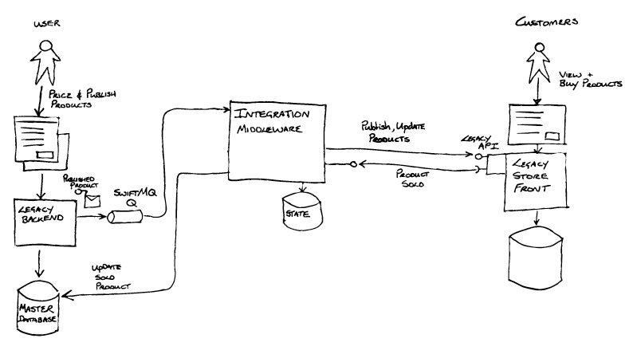
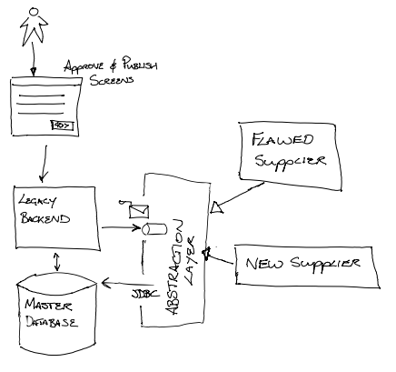
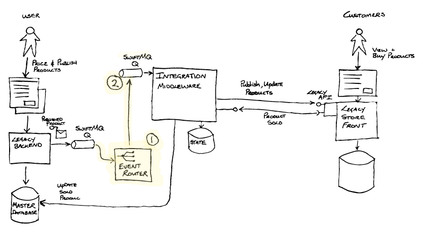
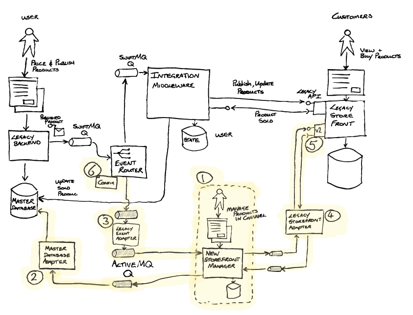
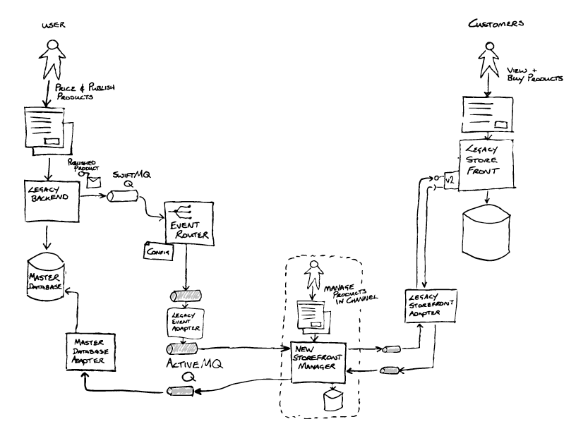
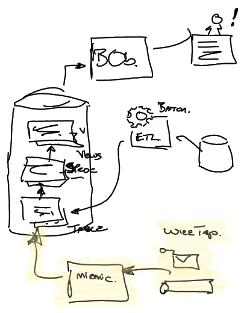

# 遗留系统迁移模式

遗留软件系统的有效现代化

*当面临更换现有软件系统的需要时，组织通常会陷入半完成技术更换的循环。我们的经验告诉我们一系列模式，使我们能够打破这个循环，依靠：有意识地认识到取代遗留软件的预期结果，打破这种部分的取代，逐步交付这些部分，并改变组织的文化，认识到变化是不变的现实。*

## 传统替换跑步机

我们与许多组织合作，他们多次尝试删除遗留系统。在一个相当典型的组织中，他们经历了一系列长达 3-5 年的现代化方案。每次他们都会定义一种新的技术方法，然后作为大型多年现代化计划的一部分，朝着这种新方法努力。

在每个项目的某个阶段，他们都会遇到一个危机点，即不断变化的业务需求会超越当前的技术策略，从而引发重新开始的需求。在采用瀑布式"大爆炸"方法的项目中，这意味着放弃大部分工作。在其他采用渐进式交付方法的情况下，所采取的方法只是在已经非常复杂的基础上增加一层稍新的技术。在这两种情况下，他们都无法停止使用之前的传统堆栈，节省成本和降低风险的关键业务目标仍然无法实现，这是许多传统替换工作的常见结果。

在他们的反复失败中有几个关键因素在起作用。

首先，他们看到的糟糕结果在很大程度上是组织的产物；具体来说，它是领导力、结构和工作方式。他们认为，只要选择更新的技术，即使是其他一切或多或少保持不变，他们就会得到与过去不同的结果。但事后看来，这显然是不现实的。

其次，现代化将通过一个大型变革方案来实现，该方案本身由一系列项目和小组组成的。这些项目被视为与任何 BAU（Business As-Usual，业务不变）是互相独立的。因此，BAU 继续针对现有系统交付业务需求，而新的项目团队则根据替换计划开始时商定的一组需求进行交付。

随着时间的推移，他们发现企业的实际需求与计划开始时实际签署的需求之间的差距越来越大。每个项目运行的时间越长，项目计划与 BAU 和未来需求之间的差距就越大。虽然已经制定了变更控制流程来为计划增加新的需求，但这些流程非常耗时，而且由于前期供应商合同的原因，成本高得令人望而却步。

失败的第三个关键因素是希望与现有系统和业务流程实现功能均等。这些尝试开始时承诺给企业提供与现在完全相同的系统和流程，但在背后以某种方式对技术进行了"改进"。在经历了多次失败并担心中断的情况下，企业领导者认为这是一种风险较低的策略。这里的挑战在于，即使是定义和商定当前的"原样"功能也是一项巨大的工作，它导致了一个大型的单一"大爆炸"切换发布计划。

我们从这个组织和许多其他组织中观察到的是，技术最多只是遗留问题的50%，工作方式，组织结构和领导力对成功同样重要。

## 打破循环

显然，有必要打破“技术替代方案”的循环。简而言之，组织需要能够继续满足业务需求，同时取代过时的技术，所有这些都是在加速技术变革和更严峻的竞争环境的背景下进行的。

我们发现了一系列方法可以帮助应对这些挑战。它们有助于应对将问题分解为更小部分的挑战，以便在改进技术的同时满足新要求。从广义上讲，它们分为四类：

1. 了解您想要实现的结果
2. 决定如何将问题分解为更小的部分
3. 成功交付零件
4. 更改组织以允许这种情况持续发生

### 了解您想要实现的结果

对于一个组织来说，在处理遗留问题时，就他们想要实现的结果达成一致是至关重要的。虽然这似乎是显而易见的，但组织的不同部门往往对预期结果有完全不同的看法。大多数遗留现代化计划都涉及我们在下面列出的几个结果，但在开始旅程之前确定哪些是优先事项至关重要。

#### 降低变更成本

许多组织在决定处理遗留问题时的一个关键转折点是，由于机会成本（也称为延迟）或实施成本，所需的业务更改开始的成本远远超过任何预期收益。一个预警信号是，不得不花费数周时间、数万或数十万美元对网站进行改动，却只能带来微小的业务绩效增长。

在这一点上，进行任何不能带来巨大投资回报的变革往往不再可能是合理的。换句话说，技术状况已经开始决定企业可以进行的变革规模。对于许多企业来说，这意味着是进行 "BAU" 变革还是必须启动一个更大的项目。这些大型项目会吸引所有以前不合理的小变革，从而增加其范围、成本和风险。

#### 改进业务流程

我们已经看到很多这样的例子：业务流程是在传统系统的基础上发展起来的，流程与系统的工作方式紧密相连，系统中的制约因素和 "系统外 "的变通方法往往影响着人们的工作流程。

我们看到的一个例子是，一家航空公司的值机系统使用"绿屏"终端，由于传统系统的限制，流程必须按照严格的顺序进行，这意味着修正或错误意味着重新开始值机流程。此外，该航空公司最初不提供转机服务，当增加转机服务时，由于技术限制，必须在原有系统中作为一个单独的工作流程来完成。因此，如果在办理值机手续时，乘客没有提到他们有一个转机航班，那么就会有错误的流程，包括打印错误的行李标签，只有在这之后，系统才会标记转机航班。通过改变流程，值机工作人员的工作和乘客的体验本可以得到很大改善，但由于传统系统的原因，这是不可能的。

因此，**更新和改变业务流程反过来也需要改变支持技术的工作方式**，这一点不足为奇。试图在不改变技术的情况下改变工作流程往往会导致"非系统"工作，即人们将数据提取到电子表格或类似表格中，在那里进行处理，然后再将数据导入到原有系统中。

在一家企业中，整个库存订购流程实际上是在团队经理个人电脑上运行的 Microsoft Access 数据库中完成的。由于传统系统无法支持供应商的新工作方式，他们感到非常沮丧。他们每周都会进行几次数据的导入和导出，与此同时，由于没有人意识到发生了什么，企业的其他部门会看到过时的数据。

值得注意的是，这种变通方法的根本原因往往是要求更换系统以支持数据的导入和导出。

#### 淘汰旧系统

旧系统需要被淘汰得一个常见原因是传统系统现代化。这通常是由于在支持旧硬件或软件方面面临挑战，例如支持成本上升以及硬件和软件的支持合同到期等问题。

我们发现，从业务的角度来看待旧系统的退役是非常有用的。**因此，基于旧技术构建的系统本身并不足以成为更换的理由。相反，我们需要考虑这对业务造成的影响，如运行成本上升或因缺乏支持或系统知识而产生的风险。**

虽然有些组织对旧技术的淘汰进行了很好的规划，但许多组织似乎忽视了这一问题，直到它达到危机点。反过来，这往往会促使企业采用看似低干扰选项或速赢的现代化方法，这些通常是反模式，我们将在后面介绍其中的一些陷阱。

多年来，我们对许多大型企业在不支持的硬件和软件上运行其业务感到震惊，在 eBay 上购买备件是我们经常听到的故事。如果您使用的是传统技术，值得进行一次适当的调查，并创建一个日历，记录各种生命周期支持的终止日期。

虽然许多组织将旧系统的退役作为遗留系统现代化的关键成果，但实际情况并非如此，遗留系统仍在使用，相关业务目标仍未实现。

#### 即时中断

对于一些企业来说，解决遗留问题的临界点可能是由于外部因素造成的，如监管变化、新"启动"的竞争对手或现有竞争对手的重大变化。当面临"非做不可"的变革时，往往会发现应对所需的资金和时间已经变得过于庞大。

外部事件使组织的领导层清楚地认识到，他们不再有能力以相应的成本进行变革。

#### 更新的技术

**采用新技术不应该成为传统现代化的原因，只是为了自身而拥有更新的技术很少是任何组织的关键目标**。相反，应该以最能**满足当前和未来业务需求**的方式选择和选择它。这里的一个挑战是技术变革的步伐正在加快，技术的“有用”寿命越来越短。“有用”的实际定义取决于组织，但通常我们需要考虑以下事项：

- 允许竞争优势
- 匹配竞争对手或市场产品
- 允许更快的变化步伐
- 更换成本更低
- 运行成本较低

我们今天对最佳和最有用技术的选择很可能会在相对较短的时间内被更好的替代技术所取代。这就使得在寻找满足未来需求的技术方面做出正确决策的潜在风险非常大。

一个好的方法是不要做出任何在 2-3 年内不能轻易"重来"的选择。这对技术选择以及整体设计和方法都有影响。当我们认识到变化的速度在不断加快时，选择一个 5-10 年才能收回成本的大型平台是很难成立的。

### 决定如何将问题分解为更小的部分

从广义上讲，这包括在当前业务和技术架构中找到正确的"接缝"。重要的是，您必须考虑当前解决方案的元素如何映射到不同的业务能力。对于传统系统，这通常意味着发现一个大型技术解决方案是如何满足多种业务需求的，然后看看是否有可能通过一个新的解决方案来提取独立交付的个别需求。理想情况下，这些需求应可交付，且相互之间的依赖性最小。

一个常见的反对意见是，找到这些缝隙（seams）太困难了。虽然我们同意这在一开始是具有挑战性的，但我们发现这是比其他方法更好的方法，因为其他方法往往会导致功能均等和大爆炸式的发布。我们还注意到，许多企业之所以排除这种方法，是因为他们孤立地看待技术或业务流程。单独改变技术的一部分或更新业务流程很可能会失败，但如果我们能够将两者结合起来考虑和实施，就有办法"吃掉大象"。

#### 开始吧

在旅程的开始阶段，遗产现代化似乎是一个最令人生畏的命题。与任何旅程一样，我们必须首先尝试并了解最初的方向。此外，与所有旅程一样，您必须从您所在的地方开始。我们经常遇到的一个问题是，我们似乎从一片森林中开始，看不到前方的风景，因此也不知道要走的方向。因此，第一步就是爬到树上，仔细观察四周！这意味着要在最短的时间内尽可能了解当前的系统和架构。这通常很难做到，而且很容易被过多的细节所困扰。

幸运的是，有许多非常有用的工具可以协同使用，以获得足够好的理解，从而继续工作。这些工具将在其他地方进行详细讨论，但总结列表将包括[事件风暴（Event Storming）](http://ziobrando.blogspot.com/2013/11/introducing-event-storming.html)、[Wardley 映射（Wardley Mapping）](https://blog.gardeviance.org/2015/02/an-introduction-to-wardley-value-chain.html)、业务能力映射（Business Capacity Mapping）和领域映射（Domain Mapping）。请注意，在这份清单中，我们主要关注的是业务概念如何映射到系统架构中，进而了解该[架构如何支持价值生成](https://martinfowler.com/articles/value-architectural-attribute.html)。这是一个经常被忽略的视角，尤其是对于传统系统而言。

了解问题的模式：

| [创建城镇计划](https://martinfowler.com/articles/patterns-legacy-displacement/create-town-plan.html) † | 确定组织的稳定部分，围绕这些部分组建团队和软件 |
| ------------------------------------------------------------ | ---------------------------------------------- |
| [事件风暴](https://martinfowler.com/articles/patterns-legacy-displacement/event-storming.html) † | 用于了解业务流程的技术                         |
| [识别业务能力](https://martinfowler.com/articles/patterns-legacy-displacement/identify-business-capabilities.html) † | 确定组织的稳定部分，围绕这些部分组建团队和软件 |
| [价值流图](https://martinfowler.com/articles/patterns-legacy-displacement/value-stream-map.html) † | 描述用户如何完成工作的工件                     |

具体来说，我们发现人们常常在遗留系统的边界上停止发现式的活动，"龙在这里"，不再前进。如果不跨越边界，揭示遗留系统是如何支持（或阻碍）业务流程和活动的，就很难找到并提取薄片进行交付。

另一个经常被忽视但非常有价值的信息来源是系统用户本身。事实上，根据作者的经验，这往往是您能够找到大量有用信息的地方，尤其是能够揭露许多变通方法和影子 IT 生态系统，这些通常是围绕旧系统建立起来的，即实际运行业务的 Access 数据库和版本化 Excel 电子表格。客户旅程映射（Customer Journey Mapping）、创建服务蓝图（Service Blueprints）和价值流映射（Value Stream Mapping）等工具在揭示此类细节方面效果显著。

解决问题的模式：

| [提取产品线](https://martinfowler.com/articles/patterns-legacy-displacement/extract-product-lines.html) | 按产品线识别和分离系统                         |
| ------------------------------------------------------------ | ---------------------------------------------- |
| [提取价值流](https://martinfowler.com/articles/patterns-legacy-displacement/extract-value-streams.html) | 识别并分离关键价值流                           |
| [功能平价](https://martinfowler.com/articles/patterns-legacy-displacement/feature-parity.html) | 使用新技术堆栈复制旧系统的现有功能。           |
| [唯一真环](https://martinfowler.com/articles/patterns-legacy-displacement/one-true-ring.html) | 通过识别独特和共享的业务能力，对问题进行细分。 |

### 成功交付部件

对快速变更的需求，以及在没有大量依赖关系的情况下逐步交付和独立变更业务元素的能力，往往导致"敏捷"交付方法与基于微服务的架构并存。持续交付成为这些可单独部署组件的必备条件。除了普通的软件交付之外，更具挑战性的是找到从现有大型解决方案中分离出来、与之共存并最终取代其元素的策略。有几种成功的策略，包括**并行运行**、**入口分叉**和**分流**。

交付模式：

| [金丝雀发布](https://martinfowler.com/articles/patterns-legacy-displacement/canary-release.html) | 向部分用户推出变更                                           |
| ------------------------------------------------------------ | ------------------------------------------------------------ |
| [关键聚合器](critical-aggregator.md)                         | 整合来自不同业务部门的数据，为关键决策提供支持               |
| [暗启动](https://martinfowler.com/articles/patterns-legacy-displacement/dark-launching.html) | 在不使用结果的情况下调用新的后端功能，以评估其性能影响分流   |
| [分流](https://martinfowler.com/articles/patterns-legacy-displacement/divert-the-flow.html) | 首先将跨组织活动从传统业务中转移出来                         |
| [事件拦截](https://martinfowler.com/articles/patterns-legacy-displacement/event-interception.html) | 拦截对系统状态的任何更新，并将其中一些更新路由到新组件。     |
| [模仿传统系统](https://martinfowler.com/articles/patterns-legacy-displacement/legacy-mimic.html) | 新系统与旧系统交互时，旧系统不会察觉到任何变化。             |
| [还原到源](https://martinfowler.com/articles/patterns-legacy-displacement/revert-to-source.html) | 确定数据的源头，并集成到源头。                               |
| [停止世界切换](https://martinfowler.com/articles/patterns-legacy-displacement/stop-the-world.html) | 在切换到新系统时暂停正常业务活动                             |
| [过渡架构](https://martinfowler.com/articles/patterns-legacy-displacement/transitional-architecture.html) | 为简化遗留系统的迁移而安装的软件元素，我们打算在迁移完成后将其移除。 |

### 更改组织以允许这种情况持续发生

如果我们后退一步，审视一下交付新业务需求的整个过程，我们很快就会发现这只是技术问题的一部分。如果我们使用较新的技术来减少构建解决方案的时间和成本，那么我们就会发现任何与达成需求和将变更投入生产有关的问题。

我们需要改变组织结构和流程，以充分利用更好的技术，而且根据[康威定律](https://github.com/MarsonShine/MS.Microservice/blob/master/docs/ConwayLaw.md)，我们还需要一个有利于实现这一点的技术架构。如果团队和他们的沟通是围绕现有的解决方案和流程来组织的，我们可能需要使用[反康威法（Inverse Conway Maneuver）](https://martinfowler.com/bliki/ConwaysLaw.html#icm)来重组他们，以匹配新的解决方案和架构。

传统系统会制约和限制采用更现代化工程实践的能力，尤其是那些与极限编程和持续交付相关的实践。在替换传统系统时，重要的是要确保改变工作方式，以确保我们最终不会回到一个缓慢、难以改变且成本高昂的系统。

传统也是组织文化和领导力的产物，如果没有更广泛的变革，你应该期待与以前相同的结果。我们观察到，许多传统的现代化努力都因"企业抗体"而失败，"企业抗体"会发现新事物，并采取行动将其拒之于组织之外。

我们曾与一家大型电信公司合作，该公司希望为移动电话开发软件。该公司的领导层都明白，这意味着反馈周期更快，变革更频繁，而他们看到的是，与现有的专注于固定基础设施的项目相比，这意味着更快的反馈周期和更频繁的变革。

尽管领导层都明白这一点，但他们并没有改变现有的工作实践，也没有改变负责这些流程的中层管理人员。因此，现有的变更控制流程被严格执行。最终，软件团队花费在填写变更控制表格和参加变更控制会议上的时间比他们生产软件的时间还多。“企业抗体”成功地拒绝了新的工作方式。

组织变革是一个很大的话题，已经有很多文献可供参考。很少有组织能够在重新设计（或重建，对于外包受害者）其整个交付方法以及其组织结构和关键业务流程的同时，推迟遗留问题的现代化。尽管组织变革这一更广泛的话题超出了我们的范围，但我们还是推荐了一些在传统背景下应用和保护新工作方式的策略。如果你只是改变传统的工作方式，而不做任何其他事情，那么几年后，你将会再次取代传统的工作方式。

持续的组织变革模式：

| [按照您的需求进行构建](https://martinfowler.com/articles/patterns-legacy-displacement/build-as-you-mean-to-continue.html) | 以您需要的方式创建您的传统替代品，以便在其上线后继续运营。   |
| ------------------------------------------------------------ | ------------------------------------------------------------ |
| [新公司](https://martinfowler.com/articles/patterns-legacy-displacement/new-co.html) | 成立一家全新的公司，以打破市场格局。                         |
| [受保护的试点](https://martinfowler.com/articles/patterns-legacy-displacement/protected-pilot.html) | 为新工作创建一个试点项目，并将其从正常的公司治理流程中分离出来。 |

在组织转型方面肯定还有其他战略和方法，我们只是强调了这两种，因为在某种程度上，这两种战略和方法可以让我们尽早开始传统的现代化工作。

## 例子：集成中间件移除

本示例描述了我们的一个团队如何使用一系列遗留系统现代化模式来成功替换对客户业务运营至关重要的集成中间件，以此作为更大的遗留系统现代化计划的一部分。他们将模式和重构结合起来，成功地管理了业务风险，并促进了大象的这一特别复杂的部分。

### 了解结果

我们的团队所面临的挑战是如何用一个新的可支持的、灵活的解决方案来取代已失去支持、难以改变且成本高昂的集成中间件。同时又不影响现有业务运营或使其面临风险。该中间件用于集成后端系统和前端商店。这些系统每天负责销售价值数千万英镑的高价值独特产品。

这项工作是一个大型项目的优先级较高的部分。支持业务的整个后端系统都将被替换，商店前台也将在几年内进行现代化改造。

因此，根据上述步骤 1，确定了团队需要实现的业务成果：

1. 改进业务流程

   如何改进？这个特定的集成中间件解决方案包含了大量的逻辑，其中包括业务的核心规则，例如在哪个渠道销售产品，或者如何以及何时在商店前台展示产品。现有系统很难改变，扼杀了业务创新，而且逻辑上的缺陷导致了一些问题，如产品在一段时间内甚至没有销售！

2. 尽快淘汰旧系统

   为什么？降低现有（且不断增加）的许可和支持成本。此外，还可降低在老化的、不支持的中间件和数据库技术上运行关键功能所带来的业务风险。

> 高级系统处理：用户使用传统后台系统中的屏幕单独管理产品的定价和发布。对于每个发布的产品，该系统将向 SwiftMQ 队列发送一条消息。集成中间件将读取该消息，创建自己的产品状态视图，并调用商店前端的传统 SOAP API 来发布产品。随着时间的推移，集成中间件将使用 API 更新产品状态，以改变向客户提供产品的方式（例如，将产品从"仅预览"更改为"新提供"等）。当客户购买产品时，传统店面将调用集成中间件提供的 API。中间件将更新自己的产品状态，并用销售信息更新原有系统的主数据库。

### 分解问题：第一道缝和重构

在[初始](https://martinfowler.com/articles/lean-inception/)阶段，团队与对传统系统有深入了解的人员一起举办了一次研讨会，共同对现有和未来的软件架构进行可视化。在此基础上，他们发现了一个可以利用的技术缝隙，即传统后端和集成中间件之间基于消息的集成。传统后端是一个老旧的 J2EE 应用程序，它将"发布产品"消息放置在一个由老版本 SwiftMQ 提供的队列中。[事件拦截模式](https://martinfowler.com/articles/patterns-legacy-displacement/event-interception.html)在这里很有用，如果作为[基于内容的路由器](http://www.enterpriseintegrationpatterns.com/ContentBasedRouter.html)实现，就可以控制如何路由来自传统后端的消息，并创建一个选项，使消息能够路由到新系统。

集成中间件还处理来自商店前台的消息（如产品销售），使用 JDBC 直接更新传统后端的主数据库中的状态。通过 SwiftMQ 的异步消息传递和 JDBC 数据库更新共同构成了传统后端和集成中间件之间的接口。

虽然当时没有发现，但团队能够在子系统范围内使用抽象分支模式，作为替换传统中间件的策略。抽象层是队列和 JDBC。通过确保新的实现与抽象层保持一致，可以在不影响业务运营的情况下替换"有缺陷的供应商"。

团队所做的第一件事就是通过重构添加事件路由器来实现事件拦截。

事件路由器(1)具有三大功能：

> 高层系统处理：这里选择了["重构"（Refactoring）](https://martinfowler.com/books/refactoring.html)这一术语，因为系统结构发生了变化，但行为没有发生任何可观察到的变化。现在，当用户发布产品时，传统后端系统仍然会将发布消息放置到 SwiftMQ 队列中。现在，事件路由器不再消耗集成中间件，而是消耗该队列中的消息，并将其原封不动地排入另一个 SwiftMQ 队列。集成中间件从该替代队列消费消息，这一变更可通过微不足道的配置设置实现。

1. 从一个 SwiftMQ 队列取队列消息，并将其转入另一个 SwiftMQ 队列(2)。对一些配置的微小改动使得集成中间件能够从这个新队列（2）消费消息。

   总体而言，重构后的可观察系统行为保持不变，但事件路由器现在是过渡架构的一部分，已经被插入到消息处理管道中。

2. 事件路由器的愿景是通过配置，**将报文路由到另一个目的地--使新的实施能够处理发布的报文**。[事件拦截](https://www.martinfowler.com/bliki/EventInterception.html)

3. 事件路由器还提供了一个从旧的 SwiftMQ 技术到新的 ActiveMQ 技术的桥梁。

事件路由器的实现并不那么简单。由于缺乏可用的驱动程序/库，与 SwiftMQ 的集成存在问题，这种方法多次受到质疑。该团队理解这种方法将释放的选项的价值，并完成了这项工作，将其发布到生产中。他们监控了新组件的运行情况，并准备使用新的[持续交付](https://martinfowler.com/bliki/ContinuousDelivery.html)管道逐步增强其能力。

### 成功交付部件：构建功能，维护合同

新的 Store Front Manager(1) 现在由团队反复构建。与本示例相关的是，该构建包括实现传统模仿模式的主数据库适配器(2)。作为抽象层的一部分，需要使用从商店前台接收到的销售信息更新主数据库。由于事件路由器不转换消息，因此创建了传统事件适配器(3)（[消息转换器](http://www.enterpriseintegrationpatterns.com/MessageTranslator.html)），将消息转换为新格式，不将老系统暴露给新系统，并与新架构的原则保持一致。传统店面[适配器](https://martinfowler.com/bliki/RequiredInterface.html)（4）也在新店面管理器（1）和传统店面之间实施，以将新实施与未来店面更换时的变化隔离开来。

在传统商店前台(5)上引入了新的 API，新的商店前台管理器将使用该 API。此外，还添加了一项功能，可将新 API 上发布的产品回调发送至新商店前台管理器的适配器（4）。重要的是，这使得传统实施和新实施能够并行运行。

### 成功交付部件（续）：过渡到现场服务 - 使用第二道接缝

在所有环节都准备就绪后，企业能够测试新的解决方案，但如何以**风险可控**的方式将其推广到实际服务中。

为此，他们利用了另一个接缝--这次使用的是按产品划分模式。事件路由器（Event Router）得到了增强，可按产品类型和唯一产品 ID 添加可配置的路由（6）。该团队能够按 ID 测试单个产品的发布、管理和销售，然后随着时间的推移，将路由器配置为越来越多的产品类型，基本上增加了新解决方案处理的产品比例。

当所有的产品都由新系统处理时，传统的集成中间件就不再使用了，从而在许可证、支持和数据中心托管费用方面节省了大量的资金。

> 高级系统处理：除非企业另有规定，否则对特定产品的处理与以前一样。对于企业乐于通过新系统路由的产品，现在的处理过程如下。发布消息被置于 SwiftMQ 队列中。事件路由器将检查消息有效载荷并检查产品制造商。如果配置好了，事件路由器会将该消息原封不动地放到 ActiveMQ 队列中。传统事件适配器根据目标架构的原则将消息转换成业务事件。新店面管理器应用程序将存储其自己的产品表示，并通过队列转发命令消息以发布产品。传统店面适配器消费该命令，并在传统店面上调用新的 v2 API。
>
> 根据业务需要，用户现在可以操作产品在店面上的展示方式，而不是由管理者通过发布新命令来改变这种超时展示。
>
> 当产品（通过 v2 API 发布）售出时，传统店面会调用由传统店面适配器提供的 API，该适配器会将调用转换为业务事件，并将该事件放置到 ActiveMQ 队列中。新店面管理器和主数据库适配器消耗这些事件。新店面管理器更新产品的内部状态，主数据库适配器用销售信息更新旧主数据库。

### 改变组织结构，使之能够持续进行

我们的团队已经与该客户在企业的另一个部门合作过，并且已经成功地取代了一个不同的传统系统。

在整个组织的工程层面上，持续交付和良好的支持质量实践已成为既定规范，微服务式架构实现了容器化服务在云平台上的定期和独立部署。

新项目的团队与新的利益相关者合作，需要将业务的其他部分带入同样的"敏捷和 CD"之旅，早期的风险管理发布能够赢得信任。随着时间的推移，我们有可能证明包括 CD 在内的新工程和质量实践是如何降低历史上导致官僚主义和管理水平提高的相同风险的。因此，频率较低、范围较大的发布也被较小、频率较高、可信度较高的部署所取代，并在业务部门准备好接受变更时将发布切换到业务部门。

### 结束语

当然，复杂性和集成要求远远超出了上述简化故事的含义。在生产中测试新实施后不久，就出现了一个需要考古学的例子。一些业务关键管理信息报告不一致--产品"丢失"了。

经过深入调查，团队发现集成中间件使用的数据库（用于存储长期运行的业务交易状态）被复制到了企业的数据仓库中。通过一些批处理作业、存储过程和视图，这些数据可用于关键业务 KPI 报告。

为了确保这些报告不会中断，还需要额外的传统模拟(Legacy mimics)。该团队在来自商店前台的销售信息上使用了 [Wire Tap](http://www.enterpriseintegrationpatterns.com/WireTap.html)，并使用 JDBC 将数据注入到数据仓库中的适当表中。这些额外的模拟也成为过渡架构的一部分，在可能的情况下将被移除。

上述抽象分支、使用模式和实践的方法旨在降低风险。

使用事件拦截（技术缝）、遗留模仿和过渡架构使客户能够将问题分解。然后按产品（业务缝）进行细分，在这种情况下，按产品类型进行细分，可以对更大范围的推广进行精细控制，并进一步管理风险。总体而言，该方法使企业能够以自己满意的速度进行系统更换。

该方法允许对风险进行管理，但也付出了代价。因此，需要考虑的一个问题是："**企业对这种风险缓解的重视程度如何？明确并量化该价值，将使团队能够根据该价值跟踪投资情况**。事件路由器和传统模拟器是旨在管理风险的过渡架构投资的一部分。它们的作用是创建能够管理风险的选项。这种工作很容易被视为"浪费"，因此应尽可能避免这种成本。在这种"风险缓解的价值"与"过渡架构的成本"的权衡中要明确和透明。

## 原文链接

https://martinfowler.com/articles/patterns-legacy-displacement/