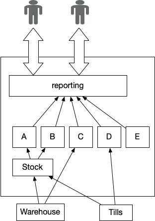

# 关键聚合器

整合来自不同业务部门的数据，为关键决策提供支持。

企业领导经常需要做出受整个企业各种活动影响的决策。例如，一家制造商要了解销售利润，可能需要有关原材料成本、生产设施运营成本、销售水平和价格的信息。按地区、市场或整个企业汇总的正确信息需要以易于理解的形式提供。

关键聚合器是一个软件组件，它知道要"访问"哪些系统来提取这些信息，要检查哪些文件/表格/API，如何将不同来源的信息联系起来，以及聚合这些数据所需的业务逻辑。它通过打印的表格、带有图表和表格的仪表盘，或输入用户电子表格的数据馈送，向业务领导者提供这些信息。

就其本质而言，这些报告涉及从业务的许多不同部分提取数据，例如财务数据、销售数据、客户数据等。在使用封装和**关注点分离**等良好实践的情况下，这不会造成任何特别的架构挑战。但是，当在传统系统（尤其是单体主机或数据仓库）之上实施这一要求时，我们经常会看到一些特殊的问题。

在传统系统中，这种模式的实现几乎总是利用能够直接进入子组件的优势来获取处理过程中所需的数据。这就形成了一种特别糟糕的耦合，因为上游系统会面临破坏入侵关键聚合器的风险，从而无法发展自己的数据结构。由于关键聚合器在支持业务及其领导者方面发挥着关键作用，因此这种故障的后果特别严重，而且显而易见。

## 如何工作

首先，我们要确定生成报告等输出结果需要哪些输入数据。通常，源数据已经存在于整体架构的各个组件中。然后，我们创建一个实现来"加载"源数据，并对其进行处理以创建输出。这里的关键是确保我们不会与源数据的结构产生紧密耦合，或破坏现有组件的封装以获取我们需要的数据。在数据库层面，这可以通过 ETL（提取、转换、加载）或服务层面的 API 来实现。值得注意的是，ETL 方法往往与源格式或目标格式相耦合；从长远来看，这可能会成为改变的障碍。

处理可以逐条记录进行，但对于更复杂的情况，可能需要中间状态，一旦中间数据准备就绪，就会触发下一步处理。因此，许多实施方案都使用管道（Pipeline）、一系列[管道和过滤器](https://www.amazon.com/Pattern-Oriented-Software-Architecture-System-Patterns/dp/0471958697)，其中一个步骤的输出将成为下一个步骤的输入。

数据的及时性是一个重要的考虑因素，我们需要确保在正确的时间使用源数据，例如在交易日结束后。这会在聚合器和源系统之间产生时间依赖性。

例如，在凌晨 3 点运行聚合器，但如果任何源系统出现延迟，聚合结果可能是基于过时或损坏的数据。另一种更稳健的方法是，一旦源数据准备就绪，源系统就会发送或发布源数据，而聚合器则会在所有数据可用时触发。在这种情况下，聚合结果会延迟，但至少应基于有效的输入数据。

我们还可以确保源数据带有时间戳，但这有赖于源系统已有正确的时间数据或易于更改，而传统系统可能不具备这种条件。如果有时间戳数据，我们就可以采用更先进的处理方法来确保结果的一致性和有效性，例如[版本值](https://github.com/MarsonShine/MS.Microservice/blob/master/docs/patterns-of-distributed-systems/Versioned-Value.md)。

## 何时使用它

当我们确实需要获得业务中许多不同部分或领域的整体视图时，通常需要将不同领域的数据关联到用于决策支持的汇总视图或指标集，这时就会使用这种模式。

## 遗留表现形式

鉴于过去网络带宽和 I/O 速度的限制，将数据处理与数据存储放在同一台机器上通常是合理的。大量数据存储和合理的访问时间往往需要专用硬件，这就导致了集中式数据存储解决方案的出现。这两股力量结合在一起，使得这种模式的许多传统实现方式与源数据结构紧密耦合，依赖于数据更新计划和时间，实现方式通常与数据存储在同一硬件上。

由此产生的[入侵式关键聚合器](critical-aggregator.md)将其根植于整个系统的许多不同部分，从而使其提取变得非常具有挑战性。概括地说，有两种方法可以将其移除。第一种方法是创建一个新的临界聚合器实施方案，可以通过["转移流"（Divert the Flow）](https://martinfowler.com/articles/patterns-legacy-displacement/divert-the-flow.html)结合其他模式（如["还原到源"（Revert to Source）](https://martinfowler.com/articles/patterns-legacy-displacement/revert-to-source.html)）来实现。另一种更常见的方法是保留聚合器，但在整个转移过程中使用诸如[传统模拟](https://martinfowler.com/articles/patterns-legacy-displacement/legacy-mimic.html)等技术来提供所需的数据。显然，最终需要一种新的实现方式。

## 入侵式关键聚合器面临的挑战

关键聚合器的大多数传统实施方案的特点是缺乏对源数据的封装，任何处理都直接依赖于各种源数据格式的结构和形式。此外，它们的处理代码和数据访问代码混杂在一起，无法很好地分离。大多数实施方案都是用批处理数据语言编写的。

这种反模式的特点是系统内的耦合度很高，特别是在实现过程中直接接触源数据而不进行任何封装。因此，源数据结构的任何变化都会立即影响处理和输出。解决这一问题的常见方法是冻结源数据格式，或对所有源数据添加变更控制流程。这种变更控制流程可能会变得非常复杂，尤其是在存在大量源数据和系统层次结构的情况下。

随着数据量的增加，[入侵式关键聚合器](critical-aggregator.md)的扩展能力也会变差，因为缺乏封装使得引入任何优化或并行处理都成问题，我们看到执行时间往往会随着数据量的增加而增加。由于处理机制和数据访问机制耦合在一起，这可能导致需要纵向扩展整个系统。这是一种非常昂贵的扩展处理方式，而在封装更好的系统中，这种方式可以由独立于任何数据存储的商品硬件来完成。

入侵式关键聚合器往往容易受到时间问题的影响。源数据的延迟更新可能会延迟聚合，或导致聚合在陈旧的数据上运行，鉴于聚合报告的关键性质，这可能会给企业带来严重问题。在处理过程中直接访问源数据意味着实施通常有一个定义的"安全时间窗口"，在这个窗口中，源数据必须是最新的，同时保持稳定和不变。这些时间窗口通常不是由系统强制执行的，而往往是在其他地方记录下来的约定。

随着处理持续时间的增长，这会给生成源数据的系统带来时间限制。如果我们有一个固定的最终输出准备时间，那么处理时间的任何增加都意味着源数据必须更早地更新和稳定。这些不同的时间限制使得纳入来自不同时区的数据成为问题，因为任何隔夜的"安全时间窗口"都可能开始与世界其他地方的正常工作时间重叠。时间和触发问题是这种模式下错误和 bug 的常见来源，诊断这些错误和 bug 极具挑战性。

由于处理和源数据访问之间的关注点没有很好地分离，因此修改和测试也具有挑战性。随着时间的推移，这些代码会不断增加，以纳入对错误的解决方法、源数据格式的更改以及任何新功能。我们通常会发现，由于这些挑战以及数据错误的业务风险，关键聚合器的大多数传统实施都处于"冻结"状态。由于紧密耦合，任何变化冻结都会扩散到源数据，从而扩散到相应的源系统。

我们还倾向于看到聚合器的"臃肿"输出，因为考虑到上述问题，扩展现有报告以添加新数据往往比创建一个全新的报告更简单。这就增加了实施的规模和复杂性，以及每份报告的业务关键性。这也会增加替换的难度，因为我们首先需要对聚合器输出的每种用途进行细分，以发现是否存在单独的用户群，这些用户群的需求可以通过更简单、更有针对性的输出来满足。

在 COBOL 和汇编语言中经常可以看到这种（反）模式的实现，这既说明了替换的难度，也说明了输出对企业的重要性。