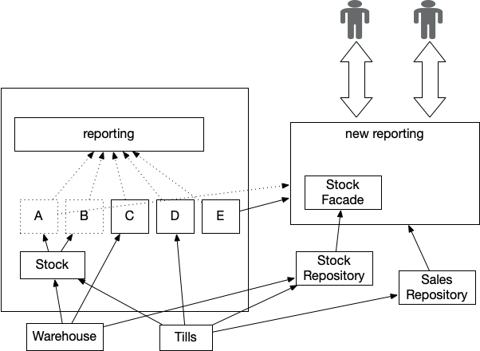

# 分流

首先将跨组织活动从传统活动中转移出来

[关键聚合器](critical-aggregator.md)是遗留系统的一个共同特征，顾名思义，它产生的信息对业务运行至关重要，因此不能中断。然而，在传统系统中，这种模式几乎总是演变为一种侵入性的高度耦合实施，实际上将自身和上游系统冻结在原地。

**分流（Divert the Flow）**是一项战略，它通过创建关键聚合器的新实施方案来启动传统数据转移计划，并尽可能与上游系统脱钩，因为上游系统是关键聚合器运行所需的数据来源。一旦这个新的实施方案到位，我们就可以禁用传统的实施方案，从而有更大的自由度来更改或重新定位各种上游数据源。

当我们拥有关键聚合器时，另一种替换方法是把它留到最后。我们可以替换上游系统，但需要使用[传统模拟系统](https://martinfowler.com/articles/patterns-legacy-displacement/legacy-mimic.html)来确保传统系统中的聚合器继续接收所需的数据。

无论采用哪种方案，都需要使用[过渡架构](https://martinfowler.com/articles/patterns-legacy-displacement/transitional-architecture.html)，在迁移过程中需要使用临时组件和集成，以支持聚合器保持原位，或将数据反馈到新实现中。

## 如何工作

转移数据流可以创建一种新的交叉能力，在本例中就是关键聚合器。起初，这种实现方式可能会从现有的传统系统中接收数据，例如使用[事件拦截模式](https://martinfowler.com/articles/patterns-legacy-displacement/event-interception.html)。另外，通过[还原到源（Revert to Source）](https://martinfowler.com/articles/patterns-legacy-displacement/event-interception.html)从源系统本身获取数据可能更简单、更有价值。在实践中，我们往往会看到这两种方法的结合。

当现有的上游系统和组件从传统系统中分离出来时，聚合器就会改变它所使用的数据源，从而随着时间的推移减少对传统系统的依赖。当源系统迁移到新的实施方案时，我们新的聚合器实施方案也可以利用各种机会来改进数据的格式、质量和及时性。

### 映射数据源

如果我们要提取并重新实施一个[关键聚合器](critical-aggregator.md)，我们首先需要了解它是如何与遗留资产的其他部分相联系的。这意味着要分析和了解用于聚合的数据的最终来源。这里需要记住的是，我们需要找到最终的上游系统。例如，我们可能会将大型机作为销售信息的真实来源，但数据本身可能源自店内的收银系统。

创建一个显示聚合器和上下游依赖关系的图表是关键所在。在这里，系统上下文图或类似图可以很好地发挥作用；我们必须确保准确了解哪些数据来自哪些系统，以及数据流动的频率。传统解决方案通常会成为数据瓶颈：来自（较新）源系统的其他有用数据往往会被丢弃，因为这些数据在传统解决方案中难以捕获或表示。有鉴于此，我们还需要捕捉哪些上游源数据被丢弃以及丢弃的位置。

### 用户需求

显然，我们需要了解最终用户是如何使用我们计划"转移"的功能的。对于"关键汇总"功能，我们通常会为每份报告或指标分配大量不同的用户。这是一个典型的例子，说明[功能奇偶性](https://martinfowler.com/articles/patterns-legacy-displacement/feature-parity.html)可能导致重建一套"臃肿"的报告，而这些报告实际上并不能满足当前用户的需求。简化的小型报告和仪表盘可能是更好的解决方案。

并行运行可能是必要的，以确保在初始实施过程中关键数字相匹配，从而让企业确信一切都能按预期运行。

### 如何捕获产生的输出

理想情况下，我们希望捕捉当前输出是如何产生的。一种方法是使用序列图来记录遗留系统中数据接收和处理的顺序，甚至只使用流程图。然而，试图完全捕捉现有的实施过程往往会带来越来越少的回报，发现关键知识已经丢失的情况并不罕见。在某些情况下，遗留代码可能是唯一能说明系统如何工作的 "文档"，而了解这一点可能非常困难或代价高昂。

笔者曾与一位客户合作，该客户使用从遗留系统中导出的数据和高度复杂的电子表格来执行关键的财务计算。该组织目前没有人知道它是如何工作的，幸运的是，我们联系到了一位刚刚退休的员工。不幸的是，当我们与他们交谈时，发现他们从十年前的一名员工那里继承了电子表格，但遗憾的是，这名员工已于几年前去世。对遗留的报告和（两次"版本迁移"的）excel 电子表格进行逆向工程，比回到最初的原则，从新定义计算应该做什么要费事得多。

虽然我们可能不会在替换的最终点上实现功能等同，但我们仍然需要关键的输出结果与传统的"一致"。以我们的聚合为例，我们现在可能能够为商店生成每小时的销售报告，但业务领导者仍然需要月末总计，而这些需要与任何现有数字相关联。我们需要与最终用户合作，为给定的测试输入创建预期输出的工作示例，这对于日后发现新旧系统中哪个是"正确的"至关重要。

### 交付和测试

我们发现这种模式非常适合采用迭代方法，即分片构建新功能。对于[关键聚合器](critical-aggregator.md)来说，这意味着依次交付每份报告，一直将它们交付到类似生产的环境中。然后，我们可以使用[并行运行](https://www.thoughtworks.com/radar/techniques/parallel-run-with-reconciliation)来监控已交付的报告，同时我们还可以让测试版用户提供早期反馈。

我们的经验是，许多遗留报告包含未被发现的问题和错误。这意味着新的输出结果很少（如果有的话）与现有的输出结果相匹配。如果我们不完全了解旧版本的实施情况，通常就很难了解造成不匹配的原因。一种缓解方法是使用自动测试来注入已知数据，并在整个实施阶段验证输出结果。理想情况下，我们会对新实施和传统实施都进行验证，这样我们就能比较同一组已知输入的输出结果。但在实践中，由于传统测试环境的可用性和注入数据的复杂性，我们通常只对新系统进行测试，这也是我们建议的最低要求。

在传统聚合中发现"系统外"的变通方法很常见，显然，在迁移工作中尝试追踪这些变通方法很重要。最常见的例子是，领导团队所需的报告实际上无法从遗留系统中获取，因此有人需要手动操作报告来创建他们所看到的实际输出结果--这通常需要花费数天时间。由于没有人愿意告诉领导层报表实际上无法使用，他们往往仍然不知道实际情况是这样的。

### 实时

一旦我们对新聚合器的功能感到满意，我们就可以将用户转向新的解决方案，这可以分阶段进行。这可能意味着为关键用户群实施报告，并行运行一段时间，最后让他们只使用新报告。

### 监控和警告

正确的自动监控和警报对于分流来说至关重要，尤其是当依赖关系仍在遗留系统中时。您需要监控更新是否按预期接收，是否在已知的良好范围内，以及最终结果是否在容许范围内。手动进行这种检查很快就会成为一项繁重的工作，并可能造成错误和延迟。一般来说，我们建议修复上游系统中发现的任何数据问题，因为我们希望避免在新解决方案中重新引入过去的变通方法。作为额外的安全措施，我们可以将并行运行保留一段时间，并有选择性地使用调节工具，在新旧实施开始相差太大时发出警报。

## 何时使用

当传统系统中的交叉功能反过来又与传统系统中的其他部分存在"上游"依赖关系时，这种模式就最有用了。[关键聚合器](critical-aggregator.md)就是最常见的例子。随着时间的推移，功能越来越多，这些实施不仅会变得对业务至关重要，而且会变得庞大而复杂。

处理这种情况的一种常用方法是将这些"聚合器"留到最后迁移，因为它们显然与原有系统的其他部分有着复杂的依赖关系。一旦我们开始提取上游组件，就需要用数据和事件对传统系统进行更新。这反过来又意味着，在我们迁移"聚合器"本身之前，这些新组件在某种程度上仍与传统数据结构和更新频率相关联。我们还有一大批（通常也是重要的）用户，他们在整体迁移工作接近尾声时才看到任何改进。

如果继续向传统聚合器提供数据的成本和复杂性很高，或者相应的业务流程变化意味着需要在迁移过程中修改和调整报告等，那么数据分流就特别有用。

提高数据更新频率和及时性通常是传统现代化项目的关键要求。在迁移项目的早期阶段，尤其是在我们可以应用[还原到源（Revert to Source）](https://martinfowler.com/articles/patterns-legacy-displacement/revert-to-source.html)的情况下，分流可提供对这些方面进行改进的机会。

### 数据仓库

在传统系统迁移过程中，我们经常会遇到"支持数据仓库"的要求，因为这是实际生成关键报告（或类似报告）的地方。如果发现数据仓库本身就是一个遗留系统，那么我们就可以将数据流从数据仓库"分流"到新的更好的解决方案中。

虽然可以让新系统向仓库提供完全相同的数据，但在实际操作中，我们需要小心谨慎，因为我们又一次将新系统与传统数据格式耦合在一起，随之而来的是妥协、变通，以及非常重要的更新频率。我们已经看到一些企业更换了大量的传统数据，但由于其 DHW 解决方案的依赖性和挑战性，这些企业仍然只能在过时的数据上运行业务。