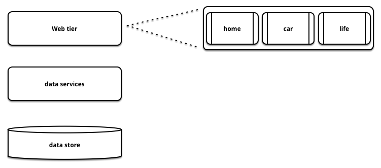
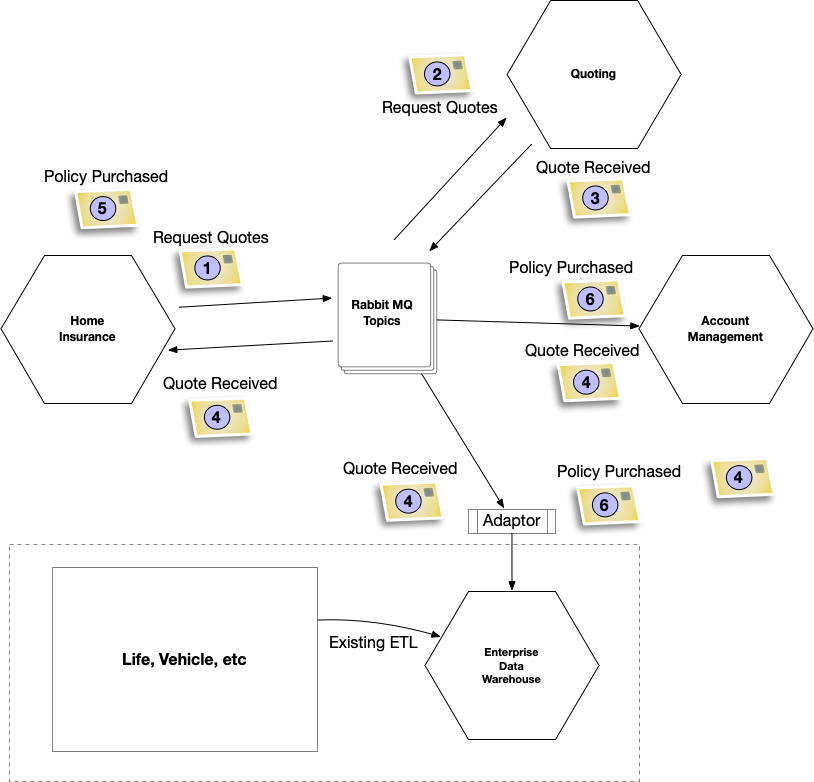

# 提取产品系列

*按产品系列识别和分离系统。*

许多应用程序都是为同一物理系统中的多个逻辑产品服务而构建的。这通常是出于重复使用的目的。"嗯，消费贷款和商业贷款看起来很相似"，或者"衣服是一种产品，量身定做的窗帘也是一种产品，它们能有多大区别呢？"。我们遇到的一个主要问题是，产品表面上看起来很相似，但在细节上却大相径庭。

随着时间的推移，服务于多种产品的单一系统可能会变得过于通用，代码会不断演进以处理所有可能产品的所有可能组合。例如，一个通用系统要处理 n 种产品，每种产品有 n 种变化，要检查所有可能的组合，必须进行 n 次阶乘的测试。这个数字很快就会变得很大。这也解释了为什么作者遇到的许多此类应用程序几乎没有自动测试覆盖范围，而是依赖于庞大的、通常是手动的回归套件。要测试这么多不同的代码路径是根本不可能的。

> **有条件的代码路径**
> 在零售银行领域的另一个例子中，静态分析让我们发现一个 Java 类中有 61 个嵌套的 if 语句。丹尼尔-特霍斯特-诺斯（Daniel Terhorst-North）由此得出结论：嵌套 if 语句的数量是不正确的，因为如果你有一个 if 语句，显然可以再添加一个，但如果你有 60 个 if 语句，你还能做什么呢？诚然，这个例子是一个病态的例子，但它确实说明了除非我们小心谨慎，否则服务于多种产品（这里指贷款）的单一代码库是如何演变的。

因此，问题往往出在经济方面。按产品开发和维护一个系统可能比开发和维护一个单一系统更具经济意义，这一点很难接受。通过按产品拆分，我们可以利用同时对多个产品进行修改这一事实，并通过避免可能在不需要的地方引入缺陷的修改组合爆炸来降低风险。

当然，这也是一种权衡--我们不希望红色裤子和黑色裤子有不同的应用程序，但我们可能希望有一个单独的应用程序来处理现成的裤子和量身定做的裤子，或者家庭保险和宠物保险。

正如[提取价值流](https://martinfowler.com/articles/patterns-legacy-displacement/extract-value-streams.html)中所述，不同的产品线拥有截然不同的价值流也是很常见的。

## 如何工作

**确定系统中的产品或产品线。**这将形成需要构建/迁移的薄片。确定现有系统提供的所有功能，并将其映射到新产品中。在识别能力、数据、流程、用户等时，我们往往会从不同的角度进行审视。

**识别共享功能。**确定不同产品线是否具有共享的业务能力。我们在"了解您的业务能力"一文中介绍了几种方法。我们的建议是重视使用而非重复使用，因此如果有疑问，应尽量限制共享能力的数量。

**选择先行者。**哪些产品线要先退出？我们喜欢的一种方法是从风险角度考虑问题。在了解迁移对业务造成的风险后，我们通常会选择*风险第二大的产品线*。这可能与直觉相反，我们应该首先选择风险最小的方案，但实际上，**我们喜欢确定一种产品，这种产品既能吸引企业的注意力，使他们优先考虑资金，又不会风险太大，一旦出现问题，企业就会倒闭。**

**确定目标软件架构。**我们很少建议大爆炸式的替换，在这种情况下，大爆炸式的替换意味着一次性构建所有产品的所有软件。相反，我们希望为步骤 1 中确定的薄片确定合适的架构。

**确定技术迁移策略。**正如我们在[技术迁移模式]()一节中所讨论的，根据当前的限制条件，可以部署多种不同的方案。如果是简单的网络应用，那么可以使用 ForkByUrl。在其他适合使用 ForkingOnIngress 的情况下，最好选择 MessageRouter 模式。请记住，过渡架构（TransitionalArchitecture）可能是必要的。

## 何时使用

您的系统有易于识别的产品线，您可以从这些产品线中获益：

1. 独立工作。将系统拆分成不同的产品意味着可以围绕单个产品组建团队，这样就能取得进展，而不会出现典型的变革协调问题，包括合并地狱和漫长的回归周期。

2. 具有不同非功能特性的产品。您希望能够为每个产品提供不同的 SLO（Service Level Objective）。例如，对给定延迟的不同负载要求。

3. 不同的变化率。一些产品线比较稳定，而另一些产品正在积极开发中。拆分系统意味着您不会冒稳定产品发生变化的风险。

   > 服务级别目标（Service Level Objective）。服务级别目标是指服务提供商与客户之间达成的一种协议，其中服务提供商承诺在一定时间内提供特定的服务水平。服务级别目标通常包括一些关键的性能指标，如延迟、可用性、吞吐量等，以及相应的目标值。

## 保险例子

在保险领域，不同的产品类型具有截然不同的特点。例如，车辆保险通常销量大但利润低，而房屋保险则恰恰相反。此外，它还具有很强的竞争性，因此快速做出改变的能力非常重要。如图 1 所示，与我们合作的一家保险公司开发了一个三层架构，作为该保险公司提供的所有不同产品（包括车辆、人寿、家庭和宠物保险）的报价引擎。

### 了解您想要实现的结果

该企业的产品负责人对变更的准备时间越来越长感到沮丧。他们决定让 Thoughtworks 对他们的架构和开发流程进行检查，看看我们是否能找出问题的症结所在。开发流程的价值流图确定了导致交付周期激增的一系列限制因素。虽然每个技术领域都与其他领域解耦，但不同的业务领域却紧密耦合在一起。这意味着为车辆产品增加一个新需求往往会影响到家居、生活等产品。在通常充满争议的部署之前，这些变更都需要经过深思熟虑和大量的回归测试。多产品架构还限制了能够在代码库上安全工作的人数，进一步减缓了工作进度。

最后，由于 Vehicle 产品线的容量要求和业务增长，底层数据存储必须经常扩展，这就要求系统托管的所有其他产品停机。

### 决定如何将问题分解成更小的部分

因此，该保险公司决定放弃以技术能力为中心的三层架构，转而采用以产品线为中心的架构。产品已经确定：车辆保险、家庭保险、人寿保险和宠物保险。一旦了解了这些产品，就确定了它们各自需要的不同能力，例如单独的问题集、报价和客户账户，以及更多的技术能力，如身份验证和授权。客户账户被确定为所有产品线都将使用的关键共享能力，这是采用 EA Magic Quadrant 中的协调方法的一个很好的例子，该方法在[唯一真相](https://martinfowler.com/articles/patterns-legacy-displacement/one-true-ring.html)中有更详细的描述。

接下来需要做的是确定从哪里开始。按公司收入排序，产品线依次为汽车、家庭、生活和宠物。而在客户数量方面，顺序则相反。因此，公司决定将家庭保险作为第一个单独实施的产品线。这样既能平衡业务出错的风险，又能获得足够的收入，因此选择非常重要。

### 成功交付部件

> 这幅图中有很多内容，但从本质上讲，它展示的是向客户销售保险所需的不同功能子集之间交互的一个非常高层次的视图。
>
> 1. 一旦客户填写了保险公司报价所需的各种问题并提交了表格（称为"风险"字段），家庭保险应用程序就会发布请求报价命令。
> 2. 订阅了 RabbitMQ 主题的报价引擎会接收 RequestQuote 命令并执行其任务（在幕后向合作伙伴、经纪人等发出大量内部和外部请求）。在该保险公司的案例中，它涉及使用各种协议向 40 多家其他保险公司发送各种类型的请求。老实说，如果有这方面的标准，整个过程就会简单很多！
> 3. 当收到下游系统的回复时，报价引擎会将 QuoteReceived 事件发送到另一个 RabbitMQ 主题上。
> 4. 接下来会发生一系列事情，因为除了家庭保险系统外，还有许多功能对已收到报价这一事实感兴趣。这些功能包括账户管理功能和企业数据仓库 (EDW,Enterprise Data Warehouse)。幸运的是，这些功能也订阅了正确的 Topic，可以在需要时接收这些事件。
> 5. 然后，客户可能会决定继续报价，实际购买一份保单，并点击购买。此时，"保单已购买"事件就会发布，家庭保险系统就会拍着胸脯说自己的工作做得很好。
> 6. 最后，对 PolicyPurchased 事件感兴趣的任何其他功能都会再次通过 RabbitMQ 接收该事件，并做自己的事情（在 EDW 的情况下，将其存储用于报告目的；在 Account Management 的情况下，客户可在稍后轻松检索该事件。
>
> 以这种方式使用已发布业务事件的一个好处是可以轻松更新数据仓库等依赖系统。在这种情况下，团队在 EDW 上创建了一个简单的适配器，将新世界中发生的事情转换成旧世界所需的星形模式。

上图显示了团队开始构建的事件驱动架构。与报价引擎和客户管理功能的通信是通过 RabbitMQ 消息总线上传递的事件进行的。这些事件也会传播到现有的企业数据仓库，用于报告目的。

当团队在现有系统的一侧建立新系统时，准备工作已经就绪，以切断从传统系统到新系统的流量。整体移动产品线的一个不利因素是，在客户切换之前，必须全面实施问题集。由于这一限制，新系统进入了测试阶段，某些客户可以选择使用测试版。这些客户也有机会对新系统的外观和感觉提出反馈意见。随着新系统的逐步完善和最终外观功能的添加，公司做出了停止使用的决定，并在几周内逐步将客户重新导向新系统。先是百分之一，然后是百分之五，再到百分之十等等。这让团队和企业对新系统的功能和非功能方面的预期表现越来越有信心。最后，新系统为家庭保险提供了百分之百的流量服务。随后，团队转向持续的产品开发。

### 改变组织结构，使迁移工作能够持续进行

第一次迁移成功后，注意力转向了下一个挑战，即使用同样的方法迁移车辆保险。

与此同时，整个技术组织逐渐从以项目为基础的开发方式转变为以产品为中心的开发方式。当然，这也有初期的问题。产品所有权是一项需要长期培养的技能，因此过渡是渐进的。他们还对传统的 IT 运营采用了同样的方法，并在首席技术官和首席架构师的指导下，对按需基础设施以及数据和分析采用了平台产品工程方法。