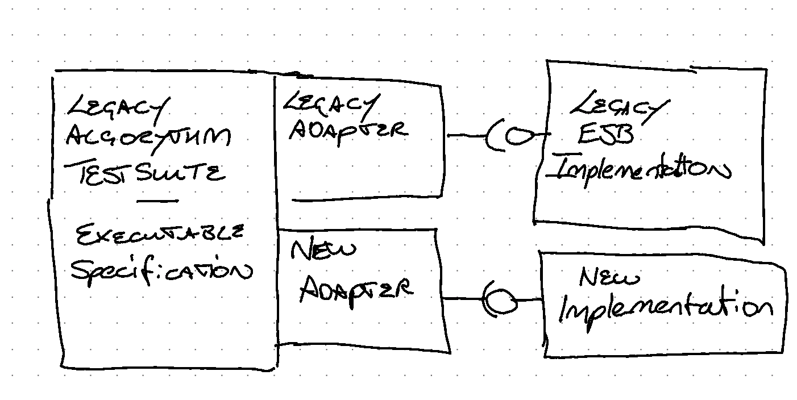

# 功能对等

*使用新的技术堆栈复制旧系统的现有功能。*

在许多情况下，当我们与 IT 管理人员交谈时，我们会听到他们是如何拥有一套老化的应用程序，这些应用程序使用的是即将报废甚至已经报废的技术。这些系统往往托管在昂贵的数据中心，由第三方管理，合同缺乏灵活性。这些应用程序对企业的成功运营至关重要，同时也是业务和运营风险的最大来源之一。

他们都非常清楚，现在有机会进行改进、优化流程并解锁新的机遇。然而，要完全做到这一点，将具有破坏性，并带来许多依赖性。例如，现有"BAU"工作的承诺、其他变革计划，尤其是最终用户所在部门的现有计划和预算。

在这种情况下，一种方法是通过"简单"地更换技术，同时保持其他一切"原样"，尽量减少更换对更广泛组织的影响。这种方法通常被尝试过的人称为"功能对等"（Feature Parity）或 "功能对等陷阱"（Feature Parity trap）。

虽然**功能对等**听起来似乎很有道理，但我们已经深刻认识到，人们大大低估了所需付出的努力，从而错误地判断了这一方法和其他替代方法之间的选择。例如，即使只是定义"原样"范围也会耗费大量精力，尤其是对于已成为业务核心的遗留系统而言。

随着时间的推移，大多数遗留系统都变得"臃肿"，许多功能都被用户闲置（根据 Standish Group 2014 年的一份报告，闲置率高达 50%），因为新功能不断增加，而旧功能却没有被移除。过去的错误和限制的解决方法已成为当前业务流程的 "必备"要求，用户的工作方式与其他任何东西一样，都是由遗留系统的限制所决定的。重新构建这些功能不仅是一种浪费，而且也错失了构建当前实际需要的功能的机会。这些系统往往是 10 年或 20 年前在前几代技术的限制下定义的，"原封不动"地复制它们很少有意义。

如果功能对等是一个真正的要求，那么这种模式就描述了如何才能做好。这不是一条简单的道路，也不能掉以轻心。

## 如何工作

功能对等是一个简单的概念。用更合适的技术栈构建一个新系统，其功能和行为与现有系统完全相同。每当有人问到新系统应该做什么时，我们的回答都是"做现有系统做的事情"。**我们需要充分了解现有系统的功能，并能够验证新系统是否也能做到这一点，这样才能知道我们的系统是否具有同等功能。**

### 范围是什么--旧系统做什么？

功能对等的第一部分是创建当前系统功能的规范。可能需要将以下内容结合起来：

#### 系统调查

##### 用户操作

用户角色是什么，他们能看到系统中的哪些功能（菜单项），能执行哪些操作。每个菜单项/操作--涉及哪些屏幕、哪些数据项、验证逻辑。用户执行操作后有哪些可观察到的结果？

##### 批处理

系统中定义了哪些批处理任务？何时触发，执行哪些处理，有哪些可观察到的结果？

##### 接口和集成

系统都集成了什么？

- 本系统向客户提供哪些接口，这些接口有哪些规约（API、CFR、行为预期/副作用）
- 该系统使用哪些接口，这些接口的规约是什么？
- 注意通过数据库集成的系统或系统的一部分（见报表/数据和考古学（Archeology））

##### 核心算法

需要复制已知的业务规则和计算 —— 由用户操作和批处理触发。

##### 报表/数据

系统以何种格式、根据哪些数据、何时以及多频繁地创建哪些报表？

数据库中的数据是如何变化的？是否有触发器更改数据，是什么触发了触发器，触发器触发了哪些程序？这个兔子洞有多深？

还有哪些系统可以访问或集成使用这些数据？它们以何种方式更改数据，这些更改有哪些可观察到的行为？

#### 考古

要完全理解一个系统的功能，往往需要考古。通过"考古过程"，你可以了解到，改变屏幕 A 上的数据字段 Y 会导致批处理作业 N 运行后报表 C 上出现值 Z。进行这种考古可能需要投入大量的时间，并需要那些对遗留系统最有经验的人投入大量的脑力。

#### 仪表化 - 基于数据，使用什么？

值得花些时间分析现有报告，如访问或其他系统日志，以了解当前系统的使用情况。如果没有这些报告，那么在现有系统的仪器化方面进行一些投资可能会带来很好的回报，因为它可以让你避免基于数据的不必要的工作。

#### 功能价值--我们能否放弃低价值的功能？

虽然我们在采用这种模式时尽量避免给业务带来负担，但与用户交流以了解哪些功能价值较低或未被使用，对管理范围很有帮助。不过，这将重新带来我们试图避免的组织影响/变化。

### 使用测试确保功能对等--新系统的功能与旧系统相同

了解旧系统的功能是第一个挑战，但我们还需要确保新系统确实以同样的方式运行。为了有把握地验证这一点，我们需要进行测试，以证明新系统确实具有功能均等性。以下是需要进行测试的领域列表。

#### 用户旅程和用户体验

使用验收测试——以检查您构建的功能是否按照用户的预期行为运作。但要小心不要完全依赖这些测试作为主要的验证方法，因为它们位于测试金字塔的较高层次。此外，要注意将系统分解为用户功能、屏幕和流程可能会导致这些类型的测试过多。

测试 UI 行为（包括客户端验证）相对简单：点击这里，期望看到某种状态，输入数据，点击那里，期望看到不同的状态。根据您选择的技术使用适当的工具——对于 SPA 应用程序，可以使用类似单元测试的框架，而对于更传统的服务器端渲染应用程序，则可以使用类似 Cypress 的工具。

在某些情况下很重要（例如在“专业用户优化”的UI中），布局（和外观/感觉）的测试可能较为困难，但有一些工具可以帮助（例如使用 Selenium 的 Galen）。

对于可用性和布局方面，您可能需要依赖探索性测试。

#### 业务逻辑——核心算法

对于核心算法和核心业务逻辑，确保您已经构建了一套围绕现有系统这些部分的单元测试。这些测试将提供业务逻辑/算法的可执行规范，已知它们在现有系统上运行正常。可以采用修改后的测试驱动开发（TDD）方法，将这些测试移植到新的技术栈中，从而对新实现具有高度的信心。在知道您正确移植了这些测试方面存在风险——可以使用变异测试来提供一些额外的保证——在旧的和新的实现中，类似的变异会导致类似的失败。

#### 接口 - 作为服务提供者和服务使用者

作为服务提供者：创建一个测试套件，针对即将被替换的现有系统执行这些测试，并形成可执行的契约。然后，再将相同的测试用例用于新的替代系统，检查是否遵循契约。要注意避免这些测试范围变得过大，特别是在涉及UI的情况下。

作为服务使用者：使用测试模拟来验证您与提供的服务进行交互的方式是否符合预期。就像对于核心业务逻辑的情况一样，将这些模拟迁移到新的技术栈中，以确保新的实现继续以相同的方式与提供的系统交互。此外，使用外部系统的存根来为新的测试提供已知的数据集。

在这两种情况下：代理是一种有用的工具，用于确保功能/交互的一致性。通过将代理注入通信路径，可以记录与旧系统的交互。您可以使用这些记录来：

1. 回放来自客户的消息 - 并检查新系统的响应。
2. 创建可回放已知良好响应的存根。

数据库和报表：这可能会非常困难 - 就像 UI 测试一样，要注意测试金字塔的顶部。在这里，数据库/报表是另一种类型的接口。成功地测试它们将需要大量的测试数据 - 通常很难创建和管理。

### 实施和跟踪进度

通过完成系统调查以定义范围，并建立全面的测试套件来提供可执行的行为规范，您可以相对自信地进行实施。但是如何跟踪进度呢？

#### 按菜单项/用户操作

（或者在调查系统时确定的其他部分）这可能是危险的，因为有可能您正在跟踪的内容可能会按层（或架构关注点）进行切割。按架构层切片严重影响价值的交付，并降低了进度的可见性。（即直到一个功能从头到尾交付完成，才能解锁价值并取得真正的进展）。

这里的一个关键假设是，菜单项或操作本身能为最终用户带来价值。不幸的是，这通常并非如此，我们可能会完成 80% 的单个流程步骤，但仍然无法在新系统中完成整个业务流程。这是一种不幸的常见情况，高度完成度被报告，但无法测试或发布可用的软件。

#### 纵向切片

提供了更好的进度透明度，但纵向切片可能不是系统调查的输出结果。因此，需要进行映射工作，这意味着更多的工作量，并可能存在需求遗漏的风险。

#### 端到端流程

基于将单个业务流程完全迁移到新解决方案来跟踪进度，因此测试变为：是否可以在替代系统内完整地完成一个流程。这可以与上述的按用户操作跟踪结合使用，但前提是要确保交付单个流程步骤的工作是由“拥有”业务流程优先考虑的。

作者倾向于确保任何工作完成的定义（如果可能）包括所有层面上的完整端到端范围。

## 何时使用

我们以上阐述了如何很好地应用这种模式，并增加成功的机会。如果目标是功能的平衡性，那么需要大量的工作来确定在功能方面需要什么，并且通过测试来确保达到了功能平衡的目标。

总体而言，我们并不推荐使用这种模式。事实上，Thoughtworks 公司甚至将这种模式列为技术雷达中暂时搁置的项目。我们认为这种模式错失了良机。通常，旧系统会随着时间的推移变得臃肿，其中许多功能并未被用户使用（根据 2014 年 Standish Group 报告，高达 50%），而业务流程也随着时间的推移而演变。替换这些功能是一种浪费。相反，试着退一步，了解用户当前的需求，并根据业务成果和衡量标准确定这些需求的优先次序。

然而，我们也看到了一些特定情况下这种模式特别适用的情况。

1. 面向高级用户的高度优化用户界面是重现“一模一样”的好选择。考虑使用快捷键高速执行交易的代理。为了有效地完成工作，他们可能需要经过高度优化的用户界面，仅使用键盘操作。这可能需要大量时间来熟练掌握，不能容忍导致效率降低的更改。
2. 基于已知规范的行为：应用这种模式的另一个示例用例可能是支持工程或科学建模的系统。以有限元分析求解器为例，给定的输入应产生给定的输出--物理定律在现代化项目中不会改变。

可以说在这两种情况下，对功能对等性的需求在某种程度上是局部的 - 我的意思是局限于系统的某个特定部分。值得商榷的是，现代化整个系统范围的方法是否应受到这些局部用例的限制。

但是，尽管这些案例是合理的，但仍然是例外情况。绝大多数情况下，我们看到功能对等性的尝试都是一个令人沮丧的故事。正确理解现有功能所需的成本和精力如雨后春笋般涌现，导致边边角角会出现缺陷，尽管其中有些是应该削减的闲置功能，但通常一些重要功能也会被砍掉。如果一切顺利，企业支付了一大笔钱，却没有改善对业务的支持。当企业知道他们的未来取决于更好的技术参与时，这就不是一个好故事了。

### 替代方法

- [提取产品线](extract-product-lines.md)或提取价值流都是通过现有系统识别薄片的策略的模式。其中一个主要区别在于它们都提供了缩短反馈周期的方法，同时允许尽早禁用和关闭遗留元素。
- 审视[业务价值](https://martinfowler.com/bliki/value-architectural-attribute.html)并确保其在任何架构决策中得到体现，往往能凸显功能对等驱动方法的问题。
- 通过将技术和业务流程视为同一问题的一部分，更”全面“的方法有助于突出功能对等的问题。特别是在功能对等的情况下，这通常可以突出当前业务流程是传统技术所要求的变通和妥协的结果。如果只是更换技术，至少有一半的问题得不到解决。
- 用户研究有助于突出现有业务流程已不再适用的问题。在一个案例中，只需对现有员工进行几天的跟踪调查，就能清楚地发现，由于当前流程非常残缺，因此不适合采用功能对等。

## 示例：迁移物流系统

一家物流公司计划更换用于包裹验收、路线规划和交付的老旧软件。作为这项计划的一部分，他们同意了一项由信息技术部门主导的计划，但业务利益相关者的参与度相对较低。技术部门认为，他们只需实现"功能对等"就能解决更换过时技术的迫切需求。作为该计划的一部分，一项重要工作是更换接受客户套餐的系统。我们在这部分计划接近尾声时参与其中。

我们认为，与企业利益相关者的接触较少会给项目带来风险，尤其是我们通过另一个项目了解到，企业对开发工作感到沮丧。为此，我们与包括财务团队在内的主要利益相关者进行了沟通。这时我们才意识到，已经进行的审查表明，只有相对较小比例的客户能够为公司带来利润。反过来，这也意味着只有一小部分“套餐类型”是有利可图的，许多套餐由于特殊的处理要求而使企业蒙受损失。因此，企业制定了停止处理这些包裹的计划。

事实证明，”功能对等“项目中的大量工作正是用来处理这些软件包的，而这些软件包正是企业表示不再需要的。企业原本希望，如果没有这些困难的边缘情况，流程和软件都会简单得多。在这种情况下，“功能对等”导致大量的时间和金钱被用于处理企业不再需要的需求，同时进一步损害了 IT 在企业心目中的声誉。

## 示例：电子商务组织重新构建平台

该公司曾经历过一段快速发展时期，但数年来一直没有优先考虑 IT 支出，这就造成了相对紧迫的更换当前解决方案中许多元素的需求。例如，在某些时期，他们不得不放缓销售数量，以避免核心系统不堪重负，这从业务角度来看并不理想。

许多关键业务操作都是由同一台主机处理的，这台主机最初是在电子商务运营初期投入使用的。从该系统中提取元素显然在技术上具有挑战性。与此同时，企业领导者在经历了几个具有破坏性的失败项目后，希望尽可能减少对员工的进一步干扰。另一个挑战是，如果采用循序渐进的方法，当前的流程和系统很难确定产品线迁移的优先次序。简而言之，他们很难了解哪些销售产品赚钱，哪些不赚钱，因此他们认为唯一的选择就是一次性迁移所有产品。基于这些挑战，人们认为复制现有的东西是最好、风险最低的方法。

从表面上看，当前的业务流程都是在同一台主机上实施的，这就意味着任何“功能对等”替换的范围实质上都是整个业务的所有主要活动和流程。他们开始着手为替换系统记录“范围内”的现有流程，并计划将其作为供应商选择过程的输入。

有几件事很快就变得清晰起来。其一是，几乎所有的业务活动都必须记录在案，每次记录“现状”功能时，都会发现有更多的东西需要记录在案，以实现 "功能对等"。其次，由于历史上的变通方法、多年来不断变化的需求以及许多未解决的错误，使用传统系统的实际工作人员最不想要的就是同样的东西。这几乎总是增加了他们的工作难度，也是造成错误和延误的主要原因。最后，由于错误和变通方法的存在，很明显有几个关键流程实际上是在手工制作的电子表格上“脱离系统”运行的。关键业务数据从主机中提取，通过电子表格运行业务流程，然后将修改后的数据上传回主机。

在这一点上，有些人认为“功能对等”的风险太大，范围不断扩大。此时，需求收集工作尚未完成，也没有明确的结束日期。在这一阶段，我们停止了参与，因为我们认为继续采用“功能对等”的做法风险太大，而且无法满足业务需求，尤其是由于缺乏关键业务指标，因此不可能对更多的渐进方法进行优先排序。几年后，他们仍在按照“原样”进行需求流程，远远超过了原定期限。

缺乏正确的衡量标准和从业务角度确定功能要素优先级的能力，往往会迫使企业采用“功能对等”的方法。在这种情况下，我们认为，如果能初步收集各产品线的关键业务指标，就有可能提出解决问题的方法。这很好地说明了没有正确的业务背景和参与，就无法做出正确的技术决策。

## 示例：成功替换财务计算服务

我们的一个团队为一家大型金融组织工作。他们希望对一个执行复杂财务计算的现有服务进行现代化改造。财务计算的规范是固定的，服务的界面也是类似的，只是技术需要更新--从 J2EE 会话 EJB 实现到最新（当时）Java 版本的 SOAP Web 服务。

团队围绕现有实现创建了一个丰富的测试套件，并将设置、执行和断言责任明确分开。

一旦测试到位，就可以在风险最小的情况下更换执行适配器，并创建一个与旧系统具有相同可执行规格的新执行系统。