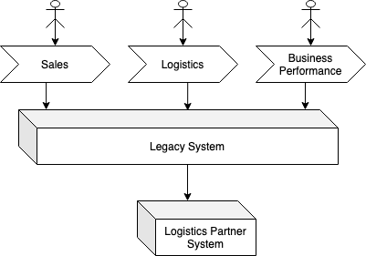
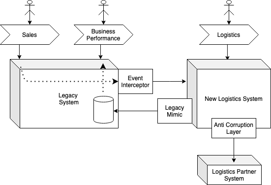
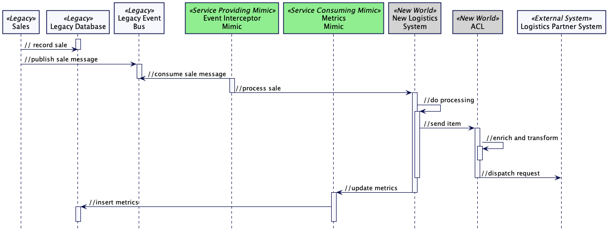

# 传统模拟

*新系统与旧系统交互时，旧系统不会察觉到任何变化。*

在用新系统逐步取代旧系统时，不可能将新系统与旧系统完全隔离。[过渡架构](https://martinfowler.com/articles/patterns-legacy-displacement/transitional-architecture.html)要求新系统提供数据（或其他交互）以“维持运转”。

在这种情况下，新系统必须满足某些现有的（通常是隐含的）契约，因此新系统必须成为传统系统的模仿者。

## 如何工作

通过探索遗留系统的技术架构和目标架构愿景，以及了解现有和未来的业务流程，可以发现和利用缝隙，从而将问题分解成多个部分。

传统模拟模式是这些缝隙的推动者，它为不同的排序方法创建了选项，并隐含着不同的排序方法。

Legacy Mimic 模式通常从 Eric Evans 的《领域驱动设计》一书中实现反腐层模式。与反腐层的目的相同，Legacy Mimic 模式的作用是：减少复杂性、提高透明度和问责制，防止腐败。通过在遗留系统和现代化系统之间创建一个新的抽象层，Legacy Mimic 模式可以实现这些目标，从而减少复杂性并提高透明度和问责制。新层还可以用于防止腐败，通过在传递给遗留系统和现代化系统的数据上强制执行规则和约束来实现。

> 创建一个隔离层，根据客户自己的领域模型为客户提供功能。该层通过现有接口与另一个系统对话，几乎不需要修改另一个系统。在内部，该层根据需要在两个模型之间进行双向转换。

与[反腐层](https://martinfowler.com/bliki/DomainDrivenDesign.html)类似，传统模仿的实现通常也会使用服务、适配器、转换器和界面。

我们常见的模仿至少有两种类型，从提供或消费服务的角度来解释最容易理解。

**模拟提供服务**将在传统接口后封装新的实现。传统组件可以使用传统接口与之交互，而不知道它们正在与新的实现进行协作。

**模拟服务消耗**将使用现有的传统接口与尚未被替换的传统系统进行协作。同样，这种交互对旧系统也是透明的。

## 何时使用

为了进一步说明这些不同类型的模仿，本图展示了一个支持销售、物流和业务绩效 3 个业务流程的单体遗留系统。

目前正在考虑的一个方案是将[“提取价值流”](extract-value-streams.md)用于物流能力。这样做可能会产生一种过渡架构，如：

为了让新的物流系统能够处理销售执行，建议采用[事件拦截技术](event-interception.md)。在本示例中，事件拦截器是提供服务的模仿器的一个示例--它符合传统接口（消费传统事件）。

为了使业务绩效流程继续运行，建议再次使用传统模仿模式，但这次是作为服务消费模仿器。它将把所需的物流指标复制到传统报告数据库中（符合传统数据库的模式和语义）。

这两个组件都不会在系统的目标架构中持续存在--它们是过渡性的。

现有的后勤合作伙伴系统（Logistics Partner System）仍必须与之集成，因此新的后勤系统使用了反腐败层。由于该层将持续存在，因此不被视为模仿（或过渡），但创建反腐败层的目的是使新物流系统的领域模型不会受到外部系统所使用模型的影响。

