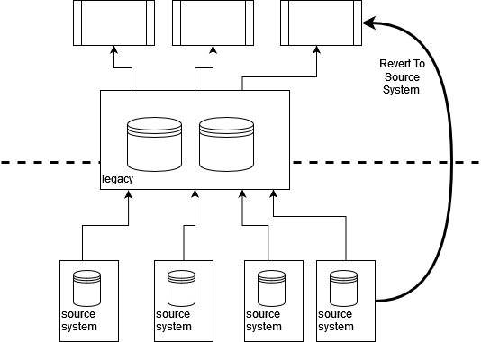

# 复源

*确定数据的原始来源并集成到该来源*

在许多组织中，一旦完成了将新系统集成到大型主机的工作，那么通过大型主机与该系统进行交互就变得容易得多，而不必每次都重复集成。对于许多采用单体架构的传统系统来说，这样做是有道理的，多次将同一系统集成到同一单体中不仅会造成浪费，而且很可能会引起混乱。随着时间的推移，其他系统开始进入遗留系统获取这些数据，而最初的集成系统往往被“遗忘”。

这通常会导致遗留系统成为多个系统的单一集成点，从而也成为任何需要该数据的业务流程的关键上游数据源。将这种方法重复几次，再加上我们经常看到的与传统数据表示的紧密耦合，例如在[入侵式关键聚合器](critical-aggregator.md)中，那么这就会给传统数据的转移带来巨大的挑战。

通过追溯“超越”传统资产的数据源和集成点，我们通常可以 “还原到源”，从而实现传统资产的迁移。这可以让我们在早期就减少对传统数据的依赖，并提供一个提高数据质量和及时性的机会，因为我们可以将更多的现代集成技术投入使用。

## 如何工作

作为遗留数据迁移工作的一部分，我们需要追踪关键数据流的源头和汇入点。我们可能不需要同时对所有系统和数据进行追踪，这取决于我们如何对整个问题进行切分。

我们的目标是绘制某种类型的数据流图。实际使用的格式并不那么重要，关键是这种发现不仅仅停留在遗留系统上，而是要深入挖掘底层集成点。我们在与客户合作时看到过很多架构图，但令人惊讶的是，这些架构图似乎常常忽略了遗留系统背后的东西。

有几种通过系统追踪数据的技术。大体上，我们可以把它们看作是对上游或下游路径的追踪。虽然数据通常既流向底层源系统，也从底层源系统流出，但我们发现企业往往只考虑数据源。也许从遗留系统的角度来看，这是任何集成中最明显的部分？我们经常发现，从遗留系统返回源系统的数据流是任何集成中最缺乏理解和记录的部分。

对于上游系统，我们通常会从业务流程入手，然后尝试追踪数据流到遗留系统，再通过遗留系统返回。这可能具有挑战性，尤其是在使用多种不同集成技术组合的旧系统中。一种有用的技术是使用 [CRC 卡](https://en.wikipedia.org/wiki/Class-responsibility-collaboration_card)，目的是为关键业务流程步骤创建数据流图和序列图。**无论我们使用哪种技术，让合适的人参与进来都是至关重要的，理想的情况是让那些最初在遗留系统上工作的人参与进来，但更常见的情况是让那些现在为遗留系统提供支持的人参与进来。如果这些人不在，并且已经失去了有关如何工作的知识，那么从源头开始并向下游发展可能更合适。**

向下游追踪集成也是非常有用的，但根据我们的经验，这往往会被忽视，部分原因是如果[功能对等性](feature-parity.md)在起作用，那么关注点往往只在现有的业务流程上。在向下游追踪时，我们从底层集成点开始，然后尝试追踪到它所支持的关键业务能力和流程。这与地质学家在河流可能的源头引入染料，然后观察染料最终会出现在下游的哪些溪流和支流中并无二致。当我们缺乏有关遗留集成和相应系统的知识时，这种方法尤其有用；当我们创建新的组件或业务流程时，这种方法尤其有用。在追踪下游时，我们可能会发现这些数据在哪里发挥作用，而不需要先知道它的确切路径，在这种情况下，您可能会希望将其与原始源数据进行比较，以验证沿途是否有改动。

了解数据流后，我们就可以查看是否有可能在源数据中截取或创建数据副本，然后将其传输到我们的新解决方案中。这样，我们就可以创建一些新的集成来允许我们的新组件还原到源数据，而不是集成到传统数据中。我们确实需要确保同时考虑到上游和下游数据流，但正如下面的示例所示，这些数据流并不一定要一起实施。

如果无法实现新的集成，我们可以使用[事件拦截](event-interception.md)或类似方法来创建数据流副本，并将其路由到我们的新组件，我们希望尽可能地在上游这样做，以减少对现有传统行为的依赖。

## 何时使用

**当我们要提取依赖于数据的特定业务能力或流程时，“还原到源 ”是最有用的方法，而这些数据最终来源于“隐藏在”遗留系统背后的集成点**。这种方法最适用于数据在系统中基本上没有被修改，或者在被使用之前没有经过太多处理或增强的情况下。虽然这听起来不太可能，但在实践中，我们发现很多情况下，传统系统只是充当了集成中心的角色。在这种情况下，我们发现数据发生的主要变化是**数据丢失**和**数据时效性**降低。数据丢失，因为字段和元素通常会被过滤掉，原因很简单，因为在遗留系统中无法表示这些字段和元素，或者因为进行必要的更改成本太高、风险太大。时效性降低，因为许多传统系统使用批处理工作来导入数据，而且正如[关键聚合器](critical-aggregator.md)中所讨论的，“安全数据更新周期”通常是预先定义的，几乎不可能更改。

我们可以将“还原到源”与“并行运行”和“对账”结合起来，以验证遗留系统中的数据没有发生其他变化。这在一般情况下是一种合理的方法，但在数据通过不同路径流向不同终点，但最终必须产生相同结果的情况下尤其有用。

使用“还原为源数据”也有很强的商业理由，因为通常可以获得更丰富、更及时的数据。源系统经过多次升级或更改后，这些更改实际上仍然隐藏在传统系统中，这种情况很常见。我们看到过多个例子，数据的改进实际上是这些升级的核心理由，但由于无法通过传统路径提供更频繁、更丰富的更新，因此这些好处从未完全实现。

我们还可以在存在基础集成点的双向数据流中使用这种模式，但需要更加谨慎。任何最终要传回源系统的更新都必须首先通过遗留系统流动，这可能会触发或更新其他进程。幸运的是，我们可以将上游和下游流分开。例如，向源系统回传的更改可以继续通过遗留系统流动，而我们可以直接从源头获取更新。

重要的是要注意源系统中可能存在的任何跨功能要求和限制，我们不想让该系统超负荷工作，或者发现该系统无法直接提供所需的数据。

## 零售店实例

对于一家零售业客户，我们能够利用“还原到源”技术提取新的组件，并改进现有的业务能力。该客户拥有大量的商店和一个新近创建的网上购物网站。最初，新网站从原有系统中获取所有库存信息，而这些数据又来自仓库库存跟踪系统和商店本身。

这些整合是通过晚上批处理工作完成的。对于仓库来说，这样做很好，因为库存每天只离开仓库一次，所以企业可以确保每天早上收到的批量更新信息在大约 18 小时内有效。对于商店来说，这就产生了一个问题，因为存货显然可以在整个工作日的任何时候离开商店。

鉴于这种限制，网站只提供仓库中的待售存货。网站的分析结果与次日收到的商店库存数据相结合，清楚地表明销售额因此而损失：商店全天都有所需库存，但由于传统集成的批量性质，无法利用这一点。

在这种情况下，我们创建了一个新的库存组件，最初只供网站使用，但目标是成为整个组织的新记录系统。该组件直接与店内收银系统集成，而店内收银系统完全能够在销售发生时提供近乎实时的更新。事实上，为了支持电子支付，该公司已经投资建设了一个连接其门店的高度可靠的网络，该网络有足够的备用容量。仓库库存水平最初是从传统系统中提取的，其长期目标是在稍后阶段将其还原为源代码。

最终的结果是，网站可以安全地提供店内库存，供店内预订和在线销售，同时还有一个新的库存组件，提供更丰富、更及时的库存变动数据。通过恢复新库存组件的源代码，该组织还意识到他们可以获得更及时的销售数据，而这些数据当时也只能通过批处理更新到传统数据中。产品线和价格等参考数据继续通过主机流向店内系统，由于这些数据变化频率很低，因此完全可以接受。