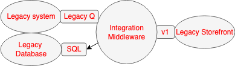

# 过渡性架构

*为便于取代遗留系统而安装的软件元素，我们打算在取代完成后将其移除。*

成功替换老系统的核心是用新软件逐步替换老系统，因为这样既能尽早实现效益，又能规避大爆炸的风险。在替换过程中，老系统和新系统必须同时运行，以便在新旧系统之间进行分工。此外，新老系统之间的分工也会随着旧系统的凋零而定期发生变化。

为了实现新老系统之间的相互影响，我们需要建立和发展过渡架构，以支持这种随时间变化的协作。中间配置可能需要在新系统的目标架构中进行集成。

或者更直接地说--你将不得不投资于那些将被丢弃的工作。

## 如何工作

假设我们正在进行一栋建筑物的翻新。建筑师已经向我们展示了装修后的成品，建筑工人也准备好开始工作了。但是第一步是将脚手架放在建筑物的现场。

雇佣脚手架本身并支付团队来建造它是不可避免的投资。它需要能够完成关键的工作，并在翻新期间增加工人的安全风险降低。它甚至可以解锁新的可能性 - 在更换屋顶的同时修复烟囱或处理悬挂的树木(再稍微扩展一下比喻)。一旦工作完成，另一支队伍就会到达并拆除脚手架，我们很高兴看到它走了。

在老系统迁移的情况下，这个脚手架由软件组件组成，这些组件有助于或使当前进化步骤朝着目标架构建立起来。就像脚手架一样，这些软件组件在达到目标架构后就不再需要，必须被移除。

一次性替换大型遗留单体是危险的，我们可以通过分阶段替换来提高业务安全性。我们可以通过使用[提取价值流](extract-value-streams.md)和[提取产品线](extract-product-lines.md)等模式来实现这一点。为了做到这一点，我们需要将单体分解成多个部分，这就需要在单体中引入**接缝**将其分开。引入接缝以将单体分成多个部分的组件称为过渡性架构，因为它们一旦被移除就必然会消失，而且对于单体履行其现有职责来说也不是必需的。

> 接缝是在建筑学领域的术语，指物体接合处的缝隙，接缝就是将多个部件导致的缝隙链接起来。

我们可以通过查看单体的各个部分如何相互通信来引入接缝，并在其中放置一个修改通信路径以将流量引向其他元素的组件。[事件拦](event-interception.md)截通过事件通信来实现这一点，而[分支抽象](https://martinfowler.com/articles/patterns-legacy-displacement/event-interception.html)通过 API 实现这一点。当我们创建这些接缝时，我们可以引入[传统模拟](legacy-mimic.md)来引入新的组件到遗留通信流程中。

与遗留系统直接访问数据的挑战是最大的问题之一。如果可能的话，通过采用[仓库模式](https://martinfowler.com/eaaCatalog/repository.html)来替换直接的数据访问是明智的做法。但当我们无法这样做时，我们需要复制系统的状况。[传统模拟](legacy-mimic.md)和[事件拦截](event-interception.md)在这种情况下都是有用的。

下表是过渡性架构所使用的通用模式：

| use                                           | patterns                                                     |
| :-------------------------------------------- | :----------------------------------------------------------- |
| 创建接缝                                      | [事件过滤](event-interception.md) [传统模拟](legacy-mimic.md) [分支抽象](https://martinfowler.com/bliki/BranchByAbstraction.html) [仓储](https://martinfowler.com/eaaCatalog/repository.html) [防腐层](https://martinfowler.com/bliki/DomainDrivenDesign.html) |
| 复制状态: new ➔ old ("Keeping the lights on") | [传统模拟](legacy-mimic.md) (服务消费模拟)                   |
| 复制状态: state: old ➔ new                    | [传统模拟](legacy-mimic.hmd) (服务提供端模拟) [事件过滤](event-interception.md) |

即使有了明确的目标架构，也有很多途径可以到达目的地。团队可以采取的每种不同路径都可以通过不同的过渡架构来实现，或者需要建立不同的过渡架构。在这种情况下，我们需要对每种路径进行成本/效益分析，分析要足够详细，以便了解它是否会对选择产生影响。

请记住，使用过渡架构的一部分就是在不再需要时将其移除。因此，在构建过渡架构时不妨多花点心思，增加一些可承受性，以便日后更容易地将其移除。同样，我们也需要确保将其适当移除--不必要的组件即使未被使用，也会使未来团队维护和发展系统的工作变得复杂。

## 何时使用

没有人喜欢浪费辛勤的劳动成果，当我们说到要建造一些我们打算扔掉的东西时，这种情绪自然而然就会产生。我们很容易得出这样的结论：一次性的东西没有什么价值。但是，过渡架构在几个方面提供了价值，而且这种价值应该与建造它的成本相比较。

第一个价值是，它通常能提高向业务交付功能的速度。这里有一个方便的比喻，就是在粉刷墙壁时，用油漆工胶带粘住饰边。如果不在饰线上贴胶带，就必须小心翼翼地在饰线附近慢慢粉刷。为了避免把油漆涂在错误的地方，需要提高速度（降低技能），这就弥补了之前贴胶带和之后撕胶带的成本。

软件中的这种权衡因时间价值的重要性而被放大。如果企业需要一个新的面板，将被取代的旧系统中的现有数据与新系统中的数据整合在这个面板中，那么在新面板中建立一个网关，将旧系统中的数据读取并转换成面板所需的格式，就能更快地实现这一目标。一旦旧系统被移除，这个网关就会被丢弃，但在替换发生前的一段时间内，集成面板的价值可能远远超过创建它的成本。如果比较结果接近，我们还应该考虑传统系统被替代的时间比预期长的可能性。

过渡架构的第二个价值在于它如何降低传统替代的风险。在客户管理系统中添加[事件拦截](event-interception.md)功能需要一定的构建成本，但一旦构建完成，就可以逐步迁移客户（如使用[提取产品线](extract-product-lines.md)或[提取价值流](extract-value-streams.md)）。迁移客户子集可降低迁移过程中出现严重问题的几率，并可减少出现问题时的影响。此外，如果出现真正严重的问题，事件拦截也能轻松恢复到以前的状态。

通常情况下，团队在进行遗留迁移时应始终考虑过渡架构，并集思广益，以不同的方式构建一些临时软件来实现这些优势。然后，团队应根据构建这种短期软件的成本，评估增加价值实现时间和降低风险所带来的好处。我们认为，很多人会对临时软件的成本回报率之高感到惊讶。

## 示例：架构评估

本节探讨概览文章中介绍的中间件移除示例，并介绍过渡架构如何实现系统的安全演进。

### 遗留配置

如概述中所述，现有架构包括负责定价并通过一些集成中间件将产品发布到传统店面。该中间件从传统队列中消费产品发布事件，并处理如何在店面展示产品的长期协调工作。产品售出后，传统店面会调用中间件，在底层共享传统数据库中更新产品状态。传统中间件还将其内部状态存储在传统数据库中，并通过数据仓库反馈到关键报告中。请参见[关键聚合器](critical-aggregator.md)。

### 目标架构

在目标架构中，传统店面（Legacy Storefront）仍将保留，但其部分职责将转移到新的店面管理器组件（Storefront Manager component）中。当产品被路由到该渠道进行销售时，店面管理器将消费资产处置路由器（Asset Disposal Router）产生的业务事件，并使用新的应用程序接口将产品发布到店面。店面管理器将负责产品在店面中的显示方式。当产品售出时，传统店面会使用新的 API 调用店面管理器，然后发出一个业务事件，由下游的资产销售处理组件处理。

### 引入店面管理器

下一步是添加新的店面管理器。这里还添加了过渡架构，它有两个完全不同的目的。一是将新组件与传统组件（如数据结构和信息）隔离，二是保持传统组件的正常运行。为了实现隔离（反中断层），我们创建了一个事件转换器，用于将事件路由器路由的传统信息转换为新的简洁业务事件格式，供店面管理器使用，并在目标架构中保持不变。店面管理器和传统店面将通过新的应用程序接口（API）进行协作，因此添加了这一功能以及内部事件拦截功能，这样当产品售出时，传统店面将 ”回调“到发布该产品的系统。为了保证正常运行，需要使用两个过渡架构。首先，当产品售出时，会发布新的业务事件。这些事件由临时的传统数据库适配器处理，该适配器模仿集成中间件，用销售信息更新传统数据库。其次，创建 MI 数据模拟器。这既是一个事件拦截器，也是一个传统模拟器--它拦截新应用程序接口中的事件，并用关键业务报告所需的“状态”信息更新传统数据库。

### 业务成果 - 消除传统中间件

传统系统仍负责确定哪些资产可以出售，并发送产品以供发布，但随着时间的推移，路由到新组件的产品数量不断增加（见提取产品线），直到 100% 的流量处理都不依赖传统中间件。至此，传统中间件就可以停用了，新的店面管理器和过渡架构组件就可以投入生产。

### 引入资源处置路由器

一段时间后，新的“资产处置路由器”部分投入使用。(请注意，本示例略有简化，是从一个规模更大的“遗产置换”项目的经验中总结出来的）。该组件为产品发布了新的业务事件，可供店面管理器使用。不再需要事件路由器（Event Router）和事件转换器（Event Transformer），因为其他组件已接手决定哪些资产需要处置，因此这些组件可以清除。由于传统的中间件已经清除，关键业务报告已改为使用来自新组件的数据（请参阅[“恢复到源”](revert-to-source.md)），因此 MI 数据模拟组件也可以退役。

### 安全切换到目标架构

之后，新的资产销售处理组件上线，接管了遗留系统的最后一组职责（在本例范围内）。此时，过渡架构的最后一个组件，即传统数据库适配器，可以被移除。店面管理器产生的业务事件由资产销售处理组件消耗。

