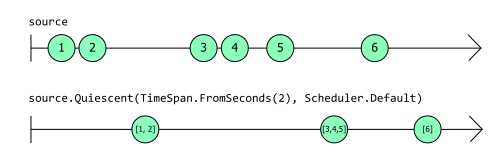
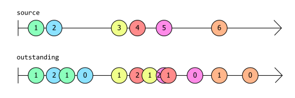
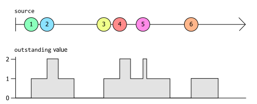
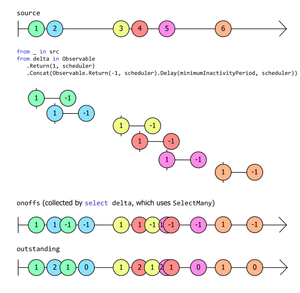

# 关键类型

Rx 是一个强大的框架，可以大大简化响应事件的代码。但是，要编写出优秀的响应式代码，您必须了解基本概念。Rx 的基本构件是一个名为 `IObservable<T>` 的接口。理解这个接口及其对应的 `IObserver<T>` 是使用 Rx 取得成功的关键。

上一章的第一个示例是 LINQ 查询表达式：

```c#
var bigTrades =
    from trade in trades
    where trade.Volume > 1_000_000;
```

大多数 .NET 开发人员都熟悉 [LINQ](https://learn.microsoft.com/en-us/dotnet/csharp/linq/)，至少熟悉其多种流行形式之一，如 [LINQ to Objects](https://learn.microsoft.com/en-us/dotnet/csharp/programming-guide/concepts/linq/linq-to-objects) 或 [Entity Framework Core](https://learn.microsoft.com/en-us/ef/core/querying/) 查询。大多数 LINQ 实现都允许您查询静态数据。LINQ to Objects 适用于数组或其他集合，而 Entity Framework Core 中的 LINQ 查询则针对数据库中的数据运行，但 Rx 则不同：它提供了定义实时事件流查询的能力，也就是你可能会说的移动中的数据。

如果你不喜欢查询表达式语法，可以直接调用 LINQ 操作符来编写完全相同的代码：

```c#
var bigTrades = trades.Where(trade => trade.Volume > 1_000_000);
```

无论我们使用哪种模式，这都是 LINQ 的一种表达方式，即我们希望 `bigTrades` 只包含交易中 `Volume` 属性大于 100 万的项目。

由于看不到 `trades` 或 `bigTrades` 变量的类型，我们无法准确判断这些示例的作用。根据这些类型的不同，这段代码的含义也会大不相同。如果我们使用的是 LINQ to objects，那么这两个变量都可能是 `IEnumerable<Trade>`。这意味着这些变量都引用了代表集合的对象，我们可以用 `foreach` 循环枚举这些集合的内容。这将代表静态数据，即我们的代码可以直接检查的数据。

但是，让我们通过明确类型来清楚代码的含义：

```c#
IObservable<Trade> bigTrades = trades.Where(trade => trade.Volume > 1_000_000);
```

这就消除了歧义。现在很清楚，我们处理的不是静态数据。我们处理的是 `IObservable<Trade>`。但这到底是什么呢？

## `IObservable<T>`

[IObservable<T> 接口](https://learn.microsoft.com/en-us/dotnet/api/system.iobservable-1)代表了 Rx 的基本抽象：某个类型 `T` 的值序列。从非常抽象的意义上讲，这意味着它与 `IEnumerable<T>` 表示的是同一件事。

区别在于代码如何使用这些值。`IEnumerable<T>` 可以让代码检索值（通常使用 `foreach` 循环），而 `IObservable<T>` 则在值可用时提供值。这种区别有时被称为“推”与“拉”。我们可以通过执行 `foreach` 循环从 `IEnumerable<T>` 中提取值，但 `IObservable<T>` 会将值推送到我们的代码中。

`IObservable<T>` 如何将其值推送到我们的代码中？如果我们想要这些值，我们的代码就必须订阅 `IObservable<T>`，这意味着为它提供一些可以调用的方法。事实上，订阅是 `IObservable<T>` 直接支持的唯一操作。下面是接口的整个定义：

```c#
public interface IObservable<out T>
{
    IDisposable Subscribe(IObserver<T> observer);
}
```

您可以在 [GitHub 上查看 IObservable<T> 的源代码](https://github.com/dotnet/runtime/blob/b4008aefaf8e3b262fbb764070ea1dd1abe7d97c/src/libraries/System.Private.CoreLib/src/System/IObservable.cs)。请注意，它是 .NET 运行库的一部分，而不是 `System.Reactive` NuGet 包的一部分。`IObservable<T>` 代表了一个如此重要的抽象，以至于它被嵌入了 .NET。(所以你可能想知道 System.Reactive NuGet 包是用来做什么的。.NET 运行库只定义了 `IObservable<T>` 和 `IObserver<T>` 接口，而没有定义 LINQ 实现。`System.Reactive` NuGet 包为我们提供了 LINQ 支持，同时还处理了线程问题）。

该接口的唯一方法清楚地说明了我们能用 `IObservable<T>` 做什么：如果我们想接收它提供的事件，我们可以订阅它。(我们也可以取消订阅：`Subscribe` 方法返回一个 `IDisposable`，如果我们调用 `Dispose`，它就会取消我们的订阅）。`Subscribe` 方法要求我们传入一个 `IObserver<T>` 的实现，这一点我们很快就会讲到。

细心的读者会注意到，上一章中的一个示例看起来不应该工作。这段代码创建了一个每秒产生一次事件的 `IObservable<long>`，然后用这段代码订阅了它：

```c#
ticks.Subscribe(
    tick => Console.WriteLine($"Tick {tick}"));
```

这是传递一个委托，而不是 `IObservable<T>.Subscribe` 所需的 `IObserver<T>`。我们很快就会讲到 `IObserver<T>`，但这里发生的一切只是本示例使用了 `System.Reactive` NuGet 软件包中的一个扩展方法：

```c#
// From the System.Reactive library's ObservableExtensions class
public static IDisposable Subscribe<T>(this IObservable<T> source, Action<T> onNext)
```

这是一个辅助方法，它将委托封装在 `IObserver<T>` 的实现中，然后将其传递给 `IObservable<T>.Subscribe`。这样做的效果是，我们只需编写一个简单的方法（而不是 `IObserver<T>` 的完整实现），可观察源就会在每次需要提供值时调用我们的回调。使用这种辅助工具比自己实现 Rx 接口更为常见。

### 热冷资源

由于 `IObservable<T>` 在我们订阅之前无法为我们提供值，因此我们订阅的时间可能非常重要。试想一下，一个 `IObservable<Trade>` 描述了某个市场中发生的交易。如果它提供的信息是实时的，那么它就不会告诉你在你订阅之前发生的任何交易。在 Rx 中，这类信息源被描述为热源。

并非所有信息源都是热门的。无论何时调用 `Subscribe`，`IObservable<T>` 都可以向任何订阅者提供完全相同的事件序列。(想象一下，一个 `IObservable<Trade>` 不是报告实时信息，而是根据记录的历史交易数据生成通知）。何时订阅完全无关紧要的源被称为冷源。

以下是一些可表示为热观测对象的源：

- 传感器的测量值
- 来自交易交易所的价格变动
- 立即分发事件的事件源，如 Azure 事件网格
- 鼠标移动
- 定时器事件
- ESB 通道或 UDP 网络数据包等广播

并举例说明一些可能成为冷观测物的来源：

- 集合的内容（如 [IEnumerable<T> 的 ToObservable 扩展方法](https://github.com/dotnet/reactive/blob/main/Rx.NET/Documentation/IntroToRx/03_CreatingObservableSequences.md#from-ienumerablet)返回的内容）
- 固定范围的值，如 [Observable.Range](https://github.com/dotnet/reactive/blob/main/Rx.NET/Documentation/IntroToRx/03_CreatingObservableSequences.md#observablerange) 产生的事件
- 根据算法生成的事件，如 [Observable.Generate](https://github.com/dotnet/reactive/blob/main/Rx.NET/Documentation/IntroToRx/03_CreatingObservableSequences.md#observablegenerate) 生成的事件
- 异步操作的工厂，如 [FromAsync](https://github.com/dotnet/reactive/blob/main/Rx.NET/Documentation/IntroToRx/03_CreatingObservableSequences.md#from-task) 返回
- 通过运行循环等传统代码生成的事件；可使用 [Observable.Create](https://github.com/dotnet/reactive/blob/main/Rx.NET/Documentation/IntroToRx/03_CreatingObservableSequences.md#observablecreate) 创建此类源
- 提供流式事件，如 Azure Event Hub 或 Kafka（或任何其他流式源，可保留过去的事件，以便从流中的特定时刻开始交付事件；因此不是 Azure Event Grid 风格的事件源）

并非所有的源都是严格意义上的完全热源或冷源。例如，您可以对实时 `IObservable<Trade>` 稍作改动，使信息源始终向新订阅者报告最新交易。订阅者可以立即收到一些信息，并随着新信息的到来不断更新。新订阅者总是会收到（可能是相当旧的）信息，这是一个类似冷源的特性，但冷源的只是第一个事件。一个全新的订阅者仍有可能错过许多早先的订阅者可以获得的信息，这就使得这个信息源更热而不是更冷。

还有一种有趣的特殊情况，即事件源的设计可以让应用程序按顺序接收每一个事件，而且只接收一次。Kafka 或 Azure Event Hub 等事件流系统就具有这种特性--它们会将事件保留一段时间，以确保消费者即使偶尔落后也不会错过。进程的标准输入（stdin）也具有这种特性：如果您运行命令行工具，并在它准备好处理之前开始键入输入，操作系统会将输入保留在缓冲区中，以确保不会丢失任何内容。Windows 对桌面应用程序也有类似的处理方式：每个应用程序线程都有一个消息队列，如果你在它无法响应时点击或键入，输入最终也会被处理。我们可以将这些源视为先冷后热的源。它们就像冷源，我们不会因为开始接收事件花了一些时间而错过任何事情，但一旦我们开始检索数据，一般就不能再倒退回起点了。因此，一旦我们开始运行，它们就更像是热事件。

如果我们想附加多个订阅者，这种先冷后热的源可能会带来问题。如果源在订阅发生后立即开始提供事件，那么对于第一个订阅者来说就没有问题：它将接收到任何等待我们启动而被备份的事件。但如果我们想附加多个订阅者，那就有问题了：在我们设法附加第二个订阅者之前，第一个订阅者可能会收到所有在缓冲区中等待的通知。第二个订阅者就会错过。

在这种情况下，我们确实需要某种方法，在开始工作之前将所有订阅者都设置好。我们希望订阅与启动行为是分开的。默认情况下，订阅源意味着我们希望它启动，但 Rx 定义了一个专门的接口，可以给我们更多的控制权：[IConnectableObservable<T>](https://github.com/dotnet/reactive/blob/f4f727cf413c5ea7a704cdd4cd9b4a3371105fa8/Rx.NET/Source/src/System.Reactive/Subjects/IConnectableObservable.cs)。它派生自 `IObservable<T>`，只增加了一个方法 `Connect`：

```c#
public interface IConnectableObservable<out T> : IObservable<T>
{
    IDisposable Connect();
}
```

这在某些情况下非常有用，因为在这些情况下会有一些进程来获取或生成事件，而我们需要确保在这些进程开始之前做好准备。由于 `IConnectableObservable<T>` 在您调用 `Connect` 之前不会启动，因此它为您提供了一种方法，可以在事件开始流动之前附加您需要的多个订阅者。

源的“温度”并不一定能从其类型中看出来。即使底层源是 `IConnectableObservable<T>`，它也往往隐藏在代码层之后。因此，无论源是热的、冷的还是介于两者之间的，大多数情况下我们看到的只是一个 `IObservable<T>`。由于 `IObservable<T>` 只定义了一个方法，即 `Subscribe`，您可能想知道我们如何用它做任何有趣的事情。这得益于 `System.Reactive` NuGet 库提供的 LINQ 操作符。

### LINQ 操作符和组合

到目前为止，我只展示了一个非常简单的 LINQ 示例，即使用 `Where` 运算符过滤符合特定条件的事件。为了让大家了解我们如何通过组合构建更高级的功能，我将介绍一个示例场景。

假设你想编写一个程序，用于监视文件系统中的某个文件夹，并在该文件夹中的内容发生变化时执行自动处理。例如，网络开发人员经常希望在编辑器中保存更改时触发客户端代码的自动重建，以便快速查看更改的效果。文件系统的变化往往是突发的。文本编辑器在保存文件时可能会执行一些不同的操作。(有些编辑器会将修改保存到一个新文件中，然后在保存完成后执行几个重命名操作，因为这样可以避免在保存文件时发生断电或系统崩溃而导致数据丢失）。因此，你通常不想在检测到文件活动时立即采取行动。最好给它一点时间，看看是否有更多活动发生，等一切都稳定下来后再采取行动。

因此，我们不应直接对文件系统活动做出反应。我们希望在活动过后一切归于平静时采取行动。Rx 并不直接提供这种功能，但我们可以通过组合一些内置操作符来创建自定义操作符。下面的代码定义了一个 Rx 运算符，用于检测和报告此类情况。如果你是 Rx 新手（如果你正在读这篇文章，很可能是这样），可能不会立即明白它是如何工作的。与我迄今为止展示的示例相比，这个操作的复杂性要高出很多，因为它来自于一个真实的应用程序。但我会一步一步地讲解，这样一切都会变得清晰起来。

```c#
static class RxExt
{
    public static IObservable<IList<T>> Quiescent<T>(
        this IObservable<T> src,
        TimeSpan minimumInactivityPeriod,
        IScheduler scheduler)
    {
        IObservable<int> onoffs =
            from _ in src
            from delta in 
               Observable.Return(1, scheduler)
                         .Concat(Observable.Return(-1, scheduler)
                                           .Delay(minimumInactivityPeriod, scheduler))
            select delta;
        IObservable<int> outstanding = onoffs.Scan(0, (total, delta) => total + delta);
        IObservable<int> zeroCrossings = outstanding.Where(total => total == 0);
        return src.Buffer(zeroCrossings);
    }
}
```

首先要说明的是，我们实际上是在定义一个自定义的 LINQ 风格操作符：这是一个扩展方法，与 Rx 提供的所有 LINQ 操作符一样，它将 `IObservable<T>` 作为隐式参数，并产生另一个可观察源作为其结果。返回类型略有不同：它是 `IObservable<IList<T>>`。这是因为一旦我们返回到非活动状态，我们就会希望处理刚刚发生的一切，因此该操作符将产生一个列表，其中包含源在最近的活动中报告的每一个值。

当我们想展示 Rx 运算符的行为时，通常会画一个“大理石”图。该图显示了一个或多个 IObservable<T> 事件源，每个事件源用一条水平线表示。事件源产生的每个事件都用该线上的一个圆圈（或 "大理石"）来表示，水平位置代表时序。通常情况下，横线左侧有一个竖条，表示应用程序订阅源的时间，除非它立即产生事件，在这种情况下，它将以一个圆圈开始。如果线条右侧有一个箭头，则表示观察对象的生命周期超出了图表的范围。下面的图表展示了上述静默操作符对特定输入的响应：



这表明源（上线）产生了几个事件（本例中为数值 `1` 和 `2`），然后停止了一会儿。停止一段时间后，`Quiescent` 运算符返回的观测值（下线）产生了一个事件，其列表包含了这两个事件（[1,2]）。然后，信号源再次启动，接二连三地产生了 `3`、`4` 和 `5` 值，然后又安静了一会儿。同样，一旦安静的时间足够长，`Quiescent` 返回的信号源就会产生一个单一事件，其中包含第二轮活动中的所有信号源事件（[3,4,5]）。图中显示的最后一段源活动包括单个事件 `6`，随后是更多的不活动，同样，一旦不活动持续了足够长的时间，`Quiescent` 就会产生一个单个事件来报告。由于源活动的最后一次“爆发”只包含一个事件，因此 `Quiescent` 观测器的最终输出所报告的列表只有一个值：` [6]`。

那么，所示代码是如何实现这一点的呢？关于 `Quiescent` 方法，首先要注意的是它只是使用了其他 Rx LINQ 操作符（`Return`、`Scan`、`Where` 和 `Buffer` 操作符是显式可见的，查询表达式将使用 `SelectMany` 操作符，因为 C# 查询表达式在一行中包含两个 `from` 子句时就是这样做的），通过组合产生了最终的 `IObservable<IList<T>>` 输出。

这就是 Rx 的组合方法，也是我们通常使用 Rx 的方式。我们混合使用各种运算符，通过组合（组成）产生我们想要的效果。

但这种特定的组合如何产生我们想要的效果呢？我们有几种方法可以从 `Quiescent` 运算符中获得我们想要的效果，但这种特殊实现方式的基本思想是，它可以计算最近发生了多少事件，然后在每次事件数降回零时产生一个结果。变量 `outstanding` 指的是跟踪最近事件数量的 `IObservable<int>`，这个“大理石”图显示了它在响应上图所示的相同 `source` 事件时产生的结果：



这次我用颜色编码了事件，这样我就可以展示 `source` 事件与 `outstanding` 生成的相应事件之间的关系。每当 `source` 事件产生一个事件时，`outstanding` 会同时产生一个事件，其中的值比之前由 `outstanding` 生成的值高一。但是，每个 `source` 事件还会导致 `outstanding` 在两秒后产生另一个事件。（这两秒是因为在这些示例中，我假设 `Quiescent` 的第一个参数为 `TimeSpan.FromSeconds(2)`，如第一个示意图所示。）那第二个事件总是产生一个比之前的值低一的值。

这意味着从 `outstanding` 中出现的每个事件都告诉我们在过去两秒内 `source` 产生了多少事件。这个图示以稍微不同的形式显示了相同的信息：它将由 `outstanding` 生成的最新值显示为一个图形。你可以看到每当 `source` 产生一个新值时，该值会增加一。而在每个 `source` 事件产生后的两秒钟，它会再次降低一。



在简单的情况下，如最后的事件 `6`，它是在该时间段内发生的唯一事件，当事件发生时，`outstanding` 值加 1，两秒后再次减 1。图片左侧的情况稍微复杂一些：我们接连发生了两个事件，因此 `outsdanding` 上升到 1，然后上升到 2，然后又下降到 1，然后又下降到 0。中间部分看起来比较混乱--当信号 `source` 产生事件 `3` 时，计数上升 1，当事件 `4` 出现时，计数上升 2。当 3 号事件发生两秒后，计数又下降到 1，但随后又发生了 `5` 号事件，计数又上升到 2。之后不久，由于 `4` 号事件发生的时间已经过去了两秒，所以它又降回到了 1。稍后，在 5 号事件发生两秒后，它又回到了 0。

中间的部分是最混乱的，但也最能代表这个运算器要处理的活动类型。请记住，这里的重点是，我们希望看到一连串的活动，如果这些活动代表了文件系统的活动，那么它们在本质上往往会略显混乱，因为存储设备并不总是具有完全可预测的性能特征（尤其是带有移动部件的磁性存储设备，或者可能会出现网络延迟的远程存储设备）。

有了这个最近活动的测量值，我们就可以通过观察 `outstanding` 何时回落到零来发现活动的结束，这就是上面代码中 `zeroCrossing` 所指的观测值的作用。(这只是使用 `Where` 运算符过滤掉除 `outstanding` 当前值归零事件之外的所有事件）。

但 `outstanding` 本身是如何工作的呢？这里的基本方法是，每当 `source` 产生一个值时，我们实际上创建了一个全新的 `IObservable<int>`，它正好产生两个值。它立即产生值 1，然后在指定的时间间隔（在这些示例中为 2 秒）后产生值 -1。 这就是查询表达式的这个子句的内容：

```c#
from delta in Observable
    .Return(1, scheduler)
    .Concat(Observable
        .Return(-1, scheduler)
        .Delay(minimumInactivityPeriod, scheduler))
```

我说过，Rx 的核心是组合，这里的情况当然也是如此。我们使用非常简单的 `Return` 运算符创建了一个 `IObservable<int>`，它能立即产生一个值，然后终止。这段代码调用了两次，一次产生值 1，另一次产生值-1。 它使用了 `Delay` 运算符，因此我们不会立即得到值-1，而是得到一个等待指定时间段（在这些示例中为 2 秒，但一般情况下最小活动周期为 2 秒）后才产生值的可观察对象。然后，我们使用 Concat 将这两个观察对象拼接成一个 `IObservable<int>`，产生值 1，两秒后再产生值-1。

虽然这将为每个源事件生成一个全新的 `IObservable<int>`，但上图中的 `from` 子句是 `from ... from ... select` 形式的查询表达式的一部分，C# 编译器会将其转换为对 SelectMany 的调用，其效果是将所有这些事件平铺为一个单一的可观测事件，这就是 `onoffs` 变量所指的内容。这个大理石图就说明了这一点：



这也再次显示了 `outstanding` 的观察值，但我们现在可以看到它的来源：它只是 `onoffs` 观察值发出的值的运行总计。这个运行总计观测值是通过以下代码创建的

```c#
IObservable<int> outstanding = onoffs.Scan(0, (total, delta) => total + delta);
```

Rx 的 `Scan` 操作符的工作原理与标准 [LINQ 聚合](https://learn.microsoft.com/en-us/dotnet/csharp/programming-guide/concepts/linq/aggregation-operations)操作符（Aggregate Operator）非常相似，即对序列中的每个单项累加应用操作（本例中为加法）。不同的是，当 Aggregate 运算到达序列末尾时，只会产生最终结果，而 Scan 运算则会显示其所有工作，在每次输入后产生迄今为止的累积值。因此，这意味着每当 `onoffs` 产生一个事件时，`outstanding` 就会产生一个事件，而该事件的值就是运行总值 `onoffs` 到目前为止所有值的总和。

这就是 `outstanding` 如何告诉我们在过去两秒（或指定的`minimumActivityPeriod`）内 `source` 产生了多少个事件。

谜题的最后一部分是我们如何从 `zeroCrossings`（每次信号源进入 `source` 时都会产生一个事件）到输出 `IObservable<IList<T>>`，后者提供了最近一次活动中发生的所有事件。在这里，我们使用的是 Rx 的 `Buffer` 操作符，它正是为这种情况而设计的：它将输入切成块，为每个块产生一个事件，事件的值是一个 `IList<T>`，其中包含该块的项目。`Buffer` 可以通过几种方式切片，但在本例中，我们使用的是每当某个 `IObservable<T>` 产生一个项目时就启动一个新切片的形式。具体来说，每当 `zeroCrossings` 产生一个新事件时，我们就会告诉 `Buffer` 通过创建一个新块来分割源。

(最后一个细节是，该方法需要一个 `IScheduler`。这是一个用于处理定时和并发的 Rx 抽象。我们之所以需要它，是因为我们需要能够在延迟一秒后生成事件，而这种由时间驱动的活动需要一个调度程序）。

我们将在后面的章节中详细介绍所有这些操作符和调度程序的工作原理。现在，关键的一点是，我们通常通过创建 LINQ 操作符的组合来使用 Rx，这些操作符处理并组合 `IObservable<T>` 源，从而定义我们需要的逻辑。

请注意，该示例中没有任何内容实际调用了 `IObservable<T>` 定义的唯一方法（`Subscribe`）。总会有某个地方最终消耗了事件，但使用 Rx 的大部分工作往往需要声明地定义我们需要的 `IObservable<T>`。

现在，您已经看到了 Rx 编程的示例，我们可以回答一些显而易见的问题：为什么要有 Rx？

### .NET 事件出了什么问题？

.NET 从二十多年前发布的第一个版本开始就内置了对事件的支持--事件是 .NET 类型系统的一部分。C# 语言以 `event` 关键字的形式对此提供了内在支持，同时还提供了订阅事件的专门语法。那么，当 Rx 在 10 年后出现时，它为什么觉得有必要为事件流发明自己的表示法呢？`event` 关键字到底出了什么问题？

.NET 事件的基本问题在于，.NET 类型系统对它们进行了特殊处理。具有讽刺意味的是，这使得它们的灵活性比没有内置的事件概念支持时要差。如果没有 .NET 事件，我们就需要某种基于对象的事件表示法，在这种情况下，您可以对事件做与对任何其他对象相同的事情：您可以将它们存储在字段中，将它们作为参数传递给方法，对它们定义方法等等。

公平地说，.NET 第 1 版在没有泛型的情况下，不可能定义出基于对象的事件表示法，.NET 直到第 2 版（.NET 1.0 发布三年半后）才有了泛型。不同的事件源需要报告不同的数据，.NET 事件提供了一种按类型参数化事件的方法。但是一旦泛型出现，就有可能定义诸如 `IObservable<T>` 这样的类型，事件提供的主要优势也就不复存在了。(另一个优点是为实现和订阅事件提供了一些语言支持，但原则上，如果微软愿意，Rx 也可以做到这一点。这并不要求事件与类型系统的其他功能有本质区别）。

请看我们刚才的例子。我们可以定义自己的自定义 LINQ 操作符 `Quiescent`，因为 `IObservable<T>` 与其他接口一样，只是一个接口，这意味着我们可以自由地为它编写扩展方法。你不能为事件编写扩展方法。

此外，我们还可以封装或调整 `IObservable<T>` 源。`Quiescent` 将一个 `IObservable<T>` 作为输入，并结合各种 Rx 运算符生成另一个可观察事件作为输出。它的输入是可以订阅的事件源，输出也是可以订阅的事件源。但.NET 事件无法做到这一点--您无法编写一个接受事件作为参数的方法，也无法编写一个返回事件的方法。

这些限制有时被称为“.NET 事件不是一等公民”。在.NET中，您可以对值或引用做一些事情，而对事件却做不了。

如果我们将事件源表示为一个普通的老接口，那么它就是一等公民：它可以使用我们对其他对象和值所期望的所有功能，这正是因为它不是什么特殊的东西。

### 那么流呢？

我将 `IObservable<T>` 描述为事件流。这就提出了一个显而易见的问题：.NET 已经有了 [System.IO.Stream](https://learn.microsoft.com/en-us/dotnet/api/system.io.stream)，为什么不直接使用它呢？

简而言之，流之所以奇怪，是因为它代表了计算领域的一个古老概念，其历史可以追溯到第一个 Windows 操作系统问世之前。这意味着，即使是“我有一些数据，并希望立即将其提供给所有相关方”这样简单的场景，通过 `Stream` 类型实现起来也会出奇地复杂。

此外，`Stream` 并没有提供任何方法来指明将出现的数据类型--它只知道字节。由于 .NET 的类型系统支持泛型，因此自然希望表示事件流的类型能通过类型参数来指示事件类型。

因此，即使您使用 `Stream` 作为实现的一部分，您也需要引入某种封装抽象。如果 `IObservable<T>` 不存在，您就需要发明它。

在 Rx 中当然可以使用 IO 流，但它们并不是正确的主要抽象。

(如果你不相信，请参阅[附录 A：经典 IO 流的问题所在](https://github.com/dotnet/reactive/blob/main/Rx.NET/Documentation/IntroToRx/A_IoStreams.md)，它将更详细地解释 `Stream` 为什么不适合这项任务）。

既然我们已经了解了 `IObservable<T>` 需要存在的原因，那么我们就需要看看其对应的 `IObserver<T>`。

## `IObserver<T>`

前面，我展示了 `IObservable<T>` 的定义。正如你所看到的，它只有一个方法，即 `Subscribe`。该方法只接受一个参数，类型为 [IObserver<T>](https://learn.microsoft.com/en-us/dotnet/api/system.iobserver-1)。因此，如果你想观察 `IObservable<T>` 提供的事件，就必须为它提供一个 `IObserver<T>`。在迄今为止的示例中，我们只是提供了一个简单的回调，而 Rx 已将其封装在 `IObserver<T>` 的实现中，但尽管这通常是我们在实践中接收通知的方式，你仍然需要了解 `IObserver<T>` 才能有效地使用 Rx。它并不是一个复杂的接口：

```c#
public interface IObserver<in T>
{
    void OnNext(T value);
    void OnError(Exception error);
    void OnCompleted();
}
```

与 `IObservable<T>` 一样，您可以在 .NET 运行时 GitHub 代码库中找到 [IObserver<T> 的源代码](https://github.com/dotnet/runtime/blob/7cf329b773fa5ed544a9377587018713751c73e3/src/libraries/System.Private.CoreLib/src/System/IObserver.cs)，因为这两个接口都内置于运行时库中。

如果我们想创建一个能将值打印到控制台的观察者，就会像这样简单：

```c#
public class MyConsoleObserver<T> : IObserver<T>
{
    public void OnNext(T value)
    {
        Console.WriteLine($"Received value {value}");
    }

    public void OnError(Exception error)
    {
        Console.WriteLine($"Sequence faulted with {error}");
    }

    public void OnCompleted()
    {
        Console.WriteLine("Sequence terminated");
    }
}
```

在前一章中，我使用了 `Subscribe` 扩展方法，该方法接受一个委托，每次源生成一个项目时，它都会调用该委托。该方法由 Rx 的 `ObservableExtensions` 类定义，该类还定义了 `IObservable<T>` 的其他各种扩展方法。它包括 `Subscribe` 的重载，使我能够编写与上例具有相同效果的代码，而无需提供自己的 `IObserver<T> `实现：

```c#
source.Subscribe(
    value => Console.WriteLine($"Received value {value}"),
    error => Console.WriteLine($"Sequence faulted with {error}"),
    () => Console.WriteLine("Sequence terminated")
);
```

在 `Subscribe` 的重载中，我们没有传递所有三个方法（例如，我前面的示例只提供了与 `OnNext` 对应的单个回调），这相当于编写了一个 `IObserver<T>` 实现，其中一个或多个方法的主体是空的。无论我们觉得编写实现 `IObserver<T>` 的自己的类型更方便，还是只为其部分或全部 `OnNext`、`OnError` 和 `OnCompleted` 方法提供回调，基本行为都是一样的：`IObservable<T>` 源通过调用 `OnNext` 报告每个事件，并通过调用 `OnError` 或 `OnCompleted` 告诉我们事件已经结束。

如果您想知道 `IObservable<T>` 和 `IObserver<T>` 之间的关系是否类似于 `IEnumerable<T>` 和 `IEnumerator<T>` 之间的关系，那么您就找到了答案。`IEnumerable<T>` 和 `IObservable<T>` 都表示潜在的序列。对于这两个接口，只有当我们要求它们提供数据时，它们才会提供。要从 `IEnumerable<T>` 中获取值，需要有一个 `IEnumerator<T>`，同样，要从 `IObservable<T>` 中获取值，需要有一个 `IObserver<T>`。

这种差异反映了 `IEnumerable<T>` 和 `IObservable<T>` 之间拉与推的基本差异。对于 `IEnumerable<T>`，我们要求源为我们创建一个 `IEnumerator<T>`，然后我们可以用它来检索项（这正是 C# `foreach` 循环所做的）；而对于 `IObservable<T>`，源并没有实现 `IObserver<T>`：它希望我们提供一个 `IObserver<T>`，然后它将把其值推送到该观察者中。

那么，为什么 `IObserver<T>` 有这三个方法呢？还记得我说过在抽象意义上，`IObserver<T>` 与 `IEnumerable<T>` 表示的是同一件事吗？我是认真的。它可能是抽象的，但却是精确的： `IObservable<T>` 和 `IObserver<T>` 的设计保留了 `IEnumerable<T>` 和 `IEnumerator<T>` 的确切含义，只是改变了详细的消费机制。

要了解这意味着什么，请想想在遍历 `IEnumerable<T>` 时会发生什么（例如，使用一个 `foreach` 循环）。每次迭代（更确切地说，每次调用枚举器的 [MoveNext](https://learn.microsoft.com/en-us/dotnet/api/system.collections.ienumerator.movenext) 方法）都可能发生三种情况：

- `MoveNext` 返回 `true`，表示枚举器的 [Current](https://learn.microsoft.com/en-us/dotnet/api/system.collections.generic.ienumerator-1.current) 属性中有一个值可用
- `MoveNext` 可能抛出异常
- `MoveNext` 可能返回 `false`，表示已到达集合的末尾

这三种结果正好对应于 `IObserver<T>` 定义的三种方法。我们可以用稍微抽象的术语来描述这些结果：

- 这里是另一个项
- 全部出错
- 没有更多项目了

这描述了在消费 `IEnumerable<T>` 或 `IObservable<T>` 时可能发生的三种情况。唯一的区别在于消费者发现这些情况的方式。对于 `IEnumerable<T>` 源，每次调用 `MoveNext` 都会告诉我们哪种情况适用。而对于 `IObservable<T>` 源，通过调用你的 `IObserver<T>` 实现的相应成员之一，它将告诉你这三种情况之一。

### Rx 序列的基本规则

请注意，上面列表中的三种结果中有两种是终止的。如果你在使用 `foreach` 循环迭代 `IEnumerable<T>` 时，它抛出异常，那么 `foreach` 循环将终止。C# 编译器理解如果 `MoveNext` 抛出异常，`IEnumerator<T>` 已经完成，所以它会释放它并允许异常传播。同样地，如果你到达序列的末尾，那么你已经完成了，编译器也理解这一点：对于 `foreach` 循环生成的代码会检测 `MoveNext` 返回 `false` 的情况，当发生这种情况时，它会释放枚举器，然后继续执行循环后面的代码。

这些规则可能看起来很明显，我们在遍历 `IEnumerable<T>` 序列时可能从未思考过它们。可能不太明显的是，对于`IObservable<T>` 序列，完全相同的规则也适用。如果可观察的源告诉观察者序列已经结束，或者报告了错误，那么在任何一种情况下，这是源允许对观察者执行的最后一件事情。

这意味着以下示例将违反规则：

```c#
public static void WrongOnError(IObserver<int> obs)
{
    obs.OnNext(1);
    obs.OnError(new ArgumentException("This isn't an argument!"));
    obs.OnNext(2);  // 违反规则！我们已经报告了失败，所以必须停止迭代
}

public static void WrongOnCompleted(IObserver<int> obs)
{
    obs.OnNext(1);
    obs.OnCompleted();
    obs.OnNext(2);  // 违反规则！我们已经报告完成了，所以必须停止迭代
}

public static void WrongOnErrorAndOnCompleted(IObserver<int> obs)
{
    obs.OnNext(1);
    obs.OnError(new ArgumentException("A connected series of statements was not supplied"));

    // 下一次调用是违反规定的，因为我们报告了一个错误。
    // 允许在此之后继续调用。
    obs.OnCompleted();
}

public static void WrongOnCompletedAndOnError(IObserver<int> obs)
{
    obs.OnNext(1);
    obs.OnCompleted();

    // 接下来的调用违反了规则，因为我们已经说过我们已经完成了。
    // 当你终止一个序列时，你必须选择 OnCompleted 或 OnError。
    obs.OnError(new ArgumentException("Definite proposition not established"));
}
```

这些都与我们已经了解的 `IEnumerable<T>` 的内容非常对应：

- `WrongOnError`：如果一个枚举器从 `MoveNext` 中抛出错误，那么它就结束了，你不能再调用 `MoveNext`，所以你不会从它中得到更多的项目。
- `WrongOnCompleted`：如果一个枚举器从 `MoveNext` 返回 `false`，则表示该枚举器已完成，您不能再调用 `MoveNext`，因此您不会从中获得更多项目
- `WrongOnErrorAndOnCompleted`：如果一个枚举器从 `MoveNext` 中抛出，这意味着它已经完成，你不能再调用 `MoveNext`，这意味着它没有任何机会通过从 `MoveNext` 返回 `false` 来说明它已经完成。
- `WrongOnCompletedAndOnError`：如果枚举器从 `MoveNext` 返回 `false`，则表示它已完成，你不能再调用 `MoveNext`，这意味着它不会有任何机会抛出异常。

由于 `IObservable<T>` 是基于推送的，因此遵守所有这些规则的责任都落在了可观察源身上。而 `IEnumerable<T>` 是基于 pull 的，使用 `IEnumerator<T>` 的代码（如 `foreach` 循环）有责任遵守这些规则。但它们本质上是相同的规则。

对于 ` IObserver<T>`，还有一条额外的规则：如果调用 `OnNext`，则必须等待它返回后，才能对同一 `IObserver<T>` 进行更多的方法调用。这意味着这段代码违反了规则：

```c#
public static void EverythingEverywhereAllAtOnce(IObserver<int> obs)
{
    Random r = new();
    for (int i = 0; i < 10000; ++i)
    {
        int v = r.Next();
        Task.Run(() => obs.OnNext(v)); // 违反规则！
    }}
```

这将调用 `obs.OnNext` 10,000 次，但它将这些调用作为单个任务在线程池中执行。线程池的设计目的是能够并行执行工作，而这在这里是个问题，因为这里没有任何东西能确保在下一次调用开始前完成对 `OnNext` 的调用。我们打破了规则，即在同一观察者上调用 `OnNext`、`OnError` 或 `OnComplete` 之前，我们必须等待对 `OnNext` 的每次调用返回。(注意：这是假设调用者不会将同一个观察者订阅到多个不同的源。如果这样做，就不能假定对其 `OnNext` 的所有调用都会遵守规则，因为不同的源无法知道它们是在与同一个观察者对话）。

该规则是 Rx.NET 中内置的唯一一种反向压力形式：由于规则禁止在上一次调用 `OnNext` 仍在进行时调用 `OnNext`，这使得 `IObserver<T>` 能够限制项目到达的速度。如果直到准备就绪才从 `OnNext` 返回，那么源就必须等待。不过，这样做也有一些问题。一旦[调度程序](https://github.com/dotnet/reactive/blob/main/Rx.NET/Documentation/IntroToRx/11_SchedulingAndThreading.md)介入，底层源可能无法直接连接到最终观察者。如果使用类似 [ObserveOn](https://github.com/dotnet/reactive/blob/main/Rx.NET/Documentation/IntroToRx/11_SchedulingAndThreading.md#subscribeon-and-observeon) 的方法，直接订阅源的 `IObserver<T>` 有可能只是将项目放入队列并立即返回，而这些项目随后会被传送到不同线程上的真正观察者。在这种情况下，由于从 `OnNext` 返回需要很长时间而造成的“反向压力”只会传播到从队列中拉取项目的代码。

也许可以使用某些 Rx 操作符（如 [Buffer](https://github.com/dotnet/reactive/blob/main/Rx.NET/Documentation/IntroToRx/08_Partitioning.md#buffer) 或 [Sample](https://github.com/dotnet/reactive/blob/main/Rx.NET/Documentation/IntroToRx/12_Timing.md#sample)）来缓解这种情况，但目前还没有跨线程传播反向压力的内置机制。其他平台上的一些 Rx 实现试图为此提供集成解决方案；过去，Rx.NET 开发社区在研究这个问题时，有些人认为这些解决方案有问题，而且对于什么是好的解决方案也没有达成共识。因此，对于 Rx.NET，如果需要在跟不上进度时安排源代码减速，就需要自己引入某种机制。(即使是提供内置背压的 Rx 平台，它们也无法为以下问题提供通用的答案：我们如何让这个源以更慢的速度提供事件？如何（甚至是否）做到这一点将取决于源的性质。因此，在任何情况下，都可能需要进行一些定制的调整）。

我们必须等待 `OnNext` 返回的规则既棘手又微妙。它可能没有其他规则那么明显，因为 `IEnumerable<T>` 没有相应的规则--只有在源向应用程序推送数据时，才有机会打破这一规则。看到上面的例子，你可能会想“谁会这么做呢？”然而，多线程只是一种简单的方法，它表明在技术上打破规则是可能的。更难的情况是发生单线程重入。就拿这段代码来说吧：

```c#
public class GoUntilStopped
{
    private readonly IObserver<int> observer;
    private bool running;

    public GoUntilStopped(IObserver<int> observer)
    {
        this.observer = observer;
    }

    public void Go()
    {
        this.running = true;
        for (int i = 0; this.running; ++i)
        {
            this.observer.OnNext(i);
        }
    }

    public void Stop()
    {
        this.running = false;
        this.observer.OnCompleted();
    }
}
```

该类将一个 `IObserver<int>` 作为构造函数参数。当你调用它的 `Go` 方法时，它会重复调用观察者的 `OnNext`，直到 `Stop` 方法被调用。

你能看到 bug 吗？

我们可以通过提供一个 `IObserver<int>` 实现来看看会发生什么：

```c#
public class MyObserver : IObserver<int>
{
    private GoUntilStopped? runner;

    public void Run()
    {
        this.runner = new(this);
        Console.WriteLine("Starting...");
        this.runner.Go();
        Console.WriteLine("Finished");
    }

    public void OnCompleted()
    {
        Console.WriteLine("OnCompleted");
    }

    public void OnError(Exception error) { }

    public void OnNext(int value)
    {
        Console.WriteLine($"OnNext {value}");
        if (value > 3)
        {
            Console.WriteLine($"OnNext calling Stop");
            this.runner?.Stop();
        }
        Console.WriteLine($"OnNext returning");
    }
}
```

请注意，`OnNext` 方法会查看输入值，如果大于 3，就会告诉 `GoUntilStopped` 对象停止。

让我们看看输出结果：

```
Starting...
OnNext 0
OnNext returning
OnNext 1
OnNext returning
OnNext 2
OnNext returning
OnNext 3
OnNext returning
OnNext 4
OnNext calling Stop
OnCompleted
OnNext returning
Finished
```

问题就出在结尾处。具体来说，就是这两行：

```
OnCompleted
OnNext returning
```

这告诉我们，对观察者 `OnCompleted` 的调用发生在对 `OnNext` 的调用返回之前。发生这种情况并不需要多个线程。这是因为 `OnNext` 中的代码会决定是否要继续接收事件，而当它想停止时，就会立即调用 `GoUntilStopped` 对象的 `Stop` 方法。这并没有什么不妥。观察者可以向 `OnNext` 内部的其他对象发出向外调用，而且观察者检查传入事件并决定要停止的情况也很常见。

问题出在 `GoUntilStopped.Stop` 方法中。该方法调用 `OnCompleted`，但并不试图确定是否正在调用 `OnNext`。

这可能是一个令人惊讶的棘手问题。假设 `GoUntilStopped` 确实检测到 `OnNext` 正在被调用。那该怎么办？在多线程情况下，我们可以通过使用锁或其他同步原语来确保对观察者的调用一次一个地进行，但这在这里行不通：对 `Stop` 的调用发生在调用 `OnNext` 的同一线程上。当 `Stop` 被调用并希望调用 `OnCompleted` 时，调用堆栈将是这样的：

```
`GoUntilStopped.Go`
  `MyObserver.OnNext`
    `GoUntilStopped.Stop`
```

在调用 `OnCompleted` 之前，我们的 `GoUntilStopped.Stop` 方法需要等待 `OnNext` 返回。但请注意，在我们的 `Stop` 方法返回之前，`OnNext` 方法无法返回。我们成功地用单线程代码创建了一个死锁！

在这种情况下，要解决这个问题并不难：我们可以修改 `Stop` 方法，使其仅将 `running` 字段设置为 `false`，然后将对 `OnComplete` 的调用移到 for 循环之后的 `Go` 方法中。但一般来说，这可能是一个很难解决的问题，这也是我们使用 `System.Reactive` 库而不是直接实现 `IObservable<T>` 和 `IObserver<T>` 的原因之一。Rx 拥有解决此类问题的通用机制。（我们将会在[调度](https://github.com/dotnet/reactive/blob/main/Rx.NET/Documentation/IntroToRx/11_SchedulingAndThreading.md)详细阐述）此外，Rx 提供的所有实现都会利用这些机制。

如果你以声明的方式组合 Rx 的内置操作符，那么你就永远不必考虑这些规则。你可以在接收事件的回调中依赖这些规则，而遵守规则主要是 Rx 的问题。因此，这些规则的主要作用是让消耗事件的代码变得更简单。

这些规则有时用语法来表达。例如，请看下面的正则表达式：

```
(OnNext)*(OnError|OnComplete)
```

这正式捕捉到了基本思想：可以有任意次数的 `OnNext` 调用（甚至可能是零次调用），这些调用依次发生，然后是 `OnError` 或 `OnComplete`，但不能同时发生，而且在这两个调用之后必须没有任何内容。

最后一点：序列可能是无限的。这对于 `IEnumerable<T>` 来说是真实的。枚举器完全有可能在每次返回 `MoveNext` 时都返回 `true`，在这种情况下，`foreach` 循环迭代它将永远不会到达终点。它可能会选择停止（通过中断或返回），或者一些并非来自枚举器的异常可能会导致循环终止，但只要你一直要求 `IEnumerable<T>` 产生项目，它就会一直产生项目，这是绝对可以接受的。`IObservable<T>` 也是如此。如果您订阅了一个可观察源，而当您的程序退出时，您还没有收到 `OnComplete` 或 `OnError` 的调用，这并不是一个错误。

因此，你可能会说这是正式描述规则的一种稍好的方法：

```
(OnNext)*(OnError|OnComplete)?
```

更巧妙的是，可观察源可以什么都不做。事实上，有一种内置实现可以让开发人员不必费力编写什么都不做的源代码：如果调用 `Observable.Never<int>()`，它将返回一个 `IObservable<int>`，如果你订阅了它，它将永远不会调用你的观察者上的任何方法。这看起来可能不会立即派上用场--它在逻辑上等同于一个 `IEnumerable<T>`，其中枚举器的 `MoveNext` 方法永远不会返回，这可能无法与崩溃区分开来。Rx 的情况略有不同，因为当我们模拟这种“永远不出现项目”的行为时，我们不需要永远阻塞一个线程来实现这一点。我们只需决定永远不调用观察者上的任何方法即可。这可能看起来很蠢，但正如你在 `Quiescent` 示例中所看到的，有时我们创建可观察源并不是因为我们想要从中得到实际的项目，而是因为我们对有趣的事情发生的一瞬间的感兴趣。对“有趣的事情从未发生”的情况进行建模有时会很有用。例如，如果你编写了一些代码来检测意外的非活动状态（例如，传感器停止产生数值），并希望对该代码进行测试，那么你的测试可以使用 `Never` 源而不是真实源来模拟损坏的传感器。

我们还没有完全理解 Rx 的规则，但最后一条规则只适用于我们选择在源自然结束前取消订阅的情况。

## 订阅生命周期

观察者和观察对象之间的关系还有一个方面需要了解：订阅的生命周期。

我们已经从 `IObserver<T>` 的规则中了解到，对 `OnComplete` 或 `OnError` 的调用表示序列的结束。我们将 `IObserver<T>` 传递给 `IObservable<T>.Subscribe`，现在订阅结束了。但如果我们想提前停止订阅呢？

我在前面提到过，`Subscribe` 方法会返回一个 `IDisposable`，这使我们可以取消订阅。也许我们之所以订阅源，是因为我们的应用程序打开了某个窗口，显示某个进程的状态，而我们想更新该窗口以反映该进程的进度。如果用户关闭了该窗口，我们就不再需要这些通知了。虽然我们可以忽略所有的通知，但如果我们正在监控的事情永远不会自然结束，那就麻烦了。我们的观察者将在应用程序的整个生命周期中继续接收通知。这不仅会浪费 CPU 功耗（因此也会消耗电能，并对电池寿命和环境造成相应影响），还会妨碍垃圾回收器回收本应释放的内存。

因此，我们可以通过对 `Subscribe` 返回的对象调用 `Dispose` 来表明我们不再希望接收通知。不过，还有一些不明显的细节。

### 可选择取消订阅

您无需对 `Subscribe` 返回的对象调用 `Dispose`。显然，如果您想在进程的生命周期中一直订阅事件，这样做是有道理的：您永远不会停止使用该对象，所以您当然不会处理它。但可能不那么明显的是，如果您订阅的 `IObservable<T>` 确实结束了，它会自动清理自己。

`IObservable<T>` 实现不允许假定您一定会调用 `Dispose`，因此如果通过调用观察者的 `OnCompleted` 或 `OnError` 而停止，它们必须执行任何必要的清理。这很不寻常。在大多数情况下，当.NET API 返回一个以您的名义创建的、实现了 `IDisposable` 的全新对象时，不对其进行处置就是一个错误。但代表 Rx 订阅的 `IDisposable` 对象是个例外。只有当您想让它们提前停止时，才需要对它们进行处理。

### 取消订阅可能很慢甚至无效

`Dispose` 不一定会立即生效。很明显，从你的代码调用 `Dispose`，到 `Dispose` 实现到达它实际执行某些操作的点，这中间会花费一些时间。不那么明显的是，某些可观察源可能需要做一些非同小可的工作来关闭程序。

一个源可能会创建一个线程来监控和报告它所代表的任何事件。(当在 Linux 上运行 .NET 8 时，上面显示的文件系统源就会发生这种情况，因为 `FileSystemWatcher` 类本身会在 Linux 上创建自己的线程）。线程可能需要一段时间才能检测到它应该关闭。

`IObservable<T>` 表示一些底层工作，这是一种相当常见的做法。例如，Rx 可以使用任何返回 `Task<T>` 的工厂方法，并将其封装为 `IObservable<T>`。每次调用 `Subscribe` 时，它都会调用一次工厂方法，因此如果一个 `IObservable<T>` 有多个订阅者，每个订阅者实际上都会得到自己的 `Task<T>`。该封装器可以向工厂提供 `CancellationToken`，如果观察者在任务自然运行完成之前调用 `Dispose` 取消订阅，它就会将 `CancellationToken` 置为已取消状态。这可能会产生使任务停止的效果，但这只有在任务恰好在监视 `CancellationToken` 的情况下才会起作用。即使在这种情况下，也可能需要一些时间才能完全停止。重要的是，`Dispose` 调用不会等待这种情况发生。它会尝试启动取消，但可能会在取消完成前返回。

### 退订时的 Rx 序列规则

前面描述的 Rx 序列基本规则只考虑了决定何时（或是否）停止的源。如果订户提前退订怎么办？只有一条规则：

一旦调用 `Dispose` 返回，源将不再调用相关观察者。如果您对 `Subscribe` 返回的对象调用 `Dispose`，那么一旦调用返回，您就可以肯定，您传递进来的观察者将不会再收到对其三个方法（`OnNext`、`OnError` 或 `OnComplete`）中任何一个的调用。

这看起来很清楚，但却留下了一个灰色地带：如果调用了 `Dispose`，但它还没有返回，会发生什么？规则允许源在这种情况下继续发出事件。事实上，它们不可能要求不这样做：`Dispose` 的实现总是需要一些非零的时间长度才能取得足够的进展，从而产生任何效果，因此在多线程世界中，事件总是有可能在调用 `Dispose` 开始和调用产生任何效果之间被传递。唯一能保证不再有事件发生的情况是，如果对 `Dispose` 的调用发生在 `OnNext` 处理程序中。在这种情况下，源代码已经注意到正在对 `OnNext` 进行调用，因此在对 `Dispose` 的调用开始之前，进一步的调用已经被阻止。

但假设你的观察者并没有处于 `OnNext` 调用的中间，那么以下任何一种情况都是合法的：

- 在 `Dispose` 开始后几乎立即停止对 `IObserver<T>` 的调用，即使需要较长的时间才能停止任何相关的底层进程，在这种情况下，您的观察者将永远不会收到 `OnCompleted` 或 `OnError` 消息
- 生成响应关闭进程的通知（包括在试图使进程停止时发生错误时调用 `OnError`，或在顺利停止时调用 `OnCompleted`）
- 在调用 `Dispose` 开始后的一段时间内再生成一些通知，但在某个任意时刻将其切断，甚至可能无法跟踪重要事件，如在试图停止运行时发生的错误。

事实上，Rx 更倾向于第一种选择。如果您使用的是由 `System.Reactive` 库实现的 `IObservable<T>`（例如，由 LINQ 操作符返回的 `IObservable<T>`），那么它很可能具有这种特性。这在一定程度上是为了避免出现观察者试图在其通知回调中对其源进行操作的棘手情况。重入处理往往比较麻烦，而 Rx 通过确保在开始关闭订阅之前已经停止向观察者发送通知，避免了处理这种特殊形式的重入。

这有时会让人措手不及。如果您需要取消正在观察的某个进程，但又需要观察它在停止之前所做的一切，那么您就不能使用取消订阅作为关闭机制。一旦您调用了 `Dispose`，返回 `IDisposable` 的 `IObservable<T>` 就不再有义务告诉您任何事情。这可能会让人感到沮丧，因为 `Subscribe` 返回的 `IDisposable` 有时看起来像是一种自然而简单的关闭方式。但基本事实是：一旦你启动了退订，你就无法再收到任何与订阅相关的通知。你可能会收到一些通知--源被允许继续提供项目，直到对 `Dispose` 的调用返回。但你也不能依赖它--源也可以立即让自己保持沉默，这也是大多数 Rx 实现的源会做的事情。

这样做的一个微妙后果是，如果可观察源在订阅者取消订阅后报告了一个错误，该错误可能会丢失。源可能会在其观察者上调用 `OnError`，但如果该观察者是由 Rx 提供的封装器，与已被处理的订阅相关，它就会忽略异常。因此，我们最好把提前取消订阅看作是一种固有的混乱，有点像中止线程：虽然可以取消订阅，但信息可能会丢失，而且会出现竞赛条件，扰乱正常的异常处理。

简而言之，如果你取消订阅，那么信息源就没有义务告诉你事情何时停止，而且在大多数情况下，它肯定不会告诉你。

### 订阅生命周期和组合

我们通常结合多个 LINQ 操作符来表达我们在 Rx 中的处理要求。这对订阅生命周期意味着什么？

例如，请考虑以下情况：

```c#
IObservable<int> source = GetSource();
IObservable<int> filtered = source.Where(i => i % 2 == 0);
IDisposable subscription = filtered.Subscribe(
    i => Console.WriteLine(i),
    error => Console.WriteLine($"OnError: {error}"),
    () => Console.WriteLine("OnCompleted"));
```

我们在 `Where` 返回的可观察对象上调用 `Subscribe`。当我们这样做时，它又会调用 `GetSource` 返回的 `IObservable<int>` 的 `Subscribe`（存储在源变量中）。因此，这里实际上是一个订阅链。(我们只能访问由 `filtered.Subscribe` 返回的 `IDisposable`，但返回的对象将存储它调用 `source.Subscribe` 时收到的 `IDisposable`）。

如果源自行结束（通过调用 `OnCompleted` 或 `OnError`），这将通过链串联起来。因此，源会在 `IObserver<int>` 上调用 `OnCompleted`，该 `IObserver<int>` 是由 `Where` 操作符提供的。反过来，源会在传递给 `filtered.Subscribe` 的 `IObserver<int>` 上调用 `OnCompleted`，该 `IObserver<int>` 将引用我们传递的三个方法，因此它将调用我们的完成处理程序。因此，我们可以这样理解：`source` 完成后，它会告诉 `filtered` 它已完成，而 `filtered` 会调用我们的完成处理程序。(实际上，这种说法有点过于简单化，因为 `source` 并没有告诉 `filtered` 任何事情；它实际上是在与 `filtered` 提供的 `IObserver<T>` 对话。如果同一观察对象链中有多个订阅同时激活，这种区别就很重要。但在这种情况下，更简单的描述方式即使不是绝对精确，也已经足够好了）。

简而言之，完成是从源冒出来的，经过所有操作符，到达我们的处理程序。

如果我们调用 `subscription.Dispose()` 提前取消订阅呢？在这种情况下，所有事情都会反过来发生。由 `filtered.Subscribe` 返回的订阅会首先知道我们要取消订阅，但它随后会调用 `Dispose`，处理它为我们调用 `source.Subscribe` 时返回的对象。

无论如何，从源到观察者的所有操作，包括中间的操作符，都会被关闭。

现在我们了解了 `IObservable<T>` 源和接收事件通知的 `IObserver<T>` 接口之间的关系，我们可以看看如何创建一个 `IObservable<T>` 实例来表示我们应用程序中感兴趣的事件。