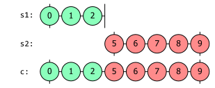
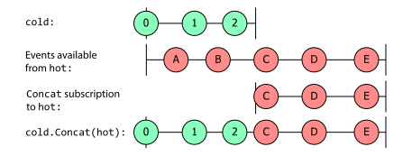
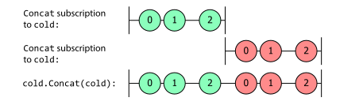
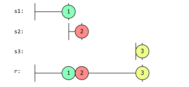

# 组合序列

数据源无处不在，有时我们需要从多个源消费数据。常见的具有多个输入的示例包括：价格提供、传感器网络、新闻提供、社交媒体聚合器、文件监视器、多触摸表面、心跳/轮询服务器等。我们处理这些多个刺激的方式也各不相同。我们可能希望将其全部作为一系列整合数据来消费，或者作为连续的顺序数据一次处理一条序列。我们也可以有条不紊地获取数据，将来自两个源的数据值配对在一起进行处理，或者只消费第一个响应请求的数据源的数据。

前面几章还举例说明了数据处理的扇出和扇回方式，在这种方式下，我们对数据进行分区，并在每个分区上执行处理，将高容量数据转换为低容量、高价值的事件，然后再重新组合。这种重组数据流的能力大大增强了运算符组合的优势。如果 Rx 只能让我们将组合作为简单的线性处理链来应用，那么它的功能就会大打折扣。而将流拆分开来的能力则为我们提供了更大的灵活性。因此，即使只有一个事件源，我们仍然经常需要将多个可观测流组合起来作为处理的一部分。序列组合使您能够跨多个数据源创建复杂的查询。这为编写一些功能强大而又简洁的代码提供了可能性。

在前面的章节中，我们已经使用过 [SelectMany](transformation-sequences.md)。这是 Rx 的基本操作之一。正如我们在[转换](transformation-sequences.md)一章中所看到的，我们可以从 `SelectMany` 创建其他几个运算符，而它结合数据流的能力正是其强大之处的一部分。不过，还有几种更专业的组合运算符可以使用，这使得解决某些问题比使用 `SelectMany` 更容易。此外，我们以前见过的一些操作符（包括 `TakeUntil` 和 `Buffer`）也有一些重载，但我们还没有探索过如何组合多个序列。

## 序列组合

我们将从最简单的组合运算符开始，它们不尝试并发组合。它们一次只处理一个源序列。

### Concat

`Concat` 可以说是组合序列的最简单方法。它的功能与其他 LINQ 提供程序中的同名程序相同：将两个序列连接起来。生成的序列会产生第一个序列中的所有元素，然后产生第二个序列中的所有元素。`Concat` 的最简单签名如下：

```c#
public static IObservable<TSource> Concat<TSource>(
    this IObservable<TSource> first, 
    IObservable<TSource> second)
```

由于 `Concat` 是一个扩展方法，我们可以在任何序列上作为一个方法调用它，将第二个序列作为唯一的参数传递进去：

```c#
IObservable<int> s1 = Observable.Range(0, 3);
IObservable<int> s2 = Observable.Range(5, 5);
IObservable<int> c = s1.Concat(s2);
IDisposable sub = c.Subscribe(Console.WriteLine, x => Console.WriteLine("Error: " + x));
```

这个大理石图显示了 `s1` 和 `s2` 这两个来源中出现的项目，以及 `Concat` 如何将它们合并为结果 `c`：



Rx 的 `Concat` 在它返回的 `IObservable<T>` 被订阅之前，不会对其源做任何操作。因此，在本例中，当我们对 `c`（`Concat` 返回的源）调用 `Subscribe` 时，它会订阅它的第一个输入 `s1`，每次产生一个值时，`c` 观察对象都会向它的订阅者发送相同的值。如果我们在 `s1` 完成之前继续调用 `sub.Dispose()`，`Concat` 将取消订阅第一个输入源，并且永远不会订阅 `s2`。如果 `s1` 报错，`c` 也会向订阅者报告同样的错误，同样也不会订阅 `s2`。只有当 `s1` 完成时，`Concat` 运算符才会订阅 `s2`，此时它将转发第二个输入产生的任何项目，直到第二个源完成或失败，或者应用程序从连接的可观察对象中取消订阅。

尽管 Rx 的 `Concat` 具有与 LINQ to Objects `Concat` 相同的逻辑行为，但仍有一些 Rx 特有的细节需要注意。特别是，与其他 LINQ 实现相比，Rx 的时机往往更为重要。例如，在 Rx 中，我们区分了[热源和冷源](key-types.md)。对于冷源，您订阅的确切时间通常并不重要，但热源基本上是实时的，因此您只能在订阅时收到发生的事情的通知。这意味着热源可能与 `Concat` 并不匹配，下面的大理石图说明了这种情况下可能产生的令人惊讶的结果：


由于 `Concat` 在第一个输入完成之前不会订阅第二个输入，因此它不会看到热源向任何从一开始就在监听的订阅者发送的前几个条目。这可能不是你所期望的行为：它肯定不像是将第一个序列中的所有项目与第二个序列中的所有项目进行了连接。看起来，它好像漏掉了 `A` 和 `B`。

### 大理石图的局限性

最后一个示例揭示了大理石图忽略了一个细节：它显示了源何时开始、何时产生值、何时结束，但却忽略了一个事实，即可观察源需要一个订阅者才能产生项目。如果没有任何东西订阅 `IObservable<T>`，那么它就不会产生任何东西。`Concat` 在第一个输入完成之前不会订阅它的第二个输入，因此可以说，与上图相比，显示这一点更准确：


这样就更容易理解为什么 `Concat` 会产生这样的输出。但是，由于 `hot` 在这里是一个热源，因此该图未能表达出 `hot` 完全按照自己的计划生产项目这一事实。在 `hot` 有多个订阅者的情况下，可以说前面的图更好，因为它能正确反映 `hot` 的每个可用事件（无论在任何特定时刻有多少监听者订阅）。但是，虽然这种约定适用于热源，却不适用于冷源，因为冷源通常在订阅后就开始产生项目。由 `Timer` 返回的信息源会按固定的时间表生产项目，但该时间表从订阅发生时开始。这意味着，如果有多个订阅，就会有多个时间表。即使我只有一个由 `Observable.Timer` 返回的 `IObservable<long>`，每个不同的订阅者也会按照自己的时间表获得项目--订阅者会从他们偶然订阅的时间开始，以固定的时间间隔接收事件。因此，对于冷观察对象，使用第二张图中所使用的约定通常是合理的，在这张图中，我们查看的是源的一个特定订阅所接收到的事件。

大多数情况下，我们可以忽略这一微妙之处，静静地使用适合自己的约定。套用[胖墩儿的话：当我使用大理石图时，它的意思就是我选择的意思--不多也不少](https://www.goodreads.com/quotes/12608-when-i-use-a-word-humpty-dumpty-said-in-rather)。但是，当你把热源和冷源结合在一起时，可能并没有一种明显的最佳方法来用大理石图来表示。我们甚至可以这样做，将热源所代表的事件与特定订阅热源所看到的事件分开描述。



我们在大理石图中使用不同的“通道”来表示特定订阅源看到的事件。利用这种技术，我们还可以显示将同一个冷源传递到 `Concat` 两次会发生什么：



这突出了一个事实，即作为冷源，冷向每个订阅分别提供项目。我们看到，同样的三个值来自同一个来源，但出现的时间不同。

#### 连接多个来源

如果要连接两个以上的序列怎么办？`Concat` 有一个重载，可以将多个可观测序列作为一个数组。该重载使用 `params` 关键字注释，因此您无需明确构造数组。您只需传递任意数量的参数，C# 编译器就会为您生成创建数组的代码。此外，还有一个重载，可以接收一个 `IEnumerable<IObservable<T>>` ，以防要连接的可观察对象已经在某个集合中。

```c#
public static IObservable<TSource> Concat<TSource>(
    params IObservable<TSource>[] sources)

public static IObservable<TSource> Concat<TSource>(
    this IEnumerable<IObservable<TSource>> sources)
```

`IEnumerable<IObservable<T>>` 重载会惰性地评估源。只有在有人订阅 `Concat` 返回的可观察对象时，它才会开始询问源可观察对象，并且只有在当前源完成时（这意味着它已准备好开始处理文本），它才会在生成的 `IEnumerator<IObservable<T>>` 上再次调用 `MoveNext`。为了说明这一点，下面的示例是一个迭代器方法，它返回一个序列，并带有日志记录。它返回三个可观察序列，每个序列都有一个值 [1]、[2] 和 [3]。每个序列在定时器延迟时返回其值。

```c#
public IEnumerable<IObservable<long>> GetSequences()
{
    Console.WriteLine("GetSequences() called");
    Console.WriteLine("Yield 1st sequence");

    yield return Observable.Create<long>(o =>
    {
        Console.WriteLine("1st subscribed to");
        return Observable.Timer(TimeSpan.FromMilliseconds(500))
            .Select(i => 1L)
            .Finally(() => Console.WriteLine("1st finished"))
            .Subscribe(o);
    });

    Console.WriteLine("Yield 2nd sequence");

    yield return Observable.Create<long>(o =>
    {
        Console.WriteLine("2nd subscribed to");
        return Observable.Timer(TimeSpan.FromMilliseconds(300))
            .Select(i => 2L)
            .Finally(() => Console.WriteLine("2nd finished"))
            .Subscribe(o);
    });

    Thread.Sleep(1000); // Force a delay

    Console.WriteLine("Yield 3rd sequence");

    yield return Observable.Create<long>(o =>
    {
        Console.WriteLine("3rd subscribed to");
        return Observable.Timer(TimeSpan.FromMilliseconds(100))
            .Select(i=>3L)
            .Finally(() => Console.WriteLine("3rd finished"))
            .Subscribe(o);
    });

    Console.WriteLine("GetSequences() complete");
}
```

我们可以调用 `GetSequences` 方法，将结果传递给 `Concat`，然后使用 `Dump` 扩展方法观察结果：

```c#
GetSequences().Concat().Dump("Concat");
```

输出：

```
GetSequences() called
Yield 1st sequence
1st subscribed to
Concat-->1
1st finished
Yield 2nd sequence
2nd subscribed to
Concat-->2
2nd finished
Yield 3rd sequence
3rd subscribed to
Concat-->3
3rd finished
GetSequences() complete
Concat completed
```

下面是将 `Concat` 运算符应用于 `GetSequences` 方法的大理石图。s1、s2 和 s3 分别代表序列 1、2 和 3。rs 分别代表结果序列。



需要注意的是，一旦迭代器执行了第一个 `yield return` 来返回第一个序列，迭代器就不会继续执行，直到第一个序列完成。迭代器在第一个 `yield return` 之后立即调用 `Console.WriteLine` 来显示文本 `Yield 2nd sequence`，但你可以看到这条消息直到我们看到来自 `Concat` 的第一个输出消息 `Concat-->1` 和由 `Finally` 操作符生成的第一个完成消息 `1st finished` 出现在输出中之后才出现。（代码还使得第一个源在生成其值之前延迟了 500 毫秒，以便如果你运行这段代码，你可以看到一切都会停止一会儿，直到第一个源产生其单个值然后完成。）一旦第一个源完成，`GetSequences` 方法继续执行（因为 `Concat` 在第一个可观察源完成后会要求它提供下一项）。当 `GetSequences` 通过另一个 `yield return` 提供第二个序列时，`Concat` 订阅它，然后 `GetSequences` 不再向前执行，直到第二个可观察序列完成。当要求第三个序列时，迭代器本身会等待一秒钟才生成第三个和最后一个值，你可以从图中 `s2` 结束和 `s3` 开始之间的间隔中看出这一点。

### Prepend

`Concat` 支持一种特殊的情况，但方式略显麻烦。有时，制作一个总是立即发射某些初始值的序列会很有用。就拿我在本书中经常用到的例子来说，船只通过发送 AIS 信息来报告它们的位置和其他信息：在某些应用程序中，你可能不想等到船只下一次出现时再发送信息。您可以想象一个记录任何船只最后已知位置的应用程序。这样，应用程序就可以提供一个 `IObservable<IVesselNavigation>`，它可以在订阅后立即报告最后的已知信息，然后，如果船只发出任何较新的信息，它就会继续提供这些信息。

我们该如何实现这一点呢？我们希望最初的行为类似于冷源，但随后过渡到热源。因此，我们可以将两个源连接起来。我们可以使用 [Observable.Return](creating-observable-sequences.md) 创建一个单元素冷源，然后将其与实时流连接起来：

```c#
IVesselNavigation lastKnown = ais.GetLastReportedNavigationForVessel(mmsi);
IObservable<IVesselNavigation> live = ais.GetNavigationMessagesForVessel(mmsi);

IObservable<IVesselNavigation> lastKnownThenLive = Observable.Concat(
    Observable.Return(lastKnown), live);
```

这是一个很常见的要求，Rx 提供的 `Prepend` 也有类似效果。我们可以将最后一行替换为：

```c#
IObservable<IVesselNavigation> lastKnownThenLive = live.Prepend(lastKnown);
```

该观测值的作用与此完全相同：订阅者将立即收到 `lastKnown` 信息，然后如果船只发出更多导航信息，他们也将收到这些信息。顺便提一下，在这种情况下，您可能还想确保 `lastKnown` 信息的查询尽可能晚地进行。我们可以使用延迟（[Defer](creating-observable-sequences.md)）功能将这一过程推迟到订阅点：

```c#
public static IObservable<IVesselNavigation> GetLastKnownAndSubsequenceNavigationForVessel(uint mmsi)
{
    return Observable.Defer<IVesselNavigation>(() =>
    {
        // This lambda will run each time someone subscribes.
        IVesselNavigation lastKnown = ais.GetLastReportedNavigationForVessel(mmsi);
        IObservable<IVesselNavigation> live = ais.GetNavigationMessagesForVessel(mmsi);

        return live.Prepend(lastKnown);
    }
}
```

`StartWith` 可能会让您想起 `BehaviorSubject<T>`，因为它也能确保消费者在订阅后立即收到一个值。但这并不完全相同：`BehaviorSubject<T>` 会缓存其自身源发出的最后一个值。您可能会认为这将使它成为实现此容器导航示例的更好方法。但是，由于该示例能够返回任何船只的源（`mmsi` 参数是唯一标识船只的[海事移动服务标识](https://en.wikipedia.org/wiki/Maritime_Mobile_Service_Identity)），因此需要为您感兴趣的每一艘船只都运行一个 `BehaviorSubject<T>`，这可能不太现实。

`BehaviorSubject<T>` 只能保留一个值，这对 AIS 场景来说没有问题，`Prepend` 也有同样的限制。但是，如果您需要从某个特定序列开始的源怎么办？

### StartWith