# 组合序列

数据源无处不在，有时我们需要从多个源消费数据。常见的具有多个输入的示例包括：价格提供、传感器网络、新闻提供、社交媒体聚合器、文件监视器、多触摸表面、心跳/轮询服务器等。我们处理这些多个刺激的方式也各不相同。我们可能希望将其全部作为一系列整合数据来消费，或者作为连续的顺序数据一次处理一条序列。我们也可以有条不紊地获取数据，将来自两个源的数据值配对在一起进行处理，或者只消费第一个响应请求的数据源的数据。

前面几章还举例说明了数据处理的扇出和扇回方式，在这种方式下，我们对数据进行分区，并在每个分区上执行处理，将高容量数据转换为低容量、高价值的事件，然后再重新组合。这种重组数据流的能力大大增强了运算符组合的优势。如果 Rx 只能让我们将组合作为简单的线性处理链来应用，那么它的功能就会大打折扣。而将流拆分开来的能力则为我们提供了更大的灵活性。因此，即使只有一个事件源，我们仍然经常需要将多个可观测流组合起来作为处理的一部分。序列组合使您能够跨多个数据源创建复杂的查询。这为编写一些功能强大而又简洁的代码提供了可能性。

在前面的章节中，我们已经使用过 [SelectMany](transformation-sequences.md)。这是 Rx 的基本操作之一。正如我们在[转换](transformation-sequences.md)一章中所看到的，我们可以从 `SelectMany` 创建其他几个运算符，而它结合数据流的能力正是其强大之处的一部分。不过，还有几种更专业的组合运算符可以使用，这使得解决某些问题比使用 `SelectMany` 更容易。此外，我们以前见过的一些操作符（包括 `TakeUntil` 和 `Buffer`）也有一些重载，但我们还没有探索过如何组合多个序列。

## 序列组合

我们将从最简单的组合运算符开始，它们不尝试并发组合。它们一次只处理一个源序列。

### Concat

`Concat` 可以说是组合序列的最简单方法。它的功能与其他 LINQ 提供程序中的同名程序相同：将两个序列连接起来。生成的序列会产生第一个序列中的所有元素，然后产生第二个序列中的所有元素。`Concat` 的最简单签名如下：

```c#
public static IObservable<TSource> Concat<TSource>(
    this IObservable<TSource> first, 
    IObservable<TSource> second)
```

由于 `Concat` 是一个扩展方法，我们可以在任何序列上作为一个方法调用它，将第二个序列作为唯一的参数传递进去：

```c#
IObservable<int> s1 = Observable.Range(0, 3);
IObservable<int> s2 = Observable.Range(5, 5);
IObservable<int> c = s1.Concat(s2);
IDisposable sub = c.Subscribe(Console.WriteLine, x => Console.WriteLine("Error: " + x));
```

这个大理石图显示了 `s1` 和 `s2` 这两个来源中出现的项目，以及 `Concat` 如何将它们合并为结果 `c`：


Rx 的 `Concat` 在它返回的 `IObservable<T>` 被订阅之前，不会对其源做任何操作。因此，在本例中，当我们对 `c`（`Concat` 返回的源）调用 `Subscribe` 时，它会订阅它的第一个输入 `s1`，每次产生一个值时，`c` 观察对象都会向它的订阅者发送相同的值。如果我们在 `s1` 完成之前继续调用 `sub.Dispose()`，`Concat` 将取消订阅第一个输入源，并且永远不会订阅 `s2`。如果 `s1` 报错，`c` 也会向订阅者报告同样的错误，同样也不会订阅 `s2`。只有当 `s1` 完成时，`Concat` 运算符才会订阅 `s2`，此时它将转发第二个输入产生的任何项目，直到第二个源完成或失败，或者应用程序从连接的可观察对象中取消订阅。

尽管 Rx 的 `Concat` 具有与 LINQ to Objects `Concat` 相同的逻辑行为，但仍有一些 Rx 特有的细节需要注意。特别是，与其他 LINQ 实现相比，Rx 的时机往往更为重要。例如，在 Rx 中，我们区分了[热源和冷源](key-types.md)。对于冷源，您订阅的确切时间通常并不重要，但热源基本上是实时的，因此您只能在订阅时收到发生的事情的通知。这意味着热源可能与 `Concat` 并不匹配，下面的大理石图说明了这种情况下可能产生的令人惊讶的结果：


由于 `Concat` 在第一个输入完成之前不会订阅第二个输入，因此它不会看到热源向任何从一开始就在监听的订阅者发送的前几个条目。这可能不是你所期望的行为：它肯定不像是将第一个序列中的所有项目与第二个序列中的所有项目进行了连接。看起来，它好像漏掉了 `A` 和 `B`。

### 大理石图的局限性

最后一个示例揭示了大理石图忽略了一个细节：它显示了源何时开始、何时产生值、何时结束，但却忽略了一个事实，即可观察源需要一个订阅者才能产生项目。如果没有任何东西订阅 `IObservable<T>`，那么它就不会产生任何东西。`Concat` 在第一个输入完成之前不会订阅它的第二个输入，因此可以说，与上图相比，显示这一点更准确：


这样就更容易理解为什么 `Concat` 会产生这样的输出。但是，由于 `hot` 在这里是一个热源，因此该图未能表达出 `hot` 完全按照自己的计划生产项目这一事实。在 `hot` 有多个订阅者的情况下，可以说前面的图更好，因为它能正确反映 `hot` 的每个可用事件（无论在任何特定时刻有多少监听者订阅）。但是，虽然这种约定适用于热源，却不适用于冷源，因为冷源通常在订阅后就开始产生项目。由 `Timer` 返回的信息源会按固定的时间表生产项目，但该时间表从订阅发生时开始。这意味着，如果有多个订阅，就会有多个时间表。即使我只有一个由 `Observable.Timer` 返回的 `IObservable<long>`，每个不同的订阅者也会按照自己的时间表获得项目--订阅者会从他们偶然订阅的时间开始，以固定的时间间隔接收事件。因此，对于冷观察对象，使用第二张图中所使用的约定通常是合理的，在这张图中，我们查看的是源的一个特定订阅所接收到的事件。

大多数情况下，我们可以忽略这一微妙之处，静静地使用适合自己的约定。套用[胖墩儿的话：当我使用大理石图时，它的意思就是我选择的意思--不多也不少](https://www.goodreads.com/quotes/12608-when-i-use-a-word-humpty-dumpty-said-in-rather)。但是，当你把热源和冷源结合在一起时，可能并没有一种明显的最佳方法来用大理石图来表示。我们甚至可以这样做，将热源所代表的事件与特定订阅热源所看到的事件分开描述。


我们在大理石图中使用不同的“通道”来表示特定订阅源看到的事件。利用这种技术，我们还可以显示将同一个冷源传递到 `Concat` 两次会发生什么：


这突出了一个事实，即作为冷源，冷向每个订阅分别提供项目。我们看到，同样的三个值来自同一个来源，但出现的时间不同。

#### 连接多个来源

如果要连接两个以上的序列怎么办？`Concat` 有一个重载，可以将多个可观测序列作为一个数组。该重载使用 `params` 关键字注释，因此您无需明确构造数组。您只需传递任意数量的参数，C# 编译器就会为您生成创建数组的代码。此外，还有一个重载，可以接收一个 `IEnumerable<IObservable<T>>` ，以防要连接的可观察对象已经在某个集合中。

```c#
public static IObservable<TSource> Concat<TSource>(
    params IObservable<TSource>[] sources)

public static IObservable<TSource> Concat<TSource>(
    this IEnumerable<IObservable<TSource>> sources)
```

`IEnumerable<IObservable<T>>` 重载会惰性地评估源。只有在有人订阅 `Concat` 返回的可观察对象时，它才会开始询问源可观察对象，并且只有在当前源完成时（这意味着它已准备好开始处理文本），它才会在生成的 `IEnumerator<IObservable<T>>` 上再次调用 `MoveNext`。为了说明这一点，下面的示例是一个迭代器方法，它返回一个序列，并带有日志记录。它返回三个可观察序列，每个序列都有一个值 [1]、[2] 和 [3]。每个序列在定时器延迟时返回其值。

```c#
public IEnumerable<IObservable<long>> GetSequences()
{
    Console.WriteLine("GetSequences() called");
    Console.WriteLine("Yield 1st sequence");

    yield return Observable.Create<long>(o =>
    {
        Console.WriteLine("1st subscribed to");
        return Observable.Timer(TimeSpan.FromMilliseconds(500))
            .Select(i => 1L)
            .Finally(() => Console.WriteLine("1st finished"))
            .Subscribe(o);
    });

    Console.WriteLine("Yield 2nd sequence");

    yield return Observable.Create<long>(o =>
    {
        Console.WriteLine("2nd subscribed to");
        return Observable.Timer(TimeSpan.FromMilliseconds(300))
            .Select(i => 2L)
            .Finally(() => Console.WriteLine("2nd finished"))
            .Subscribe(o);
    });

    Thread.Sleep(1000); // Force a delay

    Console.WriteLine("Yield 3rd sequence");

    yield return Observable.Create<long>(o =>
    {
        Console.WriteLine("3rd subscribed to");
        return Observable.Timer(TimeSpan.FromMilliseconds(100))
            .Select(i=>3L)
            .Finally(() => Console.WriteLine("3rd finished"))
            .Subscribe(o);
    });

    Console.WriteLine("GetSequences() complete");
}
```

我们可以调用 `GetSequences` 方法，将结果传递给 `Concat`，然后使用 `Dump` 扩展方法观察结果：

```c#
GetSequences().Concat().Dump("Concat");
```

输出：

```
GetSequences() called
Yield 1st sequence
1st subscribed to
Concat-->1
1st finished
Yield 2nd sequence
2nd subscribed to
Concat-->2
2nd finished
Yield 3rd sequence
3rd subscribed to
Concat-->3
3rd finished
GetSequences() complete
Concat completed
```

下面是将 `Concat` 运算符应用于 `GetSequences` 方法的大理石图。s1、s2 和 s3 分别代表序列 1、2 和 3。rs 分别代表结果序列。


需要注意的是，一旦迭代器执行了第一个 `yield return` 来返回第一个序列，迭代器就不会继续执行，直到第一个序列完成。迭代器在第一个 `yield return` 之后立即调用 `Console.WriteLine` 来显示文本 `Yield 2nd sequence`，但你可以看到这条消息直到我们看到来自 `Concat` 的第一个输出消息 `Concat-->1` 和由 `Finally` 操作符生成的第一个完成消息 `1st finished` 出现在输出中之后才出现。（代码还使得第一个源在生成其值之前延迟了 500 毫秒，以便如果你运行这段代码，你可以看到一切都会停止一会儿，直到第一个源产生其单个值然后完成。）一旦第一个源完成，`GetSequences` 方法继续执行（因为 `Concat` 在第一个可观察源完成后会要求它提供下一项）。当 `GetSequences` 通过另一个 `yield return` 提供第二个序列时，`Concat` 订阅它，然后 `GetSequences` 不再向前执行，直到第二个可观察序列完成。当要求第三个序列时，迭代器本身会等待一秒钟才生成第三个和最后一个值，你可以从图中 `s2` 结束和 `s3` 开始之间的间隔中看出这一点。

### Prepend

`Concat` 支持一种特殊的情况，但方式略显麻烦。有时，制作一个总是立即发射某些初始值的序列会很有用。就拿我在本书中经常用到的例子来说，船只通过发送 AIS 信息来报告它们的位置和其他信息：在某些应用程序中，你可能不想等到船只下一次出现时再发送信息。您可以想象一个记录任何船只最后已知位置的应用程序。这样，应用程序就可以提供一个 `IObservable<IVesselNavigation>`，它可以在订阅后立即报告最后的已知信息，然后，如果船只发出任何较新的信息，它就会继续提供这些信息。

我们该如何实现这一点呢？我们希望最初的行为类似于冷源，但随后过渡到热源。因此，我们可以将两个源连接起来。我们可以使用 [Observable.Return](creating-observable-sequences.md) 创建一个单元素冷源，然后将其与实时流连接起来：

```c#
IVesselNavigation lastKnown = ais.GetLastReportedNavigationForVessel(mmsi);
IObservable<IVesselNavigation> live = ais.GetNavigationMessagesForVessel(mmsi);

IObservable<IVesselNavigation> lastKnownThenLive = Observable.Concat(
    Observable.Return(lastKnown), live);
```

这是一个很常见的要求，Rx 提供的 `Prepend` 也有类似效果。我们可以将最后一行替换为：

```c#
IObservable<IVesselNavigation> lastKnownThenLive = live.Prepend(lastKnown);
```

该观测值的作用与此完全相同：订阅者将立即收到 `lastKnown` 信息，然后如果船只发出更多导航信息，他们也将收到这些信息。顺便提一下，在这种情况下，您可能还想确保 `lastKnown` 信息的查询尽可能晚地进行。我们可以使用延迟（[Defer](creating-observable-sequences.md)）功能将这一过程推迟到订阅点：

```c#
public static IObservable<IVesselNavigation> GetLastKnownAndSubsequenceNavigationForVessel(uint mmsi)
{
    return Observable.Defer<IVesselNavigation>(() =>
    {
        // This lambda will run each time someone subscribes.
        IVesselNavigation lastKnown = ais.GetLastReportedNavigationForVessel(mmsi);
        IObservable<IVesselNavigation> live = ais.GetNavigationMessagesForVessel(mmsi);

        return live.Prepend(lastKnown);
    }
}
```

`StartWith` 可能会让您想起 `BehaviorSubject<T>`，因为它也能确保消费者在订阅后立即收到一个值。但这并不完全相同：`BehaviorSubject<T>` 会缓存其自身源发出的最后一个值。您可能会认为这将使它成为实现此容器导航示例的更好方法。但是，由于该示例能够返回任何船只的源（`mmsi` 参数是唯一标识船只的[海事移动服务标识](https://en.wikipedia.org/wiki/Maritime_Mobile_Service_Identity)），因此需要为您感兴趣的每一艘船只都运行一个 `BehaviorSubject<T>`，这可能不太现实。

`BehaviorSubject<T>` 只能保留一个值，这对 AIS 场景来说没有问题，`Prepend` 也有同样的限制。但是，如果您需要从某个特定序列开始的源怎么办？

### StartWith

`StartWith` 是对 `Prepend` 的概括，使我们能够提供任意数量的值，以便在订阅后立即发送。与 `Prepend` 一样，它将继续转发来自源的任何其他通知。

正如您从其签名中看到的，该方法接收一个由值组成的 `params` 数组，因此您可以根据需要传入任意多或任意少的值：

```c#
// 将数值序列前缀为可观测序列。
public static IObservable<TSource> StartWith<TSource>(
    this IObservable<TSource> source, 
    params TSource[] values)
```

还有一个接受 `IEnumerable<T>` 的重载。需要注意的是，Rx 不会推迟对它的枚举。`StartWith` 在返回之前会立即将 `IEnumerable<T>` 转换为数组。

`StartsWith` 并不是常见的 LINQ 操作符，它的存在是 Rx 所特有的。如果想象一下 `StartsWith` 在 LINQ to Objects 中的样子，它与 [Concat](#Concat) 并没有什么不同。而在 Rx 中则有所不同，因为 `StartsWith` 在拉和推之间架起了一座有效的桥梁。它能有效地将我们提供的项目转换为可观察对象，然后将源参数连接到该可观察对象上。

### Append

`Prepend` 的存在可能会让您想知道是否有 `Append` 可以在任何 `IObservable<T>` 的末尾添加单个项目。毕竟，这是一个常见的 LINQ 操作符；例如，[LINQ to Objects 就有一个 Append 实现](https://learn.microsoft.com/en-us/dotnet/api/system.linq.enumerable.append)。而 Rx 确实提供了这样的功能：

```c#
IObservable<string> oneMore = arguments.Append("And another thing...");
```

没有相应的 `EndWith`。没有理由不存在这样一个东西，只是显然没有太多的需求--[Rx 代码库](https://github.com/dotnet/reactive)还没有这种功能请求。因此，尽管 `Prepend` 和 `Append` 的对称性确实表明 `StartWith` 和尚未假定的 `EndWith` 之间也可能存在类似的对称性，但这种对应关系的缺失似乎并没有造成任何问题。能够创建总是立即产生有用输出的可观测源显然是有价值的；而 `EndWith` 除了满足对对称性的渴望之外，还有什么用处就不清楚了。

### DefaultIfEmpty

接下来我们将讨论的操作符并不严格执行顺序组合。然而，它与 `Append` 和 `Prepend` 非常相似。与这些操作符一样，它将发出源发出的所有内容。与这些操作符一样，`DefaultIfEmpty` 需要一个额外的项。不同之处在于，它不总是会发出该额外的项。

`Prepend` 会在开始时发出附加项，`Append` 会在结束时发出附加项，而 `DefaultIfEmpty` 只有在源代码完成时才会发出附加项。因此，这提供了一种保证可观察对象不为空的方法。

您不必为 `DefaultIfEmpty` 提供值。如果使用重载，而不提供任何值，它就会使用 `default(T)`。对于结构类型，这将是一个类似于零值的值，而对于引用类型，这将是一个空值。

### Repeat

最后一个按顺序组合序列的运算符是 `Repeat`。它允许你简单地重复一个序列。它提供的重载可以指定重复输入的次数，也可以无限重复：

```c#
// Repeats the observable sequence a specified number of times.
public static IObservable<TSource> Repeat<TSource>(
    this IObservable<TSource> source, 
    int repeatCount)

// Repeats the observable sequence indefinitely and sequentially.
public static IObservable<TSource> Repeat<TSource>(
    this IObservable<TSource> source)
```

每次 `Repeat` 都会重新订阅信息源。这意味着只有在每次订阅时源都产生相同的项目时，才会严格重复。与 [ReplaySubject<T>](creating-observable-sequences.md#ReplaySubject<T>) 不同的是，它不会存储和重放从源中产生的项目。这意味着您通常不会希望在热源上调用 `Repeat`。(如果您真的希望重复热源的输出，[Replay](https://github.com/dotnet/reactive/blob/main/Rx.NET/Documentation/IntroToRx/15_PublishingOperators.md#replay) 和 `Repeat` 的组合可能会满足您的要求）。

如果使用无限期重复的重载，那么只有在出现错误或处理订阅时，序列才会停止。而指定重复次数的重载会在出错、取消订阅或达到该次数时停止。本例显示序列 [0,1,2] 重复了三次。

```c#
var source = Observable.Range(0, 3);
var result = source.Repeat(3);

result.Subscribe(
    Console.WriteLine,
    () => Console.WriteLine("Completed"));
```

输出：

```
0
1
2
0
1
2
0
1
2
Completed
```

## 并发序列

现在，我们将转到运算符，用于组合可能并发产生值的可观测序列。

### Amb

`Amb` 是一个名字很奇怪的运算符。如果你对这个名字感到好奇，可以在[附录 D 中了解 Amb 的起源](https://github.com/dotnet/reactive/blob/main/Rx.NET/Documentation/IntroToRx/D_AlgebraicUnderpinnings.md#amb)，但现在，让我们来看看它的实际作用。Rx 的 `Amb` 将任意数量的 `IObservable<T>` 源作为输入，并等待观察哪一个（如果有的话）首先产生某种输出。一旦出现这种情况，它就会立即取消订阅所有其他源，并转发最先做出反应的源的所有通知。

这有什么用？

`Amb` 的一个常见用例是，当您想尽快产生某种结果时，您有多个获得该结果的选项，但您事先并不知道哪个选项最快。也许有多个服务器都有可能给出您想要的答案，但无法预测哪个服务器的响应时间最短。你可以向所有服务器发送请求，然后只使用第一个服务器做出响应。如果将每个请求都建模为自己的 `IObservable<T>`，`Amb` 就可以帮你处理这个问题。请注意，这样做的效率并不高：您要求多个服务器都做同样的工作，而您将丢弃其中大部分的结果。(由于 `Amb` 会在第一个服务器做出反应后立即取消订阅所有它不打算使用的信息源，因此您有可能向所有其他服务器发送消息以取消请求。但这样做还是有些浪费）。但在有些情况下，及时性至关重要，在这种情况下，为了更快地产生结果，可能值得容忍一些浪费。

`Amb` 与 `Task.WhenAny` 大致相似，它可以让您检测多个源中的第一个源何时做了某事。不过，这种类比并不精确。`Amb` 会自动取消所有其他来源的订阅，确保一切都被清理干净。对于任务，您应始终确保最终观察到所有任务，以防其中任何任务出现故障。

为了说明 `Amb` 的行为，下面是一个大理石图，显示了三个序列 `s1`、`s2` 和 `s3`，每个序列都能产生一个序列值。如图所示，`r` 提供的通知与 `s1` 完全相同，因为在本例中，`s1` 是第一个产生值的序列。

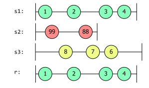

这段代码完全模拟了大理石图中描述的情况，以验证 `Amb` 确实是这样工作的：

```
var s1 = new Subject<int>();
var s2 = new Subject<int>();
var s3 = new Subject<int>();

var result = Observable.Amb(s1, s2, s3);

result.Subscribe(
    Console.WriteLine,
    () => Console.WriteLine("Completed"));

s1.OnNext(1);
s2.OnNext(99);
s3.OnNext(8);
s1.OnNext(2);
s2.OnNext(88);
s3.OnNext(7);
s2.OnCompleted();
s1.OnNext(3);
s3.OnNext(6);
s1.OnNext(4);
s1.OnCompleted();
s3.OnCompleted();
```

输出：

```
1
2
3
4
Completed
```

如果我们改变顺序，使 `s2.OnNext(99)` 在调用 `s1.OnNext(1)` 之前，那么 `s2` 将首先产生值，大理石图就会变成这样。

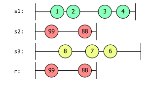

`Amb` 有几个重载方法。前面的示例使用了接受序列的 `params` 数组的重载。还有一个重载方法接受恰好两个源，避免了使用 `params` 时的数组分配。最后，你可以传入一个 `IEnumerable<IObservable<T>>`。（请注意，没有接受 `IObservable<IObservable<T>>` 的重载。`Amb` 要求它监视的所有源可观察对象在一开始就被提供。）

```c#
// Propagates the observable sequence that reacts first.
public static IObservable<TSource> Amb<TSource>(
    this IObservable<TSource> first, 
    IObservable<TSource> second)
{...}
public static IObservable<TSource> Amb<TSource>(
    params IObservable<TSource>[] sources)
{...}
public static IObservable<TSource> Amb<TSource>(
    this IEnumerable<IObservable<TSource>> sources)
{...}
```

在重用来自 `Concat` 部分的 `GetSequences` 方法时，我们可以看到 `Amb` 在订阅其返回的任何序列之前完全评估外部（IEnumerable）序列。

```c#
GetSequences().Amb().Dump("Amb");
```

输出：

```
GetSequences() called
Yield 1st sequence
Yield 2nd sequence
Yield 3rd sequence
GetSequences() complete
1st subscribed to
2nd subscribed to
3rd subscribed to
Amb-->3
Amb completed
```

下面的大理石图展示代码的行为：


请记住，`GetSequences` 在被要求时立即生成它的前两个可观察对象，然后在生成第三个和最后一个可观察对象之前等待1秒钟。但与 `Concat` 不同，`Amb` 在从迭代器中检索到所有源之前不会订阅任何一个源，这就是为什么这个大理石图显示所有三个源的订阅在1秒钟后开始。（前两个源之前是可用的——`Amb` 会在订阅发生时开始枚举源，但它会等到获取到所有三个源后才订阅，这就是为什么它们都出现在右边的原因。）第三个序列在订阅和生成其值之间的延迟最短，因此尽管它是最后一个返回的可观察对象，但它能够在最快的时间内生成其值，尽管在它之前有两个一秒钟之前产生的序列（由于 `Thread.Sleep`）。

### Merge

`Merge` 扩展方法接受多个序列作为输入。每当任何一个输入序列产生一个值时，`Merge` 返回的可观察对象也会产生相同的值。如果输入序列在不同的线程上同时产生值，`Merge` 会安全地处理这种情况，确保逐个传递每个项。

由于 `Merge` 返回一个包含所有输入序列的所有值的单个可观察序列，从某种意义上说，它与 `Concat` 类似。但是，与 `Concat` 等待每个输入序列完成后再进入下一个序列不同，`Merge` 支持并发活动的序列。一旦你订阅 `Merge` 返回的可观察对象，它立即订阅所有输入序列，并将它们产生的所有内容转发出去。这个大理石图展示了两个并发运行的序列 `s1` 和 `s2`，并且 `r` 表示使用 `Merge` 合并它们的效果：来自两个源序列的值从合并的序列中出现。

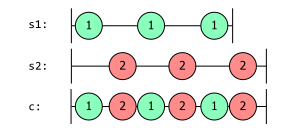

`Merge` 的结果只有在所有输入序列都完成后才会完成。不过，如果任何一个输入序列错误终止，`Merge` 运算符就会出错（此时它将取消订阅所有其他输入序列）。

如果您阅读了[创建观察项](creating-observable-sequences.md)一章，就会看到 `Merge` 操作的一个示例。在 [Rx 中表示文件系统事件](creating-observable-sequences.md#在 Rx 中表示文件系统事件)一节的结尾，我用它将代表 `FileSystemWatcher` 提供的各种事件的单个序列合并成了一个流。再举一个例子，让我们再次看看 AIS。目前还没有公开可用的单一全局源，能以 `IObservable<IAisMessage>` 的形式提供全球范围内的所有 AIS 消息。任何单一来源都可能只覆盖一个地区，甚至可能只覆盖一个 AIS 接收机。有了 `Merge` 功能，就可以直接将这些信息合并成一个信息源：

```c#
IObservable<IAisMessage> station1 = aisStations.GetMessagesFromStation("AdurStation");
IObservable<IAisMessage> station2 = aisStations.GetMessagesFromStation("EastbourneStation");

IObservable<IAisMessage> allMessages = station1.Merge(station2);
```

如果您想合并两个以上的数据源，您有几种选择：

- 将合并运算符串联起来，例如：`s1.Merge(s2).Merge(s3)`
- 将序列参数数组传递给 `Observable.Merge` 静态方法，例如：`Observable.Merge(s1,s2,s3)`
- 对 `IEnumerable<IObservable<T>>` 应用 `Merge` 运算符。
- 对 `IObservable<IObservable<T>>` 应用 Merge 操作符。

重载如下：

```c#
/// Merges two observable sequences into a single observable sequence.
/// Returns a sequence that merges the elements of the given sequences.
public static IObservable<TSource> Merge<TSource>(
    this IObservable<TSource> first, 
    IObservable<TSource> second)
{...}

// Merges all the observable sequences into a single observable sequence.
// The observable sequence that merges the elements of the observable sequences.
public static IObservable<TSource> Merge<TSource>(
    params IObservable<TSource>[] sources)
{...}

// Merges an enumerable sequence of observable sequences into a single observable sequence.
public static IObservable<TSource> Merge<TSource>(
    this IEnumerable<IObservable<TSource>> sources)
{...}

// Merges an observable sequence of observable sequences into an observable sequence.
// Merges all the elements of the inner sequences in to the output sequence.
public static IObservable<TSource> Merge<TSource>(
    this IObservable<IObservable<TSource>> sources)
{...}
```

随着被合并源的数量增加，使用集合的操作符比第一次重载更有优势。(例如，`s1.Merge(s2).Merge(s3)` 的性能略低于 `Observable.Merge(new[] { s1, s2, s3 })` 或等效的 `Observable.Merge(s1,s2,s3)`)。不过，就三或四个重载而言，它们之间的差异很小，因此在实践中，您可以根据自己喜欢的风格在前两个重载之间做出选择。(如果要合并 100 个或更多数据源，差异就会更明显，但到了那个阶段，你可能无论如何都不想使用链式调用方式了）。第三个和第四个重载允许在运行时对合并序列进行懒散的评估。

最后一个 `Merge` 重载获取了一个序列，这一点特别有趣，因为它使得被合并的源集合可以随着时间的推移而增长。只要你的代码订阅了 `Merge` 返回的 `IObservable<T>`，`Merge` 就会一直订阅源。因此，如果随着时间的推移，源发出的 `IObservable<T>` 越来越多，这些源都将被合并。

这听起来可能有点耳熟。`SelectMany` 操作符可以将多个可观察源重新扁平化为一个可观察源。这再次说明了为什么我把 `SelectMany` 描述为 Rx 中的基本运算符：严格来说，我们并不需要 Rx 提供的很多运算符，因为我们可以使用 `SelectMany` 构建它们。下面是使用 `SelectMany` 对最后一个 `Merge` 重载的简单重新实现：

```c#
public static IObservable<T> MyMerge<T>(this IObservable<IObservable<T>> sources) =>
    sources.SelectMany(source => source);
```

除了说明我们在技术上并不需要 Rx 为我们提供最后的合并功能外，它还很好地说明了为什么它能提供合并功能。这并不是一眼就能看出它的作用。为什么我们要传递一个只返回参数的 lambda？除非你以前见过它，否则你可能需要花些心思才能明白，`SelectMany` 希望我们传递一个回调，它将调用每个输入项，但我们的输入项已经是嵌套序列了，所以我们可以直接返回每个项，`SelectMany` 会接收这些回调，并将其产生的所有内容合并到输出流中。即使你已经完全内化了 `SelectMany`，以至于你马上就知道这将只是扁平化 `source`，你仍然可能会发现 `Observable.Merge(sources)` 更直接地表达了你的意图。(另外，由于 `Merge` 是一个更专业的操作符，Rx 能够提供比上面的 `SelectMany` 版本更高效的实现）。

如果我们再次使用 `GetSequences` 方法，就能看到合并操作符是如何处理序列的。

```c#
GetSequences().Merge().Dump("Merge");
```

输出：

```
GetSequences() called
Yield 1st sequence
1st subscribed to
Yield 2nd sequence
2nd subscribed to
Merge --> 2
Merge --> 1
Yield 3rd sequence
3rd subscribed to
GetSequences() complete
Merge --> 3
Merge completed
```

从大理石图中我们可以看到，`s1` 和 `s2` 会立即产生并被订阅。所有输入序列完成后，结果序列也随之完成。

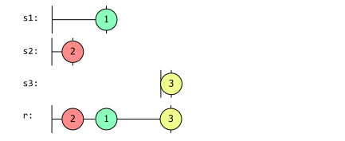

对于接受可变数量来源（通过数组、`IEnumerable<IObservable<T>>` 或 `IObservable<IObservable<T>>`）的每个合并重载，都有一个额外的重载，其中添加了一个 `maxconcurrent` 参数。例如

```c#
public static IObservable<TSource> Merge<TSource>(this IEnumerable<IObservable<TSource>> sources, int maxConcurrent)
```

这样就可以限制 `Merge` 在同一时间接受输入的源数量。如果可用的源的数量超过了 `maxConcurrent`（要么是因为你传入了一个包含更多源的集合，要么是因为你使用了基于 `IObservable<IObservable<T>` 的重载，而源发出的嵌套源数量超过了 `maxConcurrent`），`Merge` 将等待现有的源完成后再处理新的源。如果 `maxConcurrent` 值为 1，则合并的行为方式与 `Concat` 相同。

### Switch

Rx 的 `Switch` 运算符接收一个 `IObservable<IObservable<T>>`，并从最近的嵌套观察对象中产生通知。每当它的源产生一个新的嵌套 `IObservable<T>`，`Switch` 就会取消订阅前一个嵌套源（除非这是第一个源，在这种情况下就没有前一个源了），并订阅最新的源。

`Switch` 可用于日历应用程序中的 "出发时间" 类型功能。事实上，你可以看到[必应如何提供（或至少提供；实现方式可能已经改变）通知的修改版本的源](https://github.com/reaqtive/reaqtor/blob/c3ae17f93ae57f3fb75a53f76e60ae69299a509e/Reaqtor/Samples/Remoting/Reaqtor.Remoting.Samples/DomainFeeds.cs#L33-L76)。由于源代码来自于一个真实的例子，所以有点复杂，我在这里只描述其本质。

“出发时间”通知的基本思想是，我们使用地图和路线查找服务计算出到达约会地点的预计行程时间，并使用 [Timer 操作符](creating-observable-sequences.md#Observable.Timer)创建一个 `IObservable<T>`，在出发时间到时发出通知。(具体来说，这段代码会生成一个 `IObservable<TrafficInfo>`，它将报告拟议的行程路线和预计的旅行时间）。然而，有两件事可能会发生变化，从而使最初预测的行程时间变得毫无用处。首先，交通状况会发生变化。当用户创建预约时，我们必须根据当时的交通状况来猜测预计行程时间。但是，如果当天的交通状况真的很糟糕，预计时间就需要上调，我们也需要提前通知用户。

另一个可能发生变化的因素是用户的位置。这显然也会影响预测的行程时间。

为了解决这个问题，系统需要可观测的信息源来报告用户位置的变化以及影响拟议行程的交通状况的变化。每当其中任何一个发生变化时，我们都需要生成一个新的预计行程时间和一个新的 `IObservable<TrafficInfo>`，以便在出发时间到时发出通知。

每次修改估计时间时，我们都希望放弃之前创建的 `IObservable<TrafficInfo>`。(否则，用户将收到大量令人困惑的通知，每次我们重新计算行程时间，就会有一个通知告诉他们离开）。我们只想使用最新的通知。`Switch` 正是这么做的。

你可以在 [Reaqtor 软件仓库](https://github.com/reaqtive/reaqtor/blob/c3ae17f93ae57f3fb75a53f76e60ae69299a509e/Reaqtor/Samples/Remoting/Reaqtor.Remoting.Samples/DomainFeeds.cs#L33-L76)中看到该场景的示例。在这里，我要介绍另一个更简单的场景：实时搜索。当你输入时，文本会被发送到搜索服务，搜索结果会以可观测序列的形式返回给你。大多数实现都会在发送请求前稍作延迟，以避免不必要的工作发生。假设我想搜索 "Rx 介绍"。我快速输入了 "Into to"，然后发现我漏掉了字母 "r"。我稍作停留，将文本改为 "Intro"。至此，两个搜索结果已经发送到服务器。第一次搜索会返回我不想要的结果。此外，如果我收到的第一次搜索数据与第二次搜索结果合并在一起，用户的体验会非常奇怪。我真的只想要与最新搜索文本相对应的结果。这种情况非常适合 `Switch` 方法。

在这个示例中，有一个 `IObservable<string>` 源表示搜索文本--用户键入的每个新值都来自这个源序列。我们还有一个搜索函数，可以为给定的搜索词生成一个搜索结果：

```c#
private IObservable<string> SearchResults(string query)
{
    ...
}
```

该函数只返回一个值，但我们将其建模为 `IObservable<string>`，部分原因是为了应对执行搜索可能需要一些时间的事实，同时也是为了能够与 Rx 配合使用。我们可以获取搜索条件源，然后使用 `Select` 将每个新的搜索值传递给 `SearchResults` 函数。这样就创建了嵌套序列 `IObservable<IObservable<string>>`。

假设我们要使用合并来处理搜索结果：

```c#
IObservable<string> searchValues = ....;
IObservable<IObservable<string>> search = searchValues.Select(searchText => SearchResults(searchText));
                    
var subscription = search
    .Merge()
    .Subscribe(Console.WriteLine);
```

如果我们运气好，每次搜索都在 `searchValues` 的下一个元素产生之前完成，那么输出结果看起来会很合理。然而，更有可能出现的情况是，多次搜索会导致搜索结果重叠。这个大理石图显示了合并函数在这种情况下的作用。

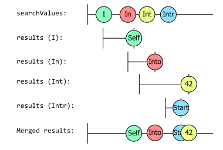

请注意搜索结果中的数值是如何混合在一起的。事实上，一些搜索词比其他搜索词需要更长的时间才能得到搜索结果，这也意味着它们的搜索顺序是错误的。这不是我们想要的结果。如果我们使用 `Switch` 扩展方法，就会得到更好的结果。`Switch` 将订阅外部序列，当每个内部序列产生时，它将订阅新的内部序列，并放弃对前一个内部序列的订阅。这将产生以下大理石图：

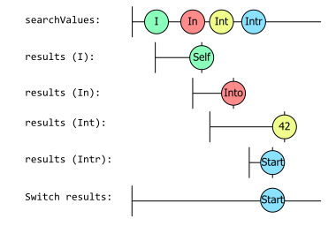

现在，每当出现一个新的搜索词，导致新的搜索被启动时，就会为该搜索结果出现一个相应的新 `IObservable<string>`，导致 `Switch` 取消订阅之前的结果。这意味着，任何过迟到达的结果（即搜索结果中的搜索词不再是搜索框中的搜索词）都将被放弃。在本例中，这意味着我们只能看到最终搜索词的结果。在用户输入时，我们看到的所有中间值都不会停留太久，因为在我们收到前一个值的结果之前，用户一直在按下一个键。只有在最后，当用户停止键入足够长的时间，搜索结果在过时之前返回时，我们才最终看到 `Switch` 的值。这样做的净效果是，我们消除了过时结果的混淆。

这是另一个因大理石图的模糊性而产生小问题的图表。我展示了每次调用 `SearchResults` 时产生的单个观测值，但实际上，除了最后一个观测值外，`Switch` 会在它们产生值之前取消订阅。因此，本图显示的是这些源可能产生的值，而不是它们作为订阅的一部分实际交付的值，因为订阅被中断了。

## 结对序列

前面的方法允许我们将共享一个共同类型的多个序列展开为一个相同类型的结果序列（使用不同的策略来决定包含什么和丢弃什么）。本节中的运算符仍将多个序列作为输入，但试图将每个序列中的值配对，为输出序列生成一个单一值。在某些情况下，它们还允许您提供不同类型的序列。

### Zip

`Zip` 将两个序列中的项目对组合在一起。因此，它的第一个输出是将一个输入序列中的第一个项目与另一个输入序列中的第一个项目合并而成。第二个输出是将每个输入中的第二个项目组合起来。以此类推。这个名字让人联想到衣服或包包上的拉链，它每次都会将拉链两端的齿一对对地拉在一起。

由于 `Zip` 拉链是按照严格的顺序将成对的项目组合在一起的，因此当第一个序列完成时，它就会完成。如果其中一个序列已经结束，那么即使另一个序列继续发出值，也没有任何值可以配对，因此 `Zip` 会在此时取消订阅，丢弃无法配对的值，然后报告完成。

如果两个序列中的任何一个出错，`Zip` 返回的序列也会报告同样的错误。

如果其中一个源序列发布值的速度比另一个序列快，那么发布速度将由两个序列中速度较慢的一个决定，因为它只能在每个源序列都有一个值的情况下才能发布一个项目。

下面是一个例子：

```c#
// Generate values 0,1,2 
var nums = Observable.Interval(TimeSpan.FromMilliseconds(250))
    .Take(3);

// Generate values a,b,c,d,e,f 
var chars = Observable.Interval(TimeSpan.FromMilliseconds(150))
    .Take(6)
    .Select(i => Char.ConvertFromUtf32((int)i + 97));

// Zip values together
nums.Zip(chars, (lhs, rhs) => (lhs, rhs)))
    .Dump("Zip");
```

从下面的大理石图中可以看出效果：

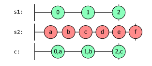

输出：

```
{ Left = 0, Right = a }
{ Left = 1, Right = b }
{ Left = 2, Right = c }
```

请注意，`nums` 序列在完成前只产生了三个值，而 `chars` 序列则产生了六个值。结果序列产生了三个值，这是它所能生成的最多对数。

值得注意的是，`Zip` 还有第二个重载，它将 `IEnumerable<T>` 作为第二个输入序列。

```c3
// Merges an observable sequence and an enumerable sequence into one observable sequence 
// containing the result of pair-wise combining the elements by using the selector function.
public static IObservable<TResult> Zip<TFirst, TSecond, TResult>(
    this IObservable<TFirst> first, 
    IEnumerable<TSecond> second, 
    Func<TFirst, TSecond, TResult> resultSelector)
{...}
```

这样，我们就可以从 `IEnumerable<T>` 和 `IObservable<T>` 范式中压缩序列！

### SequenceEqual

还有一个运算符可以处理来自两个来源的成对项目：`SequenceEqual`。但它不是为每对输入产生一个输出，而是对每对输入进行比较，最终产生一个单一的值，表明每对输入是否相等。

如果输入源产生不同的值，`SequenceEqual` 会在检测到这种情况后立即产生一个错误值。但是，如果输入源相等，它只能在两个输入源都完成后才能报告，因为在此之前，它还不知道稍后是否会出现差异。下面的示例说明了它的行为：

```C#
var subject1 = new Subject<int>();

subject1.Subscribe(
    i => Console.WriteLine($"subject1.OnNext({i})"),
    () => Console.WriteLine("subject1 completed"));

var subject2 = new Subject<int>();

subject2.Subscribe(
    i => Console.WriteLine($"subject2.OnNext({i})"),
    () => Console.WriteLine("subject2 completed"));

var areEqual = subject1.SequenceEqual(subject2);

areEqual.Subscribe(
    i => Console.WriteLine($"areEqual.OnNext({i})"),
    () => Console.WriteLine("areEqual completed"));

subject1.OnNext(1);
subject1.OnNext(2);

subject2.OnNext(1);
subject2.OnNext(2);
subject2.OnNext(3);

subject1.OnNext(3);

subject1.OnCompleted();
subject2.OnCompleted();
```

输出：

```
subject1.OnNext(1)
subject1.OnNext(2)
subject2.OnNext(1)
subject2.OnNext(2)
subject2.OnNext(3)
subject1.OnNext(3)
subject1 completed
subject2 completed
areEqual.OnNext(True)
areEqual completed
```

### CombineLatest

`CombineLatest` 运算符与 `Zip` 类似，都是将来源中的成对项目组合起来。不过，`CombineLatest` 并不是先将第一个项目配对，然后再将第二个项目配对，以此类推，而是在任何一个输入产生新值时都会产生一个输出。对于输入中出现的每一个新值，`CombineLatest` 都会将其与另一个输入中最近出现的值一起使用。(准确地说，在每个输入都产生至少一个值之前，它不会产生任何输出（因此，如果一个输入比另一个输入需要更长的时间才能开始，那么在一段时间内，`CombineLatest` 实际上不会在每次其中一个输入产生值时产生输出，因为它在等待另一个输入产生第一个值）。签名如下

```c#
// 每当其中一个可观察序列产生一个元素时，就使用选择器函数将两个可观察序列合成一个可观察序列。
public static IObservable<TResult> CombineLatest<TFirst, TSecond, TResult>(
    this IObservable<TFirst> first, 
    IObservable<TSecond> second, 
    Func<TFirst, TSecond, TResult> resultSelector)
{...}
```

下面的大理石图展示了 `CombineLatest` 的用法，其中一个序列产生数字（`s1`），另一个序列产生字母（`s2`）。如果 `resultSelector` 函数只是将数字和字母作为一对连接在一起，就会产生下行所示的结果。我对每个输出结果进行了颜色编码，以表明是两个来源中的哪一个导致了该结果的产生，但正如你所看到的，每个输出结果都包含了来自每个来源的一个值。

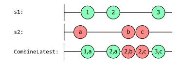

如果我们慢慢浏览上面的大理石图，首先会看到 `s2` 产生了字母 "a"，而 `s1` 还没有产生任何值，因此没有任何值可以配对，也就是说结果没有产生任何值。接下来，`s1` 产生了数字 "1"，因此结果序列现在可以产生一对 "1,a"。然后，我们从 `s1` 收到数字 "2"。最后一个字母仍然是 "a"，因此下一对是 "2,a"。然后产生字母 "b"，得到一对数字 "2,b"，接着产生字母 "c"，得到一对数字 "2,c"。最后产生数字 3，得到 "3,c"。

如果您需要对某些状态组合进行评估，而当该状态的任何一个组成部分发生变化时，都需要对其进行更新，那么这种方法就非常有用。一个简单的例子就是监控系统。每个服务都由一个序列表示，该序列返回一个布尔值，表示该服务的可用性。如果所有服务都可用，则监控状态为绿色；我们可以通过让结果选择器执行逻辑 AND 来实现这一点。下面是一个示例。

```c#
IObservable<bool> webServerStatus = GetWebStatus();
IObservable<bool> databaseStatus = GetDBStatus();

// Yields true when both systems are up.
var systemStatus = webServerStatus
    .CombineLatest(
        databaseStatus,
        (webStatus, dbStatus) => webStatus && dbStatus);
```

您可能已经注意到，这种方法可能会产生大量重复值。例如，如果网络服务器宕机，结果序列将产生 `false` 值。如果数据库随后宕机，又会产生另一个（不必要的）`false` 值。这正是使用 `DistinctUntilChanged` 扩展方法的适当时机。更正后的代码如下所示。

```c#
// Yields true when both systems are up, and only on change of status
var systemStatus = webServerStatus
    .CombineLatest(
        databaseStatus,
        (webStatus, dbStatus) => webStatus && dbStatus)
    .DistinctUntilChanged();
```

### Join

通过 `Join` 操作符，可以在逻辑上将两个序列连接起来。`Zip` 操作符会根据两个序列中的值在序列中的位置将其配对，而 `Join` 操作符则允许您根据元素的发射时间来连接序列。

由于可观测源产生值在逻辑上是一个瞬时事件，因此连接使用了相交窗口模型。回想一下，使用 `Window` 运算符，您可以使用可观测序列定义每个窗口的持续时间。`Join` 运算符使用了类似的概念：对于每个来源，我们可以定义一个时间窗口，在这个时间窗口中，每个元素都被视为 "当前"元素，如果来自不同来源的两个元素的时间窗口重叠，它们就会被连接起来。与 `Zip` 运算符一样，我们也需要提供一个选择器函数，以便从每对值中生成结果项。下面是 `Join` 操作符：

```c#
public static IObservable<TResult> Join<TLeft, TRight, TLeftDuration, TRightDuration, TResult>
(
    this IObservable<TLeft> left,
    IObservable<TRight> right,
    Func<TLeft, IObservable<TLeftDuration>> leftDurationSelector,
    Func<TRight, IObservable<TRightDuration>> rightDurationSelector,
    Func<TLeft, TRight, TResult> resultSelector
)
```

要一次性理解这个复杂的签名，让我们一个参数一个参数地看。

`IObservable<TLeft> left` 是第一个源序列。`IObservable<TRight> right` 是第二个源序列。`Join` 希望产生成对的项目，每对项目包含一个来自左边的元素和一个来自右边的元素。

通过 `leftDurationSelector` 参数，我们可以为来自左侧的每个项定义时间窗口。源项的时间窗口从源发出该项目时开始。要确定来自左侧的项目的窗口何时关闭，`Join` 将调用 `leftDurationSelector`，并传递 `left` 刚刚产生的值。该选择器必须返回一个可观察的源。(这个源的元素类型并不重要，因为 `Join` 只关心它什么时候做事）。一旦 `leftDurationSelector` 为项目返回的源产生值或完成，项目的时间窗口就会结束。

`rightDurationSelector` 参数定义了从右开始的每个项目的时间窗口。其工作方式与 `leftDurationSelector` 完全相同。

初始状态，没有当前项目。但当左侧和右侧产生项目时，这些项目的窗口就会启动，因此 `Join` 可能有多个项目的窗口都处于打开状态。每当左侧生成一个新项目时，`Join` 就会查看右侧是否有任何项目的窗口仍然打开。如果有，左就会与它们配对。(因此，来自一个数据源的单个项目可能会与来自另一个数据源的多个项目连接起来）。每次配对时，`Join` 都会调用 `resultSelector`。同样，每当右边产生一个项目时，如果左边的项目有任何当前打开的窗口，右边的新项目就会与这些窗口配对，同样，每次配对都会调用 `resultSelector`。

每次调用 `resultSelector`，`Join` 返回的可观察结果都会产生。

现在让我们设想一下这样一种情况：左边序列产生值的速度是右边序列的两倍。我们可以通过从 `leftDurationSelector` 函数返回 `Observable.Never<Unit>()`来做到这一点。再设想一下，我们让右侧窗口尽可能快地关闭，这可以通过让 `rightDurationSelector` 返回 `Observable.Empty<Unit>()` 来实现。下面的大理石图说明了这一点：

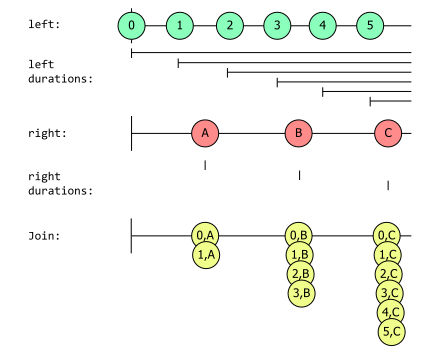

每次左边的持续时间窗口与右边的持续时间窗口相交时，我们都会得到一个输出。右边的持续时间窗口实际上都是零长度的，但这并不能阻止它们与左边的持续时间窗口相交，因为这些窗口永远不会结束。因此，右侧第一个项目的（零长度）窗口位于 `left` 项目的两个窗口内，这样 `Join` 就产生了两个结果。我把这些结果垂直堆叠在图中，以显示它们几乎是同时发生的。当然，`IObserver<T>` 的规则意味着它们实际上不可能同时发生： `Join` 必须等到消费者的 `OnNext` 处理完 `0,A` 后，才能继续生成 `1,A`。但是，当一个来源的单个事件与另一个来源的多个窗口重叠时，它就会尽快产生所有的事件对。

如果我也立即关闭左侧窗口，返回 `Observable.Empty<Unit>`，或者返回 `Observable.Return(0)`，那么这些窗口就永远不会重叠，也就不会产生任何配对。(理论上，如果左右两个窗口在完全相同的时间产生项目，那么我们也许会得到一对项目，但由于事件发生的时间永远不会绝对精确，因此设计一个依赖于此的系统不是一个好主意）。

如果我想确保右边的项目只与左边的一个值相交呢？在这种情况下，我需要确保左边的持续时间不会重叠。一种方法是让我的 `leftDurationSelector` 始终返回我作为左序列传递的相同序列。这将导致 `Join` 对同一个源进行多次订阅，对于某些类型的源，这可能会带来不必要的副作用，但 [Publish](https://github.com/dotnet/reactive/blob/main/Rx.NET/Documentation/IntroToRx/15_PublishingOperators.md#publish) 和 [RefCount](https://github.com/dotnet/reactive/blob/main/Rx.NET/Documentation/IntroToRx/15_PublishingOperators.md#refcount) 操作符提供了处理这种情况的方法，因此这实际上是一种合理的策略。如果我们这样做，结果看起来更像是这样。

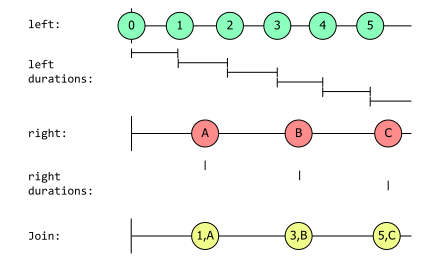

最后一个示例与 [CombineLatest](#CombineLatest) 非常相似，不同之处在于它只在右序列发生变化时才产生一对。我们可以通过改变右侧持续时间，使其与左侧持续时间的工作方式相同，从而轻松实现相同的工作方式。这段代码展示了如何做到这一点（包括使用 `Publish` 和 `RefCount` 来确保我们只获得对底层 `left` 源和 `right` 源的单个订阅，尽管我们已经多次向 `Join` 提供了订阅）。

```c#
public static IObservable<TResult> MyCombineLatest<TLeft, TRight, TResult>
(
    IObservable<TLeft> left,
    IObservable<TRight> right,
    Func<TLeft, TRight, TResult> resultSelector
)
{
    var refcountedLeft = left.Publish().RefCount();
    var refcountedRight = right.Publish().RefCount();

    return Observable.Join(
        refcountedLeft,
        refcountedRight,
        value => refcountedLeft,
        value => refcountedRight,
        resultSelector);
}
```

显然没有必要写这个--你可以直接使用内置的 `CombineLatest`。(因为它有专门的实现，所以效率会更高）。但这表明 `Join` 是一个强大的运算符。

### GroupJoin

当 `Join` 运算符将窗口重叠的值配对时，它会将标量值左右传递给 `resultSelector`。`GroupJoin` 运算符基于相同的窗口重叠概念，但其选择器的工作方式略有不同：`GroupJoin` 仍然从左侧源传递单个（标量）值，但会传递一个 `IObservable<TRight>` 作为第二个参数。这个参数代表了右序列中的所有值，这些值都出现在调用它的特定左值的窗口中。

因此，这缺乏 `Join` 的对称性，因为左右源的处理方式不同。`GroupJoin` 会为左源产生的每个项精确调用一次 `resultSelector`。当一个左侧值的窗口与多个右侧值的窗口重叠时，`Group` 会为每个这样的配对调用一次选择器来处理，但 `GroupJoin` 的处理方式是让作为 `resultSelector` 第二参数传递的可观察对象发出与该左侧项重叠的每个右侧项。(如果左侧项目与右侧项目没有重叠，则 `resultSelector` 仍会调用该项目，只是传递给它的 `IObservable<TRight>` 不会产生任何项目）。

`GroupJoin` 的签名与 `Join` 非常相似，但请注意 `resultSelector` 参数的不同之处。

```c#
public static IObservable<TResult> GroupJoin<TLeft, TRight, TLeftDuration, TRightDuration, TResult>
(
    this IObservable<TLeft> left,
    IObservable<TRight> right,
    Func<TLeft, IObservable<TLeftDuration>> leftDurationSelector,
    Func<TRight, IObservable<TRightDuration>> rightDurationSelector,
    Func<TLeft, IObservable<TRight>, TResult> resultSelector
)
```

如果我们回到第一个 `Join` 例子，我们有

- 左边产生数值的速度是右边的两倍
- 左边永远不会失效
- 右边立即失效

这张图再次显示了相同的输入，还显示了 `GroupJoin` 为 `left` 产生的每个项目传递给 `resultSelector` 的可观察项：

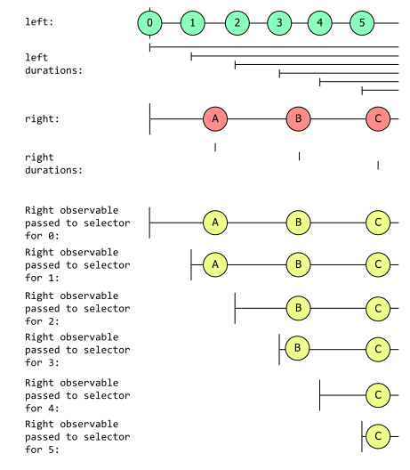

这产生的事件与 `Join` 产生的事件完全相同，只是分布在六个不同的 `IObservable<TRight>` 源中。您可能已经想到，使用 `GroupJoin` 可以通过类似这样的操作有效地重新创建自己的 `Join` 方法：

```c#
public IObservable<TResult> MyJoin<TLeft, TRight, TLeftDuration, TRightDuration, TResult>(
    IObservable<TLeft> left,
    IObservable<TRight> right,
    Func<TLeft, IObservable<TLeftDuration>> leftDurationSelector,
    Func<TRight, IObservable<TRightDuration>> rightDurationSelector,
    Func<TLeft, TRight, TResult> resultSelector)
{
    return Observable.GroupJoin
    (
        left,
        right,
        leftDurationSelector,
        rightDurationSelector,
        (leftValue, rightValues) => 
          rightValues.Select(rightValue=>resultSelector(leftValue, rightValue))
    )
    .Merge();
}
```

你甚至可以用这段代码创建一个简陋版本的 `Window`：

```c#
public IObservable<IObservable<T>> MyWindow<T>(IObservable<T> source, TimeSpan windowPeriod)
{
    return Observable.Create<IObservable<T>>(o =>;
    {
        var sharedSource = source
            .Publish()
            .RefCount();

        var intervals = Observable.Return(0L)
            .Concat(Observable.Interval(windowPeriod))
            .TakeUntil(sharedSource.TakeLast(1))
            .Publish()
            .RefCount();

        return intervals.GroupJoin(
                sharedSource, 
                _ => intervals, 
                _ => Observable.Empty<Unit>(), 
                (left, sourceValues) => sourceValues)
            .Subscribe(o);
    });
}
```

Rx 提供了另一种查询运动数据的方法，允许您查询巧合序列。这使您能够在执行多源匹配的同时，解决管理状态和并发性的内在复杂问题。通过对这些低级操作进行封装，您就能利用 Rx 以一种具有表现力和可测试的方式设计软件。使用 Rx 操作符作为构建模块，您的代码实际上就变成了许多简单操作符的组合。这使得领域代码的复杂性成为重点，而不是那些附带的辅助代码。

### And-Then-When

`Zip` 只能接受两个序列作为输入。如果这是一个问题，那么你可以使用 `And/Then/When` 三种方法的组合。这些方法的用法与大多数其他 Rx 方法略有不同。在这三种方法中，`And` 是 `IObservable<T>` 的唯一扩展方法。与大多数 Rx 运算符不同，它不返回序列，而是返回神秘的 `Pattern<T1, T2>` 类型。`Pattern<T1, T2>` 类型是公共的（显而易见），但它的所有属性都是内部的。你能对 `Pattern<T1, T2>` 做的唯一两件事（有用的）就是调用它的 `And` 或 `Then` 方法。在 `Pattern<T1, T2>` 上调用 `And` 方法会返回一个 `Pattern<T1,T2,T3>`。在该类型中，还可以找到 `And` 和 `Then` 方法。泛型模式类型允许你将多个 `And` 方法串联起来，每个方法都会将泛型类型的参数列表扩展一个。然后，通过 `Then` 方法的重载将它们连接在一起。`Then` 方法会返回一个 `Plan` 类型。最后，将 Plan 传递给 `Observable.When` 方法，以创建序列。

这听起来可能很复杂，但对比一些代码示例应该更容易理解。此外，您还可以从中了解自己更喜欢哪种风格。

要将三个序列压缩在一起，您可以像这样使用连锁的 `Zip` 方法：

```c#
IObservable<long> one = Observable.Interval(TimeSpan.FromSeconds(1)).Take(5);
IObservable<long> two = Observable.Interval(TimeSpan.FromMilliseconds(250)).Take(10);
IObservable<long> three = Observable.Interval(TimeSpan.FromMilliseconds(150)).Take(14);

// lhs represents 'Left Hand Side'
// rhs represents 'Right Hand Side'
IObservable<(long One, long Two, long Three)> zippedSequence = one
    .Zip(two, (lhs, rhs) => (One: lhs, Two: rhs))
    .Zip(three, (lhs, rhs) => (lhs.One, lhs.Two, Three: rhs));

zippedSequence.Subscribe(
    v => Console.WriteLine($"One: {v.One}, Two: {v.Two}, Three: {v.Three}"),
    () => Console.WriteLine("Completed"));
```

或者使用 `And/Then/When` 这种更好的语法：

```c#
Pattern<long, long, long> pattern =
    one.And(two).And(three);
Plan<(long One, long Two, long Three)> plan =
    pattern.Then((first, second, third) => (One: first, Two: second, Three: third));
IObservable<(long One, long Two, long Three)> zippedSequence = Observable.When(plan);

zippedSequence.Subscribe(
    v => Console.WriteLine($"One: {v.One}, Two: {v.Two}, Three: {v.Three}"),
    () => Console.WriteLine("Completed"));
```

`And/Then/When` 三元组有更多的重载，使您可以组合更多的序列。它们还允许您提供多个“计划”（`Then` 方法的输出）。这样，您就可以在“计划”集合上使用合并功能。如果您对这一功能感兴趣，我建议您使用它们。枚举这些方法的所有组合所带来的繁琐不会有太大价值。您可以通过使用这些方法，自己发现更多的价值。

## 总结

本章介绍了一系列让我们能够组合可观测序列的方法。至此，第二部分结束。我们已经了解了主要与定义数据计算有关的操作符。在第 3 部分中，我们将讨论一些实际问题，如管理调度、副作用和错误处理。