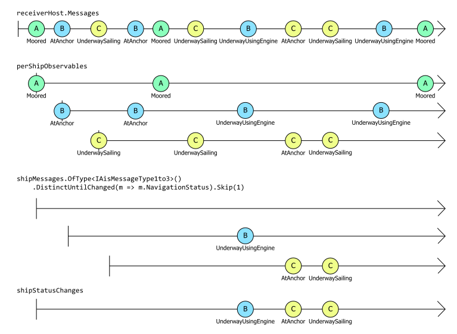
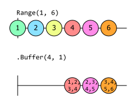

# 分区

Rx 可以将一个序列分割成多个序列。这对于将项目分配给多个用户非常有用。在进行分析时，对分区进行聚合可能很有用。您可能已经熟悉了标准 LINQ 操作符 `GroupBy`。Rx 支持这种操作，而且还定义了一些自己的操作。

## GroupBy

正如 `IEnumerable<T>` 的 `GroupBy` 运算符一样，`GroupBy` 运算符允许您分割序列。开源的 [Ais.Net 项目](https://github.com/ais-dotnet)再次提供了一个有用的例子。它的 [ReceiverHost](https://github.com/ais-dotnet/Ais.Net.Receiver/blob/15de7b2908c3bd67cf421545578cfca59b24ed2c/Solutions/Ais.Net.Receiver/Ais/Net/Receiver/Receiver/ReceiverHost.cs) 类通过 Rx 提供 AIS 消息，定义了 `IObservable<IAisMessage>` 类型的 `Messages` 属性。这是一个非常繁忙的源，因为它会报告它能够访问的每一条消息。例如，如果将接收器连接到挪威政府慷慨提供的 AIS 信息源，那么每当挪威海岸的任何船只广播 AIS 信息时，接收器都会发出通知。挪威有很多船只在航行，所以这有点像消防水龙头。

如果我们确切地知道哪些船只是我们感兴趣的，就可以在[过滤一章](operation-filtering.md)中了解如何过滤这些信息流。但如果我们不知道，但仍然希望能够执行与单个船只相关的处理，那该怎么办呢？例如，也许我们想在任何时候发现任何船只改变了导航状态（`NavigationStatus`）（该状态会报告 `AtAnchor` 或 `Moored` 等值）。[过滤章节中的 Distinct 和 DistinctUntilChanged](operation-filtering.md) 部分展示了如何做到这一点，但它首先是将信息流过滤为来自单艘船只的信息。如果我们试图在所有船只的信息流中直接使用 `DistinctUntilChanged`，就不会产生有意义的信息。如果船只 A 停泊在岸边，船只 B 停泊在锚地，如果我们从船只 A 和船只 B 收到了不同的状态信息，那么 `DistinctUntilChanged` 会将每条信息都报告为状态变化，尽管两艘船只的状态都没有变化。

我们可以将“所有船只”序列拆分成许多小序列来解决这个问题：

```c#
IObservable<IGroupedObservable<uint, IAisMessage>> perShipObservables = 
   receiverHost.Messages.GroupBy(message => message.Mmsi);
```

此 `perShipObservables` 是可观测序列的可观测序列。更具体地说，它是一个分组可观测序列的可观测序列，但从 `IGroupedObservable<TKey, T>` 的定义中可以看出，分组可观测序列只是一种特殊的可观测序列：

```c#
public interface IGroupedObservable<out TKey, out TElement> : IObservable<TElement>
{
    TKey Key { get; }
}
```

每当 `receiverHost.Message` 报告一条 AIS 消息时，`GroupBy` 运算符就会调用回调，以找出此项目属于哪个组。我们将回调返回的值称为键，`GroupBy` 会记住它已经看到的每个键。如果这是一个新的键，`GroupBy` 将创建一个新的 `IGroupedObservable`，其键属性将是回调刚刚返回的值。它会从外部观察符（我们放在 `perShipObservables` 中的观察对象）发射这个 `IGroupedObservable`，然后立即使这个新的 `IGroupedObservable` 发射产生该键的元素（在本例中是 `IAisMessage`）。但是，如果回调生成的键是 `GroupBy` 以前看到过的，它就会找到已经为该键生成的 `IGroupedObservable`，并使其发出值。

因此，在这个例子中，其效果是，只要接收主机报告了来自我们之前未曾收到过的船只的信息，`perShipObservables` 就会发出一个新的可观测值，专门报告该船只的信息。我们可以用它来报告每次我们了解到的新船信息：

```c#
perShipObservables.Subscribe(m => Console.WriteLine($"New ship! {m.Key}"));
```

但这并没有做任何我们无法用 `Distinct` 实现的事情。`GroupBy` 的强大之处在于，我们可以在这里得到每艘飞船的可观测序列，因此我们可以继续设置一些针对每艘飞船的处理方法

```c#
IObservable<IObservable<IAisMessageType1to3>> shipStatusChangeObservables =
    perShipObservables.Select(shipMessages => shipMessages
        .OfType<IAisMessageType1to3>()
        .DistinctUntilChanged(m => m.NavigationStatus)
        .Skip(1));
```

这将使用 `Select`（在[转换](transformation-sequences.md)一章中介绍）对 `perShipObservables` 输出的每个组进行处理。请记住，每个组都代表一艘不同的船只，因此我们在此传递给 `Select` 的回调将对每艘船只精确调用一次。这意味着我们现在可以使用 `DistinctUntilChanged`。本示例为 `DistinctUntilChanged` 提供的输入是一个序列，它只代表一艘飞船的信息，因此它会告诉我们该飞船何时改变了状态。由于每艘飞船都有自己的 `DistinctUntilChanged` 实例，因此现在可以实现我们想要的功能。`DistinctUntilChanged` 总是转发它接收到的第一个事件--只有当项目与前一个项目相同时才会丢弃项目，而在本例中没有前一个项目。但这不可能是正确的行为。假设我们看到的第一条信息来自一艘名为 A 的船只，报告的状态是 `Moored`。有可能在我们开始运行之前，它处于某种不同的状态，而我们收到的第一条报告恰好代表了状态的改变。但更有可能的是，在我们开始运行之前，它已经停泊了一段时间。我们无法确定，但大多数状态报告并不代表变化，因此 `DistinctUntilChanged` 总是转发第一个事件的行为在这里很可能是错误的。因此，我们使用 `Skip(1)` 删除每艘飞船的第一条信息。

至此，我们有了一个可观察序列的可观察序列。外层序列会为它看到的每艘不同的飞船生成一个嵌套序列，嵌套序列会报告该特定飞船的导航状态变化。

我要做一个小小的调整：

```c#
IObservable<IAisMessageType1to3> shipStatusChanges =
    perShipObservables.SelectMany(shipMessages => shipMessages
        .OfType<IAisMessageType1to3>()
        .DistinctUntilChanged(m => m.NavigationStatus)
        .Skip(1));
```

我用 `SelectMany` 代替了 `Select`，这在[转换](transformation-sequences.md)一章中也有介绍。你可能还记得，`SelectMany` 将嵌套的可观察对象平铺成一个单一的平铺序列。你可以从返回类型中看到这一点：现在我们得到的只是一个 `IObservable<IAisMessageType1to3>` 而不是一个序列。

等一下！我不是刚刚推翻了 `GroupBy` 所做的工作吗？我让它按船只 id 对事件进行分区，为什么现在又要重新组合成一个单一的平面流？我一开始不就是这样做的吗？

流类型确实与我最初的输入具有相同的形状：这将是一个单一的可观测 AIS 消息序列。(它更专业一些--元素类型是 `IAisMessageType1to3`，因为我可以从那里获取 `NavigationStatus`，但这些仍然都实现了 `IAisMessage`）。所有不同的船只都将混合在一个数据流中。但实际上，我并没有否定 `GroupBy` 所做的工作。这个大理石图说明了发生了什么：



`perShipObservables` 部分展示了 `GroupBy` 如何为每艘不同的船只创建单独的观测值。(如果使用真正的源，从 `GroupBy` 生成的观测值会更多，但原理是一样的）。在对这些分组流进行扁平化处理之前，我们还需要做一些工作。如前所述，我们使用 `DistinctUntilChanged` 和 `Skip(1)` 来确保只有在确定船只状态发生变化时才会产生事件。(因为我们只看到过 `A` 报告 `Moored` 状态，所以据我们所知它的状态从未改变过，这就是为什么它的数据流是完全空的）。只有这样，我们才能将其平铺成一个单一的可观测序列。

大理石图需要简单明了才能在页面上显示，所以现在让我们快速看看一些真实的输出结果。这证实了它与原始的 `receiverHost.Messages` 非常不同。首先，我需要附加一个订阅者：

```c#
shipStatusChanges.Subscribe(m => Console.WriteLine(
   $"Vessel {((IAisMessage)m).Mmsi} changed status to {m.NavigationStatus} at {DateTimeOffset.UtcNow}"));
```

如果我让接收器运行大约十分钟，就会看到这样的输出：

```
Vessel 257076860 changed status to UnderwayUsingEngine at 23/06/2023 06:42:48 +00:00
Vessel 257006640 changed status to UnderwayUsingEngine at 23/06/2023 06:43:08 +00:00
Vessel 259005960 changed status to UnderwayUsingEngine at 23/06/2023 06:44:23 +00:00
Vessel 259112000 changed status to UnderwayUsingEngine at 23/06/2023 06:44:33 +00:00
Vessel 259004130 changed status to Moored at 23/06/2023 06:44:43 +00:00
Vessel 257076860 changed status to NotDefined at 23/06/2023 06:44:53 +00:00
Vessel 258024800 changed status to Moored at 23/06/2023 06:45:24 +00:00
Vessel 258006830 changed status to UnderwayUsingEngine at 23/06/2023 06:46:39 +00:00
Vessel 257428000 changed status to Moored at 23/06/2023 06:46:49 +00:00
Vessel 257812800 changed status to Moored at 23/06/2023 06:46:49 +00:00
Vessel 257805000 changed status to Moored at 23/06/2023 06:47:54 +00:00
Vessel 259366000 changed status to UnderwayUsingEngine at 23/06/2023 06:47:59 +00:00
Vessel 257076860 changed status to UnderwayUsingEngine at 23/06/2023 06:48:59 +00:00
Vessel 257020500 changed status to UnderwayUsingEngine at 23/06/2023 06:50:24 +00:00
Vessel 257737000 changed status to UnderwayUsingEngine at 23/06/2023 06:50:39 +00:00
Vessel 257076860 changed status to NotDefined at 23/06/2023 06:51:04 +00:00
Vessel 259366000 changed status to Moored at 23/06/2023 06:51:54 +00:00
Vessel 232026676 changed status to Moored at 23/06/2023 06:51:54 +00:00
Vessel 259638000 changed status to UnderwayUsingEngine at 23/06/2023 06:52:34 +00:00
```

这里最重要的一点是，在十分钟的时间里，`receiverHost.Messages` 产生了数千条信息。(这个速度因时间而异，但通常每分钟超过一千条。当我运行该代码时，它应该已经处理了大约一万条信息，才会产生这样的输出）。但如你所见，`shipStatusChanges` 只产生了 19 条信息。

这说明了 Rx 是如何驯服大容量事件源的，它比单纯的聚合强大得多。我们并没有将数据简化为只能提供概览的统计量。平均值或方差等统计量通常非常有用，但它们并不总能提供我们想要的特定领域洞察力。例如，它们无法告诉我们任何关于特定船只的信息。但在这里，每条信息都能告诉我们关于某艘特定船只的信息。尽管我们正在查看每一艘舰船，但我们仍然能够保留这种详细程度。我们可以指示 Rx 在任何一艘飞船改变状态时告诉我们。

我可能会觉得这太小题大做了，但实现这一结果所花费的精力实在太少，以至于我们很容易忽略 Rx 在这里为我们做了多少工作。这段代码完成了以下所有工作：

- 监控在挪威水域航行的每一艘船只
- 提供每艘船只的信息
- 以人类可以合理应对的速度报告事件

它可以处理成千上万条信息，并进行必要的处理，找出与我们真正相关的少数信息。

这是我在[转换一章中的‘SelectMany 的意义’中描述的“扇出，然后再扇入”技术](transformation-sequences.md#SelectMany 的意义)的一个示例。这段代码使用 `GroupBy` 将单个观测值扇形扩展到多个观测值。这一步的关键是创建嵌套的观察项，为我们要做的处理提供合适的细节级别。在本例中，详细程度是 “一艘特定的船”，但也不一定是这样。您可以想象按地区对信息进行分组--也许我们对比较不同的港口很感兴趣，因此我们希望根据船只最靠近的港口来划分信息源，或者根据其目的港来划分信息源。(AIS 为船只提供了一种广播其预定目的地的方式。）按照我们所需的任何标准对数据进行分区后，我们就可以定义要对每组数据进行的处理。在这种情况下，我们只需注意导航状态（`NavigationStatus`）的变化。这一步通常会减少数据量。例如，大多数船只每天最多只会更改几次导航状态。在将通知流减少到我们真正关心的事件之后，我们就可以将其合并为一个流，提供我们想要的高价值通知。

当然，这种能力是有代价的。让 Rx 为我们做这些工作并不需要太多的代码，但我们需要它付出相当大的努力：它需要记住迄今为止看到的每一艘飞船，并为每一艘飞船维护一个可观测源。如果我们的数据源覆盖面足够广，可以接收来自数以万计船只的信息，那么 Rx 就需要为每艘船只维护数以万计的可观测源。所示示例中没有任何类似于非活动超时的功能，只要程序运行，哪怕只有一条船只广播的信息也会被记住。(如果恶意行为者编造 AIS 信息，每条信息都使用不同的编造标识符，最终会导致代码因内存耗尽而崩溃）。根据数据源的不同，你可能需要采取一些措施来避免内存使用量的无限制增长，因此实际示例可能会比这更复杂，但基本方法还是很强大的。

既然我们已经看到了一个示例，下面让我们更详细地了解一下 `GroupBy`。它有几种不同的形式。我们刚才使用的重载是：

```c#
public static IObservable<IGroupedObservable<TKey, TSource>> GroupBy<TSource, TKey>(
    this IObservable<TSource> source, 
    Func<TSource, TKey> keySelector, 
    IEqualityComparer<TKey> comparer)
```

还有两个重载使用元素选择器参数扩展了前两个重载：

```c#
public static IObservable<IGroupedObservable<TKey, TElement>> GroupBy<TSource, TKey, TElement>(
    this IObservable<TSource> source, 
    Func<TSource, TKey> keySelector, 
    Func<TSource, TElement> elementSelector)
{...}

public static IObservable<IGroupedObservable<TKey, TElement>> GroupBy<TSource, TKey, TElement>(
    this IObservable<TSource> source, 
    Func<TSource, TKey> keySelector, 
    Func<TSource, TElement> elementSelector, 
    IEqualityComparer<TKey> comparer)
{...}
```

这在功能上等同于在 `GroupBy` 后使用 `Select` 操作符。

顺便提一下，在使用 `GroupBy` 时，您可能会直接订阅嵌套的观测值：

```c#
// Don't do it this way. Use the earlier example.
perShipObservables.Subscribe(shipMessages =>
  shipMessages
    .OfType<IAisMessageType1to3>()
    .DistinctUntilChanged(m => m.NavigationStatus)
    .Skip(1)
    .Subscribe(m => Console.WriteLine(
    $"Ship {((IAisMessage)m).Mmsi} changed status to {m.NavigationStatus} at {DateTimeOffset.UtcNow}")));
```

这似乎有同样的效果：这里的 `perShipObservables` 是由 `GroupBy` 返回的序列，因此它会为每艘不同的船只生成一个可观察流。本示例订阅了该序列，然后在每个嵌套序列上使用了与之前相同的操作符，但并没有使用 `SelectMany` 将结果收集到一个单一的输出可观察数据流中，而是为每个嵌套数据流明确调用了 Subscribe。

如果你对 Rx 不熟悉，这似乎是一种更自然的工作方式。不过，虽然这看起来会产生相同的行为，但却带来了一个问题：Rx 无法理解这些嵌套订阅与外部订阅相关联。在这个简单的示例中，这不一定会造成问题，但如果我们开始使用额外的操作符，就会出现问题。请考虑以下修改：

```c#
IDisposable sub = perShipObservables.Subscribe(shipMessages =>
  shipMessages
    .OfType<IAisMessageType1to3>()
    .DistinctUntilChanged(m => m.NavigationStatus)
    .Skip(1)
    .Finally(() => Console.WriteLine($"Nested sub for {shipMessages.Key} ending"))
    .Subscribe(m => Console.WriteLine(
    $"Ship {((IAisMessage)m).Mmsi} changed status to {m.NavigationStatus} at {DateTimeOffset.UtcNow}")));
```

我为嵌套序列添加了一个 `Finally` 操作符。这使我们能够在序列因任何原因结束时调用回调。但是，即使我们取消订阅外部序列（调用 `sub.Dispose();`），这个 `Finally` 也永远不会执行任何操作。这是因为 Rx 无法知道这些内部订阅是外部订阅的一部分。

如果我们对先前的版本进行同样的修改，即通过 `SelectMany` 将这些嵌套序列收集到一个输出序列中，Rx 就会明白，到对内部序列的订阅只存在于对 `SelectMany` 返回的序列的订阅中。（事实上，正是 `SelectMany` 订阅了这些内部序列）因此，如果我们取消订阅该示例中的输出序列，它就会正确地运行对任何内部序列的 `Finally` 回调。

一般来说，如果有大量序列作为单个处理链的一部分出现，通常最好让 Rx 从头到尾管理整个流程。

## Buffer

如果需要批量处理事件，`Buffer` 操作符非常有用。这有助于提高性能，尤其是在存储事件数据时。以 AIS 为例。如果要将通知记录到持久存储中，存储一条记录的成本可能与存储多条记录的成本几乎相同。大多数存储设备的数据块大小通常为几千字节，因此存储一个字节的数据所需的工作量通常与存储几千字节的数据所需的工作量相同。在编程中，将数据缓冲起来直到我们有一个相当大的工作块的模式经常出现。.NET 运行时库的 `Stream` 类就内置了这种缓冲，所以它内置在Rx中也不足为奇。

效率问题并不是您想批量处理多个事件而不是单个事件的唯一原因。假设您想生成有关某些数据源的持续更新统计数据流。通过使用 `Buffer` 将数据源分割成块，您可以计算出例如过去 10 个事件的平均值。

`Buffer` 可以对源数据流中的元素进行分割，因此是一种类似于 `GroupBy` 的操作符，但也有一些显著的不同之处。首先，`Buffer` 不会通过检查元素来决定如何分割它们，而是纯粹根据元素出现的顺序进行分割。其次，`Buffer` 会等到完全填满一个分区后，再将所有元素显示为 `IList<T>`。这可以使某些任务变得更加简单，因为分区中的所有内容都可以立即使用，而不会将值埋藏在嵌套的 `IObservable<T>` 中。第三，`Buffer` 提供了一些重载，使单个元素出现在多个“分区 “中成为可能。(在这种情况下，`Buffer` 不再是严格意义上的数据分区，但正如你将看到的，它只是其他行为的一个小变化）。

使用 `Buffer` 的最简单方法就是将相邻的元素集合成块（LINQ to Objects 现在有了一个等价的操作符，称为 [Chunk](https://learn.microsoft.com/en-us/dotnet/api/system.linq.enumerable.chunk)）。Rx 没有使用相同名称的原因是，Rx 比 LINQ to Objects 早 10 多年引入了这个操作符。因此，真正的问题是为什么 LINQ to Objects 选择了不同的名称。这可能是因为 `Chunk` 并不支持 Rx 的 `Buffer` 所支持的所有变化，但这需要询问 .NET 运行库团队（.NET runtime library team）。`Buffer` 的重载只需要一个参数，即您想要的块大小：

```c#
public static IObservable<IList<TSource>> Buffer<TSource>(
    this IObservable<TSource> source, 
    int count)
{...}
```

本示例使用它将导航信息分成 4 块，然后计算这 4 个读数的平均速度：

```c#
IObservable<IList<IVesselNavigation>> navigationChunks = 
   receiverHost.Messages.Where(v => v.Mmsi == 235009890)
                        .OfType<IVesselNavigation>()
                        .Where(n => n.SpeedOverGround.HasValue)
                        .Buffer(4);

IObservable<float> recentAverageSpeed = 
    navigationChunks.Select(chunk => chunk.Average(n => n.SpeedOverGround.Value));
```

如果源完成后，并没有产生与分块大小完全相等的倍数，那么最终的分块就会变小。我们可以通过以下更人为的例子来了解这一点：

```
Observable
    .Range(1, 5)
    .Buffer(2)
    .Select(chunk => string.Join(", ", chunk))
    .Dump("chunks");
```

从输出结果中可以看到，尽管我们要求一次输入 2 个项目，但最后的数据块只有一个项目：

```
chunks-->1, 2
chunks-->3, 4
chunks-->5
chunks completed
```

在这里，`Buffer` 别无选择，因为源已经完成，如果它没有产生最后那个大小不足的块，我们就永远不会看到最后一个项目。但除了这种源结束的情况外，`Buffer` 的这种重载会一直等到收集到足够的元素来填充指定大小的缓冲区后才将其传递出去。这意味着缓冲区会产生延迟。如果源项之间相隔很远（例如，当船只没有移动时，它可能每隔几分钟才报告一次 AIS 导航数据），这可能会导致较长的延迟。

在某些情况下，我们可能希望在信号源繁忙时批量处理多个事件，而不必在信号源运行较慢时等待很长时间。这在用户界面中很有用。如果您想提供新鲜的信息，那么接受一个小块可能会更好，这样您就可以提供更及时的信息。针对这些情况，缓冲区提供了接受 `TimeSpan`

```c#
public static IObservable<IList<TSource>> Buffer<TSource>(
    this IObservable<TSource> source, 
    TimeSpan timeSpan)
{...}

public static IObservable<IList<TSource>> Buffer<TSource>(
    this IObservable<TSource> source, 
    TimeSpan timeSpan, 
    int count)
{...}
```

第一种方法只根据时间来划分信号源。无论信号源产生值的速度如何，它都会每秒发出一个数据块：

```c#
IObservable<IList<string>> output = source.Buffer(TimeSpan.FromSeconds(1));
```

如果源在任何特定块的生命周期内没有发出任何值，输出将发出一个空列表。

第二个重载函数同时接受时间间隔和计数，基本上强加了两个上限：在块之间你永远不需要等待超过时间间隔的时间，并且你永远不会收到超过计数元素的块。与仅时间间隔的重载函数一样，如果源无法在指定的时间内快速产生足够的元素来填充缓冲区，这可能会传递不完整甚至空的块。

## 重叠缓冲区

在前面的部分中，我展示了一个示例，它收集了特定船只的4个 `IVesselNavigation` 条目的块，并计算了平均速度。这种对多个样本进行平均的方法可以有效地平滑读数中的轻微随机变化。因此，在这种情况下，目标不是为了提高效率而批量处理项，而是为了实现特定类型的计算。

但是这个示例有一个问题：因为它是对 4 个读数进行平均，所以它只在每 4 个输入消息产生一次输出。而且，由于船只如果不移动可能只会每隔几分钟报告一次速度，我们可能要等很长时间。

有一个 `Buffer` 的重载函数可以让我们做得更好一点：不是对前 4 个读数进行平均，然后是接下来的 4 个读数，然后是再接下来的 4 个读数，依此类推，我们可能希望在船只报告新的读数时每次计算最后 4 个读数的平均值。

这有时被称为滑动窗口。我们希望处理读数1、2、3、4，然后是 2、3、4、5，然后是 3、4、5、6，依此类推。有一个`Buffer` 的重载函数可以实现这个功能。这个示例展示了之前平均速度示例的第一个语句，但有一个小修改：

```c#
IObservable<IList<IVesselNavigation>> navigationChunks = receiverHost.Messages
    .Where(v => v.Mmsi == 235009890)
    .OfType<IVesselNavigation>()
    .Where(n => n.SpeedOverGround.HasValue)
    .Buffer(4, 1);
```

这将调用 `Buffer` 的重载，它需要两个 `int` 参数。第一个参数的作用与之前的相同：表示我们希望在每个分块中包含 4 个条目。但第二个参数表示产生缓冲的频率。这表示我们希望源每产生 1 个元素（即每一个元素）就产生一个缓冲区。(只接受 `count` 的重载等同于为该重载传递两个参数的相同值）。

因此，这个重载会等到信号源产生 4 个合适的信息（即满足 `Where` 和 `OfType` 运算符的信息），然后在 `navigationChunks` 产生的第一个 `IList<VesselNavigation>` 中报告前 4 个读数。但信息源只需再生成一条合适的信息，就会发出另一个 `IList<VesselNavigation>`，其中包含 3 个与第一个信息块中相同的值，然后是新值。当下一个合适的信息出现时，它将发出另一个包含第 3、4、5 和 6 条信息的列表，依此类推。

这个弹珠图说明了 `Buffer(4, 1)` 的行为。



如果我们将其输入与之前示例相同的 `recentAverageSpeed` 表达式，在第 4 个合适的消息源出现之前，我们仍然不会得到任何输出，但从那时起，每一个合适的消息源都会发出一个新的平均值。这些平均值仍将始终报告最近报告的 4 个速度的平均值，但现在我们将以四倍的频率获得这些平均值。

我们还可以用它来改进前面的例子，即在船只改变导航状态时报告。上一个示例告诉您船只刚刚进入什么状态，但这提出了一个显而易见的问题：船只之前处于什么状态？我们可以使用 `Buffer(2,1)`，这样每次我们看到状态发生变化的信息时，也就能看到之前的状态变化：

```c#
IObservable<IList<IAisMessageType1to3>> shipStatusChanges =
    perShipObservables.SelectMany(shipMessages => shipMessages
        .OfType<IAisMessageType1to3>()
        .DistinctUntilChanged(m => m.NavigationStatus)
        .Buffer(2, 1));

IDisposable sub = shipStatusChanges.Subscribe(m => Console.WriteLine(
    $"Ship {((IAisMessage)m[0]).Mmsi} changed status from" +
    $" {m[1].NavigationStatus} to {m[1].NavigationStatus}" +
    $" at {DateTimeOffset.UtcNow}"));
```

正如输出结果所示，我们现在可以报告之前的状态和刚刚进入的状态：

```
Ship 259664000 changed status from UnderwayUsingEngine to Moored at 30/06/2023
 13:36:39 +00:00
Ship 257139000 changed status from AtAnchor to UnderwayUsingEngine at 30/06/20
23 13:38:39 +00:00
Ship 257798800 changed status from UnderwayUsingEngine to Moored at 30/06/2023
 13:38:39 +00:00
```

这一更改使我们能够删除跳过。先前的示例之所以会出现这种情况，是因为我们无法判断启动后从任何特定飞船收到的第一条信息是否代表变化。但是，由于我们告诉 Buffer 我们需要成对的信息，因此在看到具有两种不同状态的信息之前，它不会为任何一艘船只提供任何信息。

您也可以使用此重载请求一个由时间而不是计数定义的滑动窗口：

```c#
public static IObservable<IList<TSource>> Buffer<TSource>(
    this IObservable<TSource> source, 
    TimeSpan timeSpan, 
    TimeSpan timeShift)
{...}
```

`timeSpan` 决定了每个窗口覆盖的时间长度，而 `timeShift` 则决定了启动新窗口的时间间隔。·

## Window

`Window`操作符与 `Buffer` 非常相似。它可以根据元素计数或时间将输入分割成块，还支持重叠窗口。不过，它的返回类型不同。在 `IObservable<T>` 上使用 `Buffer` 将返回 `IObservable<IList<T>>`，而 `Window` 将返回 `IObservable<IObservable<T>>`。这意味着 `Window` 无需等到填满整个缓冲区后才产生任何结果。可以说，与 `Buffer` 相比，`Window` 更全面地采用了响应式范例。不过，经过一段时间的经验积累，你可能会得出结论：`Window` 比 `Buffer` 更难使用，但在实践中却很少更有用。

由于 `Buffer` 返回的是 `IObservable<IList<T>>`，因此在获得所有将进入该块的元素之前，它无法生成一个块。`IList<T>` 支持随机访问--你可以询问它有多少个元素，也可以通过数字索引检索任何元素，我们希望这些操作能立即完成。(从技术上讲，可以编写一个表示尚未接收到的数据的 `IList<T>` 的实现，如果在数据可用之前尝试使用它们，就会阻塞其 `Count` 和 `indexer` 属性，但这样做很奇怪。开发人员希望列表能立即返回信息，而 Rx 的 `Buffer` 生成的列表就能满足这一期望）。因此，如果你编写 `Buffer(4)`，它在获得构成第一个块的全部 4 个项目之前不会产生任何结果。

但是，由于 `Window` 返回的可观测变量会产生一个嵌套的可观测变量来表示每个分块，因此它可以在拥有所有元素之前就发出该可观测变量。事实上，一旦知道需要一个新窗口，它就会立即发出。例如，如果你使用 `Window(4,1)`，它返回的观察结果会立即发出第一个嵌套观察结果。然后，一旦源产生了第一个元素，该嵌套可观察对象就会发出该元素，然后第二个嵌套可观察对象就会产生。我们将 1 作为 `Window` 的第二个参数，因此源每产生一个元素，我们就会得到一个新窗口。一旦第一个元素被发出，源发出的下一个项目就会出现在第二个窗口中（同时也会出现在第一个窗口中，因为在这种情况下我们指定了重叠的窗口），所以第二个窗口实际上是从第一个元素出现后立即打开的。因此 `Window` 返回的 `IObservable<IObservable<T>>` 会在此时生成一个新的 `IObservable<T>`。

嵌套的可观察对象会在项目可用时产生项目。一旦 `Window` 知道该窗口中不会再有其他项目，它们就会完成（也就是说，在完全相同的时间点，`Buffer` 也会为该窗口生成完成的 `IList<T>`）。

`Window` 似乎比 `Buffer` 更好，因为它可以让你在一个分块中的各个项目可用的一瞬间就拿到它们。但是，如果您在进行计算时需要访问数据块中的每一个项目，这并不一定能帮到您。在收到数据块中的每个条目之前，您无法完成处理，因此无法更早地生成最终结果，而且您的代码可能会变得更加复杂，因为它不能再指望 `IList<T>` 可以方便地一次性提供所有条目。不过，如果您要对一个数据块中的项目进行某种聚合计算，`Window` 可能会更有效，因为它能让您在每个项目出现时对其进行处理，然后将其丢弃。如果数据块非常大，`Buffer` 就必须保留每个项目直到数据块完成，这可能会占用更多内存。此外，如果您不一定需要先看到数据块中的每个条目，然后才能对这些条目进行有用的处理，那么 `Window` 可以帮助您避免处理延迟。

在 AIS `NavigationStatus` 的例子中，`Window` 对我们没有帮助，因为我们的目标是报告每次更改前后的状态。在知道之后的值之前，我们无法做到这一点，因此提前接收之前的值对我们没有任何好处。我们需要第二个值来完成我们要做的事情，所以我们还不如使用 `Buffer`，因为它更简单。但是，如果您想跟踪今天到目前为止已报告移动的不同船只的数量，`Window` 将是一个合适的机制：您可以将其设置为每天生成一个窗口，这样您就可以在每个窗口内开始查看信息，而无需等到一天结束。

除了支持简单的基于计数或基于时间间隔的分割外，还有更灵活的方法来定义窗口边界，例如这种重载：

```c#
// 将可观测序列的每个元素投射到连续的非重叠窗口中。
// windowClosingSelector：调用的函数，用于定义已生成窗口的边界。
// 关闭前一个窗口时，会启动一个新窗口。
public static IObservable<IObservable<TSource>> Window<TSource, TWindowClosing>
(
    this IObservable<TSource> source, 
    Func<IObservable<TWindowClosing>> windowClosingSelector
)
```

其中第一个复杂重载允许我们控制窗口何时关闭。每次创建窗口时都会调用 `windowClosingSelector` 函数，当 `windowClosingSelector` 中的相应序列产生一个值时，每个窗口都会关闭。事实上，您只需完成 `windowClosingSelector` 中的序列即可关闭窗口。

在本例中，我们创建了一个带有关闭选择器的窗口。我们每次都会从该选择器返回相同的主题，然后每当用户在控制台按下回车键时，就会从主题发出通知。

```c#
int windowIdx = 0;
IObservable<long> source = Observable.Interval(TimeSpan.FromSeconds(1)).Take(10);
var closer = new Subject<Unit>();
source.Window(() => closer)
      .Subscribe(window =>
       {
           int thisWindowIdx = windowIdx++;
           Console.WriteLine("--Starting new window");
           string windowName = $"Window{thisWindowIdx}";
           window.Subscribe(
              value => Console.WriteLine("{0} : {1}", windowName, value),
              ex => Console.WriteLine("{0} : {1}", windowName, ex),
              () => Console.WriteLine("{0} Completed", windowName));
       },
       () => Console.WriteLine("Completed"));

string input = "";
while (input != "exit")
{
    input = Console.ReadLine();
    closer.OnNext(Unit.Default);
}
```

输出（在显示 ‘1’和 ‘5’ 后按回车键）：

```
--Starting new window
window0 : 0
window0 : 1

window0 Completed

--Starting new window
window1 : 2
window1 : 3
window1 : 4
window1 : 5

window1 Completed

--Starting new window
window2 : 6
window2 : 7
window2 : 8
window2 : 9

window2 Completed

Completed
```

`Window` 最复杂的重载允许我们创建可能重叠的窗口。

```c#
// 将可观测序列的每个元素投射到零个或多个窗口中。
// windowOpenings：可观察序列，其元素表示创建新窗口。
// windowClosingSelector：用于定义关闭每个生成窗口的函数。
public static IObservable<IObservable<TSource>> Window
    <TSource, TWindowOpening, TWindowClosing>
(
    this IObservable<TSource> source, 
    IObservable<TWindowOpening> windowOpenings, 
    Func<TWindowOpening, IObservable<TWindowClosing>> windowClosingSelector
)
```

该重载需要三个参数

- 源序列
- 表示何时打开新窗口的序列
- 接收窗口打开值并返回窗口关闭序列的函数

该重载为窗口的打开和关闭方式提供了极大的灵活性。窗口可以在很大程度上相互独立；它们可以重叠、大小不一，甚至可以跳过源值。

为了让我们更轻松地了解这个更复杂的重载，让我们先尝试用它来重现一个更简单的 `Window` 版本（需要计数的重载）。为此，我们需要在初始订阅时打开一个窗口，并在源产生指定计数时每次打开一个窗口。每次达到该计数时，窗口都需要关闭。为此，我们只需要源序列。我们将对其进行多次订阅，但对于某些类型的源，这可能会造成问题，因此我们通过[发布操作符](https://github.com/dotnet/reactive/blob/main/Rx.NET/Documentation/IntroToRx/15_PublishingOperators.md#publish)来实现这一点，它允许多个订阅者，同时只对底层源进行一次订阅。

```c#
public static IObservable<IObservable<T>> MyWindow<T>(
    this IObservable<T> source, 
    int count)
{
    IObservable<T> shared = source.Publish().RefCount();
    IObservable<int> windowEdge = shared
        .Select((i, idx) => idx % count)
        .Where(mod => mod == 0)
        .Publish()
        .RefCount();
    return shared.Window(windowEdge, _ => windowEdge);
}
```

如果我们现在要扩展此方法以提供跳过功能，我们需要两个不同的序列：一个用于打开，一个用于关闭。我们会在订阅时打开一个窗口，并在 `Skip` 项目结束后再次打开。窗口打开后，在 `count` 项过去后，我们关闭这些窗口。

```c#
public static IObservable<IObservable<T>> MyWindow<T>(
    this IObservable<T> source, 
    int count, 
    int skip)
{
    if (count <= 0) throw new ArgumentOutOfRangeException();
    if (skip <= 0) throw new ArgumentOutOfRangeException();

    IObservable<T> shared = source.Publish().RefCount();
    IObservable<int> index = shared
        .Select((i, idx) => idx)
        .Publish()
        .RefCount();
 
    IObservable<int> windowOpen = index.Where(idx => idx % skip == 0);
    IObservable<int> windowClose = index.Skip(count-1);
 
    return shared.Window(windowOpen, _ => windowClose);
}
```

我们可以看到，由于 `windowClose` 序列是从函数返回的，因此每次打开窗口时都会重新订阅该序列。这样，我们就可以为每个窗口重新应用跳转 `(Skip(count-1))`。目前，我们忽略了 `windowOpen` 向 `windowClose` 选择器推送的值，但如果您在某些逻辑中需要它，也可以使用它。

正如你所看到的，`Window` 操作符的功能相当强大。我们甚至可以使用 `Window` 复制其他操作符；例如，我们可以用这种方法创建自己的 `Buffer` 实现。我们可以让 `SelectMany` 操作符使用单个值（窗口）生成零个或多个其他类型的值（在我们的例子中，是单个 `IList<T>`）。要在不阻塞的情况下创建 `IList<T>`，我们可以应用 `Aggregate` 方法，并使用一个新的 `List<T>` 作为种子。

```c#
public static IObservable<IList<T>> MyBuffer<T>(this IObservable<T> source, int count)
{
    return source.Window(count)
        .SelectMany(window => 
            window.Aggregate(
                new List<T>(), 
                (list, item) =>
                {
                    list.Add(item);
                    return list;
                }));
}
```

您可能会发现，尝试使用 `Window` 执行其他时间移动方法（如 `Sample` 或 `Throttle`）是一项有趣的工作。

通过使用数据驱动的分组标准，或使用 `Buffer` 或 `Window` 进行基于时间的分块，我们已经了解了将单个项目流分散到多个输出序列的一些有用方法。在下一章中，我们将了解可以将多个数据流中的数据组合在一起的操作符。