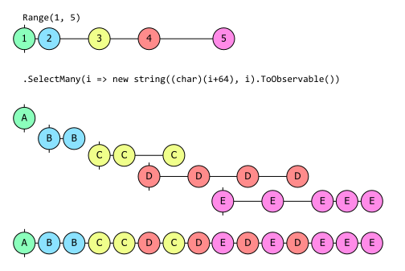
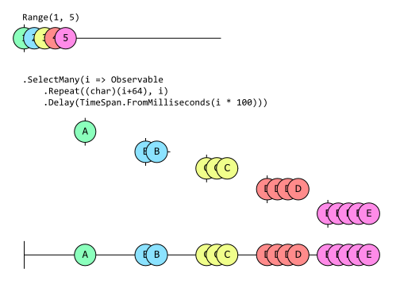

# 序列转换

我们从序列中获取的值并不总是我们需要的格式。有时信息量比我们需要的要多，我们需要从中挑选出我们感兴趣的值。有时，每个值都需要扩展成一个更丰富的对象或更多的值。

到目前为止，我们已经了解了序列的创建、序列的转换以及通过筛选减少序列。本章我们将探讨序列的转换。

## Select

最直接的转换方法是 `Select`。它允许您提供一个函数，接收 `TSource` 的值并返回 `TResult` 的值。`Select` 的签名反映了它将序列元素从一种类型转换为另一种类型的能力，即从 `IObservable<TSource>` 转换为 `IObservable<TResult>`。

```c#
IObservable<TResult> Select<TSource, TResult>(
    this IObservable<TSource> source, 
    Func<TSource, TResult> selector)
```

您不必改变类型--`TSource` 和 `TResult` 可以是相同的。第一个示例将一个整数序列加上 3，得到另一个整数序列。

```c#
IObservable<int> source = Observable.Range(0, 5);
source.Select(i => i+3)
      .Dump("+3")
```

它使用了我们在[过滤](operation-filtering.md)一章开头定义的 `Dump` 扩展方法。输出结果如下

```
+3 --> 3
+3 --> 4
+3 --> 5
+3 --> 6
+3 --> 7
+3 completed
```

下一个示例将以改变数值类型的方式转换数值。它将整数值转换为字符。

```c#
Observable.Range(1, 5);
          .Select(i => (char)(i + 64))
          .Dump("char");
```

输出：

```
char --> A
char --> B
char --> C
char --> D
char --> E
char completed
```

本例将整数序列转换为匿名类型的序列：

```c#
Observable.Range(1, 5)
          .Select(i => new { Number = i, Character = (char)(i + 64) })
          .Dump("anon");
```

`Select` 是 C# 查询表达式语法支持的标准 LINQ 操作符之一，因此我们可以这样编写最后一个示例：

```c#
var query = from i in Observable.Range(1, 5)
            select new {Number = i, Character = (char) (i + 64)};

query.Dump("anon");
```

在 Rx 中，`Select` 还有另一种重载，其中的选择器函数接受两个值。附加参数是元素在序列中的索引。如果元素在序列中的索引对选择器函数很重要，请使用此方法。

## SelectMany

`Select` 可以为每个输入生成一个输出，而 `SelectMany` 则可以将每个输入元素转换成任意数量的输出。让我们先来看一个只使用 `Select` 的示例，看看它是如何工作的：

```c#
Observable
    .Range(1, 5)
    .Select(i => new string((char)(i+64), i))
    .Dump("strings");
```

输出：

```
strings-->A
strings-->BB
strings-->CCC
strings-->DDDD
strings-->EEEEE
strings completed
```

正如你所看到的，对于 `Range` 生成的每个数字，我们的输出都包含一个字符串，其长度就是这个字符串的长度。如果我们不将每个数字转换成字符串，而是将其转换成 `IObservable<char>` 会怎样呢？我们只需在构造字符串后添加 `.ToObservable()` 即可：

```c#
Observable
    .Range(1, 5)
    .Select(i => new string((char)(i+64), i).ToObservable())
    .Dump("sequences");
```

(或者，我们也可以用 `i => Observable.Repeat((char)(i+64),i)` 替换选择表达式。两者效果完全相同）。输出结果并不十分有用：

```
strings-->System.Reactive.Linq.ObservableImpl.ToObservableRecursive`1[System.Char]
strings-->System.Reactive.Linq.ObservableImpl.ToObservableRecursive`1[System.Char]
strings-->System.Reactive.Linq.ObservableImpl.ToObservableRecursive`1[System.Char]
strings-->System.Reactive.Linq.ObservableImpl.ToObservableRecursive`1[System.Char]
strings-->System.Reactive.Linq.ObservableImpl.ToObservableRecursive`1[System.Char]
strings completed
```

我们有了一个可观察序列的可观察序列。但如果我们将 `Select` 替换为 `SelectMany`，会发生什么呢？

```c#
Observable
    .Range(1, 5)
    .SelectMany(i => new string((char)(i+64), i).ToObservable())
    .Dump("chars");
```

这样我们就得到了一个 `IObservable<char>`，其输出是这样的：

```
chars-->A
chars-->B
chars-->B
chars-->C
chars-->C
chars-->D
chars-->C
chars-->D
chars-->E
chars-->D
chars-->E
chars-->D
chars-->E
chars-->E
chars-->E
chars completed
```

顺序变得有点乱，但如果你仔细观察，就会发现每个字母出现的次数与我们发射字符串时的相同。例如，只有一个 `A`，但 `C` 出现了三次，`E` 出现了五次。

`SelectMany` 希望转换函数为每个输入返回一个 `IObservable<T>`，然后将这些结果合并为一个结果。与 LINQ to Objects 相对应的功能就没那么混乱了。如果运行以下代码

```c#
Enumerable
    .Range(1, 5)
    .SelectMany(i => new string((char)(i+64), i))
    .ToList()
```

就会产生一个包含这些元素的列表：

```
[ A, B, B, C, C, C, D, D, D, D, E, E, E, E, E ]
```

顺序就不那么奇怪了。这其中的原因值得深入探讨。

### `IEnumerable<T>` vs. `IObservable<T>` `SelectMany`

`IEnumerable<T>` 是基于拉取的--序列只有在被要求时才会产生元素。`Enumerable.SelectMany` 以一种非常特殊的顺序从其源中提取项目。首先，它会询问其源 `IEnumerable<int>`（即上一示例中 `Range` 返回的 `IEnumerable<int>`）的第一个值。然后，`SelectMany` 会调用我们的回调，传递第一个项目，然后枚举我们的回调返回的 `IEnumerable<char>` 中的所有项目。只有在枚举完毕后，它才会向来源（`Range`）询问第二个项目。同样，它会将第二个项目传递给我们的回调，然后完全枚举 `IEnumerable<char>`，我们返回，以此类推。因此，我们会先获取第一个嵌套序列中的所有内容，然后获取第二个嵌套序列中的所有内容，等等。

`Enumerable.SelectMany` 之所以能以这种方式进行，有两个原因。首先，`IEnumerable<T>` 基于拉的特性使其能够决定处理事情的顺序。其次，对于 `IEnumerable<T>`，操作阻塞是很正常的，也就是说，在它们为我们带来新内容之前不会返回。在前面的示例中，当调用 `ToList` 时，直到将所有结果完全填充到 `List<T>` 中才会返回。

Rx 并非如此。首先，消费者不能告诉源何时产生每个项目--源会在准备好时发射项目。其次，Rx 通常是对正在进行的流程进行建模，因此我们不希望方法调用在完成之前阻塞。在某些情况下，Rx 序列会自然而然地快速生成所有项目并尽快完成，但我们倾向于使用 Rx 建模的信息源通常不会这样做。因此，Rx 中的大多数操作都不会阻塞--它们会立即返回一些内容（如 `IObservable<T>` 或代表订阅的 `IDisposable`），然后再产生值。

我们正在研究的 Rx 版本示例实际上就是这种不寻常的情况之一，其中每个序列都会尽快发送项目。从逻辑上讲，所有嵌套的 `IObservable<char>` 序列都在同时进行。结果是一团糟，因为这里的每个可观察源都试图以源消耗元素的速度产生每个元素。它们最终交错进行的事实与这类可观察源使用 Rx 调度器系统的方式有关，我们将在[调度和线程](https://github.com/dotnet/reactive/blob/main/Rx.NET/Documentation/IntroToRx/11_SchedulingAndThreading.md)一章中介绍该系统。调度器确保即使我们在模拟逻辑上并发的进程时，Rx 的规则也能得到遵守，`SelectMany` 输出的观察者一次只能得到一个项目。下面的大理石图显示了导致我们看到的混乱输出的事件：



我们可以稍作调整，防止所有子序列同时运行。(这也使用了 `Observable.Repeat`，而不是使用构造字符串然后调用 `ToObservable` 的间接方法。我在前面的示例中这样做是为了强调与 LINQ to Objects 示例的相似性，但在 Rx 中并不会这样做）。

```c#
Observable
    .Range(1, 5)
    .SelectMany(i => 
        Observable.Repeat((char)(i+64), i)
                  .Delay(TimeSpan.FromMilliseconds(i * 100)))
    .Dump("chars");
```

现在，我们得到了与 `IEnumerable<T>` 版本一致的输出结果：

```c#
chars-->A
chars-->B
chars-->B
chars-->C
chars-->C
chars-->C
chars-->D
chars-->D
chars-->D
chars-->D
chars-->E
chars-->E
chars-->E
chars-->E
chars-->E
chars completed
```

这就说明，`SelectMany` 可以让您为源产生的每个项目生成一个序列，并将所有这些新序列中的所有项目平铺到一个包含所有内容的序列中。虽然这可能会使理解更容易，但在现实中，你不会希望仅为了理解而引入这种延迟。这些延迟意味着所有元素需要大约一秒半的时间才能出现。这个示例中的代码通过使每个子可观察对象产生一小组项目来产生一个看起来合理的顺序，我们只是为了让它们之间有一些间隔而引入了空闲时间。



我引入这些间隙纯粹是为了提供一个不那么令人困惑的示例，但如果你真的想要这种严格按顺序处理的方法，在实际中你就不会以这种方式使用 `SelectMany`。首先，它不能保证完全有效。(如果您尝试这个示例，但将其修改为使用越来越短的时间间隔，最终您会发现项目又开始变得杂乱无章。而且，由于 .NET 不是实时编程系统，因此实际上没有一个安全的时间跨度可以保证排序）。如果您绝对需要在看到第二个子序列中的所有项目之前，先看到第一个子序列中的所有项目，那么实际上有一种强大的方法可以满足您的要求：

```c#
Observable
    .Range(1, 5)
    .Select(i => Observable.Repeat((char)(i+64), i))
    .Concat())
    .Dump("chars");
```

不过，这并不是展示 `SelectMany` 功能的好方法，因为本例不再使用它（本例使用 `Concat`，这将在[组合序列](https://github.com/dotnet/reactive/blob/main/Rx.NET/Documentation/IntroToRx/09_CombiningSequences.md)一章中讨论）。我们使用 `SelectMany` 的情况要么是我们知道我们正在解包一个单值序列，要么是我们没有特定的排序要求，而想在元素从子观测变量中出现时获取它们。

### SelectMany 的意义

如果你是按顺序阅读本书各章的，那么你已经在前面几章中看到了两个关于 `SelectMany` 的示例。第 2 章[LINQ 操作符和组合](key-types.md)一节中的第一个示例就使用了它。下面是相关代码：

```c#
IObservable<int> onoffs =
    from _ in src
    from delta in 
       Observable.Return(1, scheduler)
                 .Concat(Observable.Return(-1, scheduler)
                                   .Delay(minimumInactivityPeriod, scheduler))
    select delta;
```

(如果你想知道其中对 `SelectMany` 的调用在哪里，请记住，如果一个查询表达式包含两个 `from` 子句，C# 编译器就会将它们变成对 `SelectMany` 的调用）。这说明了 Rx 中的一种常见模式，可以说是先向外扩展，然后再向内扩展。

您可能还记得，这个示例的工作原理是为 src 产生的每个项目创建一个新的、短暂的 `IObservable<int>`。(这些子序列由示例中的 `delta` 范围变量表示，它们产生的值为 1，然后在指定的最小活动期（`minimumActivityPeriod`）之后，它们产生的值为-1。 这使我们能够计算最近发出的事件的数量）。这就是“扇出”部分，源序列中的项目会产生新的可观测序列。在这些情况下，`SelectMany` 是至关重要的，因为它可以将所有这些新序列平铺到一个输出序列中。

我使用 `SelectMany` 的第二个地方略有不同：它是[第 3 章在 Rx 中表示文件系统事件](creating-observable-sequences.md)一节的最后一个示例。虽然该示例也是将多个观测源合并为一个观测对象，但观测对象列表是固定的：`FileSystemWatcher` 的每个不同事件都有一个观测对象。它使用了不同的操作符 `Merge`（我们将在[组合序列](https://github.com/dotnet/reactive/blob/main/Rx.NET/Documentation/IntroToRx/09_CombiningSequences.md)中介绍），在这种情况下使用 `Merge` 更为简单，因为只需将要组合的所有观察对象的列表传给它即可。但是，由于该代码还想做其他一些事情（包括延迟启动、自动处理以及在多个订阅者处于活动状态时共享单个源），因此用于实现这一目标的运算符的特定组合意味着我们的合并代码（返回 `IObservable<FileSystemEventArgs>` 的代码）需要作为转换步骤来调用。如果我们只使用 `Select`，结果将是一个 `IObservable<IObservable<FileSystemEventArgs>>`。代码的结构意味着它只会产生一个 `IObservable<IObservable<FileSystemEventArgs>`，因此双包类型会非常不方便。在这种情况下，`SelectMany` 非常有用。如果操作符的组合引入了一层额外的可观察对象中的可观察对象，而这层可观察对象是你不想要的，`SelectMany` 可以为你解开一层可观察对象。

这两种情况——展开然后再合并，以及移除或避免观察者的嵌套层级——经常出现，这使得 `SelectMany` 成为一个重要的方法。（在之前的示例中，我无法避免使用它，这并不令人意外。）

事实上，`SelectMany` 在 Rx 所基于的数学理论中也是一个特别重要的操作符。它是一个基本的操作符，可以使用它来构建许多其他的 Rx 操作符。[附录D中的使用 SelectMany 重新创建其他操作符](https://github.com/dotnet/reactive/blob/main/Rx.NET/Documentation/IntroToRx/D_AlgebraicUnderpinnings.md#recreating-other-operators-with-selectmany)一节展示了如何使用 `SelectMany` 来实现`Select` 和 `Where` 操作符。

## Cast

C# 的类型系统并非无所不知。有时，我们可能知道一些从可观察源中产生的值的类型，而这些值并没有反映在该源的类型中。这可能是基于特定领域的知识。例如，对于船只广播的 AIS 信息，我们可能知道，如果信息的类型是 3，那么它将包含导航信息。这意味着我们可以这样写：

```c#
IObservable<IVesselNavigation> type3 = 
   receiverHost.Messages.Where(v => v.MessageType == 3)
                        .Cast<IVesselNavigation>();
```

这使用了 `Cast`，它是一个标准的 LINQ 操作符，当我们知道某个集合中的项目属于某种比类型系统推断出的类型更特殊的类型时，就可以使用它。

`Cast` 与第 5 章中介绍的 `OfType` 操作符的区别在于它们处理不属于指定类型的项的方式。`OfType` 是一个过滤操作符，因此它只会过滤掉不属于指定类型的项目。但是对于 `Cast`（就像 C# 中的普通 cast 表达式一样），我们断言源项将是指定类型的，因此如果源项产生了与指定类型不兼容的项，`Cast` 返回的可观察对象将调用其订阅者的 `OnError`。

如果我们使用其他更基本的操作符来重现 `Cast` 和 `OfType` 的功能，可能会更容易理解这种区别。

```c#
// source.Cast<int>(); is equivalent to
source.Select(i => (int)i);

// source.OfType<int>();
source.Where(i => i is int).Select(i => (int)i);
```

## Materialize 和 Dematerialize

`Materialize` 操作符将 `IObservable<T>` 的源转换为 `IObservable<Notification<T>>` 类型。它会为源产生的每个项提供一个 `Notification<T>`，并且如果源终止，它会产生一个最终的 `Notification<T>`，指示它是成功完成还是出现错误。

这非常有用，因为它生成描述整个序列的对象。如果你想记录可观察对象的输出，并希望在以后能够重放...那么你可能会使用 `ReplaySubject<T>`，因为它正是为这个任务而设计的。但是，如果你想要能够做一些不仅仅是重放序列的事情——比如在重放之前检查项目或甚至修改它们，你可能希望编写自己的代码来存储项目。`Notification<T>` 很有帮助，因为它使你能够以统一的方式表示源的所有操作。你不需要单独存储关于序列如何终止的信息，这些信息就是最终的`Notification<T>`。

在单元测试中，你可以想象将其与 `ToArray` 结合使用。这将使你获得一个类型为 `Notification<T>[]` 的数组，其中包含对源的所有操作的完整描述，从而可以轻松编写询问序列中第三个出现的项是什么的测试。（Rx.NET 源代码本身在许多测试中使用 `Notification<T>`。）

如果我们对序列进行 materialize 操作，我们可以看到被包装的值被返回。

```c#
Observable.Range(1, 3)
          .Materialize()
          .Dump("Materialize");
```

输出：

```
Materialize --> OnNext(1)
Materialize --> OnNext(2)
Materialize --> OnNext(3)
Materialize --> OnCompleted()
Materialize completed
```

请注意，当源序列完成时，被 materialize 序列会产生一个 `OnCompleted` 通知值，然后完成。`Notification<T>` 是一个抽象类，有三种实现：

- OnNextNotification
- OnErrorNotification
- OnCompletedNotification

`Notification<T>` 公开了四个公共属性以帮助您检查它：`Kind`、`HasValue`、`Value` 和 `Exception`。显然，只有 `OnNextNotification` 才会为 `HasValue` 返回 `true`，并为 `Value` 提供有用的实现。同样，`OnErrorNotification` 也是唯一有 `Exception` 值的实现。`Kind` 属性返回一个枚举，让你知道哪些方法适合使用。

```c#
public enum NotificationKind
{
    OnNext,
    OnError,
    OnCompleted,
}
```

在下一个示例中，我们生成了一个故障序列。请注意，materialize 序列的最终值是 `OnErrorNotification`。此外，materialize 序列没有出错，而是成功完成。

```c#
var source = new Subject<int>();
source.Materialize()
      .Dump("Materialize");

source.OnNext(1);
source.OnNext(2);
source.OnNext(3);

source.OnError(new Exception("Fail?"));
```

输出：

```
Materialize --> OnNext(1)
Materialize --> OnNext(2)
Materialize --> OnNext(3)
Materialize --> OnError(System.Exception)
Materialize completed
```

将序列具像化可以非常方便地对序列进行分析或记录。您可以通过应用 `Dematerialize` 扩展方法来解除物质化序列。`Dematerialize` 仅适用于 `IObservable<Notification<TSource>>`。

至此，我们完成了对转换操作符的介绍。它们的共同特点是为每个输入项产生一个输出（或者，在 `SelectMany` 的情况下，产生一组输出）。接下来，我们将看看可以将源中多个项目的信息组合起来的操作符。